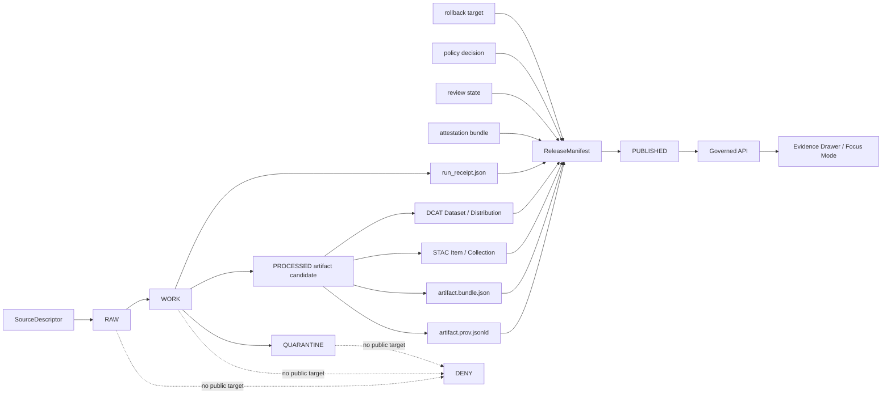

<!-- [KFM_META_BLOCK_V2]
doc_id: kfm://doc/adr/prov-stac-dcat-catalog-mapping
title: ADR — PROV, STAC, DCAT, and ReleaseManifest Catalog Mapping
type: adr
version: v1.2-draft
status: draft
owners: [TODO-NEEDS-OWNER]
created: TODO-NEEDS-REPO-HISTORY
updated: 2026-04-27
policy_label: public
repo_evidence_mode: CORPUS_ONLY / NO_LOCAL_REPO_EVIDENCE
related: [
  docs/profiles/catalog/kfm-stac-extension-profile.md,
  docs/profiles/catalog/kfm-dcat-profile.md,
  contracts/v1/provenance/kfm_prov_sidecar.schema.json,
  contracts/v1/catalog/dcat/kfm_dcat_dataset.schema.json,
  contracts/v1/catalog/stac/kfm_stac_item.schema.json,
  contracts/v1/release/kfm_release_manifest.schema.json,
  tools/validators/provenance/validate_prov_sidecar.py,
  tools/validators/catalog/validate_dcat_dataset.py,
  tools/validators/catalog/validate_stac_item.py,
  tools/validators/release/validate_release_manifest.py,
  policy/provenance/prov_sidecar_gate.rego,
  policy/catalog/dcat/dcat_dataset_gate.rego,
  policy/catalog/stac/stac_item_gate.rego,
  policy/release/release_manifest_gate.rego,
  tests/fixtures/provenance/valid/minimal.prov.jsonld,
  tests/fixtures/provenance/invalid/missing_license.prov.jsonld,
  tests/fixtures/catalog/dcat/valid/minimal.dataset.jsonld,
  tests/fixtures/catalog/dcat/invalid/restricted_access.dataset.jsonld,
  tests/fixtures/catalog/dcat/invalid/missing_provenance.dataset.jsonld,
  tests/fixtures/catalog/stac/valid/minimal.item.json,
  tests/fixtures/catalog/stac/invalid/missing_evidence_ref.item.json,
  tests/fixtures/catalog/stac/invalid/restricted_policy_label.item.json,
  tests/fixtures/catalog/stac/invalid/missing_provenance_asset.item.json,
  tests/fixtures/release/valid/minimal.release-manifest.json,
  tests/fixtures/release/invalid/missing_provenance_ref.release-manifest.json,
  .github/workflows/provenance-gates.yml
]
tags: [kfm, adr, prov, stac, dcat, provenance, catalog, receipts, evidencebundle, release-manifest]
notes: [Repository paths are implementation targets until confirmed in a mounted KFM checkout. This ADR includes ReleaseManifest closure as part of catalog publication governance.]
[/KFM_META_BLOCK_V2] -->

<a id="top"></a>

# ADR — PROV, STAC, DCAT, and ReleaseManifest Catalog Mapping

> **Purpose:** Define KFM’s publication-safe mapping between artifact provenance, catalog discovery, rights/access posture, and release closure.

<p align="center">
  
  
  
  
</p>

<p align="center">
  <strong>Artifact bytes are not truth by themselves.</strong><br>
  <em>Public catalog discovery must resolve to evidence, provenance, policy, release, correction, and rollback state.</em>
</p>

---

## Impact block

| Field | Value |
| --- | --- |
| **Status** | `draft` |
| **Target path** | `docs/adr/ADR-PROV-STAC-DCAT-CATALOG-MAPPING.md` |
| **Decision type** | Catalog / provenance / release-closure ADR |
| **Evidence mode** | `CORPUS_ONLY / NO_LOCAL_REPO_EVIDENCE` |
| **Owners** | `TODO-NEEDS-OWNER` |
| **Updated** | `2026-04-27` |

> [!IMPORTANT]
> This ADR is a governance and architecture decision record. It does **not** claim implementation exists until the target repository confirms the related schemas, validators, policies, fixtures, and workflow.

---

## Quick jump

- [Executive determination](#executive-determination)
- [Decision](#decision)
- [Scope](#scope)
- [Repo fit](#repo-fit)
- [Object-family separation](#object-family-separation)
- [Mapping model](#mapping-model)
- [Closure contract](#closure-contract)
- [Publication invariants](#publication-invariants)
- [PROV sidecar profile](#prov-sidecar-profile)
- [STAC profile requirements](#stac-profile-requirements)
- [DCAT profile requirements](#dcat-profile-requirements)
- [ReleaseManifest requirements](#releasemanifest-requirements)
- [Validation and gates](#validation-and-gates)
- [Rollback and correction behavior](#rollback-and-correction-behavior)
- [Implementation plan](#implementation-plan)
- [Open questions](#open-questions)
- [Acceptance checklist](#acceptance-checklist)
- [Revision notes](#revision-notes)
- [References](#references)

---

## Executive determination

**CONFIRMED doctrine:** KFM’s public unit of value is the inspectable claim. A public or semi-public statement must be reconstructable to admissible evidence, spatial scope, temporal scope, source role, policy posture, review state, release state, and correction lineage.

**PROPOSED decision:** KFM should require a colocated PROV JSON-LD sidecar for every public or semi-public published artifact. Public STAC/DCAT catalog records should link to the sidecar and to the corresponding `EvidenceBundle`. Release-scoped publication should be closed by a `ReleaseManifest`.

**UNKNOWN implementation depth:** No mounted KFM repository was available for this revision. File paths, schemas, validators, fixtures, Rego policies, workflow names, route names, and UI contract homes remain **PROPOSED** until repository inspection confirms them.

**One-sentence rule:** Catalog metadata may make an artifact discoverable, but it must never become the proof that the artifact is publishable.

[Back to top](#top)

---

## Decision

KFM will represent public artifact provenance using a colocated **PROV JSON-LD sidecar** and will require public STAC and DCAT records to link to that sidecar and to the associated `EvidenceBundle`.

For each public or semi-public `PUBLISHED` artifact, KFM **MUST** be able to resolve:

```text
artifact.ext
artifact.prov.jsonld
artifact.bundle.json
release_manifest.json
stac_item_or_collection.json
dcat_dataset.jsonld
```

The profile maps KFM object families as follows:

| KFM object family | Primary interop representation | Required KFM treatment |
| --- | --- | --- |
| `EvidenceBundle` | `prov:Entity` and linked KFM bundle JSON | Remains the public unit of inspection. |
| Published artifact | `prov:Entity`, STAC Asset, DCAT Distribution | Must resolve hash, rights, access, provenance, and evidence references. |
| Pipeline run | `prov:Activity` | Must identify inputs, outputs, timestamps, pipeline identity, and run receipt. |
| Signer / reviewer / system | `prov:Agent` or KFM identity reference | Must not be reduced to unverifiable prose when policy requires identity. |
| `RunReceipt` | Linked process-memory entity | Must remain separate from proof and attestation objects. |
| Attestation bundle | Release-significant verification object | Must remain separate from catalog prose. |
| STAC Item / Collection | Geospatial discovery catalog | Must link to provenance and evidence. |
| DCAT Dataset / Distribution | Portal/open-data catalog | Must carry license, access-rights, distribution, and provenance posture. |
| `ReleaseManifest` | Publication closure object | Must bind artifact, evidence, PROV, STAC, DCAT, receipts, review, and rollback. |

[Back to top](#top)

---

## Scope

### In scope

- Public and semi-public artifacts in `PUBLISHED` state.
- STAC Item / Collection records describing public-safe KFM geospatial assets.
- DCAT Dataset / Distribution records exposing public-safe catalog metadata.
- PROV JSON-LD sidecars for lineage, activity, agent, and input/output relationships.
- ReleaseManifest closure across artifact, evidence, provenance, catalog, receipts, and attestations.
- Negative gates for missing evidence, rights, provenance, policy, release, sensitivity, or closure.

### Exclusions

- Public catalog targets for RAW, WORK, QUARANTINE, or unpublished candidate material.
- Direct UI access to canonical/internal stores.
- Generated AI summaries as provenance evidence.
- Treating STAC, DCAT, PROV, or ReleaseManifest as replacements for KFM review, correction, or proof records.
- Claiming current implementation behavior without repository evidence.

[Back to top](#top)

---

## Repo fit

| Surface | Proposed path | Upstream / downstream role |
| --- | --- | --- |
| ADR | `docs/adr/ADR-PROV-STAC-DCAT-CATALOG-MAPPING.md` | Governs profile, schema, validator, policy, and workflow alignment. |
| PROV schema | `contracts/v1/provenance/kfm_prov_sidecar.schema.json` | Shapes provenance sidecars consumed by validators and policy gates. |
| STAC schema | `contracts/v1/catalog/stac/kfm_stac_item.schema.json` | Shapes public-safe STAC item exports. |
| DCAT schema | `contracts/v1/catalog/dcat/kfm_dcat_dataset.schema.json` | Shapes public-safe DCAT dataset exports. |
| Release schema | `contracts/v1/release/kfm_release_manifest.schema.json` | Shapes release closure objects. |
| Validators | `tools/validators/**` | Enforce schema and KFM-specific closure rules. |
| Policy gates | `policy/**` | Express fail-closed publication rules. |
| Fixtures | `tests/fixtures/**` | Prove positive and negative publication behavior. |
| CI | `.github/workflows/provenance-gates.yml` | Runs schema, validator, and policy gates. |

> [!NOTE]
> All paths above are **PROPOSED** until confirmed against the mounted repository’s actual layout and naming conventions.

[Back to top](#top)

---

## Object-family separation

KFM must not collapse operational memory, evidence, proof, discovery, release, correction, and presentation into one record.

| KFM surface | Role | Collapse risk this ADR avoids |
| --- | --- | --- |
| Artifact | Released bytes or derived output | Treating rendered bytes as truth by themselves. |
| EvidenceBundle | Public unit of inspection | Replacing evidence with generated prose. |
| RunReceipt | Process memory | Treating logs as release proof. |
| Attestation / ProofPack | Release-significant verification | Hiding integrity checks behind catalog text. |
| Catalog record | Discovery and access metadata | Treating search metadata as provenance. |
| ReleaseManifest | Promotion closure and rollback target | Publishing detached assets with no governed transition. |
| CorrectionNotice | Public accountability | Allowing stale artifacts to remain current. |
| RollbackPlan | Reversal target | Making publication irreversible or undocumented. |

[Back to top](#top)

---

## Mapping model



[Back to top](#top)

---

## Closure contract

A public artifact is not outward-ready until these references close without guesswork:

| Closure check | Required result |
| --- | --- |
| Artifact → PROV | Artifact has a resolvable provenance sidecar. |
| Artifact → EvidenceBundle | Artifact has a resolvable inspection bundle. |
| Artifact → STAC | STAC record links provenance, evidence, and release manifest. |
| Artifact → DCAT | DCAT record carries public-safe rights, access, distribution, and provenance. |
| Artifact → ReleaseManifest | ReleaseManifest binds artifact, evidence, PROV, STAC, DCAT, and receipts. |
| ReleaseManifest → rollback | Release scope carries rollback target or documented exception. |
| Policy → publication | Policy permits publication and exposes no restricted fields. |

| Outcome | Meaning | Public behavior |
| --- | --- | --- |
| `PUBLISHABLE` | Evidence, rights, sensitivity, catalog, provenance, release, and rollback closure pass. | Expose through governed catalog/API/UI. |
| `ABSTAIN` | Evidence or resolver closure is insufficient. | Do not publish; explain needed evidence. |
| `DENY` | Policy, rights, sensitivity, release, or security gate blocks publication. | Do not publish; emit denial reason. |
| `ERROR` | Technical validation or resolver failure prevents reliable decision. | Do not publish. |

[Back to top](#top)

---

## Publication invariants

Public publication **MUST fail closed** when any condition is true:

- provenance sidecar is missing
- `kfm:spec_hash` is missing from required artifact, catalog, release, or provenance surfaces
- artifact license is unknown, unresolved, or incompatible with public release
- `dct:accessRights` is missing, uncontrolled, or incompatible with public release
- activity input references are missing or cannot resolve
- public catalog references `RAW`, `WORK`, or `QUARANTINE` material
- restricted geometry or restricted fields leak into public DTOs, tiles, exports, catalog records, story nodes, or popups
- required `EvidenceBundle` cannot resolve
- required attestation is missing
- ReleaseManifest does not bind artifact, PROV, EvidenceBundle, STAC, DCAT, receipt, review, and rollback references
- correction, supersession, or withdrawal status requires suppression but artifact remains discoverable as current
- generated language is being used as proof

> [!CAUTION]
> Public-safe discovery metadata is still publication. STAC/DCAT records must pass the same rights, sensitivity, review, and release posture as maps, tiles, exports, and API payloads.

[Back to top](#top)

---

## PROV sidecar profile

The PROV sidecar **MUST** identify:

| Required element | Representation |
| --- | --- |
| Generated artifact | `prov:Entity` with `prov:type = kfm:EvidenceBundle` |
| Generation run | `prov:Activity` |
| Signer / system / reviewer | `prov:Agent` |
| Generation relation | `wasGeneratedBy` |
| Attribution relation | `wasAttributedTo` |
| Input usage | `prov:used` and optional explicit `used[]` |
| Derivation | Optional `wasDerivedFrom[]` |
| Publication context | `kfm:publication_context` |
| Catalog references | `kfm:catalog_refs.stac`, `kfm:catalog_refs.dcat` |

Minimum governed fields:

```json
{
  "kfm:spec_hash": "sha256:...",
  "kfm:evidence_ref": "kfm://evidence/...",
  "kfm:run_receipt_ref": "kfm://receipt/run/...",
  "kfm:release_manifest_ref": "kfm://release/...",
  "kfm:policy_label": "public",
  "kfm:review_state": "reviewed",
  "kfm:sensitivity": "public"
}
```

<details>
<summary>Illustrative sidecar relationship summary</summary>

```text
EvidenceBundle entity
  ├─ wasGeneratedBy → PipelineRun activity
  ├─ wasAttributedTo → signer/system/reviewer agent
  ├─ used → input spec / source descriptor / evidence refs
  └─ wasDerivedFrom → source or spec entity
```

</details>

[Back to top](#top)

---

## STAC profile requirements

STAC records are discovery records. They do not replace KFM evidence, review, policy, or release state.

Required KFM STAC properties:

```json
{
  "kfm:spec_hash": "sha256:...",
  "kfm:evidence_ref": "kfm://evidence/...",
  "kfm:run_receipt_url": "https://example.invalid/artifact.prov.jsonld",
  "kfm:release_manifest_ref": "kfm://release/...",
  "kfm:policy_label": "public",
  "kfm:review_state": "reviewed",
  "kfm:source_role": "authoritative_source",
  "kfm:sensitivity": "public",
  "processing:software": "kfm-pipeline",
  "processing:version": "v1",
  "processing:datetime": "2026-04-27T00:00:00Z"
}
```

Required links:

```json
[
  { "rel": "provenance", "href": "https://example.invalid/artifact.prov.jsonld" },
  { "rel": "evidence", "href": "https://example.invalid/evidence.json" },
  { "rel": "release-manifest", "href": "https://example.invalid/release-manifest.json" }
]
```

Required assets:

```json
{
  "assets": {
    "data": {
      "href": "https://example.invalid/artifact.ext",
      "roles": ["data"]
    },
    "provenance": {
      "href": "https://example.invalid/artifact.prov.jsonld",
      "roles": ["metadata", "provenance"]
    }
  }
}
```

> [!IMPORTANT]
> A provenance link alone is not enough for KFM STAC publication. The `assets.provenance` entry must also be present when the profile requires materialized provenance for Evidence Drawer, offline validation, or release closure.

[Back to top](#top)

---

## DCAT profile requirements

DCAT records expose dataset/distribution metadata and rights/access posture.

Required DCAT fields:

```json
{
  "@type": "dcat:Dataset",
  "dct:title": "KFM public dataset",
  "dct:identifier": "kfm://dataset/...",
  "dct:license": "https://spdx.org/licenses/CC-BY-4.0.html",
  "dct:accessRights": "public",
  "dct:provenance": "https://example.invalid/artifact.prov.jsonld",
  "kfm:spec_hash": "sha256:...",
  "kfm:evidence_ref": "kfm://evidence/...",
  "kfm:release_manifest_ref": "kfm://release/...",
  "kfm:policy_label": "public",
  "kfm:review_state": "reviewed",
  "kfm:source_role": "authoritative_source",
  "kfm:sensitivity": "public"
}
```

Required distribution behavior:

```json
{
  "@type": "dcat:Distribution",
  "dcat:accessURL": "https://example.invalid/artifact.ext",
  "dct:license": "https://spdx.org/licenses/CC-BY-4.0.html"
}
```

Distribution license must match dataset license unless an explicit reviewed exception is later modeled.

[Back to top](#top)

---

## ReleaseManifest requirements

ReleaseManifest is the closure object that binds the published artifact graph.

Required release fields:

```json
{
  "manifest_id": "kfm://release-manifest/...",
  "release_id": "kfm://release/...",
  "created_at": "2026-04-27T00:00:00Z",
  "policy_label": "public",
  "review_state": "reviewed",
  "spec_hash": "sha256:...",
  "artifacts": []
}
```

Each artifact entry **MUST** include:

```json
{
  "artifact_ref": "https://example.invalid/artifact.ext",
  "spec_hash": "sha256:...",
  "evidence_ref": "kfm://evidence/...",
  "provenance_ref": "https://example.invalid/artifact.prov.jsonld",
  "stac_ref": "kfm://catalog/stac/...",
  "dcat_ref": "kfm://catalog/dcat/...",
  "run_receipt_ref": "kfm://receipt/run/...",
  "policy_label": "public",
  "review_state": "reviewed",
  "sensitivity": "public"
}
```

ReleaseManifest validation **MUST** deny:

- missing provenance reference
- missing evidence reference
- missing STAC reference
- missing DCAT reference
- `policy_label != public`
- `review_state` not `reviewed` or `published`
- sensitivity not `public`
- artifact `spec_hash` mismatch with manifest-level `spec_hash`
- RAW / WORK / QUARANTINE references

[Back to top](#top)

---

## Validation and gates

Positive-path targets:

```bash
python tools/validators/provenance/validate_prov_sidecar.py \
  tests/fixtures/provenance/valid/minimal.prov.jsonld

python tools/validators/catalog/validate_dcat_dataset.py \
  tests/fixtures/catalog/dcat/valid/minimal.dataset.jsonld

python tools/validators/catalog/validate_stac_item.py \
  tests/fixtures/catalog/stac/valid/minimal.item.json

python tools/validators/release/validate_release_manifest.py \
  tests/fixtures/release/valid/minimal.release-manifest.json
```

Policy gates:

```bash
conftest test tests/fixtures/provenance/valid/minimal.prov.jsonld --policy policy/provenance
conftest test tests/fixtures/catalog/dcat/valid/minimal.dataset.jsonld --policy policy/catalog/dcat
conftest test tests/fixtures/catalog/stac/valid/minimal.item.json --policy policy/catalog/stac
conftest test tests/fixtures/release/valid/minimal.release-manifest.json --policy policy/release
```

Minimum denial fixtures:

| Fixture | Expected result |
| --- | --- |
| `tests/fixtures/provenance/invalid/missing_license.prov.jsonld` | `DENY` |
| `tests/fixtures/catalog/dcat/invalid/restricted_access.dataset.jsonld` | `DENY` |
| `tests/fixtures/catalog/dcat/invalid/missing_provenance.dataset.jsonld` | `DENY` |
| `tests/fixtures/catalog/stac/invalid/missing_evidence_ref.item.json` | `DENY` |
| `tests/fixtures/catalog/stac/invalid/restricted_policy_label.item.json` | `DENY` |
| `tests/fixtures/catalog/stac/invalid/missing_provenance_asset.item.json` | `DENY` |
| `tests/fixtures/release/invalid/missing_provenance_ref.release-manifest.json` | `DENY` |

[Back to top](#top)

---

## Rollback and correction behavior

Publication closure must remain reversible.

| Scenario | Required behavior |
| --- | --- |
| Artifact fails post-publication rights review | Mark withdrawn, suppress current discovery, emit correction notice, bind rollback target. |
| Artifact superseded by newer release | Mark prior artifact superseded, keep audit path, point current catalog to newer release. |
| Sensitive geometry leak found | Withdraw or generalize, emit redaction receipt, rebuild STAC/DCAT/tiles/exports. |
| PROV sidecar invalid | Suppress artifact as current until repaired and repromoted. |
| EvidenceBundle resolver breaks | Return `ABSTAIN` or `ERROR`; do not make consequential UI/AI claims. |
| Attestation invalid | Deny or withdraw publication according to release policy. |

Rollback must update all outward-facing references: STAC, DCAT, governed API, Evidence Drawer payloads, story exports, map popups, search indexes, and any public current alias.

[Back to top](#top)

---

## Implementation plan

| Step | Artifact | Status before repo verification |
| --- | --- | --- |
| 1 | Add this ADR | PROPOSED |
| 2 | Add PROV schema + fixtures + validator + policy | PROPOSED |
| 3 | Add DCAT schema + fixtures + validator + policy | PROPOSED |
| 4 | Add STAC schema + fixtures + validator + policy | PROPOSED |
| 5 | Add ReleaseManifest schema + fixtures + validator + policy | PROPOSED |
| 6 | Add `.github/workflows/provenance-gates.yml` | PROPOSED |
| 7 | Add catalog profile docs for STAC/DCAT | PROPOSED |
| 8 | Add resolver-level closure checks | PROPOSED |
| 9 | Add Evidence Drawer / Focus Mode provenance references | PROPOSED |
| 10 | Add rollback/correction fixture release | PROPOSED |

[Back to top](#top)

---

## Open questions

| Question | Current posture | Needed decision |
| --- | --- | --- |
| Canonical JSON standard for `spec_hash` | PROPOSED: JCS / RFC 8785 | Confirm serialization and excluded volatile fields. |
| Attestation baseline | PROPOSED: DSSE / Cosign / Sigstore family | Decide signer identity, key strategy, and mandatory cases. |
| Access-rights vocabulary | NEEDS VERIFICATION | Create controlled vocabulary ADR. |
| Schema authority path | NEEDS VERIFICATION | Confirm `contracts/`, `schemas/`, or `contracts/v1/`. |
| STAC extension URI | NEEDS VERIFICATION | Define official extension URI and linting policy. |
| Resolver URL policy | PROPOSED | Decide direct URLs vs governed resolver URLs. |
| ReleaseManifest relationship to CatalogMatrix | PROPOSED | Decide whether closure matrix is release object, catalog object, or both. |

[Back to top](#top)

---

## Acceptance checklist

This ADR can move from `draft` to `review` when:

- [ ] owner is assigned
- [ ] `created` date is confirmed from repo history
- [ ] schema home decision is confirmed
- [ ] PROV sidecar schema exists
- [ ] DCAT schema exists
- [ ] STAC schema exists
- [ ] ReleaseManifest schema exists
- [ ] validators exist and run locally
- [ ] policy gates exist and deny minimum failure cases
- [ ] CI workflow runs positive and negative gates
- [ ] STAC profile references this ADR
- [ ] DCAT profile references this ADR
- [ ] Evidence Drawer / Focus Mode contracts know how to resolve provenance and evidence references

This ADR can move from `review` to `published` when:

- [ ] one offline fixture release proves artifact → PROV → EvidenceBundle → STAC → DCAT → ReleaseManifest closure
- [ ] rollback target and correction behavior are tested
- [ ] public catalog output is verified not to reference RAW / WORK / QUARANTINE
- [ ] rights and sensitivity checks pass for the fixture release
- [ ] unresolved EvidenceBundle returns finite negative state
- [ ] withdrawn/superseded current visibility behavior is tested

[Back to top](#top)

---

## Revision notes

### v1.2-draft

- Adds ReleaseManifest closure as a first-class publication requirement.
- Adds DCAT, STAC, and ReleaseManifest schema/validator/policy paths.
- Adds missing provenance asset STAC fixture.
- Adds ReleaseManifest valid and invalid fixtures.
- Strengthens acceptance criteria around full artifact → catalog → release closure.

[Back to top](#top)

---

## References

- OGC — SpatioTemporal Asset Catalog (STAC)
- W3C — Data Catalog Vocabulary (DCAT)
- W3C — PROV-O: The PROV Ontology
- RFC 8785 — JSON Canonicalization Scheme

[Back to top](#top)
