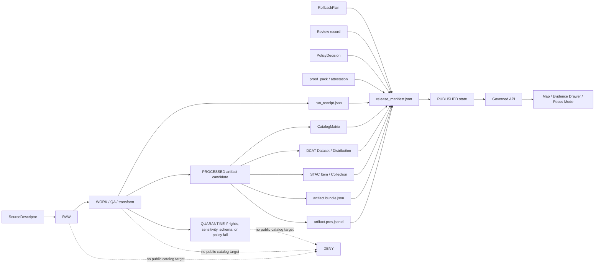

<!-- [KFM_META_BLOCK_V2]
doc_id: kfm://doc/adr/prov-stac-dcat-catalog-mapping
title: ADR — PROV, STAC, and DCAT Catalog Mapping
type: adr
version: v1.1-draft
status: draft
owners: [TODO-NEEDS-OWNER]
created: TODO-NEEDS-REPO-HISTORY
updated: 2026-04-27
policy_label: public
repo_evidence_mode: CORPUS_ONLY / NO_LOCAL_REPO_EVIDENCE
related: [
  docs/profiles/catalog/kfm-stac-extension-profile.md,
  docs/profiles/catalog/kfm-dcat-profile.md,
  contracts/v1/provenance/kfm_prov_sidecar.schema.json,
  tools/validators/provenance/validate_prov_sidecar.py,
  policy/provenance/prov_sidecar_gate.rego,
  tests/fixtures/provenance/valid/minimal.prov.jsonld,
  tests/fixtures/provenance/invalid/missing_license.prov.jsonld,
  tests/fixtures/provenance/invalid/raw_catalog_target.prov.jsonld,
  tests/fixtures/provenance/invalid/unresolved_evidence_bundle.prov.jsonld,
  .github/workflows/provenance-gates.yml
]
tags: [kfm, adr, prov, stac, dcat, provenance, catalog, receipts, evidencebundle, release-manifest]
notes: [All related repository paths are PROPOSED until a mounted KFM checkout confirms schema, validator, policy, fixture, workflow, and documentation homes.]
[/KFM_META_BLOCK_V2] -->

<a id="top"></a>

# ADR — PROV, STAC, and DCAT Catalog Mapping

> **Status:** Draft  
> **Evidence mode:** `CORPUS_ONLY / NO_LOCAL_REPO_EVIDENCE`  
> **Target path:** `docs/adr/ADR-PROV-STAC-DCAT-CATALOG-MAPPING.md`  
> **Decision type:** Catalog / provenance / publication-control ADR

KFM public artifacts need one inspectable provenance spine that keeps evidence, process memory, catalog discovery, rights, sensitivity, review, release state, correction lineage, and rollback connected without collapsing them into one object.

This ADR chooses the mapping pattern for **PROV**, **STAC**, and **DCAT**. It does not claim that any related repository files already exist.

<p align="center">
  <strong>Artifact bytes are not truth by themselves.</strong><br>
  <em>Public catalog discovery must resolve to evidence, provenance, policy, release, correction, and rollback state.</em>
</p>

---

## Quick links

- [Executive determination](#executive-determination)
- [Decision](#decision)
- [Scope](#scope)
- [Standards posture](#standards-posture)
- [Object-family separation](#object-family-separation)
- [Mapping model](#mapping-model)
- [Closure contract](#closure-contract)
- [Publication invariants](#publication-invariants)
- [PROV sidecar profile](#prov-sidecar-profile)
- [STAC profile requirements](#stac-profile-requirements)
- [DCAT profile requirements](#dcat-profile-requirements)
- [Evidence Drawer and Focus Mode impact](#evidence-drawer-and-focus-mode-impact)
- [Implementation plan](#implementation-plan)
- [Validation and gates](#validation-and-gates)
- [Rollback and correction behavior](#rollback-and-correction-behavior)
- [Open questions](#open-questions)
- [Acceptance checklist](#acceptance-checklist)
- [References](#references)

---

## Executive determination

**CONFIRMED doctrine:** KFM’s public unit of value is the inspectable claim. A public or semi-public statement must be reconstructable to admissible evidence, spatial scope, temporal scope, source role, policy posture, review state, release state, and correction lineage.

**CONFIRMED standards basis:** PROV-O, STAC, and DCAT each solve a different interoperability problem. PROV-O supports provenance modeling across entities, activities, and agents. STAC supports discovery and traversal of geospatial asset metadata. DCAT supports data-catalog interoperability, dataset/distribution metadata, access posture, and federation.

**PROPOSED decision:** KFM should require a colocated PROV JSON-LD sidecar for every public or semi-public published artifact, and public STAC/DCAT catalog records should link to the sidecar and to the corresponding `EvidenceBundle`.

**UNKNOWN implementation depth:** No mounted KFM repository is available in this session. File paths, schema homes, validators, fixtures, Rego policies, workflow names, route names, and UI contract homes are therefore **PROPOSED** unless later confirmed by repository inspection.

**One-sentence rule:** Catalog metadata may make an artifact discoverable, but it must never become the proof that the artifact is publishable.

[Back to top](#top)

---

## Context

KFM is governed by an evidence-first publication posture. Public-facing claims and artifacts should resolve to:

- admissible evidence
- source role
- spatial scope
- temporal scope
- rights and access posture
- sensitivity posture
- validation results
- review state
- release state
- correction lineage
- rollback target or documented rollback exception

This ADR binds that posture to interoperable exports:

| Standard surface | KFM role | What it must not replace |
| --- | --- | --- |
| **PROV / PROV-O** | Lineage model for entities, activities, and agents | KFM policy decision, proof pack, review record, or release manifest |
| **STAC** | Geospatial asset discovery and traversal | EvidenceBundle, sensitivity review, or rights approval |
| **DCAT** | Dataset/distribution catalog metadata and access-rights posture | Source registry, release proof, or correction/withdrawal workflow |

> [!IMPORTANT]
> This ADR is a mapping decision, not implementation proof. The named schema, validator, Rego policy, fixture, profile, and workflow files become **CONFIRMED** only after a mounted repo inspection and passing validation.

[Back to top](#top)

---

## Decision

KFM will represent public artifact provenance using a colocated **PROV JSON-LD sidecar** and will require public STAC and DCAT records to link to that sidecar and to the associated `EvidenceBundle`.

For each public or semi-public `PUBLISHED` artifact, KFM **MUST** be able to resolve this minimum artifact set:

```text
artifact.ext
artifact.prov.jsonld
artifact.bundle.json
```

For release-scoped publication, KFM **SHOULD** also resolve the artifact through release-level process and proof objects:

```text
run_receipt.json
release_manifest.json
proof_pack.json | attestation bundle
stac_item_or_collection.json
dcat_dataset.jsonld
catalog_matrix.json
rollback_plan.json | rollback note
```

The profile maps KFM object families as follows:

| KFM object family | Primary interop representation | Required KFM treatment |
| --- | --- | --- |
| `EvidenceBundle` | `prov:Entity` and linked KFM bundle JSON | Remains the public unit of inspection. |
| Published artifact | `prov:Entity`, STAC Asset, DCAT Distribution | Must carry or resolve `kfm:spec_hash`, rights, access, checksums, provenance, and evidence references. |
| Pipeline run | `prov:Activity` | Must identify inputs, outputs, timestamps, software/process identity, run receipt reference, and actor/agent where applicable. |
| System, steward, signer, reviewer | `prov:Agent` or qualified KFM identity reference | Must not be reduced to unverifiable free text when attestation or review policy requires identity. |
| `RunReceipt` | Linked process-memory entity | Must stay distinguishable from proof and attestation objects. |
| `ProofPack` / attestation bundle | Release-significant verification object | Must stay distinguishable from logs and catalog prose. |
| STAC Item / Collection | Geospatial discovery catalog | Must link to full provenance and evidence. |
| DCAT Dataset / Distribution | Open-data / portal catalog | Must carry license, access-rights, distribution, checksum, and provenance posture. |
| `ReleaseManifest` | Promotion closure and rollback target | Must bind artifact, catalog, evidence, proof, policy, correction state, and rollback. |
| `CorrectionNotice` / withdrawal record | Human and policy accountability | Must prevent stale artifacts from remaining discoverable as current. |

### Decision boundary

This ADR chooses the mapping pattern. It does **not** finalize:

- the canonical serialization and hash input set for `kfm:spec_hash`
- the attestation baseline, signer identity, or key-management strategy
- the accepted controlled vocabulary for `dct:accessRights`
- the final schema home if the repository has competing `contracts/` and `schemas/` conventions
- the final STAC extension URI and linting policy for every `kfm:*` field
- the authoritative route names for KFM catalog, evidence, or provenance resolution

Those remain [open questions](#open-questions).

[Back to top](#top)

---

## Scope

### In scope

- Public and semi-public artifacts in `PUBLISHED` state.
- STAC Item / Collection records that describe public-safe KFM geospatial assets.
- DCAT Dataset / Distribution records that expose KFM catalog metadata.
- PROV JSON-LD sidecars for lineage, generation activity, agent, and input/output relationships.
- Resolver requirements from catalog records to `EvidenceBundle`, `RunReceipt`, `ReleaseManifest`, `ProofPack`, correction state, and rollback target.
- Negative publication gates for missing evidence, rights, provenance, policy, release, or sensitivity closure.

### Out of scope

- Public catalog targets for RAW, WORK, QUARANTINE, or unpublished candidate material.
- Direct UI access to canonical/internal stores.
- Generated AI summaries as provenance evidence.
- Treating STAC, DCAT, or PROV as replacements for KFM review, policy, promotion, release, rollback, or correction records.
- Finalizing per-domain catalog fields for hydrology, fauna, archaeology, roads, settlements, people/land, or other domain lanes.
- Claiming current implementation behavior without repository evidence.

[Back to top](#top)

---

## Rationale

### 1. Evidence-first governance

`EvidenceBundle` remains the public unit of inspection. Catalog and provenance exports should make inspection easier, not replace it.

### 2. Portable provenance

PROV gives KFM a standard entity/activity/agent model while allowing receipts, proof packs, catalog records, release manifests, review records, correction notices, and rollback plans to remain separate KFM objects.

### 3. Catalog interoperability

STAC and DCAT consumers can harvest public-safe metadata while deeper provenance and evidence remain available through explicit links.

### 4. Safe public discovery

Discovery metadata is still publication. A catalog record that leaks restricted geometry, unclear rights, sensitive fields, or stale current-state claims violates the same trust boundary as a public tile, export, or API response.

[Back to top](#top)

---

## Standards posture

| Surface | Current posture | KFM implication |
| --- | --- | --- |
| STAC Core | Use STAC 1.1.0 as the current OGC Community Standard target unless repo tooling requires a pinned compatibility exception. | KFM STAC records should remain valid STAC and use a declared KFM extension for `kfm:*` properties. |
| STAC API | Treat STAC API 1.0.0 as optional service-surface support, not required for static catalog publication. | KFM can ship static STAC files first, then add a governed API if needed. |
| DCAT | Use DCAT 3 as the current W3C Recommendation target. | KFM DCAT records should include dataset/distribution, license, access-rights, and checksum posture where applicable. |
| PROV-O | Use PROV-O as the RDF/OWL provenance vocabulary baseline. | KFM sidecars should use `prov:Entity`, `prov:Activity`, `prov:Agent`, `prov:used`, `prov:wasGeneratedBy`, and `prov:wasAssociatedWith`. |
| JCS / RFC 8785 | **PROPOSED** canonical JSON serialization candidate for hashable JSON. | Keep as an open decision until KFM confirms hash inputs and repository tooling. |
| DSSE / Cosign / Sigstore | **PROPOSED / NEEDS VERIFICATION** attestation family. | This ADR links to attestation objects but does not require a signer toolchain. |
| JSON Schema | **PROPOSED** validator substrate for the sidecar skeleton. | Schema validates shape; resolver and policy gates validate closure. |
| OPA/Rego | **PROPOSED** publication policy substrate. | Rego may express fail-closed gates, but repo policy tooling must be verified first. |

[Back to top](#top)

---

## Object-family separation

KFM must not collapse operational memory, evidence, proof, discovery, release, correction, and presentation into one record.

| KFM surface | Role | Collapse risk this ADR avoids |
| --- | --- | --- |
| Artifact | Released bytes or derived output | Treating rendered/output bytes as self-explaining truth. |
| EvidenceBundle | Public unit of inspection | Replacing inspectable evidence with generated prose. |
| RunReceipt | Process memory | Treating operational logs as release proof. |
| ProofPack / attestation | Release-significant verification | Hiding integrity checks behind catalog prose. |
| Catalog record | Discovery and access metadata | Treating search metadata as provenance. |
| ReleaseManifest | Promotion closure and rollback target | Publishing detached assets with no governed state transition. |
| Review record | Human accountability | Losing reviewer state after publication. |
| CorrectionNotice / withdrawal | Public correction and suppression state | Allowing stale or withdrawn artifacts to remain discoverable as current. |
| RollbackPlan | Reversal target | Making publication irreversible or undocumented. |

[Back to top](#top)

---

## Mapping model



### Minimal closure rule

A public artifact is not outward-ready until the following references close without guesswork:

| Closure check | Required result |
| --- | --- |
| Artifact → PROV | Artifact has a resolvable provenance sidecar. |
| Artifact → EvidenceBundle | Artifact has a resolvable inspection bundle. |
| Artifact → checksum | Released bytes match expected digest. |
| STAC → PROV / EvidenceBundle | STAC links or extension fields include provenance and evidence/attestation references. |
| DCAT → Distribution | DCAT distribution resolves to public-safe artifact or governed access URL. |
| DCAT → rights | `dct:license` and `dct:accessRights` are non-empty, controlled, and policy-approved. |
| PROV → activity inputs | Generation activity identifies inputs or abstains from publication. |
| ReleaseManifest → rollback | Release scope carries rollback target or documented exception. |
| Policy → publication | Policy decision permits publication and does not expose restricted fields. |
| Correction state → current visibility | Superseded, withdrawn, or corrected artifacts cannot remain discoverable as current. |

[Back to top](#top)

---

## Closure contract

KFM should treat publication closure as a finite contract, not a loose best-effort check.

| Outcome | Meaning | Public behavior |
| --- | --- | --- |
| `PUBLISHABLE` | Evidence, rights, sensitivity, catalog, provenance, release, and rollback closure pass. | Artifact can be exposed through governed catalog/API/UI. |
| `ABSTAIN` | Evidence or resolver closure is insufficient for the claim or artifact scope. | Do not publish; emit explanation and needed evidence. |
| `DENY` | Policy, rights, sensitivity, release, or security gate blocks publication. | Do not publish; emit denial reason and quarantine or correction path. |
| `ERROR` | Technical validation or resolver failure prevents a reliable decision. | Do not publish; emit operational failure reason. |

[Back to top](#top)

---

## Publication invariants

Public publication **MUST fail closed** when any of these conditions are true:

- provenance sidecar is missing
- `kfm:spec_hash` is missing from required artifact, catalog, release, or provenance surfaces
- artifact checksum is missing where byte integrity matters
- artifact license is unknown, unresolved, or incompatible with the public surface
- `dct:accessRights` is missing, uncontrolled, or incompatible with the public surface
- activity input references are missing or cannot resolve
- public catalog references `RAW`, `WORK`, or `QUARANTINE` material
- restricted geometry or restricted fields leak into public DTOs, tiles, exports, catalog records, story nodes, or popups
- provenance links cannot resolve
- required `EvidenceBundle` cannot resolve
- required attestation is missing
- release manifest does not bind catalog, proof, policy, review, correction, and rollback references
- correction, supersession, or withdrawal status requires suppression but artifact remains discoverable as current
- generated language is being used as proof

> [!CAUTION]
> Public-safe discovery metadata is still publication. STAC/DCAT records must pass the same rights, sensitivity, review, and release posture as maps, tiles, exports, and API payloads.

[Back to top](#top)

---

## PROV sidecar profile

The sidecar **MUST** identify the artifact as a `prov:Entity`, the generation run as a `prov:Activity`, and relevant systems, reviewers, signers, or stewards as `prov:Agent` records or resolvable references.

### Minimum sidecar fields

| Field / relation | Requirement |
| --- | --- |
| `@context` | Includes PROV, DC Terms, KFM extension terms, and any required vocabulary prefixes. |
| `@id` | Stable URI or URN for the artifact entity. |
| `@type` | Includes `prov:Entity`. |
| `dct:title` | Human-readable artifact title. |
| `dct:license` | Non-empty license IRI or controlled license identifier before publication. |
| `dct:accessRights` | Controlled value before publication. |
| `kfm:spec_hash` | Deterministic hash for artifact specification or release candidate. |
| `kfm:lifecycle_state` | Must not be `RAW`, `WORK`, or `QUARANTINE` for public catalog targets. |
| `kfm:artifact_ref` | Public-safe artifact URL or governed access URL plus media type and checksum. |
| `kfm:evidence_bundle_ref` | Resolves to public inspection bundle. |
| `kfm:run_receipt_ref` | Links to process memory without treating receipt as proof. |
| `kfm:release_manifest_ref` | Required when artifact is part of release-scoped publication. |
| `kfm:policy_decision_ref` | Required when publication depends on policy evaluation. |
| `prov:wasGeneratedBy` | Links artifact entity to pipeline activity. |
| `prov:used` | Links activity to source descriptors, input artifacts, or evidence refs. |
| `prov:wasAssociatedWith` | Links activity to system, reviewer, signer, or steward agents when required. |

<details>
<summary>Illustrative minimal PROV JSON-LD sidecar</summary>

This example is illustrative. URI patterns, KFM fields, and exact schema requirements remain **PROPOSED** until accepted by repository schema and profile owners.

```json
{
  "@context": {
    "prov": "http://www.w3.org/ns/prov#",
    "dct": "http://purl.org/dc/terms/",
    "spdx": "http://spdx.org/rdf/terms#",
    "kfm": "https://example.invalid/kfm/ns#"
  },
  "@id": "kfm://artifact/example-hydrology-summary",
  "@type": ["prov:Entity", "kfm:PublishedArtifact"],
  "dct:title": "Example public-safe hydrology summary artifact",
  "dct:license": "https://creativecommons.org/licenses/by/4.0/",
  "dct:accessRights": "public",
  "kfm:lifecycle_state": "PUBLISHED",
  "kfm:spec_hash": "sha256:0123456789abcdef0123456789abcdef0123456789abcdef0123456789abcdef",
  "kfm:artifact_ref": {
    "href": "https://example.invalid/published/example-hydrology-summary.parquet",
    "media_type": "application/vnd.apache.parquet",
    "sha256": "0123456789abcdef0123456789abcdef0123456789abcdef0123456789abcdef"
  },
  "kfm:evidence_bundle_ref": "kfm://evidence-bundle/example-hydrology-summary",
  "kfm:run_receipt_ref": "kfm://run-receipt/example-run-20260427",
  "kfm:release_manifest_ref": "kfm://release/example-release-20260427",
  "kfm:policy_decision_ref": "kfm://policy-decision/example-policy-20260427",
  "prov:wasGeneratedBy": {
    "@id": "kfm://activity/example-run-20260427",
    "@type": "prov:Activity",
    "prov:startedAtTime": "2026-04-27T00:00:00Z",
    "prov:endedAtTime": "2026-04-27T00:05:00Z",
    "prov:used": [
      { "@id": "kfm://source-descriptor/example-source" },
      { "@id": "kfm://evidence-ref/example-input" }
    ],
    "prov:wasAssociatedWith": [
      { "@id": "kfm://agent/kfm-pipeline" }
    ]
  }
}
```

</details>

### PROV modeling notes

- Use `prov:wasGeneratedBy` for artifact generation.
- Use `prov:used` for source descriptors, evidence refs, and input artifacts used by the generation activity.
- Use `prov:wasAssociatedWith` for systems, maintainers, stewards, reviewers, or signers associated with a run.
- Use qualified PROV relations when the role of a source, agent, reviewer, signer, or steward materially affects policy or trust state.
- Keep KFM proof and receipt object references explicit; do not hide them as generic prose properties.

[Back to top](#top)

---

## STAC profile requirements

STAC records carry discovery metadata for geospatial assets and link to full KFM provenance and evidence surfaces. They do not replace KFM policy, review, or release state.

### Required KFM extension posture

KFM STAC records **SHOULD** declare a KFM STAC extension once that extension exists:

```json
{
  "stac_extensions": [
    "https://example.invalid/kfm/stac/v1/schema.json"
  ]
}
```

Until that extension is accepted, `kfm:*` fields are **PROPOSED** and must be linted through KFM’s own validation gate rather than treated as standard STAC fields.

### Required KFM extension properties

```json
{
  "kfm:spec_hash": "sha256:0123456789abcdef0123456789abcdef0123456789abcdef0123456789abcdef",
  "kfm:evidence_bundle_url": "https://example.invalid/published/artifact.bundle.json",
  "kfm:provenance_url": "https://example.invalid/published/artifact.prov.jsonld",
  "kfm:run_receipt_url": "https://example.invalid/receipts/run_receipt.json",
  "kfm:release_manifest_url": "https://example.invalid/releases/release_manifest.json",
  "kfm:policy_decision_url": "https://example.invalid/policy/policy_decision.json",
  "kfm:access_rights": "public",
  "kfm:review_state": "reviewed",
  "kfm:correction_state": "current",
  "processing:software": "kfm-pipeline",
  "processing:version": "TODO-NEEDS-REPO-VERSION",
  "processing:datetime": "2026-04-27T00:00:00Z"
}
```

### Required STAC link behavior

KFM profile links are **PROPOSED** until a STAC extension profile accepts the relation names. Where possible, prefer existing IANA/standard link relations; otherwise document the KFM-specific relation in the extension profile.

```json
[
  {
    "rel": "via",
    "href": "https://example.invalid/published/artifact.prov.jsonld",
    "type": "application/ld+json",
    "title": "KFM PROV JSON-LD sidecar"
  },
  {
    "rel": "related",
    "href": "https://example.invalid/published/artifact.bundle.json",
    "type": "application/json",
    "title": "KFM EvidenceBundle"
  },
  {
    "rel": "related",
    "href": "https://example.invalid/releases/release_manifest.json",
    "type": "application/json",
    "title": "KFM ReleaseManifest"
  }
]
```

> [!NOTE]
> `kfm:run_receipt_url` is not a synonym for the PROV sidecar. The receipt records process memory. The PROV sidecar records lineage. A proof or attestation records release-significant verification.

[Back to top](#top)

---

## DCAT profile requirements

DCAT records carry open-data or portal-facing dataset metadata. They must expose access, rights, and distribution posture clearly enough that a public user or downstream catalog can distinguish open, restricted, generalized, staged, superseded, or withdrawn access.

### Required DCAT JSON-LD shape

```json
{
  "@context": {
    "dcat": "http://www.w3.org/ns/dcat#",
    "dct": "http://purl.org/dc/terms/",
    "prov": "http://www.w3.org/ns/prov#",
    "spdx": "http://spdx.org/rdf/terms#",
    "kfm": "https://example.invalid/kfm/ns#"
  },
  "@type": "dcat:Dataset",
  "@id": "kfm://dataset/TODO-DATASET-ID",
  "dct:title": "TODO dataset title",
  "dct:license": "TODO-NEEDS-LICENSE-IRI",
  "dct:accessRights": "TODO-NEEDS-CONTROLLED-VALUE",
  "kfm:spec_hash": "sha256:0123456789abcdef0123456789abcdef0123456789abcdef0123456789abcdef",
  "prov:wasGeneratedBy": "kfm://activity/TODO-RUN-ID",
  "dcat:distribution": [
    {
      "@type": "dcat:Distribution",
      "@id": "kfm://distribution/TODO-DISTRIBUTION-ID",
      "dcat:accessURL": "https://example.invalid/published/artifact.ext",
      "dct:format": "TODO-NEEDS-MEDIA-TYPE",
      "spdx:checksum": {
        "@type": "spdx:Checksum",
        "spdx:algorithm": "spdx:checksumAlgorithm_sha256",
        "spdx:checksumValue": "0123456789abcdef0123456789abcdef0123456789abcdef0123456789abcdef"
      },
      "kfm:provenance_url": "https://example.invalid/published/artifact.prov.jsonld",
      "kfm:evidence_bundle_url": "https://example.invalid/published/artifact.bundle.json",
      "kfm:release_manifest_url": "https://example.invalid/releases/release_manifest.json"
    }
  ]
}
```

### Access-rights posture

`dct:accessRights` **MUST NOT** remain `TODO` for a public release. Until KFM accepts a controlled vocabulary, release candidates that need public catalog exposure remain **NEEDS VERIFICATION**.

Proposed access-rights classes for a follow-on ADR:

| Proposed class | Meaning | Public catalog posture |
| --- | --- | --- |
| `public` | Public-safe artifact and metadata. | Public discoverable. |
| `public_generalized` | Public-safe after documented geometry or field generalization. | Public discoverable with transform receipt. |
| `restricted` | Access-controlled or not publicly discoverable. | Public discovery denied unless policy explicitly permits limited metadata. |
| `staged` | Candidate record; not public release state. | Not public. |
| `superseded` | Replaced by a newer artifact. | Discoverable only with correction/supersession marker. |
| `withdrawn` | Previously published artifact withdrawn. | Suppressed as current; retained only through correction/audit path. |

[Back to top](#top)

---

## Evidence Drawer and Focus Mode impact

Evidence Drawer and Focus Mode payloads **SHOULD** consume the same closure references used by PROV, STAC, DCAT, `CatalogMatrix`, and `ReleaseManifest`.

| UI / AI surface | Required reference behavior |
| --- | --- |
| Evidence Drawer | Resolves `EvidenceBundle`, provenance sidecar, source role, rights, review state, correction lineage, and release state. |
| Focus Mode | Answers only over released, policy-safe context; otherwise returns `ABSTAIN`, `DENY`, or `ERROR`. |
| Map popup | May summarize artifact metadata, but consequential claims must link to Evidence Drawer. |
| Export / story node | Must carry catalog/provenance references or explicitly mark itself as an illustrative derived product. |
| Review console | Must surface unresolved rights, unresolved evidence, missing proof, or correction mismatch before promotion. |

Generated language is never the root truth source. `EvidenceBundle`, policy decision, review state, and release state outrank Focus Mode phrasing.

[Back to top](#top)

---

## Consequences

### Positive

- Clear lineage across artifact, run, evidence, catalog, release, review, correction, and rollback state.
- Harvestable catalog metadata for STAC and DCAT consumers.
- Verifiable provenance sidecars for public artifacts.
- Policy-friendly separation of receipts, proofs, catalogs, release manifests, and artifacts.
- Compatible with Evidence Drawer and Focus Mode trust surfaces.
- Supports rollback and correction review because release closure remains inspectable.
- Reduces risk that generated language, rendered maps, search indexes, or catalog prose are mistaken for sovereign truth.

### Tradeoffs

- Adds at least one required sidecar and one inspection bundle per public artifact.
- Requires catalog-closure validation rather than simple file publication.
- Requires stable schema and validator ownership.
- Requires controlled vocabulary decisions for `dct:accessRights`.
- Requires follow-on work for STAC extension documentation and DCAT profile examples.
- Requires stronger release discipline around supersession, withdrawal, and rollback.

[Back to top](#top)

---

## Implementation plan

The implementation should land as small, reversible changes.

| Step | Artifact | Status before repo verification | Notes |
| --- | --- | --- | --- |
| 1 | Add this ADR | **PROPOSED** | Confirm `docs/adr/` convention before committing. |
| 2 | Add / confirm PROV sidecar schema | **PROPOSED** | Suggested starter path: `contracts/v1/provenance/kfm_prov_sidecar.schema.json`. |
| 3 | Add valid and invalid PROV fixtures | **PROPOSED** | Include missing license, missing spec hash, unresolved evidence, and RAW target cases. |
| 4 | Add Python validator or repo-native equivalent | **PROPOSED** | Validate shape and KFM fail-closed rules; resolver checks can be a later step. |
| 5 | Add OPA/Rego policy gate for publication closure | **PROPOSED** | Deny missing license, missing spec hash, missing provenance, and RAW/WORK/QUARANTINE catalog targets. |
| 6 | Add KFM STAC extension profile | **PROPOSED** | Define `kfm:*` fields and linting expectations. |
| 7 | Add KFM DCAT export profile | **PROPOSED** | Define access-rights classes, checksum behavior, and distribution requirements. |
| 8 | Add release-manifest closure validation | **PROPOSED** | Bind artifact, PROV, EvidenceBundle, STAC, DCAT, proof, policy, correction, and rollback. |
| 9 | Add Evidence Drawer / Focus Mode provenance references | **PROPOSED** | UI/API contracts should consume resolver output, not raw sidecar parsing in browser. |
| 10 | Add CI workflow after repo workflow conventions are confirmed | **PROPOSED** | Do not invent `.github/workflows` if repo uses another validation runner. |

### Recommended first PR

1. This ADR.
2. Minimal sidecar schema skeleton.
3. One valid fixture and at least three invalid fixtures.
4. Validator dry run.
5. Policy gate that denies missing license, missing spec hash, missing provenance, unresolved evidence, and RAW / WORK / QUARANTINE catalog targets.
6. Profile stubs for STAC and DCAT with clear `PROPOSED` status.

### Affected file families

```text
docs/adr/
docs/profiles/catalog/
contracts/v1/provenance/
tools/validators/provenance/
policy/provenance/
tests/fixtures/provenance/
.github/workflows/                 # only after repo workflow convention is confirmed
```

[Back to top](#top)

---

## Validation and gates

The commands below are expected validation targets after the proposed files exist. They are **not** evidence that the current repository already contains the validator, policy, fixtures, or workflow.

### Positive-path gates

```bash
python tools/validators/provenance/validate_prov_sidecar.py \
  tests/fixtures/provenance/valid/minimal.prov.jsonld

conftest test \
  tests/fixtures/provenance/valid/minimal.prov.jsonld \
  --policy policy/provenance
```

### Negative-path gates

```bash
! python tools/validators/provenance/validate_prov_sidecar.py \
  tests/fixtures/provenance/invalid/missing_license.prov.jsonld

! python tools/validators/provenance/validate_prov_sidecar.py \
  tests/fixtures/provenance/invalid/raw_catalog_target.prov.jsonld

! python tools/validators/provenance/validate_prov_sidecar.py \
  tests/fixtures/provenance/invalid/unresolved_evidence_bundle.prov.jsonld

! conftest test \
  tests/fixtures/provenance/invalid/raw_catalog_target.prov.jsonld \
  --policy policy/provenance
```

### Minimum denial cases

| Fixture | Expected result |
| --- | --- |
| `missing_license.prov.jsonld` | `DENY` publication |
| `missing_spec_hash.prov.jsonld` | `DENY` publication |
| `missing_activity_inputs.prov.jsonld` | `DENY` publication |
| `raw_catalog_target.prov.jsonld` | `DENY` publication |
| `work_catalog_target.prov.jsonld` | `DENY` publication |
| `quarantine_catalog_target.prov.jsonld` | `DENY` publication |
| `restricted_geometry_public.prov.jsonld` | `DENY` publication |
| `unresolved_evidence_bundle.prov.jsonld` | `ABSTAIN` or `DENY`, depending on gate phase |
| `missing_required_attestation.prov.jsonld` | `DENY` publication |
| `withdrawn_current_visibility.prov.jsonld` | `DENY` publication |
| `generated_language_as_proof.prov.jsonld` | `DENY` publication |

[Back to top](#top)

---

## Rollback and correction behavior

Publication closure must remain reversible.

| Scenario | Required behavior |
| --- | --- |
| Artifact fails post-publication rights review | Mark `withdrawn`, suppress current discovery, emit `CorrectionNotice`, bind rollback target. |
| Artifact superseded by newer release | Mark prior artifact `superseded`, keep audit path, point current catalog to newer release. |
| Sensitive geometry leak found | Withdraw or generalize; emit redaction/generalization receipt; rebuild STAC/DCAT/tiles/exports. |
| PROV sidecar found invalid | Suppress artifact as current until repaired and repromoted. |
| EvidenceBundle resolver breaks | Return `ABSTAIN` or `ERROR`; do not make consequential UI/AI claims. |
| ProofPack or attestation invalid | Deny or withdraw publication according to release policy. |

Rollback must update all outward-facing references: STAC, DCAT, governed API, Evidence Drawer payloads, story exports, map popups, search indexes, and any public current alias.

[Back to top](#top)

---

## Open questions

| Question | Current posture | Needed decision |
| --- | --- | --- |
| Canonical JSON standard for `spec_hash` | **PROPOSED:** JCS / RFC 8785 | Confirm serialization, hash input set, and excluded volatile fields. |
| Attestation baseline | **PROPOSED:** DSSE / Cosign / Sigstore family | Decide signer identity, key strategy, and when attestation is mandatory. |
| Public access-rights vocabulary | **NEEDS VERIFICATION** | Create controlled vocabulary ADR and map to DCAT/DCAT-US if applicable. |
| Schema authority path | **NEEDS VERIFICATION** | Confirm whether `contracts/`, `schemas/`, or `contracts/v1/` is canonical in the mounted repo. |
| Required signer/reviewer identity format | **NEEDS POLICY DECISION** | Define agent identity and reviewer identity requirements. |
| STAC extension maturity policy | **NEEDS VERIFICATION** | Define required `kfm:*` field names, JSON Schema, extension URI, and linting. |
| DCAT profile examples | **PROPOSED** | Add examples by domain lane after source rights and access classes are settled. |
| Resolver URL policy | **PROPOSED** | Decide whether public records expose direct URLs, governed resolver URLs, or both. |
| CatalogMatrix schema | **PROPOSED** | Decide whether closure matrix is a release object, catalog object, or both. |

[Back to top](#top)

---

## Acceptance checklist

This ADR can move from `draft` to `review` when:

- [ ] owner is assigned
- [ ] `doc_id` is accepted by the document registry or replaced with the repo’s stable identifier format
- [ ] `created` date is confirmed from repo history or set by maintainers
- [ ] schema home decision is confirmed or recorded in a separate ADR
- [ ] PROV sidecar schema exists
- [ ] valid and invalid fixtures exist
- [ ] validator exists and runs locally
- [ ] policy gate exists and denies minimum failure cases
- [ ] CI workflow or repo-native validation hook runs positive and negative gates
- [ ] STAC extension/profile documentation references this ADR
- [ ] DCAT export profile documentation references this ADR
- [ ] release-manifest closure validation references this ADR
- [ ] Evidence Drawer / Focus Mode contracts know how to resolve provenance and evidence references

This ADR can move from `review` to `published` when:

- [ ] at least one offline fixture release proves artifact → PROV → EvidenceBundle → STAC → DCAT → CatalogMatrix → ReleaseManifest closure
- [ ] rollback target and correction status behavior are tested
- [ ] public catalog output is verified not to reference `RAW`, `WORK`, or `QUARANTINE`
- [ ] rights and sensitivity checks pass for the fixture release
- [ ] unresolved EvidenceBundle returns finite negative state rather than unsupported public claim
- [ ] withdrawn/superseded current visibility behavior is tested

[Back to top](#top)

---

## Revision notes for v1.1-draft

This update strengthens the original draft by adding:

- explicit evidence-mode banner and no-repo boundary
- current standards posture for STAC, DCAT, PROV-O, and JCS
- object-family separation table
- closure contract with finite outcomes
- richer publication invariants
- stronger PROV sidecar profile
- STAC extension caveat and safer link relation posture
- DCAT checksum and access-rights posture
- rollback/correction section
- first-PR implementation matrix
- expanded acceptance checklist

[Back to top](#top)

---

## References

- OGC — SpatioTemporal Asset Catalog (STAC): https://www.ogc.org/standards/stac/
- OGC — SpatioTemporal Asset Catalog (STAC) Community Standard, OGC 25-004, version 1.1: https://docs.ogc.org/cs/25-004/25-004.html
- W3C — Data Catalog Vocabulary (DCAT) Version 3: https://www.w3.org/TR/vocab-dcat-3/
- W3C — DCAT Version 3 publication history: https://www.w3.org/standards/history/vocab-dcat-3/
- W3C — PROV-O: The PROV Ontology: https://www.w3.org/TR/prov-o/
- RFC Editor — RFC 8785, JSON Canonicalization Scheme: https://www.rfc-editor.org/rfc/rfc8785.html

[Back to top](#top)
