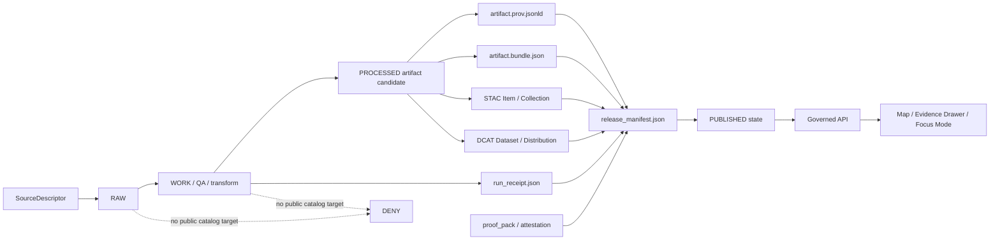

<!-- [KFM_META_BLOCK_V2]
doc_id: kfm://doc/TODO-NEEDS-UUID
title: ADR — PROV, STAC, and DCAT Catalog Mapping
type: standard
version: v1
status: draft
owners: TODO-NEEDS-OWNER
created: TODO-NEEDS-REPO-HISTORY
updated: 2026-04-27
policy_label: public
related: [
  contracts/v1/provenance/kfm_prov_sidecar.schema.json,
  tools/validators/provenance/validate_prov_sidecar.py,
  policy/provenance/prov_sidecar_gate.rego,
  .github/workflows/provenance-gates.yml
]
tags: [kfm, adr, prov, stac, dcat, provenance, catalog, receipts]
notes: [Related paths are proposed until the mounted repository confirms schema, validator, policy, and workflow homes.]
[/KFM_META_BLOCK_V2] -->

<a id="top"></a>

# ADR — PROV, STAC, and DCAT Catalog Mapping

KFM public artifacts need one inspectable provenance spine that keeps evidence, process memory, catalog discovery, rights, sensitivity, review, and release state connected without collapsing them into one object.

| Field | Value |
| --- | --- |
| Status | **Draft** |
| Decision owner | **TODO-NEEDS-OWNER** |
| Updated | **2026-04-27** |
| Applies to | Public or semi-public `PUBLISHED` artifacts, catalog records, and governed UI / API evidence references |
| Target path | `docs/adr/ADR-PROV-STAC-DCAT-CATALOG-MAPPING.md` |
| Current repo implementation evidence | **UNKNOWN** until the target repository confirms the related schema, validator, policy, fixtures, and workflow files |

## Quick links

- [Decision](#decision)
- [Scope](#scope)
- [Mapping model](#mapping-model)
- [Publication invariants](#publication-invariants)
- [STAC profile requirements](#stac-profile-requirements)
- [DCAT profile requirements](#dcat-profile-requirements)
- [Validation and gates](#validation-and-gates)
- [Open questions](#open-questions)
- [Acceptance checklist](#acceptance-checklist)

---

## Context

KFM is governed by an evidence-first publication posture: public-facing claims and artifacts should resolve to admissible evidence, source role, temporal scope, policy posture, review state, release state, and correction lineage.

This ADR binds that posture to interoperable provenance and catalog exports:

- **PROV** carries lineage across entities, activities, and agents.
- **STAC** carries geospatial asset discovery metadata.
- **DCAT** carries dataset, distribution, license, and access-rights metadata.

The selected mapping must preserve KFM’s separation between:

| KFM surface | Role | Collapse risk this ADR avoids |
| --- | --- | --- |
| Artifact | Released bytes or derived output | Treating rendered/output bytes as self-explaining truth |
| EvidenceBundle | Public unit of inspection | Replacing inspectable evidence with generated prose |
| Run receipt | Process memory | Treating operational logs as release proof |
| Proof / attestation | Release-significant verification | Hiding integrity checks behind catalog prose |
| Catalog record | Discovery and access metadata | Treating search metadata as provenance |
| Release manifest | Promotion closure and rollback target | Publishing detached assets with no governed state transition |
| Review / correction record | Human and policy accountability | Losing reviewer state and correction lineage after publication |

> [!IMPORTANT]
> This ADR is a catalog/provenance mapping decision. It does **not** prove that the named schema, validator, Rego policy, workflow, or fixtures already exist in the repository. Those files become CONFIRMED only after repo inspection and passing validation.

[Back to top](#top)

---

## Decision

KFM will represent public artifact provenance using a colocated **PROV JSON-LD sidecar** and will require public catalog records to link to that sidecar and to the associated `EvidenceBundle`.

For each public or semi-public published artifact, KFM **MUST** be able to resolve this minimum artifact set:

```text
artifact.ext
artifact.prov.jsonld
artifact.bundle.json
```

For release-scoped publication, the artifact set **SHOULD** also resolve through release-level process and proof objects:

```text
run_receipt.json
release_manifest.json
proof_pack.json | attestation bundle
stac_item_or_collection.json
dcat_dataset.jsonld
```

The profile maps KFM objects as follows:

| KFM object | Primary interop representation | Required KFM treatment |
| --- | --- | --- |
| `EvidenceBundle` | `prov:Entity` and linked KFM bundle JSON | Remains the public unit of inspection. |
| Published artifact | `prov:Entity`, STAC Asset, DCAT Distribution | Must carry or resolve `kfm:spec_hash`, rights, access, and provenance. |
| Pipeline run | `prov:Activity` | Must identify inputs, outputs, timestamps, software/process identity, and run receipt reference. |
| Signer / reviewer / system | `prov:Agent` | Must not be reduced to free-text names when attestation or review policy requires identity. |
| `run_receipt` | Linked process-memory entity | Must stay distinguishable from proof and attestation objects. |
| STAC Item / Collection | Discovery catalog | Must link to full provenance and evidence. |
| DCAT Dataset / Distribution | Open-data / portal catalog | Must carry license and access-rights posture. |

### Decision boundary

This ADR chooses the mapping pattern. It does **not** finalize:

- the canonical JSON serialization standard for `kfm:spec_hash`
- the attestation toolchain or signer identity format
- the controlled vocabulary for `dct:accessRights`
- the final schema home if the repository has competing `contracts/` and `schemas/` conventions
- the STAC extension profile for every `kfm:` field

Those remain [open questions](#open-questions).

[Back to top](#top)

---

## Scope

### In scope

- Public and semi-public artifacts in `PUBLISHED` state.
- STAC Item / Collection records that describe KFM geospatial assets.
- DCAT Dataset / Distribution records that expose KFM catalog metadata.
- PROV JSON-LD sidecars for lineage, generation activity, agent, and input/output relationships.
- Resolver requirements from catalog records to `EvidenceBundle`, `run_receipt`, release manifest, and proof or attestation objects.

### Out of scope

- RAW, WORK, QUARANTINE, or unpublished candidate material as public catalog targets.
- Direct UI access to canonical/internal stores.
- Generated AI summaries as provenance evidence.
- Treating STAC, DCAT, or PROV as a replacement for KFM review, policy, promotion, or correction records.
- Finalizing per-domain catalog fields for hydrology, fauna, archaeology, roads, or other domain lanes.

[Back to top](#top)

---

## Rationale

This keeps KFM aligned with three durable needs.

### 1. Evidence-first governance

The `EvidenceBundle` remains the public unit of inspection. Catalog and provenance exports must make that inspection easier, not replace it.

### 2. Portable provenance

PROV gives KFM a standard entity / activity / agent model while allowing receipts, proofs, artifacts, and review records to remain separate KFM objects.

### 3. Catalog interoperability

STAC and DCAT consumers can harvest public-safe metadata, while deeper provenance and evidence remain available through explicit links.

[Back to top](#top)

---

## Mapping model



### Minimal closure rule

A public artifact is not outward-ready until the following references close without guesswork:

| Closure check | Required result |
| --- | --- |
| Artifact → PROV | Artifact has a resolvable provenance sidecar. |
| Artifact → EvidenceBundle | Artifact has a resolvable inspection bundle. |
| STAC → PROV / EvidenceBundle | STAC links include provenance and evidence/attestation references. |
| DCAT → Distribution | DCAT distribution resolves to the public-safe artifact or governed access URL. |
| DCAT → rights | `dct:license` and `dct:accessRights` are non-empty and policy-approved. |
| PROV → activity inputs | Generation activity identifies inputs or abstains from publication. |
| ReleaseManifest → rollback | Release scope carries rollback target or documented exception. |
| Policy → publication | Policy decision permits publication and does not expose restricted fields. |

[Back to top](#top)

---

## Publication invariants

Public publication **MUST fail closed** when any of these conditions are true:

- provenance sidecar is missing
- `kfm:spec_hash` is missing from required artifact, catalog, or provenance surfaces
- artifact license is unknown or unresolved
- `dct:accessRights` is missing, uncontrolled, or incompatible with the public surface
- activity input references are missing or cannot resolve
- public catalog references `RAW`, `WORK`, or `QUARANTINE` material
- restricted geometry or restricted fields leak into public DTOs, tiles, exports, or popups
- provenance links cannot resolve
- required `EvidenceBundle` cannot resolve
- attestation is required by policy but missing
- release manifest does not bind catalog, proof, policy, and rollback references
- correction or withdrawal status requires suppression but the artifact remains discoverable as current

> [!CAUTION]
> Public-safe discovery metadata is still publication. A STAC or DCAT record that leaks exact sensitive geometry, restricted fields, or unresolved source rights violates the same trust boundary as a public map tile or API response.

[Back to top](#top)

---

## PROV sidecar requirements

The sidecar **MUST** identify the artifact as a `prov:Entity`, the generation run as a `prov:Activity`, and relevant systems or reviewers as `prov:Agent` records or references.

Minimum fields for `artifact.prov.jsonld`:

| Field / relation | Requirement |
| --- | --- |
| `@context` | Includes PROV, KFM extension terms, and any required vocabulary prefixes. |
| artifact entity id | Stable URI or URN for the artifact. |
| `kfm:spec_hash` | Deterministic hash for the artifact specification or release candidate. |
| `prov:wasGeneratedBy` | Links artifact entity to the pipeline activity. |
| `prov:used` | Links activity to source descriptors, input artifacts, or evidence refs. |
| `prov:wasAssociatedWith` | Links activity to system, signer, reviewer, or steward agents when required. |
| `kfm:run_receipt_ref` | Links to process memory without treating the receipt as the proof itself. |
| `kfm:evidence_bundle_ref` | Links to the public inspection bundle. |
| `kfm:release_manifest_ref` | Links to release closure when artifact is published as part of a release. |
| `kfm:policy_decision_ref` | Links to policy outcome or promotion decision where required. |

<details>
<summary>Illustrative minimal PROV JSON-LD shape</summary>

This example is illustrative. Field names and URI patterns remain PROPOSED until the schema and STAC extension profile are accepted.

```json
{
  "@context": {
    "prov": "http://www.w3.org/ns/prov#",
    "dct": "http://purl.org/dc/terms/",
    "kfm": "https://example.invalid/kfm/ns#"
  },
  "@id": "kfm://artifact/TODO-ARTIFACT-ID",
  "@type": "prov:Entity",
  "dct:title": "TODO artifact title",
  "kfm:spec_hash": "sha256:TODO",
  "kfm:evidence_bundle_ref": "kfm://evidence-bundle/TODO",
  "kfm:run_receipt_ref": "kfm://run-receipt/TODO",
  "prov:wasGeneratedBy": {
    "@id": "kfm://activity/TODO-RUN-ID",
    "@type": "prov:Activity",
    "prov:startedAtTime": "2026-04-27T00:00:00Z",
    "prov:endedAtTime": "2026-04-27T00:00:00Z",
    "prov:used": [
      { "@id": "kfm://source-descriptor/TODO" }
    ],
    "prov:wasAssociatedWith": [
      { "@id": "kfm://agent/kfm-pipeline" }
    ]
  }
}
```

</details>

[Back to top](#top)

---

## STAC profile requirements

STAC records carry discovery metadata for geospatial assets and link to full KFM provenance and evidence surfaces. They do not replace KFM policy, review, or release state.

Required KFM extension properties for public KFM STAC records:

```json
{
  "kfm:spec_hash": "sha256:TODO",
  "kfm:evidence_bundle_url": "https://example.invalid/artifact.bundle.json",
  "kfm:provenance_url": "https://example.invalid/artifact.prov.jsonld",
  "kfm:run_receipt_url": "https://example.invalid/run_receipt.json",
  "processing:software": "kfm-pipeline",
  "processing:version": "TODO-NEEDS-VERSION",
  "processing:datetime": "2026-04-27T00:00:00Z"
}
```

Required STAC links:

```json
[
  {
    "rel": "provenance",
    "href": "https://example.invalid/artifact.prov.jsonld",
    "type": "application/ld+json"
  },
  {
    "rel": "attestation",
    "href": "https://example.invalid/artifact.bundle.json",
    "type": "application/json"
  },
  {
    "rel": "via",
    "href": "https://example.invalid/run_receipt.json",
    "type": "application/json"
  }
]
```

> [!NOTE]
> `kfm:run_receipt_url` is not a synonym for the PROV sidecar. The receipt records process memory. The PROV sidecar records lineage. A proof or attestation records release-significant verification.

[Back to top](#top)

---

## DCAT profile requirements

DCAT records carry open-data or portal-facing dataset metadata. They must expose access, rights, and distribution posture clearly enough that a public user or downstream catalog can distinguish open, restricted, generalized, staged, or withdrawn access.

Required DCAT fields:

```json
{
  "@context": {
    "dcat": "http://www.w3.org/ns/dcat#",
    "dct": "http://purl.org/dc/terms/",
    "prov": "http://www.w3.org/ns/prov#",
    "kfm": "https://example.invalid/kfm/ns#"
  },
  "@type": "dcat:Dataset",
  "@id": "kfm://dataset/TODO",
  "dct:title": "TODO dataset title",
  "dct:license": "TODO-NEEDS-LICENSE-IRI",
  "dct:accessRights": "TODO-NEEDS-CONTROLLED-VALUE",
  "kfm:spec_hash": "sha256:TODO",
  "prov:wasGeneratedBy": "kfm://activity/TODO-RUN-ID",
  "dcat:distribution": [
    {
      "@type": "dcat:Distribution",
      "@id": "kfm://distribution/TODO",
      "dcat:accessURL": "https://example.invalid/artifact.ext",
      "dct:format": "TODO-NEEDS-MEDIA-TYPE",
      "kfm:provenance_url": "https://example.invalid/artifact.prov.jsonld",
      "kfm:evidence_bundle_url": "https://example.invalid/artifact.bundle.json"
    }
  ]
}
```

### Access-rights posture

`dct:accessRights` **MUST NOT** remain `TODO` for a public release. Until KFM accepts a controlled vocabulary, release candidates that need public catalog exposure remain **NEEDS VERIFICATION**.

Proposed access-rights classes for a follow-on ADR:

| Proposed class | Meaning |
| --- | --- |
| `public` | Public-safe artifact and metadata. |
| `public_generalized` | Public-safe after documented geometry or field generalization. |
| `restricted` | Discoverable only through controlled access or not discoverable publicly. |
| `staged` | Candidate record; not public release state. |
| `withdrawn` | Previously published artifact withdrawn or superseded. |

[Back to top](#top)

---

## Evidence Drawer and Focus Mode impact

Evidence Drawer and Focus Mode payloads **SHOULD** consume the same closure references used by STAC, DCAT, and PROV:

| UI / AI surface | Required reference behavior |
| --- | --- |
| Evidence Drawer | Resolves `EvidenceBundle`, provenance sidecar, source role, rights, review state, and correction lineage. |
| Focus Mode | Answers only over released, policy-safe context; otherwise returns `ABSTAIN`, `DENY`, or `ERROR`. |
| Map popup | May summarize artifact metadata, but must link to Evidence Drawer for consequential claims. |
| Export / story node | Must carry catalog/provenance references or explicitly mark itself as an illustrative derived product. |

Generated language is never the root truth source. `EvidenceBundle` and release state outrank Focus Mode phrasing.

[Back to top](#top)

---

## Consequences

### Positive

- Clear lineage across artifact, run, catalog, release, and review state.
- Harvestable catalog metadata for STAC and DCAT consumers.
- Verifiable provenance sidecars for public artifacts.
- Policy-friendly separation of receipts, proofs, catalogs, and artifacts.
- Compatible with Evidence Drawer and Focus Mode trust surfaces.
- Supports rollback and correction review because release closure remains inspectable.

### Tradeoffs

- Adds at least one required sidecar and one inspection bundle per public artifact.
- Requires catalog-closure validation rather than simple file publication.
- Requires stable schema and validator ownership.
- Requires controlled vocabulary decisions for `dct:accessRights`.
- Requires follow-on work for STAC extension documentation and DCAT profile examples.

[Back to top](#top)

---

## Implementation plan

The implementation should land as small, reversible changes.

| Step | Artifact | Status before repo verification |
| --- | --- | --- |
| 1 | Add / confirm PROV sidecar schema | **PROPOSED** |
| 2 | Add valid and invalid PROV fixtures | **PROPOSED** |
| 3 | Add Python validator or repo-native equivalent | **PROPOSED** |
| 4 | Add OPA/Rego policy gate for publication closure | **PROPOSED** |
| 5 | Add CI workflow after repo workflow conventions are confirmed | **PROPOSED** |
| 6 | Add KFM STAC extension profile for `kfm:*` fields | **PROPOSED** |
| 7 | Add KFM DCAT export profile | **PROPOSED** |
| 8 | Add release-manifest closure validation | **PROPOSED** |
| 9 | Add Evidence Drawer / Focus Mode provenance references | **PROPOSED** |

Recommended first PR:

1. This ADR.
2. Minimal schema skeleton.
3. One valid fixture and three invalid fixtures.
4. Validator dry run.
5. Policy gate that denies missing license, missing spec hash, missing provenance, and RAW / WORK / QUARANTINE catalog targets.

[Back to top](#top)

---

## Validation and gates

The commands below are expected validation targets after the proposed files exist. They are not evidence that the current repository already contains the validator, policy, fixtures, or workflow.

### Positive-path gates

```bash
python tools/validators/provenance/validate_prov_sidecar.py \
  tests/fixtures/provenance/valid/minimal.prov.jsonld

conftest test \
  tests/fixtures/provenance/valid/minimal.prov.jsonld \
  --policy policy/provenance
```

### Negative-path gates

```bash
! python tools/validators/provenance/validate_prov_sidecar.py \
  tests/fixtures/provenance/invalid/missing_license.prov.jsonld

! python tools/validators/provenance/validate_prov_sidecar.py \
  tests/fixtures/provenance/invalid/missing_spec_hash.prov.jsonld

! conftest test \
  tests/fixtures/provenance/invalid/raw_catalog_target.prov.jsonld \
  --policy policy/provenance
```

### Minimum denial cases

| Fixture | Expected result |
| --- | --- |
| `missing_license.prov.jsonld` | `DENY` publication |
| `missing_spec_hash.prov.jsonld` | `DENY` publication |
| `missing_activity_inputs.prov.jsonld` | `DENY` publication |
| `raw_catalog_target.prov.jsonld` | `DENY` publication |
| `restricted_geometry_public.prov.jsonld` | `DENY` publication |
| `unresolved_evidence_bundle.prov.jsonld` | `ABSTAIN` or `DENY`, depending on gate phase |
| `missing_required_attestation.prov.jsonld` | `DENY` publication |

[Back to top](#top)

---

## Open questions

| Question | Current posture | Needed decision |
| --- | --- | --- |
| Canonical JSON standard for `spec_hash` | **PROPOSED:** JCS | Confirm serialization and hash inputs. |
| Attestation baseline | **PROPOSED:** DSSE / Cosign | Decide signer identity, key strategy, and when attestation is mandatory. |
| Public access-rights vocabulary | **NEEDS VERIFICATION** | Create controlled vocabulary ADR. |
| Schema authority path | **NEEDS VERIFICATION** | Confirm whether `contracts/`, `schemas/`, or `contracts/v1/` is canonical in the mounted repo. |
| Required signer identity format | **NEEDS POLICY DECISION** | Define agent identity and reviewer identity requirements. |
| STAC extension maturity policy | **NEEDS VERIFICATION** | Define required `kfm:*` field names, JSON Schema, and linting. |
| DCAT profile examples | **PROPOSED** | Add examples by domain lane after source rights and access classes are settled. |

[Back to top](#top)

---

## Acceptance checklist

This ADR can move from `draft` to `review` when:

- [ ] owner is assigned
- [ ] `doc_id` is replaced with a stable KFM document identifier
- [ ] `created` date is confirmed from repo history or set by maintainers
- [ ] schema home decision is confirmed or recorded in a separate ADR
- [ ] PROV sidecar schema exists
- [ ] valid and invalid fixtures exist
- [ ] validator exists and runs locally
- [ ] policy gate exists and denies minimum failure cases
- [ ] CI workflow or repo-native validation hook runs the positive and negative gates
- [ ] STAC profile documentation references this ADR
- [ ] DCAT export profile documentation references this ADR
- [ ] release-manifest closure validation references this ADR
- [ ] Evidence Drawer / Focus Mode contracts know how to resolve provenance and evidence references

This ADR can move from `review` to `published` when:

- [ ] at least one offline fixture release proves artifact → PROV → EvidenceBundle → STAC → DCAT → ReleaseManifest closure
- [ ] rollback target and correction status behavior are tested
- [ ] public catalog output is verified not to reference `RAW`, `WORK`, or `QUARANTINE`
- [ ] rights and sensitivity checks pass for the fixture release

[Back to top](#top)

---

## References

- [OGC STAC Community Standard][stac]
- [W3C DCAT Version 3][dcat]
- [W3C PROV-O][prov-o]

[stac]: https://www.ogc.org/standards/stac/
[dcat]: https://www.w3.org/TR/vocab-dcat-3/
[prov-o]: https://www.w3.org/TR/prov-o/
