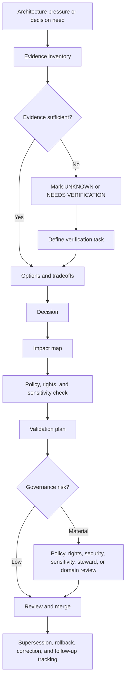

<!-- [KFM_META_BLOCK_V2]
doc_id: kfm://doc/NEEDS-VERIFICATION
title: ADR Template
type: standard
version: v1
status: draft
owners: OWNER_TBD_NEEDS_VERIFICATION
created: NEEDS_VERIFICATION-YYYY-MM-DD
updated: NEEDS_VERIFICATION-YYYY-MM-DD
policy_label: NEEDS_VERIFICATION
related: [NEEDS_VERIFICATION:docs/adr/README.md, NEEDS_VERIFICATION:docs/registers/AUTHORITY_LADDER.md]
tags: [kfm, adr, governance, architecture-decision, evidence, template]
notes: [Standard template for KFM Architecture Decision Records. Verify doc_id, target path, owners, dates, policy label, and related links against the mounted repository and document registry before publishing.]
[/KFM_META_BLOCK_V2] -->

# ADR Template

> **Purpose:** Use this template to record Kansas Frontier Matrix architecture decisions with evidence, scope, policy impact, validation, rollback, and supersession visible at review time.

KFM Architecture Decision Records are part of the governance surface. They should make decisions inspectable, not merely memorable.

> [!IMPORTANT]
> An ADR is **not implementation proof**. It records a decision, the evidence basis for that decision, the risks accepted or avoided, and the validation required to make the decision safe. Do not use an ADR to imply that repo files, schemas, workflows, tests, dashboards, runtime behavior, or proof objects already exist unless direct evidence is cited in the ADR.

> [!NOTE]
> This template is repo-useful but placement-bounded. Until the target repository, ADR index, document registry, owners, policy label, and related links are verified, path and ownership values remain `NEEDS VERIFICATION`.

## Quick links

- [When to use this template](#when-to-use-this-template)
- [Copy protocol](#copy-protocol)
- [Decision flow](#decision-flow)
- [ADR header](#adr-header)
- [Decision summary](#decision-summary)
- [Context and problem](#context-and-problem)
- [Evidence basis](#evidence-basis)
- [Requirements and constraints](#requirements-and-constraints)
- [Options considered](#options-considered)
- [Decision](#decision)
- [Impact map](#impact-map)
- [Policy, rights, and sensitivity](#policy-rights-and-sensitivity)
- [Validation plan](#validation-plan)
- [Rollback and supersession](#rollback-and-supersession)
- [Consequences](#consequences)
- [Open questions](#open-questions)
- [Review checklist](#review-checklist)
- [Appendices](#appendix-a--minimal-adr-quality-bar)

---

## When to use this template

Use an ADR when a decision materially affects KFM’s trust posture, architecture, lifecycle, publication model, contracts, schemas, policies, UI surfaces, AI boundaries, source activation, data packaging, validation, security, or rollback behavior.

Use the narrowest decision record that can preserve the reasoning. An ADR should be large enough to prevent future ambiguity and small enough to review.

### Accepted inputs

This template accepts decisions about:

- schema-home, contract-home, policy-home, or registry authority;
- source registry, source-role, rights, sensitivity, or activation rules;
- governed API boundaries and public-client access paths;
- `EvidenceRef`, `EvidenceBundle`, `DecisionEnvelope`, `RuntimeResponseEnvelope`, `ReleaseManifest`, `LayerManifest`, `GeoManifest`, receipt, proof, rollback, correction, or withdrawal object families;
- MapLibre, Cesium, tile, graph, search, catalog, export, or delivery-layer admission;
- governed AI, Focus Mode, model adapter, citation validation, runtime-envelope, or AI receipt behavior;
- CI, validator, fixture, promotion, release, rollback, correction, withdrawal, and review gates;
- local exposure boundaries, reverse proxy posture, VPN posture, or deny-by-default access rules.

### Exclusions

Do **not** use an ADR as the primary home for:

| Excluded item | Put it here instead |
|---|---|
| Exploratory packet notes | `docs/intake/` or the project’s verified idea-intake path |
| Implementation logs | Run receipts, validation reports, CI logs, or verified runtime artifacts |
| Source-specific rights summaries | Source descriptors and source registry records |
| Executable schemas | The verified schema home, not ADR prose |
| Policy rules | The verified policy home, not ADR prose |
| User-facing narrative explanation | Domain docs, runbooks, Evidence Drawer copy, or published documentation |
| Unresolved implementation guesses | Mark `UNKNOWN` or `NEEDS VERIFICATION` and add a verification task |
| Emergency or life-safety instructions | Official source guidance, not KFM narrative or AI output |
| Direct model prompts or private reasoning | Governed AI contracts, receipts, and public-safe summaries only |

---

## Copy protocol

1. Copy this file to the repo’s verified ADR path.

   Proposed filename pattern until repo convention is verified:

   ```text
   docs/adr/ADR-<YYYYMMDD>-<short-kebab-title>.md
   ```

2. Replace every placeholder value, including the KFM meta block.

3. Keep the visible title synchronized with:
   - meta block `title`;
   - ADR header `Title`;
   - filename;
   - ADR index entry, when an index exists.

4. Use the narrowest truthful label available:
   - `CONFIRMED`
   - `INFERRED`
   - `PROPOSED`
   - `UNKNOWN`
   - `NEEDS VERIFICATION`
   - `CONFLICTED`
   - `LINEAGE`
   - `SUPERSEDED`

5. Cite or link the evidence that supports implementation claims. If evidence is missing, say so.

6. Update related docs, registers, schemas, policies, tests, runbooks, receipts, proofs, release manifests, and rollback records listed in [Impact map](#impact-map), or explain why no update is required.

7. Keep rejected options. They prevent repeat debates unless new evidence appears.

> [!CAUTION]
> If the mounted repository already has a different ADR numbering, naming, status, or review convention, follow the repo convention and revise this template through a separate ADR-template update. Do not create a parallel ADR authority.

---

## Decision flow



---

## ADR header

| Field | Value |
|---|---|
| ADR ID | `<ADR-ID-NEEDS-VERIFICATION>` |
| Title | `<Decision title>` |
| Status | `<proposed \| accepted \| rejected \| superseded \| withdrawn \| deprecated>` |
| Decision date | `<YYYY-MM-DD or NEEDS VERIFICATION>` |
| Authors / owners | `<names, team, or OWNER_TBD_NEEDS_VERIFICATION>` |
| Reviewers | `<names, team, or REVIEWER_TBD_NEEDS_VERIFICATION>` |
| Policy label | `<public \| restricted \| sensitive \| NEEDS VERIFICATION>` |
| Scope | `<repo-wide \| domain \| source \| API \| UI \| AI \| data lifecycle \| security \| other>` |
| Affected paths | `<paths or PATH_TBD_AFTER_REPO_INSPECTION>` |
| Related ADRs | `<ADR links, kfm:// IDs, or none>` |
| Supersedes | `<ADR/document ID or none>` |
| Superseded by | `<ADR/document ID or none>` |
| Decision confidence | `<CONFIRMED \| INFERRED \| PROPOSED \| UNKNOWN \| NEEDS VERIFICATION \| CONFLICTED>` |
| Review state | `<draft \| in-review \| approved \| blocked \| deferred>` |
| Rollback target | `<rollback card, prior ADR, prior release, or ROLLBACK_TARGET_TBD>` |

### ADR status lifecycle

| Status | Use |
|---|---|
| `proposed` | Decision is under review and not yet governing. |
| `accepted` | Decision is governing for its stated scope. |
| `rejected` | Decision was considered and declined. |
| `superseded` | Decision was replaced by a newer ADR or stronger repo evidence. |
| `withdrawn` | Decision was removed before becoming governing or because scope changed. |
| `deprecated` | Decision remains historical but should not be extended without a successor ADR. |

---

## Decision summary

Write one compact paragraph that answers:

- What decision is being made?
- Why is it needed now?
- Which KFM invariant or trust boundary does it protect?
- What remains unverified?

**Summary:**

> `<Write the decision summary here. Keep it specific enough that a maintainer can understand the decision without reading the full ADR.>`

---

## Context and problem

Describe the architectural pressure without turning the ADR into a broad essay.

### Current situation

`<Describe the current evidence-backed state. Use CONFIRMED only when direct evidence supports the claim. Use LINEAGE for prior reports or scaffolds that do not prove current implementation.>`

### Problem

`<Describe the problem this decision resolves. Include why the existing state is ambiguous, risky, fragmented, or insufficient.>`

### Why this is architecture-significant

`<Explain why this cannot be handled as a routine implementation detail. Tie the explanation to trust, lifecycle, contracts, schemas, public-client boundaries, policy, evidence, release, rollback, or review state.>`

---

## Evidence basis

Every ADR must separate doctrine, current repo evidence, implementation evidence, external checks, lineage, and proposals.

| Evidence item | Source / path / artifact | What it supports | Truth label |
|---|---|---|---|
| `<source>` | `<path, kfm:// ID, citation, command output, test, schema, PR, log, dashboard, manifest, or artifact>` | `<claim supported>` | `<CONFIRMED / INFERRED / PROPOSED / UNKNOWN / NEEDS VERIFICATION / CONFLICTED / LINEAGE>` |

### Evidence rules

- Use `CONFIRMED` only for surfaced project documents, current repo files, current command output, tests, logs, schemas, workflows, manifests, dashboards, generated artifacts, or direct source content.
- Use `INFERRED` for conservative synthesis strongly implied by evidence but not directly proven.
- Use `PROPOSED` for recommended design not verified as current implementation.
- Use `UNKNOWN` where direct evidence is missing.
- Use `NEEDS VERIFICATION` where a concrete check can retire uncertainty.
- Use `CONFLICTED` where source, repo, implementation, or policy evidence disagree.
- Use `LINEAGE` for prior reports, scaffold references, historical source families, or repeated corpus patterns that preserve continuity without proving current behavior.
- Do not use memory as evidence.

> [!CAUTION]
> Repetition is not proof. Multiple documents repeating the same proposed path, schema, route, object family, or workflow do not make it current repo implementation.

### Evidence ledger

| Source | Status | Supports | Limits |
|---|---|---|---|
| `<source/path/title>` | `<CONFIRMED / LINEAGE / PROPOSED / UNKNOWN>` | `<what this source supports>` | `<what this source does not prove>` |

---

## Requirements and constraints

### KFM invariants checked

| Invariant | Impact | Status |
|---|---|---|
| `RAW -> WORK / QUARANTINE -> PROCESSED -> CATALOG / TRIPLET -> PUBLISHED` | `<How the decision preserves or changes lifecycle movement>` | `<status>` |
| Public clients use governed interfaces, not raw/canonical/internal stores | `<impact>` | `<status>` |
| `EvidenceRef` resolves to `EvidenceBundle` before consequential claims | `<impact>` | `<status>` |
| Promotion is a governed state transition, not a file move | `<impact>` | `<status>` |
| AI is interpretive and subordinate to evidence, policy, review, and release state | `<impact>` | `<status>` |
| Derived surfaces do not replace canonical truth | `<impact>` | `<status>` |
| Rights, sensitivity, and policy checks fail closed where risk matters | `<impact>` | `<status>` |
| Receipts, proofs, release manifests, reviews, corrections, and rollback records remain separate | `<impact>` | `<status>` |
| Rollback and correction are planned before publication | `<impact>` | `<status>` |
| Sensitive location, living-person, DNA, land/title, cultural, ecological, archaeological, and security-relevant surfaces fail closed unless allowed | `<impact>` | `<status>` |

### Non-goals

List what this decision intentionally does **not** decide.

- `<Non-goal 1>`
- `<Non-goal 2>`
- `<Non-goal 3>`

### Assumptions

| Assumption | Why it is needed | Label | How to verify or retire |
|---|---|---|---|
| `<assumption>` | `<reason>` | `<PROPOSED / UNKNOWN / NEEDS VERIFICATION>` | `<specific check>` |

---

## Options considered

| Option | Description | Benefits | Risks / costs | Evidence posture | Outcome |
|---|---|---|---|---|---|
| `<Option A>` | `<description>` | `<benefits>` | `<risks>` | `<CONFIRMED / PROPOSED / UNKNOWN>` | `<accepted / rejected / deferred>` |
| `<Option B>` | `<description>` | `<benefits>` | `<risks>` | `<CONFIRMED / PROPOSED / UNKNOWN>` | `<accepted / rejected / deferred>` |

### Rejected options

Document rejected options clearly enough that future contributors do not repeat the same argument without new evidence.

| Rejected option | Why rejected | What evidence could reopen it |
|---|---|---|
| `<option>` | `<reason>` | `<evidence or condition>` |

---

## Decision

### Chosen option

`<State the selected option.>`

### Rationale

`<Explain why this option best preserves KFM trust, buildability, reversibility, and evidence discipline.>`

### Decision rule

State the rule future maintainers should apply.

> `<Example: Machine-readable schemas live in the verified schema home unless a future ADR supersedes this decision after repo inspection.>`

### Boundary rule

State what this decision must **not** allow.

> `<Example: This decision must not allow public clients to bypass governed APIs or read canonical/internal stores directly.>`

---

## Impact map

### File and documentation impact

| Area | Required update | Status |
|---|---|---|
| `docs/` | `<doc updates>` | `<CONFIRMED / PROPOSED / NEEDS VERIFICATION>` |
| `docs/adr/` | `<ADR index / successor links / related ADRs>` | `<status>` |
| `docs/registers/` | `<authority, source, validator, policy, schema, or retention register updates>` | `<status>` |
| `contracts/` | `<semantic contract impact>` | `<status>` |
| `schemas/` | `<machine-checkable schema impact>` | `<status>` |
| `policy/` | `<policy or release admissibility impact>` | `<status>` |
| `tests/fixtures/` | `<valid/invalid fixtures>` | `<status>` |
| `tools/validators/` | `<validator impact>` | `<status>` |
| `data/registry/` | `<source descriptor or registry impact>` | `<status>` |
| `data/receipts/` | `<receipt impact>` | `<status>` |
| `data/proofs/` | `<proof-pack impact>` | `<status>` |
| `release/` | `<release manifest or promotion impact>` | `<status>` |
| `apps/` / `packages/` | `<API/UI/runtime impact>` | `<status>` |
| `.github/workflows/` | `<CI impact>` | `<status>` |
| `README` / index surfaces | `<navigation and link updates>` | `<status>` |

### Lifecycle impact

| Lifecycle stage | Decision effect | Guardrail |
|---|---|---|
| Source edge | `<effect>` | `<guardrail>` |
| RAW | `<effect>` | `<guardrail>` |
| WORK | `<effect>` | `<guardrail>` |
| QUARANTINE | `<effect>` | `<guardrail>` |
| PROCESSED | `<effect>` | `<guardrail>` |
| CATALOG | `<effect>` | `<guardrail>` |
| TRIPLET | `<effect>` | `<guardrail>` |
| PUBLISHED | `<effect>` | `<guardrail>` |

### Trust-surface impact

| Surface | Effect | Required check |
|---|---|---|
| Governed API | `<effect>` | `<check>` |
| MapLibre shell | `<effect>` | `<check>` |
| Cesium / 3D scene surface | `<effect or N/A>` | `<check>` |
| Evidence Drawer | `<effect>` | `<check>` |
| Focus Mode / governed AI | `<effect>` | `<check>` |
| Review console / steward surface | `<effect>` | `<check>` |
| Public exports / story nodes | `<effect>` | `<check>` |
| Catalog / search / graph projections | `<effect>` | `<check>` |

---

## Policy, rights, and sensitivity

| Question | Answer | Status |
|---|---|---|
| Does this decision affect public release eligibility? | `<yes/no/unknown>` | `<status>` |
| Does it affect exact location exposure? | `<yes/no/unknown>` | `<status>` |
| Does it affect archaeology, rare species, living persons, DNA, land ownership, critical infrastructure, hazards, or other high-risk material? | `<yes/no/unknown>` | `<status>` |
| Does it require steward, legal, security, privacy, cultural, domain, or policy review? | `<yes/no/unknown>` | `<status>` |
| Does it change fail-closed behavior? | `<yes/no/unknown>` | `<status>` |
| Does it change correction, withdrawal, or rollback behavior? | `<yes/no/unknown>` | `<status>` |
| Does it affect external source rights, terms, quotas, licenses, or attribution? | `<yes/no/unknown>` | `<status>` |

> [!WARNING]
> If rights, sensitivity, source role, source authority, or public-release eligibility is unclear, the safe default is `QUARANTINE`, `ABSTAIN`, `DENY`, redaction, generalization, staged access, or delayed publication until review retires the uncertainty.

---

## Validation plan

### Required checks

| Check | Command / artifact / reviewer | Expected result | Status |
|---|---|---|---|
| Schema validation | `<command or artifact>` | `<expected>` | `<status>` |
| Policy validation | `<command or artifact>` | `<expected>` | `<status>` |
| Source-role validation | `<command or artifact>` | `<expected>` | `<status>` |
| Rights/sensitivity validation | `<command or artifact>` | `<expected>` | `<status>` |
| `EvidenceRef -> EvidenceBundle` closure | `<command or artifact>` | `<expected>` | `<status>` |
| Catalog / triplet closure | `<command or artifact>` | `<expected>` | `<status>` |
| Promotion / release dry run | `<command or artifact>` | `<expected>` | `<status>` |
| Negative-path test | `<command or artifact>` | `<expected>` | `<status>` |
| Rollback test | `<command or artifact>` | `<expected>` | `<status>` |
| Documentation link and metadata check | `<command or artifact>` | `<expected>` | `<status>` |

### Negative-path behavior

Every architecture-significant ADR should define at least one expected failure mode.

| Failure condition | Expected outcome | Evidence / test |
|---|---|---|
| Missing evidence | `<ABSTAIN / DENY / ERROR / blocked promotion>` | `<test or review artifact>` |
| Unknown rights or sensitivity | `<QUARANTINE / DENY / delayed publication>` | `<test or review artifact>` |
| Source-role mismatch | `<DENY / ABSTAIN / blocked promotion>` | `<test or review artifact>` |
| Broken rollback target | `<blocked release / review failure>` | `<test or review artifact>` |

### Evidence that moves this ADR forward

| Current label | What would strengthen it | Owner |
|---|---|---|
| `<UNKNOWN>` | `<specific repo/test/runtime/source check>` | `<owner>` |
| `<NEEDS VERIFICATION>` | `<specific check>` | `<owner>` |
| `<PROPOSED>` | `<artifact, test, PR, approval, or implementation evidence>` | `<owner>` |
| `<CONFLICTED>` | `<ADR, repo inspection, maintainer decision, or migration proof>` | `<owner>` |

---

## Rollback and supersession

### Rollback plan

`<Describe how to reverse the decision or disable the affected behavior without corrupting canonical evidence, published releases, receipts, proofs, review records, correction lineage, or rollback records.>`

### Rollback triggers

| Trigger | Required action |
|---|---|
| Evidence closure fails | `<action>` |
| Policy or sensitivity gate fails | `<action>` |
| Public client bypass is discovered | `<action>` |
| Schema or contract authority conflict appears | `<action>` |
| Release or correction linkage breaks | `<action>` |
| Security, rights, or source terms change | `<action>` |

### Supersession rule

`<Describe how this ADR can be superseded, what evidence is required, which paths/registries must be updated, and how successor links remain inspectable.>`

### Compatibility notes

`<Describe compatibility aliases, migration windows, deprecation notices, downstream changes, or public communication requirements.>`

---

## Consequences

### Positive consequences

- `<Consequence 1>`
- `<Consequence 2>`
- `<Consequence 3>`

### Tradeoffs and risks

| Risk | Mitigation | Residual status |
|---|---|---|
| `<risk>` | `<mitigation>` | `<status>` |

### Follow-up tasks

| Task | Owner | Due / trigger | Status |
|---|---|---|---|
| `<task>` | `<owner>` | `<date, event, or trigger>` | `<status>` |

---

## Open questions

| Question | Why it matters | Verification path | Owner |
|---|---|---|---|
| `<question>` | `<reason>` | `<how to resolve>` | `<owner>` |

---

## Review checklist

<details>
<summary>Pre-merge checklist</summary>

- [ ] Meta block values are replaced or deliberately marked `NEEDS VERIFICATION`.
- [ ] ADR title, meta block title, ADR header title, filename, and ADR index entry are synchronized.
- [ ] Truth labels are used narrowly and do not upgrade uncertainty through tone.
- [ ] Evidence basis separates project doctrine, repo evidence, implementation evidence, external checks, lineage, and proposals.
- [ ] No implementation claim exceeds direct evidence.
- [ ] Alternatives and rejected options are documented.
- [ ] KFM lifecycle impact is checked.
- [ ] Governed API / public-client boundary is checked.
- [ ] `EvidenceRef -> EvidenceBundle` impact is checked.
- [ ] Rights, sensitivity, source-role, review-state, release-state, correction, and rollback effects are checked.
- [ ] AI impact is bounded and does not create direct model-client or raw-store access.
- [ ] Derived surfaces remain separate from canonical truth.
- [ ] Required docs, contracts, schemas, policies, validators, fixtures, registries, receipts, proofs, release artifacts, and rollback records are listed.
- [ ] Validation plan includes negative-path behavior.
- [ ] Rollback and supersession plan is reviewable.
- [ ] Open questions are assigned, explicitly deferred, or marked `OWNER_TBD_NEEDS_VERIFICATION`.
- [ ] Related ADRs, registers, README/index files, and runbooks are updated or listed as follow-up.
- [ ] No unresolved sensitive public-release path remains hidden in prose.
- [ ] Stable anchors were preserved where practical.
- [ ] This ADR does not create parallel contract, schema, policy, source, proof, or publication authority without naming the conflict.

</details>

---

## Appendix A — Minimal ADR quality bar

An ADR is ready for review when a maintainer can answer all of the following without guessing:

1. What exactly is being decided?
2. What evidence supports the decision?
3. What is still unknown?
4. Which KFM invariant does the decision protect or modify?
5. What breaks if the decision is wrong?
6. How will the project validate the decision?
7. How will the project roll back or supersede the decision?
8. Which docs, schemas, contracts, policies, fixtures, tests, registries, receipts, proofs, releases, or rollback records must change?
9. Which public surfaces, if any, could be affected?
10. Which rights, sensitivity, source-role, or review gates must fail closed?

## Appendix B — Label quick reference

| Label | Use |
|---|---|
| `CONFIRMED` | Verified from direct project documents, current repo evidence, tests, logs, workflows, schemas, manifests, dashboards, generated artifacts, command output, or direct source content. |
| `INFERRED` | Conservative synthesis strongly implied by available evidence, but not direct proof. |
| `PROPOSED` | Design recommendation, path, implementation direction, contract, schema, policy, or process not verified as present behavior. |
| `UNKNOWN` | Not verified strongly enough to state as fact. |
| `NEEDS VERIFICATION` | A concrete check can retire the uncertainty. |
| `CONFLICTED` | Evidence layers, terms, paths, authorities, or source families materially disagree. |
| `LINEAGE` | Historically important prior material that explains current work but is not current implementation proof. |
| `SUPERSEDED` | Earlier material replaced by newer doctrine, repo evidence, or a later ADR. |
| `DENY` | Output, publication, source activation, or access path should not proceed under current policy/evidence conditions. |
| `ABSTAIN` | A claim cannot be answered or published because support is insufficient. |
| `ERROR` | A process failed due to tool, input, environment, validation, or execution failure. |

## Appendix C — Placeholder standard

Use searchable placeholders that explain what is missing.

Preferred forms:

- `OWNER_TBD_NEEDS_VERIFICATION`
- `PATH_TBD_AFTER_REPO_INSPECTION`
- `DATE_TBD_FROM_GIT_OR_DOC_REGISTRY`
- `POLICY_LABEL_TBD_NEEDS_VERIFICATION`
- `ROLLBACK_TARGET_TBD`
- `SOURCE_ID_TBD`
- `kfm://doc/NEEDS-VERIFICATION`
- `NEEDS VERIFICATION: <specific check required>`
- `UNKNOWN: <evidence missing>`
- `CONFLICTED: <source/path/term conflict>`

Avoid vague placeholders such as `TBD` without a reason.

## Appendix D — ADR update behavior

When this ADR changes after acceptance:

| Change type | Required behavior |
|---|---|
| Minor typo or formatting repair | Update in place and keep title/status unchanged. |
| Clarification that does not change decision | Update in place and note the clarification if material. |
| Material change to scope, authority, lifecycle, public path, policy, schema, or release posture | Create a successor ADR or revision note. |
| Decision reversal | Mark this ADR `superseded`, `withdrawn`, or `deprecated`; add successor link and rollback/correction notes. |
| Repo evidence contradicts the ADR | Mark `CONFLICTED`, update the evidence basis, and open a follow-up decision or correction path. |

---

[Back to top](#adr-template)
