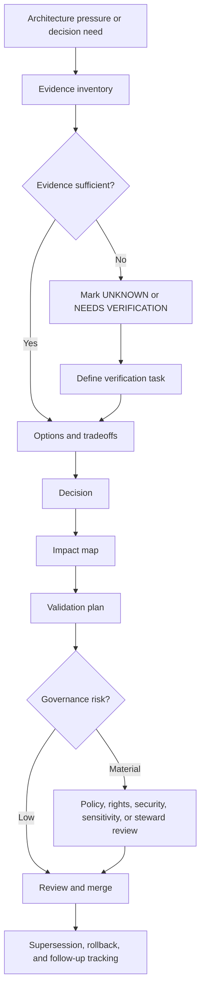

<!-- [KFM_META_BLOCK_V2]
doc_id: kfm://doc/<NEEDS_VERIFICATION-uuid>
title: ADR Template
type: standard
version: v1
status: draft
owners: <NEEDS_VERIFICATION>
created: <NEEDS_VERIFICATION-YYYY-MM-DD>
updated: <NEEDS_VERIFICATION-YYYY-MM-DD>
policy_label: <NEEDS_VERIFICATION>
related: [<NEEDS_VERIFICATION:docs/adr/README.md>, <NEEDS_VERIFICATION:docs/registers/AUTHORITY_LADDER.md>]
tags: [kfm, adr, governance, architecture-decision, evidence]
notes: [Template for KFM Architecture Decision Records; replace placeholders and verify owners, dates, policy label, and related links before publishing.]
[/KFM_META_BLOCK_V2] -->

# ADR Template

> **Purpose:** Use this template to record KFM architecture decisions with evidence, scope, policy impact, validation, rollback, and supersession visible at review time.

KFM Architecture Decision Records are part of the governance surface. They should make decisions inspectable, not merely memorable.

> [!IMPORTANT]
> An ADR is **not implementation proof**. It records a decision, its evidence basis, and the validation required to make the decision safe. Do not use an ADR to imply that repo files, schemas, workflows, tests, dashboards, runtime behavior, or proof objects already exist unless direct evidence is cited in the ADR.

## Quick links

- [When to use this template](#when-to-use-this-template)
- [Copy protocol](#copy-protocol)
- [Decision flow](#decision-flow)
- [ADR header](#adr-header)
- [Evidence basis](#evidence-basis)
- [Options considered](#options-considered)
- [Decision](#decision)
- [Impact map](#impact-map)
- [Validation plan](#validation-plan)
- [Rollback and supersession](#rollback-and-supersession)
- [Review checklist](#review-checklist)

---

## When to use this template

Use an ADR when a decision materially affects KFM’s trust posture, architecture, lifecycle, publication model, contracts, schemas, policies, UI surfaces, AI boundaries, source activation, data packaging, validation, security, or rollback behavior.

### Accepted inputs

This template accepts decisions about:

- schema-home, contract-home, or policy-home authority;
- source registry, source-role, rights, sensitivity, or activation rules;
- governed API boundaries and public-client access paths;
- EvidenceRef, EvidenceBundle, DecisionEnvelope, ReleaseManifest, LayerManifest, GeoManifest, receipt, proof, or rollback object families;
- MapLibre, Cesium, tile, graph, search, catalog, or delivery-layer admission;
- governed AI, Focus Mode, model adapter, citation validation, or runtime-envelope behavior;
- CI, validator, fixture, promotion, release, rollback, correction, and withdrawal gates.

### Exclusions

Do **not** use an ADR as the primary home for:

| Excluded item | Put it here instead |
|---|---|
| exploratory packet notes | `docs/intake/` or the project’s verified idea-intake path |
| implementation logs | run receipts, validation reports, CI logs, or verified runtime artifacts |
| source-specific rights summaries | source descriptors and source registry records |
| executable schemas | the verified schema home, not ADR prose |
| policy rules | the verified policy home, not ADR prose |
| user-facing narrative explanation | domain docs, runbooks, Evidence Drawer copy, or published documentation |
| unresolved implementation guesses | mark `UNKNOWN` or `NEEDS VERIFICATION` and add a verification task |

---

## Copy protocol

1. Copy this file to the repo’s verified ADR path.

   Proposed filename pattern until repo convention is verified:

   ```text
   docs/adr/ADR-<YYYYMMDD>-<short-kebab-title>.md
   ```

2. Replace every `<PLACEHOLDER>` value, including the KFM meta block.

3. Keep the visible title synchronized with the meta block `title`.

4. Use the narrowest truthful label available: `CONFIRMED`, `INFERRED`, `PROPOSED`, `UNKNOWN`, `NEEDS VERIFICATION`, or `CONFLICTED`.

5. Cite or link the evidence that supports implementation claims. If evidence is missing, say so.

6. Update related docs, registries, schemas, policies, tests, and runbooks listed in [Impact map](#impact-map), or explain why no update is required.

> [!NOTE]
> If the mounted repository already has a different ADR numbering, naming, status, or review convention, follow the repo convention and update this template through a separate ADR-template revision.

---

## Decision flow



---

## ADR header

| Field | Value |
|---|---|
| ADR ID | `<ADR-ID>` |
| Title | `<Decision title>` |
| Status | `<proposed \| accepted \| rejected \| superseded \| withdrawn \| deprecated>` |
| Decision date | `<YYYY-MM-DD or NEEDS VERIFICATION>` |
| Authors / owners | `<names, team, or NEEDS VERIFICATION>` |
| Reviewers | `<names, team, or NEEDS VERIFICATION>` |
| Policy label | `<public \| restricted \| sensitive \| NEEDS VERIFICATION>` |
| Scope | `<repo-wide \| domain \| source \| API \| UI \| AI \| data lifecycle \| security \| other>` |
| Affected paths | `<paths or NEEDS VERIFICATION>` |
| Related ADRs | `<ADR links, kfm:// IDs, or none>` |
| Supersedes | `<ADR/document ID or none>` |
| Superseded by | `<ADR/document ID or none>` |
| Decision confidence | `<CONFIRMED \| INFERRED \| PROPOSED \| UNKNOWN \| NEEDS VERIFICATION \| CONFLICTED>` |

---

## Decision summary

Write one compact paragraph that answers:

- What decision is being made?
- Why is it needed now?
- Which KFM invariant or trust boundary does it protect?
- What remains unverified?

**Summary:**

> `<Write the decision summary here.>`

---

## Context and problem

Describe the architectural pressure without turning the ADR into a broad essay.

### Current situation

`<Describe the current evidence-backed state. Use CONFIRMED only when direct evidence supports the claim.>`

### Problem

`<Describe the problem this decision resolves.>`

### Why this is architecture-significant

`<Explain why this cannot be handled as a routine implementation detail.>`

---

## Evidence basis

Every ADR must separate doctrine, current repo evidence, implementation evidence, and proposals.

| Evidence item | Source / path / artifact | What it supports | Truth label |
|---|---|---|---|
| `<source>` | `<path, kfm:// ID, citation, command output, test, schema, PR, log, or artifact>` | `<claim supported>` | `<CONFIRMED / INFERRED / PROPOSED / UNKNOWN / NEEDS VERIFICATION / CONFLICTED>` |

### Evidence rules

- Use `CONFIRMED` only for surfaced project documents, current repo files, current command output, tests, logs, schemas, workflows, manifests, dashboards, or generated artifacts.
- Use `INFERRED` for conservative synthesis from multiple evidence sources.
- Use `PROPOSED` for recommended design not verified as implemented.
- Use `UNKNOWN` where direct evidence is missing.
- Use `NEEDS VERIFICATION` where a concrete check can retire uncertainty.
- Use `CONFLICTED` where source, repo, implementation, or policy evidence disagree.

> [!CAUTION]
> Repetition is not proof. Multiple documents repeating the same proposed path, schema, route, or object family do not make it current repo implementation.

---

## Requirements and constraints

### KFM invariants checked

| Invariant | Impact | Status |
|---|---|---|
| `RAW -> WORK/QUARANTINE -> PROCESSED -> CATALOG/TRIPLET -> PUBLISHED` | `<How the decision preserves or changes lifecycle movement>` | `<status>` |
| Public clients use governed interfaces, not raw/canonical/internal stores | `<impact>` | `<status>` |
| EvidenceRef resolves to EvidenceBundle before consequential claims | `<impact>` | `<status>` |
| Promotion is a governed state transition, not a file move | `<impact>` | `<status>` |
| AI is interpretive and subordinate to evidence, policy, review, and release state | `<impact>` | `<status>` |
| Derived surfaces do not replace canonical truth | `<impact>` | `<status>` |
| Rights, sensitivity, and policy checks fail closed where risk matters | `<impact>` | `<status>` |
| Receipts, proofs, release manifests, reviews, and corrections remain separate | `<impact>` | `<status>` |
| Rollback and correction are planned before publication | `<impact>` | `<status>` |

### Non-goals

List what this decision intentionally does **not** decide.

- `<Non-goal 1>`
- `<Non-goal 2>`
- `<Non-goal 3>`

---

## Options considered

| Option | Description | Benefits | Risks / costs | Evidence posture | Outcome |
|---|---|---|---|---|---|
| `<Option A>` | `<description>` | `<benefits>` | `<risks>` | `<CONFIRMED / PROPOSED / UNKNOWN>` | `<accepted / rejected / deferred>` |
| `<Option B>` | `<description>` | `<benefits>` | `<risks>` | `<CONFIRMED / PROPOSED / UNKNOWN>` | `<accepted / rejected / deferred>` |

### Rejected options

Document rejected options clearly enough that future contributors do not repeat the same argument without new evidence.

| Rejected option | Why rejected | What evidence could reopen it |
|---|---|---|
| `<option>` | `<reason>` | `<evidence or condition>` |

---

## Decision

### Chosen option

`<State the selected option.>`

### Rationale

`<Explain why this option best preserves KFM trust, buildability, reversibility, and evidence discipline.>`

### Decision rule

State the rule future maintainers should apply.

> `<Example: Machine-readable schemas live in schemas/contracts/v1 unless a future ADR supersedes this decision after repo inspection.>`

---

## Impact map

### File and documentation impact

| Area | Required update | Status |
|---|---|---|
| `docs/` | `<doc updates>` | `<CONFIRMED / PROPOSED / NEEDS VERIFICATION>` |
| `docs/adr/` | `<ADR index / successor links / related ADRs>` | `<status>` |
| `docs/registers/` | `<authority, source, validator, policy, schema, or retention register updates>` | `<status>` |
| `contracts/` | `<semantic contract impact>` | `<status>` |
| `schemas/` | `<machine-checkable schema impact>` | `<status>` |
| `policy/` | `<policy or release admissibility impact>` | `<status>` |
| `tests/fixtures/` | `<valid/invalid fixtures>` | `<status>` |
| `tools/validators/` | `<validator impact>` | `<status>` |
| `data/registry/` | `<source descriptor or registry impact>` | `<status>` |
| `data/receipts/` | `<receipt impact>` | `<status>` |
| `data/proofs/` | `<proof-pack impact>` | `<status>` |
| `release/` | `<release manifest or promotion impact>` | `<status>` |
| `apps/` / `packages/` | `<API/UI/runtime impact>` | `<status>` |
| `.github/workflows/` | `<CI impact>` | `<status>` |

### Lifecycle impact

| Lifecycle stage | Decision effect | Guardrail |
|---|---|---|
| Source edge | `<effect>` | `<guardrail>` |
| RAW | `<effect>` | `<guardrail>` |
| WORK | `<effect>` | `<guardrail>` |
| QUARANTINE | `<effect>` | `<guardrail>` |
| PROCESSED | `<effect>` | `<guardrail>` |
| CATALOG | `<effect>` | `<guardrail>` |
| TRIPLET | `<effect>` | `<guardrail>` |
| PUBLISHED | `<effect>` | `<guardrail>` |

### Trust-surface impact

| Surface | Effect | Required check |
|---|---|---|
| Governed API | `<effect>` | `<check>` |
| MapLibre shell | `<effect>` | `<check>` |
| Evidence Drawer | `<effect>` | `<check>` |
| Focus Mode / governed AI | `<effect>` | `<check>` |
| Review console / steward surface | `<effect>` | `<check>` |
| Public exports / story nodes | `<effect>` | `<check>` |

---

## Policy, rights, and sensitivity

| Question | Answer | Status |
|---|---|---|
| Does this decision affect public release eligibility? | `<yes/no/unknown>` | `<status>` |
| Does it affect exact location exposure? | `<yes/no/unknown>` | `<status>` |
| Does it affect archaeology, rare species, living persons, DNA, land ownership, critical infrastructure, hazards, or other high-risk material? | `<yes/no/unknown>` | `<status>` |
| Does it require steward, legal, security, privacy, or domain review? | `<yes/no/unknown>` | `<status>` |
| Does it change fail-closed behavior? | `<yes/no/unknown>` | `<status>` |
| Does it change correction, withdrawal, or rollback behavior? | `<yes/no/unknown>` | `<status>` |

> [!WARNING]
> If rights, sensitivity, or source authority is unclear, the safe default is `QUARANTINE`, `ABSTAIN`, `DENY`, redaction, generalization, or delayed publication until review retires the uncertainty.

---

## Validation plan

### Required checks

| Check | Command / artifact / reviewer | Expected result | Status |
|---|---|---|---|
| Schema validation | `<command or artifact>` | `<expected>` | `<status>` |
| Policy validation | `<command or artifact>` | `<expected>` | `<status>` |
| Source-role validation | `<command or artifact>` | `<expected>` | `<status>` |
| Rights/sensitivity validation | `<command or artifact>` | `<expected>` | `<status>` |
| EvidenceRef -> EvidenceBundle closure | `<command or artifact>` | `<expected>` | `<status>` |
| Promotion / release dry run | `<command or artifact>` | `<expected>` | `<status>` |
| Negative-path test | `<command or artifact>` | `<expected>` | `<status>` |
| Rollback test | `<command or artifact>` | `<expected>` | `<status>` |

### Evidence that moves this ADR forward

| Current label | What would strengthen it | Owner |
|---|---|---|
| `<UNKNOWN>` | `<specific repo/test/runtime/source check>` | `<owner>` |
| `<NEEDS VERIFICATION>` | `<specific check>` | `<owner>` |
| `<PROPOSED>` | `<artifact, test, PR, approval, or implementation evidence>` | `<owner>` |

---

## Rollback and supersession

### Rollback plan

`<Describe how to reverse the decision or disable the affected behavior without corrupting canonical evidence, published releases, receipts, proofs, or correction lineage.>`

### Supersession rule

`<Describe how this ADR can be superseded, what evidence is required, and which paths/registries must be updated.>`

### Compatibility notes

`<Describe compatibility aliases, migration windows, deprecation notices, or downstream changes.>`

---

## Consequences

### Positive consequences

- `<Consequence 1>`
- `<Consequence 2>`
- `<Consequence 3>`

### Tradeoffs and risks

| Risk | Mitigation | Residual status |
|---|---|---|
| `<risk>` | `<mitigation>` | `<status>` |

### Follow-up tasks

| Task | Owner | Due / trigger | Status |
|---|---|---|---|
| `<task>` | `<owner>` | `<date or event>` | `<status>` |

---

## Open questions

| Question | Why it matters | Verification path | Owner |
|---|---|---|---|
| `<question>` | `<reason>` | `<how to resolve>` | `<owner>` |

---

## Review checklist

<details>
<summary>Pre-merge checklist</summary>

- [ ] Meta block values are replaced or deliberately marked `NEEDS VERIFICATION`.
- [ ] Decision title, meta block title, and filename are synchronized.
- [ ] Truth labels are used narrowly and do not upgrade uncertainty through tone.
- [ ] Evidence basis separates project doctrine, repo evidence, implementation evidence, external checks, and proposals.
- [ ] The decision does not imply implementation exists without direct evidence.
- [ ] Alternatives and rejected options are documented.
- [ ] KFM lifecycle impact is checked.
- [ ] Governed API / public-client boundary is checked.
- [ ] EvidenceRef -> EvidenceBundle impact is checked.
- [ ] Rights, sensitivity, source-role, review-state, and release-state effects are checked.
- [ ] AI impact is bounded and does not create direct model-client or raw-store access.
- [ ] Derived surfaces remain separate from canonical truth.
- [ ] Required docs, contracts, schemas, policies, validators, fixtures, registries, receipts, proofs, and release artifacts are listed.
- [ ] Validation plan includes negative-path behavior.
- [ ] Rollback and supersession plan is reviewable.
- [ ] Open questions are assigned or explicitly deferred.
- [ ] Related ADRs, registers, and README/index files are updated or listed as follow-up.
- [ ] No unresolved sensitive public-release path remains hidden in prose.

</details>

---

## Appendix A — Minimal ADR quality bar

An ADR is ready for review when a maintainer can answer all of the following without guessing:

1. What exactly is being decided?
2. What evidence supports the decision?
3. What is still unknown?
4. Which KFM invariant does the decision protect or modify?
5. What breaks if the decision is wrong?
6. How will the project validate the decision?
7. How will the project roll back or supersede the decision?
8. Which docs, schemas, contracts, policies, fixtures, tests, registries, receipts, proofs, or releases must change?

## Appendix B — Label quick reference

| Label | Use |
|---|---|
| `CONFIRMED` | Verified from direct project documents, current repo evidence, tests, logs, workflows, schemas, manifests, dashboards, generated artifacts, or command output. |
| `INFERRED` | Conservative synthesis strongly implied by available evidence, but not direct proof. |
| `PROPOSED` | Design recommendation or implementation direction not verified as present behavior. |
| `UNKNOWN` | Not verified strongly enough to state as fact. |
| `NEEDS VERIFICATION` | A concrete check can retire the uncertainty. |
| `CONFLICTED` | Evidence layers or source families materially disagree. |
| `LINEAGE` | Historically important prior material that explains current work but is not equal current authority. |
| `SUPERSEDED` | Earlier material replaced by newer doctrine, repo evidence, or a later ADR. |

---

[Back to top](#adr-template)
