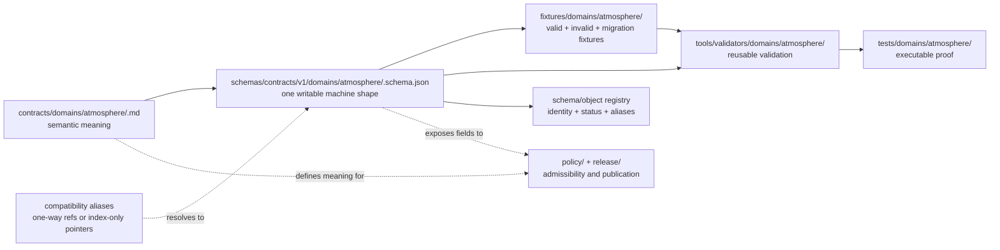

<!-- [KFM_META_BLOCK_V2]
doc_id: kfm://doc/adr-xxxx-atmosphere-schema-home
title: ADR-XXXX — Atmosphere Schema Home and Compatibility Convergence
type: adr
adr_id: ADR-XXXX
version: v0.1
status: proposed
effective_decision_status: not-assigned
owners:
  - "NEEDS VERIFICATION — architecture decision owner"
  - "NEEDS VERIFICATION — Atmosphere domain steward"
  - "NEEDS VERIFICATION — schema steward"
  - "NEEDS VERIFICATION — contract steward"
reviewers_required:
  - Architecture steward
  - Docs steward
  - Atmosphere domain steward
  - Schema steward
  - Contract steward
  - Validation and CI steward
  - Migration and compatibility steward
  - At least one affected schema consumer owner
created: 2026-05-19
updated: 2026-08-14
policy_label: public
truth_posture: cite-or-abstain
responsibility_root: docs/
current_path: docs/adr/ADR-XXXX-atmosphere-schema-home.md
supersedes: []
superseded_by: null
evidence_snapshot:
  repository: bartytime4life/Kansas-Frontier-Matrix
  base_ref: main
  base_commit: 3e6759f5fe1e5ec4537e950e0de3f317b4e1ac89
  target_prior_blob: 7e565aadf0e8a2362cbb4f13c5931c6e10d4d19d
  target_created_commit: bb6cbad6b0edfddf470bfa8880ae351501c0b22a
  adr_index_blob: 938c5894c36b99e14810918e2c550ab0e92d53b1
  directory_rules_blob: fd49a0b83e55cef52c1124281f093e263526898d
  adr_0029_blob: a4de0d7a96b78da59cfc499d1025e1508afd8dd9
  adr_0001_blob: ed6f258f8d9ea152996570768a31666953e4a809
  adr_0002_blob: e626d82970932c319a690fc6044727ed114ada6a
  schemas_root_readme_blob: ce53d0ddb998ddcb8208d0367c90f9c25e31a8ad
  atmosphere_schema_tree: 6a5185099feb9732e3f98d90435939d1545628ad
  atmosphere_schema_readme_blob: cad321bf62d7da2a723388d5978e04fbfc694b5b
  atmosphere_alias_readme_blob: 8ac07d48713ed6689370830e07646ebdcbfa78af
  atmosphere_root_compatibility_readme_blob: e7efa6509a726422e7439d52c430c0808478f39c
  air_alias_readme_blob: 6f2504a9054769f343cc33424171ebdb80157576
  domain_air_compatibility_readme_blob: 5a08947a4f0d7d2b298e2aece2b22ed23e1f366c
  atmosphere_contract_readme_blob: 2626d011b5d80e6d58870be3eff817d95116ffc7
  atmosphere_contract_compatibility_blob: e366429f3ff6c53d11faea39e7a64251a803811a
  versioned_contract_compatibility_blob: 4d2afb071908dad79604d1b6935cbe11b0898770
  schema_validation_workflow_blob: 0e1562f539323daa401184738a0c490b51e2999b
  air_observation_profile_blob: ea9630f3d1eb23d65e9c3cad91c662819e6c67b8
  air_observation_mirror_blob: 4df22268a660d8d2ff1af2ad6e5e3c121b224a0c
  air_observation_kebab_scaffold_blob: 44b50dedd1a29bc36202fccb00f5f4a346bc09c6
inspection_boundary: >
  Current-session GitHub reads covering the ADR inventory, accepted Directory Rules
  adoption, repo-wide schema-home and contract/schema-split ADRs, schema-root guidance,
  the recursive Atmosphere target tree, Atmosphere and Air compatibility lanes, selected
  strict and permissive schemas, Atmosphere semantic-contract lanes, schema-validation
  workflow, and bounded Atmosphere workflow. No complete clone, exhaustive consumer
  graph, schema registry, generator inventory, migration rehearsal, hosted validation for
  this branch, runtime request, source activation, release, correction, rollback drill,
  deployment, or publication was exercised.
source_lineage:
  - docs/domains/atmosphere/MISSING_OR_PLANNED_FILES.md
  - docs/domains/atmosphere/CANONICAL_PATHS.md
related:
  - docs/adr/README.md
  - docs/adr/INDEX.md
  - docs/adr/ADR-0001-schema-home--schemas-contracts-v1-is-canonical.md
  - docs/adr/ADR-0002-contracts-vs-schemas-split.md
  - docs/adr/ADR-0029-adopt-directory-governance-standard-v2.md
  - docs/doctrine/directory-rules.md
  - schemas/README.md
  - schemas/contracts/v1/domains/atmosphere/README.md
  - schemas/atmosphere/README.md
  - contracts/domains/atmosphere/README.md
  - .github/workflows/schema-validation.yml
  - .github/workflows/domain-atmosphere.yml
tags: [kfm, adr, atmosphere, air, schema-home, contracts, schemas, compatibility, migration, no-parallel-authority, cite-or-abstain]
notes:
  - "v0.1 replaces the generated scaffold at the same path with a repository-grounded, unassigned ADR candidate."
  - "The file remains ADR-XXXX and not-assigned; this revision does not allocate a number, accept a decision, or update the ADR index."
  - "Accepted Directory Rules v2 establish the schemas responsibility root and domain-lane routing; this candidate proposes Atmosphere-specific convergence, naming, compatibility, migration, and graduation rules."
  - "The configured target contains useful strict profiles, one-way mirrors, permissive scaffolds, filename variants, alternate Air/Atmosphere lanes, and unresolved identity and consumer drift."
  - "This documentation-only revision moves, renames, deletes, activates, promotes, releases, deploys, or publishes nothing."
[/KFM_META_BLOCK_V2] -->

<a id="top"></a>

# ADR-XXXX — Atmosphere Schema Home and Compatibility Convergence

> **Proposed decision.** After this candidate receives a collision-free ADR number and reviewed acceptance, Atmosphere-specific machine-checkable schemas will converge on `schemas/contracts/v1/domains/atmosphere/`. Semantic meaning will remain under `contracts/domains/atmosphere/`. Alternate Atmosphere and Air paths will be classified as bounded compatibility, mirror, transitional, deprecated, or denied surfaces and will not evolve as parallel authority.

[](#status)
[](#status)
[](#current-repository-evidence)
[](#current-enforcement-maturity)
[](#implementation-and-migration-plan)
[](#authority-and-publication-boundary)

> [!IMPORTANT]
> **This is an unassigned ADR candidate.** [`docs/adr/INDEX.md`](./INDEX.md) classifies this exact file as an explicit placeholder with decision state `not-assigned`. Replacing its generated scaffold, validating the Markdown, opening a pull request, or merging a documentation change does not allocate an ADR number, accept the decision, migrate schemas, or create implementation authority.

> [!CAUTION]
> **The proposed target is present but not converged.** The recursive tree under `schemas/contracts/v1/domains/atmosphere/` contains meaningful closed profiles, one-way compatibility mirrors, permissive scaffolds, PascalCase, snake_case, and kebab-case variants, mixed `$id` and `contract_doc` conventions, and additional object families not fully represented by its README. Path presence does not establish one canonical schema per object family.

> [!WARNING]
> **Schema validity is not truth, policy, evidence, release, or public safety.** A JSON document can satisfy Draft 2020-12 and still be semantically wrong, source-role-confused, unsupported by evidence, stale, rights-uncleared, sensitivity-restricted, policy-denied, unreleased, or unsafe for public use.

> [!NOTE]
> **Current validation is real but bounded.** Repository workflows execute selected Atmosphere fixture profiles and recursively meta-validate schema JSON. Broader Atmosphere semantics, authoritative schema registry closure, complete consumer migration, evidence closure, proof, release, correction, and rollback remain held or unverified.

**Quick navigation:** [Status](#status) · [Evidence](#evidence-boundary) · [Context](#context) · [Decision](#proposed-decision) · [Responsibilities](#responsibility-boundaries) · [Current evidence](#current-repository-evidence) · [Topology](#canonical-family-and-compatibility-topology) · [Identity](#naming-identity-and-schema-maturity) · [Authority](#authority-and-publication-boundary) · [Maturity](#current-enforcement-maturity) · [Validation](#validation-and-negative-tests) · [Migration](#implementation-and-migration-plan) · [Acceptance](#acceptance-gates) · [Consequences](#consequences) · [Alternatives](#alternatives-considered) · [Risks](#risk-and-open-question-ledger) · [Rollback](#correction-rollback-and-supersession) · [Checklist](#verification-checklist) · [References](#references) · [History](#revision-history)

---

<a id="status"></a>

## Status

| Field | Current value |
|---|---|
| **Record ID** | `ADR-XXXX` — unassigned placeholder |
| **Tracked path** | `docs/adr/ADR-XXXX-atmosphere-schema-home.md` |
| **Source metadata** | `proposed` |
| **Index classification** | Explicit placeholder / `not-assigned` |
| **Decision class** | Atmosphere domain schema routing, compatibility classification, filename and identity convergence, migration, enforcement, and rollback |
| **Adopted placement authority** | ADR-0029 accepts Directory Rules v2 and its responsibility-root and domain-lane rules |
| **Repo-wide schema-home record** | ADR-0001 remains `proposed`; accepted Directory Rules already establish the default versioned machine-schema route |
| **Contract/schema coupling record** | ADR-0002 remains effectively `proposed` |
| **Proposed Atmosphere schema home** | `schemas/contracts/v1/domains/atmosphere/` |
| **Current target posture** | Present, configured, mixed-maturity, and conflicted |
| **Semantic contract home** | `contracts/domains/atmosphere/` |
| **Migration posture** | `HOLD` pending inventory, authority, consumer, identity, validation, and rollback closure |
| **Implementation effect of this revision** | Documentation only |
| **Release or publication effect** | None |
| **Supersedes / superseded by** | No ADR / no ADR; this edition replaces only the generated scaffold text at the same path |

### Assignment, acceptance, implementation, and release are separate

Four transitions must remain visible:

1. **Number assignment** requires a collision-free numeric ADR ID, matching filename/H1/metadata, and a synchronized update to the canonical ADR index.
2. **ADR acceptance** would approve the Atmosphere-specific routing, compatibility, naming, identity, migration, and graduation rules recorded here.
3. **Implementation convergence** would require an object-by-object inventory, consumer mapping, selected canonical schemas, bounded mirrors, migration records, fixtures, validators, CI, registry linkage, correction, and rollback evidence.
4. **Release or publication** remains a separate governed transition for data and public products. Schema convergence cannot publish an Atmosphere record, API response, map layer, advisory, or AI answer.

This one-file revision performs none of those transitions beyond replacing a scaffold with a reviewable candidate.

[Back to top](#top)

---

<a id="evidence-boundary"></a>

## Evidence boundary

This revision is grounded in repository bytes at `main@3e6759f5fe1e5ec4537e950e0de3f317b4e1ac89`.

| Evidence surface | CONFIRMED current state | What remains unproved |
|---|---|---|
| ADR inventory | This file is indexed as an explicit `ADR-XXXX` scaffold with state `not-assigned` | Number assignment or decision acceptance |
| Target history | The prior file was a generated scaffold created by the domain-inventory automation | Domain or schema-steward approval |
| ADR-0029 / Directory Rules | ADR-0029 is accepted and adopts the exact Directory Rules v2 bytes | Atmosphere-specific migration completion |
| ADR-0001 | Present and `proposed`; records dedicated schema-family routing and migration rules on top of the adopted schema-root default | ADR-0001 acceptance |
| ADR-0002 | Present with source status `draft` and effective status `proposed` | Binding cross-surface coupling rule |
| `schemas/README.md` | `schemas/` owns machine-checkable shape and treats root-level domain lanes as compatibility or migration surfaces | Complete Atmosphere convergence |
| Proposed target tree | `schemas/contracts/v1/domains/atmosphere/` exists with many schemas and child lanes | One authoritative file per object family |
| Strict profile | `air_observation.schema.json` is a closed Draft 2020-12 profile with explicit source, time, evidence, rights, sensitivity, release, and anti-collapse constraints | Acceptance, complete consumer adoption, or release readiness |
| One-way mirror | `AirObservation.schema.json` is a `$ref` mirror to the lowercase profile and says not to evolve independently | Whether every alias follows this model |
| Competing scaffold | `air-observation.schema.json` is a separate permissive scaffold with a different `$id` and contract path | Safe deletion or semantic equivalence |
| Short Atmosphere alias | `schemas/contracts/v1/atmosphere/README.md` is an index/compatibility lane pointing to the domain path | Retirement date or all-consumer closure |
| Root Atmosphere compatibility lane | `schemas/atmosphere/README.md` freezes new schema definitions and records path, filename, `$id`, contract, fixture, validator, and CI drift | Complete recursive inventory and migration rehearsal |
| Air aliases | `schemas/contracts/v1/air/` contains a compatibility README and an `AirStation.schema.json` scaffold; `schemas/contracts/v1/domains/air/` is an index-only candidate | Final Air-versus-Atmosphere disposition |
| Semantic contracts | `contracts/domains/atmosphere/` is the active draft meaning lane; other contract paths identify themselves as compatibility or conflict surfaces | Contract completeness and one-to-one pairing |
| Schema validation workflow | Recursively parses schema JSON, meta-validates `*.schema.json`, and requires Draft 2020-12 plus unique `$id` under `schemas/contracts/v1/` | Atmosphere semantic correctness, policy, evidence, migration, or release |
| Atmosphere workflow | Executes selected synthetic profiles and explicitly preserves a broader Atmosphere hold | Full schema-family, policy, proof, release, or public-surface coverage |
| Schema registry and consumer graph | Not established strongly enough in this inspection | Canonical identity, all producers/consumers, compatibility sunset |
| Runtime and publication | No runtime request, released payload, map layer, EvidenceBundle closure, correction, or rollback drill was exercised | Production behavior and public safety |

### Truth labels used here

- **CONFIRMED** — verified from the pinned repository evidence named above.
- **PROPOSED** — the decision, target state, naming rule, or implementation plan recorded by this unaccepted candidate.
- **UNKNOWN** — evidence is insufficient for a stronger claim.
- **NEEDS VERIFICATION** — a concrete repository, consumer, registry, test, or review check remains open.
- **CONFLICTED** — two or more paths, filenames, identifiers, contracts, or maturity claims are incompatible.
- **HOLD** — migration or graduation must stop until the identified obligations close.

### Out of scope

This candidate does not:

- assign a numeric ADR ID or modify the ADR index;
- accept ADR-0001, ADR-0002, or this candidate;
- define every Atmosphere object field;
- choose a repo-wide canonical JSON or `$id` URI grammar;
- declare every existing snake_case file canonical;
- select or delete duplicate schemas by filename alone;
- migrate consumers, contracts, fixtures, validators, workflows, registries, or generated outputs;
- activate sources, ingest live data, change policy, promote lifecycle records, release, deploy, or publish;
- authorize medical, regulatory, emergency, alert, or life-safety guidance.

[Back to top](#top)

---

<a id="context"></a>

## Context

Atmosphere/Air needs machine-checkable shapes for observations, stations, model and forecast context, remote-sensing context, air-quality reconciliation, climate context, advisory referral context, receipts, registry profiles, and other domain objects. The repository has substantial work in this area, but it accumulated through several path and naming conventions.

### The governing split

```text
contracts/                    semantic meaning and claim limits
schemas/                      machine-checkable shape and structural identity
policy/                       admissibility, rights, sensitivity, and obligations
fixtures/                     representative valid, invalid, edge, and golden examples
tests/                        executable proof of declared behavior
tools/validators/             reusable deterministic validation
control_plane/ or registry    machine navigation and status projections
data/                         lifecycle records, receipts, proofs, catalogs, and published carriers
release/                      promotion, release, correction, withdrawal, and rollback decisions
```

Those surfaces must cooperate without collapsing. A schema can require `knowledge_character`, time, source, evidence, rights, sensitivity, or release-reference fields. It cannot decide whether the source is authoritative, whether evidence is sufficient, whether rights permit use, whether a claim is safe, or whether an object is released.

### Current Atmosphere-specific problems

1. **Path multiplicity.** Atmosphere-related schema guidance exists under `schemas/atmosphere/`, `schemas/contracts/v1/atmosphere/`, `schemas/contracts/v1/air/`, `schemas/contracts/v1/domains/air/`, and `schemas/contracts/v1/domains/atmosphere/`.
2. **Domain-slug conflict.** `atmosphere` and `air` appear as candidate ownership segments. Current domain registration and Atmosphere documentation use `atmosphere`, while legacy or compatibility paths retain `air`.
3. **Filename multiplicity.** PascalCase, snake_case, and kebab-case files coexist for several object families.
4. **Identity drift.** `$id` namespaces and `contract_doc` paths vary across files that appear to describe the same family.
5. **Maturity mixing.** Closed profiles, one-way mirrors, permissive empty-property scaffolds, candidate assessment schemas, domain records, receipt indexes, and registry indexes coexist in one tree.
6. **Index drift.** The target README documents useful selected profiles but is not a complete account of the recursive tree.
7. **Consumer uncertainty.** An exhaustive producer, validator, `$ref`, API, package, workflow, fixture, registry, release, and external consumer graph was not established.
8. **Authority risk.** Selecting a winner by path, case, or apparent strictness could erase unique semantics or break consumers without a governed migration.
9. **Validation asymmetry.** Current CI can prove JSON and meta-schema validity and selected synthetic behavior while leaving broader semantic, policy, evidence, release, and migration obligations open.

### Why an ADR is warranted

The decision affects architecture, domain identity, semantic contracts, machine schemas, compatibility paths, migration, validators, fixtures, CI, consumers, and rollback. It is not a formatting preference. It decides where Atmosphere machine shape may evolve, how aliases behave, and what evidence is required before old paths can be retired.

The target path remains under `docs/adr/`, its existing responsibility root. No new repository root or parallel schema home is introduced by this documentation change.

[Back to top](#top)

---

<a id="proposed-decision"></a>

## Proposed decision

Upon numeric assignment and reviewed acceptance, KFM will apply the following Atmosphere schema-home contract.

### 1. Canonical family route

Atmosphere-specific machine-checkable schemas belong under:

```text
schemas/contracts/v1/domains/atmosphere/
```

This is a domain lane inside the adopted `schemas/` responsibility root. It is not a new root and does not give every current file in the lane equal or accepted authority.

### 2. Canonical domain slug

The machine-schema domain segment is `atmosphere`. `air` remains a display term, code alias, source-family term, or compatibility path only where explicitly registered. New independent schema authority must not be created under an `air` lane.

### 3. Semantic contract route

Atmosphere object meaning belongs under:

```text
contracts/domains/atmosphere/
```

Contracts define object purpose, field meaning, source-role and knowledge-character boundaries, claim limits, lifecycle semantics, and compatibility expectations. They do not become JSON Schema or executable policy authority.

### 4. One writable schema per object family and version

Each Atmosphere object family and schema version has exactly one writable machine-schema definition. Every other path is one of:

- a one-way `$ref` mirror;
- an index-only compatibility path;
- a transitional migration source;
- a deprecated tombstone or redirect;
- a separately governed profile with distinct identity and semantics;
- a held conflict awaiting classification.

Two independently editable files must not claim the same object family and version.

### 5. Canonical filename default

New canonical Atmosphere schema filenames use lowercase snake_case:

```text
<object_family>.schema.json
```

Examples include `air_observation.schema.json`, `forecast_context.schema.json`, and `advisory_context.schema.json`.

This rule does **not** automatically promote every existing snake_case file. An object-by-object migration record must compare content, `$id`, contract pairing, consumers, fixtures, validators, and unique semantics before selecting the authoritative definition.

### 6. Alias behavior

Where a compatibility filename must remain, it should be a minimal one-way `$ref` mirror to the selected canonical schema, declare `x-kfm.status: MIRROR`, identify `canonical_schema`, prohibit independent evolution, and carry a reviewed retirement or support condition.

A compatibility README may index the target. It must not contain independently evolving schema definitions.

### 7. Shared and cross-domain routing

- Reusable source, evidence, geometry, time, receipt, runtime, policy-envelope, release, and correction shapes remain in their verified shared schema families.
- Atmosphere references shared shapes rather than copying them.
- Cross-domain seam schemas belong under the accepted cross-domain schema route with a registered seam identity; they do not live inside an arbitrary lead domain.
- Atmosphere-specific profiles may constrain shared shapes only when the contract records the specialization and compatibility behavior.

### 8. Schema identity

Every selected canonical schema must have:

- JSON Schema Draft 2020-12 unless a reviewed successor changes the dialect;
- a stable, unique `$id` consistent with the accepted schema identity grammar;
- a version and compatibility posture;
- one paired semantic contract or an explicit reviewed shared-profile rationale;
- provenance or generator identity when generated;
- correction and supersession linkage when identity or meaning changes.

This ADR does not choose a repo-wide `$id` URI scheme. Existing `https://schemas.kfm.local/...` and `kfm://...` forms remain inventory and migration concerns until the governing identity decision closes.

### 9. Maturity is explicit

A schema is not active merely because it exists, parses, or passes meta-schema validation. Each file uses a finite maturity state and links its supporting evidence. `ACTIVE_SCHEMA` requires all applicable acceptance gates in this ADR.

### 10. Compatibility growth is frozen

No new canonical Atmosphere schema definition should be added under:

```text
schemas/atmosphere/
schemas/contracts/v1/atmosphere/
schemas/contracts/v1/air/
schemas/contracts/v1/domains/air/
```

Those paths may receive only bounded compatibility, migration, deprecation, backlink, or correction documentation until their disposition is reviewed.

### 11. Migration is object-by-object

No bulk rename, case normalization, or deletion is authorized. Migration must classify every file, `$id`, contract, producer, consumer, fixture, validator, workflow, registry entry, generated artifact, release reference, and external dependency that could be affected.

### 12. Publication remains separate

A canonical schema, validator pass, migration, pull request, or accepted ADR does not admit a source, prove a claim, issue an advisory, release data, or publish a public product. Public Atmosphere surfaces still require evidence, policy, review, release, correction, and rollback appropriate to consequence.

[Back to top](#top)

---

<a id="responsibility-boundaries"></a>

## Responsibility boundaries

| Responsibility | Owning surface | Atmosphere application |
|---|---|---|
| Architecture decision | `docs/adr/` | This candidate records schema routing, compatibility, migration, acceptance, and rollback. |
| Domain explanation | `docs/domains/atmosphere/` | Human domain vocabulary, object map, source roles, publication posture, and verification backlog. |
| Semantic meaning | `contracts/domains/atmosphere/` | Atmosphere object meaning and anti-collapse invariants. |
| Machine shape | `schemas/contracts/v1/domains/atmosphere/` after accepted convergence | JSON Schema and schema-family indexes only. |
| Shared machine shape | Accepted shared families below `schemas/contracts/v1/` | Source, evidence, time, geometry, receipt, runtime, release, correction, and other reusable shapes. |
| Cross-domain shape | Accepted cross-domain schema route | Registered Atmosphere-Hydrology, Atmosphere-Agriculture, Atmosphere-Biodiversity, or other seam schemas. |
| Policy | `policy/domains/atmosphere/` and accepted shared policy roots | Source-role, rights, sensitivity, stale-state, advisory, low-cost-sensor, and public-release decisions. |
| Fixtures | `fixtures/domains/atmosphere/` and accepted shared fixture lanes | Valid, invalid, boundary, correction, migration, and mirror cases. |
| Tests | `tests/domains/atmosphere/` and accepted schema/contract test roots | Executable behavior and regression proof. |
| Validators | `tools/validators/domains/atmosphere/` or accepted shared validator roots | Reusable checks and stable diagnostics. |
| Schema and object registries | Accepted control-plane or registry surfaces | Stable identity, version, owner, status, canonical path, aliases, and supersession. |
| Lifecycle data | `data/` lanes | RAW, WORK, QUARANTINE, PROCESSED, CATALOG/TRIPLET, receipts, proofs, and PUBLISHED carriers. |
| Release authority | `release/` | Promotion, release, correction, withdrawal, rollback, and signatures. |
| API, UI, map, and AI | Governed application and package roots | Consume released, policy-permitted objects through governed interfaces. |

### No-collapse rules

1. A schema is not a semantic contract.
2. A schema-valid payload is not a true claim.
3. A schema `$id` is not canonical merely because it is unique.
4. A filename is not object identity.
5. A strict schema is not automatically authoritative over a permissive schema without migration evidence.
6. A fixture is not production data.
7. A validator is not policy or release authority.
8. A workflow success is not publication.
9. A README is not a schema registry.
10. A compatibility mirror must not become a second writer.
11. A generated schema without producer provenance and reproducibility is not safely maintainable.
12. Atmosphere schema convergence must not collapse Atmosphere and Hazards life-safety responsibilities.

[Back to top](#top)

---

<a id="current-repository-evidence"></a>

## Current repository evidence

### Verified topology

```text
schemas/
├── README.md
├── atmosphere/                                  # compatibility and migration index
└── contracts/
    └── v1/
        ├── air/                                 # compatibility lane; contains AirStation scaffold
        ├── atmosphere/                          # compatibility/index lane
        └── domains/
            ├── air/                             # compatibility/index candidate
            └── atmosphere/                      # proposed target; mixed schema inventory
                ├── README.md
                ├── *.schema.json                # multiple maturity and naming forms
                ├── receipts/
                │   └── README.md
                └── registry/
                    └── README.md

contracts/
├── atmosphere/                                  # compatibility/path-conflict lane
├── v1/domains/atmosphere/                       # compatibility guard
└── domains/atmosphere/                          # active draft semantic-contract lane
```

This is an evidence map, not a migration order and not proof that every path is complete.

### Representative collision: AirObservation

| File | Current role | Material difference |
|---|---|---|
| `air_observation.schema.json` | `DRAFT_SCHEMA` bounded profile | Closed shape, explicit source/time/evidence/rights/sensitivity/release fields, anti-model constraints, `additionalProperties: false` |
| `AirObservation.schema.json` | `MIRROR` | Minimal `$ref` to the lowercase profile and explicit no-independent-evolution metadata |
| `air-observation.schema.json` | `PROPOSED` scaffold | Empty properties, `additionalProperties: true`, different `$id`, and a different contract path |

The mirror demonstrates the intended compatibility direction. The permissive kebab-case scaffold demonstrates why filenames cannot be normalized or deleted without an object-by-object migration record.

### Current path classification

| Path | Current verified posture | Proposed disposition after acceptance |
|---|---|---|
| `schemas/contracts/v1/domains/atmosphere/` | Present, configured, mixed-maturity, conflicted | Canonical family target after object-by-object convergence |
| `schemas/contracts/v1/atmosphere/` | Compatibility/index README | Index-only, bounded alias, or retired after consumer closure |
| `schemas/atmosphere/` | Compatibility, drift, and migration index; new schemas frozen | Temporary migration/control surface, then bounded tombstone or retirement |
| `schemas/contracts/v1/air/` | Compatibility README plus an AirStation scaffold | Inventory, classify, and migrate or explicitly profile; no new canonical definitions |
| `schemas/contracts/v1/domains/air/` | Compatibility/index candidate | Index-only or retirement unless an accepted successor creates a distinct domain |
| `contracts/domains/atmosphere/` | Active draft semantic-contract lane | Semantic contract home |
| `contracts/atmosphere/` | Compatibility/path-conflict lane | Bounded pointer or migration source |
| `contracts/v1/domains/atmosphere/` | Compatibility guard | Pointer only; no parallel semantic authority |

### Current validation coverage

| Surface | What it checks | What it does not establish |
|---|---|---|
| `schema-validation` | JSON parsing, Draft 2020-12 meta-schema validity, unique `$id` values inside the versioned tree, eight configured fixture-backed validator families, schema/contract tests | Complete Atmosphere family coverage, semantic truth, policy, rights, evidence, migration, release, or public safety |
| `domain-atmosphere` | Selected public-safe precipitation, knowledge-character, low-cost-sensor, observed-versus-modeled, AirNow/AQS, prescribed-burn, PM2.5 candidate, and related synthetic checks | Full Atmosphere schema inventory, registry closure, all consumers, all policy, evidence, proof, release, correction, rollback, or public behavior |
| Strict Atmosphere profiles | Meaningful structural constraints for selected object families | Accepted canonical status for the entire tree |
| Compatibility mirrors | One-way reference behavior for selected names | Complete alias convergence or retirement |
| README indexes | Human navigation and visible holds | Machine registry authority or exhaustive inventory |

### Confirmed documentation drift

The planned-file and canonical-path documents provide useful lineage but predate current repository evidence and continue to label paths broadly as proposed or unverified. They must not override the current tree, accepted Directory Rules, or later repository-grounded schema indexes. This ADR preserves them as source lineage and updates the decision against current bytes.

[Back to top](#top)

---

<a id="canonical-family-and-compatibility-topology"></a>

## Canonical family and compatibility topology

### Proposed target state



The arrows describe dependency and evidence relationships, not write authority. Each surface remains owned by its responsibility root.

### Object-family selection record

Every Atmosphere schema family should receive a migration record with at least:

| Field | Requirement |
|---|---|
| `object_family_id` | Stable registered identity |
| `semantic_contract` | One contract or reviewed shared-profile rationale |
| `canonical_schema_path` | One selected writable file |
| `canonical_schema_id` | Stable `$id` and version |
| `candidate_paths` | Every discovered filename and path variant |
| `candidate_digests` | Content digest for comparison and rollback |
| `classification` | Canonical, profile, mirror, transitional, deprecated, unique, conflicted, or denied |
| `unique_semantics` | Fields or constraints that must be retained or explicitly rejected |
| `producers` | Generators, pipelines, packages, scripts, or maintainers that write instances or schemas |
| `consumers` | Validators, `$ref` users, APIs, packages, tests, fixtures, workflows, registries, releases, and external users |
| `compatibility` | Backward-compatibility and alias behavior |
| `validation` | Positive, negative, mirror, migration, and regression tests |
| `migration_commit` | Exact reversible change identity |
| `rollback_target` | Prior paths, ids, and consumer state |
| `owner_and_review` | Accountable owner and required reviewers |
| `retirement_condition` | Evidence required before deleting or freezing an alias |

### Compatibility rules

- A mirror contains no independent properties, required fields, conditionals, definitions, or semantics beyond its compatibility metadata and `$ref`.
- A mirror has tests proving that accepted and rejected instances have the same polarity as the canonical schema.
- An index-only path contains documentation, migration records, backlinks, and ADR pointers—not schema definitions.
- A transitional schema has an owner, deadline or reviewed exit condition, migration target, consumer list, and rollback path.
- A deprecated schema remains immutable except for correction, security, or compatibility notices.
- A profile must have distinct semantics, version, contract, fixtures, and identity; it must not be a duplicate renamed as a profile.
- A held conflict must not gain new consumers.

[Back to top](#top)

---

<a id="naming-identity-and-schema-maturity"></a>

## Naming, identity, and schema maturity

### Canonical naming proposal

| Identity layer | Proposed rule | Boundary |
|---|---|---|
| Domain ID and path slug | `atmosphere` | `air` remains an explicit alias or source/display term, not a second domain authority |
| Canonical schema filename | lowercase snake_case, `<object_family>.schema.json` | Does not retroactively select every existing snake_case file |
| Semantic contract filename | Current contract convention may remain PascalCase | Contract filename and schema filename need a registered crosswalk, not identical spelling |
| Code identifier | Language-native alias such as `air_observation` or `AirObservation` | Code aliases never create filesystem authority |
| Display label | Human-facing text such as “Air Observation” | Display labels are not object IDs |
| `$id` | Stable, unique, version-aware identifier under accepted grammar | Exact URI grammar remains outside this ADR |
| Object instance ID | Contract-defined deterministic identity where practical | Schema path is not an instance ID |

### Finite schema maturity states

| State | Meaning | Allowed consumers |
|---|---|---|
| `STUB` | Parseable placeholder without meaningful field closure | Documentation and inventory only |
| `DRAFT_SCHEMA` | Meaningful constraints exist; pairing or proof remains incomplete | Synthetic tests and explicitly bounded development consumers |
| `PROFILE` | Reviewed specialization of a shared schema with distinct contract and identity | Consumers named by the profile |
| `MIRROR` | One-way compatibility `$ref` to another schema | Legacy consumers only; no independent evolution |
| `TRANSITIONAL` | Temporary migration source or target with explicit exit and rollback | Named migration consumers only |
| `HOLD` | Conflict, identity, rights, consumer, or validation obligation blocks use | No new consumers |
| `ACTIVE_SCHEMA` | Accepted contract pairing, identity, fixtures, validators, registry, review, and compatibility posture | Governed producers and consumers within declared scope |
| `DEPRECATED` | Superseded, immutable compatibility surface with a successor and retirement condition | Existing consumers during the support window |
| `RETIRED` | No supported consumers; retained only where audit or history requires | No runtime consumers |

### `ACTIVE_SCHEMA` minimum closure

A schema may become `ACTIVE_SCHEMA` only when:

- its object family and owner are registered;
- its semantic contract is reviewed;
- its canonical path, filename, `$id`, and version are stable;
- valid, invalid, boundary, correction, and compatibility fixtures exist as applicable;
- reusable validation fails closed with stable diagnostics;
- CI executes the relevant tests non-vacuously;
- policy-input and sensitivity fields are sufficient for applicable decisions;
- producer and consumer inventories are recorded;
- aliases and prior versions are classified;
- migration and rollback are tested where existing consumers are affected;
- no unresolved parallel writer exists;
- release significance and public-safety boundaries are documented;
- required human reviewers approve.

`ACTIVE_SCHEMA` is machine-shape maturity. It still does not prove that a particular instance is true, admissible, evidence-backed, released, or public-safe.

[Back to top](#top)

---

<a id="authority-and-publication-boundary"></a>

## Authority and publication boundary

Atmosphere schemas are downstream of semantic decisions and upstream of validation, policy input, instance processing, and release assembly. They do not become a source of atmospheric truth.

A public Atmosphere claim or carrier still requires, as applicable:

- source identity, source role, rights, terms, and freshness;
- distinct observed, valid, model, retrieval, release, correction, and supersession time;
- EvidenceRef resolution to admissible EvidenceBundle support;
- knowledge-character and observed-versus-modeled separation;
- unit and parameter normalization;
- policy and sensitivity decisions;
- review state and accountable owners;
- promotion and release records;
- correction, withdrawal, cache invalidation, and rollback targets.

Public clients, MapLibre, Evidence Drawer, Focus Mode, exports, notifications, and search must consume governed API responses or released public-safe carriers. They must not treat schema files, fixture payloads, candidate records, or internal stores as public truth.

Atmosphere and air-quality surfaces remain non-medical, non-regulatory, non-emergency, and non-life-safety unless an official authority and an accepted KFM policy explicitly establish a narrower role. Advisory context remains referral-only under its separate proposed decision.

[Back to top](#top)

---

<a id="current-enforcement-maturity"></a>

## Current enforcement maturity

| Capability | Current state |
|---|---|
| ADR candidate identity | `CONFIRMED / not-assigned` |
| Adopted `schemas/` responsibility root | `CONFIRMED` through ADR-0029 / Directory Rules |
| Configured versioned schema tree | `CONFIRMED` |
| Atmosphere proposed target lane | `CONFIRMED present` |
| Target authority convergence | `CONFLICTED / HOLD` |
| Atmosphere semantic contract lane | `CONFIRMED present / draft` |
| Domain slug | `atmosphere` is current registered direction; `air` compatibility paths remain |
| Canonical filename convention | `PROPOSED`; mixed forms remain |
| Canonical `$id` grammar | `NEEDS VERIFICATION` |
| One schema per Atmosphere family | Not established |
| Strict selected profiles | `CONFIRMED partial` |
| One-way selected mirrors | `CONFIRMED partial` |
| Permissive scaffolds | `CONFIRMED present` |
| Complete contract-schema pairing | `NEEDS VERIFICATION` |
| Complete schema registry | `UNKNOWN / not established in this inspection` |
| Complete producer and consumer graph | `UNKNOWN` |
| Valid and invalid Atmosphere fixture coverage | `PARTIAL` |
| Atmosphere validators and tests | `PARTIAL / bounded` |
| Recursive meta-schema and `$id` checks | `CONFIRMED workflow definition` |
| Alias parity tests | `NEEDS VERIFICATION beyond selected profiles` |
| Migration manifest and rehearsal | Absent from inspected evidence |
| Correction and rollback drill | Not established |
| Public release effect | None |

**Overall maturity: `CONFIGURED TARGET / MIXED IMPLEMENTATION / CONVERGENCE HOLD`.** The repository contains useful Atmosphere schema work and real bounded validation, but no evidence supports treating the whole target tree as a single clean, accepted, release-capable authority family.

[Back to top](#top)

---

<a id="validation-and-negative-tests"></a>

## Validation and negative tests

Validation must be deterministic, non-vacuous, offline-capable for core checks, and explicit about what it proves.

### Required validation families

| Family | Required checks |
|---|---|
| ADR control plane | Placeholder remains indexed `not-assigned` until numeric assignment; accepted status cannot be inferred |
| Placement | Canonical target is under `schemas/`; no new schema authority appears in compatibility lanes |
| Domain identity | `atmosphere` is the schema path slug; `air` is only an explicit alias or reviewed distinct profile |
| Inventory | Every Atmosphere/Air schema path, `$id`, contract path, digest, producer, and consumer is inventoried |
| Filename convergence | One canonical file per object family/version; case and punctuation variants are classified |
| Schema identity | Draft 2020-12, stable unique `$id`, version, owner, contract, and status fields resolve |
| Contract pairing | Canonical schemas link to reviewed semantic contracts or approved shared profiles |
| Mirror parity | Mirrors accept and reject the same fixtures as their canonical schema and contain no independent shape |
| Strictness | Empty permissive scaffolds cannot be promoted as active schemas |
| Source-role boundary | Observed sensor, public report, regulatory archive, low-cost sensor, model field, remote-sensing mask, derived fusion, climate context, and advisory context do not collapse |
| Temporal boundary | Observed, generated/model-run, valid, retrieval, release, correction, expiry, and supersession times remain distinct where applicable |
| Units and parameters | Units, averaging periods, reference periods, and parameter identities are explicit and validated |
| Evidence and policy fields | Applicable evidence, rights, sensitivity, limitations, and non-life-safety posture can be evaluated without schemas making the decision |
| Fixtures | Non-empty valid and invalid cases exist for canonical, mirror, migration, and correction behavior |
| Consumer compatibility | Producers, `$ref` users, APIs, packages, workflows, registries, and releases remain compatible or migrate explicitly |
| CI | Changed-area and full checks exercise the affected family; zero-fixture or zero-consumer passes are rejected |
| Migration | Exact before/after paths, IDs, digests, aliases, consumers, tests, and rollback target are recorded |
| Public boundary | No schema, fixture, candidate, or internal path becomes a normal public-client truth source |

### Stable reason-code families

A future Atmosphere schema-convergence validator should emit stable diagnostics such as:

- `atmosphere_schema_home_unassigned`
- `atmosphere_schema_path_outside_target`
- `air_alias_unclassified`
- `parallel_schema_authority`
- `object_family_unregistered`
- `canonical_schema_missing`
- `canonical_schema_duplicate`
- `schema_filename_variant_unclassified`
- `schema_id_missing`
- `schema_id_duplicate`
- `schema_id_path_mismatch`
- `schema_contract_unresolved`
- `schema_contract_path_conflict`
- `schema_status_invalid`
- `permissive_scaffold_active`
- `mirror_canonical_ref_missing`
- `mirror_contains_independent_shape`
- `mirror_fixture_parity_failed`
- `schema_fixture_inventory_vacuous`
- `schema_validator_missing`
- `schema_consumer_inventory_incomplete`
- `schema_generator_provenance_missing`
- `schema_migration_manifest_missing`
- `schema_rollback_target_missing`
- `schema_publication_authority_confusion`

Reason-code names remain proposed until a contract and validator adopt them.

### Required negative fixtures and tests

At minimum, convergence tests should reject:

- a new schema definition under `schemas/atmosphere/`;
- a new canonical schema under either `air` alias lane;
- the same object family and version with two writable schemas;
- PascalCase, snake_case, and kebab-case files all treated as active;
- a mirror with its own `properties`, `required`, `allOf`, or `$defs` shape;
- a mirror pointing to a missing or held canonical schema;
- a permissive empty-property scaffold marked `ACTIVE_SCHEMA`;
- a canonical schema without a semantic contract or reviewed shared-profile rationale;
- duplicate or missing `$id` values;
- an `$id` silently changed with no compatibility or correction record;
- an Atmosphere schema that copies a shared EvidenceRef, SourceDescriptor, geometry, receipt, or release schema;
- an observed object carrying model-run identity;
- a model object presented as observation;
- AQI presented as concentration;
- AOD presented as ground-level PM2.5;
- low-cost sensor output without required caveat and confidence fields;
- advisory context that permits life-safety instruction;
- a migration that drops a consumer, fixture polarity, unique field, or contract reference;
- a validator reporting pass with zero applicable fixtures or zero inventoried consumers;
- a public client reading a schema fixture, candidate, RAW, WORK, QUARANTINE, or internal schema registry directly.

Required positive cases include:

- one strict canonical schema with a reviewed contract, fixtures, validator, and registry record;
- a minimal one-way mirror with exact positive and negative polarity parity;
- a distinct reviewed profile that extends a shared family without copying authority;
- a consumer migration that preserves IDs or supplies a versioned compatibility alias;
- a correction that supersedes an erroneous schema version while preserving audit history;
- an exact rollback to the pre-migration path and consumer state.

### Current documentation-only validation target

For this revision, the changed-area checks should include:

```bash
python tools/validators/validate_adr_index.py
python -m pytest tests/validators/test_validate_adr_index.py -q --strict-config --strict-markers
python tools/validators/docs_meta_block/validate_docs_meta_block.py --repo-root .
python tools/validators/validate_docs_staleness.py --repo-root .
python tools/validators/validate_docs_document_graph.py --repo-root .
```

Command names must be reconciled against current repository entrypoints before being represented as completed. Hosted CI remains the authoritative observed result for the pull-request head.

[Back to top](#top)

---

<a id="implementation-and-migration-plan"></a>

## Implementation and migration plan

Use dependency-ordered, reviewable, reversible waves. Do not migrate schemas in the same change that first accepts this ADR unless the adopted governance process explicitly approves an atomic decision packet and the implementation change does not rely on newly self-created authority.

### Wave A — Decision and authority closure

1. Assign a collision-free numeric ADR ID.
2. Rename the file and H1 through a reviewed link-preserving change.
3. Update the canonical ADR index in the same change.
4. Reconcile this decision with ADR-0001, ADR-0002, ADR-0029, and accepted Directory Rules.
5. Confirm `atmosphere` as the domain path slug and register `air` aliases explicitly.
6. Name accountable schema, contract, Atmosphere, validation, migration, and docs owners.
7. Approve the migration evidence and rollback contract.
8. Do not claim implementation convergence.

### Wave B — Complete inventory and freeze

1. Pin an exact repository tree.
2. Recursively inventory all Atmosphere/Air schema and contract paths.
3. Record path, filename, `$id`, title, version, status, contract link, source/provenance, digest, refs, fields, strictness, and child schemas.
4. Search every `$ref`, import, generator, validator, fixture, test, workflow, package, API, registry, release object, docs link, and external consumer visible to the project.
5. Freeze new canonical definitions in compatibility paths.
6. Record unresolved items in the drift and verification registers.
7. Produce an immutable inventory artifact and review receipt.

### Wave C — Object-family classification

For each object family:

1. identify the semantic contract and owner;
2. compare every candidate schema structurally and semantically;
3. select the canonical file or return `HOLD`;
4. retain unique constraints or explicitly reject them with rationale;
5. classify alternatives as profile, mirror, transitional, deprecated, unique, or denied;
6. select the stable `$id`, filename, version, and compatibility posture;
7. define valid, invalid, migration, mirror, and rollback fixtures;
8. obtain affected consumer-owner review.

Do not classify by filename preference alone.

### Wave D — Canonical schema hardening

1. Close required fields and `additionalProperties` posture according to the semantic contract.
2. Reference accepted shared schemas instead of copying them.
3. Add stable identity, source-role, knowledge-character, time, evidence, rights, sensitivity, limitation, and correction fields where applicable.
4. Add reusable validators with finite diagnostics.
5. Add non-vacuous valid and invalid fixtures.
6. Register canonical identity, status, owner, aliases, and supersession.
7. Add generator provenance and reproducibility where schemas are generated.
8. Keep status below `ACTIVE_SCHEMA` until all gates close.

### Wave E — Compatibility migration

1. Update named consumers to the selected path and `$id`.
2. Convert supported aliases to minimal one-way mirrors or index-only pointers.
3. Add compatibility parity tests.
4. Preserve old paths for the reviewed support window when required.
5. Update contracts, docs, registries, workflows, fixtures, tests, generators, and releases together.
6. Emit a migration record with before/after digests and rollback target.
7. Prohibit direct editing of mirrors.
8. Verify no public or lifecycle state changed.

### Wave F — Enforcement and ratchet

1. Add a repository guardrail rejecting new Atmosphere schema authority outside the target.
2. Add duplicate object-family, filename-variant, `$id`, and contract-pairing checks.
3. Add mirror-shape and polarity-parity checks.
4. Add changed-area selection for Atmosphere schema, contract, fixture, validator, and consumer changes.
5. Require non-empty fixture and consumer inventories.
6. Ratchet known inherited debt only after reviewed convergence.
7. Keep validator output separate from proof, policy, release, and publication authority.

### Wave G — Retirement and rollback proof

1. Confirm zero writers and reviewed consumer closure for each alias eligible for retirement.
2. Preserve historical identity, supersession, and correction links.
3. Rehearse rollback to the exact pre-migration tree.
4. Rehearse correction of a flawed canonical schema and propagation to consumers.
5. Retire only through a reviewed migration/deprecation record.
6. Retain audit artifacts required for reproducibility and public correction.

### Migration non-effects

Schema-home convergence must not:

- rewrite source or lifecycle data merely to match a path;
- promote candidate instances;
- alter rights, sensitivity, policy, or release decisions by implication;
- create a public route to schema or fixture stores;
- issue or change advisory guidance;
- delete evidence, receipts, proofs, catalogs, releases, corrections, or rollback records;
- erase the history of an incorrect schema.

[Back to top](#top)

---

<a id="acceptance-gates"></a>

## Acceptance gates

### ADR assignment and acceptance

- [ ] A collision-free numeric ADR ID is selected.
- [ ] Filename, H1, metadata, references, and canonical index agree.
- [ ] Source and effective status are reviewed and synchronized.
- [ ] ADR-0001, ADR-0002, ADR-0029, and Directory Rules relationships are explicit.
- [ ] `atmosphere` path identity and `air` alias posture are approved.
- [ ] Canonical target, filename default, mirror rule, maturity states, and migration obligations are approved.
- [ ] Accountable owners and required reviewers are identified.
- [ ] No implementation, release, or publication claim is introduced by acceptance.
- [ ] Documentation-only rollback is recorded.

### Implementation convergence

- [ ] Complete recursive schema and contract inventories are pinned.
- [ ] Complete producer, consumer, `$ref`, generator, fixture, validator, workflow, registry, and release-reference graphs are reviewed.
- [ ] Every object family has one selected canonical schema or an explicit `HOLD`.
- [ ] Every alternative path has a finite compatibility classification.
- [ ] No unresolved parallel writer remains.
- [ ] Canonical filenames and `$id` values are stable and unique.
- [ ] Contract-schema pairings resolve.
- [ ] Shared and cross-domain shapes are referenced rather than copied.
- [ ] Valid, invalid, mirror, migration, correction, and rollback fixtures exist as applicable.
- [ ] Reusable validators and CI execute non-vacuously.
- [ ] Schema/object registry entries identify owner, version, status, canonical path, aliases, and supersession.
- [ ] Compatibility mirrors contain no independent shape.
- [ ] Producer and consumer migrations are complete or explicitly supported.
- [ ] Migration and rollback rehearsals pass.
- [ ] Drift and verification registers are updated.
- [ ] Human review is recorded.

### `ACTIVE_SCHEMA` graduation

- [ ] Semantic contract is reviewed.
- [ ] Machine schema is strict enough for its declared scope.
- [ ] Identity, version, `$id`, and status are registered.
- [ ] Valid and invalid fixtures prove the boundary.
- [ ] Validator diagnostics are stable and fail closed.
- [ ] Applicable policy-input and sensitivity fields are present.
- [ ] Consumers are named and compatibility-tested.
- [ ] Correction and supersession behavior is documented.
- [ ] No schema, validator, or workflow is represented as evidence, policy, release, or publication authority.

### Public release remains separate

No Atmosphere data or public product becomes releasable merely because these gates pass. Public release still requires source, evidence, policy, rights, sensitivity, review, promotion, release, correction, and rollback closure appropriate to the object and consequence.

[Back to top](#top)

---

<a id="consequences"></a>

## Consequences

### Positive

- Gives Atmosphere schema authors and consumers one proposed domain target.
- Makes `air` an explicit alias/compatibility concern instead of a silent second authority.
- Preserves the meaning/shape/policy/fixture/test/validator/release split.
- Converts filename and path duplication into a governed inventory and migration problem.
- Supports stable contract-to-schema crosswalks without requiring identical filename styles.
- Establishes one-way mirror behavior and prevents compatibility writers.
- Preserves unique constraints and consumer compatibility during convergence.
- Makes permissive scaffolds visibly different from active schemas.
- Requires non-vacuous fixture and consumer evidence.
- Keeps Atmosphere observed, modeled, report, remote-sensing, advisory, and derived characters distinct.
- Makes correction and rollback part of schema evolution rather than afterthoughts.

### Costs and constraints

- Requires a detailed recursive inventory before cleanup.
- Requires review across schema, contract, Atmosphere, validation, migration, and consumer owners.
- Some object families may remain on `HOLD` while semantics or ownership are reconciled.
- Compatibility aliases may need to remain longer than desired.
- `$id`, filename, generator, and consumer migrations may require versioned changes.
- CI and validator work is broader than a single Markdown update.
- The target README and registries must be corrected as convergence proceeds.

### Preserved invariants

- Atmosphere remains a domain lane, not a root.
- Contracts define meaning; schemas define shape; policy decides admissibility.
- EvidenceBundle outranks generated language and rendered carriers.
- Public clients use governed interfaces and released artifacts.
- Promotion remains a governed state transition.
- Receipts, proofs, catalogs, releases, corrections, and rollback records remain distinct.
- Schema changes remain auditable and reversible.
- Sensitive or life-safety-adjacent behavior fails closed.

[Back to top](#top)

---

<a id="alternatives-considered"></a>

## Alternatives considered

| Alternative | Disposition |
|---|---|
| Keep every current path writable | Rejected: creates parallel authority and non-deterministic consumer behavior |
| Use `schemas/atmosphere/` as canonical because it is short | Rejected: root-level topic lane conflicts with the adopted responsibility and domain-lane model |
| Use `schemas/contracts/v1/atmosphere/` as canonical | Rejected for the target design: loses the explicit domain-family routing used by current doctrine and schema indexes |
| Use `schemas/contracts/v1/air/` | Rejected: `air` is a compatibility alias and already contains drift without a distinct accepted domain decision |
| Use `schemas/contracts/v1/domains/air/` | Rejected: no accepted evidence establishes Air as a separate domain schema authority |
| Store schema JSON beside contracts | Rejected: collapses semantic and machine-shape authority and conflicts with adopted root separation |
| Pick PascalCase, snake_case, or kebab-case winners by filename only | Rejected: content, identity, contract, consumer, and fixture evidence must decide |
| Declare every snake_case file canonical immediately | Rejected: some snake_case files remain scaffolds or conflicts; each family needs classification |
| Delete permissive scaffolds immediately | Rejected: consumers and unique semantics are not exhaustively inventoried |
| Keep duplicate full schemas as compatibility copies | Rejected: full copies drift; compatibility should be a one-way mirror or pointer |
| Treat every variant as a distinct profile | Rejected: a profile requires distinct reviewed meaning and identity, not a renamed duplicate |
| Put cross-domain schemas under Atmosphere as the lead domain | Rejected: cross-domain seams use their owning cross-domain route and registered identity |
| Make the target README the schema registry | Rejected: human navigation is not machine identity or status authority |
| Rely only on meta-schema validation | Rejected: JSON validity does not prove semantic, policy, evidence, consumer, migration, or release behavior |
| Combine ADR acceptance and bulk migration without prior inventory | Rejected by default: self-created authority and a large irreversible blast radius would undermine review |
| Accept this `ADR-XXXX` without assigning a number | Rejected: the canonical ADR control plane requires a reviewed identity transition |

[Back to top](#top)

---

<a id="risk-and-open-question-ledger"></a>

## Risk and open-question ledger

| Item | Status | Required resolution |
|---|---|---|
| Numeric ADR identity | `HOLD` | Assign a collision-free number and update the index atomically |
| ADR-0001 relationship | `OPEN` | Decide whether this ADR depends on, profiles, or can be accepted alongside ADR-0001 |
| ADR-0002 relationship | `OPEN` | Confirm binding cross-surface coupling and readiness rules |
| `atmosphere` versus `air` | `CONFLICTED` | Register path slug and aliases; inventory all consumers |
| Target-tree authority | `CONFLICTED` | Select one canonical schema per family/version |
| Target README completeness | `STALE / UNDERINCLUSIVE` | Regenerate or update from the reviewed inventory |
| Filename convention | `PROPOSED` | Approve lowercase snake_case for canonical files and classify existing variants |
| `$id` URI grammar | `NEEDS VERIFICATION` | Adopt a stable repo-wide identity rule and migration behavior |
| Contract path pairing | `CONFLICTED` | Resolve PascalCase, snake_case, kebab-case, and compatibility contract paths |
| AirStation alias schema | `CONFLICTED` | Determine unique content and consumers before migration |
| Permissive scaffolds | `CONFIRMED` | Classify as stub, migrate unique content, or deprecate safely |
| Strict profiles | `PARTIAL` | Review contracts, fixtures, validators, consumers, registry, and status |
| Mirror coverage | `PARTIAL` | Extend one-way mirrors only where compatibility is justified and tested |
| Cross-domain schema placement | `NEEDS VERIFICATION` | Confirm accepted cross-domain seam route and identities |
| Shared-family reuse | `NEEDS VERIFICATION` | Identify copied source/evidence/time/geometry/receipt/release shapes |
| Schema registry | `UNKNOWN / incomplete evidence` | Identify or establish authoritative schema identity and state records |
| Generator provenance | `UNKNOWN` | Inventory generated schemas and regeneration commands |
| Complete consumer graph | `UNKNOWN` | Search repository and external consumers; obtain owner sign-off |
| Validator coverage | `PARTIAL` | Add object-family, mirror, migration, and alias guardrails |
| Workflow coverage | `PARTIAL` | Preserve bounded checks while adding non-vacuous changed-area enforcement |
| Release references | `UNKNOWN` | Identify schemas pinned by release or published artifacts before path change |
| External references | `UNKNOWN` | Inventory documentation or integrations outside the repository |
| Rights and life-safety implications | `RISK` | Preserve non-life-safety posture and official-authority referral boundaries |
| Migration owner and support window | `NEEDS VERIFICATION` | Name accountable owner, compatibility window, and retirement criteria |
| Correction propagation | `OPEN` | Define how a flawed schema version affects fixtures, consumers, releases, and notices |
| Rollback proof | `OPEN` | Rehearse exact tree, ID, consumer, and registry restoration |

Unknowns narrow implementation and block migration or graduation. They do not authorize plausible defaults.

[Back to top](#top)

---

<a id="correction-rollback-and-supersession"></a>

## Correction, rollback, and supersession

### Documentation-only rollback

Restore the prior scaffold blob:

```text
7e565aadf0e8a2362cbb4f13c5931c6e10d4d19d
```

A transparent revert restores the generated scaffold text and changes no schema, contract, policy, fixture, validator, workflow, data, release, deployment, or public state.

### Future schema-migration rollback

Every implementation migration must preserve:

- exact pre-migration commit and tree;
- prior paths and file digests;
- prior `$id`, title, version, and contract references;
- producer and consumer versions;
- registry and alias state;
- fixture polarity and validator versions;
- generated-artifact provenance;
- release references and correction obligations;
- cache or package invalidation requirements;
- a tested restoration procedure.

Rollback must restore one coherent authority model. It must not leave canonical and compatibility copies independently writable.

### Correction of a flawed schema

When a canonical schema is found to be wrong:

1. stop new promotion or release work that depends materially on the flawed shape;
2. preserve the schema, affected instances, fixtures, validators, consumers, releases, and evidence identities;
3. classify whether the error is documentary, structural, semantic, policy-relevant, or release-significant;
4. issue a versioned correction or successor rather than silently rewriting published identity;
5. migrate or revalidate affected instances according to policy and significance;
6. update contracts, registry records, fixtures, validators, consumer bindings, release references, correction notices, and rollback targets;
7. independently review restoration before resuming affected publication.

A passing replacement schema does not erase the history or public consequences of the flawed version.

### If this candidate is accepted later

An accepted ADR becomes governance history. A material change to the canonical Atmosphere schema route, domain slug, one-writer rule, mirror rule, or compatibility discipline requires:

- a successor ADR or explicitly authorized amendment process;
- reciprocal supersession links;
- matching canonical ADR index update;
- Directory Rules and registry compatibility review;
- consumer, migration, correction, and rollback analysis;
- preservation of prior decision and implementation evidence.

Do not flip an accepted ADR back to `proposed`, delete its evidence trail, or rewrite history to match current implementation.

### Supersession boundary of this edition

This v0.1 edition supersedes only the generated scaffold prose previously stored at this exact path. It does not supersede ADR-0001, ADR-0002, ADR-0029, Directory Rules, an Atmosphere contract, a schema, or another ADR.

[Back to top](#top)

---

<a id="verification-checklist"></a>

## Verification checklist

### Current revision

- [x] Exact target path and prior blob verified.
- [x] Target creation history verified.
- [x] Canonical ADR index classification verified as `not-assigned`.
- [x] No open pull request matching this target was returned in preflight.
- [x] Accepted ADR-0029 and Directory Rules adoption posture inspected.
- [x] ADR-0001 and ADR-0002 current status and relationships inspected.
- [x] `schemas/README.md` responsibility and compatibility posture inspected.
- [x] Recursive Atmosphere target tree inspected.
- [x] Atmosphere and Air compatibility lanes inspected.
- [x] Active Atmosphere semantic-contract lane and compatibility contract lanes inspected.
- [x] Strict lowercase AirObservation profile inspected.
- [x] CamelCase AirObservation mirror inspected.
- [x] Kebab-case permissive AirObservation scaffold inspected.
- [x] Schema-validation workflow inspected.
- [x] Bounded Atmosphere workflow inspected.
- [x] Same-path documentation-only scope preserved.
- [x] Status remains proposed and identity remains unassigned.
- [x] No schema, contract, policy, fixture, validator, workflow, data, release, or public artifact changed.
- [ ] Human review completed.
- [ ] Hosted pull-request checks observed.
- [ ] Numeric ADR ID assigned.
- [ ] Decision accepted.

### Future implementation

- [ ] Full schema, contract, producer, consumer, registry, fixture, validator, workflow, release, and external-reference inventories completed.
- [ ] `atmosphere` path slug and `air` aliases registered.
- [ ] One canonical schema selected per object family/version.
- [ ] Every alternative path classified.
- [ ] Filename and `$id` conventions accepted.
- [ ] Contract-schema pairings close.
- [ ] Shared and cross-domain reuse closes.
- [ ] Valid, invalid, mirror, migration, correction, and rollback fixtures exist.
- [ ] Validators and CI reject parallel authority and vacuous coverage.
- [ ] Registry and owner records close.
- [ ] Consumer migration and compatibility support close.
- [ ] Migration and rollback rehearsals pass.
- [ ] No public path or release state is weakened.

[Back to top](#top)

---

<a id="references"></a>

## References

| Reference | Relationship and current boundary |
|---|---|
| [`docs/adr/README.md`](./README.md) | ADR operating contract; documentation or merge does not accept a decision |
| [`docs/adr/INDEX.md`](./INDEX.md) | Canonical human ADR inventory; classifies this file `not-assigned` |
| [ADR-0001](./ADR-0001-schema-home--schemas-contracts-v1-is-canonical.md) | Proposed repo-wide routing, compatibility, migration, and enforcement record layered on adopted schema-root placement |
| [ADR-0002](./ADR-0002-contracts-vs-schemas-split.md) | Proposed cross-surface coupling and no-parallel-authority rule |
| [ADR-0029](./ADR-0029-adopt-directory-governance-standard-v2.md) | Accepted adoption of the exact Directory Rules v2 bytes |
| [Directory Rules](../doctrine/directory-rules.md) | Adopted responsibility-root, domain-lane, identity, compatibility, migration, and rollback doctrine |
| [Atmosphere planned-files register](../domains/atmosphere/MISSING_OR_PLANNED_FILES.md) | Source lineage for this candidate; useful plan, not current implementation authority |
| [Atmosphere canonical-path guide](../domains/atmosphere/CANONICAL_PATHS.md) | Source lineage for `atmosphere` versus `air`; navigational and stale relative to current repository evidence |
| [`schemas/README.md`](../../schemas/README.md) | Current machine-shape root and compatibility boundary |
| [Atmosphere target schema index](../../schemas/contracts/v1/domains/atmosphere/README.md) | Proposed target lane; useful but underinclusive relative to the recursive tree |
| [Atmosphere root compatibility index](../../schemas/atmosphere/README.md) | Detailed path, filename, `$id`, contract, validator, and migration drift guardrail |
| [Short Atmosphere schema alias](../../schemas/contracts/v1/atmosphere/README.md) | Index-only compatibility lane pointing toward the domain target |
| [Short Air schema alias](../../schemas/contracts/v1/air/README.md) | Compatibility lane that also contains an AirStation scaffold requiring classification |
| [Domain Air compatibility index](../../schemas/contracts/v1/domains/air/README.md) | Air-domain candidate held against creating a second schema authority |
| [Atmosphere semantic-contract lane](../../contracts/domains/atmosphere/README.md) | Active draft object-meaning home |
| [Plain Atmosphere contract compatibility lane](../../contracts/atmosphere/README.md) | Records semantic-contract path and slug conflict |
| [Versioned Atmosphere contract guard](../../contracts/v1/domains/atmosphere/README.md) | Prevents a second semantic-contract authority |
| [`air_observation.schema.json`](../../schemas/contracts/v1/domains/atmosphere/air_observation.schema.json) | Representative strict lowercase profile |
| [`AirObservation.schema.json`](../../schemas/contracts/v1/domains/atmosphere/AirObservation.schema.json) | Representative one-way compatibility mirror |
| [`air-observation.schema.json`](../../schemas/contracts/v1/domains/atmosphere/air-observation.schema.json) | Representative permissive competing scaffold |
| [`schema-validation.yml`](../../.github/workflows/schema-validation.yml) | Recursive JSON/meta-schema and bounded fixture-family validation; no truth or release authority |
| [`domain-atmosphere.yml`](../../.github/workflows/domain-atmosphere.yml) | Selected synthetic Atmosphere checks with an explicit broader implementation hold |

[Back to top](#top)

---

<a id="revision-history"></a>

## Revision history

| Version | Date | Summary |
|---|---|---|
| scaffold | 2026-05-19 | Generated placeholder created from the Atmosphere missing/planned-files inventory. |
| v0.1 | 2026-08-14 | Replaced the scaffold in place with a repository-grounded, unassigned ADR candidate; reconciled accepted Directory Rules, ADR-0001/0002 status, configured schema and contract lanes, Atmosphere/Air path drift, mixed filename and `$id` identities, strict profiles, mirrors, permissive scaffolds, bounded workflows, one-writer rules, maturity states, validation, object-by-object migration, correction, rollback, and acceptance gates. |

---

<sub>This candidate governs only how Atmosphere machine-shape authority should converge. It does not make a schema true, admit a source, resolve an EvidenceBundle, authorize policy, release a record, issue an advisory, or publish a map or AI answer. Evidence, policy, review, release, correction, and rollback remain visible and separate.</sub>
