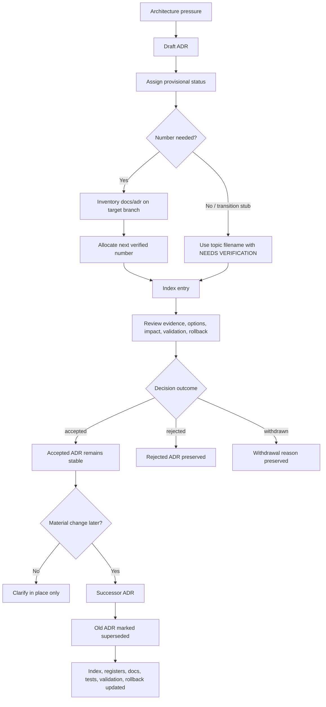

<!-- [KFM_META_BLOCK_V2]
doc_id: kfm://doc/NEEDS-VERIFICATION-ADR-adr-index-numbering-and-supersession
title: ADR: ADR Index Numbering and Supersession
type: standard
version: v1
status: review
owners: OWNER_TBD_NEEDS_VERIFICATION
created: 2026-05-08
updated: 2026-05-08
policy_label: POLICY_LABEL_TBD_NEEDS_VERIFICATION
related: [./README.md, ./ADR-TEMPLATE.md, ./ADR-0001-schema-home.md, ./ADR-0017-meta-block-v2.md, ../registers/DRIFT_REGISTER.md, ../registers/VERIFICATION_BACKLOG.md, ../../.github/CODEOWNERS, ../../tools/ci/verify_baseline.sh]
tags: [kfm, adr, numbering, supersession, governance, lineage, rollback]
notes: [This ADR revises a thin backlog-normalization stub at docs/adr/ADR-adr-index-numbering-and-supersession.md. ADR decision status is proposed. Numeric identity, final doc_id UUID, owners, policy label, CODEOWNERS enforcement, complete ADR inventory, duplicate-number handling, CI enforcement, and branch protection remain NEEDS VERIFICATION before acceptance.]
[/KFM_META_BLOCK_V2] -->

<a id="top"></a>

# ADR: ADR Index Numbering and Supersession

Define how KFM ADRs are numbered, indexed, preserved, superseded, and corrected without losing decision lineage.

<p align="center">
  
  
  
  
  
</p>

<p align="center">
  <a href="#decision-summary">Decision</a> ·
  <a href="#repo-fit">Repo fit</a> ·
  <a href="#context">Context</a> ·
  <a href="#numbering-rules">Numbering</a> ·
  <a href="#index-rules">Index</a> ·
  <a href="#supersession-rules">Supersession</a> ·
  <a href="#validation-plan">Validation</a> ·
  <a href="#rollback">Rollback</a> ·
  <a href="#open-verification">Open verification</a>
</p>

> [!IMPORTANT]
> **ADR decision status:** `proposed`  
> **Document status:** `review`  
> **Target path:** `docs/adr/ADR-adr-index-numbering-and-supersession.md`  
> **Owner/steward:** `OWNER_TBD_NEEDS_VERIFICATION`  
> **Core posture:** preserve ADR lineage; never normalize numbering by deleting, silently renaming, or rewriting decision history.

> [!NOTE]
> This ADR defines governance rules. It does **not** prove that CI, branch protections, ADR registry automation, link validation, duplicate-number detection, or supersession enforcement already run in the repository.

---

## Decision summary

KFM ADRs must remain durable, inspectable decision records. ADR numbers help humans navigate the decision set, but they are not the only identity surface and must never be reused, silently reassigned, or used to erase older decisions. The ADR index must preserve current decisions, historical decisions, conflicts, supersession links, rollback notes, and verification gaps.

### One-line rule

> ADR identity is stable by filename, document metadata, index entry, status, and successor links; numbers are navigational handles, not permission to rewrite history.

### One-line boundary rule

> No ADR cleanup may delete lineage, break stable links, hide a conflicted decision, or imply implementation enforcement without direct evidence.

### Current determination

| Field | Determination |
|---|---|
| ADR file | `docs/adr/ADR-adr-index-numbering-and-supersession.md` |
| Decision status | `proposed` |
| Document status | `review` |
| Scope | `docs/adr/`, ADR index maintenance, ADR numbering, status lifecycle, supersession, rollback, and correction |
| Owning root | `docs/` |
| Responsibility-root basis | Human-facing governance and architecture decision control plane |
| Primary downstream consumers | ADR authors, maintainers, reviewers, release reviewers, register maintainers, documentation validators |
| This ADR supersedes | `none` |
| This ADR is superseded by | `none` |
| Implementation enforcement | `NEEDS VERIFICATION` |

<p align="right"><a href="#top">Back to top ↑</a></p>

---

## Repo fit

| Relationship | Path | Status | Role |
|---|---|---:|---|
| This ADR | `docs/adr/ADR-adr-index-numbering-and-supersession.md` | `CONFIRMED in current repository connector inspection / NEEDS VERIFICATION in PR branch` | Governs ADR numbering, index discipline, and supersession behavior. |
| ADR directory index | [`./README.md`](./README.md) | `CONFIRMED / NEEDS VERIFICATION for completeness` | Human-facing ADR index and review guide. |
| ADR template | [`./ADR-TEMPLATE.md`](./ADR-TEMPLATE.md) | `CONFIRMED / NEEDS VERIFICATION for current enforcement` | Standard ADR authoring structure. |
| Schema-home ADR | [`./ADR-0001-schema-home.md`](./ADR-0001-schema-home.md) | `CONFIRMED / proposed decision` | Example of decision state separated from enforcement state. |
| Meta Block V2 ADR | [`./ADR-0017-meta-block-v2.md`](./ADR-0017-meta-block-v2.md) | `CONFIRMED / accepted decision with staged enforcement` | Metadata envelope used by this ADR. |
| Drift register | [`../registers/DRIFT_REGISTER.md`](../registers/DRIFT_REGISTER.md) | `SURFACED / NEEDS VERIFICATION` | Destination for unresolved ADR numbering or supersession drift. |
| Verification backlog | [`../registers/VERIFICATION_BACKLOG.md`](../registers/VERIFICATION_BACKLOG.md) | `SURFACED / NEEDS VERIFICATION` | Destination for unresolved index, link, owner, CI, and branch-protection checks. |
| Review routing | [`../../.github/CODEOWNERS`](../../.github/CODEOWNERS) | `CONFIRMED / branch-rule enforcement UNKNOWN` | Routes review, but does not approve publication or enforce ADR acceptance. |
| Baseline check | [`../../tools/ci/verify_baseline.sh`](../../tools/ci/verify_baseline.sh) | `CONFIRMED / narrow baseline only` | Confirms selected baseline files; does not validate ADR completeness. |

### Why this belongs under `docs/adr/`

KFM treats root folders as responsibility boundaries, not topic buckets. ADRs are human-facing architecture governance records, so ADR numbering and supersession policy belongs under `docs/adr/`, not in a new root-level `adr/`, `decisions/`, or `governance-decisions/` folder.

### Upstream inputs

This ADR is downstream of:

- KFM Directory Rules and responsibility-root discipline;
- ADR directory README and ADR template;
- Meta Block V2 document metadata rules;
- current repository connector evidence;
- KFM truth posture: `CONFIRMED`, `INFERRED`, `PROPOSED`, `UNKNOWN`, `NEEDS VERIFICATION`, `CONFLICTED`, `LINEAGE`, and `SUPERSEDED`;
- KFM release, correction, rollback, and supersession doctrine.

### Downstream consumers

This ADR should guide:

- `docs/adr/README.md` inventory and naming notes;
- future ADR authoring and review;
- future machine-readable ADR register, if one is added;
- drift-register entries for duplicate numbers, topic aliases, or status conflicts;
- link validation and documentation QA;
- rollback/correction review when a decision affects published or promotion-sensitive behavior.

<p align="right"><a href="#top">Back to top ↑</a></p>

---

## Context

The current ADR directory already contains multiple ADR naming styles and maturity states. Some ADRs are numbered, some are topic-named, some use date-ish identifiers, and this file itself is a topic-named backlog-normalization ADR rather than a canonical numbered ADR.

That mixed state is not automatically wrong. It is a normal sign of a growing governance corpus. It becomes risky when maintainers try to “clean up” ADRs by renaming, deleting, renumbering, flattening status, or treating a prettier index as proof that implementation gates exist.

KFM requires decision history to remain auditable. Architecture decisions affect source authority, directory roots, contracts, schemas, policy, release, rollback, UI trust, AI boundaries, and public publication posture. Losing ADR lineage can weaken later release review, correction, rollback, or conflict resolution.

> [!CAUTION]
> A tidy ADR directory that hides historical decisions is less trustworthy than an imperfect ADR directory with explicit lineage, conflicts, successor links, and verification gaps.

### Problem

Without a numbered-index and supersession rule, KFM risks:

| Risk | Failure mode |
|---|---|
| Number reuse | Two different decisions appear to have the same stable identity. |
| Silent renames | Existing links break and historical review evidence becomes harder to audit. |
| Deleted superseded ADRs | Release and rollback context disappears. |
| Topic aliases | A decision exists under multiple names without a clear canonical entry. |
| Stale index entries | Reviewers cannot tell whether a decision is current, proposed, accepted, superseded, or conflicted. |
| Status laundering | A proposed ADR looks accepted because it appears in a polished index. |
| Enforcement overclaim | ADR prose is mistaken for CI, policy, schema, branch-rule, or runtime enforcement. |
| Conflicted authority | Multiple ADRs govern the same surface but no successor or conflict note explains precedence. |

### Why this is architecture-significant

ADR numbering is not cosmetic in KFM. It affects governance review, source authority, schema and policy decisions, release gates, rollback targets, and public trust surfaces. ADRs must therefore behave like durable decision records, not editable wiki pages with disposable filenames.

<p align="right"><a href="#top">Back to top ↑</a></p>

---

## Evidence basis

| Evidence item | Source / path / artifact | What it supports | Truth label |
|---|---|---|---|
| Target ADR file | `docs/adr/ADR-adr-index-numbering-and-supersession.md` | A thin proposed ADR exists at the target path and needs expansion. | `CONFIRMED in repository connector / NEEDS VERIFICATION in active checkout` |
| ADR directory README | [`./README.md`](./README.md) | `docs/adr/` is the human-facing ADR decision ledger; existing index already distinguishes decision state from enforcement state. | `CONFIRMED / inventory completeness NEEDS VERIFICATION` |
| ADR template | [`./ADR-TEMPLATE.md`](./ADR-TEMPLATE.md) | ADRs should include evidence, scope, policy impact, validation, rollback, and supersession. | `CONFIRMED / enforcement NEEDS VERIFICATION` |
| Meta Block V2 ADR | [`./ADR-0017-meta-block-v2.md`](./ADR-0017-meta-block-v2.md) | Standard docs should use the exact KFM metadata wrapper; document lifecycle state and ADR decision state are separate. | `CONFIRMED` |
| Schema-home ADR | [`./ADR-0001-schema-home.md`](./ADR-0001-schema-home.md) | Shows KFM’s pattern of proposed decisions, evidence boundary tables, and acceptance criteria before enforcement claims. | `CONFIRMED / decision still proposed` |
| Directory Rules | Project doctrine | ADRs belong under `docs/adr/`; new root folders require repo-wide responsibility. | `CONFIRMED doctrine` |
| CODEOWNERS | [`../../.github/CODEOWNERS`](../../.github/CODEOWNERS) | Review routing exists for `docs/adr/`; branch protection and enforcement remain unverified. | `CONFIRMED file / enforcement UNKNOWN` |
| Baseline script | [`../../tools/ci/verify_baseline.sh`](../../tools/ci/verify_baseline.sh) | Baseline checks exist for selected repo surfaces. | `CONFIRMED narrow baseline / ADR enforcement NEEDS VERIFICATION` |
| Current mounted workspace scan | Local workspace inspection during authoring | No mounted KFM Git checkout was available in `/mnt/data`; GitHub connector evidence was used for repository inspection. | `CONFIRMED workspace condition` |

### Evidence boundary

This ADR can state repository file presence only for files inspected through the repository connector or surfaced in the current session. It cannot claim:

- complete ADR inventory;
- branch protection;
- successful CI runs;
- CODEOWNERS enforcement;
- full link validation;
- a machine-readable ADR registry;
- review approval;
- published release impact;
- runtime or policy enforcement.

<p align="right"><a href="#top">Back to top ↑</a></p>

---

## Decision

KFM adopts a conservative ADR numbering, index, and supersession discipline:

1. **Preserve existing ADR files.** Existing filenames remain stable unless a successor ADR or migration note explicitly approves a rename.
2. **Use canonical numeric filenames for new numbered ADRs.** New repo-wide ADRs should use `ADR-<nnnn>-<short-kebab-title>.md` after the next available number is verified.
3. **Never reuse ADR numbers.** Rejected, withdrawn, deprecated, or superseded ADRs keep their numbers.
4. **Treat numbers as navigation, not proof.** The governing state comes from ADR status, successor links, evidence, index entry, and validation evidence.
5. **Keep the ADR index as the human-facing navigation surface.** The index must show status, topic, successor links, and verification gaps.
6. **Preserve superseded decisions as lineage.** Superseded ADRs remain in place with visible successor links.
7. **Require successor records for material changes.** Material changes to accepted ADRs require a successor ADR, not silent rewrite.
8. **Block silent normalization.** Duplicate numbers, topic aliases, or conflicting ADRs must be marked `CONFLICTED` or `NEEDS VERIFICATION` until resolved.
9. **Separate decision state from enforcement state.** An ADR can be accepted while implementation enforcement remains `NEEDS VERIFICATION`.
10. **Make rollback inspectable.** Any ADR-backed implementation that affects trust, publication, public surfaces, or release behavior must name rollback or supersession behavior.

### Chosen option

Use `docs/adr/README.md` as the human-facing ADR index, preserve all existing ADR files as lineage, adopt a verified sequential numeric pattern for new ADRs, and defer any machine-readable ADR registry until its home and schema are decided.

### Operating rule

> Add decisions; do not rewrite decision history. Normalize by index, status, and successor links before renaming files.

### Boundary rule

> This ADR must not create a parallel schema, contract, policy, source, proof, release, or publication authority.

<p align="right"><a href="#top">Back to top ↑</a></p>

---

## Numbering rules

### Canonical new ADR filename

For new numbered ADRs, use:

```text
docs/adr/ADR-<nnnn>-<short-kebab-title>.md
```

Examples:

```text
docs/adr/ADR-0025-example-decision.md
docs/adr/ADR-0209-example-domain-lane-decision.md
```

### Allocation rule

A new ADR number may be allocated only after the current ADR inventory is checked on the target branch.

```bash
find docs/adr -maxdepth 1 -type f -name 'ADR-*.md' | sort
```

The next number should be assigned from the verified current index or a future accepted ADR register. Do not allocate a number from memory or from a partial search result.

### Number ownership

| Rule | Required behavior |
|---|---|
| Numbers are immutable | Once assigned, a number stays attached to that decision lineage. |
| Numbers are not reused | Rejected, withdrawn, deprecated, or superseded ADRs still reserve their number. |
| Numbers are not enforcement | A number does not mean accepted, implemented, or validated. |
| Numbers are not enough | Filename, meta block, H1, ADR header, index entry, and successor links must agree. |
| Numbers must be inventory-backed | Assign numbers only after branch-local inventory. |
| Duplicate numbers are conflicts | Mark as `CONFLICTED`; do not silently rename either file. |
| Gaps are acceptable | Do not renumber later ADRs just to remove gaps. |
| Topic stubs are allowed temporarily | Topic-named ADRs may exist during backlog normalization if indexed and marked clearly. |

### Existing non-canonical filenames

Existing ADRs with non-canonical names are historical link targets. Preserve them unless a successor ADR explicitly approves migration.

| Existing pattern | Handling |
|---|---|
| `ADR-0001-schema-home.md` | Canonical numbered form; preserve. |
| `ADR-adr-index-numbering-and-supersession.md` | Current topic-named ADR; preserve unless a future accepted successor assigns a numeric replacement. |
| `ADR-policy-engine-commitment.md` | Topic-named ADR; preserve and index. |
| `ADR-0427-consent-vc-and-revocation-delta.md` | Date-ish or packet-derived ID; preserve and index until successor mapping is accepted. |
| Duplicate `ADR-<nnnn>` families | Mark `CONFLICTED`; resolve through index note, successor ADR, or explicit migration plan. |

> [!WARNING]
> Do not run a bulk rename across `docs/adr/`. ADR filenames are decision-history anchors.

<p align="right"><a href="#top">Back to top ↑</a></p>

---

## Index rules

`docs/adr/README.md` is the human-facing ADR index. It should remain readable, truthful, and conservative.

### Required index fields

Each ADR index entry should include at least:

| Field | Purpose |
|---|---|
| ADR file | Stable link target. |
| Decision area | Short human-readable topic. |
| Decision status | `proposed`, `accepted`, `rejected`, `superseded`, `withdrawn`, or `deprecated`. |
| Enforcement status | `CONFIRMED`, `PROPOSED`, `UNKNOWN`, or `NEEDS VERIFICATION`. |
| Successor / predecessor | Visible lineage. |
| Conflict note | Required if numbering, topic, authority, or status is unresolved. |
| Last verified | Date or placeholder showing inventory freshness. |

### Index status labels

| Label | Meaning |
|---|---|
| `LISTED` | The file is linked in the index, but current completeness may not be verified. |
| `CONFIRMED` | The file/path/status was checked in the current branch or current repository inspection. |
| `SURFACED` | The ADR was discovered by search, report, or prior corpus but may not be fully verified. |
| `NEEDS VERIFICATION` | A specific branch-local check is required. |
| `CONFLICTED` | Number, path, status, successor, or authority is materially ambiguous. |
| `SUPERSEDED` | A successor decision exists and is linked. |

### Index update triggers

Update the ADR index when:

- a new ADR is created;
- an ADR changes status;
- a successor ADR is created;
- an ADR is withdrawn, deprecated, or superseded;
- a duplicate number or topic conflict is discovered;
- related docs, registers, validators, or policy gates change;
- a link or path is renamed;
- acceptance evidence or enforcement evidence changes.

### Optional machine-readable ADR register

A future machine-readable ADR register is `PROPOSED`, not established by this ADR. If added, the likely responsibility root is `control_plane/` because it would index governance state.

Potential future path:

```text
control_plane/adr_register.yaml
```

Required before adding it:

- ADR or register decision confirming the home;
- schema for register entries;
- fixture and validator coverage;
- migration plan from `docs/adr/README.md`;
- rule that the register indexes ADRs but does not replace ADR prose.

<p align="right"><a href="#top">Back to top ↑</a></p>

---

## ADR status lifecycle

Use these visible decision states in ADR bodies and index entries.

| Status | Meaning | Allowed edits |
|---|---|---|
| `proposed` | Under review; not yet governing. | Normal edits allowed, but material changes should remain visible in review. |
| `accepted` | Governs stated scope. | Clarifications and typo fixes only; material changes require successor ADR. |
| `rejected` | Considered and declined. | Preserve rationale; reopen only with new evidence. |
| `superseded` | Replaced by successor ADR or stronger decision record. | Add successor link and migration notes; do not delete. |
| `withdrawn` | Removed before governing or because scope changed. | Preserve withdrawal reason. |
| `deprecated` | Historical; should not be extended. | Preserve caution and replacement guidance. |

### Decision status versus document status

KFM Meta Block V2 uses document lifecycle status:

```text
draft | review | published
```

ADR decision status is separate:

```text
proposed | accepted | rejected | superseded | withdrawn | deprecated
```

> [!IMPORTANT]
> Do not put `accepted` in the Meta Block V2 `status` field. Put ADR decision status in the ADR body and index.

<p align="right"><a href="#top">Back to top ↑</a></p>

---

## Supersession rules

Supersession is a governed lineage event, not a cleanup action.

### When supersession is required

Create a successor ADR when an accepted ADR’s material decision changes in any of these areas:

| Area | Examples |
|---|---|
| Responsibility roots | Root folder authority, compatibility roots, new root admission. |
| Contract/schema/policy homes | Machine schema home, semantic contract home, policy home, source registry home. |
| Public-client boundaries | Governed API, UI shell, Evidence Drawer, Focus Mode, public exports. |
| Evidence and citation | `EvidenceRef`, `EvidenceBundle`, cite-or-abstain rules. |
| Release and rollback | Promotion gates, ReleaseManifest, ProofPack, CorrectionNotice, RollbackCard. |
| Source authority | Source role, rights posture, source activation gates. |
| Sensitivity | Rare species, archaeology, living-person data, DNA, cultural sites, infrastructure, land/title, exact locations. |
| Runtime AI | Model adapter, runtime envelope, AIReceipt, citation validation, direct model access. |
| Security and exposure | Local exposure, authentication, reverse proxy, VPN, internal path blocking. |

### How to supersede an ADR

1. Create or identify the successor ADR.
2. Add a supersession banner to the old ADR.
3. Set old ADR status to `superseded` or add an unmistakable supersession note.
4. Link old ADR to successor and successor to old ADR.
5. Update `docs/adr/README.md`.
6. Update affected registers.
7. Update docs, contracts, schemas, policies, tests, fixtures, validators, releases, receipts, proofs, or rollback cards if the decision affected them.
8. Preserve the old file at its existing path.
9. Record validation evidence or mark enforcement `NEEDS VERIFICATION`.
10. Add rollback or compatibility notes.

### Supersession banner

Use this visible block near the top of a superseded ADR:

```markdown
> [!WARNING]
> **Status:** `superseded`  
> **Superseded by:** [`ADR-<nnnn>-<successor>.md`](./ADR-<nnnn>-<successor>.md)  
> **Supersession reason:** `<short reason>`  
> **Lineage rule:** this file remains as historical decision evidence and must not be deleted.
```

### Successor backlink

Use this block in the successor ADR:

```markdown
> [!NOTE]
> **Supersedes:** [`ADR-<old>.md`](./ADR-<old>.md)  
> **Compatibility note:** `<what remains compatible, deprecated, or migrated>`  
> **Rollback note:** `<how to revert or disable successor behavior>`
```

<p align="right"><a href="#top">Back to top ↑</a></p>

---

## Change discipline

### Edit in place only for non-material repairs

Accepted ADRs may be edited in place for:

- typo fixes;
- broken relative-link repair;
- badge or formatting repair;
- clarifying wording that does not change the decision;
- adding evidence links that support the existing decision;
- adding an explicit `NEEDS VERIFICATION` note where uncertainty was already implied.

### Use a successor ADR for material changes

Material changes include:

- new or changed decision scope;
- changed owning root;
- changed schema/contract/policy/source/release authority;
- changed public-client boundary;
- changed release, correction, rollback, or publication behavior;
- changed policy, rights, sensitivity, or source-role posture;
- changed AI boundary or runtime outcome rules;
- changed validation requirements or acceptance gates.

### Correction notes

If an ADR made an unsupported or incorrect implementation claim, do not silently delete it. Add a correction note:

```markdown
> [!CAUTION]
> **Correction:** `<what was corrected>`  
> **Reason:** `<evidence or verification gap>`  
> **Impact:** `<docs / contracts / schemas / policies / tests / release / rollback impact>`  
> **Follow-up:** `<register or issue reference>`
```

<p align="right"><a href="#top">Back to top ↑</a></p>

---

## Operating model



### Trust boundary protected

The diagram protects against a common failure mode: using file maintenance to erase architecture history. KFM decisions must remain reviewable even when they become obsolete.

<p align="right"><a href="#top">Back to top ↑</a></p>

---

## Options considered

| Option | Description | Benefits | Risks / costs | Outcome |
|---|---|---|---|---|
| Preserve existing ADRs and normalize through index + successor links | Keep filenames stable; assign new numbers only after inventory; use explicit supersession. | Best preserves lineage and stable links. | Requires careful index maintenance. | **Accepted as proposed decision.** |
| Bulk rename all ADRs into strict sequence | Rename every ADR into perfect numeric order. | Visually tidy. | Breaks links, hides history, risks number reuse, requires migration proof. | Rejected. |
| Keep topic-only ADR filenames forever | Use descriptive filenames without numbers. | Easy to author. | Harder to order, cite, and audit over time. | Rejected as default; allowed as transition stubs. |
| Use date-based ADR IDs only | Encode dates or packet IDs in filenames. | Avoids sequence allocation. | Confuses date, lineage, and decision sequence. | Rejected as default; preserve existing date-ish files. |
| Use a machine register as sole ADR authority | Put ADR truth in YAML and make Markdown secondary. | Easier automation. | Undercuts ADR prose and review context unless carefully designed. | Deferred. |
| Delete superseded ADRs from the tree | Keep only current decisions. | Shorter directory. | Destroys lineage and rollback context. | Rejected. |

<p align="right"><a href="#top">Back to top ↑</a></p>

---

## Impact map

### Documentation impact

| Area | Required update | Status |
|---|---|---:|
| `docs/adr/README.md` | Add this ADR to the index; record decision status, enforcement status, and open verification. | `PROPOSED` |
| `docs/adr/ADR-TEMPLATE.md` | Optionally link to this ADR from numbering/supersession guidance. | `PROPOSED` |
| `docs/registers/DRIFT_REGISTER.md` | Add unresolved duplicate-number or ADR-status conflicts if discovered. | `NEEDS VERIFICATION` |
| `docs/registers/VERIFICATION_BACKLOG.md` | Add complete ADR inventory, owner verification, CI enforcement, and branch protection checks. | `NEEDS VERIFICATION` |
| `docs/standards/KFM_MARKDOWN_WORK_PROTOCOL.md` | No immediate change required unless it adopts this ADR as normative numbering guidance. | `NEEDS VERIFICATION` |

### Implementation and validation impact

| Area | Required update | Status |
|---|---|---:|
| `.github/CODEOWNERS` | Verify ADR review routing and branch-rule enforcement. | `NEEDS VERIFICATION` |
| `.github/workflows/` | Optional future link/status/supersession check; not established here. | `PROPOSED` |
| `tools/` / `scripts/` | Optional future ADR inventory/link validator. | `PROPOSED` |
| `control_plane/` | Optional future ADR register after a separate placement/schema decision. | `PROPOSED` |
| `release/` | Only affected if ADR-backed release decisions are superseded. | `CONDITIONAL` |
| `contracts/`, `schemas/`, `policy/`, `tests/`, `fixtures/` | No direct schema/policy change from this ADR. Related updates required only when a superseded ADR affects them. | `CONDITIONAL` |

### Lifecycle impact

This ADR does not move data through the KFM data lifecycle. It protects the governance layer that decides how lifecycle, release, rollback, policy, and public-client boundaries are recorded.

| KFM invariant | Impact | Status |
|---|---|---:|
| `RAW -> WORK/QUARANTINE -> PROCESSED -> CATALOG/TRIPLET -> PUBLISHED` | No direct data movement. ADR lineage supports later lifecycle decision audit. | `CONFIRMED doctrine / no direct implementation` |
| Public clients use governed interfaces | No direct API/UI change. ADR supersession protects decisions that govern public interfaces. | `INDIRECT` |
| `EvidenceRef -> EvidenceBundle` closure | No direct evidence-object change. ADR changes affecting evidence closure must use successor links. | `INDIRECT` |
| Promotion is a governed state transition | ADR history supports release-review traceability. | `INDIRECT` |
| Corrections and rollback are auditable | Supersession and rollback links are required decision-history surfaces. | `DIRECT` |

<p align="right"><a href="#top">Back to top ↑</a></p>

---

## Validation plan

### Required checks before acceptance

Run these from the repository root on the branch where this ADR will be committed.

```bash
# Confirm repository context.
git rev-parse --show-toplevel
git status --short
git branch --show-current

# Inventory ADR files.
find docs/adr -maxdepth 1 -type f -name '*.md' | sort

# Identify status and supersession markers.
grep -RInE '^(# |## Status|Status:|status:|ADR status|Decision status|Supersedes|Superseded by|superseded|withdrawn|deprecated)' docs/adr || true

# Find likely duplicate ADR numeric prefixes.
find docs/adr -maxdepth 1 -type f -name 'ADR-*.md' \
  | sed -E 's#.*/(ADR-[0-9]{4}).*#\1#' \
  | sort \
  | uniq -d

# Find ADR links from docs and governance roots.
grep -RInE 'docs/adr/|ADR-[0-9A-Za-z_-]+\.md|ADR-TEMPLATE\.md' README.md docs contracts schemas policy tests tools data release 2>/dev/null || true

# Check top-of-file metadata block presence for ADR Markdown.
grep -RLE '^\<\!-- \[KFM_META_BLOCK_V2\]' docs/adr/*.md || true
```

### Acceptance checks

| Check | Expected result | Status |
|---|---|---:|
| Target file exists | `docs/adr/ADR-adr-index-numbering-and-supersession.md` is present. | `CONFIRMED via connector / NEEDS PR-branch verification` |
| Meta Block V2 present | This ADR begins with exact wrapper. | `PROPOSED in this revision` |
| ADR index updated | `docs/adr/README.md` links this ADR with status. | `PROPOSED` |
| Complete ADR inventory run | Inventory output captured in PR notes or validation report. | `NEEDS VERIFICATION` |
| Duplicate-number conflicts classified | Duplicates either absent or registered as `CONFLICTED`. | `NEEDS VERIFICATION` |
| Supersession links validated | Superseded ADRs link to successors and successors backlink to predecessors. | `NEEDS VERIFICATION` |
| CODEOWNERS review routing verified | ADR path review owner exists and branch rules are understood. | `NEEDS VERIFICATION` |
| No implementation overclaim | ADR does not claim enforcement without evidence. | `PROPOSED` |
| Rollback/supersession rule present | This ADR defines how to reverse or supersede itself. | `PROPOSED` |

### Negative-path tests to add later

| Failure condition | Expected outcome |
|---|---|
| Two ADRs claim same numeric ID without conflict note | Validator or reviewer marks `CONFLICTED`. |
| Superseded ADR lacks successor link | Validation or review fails. |
| Successor ADR lacks predecessor backlink | Validation or review fails. |
| ADR index marks file accepted but ADR body says proposed | Validation or review fails. |
| ADR file is deleted during “cleanup” | Review blocks unless a documented archival/supersession process exists. |
| Bulk rename lacks migration notes | Review blocks. |
| ADR status implies CI enforcement but no run evidence exists | Mark enforcement `NEEDS VERIFICATION`; block acceptance if enforcement is material. |

<p align="right"><a href="#top">Back to top ↑</a></p>

---

## Rollback

Rollback for this ADR is documentation rollback, not data rollback.

### Rollback target

`ROLLBACK_TARGET_TBD`: the prior thin stub at `docs/adr/ADR-adr-index-numbering-and-supersession.md`, plus the current ADR index state before this revision.

### Rollback triggers

| Trigger | Required action |
|---|---|
| This ADR conflicts with a later accepted ADR numbering convention | Mark this ADR `superseded`; link successor; preserve file. |
| This ADR breaks existing ADR links or index assumptions | Revert index changes first; preserve a correction note. |
| Maintainers reject canonical numeric pattern | Mark decision `rejected` or create successor with alternative. |
| Machine ADR register is accepted elsewhere | Update this ADR or supersede it to reference the accepted register. |
| CI validator based on this ADR causes false failures | Disable only the faulty enforcement stage; keep decision lineage. |
| CODEOWNERS or branch rules prove a different review path | Update owners or mark `NEEDS VERIFICATION`; do not claim enforcement until confirmed. |

### Rollback rule

> Reverting a numbering or index change must not delete ADR files, erase supersession notes, or reuse historical ADR numbers.

<p align="right"><a href="#top">Back to top ↑</a></p>

---

## Supersession of this ADR

A future ADR may supersede this one only if it preserves:

- stable decision history;
- visible old-to-new successor links;
- no reuse of historical ADR numbers;
- explicit handling of topic-named and date-ish ADRs;
- index or registry migration notes;
- rollback path;
- review and validation evidence;
- separation between ADR decision state and implementation enforcement state.

If this ADR is superseded, add the supersession banner near the top of this file and update `docs/adr/README.md`.

<p align="right"><a href="#top">Back to top ↑</a></p>

---

## Consequences

### Positive consequences

- ADR history stays auditable.
- Existing links are preserved.
- Duplicate numbers and topic aliases become visible review items instead of silent cleanup tasks.
- The ADR index becomes a trust surface, not merely a file list.
- Superseded decisions remain useful for release review, rollback, and correction.
- New ADRs have a predictable naming pattern without forcing unsafe mass renames.
- Decision state and enforcement state stay separate.

### Tradeoffs and risks

| Risk | Mitigation | Residual status |
|---|---|---:|
| The directory remains visually mixed for a while. | Normalize through index and successor links first. | `ACCEPTED TRADEOFF` |
| Future contributors may still allocate numbers manually. | Require branch-local inventory before allocation. | `NEEDS VERIFICATION` |
| A machine registry could drift from README index. | Defer registry until home/schema/validator are decided. | `PROPOSED` |
| Link validation may be incomplete. | Add future validator and PR checklist. | `NEEDS VERIFICATION` |
| Topic-named ADRs may feel less canonical. | Keep them as transition or lineage records; successor when needed. | `ACCEPTED TRADEOFF` |
| Supersession may be underused. | Add review checklist and index fields. | `NEEDS VERIFICATION` |

<p align="right"><a href="#top">Back to top ↑</a></p>

---

## Open verification

| Item | Status | Why it matters | Verification path |
|---|---:|---|---|
| Final `doc_id` UUID or registry ID | `NEEDS VERIFICATION` | Prevents duplicate document identity. | Assign through document registry or accepted ID process. |
| Owners / steward | `NEEDS VERIFICATION` | ADR governance needs accountable review. | Confirm CODEOWNERS, maintainer owner, or governance register. |
| Policy label | `NEEDS VERIFICATION` | Public/internal/restricted handling must be deliberate. | Confirm in policy docs or classification register. |
| Complete ADR inventory | `NEEDS VERIFICATION` | Numbering decisions require branch-local truth. | Run inventory commands in target branch. |
| Duplicate-number map | `NEEDS VERIFICATION` | Prevents false uniqueness. | Run duplicate-prefix command and update index/register. |
| Supersession map | `NEEDS VERIFICATION` | Needed for current-vs-lineage clarity. | Inventory `Supersedes` / `Superseded by` markers. |
| ADR index coverage | `NEEDS VERIFICATION` | The README may not list every ADR. | Compare `find docs/adr` output with README entries. |
| Branch protection / rulesets | `UNKNOWN` | CODEOWNERS file presence is not enforcement. | Inspect repository branch rules. |
| CI enforcement | `UNKNOWN` | No ADR validator is proven here. | Inspect workflows and recent run output. |
| Link validation | `NEEDS VERIFICATION` | Stable links are part of lineage preservation. | Add or run docs link checker. |
| Machine ADR register | `PROPOSED` | Could help automation, but should not replace ADR prose. | Separate register-home/schema ADR if needed. |
| Numeric assignment for this ADR | `DEFERRED` | This file is topic-named by task requirement. | Future successor may allocate numeric ID after full inventory. |

<p align="right"><a href="#top">Back to top ↑</a></p>

---

## Review checklist

<details>
<summary>Pre-merge checklist</summary>

- [ ] This ADR begins with exact `KFM_META_BLOCK_V2` wrapper.
- [ ] Meta `title`, H1, and target path are synchronized.
- [ ] ADR decision status is visibly separate from document status.
- [ ] Owners and policy label are verified or deliberately placeholdered.
- [ ] `docs/adr/README.md` is updated with this ADR.
- [ ] Current ADR inventory is run on the target branch.
- [ ] Duplicate ADR numbers are checked.
- [ ] Topic-named and date-ish ADRs are preserved, not bulk renamed.
- [ ] Supersession rules are visible and do not delete lineage.
- [ ] Validation plan includes negative-path behavior.
- [ ] Rollback target is named or marked `ROLLBACK_TARGET_TBD`.
- [ ] No claim of CI, branch-rule, link-checker, or registry enforcement is made without evidence.
- [ ] Related registers are updated or listed as follow-up.
- [ ] No schema, contract, policy, source, proof, release, or publication authority is created by this ADR.
- [ ] Stable anchors and relative links are checked from `docs/adr/`.

</details>

<p align="right"><a href="#top">Back to top ↑</a></p>

---

## Appendix A — Minimal index entry template

Use this compact shape in `docs/adr/README.md` or a future ADR register.

```markdown
| ADR | Decision area | Decision status | Enforcement status | Supersedes / successor | Notes |
|---|---|---:|---:|---|---|
| [`ADR-0000-example.md`](./ADR-0000-example.md) | Example decision | `proposed` | `NEEDS VERIFICATION` | `none` | Add acceptance evidence before marking accepted. |
```

## Appendix B — Supersession note template

```markdown
> [!WARNING]
> **Status:** `superseded`  
> **Superseded by:** [`ADR-0000-successor.md`](./ADR-0000-successor.md)  
> **Reason:** `<short reason>`  
> **Compatibility:** `<what remains valid or deprecated>`  
> **Lineage:** This ADR remains historical decision evidence and must not be deleted.
```

## Appendix C — Numbering conflict note template

```markdown
> [!CAUTION]
> **ADR numbering conflict:** `<describe conflict>`  
> **Affected files:** `<file list>`  
> **Current handling:** `CONFLICTED / NEEDS VERIFICATION`  
> **Resolution path:** `<index update, successor ADR, or migration note>`  
> **Do not rename:** Preserve files until resolution is accepted.
```

## Appendix D — Maintainer note

A good ADR index is not the one with the cleanest sequence. It is the one that lets a reviewer answer:

1. What decision currently governs?
2. What decision came before it?
3. What evidence supported the change?
4. What implementation remains unverified?
5. What must be rolled back if the decision fails?
