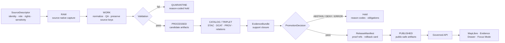

<!-- [KFM_META_BLOCK_V2]
doc_id: kfm://doc/NEEDS-VERIFICATION-ADR-agriculture-domain-boundary
title: ADR: Agriculture Domain Boundary
type: standard
version: v1
status: draft
owners: TODO-agriculture-domain-steward
created: 2026-05-08
updated: 2026-05-08
policy_label: TODO-policy-label
related: [./README.md, ./ADR-TEMPLATE.md, ./ADR-0001-schema-home.md, ./ADR-0002-responsibility-root-monorepo.md, ./ADR-0208-domain-lane-template.md, ../domains/agriculture/README.md, ../domains/agriculture/governance/STATE_OF_LANE.md, ../domains/agriculture/governance/FILE_INDEX.md, ../domains/agriculture/governance/SOURCE_COVERAGE_MATRIX.md, ../domains/agriculture/governance/SOURCE_REGISTRY.md, ../domains/agriculture/governance/VALIDATION_PLAN.md, ../domains/agriculture/governance/SUPERSESSION_MAP.md, ../domains/agriculture/architecture/DATA_CONTRACTS.md, ../domains/agriculture/architecture/EVIDENCE_AND_PROVENANCE.md, ../domains/agriculture/operations/PIPELINE_RUNBOOK.md, ../domains/agriculture/operations/CHANGELOG.md, ../domains/soil/README.md]
tags: [kfm, adr, agriculture, domain-boundary, source-role, claim-scope, evidence-first, map-first, time-aware, fail-closed]
notes: [Replaces the prior placeholder ADR with a source-grounded proposed decision. The decision is ready for review, not accepted enforcement. doc_id, owners, policy label, CODEOWNERS, acceptance evidence, CI enforcement, live source activation, release artifacts, runtime/API/UI behavior, dashboards, and logs remain NEEDS VERIFICATION.]
[/KFM_META_BLOCK_V2] -->

<a id="top"></a>
<a id="adr-agriculture-domain-boundary"></a>

# ADR: Agriculture Domain Boundary

Define the Agriculture lane as a governed, source-role-preserving domain boundary for Kansas agricultural evidence, public-safe agricultural context, and claim-scoped release decisions.

<p align="center">
  
  
  
  
  
</p>

<p align="center">
  <a href="#decision-summary">Decision</a> ·
  <a href="#context">Context</a> ·
  <a href="#evidence-basis">Evidence</a> ·
  <a href="#boundary-law">Boundary law</a> ·
  <a href="#source-role-claim-rules">Claim rules</a> ·
  <a href="#options-considered">Options</a> ·
  <a href="#validation-plan">Validation</a> ·
  <a href="#rollback-and-supersession">Rollback</a> ·
  <a href="#review-checklist">Checklist</a>
</p>

> [!IMPORTANT]
> **Decision status:** `proposed`.
>
> This ADR makes the Agriculture domain boundary reviewable. It does **not** prove live source activation, machine-schema enforcement, policy-as-code execution, CI enforcement, public API behavior, MapLibre layer wiring, Evidence Drawer payload behavior, Focus Mode behavior, release manifests, proof packs, dashboards, logs, or deployment state.

---

## ADR header

| Field | Value |
|---|---|
| ADR ID | `ADR-agriculture-domain-boundary` |
| Target path | `docs/adr/ADR-agriculture-domain-boundary.md` |
| Title | ADR: Agriculture Domain Boundary |
| Status | `proposed` |
| Decision date | `2026-05-08` |
| Authors / owners | `TODO-agriculture-domain-steward` |
| Reviewers | `REVIEWER_TBD_NEEDS_VERIFICATION` |
| Policy label | `TODO-policy-label` |
| Scope | Domain architecture, source-role governance, claim compatibility, public-release boundary |
| Affected lane | `docs/domains/agriculture/` |
| Affected shared roots | `docs/`, `contracts/`, `schemas/`, `policy/`, `tests/`, `fixtures/`, `tools/`, `pipelines/`, `data/`, `release/`, `apps/`, `packages/` |
| Related ADRs | [`ADR-0001-schema-home.md`](./ADR-0001-schema-home.md), [`ADR-0002-responsibility-root-monorepo.md`](./ADR-0002-responsibility-root-monorepo.md), [`ADR-0208-domain-lane-template.md`](./ADR-0208-domain-lane-template.md) |
| Supersedes | Placeholder content previously in this file |
| Superseded by | none |
| Decision confidence | `PROPOSED` |
| Implementation confidence | `NEEDS VERIFICATION` |
| Rollback target | Revert this ADR revision and restore prior placeholder or successor ADR; preserve lineage in Agriculture supersession records |

[Back to top](#top)

---

## Decision summary

KFM should define **Agriculture** as a governed domain lane that preserves agricultural source roles, claim scope, evidence closure, lifecycle state, and public-release safety for Kansas-centered agricultural context.

The Agriculture lane owns the **agricultural claim boundary**: what a soil survey record, station reading, satellite/grid product, aggregate crop statistic, remote-sensing product, derived indicator, layer manifest, Evidence Drawer payload, or Focus Mode answer is allowed to support.

Agriculture does **not** own every source that is useful to agriculture. It may consume or link to Soil, Hydrology, Atmosphere, Hazards, Settlements/Infrastructure, People/Land, and other lanes through governed references, but it must not fork those lanes’ canonical truth or turn derived agricultural context into root authority.

### One-line decision rule

> Agriculture is bounded by **source role + claim scope + lifecycle state**, not by convenience, display layer, or broad “farm data” topic.

### One-line boundary rule

> No Agriculture public claim may exceed the support carried by its source role, EvidenceBundle, policy state, review state, release state, and rollback path.

[Back to top](#top)

---

## Context

The prior file was a useful placeholder, but it did not decide the actual Agriculture boundary:

```text
This ADR will settle: agriculture domain boundary.
```

The Agriculture lane now has a richer documentation control set under `docs/domains/agriculture/`, including lane orientation, state-of-lane, source registry guidance, validation planning, contract guidance, evidence/provenance guidance, runbook guidance, changelog, file index, source coverage, supersession, and archive handling.

The Agriculture materials converge on a stable pattern:

- Agriculture is **evidence-first**, **map-first**, **time-aware**, **source-role-preserving**, **fixture-first**, and **fail-closed**.
- Source families such as SSURGO/SDA, gSSURGO/gNATSGO, Kansas Mesonet, SCAN, USCRN, SMAP, HLS/HLS-VI, NASS QuickStats/Crop Progress, and CDL are useful only when source role, rights, sensitivity, spatial support, temporal support, stable keys, fixtures, validation, catalog closure, EvidenceBundle support, release state, correction path, and rollback path are explicit.
- The current lane is documentation-ready for a fixture-first hardening pass, not public-release ready.
- Machine schemas, policy enforcement, validators, API/UI behavior, release artifacts, proof packs, workflow results, and runtime traces remain verification work.

### Why this decision is architecture-significant

Without a boundary ADR, Agriculture can drift into several unsafe patterns:

| Drift | What breaks |
|---|---|
| Aggregate statistics become field truth | County/state crop statistics are overstated as field, parcel, or operator claims. |
| Station readings become surfaces | Point/depth/time observations are rendered as general surfaces without a declared transform. |
| Satellite/grid products become ground truth | Product-specific remote-sensing context is treated as direct farm condition. |
| Soil context is forked | Agriculture duplicates or weakens Soil-lane authority and MUKEY semantics. |
| Private farm records become ordinary sources | Restricted or proprietary material loses consent, sensitivity, and access controls. |
| Derived layers become canonical | PMTiles, search indexes, dashboards, summaries, embeddings, AI answers, or layer manifests replace evidence. |
| Domain roots sprawl | Agriculture becomes a root-level topic bucket instead of living under responsibility roots. |

[Back to top](#top)

---

## Evidence basis

| Evidence item | Source / path | What it supports | Truth label |
|---|---|---|---|
| Existing target ADR | `docs/adr/ADR-agriculture-domain-boundary.md` | Current file existed as a placeholder ADR with proposed status. | `CONFIRMED repo evidence` |
| ADR template | `docs/adr/ADR-TEMPLATE.md` | KFM ADRs should expose evidence, truth labels, validation, rollback, and supersession. | `CONFIRMED repo evidence` |
| ADR index | `docs/adr/README.md` | ADRs are KFM’s human-facing decision ledger; ADRs are not implementation proof. | `CONFIRMED repo evidence` |
| Responsibility-root ADR | `docs/adr/ADR-0002-responsibility-root-monorepo.md` | Domain names should not become greenfield root folders; roots are responsibility boundaries. | `CONFIRMED repo evidence / accepted decision` |
| Schema-home ADR | `docs/adr/ADR-0001-schema-home.md` | `schemas/contracts/v1/` is proposed as machine-schema home; `contracts/` remains semantic meaning; `policy/` decides admissibility. | `CONFIRMED repo evidence / proposed decision` |
| Agriculture landing page | `docs/domains/agriculture/README.md` | Agriculture lane scope, accepted inputs, exclusions, source-role guardrails, lifecycle, and definition of done. | `CONFIRMED repo evidence` |
| Agriculture state snapshot | `docs/domains/agriculture/governance/STATE_OF_LANE.md` | Agriculture docs are confirmed; enforcement, runtime, release, owners, and CI remain verification items. | `CONFIRMED repo evidence` |
| Agriculture data contracts | `docs/domains/agriculture/architecture/DATA_CONTRACTS.md` | Agriculture contract posture, source-role compatibility, object families, schema-home caution, and publication contracts. | `CONFIRMED repo evidence` |
| Agriculture source registry guidance | `docs/domains/agriculture/governance/SOURCE_REGISTRY.md` | Source descriptor requirements, source-role taxonomy, activation states, fixture-first admission, and fail-closed validation burden. | `CONFIRMED repo evidence` |
| Agriculture dossier lineage | `KFM_Agriculture_Domain_Implementation_Dossier_REVISED_2026-04-21.pdf` | Source-role matrix, anti-collapse rules, fixture-first implementation roadmap, validation, rollback, and open verification items. | `LINEAGE / PROPOSED implementation plan` |
| Directory Rules doctrine | `Directory Rules.pdf` | Root folders are authority boundaries; domain folders belong under responsibility roots. | `CONFIRMED doctrine` |

### Evidence limits

This ADR does not claim:

- local checkout branch state;
- current workflow run status;
- successful test output;
- active source connectors;
- actual Agriculture source descriptors in a machine registry;
- accepted Agriculture machine schemas;
- OPA/Rego or Conftest enforcement;
- release manifests, proof packs, receipts, dashboards, logs, or deployed behavior;
- active governed API, MapLibre, Evidence Drawer, or Focus Mode implementation.

Those claims require current repo, workflow, runtime, artifact, or log evidence.

[Back to top](#top)

---

## Boundary law

### Chosen boundary model

KFM chooses a **source-role and claim-scope boundary** for Agriculture.

Agriculture owns the rules that decide what agricultural evidence can support, not every upstream phenomenon that affects agriculture.

```mermaid
flowchart TB
    A[Agriculture boundary<br/>source role + claim scope + lifecycle state]

    A --> AO[Owned agriculture contract families]
    A --> AG[Owned agriculture source-role gates]
    A --> AP[Owned agriculture public payload semantics]
    A --> AR[Owned agriculture release readiness checks]

    AO --> SM[SoilMoistureStation / SoilMoistureReading]
    AO --> AS[AgricultureAggregateStat / CropProgressObservation]
    AO --> GP[AgricultureGridProduct / VegetationIndexObservation]
    AO --> DI[AgricultureDerivedIndicator]
    AO --> LM[AgricultureLayerManifest]
    AO --> FP[AgricultureEvidenceDrawerPayload / AgricultureFocusPayload]

    A -. consumes by governed reference .-> Soil[Soil lane<br/>SSURGO authority and MUKEY semantics]
    A -. consumes by governed reference .-> Hydro[Hydrology lane<br/>water observations and flood/regulatory context]
    A -. consumes by governed reference .-> Air[Atmosphere lane<br/>weather, climate, smoke, air]
    A -. consumes by governed reference .-> Haz[Hazards lane<br/>drought, flood, storm, fire context]
    A -. consumes by governed reference .-> Land[People / Land lane<br/>ownership, titles, private records]
    A -. consumes by governed reference .-> Infra[Settlements / Infrastructure<br/>facilities and networks]

    Soil -. not owned by Agriculture .-> A
    Hydro -. not owned by Agriculture .-> A
    Air -. not owned by Agriculture .-> A
    Land -. restricted by default .-> A
```



### Agriculture owns

| Agriculture-owned boundary | Examples | Required posture |
|---|---|---|
| Agriculture source-role compatibility | `authority`, `observation`, `aggregate`, `remote_sensing`, `derived`, `mirror`, `documentary`, restricted future classes | Source role must be explicit before claims or release. |
| Agriculture claim-scope rules | Station/depth/time reading, aggregate statistic, grid product context, derived indicator, public layer explanation | Claims cannot exceed source support. |
| Agriculture-specific contract families | `SoilMoistureReading`, `AgricultureAggregateStat`, `CropProgressObservation`, `AgricultureGridProduct`, `VegetationIndexObservation`, `AgricultureDerivedIndicator`, `AgricultureLayerManifest` | Reuse shared KFM trust objects; do not fork them unless a gap is verified. |
| Agriculture evidence payload semantics | Evidence Drawer and Focus Mode context for agriculture layers/questions | Must resolve `EvidenceRef -> EvidenceBundle`. |
| Agriculture validation burden | Aggregate misuse, station-as-surface misuse, grid-as-ground-truth misuse, unknown rights, missing sensitivity, stale time, missing rollback | Negative fixtures must fail closed. |
| Agriculture release readiness | Layer manifest, catalog closure, PromotionDecision, ReleaseManifest, correction path, rollback card | Publication is a governed transition, not a file move. |

### Agriculture may consume

| Consumed domain / surface | Agriculture use | Boundary guardrail |
|---|---|---|
| Soil | Soil survey context, MUKEY-linked attributes, hydrologic group, soil properties | Agriculture must not fork Soil-lane authority or silently replace SSURGO/SDA provenance with gridded companions. |
| Hydrology | Irrigation, watershed, hydrograph, flood or water context when relevant to agriculture | Hydrology observations and regulatory contexts remain Hydrology authority. |
| Atmosphere / Air | Weather, climate, smoke, air-quality, drought-context inputs when relevant to agricultural conditions | Atmosphere observations and advisories remain Atmosphere/Hazards authority. |
| Hazards | Drought, flood, wildfire, storm, disaster context | KFM is not an emergency alerting system; official safety guidance remains outside Agriculture. |
| Settlements / Infrastructure | Facilities, markets, roads, depots, irrigation infrastructure, supply chains | Infrastructure asset truth remains in its lane. |
| People / Land / Ownership | Land ownership, operator, genealogical, title, tax, private farm, or living-person context | Deny or restrict by default; Agriculture cannot publish private/operator claims without separate governance. |

### Agriculture excludes

| Excluded from Agriculture canonical authority | Why |
|---|---|
| Canonical soil survey truth as a whole | Soil lane owns soil authority and MUKEY semantics. Agriculture may consume governed soil context. |
| Land title, parcel ownership, assessor truth, operator identity | Land/people/legal lanes own those claims and require heightened review. |
| Private farm, proprietary yield, pesticide, chemical, management, or operator records | Restricted future class only; deny by default until consent, rights, steward review, retention, and revocation controls exist. |
| Crop-insurance adjudication or legal compliance determination | High-consequence domain outside Agriculture’s public context role. |
| Emergency or life-safety advice | Official alerting/safety systems govern those actions. |
| Direct model output or AI-generated conclusion | AI may interpret released evidence; it cannot create root truth. |
| RAW, WORK, QUARANTINE, unpublished candidates, internal receipts, direct source side effects | Public Agriculture surfaces must consume governed APIs and released artifacts only. |
| Root-level `agriculture/` folder | Domain work belongs under responsibility roots. |

[Back to top](#top)

---

## Source-role claim rules

Agriculture source roles must determine allowed claim scope.

| Source family | Source role | Can support | Must not support |
|---|---|---|---|
| SSURGO / SDA | `authority` within soil-survey scope | MUKEY-centered soil property context, when version/source table/query support is explicit | Agriculture-owned soil authority independent of Soil lane; unsupported parcel/operator claims |
| gSSURGO / gNATSGO | `derived` / gridded companion | Raster or large-area analysis support with source/product lineage | Silent replacement for vector/tabular SSURGO/SDA provenance |
| Kansas Mesonet | `observation` | Station, variable, depth, time, unit, QC/freshness-specific readings | Field-level truth or statewide surface without declared transform |
| NRCS SCAN / NOAA USCRN | `observation` / corroborative reference | Reference station observations with unit/depth/time/QC support | Parcel, field, operator, or statewide agricultural truth |
| NASA SMAP | `remote_sensing` | Satellite/grid soil moisture product context with product/version/time-window support | Station observation or field-level truth |
| NASA HLS / HLS-VI | `remote_sensing` / `derived` | Reflectance, vegetation index, masked product, or derived change context with STAC/asset/mask metadata | Direct ground truth or unreviewed stress conclusion |
| USDA NASS QuickStats / Crop Progress | `aggregate` | Commodity/geography/year/week/statistic/unit aggregate context | Field, parcel, operator, or exact-location truth |
| USDA NASS Cropland Data Layer | `remote_sensing` / `derived` | Annual classified raster context with product-year and accuracy caveats | Operator identity or management truth |
| Private/proprietary farm records | restricted future class only | Only after explicit consent, authorization, sensitivity, steward, retention, revocation, policy, and access controls | Public release by default |

### Non-negotiable anti-collapse rules

- **Aggregate is not field-level.**
- **Station is not surface.**
- **Grid is not ground truth.**
- **Derived is not canonical.**
- **Soil context is not soil authority.**
- **Unknown rights fail closed.**
- **Private agriculture records are deny-by-default.**
- **AI is interpretive, not authoritative.**

[Back to top](#top)

---

## Lifecycle and public boundary

Agriculture must preserve the KFM lifecycle:

```text
SOURCE EDGE -> RAW -> WORK / QUARANTINE -> PROCESSED -> CATALOG / TRIPLET -> PUBLISHED
```



| Lifecycle stage | Agriculture rule |
|---|---|
| SOURCE EDGE | SourceDescriptor must record source role, rights, sensitivity, stable keys, spatial support, temporal support, and activation state. |
| RAW | Preserve source-native payloads and digests; no public reads. |
| WORK | Normalize units, time, depth, source IDs, CRS, QC, masks, and product versions. |
| QUARANTINE | Failed or uncertain candidates remain internal with reason-coded disposition. |
| PROCESSED | Candidate outputs are still not public truth. |
| CATALOG / TRIPLET | Catalog/provenance/relationship closure must be inspectable and digest-bound. |
| PUBLISHED | Only release-manifested, policy-safe, evidence-supported, rollback-capable artifacts reach public clients. |
| Governed API / UI | Public clients consume governed APIs and released artifacts only. |
| Focus Mode | AI answers only from released, policy-safe EvidenceBundles and finite outcomes. |

[Back to top](#top)

---

## Directory and placement impact

This ADR belongs in `docs/adr/` because it records an architecture decision that affects domain boundaries, source authority, public claims, and validation burden.

Agriculture domain materials belong under responsibility roots, not a root-level `agriculture/` folder.

| Responsibility | Confirmed or proposed home | Status |
|---|---|---:|
| ADR decision | `docs/adr/ADR-agriculture-domain-boundary.md` | `CONFIRMED target path` |
| Domain landing docs | `docs/domains/agriculture/README.md` | `CONFIRMED` |
| Lane state / source / validation docs | `docs/domains/agriculture/governance/` | `CONFIRMED` |
| Contract guidance | `docs/domains/agriculture/architecture/` | `CONFIRMED` |
| Operations guidance | `docs/domains/agriculture/operations/` | `CONFIRMED` |
| Machine schemas | `schemas/contracts/v1/...` after ADR-0001 acceptance | `NEEDS VERIFICATION` |
| Semantic contracts | `contracts/...` after repo convention verification | `NEEDS VERIFICATION` |
| Policy-as-code | `policy/...` or repo-confirmed policy home | `NEEDS VERIFICATION` |
| Fixtures and tests | `fixtures/...`, `tests/...`, or repo-confirmed homes | `NEEDS VERIFICATION` |
| Validators | `tools/...`, `scripts/...`, or repo-confirmed tooling home | `NEEDS VERIFICATION` |
| Pipelines/connectors | `pipelines/...`, `connectors/...`, `packages/...`, or repo-confirmed homes | `NEEDS VERIFICATION` |
| Source descriptors | `data/registry/agriculture/` or repo-confirmed registry home | `NEEDS VERIFICATION` |
| Receipts / proofs / published data | `data/receipts/`, `data/proofs/`, `data/published/` or repo-confirmed homes | `NEEDS VERIFICATION` |
| Release manifests and rollback cards | `release/...` or repo-confirmed release home | `NEEDS VERIFICATION` |
| Runtime API/UI components | `apps/`, `packages/`, `ui/`, `web/`, or repo-confirmed runtime homes | `UNKNOWN / NEEDS VERIFICATION` |

> [!WARNING]
> Do not create a parallel Agriculture schema, contract, policy, source registry, proof, release, or publication home to make this ADR easy to implement. Resolve authority through existing ADRs, registers, and migration notes.

[Back to top](#top)

---

## Options considered

| Option | Description | Benefits | Risks / costs | Outcome |
|---|---|---|---|---|
| Source-role and claim-scope boundary | Agriculture owns agricultural claim compatibility by source role, evidence support, lifecycle state, and release posture. | Preserves KFM governance, prevents overclaims, supports cross-domain links, and scales to fixtures/tests. | Requires more explicit validators and source descriptors. | **Accepted as proposed decision** |
| Broad farm-data silo | Agriculture owns any data useful to farms or agriculture. | Simple mental model. | Collapses soil, hydrology, climate, land, operator, private, and derived data into one weak boundary. | Rejected |
| Source-family list only | Agriculture is defined by a list of sources such as SSURGO, Mesonet, NASS, SMAP, HLS. | Easy inventory. | Source lists do not prevent claim overreach or source-role misuse. | Rejected |
| Merge Agriculture into Soil | Treat Agriculture as a soil/soil-moisture extension. | Reduces early implementation scope. | Loses crop statistics, vegetation, aggregate, remote-sensing, derived indicators, and public agriculture context. | Rejected |
| Runtime/UI boundary only | Define Agriculture by API routes or map layers. | Fast product framing. | Lets display surfaces drive truth; violates evidence-first doctrine. | Rejected |
| Root-level `agriculture/` folder | Put all Agriculture docs, schemas, data, policy, and tests in one root. | Single-domain convenience. | Violates responsibility-root discipline and creates authority sprawl. | Rejected |

[Back to top](#top)

---

## Decision

### Chosen option

Adopt a **source-role and claim-scope Agriculture boundary**.

Agriculture is a domain lane that manages agricultural evidence compatibility and public-safe agricultural claims. It must preserve source role, evidence support, policy posture, lifecycle state, review state, release state, correction lineage, and rollback path.

### Rationale

This boundary keeps Agriculture useful without making it a catch-all silo. It lets Agriculture consume soil, water, weather, remote-sensing, statistics, and infrastructure context while preserving the authority of adjacent lanes and the limits of each source.

It also gives maintainers a testable review surface: when a claim is proposed, validators can ask whether the source role supports the claim, whether evidence resolves, whether rights and sensitivity are clear, whether catalog/release closure exists, and whether rollback is available.

### Operating rule

> Agriculture can publish only what its source role, EvidenceBundle, policy state, review state, release state, and rollback path support.

### Boundary rule

> Agriculture must not transform aggregate, station, grid, remote-sensing, derived, private, or AI-produced material into stronger truth than its evidence and policy support.

[Back to top](#top)

---

## Consequences

### Positive consequences

- Maintainers can review Agriculture claims by source role instead of intuition.
- Agriculture can use Soil, Hydrology, Atmosphere, Hazards, Infrastructure, and Land context without duplicating their authority.
- Public layer, API, Evidence Drawer, and Focus Mode payloads can carry the same boundary law.
- Validation can be fixture-first and fail-closed.
- Release and rollback readiness are part of the boundary, not afterthoughts.
- Root-level domain sprawl is avoided.

### Tradeoffs and risks

| Risk | Mitigation | Residual status |
|---|---|---|
| Boundary feels more complex than a source list | Keep source-role taxonomy compact and validate with examples. | `ACCEPTED TRADEOFF` |
| Agriculture may still overuse Soil-lane source material | Require Soil-lane references, MUKEY provenance, and no-fork rule. | `NEEDS VERIFICATION` |
| Current schema home remains draft/proposed | Do not land Agriculture machine schemas until schema-home authority is accepted or superseded. | `NEEDS VERIFICATION` |
| Source roles may be incomplete | Add new roles only through contract/schema/policy/fixture review. | `NEEDS VERIFICATION` |
| Public UI may hide boundary caveats | Evidence Drawer and Focus Mode payloads must expose source role, support class, freshness, policy, release, and correction state. | `UNKNOWN enforcement` |
| Live source terms may change | Keep live activation blocked until source terms, cadence, rights, and automation permission are verified. | `NEEDS VERIFICATION` |

[Back to top](#top)

---

## Validation plan

This ADR can be accepted only when the decision has review evidence and the first implementation slice proves fail-closed behavior.

### Required checks before acceptance

| Check | Expected result | Status |
|---|---|---:|
| ADR metadata and link check | Meta block, H1, ADR index, related links, and Agriculture docs are synchronized. | `NEEDS VERIFICATION` |
| Owner and policy review | Agriculture steward, CODEOWNERS, and policy label are confirmed or explicitly tracked. | `NEEDS VERIFICATION` |
| Schema-home decision | ADR-0001 is accepted or superseded before Agriculture machine schemas are landed. | `NEEDS VERIFICATION` |
| Source descriptor fixtures | Valid and invalid descriptor fixtures exist for at least one representative source family. | `PROPOSED` |
| Source-role validator | Unsupported claim scopes fail closed. | `PROPOSED` |
| Rights/sensitivity validator | Missing rights or sensitivity denies activation/release. | `PROPOSED` |
| Aggregate misuse fixture | NASS aggregate as field-level truth returns `DENY` or `ABSTAIN`. | `PROPOSED` |
| Station misuse fixture | Station reading as surface truth without transform returns `DENY` or `ABSTAIN`. | `PROPOSED` |
| Grid/remote-sensing misuse fixture | SMAP/HLS/CDL product as ground truth without qualifiers returns `DENY` or `ABSTAIN`. | `PROPOSED` |
| Soil authority fixture | Agriculture cannot fork Soil-lane MUKEY/SSURGO authority. | `PROPOSED` |
| Evidence closure | Public claim/layer/Focus answer resolves `EvidenceRef -> EvidenceBundle`. | `PROPOSED` |
| Public path safety | No public payload references RAW, WORK, QUARANTINE, unpublished candidates, direct source side effects, internal receipts, canonical stores, or direct model output. | `PROPOSED` |
| Catalog/release closure | CatalogMatrix, PromotionDecision, ReleaseManifest, proof refs, correction path, and rollback card are present for fixture release. | `PROPOSED` |
| Rollback drill | Fixture release can be reverted or repointed without deleting receipts/proofs/catalog lineage. | `PROPOSED` |

### Negative-path expectations

| Failure condition | Expected outcome |
|---|---|
| Missing rights | `DENY` source activation or release |
| Missing sensitivity | `DENY` source activation or release |
| Ambiguous source role | `ABSTAIN` for claim or `DENY` for release |
| Aggregate statistic used as field truth | `DENY` public claim |
| Station observation rendered as surface without transform | `DENY` or `QUARANTINE` |
| Remote-sensing/grid product described as ground truth | `DENY` public claim |
| Derived indicator missing inputs or receipt | `ERROR` or `DENY` release |
| EvidenceBundle unresolved | `ABSTAIN` or `ERROR` |
| Public payload references RAW/WORK/QUARANTINE | `DENY` release |
| Missing rollback target | Block release |

[Back to top](#top)

---

## Implementation impact map

| Area | Required update | Status |
|---|---|---:|
| `docs/adr/README.md` | Add or update entry for this ADR and its proposed status. | `PROPOSED` |
| `docs/domains/agriculture/governance/STATE_OF_LANE.md` | Note that boundary ADR exists and remains proposed until review/validation. | `PROPOSED` |
| `docs/domains/agriculture/governance/FILE_INDEX.md` | Add this ADR as related decision if not already listed. | `PROPOSED` |
| `docs/domains/agriculture/governance/SOURCE_REGISTRY.md` | Keep source-role taxonomy aligned with this ADR. | `PROPOSED` |
| `docs/domains/agriculture/governance/VALIDATION_PLAN.md` | Add negative fixtures for boundary enforcement. | `PROPOSED` |
| `docs/domains/agriculture/architecture/DATA_CONTRACTS.md` | Keep object families and claim compatibility aligned. | `PROPOSED` |
| `docs/domains/agriculture/architecture/EVIDENCE_AND_PROVENANCE.md` | Keep EvidenceBundle, catalog closure, release, correction, and rollback rules aligned. | `PROPOSED` |
| `docs/domains/agriculture/operations/CHANGELOG.md` | Record ADR upgrade from placeholder to proposed boundary decision. | `PROPOSED` |
| `schemas/` | Add Agriculture machine schemas only after schema-home authority is verified. | `NEEDS VERIFICATION` |
| `policy/` | Add deny/abstain rules for source-role misuse, unknown rights/sensitivity, public precision, and private data. | `PROPOSED` |
| `tests/` / `fixtures/` | Add valid and invalid fixtures for boundary behavior. | `PROPOSED` |
| `data/registry/` | Add machine-readable Agriculture source descriptors in fixture-only mode first. | `PROPOSED / NEEDS VERIFICATION` |
| `release/` / `data/proofs/` / `data/receipts/` | Emit release/proof/receipt objects only after fixture slice validates. | `PROPOSED / NEEDS VERIFICATION` |
| `apps/` / `packages/` / UI roots | Bind governed API, MapLibre, Evidence Drawer, and Focus Mode only after public payload contracts are validated. | `UNKNOWN / PROPOSED` |

[Back to top](#top)

---

## Rollback and supersession

### Rollback plan

If this ADR revision is rejected, revert this file to the prior placeholder or replace it with a successor ADR. Preserve the rejected version as lineage in the Agriculture supersession map or ADR history.

If an implementation based on this ADR proves wrong:

1. Disable affected source descriptors or release candidates.
2. Quarantine affected candidates.
3. Revert or supersede affected schemas, validators, policies, and fixtures.
4. Repoint public layer aliases to the prior release manifest where applicable.
5. Preserve receipts, proofs, catalog records, release manifests, correction notices, and rollback cards.
6. Update Agriculture docs, ADR index, changelog, and supersession records.
7. Do not delete decision history to make the tree look clean.

### Rollback triggers

| Trigger | Required action |
|---|---|
| Source-role validator allows overclaiming | Block acceptance or revert enforcement PR. |
| Public path bypasses governed API/released artifact | Deny release, disable route/layer, and open security/governance review. |
| Schema-home authority conflicts | Halt schema landing and resolve through ADR-0001 or successor. |
| Soil authority is forked | Repoint to Soil-lane support, quarantine conflicting outputs, update docs/tests. |
| Private/restricted data enters public lane | Disable source, quarantine artifacts, review sensitivity policy, and issue correction if exposed. |
| Release lacks rollback card | Block release or repoint current alias to previous valid release. |

### Supersession rule

A successor ADR may supersede this decision only if it:

- cites stronger repository evidence or accepted doctrine;
- preserves source-role and claim-scope safety or explicitly explains the tradeoff;
- updates Agriculture docs, source registry guidance, validation plan, data contracts, and Evidence/provenance guidance;
- defines migration and compatibility behavior;
- preserves rollback and correction lineage.

[Back to top](#top)

---

## Open verification

| Question | Why it matters | Verification path |
|---|---|---|
| Who owns Agriculture stewardship and policy review? | Owner placeholders cannot govern releases. | Confirm CODEOWNERS, stewardship register, or maintainer approval. |
| What is the accepted policy label for Agriculture docs and outputs? | Public/restricted classification affects release gates. | Confirm policy register or policy owner decision. |
| Is ADR-0001 accepted or superseded? | Machine schema placement depends on schema-home authority. | Inspect ADR status, PR notes, validators, and schema consumers. |
| Which shared trust schemas already exist? | Agriculture should reuse `SourceDescriptor`, `EvidenceBundle`, `DecisionEnvelope`, `PromotionDecision`, `ReleaseManifest`, `CatalogMatrix`, `CorrectionNotice`, and `RollbackCard`. | Inspect `schemas/`, `contracts/`, tests, and validators. |
| Which source registry path is canonical? | Source descriptors must not fork registry authority. | Inspect `data/registry/`, `control_plane/`, docs/registers, and current ADRs. |
| Which policy-as-code path and toolchain are active? | Boundary rules must become enforceable. | Inspect `policy/`, `policies/`, workflows, OPA/Rego/Conftest use, and tests. |
| Which CI workflow enforces docs/schema/policy/test gates? | Workflow presence is not pass evidence. | Inspect workflow runs or local validation receipts. |
| Are live source terms verified? | Source activation depends on rights, terms, cadence, quotas, and automation permission. | Verify source descriptors and review records. |
| Are API/UI paths active? | Public payload rules depend on governed API, MapLibre, Evidence Drawer, and Focus Mode implementation. | Inspect runtime files, tests, route contracts, and UI layer registry. |
| Has a fixture release and rollback drill passed? | Public release requires rollback confidence. | Inspect release manifest, proof refs, rollback card, and validation output. |

[Back to top](#top)

---

## Review checklist

<details>
<summary>Pre-merge checklist</summary>

- [ ] ADR title, filename, meta block title, ADR header title, and ADR index entry are synchronized.
- [ ] `doc_id`, owners, policy label, reviewers, and created/updated dates are verified or intentionally marked as placeholders.
- [ ] ADR status remains `proposed` until review/acceptance evidence exists.
- [ ] Evidence basis separates confirmed repo docs, doctrine, lineage, proposals, and unknown enforcement.
- [ ] No live source activation is implied.
- [ ] No CI, validator, runtime, API, UI, release, proof, dashboard, log, or deployment behavior is claimed without evidence.
- [ ] Boundary law protects source role, claim scope, lifecycle state, policy state, review state, release state, correction lineage, and rollback path.
- [ ] Agriculture does not become a root-level domain folder.
- [ ] Agriculture does not fork Soil-lane authority.
- [ ] Agriculture does not publish aggregate-as-field, station-as-surface, grid-as-ground-truth, derived-as-canonical, private-as-public, or AI-as-authority claims.
- [ ] Related Agriculture docs are listed for updates.
- [ ] Validation plan includes negative-path tests.
- [ ] Rollback and supersession are defined.
- [ ] Open verification items remain visible.
- [ ] No parallel schema, contract, policy, source, proof, release, or publication authority is created.

</details>

[Back to top](#top)

---

## Final status

This ADR upgrades `docs/adr/ADR-agriculture-domain-boundary.md` from a placeholder into a reviewable Agriculture boundary decision.

It is ready for maintainer review. It is not yet accepted enforcement.
