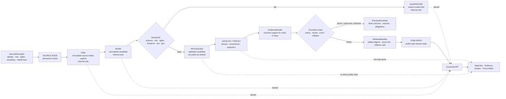

<!-- [KFM_META_BLOCK_V2]
doc_id: kfm://doc/NEEDS-VERIFICATION-ADR-AGRICULTURE-LIFECYCLE-BOUNDARY
title: ADR: Agriculture Lifecycle Boundary
type: standard
version: v1
status: draft
owners: OWNER_TBD_NEEDS_VERIFICATION; TODO-agriculture-domain-steward
created: 2026-05-08
updated: 2026-05-08
policy_label: TODO-policy-label
related: [README.md, ADR-TEMPLATE.md, ADR-0001-schema-home.md, ADR-0002-responsibility-root-monorepo.md, ../doctrine/lifecycle-law.md, ../domains/agriculture/README.md, ../domains/agriculture/governance/STATE_OF_LANE.md, ../domains/agriculture/governance/SOURCE_REGISTRY.md, ../domains/agriculture/governance/VALIDATION_PLAN.md, ../domains/agriculture/architecture/DATA_CONTRACTS.md, ../domains/agriculture/architecture/EVIDENCE_AND_PROVENANCE.md, ../domains/agriculture/operations/PIPELINE_RUNBOOK.md]
tags: [kfm, adr, agriculture, lifecycle-boundary, source-role, evidencebundle, promotion, rollback, fail-closed]
notes: [Replaces the placeholder ADR with source-grounded decision language. doc_id, owners, CODEOWNERS coverage, policy label, ADR index status, machine schema home, validator enforcement, CI workflow status, release objects, and runtime/UI behavior remain NEEDS VERIFICATION.]
[/KFM_META_BLOCK_V2] -->

<a id="top"></a>

# ADR: Agriculture Lifecycle Boundary

Decide how Agriculture data may move through KFM lifecycle stages, and where public access must stop until evidence, policy, release, correction, and rollback are closed.

<p align="center">
  
  
  
  
  
  
</p>

<p align="center">
  <a href="#decision">Decision</a> ·
  <a href="#context">Context</a> ·
  <a href="#repo-fit">Repo fit</a> ·
  <a href="#evidence-basis">Evidence</a> ·
  <a href="#boundary-model">Boundary model</a> ·
  <a href="#scope">Scope</a> ·
  <a href="#rules">Rules</a> ·
  <a href="#stage-contract">Stage contract</a> ·
  <a href="#source-role-gates">Source roles</a> ·
  <a href="#public-surface-contract">Public surfaces</a> ·
  <a href="#validation-plan">Validation</a> ·
  <a href="#rollback-and-correction">Rollback</a>
</p>

> [!IMPORTANT]
> **Decision status:** `proposed`.  
> **Implementation status:** `NEEDS VERIFICATION`.  
> **Stable path identity:** `docs/adr/ADR-agriculture-lifecycle-boundary.md`.
>
> This ADR records the Agriculture lifecycle boundary and review burden. It does **not** prove that validators, schemas, policy bundles, CI workflows, source descriptors, release manifests, proof packs, public routes, MapLibre layers, Evidence Drawer payloads, Focus Mode payloads, dashboards, logs, or deployed runtime behavior already enforce the boundary.

> [!WARNING]
> This ADR does **not** authorize live Agriculture source activation, public release from `RAW`, `WORK`, `QUARANTINE`, or unpublished candidates, direct public access to internal lifecycle stores, or treating receipts, tiles, summaries, search indexes, dashboards, Focus Mode text, or model output as root truth.

---

## Decision

KFM Agriculture adopts a source-role-aware lifecycle boundary:

```text
SOURCE EDGE -> RAW -> WORK / QUARANTINE -> PROCESSED -> CATALOG / TRIPLET -> PUBLISHED
```

Agriculture material may become public only after it passes evidence, policy, validation, review, catalog/proof, release, correction, and rollback gates. Public and semi-public clients consume governed APIs, released artifacts, released layer manifests, and resolved `EvidenceBundle` support only.

### Boundary rule

| Lifecycle area | Boundary decision |
|---|---|
| `SOURCE EDGE` | Source identity, source role, owner/steward, rights, sensitivity, cadence, stable keys, spatial support, and temporal support must be known before movement beyond planning. |
| `RAW` | Internal immutable capture only. RAW payloads are not public evidence and are not public delivery artifacts. |
| `WORK` | Internal normalization/candidate stage only. WORK may repair, normalize, or transform while preserving source IDs, timestamps, units, depth, CRS, QC, product version, masks, and caveats. |
| `QUARANTINE` | Internal fail-closed hold state for malformed, unsupported, ambiguous, policy-blocked, rights-unclear, or source-role-incompatible material. |
| `PROCESSED` | Validated candidate stage. It is still not public by default and cannot bypass catalog/proof/release gates. |
| `CATALOG / TRIPLET` | Closure and projection stage. Catalog metadata, graph edges, and triplets do not become sovereign truth by themselves. |
| `PUBLISHED` | Public-safe state only after governed promotion, `ReleaseManifest`, proof refs, correction path, and rollback target. |

### One-sentence rule

Agriculture lifecycle receipts can explain how a candidate moved; they cannot support a public claim unless the claim later resolves to an `EvidenceBundle` through a governed release path.

### One-sentence public boundary

Normal public UI, public APIs, exports, MapLibre layers, Evidence Drawer payloads, Focus Mode answers, dashboards, and stories must not read directly from `RAW`, `WORK`, `QUARANTINE`, source connectors, unpublished candidates, internal canonical stores, internal receipts, review-only stores, steward-only stores, proof-only stores, or direct model output.

<p align="right"><a href="#top">Back to top ↑</a></p>

---

## ADR header

| Field | Value |
|---|---|
| ADR ID | `ADR-agriculture-lifecycle-boundary` |
| Title | ADR: Agriculture Lifecycle Boundary |
| Status | `proposed` |
| Decision date | `2026-05-08` |
| Owners | `OWNER_TBD_NEEDS_VERIFICATION`; `TODO-agriculture-domain-steward` |
| Reviewers | `REVIEWER_TBD_NEEDS_VERIFICATION` |
| Policy label | `TODO-policy-label` |
| Scope | Domain architecture, lifecycle boundary, public access boundary, source-role governance |
| Affected docs | `docs/adr/`, `docs/domains/agriculture/`, related source, validation, evidence, and operations docs |
| Affected implementation homes | `schemas/`, `contracts/`, `policy/`, `fixtures/`, `tests/`, `tools/`, `pipelines/`, `data/`, `release/`, `apps/`, and `packages/` — all **NEEDS VERIFICATION** for Agriculture-specific enforcement |
| Related ADRs | [`ADR-0001-schema-home.md`](ADR-0001-schema-home.md), [`ADR-0002-responsibility-root-monorepo.md`](ADR-0002-responsibility-root-monorepo.md), [`ADR-TEMPLATE.md`](ADR-TEMPLATE.md) |
| Supersedes | Placeholder text previously in this file |
| Superseded by | `none` |
| Decision confidence | `CONFIRMED` doctrine and Agriculture documentation; `PROPOSED` decision; `NEEDS VERIFICATION` enforcement |
| Rollback target | Supersede this ADR, revert implementation PRs, disable source descriptors, preserve receipts/proofs/catalog/release/correction lineage |

---

## Context

The Agriculture lane carries several evidence classes that look similar on a map but support different claims:

- soil survey context such as SSURGO/SDA and MUKEY properties;
- station observations such as soil moisture readings;
- gridded or satellite products such as SMAP, HLS, HLS-derived vegetation indices, CDL, gSSURGO, or gNATSGO;
- aggregate statistics such as USDA NASS QuickStats or Crop Progress;
- derived indicators such as stress, anomaly, suitability, or change surfaces;
- public delivery artifacts such as PMTiles, layer manifests, dashboards, summaries, and Focus Mode answers.

These classes must not collapse into one “agriculture truth” surface. A county-level aggregate statistic cannot prove field-level crop condition. A station observation cannot become a field or statewide surface without a declared transform and review. A gridded product is not a station reading or ground truth by default. A derived layer is a rebuildable carrier, not canonical evidence.

The existing Agriculture documentation package states this posture, but the target ADR began as a placeholder. This ADR turns that placeholder into a reviewable lifecycle decision.

### Problem

Without a lifecycle-boundary ADR, Agriculture can drift in three ways:

| Drift | Failure mode |
|---|---|
| Source-role drift | Aggregate, station, grid, remote-sensing, derived, authority, and restricted sources appear interchangeable. |
| Public-access drift | Public routes, layer manifests, drawers, or Focus Mode payloads accidentally point at `RAW`, `WORK`, `QUARANTINE`, unpublished candidates, receipts, or direct model output. |
| Promotion drift | Validation, catalog closure, EvidenceBundle support, release manifests, correction paths, and rollback cards become optional or hidden. |

### Why this is architecture-significant

This decision governs the Agriculture lane’s trust membrane. It affects how source material becomes public-safe, how validators and fixtures must fail closed, how Evidence Drawer and Focus Mode remain evidence-bound, and how releases stay reversible.

<p align="right"><a href="#top">Back to top ↑</a></p>

---

## Repo fit

`docs/adr/ADR-agriculture-lifecycle-boundary.md` is the correct home for this decision because it governs cross-cutting architecture behavior: lifecycle stages, public-client access, source-role boundaries, promotion, evidence closure, and rollback.

| Relationship | Relative link | Status | Role |
|---|---|---:|---|
| ADR index | [`README.md`](README.md) | `CONFIRMED path / coverage NEEDS VERIFICATION` | ADR directory index and decision-review guidance. |
| ADR template | [`ADR-TEMPLATE.md`](ADR-TEMPLATE.md) | `CONFIRMED` | Local ADR structure and evidence-heavy review standard. |
| Schema-home ADR | [`ADR-0001-schema-home.md`](ADR-0001-schema-home.md) | `CONFIRMED draft / proposed` | Proposed machine schema home; not yet accepted enforcement. |
| Responsibility-root ADR | [`ADR-0002-responsibility-root-monorepo.md`](ADR-0002-responsibility-root-monorepo.md) | `CONFIRMED accepted decision / review revision` | Root folders are responsibility boundaries, not domain buckets. |
| Lifecycle doctrine | [`../doctrine/lifecycle-law.md`](../doctrine/lifecycle-law.md) | `CONFIRMED path from repo search / verify content before citing as implementation proof` | Shared lifecycle law reference. |
| Agriculture landing page | [`../domains/agriculture/README.md`](../domains/agriculture/README.md) | `CONFIRMED` | Lane scope, source-role guardrails, lifecycle, public posture. |
| Agriculture lane state | [`../domains/agriculture/governance/STATE_OF_LANE.md`](../domains/agriculture/governance/STATE_OF_LANE.md) | `CONFIRMED` | Current maturity, blockers, and next actions. |
| Source registry guidance | [`../domains/agriculture/governance/SOURCE_REGISTRY.md`](../domains/agriculture/governance/SOURCE_REGISTRY.md) | `CONFIRMED` | Source descriptor admission and source-role requirements. |
| Validation plan | [`../domains/agriculture/governance/VALIDATION_PLAN.md`](../domains/agriculture/governance/VALIDATION_PLAN.md) | `CONFIRMED` | Fixture-first fail-closed validation burden. |
| Data contracts | [`../domains/agriculture/architecture/DATA_CONTRACTS.md`](../domains/agriculture/architecture/DATA_CONTRACTS.md) | `CONFIRMED` | Object families, schema-home caution, source-role compatibility. |
| Evidence and provenance | [`../domains/agriculture/architecture/EVIDENCE_AND_PROVENANCE.md`](../domains/agriculture/architecture/EVIDENCE_AND_PROVENANCE.md) | `CONFIRMED` | EvidenceBundle, provenance, catalog/release closure, public payload rules. |
| Pipeline runbook | [`../domains/agriculture/operations/PIPELINE_RUNBOOK.md`](../domains/agriculture/operations/PIPELINE_RUNBOOK.md) | `CONFIRMED` | Fixture-first lifecycle operations and rollback guidance. |

> [!NOTE]
> A prior Agriculture planning dossier proposed domain-local ADR filenames. The current repository target is already in `docs/adr/`, and the responsibility-root ADR supports this placement because the decision affects shared lifecycle and public-access governance.

<p align="right"><a href="#top">Back to top ↑</a></p>

---

## Evidence basis

| Evidence item | Source / path | What it supports | Truth label |
|---|---|---|---|
| Target ADR placeholder | `docs/adr/ADR-agriculture-lifecycle-boundary.md` | This file exists and currently needs replacement with accepted decision language and evidence links. | `CONFIRMED repo evidence` |
| ADR template | [`ADR-TEMPLATE.md`](ADR-TEMPLATE.md) | ADRs should include evidence, impact map, validation, rollback, truth labels, and open verification. | `CONFIRMED repo evidence` |
| Hydrology synthetic lifecycle ADR style | `docs/adr/ADR-0308-hydrology-synthetic-ingest-lifecycle-boundary.md` | KFM lifecycle-boundary ADRs should distinguish decision state from fixture/enforcement maturity and deny public access from internal stages. | `CONFIRMED adjacent style / INFERRED pattern` |
| Responsibility-root ADR | [`ADR-0002-responsibility-root-monorepo.md`](ADR-0002-responsibility-root-monorepo.md) | Root folders are authority boundaries; domain work belongs under responsibility roots; ADRs belong under `docs/adr/`. | `CONFIRMED accepted decision` |
| Schema-home ADR | [`ADR-0001-schema-home.md`](ADR-0001-schema-home.md) | `schemas/contracts/v1/` is the proposed canonical machine-schema home; `contracts/` meaning and `policy/` admissibility remain separate; enforcement is not yet proven. | `CONFIRMED draft / PROPOSED decision` |
| Agriculture README | [`../domains/agriculture/README.md`](../domains/agriculture/README.md) | Agriculture is evidence-first, source-role-preserving, fixture-first, fail-closed, and not ready to claim runtime enforcement. | `CONFIRMED repo documentation` |
| State of Lane | [`../domains/agriculture/governance/STATE_OF_LANE.md`](../domains/agriculture/governance/STATE_OF_LANE.md) | Agriculture documentation control plane is confirmed; live source activation, public release, CI enforcement, runtime/API/UI maturity remain unconfirmed. | `CONFIRMED repo documentation` |
| Source Registry | [`../domains/agriculture/governance/SOURCE_REGISTRY.md`](../domains/agriculture/governance/SOURCE_REGISTRY.md) | Source descriptors must include role, rights, sensitivity, stable keys, temporal/spatial support, activation state, validation, catalog, evidence, release, and rollback expectations. | `CONFIRMED repo documentation` |
| Data Contracts | [`../domains/agriculture/architecture/DATA_CONTRACTS.md`](../domains/agriculture/architecture/DATA_CONTRACTS.md) | Source role is part of meaning; public claims resolve evidence; unknown rights/sensitivity/source role fail closed; schema home is unresolved. | `CONFIRMED repo documentation` |
| Evidence and Provenance | [`../domains/agriculture/architecture/EVIDENCE_AND_PROVENANCE.md`](../domains/agriculture/architecture/EVIDENCE_AND_PROVENANCE.md) | Public claims, layers, drawers, Focus answers, and exports require EvidenceBundle support, catalog/release closure, correction, and rollback. | `CONFIRMED repo documentation` |
| Validation Plan | [`../domains/agriculture/governance/VALIDATION_PLAN.md`](../domains/agriculture/governance/VALIDATION_PLAN.md) | Agriculture validation is fixture-first, fail-closed, and must include negative cases for source-role, rights, sensitivity, temporal, unit/depth, geospatial, catalog, public-path, and rollback failures. | `CONFIRMED repo documentation` |
| Pipeline Runbook | [`../domains/agriculture/operations/PIPELINE_RUNBOOK.md`](../domains/agriculture/operations/PIPELINE_RUNBOOK.md) | Agriculture operations follow SOURCE EDGE → RAW → WORK/QUARANTINE → PROCESSED → CATALOG/TRIPLET → PUBLISHED and keep public clients downstream of governed APIs. | `CONFIRMED repo documentation` |
| Revised Agriculture dossier | uploaded planning report | Supports lifecycle, source-role, validation, catalog, public UI, and rollback design as lineage; does not prove current repo enforcement. | `LINEAGE / PROPOSED planning evidence` |

### Evidence limits

- This ADR is grounded in current GitHub repository files and attached KFM doctrine.
- A local mounted checkout, active branch dirty state, CI logs, workflow runs, validator output, runtime logs, dashboards, deployment evidence, live source descriptors, and release artifacts were not verified inside this draft.
- Therefore, implementation-shaped paths and command examples below are marked `PROPOSED`, `UNKNOWN`, or `NEEDS VERIFICATION`.

<p align="right"><a href="#top">Back to top ↑</a></p>

---

## Requirements and constraints

| KFM invariant | Agriculture lifecycle impact | Status |
|---|---|---|
| `RAW -> WORK / QUARANTINE -> PROCESSED -> CATALOG / TRIPLET -> PUBLISHED` | This ADR makes that lifecycle the boundary for Agriculture source material. | `CONFIRMED doctrine / PROPOSED decision` |
| Public clients use governed interfaces and released artifacts | Public API, MapLibre, Evidence Drawer, Focus Mode, dashboards, stories, and exports cannot read internal lifecycle stages. | `CONFIRMED doctrine / NEEDS VERIFICATION enforcement` |
| `EvidenceRef -> EvidenceBundle` before consequential claims | Agriculture public claims, layers, drawers, Focus answers, and exports require resolved evidence. | `CONFIRMED documentation / NEEDS VERIFICATION implementation` |
| Promotion is a governed state transition, not a file move | `PUBLISHED` requires validation, policy, evidence, catalog, proof, review, release, correction, and rollback closure. | `CONFIRMED doctrine / PROPOSED decision` |
| AI is interpretive and subordinate | Focus Mode may interpret released Agriculture evidence; generated text is not source truth. | `CONFIRMED doctrine / UNKNOWN runtime enforcement` |
| Derived surfaces are not canonical truth | PMTiles, search indexes, dashboards, summaries, embeddings, graphs, triplets, and scenes are carriers only. | `CONFIRMED doctrine / PROPOSED operational rule` |
| Rights, sensitivity, source role, review, and release state fail closed | Missing rights, sensitivity, source role, stable keys, support, EvidenceBundle, or rollback blocks promotion. | `CONFIRMED documentation / NEEDS VERIFICATION enforcement` |
| Receipts, proofs, releases, corrections, and rollback remain separate | Run receipts support audit; proof packs and release manifests support promotion; corrections and rollback preserve history. | `CONFIRMED documentation / PROPOSED rule` |

<p align="right"><a href="#top">Back to top ↑</a></p>

---

## Boundary model



### Boundary statement

Agriculture can use internal lifecycle stages to ingest, normalize, validate, quarantine, catalog, and prepare release candidates. It cannot present those internal stages as public truth. Public truth-bearing outputs begin only after release-state closure.

<p align="right"><a href="#top">Back to top ↑</a></p>

---

## Scope

### In scope

| In scope | Required posture |
|---|---|
| Source admission | `SourceDescriptor` before intake or release consideration. |
| RAW capture | Immutable internal source-native capture with digest/receipt. |
| WORK normalization | Internal candidate normalization preserving source semantics. |
| QUARANTINE | Fail-closed hold for invalid, unsupported, rights-unclear, sensitivity-unclear, stale, ambiguous, or source-role-incompatible material. |
| PROCESSED candidates | Validated candidates that are still non-public unless promoted. |
| CATALOG / TRIPLET closure | STAC/DCAT/PROV/CatalogMatrix/graph closure where applicable; not truth alone. |
| EvidenceBundle closure | Resolved evidence support for claims, layers, API responses, drawers, exports, and Focus answers. |
| Promotion and release | `PromotionDecision`, `DecisionEnvelope`, `ReleaseManifest`, proof refs, correction path, and rollback card. |
| Public trust payloads | Governed API, MapLibre, Evidence Drawer, Focus Mode, exports, story nodes, and dashboards downstream of release. |
| Negative-path behavior | `ABSTAIN`, `DENY`, `ERROR`, or `QUARANTINE` rather than unsupported public claims. |

### Out of scope

| Out of scope | Reason |
|---|---|
| Live Agriculture source activation | Requires current source terms, descriptors, fixtures, validators, policy, catalog, release, and review evidence. |
| Exact machine schema subpath | Governed by schema-home ADR; still `NEEDS VERIFICATION`. |
| API route names, UI component paths, MapLibre layer registry implementation | Runtime code and route conventions are `UNKNOWN` until inspected and tested. |
| Private/proprietary farm, operator, yield, pesticide, or chemical records | Blocked by default until restricted-data governance, consent/authorization, sensitivity, retention, and revocation exist. |
| Field-level claims from aggregate statistics | Source-role-incompatible by default. |
| Station readings as field or statewide truth | Requires declared transform/model, uncertainty, validation, and review. |
| Gridded/satellite products as direct ground truth | Requires product/version, masks, quality metadata, declared support, and cautious scope. |
| Emergency or life-safety instructions | KFM Agriculture is not an alerting or emergency instruction system. |
| AI-generated publication | Generated language cannot replace evidence, policy, review, or release state. |

<p align="right"><a href="#top">Back to top ↑</a></p>

---

## Definitions

| Term | Meaning in this ADR |
|---|---|
| `SourceDescriptor` | Record that identifies a source, its source role, rights, sensitivity, stable keys, support, cadence, activation state, and review burden. |
| `RAW` | Immutable source-native or source-like captured material. Internal only. |
| `WORK` | Internal normalized candidate material. It may be incomplete or unreviewed. |
| `QUARANTINE` | Internal fail-closed hold state for blocked or invalid material. |
| `PROCESSED` | Validated candidate material that has passed relevant checks but is not public by default. |
| `CATALOG / TRIPLET` | Catalog/provenance closure and graph projection state. Not proof by itself. |
| `EvidenceBundle` | Resolved support package for a specific claim, layer, answer, or export. |
| `Receipt` | Process-memory object recording what ran and what happened. It is not release proof by itself. |
| `Proof pack` | Release-grade evidence/support package for promotion gates where repo conventions support it. |
| `ReleaseManifest` | Published release identity, artifact digest, proof ref, policy, correction, and rollback object. |
| `RollbackCard` | Reversal/repointing plan and target for a release. |
| `DecisionEnvelope` | Finite governed outcome such as `ANSWER`, `ABSTAIN`, `DENY`, or `ERROR`. |
| `PromotionDecision` | Finite release-transition decision that determines whether a candidate may become published. |

<p align="right"><a href="#top">Back to top ↑</a></p>

---

## Rules

### Rule 1 — SourceDescriptor before lifecycle movement

Agriculture material must not move toward intake, transformation, catalog, or release without source identity, source role, rights, sensitivity, stable keys, spatial support, temporal support, and activation state.

### Rule 2 — RAW is immutable and internal

RAW payloads are never public artifacts. They may support audit and replay through receipts and provenance, but public clients must not read them directly.

### Rule 3 — WORK preserves source meaning

Normalization must preserve source IDs, source timezone, observed/source/retrieved time, units, depth, CRS, QC, product version, mask/quality fields, and caveats where material.

### Rule 4 — QUARANTINE is a valid outcome

Quarantine is not failure theater. It is the correct lifecycle state for unsupported, malformed, stale, ambiguous, rights-unclear, sensitivity-unclear, or source-role-incompatible material.

### Rule 5 — PROCESSED is still not public by default

A validated candidate is not a release. It becomes public only after catalog/proof/evidence/policy/review/release/rollback closure.

### Rule 6 — CATALOG/TRIPLET does not equal truth

STAC, DCAT, PROV, CatalogMatrix, graph triples, search views, and index projections are trust-supporting surfaces. They are not sovereign truth.

### Rule 7 — EvidenceBundle before public claim

Every consequential Agriculture public claim, layer, Focus answer, drawer payload, export, dashboard, or story statement must resolve to an `EvidenceBundle`.

### Rule 8 — Promotion is a state transition

A candidate becomes `PUBLISHED` only through a governed promotion decision. Publication is not a file move, copy, tile build, route addition, dashboard update, or model response.

### Rule 9 — Public clients stay downstream

Normal public clients must consume governed APIs and released artifacts only. Public DTOs, layer manifests, drawer payloads, and Focus payloads must not expose internal lifecycle paths.

### Rule 10 — Rollback before publication

A public release requires a rollback target or explicit no-prior-release basis. Corrections and supersessions preserve history; they do not overwrite it silently.

### Rule 11 — Source role limits claim scope

Aggregate, station, gridded, remote-sensing, derived, authority, documentary, mirror, and restricted sources must keep their support boundaries visible.

<p align="right"><a href="#top">Back to top ↑</a></p>

---

## Stage contract

| Stage | Allowed readers | May contain | Must not do | Required objects / evidence |
|---|---|---|---|---|
| `SOURCE EDGE` | Maintainers, source stewards, registry reviewers | Source identity, proposed descriptor, rights/sensitivity notes, activation state | Fetch, publish, or answer public claims by naming a source | `SourceDescriptor` candidate, source review state |
| `RAW` | Internal/steward only | Immutable payload/ref, raw digest, fetch receipt, source headers/checksums where allowed | Feed public API/UI directly or be treated as public evidence | RAW ref, source digest, fetch/run receipt |
| `WORK` | Internal/steward only | Normalized candidate, preserved source keys, units, timestamps, QC, CRS, product metadata | Become public or silently drop source semantics | Transform receipt, record/content hash, warnings |
| `QUARANTINE` | Internal/steward/review only | Failed candidate, reason codes, validation/policy failures, repair task | Be bypassed into release or hidden as if no failure occurred | Quarantine receipt, failure report, owner/task |
| `PROCESSED` | Maintainers/reviewers; not public by default | Validated candidate artifacts | Become public without catalog/evidence/release gates | ValidationReport, dataset version, source refs |
| `CATALOG / TRIPLET` | Reviewers; public-safe metadata only after policy permits | STAC/DCAT/PROV/CatalogMatrix refs, graph/triplet projections, digest closure | Serve as proof by itself or broaden claim scope | Catalog refs, provenance refs, EvidenceRef candidates |
| `PUBLISHED` | Public or role-authorized clients | Released artifacts, public-safe layer/API manifests, EvidenceBundle-backed payloads | Expose internal paths or unsupported precision | PromotionDecision, ReleaseManifest, proof refs, EvidenceBundle, correction path, rollback card |

<p align="right"><a href="#top">Back to top ↑</a></p>

---

## Source-role gates

| Source role | Supports | Must not support | Default failure when misused |
|---|---|---|---|
| `authority` | Claims inside declared authoritative source scope, version, geography, and time support. | Claims outside jurisdiction, source scope, temporal support, or version. | `ABSTAIN` or `DENY` |
| `observation` | Station/depth/time/variable statements with source QC and timestamp support. | Field, parcel, statewide, or surface truth without declared transform. | `DENY` or `QUARANTINE` |
| `aggregate` | Aggregate geography/time/commodity/statistic statements. | Field-level, parcel-level, operator-level, or exact-location truth. | `DENY` |
| `remote_sensing` | Product-specific grid, pixel, asset, mask, and time-window context. | Station observation or ground truth by default. | `ABSTAIN` or `DENY` |
| `derived` | Declared indicator, stress, anomaly, suitability, or change outputs with input refs and method/version. | Original source truth, legal determination, or unreviewed public evidence. | `DENY` |
| `mirror` | Access acceleration when upstream identity, rights, digests, and lineage are preserved. | New authority or transformed claim semantics without declaration. | `DENY` |
| `documentary` | Scoped narrative/report support with citation and interpretation status. | Machine observation, measured value, or spatial precision it does not carry. | `ABSTAIN` |
| `private_restricted` | Nothing public by default; future restricted workflows only after policy approval. | Public release without consent, rights, sensitivity, and access controls. | `DENY` |

### Agriculture anti-collapse rules

- **NASS aggregate is not field truth.**
- **Crop Progress is not parcel or operator truth.**
- **Station soil moisture is not a field surface without a declared transform.**
- **SMAP/HLS/CDL/gSSURGO/gNATSGO are product-specific grid or remote-sensing context.**
- **Derived stress, anomaly, suitability, and condition layers are not root evidence.**
- **Private farm/operator/yield/pesticide records are blocked by default.**
- **AI text is never the source of truth.**

<p align="right"><a href="#top">Back to top ↑</a></p>

---

## Public surface contract

| Surface | May consume | Must not consume |
|---|---|---|
| Governed API | Released artifacts, release manifests, EvidenceBundles, DecisionEnvelopes, public-safe layer manifests. | RAW, WORK, QUARANTINE, unpublished candidates, source connectors, internal receipts as evidence, direct model output. |
| MapLibre layer | Released layer manifest and published map artifacts only. | Internal lifecycle stores or candidate geometries as public truth. |
| Evidence Drawer | EvidenceBundle, source role, support class, freshness, validation summary, policy state, review/release state, correction/rollback state. | RAW/WORK/QUARANTINE paths, private source details, internal receipt paths, unsupported claim language. |
| Focus Mode | Released, policy-safe EvidenceBundles with citation validation and finite outcome. | Raw candidate data, unvalidated summaries, direct model answer as evidence, restricted material. |
| Export / story / dashboard | Released artifacts with release manifest, evidence refs, policy label, correction and rollback path. | Internal lifecycle files, unpromoted catalog candidates, private source payloads. |
| Review console | Role-authorized internal artifacts and review payloads. | Public exposure of steward-only or restricted internal artifacts. |

### Public payload minimum fields

Public Agriculture payloads should carry enough trust context to prevent overclaiming:

| Field family | Purpose |
|---|---|
| Identity | Layer, feature, claim, release, and artifact IDs. |
| Scope | Spatial support, temporal support, semantic support, and source role. |
| Evidence | EvidenceBundle ref and public-safe citation/source refs. |
| Policy | Policy label, sensitivity, rights/attribution, obligations, transforms. |
| Validation | Gate summary and finite outcome. |
| Freshness | Observed/source/retrieved/release time and stale state. |
| Correction | Current/superseded/withdrawn state and public correction note when needed. |
| Rollback | Current release and rollback target or no-prior-release basis. |

<p align="right"><a href="#top">Back to top ↑</a></p>

---

## Options considered

| Option | Description | Benefits | Risks / costs | Outcome |
|---|---|---|---|---|
| A. Strict lifecycle boundary | Keep public access downstream of promotion, release, EvidenceBundle, policy, correction, and rollback closure. | Preserves KFM trust law and makes negative outcomes first-class. | Requires more fixtures, validators, and release objects before public surfaces can ship. | **Selected / proposed** |
| B. Public access after `PROCESSED` | Allow validated candidates to feed public layers directly. | Faster map-layer delivery. | Weakens catalog/proof/release/rollback discipline; creates candidate-as-truth drift. | Rejected |
| C. Documentation-only boundary | Keep lifecycle guidance in Agriculture docs but no ADR. | Low effort. | Decisions remain scattered and easy to bypass. | Rejected |
| D. Domain-local ADR under `docs/domains/agriculture/` | Keep all Agriculture decisions inside the domain folder. | Convenient for domain authors. | Lifecycle boundary affects shared public access, release, policy, evidence, and root placement; ADR index would miss a cross-cutting decision. | Rejected for this target |
| E. Single root-level `agriculture/` folder | Put docs, schemas, policy, data, tests, and release artifacts together. | Simple topic navigation. | Violates responsibility-root discipline and blurs authority boundaries. | Rejected |

<p align="right"><a href="#top">Back to top ↑</a></p>

---

## Impact map

| Area | Required update or check | Status |
|---|---|---|
| `docs/adr/README.md` | Add or confirm this ADR in the ADR inventory after review. | `NEEDS VERIFICATION` |
| `docs/domains/agriculture/governance/STATE_OF_LANE.md` | Record this ADR status and lifecycle boundary maturity. | `PROPOSED` |
| `docs/domains/agriculture/governance/FILE_INDEX.md` | Link this ADR as a cross-cutting decision if the index tracks ADRs. | `PROPOSED` |
| `docs/domains/agriculture/governance/SOURCE_REGISTRY.md` | Keep source descriptor admission requirements aligned with this boundary. | `CONFIRMED docs / NEEDS VERIFICATION enforcement` |
| `docs/domains/agriculture/governance/VALIDATION_PLAN.md` | Ensure negative fixtures include public internal-path, source-role, rights/sensitivity, EvidenceBundle, and rollback failures. | `CONFIRMED docs / PROPOSED enforcement` |
| `docs/domains/agriculture/architecture/DATA_CONTRACTS.md` | Keep object families and schema-home caution aligned. | `CONFIRMED docs` |
| `docs/domains/agriculture/architecture/EVIDENCE_AND_PROVENANCE.md` | Keep EvidenceBundle, catalog, release, correction, and rollback language aligned. | `CONFIRMED docs` |
| `docs/domains/agriculture/operations/PIPELINE_RUNBOOK.md` | Keep lifecycle stage actions, incident response, rollback, and public boundary steps aligned. | `CONFIRMED docs` |
| `schemas/` | Add or verify Agriculture schemas only after schema-home decision and repo conventions are confirmed. | `NEEDS VERIFICATION` |
| `contracts/` | Keep semantic contract guidance separate from machine-schema authority. | `NEEDS VERIFICATION` |
| `policy/` | Add or verify allow/deny/restrict rules for source role, rights, sensitivity, public precision, promotion, and no-public-internal-path behavior. | `NEEDS VERIFICATION` |
| `fixtures/` and `tests/` | Add valid/invalid fixture suite and fail-closed tests. | `PROPOSED / NEEDS VERIFICATION` |
| `tools/` / `scripts/` | Add or verify validators for source registry, manifest, receipt-not-proof, catalog closure, public-path safety, and promotion readiness. | `PROPOSED / NEEDS VERIFICATION` |
| `data/registry/` | Add or verify machine-readable Agriculture source descriptors. | `PROPOSED / NEEDS VERIFICATION` |
| `data/receipts/`, `data/proofs/`, `release/` | Add release-grade proof, receipt, ReleaseManifest, PromotionDecision, CorrectionNotice, and RollbackCard artifacts only after repo convention verification. | `PROPOSED / NEEDS VERIFICATION` |
| API/UI runtime surfaces | Bind only after governed API, MapLibre, Evidence Drawer, and Focus Mode conventions are inspected and tested. | `UNKNOWN / NEEDS VERIFICATION` |

<p align="right"><a href="#top">Back to top ↑</a></p>

---

## Policy, rights, and sensitivity

| Question | ADR answer | Status |
|---|---|---|
| Does this decision affect public release eligibility? | Yes. It defines when Agriculture material may become public. | `CONFIRMED / PROPOSED rule` |
| Does this decision affect exact location exposure? | Yes. Exact or sensitive Agriculture-related locations must respect policy, source role, rights, and review state. | `CONFIRMED doctrine / NEEDS VERIFICATION policy` |
| Does this decision affect private/operator/farm records? | Yes. Those are blocked by default and out of ordinary public Agriculture scope. | `CONFIRMED documentation / PROPOSED rule` |
| Does this decision require steward review? | Yes for source activation, restricted material, public release, and policy-significant changes. | `NEEDS VERIFICATION owner routing` |
| Does this decision change fail-closed behavior? | It clarifies fail-closed behavior for the Agriculture lane. | `PROPOSED decision` |
| Does this decision affect correction and rollback? | Yes. Published Agriculture artifacts need correction path and rollback target. | `CONFIRMED doctrine / NEEDS VERIFICATION artifacts` |
| Does this decision affect external source rights and terms? | Yes. Missing or unverified terms block live activation and public release. | `NEEDS VERIFICATION` |

> [!CAUTION]
> Unknown rights, unclear source terms, missing sensitivity, unsupported precision, unresolved source role, missing EvidenceBundle support, stale support, or missing rollback target must produce `DENY`, `ABSTAIN`, `ERROR`, or `QUARANTINE`, not a polished public claim.

<p align="right"><a href="#top">Back to top ↑</a></p>

---

## Validation plan

Validation is fixture-first and fail-closed. Implementation commands are illustrative until verified in the mounted repo and CI.

### Required gates

| Gate | Must prove | Expected negative behavior |
|---|---|---|
| Source descriptor gate | Source identity, role, owner/steward, rights, sensitivity, stable keys, spatial/temporal support, activation state. | `DENY` source activation or public release. |
| Schema gate | Object shape and required fields are valid under accepted schema home. | `ERROR` or `QUARANTINE`. |
| Source-role gate | Source role supports claim scope. | `DENY` or `ABSTAIN`. |
| Rights/sensitivity gate | Public exposure and precision are allowed. | `DENY`. |
| Temporal gate | Observed, source, retrieved, release, correction, and stale-state semantics are not collapsed. | `ABSTAIN`, stale label, or `QUARANTINE`. |
| Unit/depth/product-lineage gate | Units, depth, QC, CRS, product version, masks, and support class are preserved where material. | `QUARANTINE` or `DENY`. |
| Catalog closure gate | STAC/DCAT/PROV/CatalogMatrix/release digest identities close. | `DENY`. |
| EvidenceBundle gate | Every public claim or payload resolves support. | `ABSTAIN`, `DENY`, or `ERROR`. |
| Receipt-not-proof gate | Receipts are process memory, not release proof or EvidenceBundle support. | `ERROR` or `DENY`. |
| Public internal-path gate | Public payloads do not expose `RAW`, `WORK`, `QUARANTINE`, unpublished candidates, internal receipts, canonical stores, or direct model output. | `DENY`. |
| Rollback gate | Release candidate has rollback target or explicit no-prior-release basis. | `ERROR` or `DENY`. |

### Required negative fixtures

| Fixture | Expected outcome |
|---|---|
| Missing source rights | `DENY` |
| Missing source sensitivity | `DENY` |
| Ambiguous or unsupported source role | `ABSTAIN` or `DENY` |
| NASS aggregate used as field/parcel/operator truth | `DENY` |
| Station observation used as field/surface truth without transform | `DENY` or `QUARANTINE` |
| SMAP/HLS/CDL/gSSURGO grid described as direct ground truth | `DENY` |
| Soil moisture reading missing unit/depth/QC/time support | `ERROR` or `QUARANTINE` |
| Derived indicator missing input refs, method version, uncertainty, or receipt | `DENY` |
| Release candidate with mismatched catalog digests | `DENY` |
| Public payload with `data/raw/`, `data/work/`, or `data/quarantine/` reference | `DENY` |
| Receipt used as EvidenceBundle or release proof | `ERROR` |
| Release candidate missing rollback target | `ERROR` or `DENY` |

### Illustrative command sheet

> [!WARNING]
> Commands below are `NEEDS VERIFICATION`. Replace them with repo-native commands after package manager, validator paths, policy tooling, fixture paths, and CI workflows are confirmed.

```bash
# Phase 0 — read-only inventory before implementation claims
pwd
git status --short
git branch --show-current || true

find docs/domains/agriculture -maxdepth 4 -type f 2>/dev/null | sort

find docs contracts schemas policy tools tests fixtures apps packages pipelines data release .github \
  -maxdepth 5 -type f 2>/dev/null \
  | grep -Ei 'agriculture|agri|crop|nass|mesonet|ssurgo|sda|soil_moisture|smap|hls|EvidenceBundle|DecisionEnvelope|PromotionDecision|ReleaseManifest|CatalogMatrix|SourceDescriptor' \
  | sort \
  | head -500 || true
```

```bash
# NEEDS VERIFICATION — fixture and validator examples only
python -m pytest tests/agriculture -q

python tools/validators/agriculture/validate_source_registry.py \
  data/registry/agriculture/sources.yaml

python tools/validators/agriculture/validate_manifest.py \
  tests/agriculture/fixtures/agriculture_dataset_manifest_sample.json

python tools/validators/agriculture/validate_receipt.py \
  tests/agriculture/fixtures/agriculture_run_receipt_sample.json

python tools/validators/agriculture/validate_catalog_closure.py \
  tests/agriculture/fixtures/catalog_matrix_pass.json
```

<p align="right"><a href="#top">Back to top ↑</a></p>

---

## Rollback and correction

Rollback preserves lineage. It does not delete uncomfortable history.

| Rollback level | Required action |
|---|---|
| ADR rollback | Mark this ADR superseded or withdrawn, link successor, preserve file lineage, update ADR index. |
| Implementation rollback before publication | Revert PR or disable Agriculture lifecycle changes; keep docs/changelog/supersession notes aligned. |
| Source activation rollback | Change source state to disabled/quarantined, stop watcher, preserve RAW/WORK/QUARANTINE and receipts, emit source rollback receipt if repo convention exists. |
| Schema rollback | Retain old schema version, add supersession or compatibility note, update schema register, rerun compatibility tests. |
| Catalog/proof rollback | Do not delete catalog history. Mark affected objects superseded/withdrawn and preserve proof/receipt lineage. |
| Published layer rollback | Repoint current alias to prior approved `ReleaseManifest` or withdrawal state, invalidate caches if needed, emit rollback receipt/proof where repo convention exists. |
| Public claim correction | Publish `CorrectionNotice` or supersession summary; refresh EvidenceBundle and public trust payloads. |
| Focus Mode correction | Record finite failure, fix evidence/citation/policy route, and do not use generated text as correction evidence. |

### Rollback triggers

| Trigger | Outcome |
|---|---|
| Public payload references internal lifecycle path | `DENY` release; remove payload; add regression fixture. |
| Source terms change or become unclear | Disable source or hold release; update SourceDescriptor and policy. |
| EvidenceBundle cannot resolve | `ABSTAIN` or `DENY` public claim; rebuild support. |
| Source role is incompatible | `DENY` or narrow claim scope. |
| Catalog digest mismatch | `DENY` promotion; repair catalog closure. |
| Missing rollback target | `ERROR` or block release. |
| Private/restricted data appears in public path | `DENY`, incident review, remove public exposure, preserve audit trail. |

<p align="right"><a href="#top">Back to top ↑</a></p>

---

## Consequences

### Positive consequences

- Agriculture public surfaces stay evidence-bound and source-role-aware.
- Internal lifecycle stores remain internal.
- Negative outcomes become explicit review objects instead of hidden uncertainty.
- The lane can grow source families without widening claims silently.
- Release, correction, and rollback are planned before publication.
- MapLibre, Evidence Drawer, Focus Mode, exports, and dashboards remain downstream of governed trust objects.

### Costs and tradeoffs

| Cost | Mitigation |
|---|---|
| More work before public layer release | Start with no-network fixtures and a thin slice. |
| More object families to maintain | Reuse shared `SourceDescriptor`, `EvidenceBundle`, `DecisionEnvelope`, `ReleaseManifest`, `CatalogMatrix`, `CorrectionNotice`, and `RollbackCard` if present. |
| Source-role rules may block attractive map features | Use `ABSTAIN` or narrowed scope rather than unsupported precision. |
| Schema-home ambiguity remains | Keep schema paths `NEEDS VERIFICATION` until ADR-0001 is accepted or superseded. |
| Runtime/API/UI maturity is unknown | Keep public surface bindings proposed until inspected and tested. |

<p align="right"><a href="#top">Back to top ↑</a></p>

---

## Open verification backlog

| Item | Status | Why it matters |
|---|---:|---|
| `doc_id`, owners, CODEOWNERS, reviewers, and policy label | `NEEDS VERIFICATION` | Metadata must be steward-approved before stable status. |
| ADR index coverage for this file | `NEEDS VERIFICATION` | Maintainers need discoverable decision history. |
| Current branch, dirty state, package manager, workflow results, test output | `UNKNOWN` | Required before enforcement claims. |
| Accepted schema-home decision and exact Agriculture schema subpath | `CONFLICTED / NEEDS VERIFICATION` | Prevents duplicate `contracts/` and `schemas/` machine authority. |
| Shared schemas for `SourceDescriptor`, `EvidenceBundle`, `DecisionEnvelope`, `PromotionDecision`, `ReleaseManifest`, `CatalogMatrix`, `CorrectionNotice`, `RollbackCard` | `UNKNOWN` | Agriculture should reuse shared trust objects before creating domain forks. |
| Machine-readable Agriculture source descriptors | `NEEDS VERIFICATION` | Source activation and public-release review depend on registry-backed descriptors. |
| Agriculture validators and fixture paths | `UNKNOWN / NEEDS VERIFICATION` | Documentation gates need executable proof. |
| Policy-as-code location and policy tooling | `UNKNOWN / NEEDS VERIFICATION` | Rights, sensitivity, source-role, precision, and promotion decisions need enforcement. |
| Public API, MapLibre layer registry, Evidence Drawer, Focus Mode payload paths | `UNKNOWN` | Public trust payload binding must follow actual app conventions. |
| First Agriculture release manifest, proof pack, rollback card, and correction notice | `UNKNOWN / PROPOSED` | Required before public publication. |
| SSURGO/SDA/gSSURGO, Kansas Mesonet, SCAN, USCRN, SMAP, HLS/HLS-VI, NASS, and CDL source terms/cadence/automation permission | `NEEDS VERIFICATION` | Blocks live source activation. |
| Restricted-data lane for private/proprietary farm/operator records | `BLOCKED / PROPOSED` | Required before restricted private Agriculture evidence can be admitted. |

<p align="right"><a href="#top">Back to top ↑</a></p>

---

## Review checklist

<details>
<summary>Pre-merge checklist</summary>

- [ ] Meta block placeholders are replaced or explicitly tracked.
- [ ] ADR status remains `proposed` until reviewers accept it.
- [ ] ADR index references this file or records why it is deferred.
- [ ] Agriculture State of Lane reflects this ADR’s status.
- [ ] Source role, lifecycle, public-access, promotion, correction, and rollback boundaries are not weakened elsewhere.
- [ ] Schema-home claims remain bounded by ADR-0001 status.
- [ ] No implementation maturity is claimed without repo-native evidence.
- [ ] No public path reads `RAW`, `WORK`, `QUARANTINE`, unpublished candidates, internal receipts, direct connectors, canonical internal stores, or direct model output.
- [ ] Negative fixtures exist or are tracked for missing rights, missing sensitivity, source-role misuse, aggregate-as-field truth, station-as-surface truth, grid-as-ground-truth, receipt-as-proof, catalog mismatch, and missing rollback target.
- [ ] Public API, layer, Evidence Drawer, Focus Mode, export, dashboard, and story payloads remain downstream of released artifacts and resolved EvidenceBundle support.
- [ ] Correction and rollback path is visible before any public release.
- [ ] Related Agriculture docs and changelog are updated if this ADR changes behavior.
- [ ] This ADR does not create a root-level `agriculture/` folder or parallel schema/contract/policy/proof/release authority.

</details>

<details>
<summary>Decision quality bar</summary>

This ADR is ready for acceptance only when maintainers can answer:

1. What exact lifecycle boundary is being decided?
2. Which sources and repo files support the decision?
3. What remains unverified?
4. Which public surfaces are blocked from internal lifecycle access?
5. Which source-role misuses must fail closed?
6. Which validators and fixtures prove the boundary?
7. Which release objects make publication reversible?
8. Which docs/registers must update when the boundary changes?
9. Which source terms or policies still block live activation?
10. How is the decision superseded without deleting lineage?

</details>

<p align="right"><a href="#top">Back to top ↑</a></p>
