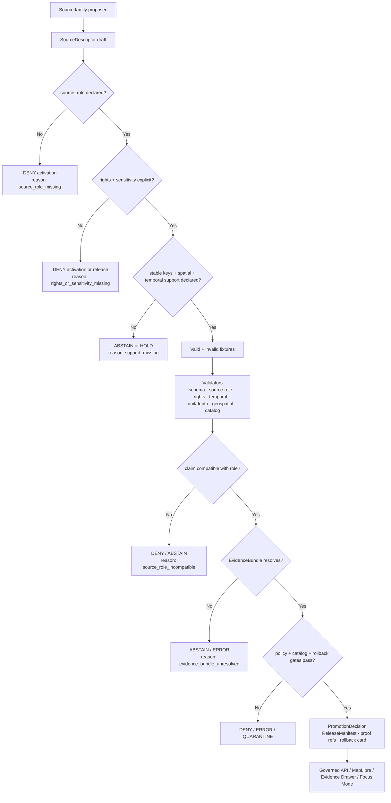

<!-- [KFM_META_BLOCK_V2]
doc_id: kfm://doc/NEEDS-VERIFICATION-ADR-agriculture-source-role-boundary
title: ADR — Agriculture Source Role Boundary
type: standard
version: v1
status: draft
owners: OWNER_TBD_NEEDS_VERIFICATION
created: 2026-05-08
updated: 2026-05-08
policy_label: NEEDS_VERIFICATION
related: [./README.md, ./ADR-TEMPLATE.md, ./ADR-0001-schema-home.md, ./ADR-0002-responsibility-root-monorepo.md, ./ADR-0208-domain-lane-template.md, ../domains/agriculture/README.md, ../domains/agriculture/governance/SOURCE_REGISTRY.md, ../domains/agriculture/governance/SOURCE_COVERAGE_MATRIX.md, ../domains/agriculture/governance/VALIDATION_PLAN.md, ../domains/agriculture/architecture/DATA_CONTRACTS.md, ../domains/agriculture/architecture/EVIDENCE_AND_PROVENANCE.md]
tags: [kfm, adr, agriculture, source-role, evidence, validation, policy, release, rollback]
notes: [Replaces a placeholder ADR with review-ready decision language. doc_id, owners, policy_label, CODEOWNERS routing, exact machine registry paths, schema-home acceptance, validator paths, CI enforcement, release artifacts, and runtime behavior remain NEEDS VERIFICATION.]
[/KFM_META_BLOCK_V2] -->

<a id="top"></a>

# ADR — Agriculture Source Role Boundary

Agriculture source roles are claim boundaries: they define what a source may support, what it must not support, and which gates must close before public release.

<p align="center">
  
  
  
  
  
  
</p>

<p align="center">
  <a href="#status">Status</a> ·
  <a href="#decision-summary">Decision</a> ·
  <a href="#repo-fit">Repo fit</a> ·
  <a href="#evidence-boundary">Evidence</a> ·
  <a href="#source-role-boundary">Roles</a> ·
  <a href="#claim-compatibility-rules">Claims</a> ·
  <a href="#validation-plan">Validation</a> ·
  <a href="#rollback-and-supersession">Rollback</a> ·
  <a href="#open-verification-backlog">Open backlog</a>
</p>

> [!IMPORTANT]
> **Decision posture:** `PROPOSED` until owner review, schema-home acceptance, machine source descriptors, validators, policy tests, CI evidence, and release/rollback fixtures are verified.
>
> **Operating rule:** a source role is not a label for display. It constrains what KFM may claim, publish, map, explain, export, or synthesize.
>
> **Boundary rule:** no Agriculture public claim, layer, Evidence Drawer payload, export, or Focus Mode answer may widen support beyond the source role, source evidence, policy state, review state, release state, and rollback path.

> [!WARNING]
> This ADR does **not** activate live sources, publish Agriculture layers, approve private farm data, prove machine-schema enforcement, or certify runtime/API/UI behavior.

---

## Status

| Field | Value |
|---|---|
| ADR ID | `ADR-agriculture-source-role-boundary` |
| Target path | `docs/adr/ADR-agriculture-source-role-boundary.md` |
| ADR state | `proposed` |
| Document state | `draft` |
| Decision date | `2026-05-08` |
| Scope | Agriculture domain governance, source admission, claim compatibility, validation, policy, publication, and rollback |
| Affected lane | `docs/domains/agriculture/` |
| Related template | [`ADR-TEMPLATE.md`](./ADR-TEMPLATE.md) |
| Related schema decision | [`ADR-0001-schema-home.md`](./ADR-0001-schema-home.md) |
| Related root decision | [`ADR-0002-responsibility-root-monorepo.md`](./ADR-0002-responsibility-root-monorepo.md) |
| Related lane standard | [`ADR-0208-domain-lane-template.md`](./ADR-0208-domain-lane-template.md) |
| Supersedes | Placeholder content previously in this file |
| Superseded by | None |
| Enforcement maturity | `NEEDS VERIFICATION` |
| Rollback target | Revert to prior placeholder only as emergency rollback; preferred rollback is a successor ADR with preserved lineage |

### Truth labels used here

| Label | Meaning in this ADR |
|---|---|
| `CONFIRMED` | Verified from accessible repository files, attached KFM doctrine, or current-session workspace inspection. |
| `PROPOSED` | Decision or implementation rule recommended here but not yet proven as accepted or enforced. |
| `UNKNOWN` | Not verified strongly enough in this session. |
| `NEEDS VERIFICATION` | A concrete check must retire the uncertainty before enforcement or publication claims. |
| `CONFLICTED` | Evidence or conventions point to multiple possible authorities. |
| `DENY`, `ABSTAIN`, `ERROR`, `QUARANTINE` | Finite system outcomes for validation, policy, runtime, or promotion behavior. |

[Back to top](#top)

---

## Decision summary

Agriculture sources must be admitted and used according to explicit `source_role` boundaries. The accepted role vocabulary for Agriculture planning is:

- `authority`
- `observation`
- `aggregate`
- `remote_sensing`
- `derived`
- `mirror`
- `documentary`

Private, proprietary, field/operator, yield, pesticide, or similarly sensitive records are not accepted as ordinary public Agriculture sources. They remain `BLOCKED` or restricted future material until a separate restricted-data policy, consent, stewardship, retention, revocation, access-control, validation, release, correction, and rollback model is accepted and proven.

### Final decision sentence

> Agriculture source roles constrain Agriculture claims. A source may support only the claim scopes declared by its descriptor, evidence, rights, sensitivity, spatial support, temporal support, validation state, review state, release state, and rollback path.

### Final fail-closed sentence

> Unknown source role, missing rights, missing sensitivity, unsupported precision, missing stable keys, unresolved EvidenceBundle support, stale temporal support, or missing rollback target blocks public release or returns `ABSTAIN`, `DENY`, `ERROR`, or `QUARANTINE`.

[Back to top](#top)

---

## Repo fit

| Relationship | Path | Status | Role |
|---|---|---:|---|
| Current ADR | `docs/adr/ADR-agriculture-source-role-boundary.md` | `CONFIRMED` | Decision record for Agriculture source-role boundary. |
| ADR index | [`./README.md`](./README.md) | `CONFIRMED` | ADR navigation and review discipline. |
| ADR template | [`./ADR-TEMPLATE.md`](./ADR-TEMPLATE.md) | `CONFIRMED` | Evidence-heavy ADR structure. |
| Schema-home ADR | [`./ADR-0001-schema-home.md`](./ADR-0001-schema-home.md) | `CONFIRMED / PROPOSED decision` | Proposed split between semantic contracts and machine schemas. |
| Responsibility-root ADR | [`./ADR-0002-responsibility-root-monorepo.md`](./ADR-0002-responsibility-root-monorepo.md) | `CONFIRMED / accepted decision` | Root folders are responsibility boundaries, not domain buckets. |
| Domain lane template | [`./ADR-0208-domain-lane-template.md`](./ADR-0208-domain-lane-template.md) | `CONFIRMED / proposed decision` | Minimum burden for source-ledgered, evidence-bound domain lanes. |
| Agriculture landing page | [`../domains/agriculture/README.md`](../domains/agriculture/README.md) | `CONFIRMED` | Lane scope, guardrails, lifecycle, and definition of done. |
| Agriculture source registry guidance | [`../domains/agriculture/governance/SOURCE_REGISTRY.md`](../domains/agriculture/governance/SOURCE_REGISTRY.md) | `CONFIRMED` | SourceDescriptor field requirements and admission flow. |
| Agriculture coverage matrix | [`../domains/agriculture/governance/SOURCE_COVERAGE_MATRIX.md`](../domains/agriculture/governance/SOURCE_COVERAGE_MATRIX.md) | `CONFIRMED` | Source-family readiness and blockers. |
| Agriculture validation plan | [`../domains/agriculture/governance/VALIDATION_PLAN.md`](../domains/agriculture/governance/VALIDATION_PLAN.md) | `CONFIRMED` | Fixture-first, fail-closed validation burden. |
| Agriculture data contracts | [`../domains/agriculture/architecture/DATA_CONTRACTS.md`](../domains/agriculture/architecture/DATA_CONTRACTS.md) | `CONFIRMED` | Contract families, schema-home warning, and publication contracts. |
| Agriculture evidence/provenance | [`../domains/agriculture/architecture/EVIDENCE_AND_PROVENANCE.md`](../domains/agriculture/architecture/EVIDENCE_AND_PROVENANCE.md) | `CONFIRMED` | EvidenceBundle, provenance, catalog closure, release, correction, rollback. |

### Directory Rules basis

This ADR belongs in `docs/adr/` because it records a human-facing architecture decision. Agriculture implementation must remain under responsibility roots such as `docs/`, `data/`, `schemas/`, `contracts/`, `policy/`, `tests/`, `fixtures/`, `tools/`, `pipelines/`, and `release/`, not in a root-level `agriculture/` folder.

### Accepted inputs

This ADR accepts:

- source-role vocabulary and boundaries;
- claim compatibility rules;
- source admission and activation constraints;
- validation and negative fixture expectations;
- publication and public-trust payload constraints;
- rollback and supersession rules for source-role violations.

### Exclusions

This ADR must not contain:

| Excluded item | Where it belongs |
|---|---|
| Machine-readable source descriptors | `data/registry/agriculture/` or repo-confirmed source registry home — `NEEDS VERIFICATION` |
| Machine schemas | `schemas/contracts/v1/...` or ADR-confirmed schema home — `NEEDS VERIFICATION` |
| Semantic object contracts | `contracts/...` or repo-confirmed contract home |
| Policy-as-code | `policy/...` or repo-confirmed policy home |
| Fixtures and tests | `fixtures/`, `tests/`, or repo-confirmed fixture/test home |
| Validator implementation | `tools/`, `scripts/`, `packages/`, or repo-confirmed implementation home |
| RAW / WORK / QUARANTINE / PROCESSED / PUBLISHED artifacts | `data/` lifecycle roots |
| Release manifests, proof packs, rollback cards | `release/`, `data/proofs/`, or repo-confirmed release/proof homes |
| Runtime routes, UI components, MapLibre adapters, Focus Mode code | `apps/`, `packages/`, `ui/`, `web/`, or repo-confirmed runtime homes |

[Back to top](#top)

---

## Evidence boundary

| Evidence item | Status | Supports | Does not prove |
|---|---:|---|---|
| Existing target ADR file | `CONFIRMED` | A placeholder ADR existed at the target path and named the decision area. | That the decision had already been settled or enforced. |
| ADR index and template | `CONFIRMED` | KFM ADRs should include evidence, truth labels, validation, rollback, supersession, and explicit enforcement boundaries. | That every ADR currently follows the template. |
| `ADR-0001-schema-home.md` | `CONFIRMED / PROPOSED` | Machine schemas are proposed under `schemas/contracts/v1/`; `contracts/` carries meaning; `policy/` carries admissibility decisions. | Accepted schema-home enforcement, workflow success, or full consumer inventory. |
| `ADR-0002-responsibility-root-monorepo.md` | `CONFIRMED / accepted decision` | Root folders are responsibility boundaries; domain names should not become root folders. | Full root conformance or compatibility-root migration. |
| Agriculture README | `CONFIRMED` | Agriculture lane is experimental/draft, source-role-preserving, fixture-first, fail-closed, and not proof of live implementation. | Live source activation or runtime/API/UI behavior. |
| Agriculture Source Registry | `CONFIRMED` | Source descriptors must include role, rights, sensitivity, stable keys, spatial/temporal support, activation state, fixtures, validation, catalog, evidence, release, and rollback expectations. | Machine descriptor files or live activation. |
| Agriculture Source Coverage Matrix | `CONFIRMED` | Source-family status is documentation-level; no source is documented as live or active. | Runtime source connectors, CI fixtures, release state. |
| Agriculture Validation Plan | `CONFIRMED` | Validation is fixture-first and fail-closed; aggregate misuse, station-as-surface misuse, grid-as-ground-truth misuse, no-raw-public-path, catalog closure, and rollback checks are required. | Actual validator paths or passing CI. |
| Agriculture Data Contracts | `CONFIRMED` | Object families and source roles must preserve meaning, schema-home uncertainty, and public publication constraints. | Existing machine schemas or accepted schema subpath. |
| Agriculture Evidence and Provenance | `CONFIRMED` | Public claims must resolve through EvidenceBundle, catalog/provenance, release, correction, and rollback. | Existing runtime enforcement. |
| Local workspace inspection | `CONFIRMED` | No mounted local Git checkout was available in `/mnt/data`; repo inspection was performed through the GitHub connector. | Repository absence. GitHub connector evidence confirms repository access. |

> [!CAUTION]
> Repository documentation is strong evidence for doctrine, file presence, and intended governance. It is not proof of runtime enforcement, branch protections, source activation, CI success, release objects, dashboards, or deployed behavior unless those artifacts are inspected directly.

[Back to top](#top)

---

## Context

Agriculture combines source families with very different kinds of support:

- official soil survey context;
- station observations;
- reference station networks;
- satellite and gridded products;
- remote-sensing vegetation products;
- aggregate crop statistics;
- crop progress summaries;
- derived indicators;
- public map layers;
- bounded AI explanations.

Without a source-role boundary, these sources can be flattened into a single “agriculture layer.” That would weaken KFM’s trust posture by allowing aggregate data to imply field truth, station observations to imply surfaces, gridded products to imply direct ground truth, and derived indicators to imply canonical evidence.

KFM’s doctrine makes that unsafe. The public unit of value is the inspectable claim, and the claim must preserve source authority, evidence, policy, review, release, correction, and rollback state.

[Back to top](#top)

---

## Source-role boundary

### Role taxonomy

| `source_role` | Meaning | Agriculture examples | May support | Must not support |
|---|---|---|---|---|
| `authority` | Source with authoritative support inside a declared scope, version, geography, and time frame. | SSURGO/SDA soil survey attributes when source lineage supports the claim. | Claims inside explicit authority boundary. | Real-time crop condition, field/operator truth, unsupported periods, unsupported geographies. |
| `observation` | Direct measured station, sensor, or observation record. | Kansas Mesonet, NRCS SCAN, NOAA USCRN station/depth/time readings. | Station/depth/time/variable statements with QC and timestamp support. | Field-level, parcel-level, statewide, or surface claims without declared transform and evidence. |
| `aggregate` | Aggregate statistic by geography, commodity, class, or period. | USDA NASS QuickStats, Crop Progress. | County/state/week/year or other aggregate-scope statements. | Field, parcel, point, operator, or exact-location truth. |
| `remote_sensing` | Satellite, aerial, gridded, raster, or imagery-derived source product. | SMAP, HLS/HLS-VI, CDL. | Product-specific grid/pixel/asset/time-window context with masks, product/version, and QA metadata. | Direct ground truth, station observation, operator truth, field condition without declared validation. |
| `derived` | Rebuildable output produced from sources, transforms, masks, thresholds, or algorithms. | Stress indicator, suitability layer, anomaly layer, PMTiles, search index, dashboard summary. | Declared indicator or delivery context with input refs, method/version, receipt, uncertainty, and release state. | Original source authority or canonical truth. |
| `mirror` | Convenience copy of a governed upstream source. | Cache or synchronized copy of an upstream product. | Access acceleration when upstream identity, rights, digests, and lineage are preserved. | New authority or changed semantics unless separately declared and validated. |
| `documentary` | Text, report, narrative, citation, archive, or document support. | Source report, agency publication, citation-backed explanatory context. | Scoped documentary statements with citation and interpretation status. | Measured observation, spatial precision, or temporal certainty the document does not carry. |

### Non-role states

These values may appear in coverage matrices, policy decisions, source state, or activation state, but they are not ordinary source roles in this ADR:

| Value | Use | Rule |
|---|---|---|
| `restricted_future_class` | Coverage or planning state for private/proprietary/sensitive records. | Do not admit as public Agriculture source role without successor ADR and restricted-data controls. |
| `private_restricted` | Possible future policy or access class. | Must fail closed until consent, stewardship, access, retention, revocation, and release policy are proven. |
| `fixture_ready` | Documentation or test-readiness state. | Does not prove live source activation. |
| `planned`, `approved`, `active`, `blocked` | Source activation state. | Separate from `source_role`; `active` requires validation/release evidence. |
| `public`, `review_required`, `restricted` | Sensitivity or policy class. | Separate from `source_role`; controls access and precision. |

[Back to top](#top)

---

## Claim compatibility rules

| Rule | Reason | Expected outcome when violated |
|---|---|---|
| Aggregate is not field-level. | County/state/week/year statistics do not establish parcel, field, or operator truth. | `DENY` or `ABSTAIN` public claim. |
| Station is not surface. | Station/depth/time readings do not become a field or statewide surface without a declared transform. | `DENY` or `QUARANTINE`. |
| Grid is not ground truth. | SMAP, HLS, CDL, gSSURGO/gNATSGO, and similar products are product-specific gridded or remote-sensing context. | `DENY` unsupported wording or require caveat/transform. |
| Derived is not canonical. | Indicators, tiles, summaries, embeddings, dashboards, reports, and scenes are rebuildable outputs. | Block use as evidence root. |
| Soil context does not silently move domains. | Agriculture may consume soil support, but it must not fork Soil-lane authority or weaken MUKEY/source semantics. | Require Soil-lane ref, source descriptor, or abstain. |
| Unknown rights fail closed. | Missing rights, terms, citation, redistribution, or automation posture blocks public exposure. | `DENY` activation or public release. |
| Unknown sensitivity fails closed. | Missing precision/sensitivity state risks improper public disclosure. | `DENY` public release or generalize after review. |
| Evidence must resolve before explanation. | Generated prose, popups, dashboards, and maps cannot replace evidence. | `ABSTAIN`, `DENY`, or `ERROR`. |
| Public paths must not expose internal lifecycle stages. | RAW, WORK, QUARANTINE, unpublished candidates, internal receipts, and canonical-only stores are not normal public surfaces. | Fail public-path safety check. |
| Release must be reversible. | Public claims must be correctable and rollback-ready. | `ERROR` or `DENY` promotion. |

### Claim support matrix

| Claim pattern | Minimum supporting role | Required qualifiers | Default without support |
|---|---|---|---|
| “MUKEY X has soil property Y in source version Z.” | `authority` | MUKEY, source version, table/property basis, component/horizon basis when material, EvidenceBundle. | `ABSTAIN` |
| “Station S observed value V at depth D and time T.” | `observation` | station ID, variable, unit, depth, QC, observed time, retrieved time, source descriptor. | `ABSTAIN` or `ERROR` |
| “County C reported crop statistic X for period P.” | `aggregate` | geography version, commodity, statistic, unit, period, source release, citation. | `ABSTAIN` |
| “Grid/product G indicates context for time window W.” | `remote_sensing` | product/version, grid/cell/asset, mask/QA, CRS, time window, caveat. | `ABSTAIN` |
| “Indicator I suggests stress/anomaly/suitability.” | `derived` | input EvidenceRefs, method/version, parameters, uncertainty, receipt, release state. | `DENY` or `ABSTAIN` |
| “Field F has crop condition Y.” | Usually not supported in public lane | direct field-level evidence, rights, sensitivity, review, release, rollback. | `DENY` |
| “Private operator record says X.” | Restricted future path only | consent/authorization, restricted policy, access role, retention/revocation, steward review. | `DENY` |

[Back to top](#top)

---

## Decision flow



[Back to top](#top)

---

## Requirements and constraints

### KFM invariants checked

| Invariant | Agriculture impact | Status |
|---|---|---:|
| `RAW -> WORK / QUARANTINE -> PROCESSED -> CATALOG / TRIPLET -> PUBLISHED` | Source-role validation occurs before publication and sends unsupported candidates to `QUARANTINE`, `ABSTAIN`, `DENY`, or `ERROR`. | `CONFIRMED doctrine / PROPOSED enforcement` |
| Public clients use governed interfaces | Public map/API/Drawer/Focus surfaces must consume released artifacts and governed APIs only. | `CONFIRMED doctrine / NEEDS VERIFICATION enforcement` |
| `EvidenceRef -> EvidenceBundle` closure | Public Agriculture claims must resolve support before explanation. | `CONFIRMED guidance / NEEDS VERIFICATION enforcement` |
| Policy-aware fail-closed behavior | Missing rights, sensitivity, role, support, review, release, or rollback blocks public exposure. | `CONFIRMED guidance / PROPOSED enforcement` |
| Derived products stay derived | PMTiles, search views, summaries, embeddings, dashboards, layer manifests, and scenes are carriers, not truth roots. | `CONFIRMED guidance` |
| AI is interpretive | Focus Mode may summarize released evidence, not validate sources or expand source roles. | `CONFIRMED doctrine / NEEDS VERIFICATION runtime` |
| Promotion is state transition | Publication requires evidence, rights, sensitivity, validation, catalog closure, proof, policy, review, release, and rollback. | `CONFIRMED doctrine / NEEDS VERIFICATION enforcement` |

### Non-goals

This ADR does not decide:

- exact Agriculture machine schema subpath;
- whether `contracts/` or `schemas/` has accepted machine-schema authority beyond `ADR-0001`;
- live connector activation for SSURGO/SDA, Mesonet, SCAN, USCRN, SMAP, HLS/HLS-VI, NASS, CDL, or private sources;
- source endpoint terms, licenses, quotas, authentication, or automation permission;
- API route names, UI components, MapLibre layer IDs, or Focus Mode implementation details;
- private farm/operator data policy.

[Back to top](#top)

---

## Options considered

| Option | Description | Benefits | Risks | Outcome |
|---|---|---|---|---|
| Role-constrained Agriculture claims | Require every source to declare a role and restrict claims to role-compatible support. | Preserves evidence, policy, review, release, and rollback boundaries. | Requires fixtures, validators, and review discipline. | **Chosen** |
| Single generic Agriculture source class | Treat all Agriculture sources as one broad lane. | Easy to document and implement quickly. | Collapses aggregate, station, grid, derived, and authority sources into false precision. | Rejected |
| Source-family-specific roles only | Use one role per source family such as `nass`, `mesonet`, `smap`. | Directly maps to known sources. | Makes policy and validation brittle; repeats semantics across sources. | Rejected |
| Allow private/proprietary farm data as ordinary source role | Admit restricted/private records into the same role taxonomy. | Future capability expansion. | High sensitivity, rights, consent, living/business privacy, and public-release risks. | Rejected / deferred |
| Let UI labels carry role distinction | Put role caveats in MapLibre popups or Evidence Drawer only. | Simple public display. | Too late in the chain; unsupported data may already be processed or released. | Rejected |
| Let Focus Mode infer role | Use AI to classify or explain role at answer time. | Flexible. | AI becomes source authority; violates evidence-subordinate rule. | Rejected |

[Back to top](#top)

---

## Validation plan

Validation is required before source activation, publication, or public trust-surface exposure. Exact validator paths and CI commands remain `NEEDS VERIFICATION`.

### Required checks

| Check | Must prove | Failure outcome |
|---|---|---|
| SourceDescriptor shape | `source_id`, `source_role`, rights, sensitivity, stable keys, spatial support, temporal support, activation state, claim scopes, and release requirements are present. | `DENY` activation |
| Role enum check | `source_role` is one of the accepted roles or explicitly blocked/deferred. | `DENY` activation |
| Claim compatibility | Requested claim scope is allowed by the role and source support. | `DENY` or `ABSTAIN` |
| Rights and sensitivity | Public use is allowed and precision is policy-safe. | `DENY` release |
| Temporal support | Observed/source/retrieved/release time and staleness state are explicit. | `ABSTAIN`, stale label, or `QUARANTINE` |
| Unit/depth support | Station readings preserve units, normalized units, depth, QC, and source basis where relevant. | `ERROR` or `QUARANTINE` |
| Geospatial support | CRS, geometry validity, support class, precision, and transform provenance are explicit. | `DENY` public layer |
| Remote-sensing lineage | Product/version, asset, mask, QA, CRS, grid, and time-window metadata exist. | `ABSTAIN` or `QUARANTINE` |
| Derived indicator reproducibility | Inputs, method/version, parameters, uncertainty, receipt, and limitations are present. | `DENY` promotion |
| EvidenceBundle closure | Public claim, layer, export, Drawer payload, or Focus answer resolves evidence. | `ABSTAIN` or `ERROR` |
| Catalog closure | STAC/DCAT/PROV/CatalogMatrix/release digest agreement or repo-confirmed equivalent exists. | `DENY` promotion |
| Public path safety | Public payloads do not reference RAW, WORK, QUARANTINE, internal receipts, unpublished candidates, or direct model output. | `DENY` public surface |
| Rollback readiness | Release candidate includes rollback target or explicit no-prior-release basis. | `ERROR` or `DENY` release |

### Minimum negative fixtures

| Fixture | Expected outcome |
|---|---|
| Missing `source_role` | `DENY` activation |
| Unknown role value | `DENY` activation |
| Missing rights | `DENY` activation or release |
| Missing sensitivity | `DENY` activation or release |
| NASS aggregate used as field-level truth | `DENY` public claim |
| Station reading used as a surface without transform | `DENY` or `QUARANTINE` |
| SMAP/HLS/CDL/grid product described as ground truth | `DENY` public claim |
| Derived indicator missing input EvidenceRefs or processing receipt | `DENY` promotion |
| Public layer manifest references `data/raw/`, `data/work/`, or `data/quarantine/` | Fail public-path safety check |
| Evidence Drawer payload lacks EvidenceBundle ref | `ABSTAIN` or `ERROR` |
| Focus Mode answer cites no released evidence | `ABSTAIN` or `DENY` |
| Release candidate lacks rollback card | `ERROR` or `DENY` promotion |

### Illustrative command sheet

> [!WARNING]
> These commands are placeholders. Replace them with repo-native commands after validator paths, policy tooling, package manager, and CI workflows are confirmed.

```bash
# Read-only inventory before enforcement claims.
git status --short
git branch --show-current || true

find docs/domains/agriculture -maxdepth 4 -type f | sort

find docs contracts schemas policy tests fixtures tools scripts data release apps packages .github \
  -maxdepth 6 -type f 2>/dev/null \
  | grep -Ei 'agriculture|source_role|SourceDescriptor|EvidenceBundle|DecisionEnvelope|PromotionDecision|ReleaseManifest|CatalogMatrix|RollbackCard' \
  | sort
```

```bash
# NEEDS VERIFICATION — examples only.
python -m pytest tests/agriculture -q

python tools/validators/agriculture/validate_source_roles.py \
  tests/fixtures/agriculture/source_roles/

python tools/validators/agriculture/validate_source_registry.py \
  data/registry/agriculture/sources.yaml

python tools/validators/agriculture/validate_public_payloads.py \
  tests/fixtures/agriculture/public_payloads/

python tools/validators/agriculture/validate_catalog_closure.py \
  tests/fixtures/agriculture/catalog_matrix_pass.json
```

[Back to top](#top)

---

## Policy, rights, and sensitivity

| Question | Decision |
|---|---|
| Does this ADR affect public release eligibility? | Yes. Source-role mismatch blocks publication or narrows claims. |
| Does this ADR affect exact location exposure? | Yes. Spatial support and sensitivity must be explicit; unsupported precision fails closed. |
| Does this ADR affect private/proprietary farm/operator/yield/pesticide records? | Yes. They remain blocked as ordinary public sources. |
| Does this ADR require steward review? | Yes. Owners and stewards remain `NEEDS VERIFICATION`. |
| Does this ADR change fail-closed behavior? | It formalizes fail-closed behavior for source-role ambiguity and misuse. |
| Does this ADR change correction or rollback behavior? | It requires correction/rollback when a public claim was released under an incorrect or widened role. |
| Does this ADR affect external source terms? | It requires terms and automation posture to be explicit before live activation. |

### Sensitive and restricted-source posture

Private farm/operator records, proprietary yield data, pesticide records, field-level operational records, or comparable restricted Agriculture inputs are **blocked by default** until all of the following are accepted and proven:

- restricted-data source-role or access-class decision;
- consent or authorization model;
- steward and policy ownership;
- rights and terms review;
- retention and revocation rules;
- sensitivity and public-precision rules;
- valid and invalid fixtures;
- policy-as-code or equivalent enforcement;
- release-deny defaults;
- rollback and correction path.

[Back to top](#top)

---

## Public trust-surface impact

| Surface | Required behavior | Status |
|---|---|---:|
| Governed API | Must return role-compatible claims only; unsupported scope returns finite outcome. | `PROPOSED / NEEDS VERIFICATION` |
| MapLibre layer | Must show source role, knowledge character, freshness, policy/review/release state, and caveats. | `PROPOSED / NEEDS VERIFICATION` |
| Evidence Drawer | Must expose EvidenceBundle support, source role, support class, validation summary, policy label, correction/rollback state. | `CONFIRMED guidance / NEEDS VERIFICATION enforcement` |
| Focus Mode | Must cite released EvidenceBundle support or return `ABSTAIN`, `DENY`, or `ERROR`; must not infer field truth from aggregate/station/grid context. | `CONFIRMED doctrine / NEEDS VERIFICATION runtime` |
| Exports | Must include source roles, release refs, rights/attribution, and correction/withdrawal path. | `PROPOSED / NEEDS VERIFICATION` |
| Search / summaries / dashboards | Must remain derived discovery surfaces. | `CONFIRMED guidance` |
| Graph/triplet projection | Must preserve role and source support; graph edge is not proof by itself. | `PROPOSED / NEEDS VERIFICATION` |

[Back to top](#top)

---

## Consequences

### Positive consequences

- Prevents aggregate, station, grid, and derived products from becoming false field-level truth.
- Makes source admission reviewable before connectors, pipelines, maps, exports, or AI answers depend on it.
- Gives validators and policy gates concrete negative cases.
- Keeps Agriculture aligned with Soil, source registry, EvidenceBundle, release, correction, and rollback doctrine.
- Makes public trust payloads more inspectable because the role boundary is visible at the point of use.

### Costs and tradeoffs

| Cost | Mitigation |
|---|---|
| More upfront descriptor work before live source activation. | Use fixture-first no-network slices. |
| Public language becomes more qualified. | Preserve readable labels in Evidence Drawer and Focus Mode while keeping support classes visible. |
| Some attractive layers may stay blocked. | Treat blocked rows as honest backlog, not failure. |
| Additional validators and negative fixtures are required. | Start with aggregate-as-field, station-as-surface, grid-as-ground-truth, missing-rights, and missing-sensitivity fixtures. |
| Private/proprietary data cannot be casually added. | Use a successor ADR and restricted-data policy when the governance burden is ready. |

[Back to top](#top)

---

## Rollback and supersession

### Rollback plan

If this ADR is merged and later proves incorrect or too broad:

1. Preserve this ADR as lineage.
2. Create a successor ADR with replacement role vocabulary or revised scope.
3. Update Agriculture Source Registry, Source Coverage Matrix, Validation Plan, Data Contracts, Evidence and Provenance, File Index, Changelog, and Supersession Map.
4. Retire or migrate role values through explicit compatibility notes.
5. Re-run negative fixtures for role misuse.
6. Re-evaluate any public layers, API responses, Evidence Drawer payloads, Focus Mode outputs, exports, and release manifests that depended on the superseded role boundary.
7. Publish CorrectionNotice or withdrawal note when a public claim was materially affected.
8. Repoint public layer/current aliases through release/rollback procedure rather than deleting published history.

### Violation response

| Violation | Required action |
|---|---|
| Aggregate used as field truth | Withdraw or correct affected claim; add/repair negative fixture. |
| Station used as surface without transform | Quarantine candidate or downgrade claim; require transform contract and evidence. |
| Grid product called ground truth | Correct public wording and enforce product/version/support labels. |
| Derived artifact treated as canonical | Repoint to source EvidenceBundle or deny claim. |
| Unknown rights or sensitivity passed | Block release, open policy/steward review, correct public exposure if any. |
| Focus Mode widened support | Record finite failure, patch prompt/runtime constraints, add negative test. |
| Release lacks rollback target | Block or withdraw release candidate. |

### Supersession rule

A successor ADR may supersede this decision only if it provides:

- replacement role vocabulary;
- compatibility/migration plan;
- updated source registry and validation fixtures;
- policy and public-trust payload impact;
- rollback/correction treatment for existing releases;
- explicit owner/steward review.

[Back to top](#top)

---

## Open verification backlog

| Item | Status | Why it matters |
|---|---:|---|
| Owner and CODEOWNERS routing for this ADR | `NEEDS VERIFICATION` | Required before moving beyond draft/proposed. |
| Policy label for this ADR and related Agriculture docs | `NEEDS VERIFICATION` | Required before publication/stable status. |
| Accepted state of `ADR-0001-schema-home.md` | `NEEDS VERIFICATION` | Blocks canonical Agriculture machine schema path claims. |
| Exact Agriculture machine source registry path | `NEEDS VERIFICATION` | Source-role rules need machine descriptor enforcement. |
| Exact Agriculture schema subpath | `NEEDS VERIFICATION` | Prevents `contracts/` vs `schemas/` drift. |
| Validator script paths and command names | `UNKNOWN` | This ADR defines expected behavior, not runnable enforcement. |
| Policy-as-code path and policy tooling | `UNKNOWN` | Role/rights/sensitivity denial needs executable checks. |
| CI workflow and merge-blocking behavior | `UNKNOWN` | Required before enforcement claims. |
| Shared schemas for `SourceDescriptor`, `EvidenceBundle`, `DecisionEnvelope`, `PromotionDecision`, `ReleaseManifest`, `CatalogMatrix`, `RollbackCard` | `UNKNOWN / NEEDS VERIFICATION` | Agriculture should reuse shared trust objects before creating forks. |
| Live source terms and automation posture for SSURGO/SDA, gSSURGO/gNATSGO, Kansas Mesonet, SCAN, USCRN, SMAP, HLS/HLS-VI, NASS, CDL | `NEEDS VERIFICATION` | Blocks live activation. |
| First Agriculture release manifest, proof pack, correction notice, and rollback card | `UNKNOWN / PROPOSED` | Required before any public Agriculture release. |
| MapLibre layer registry, Evidence Drawer payload contract, Focus Mode payload contract, governed API route names | `UNKNOWN / NEEDS VERIFICATION` | Required for public trust-surface enforcement. |
| Restricted-data lane for private/proprietary farm records | `BLOCKED / PROPOSED future decision` | Required before private sources can be considered. |

[Back to top](#top)

---

## Review checklist

<details>
<summary>Pre-merge checklist</summary>

- [ ] ADR title, meta block title, H1, filename, and ADR index entry are synchronized.
- [ ] Owner, reviewer, policy label, and CODEOWNERS placeholders are resolved or tracked.
- [ ] Agriculture Source Registry and Source Coverage Matrix link to this ADR or record it as a related decision.
- [ ] Data Contracts and Evidence/Provenance docs reflect this role boundary if their language changes.
- [ ] No source-role value is introduced outside the accepted vocabulary without a successor ADR.
- [ ] `restricted_future_class` or private/proprietary data is not admitted as an ordinary public source role.
- [ ] SourceDescriptor requirements include `source_role`, allowed/denied claim scope, rights, sensitivity, stable keys, spatial support, temporal support, validation, release, and rollback fields.
- [ ] Negative fixtures cover missing role, unknown role, aggregate-as-field, station-as-surface, grid-as-ground-truth, missing rights, missing sensitivity, no EvidenceBundle, and no rollback target.
- [ ] Public API/UI/Focus payloads do not widen support beyond source role.
- [ ] Public payloads do not expose RAW, WORK, QUARANTINE, unpublished candidates, internal receipts, direct canonical stores, or direct model outputs.
- [ ] EvidenceBundle closure is required for consequential claims.
- [ ] Rollback and correction behavior is documented for role-boundary violations.
- [ ] No implementation, CI, release, runtime, dashboard, or live-source maturity is claimed without direct evidence.

</details>

[Back to top](#top)

---

## Appendix A — Maintainer summary

Use these short rules in reviews:

1. Ask: **what role does this source play?**
2. Ask: **what claim scope is allowed and denied?**
3. Ask: **what evidence supports that scope?**
4. Ask: **what rights and sensitivity gates apply?**
5. Ask: **what negative fixture would fail if this boundary is violated?**
6. Ask: **how would we correct or roll back a public claim if the role was wrong?**

If the answer is unclear, do not publish. Mark the source `planned`, `blocked`, `review_required`, `ABSTAIN`, `DENY`, `ERROR`, or `QUARANTINE` until the gap is retired.

## Appendix B — Vocabulary quick reference

| Term | Agriculture meaning |
|---|---|
| Source role | The support class a source contributes to a claim. |
| Knowledge character | Human-readable support type such as station observation, aggregate statistic, remote-sensing context, or derived indicator. |
| Claim scope | The spatial, temporal, semantic, and policy boundary of what may be said. |
| EvidenceBundle | Resolved support package for a public claim, layer, export, Drawer payload, or Focus answer. |
| DecisionEnvelope | Finite outcome object for governed runtime or policy-significant response. |
| PromotionDecision | Gate decision for moving a candidate toward release. |
| ReleaseManifest | Published release identity, artifacts, digests, proof refs, policy state, and rollback target. |
| RollbackCard | Reversal/repointing record for a release. |
| CorrectionNotice | Public or steward-visible correction/supersession record. |
| Derived artifact | Rebuildable carrier such as tile, index, summary, dashboard, scene, export, or AI answer. |
