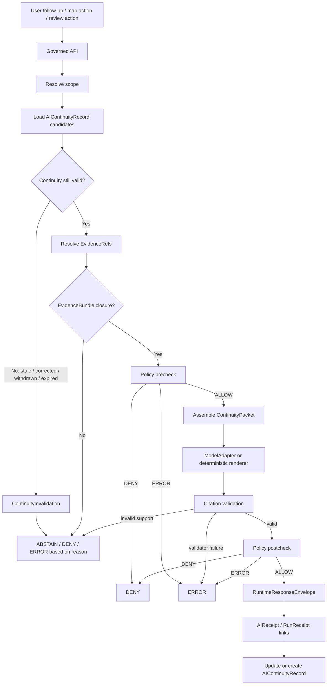

<!-- [KFM_META_BLOCK_V2]
doc_id: kfm://doc/NEEDS-VERIFICATION-ADR-ai-continuity-model
title: ADR: AI Continuity Model
type: standard
version: v1
status: draft
owners: OWNER_TBD_NEEDS_VERIFICATION
created: 2026-05-08
updated: 2026-05-08
policy_label: NEEDS_VERIFICATION
related: [./README.md, ./ADR-TEMPLATE.md, ./ADR-0207-governed-ai-runtime-envelope.md, ./ADR-0019-query-save-recompile-loop.md, ../architecture/governed-api.md, ../doctrine/authority-ladder.md, ../../contracts/runtime/README.md, ../../schemas/contracts/v1/shared/runtime_response_envelope.schema.json, ../../schemas/contracts/v1/runtime/runtime_response_envelope.schema.json, ../../policy/crosswalk/runtime-outcome-map.md]
tags: [kfm, adr, governed-ai, continuity, evidence, runtime-envelope, receipts, focus-mode, trust-membrane]
notes: [Replaces placeholder ADR content at docs/adr/ADR-ai-continuity-model.md with an evidence-bounded draft decision. Existing file path is confirmed in the accessible GitHub repository, but owners, policy label, doc_id, CODEOWNERS coverage, schema enforcement, runtime implementation, CI behavior, retention policy, and emitted continuity objects remain NEEDS VERIFICATION.]
[/KFM_META_BLOCK_V2] -->

<a id="top"></a>

# ADR: AI Continuity Model

Define how KFM carries AI-assisted context across requests, reviews, recompiles, and sessions without turning model memory, generated prose, or hidden reasoning into truth.

<p align="center">
  
  
  
  
  
  
</p>

<p align="center">
  <a href="#decision-summary">Decision</a> ·
  <a href="#context">Context</a> ·
  <a href="#evidence-basis">Evidence</a> ·
  <a href="#continuity-model">Model</a> ·
  <a href="#runtime-flow">Flow</a> ·
  <a href="#guardrails">Guardrails</a> ·
  <a href="#impact-map">Impact</a> ·
  <a href="#validation-plan">Validation</a> ·
  <a href="#rollback-and-supersession">Rollback</a> ·
  <a href="#open-verification">Open verification</a>
</p>

> [!IMPORTANT]
> **ADR status:** `proposed`  
> **Target path:** `docs/adr/ADR-ai-continuity-model.md`  
> **Decision scope:** governed AI continuity, runtime context, receipts, summaries, review memory, and recompilation handoff  
> **Implementation status:** `NEEDS VERIFICATION`  
> **Boundary rule:** AI continuity is reconstructed from governed evidence, policy, release state, receipts, and public-safe summaries. It is not provider chat memory, private chain-of-thought, raw transcript storage, or generated text promoted into evidence.

---

## Decision summary

| Field | Determination |
|---|---|
| Decision | Adopt a governed AI continuity model based on auditable references, public-safe summaries, finite runtime outcomes, receipts, and evidence-resolution state. |
| Status | `proposed` |
| Existing file state | `CONFIRMED` placeholder ADR exists at this path; this revision replaces placeholder text with decision-grade content. |
| Continuity unit | `PROPOSED`: `AIContinuityRecord` plus ephemeral `ContinuityPacket` assembled per request. |
| Runtime envelope dependency | `CONFIRMED / PARTIAL`: repo has a finite `RuntimeResponseEnvelope` schema using `ANSWER`, `ABSTAIN`, `DENY`, `ERROR`; richer enforcement remains `NEEDS VERIFICATION`. |
| Loop dependency | `PROPOSED`: query-save-recompile records may feed continuity only after validation and review. |
| Public posture | `DENY` direct use of model memory, raw provider transcripts, hidden reasoning, RAW/WORK/QUARANTINE context, or generated prose as evidence. |
| Acceptance signal | Schemas, fixtures, validators, policy checks, no-direct-model-client checks, retention policy, receipt linkage, and rollback tests exist and pass in the active checkout. |

### One-line decision rule

> AI continuity in KFM is **derived, bounded, replayable, policy-checked process context**; it is never sovereign truth.

### One-line boundary rule

> Every AI-assisted continuation must be able to rebuild its admissible context from `EvidenceRef -> EvidenceBundle`, runtime envelopes, policy decisions, release/review/correction state, and receipts — or it must return `ABSTAIN`, `DENY`, or `ERROR`.

[Back to top](#top)

---

## Context

KFM needs continuity across AI-assisted interactions because users may ask follow-up questions, reviewers may refine candidate deltas, Focus Mode may explain prior map selections, and pipeline loops may recompile derived artifacts after validation.

The risk is that “continuity” can silently become a shadow truth source. Common failure modes include:

- model-provider conversation memory treated as authoritative;
- raw chat transcripts becoming unreviewed evidence;
- hidden reasoning being persisted as an audit object;
- stale generated summaries surviving corrections or release withdrawals;
- vector or search recall bypassing `EvidenceBundle` resolution;
- public UI surfaces carrying old AI context after policy, rights, review, sensitivity, or release state changed.

This ADR keeps the useful part of continuity — scoped recall, auditability, review handoff, and reproducible context — while rejecting unsafe memory.

### Why this is architecture-significant

AI continuity touches KFM’s trust membrane:

| Surface | Risk if continuity is unmanaged |
|---|---|
| Governed API | Follow-up answers may bypass scope resolution, policy, or evidence closure. |
| Evidence Drawer | Prior generated language may appear as support rather than explanation. |
| Focus Mode | The model may carry stale or unsupported context into a new answer. |
| Query-save-recompile loop | Candidate deltas may be based on generated memory rather than validated sources. |
| Receipts and audit | Reviewers may be unable to reconstruct what evidence and policy state shaped an answer. |
| Release and correction | Corrected, withdrawn, embargoed, or redacted material may leak through old summaries. |

[Back to top](#top)

---

## Evidence basis

| Evidence item | Source / path / artifact | What it supports | Truth label |
|---|---|---|---|
| Target placeholder ADR | `docs/adr/ADR-ai-continuity-model.md` | Current file exists as a placeholder with `proposed` status and a requirement to replace it with accepted decision language and evidence links. | `CONFIRMED repo evidence` |
| ADR directory convention | `docs/adr/README.md` | ADRs are human-facing governance records and must separate decision state from enforcement state. | `CONFIRMED repo evidence` |
| ADR authoring standard | `docs/adr/ADR-TEMPLATE.md` | KFM ADRs should include evidence basis, impact map, policy impact, validation, rollback, and supersession. | `CONFIRMED repo evidence` |
| Governed AI runtime envelope ADR | `docs/adr/ADR-0207-governed-ai-runtime-envelope.md` | AI-assisted runtime surfaces should use finite `ANSWER`, `ABSTAIN`, `DENY`, `ERROR` envelopes and remain evidence-subordinate. | `CONFIRMED repo evidence / PROPOSED implementation` |
| Query-save-recompile loop ADR | `docs/adr/ADR-0019-query-save-recompile-loop.md` | Loop outputs are governed candidates and cannot self-publish, save private chain-of-thought, or treat generated text as evidence. | `CONFIRMED repo evidence / PROPOSED implementation` |
| Runtime contracts | `contracts/runtime/README.md` | Runtime contracts sit at the trust membrane and define finite evidence-bound outward responses, receipts, and governed AI/API obligations. | `CONFIRMED repo evidence / NEEDS VERIFICATION enforcement` |
| Runtime outcome map | `policy/crosswalk/runtime-outcome-map.md` | Runtime outcomes are policy-facing, finite, fail-closed, and evidence-bounded. | `CONFIRMED repo evidence / NEEDS VERIFICATION enforcement` |
| Runtime response schemas | `schemas/contracts/v1/shared/runtime_response_envelope.schema.json` and `schemas/contracts/v1/runtime/runtime_response_envelope.schema.json` | A finite outcome schema exists; a second schema with the same filename but different semantics creates drift to resolve. | `CONFIRMED repo evidence / CONFLICT WATCH` |
| Governed API architecture | `docs/architecture/governed-api.md` | Public clients, Evidence Drawer, Focus Mode, and exports must receive evidence-resolving, policy-checked envelopes rather than raw data or direct model output. | `CONFIRMED repo evidence / NEEDS VERIFICATION runtime` |
| Authority ladder | `docs/doctrine/authority-ladder.md` | Evidence, policy, review, and release state outrank generated language; direct repo evidence controls current repo facts. | `CONFIRMED repo evidence` |

> [!CAUTION]
> This ADR records an architecture decision. It does **not** prove that `AIContinuityRecord`, `ContinuityPacket`, retention policy, continuity validators, runtime persistence, or CI enforcement already exist.

[Back to top](#top)

---

## Decision

KFM will implement AI continuity as a **governed continuity layer** that stores auditable, public-safe, reviewable state and reconstructs model context from authorized sources on each request.

### Chosen model

Use two related concepts:

| Concept | Persistence | Role | Status |
|---|---:|---|---:|
| `AIContinuityRecord` | persisted | Audit-safe record that links a user/session/task/review continuation to runtime envelopes, evidence refs, policy decisions, receipts, and correction/release state. | `PROPOSED` |
| `ContinuityPacket` | ephemeral | Server-assembled context bundle sent to a model adapter or deterministic renderer after evidence and policy checks pass. | `PROPOSED` |

### Operating rule

A `ContinuityPacket` may be assembled only from:

- released or review-authorized `EvidenceBundle` excerpts;
- `EvidenceRef` resolution results;
- prior `RuntimeResponseEnvelope` references and public-safe summaries;
- `AIReceipt` and `RunReceipt` references;
- policy decisions, reason codes, and obligations;
- release, review, freshness, correction, supersession, and rollback state;
- validated `QueryRunRecord`, `EvidenceResolutionRecord`, `CandidateDelta`, `LoopDecision`, and `RecompileManifest` records where the query-save-recompile loop is in scope.

### Boundary rule

A `ContinuityPacket` must not include:

- private chain-of-thought;
- raw provider conversation memory as authority;
- raw transcripts without retention and policy approval;
- secrets, tokens, local service handles, or internal filesystem paths;
- `RAW`, `WORK`, `QUARANTINE`, or unpublished candidate data as normal runtime context;
- direct vector-store, graph-store, tile, map, or search results treated as truth;
- generated language used as evidence;
- stale summaries after correction, withdrawal, embargo, release change, rights change, or sensitivity-state change.

[Back to top](#top)

---

## Continuity model

### Continuity record families

| Object | Purpose | Minimum fields / checks | Status |
|---|---|---|---:|
| `AIContinuityRecord` | Persist safe continuity state across follow-up requests or review handoffs. | `id`, `scope`, `actor_class`, `surface`, `prior_envelope_refs`, `evidence_bundle_refs`, `policy_decision_refs`, `receipt_refs`, `release_refs`, `correction_refs`, `created_at`, `expires_at`, `retention_class`. | `PROPOSED` |
| `ContinuityPacket` | Assemble admissible context for a single runtime or review action. | `packet_id`, `source_record_refs`, `allowed_context`, `denied_context`, `policy_state`, `citation_targets`, `model_adapter_constraints`, `expires_at`. | `PROPOSED` |
| `ContinuitySummary` | Store public-safe synopsis of prior visible outcomes, never hidden reasoning. | Bounded text, supporting envelope refs, evidence refs, generated-by marker, validation status, correction invalidation refs. | `PROPOSED` |
| `ContinuityInvalidation` | Record why prior continuity can no longer be reused. | Reason code, affected record refs, correction/release/policy/source event, invalidated_at, reviewer/tool ref. | `PROPOSED` |
| `ContinuityReceiptLink` | Join AI receipts, run receipts, policy decisions, and runtime envelopes. | Receipt IDs, envelope refs, model adapter family, prompt template hash, output hash, policy decision refs. | `PROPOSED` |

### Continuity classes

| Class | Description | Reuse rule |
|---|---|---|
| `request_local` | Lives only for the current request. | No persistence except audit-safe receipt refs. |
| `session_scoped` | Supports follow-up questions within a bounded session. | Expires quickly; must recheck policy and evidence before reuse. |
| `task_scoped` | Supports a named review, export, story, source-intake, or recompile task. | Requires task ID, reviewer or workflow scope, and rollback/invalidation path. |
| `release_scoped` | Supports released public-safe explanation. | Must be tied to release, correction, and rollback state. |
| `steward_scoped` | Supports restricted review workflows. | Requires access policy and must not leak into public runtime packets. |

> [!NOTE]
> Exact retention windows, storage homes, schema names, and access roles are `NEEDS VERIFICATION`. This ADR defines the model and safety rule, not final storage implementation.

[Back to top](#top)

---

## Runtime flow



### Flow rules

| Step | Must happen | Failure outcome |
|---|---|---|
| Scope resolution | Determine surface, role, map/time/source scope, release scope, and user intent. | `ABSTAIN` or `ERROR` |
| Continuity lookup | Load only records the caller may access. | `DENY` if role or policy blocks |
| Validity check | Check expiration, correction, withdrawal, policy, release, source-rights, and sensitivity changes. | `ABSTAIN`, `DENY`, or `ERROR` |
| Evidence closure | Resolve `EvidenceRef -> EvidenceBundle` before consequential output. | `ABSTAIN` |
| Packet assembly | Include only admissible context. | `DENY` or `ERROR` if unsafe |
| Adapter call | Use provider-neutral adapter only after precheck. | `ERROR` if adapter fails |
| Citation validation | Validate support before `ANSWER`. | `ABSTAIN` or `ERROR` |
| Postcheck | Recheck policy and restricted content after generation. | `DENY` or `ERROR` |
| Continuity update | Persist only audit-safe refs and public-safe summaries. | Block persistence if unsafe |

[Back to top](#top)

---

## Guardrails

### Non-negotiable continuity rules

1. **No generated truth.** Generated summaries may explain evidence; they are not evidence.
2. **No private chain-of-thought persistence.** KFM records inputs, outputs, refs, decisions, hashes, and receipts, not hidden reasoning.
3. **No raw provider memory as authority.** Provider-side conversation state is not KFM continuity unless reconstructed into governed records.
4. **No direct public model path.** Public clients do not call model runtimes, vector stores, graph internals, or raw stores directly.
5. **Recheck on reuse.** Every reuse of continuity rechecks evidence, policy, release, freshness, correction, and access state.
6. **Corrections invalidate continuity.** Corrected, withdrawn, superseded, embargoed, or rights-changed evidence must invalidate dependent summaries.
7. **Receipts are process memory.** `AIReceipt` and `RunReceipt` support audit, but they do not replace `EvidenceBundle`, policy, review, release, proof, or rollback objects.
8. **Summaries are bounded.** A `ContinuitySummary` must link to envelope/evidence refs and carry limitations.
9. **Negative outcomes are first-class.** Missing continuity, blocked continuity, stale continuity, and invalid continuity return `ABSTAIN`, `DENY`, or `ERROR`.
10. **Review workflows stay separate.** Steward-scoped continuity cannot flow into public Focus Mode or map popups without release-safe transformation.

### Provider memory policy

| Provider feature | Default KFM treatment |
|---|---|
| Provider chat history | `DENY` as authoritative continuity. |
| Provider session ID | Allowed only as an operational receipt field if policy allows and no protected data is exposed. |
| External model memory | `DENY` unless a future ADR defines a privacy, retention, replay, deletion, and audit model. |
| Prompt template hash | Allowed and recommended in receipts. |
| Model output hash | Allowed and recommended in receipts. |
| Hidden reasoning | Not stored as a KFM truth, evidence, receipt, proof, release, or continuity object. |

[Back to top](#top)

---

## Options considered

| Option | Description | Benefits | Risks / costs | Outcome |
|---|---|---|---|---|
| No AI continuity | Treat every AI request as fully stateless. | Lowest persistence risk. | Poor follow-up behavior; reviewers lose traceability across tasks. | Rejected as final model; acceptable fallback. |
| Provider-native chat memory | Let model provider session state carry continuity. | Simple implementation. | Uninspectable, hard to audit, retention risk, correction leakage, policy bypass. | Rejected. |
| Persist full transcripts | Store raw prompts/responses for replay. | Easier debugging. | Privacy, sensitive data, stale context, generated truth confusion, chain-of-thought risk. | Rejected by default. |
| Governed continuity records | Persist refs, summaries, decisions, receipts, invalidations, and bounded scope. | Auditable, replayable, policy-aware, correctable, provider-neutral. | Requires schemas, validators, policy, retention, and rollback work. | Accepted direction. |
| Loop-only continuity | Limit continuity to query-save-recompile records. | Lower public-runtime risk. | Too narrow for Evidence Drawer, Focus Mode, and review handoffs. | Deferred as possible first slice. |

[Back to top](#top)

---

## Impact map

> [!WARNING]
> Proposed paths below are implementation targets and verification hooks. They are not claims that files already exist.

### Existing related surfaces

| Path | Current role | Status |
|---|---|---:|
| `docs/adr/ADR-ai-continuity-model.md` | Target ADR file; currently placeholder replaced by this draft. | `CONFIRMED path` |
| `docs/adr/ADR-0207-governed-ai-runtime-envelope.md` | Defines finite governed AI runtime envelope. | `CONFIRMED path / PROPOSED implementation` |
| `docs/adr/ADR-0019-query-save-recompile-loop.md` | Defines governed query-save-recompile loop. | `CONFIRMED path / PROPOSED implementation` |
| `contracts/runtime/README.md` | Runtime contract lane. | `CONFIRMED path / NEEDS VERIFICATION enforcement` |
| `policy/crosswalk/runtime-outcome-map.md` | Outcome semantics and policy crosswalk. | `CONFIRMED path / NEEDS VERIFICATION enforcement` |
| `schemas/contracts/v1/shared/runtime_response_envelope.schema.json` | Minimal finite outcome schema. | `CONFIRMED path / PARTIAL` |
| `schemas/contracts/v1/runtime/runtime_response_envelope.schema.json` | Drift-watch duplicate schema path. | `CONFIRMED path / CONFLICT WATCH` |
| `docs/architecture/governed-api.md` | Governed API trust membrane doc. | `CONFIRMED path / NEEDS VERIFICATION runtime` |

### Proposed companion surfaces

| Path | Purpose | Status |
|---|---|---:|
| `contracts/runtime/ai_continuity_model.md` | Human-readable semantic contract for AI continuity. | `PROPOSED` |
| `schemas/contracts/v1/runtime/ai_continuity_record.schema.json` | Machine schema for persisted continuity records. | `PROPOSED` |
| `schemas/contracts/v1/runtime/continuity_packet.schema.json` | Machine schema/profile for server-assembled ephemeral packets if packets are serialized for testing. | `PROPOSED` |
| `schemas/contracts/v1/runtime/continuity_invalidation.schema.json` | Machine schema for stale/corrected/withdrawn continuity invalidation. | `PROPOSED` |
| `policy/runtime/ai_continuity.rego` | Policy-as-code for continuity reuse, retention, access, and invalidation. | `PROPOSED / NEEDS VERIFICATION policy convention` |
| `fixtures/runtime/ai_continuity/valid/*.json` | Valid continuity examples for released, session-scoped, and review-scoped paths. | `PROPOSED` |
| `fixtures/runtime/ai_continuity/invalid/*.json` | Invalid continuity examples for chain-of-thought, provider memory, RAW/WORK/QUARANTINE, stale correction, and unknown rights. | `PROPOSED` |
| `tools/validators/validate_ai_continuity.py` | Validator for continuity records, packets, refs, and invalidation state. | `PROPOSED / NEEDS VERIFICATION tool convention` |
| `tests/runtime/test_ai_continuity_model.py` | Contract, negative-path, and continuity invalidation tests. | `PROPOSED / NEEDS VERIFICATION test convention` |
| `docs/runbooks/ai-continuity.md` | Operator/reviewer runbook for continuity retention, invalidation, rollback, and privacy handling. | `PROPOSED` |

### Root and directory placement

This ADR belongs under `docs/adr/` because it is a human-facing architecture decision. It must not create a new root-level `ai/`, `memory/`, `continuity/`, or `chat/` folder. Implementation should use existing responsibility roots: `contracts/`, `schemas/`, `policy/`, `fixtures/`, `tests/`, `tools/`, `apps/`, `packages/`, `data/receipts/`, and release/correction homes verified by repo evidence.

[Back to top](#top)

---

## Policy, rights, privacy, and sensitivity

| Question | Answer | Status |
|---|---|---:|
| Does continuity affect public release eligibility? | Yes. Continuity may carry old public-safe summaries and must be invalidated by release/correction changes. | `PROPOSED` |
| Does continuity affect sensitive data exposure? | Yes. Follow-up memory can leak sensitive or restricted context if not policy-checked every time. | `PROPOSED / NEEDS VERIFICATION` |
| Does continuity affect living-person, DNA, archaeology, rare species, land/title, infrastructure, or cultural material? | Potentially. These classes require deny-by-default and steward/review-aware continuity. | `NEEDS VERIFICATION per domain` |
| Does continuity require retention rules? | Yes. Exact retention periods and deletion rules are not settled in this ADR. | `NEEDS VERIFICATION` |
| Can provider-side memory be used? | Not as KFM authority. It is denied by default except for operational receipt metadata under a future policy. | `PROPOSED` |
| Can raw transcripts be persisted? | Not by default. Persist only public-safe summaries, refs, reason codes, decisions, hashes, receipts, and audit-safe metadata. | `PROPOSED` |
| What happens when rights or sensitivity change? | Dependent continuity records must be invalidated or restricted before reuse. | `PROPOSED` |

> [!IMPORTANT]
> Continuity reuse is a disclosure event. Reuse must be policy-checked as carefully as first publication.

[Back to top](#top)

---

## Validation plan

### Required checks

| Check | Minimum evidence | Expected result | Status |
|---|---|---|---|
| ADR index update | `docs/adr/README.md` entry or index note. | ADR appears with correct title/status or is linked as a non-numbered ADR. | `NEEDS VERIFICATION` |
| Schema validation | Valid and invalid `AIContinuityRecord` fixtures. | Valid examples pass; chain-of-thought/provider-memory/raw-store examples fail. | `PROPOSED` |
| Policy validation | Continuity policy fixtures. | RAW/WORK/QUARANTINE, restricted, stale, corrected, or rights-unknown context fails closed. | `PROPOSED` |
| Runtime envelope integration | Runtime tests for follow-up requests. | Continuity-enabled requests still return only `ANSWER`, `ABSTAIN`, `DENY`, or `ERROR`. | `PROPOSED` |
| Evidence closure | EvidenceRef resolver fixture. | `ANSWER` only when `EvidenceBundle` resolves and citations validate. | `PROPOSED` |
| Invalidation | Correction/release withdrawal fixture. | Dependent continuity becomes unusable or restricted. | `PROPOSED` |
| Receipt linkage | AIReceipt / RunReceipt fixture. | Continuity links to process memory without making receipts truth. | `PROPOSED` |
| No direct model client | Static check or UI/API test. | Browser/public client does not call model/provider/vector/graph runtimes directly. | `PROPOSED` |
| Retention review | Policy / governance record. | Retention class, expiration, deletion, and audit posture are defined. | `NEEDS VERIFICATION` |

### Negative-path fixtures

| Fixture | Expected outcome |
|---|---|
| `invalid/provider_memory_as_authority.json` | `DENY` |
| `invalid/private_chain_of_thought.json` | `DENY` or validator failure |
| `invalid/raw_work_quarantine_context.json` | `DENY` |
| `invalid/stale_after_correction.json` | `ABSTAIN` or invalidated continuity |
| `invalid/rights_unknown_reuse.json` | `DENY` |
| `invalid/evidence_ref_unresolved.json` | `ABSTAIN` |
| `invalid/model_output_as_evidence.json` | validator failure |
| `invalid/public_uses_steward_scoped_record.json` | `DENY` |
| `invalid/no_rollback_or_invalidation_path.json` | blocked validation |

### Illustrative commands

These commands are proposed review aids. Adapt them to repo-native tooling before use.

```bash
# PROPOSED only — verify tool paths and schema homes first.

python -m tools.validators.validate_ai_continuity \
  --fixtures fixtures/runtime/ai_continuity/valid \
  --expect pass

python -m tools.validators.validate_ai_continuity \
  --fixtures fixtures/runtime/ai_continuity/invalid \
  --expect fail

python -m pytest -q tests/runtime/test_ai_continuity_model.py

grep -RInE 'chain.of.thought|provider_memory|/data/raw|/data/work|/data/quarantine|localhost:11434|/api/chat|/api/generate' \
  apps packages contracts schemas policy fixtures tests tools 2>/dev/null || true
```

[Back to top](#top)

---

## Rollback and supersession

### Rollback plan

If the AI continuity model proves unsafe or unimplemented:

1. Keep this ADR as lineage; do not delete decision history.
2. Mark this ADR `withdrawn`, `rejected`, or `superseded`.
3. Disable any runtime continuity writer.
4. Disable reuse of existing `AIContinuityRecord` material.
5. Invalidate or quarantine continuity summaries and packets.
6. Preserve receipts and audit refs for correction analysis.
7. Add negative fixtures for the failure discovered.
8. Update ADR index, governed AI runtime ADR links, runtime contracts, policy crosswalks, and runbooks.
9. Publish correction/withdrawal notes if public or semi-public output was affected.

### Rollback triggers

| Trigger | Required action |
|---|---|
| Chain-of-thought or secrets persisted | Quarantine affected records; repair persistence rules; run security/privacy review. |
| Provider memory used as authority | Disable provider memory reuse; require reconstructed continuity packets. |
| Continuity leaks restricted context | Disable affected surface; issue correction or withdrawal if public. |
| Correction or release withdrawal does not invalidate continuity | Block continuity reuse until invalidation is implemented. |
| Runtime returns unsupported follow-up `ANSWER` | Convert to `ABSTAIN`, fix citation validation, add regression fixture. |
| Public client calls model directly | Block client path, repair governed API mediation, add no-direct-model-client check. |
| Retention policy unresolved | Restrict persistence to request-local or session-local mode only. |

### Supersession rule

A future ADR may supersede this one only if it preserves:

- evidence-subordinate AI;
- finite runtime outcomes;
- no generated truth;
- no private chain-of-thought persistence;
- no direct public model-client path;
- continuity invalidation on correction, release, rights, policy, and sensitivity changes;
- audit-safe receipts and rollback path;
- responsibility-root placement discipline.

[Back to top](#top)

---

## Consequences

### Positive consequences

- Follow-up AI behavior becomes inspectable and replayable.
- Focus Mode and Evidence Drawer can carry useful context without trusting model memory.
- Reviewers can trace what evidence, policy, receipts, and release state shaped an answer.
- Corrections and release withdrawals can invalidate stale generated summaries.
- Provider substitution remains possible because continuity is KFM-owned, not vendor-owned.
- Negative outcomes remain visible trust states rather than product failures.

### Tradeoffs and risks

| Risk | Mitigation | Residual status |
|---|---|---:|
| More object families and tests | Start with no-network fixtures and minimal schemas. | `PROPOSED` |
| Retention complexity | Define retention class and expiration before persistence. | `NEEDS VERIFICATION` |
| Stale continuity after correction | Require `ContinuityInvalidation` and correction/release refs. | `PROPOSED` |
| Developers use provider chat history for convenience | Reject as authority; require governed reconstruction. | `PROPOSED` |
| Summary text becomes too persuasive | Require evidence refs, limitations, generated-by marker, and citation validation. | `PROPOSED` |
| Steward-scoped context leaks public | Enforce class-based access and surface-specific policy checks. | `NEEDS VERIFICATION` |

[Back to top](#top)

---

## Open verification

| Item | Status | Verification path |
|---|---:|---|
| Owners / CODEOWNERS | `NEEDS VERIFICATION` | Confirm owner assignment for governed AI/runtime ADRs. |
| Policy label | `NEEDS VERIFICATION` | Confirm whether this ADR is public, restricted, or another class. |
| ADR numbering policy | `NEEDS VERIFICATION` | This target filename is non-numbered; decide whether to keep, alias, or supersede with numbered ADR. |
| Runtime schema authority | `CONFLICT WATCH` | Reconcile duplicate `runtime_response_envelope.schema.json` paths before adding AI continuity schemas. |
| `AIContinuityRecord` schema | `PROPOSED` | Add schema only after schema-home convention is verified. |
| Continuity retention policy | `NEEDS VERIFICATION` | Define retention classes, expiration, deletion, and audit treatment. |
| Receipt linkage | `NEEDS VERIFICATION` | Confirm `AIReceipt`, `RunReceipt`, and runtime receipt homes and schemas. |
| Focus Mode route/runtime integration | `NEEDS VERIFICATION` | Verify current governed API route behavior and finite envelope usage. |
| No-direct-model-client enforcement | `NEEDS VERIFICATION` | Add or inspect static/runtime checks. |
| Public/steward access split | `NEEDS VERIFICATION` | Confirm authz model and policy handling for restricted continuity. |
| Correction invalidation | `PROPOSED` | Add fixtures proving corrected or withdrawn evidence invalidates dependent continuity. |
| CI enforcement | `UNKNOWN` | Inspect workflow YAML and executed runs before claiming enforcement. |
| Runtime logs / emitted continuity records | `UNKNOWN` | Inspect logs, receipts, data directories, or generated artifacts before claiming runtime behavior. |

[Back to top](#top)

---

## Review checklist

<details>
<summary>Pre-merge checklist</summary>

- [ ] ADR meta block values are populated or deliberately marked `NEEDS VERIFICATION`.
- [ ] ADR index includes this file or records the non-numbered filename as intentional.
- [ ] Related ADR links are checked from `docs/adr/ADR-ai-continuity-model.md`.
- [ ] No section claims runtime behavior without direct repo/test/log/artifact evidence.
- [ ] Continuity is clearly derived and rebuildable, not sovereign truth.
- [ ] Provider memory is denied as KFM authority.
- [ ] Private chain-of-thought is not stored.
- [ ] Generated summaries are not treated as evidence.
- [ ] Every `ANSWER` path requires EvidenceBundle support and citation validation.
- [ ] `ABSTAIN`, `DENY`, and `ERROR` paths are described.
- [ ] RAW/WORK/QUARANTINE and unpublished candidate context are excluded.
- [ ] Correction, withdrawal, supersession, release, rights, and sensitivity changes invalidate or restrict continuity.
- [ ] Proposed companion schemas, policies, fixtures, validators, and tests are labeled `PROPOSED`.
- [ ] Retention policy remains visible as `NEEDS VERIFICATION`.
- [ ] Rollback and supersession path is clear.
- [ ] This ADR does not create a new root-level AI, memory, chat, or continuity folder.

</details>

[Back to top](#top)

---

## Appendix A — Terminology

| Term | Meaning |
|---|---|
| AI continuity | Governed carry-forward of admissible context across AI-assisted requests, reviews, tasks, or recompiles. |
| `AIContinuityRecord` | Persisted audit-safe continuity record linking envelopes, evidence, policy, receipts, release/correction state, and summaries. |
| `ContinuityPacket` | Ephemeral context assembled server-side for a model adapter or deterministic renderer after policy/evidence checks. |
| `ContinuitySummary` | Public-safe synopsis of prior visible outcome, linked to evidence and envelope refs. |
| Provider memory | Model/vendor-side conversation state. Not authoritative in KFM. |
| Private chain-of-thought | Hidden reasoning trace. Not a KFM truth object, evidence object, proof object, release object, or continuity object. |
| Runtime envelope | Finite outward response object, expected to use `ANSWER`, `ABSTAIN`, `DENY`, or `ERROR`. |
| Receipt | Process-memory object linking inputs, outputs, decisions, hashes, tools, and refs. Not sovereign truth. |
