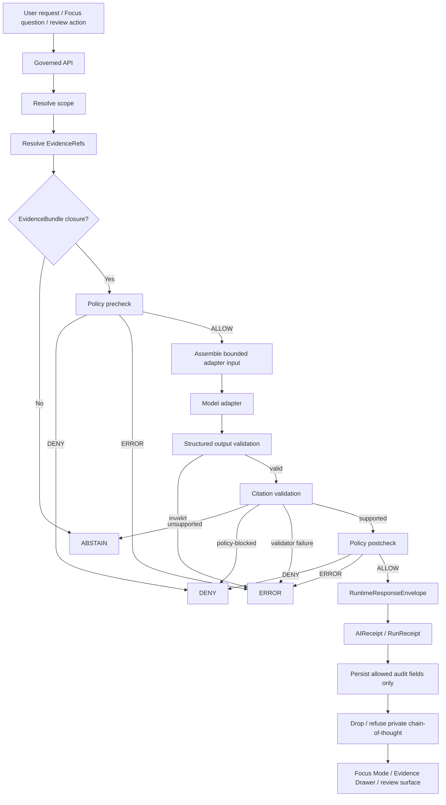

<!-- [KFM_META_BLOCK_V2]
doc_id: kfm://doc/NEEDS-VERIFICATION-ADR-ai-no-chain-of-thought-storage
title: ADR: AI No Chain-of-Thought Storage
type: standard
version: v1
status: draft
owners: OWNER_TBD_NEEDS_VERIFICATION
created: 2026-05-08
updated: 2026-05-08
policy_label: NEEDS_VERIFICATION
related: [./README.md, ./ADR-TEMPLATE.md, ./ADR-ai-continuity-model.md, ./ADR-0207-governed-ai-runtime-envelope.md, ./ADR-0019-query-save-recompile-loop.md, ./ADR-0001-schema-home.md, ../architecture/governed-api.md, ../../contracts/runtime/README.md, ../../policy/crosswalk/runtime-outcome-map.md]
tags: [kfm, adr, governed-ai, chain-of-thought, evidence, receipts, runtime-envelope, focus-mode, governance]
notes: [Revises placeholder ADR content at docs/adr/ADR-ai-no-chain-of-thought-storage.md. Existing path and placeholder status are CONFIRMED from accessible GitHub repository evidence. Owners, policy label, doc_id, CODEOWNERS coverage, retention policy, schema enforcement, policy enforcement, runtime implementation, emitted receipts, and CI behavior remain NEEDS VERIFICATION.]
[/KFM_META_BLOCK_V2] -->

<a id="top"></a>

# ADR: AI No Chain-of-Thought Storage

Decide what KFM may persist for AI auditability while forbidding private chain-of-thought from becoming evidence, truth, receipts, proof, release, or UI payload content.

<p align="center">
  
  
  
  
  
  
</p>

<p align="center">
  <a href="#decision-summary">Decision</a> ·
  <a href="#context">Context</a> ·
  <a href="#evidence-basis">Evidence</a> ·
  <a href="#decision">Rule</a> ·
  <a href="#storage-boundary">Storage boundary</a> ·
  <a href="#runtime-flow">Flow</a> ·
  <a href="#impact-map">Impact</a> ·
  <a href="#validation-plan">Validation</a> ·
  <a href="#rollback-and-supersession">Rollback</a> ·
  <a href="#verification">Verification</a>
</p>

> [!IMPORTANT]
> **ADR status:** `proposed`  
> **Target path:** `docs/adr/ADR-ai-no-chain-of-thought-storage.md`  
> **Existing state:** `CONFIRMED` placeholder ADR existed at this path before this revision.  
> **Implementation state:** `NEEDS VERIFICATION` for schemas, policy, validators, fixtures, runtime persistence, route behavior, retention rules, emitted receipts, and CI enforcement.  
> **Boundary rule:** KFM may store audit-safe inputs, outputs, references, digests, tool-call metadata, validation results, policy decisions, citations, and receipts. KFM must not store private chain-of-thought, hidden reasoning traces, model scratchpads, provider-side reasoning, or “thought” channels as evidence, truth, proof, release, receipt, or public UI payload content.

---

## Decision summary

| Field | Determination |
|---|---|
| Decision | KFM will not persist private chain-of-thought or hidden reasoning as any KFM truth-bearing, evidence-bearing, receipt-bearing, proof-bearing, release-bearing, or public-facing object. |
| Status | `proposed` |
| Existing file state | `CONFIRMED`: target file existed as a placeholder ADR. |
| Allowed persistence | Audit-safe prompts or prompt-template hashes, scoped inputs, model adapter metadata, tool-call/action logs, EvidenceRef/EvidenceBundle refs, policy decisions, citation validation results, schema validation results, output digests, emitted outputs where policy allows, RuntimeResponseEnvelope refs, RunReceipt refs, AIReceipt refs, and public-safe summaries. |
| Forbidden persistence | Private chain-of-thought, hidden reasoning, provider scratchpads, model “thought” text, internal analysis traces, raw provider memory as authority, or “show reasoning” transcripts that expose hidden reasoning instead of inspectable evidence actions. |
| Public posture | `DENY` any public or semi-public surface that attempts to display chain-of-thought as trust evidence. |
| Runtime posture | Missing support, policy block, citation failure, or unsafe reasoning-trace request returns `ABSTAIN`, `DENY`, or `ERROR`, not a fluent workaround. |
| Acceptance signal | Policy, schemas, fixtures, validators, no-direct-model-client checks, retention rules, receipt behavior, and runtime negative-path tests are verified in the active repository. |

### One-line decision rule

> KFM records **evidence, actions, decisions, citations, hashes, receipts, and bounded outputs**; it does not record private chain-of-thought as truth.

### One-line boundary rule

> If an AI trace cannot be expressed as inspectable tool/action metadata, evidence references, policy decisions, validation results, citations, receipts, or a public-safe summary, it must not be persisted.

[Back to top](#top)

---

## Context

The existing ADR placeholder was created to track the unresolved decision: **AI no chain-of-thought storage**. This revision replaces that placeholder with decision-grade content while preserving the `proposed` posture until enforcement is verified.

KFM uses AI as an interpretive, evidence-subordinate layer. AI can help summarize released evidence, draft candidate artifacts, extract metadata, classify candidates, propose patches, and support reviewer workflows. It cannot become the root truth source, publication authority, policy authority, citation authority, or hidden audit authority.

The risk this ADR addresses is simple but high impact: a model’s hidden reasoning can look like provenance when it is not provenance. If stored or shown as a trust object, chain-of-thought can blur the line between evidence and generation, preserve sensitive or unpublished context, weaken correction/rollback, and encourage reviewers to trust persuasive process text rather than resolved EvidenceBundles.

### Why this is architecture-significant

| Surface | Risk if private chain-of-thought is persisted |
|---|---|
| Evidence model | Hidden reasoning may be mistaken for evidence instead of EvidenceBundle support. |
| Runtime envelope | Fluent reasoning may bypass finite `ANSWER`, `ABSTAIN`, `DENY`, `ERROR` outcomes. |
| Focus Mode | “Show reasoning” could leak unsupported, stale, restricted, or unpublished context. |
| Review workflows | Reviewers may treat model scratchpad text as a reviewer note or source record. |
| Receipts | Process memory may be confused with proof or publication approval. |
| Query-save-recompile loop | Generated reasoning may become a candidate delta without evidence closure. |
| Policy and sensitivity | Chain-of-thought may preserve restricted locations, living-person data, source terms, secrets, or private prompt context. |
| Correction and rollback | Hidden reasoning is hard to invalidate, supersede, cite, redact, or roll back cleanly. |

[Back to top](#top)

---

## Evidence basis

| Evidence item | Source / path / artifact | What it supports | Truth label |
|---|---|---|---|
| Target ADR placeholder | `docs/adr/ADR-ai-no-chain-of-thought-storage.md` | The target file existed as a placeholder with `proposed` status and required replacement by accepted decision language and evidence links. | `CONFIRMED repo evidence` |
| ADR directory index | `docs/adr/README.md` | ADRs are human-facing decision records; they do not prove enforcement by themselves. | `CONFIRMED repo evidence` |
| ADR template | `docs/adr/ADR-TEMPLATE.md` | KFM ADRs should carry evidence, scope, policy impact, validation, rollback, and supersession. | `CONFIRMED repo evidence` |
| AI continuity ADR | `docs/adr/ADR-ai-continuity-model.md` | AI continuity must be derived from governed evidence, policy, release state, receipts, and public-safe summaries; private chain-of-thought persistence is forbidden. | `CONFIRMED repo evidence / PROPOSED implementation` |
| Governed AI runtime envelope ADR | `docs/adr/ADR-0207-governed-ai-runtime-envelope.md` | Consequential AI responses should use finite runtime envelopes and should not persist chain-of-thought as KFM truth. | `CONFIRMED repo evidence / PROPOSED implementation` |
| Query-save-recompile loop ADR | `docs/adr/ADR-0019-query-save-recompile-loop.md` | Loop records may store auditable records and summaries, not private chain-of-thought; generated text is not evidence. | `CONFIRMED repo evidence / PROPOSED implementation` |
| Schema-home ADR | `docs/adr/ADR-0001-schema-home.md` | Proposed machine-schema home is `schemas/contracts/v1/`; enforcement still requires verification. | `CONFIRMED repo evidence / NEEDS VERIFICATION enforcement` |
| Governed API architecture | `docs/architecture/governed-api.md` | Public clients, Focus Mode, Evidence Drawer, exports, and map surfaces must use governed APIs, not direct model output or internal lifecycle stores. | `CONFIRMED repo evidence / NEEDS VERIFICATION runtime` |
| Runtime contracts | `contracts/runtime/README.md` | Runtime contracts define finite outward responses, receipts, and governed AI/API obligations; hidden chain-of-thought is excluded. | `CONFIRMED repo evidence / NEEDS VERIFICATION enforcement` |
| Runtime outcome map | `policy/crosswalk/runtime-outcome-map.md` | Runtime outcomes are finite, fail-closed, and evidence-bound; hidden chain-of-thought is not evidence. | `CONFIRMED repo evidence / NEEDS VERIFICATION enforcement` |
| KFM bounded-AI doctrine | Attached KFM Ollama / Ubuntu and pipeline materials | KFM should persist audit-relevant digests, validation results, timing, citations, receipts, and evidence references — not chain-of-thought traces as truth. | `CONFIRMED doctrine / PROPOSED implementation` |

> [!CAUTION]
> This ADR records a decision and review burden. It does **not** prove that companion schemas, policies, validators, runtime persistence controls, retention rules, CI checks, emitted receipts, or route behavior already enforce the decision.

[Back to top](#top)

---

## Decision

KFM will adopt a no-chain-of-thought-storage rule across governed AI, Focus Mode, Evidence Drawer assistance, query-save-recompile workflows, review surfaces, runtime envelopes, receipts, and public/semi-public exports.

### Chosen rule

KFM must not persist, expose, publish, export, index, embed, or cite private chain-of-thought as any of the following:

- `EvidenceBundle`
- `EvidenceRef`
- `InspectableClaim`
- `RuntimeResponseEnvelope`
- `DecisionEnvelope`
- `PolicyDecision`
- `AIReceipt`
- `RunReceipt`
- `TransformReceipt`
- `ProofPack`
- `ReleaseManifest`
- `CorrectionNotice`
- `RollbackCard`
- ReviewRecord
- Focus Mode answer
- Evidence Drawer payload
- map popup
- story node
- export artifact
- search/vector index content
- public or steward-facing “reasoning trace”

### Required substitute

When auditability or explainability is needed, KFM stores **structured traceable substitutes**:

| Substitute | What it may contain | Why it is acceptable |
|---|---|---|
| Tool/action log | Tool name, allowed arguments, EvidenceRef inputs, returned refs, result status, timing, policy state, error codes. | Describes inspectable actions without exposing hidden reasoning. |
| Adapter metadata | Provider/adapter ID, model profile, prompt-template hash, context profile, timeout, structured-output schema ID. | Supports reproducibility without treating provider internals as truth. |
| Input digest | Hash or digest of bounded adapter input, plus references to resolved EvidenceBundles. | Supports audit while reducing sensitive prompt retention. |
| Output digest | Hash or digest of model output, plus stored output only when policy and retention allow. | Supports replay/correction without requiring hidden reasoning. |
| Citation validation report | Claims checked, evidence refs, unsupported claims, invalid citations, outcome. | Makes support inspectable. |
| Policy decision | Allow/deny/abstain/error reason codes and obligations. | Keeps policy visible without leaking restricted detail. |
| Runtime response envelope | `ANSWER`, `ABSTAIN`, `DENY`, or `ERROR` with trust state and refs. | Ensures finite public-edge behavior. |
| AIReceipt | Audit-safe evidence that AI participated, with hashes, refs, validation status, and outcome. | Process memory, not proof of truth. |
| Public-safe summary | Bounded summary of what was done or why an outcome occurred, linked to evidence and receipts. | User-visible explainability without private reasoning exposure. |

### Operating rule

> Store **what happened** and **what was checked**. Do not store **the model’s private reasoning**.

[Back to top](#top)

---

## Storage boundary

### Classification table

| Content class | Store? | Default disposition | Notes |
|---|---:|---|---|
| Hidden chain-of-thought / private reasoning | No | `DENY` persistence | Includes model “thoughts,” scratchpads, internal reasoning traces, and hidden analysis channels. |
| Provider-side conversation memory | No as authority | `DENY` unless separately governed as metadata | Provider session IDs may be operational metadata only when policy allows. |
| Full raw prompts | Sometimes | `NEEDS VERIFICATION` | Store only when retention, sensitivity, and policy rules permit. Prefer prompt-template hash and input refs. |
| Prompt template hash | Yes | Allowed | Useful for reproducibility and receipts. |
| Adapter input digest | Yes | Allowed | Should reference EvidenceBundles and policy decisions. |
| Model output digest | Yes | Allowed | Store emitted output only when policy and retention allow. |
| Tool calls / actions | Yes | Allowed with guardrails | Store tool name, scoped arguments, refs, observation digests, outcome, and timing — not thoughts. |
| EvidenceRef list | Yes | Required where relevant | Must resolve before consequential claims. |
| EvidenceBundle refs | Yes | Required for `ANSWER` | EvidenceBundle outranks generated text. |
| Citation validation result | Yes | Required for `ANSWER` | Unsupported claims block or transform outcome. |
| Policy decision / reason codes | Yes | Required where relevant | Needed for `DENY`, `ABSTAIN`, obligations, and audit. |
| RuntimeResponseEnvelope | Yes | Required for runtime output | Finite outward response object. |
| RunReceipt / AIReceipt | Yes | Required where AI materially participates | Process memory only; not proof of truth. |
| Public-safe reasoning summary | Yes, if bounded | Allowed after validation | Must be labeled as generated/explanatory and linked to evidence/receipts. |
| “Show reasoning” UI transcript | No if it exposes hidden reasoning | Replace with action/evidence trace | UI may show evidence path and tool actions, not private chain-of-thought. |

### Allowed action trace shape

This shape is illustrative until schema-home and runtime contract enforcement are verified.

```json
{
  "trace_type": "ai_action_trace_v1",
  "request_id": "kfm://request/NEEDS-VERIFICATION",
  "surface": "focus",
  "actor_class": "model_adapter",
  "actions": [
    {
      "action_id": "act-001",
      "tool_name": "evidence_resolver",
      "allowed_arguments": {
        "evidence_refs": ["kfm://evidence-ref/example"]
      },
      "observation_ref": "kfm://evidence-bundle/example",
      "observation_digest": "sha256:NEEDS_VERIFICATION",
      "started_at": "2026-05-08T00:00:00Z",
      "completed_at": "2026-05-08T00:00:01Z",
      "outcome": "resolved"
    }
  ],
  "policy_decision_refs": ["kfm://policy-decision/example"],
  "citation_validation_ref": "kfm://citation-validation/example",
  "receipt_refs": ["kfm://receipt/ai/example"],
  "forbidden_fields": [
    "chain_of_thought",
    "thoughts",
    "reasoning",
    "analysis",
    "scratchpad"
  ]
}
```

### Forbidden examples

These fields must not appear in persisted AI audit objects, receipts, runtime envelopes, public payloads, or review traces unless a future ADR explicitly creates a safe, non-private, non-chain-of-thought meaning for the term:

```text
chain_of_thought
cot
thought
thoughts
reasoning_trace
hidden_reasoning
scratchpad
analysis
internal_monologue
private_reasoning
model_thoughts
```

> [!WARNING]
> Field-name scans are not sufficient enforcement. They are only a cheap guardrail. The real rule is semantic: do not persist hidden reasoning even if it is renamed.

[Back to top](#top)

---

## Runtime flow



### Flow rule

At no point does the hidden reasoning text become an input to public trust. A request can use tool actions, resolved evidence, policy decisions, citation checks, validation results, and receipts. It cannot use private chain-of-thought as support.

[Back to top](#top)

---

## Impact map

### Confirmed related surfaces

| Path | Role | Status |
|---|---|---:|
| `docs/adr/ADR-ai-no-chain-of-thought-storage.md` | This ADR. | `CONFIRMED target path` |
| `docs/adr/README.md` | ADR index and governance guide. | `CONFIRMED` |
| `docs/adr/ADR-TEMPLATE.md` | ADR authoring standard. | `CONFIRMED` |
| `docs/adr/ADR-ai-continuity-model.md` | Related continuity model and no-private-chain-of-thought boundary. | `CONFIRMED / PROPOSED implementation` |
| `docs/adr/ADR-0207-governed-ai-runtime-envelope.md` | Related runtime envelope rule. | `CONFIRMED / PROPOSED implementation` |
| `docs/adr/ADR-0019-query-save-recompile-loop.md` | Related loop control rule. | `CONFIRMED / PROPOSED implementation` |
| `docs/adr/ADR-0001-schema-home.md` | Proposed schema-home authority. | `CONFIRMED / NEEDS VERIFICATION enforcement` |
| `docs/architecture/governed-api.md` | Governed API trust membrane. | `CONFIRMED / NEEDS VERIFICATION runtime` |
| `contracts/runtime/README.md` | Runtime contract lane. | `CONFIRMED / NEEDS VERIFICATION enforcement` |
| `policy/crosswalk/runtime-outcome-map.md` | Runtime outcome policy crosswalk. | `CONFIRMED / NEEDS VERIFICATION enforcement` |

### Proposed companion surfaces

> [!WARNING]
> Proposed paths are implementation targets and review hooks. They are not claims of existing files.

| Path | Purpose | Truth role | Status |
|---|---|---|---:|
| `contracts/runtime/no_chain_of_thought_storage.md` | Human-readable runtime contract for AI trace retention and forbidden fields. | Semantic contract | `PROPOSED` |
| `schemas/contracts/v1/runtime/ai_receipt.schema.json` | Machine schema for AI participation receipts, excluding hidden reasoning. | Machine-checkable shape | `PROPOSED / NEEDS VERIFICATION schema home` |
| `schemas/contracts/v1/runtime/ai_action_trace.schema.json` | Machine schema for allowed tool/action traces. | Machine-checkable shape | `PROPOSED` |
| `schemas/contracts/v1/runtime/no_chain_of_thought_storage.schema.json` | Guard schema/profile for forbidden persisted fields and allowed audit substitutes. | Machine-checkable shape | `PROPOSED` |
| `policy/runtime/no_chain_of_thought_storage.rego` | Fail-closed policy that denies chain-of-thought persistence or exposure. | Policy-as-code | `PROPOSED / NEEDS VERIFICATION policy convention` |
| `fixtures/runtime/no_chain_of_thought_storage/valid/*.json` | Valid AIReceipt and action-trace examples. | Fixture proof | `PROPOSED` |
| `fixtures/runtime/no_chain_of_thought_storage/invalid/*.json` | Invalid examples containing hidden reasoning, provider scratchpads, or raw reasoning traces. | Negative-path fixture proof | `PROPOSED` |
| `tools/validators/validate_no_chain_of_thought_storage.py` | Validator for AI receipts, action traces, and runtime outputs. | Validator | `PROPOSED / NEEDS VERIFICATION tool convention` |
| `tests/runtime/test_no_chain_of_thought_storage.py` | Contract and negative-path tests. | Test proof | `PROPOSED / NEEDS VERIFICATION test convention` |
| `docs/runbooks/ai-trace-retention.md` | Operator/reviewer runbook for retention, redaction, invalidation, and rollback of AI audit artifacts. | Human-facing runbook | `PROPOSED` |

### Directory Rules basis

This ADR belongs under `docs/adr/` because it is a human-facing architecture decision. It must not create a new root-level `ai/`, `cot/`, `reasoning/`, `trace/`, `memory/`, or `prompts/` authority root. Implementation should use verified responsibility roots such as `contracts/`, `schemas/`, `policy/`, `fixtures/`, `tests/`, `tools/`, `apps/`, `packages/`, `data/receipts/`, `data/proofs/`, and `release/`.

[Back to top](#top)

---

## Policy, rights, privacy, and sensitivity

| Question | Determination | Status |
|---|---|---:|
| Does this decision affect public release eligibility? | Yes. Public surfaces must not expose hidden reasoning as evidence or explanation. | `PROPOSED` |
| Does it affect living-person, DNA, archaeology, rare species, land/title, infrastructure, cultural, or sensitive location material? | Potentially. Hidden reasoning may contain sensitive context even when final output is redacted. | `NEEDS VERIFICATION per domain` |
| May raw prompts be stored? | Only under explicit retention, sensitivity, source-rights, and policy controls. Prefer prompt-template hashes and bounded input refs. | `NEEDS VERIFICATION` |
| May raw outputs be stored? | Only when policy allows and retention rules are explicit. Always store output digest and validation state. | `NEEDS VERIFICATION` |
| May action traces be shown to users? | Yes, if they are action/evidence traces, not hidden reasoning, and policy allows the display. | `PROPOSED` |
| May receipts include chain-of-thought? | No. Receipts are process memory and may include hashes, refs, validation results, and outcomes, not private reasoning. | `PROPOSED` |
| What happens if a provider returns visible chain-of-thought text? | Quarantine or redact it; do not persist it as evidence or public payload. | `PROPOSED` |
| What happens if policy cannot decide? | `ERROR` or `DENY`, depending on failure classification. Do not persist or expose uncertain reasoning traces. | `PROPOSED` |

> [!IMPORTANT]
> Retention is a policy surface. Until retention rules are verified, prefer hashes, refs, bounded summaries, and validation records over raw prompt/output storage.

[Back to top](#top)

---

## Validation plan

### Required checks

| Check | Minimum evidence | Expected result | Status |
|---|---|---|---|
| ADR index update | `docs/adr/README.md` entry or index note. | ADR appears with correct status and related ADR links. | `NEEDS VERIFICATION` |
| Schema validation | Valid and invalid AIReceipt/action-trace fixtures. | Valid examples pass; chain-of-thought examples fail. | `PROPOSED` |
| Policy validation | No-chain-of-thought policy fixtures. | Hidden reasoning persistence and public exposure are denied. | `PROPOSED` |
| Runtime envelope validation | Runtime outputs remain finite. | Only `ANSWER`, `ABSTAIN`, `DENY`, `ERROR` are emitted. | `PROPOSED` |
| Receipt inspection | AIReceipt / RunReceipt fixtures. | Receipts include refs, hashes, validation results, and outcomes; no hidden reasoning. | `PROPOSED` |
| Focus Mode test | Focus output with reasoning-request prompt. | Returns evidence/action trace or safe refusal; no chain-of-thought. | `PROPOSED` |
| Evidence Drawer test | Drawer payload displays support and source roles. | Shows EvidenceBundle/citation state, not model reasoning. | `PROPOSED` |
| No direct model client | Static or runtime test. | Browser/public clients do not call model/provider endpoints directly. | `PROPOSED` |
| Retention review | Policy/governance record. | Raw prompt/output retention rules are explicit. | `NEEDS VERIFICATION` |
| CI enforcement | Workflow or local validation receipt. | Checks run and fail on invalid fixtures. | `NEEDS VERIFICATION` |

### Negative-path fixtures

| Fixture | Expected outcome |
|---|---|
| `invalid/provider_thought_trace.json` | `DENY` or validator failure |
| `invalid/chain_of_thought_field.json` | validator failure |
| `invalid/raw_reasoning_as_evidence.json` | validator failure |
| `invalid/show_reasoning_public_payload.json` | `DENY` |
| `invalid/ai_receipt_contains_scratchpad.json` | validator failure |
| `invalid/generated_reasoning_cited_as_source.json` | `ABSTAIN` or validator failure |
| `invalid/provider_memory_as_authority.json` | `DENY` |
| `invalid/raw_work_quarantine_reasoning_context.json` | `DENY` |
| `invalid/retention_policy_missing_for_raw_prompt.json` | blocked validation |
| `valid/action_trace_with_evidence_refs.json` | pass |
| `valid/ai_receipt_with_hashes_and_validation_refs.json` | pass |

### Illustrative commands

These commands are proposed review aids. Adapt them to repo-native tooling before use.

```bash
# PROPOSED only — verify paths, schema home, policy engine, and test runner first.

python -m tools.validators.validate_no_chain_of_thought_storage \
  --fixtures fixtures/runtime/no_chain_of_thought_storage/valid \
  --expect pass

python -m tools.validators.validate_no_chain_of_thought_storage \
  --fixtures fixtures/runtime/no_chain_of_thought_storage/invalid \
  --expect fail

python -m pytest -q tests/runtime/test_no_chain_of_thought_storage.py

# Cheap field-name smoke check. This is not sufficient enforcement.
grep -RInE 'chain_of_thought|\\bcot\\b|hidden_reasoning|model_thoughts|internal_monologue|scratchpad|reasoning_trace' \
  data contracts schemas policy fixtures tests apps packages tools docs 2>/dev/null || true

# Public/browser bypass smoke check.
grep -RInE 'localhost:11434|/api/generate|/api/chat|/v1/chat/completions|/v1/responses' \
  apps web ui packages 2>/dev/null || true
```

[Back to top](#top)

---

## Consequences

### Positive consequences

- Prevents generated reasoning from becoming accidental evidence.
- Keeps EvidenceBundle, policy, release, review, correction, and rollback state ahead of fluent AI output.
- Gives maintainers a safe audit model: refs, hashes, action logs, validation results, finite outcomes, and receipts.
- Makes Focus Mode and Evidence Drawer explainability evidence-centered rather than scratchpad-centered.
- Supports provider substitution because KFM does not depend on provider-native reasoning traces.
- Reduces sensitive-data retention risk.
- Preserves the distinction between process memory, proof, and truth.
- Gives validators and policy authors concrete negative paths to test.

### Tradeoffs and risks

| Risk | Mitigation | Residual status |
|---|---|---:|
| Less detailed debug information | Store adapter input/output digests, action logs, validation reports, and receipts. | `PROPOSED` |
| Reviewers may ask for “reasoning” | Provide evidence path, action trace, citations, and limitations instead. | `PROPOSED` |
| Provider emits reasoning unexpectedly | Redact/quarantine provider reasoning before persistence or display. | `PROPOSED` |
| Raw prompts/outputs may still contain sensitive context | Require retention policy, redaction, and policy review before storage. | `NEEDS VERIFICATION` |
| Field scans can be bypassed by renaming | Enforce semantic policy and schema checks, not only string patterns. | `PROPOSED` |
| Debugging failed model calls gets harder | Preserve safe error metadata, output hashes, schema validation errors, and citation-validation outcomes. | `PROPOSED` |
| Ambiguous distinction between action trace and reasoning trace | Define allowed trace schemas and invalid examples. | `PROPOSED` |

[Back to top](#top)

---

## Rollback and supersession

### Rollback plan

If chain-of-thought is found in persisted runtime records, receipts, proofs, public payloads, review objects, exports, or logs:

1. Freeze affected public or semi-public surfaces.
2. Preserve a safe audit reference to the incident without spreading the reasoning text.
3. Quarantine affected artifacts.
4. Redact or delete chain-of-thought content according to retention, privacy, legal, and policy rules.
5. Add a negative fixture that reproduces the leak.
6. Fix schemas, validators, policy rules, route behavior, and UI rendering.
7. Regenerate affected derived artifacts from safe canonical inputs.
8. Issue correction or withdrawal notices if public output was affected.
9. Keep this ADR as lineage; do not delete decision history.

### Rollback triggers

| Trigger | Required action |
|---|---|
| AIReceipt contains private chain-of-thought | Quarantine receipt, repair schema/policy, add regression fixture. |
| RuntimeResponseEnvelope exposes model scratchpad | Block route/surface, repair envelope assembly, add UI/API test. |
| Evidence Drawer or Focus Mode displays hidden reasoning | Disable reasoning display, replace with evidence/action trace, add test. |
| Provider response includes visible chain-of-thought | Redact before persistence; validate provider output shape. |
| Query-save-recompile loop stores private reasoning | Quarantine CandidateDelta/QueryRunRecord, repair loop persistence. |
| Public export includes hidden reasoning | Withdraw export, issue correction, regenerate without chain-of-thought. |
| Retention policy is missing for raw prompts/outputs | Restrict to hashes/refs/summaries until policy is accepted. |
| Policy engine or validator cannot enforce no-chain-of-thought rule | Return `ERROR` or block persistence until enforcement is restored. |

### Supersession rule

A future ADR may supersede this one only if it preserves:

- no generated truth;
- no private chain-of-thought persistence as evidence or proof;
- finite runtime outcomes;
- evidence-first and cite-or-abstain behavior;
- no direct browser/model runtime path;
- receipts as process memory, not truth;
- public-safe action/evidence traces instead of hidden reasoning;
- correction, redaction, and rollback path for any leaked reasoning content.

[Back to top](#top)

---

## Verification

This ADR must remain `proposed` until the following are verified in the active repository.

| Item | Status | Verification path |
|---|---:|---|
| Owners / CODEOWNERS | `NEEDS VERIFICATION` | Confirm owner assignment for governed AI/runtime ADRs and policy files. |
| Policy label | `NEEDS VERIFICATION` | Confirm whether this ADR is public, restricted, or another classification. |
| ADR index entry | `NEEDS VERIFICATION` | Add or verify entry in `docs/adr/README.md`. |
| Schema home | `NEEDS VERIFICATION` | Follow accepted schema-home ADR before adding machine files. |
| AIReceipt schema | `PROPOSED` | Verify or add schema that excludes hidden reasoning. |
| Action trace schema | `PROPOSED` | Verify or add allowed action/evidence trace schema. |
| No-chain-of-thought policy | `PROPOSED` | Verify or add policy rule and tests. |
| Runtime route behavior | `UNKNOWN` | Inspect and test Focus Mode, Evidence Drawer, and governed AI routes. |
| Raw prompt/output retention | `NEEDS VERIFICATION` | Define retention classes, redaction rules, and deletion/rollback behavior. |
| Emitted receipts | `UNKNOWN` | Inspect receipt contents or generated artifacts after test runs. |
| Runtime logs | `UNKNOWN` | Confirm logs do not preserve hidden reasoning. |
| CI enforcement | `UNKNOWN` | Inspect workflow YAML and executed check results. |
| Provider behavior | `NEEDS VERIFICATION` | Confirm model adapters do not expose or persist provider reasoning text. |
| UI behavior | `NEEDS VERIFICATION` | Confirm “show reasoning” patterns are action/evidence traces only. |
| Correction path | `PROPOSED` | Add regression and correction procedure for leaked reasoning content. |
| Branch protections | `UNKNOWN` | Confirm checks are required before claiming enforcement. |

[Back to top](#top)

---

## Review checklist

<details>
<summary>Pre-merge checklist</summary>

- [ ] Meta block values are populated or deliberately marked `NEEDS VERIFICATION`.
- [ ] ADR index links this file and reflects `proposed` status.
- [ ] Related ADR links are checked from `docs/adr/ADR-ai-no-chain-of-thought-storage.md`.
- [ ] No section claims runtime enforcement without direct repo/test/log/artifact evidence.
- [ ] “Chain-of-thought” is defined as forbidden private/hidden reasoning, not public-safe evidence/action trace.
- [ ] Allowed persisted fields are explicit.
- [ ] Forbidden persisted fields are explicit.
- [ ] Runtime outcomes remain finite: `ANSWER`, `ABSTAIN`, `DENY`, `ERROR`.
- [ ] EvidenceRef → EvidenceBundle closure remains required for consequential claims.
- [ ] Generated text is not evidence.
- [ ] Receipts remain process memory, not proof of truth.
- [ ] Query-save-recompile loop cannot save private chain-of-thought.
- [ ] Focus Mode and Evidence Drawer display evidence/action traces, not hidden reasoning traces.
- [ ] Raw prompt/output retention is either policy-approved or replaced with digests/refs/summaries.
- [ ] No public/client direct model path is introduced.
- [ ] Invalid fixtures cover hidden reasoning leakage.
- [ ] Policy tests fail closed on reasoning persistence or exposure.
- [ ] Rollback path covers leaked reasoning content.
- [ ] Open verification items are assigned, deferred, or left visibly unresolved.
- [ ] Documentation updates do not create parallel schema, policy, source, proof, release, or runtime authority.

</details>

[Back to top](#top)

---

## Appendix A — Maintainer language

Use this wording in UI, runbooks, and review notes:

| User asks for… | Prefer this phrase |
|---|---|
| “Show chain of thought” | “KFM can show the evidence path, tool actions, citations, and validation state. It does not expose private model reasoning.” |
| “Why did the AI answer this?” | “This answer used these EvidenceBundles, policy decisions, citation checks, and runtime receipts.” |
| “Why no answer?” | “KFM abstained because evidence support was missing, unresolved, stale, conflicted, or outside release scope.” |
| “Why blocked?” | “KFM denied the request because policy, rights, sensitivity, role, embargo, or release state blocked the surface.” |
| “Can we log everything?” | “KFM logs audit-safe refs, hashes, actions, validation results, and receipts; it does not store hidden reasoning as truth.” |

## Appendix B — Minimal safe audit record

A minimal safe AI audit record should be able to answer:

1. What was requested?
2. Which surface asked for it?
3. Which evidence refs were considered?
4. Which EvidenceBundles resolved?
5. Which policy decisions applied?
6. Which adapter/profile was used?
7. Which prompt template or schema was used?
8. What was the input digest?
9. What was the output digest?
10. Did schema validation pass?
11. Did citation validation pass?
12. What RuntimeResponseEnvelope outcome was emitted?
13. Which receipts were created?
14. What correction or rollback path applies?

It should not answer by storing private chain-of-thought.

## Appendix C — ADR status note

This ADR can be accepted only after implementation evidence shows the rule is enforceable. Until then, it is a governance decision draft with strong doctrinal support and unresolved enforcement proof.
