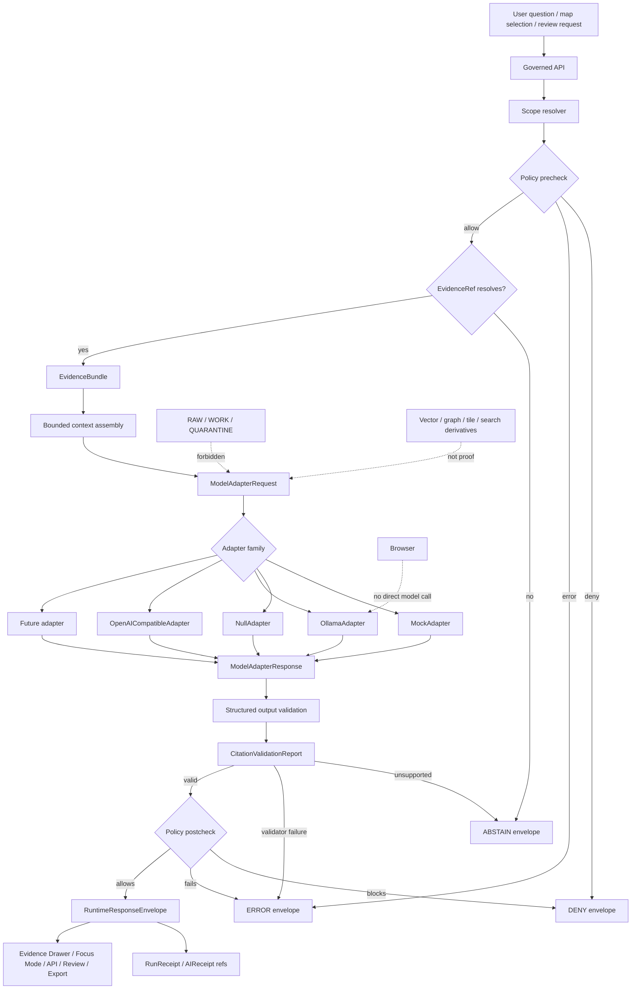

<!-- [KFM_META_BLOCK_V2]
doc_id: kfm://doc/NEEDS-VERIFICATION-ADR-ai-provider-adapter
title: ADR: AI Provider Adapter
type: standard
version: v1
status: draft
owners: OWNER_TBD_NEEDS_VERIFICATION
created: 2026-05-08
updated: 2026-05-08
policy_label: NEEDS-VERIFICATION
related: [./README.md, ./ADR-TEMPLATE.md, ./ADR-0207-governed-ai-runtime-envelope.md, ./ADR-0001-schema-home.md, ../architecture/governed-ai/README.md, ../../contracts/runtime/README.md, ../../policy/crosswalk/runtime-outcome-map.md, ../../schemas/contracts/v1/shared/runtime_response_envelope.schema.json, ../../schemas/contracts/v1/runtime/runtime_response_envelope.schema.json, ../../tests/test_shared_finite_outcomes.py]
tags: [kfm, adr, governed-ai, provider-adapter, model-adapter, runtime-envelope, focus-mode, evidencebundle, citation-validation, policy, receipts, trust-membrane]
notes: [Replaces the previous placeholder ADR text at docs/adr/ADR-ai-provider-adapter.md. Target path was verified through the accessible GitHub repository, but owners, policy label, CODEOWNERS routing, accepted schema home, route wiring, model-adapter implementation, live-provider configuration, citation-validator execution, receipt emission, and CI enforcement remain NEEDS VERIFICATION.]
[/KFM_META_BLOCK_V2] -->

<a id="top"></a>

# ADR: AI Provider Adapter

Provider-neutral model runtime boundary for KFM governed AI.

<div align="left">


</div>

> [!IMPORTANT]
> **Status:** `draft`  
> **Decision posture:** `PROPOSED` until adapter contracts, fixtures, citation validation, policy gates, receipt emission, route/UI wiring, and CI behavior are verified in the active checkout.  
> **Target path:** `docs/adr/ADR-ai-provider-adapter.md`  
> **Primary companion ADR:** [`ADR-0207-governed-ai-runtime-envelope.md`](./ADR-0207-governed-ai-runtime-envelope.md)  
> **Core rule:** provider choice is internal; evidence, policy, citation validation, finite runtime outcomes, receipts, correction, and rollback remain KFM-governed.

**Quick jumps:** [Decision](#decision) · [Why this exists](#why-this-exists) · [Evidence boundary](#evidence-boundary) · [Adapter law](#adapter-law) · [Runtime flow](#runtime-flow) · [Contract surface](#contract-surface) · [Provider admission](#provider-admission) · [Implementation impact](#implementation-impact) · [Validation](#validation) · [Rollback](#rollback-and-supersession) · [Open verification](#open-verification)

---

## Decision

**PROPOSED:** KFM will introduce a provider-neutral **AI provider adapter** boundary for model-assisted behavior.

The adapter boundary sits **inside** the governed API trust membrane:

```text
scope resolution
-> policy precheck
-> EvidenceRef -> EvidenceBundle resolution
-> bounded context assembly
-> ModelAdapterRequest
-> provider-neutral adapter
-> ModelAdapterResponse
-> structured output validation
-> CitationValidationReport
-> policy postcheck
-> RuntimeResponseEnvelope
-> RunReceipt / AIReceipt
-> Evidence Drawer / Focus Mode / governed API / review / export surfaces
```

The adapter boundary makes model providers replaceable without changing KFM’s public runtime contract, truth posture, or evidence requirements.

### Chosen adapter sequence

| Adapter family | Decision | First use |
|---|---:|---|
| `MockAdapter` | **Accepted as first implementation target once this ADR is adopted** | Deterministic fixtures and no-network contract tests |
| `NullAdapter` | **Accepted as first implementation target once this ADR is adopted** | Explicit no-model path for denial, abstention, disabled AI, maintenance, or unavailable provider |
| `OllamaAdapter` | **Allowed only after gates pass** | Local/private runtime option behind governed API |
| `OpenAICompatibleAdapter` | **Allowed only after gates pass** | Optional provider-compatible path behind governed API |
| Future adapters | **Allowed only through the same contract** | Provider substitution without public-contract drift |

### Non-goals

This ADR does **not**:

- select a default live provider;
- make Ollama, OpenAI-compatible APIs, or any vendor canonical;
- authorize direct browser-to-model calls;
- define final route names, API framework, package manager, or deployment topology;
- settle all schema-home ambiguity;
- claim adapter implementation exists;
- claim citation validation, receipts, UI wiring, or CI enforcement is complete;
- allow generated text to become publication approval;
- allow provider-specific payloads to become KFM’s public contract.

[Back to top](#top)

---

## Why this exists

KFM’s public unit of value is the **inspectable claim**: a claim whose evidence, source role, spatial scope, temporal scope, policy posture, review state, release state, freshness, correction lineage, and rollback support can be inspected.

A model runtime can help summarize or route users through evidence, but it cannot become the root truth source.

Without an adapter ADR, KFM risks five kinds of drift:

| Drift risk | Failure mode |
|---|---|
| Provider coupling | Public contracts inherit one vendor’s response shape or failure semantics. |
| Direct runtime access | Browser/UI clients call local or hosted model runtimes outside the governed API. |
| Evidence bypass | Model context is assembled from raw stores, candidate data, vector/search layers, or canonical internals rather than released EvidenceBundles. |
| Citation laundering | Generated citations are treated as proof without resolver-backed validation. |
| Receipt gaps | AI participation disappears from audit, rollback, and correction analysis. |

> [!NOTE]
> The adapter exists to keep provider behavior boring. The trust work belongs to KFM: evidence resolution, policy, source-role checks, citation validation, release state, receipts, UI trust state, correction, and rollback.

[Back to top](#top)

---

## Evidence boundary

This ADR is grounded in inspected repository files plus KFM governing doctrine. It deliberately separates **decision evidence** from **implementation proof**.

| Evidence item | Status | Supports | Does not prove |
|---|---:|---|---|
| `docs/adr/ADR-ai-provider-adapter.md` | `CONFIRMED path` | Target file exists and previously contained a placeholder ADR for this decision area. | Accepted decision, implementation, tests, or enforcement. |
| `docs/adr/README.md` | `CONFIRMED adjacent doc` | `docs/adr/` is the human-facing decision ledger and ADRs must distinguish decision state from enforcement state. | Complete ADR inventory or owner routing. |
| `docs/adr/ADR-TEMPLATE.md` | `CONFIRMED adjacent template` | ADRs must carry evidence, scope, policy impact, validation, rollback, and supersession. | That this ADR’s implementation exists. |
| `docs/adr/ADR-0207-governed-ai-runtime-envelope.md` | `CONFIRMED adjacent ADR` | Runtime responses use finite outcomes and provider-neutral adapters are downstream of evidence and policy. | Live provider wiring or schema maturity. |
| `docs/architecture/governed-ai/README.md` | `CONFIRMED adjacent architecture doc` | Governed AI is evidence-subordinate and model adapters should preserve the trust membrane. | Runtime behavior, deployments, or passing tests. |
| `contracts/runtime/README.md` | `CONFIRMED contract lane` | Runtime contracts include model-adapter boundaries, receipts, citation validation, and negative states. | Companion contract files or emitted receipts. |
| `policy/crosswalk/runtime-outcome-map.md` | `CONFIRMED policy crosswalk` | `ANSWER`, `ABSTAIN`, `DENY`, and `ERROR` are the public-edge runtime outcomes. | Executable policy enforcement. |
| `schemas/contracts/v1/shared/runtime_response_envelope.schema.json` | `CONFIRMED minimal schema` | A shared runtime envelope schema exists with finite outcome enum values. | Full adapter/envelope schema coverage. |
| `schemas/contracts/v1/runtime/runtime_response_envelope.schema.json` | `CONFIRMED drift watch` | A second runtime-envelope-shaped path exists with different fields. | Canonical schema authority. |
| `tests/test_shared_finite_outcomes.py` | `CONFIRMED test file` | Tests check finite values across shared runtime/policy/promotion/validation/rollback fixtures. | Passing CI, adapter tests, or runtime proof. |
| KFM governed-AI corpus | `CORPUS-CONFIRMED doctrine` | Model runtimes belong behind provider-neutral, evidence-subordinate adapters; MockAdapter-first thin slicing is preferred. | Current repo implementation. |

### Current-state posture

| Area | Status | Treatment |
|---|---:|---|
| ADR path | `CONFIRMED` | Replace placeholder with this reviewable ADR. |
| Owners | `NEEDS VERIFICATION` | Keep placeholder until governance or CODEOWNERS confirms routing. |
| Policy label | `NEEDS VERIFICATION` | Do not infer public/restricted from path alone. |
| Schema home | `CONFLICTED / NEEDS VERIFICATION` | Use ADR-0001/schema-home before adding new schemas or aliases. |
| Adapter code | `UNKNOWN` | Search surfaced documentation signals, not confirmed adapter implementation. |
| Provider configuration | `UNKNOWN` | No live model runtime or provider binding is claimed. |
| Citation validator execution | `UNKNOWN` | Required by this ADR; not proven here. |
| Receipts | `PROPOSED / NEEDS VERIFICATION` | Required for adapter participation; emitted receipt storage not proven. |

[Back to top](#top)

---

## Requirements and constraints

### KFM invariants checked

| Invariant | Adapter rule | Status |
|---|---|---:|
| `RAW -> WORK / QUARANTINE -> PROCESSED -> CATALOG / TRIPLET -> PUBLISHED` | Adapter context comes from released or explicitly review-authorized evidence, not lifecycle internals. | `CONFIRMED doctrine / PROPOSED adapter rule` |
| Public clients use governed interfaces | Browser/UI clients never call model providers directly. | `CONFIRMED doctrine / PROPOSED enforcement` |
| `EvidenceRef -> EvidenceBundle` before consequential claims | Adapter receives bounded EvidenceBundle-derived context or no model call occurs. | `CONFIRMED doctrine / PROPOSED enforcement` |
| Promotion is a governed state transition | Adapter output cannot promote, publish, or approve release. | `CONFIRMED doctrine` |
| AI is interpretive | Model output is candidate synthesis until validation and policy postcheck pass. | `CONFIRMED doctrine` |
| Derived products stay derived | Vector/search/summary/tile/graph context cannot become sovereign proof. | `CONFIRMED doctrine` |
| Rights and sensitivity fail closed | Provider context excludes blocked, rights-unclear, sensitive, embargoed, unreleased, or role-ineligible material. | `CONFIRMED doctrine / PROPOSED enforcement` |
| Receipts, proofs, release, correction, rollback remain separate | `AIReceipt` / `RunReceipt` record adapter participation but do not become EvidenceBundle or release proof. | `CONFIRMED doctrine / PROPOSED enforcement` |

### Adapter boundary in one sentence

> A provider adapter may transform **bounded, policy-safe, released evidence context** into **structured candidate output**, but KFM decides whether that output becomes an `ANSWER`, `ABSTAIN`, `DENY`, or `ERROR`.

[Back to top](#top)

---

## Adapter law

### 1. Provider neutrality before provider choice

KFM should define these objects before integrating live providers:

- `ModelAdapterRequest`
- `ModelAdapterResponse`
- `CitationValidationReport`
- `AIReceipt`
- adapter health/error report
- valid/invalid adapter fixtures
- no-direct-model-client checks
- no-raw-work-quarantine context checks

Provider-specific details may appear in `model_state`, receipts, metrics, and runbooks. They must not alter the public runtime envelope.

### 2. Evidence and policy run before the adapter

A model adapter should not receive a question plus broad repository access.

It receives a bounded request shaped by:

| Input | Required condition |
|---|---|
| request scope | resolved and narrow enough for answerability |
| actor/surface state | allowed by policy precheck |
| evidence | resolved to EvidenceBundle or safe excerpt |
| release state | public/review-authorized for the caller and surface |
| sensitivity | blocked or transformed before adapter invocation |
| citation targets | explicit and validator-checkable |
| instructions | policy-safe and template-hashable |

### 3. The adapter response is not public output

`ModelAdapterResponse` is an intermediate object.

It must pass:

1. structured output validation;
2. citation validation;
3. policy postcheck;
4. runtime envelope assembly;
5. receipt/audit linkage where material.

Only then may the governed API emit an `ANSWER`.

### 4. Negative outcomes remain first-class

The adapter may be skipped or may fail.

| Condition | Required KFM result |
|---|---|
| evidence unresolved | `ABSTAIN`; adapter not called |
| policy blocks context | `DENY`; adapter not called |
| provider unavailable | `ERROR` or `ABSTAIN` only if a non-model governed path supports it |
| malformed model output | `ERROR`; no fallback prose |
| unsupported model claim | `ABSTAIN` or recorded transform; never silent `ANSWER` |
| sensitive or unreleased content appears in output | `DENY` or `ERROR`, depending on classification |

### 5. No private chain-of-thought persistence

KFM should record audit-safe facts:

- request ID;
- adapter family;
- provider/model identifier where allowed;
- prompt template hash;
- input EvidenceBundle refs;
- policy decision refs;
- citation validation report ref;
- output hash;
- outcome;
- timing and version metadata.

KFM must not store private chain-of-thought as a truth object, evidence object, proof object, receipt object, or publication artifact.

[Back to top](#top)

---

## Runtime flow



[Back to top](#top)

---

## Contract surface

### Proposed `ModelAdapterRequest`

> [!WARNING]
> Field names are `PROPOSED` until the canonical schema home and companion contract files are accepted or verified.

| Field family | Required | Purpose |
|---|---:|---|
| `request_id` | yes | Joins adapter call to runtime envelope, receipt, audit, and validation report. |
| `adapter_profile` | yes | Declares expected adapter capability: `mock`, `null`, `local`, `openai_compatible`, or future profile. |
| `surface` | yes | Focus, Evidence Drawer, review, export, story, diagnostic, or API surface. |
| `scope` | yes | Spatial, temporal, source, release, layer, claim, or review scope. |
| `question` / `task` | conditional | Bounded user request or system task. |
| `evidence_context` | yes for model calls | Released EvidenceBundle refs, safe excerpts, and allowed citation targets. |
| `policy_context` | yes | Precheck decision refs, obligations, redaction/generalization state, and forbidden categories. |
| `output_contract` | yes | Expected structured output shape and allowed citation grammar. |
| `prompt_template_hash` | recommended | Hash of prompt template or adapter instruction bundle. |
| `limits` | recommended | Token, latency, temperature, citation, and maximum-claim limits. |

### Proposed `ModelAdapterResponse`

| Field family | Required | Purpose |
|---|---:|---|
| `request_id` | yes | Matches request and audit context. |
| `adapter` | yes | Adapter family used. |
| `provider_state` | conditional | Provider/model metadata safe for receipt and diagnostics. |
| `structured_output` | conditional | Candidate claims, answer text, citations, caveats, or tool-result envelope. |
| `raw_output_hash` | recommended | Hash of provider output without storing unsafe content in public docs. |
| `finish_state` | yes | Completed, refused, timeout, malformed, unavailable, or policy-skipped state. |
| `errors` | conditional | Safe error class and diagnostic refs. |
| `usage` | optional | Provider usage metadata if safe and useful. |
| `receipt_seed` | recommended | Metadata needed for `AIReceipt`. |

### Proposed adapter contract files

| File | Role | Status |
|---|---|---:|
| `contracts/runtime/model_adapter_request.md` | Human-readable request contract. | `PROPOSED / NEEDS VERIFICATION` |
| `contracts/runtime/model_adapter_response.md` | Human-readable response contract. | `PROPOSED / NEEDS VERIFICATION` |
| `contracts/runtime/citation_validation_report.md` | Citation validator contract. | `PROPOSED / NEEDS VERIFICATION` |
| `contracts/runtime/ai_receipt.md` | AI participation receipt contract. | `PROPOSED / NEEDS VERIFICATION` |
| `schemas/contracts/v1/ai/model_adapter_request.schema.json` | Machine-checkable request shape, if ADR-0001 accepts this lane. | `PROPOSED / NEEDS VERIFICATION` |
| `schemas/contracts/v1/ai/model_adapter_response.schema.json` | Machine-checkable response shape, if ADR-0001 accepts this lane. | `PROPOSED / NEEDS VERIFICATION` |
| `fixtures/ai/adapters/` or repo-native equivalent | Valid/invalid adapter fixtures. | `PROPOSED / NEEDS VERIFICATION` |
| `tests/ai/` or repo-native equivalent | Adapter and citation tests. | `PROPOSED / NEEDS VERIFICATION` |

> [!NOTE]
> Do not add a third runtime-envelope schema to solve adapter work. Reconcile the existing runtime-envelope schema paths through ADR-0001 or a schema-home successor decision.

[Back to top](#top)

---

## Provider admission

### Admission gates

A live provider adapter is not review-ready until these gates are satisfied.

| Gate | Required evidence |
|---|---|
| Contract gate | `ModelAdapterRequest`, `ModelAdapterResponse`, and `RuntimeResponseEnvelope` schemas or accepted equivalents. |
| Mock gate | `MockAdapter` proves deterministic `ANSWER`, `ABSTAIN`, `DENY`, and `ERROR` paths with no network. |
| Null gate | `NullAdapter` proves disabled/unavailable model behavior without leaking fallback prose. |
| Policy gate | Precheck blocks disallowed context before adapter invocation; postcheck blocks unsafe output. |
| Citation gate | Unsupported or unresolved citations cannot produce `ANSWER`. |
| Context gate | Adapter input excludes RAW, WORK, QUARANTINE, unpublished candidate, restricted canonical, and secret material. |
| Client boundary gate | Browser/public clients cannot call providers directly. |
| Receipt gate | `AIReceipt` / `RunReceipt` record adapter participation using audit-safe metadata. |
| Security gate | Local/private runtime exposure, egress, auth, rate limit, logging, secrets, and rollback are documented. |
| Rollback gate | Provider can be disabled or swapped to `MockAdapter` / `NullAdapter` without breaking evidence resolver. |

### Provider-specific posture

| Provider family | Required extra review |
|---|---|
| `OllamaAdapter` | Local bind/exposure, reverse proxy/VPN posture, model pinning, structured-output behavior, host logging, systemd/local runtime settings, no public direct access. |
| `OpenAICompatibleAdapter` | Provider terms, privacy and egress posture, secrets management, structured-output compatibility, retention/telemetry implications, cost/rate controls, no public direct access. |
| Future private provider | Same contract tests plus security, privacy, policy, and rollback review. |

[Back to top](#top)

---

## Alternatives considered

| Alternative | Decision | Reason |
|---|---:|---|
| Start with `OllamaAdapter` as the canonical provider | Rejected | Local runtime is useful, but provider choice must not define KFM truth or public contracts. |
| Start with OpenAI-compatible provider API shape | Rejected | Provider-specific payloads would leak into stable KFM contracts. |
| Let browser clients call providers directly | Rejected | Breaks governed API, policy, audit, citation validation, and no-direct-model-client posture. |
| Let adapters read vector/search layers directly as proof | Rejected | Derived layers are acceleration surfaces, not sovereign truth. |
| Let adapters read RAW/WORK/QUARANTINE or canonical stores directly | Rejected for normal public path | Violates lifecycle and public-client boundary. |
| Store chain-of-thought for audit | Rejected | Audit records should store refs, hashes, inputs, outputs, policy/citation decisions, and receipts, not private reasoning. |
| Skip `MockAdapter` and test only live providers | Rejected | Contract and negative-path behavior must be deterministic before provider variability. |
| Put provider selection in UI state | Rejected | Provider choice is backend/runtime governance, not browser authority. |
| Make `RuntimeResponseEnvelope` provider-specific | Rejected | Public-edge outcomes must remain stable across providers. |

[Back to top](#top)

---

## Implementation impact

All paths below are implementation-facing and remain `PROPOSED` unless marked `CONFIRMED`.

| Surface | Path or family | Status | Required next proof |
|---|---|---:|---|
| ADR file | `docs/adr/ADR-ai-provider-adapter.md` | `CONFIRMED path` | Replace placeholder with this ADR and update ADR index if needed. |
| Runtime envelope ADR | `docs/adr/ADR-0207-governed-ai-runtime-envelope.md` | `CONFIRMED adjacent ADR` | Keep adapter decision aligned with finite runtime-envelope law. |
| Governed AI architecture | `docs/architecture/governed-ai/README.md` | `CONFIRMED adjacent doc` | Link this ADR after merge. |
| Runtime contract lane | `contracts/runtime/README.md` | `CONFIRMED adjacent doc` | Add/align adapter request/response contract files if repo convention supports them. |
| Schema home | `schemas/contracts/v1/` | `PROPOSED by ADR-0001` | Resolve schema drift before adding adapter schemas. |
| Runtime schemas | `schemas/contracts/v1/shared/runtime_response_envelope.schema.json`, `schemas/contracts/v1/runtime/runtime_response_envelope.schema.json` | `CONFIRMED drift watch` | Alias, migrate, or retire duplicate/partial schema paths. |
| Policy outcome map | `policy/crosswalk/runtime-outcome-map.md` | `CONFIRMED adjacent doc` | Add provider/adaptor reason codes if needed. |
| API routes | `apps/api/routes/` or repo-native governed API route home | `CONFIRMED docs / NEEDS VERIFICATION implementation` | Verify actual route registration and no-direct-model-client checks. |
| Adapter implementation | `packages/ai/adapters/`, `apps/api/runtime/`, or repo-native equivalent | `PROPOSED` | Choose after repo inspection; do not create parallel implementation roots. |
| Adapter fixtures | `fixtures/ai/adapters/` or repo-native equivalent | `PROPOSED` | Add valid/invalid `MockAdapter` and `NullAdapter` cases first. |
| Adapter tests | `tests/ai/`, `tests/governed_api/`, or repo-native equivalent | `PROPOSED` | Add no-network and negative-path proof tests. |
| Receipts | `data/receipts/` or repo-native receipt home | `PROPOSED / NEEDS VERIFICATION` | Emit audit-safe `AIReceipt` / `RunReceipt` refs. |

### Smallest safe PR sequence

1. Replace the placeholder ADR with this file.
2. Update `docs/adr/README.md` to list this ADR, if the index is authoritative on the target branch.
3. Reconcile or at least document runtime-envelope schema drift.
4. Add or update human-readable runtime adapter contracts.
5. Add `ModelAdapterRequest` and `ModelAdapterResponse` schemas only after schema-home review.
6. Add valid/invalid fixtures for `MockAdapter` and `NullAdapter`.
7. Add citation-validation failure fixture.
8. Add no-direct-model-client and no-raw-work-quarantine checks.
9. Add `MockAdapter` implementation and deterministic tests.
10. Add `NullAdapter` implementation and disabled/unavailable-provider tests.
11. Defer `OllamaAdapter` and OpenAI-compatible providers until the adapter contract, policy, citation, receipt, and runtime-envelope tests pass.

[Back to top](#top)

---

## Validation

### Required contract tests

| Test | Required result |
|---|---|
| `MockAdapter` happy path | Emits structured candidate output over released evidence fixture. |
| `MockAdapter` unsupported claim | Citation validator prevents `ANSWER`. |
| `NullAdapter` disabled path | Produces safe negative outcome without provider call. |
| provider unavailable | Runtime emits `ERROR` or governed negative state; no fallback prose. |
| malformed provider output | Runtime emits `ERROR`; citation validator is not bypassed. |
| unknown adapter profile | Validation fails or returns `DENY` / `ERROR` according to policy. |
| adapter input contains RAW/WORK/QUARANTINE refs | Validation fails before adapter invocation. |
| browser imports provider client | Static no-direct-model-client check fails. |
| `ANSWER` lacks EvidenceBundle refs | Runtime envelope validation fails. |
| `ANSWER` lacks citation validation | Runtime envelope validation fails. |
| `AIReceipt` missing adapter metadata | Receipt validation fails or marks incomplete. |

### Candidate commands

> [!WARNING]
> Commands are `PROPOSED` until the active checkout confirms package manager, test runner, validators, and paths.

```bash
# Inspect relevant surfaces.
find docs/adr docs/architecture contracts schemas policy fixtures tests apps packages tools data release \
  -maxdepth 4 -type f 2>/dev/null \
  | grep -Ei 'ai|adapter|runtime|focus|evidence|citation|receipt|outcome' \
  | sort

# Validate runtime and adapter schemas once schema-home is settled.
python tools/validators/schema_validate.py \
  schemas/contracts/v1/shared/runtime_response_envelope.schema.json \
  schemas/contracts/v1/ai/model_adapter_request.schema.json \
  schemas/contracts/v1/ai/model_adapter_response.schema.json

# Run adapter and envelope tests once implemented.
python -m pytest tests/ai tests/governed_api tests/e2e/runtime_proof -q

# Prove public clients cannot call model providers directly.
python tools/ci/no_direct_model_client_check.py --root .

# Prove adapter context cannot read internal lifecycle states.
python tools/ci/no_ai_raw_work_quarantine_context_check.py --root .
```

### Definition of done

This ADR can move toward acceptance only when:

- [ ] owners and policy label are verified;
- [ ] ADR index includes this decision;
- [ ] schema-home ambiguity is resolved or explicitly tracked;
- [ ] adapter request/response contracts exist;
- [ ] valid and invalid adapter fixtures exist;
- [ ] `MockAdapter` and `NullAdapter` tests pass;
- [ ] live providers are absent or clearly feature-gated until admitted;
- [ ] no public/browser path calls model runtimes directly;
- [ ] adapter context excludes RAW, WORK, QUARANTINE, unpublished candidates, restricted canonical stores, and secrets;
- [ ] citation validation blocks unsupported model claims;
- [ ] policy precheck and postcheck are tested;
- [ ] `RunReceipt` / `AIReceipt` or equivalent audit-safe receipt refs are emitted or explicitly deferred;
- [ ] Focus Mode / Evidence Drawer consumes `RuntimeResponseEnvelope`, not raw model text;
- [ ] rollback to `MockAdapter` / `NullAdapter` is documented.

[Back to top](#top)

---

## Policy, rights, and sensitivity

| Question | Answer | Status |
|---|---|---:|
| Does provider selection affect public release eligibility? | No by itself; release eligibility depends on evidence, policy, review, source role, rights, sensitivity, citation validation, and release state. | `CONFIRMED doctrine / PROPOSED adapter rule` |
| Can adapter output expose exact sensitive locations? | No unless the evidence is released for that surface and policy allows the exact or transformed exposure. | `CONFIRMED doctrine` |
| Can a provider receive restricted material? | Not on normal public paths. Internal/steward exceptions require explicit policy and review. | `PROPOSED` |
| Can unknown rights material be sent to a provider? | No. Unknown rights should block model mediation or public release. | `CONFIRMED doctrine / PROPOSED enforcement` |
| Can chain-of-thought be stored as audit evidence? | No. Store audit-safe refs, hashes, decisions, and receipts instead. | `PROPOSED` |
| Can model output create a publication decision? | No. Promotion and publication remain governed state transitions. | `CONFIRMED doctrine` |

[Back to top](#top)

---

## Consequences

### Positive consequences

- Provider choice becomes replaceable.
- Public runtime outcomes stay stable.
- Focus Mode and Evidence Drawer remain evidence-bounded.
- Mock-first testing becomes possible before live provider risk.
- Citation validation and policy postcheck become explicit gates.
- AI participation becomes auditable through receipts without turning generated language into truth.
- Rollback can disable or swap provider adapters without changing the evidence resolver or public envelope.

### Tradeoffs and risks

| Risk | Mitigation | Residual status |
|---|---|---:|
| More upfront contract work | Add thin request/response schemas and fixtures before provider code. | `ACCEPTED TRADEOFF` |
| Slower first live model demo | Start with `MockAdapter` and `NullAdapter`; defer live providers. | `ACCEPTED TRADEOFF` |
| Schema-home drift | Use ADR-0001 and do not create parallel schema authority. | `NEEDS VERIFICATION` |
| Provider runbooks lag behind code | Require local/private runtime runbook before live adapter admission. | `PROPOSED` |
| UI hides negative outcomes | Require fixtures and UI tests for `ABSTAIN`, `DENY`, and `ERROR`. | `PROPOSED` |
| Receipts become mistaken for proof | Keep receipts separate from EvidenceBundle, ProofPack, ReleaseManifest, and PromotionDecision. | `CONFIRMED doctrine / PROPOSED enforcement` |

[Back to top](#top)

---

## Rollback and supersession

### Rollback plan

If an adapter implementation is unsafe, unsupported, or misaligned with this ADR:

1. Disable the live provider adapter.
2. Route model-assisted surfaces through `NullAdapter` or feature-flagged `MockAdapter`.
3. Preserve the failing request, safe response envelope, validation report, policy decision ref, and receipt refs for diagnosis.
4. Add or update a negative fixture reproducing the failure.
5. Re-run schema, policy, citation, no-direct-model-client, and no-raw-work-quarantine checks.
6. Update docs, runbooks, and ADR index if the rollback changes public behavior.
7. Preserve decision lineage and do not delete the historical adapter record.

### Rollback triggers

| Trigger | Required action |
|---|---|
| provider leaks restricted or unreleased content | Disable provider; return `DENY` or `ERROR`; preserve audit-safe receipt. |
| browser direct provider call discovered | Block public route/import; add static check; review security posture. |
| adapter input includes RAW/WORK/QUARANTINE refs | Disable adapter path; add fixture; fix context assembly. |
| citation validation fails open | Disable `ANSWER` path; return `ABSTAIN` or `ERROR`; repair validator. |
| policy precheck/postcheck missing | Disable model mediation until policy gates are proven. |
| schema drift blocks validation | Freeze new provider admission; resolve schema home or alias. |
| provider terms, privacy, or rights posture changes | Disable or restrict adapter; update policy and runbook. |

### Supersession rule

A successor ADR may supersede this one only if it preserves or explicitly revises:

- provider-neutral public contract;
- finite runtime outcome grammar;
- evidence-before-model order;
- policy precheck and postcheck;
- citation validation;
- no-direct-model-client rule;
- no-public-raw/work/quarantine rule;
- receipt and rollback obligations.

[Back to top](#top)

---

## Open verification

| Item | Status | Verification path |
|---|---:|---|
| ADR owners | `NEEDS VERIFICATION` | Populate from CODEOWNERS, document registry, or maintainer assignment. |
| Policy label | `NEEDS VERIFICATION` | Confirm public/restricted classification. |
| Adapter implementation home | `UNKNOWN` | Inspect `packages/`, `apps/`, and runtime docs before adding code. |
| Schema home for adapter contracts | `CONFLICTED / NEEDS VERIFICATION` | Resolve through ADR-0001 or successor before adding schemas. |
| Runtime envelope schema drift | `NEEDS VERIFICATION` | Reconcile `shared/` and `runtime/` schema paths. |
| `MockAdapter` implementation | `UNKNOWN` | Search code and tests after active checkout inspection. |
| `NullAdapter` implementation | `UNKNOWN` | Search code and tests after active checkout inspection. |
| `OllamaAdapter` implementation | `UNKNOWN` | Do not claim unless code, config, tests, and runbook are inspected. |
| OpenAI-compatible adapter implementation | `UNKNOWN` | Do not claim unless code, config, tests, and provider controls are inspected. |
| Citation validator | `UNKNOWN` | Inspect tools/tests and add fixture-backed validation. |
| AIReceipt / RunReceipt emission | `UNKNOWN` | Inspect runtime receipts and emitted examples. |
| Focus Mode / Evidence Drawer wiring | `UNKNOWN` | Inspect UI/API integration and negative-state rendering. |
| CI enforcement | `NEEDS VERIFICATION` | Inspect workflow YAML and run output. |
| No-direct-model-client check | `PROPOSED / NEEDS VERIFICATION` | Add or verify static check in CI. |
| Local/private runtime exposure controls | `NEEDS VERIFICATION` | Verify runbook, config, deployment, auth, reverse proxy/VPN posture, and secrets handling. |

[Back to top](#top)

---

## Review checklist

<details>
<summary>Pre-merge checklist</summary>

- [ ] KFM meta block values are verified or intentionally marked `NEEDS VERIFICATION`.
- [ ] ADR index entry is added or updated.
- [ ] This ADR does not claim adapter implementation without code/test evidence.
- [ ] Related runtime-envelope ADR remains aligned.
- [ ] Schema-home ambiguity is not silently bypassed.
- [ ] Provider choice is not exposed as public contract.
- [ ] Adapter input is downstream of EvidenceBundle resolution and policy precheck.
- [ ] Adapter output is upstream of citation validation, policy postcheck, and runtime envelope emission.
- [ ] `MockAdapter` and `NullAdapter` are first-slice targets before live providers.
- [ ] No browser/client path can call model providers directly.
- [ ] No adapter context includes RAW, WORK, QUARANTINE, unpublished candidates, restricted canonical stores, or secrets.
- [ ] Citation-validation failure cannot produce `ANSWER`.
- [ ] Policy denial remains `DENY`, not a softened abstention.
- [ ] Provider failure remains `ERROR`, not fallback prose.
- [ ] Receipts record AI participation without storing private chain-of-thought.
- [ ] Rollback to `MockAdapter` or `NullAdapter` is documented.
- [ ] Open verification items are not hidden in polished prose.

</details>

[Back to top](#top)

---

## Appendix A — Decision summary card

| Field | Value |
|---|---|
| Decision | Use a provider-neutral AI provider adapter boundary. |
| First adapters | `MockAdapter`, `NullAdapter`. |
| Live providers | Deferred until contract, policy, citation, receipt, security, and rollback gates pass. |
| Public output | `RuntimeResponseEnvelope`, not provider payload. |
| Runtime outcomes | `ANSWER`, `ABSTAIN`, `DENY`, `ERROR`. |
| Evidence rule | Resolve EvidenceBundle before model mediation for consequential answers. |
| Policy rule | Policy precheck before adapter; policy postcheck after adapter. |
| Citation rule | Validate citations before `ANSWER`. |
| Client rule | No direct browser/client model-provider calls. |
| Lifecycle rule | No RAW/WORK/QUARANTINE or unpublished candidate context on normal public paths. |
| Rollback | Disable live provider; fall back to `NullAdapter` or deterministic `MockAdapter`. |

## Appendix B — Vocabulary

| Term | Meaning in this ADR |
|---|---|
| `ModelAdapterRequest` | Provider-neutral input assembled from bounded, policy-safe, evidence-backed context. |
| `ModelAdapterResponse` | Provider-neutral candidate output before citation validation and policy postcheck. |
| `MockAdapter` | Deterministic no-network adapter for tests and golden fixtures. |
| `NullAdapter` | Explicit no-model adapter for disabled, denied, abstained, or unavailable model states. |
| `OllamaAdapter` | Optional local/private runtime adapter, not public truth source. |
| `OpenAICompatibleAdapter` | Optional compatible-provider adapter, not public truth source. |
| `AIReceipt` | Audit-safe process memory for model participation. |
| `RuntimeResponseEnvelope` | Stable public-edge response wrapper with finite outcomes. |
| `CitationValidationReport` | Validator output that decides whether generated claims are supported by resolved evidence. |

[Back to top](#top)
