<!-- [KFM_META_BLOCK_V2]
doc_id: kfm://adr-candidate/archaeology-exact-location-policy
title: "ADR Candidate — Archaeology Exact-Location Exposure Is Denied by Default"
type: adr
version: v0.3
status: proposed
effective_decision_status: not-assigned
owners: "NEEDS VERIFICATION — architecture, archaeology, cultural/sovereignty/rights, policy, evidence, and release reviewers"
updated: 2026-09-14
policy_label: public
truth_posture: cite-or-abstain
responsibility_root: docs/
current_path: docs/adr/ADR-archaeology-exact-location-policy.md
source_scaffold_origin: docs/domains/archaeology/SOURCE_REGISTRY.md
evidence_repository: bartytime4life/Kansas-Frontier-Matrix
evidence_base_commit: ccd0353e9bbf9d2b7f18040629821aec24d3f925
evidence_target_prior_blob: 9f7723dea1ddffa5b1e57140ab9e1af83d6e5203
refresh_2026_09_14_base_ref: main
refresh_2026_09_14_base_commit: ccd0353e9bbf9d2b7f18040629821aec24d3f925
refresh_2026_09_14_target_prior_blob: 9f7723dea1ddffa5b1e57140ab9e1af83d6e5203
refresh_2026_09_14_adr_index_blob: 0c143676dfd3c1bda16cb44398c5ad5d4a49cf67
refresh_2026_09_14_adr_0010_blob: 37c44508638c118a5aa80692436c0dcff36f2660
refresh_2026_09_14_directory_governance_blob: 4c1ef5f7f812d58fbdde9898acc96bb4c9280b2c
refresh_2026_09_14_archaeology_policy_readme_blob: 5b95997ab8c5d29e4b03a8c44960e41322990d1d
refresh_2026_09_14_exact_location_deny_blob: 37e9d0a624be86ba22a9f1dfa94d99df77b953a8
refresh_2026_09_14_parity_contract_blob: 0740f68300075fc707b221f6ff49a000f4f9a3e9
refresh_2026_09_14_parity_schema_blob: 3c4beaba469ea39cf93895ec37a6244acc6b91a1
refresh_2026_09_14_parity_validator_blob: c36b6a235d1b9615db09282d1d166edb6ce95db5
refresh_2026_09_14_parity_validator_tests_blob: 22d091498ca03aeff97a9f051aef1e6d41f3b9fe
refresh_2026_09_14_archaeology_generalization_boundary_blob: 013a04b52afec14d4bef4da919f56a96cad23af4
refresh_2026_09_14_scope_limit: "Documentation evidence refresh only; no number or acceptance, protected payload read, precision threshold or transform parameter, policy activation, access grant, release, deployment, or publication."
notes:
  - "Unassigned PROPOSED candidate; no ADR number or index-status change."
  - "No public precision threshold or protective transform parameter is adopted or disclosed."
  - "No policy, transform, access grant, release, deployment, or publication effect."
  - "v0.3 is a same-path evidence refresh pinned to main@ccd0353e9bbf9d2b7f18040629821aec24d3f925; it preserves proposed/not-assigned status and all protective non-effects."
[/KFM_META_BLOCK_V2] -->

# ADR Candidate — Archaeology Exact-Location Exposure Is Denied by Default

> **Proposed decision.** KFM should deny public and semi-public exposure of exact or reverse-engineerable Archaeology location information by default. A public-safe derivative may be considered only through a separately accepted, operation-specific profile that closes source authority, evidence, rights or consent, cultural and sovereignty review, sensitivity, transform lineage, policy, validation, release, correction, withdrawal, expiry, and rollback obligations. Missing, stale, conflicted, untrusted, or implied context never becomes permission.

> [!CAUTION]
> [`INDEX.md`](./INDEX.md) classifies this path as a slug-only, `not-assigned` scaffold. This revision does not claim a number, accept a decision, activate policy, approve a transform, grant access, or authorize release.

> [!IMPORTANT]
> **“Exact location” is broader than coordinates.** Geometry, tiles, labels, joins, identifiers, screenshots, search, graph, caches, logs, errors, or generated language can reveal or narrow a protected place.

> [!WARNING]
> **Client-side hiding is never a safety control.** Public clients must receive a separately governed released derivative—or no geometry.

---

## Status and Evidence Boundary

| Field | Current value |
|---|---|
| **Identity** | `not-assigned`; no repository-wide number |
| **Path** | `docs/adr/ADR-archaeology-exact-location-policy.md` |
| **Status** | source `proposed`; effective `not-assigned`; non-binding |
| **Checkpoint** | `main@ccd0353e9bbf9d2b7f18040629821aec24d3f925` |
| **Implementation** | Fixture-only declaration proof exists; policy, evaluator, transform, access, consumers, and release remain unproved |

Numbering, acceptance, policy, transform, access, and release remain separate transitions.

Accepted [`ADR-0029`](./ADR-0029-adopt-directory-governance-standard-v2.md) makes [`docs/doctrine/directory-rules.md`](../doctrine/directory-rules.md) the placement authority. This same-path modernization remains under `docs/adr/`; no authority home changes.

This review used public repository content only and did not seek protected coordinates or restricted payloads. External legal, agency, Tribal, cultural, source-terms, and rights-holder research remains separate. Claims use KFM truth labels.

### Current repository re-read — 2026-09-14

This same-path documentation check is pinned to `main@ccd0353e9bbf9d2b7f18040629821aec24d3f925`. The ADR index still lists this file as a slug-only, `not-assigned` scaffold; ADR-0029 remains the accepted placement decision, while ADR-0010 remains draft/effectively proposed rather than enforcement authority. The Archaeology policy README remains draft, evaluator-unbound, and non-release; its exact-location source is a proposed default-false scaffold with no allow rule. The parity contract, schema, validator, and focused tests remain an inactive, synthetic declaration boundary: the fixed test matrix reports 10 `PASS`, 13 `DENY`, and 1 `ERROR`; a pass proves only local declaration consistency, not policy evaluation, transformation, access, release, or publication. The generalization boundary remains draft/non-authoritative, with no implemented generalizer or accepted profile established.

This re-read did not inspect protected records, coordinates, geometry, restricted payloads, transform values, or source credentials; it did not run a policy evaluator, transform, access path, public consumer, or release process. It adopts no public precision threshold or protective parameter and does not assign or accept this ADR, bind policy, grant access, activate a source, or authorize release, deployment, promotion, or publication.

---

## Decision

Archaeological location information can enable site harm, looting, unauthorized access, cultural or sovereignty injury, burial/human-remains exposure, collection-security risk, and private-land or restricted-knowledge inference. KFM should therefore:

1. **Deny public and semi-public exact or reconstructive exposure by default.**
2. **Treat absence or ambiguity as restrictive.** Missing authority, evidence, rights, review, policy, or release context cannot imply permission.
3. **Separate internal and public geometry.** Never send protected geometry to a public consumer and rely on styling to hide it.
4. **Decide per operation.** Map, API, search, export, graph, AI, aggregate, and restricted-access operations can require different controls.
5. **Keep generalized output as a candidate.** Transformation does not prove safety, permission, release, or publication.
6. **Apply the most restrictive upstream posture.** Joins and derivatives inherit source, rights, consent, cultural, sovereignty, sensitivity, review, and release restrictions.
7. **Do not publish protective parameters.** Thresholds, seeds, buffers, cell sizes, and reconstruction recipes belong to accepted protected authority.
8. **Correct toward safety.** Suspected exposure, revocation, rights change, cultural objection, or a new reconstruction path should stop serving and trigger correction, withdrawal, or rollback.

Public parks, museums, trails, landmarks, or visitor facilities may be represented from their own public source roles. That does not declassify linked site geometry, provenience, restricted identifiers, or reconstructive joins.

| Outcome | Meaning |
|---|---|
| `ANSWER` / `ALLOW` | Released public-safe derivative with evidence, policy, review, transform, correction, and rollback obligations closed |
| `ABSTAIN` | Evidence or scope is insufficient without confirming a protected record |
| `DENY` | Exact/reconstructive exposure or a missing/blocked authority prevents the operation |
| `ERROR` | Trust infrastructure failed; never fall back to allow |

---

## Scope and Operation Posture

Protected information includes any direct or indirect carrier that could reveal, narrow, reconstruct, target, or operationalize a protected site, burial, sacred/culturally restricted place, collection-security location, private-land association, or restricted cultural-knowledge geography.

| Operation | Default | Route before a less restrictive result |
|---|---|---|
| Public exact map/API/search/export/AI | `DENY` | No direct route; use a separately released public-safe derivative if authorized |
| Public generalized output | `HOLD` | Accepted profile, transform receipt, inference checks, review, policy, release |
| Public aggregate/statistic | `HOLD` | Disclosure review, evidence, method receipt, policy, release |
| Internal exact review | `DENY` unless authorized | Named purpose/role, least privilege, authentication, audit, expiry, revocation, no public cache |
| Missing/conflicted context | `ABSTAIN` or `DENY` | Resolve through owning authority; never infer clearance |
| Suspected leak/revocation | `WITHDRAW` / `DENY` | Stop serving and invalidate derivatives before re-release |

No universal public precision is selected here. Some cases may require suppression or no geometry rather than generalization.

---

## Authority and Trust Path

Decision meaning stays in `docs/adr/`; domain guidance in `docs/domains/archaeology/`; contracts and shapes in `contracts/` and `schemas/`; admissibility in an accepted `policy/` bundle/evaluator; registry records in `data/registry/`; transforms in an accepted `packages/` lane; validation in `tools/validators/`, `fixtures/`, and `tests/`; receipts/proofs in `data/receipts/` and `data/proofs/`; release and reversal in `release/`; and public delivery through governed APIs or released public-safe artifacts.

CODEOWNERS routing is not cultural authority, rights-holder representation, policy approval, independent review, or release authority.

```mermaid
flowchart LR
  SRC[SourceDescriptor] --> EV[EvidenceBundle]
  EV --> RGT[Rights / cultural / sovereignty review]
  RGT --> SEN[Sensitivity + operation profile]
  SEN --> TR[Transform + receipt]
  TR --> VAL[Validation + inference checks]
  VAL --> POL[PolicyDecision]
  POL --> REV[Independent review]
  REV --> REL[Release + correction / rollback]
  REL --> PUB[Governed public surface]
```

Any unresolved gate returns `HOLD`, `ABSTAIN`, `DENY`, or `ERROR`. Public clients do not read RAW, WORK, QUARANTINE, canonical stores, registries, policy internals, source APIs, or model runtimes as their normal path.

---

## Repository Evidence

- **CONFIRMED:** [`INDEX.md`](./INDEX.md) keeps this path unassigned; accepted [`ADR-0029`](./ADR-0029-adopt-directory-governance-standard-v2.md) governs placement.
- **CONFIRMED:** [`ADR-0010`](./ADR-0010-deny-by-default-for-dna-rare-species-archaeology-infrastructure.md) proposes sensitive-domain default-deny, but does not enforce this candidate.
- **CONFIRMED:** Archaeology source, sensitivity, and publication docs reject public exact geometry and style-only hiding, but remain draft doctrine.
- **CONFIRMED:** [`policy/domains/archaeology/`](../../policy/domains/archaeology/README.md) remains a draft, evaluator-unbound, fail-closed scaffolding boundary. The exact-location source is a proposed default-false scaffold with no allow rule; no accepted bundle, evaluator, or consumer binding is proven.
- **CONFIRMED:** the fixture-only [`SensitiveLocationParityAssessmentCandidate`](../../contracts/governance/sensitive_location_parity_assessment.md) separates exact denial from generalized-with-receipt-candidate. Its no-network validator/tests cover 24 cases: 10 `PASS`, 13 `DENY`, 1 `ERROR`; passing cases carry no geometry members and all authority effects are false.
- **NEEDS VERIFICATION:** the generalizer, accepted profiles, broad sensitive-geometry enforcement, concrete authority records, public-consumer enforcement, release, correction, and rollback. Deployed behavior is **UNKNOWN**.

---

## Holds

Acceptance and enforcement remain blocked by: no assigned ADR owner/number; no bound evaluator; no accepted precision or transform profile; no accepted generalizer/redaction implementation; no machine-bound rights, consent, cultural, sovereignty, and review authority; no public side-channel/reconstruction proof; and no release/reversal drill.

---

## Acceptance and Consequences

Acceptance requires architecture, archaeology, source/evidence, policy, cultural/sovereignty/rights, sensitivity, security, public-surface, and release review. Enforcement additionally requires bound contracts, authority records, evaluator, transform, negative fixtures, side-channel tests, public-safe reason codes, and release/reversal drills. Receipts and proofs remain separate from release authority.

**Benefits:** accidental exact-location paths fail closed; public geometry becomes a separately governed derivative; public surfaces share one boundary; corrections and revocations can propagate.

**Costs:** public views may be coarse, delayed, suppressed, or absent; cultural and rights review can block engineering output; reconstruction testing extends beyond coordinate scanning; restricted access requires durable identity, audit, expiry, revocation, incidents, and separation of duties.

**Rejected alternatives:** publish unless flagged; hide geometry only in styling; adopt a universal grid/buffer/jitter recipe; treat every Archaeology record as permanently secret; let each consumer choose policy; rely on model-refusal prompts; or leave the scaffold unchanged.

---

## Correction, Withdrawal, and Rollback

Suspected exposure, revocation, cultural objection, evidence correction, or a new reconstruction path should stop serving, withdraw affected releases, emit a reversal record, invalidate derivatives and caches, preserve public-safe audit history, and require all gates before re-release.

Before merge, rollback is closing the draft PR and abandoning the branch. After an authorized merge, use a transparent revert or bounded forward-correction PR. A future number assignment requires its own filename/H1/index/link migration and must not infer acceptance.

This revision does not assign a number; accept a decision; handle a real protected payload; change contracts, schemas, policy, registries, code, tests, workflows, APIs, maps, or access controls; activate a source; move lifecycle data; or authorize restricted access, release, deployment, promotion, publication, or settings. The only additional artifact is the generated authoring receipt.

---

## Open Questions

1. Who owns and may accept or number this decision? — `NEEDS VERIFICATION`
2. Which operations require suppression rather than generalization, and who controls protected profile parameters? — `UNKNOWN`
3. How do shared and domain transform receipts divide responsibility? — `CONFLICTED`
4. What restricted-access service, if any, may authorize exact access? — `UNKNOWN`
5. Which external legal, agency, Tribal, cultural, source-terms, rights-holder, side-channel, and consumer checks are required? — `NEEDS VERIFICATION`

---

## References

- [ADR Index](./INDEX.md)
- [ADR-0010 — Sensitive Domains Deny by Default](./ADR-0010-deny-by-default-for-dna-rare-species-archaeology-infrastructure.md)
- [ADR-0029 — Directory Governance Standard v2](./ADR-0029-adopt-directory-governance-standard-v2.md)
- [Directory Rules](../doctrine/directory-rules.md)
- [Archaeology Source Registry](../domains/archaeology/SOURCE_REGISTRY.md)
- [Archaeology Domain Policy](../../policy/domains/archaeology/README.md)
- [Sensitive-location parity contract](../../contracts/governance/sensitive_location_parity_assessment.md)
- [Archaeology generalization boundary](../../packages/domains/archaeology/generalization/README.md)

The prior H1, `PROPOSED scaffold` posture, `SOURCE_REGISTRY.md` origin, responsibility-root split, and warning not to treat the scaffold as truth are preserved and expanded. No accepted decision, owner, policy, implementation, or release evidence was removed because none was present.
