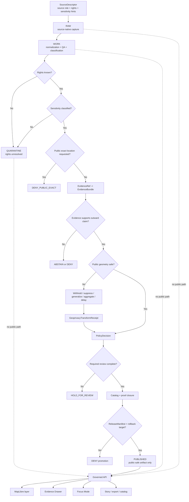

<!-- [KFM_META_BLOCK_V2]
doc_id: kfm://doc/NEEDS-VERIFICATION-ADR-ARCHAEOLOGY-LOCATION-SENSITIVITY
title: ADR: Archaeology Location Sensitivity
type: standard
version: v1
status: draft
owners: OWNER_TBD_NEEDS_VERIFICATION
created: 2026-05-08
updated: 2026-05-08
policy_label: NEEDS_VERIFICATION-public-or-restricted
related: [./README.md, ./ADR-TEMPLATE.md, ./ADR-0009-sensitive-location-policy.md, ../domains/archaeology/governance/SENSITIVITY_AND_RIGHTS.md, ../domains/archaeology/governance/VALIDATION_AND_POLICY.md, ../domains/archaeology/governance/CATALOG_AND_PROOF_OBJECTS.md, ../doctrine/lifecycle-law.md]
tags: [kfm, adr, archaeology, sensitive-location, geoprivacy, public-safe-geometry, evidence, policy, rollback]
notes: [Replaces the existing placeholder ADR for archaeology location sensitivity. doc_id, owners, policy_label, accepted status, executable policy enforcement, schema home, validator paths, CI coverage, steward-review protocol, source-rights workflow, and branch protection remain NEEDS VERIFICATION.]
[/KFM_META_BLOCK_V2] -->

<a id="top"></a>

# ADR: Archaeology Location Sensitivity

Decision record for keeping archaeology locations evidence-bound, policy-aware, public-safe, reviewable, correctable, and reversible.

<div align="left">


</div>

> [!IMPORTANT]
> **Decision posture:** KFM denies public and semi-public disclosure of exact or reconstructable archaeological locations by default. Public output may use only reviewed, evidence-backed, rights-compatible, policy-approved, public-safe forms such as withheld, suppressed, generalized, aggregated, delayed, or narrative-only location treatment.

<p align="center">
  <a href="#status-and-decision-card">Status</a> ·
  <a href="#decision">Decision</a> ·
  <a href="#scope">Scope</a> ·
  <a href="#repo-fit-and-directory-basis">Repo fit</a> ·
  <a href="#governed-flow">Flow</a> ·
  <a href="#release-posture">Release</a> ·
  <a href="#validation-and-denial-gates">Validation</a> ·
  <a href="#rollback-and-supersession">Rollback</a> ·
  <a href="#open-verification-items">Open verification</a>
</p>

---

## Status and decision card

| Field | Value |
|---|---|
| ADR path | `docs/adr/ADR-archaeology-location-sensitivity.md` |
| ADR state | `draft` |
| Decision state | `PROPOSED` until reviewed and accepted |
| Replaces | Existing placeholder text in this same file |
| Supersedes | `none` |
| Related cross-domain ADR | [`ADR-0009-sensitive-location-policy.md`](./ADR-0009-sensitive-location-policy.md) |
| Related archaeology governance | [`../domains/archaeology/governance/SENSITIVITY_AND_RIGHTS.md`](../domains/archaeology/governance/SENSITIVITY_AND_RIGHTS.md) |
| Decision confidence | `CONFIRMED doctrine / PROPOSED enforcement / NEEDS VERIFICATION runtime` |
| Default public exact-location outcome | `DENY_PUBLIC_EXACT` |
| Default unknown-rights outcome | `DENY` public release or `QUARANTINE` pending review |
| Default unknown-sensitivity outcome | `DENY` public release or `QUARANTINE` pending classification |
| Required public release support | `SourceDescriptor`, `EvidenceBundle`, rights posture, sensitivity classification, policy decision, review record where required, transform receipt where geometry changes, catalog/proof closure, release manifest, correction path, rollback target |
| Runtime outcomes | `ANSWER`, `ABSTAIN`, `DENY`, `ERROR` |
| Publication outcomes | `ALLOW_PUBLIC_SAFE`, `DENY_PUBLIC_EXACT`, `HOLD_FOR_REVIEW`, `WITHHOLD`, `QUARANTINE`, `WITHDRAW` |

### One-line decision

> Archaeology exact-location knowledge may be stored or analyzed only inside governed lifecycle states, and ordinary public-facing surfaces must receive public-safe representations unless a future accepted decision and release-specific review explicitly authorize narrower exposure.

### One-line boundary rule

> No public client, MapLibre layer, Evidence Drawer payload, Focus Mode answer, export, catalog distribution, graph projection, vector index, story node, screenshot, or generated summary may expose exact or reconstructable archaeological locations from `RAW`, `WORK`, `QUARANTINE`, restricted exact stores, source-native payloads, model runtime context, or unpublished candidates.

[Back to top](#top)

---

## Context

KFM is a governed, evidence-first, map-first, time-aware spatial knowledge and publication system. Archaeology creates one of KFM’s strongest sensitivity burdens because spatial precision can expose sites, burials, human remains, sacred places, culturally sensitive knowledge, private landowner information, access routes, collection-security details, or looting-prone resources.

This decision exists because archaeology locations are not ordinary map features. A point, centroid, tile coordinate, bounding box, route note, source URL, accession link, repeated timestamp, graph edge, search index field, or AI context fragment can all become a disclosure surface.

### Problem

The previous file at this path recorded only that “archaeology location sensitivity” needed a decision. That protected the topic from being lost, but it did not settle the operating rule, release posture, validation burden, rollback expectations, or relationship to the cross-domain sensitive-location policy.

### Architecture significance

This is architecture-significant because it affects:

- source intake and rights review;
- internal exact-geometry handling;
- public-safe geometry derivation;
- EvidenceBundle closure;
- MapLibre layer eligibility;
- Evidence Drawer and Focus Mode behavior;
- catalog/proof/release closure;
- correction, withdrawal, and rollback;
- domain-lane policy and validator requirements.

[Back to top](#top)

---

## Evidence basis

| Evidence item | Source / path / artifact | What it supports | Truth label |
|---|---|---|---|
| Existing placeholder ADR | `docs/adr/ADR-archaeology-location-sensitivity.md` | Confirms this target file already exists as a placeholder decision record | `CONFIRMED repo evidence` |
| ADR directory rules | [`./README.md`](./README.md), [`./ADR-TEMPLATE.md`](./ADR-TEMPLATE.md) | ADRs should preserve evidence, uncertainty, validation, rollback, and supersession; ADRs are not implementation proof | `CONFIRMED repo evidence` |
| Cross-domain sensitive-location policy | [`./ADR-0009-sensitive-location-policy.md`](./ADR-0009-sensitive-location-policy.md) | Default-deny exact sensitive locations, public-safe geometry, finite outcomes, transform receipts, validation gates | `CONFIRMED repo evidence / NEEDS VERIFICATION enforcement` |
| Archaeology sensitivity and rights doc | [`../domains/archaeology/governance/SENSITIVITY_AND_RIGHTS.md`](../domains/archaeology/governance/SENSITIVITY_AND_RIGHTS.md) | Archaeology-specific rights, sensitivity, public geometry, steward review, and release-control rules | `CONFIRMED repo evidence / NEEDS VERIFICATION enforcement` |
| KFM lifecycle doctrine | [`../doctrine/lifecycle-law.md`](../doctrine/lifecycle-law.md) | KFM truth path and public-client boundary | `RELATED / NEEDS VERIFICATION content recheck before acceptance` |
| Directory Rules | Supplied KFM directory-governance doctrine | Confirms `docs/adr/` is the human-facing decision home and domain files should live under responsibility roots, not root-level domain folders | `CONFIRMED supplied doctrine` |
| Archaeology architecture plan | Supplied archaeology PDF architecture plan | Supports default denial of exact archaeological locations, public generalized/suppressed geometry, transform receipts, policy files, validators, and denial rules | `LINEAGE / PROPOSED implementation` |
| Build companion and pipeline manuals | Supplied KFM build and pipeline doctrine | Supports deny-by-default sensitive exact locations, redaction/geoprivacy receipts, no-network fixtures first, and evidence-bound release sequencing | `CONFIRMED doctrine / PROPOSED mechanics` |

> [!CAUTION]
> This ADR does not prove that executable policies, schemas, validators, CI checks, release manifests, proof packs, API middleware, MapLibre filters, Evidence Drawer payload checks, or Focus Mode denials are already enforced. Those remain `NEEDS VERIFICATION` until direct repo evidence, tests, workflows, artifacts, or runtime traces prove them.

[Back to top](#top)

---

## Decision

### Chosen option

Adopt a **default-deny exact-location rule** for archaeology and require public-safe derivation, review, evidence closure, catalog/proof closure, correction path, and rollback target before publication.

### Operating rule

KFM must treat exact or reconstructable archaeology locations as restricted by default. Public and semi-public outputs must use the safest allowed outward representation:

| Outward representation | Meaning | Public eligibility |
|---|---|---|
| `withheld` | No public geometry emitted | Allowed when release explains why without leaking detail |
| `suppressed` | Feature omitted from public artifact | Allowed with policy reason and correction path |
| `generalized` | Geometry coarsened to approved public geography | Allowed only with transform receipt and review where required |
| `aggregated` | Output grouped to safe region, grid, density, or threshold | Allowed only after reconstruction-risk check |
| `delayed` | Exposure embargoed or time-shifted | Allowed only with release-time validation |
| `public_safe_narrative` | Textual explanation without coordinates or access clues | Allowed when evidence-backed and citation-safe |
| `public_exact_allowed` | Exact public geometry | `DENY` by default; requires future accepted ADR or explicitly reviewed release exception |
| `no_public_release` | No public geometry or narrative location | Required when risk cannot be safely reduced |

### Rationale

This option best preserves KFM’s core invariants:

- evidence outranks fluent narrative;
- public clients use governed interfaces and released artifacts;
- sensitive location exposure fails closed;
- derived layers remain downstream of evidence, policy, review, and release;
- corrections and rollback remain possible after publication;
- AI and map surfaces remain interpretive and bounded, not authority sources.

### Options considered

| Option | Description | Benefits | Risks / costs | Outcome |
|---|---|---|---|---|
| Publish exact locations when a source is public | Treat public upstream availability as enough for KFM public release | Simple; low implementation burden | Confuses upstream availability with KFM redistribution/publication safety; creates looting, cultural, landowner, and collection-security risks | `REJECTED` |
| Hide exact locations only in UI | Keep exact data in payloads and rely on client filters or map styling | Easy to implement initially | Breaks trust membrane; exports, logs, screenshots, search, graph, AI, and dev tools can still leak details | `REJECTED` |
| Never store exact archaeology locations anywhere | Refuse exact geometry even internally | Strong safety posture | Blocks legitimate restricted stewardship, review, validation, correction, and audit workflows | `REJECTED AS GLOBAL RULE` |
| Store exact geometry only in governed restricted lifecycle states; publish public-safe derivatives only | Separate internal restricted support from public release forms | Preserves audit/review while protecting public surfaces | Requires more schemas, policies, validators, transform receipts, review records, and rollback discipline | `ACCEPTED / PROPOSED` |

[Back to top](#top)

---

## Scope

### Accepted inputs

This ADR governs archaeology material that contains, implies, narrows, or reconstructs location.

| Input | Handling requirement |
|---|---|
| Exact archaeological site coordinates | Restricted by default; public exact release denied |
| Burial, human-remains, sacred-place, or culturally sensitive location | Withhold, suppress, or review-gated public-safe representation only |
| Private landowner, parcel, access route, or permission detail | Redact, generalize, or withhold before public release |
| Collection, accession, storage, or repository-security detail | Keep restricted unless explicitly reviewed for public-safe release |
| LiDAR, aerial, satellite, geophysical, model, or anomaly-derived candidate | Label as candidate only; never publish as confirmed site without evidence and review |
| Historical map, report, oral history, field survey, excavation, or collection record | Preserve source role, rights, sensitivity, and evidence limits |
| Public-facing claim about archaeology place, chronology, affiliation, or interpretation | Requires EvidenceBundle support and source-role fit |
| Map layer, story, export, search, graph, vector, AI, or Evidence Drawer payload | Must be public-safe, release-bound, field-allowlisted, and no-leak validated |

### Exclusions

| Excluded material | Why it does not belong in this ADR | Correct home |
|---|---|---|
| Real sensitive coordinates | A public ADR must not become a leak vector | Restricted governed data store |
| Source-native archaeological payloads | ADRs are not data storage | `data/raw/archaeology/` or repo-confirmed equivalent |
| Working transforms and QA output | ADRs are not WORK lifecycle storage | `data/work/archaeology/` or repo-confirmed equivalent |
| Rights-unknown or unsafe candidate records | ADRs are not quarantine storage | `data/quarantine/archaeology/` or repo-confirmed equivalent |
| Executable policy rules | Prose cannot enforce gates | `policy/` under repo-confirmed policy convention |
| JSON Schema or machine contracts | Machine validation belongs under schema authority | `schemas/` under repo-confirmed schema convention |
| Semantic object contracts | Meaning belongs in contract docs | `contracts/` under repo-confirmed contract convention |
| Receipts, proofs, release manifests, rollback cards | Emitted trust objects must remain separate | `data/receipts/`, `data/proofs/`, `release/`, or repo-confirmed equivalents |
| AI prompts or private chain-of-thought | AI is interpretive and evidence-subordinate | Runtime envelopes, receipts, and public-safe summaries only |

[Back to top](#top)

---

## Repo fit and Directory basis

This file stays in `docs/adr/` because it records a human-facing architecture decision. It must point to executable or machine-readable homes without becoming those homes.

| Surface | Candidate path | Role | Status |
|---|---|---|---|
| This ADR | `docs/adr/ADR-archaeology-location-sensitivity.md` | Decision record | `CONFIRMED target path` |
| Cross-domain sensitive-location policy | `docs/adr/ADR-0009-sensitive-location-policy.md` | Shared sensitive-location posture | `CONFIRMED repo path` |
| Archaeology sensitivity governance | `docs/domains/archaeology/governance/SENSITIVITY_AND_RIGHTS.md` | Domain application of this decision | `CONFIRMED repo path` |
| Archaeology validation governance | `docs/domains/archaeology/governance/VALIDATION_AND_POLICY.md` | Domain validation and policy explanation | `RELATED / NEEDS VERIFICATION content` |
| Archaeology catalog/proof governance | `docs/domains/archaeology/governance/CATALOG_AND_PROOF_OBJECTS.md` | Catalog, proof, release closure | `RELATED / NEEDS VERIFICATION content` |
| Executable sensitivity policy | `policy/bundles/sensitivity/` and/or `policy/domains/archaeology/` | Machine policy | `PROPOSED / NEEDS VERIFICATION; do not allow parallel drift` |
| Archaeology machine schemas | `schemas/contracts/v1/domains/archaeology/` | Machine shape for sensitivity, transform receipt, release, DTO, drawer, focus payloads | `PROPOSED / NEEDS VERIFICATION` |
| Archaeology semantic contracts | `contracts/domains/archaeology/` | Human-readable object meaning | `PROPOSED / NEEDS VERIFICATION` |
| Archaeology fixtures | `fixtures/domains/archaeology/` | Valid/invalid public-safe and denial examples | `PROPOSED / NEEDS VERIFICATION` |
| Archaeology tests | `tests/domains/archaeology/`, `tests/policy/`, `tests/e2e/` | Verification, negative paths, release/correction drills | `PROPOSED / NEEDS VERIFICATION` |
| Archaeology validators | `tools/validators/archaeology/` | No-leak, transform, EvidenceBundle, release, catalog, Focus, drawer checks | `PROPOSED / NEEDS VERIFICATION` |
| Archaeology data lifecycle | `data/raw/archaeology/`, `data/work/archaeology/`, `data/quarantine/archaeology/`, `data/processed/archaeology/`, `data/published/archaeology/` | Lifecycle data states | `PROPOSED / NEEDS VERIFICATION` |
| Receipts and proofs | `data/receipts/archaeology/`, `data/proofs/archaeology/` | Process memory and release-support proof | `PROPOSED / NEEDS VERIFICATION` |
| Release records | `release/archaeology/` or repo-equivalent release lane | Release manifests and rollback cards | `PROPOSED / NEEDS VERIFICATION` |

> [!WARNING]
> Do not create a root-level `archaeology/` folder. Archaeology is a domain lane; its files belong under responsibility roots such as `docs/`, `schemas/`, `contracts/`, `policy/`, `tests/`, `fixtures/`, `tools/`, `pipelines/`, `data/`, and `release/`.

[Back to top](#top)

---

## Release posture

### Classification matrix

| Classification | Public exact geometry | Public-safe geometry | Public narrative | Required support | Default outcome |
|---|---:|---:|---:|---|---|
| `public_safe_context` | No, unless explicitly reviewed | Yes | Yes | EvidenceBundle + source role + release manifest | `ALLOW_PUBLIC_SAFE` |
| `sensitive_location` | No | Possibly | Possibly | Sensitivity classification + transform receipt + review where required | `DENY_PUBLIC_EXACT` |
| `burial_or_human_remains` | No | Rare; only reviewed generalized/suppressed form | Possibly | Steward/cultural/legal/domain review + release proof | `DENY_PUBLIC_EXACT` |
| `sacred_or_cultural_sensitivity` | No | Only with steward-approved outward form | Possibly | Steward/cultural/community review | `HOLD_FOR_REVIEW` or `DENY` |
| `private_landowner_or_access_risk` | No | Only after redaction/generalization | Possibly | Rights/privacy review + transform receipt | `DENY_PUBLIC_EXACT` |
| `collection_security_risk` | No | Usually no | Limited | Collection/security review | `WITHHOLD` |
| `candidate_feature` | No confirmed-site geometry | Possibly as generalized candidate context | Yes, if clearly candidate-only | Candidate label + review state + evidence limits | `ABSTAIN` or `DENY` if treated as confirmed |
| `unknown_rights` | No | No | No | Rights review | `QUARANTINE` or `DENY` |
| `unknown_sensitivity` | No | No | No | Sensitivity classification | `QUARANTINE` or `DENY` |
| `policy_denied` | No | No | No | Correction or policy change | `DENY` |
| `withdrawn_or_incident` | No | No until rebuilt and reviewed | Correction notice only | Incident review + rollback | `WITHDRAW` |

### Release closure chain

Before public or semi-public release, the candidate must show the closure chain below or be denied, quarantined, or held for review.

```text
SourceDescriptor
  -> EvidenceBundle
  -> RightsAssessment or equivalent rights posture
  -> SensitivityClassification
  -> PolicyDecision
  -> ReviewRecord when required
  -> GeoprivacyTransformReceipt when geometry changes
  -> ValidationReport
  -> Catalog / Proof closure
  -> ReleaseManifest
  -> CorrectionNotice path
  -> RollbackCard
```

[Back to top](#top)

---

## Governed flow



[Back to top](#top)

---

## Policy, rights, and sensitivity requirements

### Mandatory fail-closed rules

| Condition | Required outcome | Typical obligation |
|---|---|---|
| Unknown rights | `DENY` public release or `QUARANTINE` | `require_rights_review` |
| Unknown sensitivity | `DENY` public release or `QUARANTINE` | `classify_sensitivity` |
| Exact archaeology point requested for public output | `DENY_PUBLIC_EXACT` | `withhold_geometry` |
| Burial, human remains, sacred, or culturally sensitive exact location requested | `DENY_PUBLIC_EXACT` | `require_steward_review` |
| Private landowner, parcel, access route, or collection-security detail in public payload | `DENY` | `redact_or_withhold` |
| Candidate feature promoted as confirmed site | `DENY` | `preserve_candidate_status` |
| EvidenceRef unresolved | `ABSTAIN` or `DENY` | `resolve_evidence_bundle` |
| Source role cannot support claim | `ABSTAIN` or `DENY` | `require_source_role_review` |
| Transform receipt missing for public-safe geometry | `DENY` release | `emit_transform_receipt` |
| Catalog/proof closure mismatch | `DENY` promotion or `ERROR` | `repair_catalog_closure` |
| Release lacks rollback target | `DENY` promotion | `create_rollback_card` |
| AI or Focus Mode attempts coordinate disclosure | `DENY` | `log_policy_reason` |

### Starter reason codes

| Code | Meaning |
|---|---|
| `archaeology.exact_location_denied` | Exact archaeology location is not public-safe |
| `archaeology.burial_or_human_remains` | Burial or human-remains sensitivity blocks exposure |
| `archaeology.sacred_or_cultural_sensitivity` | Sacred, cultural, community, or steward-controlled sensitivity requires withholding or review |
| `archaeology.private_land_access_risk` | Public output could expose private land, parcel, or access detail |
| `archaeology.collection_security_risk` | Public output could expose collection, accession, storage, or repository-sensitive details |
| `archaeology.looting_risk` | Public output increases site misuse risk |
| `candidate_feature.not_confirmed_site` | Candidate feature is being treated as confirmed without support |
| `rights.unknown` | Rights or redistribution posture is unresolved |
| `source_role.inadequate` | Source role cannot support requested claim |
| `evidence.bundle_missing` | EvidenceRef cannot resolve to EvidenceBundle |
| `redaction.receipt_missing` | Public-safe transform lacks receipt |
| `release.rollback_missing` | Release candidate lacks rollback target |
| `ai.coordinate_disclosure_denied` | AI or Focus attempted to disclose or reconstruct restricted location |

### Starter obligation codes

| Code | Required action |
|---|---|
| `withhold_geometry` | Emit no public geometry |
| `suppress_feature` | Omit sensitive feature from public output |
| `generalize_geometry` | Reduce precision to approved public-safe geography |
| `aggregate_output` | Publish only grouped or thresholded output |
| `delay_release` | Apply embargo or delayed exposure |
| `emit_transform_receipt` | Record restricted-to-public-safe transformation |
| `require_rights_review` | Resolve rights before release |
| `require_steward_review` | Route to steward, cultural, domain, landowner, collection, or policy reviewer |
| `resolve_evidence_bundle` | Resolve EvidenceRef before outward claim exposure |
| `field_allowlist` | Emit only approved public fields |
| `record_policy_decision` | Store finite policy outcome and reason codes |
| `publish_correction_notice` | Issue visible correction, withdrawal, or supersession |
| `execute_rollback_card` | Disable, withdraw, or restore affected release artifacts |

> [!NOTE]
> Canonical reason-code and obligation-code registry homes remain `NEEDS VERIFICATION`. Use these starter codes only until repo-wide code registries or policy schemas settle names.

[Back to top](#top)

---

## Public-surface rules

| Surface | Allowed only when | Must not expose |
|---|---|---|
| Governed API | Payload is release-bound, public-safe, field-allowlisted, and finite-outcome wrapped | RAW/WORK/QUARANTINE refs, restricted geometry, hidden source IDs, internal store refs |
| MapLibre layer | Layer manifest points only to released public-safe assets or governed endpoints | Exact protected coordinates, unreviewed high-zoom detail, client-only filtering of restricted records |
| Evidence Drawer | Drawer payload cites public-safe evidence and explains withheld/generalized status | Restricted source rows, exact coordinates, access routes, collection-security details |
| Focus Mode | Context is released, public-safe, citation-validated, and policy-checked | Coordinate recovery, access-path disclosure, unsupported sensitive claims |
| Story / dossier | Narrative is release-bound and evidence-backed | Screenshots or prose that reveal restricted precision |
| Export / share | Export manifest preserves trust metadata and audience scope | Trust-stripped CSV/GeoJSON/tiles/screenshots that widen access or precision |
| Catalog / discovery | Catalog record is public-safe and rights-compatible | Restricted geometry, sensitive source URLs, reconstruction clues |
| Graph / search / vector projection | Projection is derivative, field-allowlisted, and no-leak checked | Restricted geometry, source-native coordinates, private/steward keys, path-to-exact-location clues |

[Back to top](#top)

---

## Validation and denial gates

### Required gates

| Gate | Must prove | Failure outcome |
|---|---|---|
| Source registry gate | Source identity, source role, rights posture, access class, and sensitivity hints are recorded | `DENY` or `QUARANTINE` |
| Rights gate | Public or restricted release rights are known and compatible with the target audience | `DENY` |
| Sensitivity gate | Record, field, dataset, layer, catalog, DTO, and export sensitivity are classified | `DENY` |
| Geometry gate | Public artifacts contain no restricted exact geometry or reconstruction proxy | `DENY` |
| Transform receipt gate | Every public-safe transformed geometry has a receipt | `DENY` |
| Review gate | Required steward, cultural, domain, rights, policy, or safety review exists | `HOLD_FOR_REVIEW` or `DENY` |
| Evidence gate | EvidenceRefs resolve to EvidenceBundles with source role, scope, sensitivity, and citation context | `ABSTAIN` or `DENY` |
| Catalog/proof gate | Catalog, proof, release, and evidence references close | `DENY` or `ERROR` |
| Public DTO gate | API, UI, drawer, focus, story, export, search, graph, and vector payloads are field-allowlisted | `DENY` |
| Runtime envelope gate | Outward answer uses finite outcome and visible reason/obligation codes | `ERROR` or `DENY` |
| Rollback gate | Release has correction path and rollback target | `DENY promotion` |

### Minimum negative-path fixtures

| Fixture | Expected result |
|---|---|
| Public exact archaeological site geometry | `DENY` |
| Public burial or human-remains exact geometry | `DENY` |
| Public sacred or culturally sensitive exact location | `DENY` |
| Public DTO contains restricted coordinate field | `DENY` |
| Public payload references `RAW`, `WORK`, `QUARANTINE`, restricted store, vector index, graph internal, or model runtime | `DENY` |
| Unknown rights with publication requested | `DENY` or `QUARANTINE` |
| Unknown sensitivity with publication requested | `DENY` or `QUARANTINE` |
| Generalized geometry lacks transform receipt | `DENY` |
| Candidate anomaly published as confirmed site | `DENY` |
| Cultural affiliation claim lacks evidence and review | `ABSTAIN` or `DENY` |
| AI answer lacks EvidenceBundle or citation validation | `DENY` |
| Catalog closure mismatch | `DENY` or `ERROR` |
| Release candidate lacks rollback target | `DENY promotion` |

### Proposed validation commands

> [!WARNING]
> Commands below are `PROPOSED / NEEDS VERIFICATION`. Adapt them to the active repo’s actual test runner, validator paths, policy engine, and CI conventions.

```bash
# Documentation structure check, if the docs validator exists.
python tools/docs/check_doc_structure.py docs/adr/ADR-archaeology-location-sensitivity.md

# Policy bundle checks, if OPA/Conftest and archaeology policies exist.
opa check --strict policy
opa test policy -v

# Domain validation tests, if archaeology fixtures/tests exist.
pytest tests/domains/archaeology tests/policy tests/e2e -q

# Release candidate no-leak check, if a validator exists.
python tools/validators/archaeology/validate_no_raw_public_refs.py \
  --candidate data/published/archaeology/NEEDS_VERIFICATION
```

[Back to top](#top)

---

## Impact map

| Area | Required update | Status |
|---|---|---|
| `docs/adr/README.md` | Add or confirm this ADR entry, status, and relation to ADR-0009 | `PROPOSED / NEEDS VERIFICATION` |
| `docs/adr/ADR-0009-sensitive-location-policy.md` | Cross-link this archaeology-specific decision if not already linked | `PROPOSED / NEEDS VERIFICATION` |
| `docs/domains/archaeology/governance/SENSITIVITY_AND_RIGHTS.md` | Ensure this ADR is linked as the location-sensitivity decision | `PROPOSED / NEEDS VERIFICATION` |
| `docs/domains/archaeology/governance/VALIDATION_AND_POLICY.md` | Align denial rules, reason codes, obligations, and negative-path fixtures | `PROPOSED / NEEDS VERIFICATION` |
| `docs/domains/archaeology/governance/CATALOG_AND_PROOF_OBJECTS.md` | Confirm release closure and public-safe catalog rules | `PROPOSED / NEEDS VERIFICATION` |
| `contracts/` | Add or update archaeology semantic contracts only after contract-home check | `PROPOSED / NEEDS VERIFICATION` |
| `schemas/` | Add or update sensitivity, transform receipt, drawer, focus, release, and DTO schemas only after schema-home check | `PROPOSED / NEEDS VERIFICATION` |
| `policy/` | Implement default-deny exact-location rules and tests without parallel policy drift | `PROPOSED / NEEDS VERIFICATION` |
| `fixtures/` | Add valid public-safe and invalid exact-location fixtures | `PROPOSED / NEEDS VERIFICATION` |
| `tests/` | Add negative-path policy/domain/e2e tests | `PROPOSED / NEEDS VERIFICATION` |
| `tools/validators/` | Add no-leak, transform, release, catalog, drawer, and Focus validators | `PROPOSED / NEEDS VERIFICATION` |
| `data/registry/` | Confirm source-role, rights, sensitivity, and activation-state registry entries | `PROPOSED / NEEDS VERIFICATION` |
| `data/receipts/` | Record transform/redaction/geoprivacy receipts | `PROPOSED / NEEDS VERIFICATION` |
| `data/proofs/` | Preserve release-support proof packs, EvidenceBundles, and review records | `PROPOSED / NEEDS VERIFICATION` |
| `release/` | Require release manifest, correction path, and rollback card | `PROPOSED / NEEDS VERIFICATION` |
| `apps/` / `packages/` | Ensure governed API, MapLibre, Evidence Drawer, review console, and Focus Mode receive only public-safe released payloads | `PROPOSED / NEEDS VERIFICATION` |
| `.github/workflows/` | Add CI gates only after workflow conventions are inspected | `PROPOSED / NEEDS VERIFICATION` |

[Back to top](#top)

---

## Rollback and supersession

### Rollback plan

If a published artifact, catalog record, API response, layer, story, export, drawer payload, Focus answer, graph projection, search index, vector index, screenshot, or document exposes exact or reconstructable archaeology location detail:

1. disable the affected public route, layer, export, alias, story, catalog distribution, or generated response path;
2. preserve the release manifest, offending artifact digest, policy decision, validation report, and reviewer state;
3. issue or prepare a `CorrectionNotice` or withdrawal note;
4. execute the release’s `RollbackCard` or create one before further publication;
5. rebuild the artifact from safe inputs with withholding, suppression, generalization, aggregation, delay, or narrative-only output;
6. rerun no-leak, EvidenceBundle, catalog/proof, and release validation;
7. record the successor release and link it to the withdrawn release.

### Rollback triggers

| Trigger | Required action |
|---|---|
| Exact location leak | Disable public surface, withdraw artifact, issue correction, rebuild public-safe output |
| Rights terms change | Hold or withdraw release; rerun rights review |
| Steward review changes | Hold, withdraw, or supersede affected output |
| Transform receipt invalid or missing | Block or withdraw release until receipt is repaired |
| Catalog/proof closure mismatch | Block promotion or withdraw release alias |
| API/UI/AI route bypasses governed boundary | Disable route or feature flag; open security/policy review |
| Candidate feature published as confirmed | Correct claim, withdraw or relabel output, update evidence state |
| Missing rollback target discovered | Block release until rollback target exists |

### Supersession rule

A future ADR may supersede this decision only if it:

- names the successor ADR in this file and the ADR index;
- preserves this ADR as lineage;
- cites stronger repo evidence, policy evidence, source rights, steward review, or implementation proof;
- explains compatibility with ADR-0009 and archaeology sensitivity governance;
- updates affected schemas, contracts, policies, fixtures, validators, runbooks, release records, correction paths, and rollback records.

[Back to top](#top)

---

## Consequences

### Positive consequences

- Archaeology exact-location posture is no longer only a placeholder.
- Public map and AI surfaces receive a clear default-deny boundary.
- Public-safe geometry requires receipts and review rather than informal “masking.”
- Candidate anomalies remain distinct from confirmed sites.
- KFM can preserve restricted evidence internally while preventing ordinary public exposure.
- Rollback, correction, and supersession are part of the decision from the start.

### Tradeoffs and risks

| Risk | Mitigation | Residual status |
|---|---|---|
| Public products may be less visually precise | Use public-safe narratives, generalized geometry, aggregation, and Evidence Drawer explanations | `ACCEPTED TRADEOFF` |
| Review burden increases | Use clear reason/obligation codes, fixtures, and review cards | `PROPOSED` |
| Schema/policy homes may conflict | Verify active repo conventions and avoid parallel homes | `NEEDS VERIFICATION` |
| “Generalized” outputs can still leak | Require reconstruction-risk checks and transform receipts | `NEEDS VERIFICATION` |
| Public users may misread withheld locations as missing evidence | UI must show withheld/generalized/restricted state without leaking details | `PROPOSED` |
| Legal/steward obligations may vary by source | Require source-by-source rights and review records | `NEEDS VERIFICATION` |

[Back to top](#top)

---

## Open verification items

| Item | Why it matters | Required verification |
|---|---|---|
| ADR owner and reviewer | Acceptance needs accountable stewardship | Verify CODEOWNERS or governance register |
| `doc_id` | KFM docs require stable identifiers | Resolve through document registry |
| Policy label | Subject matter may be public doc with restricted implications | Confirm with policy steward |
| ADR acceptance status | Draft decision is not enforcement | Review and mark accepted/rejected/superseded |
| Schema home | Avoid `schemas/contracts/v1/archaeology` vs `schemas/contracts/v1/domains/archaeology` drift | Inspect active schema convention and ADR-0001 |
| Policy home | Avoid `policy/archaeology`, `policy/domains/archaeology`, and `policy/bundles/sensitivity` drift | Inspect policy tree and policy-home ADR |
| Fixture/test home | Avoid split fixture authority | Inspect `tests/`, `fixtures/`, and CI conventions |
| Executable enforcement | ADR does not enforce policy | Verify Rego/policy bundles, validators, tests, CI, and runtime behavior |
| Steward-review protocol | Archaeology review cannot be guessed | Identify reviewer roles, review records, and escalation path |
| Source rights and terms | Rights can block public release | Verify source descriptors and rights assessment workflow |
| Public geometry thresholds | “Generalized” must be safe, not decorative | Define and test approved precision classes |
| EvidenceBundle resolver | Claims require evidence closure | Verify resolver implementation and fixtures |
| Catalog/proof/release closure | Publication requires inspectable support | Verify emitted catalog/proof/release examples |
| MapLibre / Evidence Drawer / Focus behavior | Public surfaces must reflect policy | Verify payload schemas, UI fixtures, and runtime tests |
| Rollback drill | Rollback cannot be theoretical | Verify correction and rollback test or dry run |
| Branch protection and CI gates | Merge-blocking enforcement may live outside files | Verify GitHub settings or workflow enforcement evidence |

[Back to top](#top)

---

## Review checklist

<details>
<summary>Pre-merge checklist</summary>

- [ ] Meta block placeholders are resolved or deliberately marked `NEEDS VERIFICATION`.
- [ ] ADR index links this decision.
- [ ] ADR-0009 relationship is clear.
- [ ] Archaeology sensitivity governance links this ADR.
- [ ] No exact real archaeology coordinates appear in this file.
- [ ] The decision does not imply executable enforcement already exists.
- [ ] Directory Rules placement is respected.
- [ ] No root-level `archaeology/` folder is proposed.
- [ ] Schema and policy homes are not duplicated without ADR or migration notes.
- [ ] Public exact location default is `DENY`.
- [ ] Unknown rights and unknown sensitivity fail closed.
- [ ] Candidate features stay distinct from confirmed sites.
- [ ] Public-safe geometry requires transform receipts.
- [ ] EvidenceRef-to-EvidenceBundle closure is required for consequential claims.
- [ ] Public DTO, MapLibre, Evidence Drawer, Focus, story, export, catalog, graph, search, and vector surfaces are covered.
- [ ] Negative-path fixtures are listed.
- [ ] Rollback and correction path are defined.
- [ ] Open verification items are not hidden by confident wording.

</details>

[Back to top](#top)
