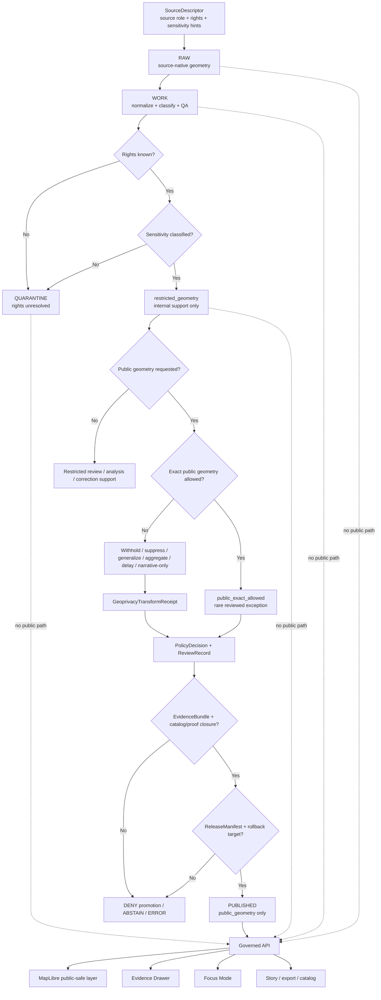

<!-- [KFM_META_BLOCK_V2]
doc_id: kfm://doc/NEEDS-VERIFICATION-ADR-ARCHAEOLOGY-PUBLIC-VS-RESTRICTED-GEOMETRY
title: ADR: Archaeology Public vs Restricted Geometry
type: standard
version: v1
status: draft
owners: OWNER_TBD_NEEDS_VERIFICATION
created: 2026-05-08
updated: 2026-05-08
policy_label: NEEDS_VERIFICATION-public-or-restricted
related: [./README.md, ./ADR-TEMPLATE.md, ./ADR-0009-sensitive-location-policy.md, ./ADR-archaeology-location-sensitivity.md, ./ADR-archaeology-source-role-separation.md, ../domains/archaeology/governance/SENSITIVITY_AND_RIGHTS.md, ../domains/archaeology/governance/VALIDATION_AND_POLICY.md, ../domains/archaeology/governance/CATALOG_AND_PROOF_OBJECTS.md, ../domains/archaeology/architecture/API_AND_UI_SURFACES.md, ../doctrine/lifecycle-law.md, ../security/public-surface-boundary.md, ../runbooks/publication.md]
tags: [kfm, adr, archaeology, geometry, restricted-geometry, public-safe-geometry, geoprivacy, evidence, policy, rollback]
notes: [Replaces the placeholder ADR for archaeology public vs restricted geometry. doc_id, owners, policy_label, accepted status, executable enforcement, schema home, validator paths, CI coverage, steward-review protocol, source-rights workflow, and branch protection remain NEEDS VERIFICATION.]
[/KFM_META_BLOCK_V2] -->

<a id="top"></a>

# ADR: Archaeology Public vs Restricted Geometry

Decision record for separating restricted archaeology geometry from public-safe released geometry across KFM data, APIs, maps, exports, Evidence Drawer payloads, and Focus Mode answers.

<div align="left">


</div>

> [!IMPORTANT]
> **Decision posture:** KFM must keep archaeology restricted geometry and public-safe geometry as separate governed representations. Restricted geometry may support evidence, review, stewardship, validation, and rollback inside governed lifecycle states. Public and semi-public surfaces may receive only released public-safe geometry or a safe withheld/suppressed/narrative representation.

<p align="center">
  <a href="#status-and-decision-card">Status</a> ·
  <a href="#decision">Decision</a> ·
  <a href="#scope">Scope</a> ·
  <a href="#repo-fit-and-directory-basis">Repo fit</a> ·
  <a href="#geometry-model">Geometry model</a> ·
  <a href="#governed-flow">Flow</a> ·
  <a href="#validation-and-denial-gates">Validation</a> ·
  <a href="#rollback-and-supersession">Rollback</a> ·
  <a href="#open-verification-items">Open verification</a>
</p>

---

## Status and decision card

| Field | Value |
|---|---|
| ADR path | `docs/adr/ADR-archaeology-public-vs-restricted-geometry.md` |
| ADR state | `draft` |
| Decision state | `PROPOSED` until reviewed and accepted |
| Replaces | Placeholder text in this same file |
| Supersedes | `none` |
| Related sensitive-location ADR | [`ADR-0009-sensitive-location-policy.md`](./ADR-0009-sensitive-location-policy.md) |
| Related archaeology location ADR | [`ADR-archaeology-location-sensitivity.md`](./ADR-archaeology-location-sensitivity.md) |
| Related source-role ADR | [`ADR-archaeology-source-role-separation.md`](./ADR-archaeology-source-role-separation.md) |
| Related domain governance | [`../domains/archaeology/governance/SENSITIVITY_AND_RIGHTS.md`](../domains/archaeology/governance/SENSITIVITY_AND_RIGHTS.md), [`../domains/archaeology/governance/VALIDATION_AND_POLICY.md`](../domains/archaeology/governance/VALIDATION_AND_POLICY.md) |
| Decision confidence | `CONFIRMED doctrine / PROPOSED enforcement / NEEDS VERIFICATION runtime` |
| Default public exact-geometry outcome | `DENY_PUBLIC_EXACT` |
| Default restricted-geometry audience | `internal`, `steward`, `review`, or other role-gated audience only |
| Required public geometry support | `SourceDescriptor`, `EvidenceBundle`, rights posture, sensitivity classification, policy decision, review record where required, transform receipt when geometry changes, validation report, catalog/proof closure, release manifest, correction path, rollback target |
| Runtime outcomes | `ANSWER`, `ABSTAIN`, `DENY`, `ERROR` |
| Publication outcomes | `ALLOW_PUBLIC_SAFE`, `DENY_PUBLIC_EXACT`, `HOLD_FOR_REVIEW`, `WITHHOLD`, `SUPPRESS`, `QUARANTINE`, `WITHDRAW` |

### One-line decision

> KFM archaeology uses a dual-channel geometry model: restricted geometry is evidence support inside governed lifecycle states, while public geometry is a released derivative or safe non-disclosure representation.

### One-line boundary rule

> No public client, MapLibre layer, Evidence Drawer payload, Focus Mode answer, export, catalog distribution, search index, graph projection, vector index, story node, screenshot, or generated summary may receive restricted archaeology geometry or fields that reconstruct it.

[Back to top](#top)

---

## Context

KFM is a governed, evidence-first, map-first, time-aware spatial knowledge and publication system. Archaeology creates a high sensitivity burden because precise location can expose sites, burials, human remains, sacred places, culturally sensitive knowledge, private landowner information, access routes, collection-security details, or looting-prone resources.

The existing placeholder ADR recorded that the “archaeology public vs restricted geometry” decision needed coverage. That placeholder protected the topic from being lost, but it did not settle the geometry model, outward release profile, validator burden, or rollback expectations.

### Problem

A single archaeology geometry field is not safe enough for KFM. It creates several failure modes:

- public artifacts can accidentally carry restricted points, centroids, polygons, bounding boxes, tile coordinates, or source-native XY fields;
- UI-only filters can hide geometry visually while still leaking it through payloads, dev tools, exports, logs, screenshots, graph edges, vector indexes, or AI context;
- generalized public geometry can be mistaken for exact evidence support;
- exact restricted geometry can be overwritten or lost when public-safe derivatives are created;
- rollback becomes unclear when release artifacts, source evidence, and public geometry are not separately tracked.

### Architecture significance

This decision affects:

- archaeology source intake and geometry classification;
- restricted exact-geometry handling;
- public-safe geometry derivation;
- geoprivacy transform receipts;
- EvidenceBundle closure;
- MapLibre layer eligibility;
- Evidence Drawer and Focus Mode payloads;
- catalog/proof/release closure;
- correction, withdrawal, and rollback;
- archaeology policy, fixtures, validators, and schema contracts.

[Back to top](#top)

---

## Evidence basis

| Evidence item | Source / path / artifact | What it supports | Truth label |
|---|---|---|---|
| Prior placeholder ADR | `docs/adr/ADR-archaeology-public-vs-restricted-geometry.md` | Confirms this target file existed as a placeholder decision record before replacement | `CONFIRMED repo evidence` |
| ADR directory and template | [`./README.md`](./README.md), [`./ADR-TEMPLATE.md`](./ADR-TEMPLATE.md) | ADRs should preserve evidence, uncertainty, validation, rollback, supersession, and avoid claiming implementation proof without repo evidence | `CONFIRMED repo evidence` |
| Cross-domain sensitive-location policy | [`./ADR-0009-sensitive-location-policy.md`](./ADR-0009-sensitive-location-policy.md) | Sensitive locations default to deny exact public exposure; public release requires evidence, rights, sensitivity, review, policy, release, correction, and rollback support | `CONFIRMED repo evidence / NEEDS VERIFICATION enforcement` |
| Archaeology location-sensitivity ADR | [`./ADR-archaeology-location-sensitivity.md`](./ADR-archaeology-location-sensitivity.md) | Archaeology exact locations are denied publicly by default and public-safe forms require transform receipts and review where needed | `CONFIRMED repo evidence / NEEDS VERIFICATION enforcement` |
| Archaeology sensitivity and rights governance | [`../domains/archaeology/governance/SENSITIVITY_AND_RIGHTS.md`](../domains/archaeology/governance/SENSITIVITY_AND_RIGHTS.md) | Unknown rights, unknown sensitivity, exact site geometry, missing EvidenceBundle support, missing transform proof, and missing rollback target block public release | `CONFIRMED repo evidence / NEEDS VERIFICATION enforcement` |
| Archaeology validation and policy governance | [`../domains/archaeology/governance/VALIDATION_AND_POLICY.md`](../domains/archaeology/governance/VALIDATION_AND_POLICY.md) | Archaeology validation gates include source descriptor, schema, rights, sensitivity, evidence, citation, candidate-feature, transform receipt, catalog/proof, public DTO, review, promotion, and rollback checks | `CONFIRMED repo evidence / NEEDS VERIFICATION enforcement` |
| Directory Rules | Supplied KFM directory-governance doctrine | Confirms `docs/adr/` is an appropriate human-facing decision home and domain files should live under responsibility roots, not root-level domain folders | `CONFIRMED supplied doctrine` |
| Archaeology architecture plan | Supplied archaeology architecture report | Supports default denial of exact public archaeological locations, reviewed generalized/suppressed public geometry, transform receipts, policy files, validators, rollback, and public-location posture | `LINEAGE / PROPOSED implementation` |
| Build companion and pipeline doctrine | Supplied KFM build and pipeline manuals | Supports evidence-bound release sequencing, no-direct-public internal paths, receipts, proof packs, release manifests, correction paths, rollback cards, and fail-closed sensitive handling | `CONFIRMED doctrine / PROPOSED mechanics` |

> [!CAUTION]
> This ADR does not prove that executable policies, schemas, validators, CI checks, release manifests, proof packs, API middleware, MapLibre filters, Evidence Drawer payload checks, or Focus Mode denials are already enforced. Those remain `NEEDS VERIFICATION` until direct repo evidence, tests, workflows, artifacts, or runtime traces prove them.

[Back to top](#top)

---

## Decision

### Chosen option

Adopt a **dual-channel archaeology geometry model**:

1. **Restricted geometry** records the precise or source-supported spatial evidence needed for internal evidence support, stewardship, review, validation, correction, and rollback.
2. **Public geometry** records the outward representation allowed for a specific release audience after rights, sensitivity, source role, evidence, policy, review, transform, catalog/proof, release, correction, and rollback checks pass.

### Operating rule

Restricted archaeology geometry and public-safe archaeology geometry must be treated as separate trust-bearing objects or fields. Public geometry must be derived from, linked to, or justified by restricted support through a traceable release closure chain.

```text
restricted_geometry_support
  -> sensitivity classification
  -> public geometry decision
  -> public-safe transform or withholding
  -> transform receipt
  -> validation report
  -> catalog/proof closure
  -> release manifest
  -> governed API / released artifact
```

### Boundary rule

Public-safe geometry must not be used to erase, overwrite, or replace the restricted evidence support needed for review and correction. Restricted geometry must not be exposed as a public artifact, public API field, map property, catalog geometry, export field, screenshot, story coordinate, AI context, graph/search/vector projection, or diagnostics payload.

### Rationale

This option best preserves KFM’s core invariants:

- evidence outranks map display and generated language;
- public clients use governed interfaces and released artifacts;
- sensitive location exposure fails closed;
- derived layers remain downstream of evidence, policy, review, and release;
- transform receipts make public-safe geometry auditable;
- corrections and rollbacks remain possible after publication;
- MapLibre, Evidence Drawer, Focus Mode, exports, graph/search/vector projections, and story nodes remain carriers of release state, not authority sources.

### Options considered

| Option | Description | Benefits | Risks / costs | Outcome |
|---|---|---|---|---|
| Single geometry field | Store one geometry and change its precision depending on use | Simple to model | Blurs evidence support and public release; high accidental leak risk; weak rollback | `REJECTED` |
| UI-only masking | Send exact geometry to client and hide it with styling or filters | Easy first implementation | Breaks trust membrane; exports, dev tools, logs, screenshots, AI context, graph/search/vector projections can leak | `REJECTED` |
| Publish exact geometry when upstream source is public | Treat public upstream availability as enough for KFM release | Low governance overhead | Confuses source availability with KFM redistribution and publication safety; ignores sensitivity and review | `REJECTED` |
| Never store exact archaeology geometry | Refuse exact geometry even internally | Strong safety posture | Blocks legitimate stewardship, validation, source comparison, correction, and rollback | `REJECTED AS GLOBAL RULE` |
| Separate restricted support from public released geometry | Keep restricted geometry internal and emit only release-bound public-safe geometry outward | Preserves evidence support and public safety | Requires schemas, policy, validators, transform receipts, review, catalog/proof closure, and rollback discipline | `ACCEPTED / PROPOSED` |

[Back to top](#top)

---

## Scope

### Accepted inputs

This ADR governs archaeology material that contains, derives, implies, narrows, or reconstructs geometry.

| Input | Handling requirement |
|---|---|
| Exact site points, polygons, lines, centroids, bounding boxes, route/access paths, tile coordinates, source-native XY, or spatial join keys | Treat as restricted by default unless release-specific review explicitly allows public exposure |
| Public-safe generalized or aggregated geometry | Link to restricted support and transform receipt when derived from restricted geometry |
| Withheld or suppressed public representation | Preserve safe explanation and release decision without leaking restricted detail |
| Candidate anomalies from LiDAR, aerial, satellite, geophysical, model, or ML sources | Label candidate-only; do not expose as confirmed sites or exact public geometry |
| Source records, historical maps, survey reports, excavation records, collections, oral histories, or field notes | Preserve source role, rights, sensitivity, geometry profile, and evidence limits |
| Map layers, API DTOs, Evidence Drawer payloads, Focus Mode context, exports, search, graph, vector indexes, story nodes, screenshots, and catalog records | Emit only field-allowlisted public-safe geometry and trust metadata |

### Exclusions

| Excluded material | Why it does not belong in this ADR | Correct home |
|---|---|---|
| Real sensitive coordinates | A public ADR must not become a leak vector | Restricted governed data store |
| Source-native archaeology payloads | ADRs are not data storage | `data/raw/archaeology/` or repo-confirmed equivalent |
| Working transforms and QA output | WORK products require receipts and validation state | `data/work/archaeology/` or repo-confirmed equivalent |
| Rights-unknown or unsafe candidate records | Must fail closed with reason and disposition | `data/quarantine/archaeology/` or repo-confirmed equivalent |
| Executable policy rules | Prose cannot enforce gates | `policy/` under repo-confirmed policy convention |
| JSON Schema or OpenAPI documents | Machine validation belongs under schema authority | `schemas/` under repo-confirmed schema convention |
| Semantic object contracts | Meaning belongs in contract docs | `contracts/` under repo-confirmed contract convention |
| Receipts, proofs, release manifests, rollback cards | Emitted trust objects must remain separate and auditable | `data/receipts/`, `data/proofs/`, `release/`, or repo-confirmed equivalents |
| Direct model prompts or private chain-of-thought | AI is interpretive and evidence-subordinate | Runtime envelopes, receipts, and public-safe summaries only |

[Back to top](#top)

---

## Repo fit and Directory basis

This ADR stays in `docs/adr/` because it records a human-facing architecture decision. It must point to executable or machine-readable homes without becoming those homes.

| Surface | Candidate path | Role | Status |
|---|---|---|---|
| This ADR | `docs/adr/ADR-archaeology-public-vs-restricted-geometry.md` | Decision record | `CONFIRMED target path` |
| Cross-domain sensitive-location policy | `docs/adr/ADR-0009-sensitive-location-policy.md` | Shared exact-location default-deny posture | `CONFIRMED repo path` |
| Archaeology location-sensitivity ADR | `docs/adr/ADR-archaeology-location-sensitivity.md` | Archaeology exact-location policy companion | `CONFIRMED repo path` |
| Archaeology sensitivity governance | `docs/domains/archaeology/governance/SENSITIVITY_AND_RIGHTS.md` | Rights, sensitivity, and public geometry posture | `CONFIRMED repo path` |
| Archaeology validation governance | `docs/domains/archaeology/governance/VALIDATION_AND_POLICY.md` | Validation gates and mandatory denials | `CONFIRMED repo path` |
| Archaeology API/UI surface doc | `docs/domains/archaeology/architecture/API_AND_UI_SURFACES.md` | Public payload and trust-surface guidance | `CONFIRMED repo path from search; content recheck recommended` |
| Executable archaeology policy | `policy/domains/archaeology/` and/or `policy/bundles/sensitivity/` | Machine policy for geometry release, denial, and transform obligations | `PROPOSED / NEEDS VERIFICATION` |
| Archaeology machine schemas | `schemas/contracts/v1/domains/archaeology/` | Machine shape for geometry profile, transform receipt, DTO, drawer, Focus, release, and rollback objects | `PROPOSED / NEEDS VERIFICATION` |
| Archaeology semantic contracts | `contracts/domains/archaeology/` | Human-readable object meaning | `PROPOSED / NEEDS VERIFICATION` |
| Archaeology fixtures | `fixtures/domains/archaeology/` | Valid/invalid public/restricted geometry examples | `PROPOSED / NEEDS VERIFICATION` |
| Archaeology tests | `tests/domains/archaeology/`, `tests/policy/`, `tests/e2e/` | Geometry leak, transform, evidence, release, drawer, Focus, and rollback tests | `PROPOSED / NEEDS VERIFICATION` |
| Archaeology validators | `tools/validators/archaeology/` | No-leak, transform receipt, DTO, catalog, release, drawer, and Focus checks | `PROPOSED / NEEDS VERIFICATION` |
| Archaeology lifecycle data | `data/raw/archaeology/`, `data/work/archaeology/`, `data/quarantine/archaeology/`, `data/processed/archaeology/`, `data/published/archaeology/` | Lifecycle states | `PROPOSED / NEEDS VERIFICATION` |
| Receipts and proofs | `data/receipts/archaeology/`, `data/proofs/archaeology/` | Process memory and release-support proof | `PROPOSED / NEEDS VERIFICATION` |
| Release records | `release/archaeology/` or repo-equivalent release lane | Release manifests, correction notices, rollback cards | `PROPOSED / NEEDS VERIFICATION` |

> [!WARNING]
> Do not create a root-level `archaeology/` folder. Archaeology is a domain lane; its files belong under responsibility roots such as `docs/`, `schemas/`, `contracts/`, `policy/`, `tests/`, `fixtures/`, `tools/`, `pipelines/`, `data/`, and `release/`.

[Back to top](#top)

---

## Geometry model

### Geometry channels

| Channel | Meaning | Allowed users / surfaces | Public exposure |
|---|---|---|---|
| `restricted_geometry` | Exact or source-supported geometry used for evidence support, stewardship, validation, and correction | Internal or role-gated restricted workflows only | `DENY` by default |
| `public_geometry` | Release-bound outward geometry: withheld, suppressed, generalized, aggregated, delayed, or explicitly public-safe | Governed API, MapLibre, catalog, Evidence Drawer, Focus Mode, exports, stories, search, graph/vector projections after release | Allowed only after release closure |
| `geometry_transform` | The operation that converts or relates restricted support to public outward representation | Validator, policy, release, reviewer, and proof workflows | Not itself a public release unless safe and intended |
| `geometry_profile` | The release and sensitivity profile for a geometry-bearing object | Governance, validator, policy, release, UI trust display | Public-safe summary may be exposed |
| `geometry_lineage` | Trace from source geometry to restricted support to public derivative | Receipts, proof packs, release manifests, correction/rollback | Public summary only; restricted details withheld |

### Geometry profile fields

These field names are `PROPOSED` until confirmed by schemas and contracts.

| Field | Purpose |
|---|---|
| `geometry_profile_id` | Stable profile identity |
| `source_geometry_ref` | Safe reference to source geometry or restricted support |
| `restricted_geometry_ref` | Restricted exact geometry reference, never public by default |
| `public_geometry_ref` | Public-safe geometry or non-disclosure representation |
| `public_geometry_class` | `withheld`, `suppressed`, `generalized`, `aggregated`, `delayed`, `public_exact_allowed`, or `no_public_release` |
| `precision_requested` | Requested outward precision |
| `precision_allowed` | Allowed outward precision after policy |
| `sensitivity_classification_ref` | Link to sensitivity classification |
| `rights_ref` | Link to rights posture |
| `source_role_ref` | Link to source role support |
| `evidence_refs` | Evidence support for geometry and related claims |
| `policy_decision_ref` | Allow, deny, abstain, error, or review decision |
| `review_record_ref` | Required review where applicable |
| `transform_receipt_ref` | Required when geometry is withheld, generalized, aggregated, delayed, redacted, or suppressed |
| `release_manifest_ref` | Public release scope |
| `correction_notice_ref` | Correction or withdrawal path |
| `rollback_card_ref` | Rollback target |
| `limitations` | Public-safe caveats, uncertainty, and non-disclosure explanation |

### Public geometry classes

| Class | Public meaning | Required support |
|---|---|---|
| `withheld` | No public geometry emitted | PolicyDecision and safe explanation |
| `suppressed` | Feature omitted from public artifact | Suppression reason, release scope, correction path, rollback target |
| `generalized` | Geometry coarsened to approved public geography | Transform receipt, reviewer/policy basis, approved public precision |
| `aggregated` | Output grouped to safe region, grid, or threshold | Aggregation receipt and reconstruction-risk check |
| `delayed` | Exposure embargoed or time-shifted | Embargo basis and release-time validation |
| `public_safe_narrative` | Textual place explanation without coordinates or access clues | Evidence-backed claim and citation-safe language |
| `public_exact_allowed` | Exact public geometry allowed | Denied by default; requires explicit rights, sensitivity, source role, reviewer support, release proof, and successor decision or release exception |
| `no_public_release` | No public geometry or narrative location | Denial reason and restricted review path |

> [!CAUTION]
> Public-safe is not the same as low precision. A generalized polygon, tile coordinate, source record ID, catalog geometry, timestamp pattern, or story screenshot can still reconstruct a restricted location.

[Back to top](#top)

---

## Release posture

### Release closure chain

Before public or semi-public geometry release, the candidate must show this closure chain or be denied, quarantined, or held for review.

```text
SourceDescriptor
  -> EvidenceBundle
  -> RightsAssessment or equivalent rights posture
  -> SensitivityClassification
  -> GeometryProfile
  -> PolicyDecision
  -> ReviewRecord when required
  -> GeoprivacyTransformReceipt when geometry changes
  -> ValidationReport
  -> Catalog / Proof closure
  -> ReleaseManifest
  -> CorrectionNotice path
  -> RollbackCard
```

### Public vs restricted geometry matrix

| Case | Restricted geometry | Public geometry | Required outcome |
|---|---:|---:|---|
| Exact site point with normal public request | Stored only in restricted support if authorized | Withheld, suppressed, generalized, aggregated, delayed, or narrative-only | `DENY_PUBLIC_EXACT` |
| Burial, human remains, sacred, or culturally sensitive place | Restricted and review-gated | Usually withheld/suppressed; public-safe narrative only if reviewed | `HOLD_FOR_REVIEW` or `DENY` |
| Private landowner, parcel, or access-route risk | Restricted and review-gated | Redacted, generalized, aggregated, or withheld | `DENY_PUBLIC_EXACT` |
| Candidate anomaly | Candidate geometry may be held for review | Candidate-only generalized context if safe | `ABSTAIN` or `DENY` if treated as confirmed |
| Unknown rights | Restricted only if allowed for review; otherwise quarantine | No public geometry | `QUARANTINE` or `DENY` |
| Unknown sensitivity | Restricted or quarantine pending classification | No public geometry | `QUARANTINE` or `DENY` |
| Public-safe survey coverage | May have restricted survey details | Generalized/approved survey extent | `ALLOW_PUBLIC_SAFE` after evidence and release closure |
| Explicitly public-safe context layer | No restricted detail required | Released public-safe geometry | `ALLOW_PUBLIC_SAFE` after evidence and release closure |
| Published artifact later found unsafe | Preserve evidence and release state for incident review | Withdraw, correct, rebuild, or supersede | `WITHDRAW` / `ROLLBACK` |

[Back to top](#top)

---

## Governed flow



[Back to top](#top)

---

## Public-surface rules

| Surface | Allowed geometry | Must not expose |
|---|---|---|
| Governed API | Release-bound `public_geometry` or safe withheld/suppressed/narrative state | `restricted_geometry`, RAW/WORK/QUARANTINE refs, restricted source rows, internal geometry refs |
| MapLibre layer | Released public-safe layer geometry or no geometry | Exact restricted coordinates, hidden point properties, unreviewed high-zoom detail, client-only filtering |
| Evidence Drawer | Public-safe evidence, geometry class, source role, rights/sensitivity/review/release summary | Exact coordinates, source-native geometry, access routes, collection-security details |
| Focus Mode | Released public-safe context and citations | Coordinate recovery, exact-location inference, access instructions, uncited sensitive claims |
| Story / report / dossier | Public-safe narrative and released geometry class | Screenshots or prose that reveal restricted precision |
| Export / share | Export manifest with trust metadata and public-safe geometry only | Trust-stripped CSV/GeoJSON/tiles/screenshots that widen access or precision |
| Catalog / discovery | Public-safe catalog geometry or no public geometry | Restricted geometry, sensitive source URLs, reconstruction clues |
| Graph / search / vector projection | Released or review-authorized derivative with field allowlist | Restricted geometry, source-native XY, private/steward keys, reconstructable joins |
| Logs / diagnostics visible outside restricted workflows | Safe reason codes and release refs only | Coordinates, restricted refs, source-native geometry, private reviewer notes |

### Field allowlist principle

Public archaeology DTOs should be built from an explicit allowlist. Do not rely on blocklists alone.

| Field family | Public handling |
|---|---|
| Public ID | Allowed if not joinable back to restricted source precision |
| Geometry class | Allowed; should explain `withheld`, `generalized`, `suppressed`, or other state |
| Public geometry | Allowed only if release-bound and validated |
| Restricted geometry ref | Not public |
| Source-native coordinate fields | Not public |
| Transform receipt ref | Public-safe receipt summary allowed; restricted details withheld |
| Evidence refs | Public-safe evidence refs allowed |
| Source role | Allowed when safe and useful for trust explanation |
| Review state | Public-safe summary allowed |
| Policy reason codes | Allowed when they do not disclose sensitive details |
| Correction / rollback state | Public-safe summary allowed |

[Back to top](#top)

---

## Policy, rights, and sensitivity requirements

### Mandatory fail-closed rules

| Condition | Required outcome | Typical obligation |
|---|---|---|
| Unknown rights | `DENY` public release or `QUARANTINE` | `require_rights_review` |
| Unknown sensitivity | `DENY` public release or `QUARANTINE` | `classify_sensitivity` |
| Public request for restricted geometry | `DENY_PUBLIC_EXACT` | `withhold_geometry` |
| Burial, human remains, sacred, cultural, private land, access-route, or collection-security geometry requested publicly | `DENY_PUBLIC_EXACT` | `require_steward_review` |
| Public geometry differs from restricted support but lacks transform receipt | `DENY` release | `emit_transform_receipt` |
| Public payload contains restricted coordinate field, bbox, centroid, source XY, route vertex, tile coordinate, or reconstructable proxy | `DENY` | `field_allowlist` |
| Candidate feature promoted as confirmed site | `DENY` | `preserve_candidate_status` |
| EvidenceRef unresolved | `ABSTAIN` or `DENY` | `resolve_evidence_bundle` |
| Source role cannot support geometry or place claim | `ABSTAIN` or `DENY` | `require_source_role_review` |
| Catalog/proof/release closure mismatch | `DENY` promotion or `ERROR` | `repair_catalog_closure` |
| Release lacks rollback target | `DENY` promotion | `create_rollback_card` |
| AI or Focus Mode attempts coordinate disclosure | `DENY` | `log_policy_reason` |

### Starter reason codes

| Code | Meaning |
|---|---|
| `archaeology.restricted_geometry_public` | Restricted archaeology geometry appeared in a public or semi-public surface |
| `archaeology.exact_location_denied` | Exact archaeology location is not public-safe |
| `archaeology.public_geometry_unclassified` | Public geometry class is missing or invalid |
| `archaeology.transform_receipt_missing` | Public-safe geometry lacks required transform receipt |
| `archaeology.burial_or_human_remains` | Burial or human-remains sensitivity blocks exposure |
| `archaeology.sacred_or_cultural_sensitivity` | Sacred, cultural, community, or steward-controlled sensitivity requires withholding or review |
| `archaeology.private_land_access_risk` | Public output could expose private land, parcel, or access detail |
| `archaeology.collection_security_risk` | Public output could expose collection, accession, storage, or repository-sensitive details |
| `archaeology.looting_risk` | Public output increases site misuse risk |
| `candidate_feature.not_confirmed_site` | Candidate feature is being treated as confirmed without support |
| `rights.unknown` | Rights or redistribution posture is unresolved |
| `source_role.inadequate` | Source role cannot support requested claim |
| `evidence.bundle_missing` | EvidenceRef cannot resolve to EvidenceBundle |
| `release.rollback_missing` | Release candidate lacks rollback target |
| `ai.coordinate_disclosure_denied` | AI or Focus attempted to disclose or reconstruct restricted location |

### Starter obligation codes

| Code | Required action |
|---|---|
| `withhold_geometry` | Emit no public geometry |
| `suppress_feature` | Omit sensitive feature from public output |
| `generalize_geometry` | Reduce precision to approved public-safe geography |
| `aggregate_output` | Publish only grouped or thresholded output |
| `delay_release` | Apply embargo or delayed exposure |
| `emit_transform_receipt` | Record restricted-to-public-safe transformation |
| `require_rights_review` | Resolve rights before release |
| `require_steward_review` | Route to steward, cultural, domain, landowner, collection, or policy reviewer |
| `resolve_evidence_bundle` | Resolve EvidenceRef before outward claim exposure |
| `field_allowlist` | Emit only approved public fields |
| `record_policy_decision` | Store finite policy outcome and reason codes |
| `publish_correction_notice` | Issue visible correction, withdrawal, or supersession |
| `execute_rollback_card` | Disable, withdraw, or restore affected release artifacts |

> [!NOTE]
> Canonical reason-code and obligation-code registry homes remain `NEEDS VERIFICATION`. Use these starter codes only until repo-wide code registries or policy schemas settle names.

[Back to top](#top)

---

## Validation and denial gates

### Required gates

| Gate | Must prove | Failure outcome |
|---|---|---|
| Source registry gate | Source identity, source role, rights posture, access class, and sensitivity hints are recorded | `DENY` or `QUARANTINE` |
| Rights gate | Public or restricted release rights are known and compatible with the target audience | `DENY` |
| Sensitivity gate | Record, field, dataset, layer, catalog, DTO, and export sensitivity are classified | `DENY` |
| Geometry channel gate | Restricted and public geometry channels are not collapsed | `DENY` |
| Public geometry gate | Public artifacts contain only released public-safe geometry or safe non-disclosure representation | `DENY` |
| Transform receipt gate | Every public-safe transformed geometry has a receipt | `DENY` |
| Review gate | Required steward, cultural, domain, rights, policy, or safety review exists | `HOLD_FOR_REVIEW` or `DENY` |
| Evidence gate | EvidenceRefs resolve to EvidenceBundles with source role, scope, sensitivity, and citation context | `ABSTAIN` or `DENY` |
| Catalog/proof gate | Catalog, proof, release, and evidence references close | `DENY` or `ERROR` |
| Public DTO gate | API, UI, drawer, focus, story, export, search, graph, and vector payloads are field-allowlisted | `DENY` |
| Runtime envelope gate | Outward answer uses finite outcome and visible reason/obligation codes | `ERROR` or `DENY` |
| Rollback gate | Release has correction path and rollback target | `DENY promotion` |

### Minimum negative-path fixtures

| Fixture | Expected result |
|---|---|
| Public API response includes `restricted_geometry` | `DENY` |
| Public MapLibre feature property includes source-native XY | `DENY` |
| Public catalog record includes restricted bbox or centroid | `DENY` |
| Public Evidence Drawer payload leaks route/access detail | `DENY` |
| Public export contains exact archaeology point | `DENY` |
| Focus Mode tries to infer coordinates from generalized context | `DENY` |
| Public generalized geometry lacks transform receipt | `DENY` |
| Public geometry class is missing or invalid | `DENY` |
| Restricted support overwritten by public generalized geometry | `ERROR` or blocked promotion |
| Unknown rights with publication requested | `DENY` or `QUARANTINE` |
| Unknown sensitivity with publication requested | `DENY` or `QUARANTINE` |
| Candidate anomaly published as confirmed site | `DENY` |
| Consequential place claim lacks EvidenceBundle | `ABSTAIN` or `DENY` |
| Catalog closure mismatch | `DENY` or `ERROR` |
| Release candidate lacks rollback target | `DENY promotion` |

### Proposed validation commands

> [!WARNING]
> Commands below are `PROPOSED / NEEDS VERIFICATION`. Adapt them to the active repo’s actual test runner, validator paths, policy engine, and CI conventions.

```bash
# Documentation structure check, if the docs validator exists.
python tools/docs/check_doc_structure.py docs/adr/ADR-archaeology-public-vs-restricted-geometry.md

# Policy bundle checks, if OPA/Conftest and archaeology policies exist.
opa check --strict policy
opa test policy -v

# Domain validation tests, if archaeology fixtures/tests exist.
pytest tests/domains/archaeology tests/policy tests/e2e -q

# Release candidate no-leak check, if a validator exists.
python tools/validators/archaeology/validate_public_geometry_no_leak.py \
  --candidate data/published/archaeology/NEEDS_VERIFICATION
```

[Back to top](#top)

---

## Impact map

| Area | Required update | Status |
|---|---|---|
| `docs/adr/README.md` | Add or confirm this ADR entry, status, and relation to ADR-0009 and archaeology location sensitivity | `PROPOSED / NEEDS VERIFICATION` |
| `docs/adr/ADR-0009-sensitive-location-policy.md` | Cross-link this geometry-channel decision if not already linked | `PROPOSED / NEEDS VERIFICATION` |
| `docs/adr/ADR-archaeology-location-sensitivity.md` | Confirm complementary relationship: location sensitivity controls exposure; this ADR controls geometry channel separation | `PROPOSED / NEEDS VERIFICATION` |
| `docs/domains/archaeology/governance/SENSITIVITY_AND_RIGHTS.md` | Align public geometry classes, restricted geometry rules, transform receipts, and review burden | `PROPOSED / NEEDS VERIFICATION` |
| `docs/domains/archaeology/governance/VALIDATION_AND_POLICY.md` | Align geometry-channel gate, public DTO denial rules, reason codes, obligations, and negative-path fixtures | `PROPOSED / NEEDS VERIFICATION` |
| `docs/domains/archaeology/governance/CATALOG_AND_PROOF_OBJECTS.md` | Confirm catalog/proof/release closure for public geometry and transform receipts | `PROPOSED / NEEDS VERIFICATION` |
| `docs/domains/archaeology/architecture/API_AND_UI_SURFACES.md` | Confirm governed API, MapLibre, Evidence Drawer, Focus Mode, story, export, graph/search/vector no-leak rules | `PROPOSED / NEEDS VERIFICATION` |
| `contracts/` | Add or update archaeology semantic contracts only after contract-home check | `PROPOSED / NEEDS VERIFICATION` |
| `schemas/` | Add or update geometry profile, public geometry, transform receipt, DTO, drawer, focus, release, and rollback schemas only after schema-home check | `PROPOSED / NEEDS VERIFICATION` |
| `policy/` | Implement default-deny restricted-geometry exposure rules and tests without parallel policy drift | `PROPOSED / NEEDS VERIFICATION` |
| `fixtures/` | Add valid public-safe and invalid restricted-geometry fixtures | `PROPOSED / NEEDS VERIFICATION` |
| `tests/` | Add negative-path policy/domain/e2e tests | `PROPOSED / NEEDS VERIFICATION` |
| `tools/validators/` | Add no-leak, transform, release, catalog, drawer, Focus, graph/search/vector validators | `PROPOSED / NEEDS VERIFICATION` |
| `data/registry/` | Confirm source-role, rights, sensitivity, activation-state, and geometry-class registry entries | `PROPOSED / NEEDS VERIFICATION` |
| `data/receipts/` | Record transform/redaction/geoprivacy receipts | `PROPOSED / NEEDS VERIFICATION` |
| `data/proofs/` | Preserve release-support proof packs, EvidenceBundles, and review records | `PROPOSED / NEEDS VERIFICATION` |
| `release/` | Require release manifest, correction path, and rollback card | `PROPOSED / NEEDS VERIFICATION` |
| `apps/` / `packages/` | Ensure governed API, MapLibre, Evidence Drawer, review console, and Focus Mode receive only public-safe released payloads | `PROPOSED / NEEDS VERIFICATION` |
| `.github/workflows/` | Add CI gates only after workflow conventions are inspected | `PROPOSED / NEEDS VERIFICATION` |

[Back to top](#top)

---

## Rollback and supersession

### Rollback plan

If a published artifact, catalog record, API response, layer, story, export, drawer payload, Focus answer, graph projection, search index, vector index, screenshot, or document exposes restricted archaeology geometry or reconstructable geometry proxies:

1. disable the affected public route, layer, export, alias, story, catalog distribution, generated response path, graph/search/vector derivative, or screenshot/public artifact;
2. preserve the release manifest, offending artifact digest, policy decision, validation report, transform receipt if any, and reviewer state;
3. issue or prepare a `CorrectionNotice` or withdrawal note;
4. execute the release’s `RollbackCard` or create one before further publication;
5. rebuild the artifact from safe inputs with withholding, suppression, generalization, aggregation, delay, or narrative-only output;
6. rerun no-leak, catalog closure, public DTO, Evidence Drawer, Focus Mode, graph/search/vector, and release/rollback validation;
7. record whether the incident was a schema failure, policy failure, validator gap, source-rights change, reviewer gap, runtime error, or documentation leak.

### Rollback triggers

| Trigger | Required action |
|---|---|
| Restricted geometry appears in public payload | Disable public surface and execute rollback |
| Public geometry reconstructs restricted support | Withdraw, rebuild with safer transform, and issue correction |
| Transform receipt missing or invalid | Block or withdraw release candidate |
| Rights or sensitivity classification changes | Re-evaluate release and withdraw if needed |
| EvidenceBundle closure fails | ABSTAIN/DENY affected claims and repair support |
| Source-role support is invalid | Correct or withdraw claim/layer/export |
| Catalog/proof/release closure breaks | Block promotion or withdraw artifact |
| AI/Focus discloses or infers restricted geometry | Disable response path, log reason, patch policy/validator |
| Public screenshot/doc example leaks geometry | Remove artifact, issue correction, validate docs fixtures |
| Rollback target missing | Block release until rollback card exists |

### Supersession rule

This ADR may be superseded only by a later ADR or accepted policy decision that:

- preserves restricted/public geometry separation or explicitly explains a safer successor model;
- names affected contracts, schemas, policies, fixtures, validators, release objects, and public surfaces;
- includes migration and compatibility notes;
- updates related ADRs and archaeology governance docs;
- defines validation, rollback, and incident-handling effects.

> [!CAUTION]
> A rollback that deletes decision history weakens KFM. Preserve decision lineage even when implementation is reverted.

[Back to top](#top)

---

## Consequences

### Positive consequences

- Public and restricted archaeology geometry no longer compete inside one ambiguous field.
- Public-facing surfaces can explain geometry withholding, suppression, generalization, aggregation, or delay without leaking exact support.
- Transform receipts make public-safe geometry auditable and reversible.
- Evidence support remains available for authorized review, correction, and rollback.
- Public DTO, MapLibre, Evidence Drawer, Focus Mode, export, catalog, graph/search/vector, and story safety can be tested with negative fixtures.

### Tradeoffs and risks

| Risk | Mitigation | Residual status |
|---|---|---|
| More object families and validators are needed | Start with fixture-first geometry profile, transform receipt, and no-leak tests | `PROPOSED / NEEDS VERIFICATION` |
| Public geometry may be misread as exact evidence | Display geometry class, limitations, and EvidenceBundle support in UI and drawer payloads | `NEEDS VERIFICATION` |
| Restricted support could leak through metadata | Validate catalog, logs, proofs, receipts, screenshots, graph/search/vector projections, and exports | `NEEDS VERIFICATION` |
| Schema names may drift | Resolve through schema-home ADR and drift tests | `NEEDS VERIFICATION` |
| Policy and docs may diverge | Add policy fixtures and cross-link this ADR to archaeology governance docs | `NEEDS VERIFICATION` |
| Steward review burden may be unclear | Add review-state requirements and owner/steward verification backlog | `NEEDS VERIFICATION` |

[Back to top](#top)

---

## Open verification items

| Item | Status | Verification path |
|---|---|---|
| ADR owners and reviewers | `NEEDS VERIFICATION` | Confirm CODEOWNERS, maintainer/steward roles, and ADR index policy |
| `doc_id` | `NEEDS VERIFICATION` | Register or assign stable document ID |
| Final ADR status | `draft / PROPOSED` | Review and accept through repo process |
| Schema home | `NEEDS VERIFICATION` | Confirm active schema-home ADR and schema registry |
| Contract home | `NEEDS VERIFICATION` | Confirm archaeology semantic contract location |
| Executable policy home | `NEEDS VERIFICATION` | Confirm `policy/` bundle structure and test runner |
| Validator paths | `NEEDS VERIFICATION` | Confirm tools/test conventions before creating validators |
| CI enforcement | `UNKNOWN` | Inspect workflows and add no-leak/negative-path gates if absent |
| Public geometry thresholds | `NEEDS VERIFICATION` | Define approved generalization, aggregation, suppression, delay, and narrative-only profiles |
| Steward review protocol | `NEEDS VERIFICATION` | Confirm cultural, domain, source, landowner, collection, policy, security, and release reviewers |
| Runtime route names | `UNKNOWN` | Do not claim API/UI route names until implementation is inspected |
| Map layer registry | `NEEDS VERIFICATION` | Confirm layer manifest home and public-safe geometry constraints |
| Evidence Drawer payload contract | `NEEDS VERIFICATION` | Confirm public-safe field allowlist |
| Focus Mode enforcement | `NEEDS VERIFICATION` | Confirm runtime envelope, citation validation, and denial behavior |
| Graph/search/vector no-leak tests | `NEEDS VERIFICATION` | Add fixtures that reject restricted geometry and reconstructable proxies |
| Release/rollback artifacts | `NEEDS VERIFICATION` | Confirm release manifest, proof pack, correction notice, and rollback card locations |

[Back to top](#top)

---

## Review checklist

<details>
<summary>Pre-merge checklist</summary>

- [ ] KFM meta block values are verified or deliberately marked `NEEDS VERIFICATION`.
- [ ] ADR title, meta block title, filename, and ADR index entry are synchronized.
- [ ] ADR status and decision status are not confused with runtime enforcement.
- [ ] This ADR is linked from `docs/adr/README.md`.
- [ ] This ADR is cross-linked from `ADR-0009-sensitive-location-policy.md` and `ADR-archaeology-location-sensitivity.md` where appropriate.
- [ ] `SENSITIVITY_AND_RIGHTS.md` and `VALIDATION_AND_POLICY.md` align with the dual-channel geometry model.
- [ ] Restricted geometry and public geometry are separated in any proposed schemas/contracts.
- [ ] Public geometry classes are explicit.
- [ ] Transform receipts are required when public geometry differs from restricted support.
- [ ] Negative fixtures cover public restricted-geometry leaks.
- [ ] Public DTO, MapLibre, Evidence Drawer, Focus Mode, export, catalog, graph/search/vector, story, screenshot, and logs are checked for geometry leakage.
- [ ] EvidenceRef to EvidenceBundle closure is required for consequential geometry or place claims.
- [ ] Rights, sensitivity, source-role, and review unknowns fail closed.
- [ ] Catalog/proof/release closure is required before public exposure.
- [ ] Correction path and rollback target are required before promotion.
- [ ] Proposed implementation paths obey Directory Rules and do not create a root-level `archaeology/` folder.
- [ ] No executable enforcement claim is made without direct repo evidence.
- [ ] Open verification items are assigned or intentionally left as reviewable placeholders.

</details>

[Back to top](#top)
