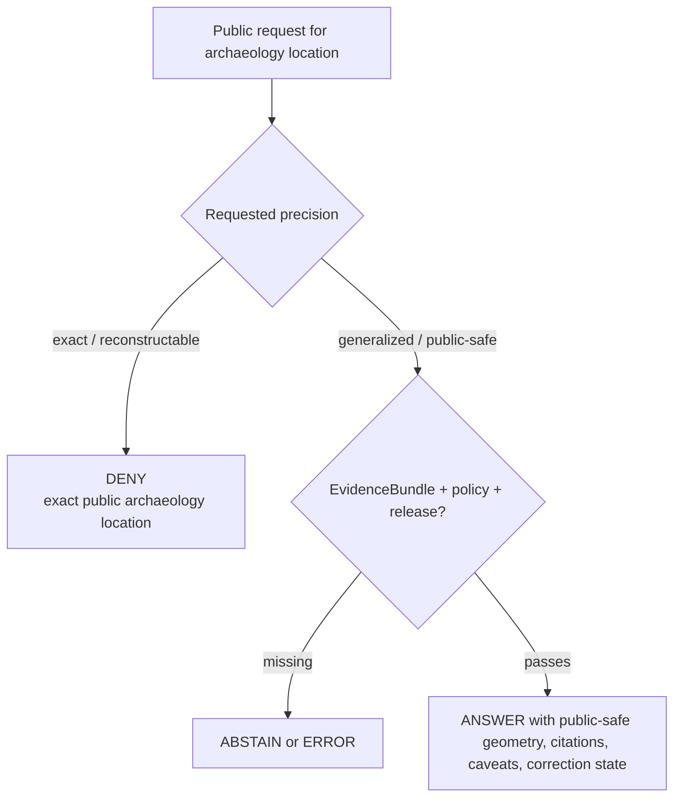

<!-- [KFM_META_BLOCK_V2]
doc_id: kfm://doc/NEEDS-VERIFICATION-ADR-archaeology-schema-home
title: ADR-archaeology-schema-home: Archaeology Schema Home
type: standard
version: v1
status: draft
owners: OWNER_TBD_NEEDS_VERIFICATION
created: 2026-05-08
updated: 2026-05-08
policy_label: NEEDS-VERIFICATION
related: [./README.md, ./ADR-0001-schema-home.md, ./ADR-0002-responsibility-root-monorepo.md, ./ADR-0009-sensitive-location-policy.md, ../domains/archaeology/README.md, ../domains/archaeology/governance/SENSITIVITY_AND_RIGHTS.md, ../domains/archaeology/governance/VALIDATION_AND_POLICY.md, ../../contracts/domains/README.md, ../../schemas/README.md]
tags: [kfm, adr, archaeology, schema-home, contracts, schemas, policy, sensitivity, rights, public-safe-geometry]
notes: [Replaces the prior placeholder ADR with proposed decision language. doc_id, owners, policy label, CODEOWNERS coverage, ADR-0001 acceptance, archaeology-specific schema inventory, executable validators, policy-as-code, fixtures, CI status, release artifacts, and runtime enforcement remain NEEDS VERIFICATION.]
[/KFM_META_BLOCK_V2] -->

<a id="top"></a>
<a id="adr-archaeology-schema-home"></a>

# ADR-archaeology-schema-home: Archaeology Schema Home

Proposed schema-home decision for archaeology machine contracts, preserving KFM’s responsibility-root directory law, contract/schema/policy split, and archaeology fail-closed public-location posture.

<div align="center">


</div>

<div align="center">

[Decision](#decision-summary) ·
[Evidence](#evidence-boundary) ·
[Context](#context) ·
[Placement](#placement-rules) ·
[Flow](#governed-flow) ·
[Validation](#validation-plan) ·
[Acceptance](#acceptance-criteria) ·
[Rollback](#rollback-and-supersession) ·
[Open items](#open-verification)

</div>

> [!IMPORTANT]
> **Decision status:** `PROPOSED`.
>
> **Proposed archaeology machine-schema home:** `schemas/contracts/v1/domains/archaeology/`.
>
> **Semantic contract home:** `contracts/domains/archaeology/`.
>
> **Policy home:** `policy/domains/archaeology/` or the repo-accepted equivalent.
>
> **Default public exact-location outcome:** `DENY`.
>
> This ADR does **not** claim executable enforcement, CI success, branch protection, live source activation, release readiness, API route behavior, or runtime implementation. Those remain `NEEDS VERIFICATION`.

---

## Decision summary

| Field | Determination |
|---|---|
| ADR file | `docs/adr/ADR-archaeology-schema-home.md` |
| Status | `proposed` |
| Scope | Archaeology domain machine-schema placement and adjacent responsibility split |
| Proposed machine schema home | `schemas/contracts/v1/domains/archaeology/` |
| Semantic contract home | `contracts/domains/archaeology/` |
| Policy home | `policy/domains/archaeology/` or repo-accepted policy-domain equivalent |
| Fixture/test homes | `fixtures/domains/archaeology/` and `tests/domains/archaeology/`, unless a future accepted fixture-home ADR supersedes this |
| Source registry home | `data/registry/sources/archaeology/` or repo-accepted source registry equivalent |
| Lifecycle data homes | `data/raw/archaeology/`, `data/work/archaeology/`, `data/quarantine/archaeology/`, `data/processed/archaeology/`, `data/catalog/domain/archaeology/`, `data/published/.../archaeology/` |
| Release home | `release/candidates/archaeology/` or repo-accepted release-domain equivalent |
| Main risk addressed | Archaeology schema, contract, policy, fixture, registry, and release drift across parallel homes |
| High-consequence rule | Exact public archaeological site locations are denied by default |
| Enforcement maturity | `NEEDS VERIFICATION` |

### Proposed decision

KFM should place archaeology-specific **machine-checkable contract schemas** under:

```text
schemas/contracts/v1/domains/archaeology/
```

This path is proposed because archaeology is a domain lane and schemas are a responsibility root. The path keeps the domain inside the schema responsibility root instead of creating a root-level `archaeology/` folder or a parallel schema authority.

### Boundary sentence

> `contracts/domains/archaeology/` explains archaeology object meaning; `schemas/contracts/v1/domains/archaeology/` validates machine shape; `policy/domains/archaeology/` decides admissibility; fixtures, validators, proofs, release manifests, correction records, and rollback cards prove behavior.

[Back to top](#top)

---

## Evidence boundary

This ADR was revised after inspecting the accessible repository through the GitHub connector and checking the local workspace for a mounted checkout. The local workspace did not expose a mounted Git repository, so local branch state, local test output, local workflow execution, runtime logs, dashboards, emitted proofs, release artifacts, and deployment behavior remain unverified.

| Evidence item | Status | Supports | Does not prove |
|---|---:|---|---|
| `docs/adr/ADR-archaeology-schema-home.md` | `CONFIRMED` | The target ADR file exists as a placeholder and needs decision language. | The decision is accepted or enforced. |
| `docs/adr/README.md` | `CONFIRMED` | ADRs are the human-facing decision ledger; the ADR index warns that decisions are not enforcement proof. | Complete ADR inventory, owner routing, or CI enforcement. |
| `docs/adr/ADR-0001-schema-home.md` | `CONFIRMED / PROPOSED` | Repo-wide schema-home decision currently proposes `schemas/contracts/v1/` for machine-checkable contract schemas. | That ADR-0001 is accepted or enforced. |
| `docs/adr/ADR-TEMPLATE.md` | `CONFIRMED` | ADRs should record evidence basis, impact map, validation plan, rollback, and supersession. | That this ADR is already approved. |
| `schemas/README.md` | `CONFIRMED` | `schemas/` is an active parent boundary; schema-home authority remains explicitly unresolved until ADRs and adjacent READMEs agree. | Archaeology-specific schemas exist or pass validation. |
| `contracts/domains/README.md` | `CONFIRMED` | `contracts/domains/` is a human-facing domain contract lane and must not become machine-schema authority. | Machine-schema placement or runtime behavior. |
| `docs/domains/archaeology/README.md` | `CONFIRMED` | Archaeology docs exist and define default public exact-location posture as `DENY`. | Executable archaeology schema, policy, release, or runtime enforcement. |
| `docs/domains/archaeology/governance/SENSITIVITY_AND_RIGHTS.md` | `CONFIRMED` | Unknown rights and exact public archaeology locations fail closed; public-safe geometry requires review and transform proof. | That policy-as-code currently enforces those rules. |
| `docs/domains/archaeology/governance/VALIDATION_AND_POLICY.md` | `CONFIRMED` | Archaeology validation expects source descriptors, rights, sensitivity, EvidenceBundle, public DTO safety, release, correction, and rollback gates. | That validators, fixtures, or CI currently pass. |
| Prior archaeology architecture plan | `LINEAGE / PROPOSED` | Earlier archaeology plan identified schema-home ambiguity and requested an ADR before machine files are treated as authority. | Current repository implementation. |
| Current local workspace probe | `CONFIRMED` | `/mnt/data` contains uploaded PDFs and no mounted KFM Git checkout. | Absence of the repository itself; GitHub connector evidence confirms repository access. |

### Truth labels used in this ADR

| Label | Meaning |
|---|---|
| `CONFIRMED` | Verified from current repository connector evidence, adjacent project docs, current local workspace inspection, or supplied KFM doctrine. |
| `PROPOSED` | Recommended decision, path, rule, schema family, or implementation not verified as accepted or enforced. |
| `NEEDS VERIFICATION` | A concrete check must be performed before claiming implementation, acceptance, release readiness, or enforcement. |
| `UNKNOWN` | Not verified strongly enough in this session. |
| `LINEAGE` | Prior planning material that preserves context but is not current repo proof. |
| `DENY`, `ABSTAIN`, `ERROR` | KFM finite outcomes, not rhetorical emphasis. |

[Back to top](#top)

---

## Context

The existing file was a backlog placeholder. It recorded that archaeology schema-home coverage was needed, but it did not decide a path, name affected responsibility roots, explain the contract/schema/policy split, or define validation and rollback burden.

That placeholder is no longer enough because archaeology is a high-sensitivity domain lane. Schema placement controls the machine shape of objects that can affect:

- public or restricted site summaries;
- source descriptors and source-role support;
- rights and sensitivity decisions;
- public-safe geometry transforms;
- EvidenceBundle closure;
- MapLibre layer payloads;
- Evidence Drawer and Focus Mode responses;
- release manifests, correction notices, and rollback cards.

KFM already has a repo-wide schema-home ADR in draft/proposed form. This archaeology ADR should therefore be a domain-specific companion, not a competing schema-home authority.

### Problem

Without a domain-specific schema-home decision, archaeology implementation can drift into parallel homes:

| Drift pattern | Why it is unsafe |
|---|---|
| `schemas/contracts/v1/archaeology/` and `schemas/contracts/v1/domains/archaeology/` both grow | Consumers cannot know which path governs machine validation. |
| `contracts/domains/archaeology/` carries schema-shaped files | Human contract meaning becomes a second machine authority. |
| `docs/domains/archaeology/` contains schema snippets treated as law | Governance prose becomes hidden validation. |
| `policy/`, `schemas/`, and `contracts/` use different field names | Policy gates may pass or fail the wrong object shape. |
| Public DTOs or UI payloads define shape ad hoc | Runtime behavior quietly outranks contracts and schemas. |
| Earlier PDF paths are copied without repo reconciliation | Lineage becomes accidental current implementation proof. |

### Why this is architecture-significant

Archaeology is not a low-risk data-display lane. It can involve exact site locations, burial contexts, sacred places, culturally sensitive knowledge, private landowner exposure, collection-security issues, steward-controlled records, and looting risk. Schema placement is therefore part of the trust membrane: it determines where validation starts, what policy sees, what evidence can support, and what public clients may receive.

[Back to top](#top)

---

## Decision

### Chosen option

Use the shared machine-schema root and domain subpath:

```text
schemas/contracts/v1/domains/archaeology/
```

Use adjacent responsibility roots for meaning, policy, fixtures, tests, lifecycle data, source registry records, and release artifacts.

### Rejected as canonical homes

| Path | Decision | Reason |
|---|---:|---|
| `archaeology/` | Rejected | Domain names should not become root folders. |
| `schemas/contracts/v1/archaeology/` | Rejected as canonical; allowed only as an explicit migration alias if already needed | It omits the `domains/` grouping used by Directory Rules and domain-lane placement examples. |
| `contracts/archaeology/` | Rejected | Contracts are semantic meaning, not machine-schema authority. |
| `contracts/domains/archaeology/*.schema.json` | Rejected as canonical | `contracts/domains/` is a human-facing domain contract lane. |
| `docs/domains/archaeology/*.schema.json` | Rejected | Docs explain; they do not validate machine shape. |
| `jsonschema/archaeology/` | Rejected unless a future ADR makes it compatibility-only | `jsonschema/` is treated as compatibility/transitional unless current repo convention proves otherwise. |
| `policy/domains/archaeology/*.schema.json` | Rejected | Policy decides admissibility; it does not own object shape. |

### Operating rule

> Add or update archaeology schemas only under the accepted machine-schema home. If a contributor needs a different path, open a successor ADR or a migration note before adding files.

### Public-safety rule

> No archaeology schema, fixture, DTO, layer payload, Evidence Drawer payload, Focus Mode context, catalog record, or release manifest may normalize exact public archaeological site-location exposure as the default.

[Back to top](#top)

---

## Placement rules

| Concern | Proposed home | Status | Notes |
|---|---|---:|---|
| Archaeology machine schemas | `schemas/contracts/v1/domains/archaeology/` | `PROPOSED` | Canonical after acceptance and validation. |
| Archaeology semantic contracts | `contracts/domains/archaeology/` | `PROPOSED / NEEDS VERIFICATION` | Human meaning, source-role limits, compatibility, and public-safety burden. |
| Archaeology policy-as-code | `policy/domains/archaeology/` | `PROPOSED / NEEDS VERIFICATION` | Must enforce `DENY`, `ABSTAIN`, `ERROR`, obligations, review holds, and public-surface rules. |
| Valid/invalid fixtures | `fixtures/domains/archaeology/` and/or repo-accepted fixture home | `PROPOSED / NEEDS VERIFICATION` | Fixture-home ADR may supersede exact placement. |
| Tests | `tests/domains/archaeology/` and repo-accepted contract/policy test homes | `PROPOSED / NEEDS VERIFICATION` | Must include negative tests for exact public locations and unknown rights. |
| Source descriptors | `data/registry/sources/archaeology/` or repo-accepted source registry home | `PROPOSED / NEEDS VERIFICATION` | Source roles, rights, sensitivity defaults, cadence, and activation state. |
| Lifecycle data | `data/raw/archaeology/`, `data/work/archaeology/`, `data/quarantine/archaeology/`, `data/processed/archaeology/` | `PROPOSED / NEEDS VERIFICATION` | Public clients must not read these directly. |
| Catalog and triplets | `data/catalog/domain/archaeology/`, `data/triplets/...` or repo-accepted equivalents | `PROPOSED / NEEDS VERIFICATION` | Catalog/triplet projections are not canonical truth. |
| Published public-safe artifacts | `data/published/.../archaeology/` | `PROPOSED / NEEDS VERIFICATION` | Must be release-backed and public-safe. |
| Receipts and proofs | `data/receipts/`, `data/proofs/` or repo-accepted equivalents | `PROPOSED / NEEDS VERIFICATION` | Transform receipts, validation reports, proof packs. |
| Release candidates | `release/candidates/archaeology/` | `PROPOSED / NEEDS VERIFICATION` | ReleaseManifest, correction path, rollback target. |
| Runtime/API consumers | `apps/`, `packages/`, `runtime/`, or repo-accepted equivalents | `NEEDS VERIFICATION` | Must consume canonical schemas and governed envelopes, not define schema authority. |

### Initial schema family candidates

These are `PROPOSED` object families for the first archaeology schema wave. Names may be adjusted to match repo naming conventions before implementation.

| Schema family | Purpose | Minimum public-safety burden |
|---|---|---|
| `archaeology_site` | Restricted or reviewed site identity and support | No exact public geometry by default. |
| `archaeology_component` | Cultural/temporal component tied to evidence and uncertainty | Source-role support and review state required. |
| `archaeological_feature` | Feature record with provenience/context | Public precision requires sensitivity review. |
| `survey_project` | Survey or excavation project boundary/context | Survey coverage can be public-safe only after review. |
| `survey_observation` | Observation from field, survey, or controlled context | EvidenceRef and source role required. |
| `artifact_record` | Artifact or assemblage record | Avoid storage/security and exact provenience leaks. |
| `sample_record` | Sample and laboratory lineage | Method, uncertainty, and source support required. |
| `chronometric_determination` | Date/result with method, calibration, uncertainty | No unsupported chronology claims. |
| `remote_sensing_candidate` | LiDAR, aerial, geophysical, ML, or modeled candidate | Must remain candidate-only unless reviewed. |
| `public_archaeology_summary` | Public-safe summary DTO or release artifact | Must use allowed fields and public-safe geometry class. |
| `publication_transform_receipt` | Generalization, suppression, aggregation, delay, or withholding proof | Required whenever restricted support becomes public-safe output. |
| `archaeology_layer_payload` | Map/API layer payload shape | Must reference release and evidence; must not leak internal refs. |

[Back to top](#top)

---

## Governed flow

```mermaid
flowchart LR
  Docs[docs/domains/archaeology<br/>governance and lane docs]
  Contracts[contracts/domains/archaeology<br/>semantic meaning]
  Schemas[schemas/contracts/v1/domains/archaeology<br/>machine shape]
  Fixtures[fixtures/tests<br/>valid + invalid examples]
  Policy[policy/domains/archaeology<br/>DENY / ABSTAIN / ERROR rules]
  Lifecycle[data lifecycle<br/>RAW -> WORK -> QUARANTINE -> PROCESSED]
  Catalog[data/catalog + triplets<br/>projection and closure]
  Proof[data/receipts + data/proofs<br/>validation and transform receipts]
  Release[release/candidates/archaeology<br/>manifest + rollback]
  Published[data/published<br/>public-safe artifacts]
  API[governed API<br/>finite envelopes]
  UI[MapLibre + Evidence Drawer + Focus Mode<br/>trust-visible output]

  Docs --> Contracts
  Contracts --> Schemas
  Schemas --> Fixtures
  Fixtures --> Policy
  Policy --> Lifecycle
  Lifecycle --> Catalog
  Catalog --> Proof
  Proof --> Release
  Release --> Published
  Published --> API
  API --> UI

  Lifecycle -. no direct public path .-> API
  Schemas -. validates shape, not permission .-> Policy
  Contracts -. explains meaning, not machine law .-> Schemas
  UI -. downstream only .-> Published
```



### Exact-location denial flow



[Back to top](#top)

---

## Requirements and constraints

| KFM invariant | Archaeology schema-home impact |
|---|---|
| Responsibility roots are authority boundaries | Archaeology stays inside `schemas/`, `contracts/`, `policy/`, `tests/`, `fixtures/`, `data/`, and `release/` responsibility roots. |
| Domain folders do not become repo roots | No root-level `archaeology/`. |
| Contracts, schemas, and policy remain distinct | Meaning, shape, and admissibility are split. |
| `RAW -> WORK / QUARANTINE -> PROCESSED -> CATALOG / TRIPLET -> PUBLISHED` | Schemas validate lifecycle objects but do not move objects across lifecycle states. |
| Public clients use governed interfaces and released artifacts | Public API/UI cannot read raw, work, quarantine, restricted stores, vector indexes, graph internals, or model runtimes directly. |
| EvidenceRef resolves to EvidenceBundle | Consequential archaeology claims need inspectable support. |
| Policy fails closed | Unknown rights, unknown sensitivity, exact public site location, or unresolved review blocks public release. |
| Derived surfaces remain derived | Tiles, maps, graph edges, search projections, summaries, and AI answers do not become archaeology truth. |
| Promotion is a governed state transition | Release requires validation, policy, review, proof refs, release manifest, correction path, and rollback target. |
| AI is interpretive only | Focus Mode may answer only over released, policy-safe evidence with validated citations. |

[Back to top](#top)

---

## Validation plan

### Required checks before acceptance

| Check | Expected behavior |
|---|---|
| Path policy | Archaeology machine schemas resolve only under `schemas/contracts/v1/domains/archaeology/` or an explicit tested migration alias. |
| Misplaced schema check | `.schema.json` files under `contracts/domains/archaeology/`, `docs/domains/archaeology/`, `policy/domains/archaeology/`, or root-level `archaeology/` fail unless explicitly non-canonical and tested as examples. |
| Schema parse and `$id` check | Every archaeology schema declares stable `$schema`, `$id`, title, version, and owning family. |
| Contract companion check | Each schema family has a semantic contract note or documented reason for omission. |
| Fixture mapping | Each schema has at least one valid and one invalid fixture, or an explicit deferred fixture note. |
| Policy mapping | Rights, sensitivity, source-role, public-geometry, evidence, release, and rollback policy decisions can consume the schema shape. |
| Sensitive public output check | Exact public site coordinates, burial/remains precision, sacred/cultural precision, private access details, and collection-security details fail public payload validation. |
| Candidate-feature check | Remote-sensing/geophysical/model candidates cannot validate as confirmed sites without review state and evidence support. |
| Evidence closure check | Consequential claims require `EvidenceRef -> EvidenceBundle`. |
| Release closure check | Release candidate has validation report, policy decision, transform receipt when needed, release manifest, correction path, and rollback target. |
| Runtime payload check | Governed API, MapLibre, Evidence Drawer, Focus Mode, story, export, catalog, graph, search, and vector payloads cannot leak internal or restricted references. |

### Illustrative validation commands

These commands are illustrative only. Replace them with repo-native commands once schema, policy, fixture, validator, and CI conventions are verified.

```bash
# Confirm repository context.
git status --short
git branch --show-current
git rev-parse --show-toplevel

# Inspect proposed archaeology homes.
find schemas/contracts/v1/domains/archaeology -maxdepth 3 -type f 2>/dev/null | sort
find contracts/domains/archaeology -maxdepth 3 -type f 2>/dev/null | sort
find policy/domains/archaeology -maxdepth 3 -type f 2>/dev/null | sort
find tests/domains/archaeology fixtures/domains/archaeology -maxdepth 3 -type f 2>/dev/null | sort

# Search for misplaced schema-like files.
find docs/domains/archaeology contracts/domains/archaeology policy/domains/archaeology -type f \
  \( -name '*.schema.json' -o -name '*.schema.yaml' -o -name '*.schema.yml' \) 2>/dev/null

# Proposed future runner names; replace with actual repo-native tools.
python tools/validators/path_policy/validate_directory_rules.py
python tools/validators/schema_home/validate_schema_home.py --domain archaeology
python tools/validators/archaeology/validate_public_geometry.py
python tools/validators/archaeology/validate_release_closure.py
python -m pytest tests/domains/archaeology tests/contracts tests/policy
```

### Negative-path fixtures required

| Fixture | Expected result |
|---|---|
| Public DTO includes exact site coordinate | `DENY` |
| Unknown rights source is proposed for public release | `DENY` or `QUARANTINE` |
| Candidate LiDAR/geophysical/model anomaly is marked as confirmed site | `DENY` |
| Public generalized output lacks transform receipt | `DENY` |
| EvidenceRef cannot resolve | `ABSTAIN` or `ERROR` |
| Release manifest lacks rollback target | Promotion blocked |
| Evidence Drawer payload includes restricted coordinate or private access detail | `DENY` |
| Focus Mode tries to infer or reveal exact site location | `DENY` |
| Machine schema appears in `contracts/domains/archaeology/` as canonical | Schema-home validation fails |
| Public API references RAW, WORK, QUARANTINE, restricted store, graph internal, vector index, or model runtime directly | Public-surface validation fails |

[Back to top](#top)

---

## Impact map

| Area | Required update after this ADR changes status | Current status |
|---|---|---:|
| `docs/adr/README.md` | Add or update the archaeology schema-home ADR inventory entry. | `NEEDS VERIFICATION` |
| `docs/domains/archaeology/README.md` | Link this ADR as the schema-home decision once reviewed. | `PROPOSED` |
| `docs/domains/archaeology/governance/FILE_MAP.md` | Add this ADR to schema/policy/contract handoffs. | `PROPOSED` |
| `docs/domains/archaeology/governance/OPEN_QUESTIONS.md` | Retire or narrow schema-home open question after acceptance. | `PROPOSED` |
| `contracts/domains/README.md` | Confirm domain-contract lane points to this decision for archaeology. | `NEEDS VERIFICATION` |
| `contracts/domains/archaeology/README.md` | Create or update semantic contract companion if absent. | `PROPOSED / NEEDS VERIFICATION` |
| `schemas/README.md` | Keep parent schema-home language aligned with ADR-0001 and this ADR. | `NEEDS VERIFICATION` |
| `schemas/contracts/v1/README.md` | Confirm or create domain-subpath guidance. | `NEEDS VERIFICATION` |
| `schemas/contracts/v1/domains/archaeology/` | Add machine schemas only after acceptance or PR review. | `PROPOSED` |
| `policy/domains/archaeology/` | Add executable deny/abstain rules after schema shape exists. | `PROPOSED` |
| `fixtures/domains/archaeology/` | Add valid/invalid fixtures. | `PROPOSED` |
| `tests/domains/archaeology/` | Add schema, policy, public DTO, release, and rollback tests. | `PROPOSED` |
| `data/registry/sources/archaeology/` | Add source descriptors only after source rights/steward review. | `PROPOSED` |
| `release/candidates/archaeology/` | Add release candidates only after proof closure and rollback target. | `PROPOSED` |
| Runtime/API/UI docs | Keep governed API, Evidence Drawer, Focus Mode, and MapLibre payloads downstream of release. | `NEEDS VERIFICATION` |

[Back to top](#top)

---

## Acceptance criteria

This ADR can move from `proposed` to `accepted` only when the following are true.

- [ ] ADR owners and reviewers are verified through CODEOWNERS, maintainer approval, or a governance register.
- [ ] ADR-0001 is accepted, or this ADR explicitly records a reviewed exception for the archaeology domain.
- [ ] `schemas/contracts/v1/domains/archaeology/` exists or is approved as the future path for archaeology machine schemas.
- [ ] `contracts/domains/archaeology/` exists or another semantic contract companion is approved.
- [ ] `policy/domains/archaeology/` or a repo-accepted policy-domain path is identified.
- [ ] Valid and invalid fixture homes are identified.
- [ ] Schema-home validation blocks machine schemas outside the accepted home.
- [ ] At least one archaeology schema family has valid and invalid fixtures.
- [ ] Unknown rights and exact public site-location fixtures deny public release.
- [ ] Candidate-feature fixtures preserve candidate-only status.
- [ ] EvidenceRef-to-EvidenceBundle closure is tested for consequential claims.
- [ ] Public DTO or layer payload tests prevent internal lifecycle references and restricted geometry leakage.
- [ ] Release dry-run proves ReleaseManifest, validation report, policy decision, correction path, and rollback target.
- [ ] Documentation links are updated in ADR index, archaeology README, file map, and open questions.
- [ ] Validation output or CI run evidence is linked in PR notes, a validation report, or a repo-native receipt.
- [ ] Rollback and supersession instructions are preserved.

### Definition of done for first implementation PR

- [ ] This ADR is updated with acceptance evidence or remains clearly `proposed`.
- [ ] No root-level `archaeology/` folder is introduced.
- [ ] No schema-shaped file is added to `contracts/` or `docs/` as canonical machine schema authority.
- [ ] Negative-path fixtures are included before any live archaeology source activation.
- [ ] Public exact-location denial is testable, not just stated.
- [ ] Public-safe geometry transform receipt behavior is represented in schema and fixture expectations.
- [ ] Rollback/correction path is included before any release-facing artifact.

[Back to top](#top)

---

## Rollback and supersession

If this ADR is accepted and later proves wrong or incomplete:

1. Preserve this file as decision lineage.
2. Mark the ADR `superseded` or add a visible supersession note.
3. Create a successor ADR with the new schema-home decision.
4. Add a migration map from old paths to successor paths.
5. Keep compatibility aliases explicit, dated, reviewed, and tested.
6. Block ambiguous consumers rather than silently resolving to two homes.
7. Update `docs/adr/README.md`, archaeology docs, contracts, schemas, policy, fixtures, tests, validators, release docs, and runtime payload docs together.
8. Re-run path, schema, policy, fixture, public DTO, release, and rollback tests.
9. Preserve any published correction, withdrawal, or rollback evidence.

> [!WARNING]
> Rollback must not delete decision history. KFM needs the audit trail even when the implementation path changes.

### Compatibility alias rule

A legacy or alternate path such as:

```text
schemas/contracts/v1/archaeology/
```

may be supported only as a documented compatibility alias when a real consumer requires it. It must not become a second canonical home.

Required alias fields:

| Field | Requirement |
|---|---|
| Alias path | The old or alternate path. |
| Canonical target | `schemas/contracts/v1/domains/archaeology/...`. |
| Owner | Verified owner or `OWNER_TBD_NEEDS_VERIFICATION`. |
| Status | `active`, `deprecated`, `blocked`, or `retired`. |
| Review date | Required. |
| Tests | Alias resolution and missing-target failure tests. |
| Retirement plan | Required. |
| Rollback note | Required. |

[Back to top](#top)

---

## Open verification

| Item | Status | Why it matters |
|---|---:|---|
| Owner and CODEOWNERS coverage | `NEEDS VERIFICATION` | Acceptance requires accountable review. |
| ADR-0001 acceptance status | `NEEDS VERIFICATION` | This ADR depends on the repo-wide schema-home decision. |
| Existing archaeology-specific schemas | `NEEDS VERIFICATION` | No archaeology machine-schema file was confirmed from inspected evidence in this revision. |
| `schemas/contracts/v1/domains/` convention in active checkout | `NEEDS VERIFICATION` | Path is proposed from Directory Rules and ADR-0001, but active repo inventory must confirm or create it. |
| Archaeology semantic contract companion | `NEEDS VERIFICATION` | `contracts/domains/README.md` exists; lane-specific contract file needs confirmation. |
| Policy-as-code home and engine | `NEEDS VERIFICATION` | Prose policy is not enforcement. |
| Fixture-home authority | `NEEDS VERIFICATION` | This ADR proposes domain fixtures but does not settle repo-wide fixture-home ambiguity. |
| Validator implementation | `NEEDS VERIFICATION` | Path policy, schema-home, public geometry, EvidenceBundle, and release closure validators must be repo-native. |
| CI workflow and run status | `NEEDS VERIFICATION` | Workflow presence is not proof of passing or required enforcement. |
| Branch protections | `UNKNOWN` | Required before claiming merge-blocking validation. |
| Source rights and steward review protocol | `NEEDS VERIFICATION` | Archaeology public release cannot rely on unresolved rights or stewardship. |
| Public geometry thresholds | `NEEDS VERIFICATION` | Withheld/generalized/aggregated/delayed thresholds need review. |
| Governed API route names | `UNKNOWN` | Runtime/API claims require direct implementation evidence. |
| MapLibre, Evidence Drawer, Focus Mode payloads | `NEEDS VERIFICATION` | UI surfaces must prove no restricted reconstruction path. |
| Release artifacts and rollback records | `NEEDS VERIFICATION` | Release readiness requires proof, correction, and rollback artifacts. |

[Back to top](#top)

---

## Maintainer note

This ADR is intentionally conservative.

The goal is not to create a prettier path. The goal is to prevent archaeology meaning, machine validation, executable policy, fixture proof, public payloads, source rights, sensitivity review, release state, correction lineage, and rollback evidence from drifting apart.

Keep the root boring. Put archaeology complexity inside the right responsibility roots, and make every public claim safe, cited, reviewable, and reversible.
