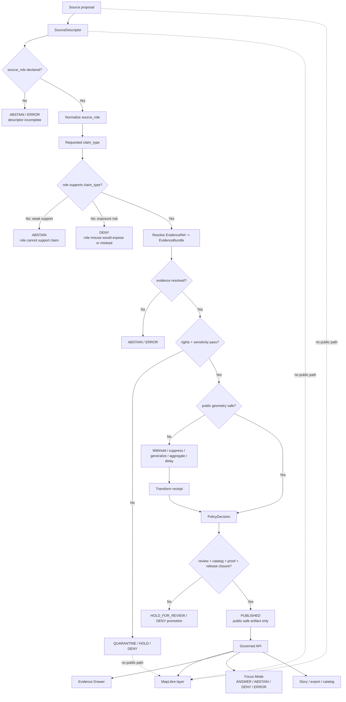

<!-- [KFM_META_BLOCK_V2]
doc_id: kfm://doc/NEEDS-VERIFICATION-ADR-ARCHAEOLOGY-SOURCE-ROLE-SEPARATION
title: ADR: Archaeology Source Role Separation
type: standard
version: v1
status: draft
owners: OWNER_TBD_NEEDS_VERIFICATION
created: 2026-05-08
updated: 2026-05-08
policy_label: NEEDS_VERIFICATION-public-or-restricted
related: [./README.md, ./ADR-TEMPLATE.md, ./ADR-0009-sensitive-location-policy.md, ./ADR-archaeology-location-sensitivity.md, ./ADR-archaeology-public-vs-restricted-geometry.md, ../domains/archaeology/README.md, ../domains/archaeology/architecture/ARCHITECTURE.md, ../domains/archaeology/governance/SOURCE_REGISTRY.md, ../domains/archaeology/governance/SENSITIVITY_AND_RIGHTS.md, ../domains/archaeology/governance/VALIDATION_AND_POLICY.md, ../../policy/crosswalk/source-role-to-claim-policy.md]
tags: [kfm, adr, archaeology, source-role, source-descriptor, evidence, policy, sensitivity, public-safe-geometry, cite-or-abstain]
notes: [Replaces the placeholder ADR at docs/adr/ADR-archaeology-source-role-separation.md. GitHub main was inspected through the project connector; no local mounted checkout was available. Decision language is PROPOSED until owner, policy-label, executable schema, policy, fixture, validator, CI, release, and runtime evidence are verified.]
[/KFM_META_BLOCK_V2] -->

<a id="top"></a>

# ADR: Archaeology Source Role Separation

Decision record for keeping archaeology source roles explicit, claim-bounded, evidence-resolved, policy-aware, public-safe, and reversible.

<div align="left">


</div>

<p align="center">
  <a href="#status-and-decision-card">Status</a> ·
  <a href="#context">Context</a> ·
  <a href="#decision">Decision</a> ·
  <a href="#source-role-policy-matrix">Source roles</a> ·
  <a href="#governed-flow">Flow</a> ·
  <a href="#impact-map">Impact</a> ·
  <a href="#verification">Verification</a> ·
  <a href="#rollback-and-supersession">Rollback</a> ·
  <a href="#open-verification">Open verification</a>
</p>

> [!IMPORTANT]
> Source role is a **policy and evidence gate**, not a label for later display. A source that can support one archaeology claim may be insufficient, misleading, or unsafe for another.

> [!WARNING]
> This ADR does **not** authorize public archaeology publication. Exact or reconstructable archaeological locations remain denied by default. Public release still requires rights review, sensitivity classification, public-safe geometry treatment, EvidenceBundle support, policy decision, review state, release manifest, correction path, and rollback target.

---

## Status and decision card

| Field | Value |
|---|---|
| ADR path | `docs/adr/ADR-archaeology-source-role-separation.md` |
| ADR document status | `draft` |
| Decision status | `PROPOSED` pending review |
| Replaces | Existing placeholder ADR text in this file |
| Supersedes | `none` |
| Related cross-domain policy | [`ADR-0009-sensitive-location-policy.md`](./ADR-0009-sensitive-location-policy.md) |
| Related archaeology ADRs | [`ADR-archaeology-location-sensitivity.md`](./ADR-archaeology-location-sensitivity.md), [`ADR-archaeology-public-vs-restricted-geometry.md`](./ADR-archaeology-public-vs-restricted-geometry.md) |
| Related domain docs | [`../domains/archaeology/README.md`](../domains/archaeology/README.md), [`../domains/archaeology/architecture/ARCHITECTURE.md`](../domains/archaeology/architecture/ARCHITECTURE.md), [`../domains/archaeology/governance/SOURCE_REGISTRY.md`](../domains/archaeology/governance/SOURCE_REGISTRY.md), [`../domains/archaeology/governance/SENSITIVITY_AND_RIGHTS.md`](../domains/archaeology/governance/SENSITIVITY_AND_RIGHTS.md), [`../domains/archaeology/governance/VALIDATION_AND_POLICY.md`](../domains/archaeology/governance/VALIDATION_AND_POLICY.md) |
| Related policy crosswalk | [`../../policy/crosswalk/source-role-to-claim-policy.md`](../../policy/crosswalk/source-role-to-claim-policy.md) |
| Decision confidence | `CONFIRMED` placeholder and adjacent docs / `PROPOSED` decision wording / `NEEDS VERIFICATION` enforcement |
| Default role mismatch outcome | `ABSTAIN` when support is insufficient; `DENY` when exposure, rights, sensitivity, or policy risk is present; `ERROR` when the resolver or schema path fails |
| Default public exact-location outcome | `DENY` |
| Required outward runtime outcomes | `ANSWER`, `ABSTAIN`, `DENY`, `ERROR` |

### One-line decision

> Archaeology claims must be evaluated against an explicit source role before they can be answered, rendered, promoted, exported, summarized, or released.

### One-line boundary rule

> No archaeology source role may be silently upgraded into a stronger claim type, and no public surface may use a weaker or restricted role to expose exact locations, confirmed-site status, cultural interpretation, chronology, ownership/access detail, or collection-sensitive information without evidence, policy, review, and release support.

[Back to top](#top)

---

## Context

The existing ADR at this path is a placeholder that states the decision still needs to settle “archaeology source role separation.” This revision replaces that placeholder with decision-ready language while preserving uncertainty around executable enforcement.

KFM archaeology docs already treat source role as load-bearing. Field records, lab results, archival reports, steward knowledge, administrative inventories, remote-sensing candidates, collection records, derived public summaries, and restricted canonical records are not interchangeable. Each source family can support different claims, carries different rights and sensitivity burdens, and has different public-release limits.

### Problem

Without an ADR-level source-role rule, archaeology work can drift into unsafe shortcuts:

- treating an administrative inventory as cultural truth;
- treating a remote-sensing anomaly as a confirmed site;
- treating an archival map as modern coordinate authority;
- treating collection metadata as safe public provenance;
- treating steward-controlled knowledge as ordinary public narrative;
- treating public availability as publication permission;
- letting Focus Mode, map popups, exports, catalog records, graph projections, or Evidence Drawer payloads imply stronger support than the evidence allows.

### Why this is architecture-significant

This decision affects the archaeology trust membrane across:

- source descriptor admission;
- EvidenceRef-to-EvidenceBundle closure;
- source-role-to-claim compatibility;
- sensitivity and rights review;
- public-safe geometry derivation;
- MapLibre layer eligibility;
- Evidence Drawer field allowlists;
- Focus Mode and governed AI responses;
- catalog/proof/release closure;
- correction, withdrawal, and rollback.

[Back to top](#top)

---

## Evidence basis

| Evidence item | Source / path / artifact | What it supports | Truth label |
|---|---|---|---|
| Target placeholder ADR | `docs/adr/ADR-archaeology-source-role-separation.md` | Confirms this ADR path exists and currently records unresolved decision coverage | `CONFIRMED repo evidence` |
| ADR index | [`./README.md`](./README.md) | ADRs are the human-facing decision ledger and must preserve evidence, validation, rollback, and supersession posture | `CONFIRMED repo evidence` |
| ADR template | [`./ADR-TEMPLATE.md`](./ADR-TEMPLATE.md) | ADRs should include evidence basis, requirements, options, decision, impact, validation, rollback, consequences, and open questions | `CONFIRMED repo evidence` |
| Responsibility-root ADR | [`./ADR-0002-responsibility-root-monorepo.md`](./ADR-0002-responsibility-root-monorepo.md) | `docs/adr/` is the correct responsibility-root location for architecture decisions; domain files should remain under responsibility roots | `CONFIRMED repo evidence` |
| Archaeology lane README | [`../domains/archaeology/README.md`](../domains/archaeology/README.md) | Archaeology source roles are load-bearing; exact public locations are denied by default; candidate features are not confirmed sites | `CONFIRMED repo evidence / NEEDS VERIFICATION enforcement` |
| Source registry companion | [`../domains/archaeology/governance/SOURCE_REGISTRY.md`](../domains/archaeology/governance/SOURCE_REGISTRY.md) | Defines descriptor minimums, source role classes, admission flow, activation states, and role-based failure defaults | `CONFIRMED repo evidence / NEEDS VERIFICATION machine registry` |
| Sensitivity and rights companion | [`../domains/archaeology/governance/SENSITIVITY_AND_RIGHTS.md`](../domains/archaeology/governance/SENSITIVITY_AND_RIGHTS.md) | Defines exact-location denial, unknown-rights denial, public geometry classes, sensitivity classes, release requirements, and public-surface allowlists | `CONFIRMED repo evidence / NEEDS VERIFICATION enforcement` |
| Validation and policy companion | [`../domains/archaeology/governance/VALIDATION_AND_POLICY.md`](../domains/archaeology/governance/VALIDATION_AND_POLICY.md) | Defines validation gates, mandatory denials, candidate-feature handling, evidence closure, citation closure, policy outcomes, and runtime outcomes | `CONFIRMED repo evidence / NEEDS VERIFICATION enforcement` |
| Archaeology architecture | [`../domains/archaeology/architecture/ARCHITECTURE.md`](../domains/archaeology/architecture/ARCHITECTURE.md) | Confirms architecture rule: archaeology is not a public site-coordinate map; UI and AI are downstream; promotion is governed | `CONFIRMED repo evidence / NEEDS VERIFICATION runtime` |
| Source-role policy crosswalk | [`../../policy/crosswalk/source-role-to-claim-policy.md`](../../policy/crosswalk/source-role-to-claim-policy.md) | Establishes source role as an admissibility constraint and maps normalized source roles to allowed/denied claim types | `CONFIRMED repo evidence / draft policy` |
| Archaeology planning lineage | Supplied KFM archaeology architecture plan | Supports default denial of exact locations, candidate-vs-confirmed separation, public-safe geometry, source rights review, and steward review | `LINEAGE / PROPOSED implementation` |
| Directory Rules | Supplied KFM directory-governance doctrine | Supports `docs/adr/` placement and responsibility-root discipline | `CONFIRMED doctrine` |

> [!CAUTION]
> This ADR records the proposed decision. It does not prove that source descriptors, schemas, policy bundles, validators, tests, CI workflows, governed API routes, MapLibre layers, Evidence Drawer payload checks, Focus Mode checks, release manifests, proof packs, correction notices, or rollback cards are already implemented.

[Back to top](#top)

---

## Decision

### Chosen option

Adopt strict archaeology source-role separation.

Every archaeology source descriptor must declare:

- a normalized source role;
- claim types the role may support;
- claim types the role must not support alone;
- rights and redistribution posture;
- sensitivity defaults;
- public geometry treatment;
- evidence linkage expectations;
- review obligations;
- activation state;
- failure behavior when role support is missing, mismatched, restricted, or unresolved.

A source role is evaluated **before** a public or semi-public claim may be answered, rendered, exported, promoted, cataloged, summarized, or released.

### Operating rule

```text
SourceDescriptor
  -> normalized source_role
  -> requested claim_type
  -> role compatibility check
  -> EvidenceRef -> EvidenceBundle
  -> rights + sensitivity + review + release gates
  -> finite outcome: ANSWER / ABSTAIN / DENY / ERROR
```

### Policy rule

| Condition | Required outcome |
|---|---|
| Source role missing or unmapped | `ABSTAIN` or `ERROR`; block promotion until descriptor is repaired |
| Source role too weak for claim type | `ABSTAIN` when non-harmful insufficiency; `DENY` when exposure or policy risk exists |
| Source role asserts candidate evidence as confirmed site | `DENY` |
| Source role implies exact public location without reviewed public-safe release | `DENY` |
| Source role has unknown rights or unresolved sensitivity | `DENY` public release / `QUARANTINE` or `HOLD_FOR_REVIEW` internally |
| Source role has evidence but no resolved EvidenceBundle | `ABSTAIN`, `DENY`, or `ERROR` depending on surface and failure class |
| Source role is compatible and all gates pass | `ANSWER` or `ALLOW_PUBLIC_SAFE`, bounded by citations, scope, release state, and correction state |

### Rejected options

| Rejected option | Why rejected | What could reopen it |
|---|---|---|
| Treat all archaeology sources as generic evidence | Collapses source authority and makes weak or sensitive support appear stronger than it is | No reopening condition; incompatible with KFM evidence posture |
| Let the UI decide what source roles imply | Browser/map rendering is not a policy or evidence authority | Only acceptable as display after governed API emits policy-safe payloads |
| Treat public upstream availability as enough for public KFM use | Availability does not settle rights, sensitivity, source role, geometry precision, or release posture | A source-specific rights and policy review may allow a public-safe derivative, not this shortcut |
| Allow model/AI synthesis to infer source role | AI is interpretive and subordinate to descriptors, evidence, policy, review, and release state | No reopening condition for source-role authority |
| Resolve role mismatch by adding caveat text only | Caveats do not prevent public exact-location, rights, sensitivity, or unsupported-claim exposure | Only acceptable when policy gates already allow a bounded public-safe claim |

[Back to top](#top)

---

## Source-role policy matrix

The archaeology lane may use narrower machine names, but each must map to a stable source-role class before policy evaluation.

| Archaeology source role | Normalized crosswalk role | May support | Must not support alone | Default public posture |
|---|---|---|---|---|
| `archaeology_field_survey_excavation` | `direct_observational_instrumented` | Field observation, provenience, survey coverage, excavation/test unit context, observed feature evidence | Public exact location, cultural interpretation, chronology, ownership/access truth, or public confirmed-site release without review | Restricted by default; public-safe derivative only |
| `archaeology_lab_analytical_chronometric` | `direct_observational_instrumented` | Lab result, sample analysis, chronometric determination, method-specific uncertainty | Whole-site existence, site boundary, cultural affiliation, or public exact location without broader evidence and review | Public text only when evidence/citation/rights gates pass |
| `archaeology_archival_documentary_report` | `documentary_archival` | Source-stated context, historical/documentary support, reported site or feature context, bibliographic support | Exact modern coordinate authority, confirmed physical boundary, current condition, or public sensitive detail without review | Public-safe citation or narrative if rights allow |
| `archaeology_oral_steward_cultural` | `community_contributed` / steward-controlled restricted role | Steward-reviewed cultural context, oral history, community-held knowledge, interpretation within permission scope | Public claim, public geometry, unrestricted quote, or culturally sensitive narrative without explicit allowed outward form | Restricted / hold for steward review |
| `archaeology_regulatory_administrative_inventory` | `statutory_administrative` | Inventory/listing status, administrative record, review status, designation context | Cultural truth, physical boundary proof, ownership/title truth, or public exact location by itself | Public summary only when rights and sensitivity allow |
| `archaeology_remote_sensing_geophysical_modeled` | `modeled_assimilated_derived` | Candidate feature, anomaly, survey targeting, contextual surface, method-bounded interpretation support | Confirmed site, confirmed feature, chronology, cultural affiliation, or public exact sensitive location | Candidate-only; no confirmed-site language without review |
| `archaeology_collection_repository_museum` | `documentary_archival` / repository-context role | Collection custody, accession context, artifact record, repository citation, public-safe collection metadata | Storage/security detail, complete provenience, exact location, or sensitive collection linkage without review | Field allowlist required |
| `archaeology_derived_public_summary` | `modeled_assimilated_derived` / released derivative | Generalized public summary, survey-coverage view, public story, safe export, public layer | Canonical record, restricted data substitute, exact location proxy, or stronger claim than release manifest allows | Release-bound public-safe only |
| `archaeology_restricted_canonical_steward_only` | restricted internal role | Restricted review, exact geometry, sensitive source detail, controlled steward workflow | Public DTO, public tile, public graph edge, public export, public Focus answer, or public Evidence Drawer detail | Never public directly |

### Claim compatibility

| Claim type | Strong normal support | Weak / conditional support | Must deny or abstain when… |
|---|---|---|---|
| Source exists or was consulted | Any descriptor-backed role | Mirror/discovery services | Descriptor is missing or source identity is unresolved |
| Source states or depicts something | Archival, administrative, field, collection, steward-reviewed source | Remote-sensing/model source if bounded | Citation span, source context, or rights are missing |
| Field observation or provenience | Field/survey/excavation | Collection metadata if source supports provenance | Public precision or source support is missing |
| Lab result or date | Lab/analytical/chronometric | Archival report quoting lab result, if citation/support is clear | Method, uncertainty, sample context, or calibration basis is missing |
| Administrative/inventory status | Regulatory/administrative/inventory | Archival source describing an older administrative state | Used as cultural truth, site boundary proof, or exact public location authority |
| Candidate feature | Remote sensing, geophysical, modeled | Field note identifying unresolved candidate | Candidate is described as confirmed site or confirmed feature |
| Confirmed site/component | Field/survey/excavation plus reviewed supporting evidence | Administrative or archival support only with review and caveats | Only candidate, archival, administrative, collection, or model evidence is present |
| Cultural or steward interpretation | Steward/cultural review plus allowed outward form | Archival/documentary context with careful caveats | Permission, steward review, or public narrative scope is missing |
| Public-safe summary | Released derivative plus transform receipt and EvidenceBundle | Generalized source-context narrative | Release manifest, transform receipt, rights, sensitivity, or rollback target is missing |
| Exact sensitive location | Restricted canonical/steward-only support | None for ordinary public paths | Public or semi-public output requests exact or reconstructable detail |

[Back to top](#top)

---

## Governed flow



[Back to top](#top)

---

## Impact map

### Documentation and governance impact

| Surface | Required update | Status |
|---|---|---|
| `docs/adr/ADR-archaeology-source-role-separation.md` | Replace placeholder with this ADR | `CONFIRMED target path / PROPOSED replacement` |
| `docs/adr/README.md` | Add or verify this ADR entry, status, and relationship to archaeology sensitivity and public-geometry ADRs | `NEEDS VERIFICATION` |
| `docs/domains/archaeology/README.md` | Keep source-role summary aligned with this ADR | `CONFIRMED path / NEEDS VERIFICATION sync` |
| `docs/domains/archaeology/architecture/ARCHITECTURE.md` | Keep architecture source-role, candidate-feature, and runtime boundary language aligned | `CONFIRMED path / NEEDS VERIFICATION sync` |
| `docs/domains/archaeology/governance/SOURCE_REGISTRY.md` | Ensure descriptor minimums include normalized role, claim support, claim exclusions, activation state, and failure defaults | `CONFIRMED path / NEEDS VERIFICATION machine descriptors` |
| `docs/domains/archaeology/governance/SENSITIVITY_AND_RIGHTS.md` | Ensure source-role misuse is included in denial and public-surface allowlist checks | `CONFIRMED path / NEEDS VERIFICATION enforcement` |
| `docs/domains/archaeology/governance/VALIDATION_AND_POLICY.md` | Align gates, reason codes, obligation codes, fixtures, and mandatory denials | `CONFIRMED path / NEEDS VERIFICATION enforcement` |
| `policy/crosswalk/source-role-to-claim-policy.md` | Keep archaeology-specific role names mapped to normalized source-role policy | `CONFIRMED path / draft crosswalk` |

### Machine and runtime impact

| Surface | Required behavior | Status |
|---|---|---|
| `data/registry/` | SourceDescriptor records must carry source role, supported claims, unsupported claims, rights, sensitivity, and activation state | `NEEDS VERIFICATION` |
| `contracts/` | Semantic contracts should define what each archaeology role means and what it cannot support | `PROPOSED / NEEDS VERIFICATION` |
| `schemas/` | Machine schemas should validate source-role enums, role-to-claim compatibility inputs, and public DTO safe fields | `PROPOSED / NEEDS VERIFICATION` |
| `policy/` | Policy should deny or abstain on source-role mismatch, candidate-as-confirmed misuse, exact-location exposure, and unknown rights/sensitivity | `PROPOSED / NEEDS VERIFICATION` |
| `fixtures/` / `tests/` | Valid and invalid fixtures must exercise each role family and negative path | `PROPOSED / NEEDS VERIFICATION` |
| `tools/validators/` | Validators should check descriptor completeness, role compatibility, no-leak public payloads, EvidenceBundle closure, catalog closure, and release closure | `PROPOSED / NEEDS VERIFICATION` |
| `apps/` / `packages/` | Governed API, Evidence Drawer, Focus Mode, MapLibre, stories, exports, search, and graph projections must consume role-checked envelopes | `PROPOSED / NEEDS VERIFICATION` |
| `release/` and emitted proof homes | Release manifests, proof packs, correction notices, and rollback cards must preserve source-role decisions | `PROPOSED / NEEDS VERIFICATION` |

[Back to top](#top)

---

## Policy, rights, and sensitivity

Source-role separation does not weaken sensitivity controls. It makes them more explicit.

| Risk | Source-role rule |
|---|---|
| Exact archaeological site geometry | Only restricted canonical/steward-only contexts may carry exact geometry; public exact disclosure remains denied by default |
| Burial, human remains, sacred, cultural, or steward-controlled context | Steward/cultural review and allowed outward form are required before any public narrative or geometry |
| Candidate remote-sensing/geophysical/model result | Must stay candidate-only until stronger evidence and review support upgrade |
| Administrative/inventory source | May support administrative status, not cultural truth, physical boundary proof, or exact public location by itself |
| Archival or documentary source | May support “source states/depicts” claims, not modern coordinate certainty without geospatial review |
| Collection/repository source | May support custody or collection context, not storage/security detail or complete public provenience without review |
| Derived public summary | May support public-safe orientation only within release scope; it is not canonical truth |
| Unknown rights or unknown sensitivity | Blocks public release regardless of source role |

### Starter reason codes

Use these until the repo-wide reason-code registry confirms canonical names.

| Code | Meaning |
|---|---|
| `archaeology.source_role_missing` | Source role is absent or unmapped |
| `archaeology.source_role_incompatible` | Source role cannot support the requested claim |
| `archaeology.candidate_feature_not_confirmed` | Candidate feature is being treated as confirmed site or feature |
| `archaeology.administrative_record_overclaimed` | Administrative/inventory source is being used for cultural or physical truth beyond its role |
| `archaeology.archival_context_overclaimed` | Archival/documentary source is being used as exact modern coordinate or current-state truth |
| `archaeology.steward_knowledge_review_missing` | Steward/cultural/community review is absent |
| `archaeology.collection_security_risk` | Collection, storage, accession, or repository detail could expose security risk |
| `archaeology.exact_location_denied` | Public or semi-public exact archaeology location is denied |
| `rights.unknown` | Rights or redistribution posture is unresolved |
| `sensitivity.unknown` | Sensitivity classification is unresolved |
| `evidence.bundle_missing` | EvidenceRef cannot resolve to EvidenceBundle |
| `release.rollback_missing` | Release candidate lacks rollback target |

[Back to top](#top)

---

## Verification

This ADR can be accepted as a decision only after review. Enforcement remains `NEEDS VERIFICATION` until the project proves machine support.

### Required checks

| Check | Must prove | Status |
|---|---|---|
| Source descriptor schema | Role, supported claims, unsupported claims, rights, sensitivity, activation state, and review fields are validated | `NEEDS VERIFICATION` |
| Role-to-claim policy | Each source role has allowed, conditional, and denied claim types | `NEEDS VERIFICATION` |
| Evidence closure | `EvidenceRef -> EvidenceBundle` is required before outward `ANSWER` or release | `NEEDS VERIFICATION` |
| Candidate-feature denial | Remote-sensing, geophysical, LiDAR, model, or anomaly candidates cannot become confirmed sites without review | `NEEDS VERIFICATION` |
| Administrative-source denial | Administrative/inventory sources cannot become cultural truth, ownership truth, or physical boundary proof by themselves | `NEEDS VERIFICATION` |
| Archival-source caution | Archival/documentary sources preserve context and uncertainty; modern coordinate certainty requires review | `NEEDS VERIFICATION` |
| Steward/cultural review | Steward-controlled knowledge remains restricted unless review approves outward form | `NEEDS VERIFICATION` |
| Public DTO no-leak | Public API, layer, drawer, Focus, story, export, graph, search, vector, and catalog payloads omit restricted fields and role-misleading language | `NEEDS VERIFICATION` |
| Catalog/proof/release closure | Role decision is preserved through catalog records, proof packs, release manifests, correction notices, and rollback cards | `NEEDS VERIFICATION` |
| Runtime finite outcomes | Governed API and Focus Mode return `ANSWER`, `ABSTAIN`, `DENY`, or `ERROR` with safe reason codes | `NEEDS VERIFICATION` |
| CI and regression coverage | Valid/invalid fixtures exercise all source-role families and denial paths | `UNKNOWN` |

### Minimum negative-path fixtures

- Field observation with exact coordinate requested for public output: `DENY`.
- Lab date used as whole-site chronology without sample context or uncertainty: `ABSTAIN`.
- Archival map used as exact modern boundary without geospatial review: `ABSTAIN`.
- Administrative inventory used as cultural truth or public exact-location authority: `DENY` or `ABSTAIN`.
- Steward-cultural knowledge emitted publicly without review: `DENY`.
- LiDAR/geophysical/model candidate promoted to confirmed site: `DENY`.
- Collection metadata exposes storage, accession-security, or restricted provenience detail: `DENY`.
- Derived public summary used as canonical record: `DENY`.
- Source role missing in SourceDescriptor: `ERROR` or blocked promotion.
- Unknown rights or sensitivity in public release candidate: `DENY`.
- EvidenceRef unresolved for outward claim: `ABSTAIN` or `ERROR`.
- Release manifest lacks rollback target: `DENY promotion`.

### Illustrative commands

> [!NOTE]
> These commands are illustrative only. Replace them with repo-native commands after schema, policy, test, validator, and CI conventions are verified.

```bash
# Confirm repository context.
git status --short
git branch --show-current || true
git rev-parse --show-toplevel || true

# Inspect archaeology docs and source-role policy surfaces.
find docs/adr docs/domains/archaeology policy/crosswalk -maxdepth 4 -type f \
  | grep -Ei 'archaeology|source-role|sensitive|validation|policy' \
  | sort

# Proposed validation pattern after machine homes are confirmed.
python tools/validators/archaeology/validate_source_roles.py \
  --fixtures fixtures/domains/archaeology

python tools/validators/archaeology/validate_no_source_role_overclaim.py
python tools/validators/archaeology/validate_no_sensitive_public_fields.py
python tools/validators/archaeology/validate_catalog_release_closure.py

python -m pytest tests/domains/archaeology tests/policy tests/e2e -q
```

[Back to top](#top)

---

## Rollback and supersession

### Rollback plan

If a source-role error causes an unsafe or unsupported archaeology claim to reach a public or semi-public surface:

1. Disable the affected public route, layer, export, story, catalog distribution, Focus answer path, graph/search/vector projection, or alias.
2. Preserve the offending release manifest, artifact digests, proof references, policy decision, validation report, source descriptor, and runtime response envelope.
3. Issue or prepare a `CorrectionNotice` or withdrawal note.
4. Execute or create the release’s `RollbackCard`.
5. Move affected unpublished or unsafe candidates to `QUARANTINE` with reason code.
6. Repair the SourceDescriptor role, claim compatibility rule, fixture, policy, validator, or release profile.
7. Rebuild only from governed inputs.
8. Re-run source-role compatibility, public DTO no-leak, EvidenceBundle, catalog/proof/release, and rollback tests.
9. Publish a successor release only after review and release closure.

### Rollback triggers

| Trigger | Required action |
|---|---|
| Candidate source promoted as confirmed site | Withdraw public claim; restore candidate-only language; rerun review |
| Administrative source overclaimed | Correct claim wording; add source-role denial fixture |
| Archival source used as exact modern geometry | Withdraw or generalize; record georeferencing/review gap |
| Steward-controlled material exposed | Disable surface; notify steward process; correct/withdraw release |
| Restricted geometry leaked through non-map field | Disable public DTO/export/catalog; add field allowlist test |
| AI or Focus answer overclaims role support | Disable answer path; repair prompt/context and citation validation |
| SourceDescriptor role changed | Re-evaluate affected EvidenceBundles, catalog records, releases, and published artifacts |
| Source rights/sensitivity changed | Re-run release impact review and rollback affected outputs |

### Supersession rule

This ADR may be superseded by a later accepted ADR only if the successor:

- preserves source-role-to-claim compatibility;
- preserves exact-location default denial;
- defines migration for existing source descriptors;
- updates source registry docs, policy, fixtures, validators, and release checks;
- preserves correction and rollback lineage for prior releases;
- updates the ADR index and related archaeology domain docs.

[Back to top](#top)

---

## Consequences

### Positive consequences

- Prevents source-role drift from becoming public truth.
- Keeps archaeology claims inspectable, not merely plausible.
- Makes candidate-vs-confirmed status explicit.
- Protects exact locations and steward-controlled material from role overclaim.
- Gives Evidence Drawer and Focus Mode safer negative states.
- Gives policy and validation authors a concrete matrix to test.
- Makes rollback and correction easier because role decisions remain traceable.

### Tradeoffs and costs

| Cost | Mitigation |
|---|---|
| More descriptor fields are required before source activation | Start with disabled draft descriptors and no-network fixtures |
| Public outputs may abstain more often | Use clear reason codes and safe narrowing guidance |
| Domain contributors must distinguish source families carefully | Maintain source-role tables, examples, and review cards |
| Release requires more proof objects | Keep first executable slice small and synthetic |
| Existing docs may need synchronization | Update source registry, sensitivity/rights, validation/policy, and ADR index together |

### Follow-up tasks

| Task | Owner | Status |
|---|---|---|
| Verify owner and policy label for this ADR | `OWNER_TBD_NEEDS_VERIFICATION` | `NEEDS VERIFICATION` |
| Add this ADR to the ADR index | `OWNER_TBD_NEEDS_VERIFICATION` | `NEEDS VERIFICATION` |
| Align archaeology `SOURCE_REGISTRY.md` with the selected role names | `OWNER_TBD_NEEDS_VERIFICATION` | `NEEDS VERIFICATION` |
| Add or verify source-role schema fields | `SCHEMA_OWNER_TBD_NEEDS_VERIFICATION` | `NEEDS VERIFICATION` |
| Add valid/invalid fixtures for each archaeology role | `TEST_OWNER_TBD_NEEDS_VERIFICATION` | `NEEDS VERIFICATION` |
| Add policy denial rules for role overclaim | `POLICY_OWNER_TBD_NEEDS_VERIFICATION` | `NEEDS VERIFICATION` |
| Add Evidence Drawer and Focus Mode no-overclaim fixtures | `UI_AI_OWNER_TBD_NEEDS_VERIFICATION` | `NEEDS VERIFICATION` |
| Add release/rollback fixture for a source-role correction | `RELEASE_OWNER_TBD_NEEDS_VERIFICATION` | `NEEDS VERIFICATION` |

[Back to top](#top)

---

## Open verification

| Item | Status | Why it matters |
|---|---:|---|
| ADR `doc_id` | `NEEDS VERIFICATION` | Durable document identity should be assigned through the repo’s document registry |
| Owner / CODEOWNERS | `NEEDS VERIFICATION` | Acceptance and future changes need clear review authority |
| Policy label | `NEEDS VERIFICATION` | Archaeology ADRs may be public-safe, restricted, or mixed depending on repo policy |
| Decision acceptance | `NEEDS VERIFICATION` | This document remains draft until reviewed |
| SourceDescriptor schema home | `NEEDS VERIFICATION` | Prevents contracts/schemas drift |
| Archaeology source descriptor machine registry | `NEEDS VERIFICATION` | Human docs must not substitute for machine source records |
| Source-role enum and aliases | `NEEDS VERIFICATION` | Needed for stable policy and fixtures |
| Policy engine and rule home | `UNKNOWN` | Enforcement cannot be claimed from prose |
| Fixtures and tests | `UNKNOWN` | Negative paths must be executable before release claims |
| Governed API archaeology behavior | `UNKNOWN` | No route names or DTO behavior are asserted here |
| MapLibre, Evidence Drawer, Focus Mode behavior | `UNKNOWN` | UI/AI surfaces must be verified before claiming runtime enforcement |
| Catalog/proof/release objects | `UNKNOWN` | Publication closure remains unproven for archaeology |
| Steward/cultural review process | `NEEDS VERIFICATION` | Required before sensitive source activation or outward cultural knowledge |
| Public-safe generalization thresholds | `NEEDS VERIFICATION` | Needed before public archaeology layers, stories, exports, or summaries |

[Back to top](#top)

---

## Review checklist

<details>
<summary><strong>Pre-acceptance checklist</strong></summary>

- [ ] Meta block `doc_id`, owners, policy label, and status are verified or deliberately left as reviewable placeholders.
- [ ] ADR index links to this file.
- [ ] Decision status is reviewed and either accepted, revised, or kept draft.
- [ ] Source roles are aligned with `SOURCE_REGISTRY.md`.
- [ ] Source-role-to-claim rules are aligned with `policy/crosswalk/source-role-to-claim-policy.md`.
- [ ] Exact public archaeology location denial is preserved.
- [ ] Candidate-feature handling is explicit.
- [ ] Administrative, archival, collection, steward, lab, and field roles are not collapsed.
- [ ] EvidenceBundle closure is required for outward claims.
- [ ] Rights and sensitivity unknowns fail closed.
- [ ] Public geometry transforms require receipts.
- [ ] Public DTO, MapLibre, Evidence Drawer, Focus Mode, export, story, search, graph, vector, and catalog surfaces are no-leak checked.
- [ ] Negative fixtures exist or are tracked.
- [ ] Rollback and correction behavior is testable or tracked.
- [ ] No executable enforcement is claimed without direct evidence.
- [ ] No root-level `archaeology/` folder is introduced.
- [ ] Related docs, schemas, contracts, policies, fixtures, tests, validators, release objects, and runbooks are updated or explicitly deferred.

</details>

<details>
<summary><strong>Anti-patterns this ADR rejects</strong></summary>

| Anti-pattern | Why it fails |
|---|---|
| “The source is public, so KFM can publish it.” | Public availability does not settle KFM rights, sensitivity, source role, or release posture. |
| “The UI hides the point, so the payload is safe.” | Client-side hiding does not protect exports, dev tools, logs, search, graph, vector, AI context, screenshots, or catalog metadata. |
| “A LiDAR anomaly is a site.” | Candidate evidence is not confirmation. |
| “An inventory record proves cultural truth.” | Administrative sources support administrative status unless additional evidence and review support stronger claims. |
| “An archival map gives an exact modern coordinate.” | Archival context and georeferenced modern precision are separate claims. |
| “The collection record has provenience, so all fields are safe.” | Collection and repository fields can expose restricted provenience, storage, access, or security details. |
| “Focus Mode can explain around missing evidence.” | AI cannot replace EvidenceBundle support or citation validation. |
| “Derived public summaries can stand in for canonical records.” | Derived public products are release-bound carriers, not canonical truth. |

</details>

[Back to top](#top)
