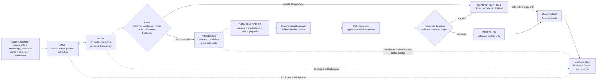

<!-- [KFM_META_BLOCK_V2]
doc_id: kfm://doc/TODO-VERIFY-adr-atmosphere-lane
title: ADR — Atmosphere / Air Domain Lane
type: standard
version: v1
status: draft
owners: TODO-VERIFY: atmosphere-air domain steward, documentation steward, schema steward, policy steward, release steward
created: 2026-05-08
updated: 2026-05-08
policy_label: public-draft-NEEDS_VERIFICATION
related: [./README.md, ./ADR-0208-domain-lane-template.md, ./ADR-0312-atmosphere-air-source-role-boundaries.md, ./ADR-0418-atmosphere-air-schema-slug-compatibility.md, ./ADR-0431-atmosphere-air-knowledge-character-boundary.md, ./ADR-0001-schema-home.md, ./ADR-0002-responsibility-root-monorepo.md, ../domains/atmosphere_air/README.md, ../domains/atmosphere_air/architecture/README.md, ../domains/atmosphere_air/architecture/ARCHITECTURE.md, ../domains/atmosphere_air/governance/SOURCE_REGISTRY.md, ../../connectors/pipelines/air/README.md, ../../connectors/pipelines/air/air_ingest.py, ../../data/processed/air/qa_summary.example.json, ../../data/receipts/air/run_receipt.example.json]
tags: [kfm, adr, atmosphere-air, domain-lane, evidence, source-role, knowledge-character, governed-api, release-governance, rollback]
notes: [Replaces the placeholder ADR-atmosphere-lane.md with a repo-grounded domain-lane decision. doc_id, owners, final policy label, CODEOWNERS routing, live-source rights, schema-home acceptance, CI enforcement, release maturity, runtime behavior, and dashboard/log evidence remain NEEDS VERIFICATION.]
[/KFM_META_BLOCK_V2] -->

<a id="top"></a>

# ADR — Atmosphere / Air Domain Lane

Admit Atmosphere / Air as a governed KFM domain lane whose public value is inspectable evidence-backed claims, not a single air-quality layer.

<p align="center">
  
  
  
  
  
  
  
</p>

<p align="center">
  <a href="#status">Status</a> ·
  <a href="#context">Context</a> ·
  <a href="#decision">Decision</a> ·
  <a href="#evidence-boundary">Evidence</a> ·
  <a href="#repo-fit">Repo fit</a> ·
  <a href="#lane-contract">Lane contract</a> ·
  <a href="#governed-flow">Flow</a> ·
  <a href="#consequences">Consequences</a> ·
  <a href="#verification">Verification</a> ·
  <a href="#rollback-and-supersession">Rollback</a> ·
  <a href="#open-verification-backlog">Open backlog</a>
</p>

> [!IMPORTANT]
> **Target path:** `docs/adr/ADR-atmosphere-lane.md`  
> **Decision state:** `draft / PROPOSED`  
> **Decision date:** `2026-05-08`  
> **Implementation posture:** bounded by current repository evidence. This ADR does not prove live source activation, schema completeness, CI enforcement, public release, MapLibre runtime binding, Evidence Drawer implementation, Focus Mode behavior, dashboards, logs, branch protection, or production deployment.

> [!CAUTION]
> Atmosphere / Air must not collapse into a single “air quality layer.” Observed measurements, AQI reports, regulatory archives, low-cost sensor candidates, model fields, smoke or AOD masks, advisories, station metadata, baseline context, and fusion products carry different authority, uncertainty, rights, time, and release burdens.

---

## Status

| Field | Value |
|---|---|
| ADR file | `docs/adr/ADR-atmosphere-lane.md` |
| Prior file state | Placeholder ADR with `proposed` status and unresolved decision text |
| Current ADR state | `draft / PROPOSED` |
| Scope | Domain architecture, governance, source roles, knowledge characters, lifecycle boundaries, release posture, public-surface rules, and rollback discipline |
| Supersedes | The placeholder content in this file |
| Does not supersede | [`ADR-0312-atmosphere-air-source-role-boundaries.md`](./ADR-0312-atmosphere-air-source-role-boundaries.md), [`ADR-0418-atmosphere-air-schema-slug-compatibility.md`](./ADR-0418-atmosphere-air-schema-slug-compatibility.md), [`ADR-0431-atmosphere-air-knowledge-character-boundary.md`](./ADR-0431-atmosphere-air-knowledge-character-boundary.md) |
| Public release posture | `DENY` until evidence, rights, source role, knowledge character, policy, review, release manifest, correction path, and rollback target are closed |
| Runtime posture | Governed API and Focus Mode must use finite outcomes: `ANSWER`, `ABSTAIN`, `DENY`, or `ERROR` |
| Enforcement maturity | `NEEDS VERIFICATION` for schemas, validators, policy wiring, tests, CI, proof closure, release behavior, UI/runtime binding, and branch protections |

[Back to top](#top)

---

## Context

KFM’s Atmosphere / Air lane already has meaningful repo-visible documentation and a small no-network `air` implementation slice, but the target ADR was still a placeholder. This ADR turns that placeholder into a bounded decision record that aligns the lane with existing KFM doctrine and adjacent Atmosphere / Air materials.

The project’s governing posture is:

- KFM is evidence-first, map-first, time-aware, policy-aware, auditable, and reversible.
- The durable public unit of value is the inspectable claim.
- Maps, tiles, graphs, summaries, search indexes, scenes, dashboards, receipts, model output, and rendered UI are downstream carriers, not sovereign truth.
- Public clients use governed interfaces and released artifacts.
- Promotion is a governed state transition, not a file move.
- AI is interpretive and evidence-subordinate.

Atmosphere / Air requires special care because different evidence classes can appear visually similar after rendering. A PM2.5 value, AQI report, smoke mask, AOD raster, model field, advisory, and fusion layer can all become “a colored map.” KFM must preserve the differences before any layer, popup, API response, Evidence Drawer panel, Focus Mode answer, export, or public artifact can make a consequential claim.

### Current lane signals

| Signal | Status | Reading |
|---|---:|---|
| `docs/domains/atmosphere_air/` | `CONFIRMED repo-visible` | Human-facing documentation lane. |
| `connectors/pipelines/air/` | `CONFIRMED repo-visible` | No-network implementation/testing slice; not whole-domain proof. |
| `data/processed/air/qa_summary.example.json` | `CONFIRMED repo-visible / candidate` | Processed candidate with `decision: candidate`, not public truth. |
| `data/receipts/air/run_receipt.example.json` | `CONFIRMED repo-visible / process memory` | Receipt with `network_access: disabled`, not proof or release authority. |
| `atmosphere` schema family | `PROPOSED / NEEDS VERIFICATION` | Whole-domain schema concept remains subject to schema-home and slug-compatibility decisions. |

[Back to top](#top)

---

## Decision

Adopt **Atmosphere / Air** as a KFM governed domain lane.

This lane is allowed to develop source descriptors, registries, schemas, contracts, policies, fixtures, validators, connectors, dry runs, catalog/proof candidates, governed API payloads, MapLibre layer descriptors, Evidence Drawer payloads, Focus Mode envelopes, release manifests, correction records, and rollback targets only when those surfaces preserve KFM’s evidence and lifecycle boundaries.

### Normative decision

After acceptance, Atmosphere / Air work MUST follow these rules:

1. **Use the current human-facing documentation lane:** `docs/domains/atmosphere_air/`.
2. **Treat `air` as the current no-network implementation/testing slice, not public truth.**
3. **Treat `atmosphere` as a proposed whole-domain schema/normalization concept until schema-home inventory, slug compatibility, fixtures, validators, and migration evidence prove otherwise.**
4. **Require `source_role` and `knowledge_character` for every consequential object or require resolution to a source descriptor that supplies them.**
5. **Keep observed measurements, AQI reports, regulatory archives, low-cost sensor candidates, model fields, remote-sensing masks, anomaly context, advisories, network/site context, baseline support, and fusion products distinct.**
6. **Deny public release while rights, source terms, source role, knowledge character, freshness, sensitivity, review state, release state, correction path, or rollback target are unresolved.**
7. **Require `EvidenceRef -> EvidenceBundle` closure before public or semi-public consequential claims.**
8. **Keep `RunReceipt`, QA summaries, connector output, graph deltas, layer descriptors, model output, and AI summaries out of the root-truth role.**
9. **Keep public clients downstream of governed APIs, released artifacts, and governed tile/layer delivery.**
10. **Make negative outcomes first-class:** `ABSTAIN` for insufficient support, `DENY` for policy/public-boundary violations, and `ERROR` for technical failure.
11. **Plan rollback and correction before publication.**
12. **Do not silently rename, collapse, or alias `atmosphere_air`, `air`, and `atmosphere`; use ADR-backed compatibility records and tests.**

### Delegated companion decisions

This ADR settles the lane-level admission decision. Companion ADRs remain responsible for narrower boundaries:

| Decision area | File | Role |
|---|---|---|
| Domain-lane template | [`ADR-0208-domain-lane-template.md`](./ADR-0208-domain-lane-template.md) | Shared standard for KFM domain lanes. |
| Source role and knowledge-character boundary | [`ADR-0312-atmosphere-air-source-role-boundaries.md`](./ADR-0312-atmosphere-air-source-role-boundaries.md) | Mandatory `source_role` and `knowledge_character` requirements. |
| Schema and slug compatibility | [`ADR-0418-atmosphere-air-schema-slug-compatibility.md`](./ADR-0418-atmosphere-air-schema-slug-compatibility.md) | Compatibility between `atmosphere_air`, `air`, and `atmosphere`. |
| Knowledge-character release/UI boundary | [`ADR-0431-atmosphere-air-knowledge-character-boundary.md`](./ADR-0431-atmosphere-air-knowledge-character-boundary.md) | Release, UI, Evidence Drawer, Focus Mode, and lifecycle implications. |
| Schema home | [`ADR-0001-schema-home.md`](./ADR-0001-schema-home.md) | Proposed machine-schema home and contract/schema/policy split. |
| Responsibility-root layout | [`ADR-0002-responsibility-root-monorepo.md`](./ADR-0002-responsibility-root-monorepo.md) | Root-level responsibility boundaries and no domain-root sprawl. |

### Decision sentence

> KFM admits Atmosphere / Air as a governed domain lane, but public or semi-public atmosphere/air claims remain blocked until source role, knowledge character, rights, evidence closure, policy, review, release, correction, and rollback gates are satisfied.

[Back to top](#top)

---

## Evidence boundary

This ADR separates confirmed repository evidence from proposed enforcement.

| Evidence | Status | Supports | Does not prove |
|---|---:|---|---|
| `docs/adr/ADR-atmosphere-lane.md` | `CONFIRMED` | Target ADR exists and previously held placeholder text. | Acceptance, enforcement, or release maturity. |
| `docs/adr/README.md` | `CONFIRMED` | ADRs are decision records and must preserve evidence, validation, rollback, and supersession. | Complete ADR coverage or CI enforcement. |
| `docs/domains/atmosphere_air/README.md` | `CONFIRMED` | Domain lane exists and documents scope, naming posture, public boundary, and knowledge-character caution. | Runtime binding or public release. |
| `docs/domains/atmosphere_air/architecture/ARCHITECTURE.md` | `CONFIRMED` | End-to-end trust flow and anti-collapse architecture are documented. | Live enforcement. |
| `docs/domains/atmosphere_air/governance/SOURCE_REGISTRY.md` | `CONFIRMED` | Source descriptor fields, source roles, knowledge characters, verification status, and fail-closed source admission are documented. | Machine registry activation or rights approval. |
| `connectors/pipelines/air/air_ingest.py` | `CONFIRMED` | No-network script writes deterministic candidate and receipt outputs. | Live source activation or proof closure. |
| `data/processed/air/qa_summary.example.json` | `CONFIRMED / candidate` | Example candidate includes PM2.5 aggregation, `decision: candidate`, `source.dataset: no_network_stub`, and evidence/receipt refs. | Public truth, EvidenceBundle resolution, or release approval. |
| `data/receipts/air/run_receipt.example.json` | `CONFIRMED / process memory` | Receipt records `network_access: disabled`, output path, pipeline path, run ID, and completed status. | Proof pack, release manifest, or publication approval. |
| Schema-home ADR | `CONFIRMED / PROPOSED` | `schemas/contracts/v1/` is proposed as machine-schema home; `contracts/` explains meaning; `policy/` decides admissibility. | Accepted schema-home enforcement. |
| Responsibility-root ADR | `CONFIRMED / ACCEPTED decision` | Root folders are responsibility boundaries and domain topics do not become roots by default. | Every subpath or compatibility root is already enforced. |

### Truth labels used in this ADR

| Label | Meaning |
|---|---|
| `CONFIRMED` | Verified from current repository connector evidence, current local workspace inspection, or supplied KFM doctrine. |
| `PROPOSED` | Recommended decision, implementation, validator, policy, path behavior, or release rule not yet proven as active enforcement. |
| `NEEDS VERIFICATION` | A concrete check can retire uncertainty. |
| `UNKNOWN` | Not verified strongly enough in this session. |
| `LINEAGE` | Prior project material that informs continuity but does not prove current implementation. |
| `DENY`, `ABSTAIN`, `ERROR`, `HOLD` | System or gate outcomes, not rhetorical emphasis. |

[Back to top](#top)

---

## Repo fit

`docs/adr/ADR-atmosphere-lane.md` belongs in `docs/adr/` because it records a cross-cutting architecture decision: whether and how Atmosphere / Air is admitted as a governed lane. The decision affects domain documentation, source registries, schema compatibility, policy gates, lifecycle data, connector behavior, release posture, map/UI delivery, Focus Mode, correction, and rollback.

### Responsibility-root placement

| Responsibility | Current or expected root | Rule |
|---|---|---|
| Architecture decision | `docs/adr/` | This ADR records the lane-level decision. |
| Human-facing domain docs | `docs/domains/atmosphere_air/` | Current documentation lane; do not rename silently. |
| Source admission docs | `docs/domains/atmosphere_air/governance/` | Human-facing registry posture; machine registry still needs verification. |
| Connector candidate logic | `connectors/pipelines/air/` | Current no-network candidate/receipt slice. |
| Processed candidate | `data/processed/air/` | Candidate-only unless promoted through gates. |
| Receipt | `data/receipts/air/` | Process memory; not proof or release. |
| Machine schemas | `schemas/contracts/v1/...` or ADR-approved schema home | Must follow schema-home and slug-compatibility ADRs. |
| Semantic contracts | `contracts/...` | Meaning and invariants, not machine-shape authority. |
| Policy | `policy/...` | Admissibility and release decisions. |
| Tests and fixtures | `tests/`, `fixtures/`, or repo-approved homes | Validation evidence, not source truth. |
| Release | `release/` or repo-approved release home | PromotionDecision, ReleaseManifest, rollback, correction. |

### Naming rule

| Name | Current role | Rule |
|---|---|---|
| `atmosphere_air` | Human-facing documentation lane | Keep for docs unless successor ADR migrates it. |
| `air` | No-network implementation/testing slice | Keep candidate/receipt semantics visible. |
| `atmosphere` | Proposed whole-domain schema/normalization concept | Do not treat as canonical until verified. |

> [!WARNING]
> Do not create `atmosphere/`, `air/`, or `atmosphere_air/` as a new top-level root. Domain work belongs under responsibility roots.

[Back to top](#top)

---

## Lane contract

Atmosphere / Air is a lane only when it can answer the following contract questions.

| Contract area | Required answer | Default posture |
|---|---|---|
| Scope | Which atmosphere/air objects are in scope and which belong to adjacent lanes. | `PROPOSED` until steward-reviewed. |
| Source role | What each source is competent to support. | Missing role -> `DENY`. |
| Knowledge character | What kind of knowledge each object represents. | Missing character -> `DENY`. |
| Rights and terms | Whether KFM may automate, transform, publish, cite, or expose the source. | Unknown rights -> `DENY` public release. |
| Temporal support | Observation, valid, model, report, retrieval, release, stale, and correction times. | Missing time support -> `ABSTAIN` for time-sensitive claims. |
| Spatial support | Station, grid, raster, polygon, plume/mask, region, report area, or site context. | Ambiguous support -> hold or deny map claims. |
| Evidence closure | Which EvidenceRefs resolve to EvidenceBundle support. | Unresolved evidence -> `ABSTAIN` or `DENY`. |
| Policy decision | Whether rights, sensitivity, source role, review, release, and public-boundary gates pass. | Policy failure -> `DENY`. |
| Public delivery | Which artifacts may be released and which remain internal/candidate. | Public release blocked by default. |
| Rollback/correction | How claims, layers, releases, and explanations can be corrected, withdrawn, or superseded. | Missing rollback target -> `DENY` publication. |

### Knowledge-character minimum set

The lane must preserve at least these knowledge characters unless a successor ADR narrows or extends them:

| Knowledge character | Meaning | Must not masquerade as |
|---|---|---|
| `OBSERVED_SENSOR` | Ground, station, or instrument measurement. | AQI report, model field, mask, or fusion product. |
| `PUBLIC_AQI_REPORT` | AQI, NowCast-like index, public report, or agency index object. | Raw concentration. |
| `REGULATORY_ARCHIVE` | Quality-assured or regulatory archive evidence. | Live state by default. |
| `LOW_COST_SENSOR` | Contributor or consumer sensor candidate. | Regulatory truth without correction/caveat support. |
| `ATMOSPHERIC_MODEL_FIELD` | Forecast, reanalysis, hindcast, smoke, transport, chemistry, or aerosol field. | Observed measurement. |
| `REMOTE_SENSING_MASK` | Smoke, AOD, fire, aerosol, haze, cloud, plume, or classification product. | Surface exposure or PM concentration. |
| `CLIMATE_ANOMALY_CONTEXT` | Normals, anomalies, baselines, downscaling, hindcasts. | Emergency alert or live hazard state. |
| `DERIVED_FUSION` | Interpolation, consensus, bias correction, ensemble, or fused surface. | Canonical source observation. |
| `METEOROLOGICAL_CONTEXT` | Wind, temperature, humidity, pressure, boundary-layer, or transport support. | Air-quality concentration unless measured as such. |
| `VISIBILITY_AND_AEROSOL_CONTEXT` | Visibility, haze, AOD, opacity, or optical aerosol context. | PM concentration without governed model support. |
| `FIRE_AND_EMISSIONS_CONTEXT` | Fire hotspots, emissions inventory, smoke-source context. | Exposure measurement. |
| `ALERT_AND_ADVISORY_CONTEXT` | Agency notice, public-health message, recommendation, or advisory. | KFM life-safety instruction. |
| `NETWORK_AND_SITE_CONTEXT` | Station metadata, cadence, active state, siting caveats, instrument health. | Measurement value. |
| `BASELINE_AND_TEMPORAL_SUPPORT` | Climatology, rolling baseline, persistence, hysteresis, freshness support. | Standalone proof. |

[Back to top](#top)

---

## Governed flow



### Flow obligations

| Stage | Atmosphere / Air obligation |
|---|---|
| Source edge | Admit source families through descriptor-first review. |
| RAW | Preserve source-native payload and traceability; never expose directly to public clients. |
| WORK | Normalize units and time while preserving raw values and source/site/model context. |
| QUARANTINE / HOLD | Hold missing rights, source role, knowledge character, evidence, schema support, or freshness. |
| PROCESSED | Store validated candidates; do not treat them as released truth. |
| CATALOG / TRIPLET | Build discovery and relation projections without replacing evidence. |
| Evidence closure | Resolve EvidenceRefs to EvidenceBundle before consequential claims. |
| Policy / review | Decide admissibility, review, release, correction, and rollback readiness. |
| PUBLISHED | Release only public-safe artifacts with manifest, correction path, and rollback target. |
| API / UI / Focus | Consume governed envelopes and released artifacts only. |

[Back to top](#top)

---

## Anti-collapse rules

| Rule ID | Rule | Required failure behavior |
|---|---|---|
| `ATMOS-R001` | AQI or public index must not be treated as raw concentration. | `DENY` with `ATMOS_AQI_AS_CONCENTRATION`. |
| `ATMOS-R002` | AOD must not be treated as PM2.5 without governed model assumptions and evidence. | `DENY` with `ATMOS_AOD_AS_PM25`. |
| `ATMOS-R003` | Smoke, plume, fire, or aerosol mask must not be treated as exposure measurement. | `DENY` or `ABSTAIN` unless model/fusion evidence supports it. |
| `ATMOS-R004` | Forecast, reanalysis, smoke, transport, or chemistry model field must not be labeled observed. | `DENY` with `ATMOS_MODEL_AS_OBSERVED`. |
| `ATMOS-R005` | Regulatory archive must not imply live/current state by default. | `ABSTAIN` or stale-scoped response. |
| `ATMOS-R006` | Low-cost sensor data must not be promoted without correction method, caveats, confidence, and rights. | `DENY` with `ATMOS_LOW_COST_NO_CORRECTION`. |
| `ATMOS-R007` | Fusion product must not hide input EvidenceRefs, method, uncertainty, or transform identity. | `DENY` with `ATMOS_FUSION_INPUTS_HIDDEN`. |
| `ATMOS-R008` | Advisory context must not become KFM emergency or life-safety instruction. | `DENY`; route users to official systems outside KFM. |
| `ATMOS-R009` | Site metadata must not be presented as measurement value. | `DENY` or `ERROR`. |
| `ATMOS-R010` | No-network fixture or stub output must not become real-world public truth. | `DENY` public release. |
| `ATMOS-R011` | Run receipt must not become EvidenceBundle, proof pack, PromotionDecision, or ReleaseManifest. | `DENY` with `ATMOS_RECEIPT_AS_PROOF`. |
| `ATMOS-R012` | Public UI/API/Focus/export must not read connector, RAW, WORK, QUARANTINE, or unpublished candidates directly. | `DENY` with `ATMOS_PUBLIC_INTERNAL_ACCESS`. |
| `ATMOS-R013` | Stale operational context must not appear current. | `ABSTAIN` or stale-labeled response. |
| `ATMOS-R014` | Unknown rights, terms, or public-release permission must not be smoothed over. | `DENY` with `ATMOS_UNKNOWN_RIGHTS_PUBLIC`. |

[Back to top](#top)

---

## Current no-network slice

The repo-visible `air` slice is useful implementation pressure, but it remains candidate-only.

| File | Confirmed role | Boundary |
|---|---|---|
| [`../../connectors/pipelines/air/air_ingest.py`](../../connectors/pipelines/air/air_ingest.py) | Writes deterministic no-network QA summary and run receipt. | Candidate writer; no live source activation. |
| [`../../data/processed/air/qa_summary.example.json`](../../data/processed/air/qa_summary.example.json) | PM2.5 nowcast-hourly candidate with `decision: candidate`. | Not public truth. |
| [`../../data/receipts/air/run_receipt.example.json`](../../data/receipts/air/run_receipt.example.json) | Run receipt with `network_access: disabled`. | Process memory only. |
| `policy/air/air_qa.rego` | Repo-visible policy pressure referenced by domain docs. | Policy fragment; whole-lane policy remains incomplete until verified. |
| `tools/validators/air/validate_air_qa.py` | Repo-visible validator pressure referenced by docs. | Schema inventory and CI behavior remain `NEEDS VERIFICATION`. |

### Slice reading rule

```text
completed no-network run
≠ live source activation
≠ evidence closure
≠ rights approval
≠ release proof
≠ public layer
≠ Focus Mode authority
```

[Back to top](#top)

---

## Consequences

### Positive consequences

- Replaces a placeholder ADR with a governed lane-level decision.
- Aligns the lane with the domain-lane template instead of inventing a one-off architecture.
- Preserves current repo evidence: `docs/domains/atmosphere_air` as the docs lane and `air` as a no-network implementation slice.
- Keeps source role and knowledge character visible from source admission through public surfaces.
- Blocks common atmosphere/air overclaims such as AQI-as-concentration, AOD-as-PM2.5, model-as-observation, and receipt-as-proof.
- Makes release, correction, and rollback obligations part of the lane decision.
- Keeps Focus Mode and MapLibre downstream of governed evidence rather than upstream of truth.

### Costs and tradeoffs

| Cost | Mitigation |
|---|---|
| More upfront documentation and validation burden | Keep first proof slices no-network, small, and reversible. |
| Live source work remains blocked | Source descriptors, rights, terms, cadence, public-release posture, and fixtures must come first. |
| Schema naming remains complex | Use ADR-0418 and schema-home inventory rather than silent renames. |
| Public demos may be delayed | Candidate artifacts can support tests without implying public truth. |
| Domain docs and implementation slices use different slugs | Keep compatibility visible and test-covered before migration. |

### Accepted tradeoff

KFM accepts slower Atmosphere / Air publication in exchange for source integrity, public-surface safety, evidence closure, and rollback readiness.

[Back to top](#top)

---

## Verification

This ADR can move toward `accepted` only when the following checks are performed and recorded in repo-native evidence such as PR notes, validation reports, CI logs, receipts, or proof objects.

### Documentation gates

- [ ] `docs/adr/README.md` lists this ADR with its final status.
- [ ] `docs/domains/atmosphere_air/README.md` links to this ADR.
- [ ] ADR-0312, ADR-0418, and ADR-0431 remain linked and non-conflicting.
- [ ] Owners, CODEOWNERS routing, policy label, and final `doc_id` are verified.
- [ ] No duplicate ADR authority is introduced under a parallel path.

### Schema and registry gates

- [ ] Schema-home status is checked against ADR-0001 or successor.
- [ ] `air`, `atmosphere`, and `atmosphere_air` slug compatibility is handled through ADR-0418 or successor.
- [ ] Machine source registry home is verified before any registry is treated as canonical.
- [ ] Source descriptor fixtures cover required fields: `source_id`, `source_role`, `knowledge_character`, rights, freshness, public-release flag, and verification status.
- [ ] Parameter and unit registries preserve raw values, normalized values, and invalid conversion cases.

### Validator and policy gates

- [ ] Missing `source_role` fails.
- [ ] Missing `knowledge_character` fails.
- [ ] Unknown rights block public release.
- [ ] AQI-as-concentration fails.
- [ ] AOD-as-PM2.5 without governed model support fails.
- [ ] Smoke-mask-as-exposure fails.
- [ ] Model-as-observed fails.
- [ ] Fusion-with-hidden-inputs fails.
- [ ] Receipt-as-proof fails.
- [ ] Public internal lifecycle access fails.
- [ ] Fixture/no-network output as public truth fails.
- [ ] Release candidate without rollback target fails.
- [ ] Release candidate without correction path fails.

### Runtime and release gates

- [ ] EvidenceRefs resolve to EvidenceBundle before consequential claims.
- [ ] ReleaseManifest includes artifact scope, evidence/proof refs, review state, hashes, correction path, and rollback target.
- [ ] Evidence Drawer payload exposes source role, knowledge character, rights, review, release, freshness, caveats, and conflicts.
- [ ] Focus Mode emits only `ANSWER`, `ABSTAIN`, `DENY`, or `ERROR`.
- [ ] Public MapLibre layers reference released artifacts or governed envelopes only.
- [ ] CI or equivalent validation has run successfully on the active branch.

[Back to top](#top)

---

## Rollback and supersession

### Rollback rule

A future implementation based on this ADR must be reversible without deleting decision history.

Rollback must preserve:

- this ADR and successor links;
- source descriptor lineage;
- candidate artifact lineage;
- run receipts;
- EvidenceBundle/proof lineage when present;
- ReleaseManifest and rollback cards when present;
- user-visible correction or withdrawal notes when public claims are affected.

### Supersession rule

If a successor ADR changes this lane decision:

1. Mark this ADR as `superseded`.
2. Link to the successor.
3. Preserve the old file as lineage.
4. Update ADR index, domain README, architecture docs, source registry docs, schema/slug compatibility docs, validation docs, release docs, and rollback docs.
5. Record migration and rollback effects for any schema, source, policy, API, UI, Focus Mode, or public artifact that depends on the old decision.

> [!WARNING]
> A clean-looking tree that hides prior authority is not an acceptable rollback. KFM rollback must remain auditable.

[Back to top](#top)

---

## Open verification backlog

| Item | Status | Why it matters |
|---|---:|---|
| Final `doc_id` | `NEEDS VERIFICATION` | Current value is a reviewable placeholder. |
| Owners and CODEOWNERS routing | `NEEDS VERIFICATION` | Lane, policy, schema, release, and docs review burden must be assigned. |
| Final policy label | `NEEDS VERIFICATION` | Public/restricted posture must be deliberate. |
| ADR acceptance state | `NEEDS VERIFICATION` | This file is draft/proposed until maintainer review accepts it. |
| Mounted local checkout | `UNKNOWN in this workspace` | GitHub connector evidence was available; local repo was not mounted. |
| Schema inventory | `NEEDS VERIFICATION` | `air` and `atmosphere` schema paths must be inventoried on active branch. |
| Machine source registry home | `NEEDS VERIFICATION` | Human source registry exists; machine registry authority remains unresolved. |
| CI enforcement | `UNKNOWN` | Workflow presence and successful run status were not proven here. |
| Live source rights and terms | `UNKNOWN` | Public release must remain denied until rights and terms are verified. |
| EvidenceBundle referenced by QA candidate | `NEEDS VERIFICATION` | The candidate references an EvidenceBundle path, but closure was not proven here. |
| ReleaseManifest and rollback card for Atmosphere / Air | `UNKNOWN` | Publication must not proceed without them. |
| MapLibre layer binding | `UNKNOWN` | Layer docs exist; runtime binding was not proven. |
| Evidence Drawer implementation | `UNKNOWN` | Payload requirements exist; component behavior was not proven. |
| Focus Mode implementation | `UNKNOWN` | Runtime outcome behavior was not proven. |
| Dashboards, logs, branch protections, deployment state | `UNKNOWN` | No runtime/deployment evidence was inspected here. |

[Back to top](#top)
