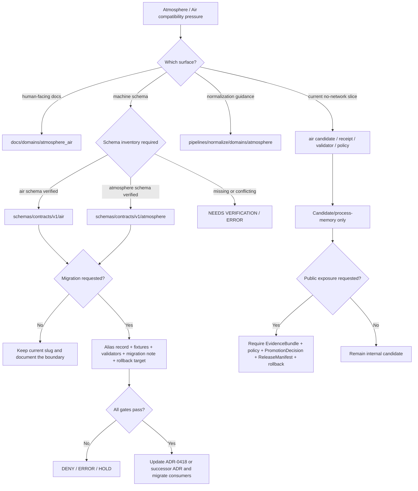

<!-- [KFM_META_BLOCK_V2]
doc_id: kfm://doc/NEEDS-VERIFICATION-ADR-atmosphere-schema-compatibility
title: ADR: Atmosphere Schema Compatibility
type: standard
version: v1
status: draft
owners: OWNER_TBD_NEEDS_VERIFICATION
created: NEEDS_VERIFICATION-YYYY-MM-DD
updated: 2026-05-08
policy_label: public-draft-NEEDS_VERIFICATION
related: [./README.md, ./ADR-0001-schema-home.md, ./ADR-0312-atmosphere-air-source-role-boundaries.md, ./ADR-0418-atmosphere-air-schema-slug-compatibility.md, ./ADR-0431-atmosphere-air-knowledge-character-boundary.md, ../domains/atmosphere_air/README.md, ../../connectors/pipelines/air/README.md, ../../pipelines/normalize/domains/atmosphere/README.md, ../../tools/validators/air/validate_air_qa.py, ../../policy/air/air_qa.rego, ../../data/processed/air/qa_summary.example.json, ../../data/receipts/air/run_receipt.example.json]
tags: [kfm, adr, atmosphere-air, atmosphere, air, schema-compatibility, schema-home, evidence, policy, release, rollback]
notes: [Replaces a backlog placeholder with an evidence-bounded compatibility ADR. Existing placeholder carried Decision Date 2026-05-08; permanent doc_id, created date, owners, policy label, acceptance state, CI enforcement, branch protection, schema inventory, and runtime behavior remain NEEDS VERIFICATION. This ADR is a bridge decision; ADR-0418 remains the detailed schema-slug compatibility decision unless maintainers explicitly supersede or merge it.]
[/KFM_META_BLOCK_V2] -->

<a id="top"></a>

# ADR: Atmosphere Schema Compatibility

Define how KFM keeps the `atmosphere_air` documentation lane, the `air` implementation slice, and the proposed `atmosphere` schema family compatible without silently changing evidence, policy, source-role, release, or rollback meaning.

<p align="center">
  
  
  
  
  
  
</p>

<p align="center">
  <a href="#adr-header">Header</a> ·
  <a href="#context">Context</a> ·
  <a href="#decision">Decision</a> ·
  <a href="#repo-fit">Repo fit</a> ·
  <a href="#evidence-boundary">Evidence</a> ·
  <a href="#compatibility-map">Compatibility map</a> ·
  <a href="#validation-plan">Validation</a> ·
  <a href="#rollback-and-supersession">Rollback</a> ·
  <a href="#verification">Verification</a>
</p>

> [!IMPORTANT]
> **Status:** `draft` / `PROPOSED`.
>
> This ADR does **not** authorize schema migration, public release, live source activation, UI/API binding, Focus Mode answers, MapLibre layer publication, or promotion. It records the compatibility decision and the evidence required before enforcement can be claimed.

> [!NOTE]
> This file replaces a thin backlog placeholder. It intentionally keeps the original stable section anchors — [Context](#context), [Decision](#decision), [Consequences](#consequences), and [Verification](#verification) — while adding KFM evidence, validation, rollback, and compatibility structure.

---

## ADR header

| Field | Value |
|---|---|
| ADR ID | `ADR-atmosphere-schema-compatibility` |
| Target path | `docs/adr/ADR-atmosphere-schema-compatibility.md` |
| Status | `draft` / `PROPOSED` |
| Decision date | `2026-05-08` from existing placeholder; `NEEDS VERIFICATION` against git history or document registry |
| Owners | `OWNER_TBD_NEEDS_VERIFICATION` |
| Scope | Atmosphere / Air schema compatibility, ADR governance, source-role preservation, release boundary, migration discipline |
| Supersedes | The previous backlog placeholder in this file |
| Related ADRs | [`ADR-0001-schema-home.md`](./ADR-0001-schema-home.md), [`ADR-0312-atmosphere-air-source-role-boundaries.md`](./ADR-0312-atmosphere-air-source-role-boundaries.md), [`ADR-0418-atmosphere-air-schema-slug-compatibility.md`](./ADR-0418-atmosphere-air-schema-slug-compatibility.md), [`ADR-0431-atmosphere-air-knowledge-character-boundary.md`](./ADR-0431-atmosphere-air-knowledge-character-boundary.md) |
| Related domain docs | [`../domains/atmosphere_air/README.md`](../domains/atmosphere_air/README.md) |
| Related implementation-pressure surfaces | [`../../connectors/pipelines/air/README.md`](../../connectors/pipelines/air/README.md), [`../../pipelines/normalize/domains/atmosphere/README.md`](../../pipelines/normalize/domains/atmosphere/README.md), [`../../tools/validators/air/validate_air_qa.py`](../../tools/validators/air/validate_air_qa.py), [`../../policy/air/air_qa.rego`](../../policy/air/air_qa.rego) |
| Current confidence | `CONFIRMED` target file exists; `CONFIRMED` adjacent repo surfaces exist; `PROPOSED` compatibility decision; `NEEDS VERIFICATION` schema inventory and enforcement |
| Rollback target | Revert to placeholder only if this revision is rejected; otherwise preserve as lineage and supersede with a successor ADR |

[Back to top](#top)

---

## Context

The original file was a backlog-defined ADR placeholder whose decision text only stated that the ADR would settle **atmosphere schema compatibility**. Since that placeholder was created, the repo-visible Atmosphere / Air lane now exposes more precise decision pressure:

| Surface | Repo-visible role | Compatibility pressure |
|---|---|---|
| `docs/domains/atmosphere_air/` | Human-facing domain documentation lane | Uses `atmosphere_air` as the domain docs slug. |
| `connectors/pipelines/air/` | No-network connector slice | Uses `air` for the current fixture/candidate implementation slice. |
| `data/processed/air/` and `data/receipts/air/` | Candidate and process-memory examples | Use `air` for current no-network example artifacts. |
| `tools/validators/air/` and `policy/air/` | Current air QA validation and policy pressure | Use `air`; validator references a schema path that still needs verification. |
| `pipelines/normalize/domains/atmosphere/` | Normalization documentation lane | Uses `atmosphere` for execution-near whole-domain normalization guidance. |
| proposed whole-domain schemas | Future machine-contract family | May use `atmosphere`, but canonical schema inventory is not yet proven. |

The problem is not naming aesthetics. The problem is that naming drift can silently become evidence drift. If `air`, `atmosphere`, and `atmosphere_air` are collapsed without a migration record, KFM can lose the distinction between:

- documentation scope and machine-schema authority;
- no-network fixtures and live source data;
- PM2.5 concentration and AQI/report objects;
- AOD or smoke masks and surface exposure claims;
- modeled fields and observed measurements;
- run receipts and proof or release objects;
- candidates and published artifacts.

KFM’s atmosphere corpus also treats this lane as larger than an air-quality-only slice. It includes sensor observations, public AQI reports, regulatory archives, low-cost sensors, model fields, remote-sensing masks, climate/anomaly context, derived fusion products, meteorological support, visibility/aerosol context, fire/emissions context, advisories, network/site metadata, and temporal support.

> [!WARNING]
> A schema path that validates shape is not release approval. Public or semi-public claims still require evidence closure, policy, rights, review state, release state, correction path, and rollback target.

[Back to top](#top)

---

## Decision

KFM will keep this ADR as a **repo-wide compatibility bridge** for Atmosphere / Air schema compatibility.

### Chosen compatibility rule

| Name | Current role | Decision |
|---|---|---|
| `atmosphere_air` | Current human-facing docs lane | Preserve as the documentation slug unless a successor ADR migrates it. |
| `air` | Current no-network implementation, candidate, receipt, validator, and policy slice | Preserve as an implementation-slice slug until schema inventory, alias records, fixtures, validators, and rollback prove a safe migration. |
| `atmosphere` | Whole-domain normalization and future schema concept | Treat as `PROPOSED` for machine schemas until ADR-0001, ADR-0418, schema inventory, and tests prove the convention. |

### Normative decision after acceptance

1. **Do not silently rename or collapse `air`, `atmosphere`, and `atmosphere_air`.**
2. **Do not claim `schemas/contracts/v1/air/` or `schemas/contracts/v1/atmosphere/` is canonical until active-branch inventory proves the schema files and consumers.**
3. **Treat `ADR-0418-atmosphere-air-schema-slug-compatibility.md` as the detailed slug-compatibility ADR unless maintainers explicitly supersede or merge it.**
4. **Require explicit compatibility records before migration.** Any migration between `air` and `atmosphere` requires an alias or compatibility record with owner, status, canonical target, review date, valid/invalid fixtures, validator coverage, migration note, and rollback target.
5. **Preserve source role and knowledge character across every schema path.** A compatible schema must not flatten `OBSERVED_SENSOR`, `PUBLIC_AQI_REPORT`, `REGULATORY_ARCHIVE`, `LOW_COST_SENSOR`, `ATMOSPHERIC_MODEL_FIELD`, `REMOTE_SENSING_MASK`, `DERIVED_FUSION`, `ALERT_AND_ADVISORY_CONTEXT`, or related categories.
6. **Keep candidate, receipt, proof, release, and publication states separate.** `data/processed/air/qa_summary.example.json` and `data/receipts/air/run_receipt.example.json` are useful current examples, but they do not authorize public truth or release.
7. **Fail closed on unresolved compatibility.** If a consumer cannot resolve the schema family, source role, knowledge character, rights, EvidenceBundle, or release state, it must return `DENY`, `ABSTAIN`, `ERROR`, or hold the candidate for review.

### Operating sentence

> `atmosphere_air` is the current docs lane, `air` is the current no-network implementation slice, and `atmosphere` is the whole-domain schema/normalization concept until inventory, tests, aliases, and ADR-backed migration prove otherwise.

### Boundary sentence

> Schema compatibility must never allow public clients, MapLibre layers, Evidence Drawer payloads, Focus Mode, exports, or reports to bypass governed APIs, evidence closure, policy, release state, correction path, or rollback target.

[Back to top](#top)

---

## Repo fit

`docs/adr/` is the correct home for this file because this decision crosses documentation, schemas, contracts, policy, validators, connector candidates, normalization, release boundaries, and public-client behavior.

Directory discipline in KFM treats root folders as responsibility boundaries. Domain names should grow under responsibility roots, not as new root-level topic folders.

| Responsibility root | Role in this decision |
|---|---|
| `docs/adr/` | Architecture decision and compatibility governance. |
| `docs/domains/atmosphere_air/` | Human-facing Atmosphere / Air domain documentation. |
| `schemas/` | Machine-checkable schema authority after ADR-backed verification. |
| `contracts/` | Human-readable semantic meaning for object families. |
| `policy/` | Admissibility, release, public-exposure, sensitivity, and reason-code decisions. |
| `connectors/` | Source-facing or no-network connector candidates; not canonical truth. |
| `pipelines/` | Execution-near pipeline logic or normalization guidance; not release approval. |
| `data/processed/` | Processed candidates; not public truth by itself. |
| `data/receipts/` | Process memory; not proof or release by itself. |
| `data/proofs/` and `release/` | Proof closure, promotion decisions, release manifests, correction path, and rollback target when verified. |

> [!CAUTION]
> Do not create a new root-level `atmosphere/`, `air/`, or `atmosphere_air/` folder to solve this naming issue. Resolve it through responsibility roots, ADRs, schemas, contracts, policy, fixtures, tests, validators, release records, and migration notes.

[Back to top](#top)

---

## Evidence boundary

This ADR distinguishes repo-visible evidence from implementation claims that still need verification.

| Evidence item | Status | Supports | Does not prove |
|---|---:|---|---|
| `docs/adr/ADR-atmosphere-schema-compatibility.md` | `CONFIRMED` | Target file exists as a placeholder and is the file being revised. | That this ADR is accepted or enforced. |
| `docs/adr/README.md` | `CONFIRMED` | ADRs are the decision ledger and should separate decision state from implementation proof. | Complete ADR coverage, owner routing, or CI enforcement. |
| `docs/adr/ADR-TEMPLATE.md` | `CONFIRMED` | ADRs should include evidence, impact, validation, rollback, and supersession. | That this ADR is accepted. |
| `docs/adr/ADR-0001-schema-home.md` | `CONFIRMED / PROPOSED` | `schemas/contracts/v1/` is the proposed machine-schema home; `contracts/` explains meaning; `policy/` decides admissibility. | Accepted schema-home enforcement. |
| `docs/adr/ADR-0418-atmosphere-air-schema-slug-compatibility.md` | `CONFIRMED / PROPOSED` | Detailed compatibility decision already exists for `atmosphere_air`, `air`, and `atmosphere`. | That all schema aliases, schema files, fixtures, validators, and CI checks exist. |
| `docs/adr/ADR-0312-atmosphere-air-source-role-boundaries.md` | `CONFIRMED / PROPOSED` | Source role and knowledge character are mandatory trust-bearing boundaries for Atmosphere / Air. | Full enforcement. |
| `docs/adr/ADR-0431-atmosphere-air-knowledge-character-boundary.md` | `CONFIRMED / PROPOSED` | Knowledge-character boundary applies to release, UI, Evidence Drawer, Focus Mode, and lifecycle behavior. | Full enforcement. |
| `docs/domains/atmosphere_air/README.md` | `CONFIRMED` | Human-facing docs lane exists and describes Atmosphere / Air scope, naming posture, knowledge characters, and publication block. | Runtime behavior or public release. |
| `connectors/pipelines/air/README.md` | `CONFIRMED` | Current no-network connector lane emits candidate artifacts and receipts, not publication. | Live source activation. |
| `tools/validators/air/validate_air_qa.py` | `CONFIRMED` | Current validator references `schemas/contracts/v1/air/qa_summary.schema.json` and applies local denial checks. | Referenced schema file exists or validator has passed in CI. |
| `policy/air/air_qa.rego` | `CONFIRMED` | Current policy fragment has deny rules for high NowCast, high baseline deviation, low coverage, AQS hard-denial rows, and missing refs. | Whole-domain policy completeness. |
| `data/processed/air/qa_summary.example.json` | `CONFIRMED / candidate only` | Current no-network QA candidate uses `decision: candidate`, `pm25`, `ug_m3`, `nowcast_hourly`, and refs. | Public truth, release state, or EvidenceBundle closure. |
| `data/receipts/air/run_receipt.example.json` | `CONFIRMED / process memory only` | Current receipt records `network_access: disabled`, output path, pipeline path, run ID, schema version, and completed status. | Proof, release, or public authorization. |
| `schemas/contracts/v1/air/qa_summary.schema.json` | `NEEDS VERIFICATION` | Referenced by current validator and release-tooling pressure. | Direct fetch did not confirm it in this session. |
| `docs/domains/atmosphere_air/ADR-0002-atmosphere-schema-compatibility.md` | `NEEDS VERIFICATION` | Referenced by adjacent docs/ADRs as a domain-local compatibility record. | Direct fetch did not confirm it in this session. |

[Back to top](#top)

---

## Compatibility map

### Current surfaces

| Surface | Current slug | Compatibility posture |
|---|---|---|
| Domain documentation | `atmosphere_air` | `CONFIRMED` and should remain the human-facing docs slug until a successor ADR migrates it. |
| No-network connector | `air` | `CONFIRMED` implementation-slice slug; keep candidate-only. |
| Processed candidate example | `air` | `CONFIRMED`; candidate-only and not public truth. |
| Run receipt example | `air` | `CONFIRMED`; process memory only. |
| Validator and policy fragment | `air` | `CONFIRMED`; schema target still needs verification. |
| Normalization documentation | `atmosphere` | `CONFIRMED` path for execution-near normalization guidance, not schema authority by itself. |
| Whole-domain schema family | `atmosphere` | `PROPOSED / NEEDS VERIFICATION` until schema-home inventory and migration tests prove it. |
| Schema reference from validator | `schemas/contracts/v1/air/qa_summary.schema.json` | `NEEDS VERIFICATION`; referenced but not confirmed present in this session. |

### Compatibility flow



### Required alias record shape

If maintainers temporarily support both `air` and `atmosphere` schema paths, the bridge must be explicit.

```yaml
# PROPOSED registry shape; final path and schema need verification.
schema_slug_alias:
  alias_id: atmosphere-air-schema-compatibility-v1
  governing_adr: docs/adr/ADR-atmosphere-schema-compatibility.md
  detailed_slug_adr: docs/adr/ADR-0418-atmosphere-air-schema-slug-compatibility.md
  status: proposed
  owner: OWNER_TBD_NEEDS_VERIFICATION
  created: NEEDS_VERIFICATION-YYYY-MM-DD
  review_by: NEEDS_VERIFICATION-YYYY-MM-DD

  from:
    slug: air
    path_prefix: schemas/contracts/v1/air/
    current_role: no-network implementation and QA candidate slice
    evidence_status: referenced_by_repo_tooling

  to:
    slug: atmosphere
    path_prefix: schemas/contracts/v1/atmosphere/
    intended_role: whole-domain Atmosphere / Air schema family
    evidence_status: NEEDS_VERIFICATION

  denied_for:
    - silent_publication
    - direct_public_ui_binding
    - source_activation
    - schema_generation_without_review
    - raw_work_quarantine_public_access
    - fixture_backed_public_truth

  required_tests:
    - valid_current_air_qa_candidate
    - invalid_aqi_as_concentration
    - invalid_aod_as_pm25
    - invalid_model_as_observation
    - invalid_fixture_backed_publication
    - invalid_run_receipt_as_proof
    - invalid_internal_lifecycle_public_reference
    - alias_missing_target_fails_closed

  rollback_note: Preserve alias record after retirement; do not delete lineage.
```

> [!WARNING]
> Aliases are migration tools, not second authorities.

[Back to top](#top)

---

## Requirements and constraints

### KFM invariants checked

| Invariant | Compatibility requirement |
|---|---|
| `RAW -> WORK / QUARANTINE -> PROCESSED -> CATALOG / TRIPLET -> PUBLISHED` | Schema compatibility must not let candidates skip lifecycle gates. |
| Promotion is a governed state transition | Schema migration or aliasing cannot publish data by path movement. |
| Public clients use governed interfaces | Public UI, API, maps, exports, and Focus Mode must consume governed envelopes or released artifacts only. |
| `EvidenceRef -> EvidenceBundle` closure | A schema-compatible object is still not a public claim until evidence resolves. |
| Source role required | Schema migration must preserve provider role and authority class. |
| Knowledge character required | Schema migration must preserve observation/report/model/mask/fusion/advisory distinctions. |
| Policy is separate from schema validity | Passing JSON Schema is not rights, sensitivity, release, or public-use permission. |
| Receipts are not proofs | `RunReceipt` remains process memory; it cannot become `EvidenceBundle`, `ProofPack`, `PromotionDecision`, or `ReleaseManifest`. |
| Unknown rights fail closed | Unknown source terms or public-release permission must block public release. |
| Rollback and correction are first-class | Any compatibility migration needs rollback target and correction path when public surfaces could be affected. |

### Anti-collapse rules

| Rule | Required outcome |
|---|---|
| AQI or NowCast report is treated as raw concentration | `DENY` |
| AOD is treated as PM2.5 without governed model assumptions and evidence | `DENY` |
| Smoke/plume/fire mask is treated as exposure measurement | `DENY` or `ABSTAIN` |
| Model field is labeled observed | `DENY` |
| Regulatory archive is treated as live state without temporal support | `ABSTAIN` or stale-scoped response |
| Low-cost sensor is promoted without correction method, caveats, confidence, and rights | `DENY` |
| Fusion product hides input EvidenceRefs, method, uncertainty, or transform identity | `DENY` |
| No-network fixture becomes real-world public truth | `DENY` |
| Run receipt is treated as proof or release | `DENY` |
| Public surface reads connector, normalize, RAW, WORK, QUARANTINE, or unpublished candidate artifacts directly | `DENY` |

[Back to top](#top)

---

## Consequences

### Positive consequences

- Keeps a thin placeholder ADR useful without pretending it is the detailed slug-compatibility authority.
- Makes the compatibility relationship among `atmosphere_air`, `air`, and `atmosphere` visible at the repo-wide ADR layer.
- Prevents a path rename from silently changing evidence, policy, source-role, or release meaning.
- Preserves the current no-network `air` slice as candidate/process-memory evidence pressure without overclaiming publication.
- Gives maintainers concrete acceptance criteria before schema-family migration.
- Protects downstream MapLibre, Evidence Drawer, Focus Mode, API, export, and release surfaces from schema-path overclaim.

### Costs and tradeoffs

| Tradeoff | Mitigation |
|---|---|
| Adds another ADR near ADR-0418. | Treat this file as a bridge and let ADR-0418 remain detailed slug-compatibility authority unless maintainers merge/supersede. |
| Slows schema cleanup. | Require small, reversible migration with fixtures and rollback rather than broad rename. |
| Keeps three slugs visible. | Visible ambiguity is safer than hidden compatibility drift. |
| Requires negative tests before public use. | Negative tests are the minimum proof that doctrine is enforceable. |
| Does not settle final `air` vs `atmosphere` schema family. | That settlement requires active-branch schema inventory and ADR-0001 status verification. |

### Risks

| Risk | Mitigation |
|---|---|
| Maintainers treat this ADR as accepted enforcement. | Keep status `draft` / `PROPOSED`; require acceptance evidence. |
| `air` and `atmosphere` schema files diverge. | Add alias registry, compatibility matrix, and schema-consumer inventory. |
| Tooling references missing schema files. | Run active-branch schema inventory and validator checks before acceptance. |
| Fixture candidates become public truth. | Public-boundary tests must deny fixture-backed publication. |
| Run receipts are used as proof. | Receipt/proof split gate must deny `RunReceipt` as `EvidenceBundle`, `ProofPack`, or `ReleaseManifest`. |
| UI or Focus Mode bypasses governed release. | Public surfaces must consume governed API envelopes and released artifacts only. |

[Back to top](#top)

---

## Validation plan

Validation must prove compatibility behavior, not just Markdown readability.

### Required checks before acceptance

| Check | Expected result | Status |
|---|---|---:|
| ADR index includes this file | `docs/adr/README.md` links or lists this ADR with status | `NEEDS VERIFICATION` |
| ADR-0418 relationship is explicit | This ADR is marked bridge, sibling, successor, or superseded by ADR-0418 | `NEEDS VERIFICATION` |
| Active schema inventory | `schemas/contracts/v1/air/` and `schemas/contracts/v1/atmosphere/` inventory is captured | `NEEDS VERIFICATION` |
| Validator schema reference resolves | `tools/validators/air/validate_air_qa.py --schema ...` target exists or a migration alias is approved | `NEEDS VERIFICATION` |
| No-network artifacts remain non-public | `qa_summary.example.json` remains `decision: candidate`; receipt remains process memory | `CONFIRMED example / NEEDS TEST` |
| Policy denial parity | Rego and local validator reason codes stay aligned or divergence is documented | `NEEDS VERIFICATION` |
| Valid fixture | Current no-network QA candidate validates once schema path is resolved | `NEEDS VERIFICATION` |
| Invalid AQI-as-concentration fixture | Denied | `NEEDS VERIFICATION` |
| Invalid AOD-as-PM2.5 fixture | Denied | `NEEDS VERIFICATION` |
| Invalid model-as-observation fixture | Denied | `NEEDS VERIFICATION` |
| Invalid run-receipt-as-proof fixture | Denied | `NEEDS VERIFICATION` |
| Invalid fixture-backed-publication fixture | Denied | `NEEDS VERIFICATION` |
| Public internal path fixture | Denied if public output references RAW, WORK, QUARANTINE, connector-private, normalize-stage, or unpublished candidate data | `NEEDS VERIFICATION` |
| Rollback plan | Compatibility migration has rollback target and lineage preservation | `NEEDS VERIFICATION` |

### Suggested read-only inventory commands

Run from the active repository checkout.

```bash
git status --short
git branch --show-current
git rev-parse --show-toplevel

# ADR inventory.
find docs/adr -maxdepth 1 -type f -name 'ADR-*.md' | sort
grep -RInE 'ADR-atmosphere-schema-compatibility|ADR-0418|ADR-0312|ADR-0431' docs/adr docs/domains/atmosphere_air 2>/dev/null || true

# Atmosphere/Air naming inventory.
find docs/domains/atmosphere_air connectors/pipelines/air pipelines/normalize/domains/atmosphere tools/validators/air policy/air data/processed/air data/receipts/air -maxdepth 4 -type f 2>/dev/null | sort

# Schema inventory; absence is a verification result, not a conclusion to hide.
find schemas/contracts/v1 -maxdepth 4 -type f 2>/dev/null | sort | grep -E '/(air|atmosphere)/' || true

# Candidate and receipt parse.
python -m json.tool data/processed/air/qa_summary.example.json > /dev/null
python -m json.tool data/receipts/air/run_receipt.example.json > /dev/null
```

### Optional schema-resolution check

```python
# Illustrative only — adapt to repo-native validator conventions.
# Purpose: fail closed when Atmosphere / Air schema-family resolution is ambiguous.

from dataclasses import dataclass
from pathlib import Path


@dataclass(frozen=True)
class SchemaAlias:
    alias_prefix: str
    canonical_prefix: str
    status: str
    governing_adr: str
    owner: str


ACTIVE_STATUSES = {"active", "deprecated_with_tests"}
GOVERNING_ADRS = {
    "docs/adr/ADR-atmosphere-schema-compatibility.md",
    "docs/adr/ADR-0418-atmosphere-air-schema-slug-compatibility.md",
}


def resolve_atmosphere_schema(path: str, aliases: list[SchemaAlias]) -> tuple[bool, str]:
    normalized = path.replace("\\", "/")

    if normalized.startswith("schemas/contracts/v1/air/"):
        family = "air"
    elif normalized.startswith("schemas/contracts/v1/atmosphere/"):
        family = "atmosphere"
    else:
        return False, "unknown_atmosphere_air_schema_family"

    if Path(normalized).exists():
        return True, normalized

    for alias in aliases:
        if not normalized.startswith(alias.alias_prefix):
            continue
        if alias.status not in ACTIVE_STATUSES:
            return False, f"{family}: alias_not_active"
        if alias.governing_adr not in GOVERNING_ADRS:
            return False, f"{family}: alias_missing_governing_adr"
        if not alias.owner or "TBD" in alias.owner or "NEEDS" in alias.owner:
            return False, f"{family}: alias_owner_unverified"

        target = normalized.replace(alias.alias_prefix, alias.canonical_prefix, 1)
        if not Path(target).exists():
            return False, f"{family}: alias_target_missing:{target}"
        return True, target

    return False, f"{family}: schema_missing_and_no_approved_alias"
```

> [!CAUTION]
> The Python snippet is illustrative. Enforcement proof requires repo-native implementation, fixtures, policy checks, and captured test output.

[Back to top](#top)

---

## Rollback and supersession

### Rollback plan

If this ADR is rejected before acceptance:

1. Preserve this file as a revision in git history.
2. Restore the previous placeholder only if maintainers decide the bridge ADR is premature.
3. Do not delete references to ADR-0418, ADR-0312, or ADR-0431 from adjacent docs without review.

If this ADR is accepted and later superseded:

1. Mark this ADR `superseded`.
2. Link the successor ADR at the top of the file and in the KFM meta block `related` field.
3. Preserve this file as lineage.
4. Update `docs/adr/README.md`.
5. Update any compatibility alias records, schema-family migration notes, fixtures, validators, policies, release records, and rollback cards affected by the successor.
6. Do not hide prior `air`/`atmosphere`/`atmosphere_air` compatibility behavior.

### Supersession candidates

| Candidate | When to use |
|---|---|
| [`ADR-0418-atmosphere-air-schema-slug-compatibility.md`](./ADR-0418-atmosphere-air-schema-slug-compatibility.md) | If maintainers want one detailed schema-slug compatibility ADR and this file becomes redundant. |
| A successor `ADR-<nnnn>-atmosphere-schema-family.md` | If maintainers decide the final canonical machine-schema family after schema inventory and migration tests. |
| ADR-0001 update or successor | If schema-home convention changes for all domains. |

### Rollback triggers

| Trigger | Required action |
|---|---|
| Schema path resolves ambiguously | Block migration; mark `NEEDS VERIFICATION` or `ERROR`. |
| Alias target missing | Deny consumer migration; preserve old consumer until target exists. |
| Validator references missing schema | Block acceptance and record failure in verification backlog. |
| Public surface references candidate/internal data | `DENY` and remove public binding. |
| Fixture output is treated as real-world public truth | `DENY`, quarantine, or revert release candidate. |
| Run receipt is promoted as proof | `DENY` and restore receipt/proof separation. |
| Rights or source-role status is unknown | Block public release. |
| Release lacks rollback target | Block promotion. |

[Back to top](#top)

---

## Consequences

The placeholder ADR becomes a reviewable compatibility record instead of an unresolved TODO. It improves traceability, but it does not reduce the acceptance burden: maintainers still need active-branch schema inventory, owners, CI/test evidence, source registry status, policy wiring, release proof, and rollback proof before this decision can govern implementation.

The safe implementation sequence is:

1. Inventory current `air`, `atmosphere`, and `atmosphere_air` consumers.
2. Verify `ADR-0001` schema-home status.
3. Verify whether `schemas/contracts/v1/air/` or `schemas/contracts/v1/atmosphere/` files exist.
4. Decide whether this file remains a bridge ADR or is superseded by ADR-0418.
5. Add explicit compatibility alias records only if consumers need them.
6. Add valid and invalid fixtures.
7. Wire validators and policy checks.
8. Capture test output and update the ADR index.
9. Only then consider acceptance or migration.

[Back to top](#top)

---

## Verification

### Open verification backlog

| Item | Status | Why it matters |
|---|---:|---|
| Permanent `doc_id` | `NEEDS VERIFICATION` | Placeholder doc IDs should be replaced with durable IDs. |
| Owners / CODEOWNERS | `NEEDS VERIFICATION` | Acceptance needs accountable review. |
| Created date | `NEEDS VERIFICATION` | Existing placeholder says decision date 2026-05-08; file creation source should be verified. |
| Policy label | `NEEDS VERIFICATION` | Public/restricted posture should not be inferred from path alone. |
| ADR index entry | `NEEDS VERIFICATION` | This ADR should be visible from `docs/adr/README.md`. |
| Relationship to ADR-0418 | `NEEDS VERIFICATION` | Prevent duplicate schema-slug authorities. |
| `schemas/contracts/v1/air/qa_summary.schema.json` | `NEEDS VERIFICATION` | Current validator references it, but presence was not confirmed in this revision evidence. |
| `schemas/contracts/v1/atmosphere/` | `NEEDS VERIFICATION` | Whole-domain schema family is proposed but not confirmed as canonical here. |
| Domain-local `ADR-0002-atmosphere-schema-compatibility.md` | `NEEDS VERIFICATION` | Referenced by adjacent docs, but not confirmed in this revision evidence. |
| CI / workflow enforcement | `UNKNOWN` | Do not claim enforcement without run evidence. |
| Branch protection | `UNKNOWN` | Do not claim merge-blocking validation. |
| Runtime API/UI behavior | `UNKNOWN` | No route, component, Focus Mode, or MapLibre behavior is authorized by this ADR. |
| Live source activation | `DENY / NEEDS VERIFICATION` | Source rights, terms, rate limits, schemas, and public-release posture must be verified first. |
| Release / rollback proof | `UNKNOWN` | Publication needs release manifest, correction path, and rollback target. |

### Acceptance checklist

<details>
<summary>Mark this ADR accepted only after these checks pass.</summary>

- [ ] Owners and reviewer routing are verified.
- [ ] `docs/adr/README.md` lists this ADR and its final status.
- [ ] ADR-0418 relationship is decided: sibling, detailed authority, superseded-by, or merge target.
- [ ] Active checkout inventory confirms all relevant `air`, `atmosphere`, and `atmosphere_air` consumers.
- [ ] Schema-home ADR status is reviewed.
- [ ] `schemas/contracts/v1/air/` and `schemas/contracts/v1/atmosphere/` inventory is recorded.
- [ ] Current validator schema references resolve or have tested aliases.
- [ ] Positive fixture validates current no-network QA candidate.
- [ ] Negative fixtures deny AQI-as-concentration, AOD-as-PM2.5, model-as-observation, run-receipt-as-proof, fixture-backed-publication, and public internal-path access.
- [ ] Policy reason codes are documented and tested.
- [ ] EvidenceBundle closure is required for consequential claims.
- [ ] Release candidate cannot proceed without rights, review state, ReleaseManifest, correction path, and rollback target.
- [ ] No public client path reads RAW, WORK, QUARANTINE, connector-private, normalize-stage, or unpublished candidate artifacts.
- [ ] Rollback or supersession path is documented.
- [ ] Documentation updates land with any behavior changes.
- [ ] No unsupported implementation claim remains in the ADR.

</details>

[Back to top](#top)
