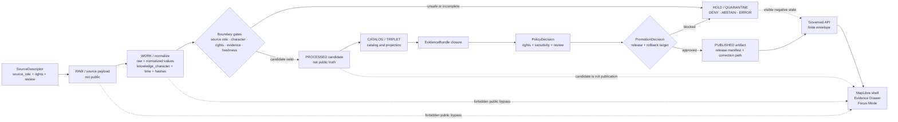

<!-- [KFM_META_BLOCK_V2]
doc_id: kfm://doc/NEEDS-VERIFICATION-ADR-atmosphere-source-role-boundaries
title: ADR: Atmosphere Source-Role Boundaries
type: standard
version: v1
status: draft
owners: @bartytime4life; atmosphere-air-domain-steward NEEDS_VERIFICATION; policy-steward NEEDS_VERIFICATION; release-steward NEEDS_VERIFICATION
created: NEEDS_VERIFICATION-YYYY-MM-DD
updated: 2026-05-08
policy_label: public-draft-NEEDS_VERIFICATION
related: [./README.md, ./ADR-TEMPLATE.md, ./ADR-0312-atmosphere-air-source-role-boundaries.md, ./ADR-0431-atmosphere-air-knowledge-character-boundary.md, ./ADR-0418-atmosphere-air-schema-slug-compatibility.md, ./ADR-0001-schema-home.md, ../domains/atmosphere_air/README.md, ../../connectors/pipelines/air/README.md, ../../data/processed/air/qa_summary.example.json, ../../data/receipts/air/run_receipt.example.json, ../../policy/air/air_qa.rego]
tags: [kfm, adr, atmosphere-air, air, source-role, knowledge-character, evidence, policy, release, fail-closed]
notes: [Revises the existing placeholder at docs/adr/ADR-atmosphere-source-role-boundaries.md. This file preserves the unnumbered ADR slug as a compact compatibility bridge and review checklist; the detailed repo-visible successor candidate is docs/adr/ADR-0312-atmosphere-air-source-role-boundaries.md. Owners, creation date, final policy label, CODEOWNERS routing, acceptance state, CI enforcement, source-rights posture, EvidenceBundle closure, public release, runtime behavior, and rollback proof remain NEEDS VERIFICATION.]
[/KFM_META_BLOCK_V2] -->

<a id="top"></a>

# ADR: Atmosphere Source-Role Boundaries

Atmosphere and air evidence must preserve source role, knowledge character, evidence closure, policy posture, release state, and rollback readiness before it can support public claims, map layers, exports, Evidence Drawer content, or Focus Mode answers.

<p align="center">
  
  
  
  
  
  
</p>

<p align="center">
  <a href="#decision">Decision</a> ·
  <a href="#why-this-file-exists">Why this file exists</a> ·
  <a href="#evidence-boundary">Evidence</a> ·
  <a href="#repo-fit">Repo fit</a> ·
  <a href="#source-role-rules">Rules</a> ·
  <a href="#governed-flow">Flow</a> ·
  <a href="#validation-plan">Validation</a> ·
  <a href="#rollback-and-supersession">Rollback</a> ·
  <a href="#open-verification">Open verification</a>
</p>

> [!IMPORTANT]
> **Target path:** `docs/adr/ADR-atmosphere-source-role-boundaries.md`  
> **Status:** `draft` / `proposed` / compatibility bridge  
> **Primary successor candidate:** [`./ADR-0312-atmosphere-air-source-role-boundaries.md`](./ADR-0312-atmosphere-air-source-role-boundaries.md)  
> **Publication effect:** this ADR does **not** authorize live source fetching, public release, public map layers, route activation, Evidence Drawer claims, Focus Mode answers, or production operations.

> [!CAUTION]
> A completed connector run, a parsed JSON file, a run receipt, an AQI-like index, a smoke mask, a model field, or a polished map popup is not proof of public truth. KFM must `ABSTAIN`, `DENY`, `ERROR`, `HOLD`, redact, generalize, or quarantine when source role, knowledge character, evidence, rights, policy, review, or release state is unclear.

---

## ADR header

| Field | Value |
|---|---|
| ADR ID | `ADR-atmosphere-source-role-boundaries` |
| Title | Atmosphere Source-Role Boundaries |
| Status | `draft` / `proposed` |
| Decision date | `2026-05-08` from existing placeholder; acceptance date `NEEDS VERIFICATION` |
| Scope | Atmosphere / Air domain governance, source-role boundaries, public-surface safety |
| Affected path | `docs/adr/ADR-atmosphere-source-role-boundaries.md` |
| Related ADRs | [`ADR-0312`](./ADR-0312-atmosphere-air-source-role-boundaries.md), [`ADR-0431`](./ADR-0431-atmosphere-air-knowledge-character-boundary.md), [`ADR-0418`](./ADR-0418-atmosphere-air-schema-slug-compatibility.md), [`ADR-0001`](./ADR-0001-schema-home.md) |
| Related domain doc | [`../domains/atmosphere_air/README.md`](../domains/atmosphere_air/README.md) |
| Related implementation-pressure slice | [`../../connectors/pipelines/air/README.md`](../../connectors/pipelines/air/README.md) |
| Supersedes | The thin placeholder content previously in this file |
| Superseded by | `NEEDS VERIFICATION`: likely [`ADR-0312`](./ADR-0312-atmosphere-air-source-role-boundaries.md) after review acceptance |
| Decision confidence | `CONFIRMED` path exists; `PROPOSED` decision bridge; `UNKNOWN` enforcement maturity |
| Rollback target | Restore prior placeholder or replace with a one-paragraph supersession notice to `ADR-0312`; preserve lineage |

---

## Decision

KFM will keep `docs/adr/ADR-atmosphere-source-role-boundaries.md` as a compact, reviewable compatibility bridge for the Atmosphere / Air source-role boundary decision.

This file makes one governing rule visible:

> Atmosphere / Air records must not support public or semi-public claims unless their source role, knowledge character, temporal support, evidence references, rights posture, review state, release state, correction path, and rollback target are explicit enough to inspect.

Detailed taxonomy, acceptance criteria, and enforcement burden should live in the numbered successor candidate [`ADR-0312: Atmosphere/Air Source-Role and Knowledge-Character Boundaries`](./ADR-0312-atmosphere-air-source-role-boundaries.md). This file must not become a competing second authority.

### Decision summary

| Decision point | Determination |
|---|---|
| Source role required? | Yes |
| Knowledge character required? | Yes |
| EvidenceBundle closure required for consequential public claims? | Yes |
| Public direct access to RAW, WORK, QUARANTINE, connector-private, or unpublished candidate artifacts? | No |
| Run receipt accepted as proof or release authorization? | No |
| AQI/report index treated as raw concentration? | No |
| AOD/smoke mask treated as surface PM2.5 exposure by default? | No |
| Model field labeled as observation? | No |
| Unknown source rights allowed for public release? | No |
| Focus Mode allowed to answer without admissible evidence? | No |
| Publication authorized by this ADR? | No |

[Back to top](#top)

---

## Why this file exists

The existing file at this path was a short placeholder. The repository also contains richer Atmosphere / Air decision material under numbered ADRs and domain documentation. The safest revision is therefore not a duplicate full ADR. It is a bridge that preserves the legacy slug, points maintainers to the detailed successor candidate, and states the minimum boundary rules that must not drift.

### What this revision repairs

| Prior placeholder gap | Repair in this revision |
|---|---|
| No KFM Meta Block v2 | Adds reviewable metadata with unresolved values marked `NEEDS_VERIFICATION`. |
| No evidence basis | Lists confirmed repo-visible surfaces and doctrine limits. |
| No relationship to `ADR-0312` | Treats `ADR-0312` as the detailed successor candidate rather than competing with it. |
| No source-role taxonomy | Adds compact boundary rules and anti-collapse checks. |
| No repo-fit explanation | Anchors the file in `docs/adr/` and keeps domain, connector, data, policy, and runtime surfaces separate. |
| No validation or rollback path | Adds acceptance checks, validation tasks, rollback triggers, and open verification. |

### What this revision intentionally does not do

- It does not rename ADRs.
- It does not delete the placeholder lineage.
- It does not mark the decision accepted.
- It does not claim CI, policy, schema, release, or runtime enforcement.
- It does not create a new source registry, schema home, contract home, policy home, proof home, or release home.
- It does not authorize public release of the no-network `air` candidate.

[Back to top](#top)

---

## Evidence boundary

This ADR separates confirmed repository evidence from proposed governance.

| Evidence item | Status | Supports | Does not prove |
|---|---:|---|---|
| `docs/adr/ADR-atmosphere-source-role-boundaries.md` | `CONFIRMED` repo-visible | Target file exists and currently serves this decision area. | Enforcement, acceptance, validation, release, or runtime behavior. |
| [`./README.md`](./README.md) | `CONFIRMED` repo-visible | `docs/adr/` is the human-facing decision ledger and ADRs should preserve evidence, scope, validation, rollback, and supersession. | Complete ADR inventory or enforcement maturity. |
| [`./ADR-TEMPLATE.md`](./ADR-TEMPLATE.md) | `CONFIRMED` repo-visible | ADR structure expects evidence, impact, validation, rollback, and truth labels. | This ADR’s acceptance or implementation. |
| [`./ADR-0312-atmosphere-air-source-role-boundaries.md`](./ADR-0312-atmosphere-air-source-role-boundaries.md) | `CONFIRMED` repo-visible / draft | Detailed source-role and knowledge-character boundary decision already exists as a stronger successor candidate. | Accepted governance or passing enforcement. |
| [`../domains/atmosphere_air/README.md`](../domains/atmosphere_air/README.md) | `CONFIRMED` repo-visible / draft | Atmosphere / Air lane scope, accepted inputs, exclusions, knowledge-character posture, and publication block. | Live source activation or public release. |
| [`../../connectors/pipelines/air/README.md`](../../connectors/pipelines/air/README.md) | `CONFIRMED` repo-visible / experimental | The current `air` connector lane is no-network and produces candidate artifacts plus a run receipt. | Public truth, proof closure, or release readiness. |
| [`../../data/processed/air/qa_summary.example.json`](../../data/processed/air/qa_summary.example.json) | `CONFIRMED` repo-visible / candidate | Example PM2.5 QA summary has `decision: candidate`, `source.dataset: no_network_stub`, and refs to receipt/evidence. | EvidenceBundle closure or public release. |
| [`../../data/receipts/air/run_receipt.example.json`](../../data/receipts/air/run_receipt.example.json) | `CONFIRMED` repo-visible / process memory | Receipt records `network_access: disabled`, output path, pipeline path, run ID, and completed status. | Proof, release, or public authorization. |
| [`../../policy/air/air_qa.rego`](../../policy/air/air_qa.rego) | `CONFIRMED` repo-visible / partial policy fragment | Slice-level denials for high NowCast, baseline deviation, station coverage, AQS hard-denial rows, and missing refs. | Complete Atmosphere / Air policy library or passing OPA/CI execution. |
| Directory Rules | `CONFIRMED` project doctrine | ADRs belong under responsibility roots; domain names should not become root folders. | Active branch enforcement. |
| KFM Atmosphere / Air architecture lineage | `LINEAGE` / `PROPOSED` | Strong doctrine for source-role and knowledge-character separation. | Current repo implementation unless repo files are inspected. |
| MapLibre / governed UI doctrine | `CONFIRMED` doctrine / `PROPOSED` implementation | Public map and Focus surfaces must remain downstream of trust, governed APIs, and released artifacts. | Current UI route/component behavior. |

### Truth labels used here

| Label | Meaning in this ADR |
|---|---|
| `CONFIRMED` | Verified from current GitHub connector evidence, visible project documents, or current-session workspace inspection. |
| `PROPOSED` | Recommended decision or implementation behavior not proven as active enforcement. |
| `UNKNOWN` | Not verified strongly enough in this session. |
| `NEEDS VERIFICATION` | Checkable, but not yet checked strongly enough to treat as accepted or enforced. |
| `LINEAGE` | Earlier or adjacent project material that preserves continuity but is not current implementation proof. |
| `DENY`, `ABSTAIN`, `ERROR`, `HOLD` | System or gate outcomes, not rhetorical emphasis. |

[Back to top](#top)

---

## Repo fit

### Path decision

| Path | Role | Status |
|---|---|---:|
| `docs/adr/ADR-atmosphere-source-role-boundaries.md` | Compact compatibility bridge and review checklist for this decision area. | `CONFIRMED` target path |
| `docs/adr/ADR-0312-atmosphere-air-source-role-boundaries.md` | Detailed successor candidate for source-role and knowledge-character boundaries. | `CONFIRMED` repo-visible |
| `docs/adr/ADR-0431-atmosphere-air-knowledge-character-boundary.md` | Related knowledge-character decision. | `CONFIRMED` surfaced by repo search |
| `docs/adr/ADR-0418-atmosphere-air-schema-slug-compatibility.md` | Related slug compatibility decision. | `CONFIRMED` surfaced by repo search |
| `docs/domains/atmosphere_air/README.md` | Domain landing and lane scope. | `CONFIRMED` repo-visible |
| `connectors/pipelines/air/` | No-network connector candidate lane. | `CONFIRMED` repo-visible |
| `data/processed/air/` | Processed candidate examples. | `CONFIRMED` repo-visible |
| `data/receipts/air/` | Run receipt examples. | `CONFIRMED` repo-visible |
| `policy/air/` | Slice-level policy fragment. | `CONFIRMED` repo-visible |

### Directory-rule basis

`docs/adr/` is the correct responsibility root for this file because it is a human-facing architecture decision. Atmosphere / Air domain explanation belongs under `docs/domains/atmosphere_air/`. Connector code belongs under `connectors/`. Candidate data belongs under `data/processed/`. Process memory belongs under `data/receipts/`. Policy belongs under `policy/`.

> [!WARNING]
> Do not create a root-level `atmosphere/`, `air/`, or `source_role/` folder to solve this decision. Root folders are authority boundaries, not topic buckets.

### Slug compatibility caution

| Slug | Confirmed use | Rule |
|---|---|---|
| `atmosphere_air` | Domain documentation lane. | Preserve unless a successor ADR migrates it. |
| `air` | No-network connector, processed candidate, receipt, validator, and policy slice. | Treat as a slice, not the whole Atmosphere / Air domain. |
| `atmosphere` | Normalization or whole-domain concept in lineage/proposals. | Do not treat as canonical without ADR-backed inventory and tests. |

[Back to top](#top)

---

## Source-role rules

### Minimum boundary rules

| Rule ID | Rule | Required failure behavior |
|---|---|---|
| `ATMOS-SR-001` | Every consequential Atmosphere / Air record must declare or resolve a source role. | `DENY` / `ATMOS_MISSING_SOURCE_ROLE` |
| `ATMOS-SR-002` | Every consequential Atmosphere / Air record must declare or resolve a knowledge character. | `DENY` / `ATMOS_MISSING_KNOWLEDGE_CHARACTER` |
| `ATMOS-SR-003` | AQI, NowCast-like reports, and public indexes are reports/index objects, not raw concentration by default. | `DENY` / `ATMOS_AQI_AS_CONCENTRATION` |
| `ATMOS-SR-004` | AOD, smoke masks, fire masks, plume masks, or aerosol classifications are support/context products, not surface exposure or PM concentration by default. | `DENY` or `ABSTAIN` |
| `ATMOS-SR-005` | Forecast, reanalysis, hindcast, transport, chemistry, smoke, or aerosol model fields must stay modeled. | `DENY` / `ATMOS_MODEL_AS_OBSERVED` |
| `ATMOS-SR-006` | Low-cost sensor records require correction, caveats, confidence, rights, and limitations before public use. | `DENY` |
| `ATMOS-SR-007` | Fusion products must expose input EvidenceRefs, method, uncertainty, and transform identity. | `DENY` / `ATMOS_FUSION_INPUTS_HIDDEN` |
| `ATMOS-SR-008` | Advisories and public health messages remain issuer-scoped context; KFM must not become an emergency alerting system. | `DENY` life-safety framing |
| `ATMOS-SR-009` | Station/site/network metadata is context, not measurement value. | `DENY` or `ERROR` |
| `ATMOS-SR-010` | Run receipts are process memory, not proof packs, EvidenceBundles, PromotionDecisions, or ReleaseManifests. | `DENY` / `ATMOS_RECEIPT_AS_PROOF` |
| `ATMOS-SR-011` | Public clients must not read RAW, WORK, QUARANTINE, connector-private, normalization-stage, internal canonical, or unpublished candidate artifacts directly. | `DENY` / `ATMOS_PUBLIC_INTERNAL_ACCESS` |
| `ATMOS-SR-012` | Unknown source rights, terms, attribution, automation permission, redistribution terms, or public-release permission block public release. | `DENY` / `ATMOS_UNKNOWN_RIGHTS_PUBLIC` |

### Knowledge-character floor

This compatibility bridge defers the full taxonomy to [`ADR-0312`](./ADR-0312-atmosphere-air-source-role-boundaries.md) and the domain README. At minimum, downstream records must preserve the difference among:

| Knowledge character family | Examples | Must not become |
|---|---|---|
| Observed sensor | Ground/station/instrument measurement. | Public AQI report, model field, or fusion output. |
| Public AQI report | AQI or NowCast-like public index. | Raw concentration. |
| Regulatory archive | QA/regulatory historical record. | Live current state by default. |
| Low-cost sensor | Community or consumer sensor record. | Regulatory truth by default. |
| Atmospheric model field | Forecast, reanalysis, transport, smoke, chemistry, aerosol grid. | Observed measurement. |
| Remote-sensing mask | Smoke, plume, fire, AOD, aerosol, haze, cloud classification. | Surface exposure by default. |
| Derived fusion | Interpolation, ensemble, consensus, bias-corrected product. | Canonical source observation. |
| Advisory context | Agency notice, public-health message, public recommendation. | KFM emergency instruction. |
| Network/site context | Station metadata, cadence, siting, instrument health. | Measurement value. |
| Baseline/temporal support | Normals, rolling baselines, freshness windows, persistence/hysteresis. | Standalone claim without scoped target. |

[Back to top](#top)

---

## Current implementation-pressure slice

The repo-visible `air` slice creates useful pressure for this ADR, but it does not prove release readiness.

### Candidate QA summary

| Field family | Confirmed current value |
|---|---|
| `decision` | `candidate` |
| `source.provider` | `kfm_air_pipeline` |
| `source.dataset` | `no_network_stub` |
| `aggregation.parameter` | `pm25` |
| `aggregation.units` | `ug_m3` |
| `aggregation.averaging_window` | `nowcast_hourly` |
| `time_window.start` | `2026-05-01T00:00:00Z` |
| `time_window.end` | `2026-05-01T01:00:00Z` |
| `flags.run_receipt_ref` | `data/receipts/air/run_receipt.example.json` |
| `flags.evidence_bundle_ref` | `data/processed/air/evidence_bundle.example.json` |

### Run receipt

| Field family | Confirmed current value |
|---|---|
| `network_access` | `disabled` |
| `pipeline` | `connectors/pipelines/air/air_ingest.py` |
| `outputs` | `data/processed/air/qa_summary.example.json` |
| `run_id` | `air-ingest-no-network-2026-05-01T01:00:00Z` |
| `status` | `completed` |

### Slice-level policy fragment

| Denial code | Trigger |
|---|---|
| `gate_a_nowcast_max_exceeds_35` | `input.metrics.nowcast_max > 35` |
| `gate_b_nowcast_vs_baseline_sigma_exceeds_2` | `input.metrics.nowcast_vs_baseline_sigma > 2` |
| `gate_c_station_coverage_below_75` | `input.metrics.station_coverage_pct < 75` |
| `aqs_hard_denial_rows_present_in_baseline` | `input.aqs_flags_summary.hard_denial_rows_in_baseline > 0` |
| `missing_run_receipt_ref_for_public_promotion` | Candidate lacks `flags.run_receipt_ref`. |
| `missing_evidence_bundle_ref_for_public_promotion` | Candidate lacks `flags.evidence_bundle_ref`. |

> [!NOTE]
> These confirmed artifacts are helpful, but they remain slice-level candidate/process-memory evidence. They do not prove full Atmosphere / Air source descriptors, schemas, policy library, EvidenceBundle closure, release manifests, public API binding, MapLibre behavior, Focus Mode behavior, or CI enforcement.

[Back to top](#top)

---

## Governed flow



### Flow rules

1. Source descriptors constrain admissibility; they do not publish claims.
2. Normalization must preserve source role, knowledge character, raw and normalized units, time basis, source payload hash, transform identity, and EvidenceRefs.
3. Candidate artifacts are not public truth.
4. EvidenceBundle closure is required before consequential public claims.
5. Policy decides release/public behavior; schema validity alone is not enough.
6. Public map, export, search, Evidence Drawer, and Focus Mode surfaces consume governed envelopes and released artifacts only.
7. Negative states are trust features, not UI failures.

[Back to top](#top)

---

## Validation plan

Run validation from a real checkout. Commands below are a review aid, not proof that enforcement already passes.

```bash
# Confirm repository context.
git status --short
git branch --show-current || true
git rev-parse --show-toplevel

# Confirm related ADR and domain files.
find docs/adr -maxdepth 1 -type f | sort | grep -E 'ADR-atmosphere-source-role-boundaries|ADR-0312|ADR-0418|ADR-0431|ADR-0001' || true
find docs/domains/atmosphere_air -maxdepth 3 -type f | sort

# Confirm current no-network air slice artifacts.
find connectors/pipelines/air data/processed/air data/receipts/air policy/air tools/validators/air -maxdepth 3 -type f 2>/dev/null | sort

# Confirm candidate and receipt JSON are parseable.
python -m json.tool data/processed/air/qa_summary.example.json > /dev/null
python -m json.tool data/receipts/air/run_receipt.example.json > /dev/null

# Inspect validator interface before running it.
python tools/validators/air/validate_air_qa.py --help || true

# Inspect policy fragment and source-role reason codes.
grep -RInE 'source_role|knowledge_character|ATMOS_|missing_evidence_bundle_ref|missing_run_receipt_ref' \
  docs/adr docs/domains/atmosphere_air policy/air tools/validators/air connectors/pipelines/air 2>/dev/null || true
```

### Acceptance criteria

This ADR can move beyond `draft` only when the following are true or deliberately deferred in a review record.

- [ ] Maintainers decide whether this unnumbered file remains a bridge or becomes superseded by [`ADR-0312`](./ADR-0312-atmosphere-air-source-role-boundaries.md).
- [ ] `docs/adr/README.md` links this file or records its supersession status.
- [ ] Owners and reviewers are verified through CODEOWNERS or governance registers.
- [ ] Relative links in this file resolve from `docs/adr/`.
- [ ] Source-role and knowledge-character expectations are aligned with `ADR-0312`, `ADR-0431`, and the Atmosphere / Air domain README.
- [ ] The no-network QA candidate remains `decision: candidate`.
- [ ] The no-network run receipt remains process memory and does not act as proof or release.
- [ ] Missing source role, missing knowledge character, unknown rights, missing EvidenceRefs, stale/unscoped time basis, and public internal access have reason-coded negative fixtures.
- [ ] Policy, validator, schema, fixture, and CI evidence are inspected before enforcement is claimed.
- [ ] EvidenceBundle closure for `data/processed/air/evidence_bundle.example.json` is verified or the reference remains blocked.
- [ ] Public API, MapLibre, Evidence Drawer, Focus Mode, export, and search surfaces are verified not to read connector-private or unpublished candidate artifacts directly.
- [ ] A rollback path preserves the ADR lineage and public-surface safety.

[Back to top](#top)

---

## Policy, rights, and sensitivity

| Question | Determination |
|---|---|
| Does this ADR affect public release eligibility? | Yes. Unknown source role, knowledge character, rights, evidence, or release state blocks public exposure. |
| Does this ADR activate live source fetching? | No. Live source activation remains blocked. |
| Does this ADR authorize public maps or API routes? | No. It only defines source-role boundary expectations. |
| Does this ADR affect Focus Mode? | Yes. Focus Mode must stay EvidenceBundle-backed, policy-safe, and finite-outcome. |
| Does this ADR affect exact-location or sensitive exposure? | Indirectly. Air station/site context and public overlays still need rights, sensitivity, and public-surface review. |
| Does this ADR create new policy rules? | No. It records policy expectations and points to policy homes; executable rules belong in `policy/`. |
| What happens when source rights are unknown? | Public release is denied or held. |
| What happens when evidence support is insufficient? | KFM should `ABSTAIN`, `DENY`, `ERROR`, or `HOLD` rather than infer. |

[Back to top](#top)

---

## Consequences

### Positive consequences

- Preserves the existing unnumbered ADR path without turning it into a conflicting authority.
- Gives reviewers a compact checklist for the source-role decision.
- Links the placeholder lineage to the richer numbered ADR family.
- Reinforces the Atmosphere / Air anti-collapse rules where overclaim risk is high.
- Keeps connector success, process receipts, proof closure, policy decisions, and release state separate.
- Makes public-release and Focus Mode denial conditions visible before implementation expands.

### Tradeoffs

| Tradeoff | Mitigation |
|---|---|
| This file duplicates some high-level language from `ADR-0312`. | Keep this file compact and defer detailed taxonomy to `ADR-0312`. |
| Keeping an unnumbered ADR path may confuse inventory. | Mark it as a compatibility bridge and update the ADR index. |
| The current no-network `air` slice can be misread as public evidence. | Repeat candidate/process-memory language and require release gates before public use. |
| Policy fragment exists but whole-domain enforcement is incomplete. | Use partial/NEEDS_VERIFICATION labels and require tests before enforcement claims. |
| Live source rights are unresolved. | Fail closed for public release until source descriptors and rights reviews are verified. |

[Back to top](#top)

---

## Rollback and supersession

### Rollback plan

If this revision is wrong or premature:

1. Revert this file to the previous placeholder state, or replace it with a short supersession notice to [`ADR-0312`](./ADR-0312-atmosphere-air-source-role-boundaries.md).
2. Preserve the unnumbered path as lineage; do not delete it silently.
3. Update [`./README.md`](./README.md) so the ADR inventory shows the file’s current state.
4. Confirm no public surface relies on this file as accepted enforcement.
5. Keep connector, candidate, receipt, policy, proof, release, and runtime surfaces unchanged unless a separate implementation rollback is required.

### Supersession rule

This file should be marked `superseded` or replaced by a one-page bridge when:

- `ADR-0312` is accepted and listed as the governing source-role ADR;
- `ADR-0431` is accepted and governs knowledge-character boundaries;
- a future ADR consolidates `atmosphere_air`, `air`, and `atmosphere` naming with tested migration;
- a release/policy/schema PR proves stronger enforcement and updates the ADR index.

### Rollback triggers

| Trigger | Required action |
|---|---|
| `ADR-0312` is accepted as the governing decision | Update this file to a supersession notice or bridge. |
| Source-role rules conflict with accepted policy | Mark `CONFLICTED`, block public release, and open a successor ADR. |
| Public client bypass is discovered | `DENY` or disable public surface; open security/release rollback. |
| Run receipt is used as proof/release | Block promotion and update policy/validation language. |
| Live source rights become unclear or change | Hold or withdraw affected public artifacts. |
| EvidenceBundle closure fails | `ABSTAIN` or `DENY` claims depending on context; do not publish. |

> [!WARNING]
> A rollback that deletes decision history weakens KFM. Preserve lineage even when behavior is reverted.

[Back to top](#top)

---

## Open verification

| Item | Status | Verification path |
|---|---:|---|
| Final owner routing | `NEEDS_VERIFICATION` | Check CODEOWNERS, ADR index, or governance register. |
| Created date | `NEEDS_VERIFICATION` | Check Git history or document registry. |
| Policy label | `NEEDS_VERIFICATION` | Confirm public/restricted classification. |
| Whether this file should be accepted or superseded | `NEEDS_VERIFICATION` | Maintainer review against `ADR-0312`, `ADR-0431`, and `ADR-0418`. |
| `ADR-0312` acceptance state | `NEEDS_VERIFICATION` | Review ADR status, PR history, and validation evidence. |
| EvidenceBundle example exists and validates | `NEEDS_VERIFICATION` | Inspect `data/processed/air/evidence_bundle.example.json` and run repo-native validation. |
| Schema home and air schema existence | `NEEDS_VERIFICATION` | Check `ADR-0001`, `schemas/contracts/v1/...`, validators, and fixture mappings. |
| Policy execution | `NEEDS_VERIFICATION` | Run OPA/Conftest or repo-native policy tests if available. |
| CI enforcement | `UNKNOWN` | Inspect workflow runs and branch protections. |
| Live source rights | `UNKNOWN` | Verify source descriptors, licenses, terms, attribution, automation, rate limits, and redistribution posture. |
| Public API/UI binding | `UNKNOWN` | Inspect governed API, MapLibre, Evidence Drawer, Focus Mode, export, and search consumers. |
| Slug compatibility | `NEEDS_VERIFICATION` | Confirm accepted treatment of `atmosphere_air`, `air`, and `atmosphere`. |
| Rollback proof | `NEEDS_VERIFICATION` | Confirm release/rollback records or dry-run rollback tests. |

[Back to top](#top)

---

## Review checklist

<details>
<summary>Pre-merge checklist</summary>

- [ ] Meta block values are verified or deliberately marked `NEEDS_VERIFICATION`.
- [ ] This file is listed in `docs/adr/README.md` or intentionally marked as superseded.
- [ ] The relationship to `ADR-0312` is clear.
- [ ] The relationship to `ADR-0431` and `ADR-0418` is clear.
- [ ] No public release, CI, runtime, source-rights, route, EvidenceBundle, or policy-enforcement claim exceeds evidence.
- [ ] Source-role and knowledge-character rules are aligned with the Atmosphere / Air README.
- [ ] The no-network `air` slice remains candidate/process-memory only.
- [ ] Negative outcomes are explicit: `ABSTAIN`, `DENY`, `ERROR`, `HOLD`, quarantine, redaction, or generalization.
- [ ] Relative links resolve from `docs/adr/`.
- [ ] Rollback and supersession path is visible.
- [ ] Open verification items are not hidden by confident prose.

</details>

[Back to top](#top)

---

## Maintainer note

Keep this file small on purpose.

The detailed boundary ADR is already repo-visible as `ADR-0312`. This file’s job is to preserve the unnumbered placeholder path, prevent source-role drift, and make the review burden obvious. When the numbered ADR is accepted, this file should become a clear bridge or supersession notice rather than a parallel source of truth.
