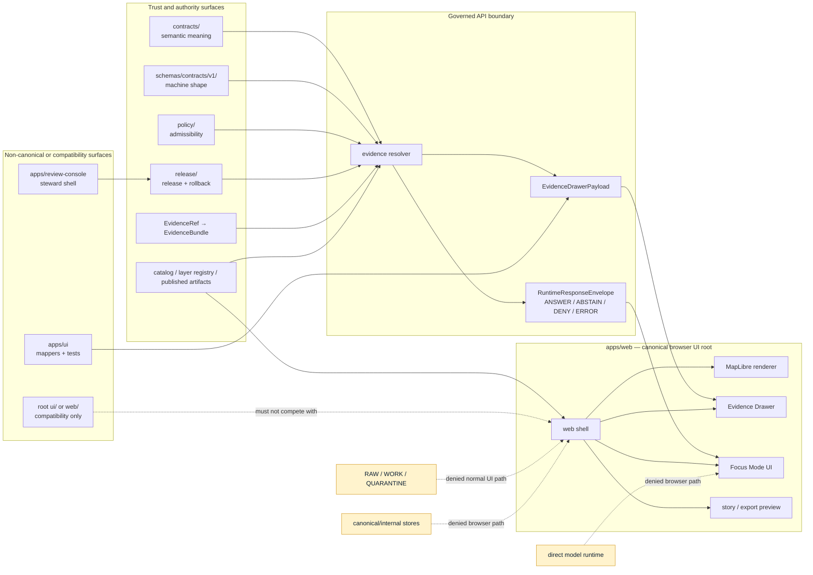

<!-- [KFM_META_BLOCK_V2]
doc_id: kfm://doc/NEEDS-VERIFICATION-ADR-canonical-ui-root
title: ADR-canonical-ui-root
type: standard
version: v1
status: draft
owners: @bartytime4life (fallback; UI/app-specific owners NEEDS VERIFICATION)
created: 2026-05-08
updated: 2026-05-08
policy_label: NEEDS-VERIFICATION(public|restricted)
related: [./README.md, ./ADR-0001-schema-home.md, ./ADR-0002-responsibility-root-monorepo.md, ./ADR-0003-maplibre-renderer-boundary.md, ./ADR-0206-maplibre-layer-manifest.md, ../../apps/README.md, ../../apps/web/README.md, ../../apps/web/package.json, ../../apps/web/src/README.md, ../../apps/ui/README.md, ../../apps/api/README.md, ../../apps/review-console/README.md]
tags: [kfm, adr, ui-root, apps-web, governed-ui, maplibre, evidence-drawer, focus-mode, compatibility-root, trust-membrane]
notes: [Replaces a minimal proposed ADR stub with an evidence-bounded decision record. doc_id, policy_label, final owners, acceptance state, CI enforcement, deployment posture, and full active-checkout root inventory remain NEEDS VERIFICATION. Repository claims were checked through GitHub connector evidence on main; re-run in a mounted checkout before accepting.]
[/KFM_META_BLOCK_V2] -->

<a id="top"></a>

# ADR-canonical-ui-root

Canonical UI root decision for KFM’s governed, map-first browser shell and transitional UI compatibility roots.

<p align="center">
  
  
  
  
  
  
</p>

<p align="center">
  <a href="#decision-summary">Decision</a> ·
  <a href="#evidence-boundary">Evidence</a> ·
  <a href="#context">Context</a> ·
  <a href="#canonical-ui-root">Canonical root</a> ·
  <a href="#compatibility-and-non-canonical-ui-surfaces">Compatibility</a> ·
  <a href="#runtime-flow">Runtime flow</a> ·
  <a href="#validation-and-acceptance">Validation</a> ·
  <a href="#rollback-and-supersession">Rollback</a> ·
  <a href="#open-verification-backlog">Open verification</a>
</p>

> [!IMPORTANT]
> **ADR decision state:** `PROPOSED`.
>
> This ADR proposes `apps/web/` as the canonical KFM browser/web UI application root. It does not claim that UI runtime behavior, CI checks, branch protections, deployment posture, public release gates, or all compatibility-root migrations are already enforced.

---

## Decision summary

| Field | Determination |
|---|---|
| Target file | `docs/adr/ADR-canonical-ui-root.md` |
| Prior state | Minimal proposed ADR stub with status, decision date, context, decision, consequences, and verification note |
| Proposed decision | `apps/web/` is the canonical browser/web UI app root for the governed KFM map shell |
| Canonical web source tree | `apps/web/src/` |
| Canonical map renderer boundary | Governed by [`ADR-0003-maplibre-renderer-boundary.md`](./ADR-0003-maplibre-renderer-boundary.md) |
| Canonical layer admission companion | Governed by [`ADR-0206-maplibre-layer-manifest.md`](./ADR-0206-maplibre-layer-manifest.md) |
| Parent app boundary | [`../../apps/README.md`](../../apps/README.md) |
| Sibling UI mapper/test surface | [`../../apps/ui/README.md`](../../apps/ui/README.md) |
| Sibling review surface | [`../../apps/review-console/README.md`](../../apps/review-console/README.md) |
| API boundary | [`../../apps/api/README.md`](../../apps/api/README.md), with naming reconciliation still required |
| Root-layout authority | [`ADR-0002-responsibility-root-monorepo.md`](./ADR-0002-responsibility-root-monorepo.md) |
| Schema-home dependency | [`ADR-0001-schema-home.md`](./ADR-0001-schema-home.md) |
| Enforcement state | **NEEDS VERIFICATION** in active checkout |
| Primary failure avoided | UI code, root-level `ui/`/`web/`, MapLibre artifacts, popups, or Focus Mode becoming hidden truth surfaces |

### Proposed decision

KFM should treat:

```text
apps/web/
```

as the canonical browser/web UI application root for the map-first governed shell.

KFM should treat:

```text
apps/web/src/
```

as the canonical source tree under that app root.

KFM should treat:

```text
apps/ui/
```

as an app-local UI mapper and test surface, not as the canonical browser application root.

KFM should treat:

```text
apps/review-console/
```

as a steward/reviewer application surface, not as the canonical public UI root.

KFM should treat root-level compatibility surfaces such as `ui/`, `web/`, `styles/`, and `viewer_templates/` as non-canonical unless a later ADR explicitly accepts one of them as canonical.

### One-line rule

> **The governed KFM browser shell lives under `apps/web/`; compatibility UI roots may exist only as documented bridges, mirrors, generated outputs, or legacy surfaces.**

<p align="right"><a href="#top">Back to top ↑</a></p>

---

## Evidence boundary

This ADR was prepared from accessible GitHub connector evidence on `main`, supplied KFM doctrine, and local workspace inspection. A mounted repository checkout was not available in the authoring workspace, so active branch status, workflow run output, branch protections, deployment posture, runtime logs, dashboards, and full local tree inventory remain unverified.

| Evidence item | Status | Supports | Does not prove |
|---|---:|---|---|
| `docs/adr/ADR-canonical-ui-root.md` | **CONFIRMED repository file** | Target ADR path exists and previously contained a minimal proposed stub. | Acceptance, implementation, or enforcement. |
| `docs/adr/README.md` | **CONFIRMED repository file** | ADRs are the decision ledger and must distinguish decision state from enforcement state. | Complete ADR inventory or CI enforcement. |
| `docs/adr/ADR-0002-responsibility-root-monorepo.md` | **CONFIRMED repository file / accepted decision** | KFM root folders are responsibility boundaries; compatibility roots require explicit status. | Full root conformance or compatibility-root migration completion. |
| `apps/README.md` | **CONFIRMED repository file** | `apps/` is the deployable/app-local boundary and lists `apps/web`, `apps/ui`, `apps/review-console`, and API naming concerns. | Full app inventory or runtime maturity. |
| `apps/web/README.md` | **CONFIRMED repository file** | `apps/web` is described as the governed web shell, downstream of evidence, policy, release, and governed API paths. | Full MapLibre runtime, deployment, test pass state, or public readiness. |
| `apps/web/package.json` | **CONFIRMED repository file** | `@kfm/web` exists with npm 10, Vite, Vitest, MapLibre GL JS, and PMTiles package metadata. | Installed dependencies, successful builds, security review, or production deployment. |
| `apps/web/src/README.md` | **CONFIRMED repository file** | `apps/web/src` is documented as the intended source home for KFM web shell behavior. | Complete source-tree implementation or framework maturity. |
| `apps/ui/README.md` | **CONFIRMED repository file** | `apps/ui` is a UI-facing mapper/test surface, including ecology Evidence Drawer mapper/test posture. | Canonical public browser app ownership. |
| `apps/api/README.md` | **CONFIRMED repository file / naming conflict signal** | Governed API boundary exists under `apps/api/`, while text references `apps/governed_api`. | Durable API home without follow-up naming reconciliation. |
| `apps/review-console/README.md` | **CONFIRMED repository file** | Review console is a steward shell that may emit review decisions but does not publish directly. | Public UI root, release authority, or runtime enforcement. |
| Local mounted checkout | **UNKNOWN / not mounted here** | Local filesystem contained uploaded PDFs and no visible KFM Git checkout. | Absence of the repository itself; GitHub connector evidence provides current remote-file access. |

### Truth labels used here

| Label | Meaning |
|---|---|
| **CONFIRMED** | Verified from current repository connector evidence, current local workspace inspection, or supplied KFM doctrine. |
| **PROPOSED** | Decision, path behavior, validator, migration, or process not proven as active enforcement. |
| **UNKNOWN** | Not verified strongly enough in this session. |
| **NEEDS VERIFICATION** | A concrete active-checkout, workflow, owner, branch, runtime, or deployment check is required. |
| **CONFLICTED** | Multiple naming, placement, or authority signals exist and must not be normalized silently. |
| **DENY / ABSTAIN / ERROR** | Runtime or policy outcomes, not rhetorical labels. |

> [!NOTE]
> An ADR may be accepted while implementation remains `NEEDS VERIFICATION`. Keep decision acceptance and enforcement proof separate.

<p align="right"><a href="#top">Back to top ↑</a></p>

---

## Context

KFM needs one durable browser UI app root because the project contains, references, or anticipates several UI-adjacent surfaces:

- `apps/web/` — current governed web-shell app evidence;
- `apps/web/src/` — current web-shell source home evidence;
- `apps/ui/` — current UI mapper/test evidence;
- `apps/review-console/` — current steward review shell evidence;
- `apps/api/`, `apps/governed_api`, `apps/governed-api` — API-boundary naming tension;
- root-level `ui/`, `web/`, `styles/`, `viewer_templates/` — compatibility-root categories under KFM directory doctrine when present;
- MapLibre renderer and layer-manifest ADRs — map-shell trust boundaries;
- Evidence Drawer and Focus Mode — trust-visible UI surfaces that must stay downstream of evidence, policy, review, release, correction, and rollback.

Without a canonical UI-root ADR, KFM risks UI fragmentation:

| Fragmentation risk | Failure mode | ADR response |
|---|---|---|
| `apps/web` and root `web/` both carry browser-shell code | Public clients may not know which app is authoritative. | Canonical browser app root is `apps/web/`; root `web/` is compatibility unless superseded. |
| `apps/ui` is mistaken for the public UI app | Mapper/test logic can become confused with browser-shell runtime. | `apps/ui/` remains UI mapper/test surface. |
| `apps/review-console` is treated as public UI | Review affordances can become release shortcuts. | Review console is a steward shell, not publication authority. |
| `styles/` or `viewer_templates/` become hidden UI authority | Design or generated assets can drift from governed shell behavior. | Compatibility roots must document mirror/generated/legacy status. |
| MapLibre or tiles become evidence | Visual output can be mistaken for authoritative claims. | UI root consumes `LayerManifest`, Evidence Drawer payloads, and governed API responses. |
| Focus Mode calls models directly | Generated language can bypass evidence and policy. | Focus Mode routes through governed API/runtime envelopes only. |
| API app naming stays ambiguous | Clients and docs split across `apps/api`, `apps/governed_api`, and `apps/governed-api`. | Track API naming as separate `NEEDS VERIFICATION`; do not let API naming drive UI-root confusion. |

<p align="right"><a href="#top">Back to top ↑</a></p>

---

## Canonical UI root

### Decision

Use `apps/web/` as KFM’s canonical browser/web UI application root.

This root is responsible for the browser-facing map shell and trust-visible user experience. Its source tree, when implemented, lives under `apps/web/src/`.

```text
apps/web/
├── README.md
├── package.json
└── src/
    └── README.md
```

### What `apps/web/` owns

| Area | Responsibility |
|---|---|
| Browser shell | Public or semi-public map-first shell frame. |
| Map runtime | MapLibre/PMTiles rendering through governed layer contracts. |
| Evidence Drawer UI | User-facing evidence, source, policy, review, release, correction, and caveat display. |
| Focus Mode UI | Finite governed outcomes: `ANSWER`, `ABSTAIN`, `DENY`, `ERROR`. |
| App-local browser state | Viewport, selected candidate, panel state, non-sensitive UI preferences. |
| Trust cues | Visible stale, redacted, generalized, denied, withdrawn, superseded, and review-required states. |
| App-local checks | Browser boot, no-bypass, accessibility, fixture, and build checks when implemented. |
| Static app build | App-local static build or Vite build artifacts, as package scripts support. |

### What `apps/web/` must not own

| Must not own | Correct home or boundary | Reason |
|---|---|---|
| RAW / WORK / QUARANTINE data | `data/raw/`, `data/work/`, `data/quarantine/` | UI must not bypass lifecycle gates. |
| Canonical evidence storage | governed backend/data lifecycle roots | Browser shell is not evidence custody. |
| Source connectors | `connectors/`, `pipelines/`, `pipeline_specs/` | Source admission needs rights, cadence, receipts, and policy. |
| Machine schema authority | `schemas/contracts/v1/` after ADR acceptance | UI types must not fork schema truth. |
| Semantic contract authority | `contracts/` | UI consumes meaning; it does not define it. |
| Policy-as-code | `policy/` | UI displays policy outcomes; it does not author them. |
| Proofs, receipts, releases, rollback cards | `data/proofs/`, `data/receipts/`, `release/` | Trust objects stay auditable outside app code. |
| Direct model runtime clients | governed API/model adapter | Focus Mode must remain evidence-bounded. |
| Public admin shortcuts | restricted review/admin paths with audit | Admin affordances must not become normal public UI. |

> [!IMPORTANT]
> `apps/web/` is a shell for governed outputs. It renders and navigates trust state; it does not become the source of truth.

<p align="right"><a href="#top">Back to top ↑</a></p>

---

## Compatibility and non-canonical UI surfaces

### UI/app surface matrix

| Surface | Decision | Status | Required handling |
|---|---|---:|---|
| `apps/web/` | Canonical browser/web UI root | **PROPOSED canonical** | Keep as the public/semi-public map-shell app root after acceptance. |
| `apps/web/src/` | Canonical browser source tree under `apps/web` | **CONFIRMED path / implementation depth NEEDS VERIFICATION** | Continue source-tree work here when tied to web shell behavior. |
| `apps/ui/` | UI mapper/test surface | **CONFIRMED non-canonical app-local surface** | Keep mapper/test logic here; do not treat as the browser app root. |
| `apps/review-console/` | Steward review shell | **CONFIRMED non-public-review surface** | Keep review actions separate from publication authority. |
| `apps/api/` | Governed API documentation/implementation surface | **CONFIRMED path / naming reconciliation needed** | Keep API boundary separate from UI root. |
| `apps/governed_api/` | Candidate API home or legacy/alternate naming | **NEEDS VERIFICATION** | Do not create parallel API authority without ADR/migration note. |
| `apps/governed-api/` | Candidate API home or legacy/alternate naming | **NEEDS VERIFICATION** | Same as above. |
| `apps/explorer-web/` | Candidate/legacy explorer app | **NEEDS VERIFICATION** | If present, classify as compatibility, replacement, or separate app through README/ADR. |
| root `ui/` | Compatibility/transitional root when present | **NOT canonical by this ADR** | Must have README/status if present; migrate app implementation to `apps/web` or `apps/ui` by role. |
| root `web/` | Compatibility/transitional root when present | **NOT canonical by this ADR** | Must have README/status if present; do not compete with `apps/web`. |
| root `styles/` | Compatibility/design support root when present | **NOT canonical UI root** | Keep as documented design/style support or migrate into app/package/docs surface. |
| root `viewer_templates/` | Compatibility/generated/template root when present | **NOT canonical UI root** | Document generated/template status; do not become runtime shell authority. |

### Compatibility-root rule

When any root-level UI-adjacent compatibility folder exists, it must declare one of these statuses:

| Status | Meaning | Expected action |
|---|---|---|
| `canonical` | Accepted by ADR as a root authority. | Must cite the ADR and define scope. |
| `legacy` | Historical root retained for compatibility. | Provide migration target and retirement criteria. |
| `mirror` | Mirrors canonical content. | Define source of truth and sync/validation rules. |
| `generated` | Build or rendering output. | Define generator and cleanup rules. |
| `archive` | Historical material only. | Mark non-authoritative and preserve lineage. |
| `awaiting migration` | Transitional and not yet resolved. | Add owner, target, and deadline or review condition. |

> [!WARNING]
> A compatibility root without a status declaration is `NEEDS VERIFICATION`, not canonical authority.

<p align="right"><a href="#top">Back to top ↑</a></p>

---

## Runtime flow

The canonical UI root stays downstream of KFM trust objects and governed API boundaries.



### Browser-owned state

`apps/web/` may own:

- viewport and camera state;
- active layer toggles;
- selected visual candidate;
- drawer open/closed state;
- focus panel UI state;
- compare/story/export layout state;
- public-safe UI preferences.

### Upstream-governed state

`apps/web/` must not decide:

- source authority;
- evidence sufficiency;
- citation validity;
- release eligibility;
- exact-geometry exposure;
- rights and sensitivity treatment;
- review approval;
- correction or withdrawal status;
- model context assembly;
- publication, promotion, or rollback.

<p align="right"><a href="#top">Back to top ↑</a></p>

---

## Consequences

### Positive consequences

- KFM has one canonical browser UI application root.
- Root-level `ui/` and `web/` do not silently compete with `apps/web/`.
- `apps/ui/` can stay useful as mapper/test code without being mistaken for the whole web shell.
- `apps/review-console/` can remain a steward workflow shell without becoming public UI or release authority.
- MapLibre remains a renderer and interaction runtime, downstream of `LayerManifest`, Evidence Drawer payloads, governed API responses, and release state.
- Focus Mode remains behind the governed API boundary.
- Compatibility roots can be retained without erasing lineage or hiding migration work.

### Costs and tradeoffs

| Cost | Mitigation |
|---|---|
| Contributors must distinguish `apps/web` from `apps/ui`. | Keep both READMEs and this ADR linked from `apps/README.md`. |
| Compatibility roots require cleanup. | Require README/status/migration cards rather than silent deletion. |
| Existing links may point to old roots. | Add compatibility redirects, README pointers, or migration notes. |
| UI code cannot take shortcuts to raw data or model runtimes. | Provide governed fixtures and API envelopes for tests. |
| Review-console and public-shell UX may diverge. | Share contracts and payload schemas while keeping duties separate. |

### Decision tradeoff

KFM accepts a slightly stricter app layout in exchange for stronger public-client trust boundaries, clearer review duties, and easier rollback of UI-root drift.

<p align="right"><a href="#top">Back to top ↑</a></p>

---

## Rejected alternatives

| Alternative | Outcome | Reason |
|---|---|---|
| Make root `web/` canonical. | Rejected by this ADR. | Directory doctrine treats root `web/` as compatibility unless current repo convention and ADR evidence accept it. |
| Make root `ui/` canonical. | Rejected by this ADR. | Root `ui/` risks duplicating `apps/web` and `apps/ui`; compatibility status is safer. |
| Make `apps/ui/` the public browser app root. | Rejected. | Current evidence frames it as UI mapper/test surface; `apps/web` is the governed web shell. |
| Make `apps/review-console/` the main UI root. | Rejected. | Review console is a steward shell and must not become normal public publication path. |
| Let each domain own its own UI app root. | Rejected by default. | Domain roots and domain-specific app sprawl weaken cross-domain UI trust consistency. |
| Let MapLibre layer config define UI authority. | Rejected. | Renderer config is downstream of evidence, policy, release, and rollback. |
| Let Focus Mode call models directly from browser code. | Rejected. | AI must remain evidence-bounded and mediated by governed API/runtime envelopes. |
| Keep all UI roots equally authoritative. | Rejected. | Parallel authority creates drift and makes rollback harder. |

<p align="right"><a href="#top">Back to top ↑</a></p>

---

## Validation and acceptance

This ADR should not be marked accepted until the active checkout proves the path decision and migration posture.

### Acceptance gates

| Gate | Required evidence | Failure outcome |
|---|---|---|
| Target ADR alignment | File name, meta title, H1, ADR index, and related links agree. | Hold review. |
| Canonical web root check | `apps/web/README.md`, `apps/web/package.json`, and `apps/web/src/README.md` are present and aligned. | Keep ADR proposed. |
| App parent alignment | `apps/README.md` states `apps/web` as canonical browser shell after acceptance. | Hold review or update parent README. |
| Mapper/test boundary check | `apps/ui/README.md` remains non-canonical UI mapper/test surface. | Hold review. |
| Review-console boundary check | `apps/review-console/README.md` remains steward/review shell, not public UI root. | Hold review. |
| Compatibility-root inventory | Root `ui/`, `web/`, `styles/`, `viewer_templates/`, and related roots are inventoried if present. | Mark compatibility status `NEEDS VERIFICATION`. |
| No-bypass browser scan | Browser code does not read RAW, WORK, QUARANTINE, canonical/internal stores, or direct model runtimes. | CI failure or release block. |
| API naming reconciliation | `apps/api`, `apps/governed_api`, and `apps/governed-api` are documented as canonical, compatibility, or migration targets. | Keep API-home claim `NEEDS VERIFICATION`. |
| Renderer-boundary link | `ADR-0003` remains linked and consistent. | Hold review. |
| Layer-manifest link | `ADR-0206` remains linked and consistent. | Hold review. |
| CI/workflow evidence | Relevant checks run in the active branch or ADR remains explicit that enforcement is manual/dry-run only. | Do not claim enforcement. |
| Owners and policy label | Owners and policy label are verified or intentionally left as placeholders. | Keep document in draft/review. |

### Suggested active-checkout commands

Run from repository root:

```bash
git rev-parse --show-toplevel
git status --short
git branch --show-current

find docs/adr -maxdepth 1 -type f -name '*.md' | sort
find apps -maxdepth 3 -type f | sort
find apps/web -maxdepth 4 -type f | sort
find apps/ui -maxdepth 4 -type f | sort
find apps/review-console -maxdepth 3 -type f | sort

for root in ui web styles viewer_templates jsonschema policies; do
  if [ -d "$root" ]; then
    echo "compatibility root present: $root"
    find "$root" -maxdepth 2 -type f | sort
  fi
done
```

Suggested trust-boundary scan:

```bash
grep -RInE "data/(raw|work|quarantine)|canonical|internal_store|steward_only" apps/web apps/ui 2>/dev/null || true
grep -RInE "ollama|localhost:11434|/api/generate|/api/chat|chat/completions|openai" apps/web apps/ui 2>/dev/null || true
grep -RInE "EvidenceDrawer|Focus|RuntimeResponseEnvelope|DecisionEnvelope|LayerManifest|EvidenceBundle" apps/web apps/ui 2>/dev/null || true
```

Suggested web-shell package checks:

```bash
cd apps/web

npm install
npm run check
npm run test
npm run build
npm run check:dist
```

> [!CAUTION]
> Do not report any of these checks as passing unless they ran on the current branch and the output is recorded in PR notes, a validation report, or a repo-native proof object.

<p align="right"><a href="#top">Back to top ↑</a></p>

---

## Impact map

| Area | Required update if accepted | Status |
|---|---|---:|
| `docs/adr/ADR-canonical-ui-root.md` | Replace minimal stub with this ADR. | **This change** |
| `docs/adr/README.md` | Add or update inventory entry for this ADR and status. | **NEEDS VERIFICATION** |
| `apps/README.md` | State `apps/web` as canonical browser/web UI root after acceptance. | **PROPOSED** |
| `apps/web/README.md` | Link this ADR from runtime boundary or repo-fit section. | **PROPOSED** |
| `apps/web/src/README.md` | Align with `apps/web` as canonical source tree. | **PROPOSED** |
| `apps/ui/README.md` | Keep mapper/test role explicit and non-canonical for browser shell. | **PROPOSED** |
| `apps/review-console/README.md` | Keep review console separate from public UI and publication authority. | **PROPOSED** |
| `docs/adr/ADR-0003-maplibre-renderer-boundary.md` | Keep renderer-not-truth rule cross-linked. | **NO DIRECT CHANGE REQUIRED** |
| `docs/adr/ADR-0206-maplibre-layer-manifest.md` | Keep manifest admission rule cross-linked. | **NO DIRECT CHANGE REQUIRED** |
| root `ui/`, `web/`, `styles/`, `viewer_templates/` | Add README/status/migration notes if present. | **NEEDS VERIFICATION** |
| CI / validators | Add no-bypass and compatibility-root checks as repo-native validation matures. | **PROPOSED** |

<p align="right"><a href="#top">Back to top ↑</a></p>

---

## Rollback and supersession

### Rollback plan

If this ADR causes incorrect path consolidation or breaks a real app convention:

1. Preserve this file as lineage.
2. Revert implementation changes that moved or renamed UI files.
3. Restore previous app entrypoint behavior.
4. Keep compatibility README pointers so old links do not become silent dead ends.
5. Add a superseding ADR or migration note with the corrected root decision.
6. Do not delete evidence, release, receipt, proof, correction, or review history to simplify the UI tree.

### Rollback triggers

| Trigger | Response |
|---|---|
| Active checkout proves `apps/web` is not the durable browser shell. | Keep this ADR proposed or supersede with evidence-backed ADR. |
| Root `web/` is already accepted as canonical by stronger repo evidence. | Supersede this ADR and update compatibility matrix. |
| `apps/ui` carries browser-shell runtime beyond mapper/test role. | Add migration plan or clarify split through successor ADR. |
| `apps/review-console` is wired as public UI. | Hold review and separate steward/public routes before acceptance. |
| Browser code reads internal lifecycle stores or direct model runtime. | Block acceptance; add no-bypass tests. |
| UI-root migration breaks public links. | Add redirects, compatibility README, or staged deprecation. |

### Supersession rule

A successor ADR must preserve or strengthen:

- responsibility-root discipline;
- public-client trust membrane;
- governed API boundary;
- Evidence Drawer support;
- Focus Mode finite-outcome behavior;
- MapLibre renderer-not-truth boundary;
- compatibility-root lineage;
- rollback and correction visibility.

<p align="right"><a href="#top">Back to top ↑</a></p>

---

## Open verification backlog

| Item | Status | Why it matters |
|---|---:|---|
| Stable `doc_id` | **NEEDS VERIFICATION** | KFM meta block requires a persistent identifier. |
| Final owners | **NEEDS VERIFICATION** | `@bartytime4life` is a fallback; UI/app/security/release owners may need finer routing. |
| Policy label | **NEEDS VERIFICATION** | ADR visibility should be deliberate. |
| ADR index entry | **NEEDS VERIFICATION** | This ADR should appear in `docs/adr/README.md` after merge. |
| Full active-checkout root inventory | **NEEDS VERIFICATION** | Confirms whether root `ui/`, `web/`, `styles/`, `viewer_templates/`, and other compatibility roots exist. |
| `apps/web` runtime maturity | **UNKNOWN** | Current package/docs prove app surface, not production behavior. |
| MapLibre runtime wiring | **NEEDS VERIFICATION** | Package dependency and placeholder docs do not prove full map runtime. |
| Evidence Drawer implementation | **NEEDS VERIFICATION** | Drawer component/payload behavior must be checked before maturity claims. |
| Focus Mode implementation | **NEEDS VERIFICATION** | Must prove no direct browser model client and finite envelopes. |
| CI enforcement | **UNKNOWN** | Workflow presence does not prove checks pass or are required. |
| Branch protections | **UNKNOWN** | Needed before merge-blocking enforcement claims. |
| API naming reconciliation | **CONFLICTED / NEEDS VERIFICATION** | `apps/api`, `apps/governed_api`, and `apps/governed-api` should not become parallel authorities. |
| Compatibility-root migration | **NEEDS VERIFICATION** | Root-level UI-adjacent folders need status before acceptance. |
| Deployment posture | **UNKNOWN** | Host, CSP/CORS, reverse proxy, access controls, logs, and dashboards were not inspected. |
| Package/license review | **NEEDS VERIFICATION** | `apps/web/package.json` is `UNLICENSED`; dependency and publication posture need review. |

<p align="right"><a href="#top">Back to top ↑</a></p>

---

## Review checklist

<details>
<summary>Pre-acceptance checklist</summary>

- [ ] ADR meta block placeholders are resolved or explicitly accepted as placeholders.
- [ ] ADR index links this file.
- [ ] `apps/README.md` agrees that `apps/web` is the canonical browser/web shell root after acceptance.
- [ ] `apps/web/README.md` links this ADR.
- [ ] `apps/web/package.json` package scripts and dependencies are verified in the active checkout.
- [ ] `apps/web/src/README.md` agrees with the canonical source-tree role.
- [ ] `apps/ui/README.md` remains mapper/test oriented.
- [ ] `apps/review-console/README.md` remains steward review oriented.
- [ ] Root `ui/`, `web/`, `styles/`, and `viewer_templates/` are inventoried if present.
- [ ] Compatibility roots have README/status/migration notes.
- [ ] Browser code avoids RAW, WORK, QUARANTINE, canonical/internal, steward-only, proof-only, and direct model-runtime paths.
- [ ] Evidence Drawer and Focus Mode negative states remain visible.
- [ ] MapLibre remains downstream of `LayerManifest` and governed API evidence resolution.
- [ ] Rollback path is documented in PR notes.
- [ ] No implementation maturity is claimed without test, workflow, runtime, or artifact evidence.

</details>

---

## Final principle

> **KFM’s canonical browser UI root is `apps/web/`, but UI trust does not come from the folder name. It comes from governed evidence, policy, release state, correction lineage, and fail-closed runtime behavior that the UI preserves rather than bypasses.**

<p align="right"><a href="#top">Back to top ↑</a></p>
