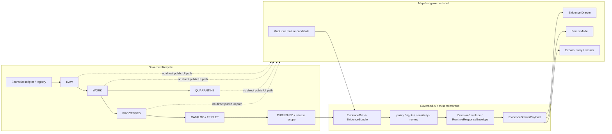

<!-- [KFM_META_BLOCK_V2]
doc_id: kfm://doc/NEEDS-VERIFICATION-ADR-evidence-drawer-contract
title: ADR: Evidence Drawer Contract
type: standard
version: v1
status: review
owners: OWNER_TBD_NEEDS_VERIFICATION
created: 2026-05-08
updated: 2026-05-08
policy_label: NEEDS_VERIFICATION
related: [./README.md, ./ADR-TEMPLATE.md, ./ADR-0001-schema-home.md, ./ADR-0002-responsibility-root-monorepo.md, ../architecture/map-shell.md, ../architecture/governed-api.md, ../../contracts/ui/README.md, ../../contracts/ui/ecology_evidence_drawer_payload.md, ../../apps/web/src/ecology/EvidenceDrawer.tsx, ../../apps/web/src/ecology/evidenceBundle.ts, ../../apps/api/server.py, ../../tools/validators/ecology/run_ecology_ui_checks.sh, ../../tests/fixtures/ecology/ui/evidence_drawer.valid.json]
tags: [kfm, adr, evidence-drawer, governed-api, ui, maplibre, evidencebundle, focus-mode, trust-surface]
notes: [Replaces the prior backlog placeholder ADR for the Evidence Drawer contract. Decision is proposed, not accepted. Current repo evidence confirms an ecology-specific Evidence Drawer implementation and fixture, but global schema, cross-domain contract, owner routing, policy label, CI run status, and release enforcement remain NEEDS VERIFICATION.]
[/KFM_META_BLOCK_V2] -->

<a id="top"></a>

# ADR: Evidence Drawer Contract

Proposed decision for making the Evidence Drawer the mandatory, governed, cross-surface trust payload for consequential KFM claims.

<p align="center">
  
  
  
  
  
  
</p>

<p align="center">
  <a href="#decision-summary">Decision</a> ·
  <a href="#evidence-basis">Evidence</a> ·
  <a href="#problem">Problem</a> ·
  <a href="#requirements">Requirements</a> ·
  <a href="#options-considered">Options</a> ·
  <a href="#contract-minimum">Contract minimum</a> ·
  <a href="#impact-map">Impact</a> ·
  <a href="#validation-plan">Validation</a> ·
  <a href="#rollback-and-supersession">Rollback</a> ·
  <a href="#open-verification">Open verification</a>
</p>

> [!IMPORTANT]
> **Decision status:** `proposed`.  
> This ADR does not claim that a global Evidence Drawer schema, validator, route family, CI gate, or cross-domain implementation is complete. It records the decision KFM should make and the evidence required before acceptance.

> [!CAUTION]
> The Evidence Drawer is a trust object, not a decorative tooltip. It must not read RAW, WORK, QUARANTINE, unpublished candidates, canonical/internal stores, direct proof-pack files, direct source systems, or model-runtime outputs from the browser.

---

## ADR header

| Field | Value |
|---|---|
| ADR ID | `ADR-evidence-drawer-contract` |
| Target path | `docs/adr/ADR-evidence-drawer-contract.md` |
| Status | `proposed` |
| Decision date | `2026-05-08` |
| Owners | `OWNER_TBD_NEEDS_VERIFICATION` |
| Policy label | `NEEDS_VERIFICATION` |
| Scope | Cross-domain UI/API/evidence contract |
| Supersedes | None |
| Superseded by | None |
| Related ADRs | [`ADR-0001-schema-home.md`](./ADR-0001-schema-home.md), [`ADR-0002-responsibility-root-monorepo.md`](./ADR-0002-responsibility-root-monorepo.md) |
| Related architecture | [`map-shell.md`](../architecture/map-shell.md), [`governed-api.md`](../architecture/governed-api.md) |
| Current implementation signal | Ecology-specific Evidence Drawer payload and fixture exist; global contract remains `PROPOSED` |
| Rollback target | Previous placeholder ADR content in this same path, plus any follow-up contract/schema changes created after this ADR |

[Back to top](#top)

---

## Decision summary

KFM should adopt a **cross-domain `EvidenceDrawerPayload.v1` contract** for every surface that presents a consequential claim, layer explanation, Focus Mode answer, export preview, dossier claim, story claim, or review handoff.

The contract should make evidence, source role, scope, rights, sensitivity, freshness, review state, release state, correction state, limitations, and audit linkage visible at the point of use. It should be implemented as a governed payload returned by the governed API or a verified fixture, not assembled ad hoc by browser code.

### Proposed decision

1. **The Evidence Drawer is mandatory for consequential UI claims.**  
   If a map feature, dossier statement, Focus answer, story step, export, or review item is consequential, the user must be one action away from an Evidence Drawer state or an explicit finite negative state.

2. **`contracts/ui/` owns semantic UI contract prose.**  
   A future cross-domain semantic contract should live under `contracts/ui/` after repo review, while the already-confirmed ecology-specific contract remains lineage and implementation evidence.

3. **The machine schema follows the accepted schema-home decision.**  
   The proposed global schema home is `schemas/contracts/v1/ui/evidence_drawer_payload.schema.json`, but final placement depends on the accepted schema-home ADR and active repo conventions.

4. **Current ecology implementation is a proof slice, not the global contract.**  
   The ecology payload, fixture, validator runner, and app component should inform the global contract, but they must not be silently promoted to cross-domain authority.

5. **The browser renders trust state; it does not decide trust.**  
   Policy, source-role validation, EvidenceRef resolution, EvidenceBundle resolution, release state, sensitivity posture, and citation validity happen upstream of the drawer.

### Operating rule

> A KFM UI surface may display a consequential claim only when it can either open a governed Evidence Drawer payload or show a finite `ABSTAIN`, `DENY`, or `ERROR` state that explains why support is unavailable or blocked.

### Boundary rule

> The Evidence Drawer may display governed evidence state, but it must not become a direct browser path to raw data, canonical stores, unpublished candidates, proof-pack internals, source APIs, or model runtimes.

[Back to top](#top)

---

## Problem

The existing file at this path was a backlog placeholder. It said this ADR would settle the Evidence Drawer contract, but it did not record the contract boundary, the required fields, the current ecology implementation signals, the schema gap, the validation burden, or the rollback path.

KFM now has enough evidence to replace the placeholder with a decision-quality ADR:

- `contracts/ui/` describes the UI contract lane for Evidence Drawer, Focus Mode, layer metadata, shell state, and trust-visible handoffs.
- An ecology-specific Evidence Drawer payload component exists in `apps/web/src/ecology/EvidenceDrawer.tsx`.
- An ecology EvidenceBundle client exists and uses finite `ANSWER`, `ABSTAIN`, `DENY`, and `ERROR` outcomes.
- A minimal ecology governed API exists and fails closed for unresolved evidence, unclear rights, restricted sensitivity, exact geometry, missing promotion, and denied policy.
- A UI fixture exists for `EcologyEvidenceDrawerPayload`.
- A validator runner exists for ecology UI payload checks.
- The expected ecology schema path is referenced by the validator, but the schema file itself still needs verification before enforcement can be claimed.

### Why this is architecture-significant

The Evidence Drawer is where the user sees whether a rendered claim is evidence-backed, policy-safe, review-aware, current, generalized, corrected, withheld, or unresolved. Without a stable contract, KFM risks turning maps, popups, Focus answers, exports, or story text into persuasive but weakly supported surfaces.

This ADR protects:

- the governed API trust membrane;
- `EvidenceRef -> EvidenceBundle` resolution;
- cite-or-abstain behavior;
- public-safe map rendering;
- Focus Mode subordination to evidence;
- source-role and rights/sensitivity visibility;
- correction and rollback inspectability;
- separation between UI rendering and truth authority.

[Back to top](#top)

---

## Evidence basis

| Evidence item | Status | What it supports | Limit |
|---|---:|---|---|
| Existing `docs/adr/ADR-evidence-drawer-contract.md` | `CONFIRMED` | Target file exists as a placeholder ADR. | Placeholder did not settle contract details. |
| [`docs/adr/README.md`](./README.md) | `CONFIRMED` | ADRs belong in `docs/adr/` as the human-facing decision ledger; ADRs are not implementation proof. | Does not prove this ADR is accepted. |
| [`docs/adr/ADR-TEMPLATE.md`](./ADR-TEMPLATE.md) | `CONFIRMED` | ADRs should expose evidence, scope, impact, validation, rollback, and supersession. | Template does not decide this contract. |
| [`ADR-0001-schema-home.md`](./ADR-0001-schema-home.md) | `CONFIRMED / PROPOSED` | Proposed split: `contracts/` means, `schemas/contracts/v1/` validates shape, `policy/` decides admissibility. | Schema-home acceptance and enforcement remain `NEEDS VERIFICATION`. |
| [`ADR-0002-responsibility-root-monorepo.md`](./ADR-0002-responsibility-root-monorepo.md) | `CONFIRMED / ACCEPTED` | Root folders are responsibility boundaries; ADR belongs under `docs/adr/`. | Does not settle UI payload subpaths. |
| [`contracts/ui/README.md`](../../contracts/ui/README.md) | `CONFIRMED` | `contracts/ui/` is the human-readable UI contract lane for Evidence Drawer, Focus, layer metadata, shell state, and trust cues. | Does not itself define global machine schema. |
| [`contracts/ui/ecology_evidence_drawer_payload.md`](../../contracts/ui/ecology_evidence_drawer_payload.md) | `CONFIRMED / PROPOSED` | Ecology-specific drawer contract consumes governed API EvidenceBundle responses and forbids direct raw/proof/canonical access. | Ecology-specific; not final cross-domain contract. |
| [`docs/architecture/map-shell.md`](../architecture/map-shell.md) | `CONFIRMED` | Map shell is a trust-visible operating field; Evidence Drawer is part of the shell trust model. | Full production maturity remains `NEEDS VERIFICATION`. |
| [`docs/architecture/governed-api.md`](../architecture/governed-api.md) | `CONFIRMED` | Governed API returns evidence-resolving, policy-checked, release-aware envelopes; route alignment still has verification gaps. | Does not prove all routes are aligned. |
| [`apps/web/src/ecology/EvidenceDrawer.tsx`](../../apps/web/src/ecology/EvidenceDrawer.tsx) | `CONFIRMED` | Current ecology payload type and drawer renderer expose outcome, refs, sources, trust badges, policy flags, freshness, limitations, layer trust, and resolved EvidenceBundle details. | Domain-specific and not a schema. |
| [`apps/web/src/ecology/evidenceBundle.ts`](../../apps/web/src/ecology/evidenceBundle.ts) | `CONFIRMED` | Ecology EvidenceBundle client uses finite outcomes and public-only denial logic. | Global resolver behavior remains `NEEDS VERIFICATION`. |
| [`apps/api/server.py`](../../apps/api/server.py) | `CONFIRMED` | Minimal ecology API returns public-safe artifacts and fails closed on governance problems. | Deployment and route alignment remain `NEEDS VERIFICATION`. |
| [`tools/validators/ecology/run_ecology_ui_checks.sh`](../../tools/validators/ecology/run_ecology_ui_checks.sh) | `CONFIRMED` | Ecology UI fixture validation runner exists. | Successful CI run not verified here. |
| [`tests/fixtures/ecology/ui/evidence_drawer.valid.json`](../../tests/fixtures/ecology/ui/evidence_drawer.valid.json) | `CONFIRMED` | Valid ecology UI payload fixture exists and demonstrates current field shape. | Global answer/abstain/deny/error fixture set remains incomplete. |
| Expected schema path `schemas/contracts/v1/ecology/ecology_evidence_drawer_payload.schema.json` | `NEEDS VERIFICATION` | Validator references this schema path. | Direct file verification did not confirm the schema file in this session. |

[Back to top](#top)

---

## Requirements

### KFM invariants checked

| Invariant | Evidence Drawer requirement | Status |
|---|---|---:|
| `RAW -> WORK / QUARANTINE -> PROCESSED -> CATALOG / TRIPLET -> PUBLISHED` | Drawer payloads are downstream of governed release or verified no-network fixtures. | `PROPOSED / NEEDS VERIFICATION` |
| Public clients use governed interfaces | Drawer consumes governed API payloads or verified fixtures, never raw lifecycle zones. | `PROPOSED` |
| `EvidenceRef` resolves to `EvidenceBundle` | Drawer payload carries or links to resolved support state, or shows finite negative outcome. | `PROPOSED` |
| Cite-or-abstain | If evidence cannot be resolved, the drawer renders abstention or denial rather than weak prose. | `PROPOSED` |
| Policy-aware defaults | Unknown rights, restricted sensitivity, review holds, stale releases, and exact-sensitive geometry fail closed upstream. | `PROPOSED / partially confirmed in ecology API` |
| Derived surfaces stay derived | Map style, feature properties, tiles, graph/search results, and Focus text do not become proof. | `PROPOSED` |
| AI is interpretive | Focus Mode may link to drawer evidence, but it cannot upgrade drawer state or invent citations. | `PROPOSED` |
| Correction and rollback are visible | Drawer contract includes correction/release state or explicitly shows `UNKNOWN` / unavailable. | `PROPOSED` |

### Non-goals

This ADR does not decide:

- the final JSON Schema content;
- all route names for Evidence Drawer payloads;
- final app component names;
- whether ecology’s current payload type is renamed or adapted;
- public release approval for any domain;
- source-specific rights, sensitivity, or steward policy;
- Focus Mode prompt design;
- proof-pack storage layout;
- production deployment or branch protection.

[Back to top](#top)

---

## Options considered

| Option | Description | Benefits | Risks | Outcome |
|---|---|---|---|---|
| Keep the placeholder ADR | Leave the existing backlog stub unchanged. | No immediate migration burden. | Leaves the central trust object unresolved; invites UI drift. | Rejected |
| Promote ecology payload as global contract now | Treat `EcologyEvidenceDrawerPayload` as the cross-domain payload. | Uses real implementation evidence. | Domain-specific fields and missing verified schema could become accidental authority. | Rejected / deferred |
| Adopt a cross-domain semantic contract now, with schema and tests as acceptance gates | Record global minimum semantics while preserving ecology as proof-slice evidence. | Keeps doctrine, current implementation, and future schema work aligned. | Requires follow-up contract, schema, fixture, and adapter work. | Selected |
| Let browser components infer drawer state from feature properties | Avoids additional route/schema work. | Violates trust membrane; renderer properties could masquerade as evidence. | Rejected |
| Make the drawer optional except in high-risk domains | Reduces UI burden. | Weakens KFM’s central cite-or-abstain posture; hides uncertainty. | Rejected |

[Back to top](#top)

---

## Decision

### Chosen option

Adopt a cross-domain `EvidenceDrawerPayload.v1` semantic contract as the proposed KFM standard, while treating the current ecology drawer payload as implementation evidence and a migration/proof slice.

### Contract authority split

| Surface | Role | Status |
|---|---|---:|
| `docs/adr/ADR-evidence-drawer-contract.md` | Decision record and review burden. | `THIS FILE / PROPOSED` |
| `contracts/ui/` | Human-readable UI contract meanings and cross-surface obligations. | `CONFIRMED lane / follow-up PROPOSED` |
| `contracts/ui/ecology_evidence_drawer_payload.md` | Ecology-specific payload contract and lineage. | `CONFIRMED / PROPOSED` |
| `schemas/contracts/v1/ui/evidence_drawer_payload.schema.json` | Proposed global machine schema home, subject to accepted schema-home ADR. | `PROPOSED` |
| `schemas/contracts/v1/ecology/ecology_evidence_drawer_payload.schema.json` | Existing validator-expected ecology schema path. | `NEEDS VERIFICATION` |
| `policy/` | Rights, sensitivity, release, denial, review, and admissibility decisions. | `CONFIRMED separate role` |
| `apps/web/` | Renderer and shell implementation consumer. | `CONFIRMED ecology slice` |
| `apps/api/` or accepted governed API home | Payload producer / evidence resolver. | `CONFIRMED ecology API file; route alignment NEEDS VERIFICATION` |
| `tests/fixtures/` and validators | Proof that payloads pass and fail correctly. | `CONFIRMED ecology fixture; global matrix PROPOSED` |

### Acceptance signal

This ADR should not be marked accepted until:

- a global semantic contract is added or confirmed under `contracts/ui/`;
- a machine schema path is accepted and present;
- ecology payload mapping is either confirmed compatible or explicitly migrated;
- valid fixtures cover `ANSWER`, `ABSTAIN`, `DENY`, and `ERROR`;
- invalid fixtures cover missing evidence, restricted sensitivity, unknown rights, stale state, and raw-path leakage;
- UI tests or validator checks prove the drawer renders finite negative states visibly;
- route names and ID semantics are aligned across API, web client, docs, fixtures, and schemas;
- owner routing and policy label are verified;
- CI or validation output is inspected.

[Back to top](#top)

---

## Contract minimum

The global contract should normalize the field families below. Existing ecology fields are shown as current implementation signals, not as final global authority.

### Required top-level families

| Family | Minimum meaning | Current ecology signal |
|---|---|---|
| Identity | Stable payload id, claim ref, EvidenceBundle ref, decision ref, release ref. | `payload_id`, `claim_ref`, `evidence_bundle_ref`, `decision_ref`, `release_ref` |
| Outcome | Finite outcome and visible exposure state. | `decision`, `visible_outcome` |
| Summary | Human-readable headline and trust note; optional domain labels. | `summary.headline`, `summary.trust_note`, `taxon`, `habitat_class`, `knowledge_character` |
| Evidence | Evidence refs and resolved EvidenceBundle details or safe unavailable state. | `evidence_refs`, `EcologyEvidenceDrawerEvidence` |
| Sources | Source refs, source roles, citations. | `sources[].source_ref`, `sources[].source_role`, `sources[].citation` |
| Trust cues | Trust badges, policy flags, rights/sensitivity state, review state, freshness, correction state. | `trust_badges`, `policy_flags`, `freshness`; some values currently appear through resolved bundle details |
| Rights and sensitivity | Public-safe, generalized, withheld, restricted, redacted, or review-required state. | `policy_flags`, `redaction_receipt_refs`, resolved bundle `rights_status`, `sensitivity`, `visibility` |
| Scope | Place, time basis, opened-from surface, layer context where material. | Partially present through layer metadata and feature context; global contract should make this explicit |
| Limitations | Safe caveats and evidence limitations. | `limitations`, resolved bundle limitations/warnings/notes |
| Provenance and audit | Spec hash, receipt refs, redaction receipts, run receipts, promotion or correction refs where material. | `spec_hash`, `redaction_receipt_refs`, layer metadata `runReceiptRef`, `promotionDecisionRef` |
| Actions | Allowed user actions, such as open evidence, open catalog, copy citation, open correction route, export. | `PROPOSED` for global contract; current ecology component renders references rather than action flags |

### Required finite outcomes

| Outcome | Drawer behavior |
|---|---|
| `ANSWER` | Show support summary, evidence refs, source roles, rights/sensitivity posture, release/correction/freshness context, and audit refs when supplied. |
| `ABSTAIN` | Explain missing, insufficient, conflicted, stale, unresolved, or source-role-inadequate evidence without inventing a claim. |
| `DENY` | Explain safe policy block or access restriction without leaking restricted details. |
| `ERROR` | Explain system/runtime/validation failure without recasting it as source uncertainty. |

### Global payload sketch

This sketch is illustrative. The machine schema must be created or verified separately.

```json
{
  "schema_version": "v1",
  "object_type": "EvidenceDrawerPayload",
  "payload_id": "kfm://drawer/example",
  "claim_ref": "kfm://claim/example",
  "evidence_bundle_ref": "kfm://evidence/example",
  "decision_ref": "kfm://decision/example",
  "release_ref": "kfm://release/example",
  "decision": "ANSWER",
  "visible_outcome": "shown",
  "summary": {
    "headline": "Claim support is available",
    "trust_note": "Evidence resolved through governed API.",
    "knowledge_character": "observed"
  },
  "scope": {
    "place_ref": "kfm://place/example",
    "time_basis": "2026-05-08",
    "opened_from_surface": "map"
  },
  "sources": [
    {
      "source_ref": "kfm://source/example",
      "source_role": "OBSERVATION_SYSTEM",
      "citation": "Example source citation."
    }
  ],
  "evidence_refs": [
    "kfm://evidence/example#source-row"
  ],
  "trust_badges": [
    "EVIDENCE_RESOLVED"
  ],
  "rights": {
    "rights_status": "public",
    "sensitivity": "public",
    "visibility": "public",
    "policy_flags": []
  },
  "freshness": {
    "generated_at": "2026-05-08T00:00:00Z",
    "stale_after": "2026-06-08T00:00:00Z"
  },
  "review": {
    "review_state": "reviewed",
    "correction_state": "none"
  },
  "audit": {
    "spec_hash": "sha256:aaaaaaaaaaaaaaaaaaaaaaaaaaaaaaaaaaaaaaaaaaaaaaaaaaaaaaaaaaaaaaaa",
    "receipt_refs": [],
    "redaction_receipt_refs": []
  },
  "limitations": []
}
```

[Back to top](#top)

---

## Must / must never rules

| Surface | Must do | Must never do |
|---|---|---|
| Evidence Drawer | Render governed evidence state, finite outcome, source role, policy posture, review/release/correction/freshness context, and safe limitations. | Read raw data, canonical stores, source systems, proof-pack internals, or model outputs directly. |
| Map shell | Open drawer from candidate feature, layer panel, dossier, story, export, review, or Focus citation when required. | Treat style, tiles, feature properties, or popup text as proof. |
| Governed API | Resolve EvidenceRef/EvidenceBundle and return payload or finite negative state. | Return unrestricted lifecycle/internal content to public UI. |
| Focus Mode | Link to drawer-safe evidence and preserve `ANSWER`, `ABSTAIN`, `DENY`, `ERROR`. | Upgrade `ABSTAIN` into an answer or hide policy denial. |
| Export / share | Preserve evidence, release, correction, sensitivity, and citation state. | Strip trust cues or generalization context for presentation polish. |
| Review surface | Show reviewer/steward state and obligations explicitly. | Become a hidden administrative truth system with weaker evidence law. |

[Back to top](#top)

---

## Architecture flow



[Back to top](#top)

---

## Impact map

| Area | Required update | Status |
|---|---|---:|
| `docs/adr/ADR-evidence-drawer-contract.md` | Replace placeholder with this decision record. | `THIS CHANGE` |
| `docs/adr/README.md` | Add or update ADR inventory entry for this ADR. | `PROPOSED` |
| `contracts/ui/README.md` | Link this ADR and distinguish global drawer contract from ecology-specific payload. | `PROPOSED` |
| `contracts/ui/evidence_drawer_payload.contract.md` | Create or confirm cross-domain semantic contract. | `PROPOSED` |
| `contracts/ui/ecology_evidence_drawer_payload.md` | Mark as ecology profile / lineage / proof-slice input to global contract. | `PROPOSED` |
| `schemas/contracts/v1/ui/evidence_drawer_payload.schema.json` | Create global schema after schema-home review. | `PROPOSED` |
| `schemas/contracts/v1/ecology/ecology_evidence_drawer_payload.schema.json` | Verify or add expected ecology schema referenced by validator. | `NEEDS VERIFICATION` |
| `tests/fixtures/ui/` or repo-confirmed fixture home | Add cross-domain drawer fixtures for `ANSWER`, `ABSTAIN`, `DENY`, and `ERROR`. | `PROPOSED` |
| `tests/fixtures/ecology/ui/evidence_drawer.valid.json` | Preserve current valid ecology fixture and add negative fixtures. | `CONFIRMED existing / PROPOSED expansion` |
| `tools/validators/` | Add or extend drawer contract validation without treating UI as policy authority. | `PROPOSED` |
| `apps/web/` | Ensure Drawer component renders global contract or uses a documented adapter. | `PROPOSED` |
| `apps/api/` or accepted governed API home | Align drawer route names and ID semantics with client/docs. | `NEEDS VERIFICATION` |
| `policy/` | Ensure rights/sensitivity/review/release denial remains upstream of browser rendering. | `PROPOSED` |
| `docs/architecture/map-shell.md` | Link this ADR from the Evidence Drawer and trust-surface sections. | `PROPOSED` |
| `docs/architecture/governed-api.md` | Link this ADR from Evidence Drawer route-family guidance. | `PROPOSED` |

[Back to top](#top)

---

## Policy, rights, and sensitivity

| Question | Decision |
|---|---|
| Does the drawer affect public release eligibility? | It displays release and policy state; it does not approve release. |
| Does the drawer affect exact location exposure? | It must display generalized/withheld/restricted state but must not expose exact sensitive geometry. |
| Does it affect rare species, archaeology, living persons, DNA, land ownership, infrastructure, or other sensitive material? | Yes, whenever those domains use the drawer. Domain policy must fail closed before payload creation. |
| Does it require steward or policy review? | Yes for sensitive domains, restricted payloads, public-facing release, or schema acceptance. |
| Does it change correction/withdrawal behavior? | It makes correction and withdrawal visible; it does not decide them. |
| Does it affect AI/Focus Mode? | Yes. Focus must cite drawer-safe evidence and preserve finite outcomes. |

> [!WARNING]
> If rights, sensitivity, review state, release state, or source role is unclear, the drawer should show `DENY`, `ABSTAIN`, `ERROR`, generalized state, hidden-detail state, or review-required state rather than presenting a claim as supported.

[Back to top](#top)

---

## Validation plan

### Required checks before acceptance

| Check | Expected result | Status |
|---|---|---:|
| Target ADR present | `docs/adr/ADR-evidence-drawer-contract.md` exists and has this decision body. | `THIS CHANGE` |
| ADR index updated | ADR README links this file and marks status `proposed`. | `PROPOSED` |
| Global semantic contract | Cross-domain contract exists under `contracts/ui/` or accepted equivalent. | `PROPOSED` |
| Machine schema present | Global schema exists in accepted schema home. | `PROPOSED` |
| Ecology schema verified | Expected ecology schema file exists or validator mapping is corrected. | `NEEDS VERIFICATION` |
| Current valid ecology fixture passes | `tools/validators/ecology/run_ecology_ui_checks.sh` passes in active checkout. | `NEEDS VERIFICATION` |
| Negative fixtures | `ABSTAIN`, `DENY`, `ERROR`, restricted, stale, missing evidence, and raw-path fixtures exist. | `PROPOSED` |
| Browser no-direct-access check | UI code cannot import/read RAW, WORK, QUARANTINE, canonical stores, source APIs, or direct model runtime. | `PROPOSED` |
| Route alignment | Server, client, docs, schemas, fixtures, and tests agree on drawer/evidence route names and ID semantics. | `NEEDS VERIFICATION` |
| Accessibility | Drawer outcome, restrictions, unavailable state, and trust cues are not color-only. | `PROPOSED` |
| Focus parity | Focus UI and runtime preserve `ANSWER`, `ABSTAIN`, `DENY`, and `ERROR` and link back to drawer-safe evidence. | `PROPOSED` |

### Suggested commands for active checkout

Run only in a real repository checkout. Record output before claiming validation success.

```bash
git status --short
git branch --show-current || true

find docs/adr -maxdepth 1 -type f -name 'ADR-evidence-drawer-contract.md' -print

python tools/validators/ecology/validate_ecology_bundle.py \
  --bundle tests/fixtures/ecology/ui/*.json \
  --expect pass

bash tools/validators/ecology/run_ecology_ui_checks.sh

grep -RInE "data/(raw|work|quarantine)|canonical|internal_store|localhost:11434|/api/generate|/api/chat" \
  apps/web contracts/ui docs/architecture docs/adr 2>/dev/null || true
```

### Negative-path matrix

| Failure condition | Required outcome |
|---|---|
| Missing EvidenceBundle | `ABSTAIN` with safe reason. |
| Policy denies details | `DENY` without restricted details. |
| System or validation failure | `ERROR` without fallback claim text. |
| Unknown rights | `DENY` or review hold. |
| Restricted sensitivity | `DENY`, generalized state, or role-gated state. |
| Generalized geometry | Visible `generalized` / redaction receipt state. |
| Stale source or release | Visible freshness warning. |
| Superseded or withdrawn release | Visible correction/withdrawal state. |
| Source-role mismatch | `ABSTAIN` or `DENY` depending on policy. |
| Browser raw-path attempt | CI/test failure or release block. |

[Back to top](#top)

---

## Rollback and supersession

### Rollback plan

If this ADR causes confusion or an implementation regression:

1. Keep this ADR as lineage; do not delete it silently.
2. Restore the prior placeholder content only if a reviewer explicitly reopens the decision.
3. Disable any new global drawer schema or mapper rather than weakening upstream policy.
4. Keep ecology-specific drawer implementation intact unless the regression is in that slice.
5. Revert or quarantine new fixtures, validators, routes, or adapters that fail validation.
6. Preserve any correction notes for public-facing payloads already exposed.
7. Add a superseding ADR if the contract shape or schema home changes materially.

### Rollback triggers

| Trigger | Required action |
|---|---|
| Browser gains direct raw/canonical/proof/source/model access | Disable path and add regression test. |
| Drawer displays unsupported claim text | Remove or downgrade claim to finite negative state. |
| Sensitive exact geometry leaks through drawer payload | Withdraw or redact payload; emit correction and redaction evidence. |
| Schema-home conflict reappears | Block acceptance and update ADR-0001 or successor decision. |
| Route names drift across API/client/docs/tests | Freeze new adoption until route family is reconciled. |
| Focus upgrades abstention/denial into answer | Disable Focus handoff or enforce runtime envelope parity. |
| CI cannot validate drawer fixtures | Keep ADR proposed; do not claim enforcement. |

### Supersession rule

A successor ADR is required if KFM later changes:

- the global payload object name;
- the canonical schema home;
- the drawer route family;
- finite outcome semantics;
- whether drawer payloads are precomputed or resolved on demand;
- how sensitive-domain drawers generalize, withhold, or expose safe stubs;
- how Focus Mode cites drawer-safe evidence.

[Back to top](#top)

---

## Consequences

### Positive consequences

- Replaces an unresolved placeholder with a reviewable decision.
- Preserves the Evidence Drawer as a mandatory trust object.
- Uses current ecology implementation without overgeneralizing it.
- Prevents browser-side inference from becoming evidence authority.
- Makes negative outcomes visible and testable.
- Creates a clear path to schema, fixture, validator, and route alignment.
- Keeps Focus Mode subordinate to the same evidence surface.

### Tradeoffs and risks

| Risk | Mitigation |
|---|---|
| Global contract diverges from ecology implementation | Treat ecology as a profile/proof slice and add adapter or migration notes. |
| Required fields exceed current ecology payload | Mark as acceptance gap and add fields through small reversible PRs. |
| Schema path is unresolved | Keep this ADR `proposed`; follow ADR-0001 or successor. |
| UI becomes cluttered | Use progressive disclosure, but never hide the existence of evidence, policy, restriction, correction, or negative outcome. |
| Domain-specific needs expand payload too quickly | Use extension fields or domain profiles, but keep global minimum stable. |
| Policy details leak sensitive information | Upstream policy returns safe reason/obligation codes only. |
| Route drift blocks adoption | Align API, client, docs, fixtures, and tests before acceptance. |

[Back to top](#top)

---

## Open verification

| Item | Status | Verification path |
|---|---:|---|
| Stable `doc_id` | `NEEDS VERIFICATION` | Assign from document registry. |
| Owner / CODEOWNERS route | `NEEDS VERIFICATION` | Confirm owner in CODEOWNERS or governance register. |
| Policy label | `NEEDS VERIFICATION` | Confirm public/restricted status. |
| Global semantic contract file | `PROPOSED` | Create or confirm cross-domain `contracts/ui/` contract. |
| Global machine schema path | `PROPOSED / NEEDS VERIFICATION` | Follow accepted schema-home ADR. |
| Ecology-specific schema file | `NEEDS VERIFICATION` | Verify or add `schemas/contracts/v1/ecology/ecology_evidence_drawer_payload.schema.json`, or correct validator mapping. |
| Route names | `NEEDS VERIFICATION` | Align API server, web client, docs, fixtures, and tests. |
| ID semantics | `NEEDS VERIFICATION` | Decide `claim_ref` vs `bundle_id` lookup behavior. |
| Full finite outcome fixture set | `PROPOSED` | Add `ANSWER`, `ABSTAIN`, `DENY`, `ERROR` fixtures. |
| Accessibility coverage | `NEEDS VERIFICATION` | Add UI tests or review notes. |
| CI run status | `NEEDS VERIFICATION` | Inspect workflow output after changes. |
| Cross-domain adoption | `UNKNOWN` | Add hydrology or another public-safe lane after global contract stabilizes. |

[Back to top](#top)

---

## Review checklist

<details>
<summary>Pre-acceptance checklist</summary>

- [ ] ADR status remains `proposed` until schema, fixtures, validation, owners, and route alignment are verified.
- [ ] ADR index links this file.
- [ ] Global semantic contract is present or explicitly deferred.
- [ ] Machine schema home follows accepted schema-home ADR.
- [ ] Current ecology payload is classified as proof-slice evidence, not silent global authority.
- [ ] Browser direct access to raw/work/quarantine/canonical/proof/source/model paths is denied.
- [ ] Drawer payload has finite `ANSWER`, `ABSTAIN`, `DENY`, `ERROR` behavior.
- [ ] Drawer payload exposes or safely withholds source role, policy, rights, sensitivity, review, release, freshness, correction, limitations, and audit linkage.
- [ ] Negative-path fixtures exist.
- [ ] Focus Mode does not bypass drawer-safe evidence.
- [ ] MapLibre style, tile, feature-property, and popup state are not treated as proof.
- [ ] Sensitive-domain adoption has domain policy and steward review.
- [ ] Rollback and supersession plan is reviewable.

</details>

[Back to top](#top)
