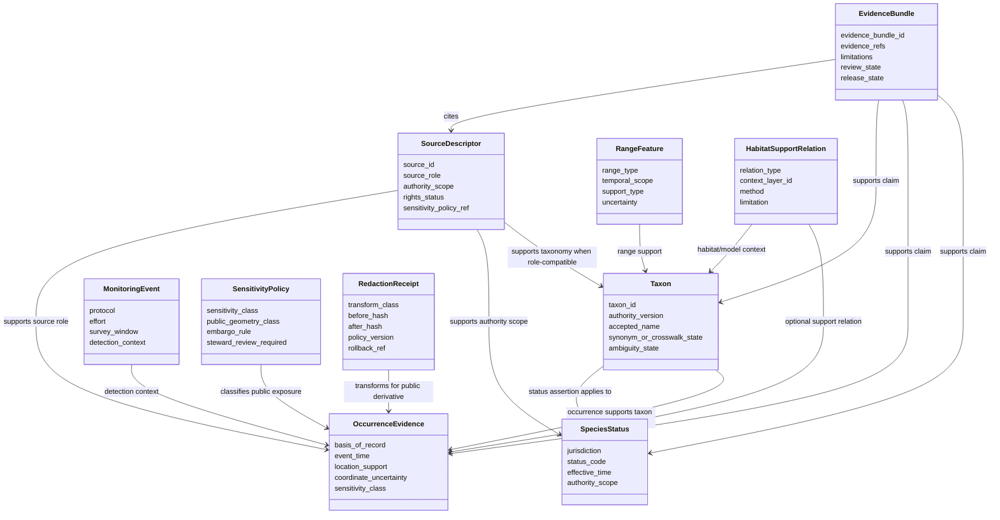
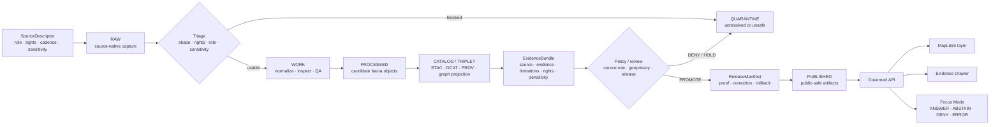

<!-- [KFM_META_BLOCK_V2]
doc_id: kfm://doc/NEEDS-VERIFICATION-ADR-fauna-domain-model
title: ADR — Fauna Domain Model
type: standard
version: v1
status: draft
owners: TODO(fauna-domain-stewards)
created: 2026-05-08
updated: 2026-05-08
policy_label: TODO(verify-public-or-restricted)
related: [./README.md, ./ADR-TEMPLATE.md, ./ADR-0001-schema-home.md, ./ADR-0208-domain-lane-template.md, ../domains/fauna/README.md, ../domains/fauna/CONTROL_PLANE.md, ../domains/fauna/SOURCE_ROLES.md, ../domains/fauna/GEOPRIVACY.md, ../domains/fauna/VALIDATION.md, ../domains/fauna/MIGRATION_AND_CONTINUITY.md, ../../data/registry/fauna/README.md]
tags: [kfm, adr, fauna, domain-model, wildlife, taxonomy, occurrence, source-role, geoprivacy, evidence]
notes: [Replaces placeholder ADR body. doc_id, owners, policy_label, CODEOWNERS routing, acceptance status, schema-home enforcement, validator implementation, source-rights review, and release proof remain NEEDS VERIFICATION.]
[/KFM_META_BLOCK_V2] -->

<a id="top"></a>

# ADR — Fauna Domain Model

Defines the fauna lane as an evidence-bound, source-role-aware, geoprivacy-gated domain model for wildlife claims, not a flat species map or source-specific mirror.

<p align="center">
  
  
  
  
  
  
</p>

<p align="center">
  <a href="#decision-summary">Decision</a> ·
  <a href="#evidence-boundary">Evidence</a> ·
  <a href="#context">Context</a> ·
  <a href="#model-boundary">Boundary</a> ·
  <a href="#object-family-model">Objects</a> ·
  <a href="#source-role-model">Source roles</a> ·
  <a href="#geoprivacy-and-publication-model">Geoprivacy</a> ·
  <a href="#validation-plan">Validation</a> ·
  <a href="#rollback-and-supersession">Rollback</a> ·
  <a href="#open-verification-backlog">Open backlog</a>
</p>

> [!IMPORTANT]
> **Decision status:** `PROPOSED`.  
> This ADR records the intended fauna domain model and the review burden needed before the model can be treated as accepted, enforced, or release-ready. It does **not** prove that schemas, validators, policies, source descriptors, API routes, UI components, proof packs, or public layers are implemented.

> [!NOTE]
> The fauna lane is high-risk when exact locations, protected taxa, nests, dens, roosts, hibernacula, spawning areas, monitoring stations, telemetry traces, private-land contexts, or steward-controlled records are involved. The default public posture is fail closed.

---

## ADR status

| Field | Value |
|---|---|
| ADR ID | `ADR-fauna-domain-model` |
| Target path | `docs/adr/ADR-fauna-domain-model.md` |
| Status | `proposed` |
| Document status | `draft` |
| Decision date | `2026-05-08` |
| Scope | Fauna domain architecture, object families, source-role compatibility, geoprivacy, validation, runtime/public boundaries |
| Owners | `TODO(fauna-domain-stewards)` |
| Reviewers | `TODO(domain, policy, schema, release, and UI reviewers)` |
| Policy label | `TODO(verify-public-or-restricted)` |
| Supersedes | Backlog placeholder body in `docs/adr/ADR-fauna-domain-model.md` |
| Related ADRs | [`ADR-TEMPLATE.md`](./ADR-TEMPLATE.md), [`ADR-0001-schema-home.md`](./ADR-0001-schema-home.md), [`ADR-0208-domain-lane-template.md`](./ADR-0208-domain-lane-template.md) |
| Related fauna docs | [`../domains/fauna/README.md`](../domains/fauna/README.md), [`../domains/fauna/CONTROL_PLANE.md`](../domains/fauna/CONTROL_PLANE.md), [`../domains/fauna/SOURCE_ROLES.md`](../domains/fauna/SOURCE_ROLES.md), [`../domains/fauna/GEOPRIVACY.md`](../domains/fauna/GEOPRIVACY.md), [`../domains/fauna/VALIDATION.md`](../domains/fauna/VALIDATION.md), [`../domains/fauna/MIGRATION_AND_CONTINUITY.md`](../domains/fauna/MIGRATION_AND_CONTINUITY.md) |
| Related registry | [`../../data/registry/fauna/README.md`](../../data/registry/fauna/README.md) |
| Decision confidence | `PROPOSED` with repo-path evidence for adjacent docs and `NEEDS VERIFICATION` for enforcement |
| Rollback target | Restore the prior placeholder or supersede this ADR with a successor decision; preserve this file as lineage |

[Back to top](#top)

---

## Decision summary

Adopt the fauna domain model as an **evidence-bound object-family model** organized around taxon identity, source-role-constrained status and occurrence support, monitoring evidence, range and seasonal-range support, habitat/model support relations, sensitivity and public-geometry policy, redaction receipts, EvidenceBundle closure, governed API payloads, Evidence Drawer payloads, Focus Mode finite outcomes, release manifests, correction notices, and rollback cards.

### One-line decision rule

> Fauna public claims must be modeled as inspectable, source-role-compatible, geoprivacy-safe claims over resolved evidence, not as direct species points, raw source mirrors, model outputs, rendered tiles, or AI summaries.

### One-line boundary rule

> A fauna source, map layer, model, tile, search result, graph edge, popup, export, or Focus Mode answer must not imply more authority, precision, rights, or public safety than its supporting source roles, EvidenceBundle, policy decision, review state, and release state allow.

### What this ADR settles

| Area | Decision |
|---|---|
| Domain shape | Fauna is a governed domain lane with object families, source roles, evidence closure, geoprivacy, release, correction, and rollback. |
| Core object families | Use the fauna object families already documented in the fauna lane as the conceptual model until machine schemas refine them. |
| Source authority | Source role is part of claim meaning; occurrence aggregators, habitat layers, and derived models are not legal-status authorities. |
| Public geometry | Exact sensitive fauna geometry is denied by default; public derivatives require transform receipts and release gates. |
| Runtime boundary | Governed API, MapLibre, Evidence Drawer, and Focus Mode consume released, policy-safe, evidence-backed payloads only. |
| Enforcement state | Enforcement remains `NEEDS VERIFICATION` until schemas, validators, policies, fixtures, release objects, and CI/runtime evidence are inspected. |

[Back to top](#top)

---

## Evidence boundary

This ADR revises a placeholder ADR into a substantive decision record. It is grounded in accessible repository documents and KFM doctrine, but it does not upgrade proposed implementation into confirmed enforcement.

| Evidence item | Status | Supports | Does not prove |
|---|---:|---|---|
| Existing target ADR placeholder | `CONFIRMED` | `docs/adr/ADR-fauna-domain-model.md` exists as a proposed placeholder requiring accepted decision language and evidence links. | Accepted decision, schema enforcement, or validator coverage. |
| ADR template | `CONFIRMED` | KFM ADRs should expose metadata, evidence, truth labels, impact, validation, rollback, and supersession. | That every ADR already follows the template. |
| ADR index | `CONFIRMED` | `docs/adr/` is the human-facing decision ledger; decisions and enforcement state must stay separate. | Complete ADR inventory or branch protection status. |
| Domain lane template | `CONFIRMED` | Domain lanes must preserve lifecycle, source roles, evidence closure, public boundaries, validation, and rollback. | That every lane has adopted the template. |
| Schema-home ADR | `CONFIRMED / PROPOSED` | `schemas/contracts/v1/` is the proposed machine-schema home; `contracts/` explains meaning; `policy/` decides admissibility. | Accepted schema-home enforcement or successful CI runs. |
| Root README | `CONFIRMED` | KFM identity, inspectable-claim posture, trust lifecycle, governed public interfaces, and AI finite outcomes. | Current proof-slice success or production readiness. |
| Fauna README | `CONFIRMED` | Fauna object families, anti-collapse rules, source roles, lifecycle, public-safety posture, and API/UI/AI boundaries. | Implemented schemas, routes, or validators. |
| Fauna source roles doc | `CONFIRMED` | Canonical source-role taxonomy and source-role-to-claim compatibility rules. | Machine enum acceptance or policy execution. |
| Fauna geoprivacy doc | `CONFIRMED` | Public geometry classes, exact-location denial posture, redaction receipt expectations, and leak-prevention rules. | Active geoprivacy validator enforcement. |
| Fauna validation doc | `CONFIRMED` | Gate matrix, fixture expectations, finite validation outcomes, release dry-run burden, and rollback checks. | Passing test or CI evidence. |
| Fauna control plane doc | `CONFIRMED` | Source activation states, review cadence, active risks, release readiness, and incident triggers. | Owner assignment or release readiness. |
| Fauna migration and continuity doc | `CONFIRMED` | Preservation, non-regression, supersession, identifier, and rollback discipline. | That legacy artifacts have all been inventoried. |
| Fauna registry README | `CONFIRMED` | Source descriptors, taxon authorities, sensitivity policies, domain partitions, and verification backlog belong under the registry lane. | Actual registry YAML inventory or source-rights review. |
| GBIF occurrence ingestion doc | `CONFIRMED` | GBIF-style occurrence records are unreviewed occurrence claims; no-network fixture-first ingestion and rights/geoprivacy gates are required. | Live GBIF connector activation or public-release approval. |
| Directory Rules doctrine | `CONFIRMED` | ADR belongs under `docs/adr/`; fauna domain files belong under responsibility roots, not a root-level `fauna/` directory. | Active checkout conformance for every path. |

### Truth labels used here

| Label | Meaning in this ADR |
|---|---|
| `CONFIRMED` | Verified from accessible repository files, supplied KFM doctrine, or current-session inspection. |
| `PROPOSED` | Decision, model, object boundary, validation expectation, or path relationship not yet proven as active enforcement. |
| `NEEDS VERIFICATION` | A concrete repo, steward, schema, policy, test, source-rights, CI, or release check must retire uncertainty. |
| `UNKNOWN` | Not visible strongly enough from current evidence. |
| `LINEAGE` | Prior or placeholder material that preserves continuity but is not current implementation proof. |
| `DENY`, `ABSTAIN`, `ERROR`, `HOLD`, `QUARANTINE` | System or validation outcomes, not rhetorical emphasis. |

[Back to top](#top)

---

## Context

The fauna lane already has strong domain documentation: a domain README, control-plane document, source-role taxonomy, geoprivacy rules, validation gates, continuity rules, source registry landing page, and source-specific ingestion docs.

The remaining gap is architectural decision coverage. The existing ADR file was a backlog-defined placeholder saying only that the ADR would settle “fauna domain model.” That leaves future contributors without a governing decision that ties the fauna object model to KFM’s source-role, geoprivacy, evidence, public-runtime, validation, release, and rollback rules.

### Problem

Without a settled fauna domain model, maintainers can accidentally drift into weaker patterns:

| Drift pattern | Failure mode |
|---|---|
| Flat occurrence map | Species points appear to be truth without source role, rights, sensitivity, evidence closure, or release state. |
| Source-specific canonical model | GBIF, eBird, iNaturalist, museum, legal-status, monitoring, or steward data shape the canonical model independently. |
| Habitat/model overreach | Habitat support or suitability models are treated as occurrence proof. |
| Aggregator authority collapse | Occurrence aggregators are treated as legal, conservation, or taxonomic authorities. |
| Public geometry leak | Exact sensitive locations reach public layers, APIs, graph projections, screenshots, exports, Evidence Drawer, or Focus Mode. |
| AI or UI truth drift | Focus Mode, popups, maps, or summaries become the apparent source of truth. |
| Migration loss | Prior fauna and habitat+fauna gains are overwritten without mapping, fixtures, or rollback. |

### Why this is architecture-significant

Fauna is not a low-risk layer family. A fauna claim can implicate sensitive locations, protected species, private land, steward-controlled data, legal/conservation status, source rights, observation uncertainty, taxonomic ambiguity, and derived models. These cannot be governed safely by a single “species occurrence” table or a map layer alone.

[Back to top](#top)

---

## Model boundary

### Domain definition

The fauna domain lane governs animal-related spatial evidence and public-safe derived products in KFM.

It includes:

- animal taxonomic identity and taxon-concept support;
- legal and conservation status assertions;
- occurrence evidence from observations, specimens, monitoring, camera/trap/acoustic/eDNA records, mortality records, disease/pathogen records, invasive reports, and documentary support;
- monitoring events and survey effort;
- range, seasonal range, migration, breeding, wintering, and generalized support features;
- habitat-support and model-support relations;
- sensitivity policies, public geometry classes, redaction/generalization receipts, embargoes, and steward review;
- public-safe layers, API payloads, Evidence Drawer payloads, Focus Mode context, release manifests, corrections, and rollback.

It excludes as canonical fauna truth:

| Excluded as fauna truth | Correct treatment |
|---|---|
| Habitat layer alone | `habitat_context` support only; not occurrence proof. |
| Derived suitability/richness/density/corridor model alone | `derived_model` support only; not canonical observation or legal status. |
| Rendered tile or MapLibre layer | Released derivative carrier; not sovereign truth. |
| Occurrence aggregator alone | Occurrence support with caveats; not legal, conservation, or taxonomic authority. |
| AI answer | Interpretive runtime output over resolved evidence; never root evidence. |
| RAW, WORK, or QUARANTINE record | Internal lifecycle material; not a normal public surface. |

### Anti-collapse rules

These rules are normative for this ADR:

- A `Taxon` is not an occurrence.
- An occurrence is not a range.
- A range is not legal status.
- A habitat model is not an animal observation.
- A monitoring non-detection is not broad absence outside protocol scope.
- An occurrence aggregator is not automatically a legal-status authority.
- A public layer is not canonical truth.
- A Focus Mode answer is not evidence.
- A redaction receipt is process memory for a transform, not proof that a claim is true.
- A release manifest permits exposure of a bounded artifact; it does not convert weak source support into strong evidence.

[Back to top](#top)

---

## Object-family model

The fauna model is organized around conceptual object families. Machine schema names, exact fields, and `$id` values remain `NEEDS VERIFICATION` until the accepted schema home and validator suite prove them.

### Core fauna object families

| Object family | Status | Meaning | Required guardrail |
|---|---:|---|---|
| `SourceDescriptor` | `PROPOSED / shared` | Describes source identity, source role, rights, cadence, access class, authority scope, sensitivity, and citation/evidence policy. | Unknown role or rights blocks public promotion. |
| `Taxon` | `PROPOSED` | Stable taxonomic identity or taxon-concept support with authority, rank, synonym/crosswalk, ambiguity, and version scope. | Ambiguous taxon resolution produces `HOLD` or `ABSTAIN`. |
| `SpeciesStatus` | `PROPOSED` | Legal or conservation status assertion scoped by jurisdiction, authority, effective date, review state, and evidence. | Legal, conservation, and taxonomic authority remain separate. |
| `OccurrenceRecord` / `OccurrenceEvidence` | `PROPOSED` | Evidence-bound record supporting occurrence at a place/time with source, basis of record, uncertainty, rights, and sensitivity. | Public exact geometry requires all geoprivacy gates. |
| `MonitoringEvent` | `PROPOSED` | Survey, route, station, transect, protocol, effort, detection/non-detection, or monitoring context. | Non-detection is protocol-scoped, not broad absence. |
| `RangeFeature` / `SeasonalRange` | `PROPOSED` | Range, seasonal range, breeding, wintering, migratory, modeled, documentary, or generalized support. | Range support is not exact occurrence proof at every point. |
| `HabitatSupportRelation` | `PROPOSED` | Relationship between taxon/occurrence/range and habitat or environmental context. | The relation is supporting context, not canonical truth. |
| `SensitivityPolicy` | `PROPOSED` | Rules for sensitivity class, public geometry class, embargo, steward review, and public payload restrictions. | Exact sensitive locations deny public exposure by default. |
| `RedactionReceipt` | `PROPOSED` | Records public-safe transformation: before/after hashes, transform class, reason, policy version, run/actor, and rollback link. | Transform without receipt blocks public release. |
| `EvidenceBundle` | `PROPOSED / shared` | Inspectable package for source, evidence, rights, sensitivity, limitations, policy, review, release, and correction support. | Public claims and Focus answers cite or abstain. |
| `DecisionEnvelope` | `PROPOSED / shared` | Finite validation or policy outcome wrapper for `PASS`, `HOLD`, `DENY`, `ABSTAIN`, `QUARANTINE`, or `ERROR`. | Negative outcomes are first-class. |
| `RuntimeResponseEnvelope` | `PROPOSED / shared` | Runtime outcome wrapper for `ANSWER`, `ABSTAIN`, `DENY`, or `ERROR`. | No unbounded fluent response as truth. |
| `LayerManifest` | `PROPOSED / shared` | Released public layer contract tying artifact digest, source, field allowlist, public geometry class, evidence route, and rollback target. | Layers consume released derivatives only. |
| `RunReceipt` / `ReleaseBundle` | `PROPOSED / shared` | Process and release support for reproducibility, proof, correction, and rollback. | Receipts, proofs, catalogs, releases, and corrections remain separate. |

### Conceptual relationships



[Back to top](#top)

---

## Source-role model

Source roles are mandatory semantics. They decide what a source can support.

### Canonical source roles

| Source role | Can support | Must not be used as |
|---|---|---|
| `legal_status_authority` | Legal or regulatory species status inside declared jurisdiction and effective date scope. | Occurrence truth, habitat suitability, abundance, or public location permission. |
| `conservation_status_authority` | Conservation rank, conservation concern, imperilment, or reviewed status inside declared authority scope. | Legal protection unless separately supported. |
| `taxonomic_authority` | Accepted name, synonymy, rank, classification, taxon concept, and taxon crosswalk support. | Occurrence proof, legal status, or public-release permission. |
| `occurrence_source` | Observation, specimen, detection, mortality, disease/pathogen, invasive, or documentary occurrence support. | Legal status, broad absence, or exact public-release entitlement. |
| `occurrence_aggregator` | Discovery and occurrence support with provenance, caveats, bias, record-level rights, and source lineage. | Sovereign truth, legal status, original data authority, or public exact-location permission. |
| `monitoring_source` | Survey effort, detection/non-detection context, route/transect/station protocol, and monitoring summaries. | Broad absence outside protocol scope or unrestricted public precision. |
| `habitat_context` | Environmental support, habitat class, land-cover context, wetland/soil/hydrology covariate, or habitat association. | Proof that a species occurred. |
| `derived_model` | Suitability, richness, density, range support, corridor, assemblage, risk, or other derived indicator. | Canonical observation, legal status, or raw evidence. |
| `documentary_source` | Historical, narrative, archival, photograph, publication, field note, or report support when cited and reviewed. | Precise geometry or current status unless source quality supports it. |
| `steward_restricted_source` | Controlled-access record, heritage record, sensitive monitoring, telemetry, nest/den/roost/hibernacula/spawning record. | Public exact geometry or unrestricted payload. |
| `data_mirror_or_cache` | Technical mirroring, integrity checking, caching, or availability support. | Independent evidence authority. |

### Claim compatibility

| Claim type | Minimum compatible support | Fail-closed outcome |
|---|---|---|
| Kansas legal-status statement | `legal_status_authority` with Kansas jurisdiction and effective date support. | `DENY` if supported only by occurrence, aggregator, habitat, or model source. |
| Federal legal-status statement | `legal_status_authority` with federal jurisdiction and effective date support. | `DENY` if state-only, conservation-only, or aggregator-only support. |
| Accepted taxon name | `taxonomic_authority` with version and ambiguity policy. | `HOLD` or `ABSTAIN` if unresolved or ambiguous. |
| Occurrence at place/time | `occurrence_source` or protocol-compatible `monitoring_source`. | `ABSTAIN` if EvidenceBundle cannot be resolved; `DENY` public output if rights/sensitivity block it. |
| Non-detection | `monitoring_source` with protocol, effort, target taxa, and survey window. | `ABSTAIN` if used as broad absence. |
| Habitat context | `habitat_context` or source-role-compatible supporting layer. | `ABSTAIN` if used as occurrence proof. |
| Modeled suitability/richness/corridor/range | `derived_model` with model version, inputs, method, uncertainty, and rebuild path. | `ABSTAIN` if used as observed presence. |
| Public exact point layer | Role support plus rights, sensitivity, geoprivacy, review, release, and rollback support. | `DENY` if exact sensitive geometry, unknown rights, or unresolved geoprivacy. |
| Focus Mode answer | Compatible EvidenceBundle support and policy-safe runtime context. | `ABSTAIN`, `DENY`, or `ERROR` when unresolved. |

[Back to top](#top)

---

## Temporal model

Fauna claims are time-aware. The model must preserve distinct time meanings where material.

| Time field family | Applies to | Rule |
|---|---|---|
| Observation / event time | Occurrence evidence, monitoring, mortality, disease/pathogen, invasive reports | Supports when an event occurred or was detected. |
| Source time | Source records, downloads, source pages, source releases | Supports source recency and version state. |
| Valid / effective time | Legal status, conservation status, range/status assertions | Supports when an assertion applies. |
| Ingest / transaction time | Pipeline receipts, normalized records, validation runs | Supports audit and replay. |
| Review time | Steward, domain, policy, taxonomy, sensitivity reviews | Supports review state and expiration. |
| Embargo time | Sensitive occurrence, monitoring, breeding/nesting/roosting/spawning data | Supports delayed release and stale-state handling. |
| Release time | Release manifests, LayerManifests, public API snapshots | Supports publication lineage. |
| Correction / rollback time | CorrectionNotice, RollbackCard, withdrawal | Supports public trust repair. |

> [!NOTE]
> Time fields should not be collapsed into one generic `date`. A legal-status effective date, observation date, source retrieval date, release date, and correction date mean different things.

[Back to top](#top)

---

## Identity and hashing model

Identity is trust-bearing. This ADR does not settle exact schema fields, but it establishes the expected identity posture.

| Identity family | Proposed rule | Failure behavior |
|---|---|---|
| `source_id` | Preserve stable source identity and source-role meaning. | `HOLD` if source identity or role changes without review. |
| `taxon_id` | Use deterministic taxon identity or a documented taxon-resolution receipt/crosswalk. | `HOLD` or `ABSTAIN` on ambiguous mapping. |
| `occurrence_id` | Preserve source-backed occurrence identity where available; derivative public IDs must point back to restricted/source support without leaking restricted fields. | `QUARANTINE` if provenance is missing. |
| `evidence_ref` | Resolve to an EvidenceBundle before consequential public claims. | `ABSTAIN` or `DENY`. |
| `evidence_bundle_id` | Treat released bundles as immutable or explicitly superseded. | `ERROR` if released bundle mutates silently. |
| `layer_id` | Preserve public layer identity through aliases or migration notes. | `HOLD` if removed without alias/migration note. |
| `release_id` | Append-only. | `ERROR` if reused. |
| `spec_hash` | Compute from canonicalized source/schema/transform/policy/release inputs after schema-home conventions are accepted. | `HOLD` or rebuild if mismatch. |
| `rollback_id` / `correction_notice_id` | Append-only audit records. | `ERROR` if missing for public correction/withdrawal. |

[Back to top](#top)

---

## Geoprivacy and publication model

Fauna geoprivacy is part of the model, not a layer styling option.

### Public geometry classes

| Public geometry class | Meaning | Public behavior |
|---|---|---|
| `public_exact_allowed` | Non-sensitive, rights-compatible, evidence-backed, review-cleared record where exact geometry is allowed. | Exact geometry may publish only within release scope. |
| `public_generalized` | Public use is allowed only after spatial reduction or aggregation. | County, grid, watershed, bounding box, range, density, or other approved public support. |
| `restricted_precise` | Precise coordinates protected by taxon, source, steward, private-land, legal, cultural, ecological, or policy concern. | No public exact geometry. |
| `embargoed` | Time delay required. | No public exact record until embargo rules and review permit. |
| `steward_review_required` | Human/steward release decision required. | `HOLD`; no public promotion. |
| `quarantine` | Rights, sensitivity, taxonomy, geometry, source role, or evidence unresolved. | Not public. |

### Publication rules

- Public products must be released derivatives, not raw source data.
- Public exact geometry is denied unless every exact-public gate passes.
- Sensitive geometry must be removed, generalized, aggregated, delayed, or denied before publication.
- Browser style filters are not policy.
- Redaction/generalization requires a receipt.
- Public payloads must be field-allowlisted.
- Search, graph projection, export, screenshots, Evidence Drawer, and Focus Mode must not leak restricted fields.
- Release requires a manifest, correction path, and rollback target.

[Back to top](#top)

---

## Lifecycle and trust flow



### Flow rules

1. `RAW`, `WORK`, and `QUARANTINE` are not normal public surfaces.
2. `PROCESSED` candidate objects are not public until release gates pass.
3. `CATALOG` and `TRIPLET` projections are closure and projection surfaces, not replacements for evidence.
4. `PUBLISHED` artifacts carry public-safe materialization only.
5. Governed API payloads resolve evidence and policy state.
6. MapLibre renders released artifacts; it does not decide truth.
7. Evidence Drawer shows evidence, source role, sensitivity, review, release, and correction state.
8. Focus Mode interprets released evidence only and returns finite outcomes.

[Back to top](#top)

---

## API, UI, and governed AI model

| Surface | Model rule |
|---|---|
| Governed API | Returns public-safe, policy-checked, evidence-backed payloads only. Must distinguish source role, support type, confidence/limitations, public geometry class, and release state. |
| MapLibre layer | Consumes released LayerManifest and public-safe artifacts. Must not render raw source stores, restricted geometry, or unpublished candidates. |
| Evidence Drawer | Displays EvidenceBundle, source role, rights posture, sensitivity transform, review state, release state, correction lineage, and limitations. |
| Search | Must not leak restricted taxa/locations, private locality text, or restricted source identifiers. |
| Graph/triplet projection | Retains edge role and evidence source; must not collapse occurrence, model, habitat, status, and taxonomy edges. |
| Export | Field-allowlisted; no restricted exact coordinates, restricted geometry refs, or source-private fields. |
| Focus Mode | Uses released EvidenceBundles only; returns `ANSWER`, `ABSTAIN`, `DENY`, or `ERROR`; must cite support or abstain. |
| AI runtime | Interpretive only; must not read RAW, WORK, QUARANTINE, restricted coordinates, unpublished candidates, direct source APIs, or canonical/internal stores directly. |

[Back to top](#top)

---

## Options considered

| Option | Description | Outcome | Rationale |
|---|---|---:|---|
| Evidence-bound object-family model | Model fauna through source roles, object families, evidence closure, geoprivacy, validation, release, correction, and rollback. | `SELECTED / PROPOSED` | Best preserves KFM lifecycle, public safety, inspectable claims, and reversible release. |
| Flat species occurrence map | Treat fauna as public species points or simple occurrence features. | `REJECTED` | Collapses source role, rights, uncertainty, sensitivity, and release state. |
| Source-specific canonical models | Let GBIF, eBird, iNaturalist, museum, legal-status, or monitoring sources define separate canonical models. | `REJECTED` | Source shapes become authority and drift from shared KFM governance. |
| Habitat/model-first model | Treat habitat suitability, range, density, or richness layers as core proof. | `REJECTED` | Derived support would be confused with occurrence evidence. |
| Legal-status-first model | Treat legal/conservation status as the central fauna identity model. | `REJECTED` | Legal status is a scoped assertion, not occurrence, range, taxonomy, or public geometry permission. |
| Runtime/AI-first model | Let Focus Mode or AI-generated summaries drive public value. | `REJECTED` | Generated language is interpretive and must remain downstream of evidence, policy, review, and release. |
| Docs-only model | Keep existing fauna docs without an ADR decision. | `REJECTED` | Leaves architecture-significant domain boundaries in prose without a decision record. |

[Back to top](#top)

---

## Impact map

### File and documentation impact

| Area | Required update | Status |
|---|---|---:|
| `docs/adr/ADR-fauna-domain-model.md` | Replace placeholder with this decision record. | `PROPOSED` |
| `docs/adr/README.md` | Add or update inventory entry and status for this ADR. | `NEEDS VERIFICATION` |
| `docs/domains/fauna/README.md` | Link this ADR as the domain-model decision once merged. | `NEEDS VERIFICATION` |
| `docs/domains/fauna/SOURCE_ROLES.md` | Keep role vocabulary aligned with this ADR. | `CONFIRMED companion / NEEDS VERIFICATION for enforcement` |
| `docs/domains/fauna/GEOPRIVACY.md` | Keep public geometry classes and redaction receipt expectations aligned. | `CONFIRMED companion / NEEDS VERIFICATION for enforcement` |
| `docs/domains/fauna/VALIDATION.md` | Keep gate matrix and fixture expectations aligned. | `CONFIRMED companion / NEEDS VERIFICATION for enforcement` |
| `docs/domains/fauna/CONTROL_PLANE.md` | Track acceptance, owners, risks, source activation, release readiness, and rollback. | `CONFIRMED companion / NEEDS VERIFICATION for ownership` |
| `docs/domains/fauna/MIGRATION_AND_CONTINUITY.md` | Preserve mapping when schemas, IDs, layers, payloads, or releases migrate. | `CONFIRMED companion / NEEDS VERIFICATION for inventories` |
| `data/registry/fauna/README.md` | Align registry files with object family, source role, taxon authority, sensitivity, and backlog expectations. | `CONFIRMED README / NEEDS VERIFICATION for YAML inventory` |
| `contracts/` | Human-readable object meaning should align with this model when fauna contracts are added. | `PROPOSED` |
| `schemas/contracts/v1/` | Machine schemas should implement this model only after schema-home acceptance. | `PROPOSED / NEEDS VERIFICATION` |
| `policy/` | Policy should enforce rights, source-role, geoprivacy, EvidenceBundle, release, and Focus Mode rules. | `PROPOSED / NEEDS VERIFICATION` |
| `tests/` / `fixtures/` | Add positive and negative fixtures for source-role, geoprivacy, evidence, migration, and release behavior. | `PROPOSED / NEEDS VERIFICATION` |
| `tools/validators/` | Add or wire validators for source registry, taxonomy, occurrence, geoprivacy, public payload, evidence closure, and release. | `PROPOSED / NEEDS VERIFICATION` |
| `release/` and `data/proofs/` | ReleaseManifest, ProofPack, PromotionDecision, CorrectionNotice, and RollbackCard should reference fauna releases. | `PROPOSED / NEEDS VERIFICATION` |
| API/UI surfaces | Governed API, MapLibre, Evidence Drawer, and Focus Mode payloads should align to public-safe object families. | `PROPOSED / UNKNOWN implementation` |

### Lifecycle impact

| Lifecycle stage | Fauna model effect | Guardrail |
|---|---|---|
| Source edge | Source role, rights, sensitivity, cadence, and authority scope must be declared before activation. | Unknown role or rights -> `HOLD` / `QUARANTINE`. |
| RAW | Source-native captures are evidence inputs, not public artifacts. | No public access. |
| WORK | Normalization may produce candidate object families. | No publication side effect. |
| QUARANTINE | Holds unresolved source-role, rights, sensitivity, taxonomy, geometry, evidence, or validation failures. | Exit only through documented correction/review. |
| PROCESSED | Candidate fauna objects can be validated and cataloged. | Not public until release gates pass. |
| CATALOG / TRIPLET | Catalog and graph projections preserve evidence and source-role semantics. | Projection does not replace canonical evidence. |
| PUBLISHED | Public-safe released artifacts only. | ReleaseManifest, proof, correction path, rollback target required. |

[Back to top](#top)

---

## Policy, rights, and sensitivity

| Question | Decision |
|---|---|
| Does this decision affect public release eligibility? | Yes. Fauna public release is gated by source role, rights, sensitivity, EvidenceBundle, validation, review, ReleaseManifest, and rollback. |
| Does it affect exact location exposure? | Yes. Exact sensitive locations deny public exposure by default. |
| Does it affect rare species or sensitive wildlife places? | Yes. Nests, dens, roosts, hibernacula, leks, spawning, breeding, wintering, stopover, nursery, caves, colonies, telemetry, monitoring stations, and steward-controlled records require geoprivacy review. |
| Does it affect living-person or private-land context? | Potentially. Observer, collector, steward, private locality, landowner, or private-land information must be removed or restricted unless release-cleared. |
| Does it require steward review? | Yes when sensitivity, source terms, exact geometry, public release, legal/conservation status, source activation, or controlled-access records are in scope. |
| Does it change fail-closed behavior? | It makes fail-closed behavior explicit for fauna domain modeling. |
| Does it change correction or rollback behavior? | It requires correction and rollback as publication prerequisites for fauna public artifacts. |

> [!WARNING]
> If rights, source role, taxonomy, sensitivity, public geometry class, review state, EvidenceBundle closure, or release state is unclear, the correct fauna outcome is `HOLD`, `QUARANTINE`, `ABSTAIN`, `DENY`, or `ERROR` — not a guessed public claim.

[Back to top](#top)

---

## Validation plan

This ADR is reviewable only when future changes provide validation evidence. The commands below are illustrative until repo-native validators are confirmed.

### Gate matrix

| Gate | Required evidence | Expected failure behavior |
|---|---|---|
| Repo evidence | Active branch inventory of docs, schemas, contracts, policies, tests, tools, data, release, and runtime surfaces. | Implementation claims remain `UNKNOWN`. |
| Schema-home | Accepted schema-home decision or successor ADR. | Machine schema changes remain `HOLD`. |
| Source registry | Source descriptors include role, authority scope, rights, cadence, access class, sensitivity, and citation/evidence policy. | Unknown role/rights -> `QUARANTINE` or `DENY`. |
| Taxonomy | Taxon identity, authority version, synonym/crosswalk, and ambiguity behavior are documented. | Ambiguous taxon -> `HOLD` or `ABSTAIN`. |
| Occurrence/monitoring | Geometry, CRS, precision, event time, method/effort, evidence refs, rights, and sensitivity are present. | Missing precision/evidence -> `HOLD`, `ABSTAIN`, or `QUARANTINE`. |
| Geoprivacy | Public geometry class and redaction receipt are valid. | Restricted exact public geometry -> `DENY`. |
| Evidence closure | `EvidenceRef -> EvidenceBundle` resolves and carries limitations. | Missing/broken evidence -> `ABSTAIN` or `DENY`. |
| Public payload | API/layer/search/graph/export/drawer/Focus payloads contain no restricted fields. | Restricted field leak -> `DENY`. |
| Catalog/proof/release | Catalog closure, proof support, policy decision, review state, release manifest, correction path, and rollback target exist. | Missing rollback/proof -> `HOLD`, `DENY`, or `ERROR`. |
| Runtime/Focus | Runtime envelopes use finite outcomes and cite compatible evidence. | Unsupported `ANSWER` -> `ABSTAIN` or `DENY`. |
| Continuity | Prior IDs, schemas, paths, layer IDs, fixtures, and releases are preserved or mapped. | Silent deletion/repurpose -> `HOLD` or `DENY`. |

### Proposed fixture families

| Fixture | Expected outcome |
|---|---|
| Valid public-safe occurrence | `PASS` for fixture-scope validation. |
| Public generalized occurrence with redaction receipt | `PASS` after transform receipt validation. |
| Unknown source role | `HOLD` / `QUARANTINE`. |
| Missing or unknown rights | `DENY` public promotion / `QUARANTINE`. |
| Occurrence aggregator used as legal authority | `DENY`. |
| Habitat context used as occurrence proof | `ABSTAIN`. |
| Derived model used as observation proof | `ABSTAIN`. |
| Monitoring non-detection used as broad absence | `ABSTAIN`. |
| Protected species exact public geometry | `DENY`. |
| Restricted field in public API/layer/search/export/Focus payload | `DENY`. |
| Missing EvidenceBundle for public claim | `ABSTAIN` or `DENY`. |
| Taxon ambiguity silently merged | `HOLD`. |
| Release without rollback target | `ERROR` or `DENY`. |
| Migration without mapping | `HOLD` or `DENY`. |

### Illustrative validation commands

```bash
# PROPOSED: adapt to repo-native command names and paths.
python tools/validators/fauna/run_all.py \
  --fixtures tests/fixtures/fauna \
  --registry data/registry/fauna \
  --reports build/fauna/reports

# PROPOSED: policy runner depends on accepted policy tooling.
conftest test \
  --policy policy/fauna \
  tests/fixtures/fauna

# PROPOSED: runtime-proof tests depend on active API/UI implementation.
pytest -q tests/fauna tests/e2e/runtime_proof/fauna
```

[Back to top](#top)

---

## Rollback and supersession

### Rollback plan

If this ADR introduces incorrect or unsafe model pressure, preserve it as lineage and either:

1. revert the file to the previous placeholder state for an immediate rollback; or
2. create a successor ADR that supersedes this decision and explicitly maps what changed.

For implementation changes based on this ADR, rollback must identify affected source descriptors, schema IDs, taxon IDs, occurrence IDs, EvidenceBundles, LayerManifests, API payloads, search indexes, graph projections, PMTiles/TileJSON, Evidence Drawer fixtures, Focus Mode context, ReleaseManifests, CorrectionNotices, and RollbackCards.

### Rollback triggers

| Trigger | Required action |
|---|---|
| Sensitive exact geometry reaches public surface | Withdraw or repoint release alias, invalidate caches, emit CorrectionNotice and rollback receipt, add regression fixture. |
| Source-role misuse appears in a released claim | Freeze affected claim, correct source descriptor or claim support, add negative fixture, update EvidenceBundle/release lineage. |
| Unknown/incompatible rights discovered | Suspend affected source and public derivatives, quarantine or withdraw release, update rights review. |
| Taxonomy migration error | Rebuild or supersede taxon mapping, update evidence and layer artifacts, record correction. |
| Missing EvidenceBundle in public runtime | Return `ABSTAIN` or `DENY`, rebuild evidence closure, block release until fixed. |
| Layer/API/search/export/Focus leak | Disable affected surface, invalidate caches, add public-safety fixture, rerun release validation. |
| Schema or contract authority conflict | Hold machine changes until schema-home/successor ADR resolves authority. |
| Release lacks rollback target | Block release; do not publish. |

### Supersession rule

A successor ADR may supersede this file only if it:

- preserves lineage to this ADR;
- explains the evidence that changed;
- maps affected object families, source-role rules, geoprivacy classes, validation gates, public-runtime surfaces, and release/rollback behavior;
- updates the ADR index and related fauna docs;
- preserves prior proof, receipt, release, correction, and rollback history.

[Back to top](#top)

---

## Consequences

### Positive consequences

- Fauna contributors get a stable model boundary rather than a generic “species map.”
- Source-role compatibility becomes a first-class rule.
- Public geometry policy is tied to the domain model.
- Habitat, range, monitoring, occurrence, taxonomy, legal status, and derived model support remain distinct.
- API/UI/AI surfaces stay downstream of governed evidence and release state.
- Migration and rollback expectations are visible before schemas and runtime code harden around the model.

### Tradeoffs and risks

| Risk | Mitigation |
|---|---|
| More upfront modeling burden than a flat occurrence layer. | Start fixture-first and use small reversible slices. |
| Object-family names may shift when machine schemas are accepted. | Treat this ADR as conceptual until schema-home enforcement and schema names are verified. |
| Source-specific docs may introduce role aliases. | Normalize aliases through source-role compatibility tables and validators. |
| Overly conservative geoprivacy may reduce public detail. | Public usefulness is preserved through generalized, aggregated, range, density, and evidence-availability derivatives with receipts. |
| Existing fauna docs may drift from this ADR. | Add this ADR to companion docs and use validation/review checklists. |

[Back to top](#top)

---

## Open verification backlog

| Item | Status | Needed proof |
|---|---:|---|
| Registered `doc_id` | `NEEDS VERIFICATION` | Document registry entry for this ADR. |
| Owners and CODEOWNERS routing | `NEEDS VERIFICATION` | Fauna steward/reviewer coverage. |
| Policy label | `NEEDS VERIFICATION` | Repository policy classification for this ADR. |
| ADR acceptance state | `NEEDS VERIFICATION` | Maintainer review and ADR index update. |
| Schema-home acceptance | `NEEDS VERIFICATION` | Accepted `ADR-0001` or successor and active validator evidence. |
| Machine schema names and fields | `NEEDS VERIFICATION` | Accepted schemas under canonical home. |
| Source registry YAML inventory | `NEEDS VERIFICATION` | `sources.yml`, `taxa_authorities.yml`, `sensitivity_policies.yml`, `domain_partitions.yml`, and `verification_backlog.yml` or repo-approved alternatives. |
| Source-rights posture | `NEEDS VERIFICATION` | Official terms, record-level licenses, attribution, redistribution, and source geoprivacy review for each source family. |
| Sensitive species/steward policy | `NEEDS VERIFICATION` | Steward-approved thresholds, exact-public exception process, embargo rules, and public geometry classes. |
| Validator entrypoints | `NEEDS VERIFICATION` | Repo-native command names, report paths, and CI wiring. |
| Policy runner | `NEEDS VERIFICATION` | OPA/Conftest/Rego or repo-native policy tooling and fixture evidence. |
| Governed API path | `UNKNOWN` | Route tree, OpenAPI/contract, and runtime envelope evidence. |
| MapLibre/Evidence Drawer path | `UNKNOWN` | Active UI shell, layer registry, Evidence Drawer fixtures. |
| Focus Mode integration | `UNKNOWN` | RuntimeResponseEnvelope, AIReceipt/citation validation, finite outcome proof. |
| Release/proof implementation | `NEEDS VERIFICATION` | ReleaseManifest, PromotionDecision, ProofPack, CorrectionNotice, RollbackCard evidence. |
| Existing legacy fauna artifacts | `NEEDS VERIFICATION` | Full branch inventory of old schemas, fixtures, policies, validators, layers, routes, and releases. |

[Back to top](#top)

---

## Review checklist

<details>
<summary>Pre-merge checklist</summary>

- [ ] Meta block values are registered or deliberately marked `NEEDS VERIFICATION`.
- [ ] ADR status is still `proposed` unless maintainer review accepts it.
- [ ] ADR index is updated or a follow-up task is recorded.
- [ ] Related fauna docs link to this ADR or list it as pending.
- [ ] No implementation claim exceeds repo evidence.
- [ ] Object-family names are treated as conceptual until schemas are accepted.
- [ ] Source-role compatibility is preserved.
- [ ] Exact sensitive public geometry is denied by default.
- [ ] Habitat/model support is not occurrence proof.
- [ ] Occurrence aggregators are not legal-status authority.
- [ ] EvidenceRef/EvidenceBundle closure is required for public claims.
- [ ] API/UI/Focus boundaries stay governed and release-backed.
- [ ] Validation plan includes negative-path fixtures.
- [ ] Rollback and correction path are documented.
- [ ] No root-level domain folder is proposed or created.
- [ ] Contracts/schemas/policy responsibilities remain separate.
- [ ] Remaining unknowns are explicit and reviewable.

</details>

[Back to top](#top)

---

## Appendix A — Minimal model acceptance bar

This ADR is ready to move toward `accepted` only when a reviewer can answer the following without guessing:

1. Which machine schemas implement each conceptual object family?
2. Which source-role enum values are canonical?
3. Which policy files deny source-role misuse and public exact sensitive geometry?
4. Which fixtures prove positive and negative behavior?
5. Which validators emit machine-readable reports?
6. Which API and UI payloads consume the released model?
7. Which EvidenceBundle shape supports fauna claims?
8. Which release objects prove publication state?
9. Which correction and rollback objects repair public mistakes?
10. Which owner or steward reviews sensitive releases?

## Appendix B — Example claim classification

<details>
<summary>Illustrative classification examples</summary>

```yaml
# Example only — not a canonical schema.
claim:
  type: occurrence_statement
  text: "Taxon X has occurrence support in public grid cell Y during year Z."
  taxon_ref: kfm://taxon/TODO
  public_geometry_class: public_generalized
support:
  source_role: occurrence_source
  evidence_bundle_ref: kfm://evidence-bundle/TODO
  redaction_receipt_ref: kfm://receipt/TODO
outcome:
  runtime: ANSWER
  conditions:
    - EvidenceBundle resolves
    - public geometry class is allowed
    - source rights allow public derivative
    - release manifest is active
```

```yaml
# Example only — expected negative case.
claim:
  type: legal_status_statement
  text: "Taxon X is legally listed in Kansas because an occurrence aggregator has records."
support:
  source_role: occurrence_aggregator
outcome:
  validation: DENY
reason_codes:
  - source_role.incompatible
  - occurrence_aggregator.not_legal_status_authority
```

```yaml
# Example only — expected abstention.
claim:
  type: occurrence_statement
  text: "Taxon X occurs at this exact location because a habitat model says the habitat is suitable."
support:
  source_role: derived_model
outcome:
  runtime: ABSTAIN
reason_codes:
  - model.not_observation
  - evidence.insufficient_for_occurrence
```

</details>

[Back to top](#top)
