<!-- [KFM_META_BLOCK_V2]
doc_id: kfm://doc/NEEDS-VERIFICATION-ADR-fauna-schema-home
title: ADR-fauna-schema-home: Fauna Machine Schema Home
type: standard
version: v1-draft
status: draft
owners: OWNER_TBD_NEEDS_VERIFICATION
created: 2026-05-08
updated: 2026-05-08
policy_label: NEEDS_VERIFICATION
related: [./README.md, ./ADR-0001-schema-home.md, ../domains/fauna/README.md, ../domains/fauna/SOURCE_ROLES.md, ../domains/fauna/GEOPRIVACY.md, ../domains/fauna/VALIDATION.md, ../domains/fauna/MIGRATION_AND_CONTINUITY.md, ../../schemas/README.md, ../../contracts/README.md, ../../policy/README.md, ../../data/registry/fauna/README.md]
tags: [kfm, adr, fauna, schema-home, wildlife, geoprivacy, evidence, governance]
notes: [doc_id, owners, policy_label, CODEOWNERS routing, CI enforcement, and final acceptance state remain NEEDS VERIFICATION; created date is carried from the existing placeholder ADR decision date and should be verified against git history; this ADR is proposed until ADR-0001 schema-home acceptance and fauna validator evidence are confirmed.]
[/KFM_META_BLOCK_V2] -->

<a id="top"></a>

# ADR-fauna-schema-home: Fauna Machine Schema Home

Proposed decision record for where KFM fauna machine schemas should live, how they relate to semantic contracts, and how to prevent fauna source-role, geoprivacy, evidence, validation, and release drift.

<p align="center">
  
  
  
  
  
</p>

<p align="center">
  <a href="#adr-header">Header</a> ·
  <a href="#decision-summary">Decision</a> ·
  <a href="#context">Context</a> ·
  <a href="#evidence-basis">Evidence</a> ·
  <a href="#path-decision">Path decision</a> ·
  <a href="#validation-plan">Validation</a> ·
  <a href="#rollback-and-supersession">Rollback</a> ·
  <a href="#open-verification">Open verification</a>
</p>

> [!IMPORTANT]
> **Decision status:** `PROPOSED`.
>
> This ADR should not be marked `accepted` until the active checkout confirms schema-home ADR alignment, owner/reviewer routing, existing fauna schema inventory, validator behavior, fixture coverage, and CI or validation evidence.

> [!NOTE]
> This ADR extends the repo-wide schema-home decision in [`ADR-0001-schema-home.md`](./ADR-0001-schema-home.md). It does not replace that ADR. It narrows the decision for the fauna lane.

---

## ADR header

| Field | Value |
|---|---|
| ADR ID | `ADR-fauna-schema-home` |
| Title | Fauna Machine Schema Home |
| Status | `proposed` |
| Decision date | `2026-05-08` |
| Owners | `OWNER_TBD_NEEDS_VERIFICATION` |
| Reviewers | `fauna-domain-stewards`, `schema-stewards`, `policy-stewards` — all `NEEDS VERIFICATION` |
| Scope | Fauna domain machine schemas, semantic contracts, source registry references, fixtures, validators, and public-safety gates |
| Affected paths | `docs/adr/ADR-fauna-schema-home.md`, `docs/domains/fauna/`, `schemas/contracts/v1/domains/fauna/`, `contracts/domains/fauna/`, `data/registry/fauna/`, `policy/fauna/`, `tests/fixtures/fauna/`, `tools/validators/fauna/` |
| Related ADRs | [`ADR-0001-schema-home.md`](./ADR-0001-schema-home.md) |
| Supersedes | Existing placeholder content in this file |
| Superseded by | `none` |
| Decision confidence | `PROPOSED` |
| Enforcement maturity | `NEEDS VERIFICATION` |
| Rollback target | Restore placeholder ADR body or supersede with a narrower schema-home ADR after repo inventory |

[Back to top](#top)

---

## Decision summary

**PROPOSED:** Fauna domain-specific machine schemas should live under:

```text
schemas/contracts/v1/domains/fauna/
```

Shared trust-object schemas remain in their shared schema families under `schemas/contracts/v1/`, such as `source/`, `evidence/`, `policy/`, `release/`, `runtime/`, and `correction/`.

Semantic fauna contract prose, if needed, should live under:

```text
contracts/domains/fauna/
```

Fauna source descriptors and source-admission registries should remain under:

```text
data/registry/fauna/
```

Fauna policy rules, fixtures, validators, receipts, proofs, and published artifacts must remain in their responsibility roots. This ADR must not create a parallel schema authority in `contracts/fauna/`, `schemas/contracts/v1/fauna/`, or a root-level `fauna/` directory.

### One-line decision rule

> Use `schemas/contracts/v1/domains/fauna/` for fauna machine schemas; use `contracts/` for semantic contract meaning; use `policy/` for admissibility decisions; use fixtures and validators to prove the split.

### One-line safety rule

> If source role, rights, sensitivity, taxonomy, geometry precision, EvidenceBundle resolution, review state, or release state is unclear, fauna publication and public exact geometry fail closed.

[Back to top](#top)

---

## Context

The existing `docs/adr/ADR-fauna-schema-home.md` file was a placeholder stating that the ADR would settle “fauna schema home.” This revision replaces the placeholder with an evidence-bounded proposed decision.

The broader KFM documentation already identifies schema-home drift as a live governance risk. The repo-wide schema ADR proposes `schemas/contracts/v1/` as the canonical machine-schema home while keeping `contracts/` as the semantic contract surface. Fauna documentation also flags a domain-specific schema-home conflict, commonly framed as `contracts/fauna/` versus `schemas/contracts/v1/fauna/`.

This ADR resolves the fauna-specific placement pressure by aligning fauna with KFM responsibility-root discipline:

- domain documentation stays under `docs/domains/fauna/`;
- machine schemas stay under the schema responsibility root;
- fauna gets a domain subpath beneath the versioned machine-contract schema home;
- semantic contracts remain separate from machine validation;
- source registries, policy rules, validators, fixtures, receipts, proofs, release objects, and published artifacts stay in their own roots.

### Why this is architecture-significant

Fauna schemas are not harmless shape files. They define objects that can affect rare-species geoprivacy, source-role compatibility, occurrence evidence, legal/conservation status, habitat-support interpretation, public layer field allowlists, Evidence Drawer payloads, Focus Mode outcomes, release manifests, redaction receipts, correction notices, and rollback targets.

A weak schema-home decision can produce several high-risk failures:

| Failure mode | Why it matters |
|---|---|
| Parallel schema homes | Validators, fixtures, and runtime consumers may enforce different shapes. |
| Semantic contract drift | Prose meaning and machine schema behavior may diverge. |
| Public-safety bypass | Sensitive exact locations may reach public surfaces through a schema or fixture gap. |
| Source-role collapse | Occurrence aggregators, legal-status authorities, habitat layers, and derived models may be confused. |
| Release ambiguity | Proof packs and release manifests cannot state which schema family governed a published artifact. |
| Rollback ambiguity | Reverting a faulty fauna release becomes harder if identifiers, schema IDs, and layer contracts drift. |

[Back to top](#top)

---

## Evidence basis

This ADR separates repository evidence, project doctrine, domain documentation, and proposed implementation.

| Evidence item | Status | What it supports | Limit |
|---|---:|---|---|
| `docs/adr/ADR-fauna-schema-home.md` | `CONFIRMED` | Target ADR file exists and currently carries placeholder decision coverage. | Placeholder does not settle schema home. |
| [`./README.md`](./README.md) | `CONFIRMED` | ADR directory is the human-facing decision ledger and distinguishes ADR decision state from enforcement state. | Does not prove all ADRs are accepted or enforced. |
| [`./ADR-0001-schema-home.md`](./ADR-0001-schema-home.md) | `CONFIRMED / PROPOSED` | Repo-wide proposed split: `schemas/contracts/v1/` for machine shape, `contracts/` for semantic meaning, `policy/` for admissibility. | Still marked proposed/draft; enforcement requires verification. |
| [`../../schemas/README.md`](../../schemas/README.md) | `CONFIRMED` | `schemas/` is an active schema parent lane, but schema-home authority remains explicitly unresolved until ADR closure. | Does not prove fauna domain schemas exist. |
| [`../../contracts/README.md`](../../contracts/README.md) | `CONFIRMED` | `contracts/` owns meaning, field intent, and compatibility expectations, not emitted instances or policy decisions. | Does not make `contracts/` the machine schema home. |
| [`../../policy/README.md`](../../policy/README.md) | `CONFIRMED` | Policy decides rights, sensitivity, review, release, correction, runtime, and deny-by-default behavior. | Does not define schema shape. |
| [`../domains/fauna/README.md`](../domains/fauna/README.md) | `CONFIRMED` | Fauna lane covers taxonomic, occurrence, range, habitat-support, sensitivity, public-safe, API/UI, and release behavior. | Does not prove schema implementation. |
| [`../domains/fauna/SOURCE_ROLES.md`](../domains/fauna/SOURCE_ROLES.md) | `CONFIRMED` | Source roles are mandatory semantics; unknown or incompatible roles block promotion. | Does not define executable schemas. |
| [`../domains/fauna/GEOPRIVACY.md`](../domains/fauna/GEOPRIVACY.md) | `CONFIRMED` | Exact public wildlife locations are denied by default unless rights, role, sensitivity, review, evidence, and release gates pass. | Does not implement redaction validators. |
| [`../domains/fauna/VALIDATION.md`](../domains/fauna/VALIDATION.md) | `CONFIRMED` | Fauna validation expects fixture-first gates, finite outcomes, public-safety checks, and release dry runs. | Validator entrypoints remain `NEEDS VERIFICATION`. |
| [`../domains/fauna/MIGRATION_AND_CONTINUITY.md`](../domains/fauna/MIGRATION_AND_CONTINUITY.md) | `CONFIRMED` | Schema-home changes must preserve semantics, fixtures, aliases, and version lineage. | Does not by itself migrate files. |
| [`../../data/registry/fauna/README.md`](../../data/registry/fauna/README.md) | `CONFIRMED` | Fauna source registry must record roles, rights, sensitivity, cadence, authority scope, and connector blockers before activation. | Registry file inventory and validators remain `NEEDS VERIFICATION`. |

### Evidence boundary

A local mounted checkout was not available during this authoring pass. GitHub repository access was used to inspect current file contents. Active branch state, CODEOWNERS routing, workflow execution, full schema inventory, and validator reports remain `NEEDS VERIFICATION`.

[Back to top](#top)

---

## Requirements and constraints

### KFM invariants checked

| Invariant | ADR effect | Status |
|---|---|---:|
| `RAW -> WORK/QUARANTINE -> PROCESSED -> CATALOG/TRIPLET -> PUBLISHED` | Keeps schemas separate from lifecycle data and publication artifacts. | `PRESERVED` |
| Public clients use governed interfaces | Schema placement must support governed API, Evidence Drawer, MapLibre, and Focus payload validation without direct access to RAW/WORK/QUARANTINE. | `PRESERVED` |
| EvidenceRef resolves to EvidenceBundle | Fauna schema families must require resolvable evidence for consequential claims. | `PROPOSED` |
| Promotion is a governed state transition | Release schema use must tie to release manifests, policy decisions, proof closure, and rollback targets. | `PROPOSED` |
| AI is interpretive | Focus Mode schemas and payloads must support `ANSWER`, `ABSTAIN`, `DENY`, `ERROR` without making AI output evidence. | `PRESERVED` |
| Derived layers stay derived | Range, suitability, richness, density, corridor, and public tiles must not become canonical occurrence truth. | `PRESERVED` |
| Sensitivity and rights fail closed | Unknown rights, source role, or sensitive exact geometry must block public promotion. | `PRESERVED` |
| Receipts, proofs, release, correction, and rollback stay separate | Schema definitions do not store emitted trust objects. | `PRESERVED` |

### Non-goals

This ADR does not decide:

- complete fauna schema field lists;
- final schema `$id` naming;
- fixture-home authority across the whole repository;
- policy-as-code syntax or runner;
- API route names;
- UI component paths;
- live source connector activation;
- source-rights approval;
- protected-taxon steward policy;
- public release readiness.

[Back to top](#top)

---

## Path decision

### Selected path

Use this canonical fauna domain machine-schema home after acceptance:

```text
schemas/contracts/v1/domains/fauna/
```

### Companion homes

| Concern | Home | Status | Rule |
|---|---|---:|---|
| Fauna domain docs | `docs/domains/fauna/` | `CONFIRMED` | Human-facing control plane only. |
| Fauna machine schemas | `schemas/contracts/v1/domains/fauna/` | `PROPOSED canonical` | Machine-checkable domain shape. |
| Shared trust-object schemas | `schemas/contracts/v1/<shared-family>/` | `CONFIRMED parent signal / NEEDS VERIFICATION for enforcement` | Do not duplicate shared trust objects under fauna. |
| Fauna semantic contracts | `contracts/domains/fauna/` | `PROPOSED companion if needed` | Explain object meaning and compatibility, not machine shape. |
| Source registry | `data/registry/fauna/` | `CONFIRMED README / registry file inventory NEEDS VERIFICATION` | Source roles, rights, authority scope, cadence, and sensitivity. |
| Policy rules | `policy/fauna/` or repo-native policy home | `PROPOSED / NEEDS VERIFICATION` | Deny, hold, abstain, restrict, generalize, embargo, or allow. |
| Validators | `tools/validators/fauna/` or repo-native validator home | `PROPOSED / NEEDS VERIFICATION` | Fail-closed schema/source/geoprivacy/evidence/release checks. |
| Fixtures | `tests/fixtures/fauna/` or repo-native fixture home | `PROPOSED / NEEDS VERIFICATION` | Positive and negative proof cases. |
| Receipts | `data/receipts/fauna/` | `PROPOSED / NEEDS VERIFICATION` | Run, validation, redaction, rollback memory. |
| Proofs | `data/proofs/fauna/` | `PROPOSED / NEEDS VERIFICATION` | EvidenceBundle, proof pack, release support. |
| Published artifacts | `data/published/fauna/` | `PROPOSED / NEEDS VERIFICATION` | Public-safe materializations only. |

### Why `domains/fauna/`

KFM directory discipline treats domain names as subpaths under responsibility roots. Fauna is a domain lane, not a root responsibility. The schema root owns machine shape; the `domains/fauna/` subpath preserves that responsibility-root pattern while preventing domain files from becoming root-level buckets.

```mermaid
flowchart LR
  ADR[docs/adr/ADR-fauna-schema-home.md<br/>decision record] --> Schemas[schemas/contracts/v1/domains/fauna/<br/>machine schemas]
  ADR --> Contracts[contracts/domains/fauna/<br/>semantic companion]
  ADR --> Registry[data/registry/fauna/<br/>source roles + rights + sensitivity]
  Schemas --> Fixtures[tests/fixtures/fauna/<br/>valid + invalid examples]
  Registry --> Policy[policy/fauna/<br/>deny / hold / abstain / allow]
  Fixtures --> Validators[tools/validators/fauna/<br/>fail-closed reports]
  Validators --> Release[release + data/proofs + data/receipts<br/>proof, review, rollback]
  Release --> API[governed API]
  API --> UI[MapLibre · Evidence Drawer · Focus Mode]

  Contracts -. meaning, not shape .-> Schemas
  Schemas -. shape, not permission .-> Policy
  UI -. no RAW / WORK / QUARANTINE .-> Registry
```



[Back to top](#top)

---

## Candidate schema families

The exact schema filenames and `$id` values remain `PROPOSED` until a schema PR lands. This table records the expected object-family boundary, not final file content.

| Object family | Candidate schema home | Role |
|---|---|---|
| `taxon_record` | `schemas/contracts/v1/domains/fauna/taxon_record.schema.json` | Domain taxon identity, authority scope, synonym/crosswalk state, ambiguity handling. |
| `species_status` | `schemas/contracts/v1/domains/fauna/species_status.schema.json` | Kansas/federal/conservation status by jurisdiction, authority, date, review state. |
| `occurrence_evidence` | `schemas/contracts/v1/domains/fauna/occurrence_evidence.schema.json` | Observation, specimen, monitoring detection, acoustic/camera/eDNA/mortality support. |
| `monitoring_event` | `schemas/contracts/v1/domains/fauna/monitoring_event.schema.json` | Survey protocol, effort, station/transect/route context, detection/non-detection scope. |
| `range_feature` | `schemas/contracts/v1/domains/fauna/range_feature.schema.json` | Range, seasonal range, generalized support, and modeled range context. |
| `habitat_support_relation` | `schemas/contracts/v1/domains/fauna/habitat_support_relation.schema.json` | Explicit support relation between taxon/occurrence/range and habitat context without making the join canonical truth. |
| `fauna_sensitivity_policy` | `schemas/contracts/v1/domains/fauna/fauna_sensitivity_policy.schema.json` | Domain-specific sensitivity classes and public geometry class inputs. |
| `redaction_receipt` | Prefer shared receipt schema if available; otherwise `schemas/contracts/v1/domains/fauna/redaction_receipt.schema.json` | Public geometry transform support with before/after hashes, reason, policy, and rollback refs. |
| `fauna_layer_profile` | `schemas/contracts/v1/domains/fauna/fauna_layer_profile.schema.json` | Domain layer field allowlist, public geometry class, Evidence Drawer payload expectations. |

### Shared schema references

Do not duplicate these shared object families under `domains/fauna/` unless a successor ADR requires a domain overlay:

| Shared object | Preferred shared family |
|---|---|
| `SourceDescriptor` | `schemas/contracts/v1/source/` |
| `EvidenceBundle` | `schemas/contracts/v1/evidence/` |
| `DecisionEnvelope` | `schemas/contracts/v1/policy/` |
| `ReleaseManifest` | `schemas/contracts/v1/release/` |
| `RuntimeResponseEnvelope` | `schemas/contracts/v1/runtime/` |
| `CorrectionNotice` | `schemas/contracts/v1/correction/` |
| `DatasetVersion` | `schemas/contracts/v1/data/` |

[Back to top](#top)

---

## Options considered

| Option | Description | Benefits | Risks | Outcome |
|---|---|---|---|---|
| `schemas/contracts/v1/domains/fauna/` | Domain subpath under versioned machine-contract schema home. | Aligns with responsibility-root discipline and repo-wide schema ADR direction; avoids root/domain drift. | Requires updating docs that currently mention `schemas/contracts/v1/fauna/`; acceptance depends on ADR-0001 and validators. | **Selected / PROPOSED** |
| `schemas/contracts/v1/fauna/` | Domain path directly under `v1`. | Shorter path; appears in some fauna docs as a proposed target. | Weakens the `domains/` grouping recommended by directory discipline; can create inconsistency with other domain lanes. | Rejected unless successor ADR proves repo convention prefers it. |
| `contracts/fauna/` as machine-schema home | Put fauna machine schemas beside semantic contract docs. | Familiar to older scaffold language. | Collapses semantic contract meaning and machine validation authority; conflicts with ADR-0001 direction. | Rejected for machine schemas. |
| Dual homes with copies | Keep both `contracts/fauna/` and `schemas/contracts/v1/...`. | May seem compatible short-term. | Creates parallel authority, validator drift, fixture ambiguity, and release uncertainty. | Rejected. |
| Defer decision and keep placeholder | Leave schema home unsettled. | Avoids immediate migration work. | Allows drift to continue across docs, registry, validators, fixtures, and public-safety gates. | Rejected. |

[Back to top](#top)

---

## Normative rules after acceptance

When this ADR is accepted, these rules should govern fauna schema work.

1. **Machine schemas:** fauna domain-specific machine schemas live under `schemas/contracts/v1/domains/fauna/`.
2. **Semantic contracts:** fauna semantic contract prose may live under `contracts/domains/fauna/`; it must not duplicate machine schema authority.
3. **No parallel homes:** do not create `contracts/fauna/*.schema.json` or `schemas/contracts/v1/fauna/*.schema.json` as a second authority.
4. **Explicit aliases only:** any existing or legacy fauna schema path must be represented by an explicit alias or migration map with tests and retirement plan.
5. **Shared schemas stay shared:** `SourceDescriptor`, `EvidenceBundle`, `DecisionEnvelope`, `ReleaseManifest`, `RuntimeResponseEnvelope`, and `CorrectionNotice` remain shared unless a domain overlay is justified.
6. **Fixture-first validation:** no live source connector depends on a new schema until synthetic valid and invalid fixtures pass.
7. **Public-safety negative tests:** restricted exact geometry, unknown rights, unknown source role, incompatible source role, missing EvidenceBundle, and missing rollback target must fail closed.
8. **Release traceability:** release candidates must identify schema family, schema version, validation report, policy decision, and rollback target.
9. **Docs sync:** fauna domain docs, registry README, schema README, contract README, validation docs, and ADR index must stay synchronized.
10. **Acceptance requires evidence:** this ADR becomes governing only when active repo evidence shows the selected path, validators, fixtures, and owner review.

[Back to top](#top)

---

## Impact map

| Area | Required update | Status |
|---|---|---:|
| `docs/adr/README.md` | Add or update entry for `ADR-fauna-schema-home.md`; mark status accurately. | `PROPOSED` |
| `docs/domains/fauna/README.md` | Replace unresolved `contracts/fauna` vs `schemas/contracts/v1/fauna` language with this ADR’s selected path or explicit dependency. | `PROPOSED` |
| `docs/domains/fauna/SOURCE_ROLES.md` | Confirm source-role schema enum home references selected path or shared schema home. | `PROPOSED` |
| `docs/domains/fauna/GEOPRIVACY.md` | Confirm geoprivacy and public geometry class schema references selected path or shared schema home. | `PROPOSED` |
| `docs/domains/fauna/VALIDATION.md` | Add schema-placement validation and alias/failure fixtures to gate matrix. | `PROPOSED` |
| `docs/domains/fauna/MIGRATION_AND_CONTINUITY.md` | Record old-to-new path mapping and compatibility alias rules. | `PROPOSED` |
| `data/registry/fauna/README.md` | Update schema link from `schemas/contracts/v1/fauna/` to `schemas/contracts/v1/domains/fauna/` when files land. | `PROPOSED` |
| `schemas/README.md` | Confirm domain-lane pattern and update if domain schema tree is added. | `PROPOSED` |
| `schemas/contracts/v1/README.md` | Add domain schema subpath index if present. | `PROPOSED / NEEDS VERIFICATION` |
| `contracts/README.md` | Confirm semantic-contract companion behavior and no machine-schema duplication. | `PROPOSED` |
| `policy/README.md` | Confirm policy consumes schema-valid fauna objects but does not define schema shape. | `PROPOSED` |
| `tools/validators/fauna/` | Add schema-home and public-safety validators if not present. | `PROPOSED / NEEDS VERIFICATION` |
| `tests/fixtures/fauna/` | Add valid/invalid fixtures for schema placement, source-role misuse, geoprivacy, evidence closure, and release rollback. | `PROPOSED / NEEDS VERIFICATION` |

[Back to top](#top)

---

## Validation plan

### Repository inventory checks

Run these from the repository root before accepting this ADR or landing fauna schemas.

```bash
git status --short
git branch --show-current
git rev-parse --show-toplevel

find docs/adr docs/domains/fauna schemas/contracts/v1 contracts data/registry/fauna policy tests tools \
  -maxdepth 5 -type f 2>/dev/null | sort | sed -n '1,260p'
```

### Schema-home checks

```bash
# Expected after implementation.
test -d schemas/contracts/v1/domains/fauna

# Reject unapproved parallel authority unless an alias/migration file explains it.
find contracts/fauna schemas/contracts/v1/fauna -type f 2>/dev/null | sort
```

### Negative-path fixtures

| Fixture | Expected outcome | Why |
|---|---|---|
| `schema_parallel_authority.json` | `DENY` or schema-home validation failure | Prevents dual schema homes. |
| `unknown_source_role.json` | `QUARANTINE` / `HOLD` | Source role is mandatory. |
| `aggregator_as_legal_status_authority.json` | `DENY` | Occurrence aggregators are not legal-status authority. |
| `habitat_context_as_occurrence_proof.json` | `ABSTAIN` | Habitat context is not occurrence proof. |
| `restricted_precise_public_geometry.json` | `DENY` | Sensitive exact public geometry fails closed. |
| `missing_evidence_bundle.json` | `ABSTAIN` / `DENY` | Public claims require resolved evidence. |
| `redaction_without_receipt.json` | `DENY` | Public-safe transforms need receipts. |
| `release_without_rollback_target.json` | `DENY` / `ERROR` | Publication must be reversible. |

### Acceptance criteria

This ADR can move to `accepted` only when:

- [ ] ADR-0001 is accepted, or this ADR lands in the same reviewed change that resolves the repo-wide schema-home decision.
- [ ] Active checkout confirms whether any legacy fauna schema files already exist under `contracts/fauna/` or `schemas/contracts/v1/fauna/`.
- [ ] Existing legacy fauna schema paths, if any, are migrated, aliased, retired, or quarantined with validation evidence.
- [ ] `schemas/contracts/v1/domains/fauna/` exists or the implementation PR creates it.
- [ ] A local README or index explains the fauna schema family.
- [ ] No unapproved parallel schema home remains.
- [ ] Valid and invalid fauna fixtures exist for core public-safety paths.
- [ ] Validators can fail closed on schema placement, unknown source role, unknown rights, sensitive exact public geometry, and missing EvidenceBundle.
- [ ] Fauna docs and `data/registry/fauna/README.md` link to the selected schema path.
- [ ] CODEOWNERS, owner registry, or PR review confirms steward coverage.
- [ ] Validation output or CI evidence is attached to the accepting PR.
- [ ] Rollback and supersession behavior is documented.

[Back to top](#top)

---

## Rollback and supersession

### Rollback plan

If this decision causes breakage or conflicts with stronger repo evidence:

1. Preserve this ADR as lineage.
2. Mark the ADR `superseded`, `withdrawn`, or `deprecated`.
3. Create a successor ADR explaining the replacement home.
4. Add an old-to-new path map for any created fauna schema files.
5. Preserve or retire aliases explicitly.
6. Re-run schema-placement, fixture, source-role, geoprivacy, evidence-closure, and release dry-run validators.
7. Update fauna docs, registry docs, schema docs, contract docs, policy docs, ADR index, and migration notes together.
8. Keep release history, receipts, proof packs, correction notices, and rollback cards intact.

### Rollback triggers

| Trigger | Required response |
|---|---|
| Active repo proves a different accepted domain schema convention | Supersede this ADR or add a migration note. |
| Validators or fixtures rely on `schemas/contracts/v1/fauna/` | Add explicit alias/migration or update validators. |
| Runtime/API consumers use a legacy path | Add compatibility bridge and retirement target. |
| Public release already references a legacy schema `$id` | Preserve release lineage; do not silently rewrite history. |
| Domain docs and registry links diverge | Block acceptance until links and text are reconciled. |

### Supersession rule

A successor ADR must state:

- replacement schema home;
- migration map;
- alias behavior;
- validation impact;
- affected docs and registries;
- public release impact;
- rollback target;
- reason this ADR was insufficient.

[Back to top](#top)

---

## Consequences

### Positive consequences

- Fauna schema placement aligns with KFM responsibility-root discipline.
- Machine validation and semantic contract meaning remain separate.
- Source roles, geoprivacy, public geometry, and release-gate schemas can grow without becoming ad hoc roots.
- Validators can detect unapproved schema-home drift.
- Release manifests can cite one schema path family.
- Legacy or alternate paths can be handled explicitly through migration and aliases.

### Tradeoffs

| Tradeoff | Mitigation |
|---|---|
| Path is longer than `schemas/contracts/v1/fauna/`. | The `domains/` segment keeps domain schema families grouped and consistent. |
| Existing docs mention `schemas/contracts/v1/fauna/`. | Update docs or create an explicit alias note in migration. |
| Acceptance depends on ADR-0001 and validator evidence. | Keep this ADR `proposed` until enforcement evidence exists. |
| Future domain lanes must follow a similar pattern. | Good: this reduces future domain drift. |

[Back to top](#top)

---

## Open verification

| Item | Status | Verification path |
|---|---:|---|
| `doc_id` registration | `NEEDS VERIFICATION` | Add document registry ID. |
| Owners | `NEEDS VERIFICATION` | Confirm CODEOWNERS, fauna steward, schema steward, and policy steward. |
| Policy label | `NEEDS VERIFICATION` | Confirm whether this ADR is public or restricted. |
| ADR-0001 acceptance | `NEEDS VERIFICATION` | Confirm status and acceptance evidence. |
| Existing fauna schema files | `NEEDS VERIFICATION` | Inventory `contracts/fauna`, `schemas/contracts/v1/fauna`, and `schemas/contracts/v1/domains/fauna`. |
| Validator entrypoint | `NEEDS VERIFICATION` | Confirm repo-native schema and fauna validators. |
| Fixture home | `NEEDS VERIFICATION` | Confirm valid/invalid fixture convention. |
| CI enforcement | `UNKNOWN` | Inspect workflow run evidence and branch protections. |
| Runtime/API consumers | `UNKNOWN` | Inspect governed API route tree and DTO/schema references. |
| UI consumers | `UNKNOWN` | Inspect MapLibre layer registry, Evidence Drawer payloads, and Focus Mode contracts. |
| Live source connector constraints | `NEEDS VERIFICATION` | Confirm source terms and source descriptors before activation. |

[Back to top](#top)

---

## Review checklist

<details>
<summary>Pre-acceptance checklist</summary>

- [ ] This ADR remains `proposed` until acceptance evidence exists.
- [ ] ADR-0001 schema-home status is checked.
- [ ] No local domain root is introduced.
- [ ] No unapproved machine schemas are added under `contracts/fauna/`.
- [ ] No unapproved machine schemas are added under `schemas/contracts/v1/fauna/`.
- [ ] `schemas/contracts/v1/domains/fauna/` is created or referenced only as proposed until implementation lands.
- [ ] Fauna docs and registry docs are updated together.
- [ ] Shared trust-object schemas are referenced instead of duplicated.
- [ ] Valid/invalid fixtures prove core public-safety paths.
- [ ] Unknown source role, unknown rights, sensitive exact geometry, missing evidence, and missing rollback fail closed.
- [ ] Rollback and supersession path is visible.
- [ ] Remaining unknowns are not upgraded through tone.

</details>

[Back to top](#top)
