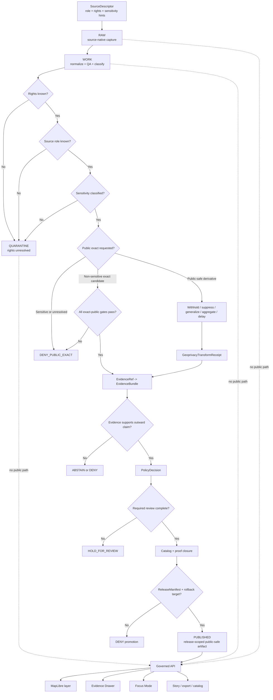

<!-- [KFM_META_BLOCK_V2]
doc_id: kfm://doc/NEEDS-VERIFICATION-ADR-FAUNA-SENSITIVE-LOCATION-POLICY
title: ADR: Fauna Sensitive Location Policy
type: standard
version: v1
status: draft
owners: OWNER_TBD_NEEDS_VERIFICATION
created: 2026-05-08
updated: 2026-05-08
policy_label: NEEDS_VERIFICATION-public-or-restricted
related: [./README.md, ./ADR-TEMPLATE.md, ./ADR-0009-sensitive-location-policy.md, ./ADR-archaeology-location-sensitivity.md, ../domains/fauna/README.md, ../domains/fauna/CONTROL_PLANE.md, ../domains/fauna/GEOPRIVACY.md, ../domains/fauna/SOURCE_ROLES.md, ../domains/fauna/VALIDATION.md, ../domains/fauna/runbooks/rollback.md, ../../data/registry/fauna/README.md]
tags: [kfm, adr, fauna, sensitive-location, geoprivacy, public-safe-geometry, evidence, policy, rollback]
notes: [Replaces the existing placeholder ADR for fauna sensitive location policy. doc_id, owners, policy_label, accepted status, public-exact exception process, steward-review protocol, schema home, release object homes, CI enforcement, branch protection, and runtime enforcement remain NEEDS VERIFICATION.]
[/KFM_META_BLOCK_V2] -->

<a id="top"></a>

# ADR: Fauna Sensitive Location Policy

Decision record for protecting sensitive wildlife location knowledge while preserving evidence traceability, public usefulness, review, correction, and rollback.

<p align="left">
  
  
  
  
  
  
</p>

> [!IMPORTANT]
> **Decision posture:** KFM denies public and semi-public disclosure of exact or reconstructable sensitive fauna locations by default. Public release may use only policy-approved, evidence-backed, rights-compatible, public-safe derivatives such as withheld, suppressed, generalized, aggregated, delayed, or narrative-only location treatment.

<p align="center">
  <a href="#status-and-decision-card">Status</a> ·
  <a href="#context">Context</a> ·
  <a href="#decision">Decision</a> ·
  <a href="#scope">Scope</a> ·
  <a href="#repo-fit-and-directory-basis">Repo fit</a> ·
  <a href="#classification-and-release-posture">Classification</a> ·
  <a href="#governed-flow">Flow</a> ·
  <a href="#validation-and-denial-gates">Validation</a> ·
  <a href="#rollback-and-incident-handling">Rollback</a> ·
  <a href="#open-verification-items">Open verification</a>
</p>

---

## Status and decision card

| Field | Value |
|---|---|
| ADR path | `docs/adr/ADR-fauna-sensitive-location-policy.md` |
| ADR state | `draft` |
| Decision state | `PROPOSED` until accepted through repo review |
| Replaces | Existing placeholder text in this same file |
| Supersedes | `none` |
| Related cross-domain ADR | [`ADR-0009-sensitive-location-policy.md`](./ADR-0009-sensitive-location-policy.md) |
| Related comparison ADR | [`ADR-archaeology-location-sensitivity.md`](./ADR-archaeology-location-sensitivity.md) |
| Related fauna governance | [`../domains/fauna/GEOPRIVACY.md`](../domains/fauna/GEOPRIVACY.md), [`../domains/fauna/SOURCE_ROLES.md`](../domains/fauna/SOURCE_ROLES.md), [`../domains/fauna/VALIDATION.md`](../domains/fauna/VALIDATION.md) |
| Decision confidence | `CONFIRMED repo context / PROPOSED ADR decision / NEEDS VERIFICATION enforcement` |
| Default public exact-location outcome | `DENY_PUBLIC_EXACT` for sensitive fauna records |
| Default unknown-rights outcome | `DENY` public release or `QUARANTINE` pending review |
| Default unknown-sensitivity outcome | `DENY` public release or `QUARANTINE` pending classification |
| Required public release support | `SourceDescriptor`, source role, rights posture, sensitivity classification, `EvidenceBundle`, geoprivacy or redaction receipt when geometry changes, policy decision, review record where required, catalog/proof closure, `ReleaseManifest`, correction path, rollback target |
| Runtime outcomes | `ANSWER`, `ABSTAIN`, `DENY`, `ERROR` |
| Publication outcomes | `ALLOW_PUBLIC_SAFE`, `DENY_PUBLIC_EXACT`, `HOLD_FOR_REVIEW`, `WITHHOLD`, `QUARANTINE`, `WITHDRAW` |

### One-line decision

> Fauna exact or reconstructable sensitive-location knowledge may be stored, validated, reviewed, or analyzed only inside governed lifecycle states; ordinary public-facing surfaces receive public-safe derivatives unless a future accepted decision and release-specific review explicitly allow narrower exposure.

### One-line boundary rule

> No public client, MapLibre layer, Evidence Drawer payload, Focus Mode answer, export, catalog distribution, graph/search/vector projection, story node, screenshot, AI context pack, or generated summary may expose exact or reconstructable sensitive fauna locations from `RAW`, `WORK`, `QUARANTINE`, restricted stores, direct source APIs, direct model runtime context, or unpublished candidates.

[Back to top](#top)

---

## Context

KFM is a governed, evidence-first, map-first, time-aware spatial knowledge and publication system. Fauna records carry a high geoprivacy burden because location precision can expose protected species, nests, dens, roosts, hibernacula, leks, spawning locations, breeding or wintering areas, stopover sites, caves, colonies, telemetry paths, steward-controlled monitoring points, private-land contexts, and source-restricted records.

The previous file at this path recorded only that “fauna sensitive location policy” needed a decision. That preserved the issue but did not define the operating rule, release posture, validation burden, public-surface boundary, or rollback expectations.

### Why this is architecture-significant

This ADR affects:

- source admission and source-role validation;
- rights and sensitivity classification;
- occurrence, monitoring, telemetry, range, and habitat-support workflows;
- geoprivacy transforms and redaction receipts;
- public map layers, TileJSON, PMTiles, API payloads, search, graph, and export products;
- Evidence Drawer and Focus Mode behavior;
- catalog/proof/release closure;
- correction, withdrawal, rollback, and non-regression fixtures.

[Back to top](#top)

---

## Evidence basis

| Evidence item | Source / path / artifact | What it supports | Truth label |
|---|---|---|---|
| Existing target file | `docs/adr/ADR-fauna-sensitive-location-policy.md` | Confirms this ADR already exists as a placeholder decision record | `CONFIRMED repo evidence` |
| ADR template and index | [`./ADR-TEMPLATE.md`](./ADR-TEMPLATE.md), [`./README.md`](./README.md) | ADRs should preserve decision scope, evidence, uncertainty, validation, rollback, and supersession; ADRs are not implementation proof | `CONFIRMED repo evidence` |
| Cross-domain sensitive-location ADR | [`./ADR-0009-sensitive-location-policy.md`](./ADR-0009-sensitive-location-policy.md) | Default-deny posture for public exact sensitive locations; finite publication/runtime outcomes; public-safe geometry and transform receipts | `CONFIRMED repo evidence / NEEDS VERIFICATION enforcement` |
| Archaeology location-sensitivity ADR | [`./ADR-archaeology-location-sensitivity.md`](./ADR-archaeology-location-sensitivity.md) | Shows the existing ADR pattern for translating cross-domain sensitive-location doctrine into domain-specific policy | `CONFIRMED repo evidence` |
| Fauna domain README | [`../domains/fauna/README.md`](../domains/fauna/README.md) | Fauna lane scope, public-safety posture, source roles, lifecycle rules, public geometry classes, and governed API/UI/AI boundary | `CONFIRMED repo evidence / draft status` |
| Fauna control plane | [`../domains/fauna/CONTROL_PLANE.md`](../domains/fauna/CONTROL_PLANE.md) | Public-safe derivatives only; forbidden public paths; review cadence; risk and release-readiness expectations | `CONFIRMED repo evidence / draft status` |
| Fauna geoprivacy guide | [`../domains/fauna/GEOPRIVACY.md`](../domains/fauna/GEOPRIVACY.md) | Fauna geoprivacy is a publication gate; sensitivity classes; public geometry rules; receipt requirements; field prohibitions | `CONFIRMED repo evidence / draft status` |
| Fauna source-role guide | [`../domains/fauna/SOURCE_ROLES.md`](../domains/fauna/SOURCE_ROLES.md) | Source roles are mandatory semantics; occurrence aggregators, legal-status authorities, habitat context, and derived models must not be collapsed | `CONFIRMED repo evidence / draft status` |
| Fauna validation guide | [`../domains/fauna/VALIDATION.md`](../domains/fauna/VALIDATION.md) | Fail-closed validation gates, negative fixtures, release dry-run, API/UI/Focus checks, and rollback checks | `CONFIRMED repo evidence / NEEDS VERIFICATION execution` |
| Fauna registry README | [`../../data/registry/fauna/README.md`](../../data/registry/fauna/README.md) | Source-admission registry posture for source roles, rights, sensitivity, taxon authority, and public-release blockers | `CONFIRMED repo evidence / experimental status` |
| Related GBIF policy and validator files | [`../../policy/fauna/gbif_publication.rego`](../../policy/fauna/gbif_publication.rego), [`../../policy/fauna/gbif_public_aggregate.rego`](../../policy/fauna/gbif_public_aggregate.rego), [`../../policy/fauna/gbif_runtime_answer.rego`](../../policy/fauna/gbif_runtime_answer.rego), [`../../tools/validators/fauna/gbif_runtime_answer_validator.py`](../../tools/validators/fauna/gbif_runtime_answer_validator.py), [`../../tests/policy/fauna/gbif_public_aggregate_test.rego`](../../tests/policy/fauna/gbif_public_aggregate_test.rego) | Confirms related policy/validator/test surfaces exist for GBIF public aggregates and runtime answers | `CONFIRMED repo evidence / NEEDS VERIFICATION coverage` |
| Fauna rollback runbook | [`../domains/fauna/runbooks/rollback.md`](../domains/fauna/runbooks/rollback.md) | Rollback is auditable state restoration/withdrawal, not deletion; sensitive-location exposure is a rollback trigger | `CONFIRMED repo evidence / draft status` |
| Directory Rules doctrine | Supplied KFM directory-governance doctrine | ADRs belong in `docs/adr/`; domain material belongs under responsibility roots, not new root-level domain folders | `CONFIRMED supplied doctrine` |
| Fauna architecture lineage | Supplied fauna architecture and habitat+fauna thin-slice reports | Supports sensitive-location fail-closed posture, public-safe derivatives, synthetic fixtures first, EvidenceBundle closure, and no live source release before rights/sensitivity review | `LINEAGE / PROPOSED implementation` |

> [!CAUTION]
> This ADR does not prove that all executable policies, schemas, validators, CI workflows, API middleware, MapLibre filters, Evidence Drawer checks, Focus Mode denials, release manifests, proof packs, branch protections, or runtime behavior are enforced. Those remain `NEEDS VERIFICATION` until direct repo evidence, tests, workflows, artifacts, or runtime traces prove them.

[Back to top](#top)

---

## Decision

### Chosen option

Adopt a **default-deny exact sensitive fauna location rule** and require public-safe derivation, evidence closure, policy approval, review where required, release closure, correction path, and rollback target before public or semi-public publication.

### Operating rule

KFM must classify every location-bearing fauna record before outward use. Sensitive or unresolved fauna locations must not publish as exact public geometry. Public output must use the safest allowed outward representation.

| Outward representation | Meaning | Public eligibility |
|---|---|---|
| `withheld` | No public geometry emitted | Allowed when release explains withheld state without leaking detail |
| `suppressed` | Feature omitted from public artifact | Allowed with policy reason and correction path |
| `generalized` | Geometry coarsened to approved public geography | Allowed only with transform receipt and validation |
| `aggregated` | Output grouped to safe region, grid, watershed, county, or threshold | Allowed only after reconstruction-risk check |
| `delayed` | Exposure embargoed or time-shifted | Allowed only with release-time validation |
| `public_safe_narrative` | Textual explanation without coordinates, access clues, or source-private locality | Allowed when evidence-backed and citation-safe |
| `public_exact_allowed` | Exact public geometry for non-sensitive records | Allowed only when all exact-public gates pass |
| `no_public_release` | No public geometry or narrative location | Required when risk cannot be safely reduced |

### Rationale

This option preserves KFM’s core invariants:

- evidence and source role outrank map appearance, AI fluency, and source availability;
- public clients use governed interfaces and released artifacts;
- sensitive location exposure fails closed;
- derived layers remain downstream carriers, not canonical truth;
- AI and Focus Mode are interpretive and bounded by evidence, policy, review, and release state;
- rollback and correction remain possible after publication.

### Options considered

| Option | Description | Benefits | Risks / costs | Outcome |
|---|---|---|---|---|
| Publish exact locations when an upstream source is public | Treat upstream availability as enough for KFM release | Simple; low implementation burden | Confuses public upstream availability with KFM redistribution safety; ignores sensitive taxa, source geoprivacy, private land, monitoring, and steward controls | `REJECTED` |
| Hide exact locations only in UI | Keep exact data in payloads and rely on map styling or client filters | Easy initial UI behavior | Breaks the trust membrane; exports, dev tools, screenshots, logs, search, graph, tiles, AI context, and downstream consumers can still leak details | `REJECTED` |
| Never store exact fauna locations anywhere | Refuse exact geometry even internally | Strong safety posture | Blocks legitimate restricted stewardship, review, validation, correction, and audit workflows | `REJECTED AS GLOBAL RULE` |
| Store exact geometry only in governed restricted states; publish public-safe derivatives only | Separate internal support from public release forms | Preserves review and audit while protecting public surfaces | Requires schemas, policies, validators, receipts, review records, release manifests, and rollback discipline | `ACCEPTED / PROPOSED` |

[Back to top](#top)

---

## Scope

### Accepted inputs

This ADR governs fauna material that contains, implies, narrows, or reconstructs location.

| Input | Handling requirement |
|---|---|
| Exact occurrence coordinates | Restricted by default; public exact release denied for sensitive records |
| Nest, den, roost, hibernaculum, lek, cave, colony, spawning, breeding, wintering, nursery, telemetry, or monitoring locations | Withhold, suppress, generalize, aggregate, delay, or route to steward review |
| Private land, access route, parcel, observer, collector, or steward-restricted context | Redact, generalize, withhold, or restrict before public release |
| GBIF, eBird, iNaturalist, iDigBio, museum, agency, telemetry, eDNA, invasive, disease, or mortality records | Preserve source role, rights, sensitivity, evidence limits, and public geometry class |
| Habitat, range, suitability, density, richness, corridor, or assemblage layers | Treat as derived support; never as canonical occurrence proof |
| Evidence Drawer, Focus Mode, map popup, export, graph, search, vector index, story, or catalog payload | Field-allowlist, release-bound, public-safe, and no-leak validated |
| Documentation examples and fixtures | Synthetic, redacted, generalized, or already public-safe only |

### Exclusions

| Excluded material | Why it does not belong in this ADR | Correct home |
|---|---|---|
| Real sensitive coordinates | Public ADRs must not become leak vectors | Restricted governed lifecycle store |
| Source-native occurrence payloads | ADRs are not data storage | `data/raw/fauna/` or repo-confirmed equivalent |
| Working transforms and QA output | ADRs are not `WORK` storage | `data/work/fauna/` or repo-confirmed equivalent |
| Rights-unknown or unsafe candidate records | ADRs are not quarantine storage | `data/quarantine/fauna/` or repo-confirmed equivalent |
| Executable policy rules | Prose cannot enforce gates | `policy/fauna/` or repo-confirmed policy home |
| JSON Schema or machine contracts | Machine validation belongs under schema authority | Repo-confirmed schema home |
| Semantic object contracts | Meaning belongs in contract docs | `contracts/` or repo-confirmed contract home |
| Receipts, proofs, release manifests, rollback cards | Emitted trust objects remain separate | `data/receipts/`, `data/proofs/`, `release/`, or repo-confirmed equivalents |
| AI prompts or private chain-of-thought | AI is interpretive and evidence-subordinate | Runtime envelopes, receipts, and public-safe summaries only |

[Back to top](#top)

---

## Repo fit and Directory basis

This ADR stays in `docs/adr/` because it records a human-facing architecture decision. It points to executable and machine-readable homes without becoming those homes.

| Surface | Candidate path | Role | Status |
|---|---|---|---|
| This ADR | `docs/adr/ADR-fauna-sensitive-location-policy.md` | Decision record | `CONFIRMED target path` |
| Cross-domain sensitive-location policy | `docs/adr/ADR-0009-sensitive-location-policy.md` | Shared sensitive-location decision posture | `CONFIRMED repo path` |
| Fauna domain control plane | `docs/domains/fauna/CONTROL_PLANE.md` | Domain governance, active risks, review cadence, release readiness | `CONFIRMED repo path / draft` |
| Fauna geoprivacy guide | `docs/domains/fauna/GEOPRIVACY.md` | Domain application of public geometry classes and geoprivacy receipts | `CONFIRMED repo path / draft` |
| Fauna source-role guide | `docs/domains/fauna/SOURCE_ROLES.md` | Source-role taxonomy and claim compatibility | `CONFIRMED repo path / draft` |
| Fauna validation guide | `docs/domains/fauna/VALIDATION.md` | Validation gates, fixtures, release dry-run, rollback checks | `CONFIRMED repo path / draft` |
| Fauna source registry | `data/registry/fauna/README.md` | Source-admission and verification posture | `CONFIRMED repo path / experimental` |
| Existing GBIF policy files | `policy/fauna/*.rego` | Related executable policy examples | `CONFIRMED repo files / coverage NEEDS VERIFICATION` |
| Existing GBIF validator | `tools/validators/fauna/gbif_runtime_answer_validator.py` | Runtime public-safety validator example | `CONFIRMED repo file / coverage NEEDS VERIFICATION` |
| Existing GBIF policy test | `tests/policy/fauna/gbif_public_aggregate_test.rego` | Negative-path policy fixture example | `CONFIRMED repo file / coverage NEEDS VERIFICATION` |
| Fauna release/rollback runbook | `docs/domains/fauna/runbooks/rollback.md` | Human operator rollback path | `CONFIRMED repo path / draft` |
| Machine schemas | repo-confirmed schema home | Shape for sensitivity classification, geoprivacy receipt, public payloads, release records | `NEEDS VERIFICATION` |
| Release and proof objects | repo-confirmed release/proof homes | `ReleaseManifest`, `CorrectionNotice`, `RollbackCard`, receipts and proof packs | `NEEDS VERIFICATION` |

> [!WARNING]
> Do not create a root-level `fauna/` folder to solve a documentation, policy, schema, source, data, or release problem. Fauna is a domain lane; its material belongs under responsibility roots such as `docs/`, `data/`, `policy/`, `tools/`, `tests/`, `schemas/`, `contracts/`, `release/`, `apps/`, and `packages/`.

[Back to top](#top)

---

## Definitions

| Term | Definition |
|---|---|
| **Sensitive fauna location** | Any coordinate, geometry, route, site label, source identifier, timestamp pattern, tile, bounding box, centroid, locality text, telemetry path, station/transect, or spatial proxy that could expose protected wildlife, restricted monitoring, private land, steward-controlled records, or misuse-prone ecological information. |
| **Exact or reconstructable location** | A representation precise enough to locate, target, recover, visit, correlate, or reverse-engineer the protected subject. A high-zoom tile, parcel-linked point, source URL, repeated observation pattern, or route note can be exact even without raw latitude/longitude. |
| **Public-safe geometry** | Geometry that has been withheld, generalized, aggregated, delayed, coarsened, or otherwise transformed so outward release does not disclose restricted precision. |
| **Restricted precise record** | Internal precise record retained for audit, validation, stewardship, or review, but not eligible for ordinary public exposure. |
| **Geoprivacy transform** | A recorded operation that reduces disclosure risk: suppression, administrative-area generalization, watershed/grid aggregation, minimum-count aggregation, precision bucketing, time delay, field redaction, route coarsening, or narrative substitution. |
| **Redaction or geoprivacy receipt** | A machine-checkable record proving that a public-safe transform occurred, why it occurred, which policy version applied, which input/output digests changed, and which release scope it supports. |
| **Steward review** | Review by a domain, policy, legal, source, institutional, conservation, cultural, landowner, or other responsible steward before release classification proceeds. |
| **Public exact exception** | A narrow release-specific permission for exact public geometry. For fauna, this applies only to non-sensitive records that pass rights, source role, source geoprivacy, evidence, sensitivity, review, release, and rollback gates. |

[Back to top](#top)

---

## Classification and release posture

KFM must keep runtime answer outcomes distinct from publication outcomes.

| Classification | Public exact geometry | Public-safe derivative | Required before release | Default outcome |
|---|---:|---:|---|---|
| `public_exact_allowed` | Possible | Yes | Non-sensitive classification, public-compatible rights, source geoprivacy permits exact release, EvidenceBundle, policy approval, release manifest, rollback target | `ALLOW_PUBLIC_SAFE` or exact public allow within release scope |
| `public_generalized` | No | Yes | Transform receipt, field allowlist, evidence closure, policy decision | `ALLOW_PUBLIC_SAFE` |
| `restricted_precise` | No | Possibly | Withhold/suppress/generalize/aggregate/delay plus review where required | `DENY_PUBLIC_EXACT` |
| `embargoed` | No during embargo | Possibly delayed or summary-only | Embargo rule, release-time check, review state | `WITHHOLD` until eligible |
| `steward_review_required` | No | Hold until review | Review record and public geometry class | `HOLD_FOR_REVIEW` |
| `aggregate_only` | No | Yes, above threshold and no reconstruction risk | Count threshold, aggregation receipt, limitations, release support | `ALLOW_PUBLIC_SAFE` only if threshold passes |
| `unknown_rights` | No | No | Rights review | `QUARANTINE` or `DENY` |
| `unknown_sensitivity` | No | No | Sensitivity classification | `QUARANTINE` or `DENY` |
| `policy_denied` | No | No | Correction or policy change | `DENY` |
| `withdrawn_or_incident` | No | No until rebuilt and reviewed | Incident review, rollback receipt, corrected release | `WITHDRAW` |

> [!NOTE]
> “Generalized” does not automatically mean safe. Public-safe release must consider adjacent context, source IDs, timestamps, repeated observations, tile zoom levels, search/graph/vector leakage, public joins, screenshots, and whether an artifact can be joined back to restricted support.

[Back to top](#top)

---

## Governed flow



[Back to top](#top)

---

## Policy, rights, and sensitivity requirements

### Mandatory fail-closed rules

| Condition | Required outcome | Typical obligation |
|---|---|---|
| Unknown rights | `DENY` public release or `QUARANTINE` | `require_rights_review` |
| Unknown source role | `HOLD`, `QUARANTINE`, or `DENY` public promotion | `classify_source_role` |
| Unknown sensitivity | `DENY` public release or `QUARANTINE` | `classify_sensitivity` |
| Exact sensitive fauna location requested for public output | `DENY_PUBLIC_EXACT` | `withhold_or_transform_geometry` |
| Nest, den, roost, hibernacula, lek, cave, colony, spawning, breeding, nursery, telemetry, or steward-controlled exact site requested | `DENY_PUBLIC_EXACT` | `require_steward_review` |
| Public payload contains exact coordinate aliases or source-private locality | `DENY` | `field_allowlist` |
| Occurrence aggregator used as legal-status authority | `DENY` | `require_compatible_source_role` |
| Habitat/model support used as occurrence proof | `ABSTAIN` or `DENY` | `preserve_derived_boundary` |
| EvidenceRef unresolved | `ABSTAIN` or `DENY` | `resolve_evidence_bundle` |
| Transform receipt missing for public-safe geometry | `DENY` release | `emit_transform_receipt` |
| Public aggregate below threshold | `DENY`, `SUPPRESS`, or `HOLD` | `aggregate_or_withhold` |
| Release lacks rollback target | `DENY` promotion | `create_rollback_card` |
| AI or Focus Mode attempts coordinate disclosure | `DENY` | `record_policy_reason` |

### Source-role and claim boundary

| Source / support type | Can support | Must not silently support | Default release concern |
|---|---|---|---|
| Kansas legal/status source | Kansas legal/status context after verification | Occurrence proof or exact public location permission | Verify authority scope, effective date, rights |
| Federal legal/status source | Federal legal/status context after verification | Kansas legal status unless separately scoped | Keep jurisdiction visible |
| Taxonomic authority | Accepted name, synonymy, rank, taxon concept | Occurrence, legal status, conservation status, or release permission | Preserve authority version and ambiguity |
| Occurrence source | Reported observation, specimen, survey detection, mortality, disease/pathogen, invasive record | Legal status, true absence, population certainty, public exact release | Rights, geoprivacy, precision, evidence |
| Occurrence aggregator | Discovery and occurrence support with provenance and caveats | Sovereign truth or legal-status authority | Record-level rights and geoprivacy |
| Community science | Observation evidence after quality filtering | Legal authority or complete presence/absence proof | License/media terms and sensitivity |
| Monitoring, survey, telemetry, eDNA | Protocol-bound monitoring evidence | Public exact geometry by default | Steward review and public-summary posture |
| Habitat/context layer | Environmental support or covariate | Species occurrence proof | Label as context/support |
| Derived model | Suitability, range, density, richness, corridor, assemblage | Canonical truth or observed presence | Uncertainty, inputs, rebuild path |

[Back to top](#top)

---

## Public surface rules

| Surface | Allowed only when | Must not expose |
|---|---|---|
| Governed API | Payload is release-bound, public-safe, field-allowlisted, and finite-outcome wrapped | RAW/WORK/QUARANTINE refs, restricted geometry, direct source payloads, internal store refs |
| MapLibre layer | Layer manifest points only to released public-safe assets or governed endpoints | Exact protected coordinates, high-zoom restricted detail, hidden sensitive fields |
| Evidence Drawer | Drawer payload cites public-safe evidence and explains generalized/withheld status | Restricted source rows, exact coordinates, source-private locality, access routes |
| Focus Mode | Context is released, public-safe, citation-validated, and policy-checked | Coordinate recovery, exact-location inference, unsupported presence claims, restricted context |
| Story / dossier | Narrative is release-bound and evidence-backed | Screenshots or prose that reveal restricted precision |
| Export / share | Export manifest preserves trust metadata and audience scope | Trust-stripped CSV/GeoJSON/tiles that widen access or precision |
| Catalog / discovery | Catalog record is public-safe and rights-compatible | Restricted geometry, sensitive source URLs, reconstruction clues |
| Graph / search / vector projection | Projection is derivative, field-allowlisted, and no-leak checked | Restricted geometry, source-native coordinates, private/steward keys, raw locality text |
| Logs / diagnostics | Public logs are redacted and scoped | Restricted coordinates, model context, source credentials, exact private paths |

[Back to top](#top)

---

## Validation and denial gates

### Required gates

| Gate | Must prove | Failure outcome |
|---|---|---|
| Source registry gate | Source identity, source role, rights posture, access class, cadence, source geoprivacy, and authority scope are recorded | `DENY` or `QUARANTINE` |
| Rights gate | Public or restricted release rights are known and compatible with target audience | `DENY` |
| Sensitivity gate | Record, field, dataset, layer, catalog, DTO, and export sensitivity are classified | `DENY` |
| Taxonomy gate | Taxon identity, authority version, ambiguity state, and migration behavior are known | `HOLD` or `ABSTAIN` |
| Geometry gate | Public artifacts contain no restricted exact geometry or reconstruction proxy | `DENY` |
| Transform receipt gate | Every public-safe transformed geometry has a receipt | `DENY` |
| Review gate | Required steward, rights, domain, source, policy, or release review exists | `HOLD_FOR_REVIEW` or `DENY` |
| Evidence gate | EvidenceRefs resolve to EvidenceBundles with source role, scope, sensitivity, rights, limitations, and citation context | `ABSTAIN` or `DENY` |
| Catalog/proof gate | Catalog, proof, release, and evidence references close | `DENY` or `ERROR` |
| Public DTO gate | API, UI, drawer, focus, story, export, search, graph, and vector payloads are field-allowlisted | `DENY` |
| Runtime envelope gate | Outward answer uses finite outcome and visible reason/obligation codes | `ERROR` or `DENY` |
| Rollback gate | Release has correction path and rollback target | `DENY promotion` |

### Minimum negative-path fixtures

| Fixture | Expected result |
|---|---|
| Sensitive fauna occurrence with exact public geometry | `DENY` |
| Public payload contains `decimalLatitude`, `decimalLongitude`, `occurrenceLatitude`, `occurrenceLongitude`, `exactCoordinates`, or raw occurrence point fields | `DENY` |
| Nest, den, roost, hibernacula, lek, cave, colony, spawning, breeding, nursery, telemetry, or steward-controlled exact site in public payload | `DENY` |
| Unknown rights with public release requested | `DENY` or `QUARANTINE` |
| Unknown source role with public claim requested | `HOLD`, `QUARANTINE`, or `DENY` |
| Occurrence aggregator used as legal-status authority | `DENY` |
| Habitat/model support used as occurrence proof | `ABSTAIN` or `DENY` |
| Generalized geometry lacks geoprivacy/redaction receipt | `DENY` |
| Public aggregate below minimum threshold | `DENY` or `SUPPRESS` |
| Evidence Drawer payload contains restricted coordinate or source-private locality | `DENY` |
| Focus Mode answer includes exact-coordinate disclosure or unsupported “confirmed present” language | `DENY` |
| Release candidate lacks rollback target | `DENY promotion` |

### Proposed validation commands

> [!WARNING]
> Commands below are `PROPOSED / NEEDS VERIFICATION`. Adapt them to the active repo’s actual test runner, policy engine, validator paths, and CI conventions.

```bash
# Documentation structure check, if a docs validator exists.
python tools/validators/docs/check_kfm_meta_block.py docs/adr/ADR-fauna-sensitive-location-policy.md

# Related policy checks, if OPA/Conftest or repo-native policy runner is available.
opa check --strict policy
opa test policy -v

# Fauna-focused checks, if repo-native tests and validators are wired.
pytest tests/fauna tests/policy/fauna -q
python tools/validators/fauna/gbif_runtime_answer_validator.py --kind answer --input <public-safe-answer-fixture>
```

[Back to top](#top)

---

## Impact map

| Area | Required update | Status |
|---|---|---|
| `docs/adr/README.md` | Add or confirm this ADR entry, status, and relation to `ADR-0009` | `PROPOSED / NEEDS VERIFICATION` |
| `docs/adr/ADR-0009-sensitive-location-policy.md` | Cross-link this fauna-specific decision if not already linked | `PROPOSED / NEEDS VERIFICATION` |
| `docs/domains/fauna/CONTROL_PLANE.md` | Keep active risk, owner, review cadence, source activation, and release-readiness posture aligned | `PROPOSED / NEEDS VERIFICATION` |
| `docs/domains/fauna/GEOPRIVACY.md` | Ensure sensitivity classes, public geometry rules, and receipt obligations match this ADR | `PROPOSED / NEEDS VERIFICATION` |
| `docs/domains/fauna/SOURCE_ROLES.md` | Ensure source-role compatibility gates align with sensitive-location release outcomes | `PROPOSED / NEEDS VERIFICATION` |
| `docs/domains/fauna/VALIDATION.md` | Align denial rules, reason codes, fixtures, and release dry-run checks | `PROPOSED / NEEDS VERIFICATION` |
| `data/registry/fauna/` | Confirm source descriptors include role, rights, cadence, access class, source geoprivacy, and sensitivity hints | `PROPOSED / NEEDS VERIFICATION` |
| `policy/fauna/` | Keep executable policy rules aligned with default-deny exact sensitive location behavior | `PROPOSED / NEEDS VERIFICATION` |
| `tools/validators/fauna/` | Keep no-leak, runtime, geoprivacy, receipt, and public payload validators aligned | `PROPOSED / NEEDS VERIFICATION` |
| `tests/` and fixtures | Add or maintain valid public-safe and invalid exact-location fixtures | `PROPOSED / NEEDS VERIFICATION` |
| `schemas/` / `contracts/` | Update sensitivity, geoprivacy receipt, public payload, release, and rollback shapes only through repo-confirmed homes | `NEEDS VERIFICATION` |
| `data/receipts/` and `data/proofs/` | Preserve redaction/geoprivacy, validation, rollback, and EvidenceBundle support objects | `PROPOSED / NEEDS VERIFICATION` |
| `release/` | Require release manifest, correction path, and rollback card for public fauna outputs | `PROPOSED / NEEDS VERIFICATION` |
| `apps/` / `packages/` | Ensure governed API, MapLibre, Evidence Drawer, review, and Focus Mode receive only public-safe released payloads | `PROPOSED / NEEDS VERIFICATION` |
| `.github/workflows/` | Add or confirm CI gates only after workflow conventions are inspected | `NEEDS VERIFICATION` |

[Back to top](#top)

---

## Rollback and incident handling

Rollback is a governed state transition. It is not deletion, concealment, or manual replacement.

### Rollback triggers

| Trigger | Required action |
|---|---|
| Sensitive exact fauna location exposed | Freeze affected public surface; withdraw or repoint release alias; invalidate caches; issue correction if public users may have seen it |
| Restricted field appears in public API/layer/search/graph/export/Focus payload | Disable affected surface; add negative fixture; rebuild public-safe derivative |
| Source-role misuse released | Mark affected claims invalid or abstained; update source-role mapping and tests |
| Unknown or incompatible rights discovered | Suspend source and dependent public outputs; quarantine until rights review completes |
| EvidenceBundle link broken | Runtime returns `ABSTAIN` or release is held until closure restored |
| Taxonomy migration error | Restore prior taxon mapping or publish correction; rebuild affected bundles and public payloads |
| Release manifest or digest mismatch | Hold or withdraw release; recompute proof closure before re-release |
| Focus Mode restricted output | Disable affected Focus action; rerun citation, policy, and public-safety checks |

### Required rollback sequence

1. Freeze new fauna promotions for the affected release scope.
2. Identify affected release ID, spec hash, layer ID, API route, EvidenceBundle, source descriptor, public payload, search/graph/vector/export artifact, and Focus context.
3. Restore previous known-good public-safe release or withdraw the affected surface.
4. Invalidate public caches, TileJSON, PMTiles/vector tiles, API snapshots, search, graph, EvidenceBundle cache, Evidence Drawer payloads, and Focus context caches where applicable.
5. Preserve failed release evidence, validation reports, policy decisions, and user-visible impact scope.
6. Emit or prepare `CorrectionNotice` without leaking restricted detail.
7. Emit rollback receipt with previous/new refs, actor/run, reason codes, and validation outcomes.
8. Add non-regression fixture for the failure.
9. Rerun geoprivacy, public payload, evidence, catalog, API, UI, Focus, release, and continuity validation.
10. Update this ADR or related fauna docs if the incident reveals a missing gate.

[Back to top](#top)

---

## Consequences

### Positive consequences

- Sensitive fauna locations are protected at the publication boundary, not merely hidden in the browser.
- Public fauna products remain useful through generalized, aggregated, delayed, or narrative-safe outputs.
- Source roles stay visible, preventing occurrence aggregators, community-science records, habitat layers, and derived models from being overclaimed.
- Evidence Drawer and Focus Mode can explain withheld or generalized status without exposing restricted details.
- Release, correction, withdrawal, and rollback are designed into the public-safety policy.

### Tradeoffs and risks

| Risk | Mitigation | Residual status |
|---|---|---|
| More validation and review work before public release | Fixture-first gates, clear source-role registry, reusable receipts, and public-safe aggregation patterns | `ACCEPTED` |
| Public users may see less precise data | Show sensitivity badges, limitations, public support area, EvidenceBundle links, and reason codes | `ACCEPTED` |
| Schema, policy, and release homes may still be mixed | Do not create parallel homes; resolve with ADRs and migration notes | `NEEDS VERIFICATION` |
| Enforcement may be incomplete despite strong docs | Require tests, validators, policy reports, release manifests, and runtime evidence before claiming enforcement | `NEEDS VERIFICATION` |
| Public exact exception process could be misused | Keep exact sensitive public release denied by default; require future accepted decision or release-specific review for any narrow exception | `PROPOSED` |

[Back to top](#top)

---

## Open verification items

| Item | Why it matters | Verification path | Status |
|---|---|---|---|
| ADR acceptance status | Draft ADR does not govern until reviewed | Update ADR index, review record, and status after approval | `NEEDS VERIFICATION` |
| `doc_id` | Meta block requires registered identifier | Register this document or assign official KFM document UUID | `NEEDS VERIFICATION` |
| Owners and reviewers | Release and policy decisions need accountable stewards | CODEOWNERS, governance register, or maintainer assignment | `NEEDS VERIFICATION` |
| Policy label | Public/restricted status must not be inferred from path | Policy classification review | `NEEDS VERIFICATION` |
| Canonical schema home | Fauna docs and related GBIF surfaces may reference multiple schema homes | Verify active schema-home ADR and update references | `NEEDS VERIFICATION` |
| Full policy coverage | Related GBIF policies exist, but total fauna-sensitive-location coverage is not proven here | Inspect all `policy/fauna/` rules and policy test reports | `NEEDS VERIFICATION` |
| CI/workflow enforcement | ADR cannot imply automated enforcement | Inspect `.github/workflows/`, CI logs, and validation artifacts | `NEEDS VERIFICATION` |
| Runtime API behavior | Public API and Focus Mode enforcement must be proven directly | Inspect route handlers, middleware, runtime tests, logs, or generated envelopes | `UNKNOWN` |
| Release object home | Release manifests, rollback cards, correction notices, and receipts need canonical placement | Inspect `release/`, `data/receipts/`, `data/proofs/`, and related schemas | `NEEDS VERIFICATION` |
| Public exact exception process | Exact public geometry for non-sensitive records needs strict governance | Define reviewer authority, source policy, fixture, and release protocol | `NEEDS VERIFICATION` |
| Live source terms | GBIF/eBird/iNaturalist/KDWP-like/USFWS-like/NatureServe-like sources require current terms review | Verify official source terms, licenses, geoprivacy flags, and record-level rights before activation | `NEEDS VERIFICATION` |
| Sensitive species steward policy | Protected taxa and steward-controlled records require domain rules | Confirm steward roster, thresholds, embargo windows, and public geometry classes | `NEEDS VERIFICATION` |

[Back to top](#top)

---

## Review checklist

<details>
<summary>Pre-merge checklist</summary>

- [ ] Meta block values are replaced or deliberately marked `NEEDS VERIFICATION`.
- [ ] ADR title, meta block title, ADR header title, filename, and ADR index entry are synchronized.
- [ ] This ADR is added to `docs/adr/README.md` or the verified ADR index.
- [ ] Truth labels do not upgrade uncertainty through tone.
- [ ] Related fauna docs are linked and reviewed for consistency.
- [ ] This ADR does not claim runtime or CI enforcement without evidence.
- [ ] Source-role collapse is explicitly blocked.
- [ ] Unknown rights, unknown source role, and unknown sensitivity fail closed.
- [ ] Sensitive exact public geometry is denied by default.
- [ ] Public exact geometry for non-sensitive records is allowed only through explicit gates.
- [ ] Public payload field allowlists account for coordinate aliases, raw occurrence fields, source-private locality, and reverse-engineering risk.
- [ ] EvidenceRef-to-EvidenceBundle closure is required before public claims.
- [ ] Redaction/geoprivacy receipts are required for transformed public geometry.
- [ ] Evidence Drawer and Focus Mode rules are covered.
- [ ] Release manifest, correction path, and rollback target are required before publication.
- [ ] Negative-path fixtures are listed or queued.
- [ ] No new root-level `fauna/` folder or parallel schema/policy/source/release authority is introduced.
- [ ] Open verification items are assigned, deferred, or kept visible.

</details>

[Back to top](#top)

---

## Appendix — starter reason and obligation codes

> [!NOTE]
> Canonical reason-code and obligation-code registry homes remain `NEEDS VERIFICATION`. Use these as starter language until repo-wide registries confirm canonical names.

### Reason codes

| Code | Meaning |
|---|---|
| `fauna.sensitive_location.public_exact_exposure` | Public output would expose exact or reconstructable sensitive fauna location |
| `fauna.restricted_field.public_payload` | Public payload includes restricted coordinate, raw occurrence, source-private, or locality field |
| `fauna.geoprivacy.receipt_missing` | Public-safe transform lacks required receipt |
| `fauna.rights.unknown` | Rights or redistribution posture is unresolved |
| `fauna.source_role.missing` | Source role is absent or not canonicalized |
| `fauna.source_role.incompatible` | Source role cannot support requested claim |
| `fauna.aggregator.not_legal_authority` | Occurrence aggregator used as legal-status authority |
| `fauna.habitat.not_occurrence_proof` | Habitat/model support overclaimed as occurrence evidence |
| `fauna.evidence_bundle.missing` | EvidenceRef cannot resolve to EvidenceBundle |
| `fauna.public_aggregate.threshold_failed` | Aggregate does not satisfy minimum public threshold |
| `fauna.focus.exact_location_denied` | Focus Mode attempted coordinate disclosure or reconstruction |
| `fauna.release.rollback_missing` | Release candidate lacks rollback target |

### Obligation codes

| Code | Required action |
|---|---|
| `classify_source_role` | Assign or correct source role before use |
| `require_rights_review` | Resolve source rights before public release |
| `classify_sensitivity` | Assign sensitivity and public geometry class |
| `withhold_geometry` | Emit no public geometry |
| `generalize_geometry` | Reduce geometry precision to approved public support |
| `aggregate_output` | Publish only thresholded or grouped output |
| `delay_release` | Apply embargo or delayed exposure |
| `emit_geoprivacy_receipt` | Record public-safe transformation |
| `resolve_evidence_bundle` | Resolve EvidenceRef before outward claim |
| `field_allowlist` | Emit only approved public fields |
| `record_policy_decision` | Store finite policy outcome and reason codes |
| `publish_correction_notice` | Issue correction, withdrawal, or supersession |
| `execute_rollback_card` | Restore or withdraw affected public-safe release |

[Back to top](#top)
