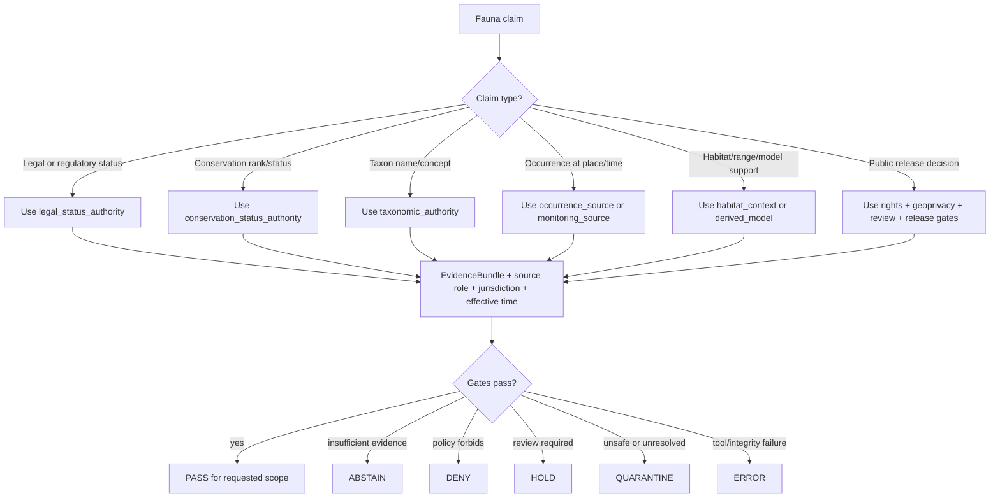

<!-- [KFM_META_BLOCK_V2]
doc_id: kfm://doc/NEEDS-VERIFICATION-ADR-fauna-source-authority-ranking
title: ADR — Fauna Source Authority Ranking
type: standard
version: v1
status: draft
owners: OWNER_TBD_NEEDS_VERIFICATION
created: 2026-05-08
updated: 2026-05-08
policy_label: NEEDS_VERIFICATION
related: [./README.md, ./ADR-TEMPLATE.md, ./ADR-fauna-domain-model.md, ./ADR-fauna-schema-home.md, ../domains/fauna/README.md, ../domains/fauna/SOURCE_ROLES.md, ../domains/fauna/GEOPRIVACY.md, ../domains/fauna/VALIDATION.md, ../domains/fauna/sources/README.md, ../../data/registry/fauna/README.md]
tags: [kfm, adr, fauna, source-authority, source-role, evidence, geoprivacy, validation, rollback]
notes: [Replaces backlog placeholder ADR body. doc_id, owners, policy_label, CODEOWNERS routing, final acceptance state, schema references, validator commands, source-rights review, steward review, and CI enforcement remain NEEDS VERIFICATION.]
[/KFM_META_BLOCK_V2] -->

<a id="top"></a>

# ADR — Fauna Source Authority Ranking

Defines how Kansas Frontier Matrix ranks fauna sources by claim type so occurrence, taxonomy, legal status, conservation status, habitat context, derived models, and public-release authority do not collapse into one unsafe “wildlife data” category.

<p align="center">
  
  
  
  
  
  
  
</p>

<p align="center">
  <a href="#adr-header">Header</a> ·
  <a href="#decision-summary">Decision</a> ·
  <a href="#context">Context</a> ·
  <a href="#evidence-basis">Evidence</a> ·
  <a href="#decision">Ranking model</a> ·
  <a href="#source-family-ranking">Sources</a> ·
  <a href="#verification">Verification</a> ·
  <a href="#rollback-and-supersession">Rollback</a> ·
  <a href="#open-verification-backlog">Open backlog</a>
</p>

> [!IMPORTANT]
> **Decision status:** `PROPOSED`.  
> This ADR records the source-authority ranking model that should govern fauna claims. It does **not** prove that source descriptors, schemas, validators, policy rules, release gates, public APIs, UI payloads, source connectors, or CI enforcement are complete.

> [!WARNING]
> A source can be highly authoritative for one claim and unusable for another. A legal-status source does not prove occurrence. An occurrence aggregator does not prove legal status. A habitat model does not prove presence. A released map layer does not become root truth.

---

## ADR header

| Field | Value |
|---|---|
| ADR ID | `ADR-fauna-source-authority-ranking` |
| Target path | `docs/adr/ADR-fauna-source-authority-ranking.md` |
| Status | `proposed` |
| Decision date | `2026-05-08` |
| Owners | `OWNER_TBD_NEEDS_VERIFICATION` |
| Reviewers | `TODO(fauna-domain-stewards, source-registry-stewards, policy-stewards, release-stewards)` |
| Scope | Fauna source authority ranking, claim compatibility, source-role precedence, conflict handling, validation, public exposure, and rollback |
| Supersedes | Backlog placeholder in `docs/adr/ADR-fauna-source-authority-ranking.md` |
| Related ADRs | [`ADR-TEMPLATE.md`](./ADR-TEMPLATE.md), [`ADR-fauna-domain-model.md`](./ADR-fauna-domain-model.md), [`ADR-fauna-schema-home.md`](./ADR-fauna-schema-home.md) |
| Related domain docs | [`../domains/fauna/README.md`](../domains/fauna/README.md), [`../domains/fauna/SOURCE_ROLES.md`](../domains/fauna/SOURCE_ROLES.md), [`../domains/fauna/GEOPRIVACY.md`](../domains/fauna/GEOPRIVACY.md), [`../domains/fauna/VALIDATION.md`](../domains/fauna/VALIDATION.md), [`../domains/fauna/sources/README.md`](../domains/fauna/sources/README.md) |
| Related registry | [`../../data/registry/fauna/README.md`](../../data/registry/fauna/README.md) |
| Decision confidence | `PROPOSED` |
| Enforcement maturity | `NEEDS VERIFICATION` |
| Rollback target | Restore placeholder body or supersede this ADR with a source-authority successor ADR; preserve this revision as lineage |

[Back to top](#top)

---

## Decision summary

KFM should rank fauna sources by **claim type and source role**, not by a single global source score.

A source authority decision must consider:

1. the claim being made;
2. the source role supporting that claim;
3. the source’s authority scope;
4. jurisdiction and effective time when relevant;
5. evidence lineage and original-source proximity;
6. source rights and record-level redistribution posture;
7. sensitivity and public geometry class;
8. review, release, correction, and rollback state.

### One-line decision rule

> Rank fauna authority by the **claim being asserted**: legal-status claims require legal-status authority, taxonomy claims require taxonomic authority, occurrence claims require occurrence or monitoring evidence, habitat/model claims require habitat or derived-model support, and public release requires separate rights, geoprivacy, review, release, and rollback gates.

### One-line boundary rule

> No fauna source may be promoted, published, rendered, exported, searched, summarized, or used by Focus Mode beyond the authority scope recorded in its `SourceDescriptor` and resolved `EvidenceBundle`.

### What this ADR settles

| Area | Decision |
|---|---|
| Ranking model | Use claim-scoped role ranking instead of a single global source hierarchy. |
| Legal/status claims | Require scoped legal-status authority for legal claims; conservation status alone is not legal authority. |
| Taxonomy claims | Require scoped taxonomic authority and version/crosswalk support. |
| Occurrence claims | Prefer original occurrence or protocol-bound monitoring evidence over aggregators, while preserving rights and sensitivity gates. |
| Aggregators | Treat aggregators as discovery/support surfaces, not sovereign truth or legal authority. |
| Habitat/model sources | Treat habitat context, range support, suitability, richness, density, and corridor outputs as derived support unless separately backed by occurrence evidence. |
| Public release | Source authority never bypasses rights, geoprivacy, sensitivity, review, release manifest, correction, or rollback requirements. |
| Conflict handling | Conflicts produce `HOLD`, `ABSTAIN`, `DENY`, or `QUARANTINE` instead of silent source substitution. |

[Back to top](#top)

---

## Context

The existing ADR file was a backlog-defined placeholder whose decision section stated only that the ADR would settle **fauna source authority ranking**. That placeholder usefully preserved decision coverage, but it did not define a usable ranking model.

The fauna lane now has stronger adjacent doctrine and repo-visible documentation:

- fauna domain scope and object families;
- source-role taxonomy;
- geoprivacy and public geometry rules;
- validation gates;
- source-family documentation for eBird and GBIF;
- registry posture for source descriptors and source activation.

The unresolved architecture question is how to rank sources when multiple source families can support different parts of a fauna claim.

### Problem

Without a source-authority ranking model, future contributors can accidentally create high-risk drift:

| Drift | Failure mode |
|---|---|
| Aggregator-as-authority | GBIF, eBird, iNaturalist, or similar records are treated as legal/status authority. |
| Legal-status overreach | A legal listing source is used as occurrence evidence at a map location. |
| Habitat/model overreach | Habitat suitability, range, density, richness, or corridor outputs are treated as observed presence. |
| Taxonomic churn | Names, synonyms, or concepts silently merge without authority version or migration mapping. |
| Public precision leak | High-evidence records are published with exact sensitive geometry because authority was confused with public-release permission. |
| Runtime overclaim | Map popups or Focus Mode answers imply stronger support than the source role allows. |
| Release ambiguity | Release manifests and rollback records cannot explain which source outranked another, or why a weaker source was allowed. |

### Why this is architecture-significant

Fauna claims can affect protected species, sensitive wildlife locations, private land, stewardship obligations, source terms, public maps, AI answers, and correction duties. A source-ranking decision therefore affects the KFM trust membrane, not just data modeling.

[Back to top](#top)

---

## Evidence basis

| Evidence item | Status | What it supports | What it does not prove |
|---|---:|---|---|
| Existing placeholder ADR | `CONFIRMED` | This file exists as a placeholder and needs accepted decision language. | Accepted decision, enforcement, or validator coverage. |
| ADR directory index | `CONFIRMED` | ADRs are human-facing decision records; enforcement must be proven separately. | Complete ADR coverage or CI enforcement. |
| ADR template | `CONFIRMED` | ADRs should expose evidence, constraints, impact, validation, rollback, and supersession. | That this ADR is accepted. |
| Fauna domain model ADR | `CONFIRMED / PROPOSED` | Fauna public claims must be inspectable, source-role-compatible, geoprivacy-safe, and evidence-bound. | Schema, route, validator, or source connector maturity. |
| Fauna source roles doc | `CONFIRMED` | Source roles are mandatory semantics; claim compatibility is required. | Executable source-role validator maturity. |
| Fauna geoprivacy doc | `CONFIRMED` | Public geometry is fail-closed; exact sensitive locations deny by default. | Active redaction validator or steward approval. |
| Fauna validation doc | `CONFIRMED` | Gates should validate source roles, rights, taxonomy, occurrence, geoprivacy, evidence, public payloads, runtime, release, and rollback. | Passing CI, workflow, or runtime evidence. |
| Fauna registry README | `CONFIRMED` | Source descriptors should record roles, rights, sensitivity, cadence, authority scope, and verification blockers. | Complete registry file inventory or source activation. |
| Fauna source-family README | `CONFIRMED` | Source-family docs distinguish legal/status, taxonomy, occurrence, monitoring, habitat/model, documentary, and restricted steward sources. | That all source-family docs exist or are source-rights verified. |
| GBIF source README | `CONFIRMED` | GBIF is occurrence-aggregator support, not legal/status authority; public exact coordinates deny by default. | Live GBIF connector activation. |
| eBird source README | `CONFIRMED` | eBird is occurrence support, not legal/status authority; public outputs are aggregate/generalized by default. | Live eBird connector activation. |
| KFM fauna architecture report | `LINEAGE / PROPOSED` | Source-role registry, geoprivacy, policy, validators, UI/AI, release, and implementation-phase pressure. | Current repository enforcement. |
| Habitat + Fauna thin-slice report | `LINEAGE / PROPOSED` | Habitat/fauna joins are derived evidence, not canonical truth; live occurrence connectors are excluded until rights and sensitivity are verified. | Current release readiness. |

> [!NOTE]
> Repeated planning language is not implementation proof. This ADR keeps source ranking `PROPOSED` until direct repository evidence proves source descriptors, fixtures, policy gates, validators, release objects, and CI/runtime behavior.

[Back to top](#top)

---

## Decision

### Chosen model: claim-scoped source authority

KFM will not use one global fauna source ranking such as “agency source > aggregator > community science > model.” That ordering is too blunt. Instead, KFM ranks source authority by claim type.



### Authority preconditions

A source must satisfy these preconditions before ranking is useful.

| Precondition | Required support | Fail-closed outcome |
|---|---|---|
| Source identity | Stable `source_id`, publisher, access path, source family, and source version/cadence. | `HOLD` |
| Source role | Canonical `source_role` or documented alias. | `QUARANTINE` |
| Authority scope | What the source can and cannot support. | `ABSTAIN` or `DENY` |
| Rights posture | License, redistribution, attribution, access class, and record-level rights when relevant. | `DENY` public promotion |
| Sensitivity posture | Public geometry class, source geoprivacy, steward review, embargo, or restricted precision. | `DENY` exact public output |
| Evidence closure | EvidenceRef resolves to EvidenceBundle. | `ABSTAIN` |
| Review state | Required domain, policy, steward, or release review is complete for the requested use. | `HOLD` |
| Release state | Release manifest, correction path, and rollback target exist before public publication. | `DENY` or `ERROR` |

[Back to top](#top)

---

## Claim-type authority ranking

### Legal and regulatory status claims

| Rank | Role | Can support | Cannot support |
|---:|---|---|---|
| 1 | `legal_status_authority` | Legal or regulatory species status within declared jurisdiction and effective date. | Occurrence, abundance, habitat suitability, public exact-location permission. |
| 2 | `conservation_status_authority` | Conservation rank or conservation concern when the claim is conservation-status scoped. | Legal protection unless the source is also legally authoritative for that jurisdiction. |
| 3 | `documentary_source` | Historical or explanatory support when reviewed and cited. | Current legal status unless tied to a compatible legal authority. |
| Not ranked | `occurrence_source`, `occurrence_aggregator`, `monitoring_source`, `habitat_context`, `derived_model` | Background support only. | Legal or regulatory status. |

**Rule:** A Kansas legal-status claim must be supported by a Kansas-scoped legal-status authority. A federal legal-status claim must be supported by a federal legal-status authority. If the source is not scoped to the jurisdiction and effective time of the claim, return `ABSTAIN`, `DENY`, or `HOLD`.

### Conservation-status claims

| Rank | Role | Can support | Cannot support |
|---:|---|---|---|
| 1 | `conservation_status_authority` | Conservation rank, conservation concern, imperilment, stewardship status, or reviewed conservation context. | Legal protection unless separately supported. |
| 2 | `legal_status_authority` | Regulatory context that may be relevant to conservation explanation. | Conservation rank outside legal scope. |
| 3 | `derived_model` | Conservation modeling context when explicitly labeled as model support. | Legal status or observed occurrence. |
| Not ranked | `occurrence_aggregator`, `habitat_context` | Context only. | Conservation authority. |

**Rule:** Conservation status and legal status are related but not interchangeable.

### Taxonomy and name claims

| Rank | Role | Can support | Cannot support |
|---:|---|---|---|
| 1 | `taxonomic_authority` | Accepted name, synonymy, rank, taxon concept, crosswalk, and authority version. | Occurrence, legal status, public-release permission. |
| 2 | Source-supplied taxon labels | Raw or source-specific taxon support. | Canonical accepted taxon identity without resolution. |
| 3 | `documentary_source` | Historical name usage after review. | Current accepted taxon without authority crosswalk. |

**Rule:** Ambiguous or unresolved taxonomy produces `HOLD` or `ABSTAIN`; it must not silently merge taxa or churn identifiers without a migration mapping.

### Occurrence and monitoring claims

| Rank | Role | Can support | Cannot support |
|---:|---|---|---|
| 1 | `occurrence_source` with original or near-original provenance | Observation, specimen, detection, mortality, disease/pathogen, invasive, documentary occurrence support at a bounded place/time. | Legal status, broad absence, public exact-location permission. |
| 2 | `monitoring_source` | Protocol-bound survey effort, detection/non-detection, route/transect/station support. | Broad absence outside protocol scope or unrestricted public precision. |
| 3 | `steward_restricted_source` | High-value controlled evidence, often with sensitive precision. | Public exact output unless separately released through geoprivacy gates. |
| 4 | `occurrence_aggregator` | Discovery and occurrence support with upstream provenance, record-level rights, caveats, and bias notes. | Sovereign truth, original authority, legal status, public exact-location permission. |
| 5 | `documentary_source` | Historical or narrative occurrence support when cited, reviewed, and spatially interpreted. | Precise current occurrence unless source quality supports it. |
| Not ranked | `habitat_context`, `derived_model`, `legal_status_authority`, `taxonomic_authority` | Context only. | Occurrence proof. |

**Rule:** For occurrence claims, original or protocol-bound evidence outranks aggregator-mediated evidence, but public exposure still depends on rights, sensitivity, geoprivacy, review, and release state.

### Habitat, range, suitability, richness, density, and corridor claims

| Rank | Role | Can support | Cannot support |
|---:|---|---|---|
| 1 | `habitat_context` | Environmental support, land-cover context, wetland/soil/hydrology covariates, habitat association. | Proof that a species occurred. |
| 2 | `derived_model` | Suitability, richness, density, range support, corridor, assemblage, or risk model with method, version, inputs, and uncertainty. | Canonical observation, legal status, raw evidence. |
| 3 | `documentary_source` | Historical or narrative habitat/range support when reviewed. | Exact site-level presence unless separately supported. |

**Rule:** Habitat and model sources may strengthen an interpretation; they do not become occurrence evidence by themselves.

### Public release and exact-location exposure

Source authority is necessary but never sufficient for public release.

| Rank | Required gate | Required support | Fail-closed outcome |
|---:|---|---|---|
| 1 | Rights gate | License, redistribution, attribution, source terms, and record-level rights allow requested use. | `DENY` |
| 2 | Sensitivity gate | Taxon/source/record/steward context allows requested public geometry class. | `DENY` exact public output |
| 3 | Geoprivacy gate | Public geometry is exact only when explicitly allowed; otherwise generalized, aggregated, delayed, suppressed, or denied. | `DENY` |
| 4 | Evidence gate | EvidenceRef resolves to EvidenceBundle. | `ABSTAIN` |
| 5 | Review gate | Required steward/domain/policy/release review complete. | `HOLD` |
| 6 | Release gate | ReleaseManifest, proof support, correction path, and rollback target exist. | `DENY` or `ERROR` |

**Rule:** A strong source can still be unpublishable. A steward-restricted record may outrank an aggregator as evidence while still being denied for public exact geometry.

[Back to top](#top)

---

## Source-family ranking

The table below maps common fauna source families into the ranking model. Specific sources remain `NEEDS VERIFICATION` until source descriptors, rights, terms, cadence, authority scope, sensitivity, and steward review are complete.

| Source family | Default role | Highest authority use | Must not be used as | Public posture |
|---|---|---|---|---|
| Kansas wildlife legal/status source | `legal_status_authority` or `steward_restricted_source` after verification | Kansas-scoped legal/status or steward-reviewed restricted support. | Federal legal status, occurrence proof, exact public-location permission. | `HOLD` until source descriptor, rights, cadence, and steward policy verified. |
| Federal wildlife legal/status source | `legal_status_authority` after verification | Federal legal/status or critical-habitat context. | Kansas legal status or occurrence proof. | Public summary only after citation, rights, and scope pass. |
| Conservation-rank / heritage source | `conservation_status_authority` or `steward_restricted_source` | Conservation status, stewardship context, restricted sensitive support. | Legal status unless separately scoped. | Restricted precision by default; public summaries require review. |
| Taxonomic authority | `taxonomic_authority` | Accepted names, synonyms, rank, concept, and crosswalks. | Occurrence proof, legal status, public-release permission. | Public taxonomy facts may publish after version and ambiguity handling. |
| Museum/specimen source | `occurrence_source` | Specimen-backed historical or occurrence evidence. | Current population certainty or legal status by itself. | Locality restrictions and sensitive taxa fail closed. |
| Monitoring/survey/eDNA/acoustic/telemetry source | `monitoring_source` or `steward_restricted_source` | Protocol-bound detection/non-detection and effort. | Broad absence or unrestricted public precision. | Restricted by default; public summaries after review. |
| GBIF-like source | `occurrence_aggregator` | Aggregator-mediated occurrence support and discovery. | Legal status, original authority, exact public-location permission. | Public aggregate/generalized only after rights, geoprivacy, evidence, policy, review, and release. |
| eBird-like source | `occurrence_source` / community occurrence support | Bird occurrence support under filter, rights, and aggregate constraints. | Legal status, complete census, abundance, true absence, population trend. | Public aggregate/generalized only; exact points restricted by default. |
| iNaturalist-like source | `occurrence_source` or `occurrence_aggregator` | Community occurrence support with record-level license and geoprivacy handling. | Legal status or unrestricted exact public geometry. | Record-level rights and geoprivacy required. |
| Invasive reporting source | `occurrence_source` scoped to invasive/disease/mortality context | Invasive, disease/pathogen, mortality, or verification support. | General legal/status or population truth. | Public only when terms, verification, and sensitivity allow. |
| Habitat or environmental source | `habitat_context` | Environmental covariate or habitat association. | Occurrence proof. | Public if rights allow and labeled as context. |
| Suitability/richness/density/range model | `derived_model` | Derived support with model version, inputs, method, uncertainty, rebuild path. | Canonical observation or legal status. | Public only as derived support with limitations and evidence links. |
| Data mirror/cache | `data_mirror_or_cache` | Availability, integrity, deduplication, sync support. | Independent evidence authority. | Not a source of claim authority. |

[Back to top](#top)

---

## Tie-break and conflict rules

When multiple sources support the same claim type, KFM ranks them using these tie-breakers.

| Tie-breaker | Higher-ranked support | Lower-ranked or blocked support |
|---|---|---|
| Claim compatibility | Source role directly supports the claim type. | Source role supports only context or another claim type. |
| Jurisdiction | Source authority is scoped to the claim jurisdiction. | Source is generic, out-of-jurisdiction, or ambiguous. |
| Effective time | Source version/effective date matches the claim time. | Stale or temporally ambiguous support. |
| Original-source proximity | Original record or protocol source with provenance. | Aggregator without upstream lineage or caveats. |
| Review state | Steward/domain/policy reviewed where required. | Unreviewed or review-expired source. |
| Rights clarity | Rights and redistribution are explicit and compatible. | Unknown, incompatible, or record-level unresolved rights. |
| Sensitivity handling | Public geometry class is explicit and safe. | Exact sensitive geometry or ignored source geoprivacy. |
| Evidence closure | EvidenceRef resolves to EvidenceBundle. | Missing or unresolved evidence. |
| Release support | Release, correction, and rollback state exists. | Unreleased or unreversible public candidate. |
| Conflict traceability | Conflict is recorded with reason codes. | Silent source substitution or hidden override. |

### Conflict outcomes

| Conflict | Outcome |
|---|---|
| Legal/status sources disagree | `HOLD` pending jurisdiction/effective-date/source-version review. |
| Taxonomic authorities disagree | `HOLD` or `ABSTAIN`; emit taxon-resolution obligation. |
| Occurrence source and aggregator disagree | Prefer original or reviewed source; preserve aggregator as context if rights allow. |
| Habitat/model suggests presence but occurrence evidence is absent | `ABSTAIN` for occurrence claim; allow habitat/model context statement. |
| Source has high evidence value but restricted precision | Use restricted internal evidence; public output must generalize, suppress, delay, or deny. |
| Rights are unknown | `DENY` public promotion or `QUARANTINE`. |
| Evidence cannot resolve | `ABSTAIN` for factual claim. |
| Public payload would leak restricted fields | `DENY`. |

[Back to top](#top)

---

## Consequences

### Positive consequences

- Prevents source-role collapse across legal status, taxonomy, occurrence, monitoring, habitat context, derived models, and public-release authority.
- Gives validators a concrete ranking model for `DENY`, `ABSTAIN`, `HOLD`, `QUARANTINE`, and `ERROR` outcomes.
- Keeps high-quality restricted evidence useful internally without making it public by default.
- Makes source conflicts auditable rather than silently resolved by convenience.
- Preserves KFM’s map-first and AI-assisted surfaces as downstream carriers of released evidence, not source authorities.

### Tradeoffs and risks

| Risk | Mitigation |
|---|---|
| Ranking feels more complex than a single “best source” list. | The extra complexity is necessary because source authority is claim-specific. |
| Source descriptors need richer fields. | Treat source descriptor completeness as a gate before connector activation. |
| Public contributors may expect GBIF/eBird-like sources to be enough for status or exact presence. | Use Evidence Drawer labels, public warnings, and validators to enforce limited authority. |
| Stewards may need to resolve conflicts manually. | Use `HOLD` and reason codes instead of guessing. |
| Existing docs may mention older role names or source-family aliases. | Normalize aliases in source descriptors and validation reports; preserve migration notes. |

[Back to top](#top)

---

## Impact map

| Surface | Required update after acceptance | Status |
|---|---|---:|
| `docs/adr/README.md` | Add or update ADR inventory entry and status. | `PROPOSED` |
| `docs/domains/fauna/SOURCE_ROLES.md` | Ensure canonical roles and claim matrix align with this ADR. | `PROPOSED` |
| `docs/domains/fauna/VALIDATION.md` | Add source-authority ranking gate and fixtures. | `PROPOSED` |
| `docs/domains/fauna/GEOPRIVACY.md` | Ensure public-release authority remains separate from source evidence strength. | `PROPOSED` |
| `docs/domains/fauna/sources/README.md` | Keep source-family maturity states and source-role notes aligned. | `PROPOSED` |
| `data/registry/fauna/README.md` | Ensure source descriptor packets capture rank-critical fields. | `PROPOSED` |
| Source descriptor schemas | Add fields for `source_role`, `authority_scope`, `jurisdiction`, `effective_time`, `rights_status`, `sensitivity_class`, `review_state`, and `ranking_notes`. | `PROPOSED / NEEDS VERIFICATION` |
| Policy rules | Deny source-role misuse, unknown authority scope, unknown rights, sensitive public precision, and missing evidence closure. | `PROPOSED / NEEDS VERIFICATION` |
| Validators | Add ranking validation, conflict validation, and negative fixtures. | `PROPOSED / NEEDS VERIFICATION` |
| Release manifests | Record source-authority decision and conflict resolution for release-facing claims. | `PROPOSED / NEEDS VERIFICATION` |
| Evidence Drawer | Display source role, authority scope, rights, sensitivity, limitations, and ranking notes. | `PROPOSED / NEEDS VERIFICATION` |
| Focus Mode | Use only claim-compatible EvidenceBundles; return finite negative outcomes when authority is insufficient. | `PROPOSED / NEEDS VERIFICATION` |

[Back to top](#top)

---

## Verification

This ADR should remain `proposed` until validation evidence proves the ranking model is wired into source descriptors, policies, validators, fixtures, runtime payloads, and release checks.

### Required checks

| Check | Expected behavior | Status |
|---|---|---:|
| Source descriptor schema check | Source role, authority scope, rights, sensitivity, jurisdiction/effective time where applicable, and review state are required for ranked use. | `PROPOSED` |
| Legal-status role check | Occurrence and aggregator sources cannot support legal-status claims. | `PROPOSED` |
| Conservation-status role check | Conservation rank sources cannot silently become legal authorities. | `PROPOSED` |
| Taxonomy check | Ambiguous or unresolved taxon support produces `HOLD` or `ABSTAIN`. | `PROPOSED` |
| Occurrence check | Habitat/model/status/taxonomy sources alone cannot prove occurrence. | `PROPOSED` |
| Monitoring check | Non-detection remains protocol-scoped. | `PROPOSED` |
| Aggregator check | Aggregator support is preserved with upstream lineage, caveats, rights, and geoprivacy. | `PROPOSED` |
| Geoprivacy check | Strong evidence does not bypass public exact-location denial. | `PROPOSED` |
| Evidence closure check | Public claims require EvidenceRef → EvidenceBundle resolution. | `PROPOSED` |
| Runtime check | API, Evidence Drawer, and Focus Mode expose source role and finite outcomes. | `PROPOSED` |
| Release check | Release manifest records authority scope, source ranking, policy decision, correction path, and rollback target. | `PROPOSED` |

### Negative fixtures

| Fixture | Expected outcome |
|---|---|
| `aggregator_used_as_kansas_legal_status.json` | `DENY` |
| `gbif_record_used_as_federal_status.json` | `DENY` |
| `ebird_aggregate_used_as_true_absence.json` | `ABSTAIN` |
| `habitat_model_used_as_occurrence_proof.json` | `ABSTAIN` |
| `legal_status_used_as_occurrence_at_point.json` | `ABSTAIN` |
| `taxonomic_authority_used_as_public_release_permission.json` | `DENY` |
| `monitoring_nondetection_used_as_broad_absence.json` | `ABSTAIN` |
| `unknown_source_role_ranked_for_public_claim.json` | `QUARANTINE` |
| `unknown_rights_public_release.json` | `DENY` |
| `sensitive_precise_occurrence_public_exact.json` | `DENY` |
| `conflicting_legal_status_sources_no_review.json` | `HOLD` |
| `ambiguous_taxon_resolution_ranked_as_exact.json` | `HOLD` |
| `missing_evidence_bundle_ranked_claim.json` | `ABSTAIN` |
| `release_without_authority_decision.json` | `HOLD` or `DENY` |
| `focus_answer_overclaims_aggregate.json` | `ABSTAIN` or `DENY` |

### Proposed command shape

> [!NOTE]
> These commands are placeholders until repo-native validator paths and package scripts are verified.

```bash
# Confirm repo context.
git status --short
git branch --show-current
git rev-parse --show-toplevel

# Inspect fauna source, policy, validator, and fixture surfaces.
find docs/domains/fauna data/registry/fauna policy tools tests schemas contracts release \
  -maxdepth 5 -type f 2>/dev/null | sort | sed -n '1,260p'

# PROPOSED: source authority ranking validation.
python tools/validators/fauna/validate_source_authority.py \
  --registry data/registry/fauna \
  --fixtures tests/fixtures/fauna/source_authority \
  --reports build/fauna/reports
```

[Back to top](#top)

---

## Rollback and supersession

### Rollback plan

If this ranking model causes incorrect releases, blocks valid claims, or conflicts with stronger repo evidence:

1. Mark this ADR `superseded`, `withdrawn`, or `deprecated`.
2. Create a successor ADR with the replacement ranking model.
3. Preserve this ADR as lineage.
4. Update source-role docs, source registry docs, validators, policy gates, fixtures, release manifests, Evidence Drawer payloads, and Focus Mode contracts.
5. Re-run negative fixtures for source-role misuse and public-precision leakage.
6. Withdraw or correct any public release whose source authority decision is affected.
7. Preserve receipts, proof packs, correction notices, rollback cards, and release history.

### Rollback triggers

| Trigger | Required action |
|---|---|
| Public release used an aggregator as legal-status authority | Withdraw or correct release; add negative fixture. |
| Public release exposed exact sensitive geometry because evidence strength overrode geoprivacy | Withdraw release; invalidate caches; issue correction notice if needed. |
| Taxon authority changed and identifiers churned without mapping | Hold promotion; add migration mapping and taxon-resolution receipt. |
| Source rights changed or were misread | Deny further release; quarantine affected artifacts; correct public outputs. |
| Focus Mode produced over-scoped claims | Disable affected context; add citation/ranking validation fixture. |
| Ranking model conflicts with accepted future source-role ADR | Supersede this ADR and update impacted docs and validators. |

[Back to top](#top)

---

## Open verification backlog

| Item | Status | Needed proof |
|---|---:|---|
| Registered `doc_id` | `NEEDS VERIFICATION` | Document registry entry for this ADR. |
| Owners and reviewers | `NEEDS VERIFICATION` | CODEOWNERS, steward registry, or governance assignment. |
| Policy label | `NEEDS VERIFICATION` | Public/restricted classification. |
| Acceptance status | `NEEDS VERIFICATION` | ADR review and merge evidence. |
| Source descriptor schema fields | `NEEDS VERIFICATION` | Accepted schema and valid/invalid fixtures. |
| Registry file inventory | `NEEDS VERIFICATION` | Actual `data/registry/fauna` source descriptors and authority records. |
| Source-family descriptors | `NEEDS VERIFICATION` | KDWP-like, USFWS-like, NatureServe-like, GBIF, eBird, iNaturalist, museum, monitoring, and steward-restricted descriptors. |
| Live source rights and terms | `NEEDS VERIFICATION` | Current official source terms, licensing, attribution, quotas, and record-level rights. |
| Protected species sensitivity policy | `NEEDS VERIFICATION` | Steward-reviewed geoprivacy thresholds and exception process. |
| Validator entrypoint | `NEEDS VERIFICATION` | Repo-native validator command and reports. |
| Policy runner | `NEEDS VERIFICATION` | OPA/Conftest/Rego or repo-native policy tooling. |
| CI enforcement | `UNKNOWN` | Workflow and check-run evidence. |
| Runtime integration | `UNKNOWN` | Governed API, Evidence Drawer, MapLibre, and Focus Mode contract evidence. |
| Release integration | `UNKNOWN` | ReleaseManifest, PromotionDecision, ProofPack, CorrectionNotice, and RollbackCard evidence. |

[Back to top](#top)

---

## Review checklist

<details>
<summary>Pre-acceptance checklist</summary>

- [ ] ADR status remains `proposed` until evidence supports acceptance.
- [ ] The source-authority ranking model is claim-scoped, not global.
- [ ] Legal/status, conservation, taxonomy, occurrence, monitoring, habitat context, derived model, documentary, steward-restricted, and mirror/cache roles are kept distinct.
- [ ] Jurisdiction and effective time are required for legal/status ranking.
- [ ] Taxon ambiguity produces `HOLD` or `ABSTAIN`.
- [ ] Occurrence aggregators cannot support legal/status authority.
- [ ] Habitat/context/model sources cannot prove occurrence alone.
- [ ] Monitoring non-detection is protocol-scoped.
- [ ] Unknown source role or unknown rights blocks public promotion.
- [ ] Exact sensitive public geometry is denied by default.
- [ ] EvidenceRef resolves to EvidenceBundle before public claims.
- [ ] MapLibre, Evidence Drawer, exports, search, graph, and Focus Mode remain downstream of governed release.
- [ ] Release manifests record source-authority support and rollback targets.
- [ ] Negative fixtures cover source-role misuse and public-precision leakage.
- [ ] Related docs and registry surfaces are updated together.
- [ ] Remaining unknowns are not upgraded through tone.

</details>

[Back to top](#top)
