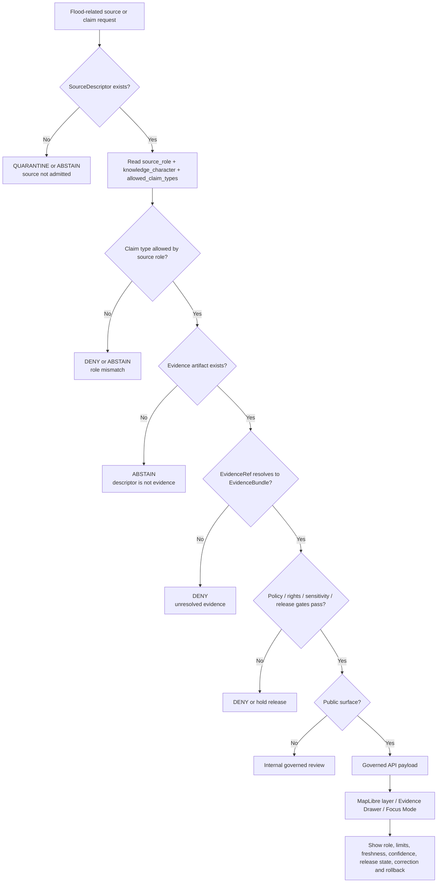

<!-- [KFM_META_BLOCK_V2]
doc_id: kfm://doc/NEEDS-VERIFICATION-adr-flood-source-role-separation
title: ADR: Flood Source Role Separation
type: standard
version: v1
status: draft
owners: OWNER_TBD_NEEDS_VERIFICATION: hydrology domain steward; hazards domain steward; policy steward; documentation steward
created: 2026-05-08
updated: 2026-05-08
policy_label: NEEDS_VERIFICATION
related: [./README.md, ./ADR-0303-hydrology-source-descriptor-activation-gates.md, ./ADR-0304-hydrology-first-proof-lane.md, ./ADR-0308-hydrology-synthetic-ingest-lifecycle-boundary.md, ../domains/hydrology/README.md, ../domains/hydrology/architecture/ARCHITECTURE.md, ../domains/hydrology/registers/SOURCE_REGISTRY.md, ../../data/registry/sources/hydrology/fema-nfhl.source_descriptor.json, ../../data/registry/sources/hydrology/usgs-water-data.source_descriptor.json, ../../tools/validators/validate_hydrology_source_descriptors.py, ../../tests/domains/hydrology/test_hydrology_source_role_policy.py]
tags: [kfm, adr, hydrology, hazards, flood, source-role, evidence, nfhl, source-descriptor, cite-or-abstain, fail-closed]
notes: [Replaces the prior placeholder ADR at docs/adr/ADR-flood-source-role-separation.md. Current file path is CONFIRMED in the repository, but ADR numbering, owners, CODEOWNERS, policy label, CI enforcement, and registry indexing remain NEEDS VERIFICATION.]
[/KFM_META_BLOCK_V2] -->

<a id="top"></a>
<a id="adr-flood-source-role-separation"></a>

# ADR: Flood Source Role Separation

Flood-related sources in KFM must be separated by **source role**, **knowledge character**, **claim type**, and **release burden** before they can support a map layer, Evidence Drawer statement, Focus Mode answer, export, or published claim.

<p align="center">
  
  
  
  
  
</p>

<p align="center">
  <a href="#decision">Decision</a> ·
  <a href="#evidence-basis">Evidence</a> ·
  <a href="#role-matrix">Role matrix</a> ·
  <a href="#claim-rules">Claim rules</a> ·
  <a href="#validation-plan">Validation</a> ·
  <a href="#rollback-and-supersession">Rollback</a> ·
  <a href="#review-checklist">Checklist</a>
</p>

> [!IMPORTANT]
> **Decision status:** `PROPOSED`. This ADR is ready for maintainer review, but it should not be treated as accepted governance until owners, policy label, ADR index coverage, CI/test execution, and downstream registry updates are verified.
>
> **Core rule:** A flood source may support only the claim types allowed by its source role. Regulatory flood hazard context, observed flood events, hydrologic observations, hydrography references, terrain context, model outputs, and historical evidence are not interchangeable.

> [!WARNING]
> KFM must not label FEMA NFHL or other regulatory flood-hazard products as observed inundation, current flooding, emergency conditions, or historical flood-event evidence unless a later evidence-backed ADR and source-role review explicitly authorizes that role. Public clients and Focus Mode must `ABSTAIN`, `DENY`, or `ERROR` rather than collapse roles.

---

## ADR header

| Field | Value |
|---|---|
| ADR path | `docs/adr/ADR-flood-source-role-separation.md` |
| Decision status | `PROPOSED` |
| Document status | `draft` |
| Decision date | `2026-05-08` |
| Scope | Hydrology/hazards source roles, flood-context claims, EvidenceBundle support, governed API/UI/AI boundaries |
| Owners | `OWNER_TBD_NEEDS_VERIFICATION` |
| Policy label | `NEEDS_VERIFICATION` |
| Related ADRs | [`ADR-0303`](./ADR-0303-hydrology-source-descriptor-activation-gates.md), [`ADR-0304`](./ADR-0304-hydrology-first-proof-lane.md), [`ADR-0308`](./ADR-0308-hydrology-synthetic-ingest-lifecycle-boundary.md) |
| Related domain docs | [`Hydrology README`](../domains/hydrology/README.md), [`Hydrology Architecture`](../domains/hydrology/architecture/ARCHITECTURE.md), [`Hydrology Source Registry Guide`](../domains/hydrology/registers/SOURCE_REGISTRY.md) |
| Current implementation evidence | Source descriptors, source-role validator, source-role test exist for selected hydrology sources |
| Enforcement maturity | `NEEDS VERIFICATION`: latest test execution, workflow enforcement, branch protection, public API/UI negative proof |
| Supersedes | Prior placeholder content in this file |
| Superseded by | `none` |
| Rollback target | Revert this ADR to placeholder or mark superseded; preserve source-role tests/descriptors unless separately reverted |

### Numbering note

The confirmed target path is:

```text
docs/adr/ADR-flood-source-role-separation.md
```

Some hydrology documentation references a proposed numbered path, `ADR-0003-flood-source-role-separation.md`. This ADR does **not** silently rename that reference. Maintainers should resolve the numbering/index issue through the ADR index or a successor note before marking this decision accepted.

<p align="right"><a href="#top">Back to top ↑</a></p>

---

## Decision

KFM will treat flood-related sources as **role-specific evidence carriers**, not as one generic flood authority.

The following separation is proposed as the governing rule:

1. **Regulatory flood hazard context** may support claims about regulatory or administrative flood-hazard context.
2. **Observed hydrology sources** may support observed hydrologic time-series claims when parameter, unit, timestamp, qualifier, approval/provisional state, and freshness are preserved.
3. **Observed flood-event evidence** may support event-specific flood claims only when the event date, evidence type, source, spatial/temporal scope, confidence, provenance, and correction lineage are resolved.
4. **Hydrologic-unit boundaries** may frame watershed or basin context; they are not observed flood evidence.
5. **Hydrography network references** may support network or identity context; they are not observed flood evidence.
6. **Terrain/elevation context** may support terrain-derived or model-preparation context after derivative validation; it is not observed flooding.
7. **Modeled or simulated flood outputs** may support modeled-scenario claims only with model-card governance, assumptions, calibration/validation evidence, uncertainty, and release-state controls.
8. **Historical flood narratives, photos, reports, or archival records** may support historical-event claims only with explicit source role, evidence strength, temporal scope, spatial precision, and review state.
9. **SourceDescriptor records are not claim evidence.** Public claims require resolved evidence artifacts through `EvidenceRef -> EvidenceBundle`.

### Operating rule

> Flood source roles must be checked before claim support. A source that is valid for one flood-related role must be denied or forced to abstain when used for a different role.

### Boundary rule

> No public map, API response, Evidence Drawer payload, Focus Mode answer, story node, export, catalog claim, or release alias may present regulatory, modeled, reference, historical, or observed flood materials as equivalent truth.

<p align="right"><a href="#top">Back to top ↑</a></p>

---

## Context

KFM’s hydrology lane is the first proof-bearing lane because it can exercise source identity, temporal support, evidence closure, catalog/proof/release separation, MapLibre rendering, Evidence Drawer explanation, Focus Mode abstention, correction, and rollback while remaining comparatively public-safe when fixture-first and no-network.

Flood information is high-risk because the same word, “flood,” can refer to very different things:

| Term users may say | What KFM must distinguish |
|---|---|
| “floodplain” | regulatory hazard area, geomorphic floodplain, modeled floodplain, or historical inundation footprint |
| “flood layer” | regulatory NFHL context, observed flood extent, forecast/model output, insurance map, historical event evidence, or local infrastructure-risk context |
| “flooded here” | observed event claim requiring event evidence, not regulatory context alone |
| “flood risk” | policy/model/regulatory/contextual claim requiring source-role-specific support |
| “near water” | hydrography or terrain context, not a flood claim |

KFM already contains source-role evidence for this distinction. The hydrology domain documentation states that FEMA NFHL is regulatory flood context and must not be treated as observed inundation. The hydrology source registry guide says NFHL maps to a `flood_context` role and that observational roles require timestamp, unit, and qualifier semantics. The hydrology architecture states that regulatory flood context is not observed inundation evidence.

This ADR turns that existing doctrine and partial implementation into a reviewable decision record.

<p align="right"><a href="#top">Back to top ↑</a></p>

---

## Evidence basis

| Evidence item | Source / path | What it supports | Truth label |
|---|---|---|---|
| Existing placeholder ADR | `docs/adr/ADR-flood-source-role-separation.md` | A placeholder exists at the requested path and states the decision topic. | `CONFIRMED` |
| ADR template and ADR index | `docs/adr/ADR-TEMPLATE.md`, `docs/adr/README.md` | KFM ADRs should include evidence, impact, validation, rollback, truth labels, and explicit separation of decision state from enforcement state. | `CONFIRMED` |
| Directory Rules | `Directory Rules.pdf` | ADRs belong under `docs/adr/`; hydrology/hazards files should remain under responsibility roots rather than root-level domain folders. | `CONFIRMED doctrine` |
| Hydrology domain README | `docs/domains/hydrology/README.md` | Hydrology is first proof lane; NFHL is regulatory flood context only; observed/historical flood evidence is separate. | `CONFIRMED repo evidence` |
| Hydrology architecture | `docs/domains/hydrology/architecture/ARCHITECTURE.md` | Source intake, normalization, validation, proof assembly, and governed delivery are hydrology components; NFHL is not observed inundation evidence. | `CONFIRMED repo evidence` |
| Hydrology source registry guide | `docs/domains/hydrology/registers/SOURCE_REGISTRY.md` | NFHL must map to flood context; observational roles need timestamp, unit, and qualifier semantics; inactive descriptors must not run in production. | `CONFIRMED repo evidence` |
| FEMA NFHL descriptor | `data/registry/sources/hydrology/fema-nfhl.source_descriptor.json` | FEMA NFHL role is `regulatory_flood_hazard_context`; `observed_flood_event` is disallowed; public release/fetch/connector are false. | `CONFIRMED repo evidence` |
| USGS Water Data descriptor | `data/registry/sources/hydrology/usgs-water-data.source_descriptor.json` | USGS Water Data role is observed hydrology source with `observed_streamflow_time_series` knowledge character; public release/fetch/connector are false pending verification. | `CONFIRMED repo evidence` |
| Source descriptor validator | `tools/validators/validate_hydrology_source_descriptors.py` | Validator requires source role, rights status, blocked activation states, and false connector/fetch/public-release booleans. | `CONFIRMED repo file / execution NEEDS VERIFICATION` |
| Source-role test | `tests/domains/hydrology/test_hydrology_source_role_policy.py` | Test asserts FEMA NFHL, WBD, and 3DEP knowledge-character separation. | `CONFIRMED repo file / execution NEEDS VERIFICATION` |
| Hydrology source activation ADR | `docs/adr/ADR-0303-hydrology-source-descriptor-activation-gates.md` | Descriptors are descriptor-first, blocked, non-fetching, non-public; FEMA NFHL must not support observed flood event claims. | `CONFIRMED repo evidence` |
| Hydrology-first proof ADR | `docs/adr/ADR-0304-hydrology-first-proof-lane.md` | Hydrology proof lane must include NFHL role separation and deny NFHL-as-observed-inundation behavior. | `CONFIRMED repo evidence` |
| Synthetic ingest lifecycle ADR | `docs/adr/ADR-0308-hydrology-synthetic-ingest-lifecycle-boundary.md` | Synthetic ingest cannot publish, prove public evidence, or bypass Promotion Gate. | `CONFIRMED repo evidence` |

### Evidence limits

Current evidence does **not** prove:

- this ADR has been accepted by owners;
- ADR index coverage is complete;
- latest tests have been run successfully;
- CI enforces the source-role checks;
- public API/UI/Focus Mode negative tests exist;
- all flood-related source families are registered;
- hazards-domain flood-event evidence has complete schemas and validators;
- source rights, terms, and attribution have been reviewed for live use.

<p align="right"><a href="#top">Back to top ↑</a></p>

---

## Role matrix

| Source role | Example source family | Allowed claim character | Must not support | Required public posture |
|---|---|---|---|---|
| `regulatory_flood_hazard_context` | FEMA NFHL, flood insurance map context | Regulatory hazard context, mapped flood-zone context, administrative/regulatory framing | Observed flood event, current inundation, emergency condition, historical event extent, sensor observation | Public claim only after rights, release, evidence, catalog/proof, review, and rollback gates pass |
| `observed_hydrology_source` | USGS Water Data / NWIS-style gage data | Observed streamflow/stage/time-series evidence with parameter/unit/time/qualifier/freshness | Legal floodplain determination, watershed boundary truth, flood extent by itself | Must preserve observation semantics and freshness; claim support requires EvidenceBundle |
| `observed_flood_event_evidence` | Reviewed event reports, high-water marks, imagery-derived observed extent, field observations | Event-specific flood occurrence or extent claims | Regulatory flood-zone classification, long-term flood risk, forecast/model certainty | Requires event date, evidence type, spatial precision, confidence, review state, correction path |
| `hydrologic_unit_boundary_reference` | WBD/HUC boundaries | Watershed/hydrologic-unit framing | Flood extent, flood occurrence, observed discharge | Boundary context only; no event claim without additional evidence |
| `hydrography_network_reference` | NHDPlus HR-style hydrography network | Stream/network/identity context | Observed flow, inundation, regulatory hazard, emergency condition | Reference context only; ambiguity must abstain |
| `elevation_terrain_context` | 3DEP/DEM terrain inputs | Elevation/terrain-derived context after validated derivation | Direct hydrologic observation, flood event evidence | Derived context; requires algorithm, CRS, datum, nodata, source refs, and rebuildability |
| `modeled_flood_scenario` | Hydraulic/hydrologic model output, forecast scenario, planning simulation | Modeled scenario with assumptions and uncertainty | Observed event, regulatory determination unless source explicitly supports it | Requires model card, calibration/validation evidence, uncertainty, scenario label, review and release state |
| `historical_flood_event_evidence` | Archives, photos, newspapers, reports, local records | Historical flood-event claim with confidence and scope | Current condition, regulatory zone, precise extent without support | Requires source authority, event date, spatial precision class, confidence, sensitivity and rights review |

> [!CAUTION]
> “Official source” is not the same as “allowed for every claim.” Source authority level, source role, knowledge character, allowed claim type, rights posture, review state, and release state must all agree.

<p align="right"><a href="#top">Back to top ↑</a></p>

---

## Claim rules

### Rule 1 — Regulatory flood context is not observed flooding

FEMA NFHL-style source families may support `regulatory_flood_hazard_context`. They must not be used to claim that an area was, is, or will be inundated in a specific event without additional event or model evidence.

```text
Allowed:
  "This feature is within released regulatory flood-hazard context."

Denied or forced to abstain:
  "This feature was flooded."
  "This is observed flood extent."
  "This is current flood inundation."
  "This is an emergency flood condition."
```

### Rule 2 — Observed hydrology is not flood extent by itself

USGS Water Data / NWIS-style observations may support streamflow, stage, and related time-series claims when metadata is preserved. They do not by themselves prove flood extent, insurance status, or regulatory hazard zone.

### Rule 3 — Observed flood-event claims need event evidence

A claim that flooding occurred at a place and time requires event evidence, event date/time, spatial precision, source role, confidence, provenance, and correction lineage.

### Rule 4 — Flood models must stay modeled

Modeled flood surfaces must carry scenario, assumptions, model version, calibration/validation support, uncertainty, and review state. They must not be rendered or summarized as observed truth.

### Rule 5 — Reference layers stay reference layers

WBD/HUC, NHDPlus HR, and 3DEP-derived context may frame a claim. They do not become flood-event evidence without additional role-appropriate evidence.

### Rule 6 — EvidenceBundle closure is required

Public or semi-public flood claims require `EvidenceRef -> EvidenceBundle` resolution unless the interface explicitly abstains.

### Rule 7 — Negative outcomes are valid

`ABSTAIN`, `DENY`, and `ERROR` are first-class outcomes when support is missing, source role is mismatched, public release is not allowed, rights are unknown, or validation fails.

<p align="right"><a href="#top">Back to top ↑</a></p>

---

## Decision flow



<p align="right"><a href="#top">Back to top ↑</a></p>

---

## Lifecycle impact

| Lifecycle stage | Flood-role separation requirement | Failure behavior |
|---|---|---|
| Source edge | Capture source role, source authority, rights status, allowed/disallowed claim types, and activation state. | `BLOCKED` or `QUARANTINE` if role/rights are unknown. |
| RAW | Preserve source-native material and source role; do not infer observed flood claims from regulatory context. | `QUARANTINE` if source-role metadata is missing. |
| WORK | Normalize into role-specific candidates: regulatory context, observation, event evidence, terrain context, model output, historical evidence. | `ABSTAIN`, `DENY`, or quarantine on ambiguous role. |
| QUARANTINE | Hold role mismatches, unresolved source identity, unknown rights, mislabeled NFHL, unsupported model claims, or missing event evidence. | Preserve reason codes and review path. |
| PROCESSED | Emit only role-validated artifacts with explicit knowledge character and claim support limits. | Block promotion when support type is overbroad. |
| CATALOG / TRIPLET | Catalog records and graph edges must keep role and evidence character visible. | Block catalog closure if role is collapsed or missing. |
| PUBLISHED | Public aliases, map layers, and exports may include only released role-validated artifacts. | `DENY` public release on role mismatch or missing rollback target. |

<p align="right"><a href="#top">Back to top ↑</a></p>

---

## Public surface requirements

| Surface | Required behavior | Denied behavior |
|---|---|---|
| Governed API | Return source role, knowledge character, allowed claim type, EvidenceBundle refs, limitations, freshness, release state, and reason codes. | Returning generic “flood truth” without role or evidence. |
| MapLibre layer | Render released layers with source-role trust badge or layer metadata. | Treating a regulatory flood layer as observed flooding through styling or labels. |
| Evidence Drawer | Explain whether a feature is regulatory context, observed hydrology, event evidence, terrain context, model output, or historical evidence. | Showing a SourceDescriptor as claim evidence. |
| Focus Mode | Answer only over released/resolved evidence; otherwise `ABSTAIN`, `DENY`, or `ERROR`. | Free-form flood explanation based on role-mismatched or unreleased material. |
| Review console | Allow reviewers to inspect internal candidate role mismatch and quarantine reasons. | Exposing internal review-only objects as public evidence. |
| Exports / story nodes | Include role, limitations, policy/release state, correction path, and rollback target. | Exporting unlabeled flood data as authoritative. |

### Evidence Drawer wording pattern

Use role-explicit wording:

```text
This feature is supported as regulatory flood hazard context by the released source role shown below. It is not observed inundation evidence. See EvidenceBundle refs, source limitations, release state, and correction history.
```

Avoid role-collapsing wording:

```text
This place flooded.
This is a flood.
This source proves inundation.
```

<p align="right"><a href="#top">Back to top ↑</a></p>

---

## Options considered

| Option | Description | Benefits | Risks | Outcome |
|---|---|---|---|---|
| One generic `flood` role | Treat all flood-related sources as one authority class. | Simple labels and UI. | Collapses regulatory, observed, modeled, historical, and reference evidence; high false-claim risk. | Rejected |
| Descriptor-only separation | Keep role distinctions only inside SourceDescriptor files. | Low implementation effort. | Public claims may still collapse roles downstream; descriptors are not evidence. | Rejected |
| UI-only labeling | Distinguish sources only in map legend or Evidence Drawer copy. | Improves user experience. | Does not protect validators, API, Focus Mode, catalog, release, or exports. | Rejected |
| Source-role separation across registry, validation, evidence, release, and UI | Enforce roles from source intake through public surfaces. | Preserves cite-or-abstain posture and prevents role inflation. | More schemas/tests/review burden. | Proposed decision |
| Ban all flood public surfaces until full hydrology/hazards maturity | Avoids early misuse. | Very safe. | Blocks useful public-safe regulatory/contextual hydrology proof work. | Rejected as default; retain as emergency fallback |

<p align="right"><a href="#top">Back to top ↑</a></p>

---

## Impact map

| Area | Required update | Status |
|---|---|---|
| `docs/adr/README.md` | Add this ADR and resolve non-numbered vs numbered flood-source-role reference. | `NEEDS VERIFICATION` |
| `docs/domains/hydrology/README.md` | Update flood source-role ADR link from proposed numbered path if this file is accepted as canonical. | `NEEDS VERIFICATION` |
| `docs/domains/hydrology/registers/SOURCE_REGISTRY.md` | Expand role matrix beyond NFHL, observations, and inactive descriptors. | `PROPOSED` |
| `docs/domains/hazards/` | Link or cross-reference this ADR for flood-event and hazard-context handling if hazards docs exist and are active. | `UNKNOWN / NEEDS VERIFICATION` |
| `data/registry/sources/hydrology/*.source_descriptor.json` | Keep allowed/disallowed claim types role-specific; add additional descriptors only with blocked defaults. | `PARTIAL / CONFIRMED for selected descriptors` |
| `schemas/contracts/v1/` | Add or update machine schemas for flood context, observed flood event evidence, modeled flood scenario, historical flood evidence, and source-role support if not already present. | `PROPOSED` |
| `contracts/` | Document semantic meaning of flood-role contract families if repo convention requires contract docs. | `PROPOSED` |
| `policy/` | Add deny rules for role-mismatched flood claims and SourceDescriptor-as-evidence misuse. | `PROPOSED` |
| `tools/validators/` | Extend validators beyond current descriptor-blocking checks to claim-support checks. | `PROPOSED` |
| `tests/domains/hydrology/` | Add invalid fixtures: NFHL-as-observed, gage-as-flood-extent, model-as-observed, descriptor-as-evidence. | `PROPOSED` |
| `apps/` / public surfaces | Prove public API, MapLibre, Evidence Drawer, Focus Mode, exports, and story nodes cannot collapse roles. | `UNKNOWN / NEEDS VERIFICATION` |
| `release/` and `data/proofs/` | Release manifests and proof bundles should preserve role and limitations. | `PROPOSED` |

<p align="right"><a href="#top">Back to top ↑</a></p>

---

## Validation plan

### Repository-grounded checks

These paths are present in the repository. Latest execution remains `NEEDS VERIFICATION`.

```bash
python tools/validators/validate_hydrology_source_descriptors.py

python -m unittest tests.domains.hydrology.test_hydrology_source_role_policy
```

Expected descriptor-stage behavior:

```text
PASS hydrology source descriptors blocked
```

### Required future negative-path tests

| Test case | Expected outcome |
|---|---|
| FEMA NFHL supports `observed_flood_event`. | `DENY` / validator failure |
| FEMA NFHL rendered as “observed inundation.” | `DENY` public payload |
| USGS Water Data observation missing unit, timestamp, qualifier, or approval/provisional state. | `ABSTAIN`, `DENY`, or validation failure by severity |
| WBD/HUC boundary used as event flood evidence. | `DENY` |
| 3DEP/DEM used as observed flood evidence. | `DENY` |
| Model output rendered as observed flooding. | `DENY` |
| Historical narrative used as precise flood extent without precision/confidence support. | `ABSTAIN` or `DENY` |
| SourceDescriptor used as EvidenceBundle. | `DENY` |
| Public Focus Mode gives flood answer without EvidenceBundle/citations. | `ABSTAIN`, `DENY`, or `ERROR` |
| Published flood layer lacks correction path or rollback target. | Block promotion |

### Acceptance criteria

This ADR can move from `PROPOSED` to `accepted` when:

- [ ] ADR owners and policy label are verified.
- [ ] `docs/adr/README.md` indexes this file and resolves numbering/linkage.
- [ ] Hydrology domain README links to the accepted canonical ADR path.
- [ ] Existing source-role validator/test execution is captured.
- [ ] At least one policy or validator denies NFHL-as-observed-flood-event behavior.
- [ ] At least one public-surface negative test proves role mismatch cannot reach map/API/Evidence Drawer/Focus Mode output.
- [ ] Flood source-role schema or contract coverage is either implemented or explicitly deferred with a verification backlog item.
- [ ] Release/promotion checks preserve role and rollback requirements.
- [ ] Open hazards-domain flood-event integration is either linked or marked out of scope.

<p align="right"><a href="#top">Back to top ↑</a></p>

---

## Rollback and supersession

### Rollback plan

Rollback this ADR by restoring the previous placeholder or marking this ADR `superseded` with a successor decision. Do **not** delete current source descriptors, validators, tests, receipts, or release artifacts unless a separate implementation rollback requires it.

If an implementation based on this ADR causes regressions:

1. Disable or revert the affected flood-role policy/validator.
2. Preserve the ADR and record the regression.
3. Keep NFHL descriptor restrictions unless a separate ADR supersedes them.
4. Remove public aliases for affected flood layers before modifying internal convenience paths.
5. Emit correction/rollback notes for any public claim affected.
6. Re-run source descriptor and public internal-path checks before re-release.

### Supersession rule

A successor ADR may replace this one only if it:

- preserves role separation or explicitly justifies a safer replacement;
- identifies affected source descriptors, schemas, policies, tests, public surfaces, and release records;
- updates `docs/adr/README.md`;
- preserves the relationship to ADR-0303, ADR-0304, and ADR-0308;
- includes rollback and correction treatment for previously published flood claims.

<p align="right"><a href="#top">Back to top ↑</a></p>

---

## Consequences

### Positive consequences

- Prevents regulatory flood context from being overclaimed as observed flooding.
- Keeps hydrology and hazards evidence compatible without collapsing them.
- Makes public UI and Focus Mode safer by forcing source-role visibility.
- Converts partial existing descriptor/test evidence into a reviewable decision.
- Preserves KFM’s cite-or-abstain posture for flood claims.
- Makes negative outcomes inspectable instead of treating missing evidence as a UI inconvenience.

### Tradeoffs and risks

| Risk | Mitigation | Residual status |
|---|---|---|
| More role-specific schemas and tests are required. | Start with the confirmed descriptor/test paths and add negative fixtures incrementally. | `PROPOSED` |
| Users may expect a single “flood layer.” | Evidence Drawer and map legend should explain role-specific layers. | `NEEDS VERIFICATION` |
| Hazards and hydrology lanes may duplicate flood-event concepts. | Treat this ADR as shared source-role boundary; keep canonical event schemas in the verified responsibility root. | `UNKNOWN / NEEDS VERIFICATION` |
| Existing hydrology README references a different ADR filename. | Resolve through ADR index update and link migration. | `NEEDS VERIFICATION` |
| Source rights remain unresolved. | Keep candidate descriptors blocked and public release denied until rights review passes. | `CONFIRMED for selected descriptors` |

<p align="right"><a href="#top">Back to top ↑</a></p>

---

## Open questions

| Question | Why it matters | Verification path |
|---|---|---|
| Should this file remain non-numbered, or become the successor to `ADR-0003-flood-source-role-separation.md`? | Link stability and ADR index authority. | Update `docs/adr/README.md` and hydrology README. |
| Where do flood-event schemas live: hydrology, hazards, or shared domain contracts? | Prevents duplicate flood-event authority. | Inspect active schemas/contracts and decide through schema-home/domain ADR if needed. |
| Are hazards-domain flood docs/files present and active? | Flood events are hazard-relevant and may require shared governance. | Search/fetch `docs/domains/hazards/`, `policy/domains/hazards/`, and tests. |
| Do public API/UI/Focus Mode negative tests exist? | Role separation must protect public surfaces, not just descriptors. | Inspect `apps/`, `packages/`, `tests/`, and CI workflows. |
| Have FEMA NFHL rights/terms/attribution been reviewed? | Current descriptor blocks public release until review. | Create or link review receipt. |
| Is there an accepted policy-rule home for role-mismatch denies? | Avoids parallel policy authority. | Check policy-home ADR and active `policy/` tree. |
| Are model-output flood products planned? | Modeled flood scenario role needs separate model-card governance. | Inspect hydrology/hazards backlog and model-card docs. |

<p align="right"><a href="#top">Back to top ↑</a></p>

---

## Review checklist

<details>
<summary>Pre-acceptance checklist</summary>

- [ ] Meta block values are verified or deliberately marked `NEEDS VERIFICATION`.
- [ ] ADR index includes this file.
- [ ] Hydrology README links to the accepted canonical flood-source-role ADR path.
- [ ] Numbered/non-numbered ADR path ambiguity is resolved or documented.
- [ ] Existing source descriptors still block fetch, connector execution, and public release.
- [ ] FEMA NFHL remains `regulatory_flood_hazard_context`.
- [ ] `observed_flood_event` remains disallowed for FEMA NFHL unless a successor ADR changes it.
- [ ] Source-role validator and source-role test execution are captured.
- [ ] Negative fixtures cover role mismatch, not just descriptor shape.
- [ ] Public-surface tests cover API, MapLibre/Evidence Drawer, and Focus Mode where implemented.
- [ ] EvidenceBundle closure is required before public flood claims.
- [ ] SourceDescriptor-as-evidence is denied.
- [ ] Policy, release, correction, and rollback impacts are recorded.
- [ ] Hazards-domain overlap is inspected and either linked or deferred.
- [ ] No claim in this ADR implies unverified CI, runtime, deployment, or public-release maturity.

</details>

<p align="right"><a href="#top">Back to top ↑</a></p>

---

## Appendix A — Minimal role glossary

| Term | Meaning |
|---|---|
| `regulatory_flood_hazard_context` | Regulatory/admin flood hazard context, such as NFHL-style products, not observed inundation. |
| `observed_hydrology_source` | Measurement/time-series source such as streamflow or stage observations, with time/unit/qualifier/freshness semantics. |
| `observed_flood_event_evidence` | Evidence that a flood occurred at a particular time/place, requiring event support and review. |
| `modeled_flood_scenario` | Model or forecast output with assumptions, uncertainty, validation, and scenario scope. |
| `historical_flood_event_evidence` | Archival or historical evidence for a flood event, with confidence and spatial/temporal precision limits. |
| `SourceDescriptor` | Source admission record; not claim evidence. |
| `EvidenceBundle` | Resolved support package for consequential claims. |
| `ABSTAIN` | Correct outcome when evidence or role support is insufficient. |
| `DENY` | Correct outcome when a policy, rights, release, or role rule fails. |
| `ERROR` | Correct outcome when validation, resolver, evaluator, or runtime execution fails. |

## Appendix B — Maintainer quick commands

Run from repository root after the real checkout is available:

```bash
# Inspect ADR links and source-role surfaces.
grep -RInE 'flood-source-role|regulatory_flood_hazard_context|observed_flood_event|fema-nfhl|NFHL' \
  docs data contracts schemas policy tools tests apps packages 2>/dev/null || true

# Confirm candidate descriptors remain blocked.
python tools/validators/validate_hydrology_source_descriptors.py

# Confirm selected role-separation expectations.
python -m unittest tests.domains.hydrology.test_hydrology_source_role_policy
```

> [!NOTE]
> Commands are repo-grounded by existing paths where noted, but latest execution and CI enforcement remain `NEEDS VERIFICATION` until a maintainer records run output or workflow evidence.

<p align="right"><a href="#top">Back to top ↑</a></p>
