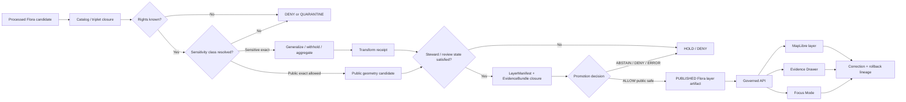

<!-- [KFM_META_BLOCK_V2]
doc_id: kfm://doc/UUID_TBD_NEEDS_VERIFICATION
title: ADR-flora-public-layer-strategy
type: standard
version: v1
status: draft
owners: OWNER_TBD_NEEDS_VERIFICATION
created: 2026-05-08
updated: 2026-05-08
policy_label: public
related: [docs/domains/flora/README.md, docs/domains/flora/PUBLICATION_AND_POLICY.md, docs/domains/flora/UI_AND_EVIDENCE_DRAWER.md, docs/domains/flora/CURRENT_STATE.md, docs/adr/ADR-0009-sensitive-location-policy.md, docs/adr/ADR-0006-maplibre-layer-manifest.md]
tags: [kfm, adr, flora, public-layer, MapLibre, EvidenceBundle, sensitivity]
notes: [replaces placeholder ADR at this path, doc_id and owners need verification against document registry and CODEOWNERS, formal policy label needs registry verification]
[/KFM_META_BLOCK_V2] -->

# ADR-flora-public-layer-strategy

Decides how Flora information may appear in public map layers without turning sensitive exact occurrences, models, renderer state, or AI summaries into truth.


> [!IMPORTANT]
> **Decision posture:** PROPOSED / draft. This ADR upgrades the existing placeholder at `docs/adr/ADR-flora-public-layer-strategy.md` into a reviewable decision. It does **not** claim that schemas, policies, validators, workflows, API routes, UI components, release manifests, or public Flora layers are already implemented.

---

## Quick navigation

| Start here | Decision mechanics | Review and release |
|---|---|---|
| [Status and decision card](#status-and-decision-card) | [Decision](#decision) | [Validation plan](#validation-plan) |
| [Context](#context) | [Layer classes](#public-flora-layer-classes) | [Rollback and supersession](#rollback-and-supersession) |
| [Evidence basis](#evidence-basis) | [Gate model](#gate-model) | [Review checklist](#review-checklist) |
| [Options considered](#options-considered) | [Impact map](#impact-map) | [Open verification items](#open-verification-items) |

---

## Status and decision card

| Field | Value |
|---|---|
| ADR ID | `ADR-flora-public-layer-strategy` |
| Title | Flora Public Layer Strategy |
| Target path | `docs/adr/ADR-flora-public-layer-strategy.md` |
| Status | `draft` / `proposed` |
| Decision date | `2026-05-08` |
| Decision confidence | `CONFIRMED repo placeholder / CONFIRMED doctrine / PROPOSED enforcement / UNKNOWN runtime implementation` |
| Scope | Flora public map layers, layer descriptors, Evidence Drawer payloads, Focus Mode boundaries, publication gates |
| Public exact-location default | `DENY` for rare, protected, controlled-access, embargoed, steward-reviewed, or otherwise sensitive flora |
| Public layer default | Released, public-safe, evidence-resolving derivatives only |
| Required support | `SourceDescriptor`, rights profile, sensitivity class, public geometry class, `EvidenceBundle`, `LayerManifest`, policy decision, release manifest, correction path, rollback target |
| Finite outcomes | `ANSWER`, `ABSTAIN`, `DENY`, `ERROR` |
| Enforcement maturity | `NEEDS VERIFICATION` until repo-native schemas, policies, fixtures, validators, CI checks, API envelopes, UI behavior, and release objects are inspected or added |
| Rollback target | `ROLLBACK_TARGET_TBD_NEEDS_VERIFICATION` |

### One-sentence decision

KFM Flora public layers may render only released, public-safe geometry and trust metadata, while all consequential claims resolve through governed APIs to admissible `EvidenceBundle` support and fail closed when rights, sensitivity, review, release, or rollback support is missing.

### Boundary rule

This ADR does **not** authorize public clients, MapLibre layer properties, exports, screenshots, search indexes, graph projections, story nodes, Focus Mode, AI context packs, or direct browser calls to expose `RAW`, `WORK`, `QUARANTINE`, restricted exact geometry, unpublished candidates, internal canonical stores, or direct model-runtime output.

[Back to top](#adr-flora-public-layer-strategy)

---

## Context

The current placeholder ADR says only that the decision will settle the Flora public layer strategy. The Flora lane now has enough doctrine and adjacent documentation to make the decision explicit, but implementation enforcement is still bounded by verification gaps.

Flora is a high-public-risk domain because plant records can involve exact rare-species locations, protected or culturally sensitive species, controlled-access biodiversity data, institutional specimens, uncertain taxonomy, derived models, and habitat associations that can accidentally disclose sensitive coordinates. A layer that merely “looks public” in MapLibre can still be unsafe if it exposes exact geometry, source IDs, internal references, or unsupported truth claims.

KFM’s architecture treats map layers as **downstream carriers**, not truth. A layer can help users see patterns, select features, and request evidence, but it must not become the source of authority for plant occurrence, taxon identity, legal status, source rights, publication eligibility, model certainty, or review state.

### Why this is architecture-significant

This decision affects:

- the public trust membrane between `PUBLISHED` artifacts and UI surfaces;
- whether exact sensitive Flora locations are withheld, generalized, aggregated, or denied;
- the fields a Flora `LayerManifest` / layer descriptor must carry;
- the Evidence Drawer and Focus Mode payload contract;
- source-role, rights, sensitivity, catalog closure, release, rollback, and correction gates;
- whether models, range maps, vegetation products, or habitat joins can be mistaken for observed plant truth.

[Back to top](#adr-flora-public-layer-strategy)

---

## Evidence basis

| Evidence item | Source / path / artifact | What it supports | Truth label |
|---|---|---|---|
| Existing target ADR placeholder | `docs/adr/ADR-flora-public-layer-strategy.md` | The target file exists as a placeholder and needs replacement with concrete decision language. | `CONFIRMED repo evidence` |
| ADR directory and template | [`./README.md`](./README.md), [`./ADR-TEMPLATE.md`](./ADR-TEMPLATE.md) | ADRs are governance records that must preserve evidence, options, validation, rollback, and unsupported-claim boundaries. | `CONFIRMED repo evidence` |
| Sensitive location ADR | [`./ADR-0009-sensitive-location-policy.md`](./ADR-0009-sensitive-location-policy.md) | Exact or reconstructable sensitive locations are default-deny and require public-safe geometry treatment before release. | `CONFIRMED repo evidence / NEEDS VERIFICATION for enforcement` |
| MapLibre layer manifest ADR | [`./ADR-0006-maplibre-layer-manifest.md`](./ADR-0006-maplibre-layer-manifest.md) | Layer descriptors should carry trust metadata and remain downstream of release/evidence state. | `CONFIRMED repo evidence / NEEDS VERIFICATION for enforcement` |
| Flora domain README | [`../domains/flora/README.md`](../domains/flora/README.md) | Flora owns public-safe map-layer routing, source-role discipline, Evidence Drawer / Focus support, and deny-by-default rare-location posture. | `CONFIRMED repo evidence` |
| Flora publication policy | [`../domains/flora/PUBLICATION_AND_POLICY.md`](../domains/flora/PUBLICATION_AND_POLICY.md) | Publication requires rights, sensitivity, source-role, EvidenceBundle, catalog closure, release manifest, rollback, and finite outcomes. | `CONFIRMED repo evidence / PROPOSED policy bindings` |
| Flora UI contract notes | [`../domains/flora/UI_AND_EVIDENCE_DRAWER.md`](../domains/flora/UI_AND_EVIDENCE_DRAWER.md) | MapLibre, Evidence Drawer, and Focus Mode must use governed API payloads and negative outcomes rather than direct raw or model access. | `CONFIRMED repo evidence / PROPOSED routes and schemas` |
| Flora current-state ledger | [`../domains/flora/CURRENT_STATE.md`](../domains/flora/CURRENT_STATE.md) | Flora docs and some source/schema/policy/tool surfaces are visible, while runtime, CI, release, API, UI, and public publication remain unknown. | `CONFIRMED repo evidence / UNKNOWN runtime` |
| Directory Rules | `Directory Rules.pdf` | ADRs belong under `docs/adr/`; domain materials belong under responsibility roots, not root-level domain folders. | `CONFIRMED doctrine` |
| MapLibre operating doctrine | `KFM_MapLibre_Operating_Architecture_Governed_UI_AI_Interaction_Manual_REVISED.pdf` | MapLibre is a disciplined downstream 2D renderer, never the truth store, policy authority, citation authority, or publication authority. | `CONFIRMED doctrine / PROPOSED implementation` |
| Local authoring workspace probe | Shell inspection during this authoring pass | `/mnt/data` exposed PDFs, not a mounted KFM checkout; public GitHub evidence was used for repo-state claims. | `CONFIRMED local workspace limit` |

> [!CAUTION]
> **Repetition is not proof.** Multiple KFM reports can converge on object names such as `EvidenceBundle`, `LayerManifest`, `ReleaseManifest`, or `DecisionEnvelope` without proving that a current workflow enforces them. This ADR uses those names as doctrine-backed contract targets until repo-native implementation evidence is attached.

[Back to top](#adr-flora-public-layer-strategy)

---

## Requirements and constraints

### KFM invariants checked

| Invariant | Impact of this ADR | Status |
|---|---|---|
| `RAW -> WORK / QUARANTINE -> PROCESSED -> CATALOG / TRIPLET -> PUBLISHED` | Public Flora layers may read only released/public-safe artifacts, never internal lifecycle stages. | `CONFIRMED doctrine / PROPOSED enforcement` |
| Public clients use governed interfaces, not raw/canonical/internal stores | Map clicks and Focus queries resolve through governed API envelopes and Evidence Drawer payloads. | `CONFIRMED doctrine / PROPOSED implementation` |
| `EvidenceRef` resolves to `EvidenceBundle` before consequential claims | Layer features carry evidence references or evidence routes; the drawer resolves the bundle before explaining. | `PROPOSED` |
| Promotion is a governed state transition, not a file move | A Flora layer is public only after promotion decision, release manifest, proof/citation closure, and rollback target. | `CONFIRMED doctrine / PROPOSED enforcement` |
| AI is interpretive and subordinate to evidence, policy, review, and release state | Focus Mode cannot answer from raw records, hidden exact points, or model output alone. | `CONFIRMED doctrine / PROPOSED enforcement` |
| Derived surfaces do not replace canonical truth | Range, suitability, vegetation, habitat, and heatmap layers are labeled as derived and linked back to evidence and methods. | `CONFIRMED doctrine / PROPOSED enforcement` |
| Rights, sensitivity, and policy checks fail closed where risk matters | Unknown rights, unknown sensitivity, missing review, or exact sensitive geometry deny public layer exposure. | `CONFIRMED doctrine / PROPOSED enforcement` |
| Receipts, proofs, releases, reviews, corrections, and rollback records remain separate | Layer publication requires separate transform receipt, proof bundle, release manifest, correction path, and rollback card where applicable. | `PROPOSED` |
| Rollback and correction are planned before publication | Every public Flora layer must have a rollback target before release. | `PROPOSED` |
| Sensitive location surfaces fail closed unless explicitly allowed | Rare/protected/controlled-access exact plant coordinates are denied by default. | `CONFIRMED doctrine / PROPOSED enforcement` |

### Non-goals

- This ADR does not choose the final schema home for Flora contracts. That remains blocked on schema-home verification or a Flora schema-home ADR.
- This ADR does not activate live Flora sources such as USDA PLANTS, GBIF, KSC IPT, herbarium feeds, NatureServe, or steward-controlled systems.
- This ADR does not assert that a MapLibre Flora layer, governed API route, Evidence Drawer component, Focus route, CI workflow, or release manifest already exists.
- This ADR does not define exact map styling, cartographic colors, UI component implementation, frontend framework, or package manager.
- This ADR does not authorize emergency, conservation-action, or field-location guidance from KFM public layers.

[Back to top](#adr-flora-public-layer-strategy)

---

## Options considered

| Option | Description | Benefits | Risks / costs | Evidence posture | Outcome |
|---|---|---|---|---|---|
| Exact occurrence layer where source is public | Show point-level Flora occurrences if a source publishes coordinates. | Simple; visually compelling; easy to implement. | Leaks sensitive taxa, false precision, source-role confusion, uncontrolled scraping/reuse, no steward gate. | `Rejected` | Rejected |
| No public Flora layers until full lane maturity | Deny all Flora public map surfaces until every schema, source, policy, and UI contract is complete. | Lowest disclosure risk. | Blocks safe educational/contextual products and delays testing the trust membrane. | `PROPOSED` | Rejected |
| Renderer-controlled disclosure | Let MapLibre style filters or client feature properties decide what is visible. | Fast UI iteration. | Renderer becomes policy engine; client-side data can leak; no release proof. | `Rejected` | Rejected |
| Public-safe derived layers behind governed evidence | Publish only released public-safe layers; require rights, sensitivity, source role, transform receipts, EvidenceBundle closure, release manifest, and rollback. | Preserves trust law while enabling useful public layers. | Requires more contracts, fixtures, policies, and review burden. | `CONFIRMED doctrine / PROPOSED enforcement` | **Chosen** |

[Back to top](#adr-flora-public-layer-strategy)

---

## Decision

### Chosen option

Adopt a **public-safe derived layer strategy** for Flora.

Public Flora layers are allowed only when they are released, public-safe, evidence-resolving, policy-approved derivatives. Exact occurrence rendering is allowed only for records explicitly classified as `public_exact_allowed` with compatible rights, non-sensitive posture, review state where required, and release proof. Rare, protected, controlled-access, embargoed, steward-reviewed, or otherwise sensitive Flora records must render as generalized, aggregated, withheld, or denied public outputs unless an explicit release decision allows greater precision.

### Decision rule

> A Flora public map layer is a released trust surface, not a raw data view: it must expose only public-safe geometry and enough trust metadata to resolve evidence, policy, review, freshness, correction, and rollback state.

### Boundary rule

> MapLibre style state, layer visibility, feature properties, clustering, filters, colors, and popups must not become source authority, evidence, policy decision, review approval, release proof, or AI truth.

[Back to top](#adr-flora-public-layer-strategy)

---

## Public Flora layer classes

| Layer class | Public use | Required support | Must not claim |
|---|---|---|---|
| `flora_public_occurrence_summary` | Non-sensitive occurrence summaries or generalized public occurrence context. | Rights profile, sensitivity class, public geometry class, EvidenceBundle ref, source role, release manifest. | Must not imply every source record is exact, complete, current, or publicly redistributable. |
| `flora_status_range_context` | Public range/status context at safe scale. | Authority boundary, as-of date, source role, evidence support, stale-state display. | Must not present range as observed presence or legal status outside source authority. |
| `flora_vegetation_product` | Derived vegetation, phenology, condition, or index products. | Method/model card, input artifacts, temporal window, uncertainty, masks, release manifest. | Must not present model/index output as direct observation. |
| `flora_habitat_association_context` | Non-disclosing joins between Flora evidence and habitat/soil/hydrology/land-cover context. | Input release refs, join method, leakage check, confidence/limitations, EvidenceBundle. | Must not disclose restricted exact occurrence through a derived association. |
| `flora_withheld_precision_stub` | Safe notice that evidence exists but public precision is withheld, when allowed. | Reason code, sensitivity policy ref, redaction/generalization receipt, review state. | Must not reveal exact or reconstructable location through labels, IDs, bounding boxes, or metadata. |
| `flora_public_aggregate` | County/grid/watershed/bbox summaries, richness-style summaries, or occurrence counts where policy permits. | Aggregation unit, threshold rule, source-role mix, rights check, uncertainty/limitations, release manifest. | Must not enable reverse engineering of sensitive exact points. |

### Required feature-level public metadata

Every public layer feature should carry only public-safe identifiers and trust cues.

| Field | Required? | Purpose |
|---|---:|---|
| `public_feature_id` | Yes | Stable public identifier that does not reveal restricted source IDs. |
| `layer_id` | Yes | Resolves to the public layer manifest. |
| `release_id` | Yes | Resolves to release manifest and rollback target. |
| `evidence_bundle_ref` or `evidence_route` | Yes | Allows governed evidence resolution. |
| `source_role` | Yes | Communicates authority boundary. |
| `rights_profile_id` | Yes | Carries license, attribution, derivative, and redistribution posture. |
| `sensitivity_class` | Yes | Explains why exact/generalized/withheld posture applies. |
| `geometry_publication_class` | Yes | One of `exact_public`, `generalized`, `aggregate`, `withheld`, `obscured`, `embargoed`, `denied`. |
| `freshness_state` | Yes | `fresh`, `stale`, `expired`, or `unknown`. |
| `review_state` | Yes | `approved`, `reviewed`, `needs_steward`, `blocked`, `withdrawn`, or equivalent. |
| `correction_state` | Yes | `current`, `corrected`, `superseded`, `withdrawn`, or equivalent. |
| `trust_badge_state` | Yes | Compact UI state for map legend and drawer entry. |

> [!WARNING]
> Do not place restricted source IDs, exact sensitive coordinates, raw specimen access URLs, private tokens, internal file paths, hidden geometry hashes, or controlled-access identifiers in public feature properties.

[Back to top](#adr-flora-public-layer-strategy)

---

## Gate model



### Gate matrix

| Gate | Must pass | Deny / quarantine trigger |
|---|---|---|
| Source role | Source role and authority boundary declared. | Aggregator/model/community source used as official authority. |
| Rights | Terms/license/attribution/derivative posture captured. | Unknown, noassertion, controlled-only, or incompatible redistribution. |
| Sensitivity | Sensitivity class and public geometry posture resolved. | Exact sensitive geometry without explicit authorization. |
| Geometry | CRS, precision, uncertainty, transform receipt, and safe public geometry present. | Hidden generalization, invalid geometry, or reconstructable sensitive location. |
| Evidence | Evidence refs resolve to released/admissible EvidenceBundles. | Missing evidence, weak support, unresolved source role, or broken bundle ref. |
| Catalog closure | STAC/DCAT/PROV/manifest/proof refs close where applicable. | Checksum drift, missing catalog, missing proof, or unresolved lineage. |
| Review | Steward/domain/policy review complete where required. | `needs_steward`, `blocked`, missing review, or scope mismatch. |
| Release | Release manifest has artifact digests, policy decision, correction path, rollback target. | File copy without promotion decision, missing rollback, stale or withdrawn release. |
| UI payload | Evidence Drawer and Focus payloads surface finite outcomes and trust state. | Tooltip-only evidence, unsupported answer, hidden denial, or direct raw/model access. |

[Back to top](#adr-flora-public-layer-strategy)

---

## Impact map

### File and documentation impact

| Area | Required update | Status |
|---|---|---|
| `docs/adr/ADR-flora-public-layer-strategy.md` | Replace placeholder with this decision record. | `CONFIRMED target / PROPOSED revision` |
| `docs/adr/README.md` | Add or update ADR index entry and status. | `NEEDS VERIFICATION` |
| `docs/adr/ADR-0009-sensitive-location-policy.md` | Cross-link this ADR if Flora public layers become a domain-specific application of default-deny location policy. | `PROPOSED` |
| `docs/adr/ADR-0006-maplibre-layer-manifest.md` | Cross-link this ADR as Flora-specific public layer profile. | `PROPOSED` |
| `docs/domains/flora/PUBLICATION_AND_POLICY.md` | Align source-role publication matrix, geometry rules, reason codes, and layer publication gate with this ADR. | `CONFIRMED doc / PROPOSED update` |
| `docs/domains/flora/UI_AND_EVIDENCE_DRAWER.md` | Align layer descriptor, Evidence Drawer payload, Focus payload, and negative-state display with this ADR. | `CONFIRMED doc / PROPOSED update` |
| `docs/domains/flora/CURRENT_STATE.md` | Update only after concrete files, tests, workflows, or release objects are verified. | `CONFIRMED doc / NEEDS VERIFICATION` |
| `data/registry/flora/layer_registry.yaml` | Define layer classes, public geometry classes, source-role mix, rights profile refs, and sensitivity obligations. | `PROPOSED` |
| `data/registry/flora/sensitivity_policies.yaml` | Define Flora sensitivity classes and public geometry posture. | `PROPOSED` |
| Schema home | Add `flora_layer_descriptor`, `flora_public_feature`, `flora_redaction_receipt`, and `flora_focus_payload` schemas under accepted schema home. | `NEEDS VERIFICATION` |
| `policy/flora/` | Add or update rights, sensitivity, layer-publication, promotion, AI/Focus, and review rules. | `PROPOSED` |
| `tools/validators/flora/` | Add validators for layer payloads, public geometry posture, EvidenceBundle refs, catalog closure, and no-internal-ref leakage. | `PROPOSED` |
| `tests/fixtures/flora/` | Add valid public-safe layer fixture and invalid exact-sensitive public layer fixture. | `PROPOSED` |
| `apps/` / `packages/` / UI shell | Add only after repo-native homes and route/component conventions are verified. | `UNKNOWN / NEEDS VERIFICATION` |
| `.github/workflows/` | Add checks only after workflow convention and required checks are verified. | `UNKNOWN / NEEDS VERIFICATION` |
| `release/` and `data/published/flora/` | Add release dry-run, manifest, rollback card, correction notice fixtures before public promotion. | `PROPOSED` |

### Trust-surface impact

| Surface | Effect | Required check |
|---|---|---|
| Governed API | Must return finite envelopes and resolved evidence routes for public Flora layers. | API contract and negative-path fixture. |
| MapLibre shell | Renders only public-safe geometry and trust badges. | No RAW/WORK/QUARANTINE refs; no exact sensitive geometry. |
| Evidence Drawer | Shows source role, rights, sensitivity transform, review, release, correction, and evidence support. | EvidenceBundle resolution and drawer fixture. |
| Focus Mode | Can answer only from released/admissible evidence; otherwise `ABSTAIN` or `DENY`. | Citation validation and denial fixture. |
| Review console / steward surface | Reviews held/sensitive/candidate layers before release. | Steward-review record and policy fixture. |
| Catalog / search / graph projections | Remain derived and rebuildable. | Catalog closure and release manifest check. |

[Back to top](#adr-flora-public-layer-strategy)

---

## Policy, rights, and sensitivity

| Question | Answer | Status |
|---|---|---|
| Does this decision affect public release eligibility? | Yes. It defines the public-layer release posture for Flora. | `PROPOSED` |
| Does it affect exact location exposure? | Yes. It denies exact sensitive Flora locations by default. | `CONFIRMED doctrine / PROPOSED enforcement` |
| Does it affect rare species or other high-risk material? | Yes. Rare/protected/controlled-access Flora is central to this decision. | `CONFIRMED doctrine / PROPOSED enforcement` |
| Does it require steward, legal, privacy, domain, or policy review? | Yes when sensitivity, rights, terms, review state, or exact geometry matter. | `PROPOSED / NEEDS VERIFICATION` |
| Does it change fail-closed behavior? | It makes fail-closed behavior explicit for Flora public layers. | `PROPOSED` |
| Does it change correction, withdrawal, or rollback behavior? | It requires rollback and correction paths for every public layer release. | `PROPOSED` |
| Does it affect external source rights, terms, quotas, licenses, or attribution? | Yes; every public layer must carry rights posture and attribution where required. | `NEEDS VERIFICATION` |

> [!CAUTION]
> If rights, sensitivity, source role, public geometry class, review state, release state, or rollback target is unclear, the safe outcome is `DENY`, `ABSTAIN`, `QUARANTINE`, `HOLD_FOR_REVIEW`, redaction, generalization, aggregation, or delayed publication.

[Back to top](#adr-flora-public-layer-strategy)

---

## Validation plan

### Required checks

| Check | Command / artifact / reviewer | Expected result | Status |
|---|---|---|---|
| Repo inventory | `git status --short` plus path inventory for docs, schemas, policy, tools, tests, data, release, apps, packages, workflows | Active branch and current file homes are known. | `NEEDS VERIFICATION` |
| ADR index check | `docs/adr/README.md` or repo-native ADR index | This ADR is listed with status `draft` / `proposed`. | `NEEDS VERIFICATION` |
| Schema-home check | Accepted schema-home ADR or current repo convention | Flora layer schemas land in one verified machine-contract home. | `NEEDS VERIFICATION` |
| Policy validation | Flora policy fixtures | Exact sensitive public layer is denied; public-safe generalized layer can pass. | `PROPOSED` |
| Rights validation | Rights profile fixtures | Unknown/noassertion/controlled-only rights block public exposure. | `PROPOSED` |
| Sensitivity validation | Sensitivity fixtures | Rare/protected/controlled exact locations fail closed unless explicit review/release allows. | `PROPOSED` |
| Geometry validation | Public geometry fixtures | Generalized/aggregate/withheld geometry has transform receipt; no reconstructable exact leak. | `PROPOSED` |
| Evidence closure | EvidenceBundle and catalog closure fixture | Public feature resolves to released EvidenceBundle and catalog/release refs. | `PROPOSED` |
| UI negative states | Evidence Drawer / Focus fixtures | `ANSWER`, `ABSTAIN`, `DENY`, and `ERROR` states render explicitly. | `PROPOSED` |
| Release dry run | Release manifest + rollback card fixture | Public layer cannot publish without rollback target and correction path. | `PROPOSED` |
| Documentation link check | Repo-native markdown/link checker | Related docs and ADRs link without broken anchors. | `NEEDS VERIFICATION` |

### Suggested no-network fixture set

| Fixture | Expected outcome | Why |
|---|---|---|
| `valid_public_generalized_occurrence_layer` | `ANSWER` / publishable public-safe layer candidate | Proves basic public-safe layer path. |
| `invalid_exact_sensitive_rare_flora_layer` | `DENY` | Proves exact sensitive geometry does not leak. |
| `invalid_unknown_rights_layer` | `ABSTAIN` runtime / `DENY` promotion | Proves rights fail closed. |
| `invalid_model_as_observation_layer` | `DENY` | Prevents derived products from becoming observed truth. |
| `valid_vegetation_product_with_method_card` | `ANSWER` if evidence/release gates pass | Proves derived layer labeling and lineage. |
| `withdrawn_release_layer` | `DENY` or stale/withdrawn UI state | Proves correction and rollback visibility. |

### Illustrative command sketch

```bash
# Read-only checks first.
git status --short
git branch --show-current || true

find docs/adr docs/domains/flora -maxdepth 3 -type f | sort
find schemas contracts policy tools tests fixtures data release apps packages .github -maxdepth 4 -type f 2>/dev/null | sort | head -400

# Repo-native validation commands must replace these placeholders after inspection.
# Examples:
#   make test
#   make validate
#   python -m pytest tests/flora
#   conftest test fixtures/flora/policy -p policy/flora
```

[Back to top](#adr-flora-public-layer-strategy)

---

## Rollback and supersession

### Rollback plan

If this ADR or its implementation causes unsafe exposure, ambiguity, or broken release behavior:

1. Disable the public Flora layer alias or layer registry entry.
2. Repoint public UI to the previous release manifest or a safe empty/withheld layer state.
3. Preserve the failing release manifest, validation report, policy decision, and review record as audit evidence.
4. Open or update a rollback card and correction notice.
5. Remove or block any feature property that leaked restricted source IDs, internal refs, or reconstructable sensitive geometry.
6. Re-run negative fixtures for exact sensitive geometry, unknown rights, missing EvidenceBundle, and missing rollback target.
7. Mark this ADR `CONFLICTED`, `superseded`, or `withdrawn` if a successor decision is required.

### Rollback triggers

| Trigger | Required action |
|---|---|
| Exact sensitive Flora location appears in public feature properties or geometry | Immediate layer withdrawal, incident review, rollback card, correction notice. |
| Public layer references RAW/WORK/QUARANTINE or unpublished candidate IDs | Disable layer and fail public-client bypass test. |
| EvidenceBundle resolution fails | Return `ABSTAIN` or `ERROR`; block promotion. |
| Unknown or incompatible rights discovered post-release | Withdraw or restrict layer; issue correction notice. |
| Derived product interpreted as observation truth | Correct labels, update Evidence Drawer/Focus copy, and block affected release if needed. |
| Rollback target missing | Block release; do not publish. |
| Schema/policy home conflict creates ambiguous enforcement | Hold implementation and resolve through ADR before continuing. |

### Supersession rule

A successor ADR is required if KFM later chooses a different public Flora exposure model, admits exact sensitive public layers under a formal steward process, changes the machine-contract home, changes public geometry classes materially, or alters the public-client trust membrane.

[Back to top](#adr-flora-public-layer-strategy)

---

## Consequences

### Positive consequences

- Public Flora layers become useful without becoming raw occurrence dumps.
- Rare/protected/controlled-access exact locations fail closed by default.
- Users can inspect why a layer is allowed, withheld, stale, corrected, or denied.
- Evidence Drawer and Focus Mode receive a clear payload strategy.
- Model and range products remain labeled as derived, not observation truth.
- Publication requires release, correction, and rollback support before public exposure.

### Tradeoffs and risks

| Risk | Mitigation | Residual status |
|---|---|---|
| More implementation work than a direct occurrence layer | Start with no-network public-safe fixtures and one boring layer class. | `Accepted tradeoff` |
| Generalization reduces user specificity | Surface precision class, reason codes, and Evidence Drawer explanation. | `Accepted tradeoff` |
| Schema-home ambiguity delays enforcement | Keep schema homes `NEEDS VERIFICATION`; do not fork `contracts/` and `schemas/`. | `Open` |
| Existing UI shell may use different paths than docs expect | Verify repo-native app/package/UI homes before implementation. | `Open` |
| Source rights may change | Require rights profile, terms snapshot, release review, and withdrawal path. | `NEEDS VERIFICATION` |
| Public aggregates can leak through small counts | Add aggregation threshold and sensitive-leak validator fixtures. | `PROPOSED` |

[Back to top](#adr-flora-public-layer-strategy)

---

## Open verification items

| Item | Why it matters | Verification path | Owner |
|---|---|---|---|
| Final ADR owner / steward | Required for acceptance and review routing. | Check `CODEOWNERS`, document registry, steward registry. | `OWNER_TBD_NEEDS_VERIFICATION` |
| Formal policy label | Meta block uses `public`; registry label still needs verification. | Check document registry / policy label convention. | `OWNER_TBD_NEEDS_VERIFICATION` |
| Flora schema home | Avoids dual machine-contract authority. | Resolve through accepted schema-home ADR or repo convention. | `OWNER_TBD_NEEDS_VERIFICATION` |
| Existing shared `LayerManifest` and `DecisionEnvelope` schemas | Prefer reuse over Flora-specific forks. | Inspect schemas/contracts and consumers. | `OWNER_TBD_NEEDS_VERIFICATION` |
| Policy engine and test runner | Needed to enforce deny/abstain behavior. | Inspect `policy/`, `tools/`, `tests/`, workflows. | `OWNER_TBD_NEEDS_VERIFICATION` |
| UI shell home | Prevents parallel MapLibre/Evidence Drawer/Focus implementation. | Inspect `apps/`, `packages/`, `ui/`, `web`, viewer roots. | `OWNER_TBD_NEEDS_VERIFICATION` |
| Source rights for first Flora layer | Rights block public exposure. | Source descriptor review and terms snapshot. | `OWNER_TBD_NEEDS_VERIFICATION` |
| Public geometry thresholds | Needed to prevent reverse engineering sensitive records. | Steward + policy review; add fixtures. | `OWNER_TBD_NEEDS_VERIFICATION` |
| Release/proof/rollback object homes | Needed for actual public promotion. | Inspect `release/`, `data/proofs/`, `data/published/`, registers. | `OWNER_TBD_NEEDS_VERIFICATION` |
| Branch protection / CI enforcement | Determines whether validation is enforced or merely documented. | Inspect workflows and branch settings. | `OWNER_TBD_NEEDS_VERIFICATION` |

[Back to top](#adr-flora-public-layer-strategy)

---

## Review checklist

- [ ] KFM meta block placeholders are verified or intentionally left with reviewable `NEEDS_VERIFICATION` notes.
- [ ] ADR index references this file and status.
- [ ] Related Flora docs cross-link this ADR where public layer strategy is discussed.
- [ ] Schema-home ambiguity is resolved or explicitly blocked.
- [ ] Public Flora layer fixture uses only released/public-safe geometry.
- [ ] Invalid exact sensitive public geometry fixture fails.
- [ ] Unknown rights fixture fails closed.
- [ ] Derived model/range/vegetation fixture is labeled as derived and cannot pass as observation truth.
- [ ] Layer descriptor carries evidence, source role, rights, sensitivity, freshness, review, correction, release, and rollback references.
- [ ] Evidence Drawer payload resolves `EvidenceBundle` and shows negative outcomes.
- [ ] Focus payload includes citations, reason codes, obligations, and finite outcome.
- [ ] No public feature property includes RAW/WORK/QUARANTINE refs, exact sensitive coordinates, restricted source IDs, secrets, internal paths, or direct model output.
- [ ] Release dry-run includes release manifest, proof/citation closure, correction path, and rollback target.
- [ ] Rollback rehearsal or documented rollback path is attached before public release.
- [ ] Current-state doc is updated only with evidence-backed implementation claims.

---

## Appendix A — Label quick reference

| Label | Use in this ADR |
|---|---|
| `CONFIRMED` | Verified from current repo/public source inspection, attached project doctrine, or current command output. |
| `INFERRED` | Conservative synthesis strongly implied by the evidence. |
| `PROPOSED` | Recommended design, rule, path, schema, policy, fixture, validator, or process not verified as implemented. |
| `UNKNOWN` | Not verified strongly enough to state as fact. |
| `NEEDS VERIFICATION` | A concrete check can retire the uncertainty. |
| `CONFLICTED` | Evidence or path conventions disagree and require decision. |
| `DENY` | Policy outcome that blocks exposure or promotion. |
| `ABSTAIN` | Truth outcome when support is insufficient. |
| `ERROR` | Tooling, validation, or execution failure state. |

[Back to top](#adr-flora-public-layer-strategy)
