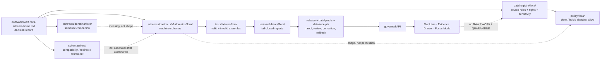

<!-- [KFM_META_BLOCK_V2]
doc_id: kfm://doc/NEEDS-VERIFICATION-ADR-flora-schema-home
title: ADR-flora-schema-home: Flora Machine Schema Home
type: standard
version: v1-draft
status: draft
owners: OWNER_TBD_NEEDS_VERIFICATION
created: 2026-05-08
updated: 2026-05-08
policy_label: NEEDS_VERIFICATION
related: [./README.md, ./ADR-0001-schema-home.md, ../architecture/contract-schema-policy-split.md, ../domains/flora/README.md, ../domains/flora/ARCHITECTURE.md, ../domains/flora/DATA_MODEL.md, ../domains/flora/SOURCE_REGISTRY.md, ../domains/flora/PUBLICATION_AND_POLICY.md, ../../schemas/README.md, ../../schemas/flora/README.md, ../../contracts/README.md, ../../policy/README.md, ../../data/registry/flora/README.md]
tags: [kfm, adr, flora, schema-home, biodiversity, rare-plants, geoprivacy, evidence, governance]
notes: [doc_id, owners, CODEOWNERS routing, policy_label, CI enforcement, validator evidence, final schema-home acceptance, and release-state enforcement remain NEEDS VERIFICATION. created date is carried from the existing placeholder ADR decision date and should be verified against git history. This ADR is proposed until ADR-0001 schema-home status, Flora schema inventory, compatibility aliases, fixtures, validators, and owner review are confirmed.]
[/KFM_META_BLOCK_V2] -->

<a id="top"></a>

# ADR-flora-schema-home: Flora Machine Schema Home

Proposed decision record for where KFM Flora machine schemas should live, how they relate to semantic contracts, and how to prevent Flora source-role, sensitivity, evidence, validation, release, and public-layer drift.

<p align="center">
  
  
  
  
  
</p>

<p align="center">
  <a href="#adr-header">Header</a> ·
  <a href="#decision-summary">Decision</a> ·
  <a href="#context">Context</a> ·
  <a href="#evidence-basis">Evidence</a> ·
  <a href="#path-decision">Path decision</a> ·
  <a href="#candidate-schema-families">Schema families</a> ·
  <a href="#validation-plan">Validation</a> ·
  <a href="#rollback-and-supersession">Rollback</a> ·
  <a href="#open-verification">Open verification</a>
</p>

> [!IMPORTANT]
> **Decision status:** `PROPOSED`.
>
> This ADR should not be marked `accepted` until the active checkout confirms repo-wide schema-home alignment, Flora schema inventory, compatibility/alias behavior, owner routing, fixtures, validators, policy gates, CI or local validation evidence, and downstream API/UI consumers.

> [!NOTE]
> This ADR narrows the repo-wide schema-home decision for the Flora lane. It extends [`ADR-0001-schema-home.md`](./ADR-0001-schema-home.md); it does not replace it.

---

## ADR header

| Field | Value |
|---|---|
| ADR ID | `ADR-flora-schema-home` |
| Title | Flora Machine Schema Home |
| Status | `proposed` |
| Decision date | `2026-05-08` |
| Owners | `OWNER_TBD_NEEDS_VERIFICATION` |
| Reviewers | `flora-domain-stewards`, `schema-stewards`, `policy-stewards`, `publication-stewards` — all `NEEDS VERIFICATION` |
| Scope | Flora domain machine schemas, semantic contracts, source registry references, fixture mapping, validators, policy inputs, public-safe layer payloads, and release-gate traceability |
| Affected paths | `docs/adr/ADR-flora-schema-home.md`, `docs/domains/flora/`, `schemas/contracts/v1/domains/flora/`, `schemas/flora/`, `contracts/domains/flora/`, `contracts/flora/`, `data/registry/flora/`, `policy/flora/`, `tests/fixtures/flora/`, `tools/validators/flora/` |
| Related ADRs | [`ADR-0001-schema-home.md`](./ADR-0001-schema-home.md) |
| Supersedes | Existing placeholder content in this file |
| Superseded by | `none` |
| Decision confidence | `PROPOSED` |
| Enforcement maturity | `NEEDS VERIFICATION` |
| Rollback target | Restore placeholder ADR body or supersede with a narrower schema-home ADR after repo inventory |

[Back to top](#top)

---

## Decision summary

**PROPOSED:** Flora domain-specific machine schemas should live under:

```text
schemas/contracts/v1/domains/flora/
```

Shared trust-object schemas remain in their shared schema families under `schemas/contracts/v1/`, such as `source/`, `evidence/`, `policy/`, `release/`, `runtime/`, `correction/`, and `data/`.

Semantic Flora contract prose, if needed, should live under:

```text
contracts/domains/flora/
```

Current or prior Flora schema references under `schemas/flora/`, `schemas/contracts/v1/flora/`, or `contracts/flora/` should not become parallel authorities. After acceptance, they should be treated as one of:

- a compatibility README or redirect surface;
- a tested migration alias;
- a legacy path pending retirement;
- or a superseded location recorded in migration notes.

Flora source descriptors and source-admission registries should remain under:

```text
data/registry/flora/
```

Policy rules, validators, fixtures, receipts, proofs, release manifests, rollback cards, published artifacts, API code, and UI code must stay in their own responsibility roots. This ADR must not create a root-level `flora/` directory or allow style, map, model, AI, catalog, or registry surfaces to become schema authority.

### One-line decision rule

> Use `schemas/contracts/v1/domains/flora/` for Flora machine schemas; use `contracts/` for semantic contract meaning; use `policy/` for admissibility decisions; use fixtures and validators to prove the split.

### One-line safety rule

> If source role, rights, sensitivity, taxon identity, geometry precision, EvidenceBundle resolution, review state, release state, or rollback support is unclear, Flora publication and public exact geometry fail closed.

[Back to top](#top)

---

## Context

The existing `docs/adr/ADR-flora-schema-home.md` file was a placeholder stating that the ADR would settle “flora schema home.” This revision replaces the placeholder with an evidence-bounded proposed decision.

The broader KFM documentation and current repository surfaces expose a live schema-home ambiguity:

- repo-wide schema doctrine proposes `schemas/contracts/v1/` for machine-checkable contract schemas;
- `contracts/` remains the semantic contract surface;
- `policy/` remains the admissibility decision surface;
- current Flora documentation refers to multiple candidate schema homes;
- the repository already contains `schemas/flora/README.md`, but that file itself marks schema-home authority as unresolved;
- prior Flora blueprint material used `contracts/flora/*.schema.json` as a proposed machine-schema path;
- Directory Rules and adjacent domain ADR patterns favor domain subpaths under responsibility roots rather than root-level domain buckets.

This ADR resolves the Flora-specific placement pressure by aligning Flora with KFM responsibility-root discipline:

- domain documentation stays under `docs/domains/flora/`;
- machine schemas stay under the schema responsibility root;
- Flora gets a domain subpath beneath the versioned machine-contract schema home;
- semantic contract prose stays separate from machine validation;
- source registries, policy rules, validators, fixtures, receipts, proofs, release objects, and published artifacts stay in their own roots;
- existing Flora schema-adjacent paths are reconciled through explicit migration, alias, or retirement behavior instead of silent duplication.

### Why this is architecture-significant

Flora schemas are not neutral shape files. They affect rare-plant geoprivacy, steward review, source-role compatibility, taxon identity, occurrence evidence, specimen support, plant-community modeling, habitat association, public layer field allowlists, Evidence Drawer payloads, Focus Mode outcomes, redaction receipts, release manifests, correction notices, and rollback targets.

A weak schema-home decision can produce several high-risk failures:

| Failure mode | Why it matters |
|---|---|
| Parallel schema homes | Validators, fixtures, and runtime consumers may enforce different shapes. |
| Semantic contract drift | Prose meaning and machine schema behavior may diverge. |
| Public-safety bypass | Sensitive exact Flora locations may reach public surfaces through a schema or fixture gap. |
| Source-role collapse | Taxon authorities, occurrence aggregators, herbarium records, community observations, modeled products, and generalized public surfaces may be confused. |
| Model-as-observation drift | Range maps, habitat suitability surfaces, phenology products, or vegetation indices may be treated as occurrence evidence. |
| Release ambiguity | Proof packs and release manifests cannot state which schema family governed a published artifact. |
| Rollback ambiguity | Reverting a faulty Flora release becomes harder if identifiers, schema IDs, aliases, and layer contracts drift. |

[Back to top](#top)

---

## Evidence basis

This ADR separates repository evidence, project doctrine, domain documentation, and proposed implementation.

| Evidence item | Status | What it supports | Limit |
|---|---:|---|---|
| `docs/adr/ADR-flora-schema-home.md` | `CONFIRMED` | Target ADR file exists and currently carries placeholder decision coverage. | Placeholder does not settle schema home. |
| [`./README.md`](./README.md) | `CONFIRMED` | `docs/adr/` is the human-facing decision ledger and distinguishes ADR decision state from enforcement state. | Does not prove all ADRs are accepted or enforced. |
| [`./ADR-0001-schema-home.md`](./ADR-0001-schema-home.md) | `CONFIRMED / PROPOSED` | Repo-wide proposed split: `schemas/contracts/v1/` for machine shape, `contracts/` for semantic meaning, `policy/` for admissibility. | Still draft/proposed; enforcement requires verification. |
| [`../architecture/contract-schema-policy-split.md`](../architecture/contract-schema-policy-split.md) | `CONFIRMED` | Architecture split: contracts explain meaning, schemas validate shape, policy decides release and runtime admissibility. | Does not prove validator or CI enforcement. |
| [`../../schemas/README.md`](../../schemas/README.md) | `CONFIRMED` | `schemas/` is an active parent schema lane; schema-home authority remains explicitly unresolved. | Does not prove Flora domain schemas exist under the selected home. |
| [`../../schemas/flora/README.md`](../../schemas/flora/README.md) | `CONFIRMED` | Current repo has a Flora schema-adjacent README and it marks schema-home authority `NEEDS VERIFICATION`. | Does not make `schemas/flora/` canonical. |
| [`../../contracts/README.md`](../../contracts/README.md) | `CONFIRMED` | `contracts/` owns meaning, field intent, compatibility, and trust-object semantics. | Does not make `contracts/flora/` the machine schema home. |
| [`../../policy/README.md`](../../policy/README.md) | `NEEDS VERIFICATION` | Policy should decide rights, sensitivity, review, release, correction, and runtime admissibility. | Policy files and policy runner were not verified in this ADR pass. |
| [`../domains/flora/README.md`](../domains/flora/README.md) | `CONFIRMED` | Flora lane covers taxon identity, occurrence evidence, specimen context, vegetation products, public-safe layers, Evidence Drawer, and Focus support. | Does not prove machine schema implementation. |
| [`../domains/flora/ARCHITECTURE.md`](../domains/flora/ARCHITECTURE.md) | `CONFIRMED` | Flora architecture identifies schema-home ambiguity and lists expected schema families. | Does not choose final schema home. |
| [`../domains/flora/DATA_MODEL.md`](../domains/flora/DATA_MODEL.md) | `CONFIRMED` | Flora object families, identity/hash posture, sensitivity split, and shared governance-object reuse. | Does not define final JSON Schema bodies. |
| [`../domains/flora/SOURCE_REGISTRY.md`](../domains/flora/SOURCE_REGISTRY.md) | `CONFIRMED` | Source roles are first-class and registry machine truth belongs in `data/registry/flora/*.yaml`. | Does not implement source registry validation. |
| [`../domains/flora/PUBLICATION_AND_POLICY.md`](../domains/flora/PUBLICATION_AND_POLICY.md) | `CONFIRMED` | Sensitive rare-plant public exact geometry is denied by default; rights, sensitivity, review, evidence, catalog, and release gates are required. | Does not prove executable Rego or promotion gate behavior. |

### Evidence boundary

A local mounted checkout was not available during this authoring pass. GitHub repository access was used to inspect current file contents on `main`. Active branch state, CODEOWNERS routing, workflow execution, complete schema inventory, validator reports, runtime/API consumers, and release/proof artifacts remain `NEEDS VERIFICATION`.

[Back to top](#top)

---

## Requirements and constraints

### KFM invariants checked

| Invariant | ADR effect | Status |
|---|---|---:|
| `RAW -> WORK/QUARANTINE -> PROCESSED -> CATALOG/TRIPLET -> PUBLISHED` | Keeps schemas separate from lifecycle data, receipts, proofs, release manifests, and public artifacts. | `PRESERVED` |
| Public clients use governed interfaces | Schema placement must support governed API, Evidence Drawer, MapLibre, Focus, and review payload validation without direct access to RAW/WORK/QUARANTINE. | `PRESERVED` |
| EvidenceRef resolves to EvidenceBundle | Flora schema families must require resolvable evidence for consequential claims. | `PROPOSED` |
| Promotion is a governed state transition | Release schema use must tie to release manifests, policy decisions, proof closure, review state, and rollback targets. | `PROPOSED` |
| AI is interpretive | Focus Mode schemas and payloads must support `ANSWER`, `ABSTAIN`, `DENY`, and `ERROR` without making AI output evidence. | `PRESERVED` |
| Derived layers stay derived | Range, suitability, phenology, vegetation-index, public generalized occurrence, and habitat association outputs must not become canonical occurrence truth. | `PRESERVED` |
| Sensitivity and rights fail closed | Unknown rights, source role, review state, sensitivity, or sensitive exact geometry must block public promotion. | `PRESERVED` |
| Receipts, proofs, release, correction, and rollback stay separate | Schema definitions do not store emitted trust objects. | `PRESERVED` |
| Domain files live under responsibility roots | Flora appears under `docs/domains/`, `schemas/contracts/v1/domains/`, `contracts/domains/`, `policy/`, `data/registry/`, `tests/`, and `tools/`, not at repo root. | `PRESERVED` |

### Non-goals

This ADR does not decide:

- complete Flora schema field lists;
- final schema `$id` naming;
- complete schema versioning policy beyond this home;
- fixture-home authority across the whole repository;
- policy-as-code syntax or runner;
- API route names;
- UI component paths;
- live source connector activation;
- Flora source-rights approval;
- rare-plant steward policy thresholds;
- public-safe geometry precision buckets;
- public release readiness.

[Back to top](#top)

---

## Path decision

### Selected path

Use this canonical Flora domain machine-schema home after acceptance:

```text
schemas/contracts/v1/domains/flora/
```

### Companion and compatibility homes

| Concern | Home | Status | Rule |
|---|---|---:|---|
| Flora domain docs | `docs/domains/flora/` | `CONFIRMED` | Human-facing control plane only. |
| Flora machine schemas | `schemas/contracts/v1/domains/flora/` | `PROPOSED canonical` | Machine-checkable domain shape after acceptance. |
| Current Flora schema README | `schemas/flora/README.md` | `CONFIRMED compatibility signal / NEEDS VERIFICATION` | Keep as compatibility index, migration note, or retire with successor link; do not add canonical machine schemas here after acceptance without a successor ADR. |
| Older direct v1 Flora path | `schemas/contracts/v1/flora/` | `PROPOSED legacy/alias candidate` | Allow only as explicit tested alias if existing consumers require it. |
| Older contract-schema path | `contracts/flora/` | `PROPOSED legacy/alias candidate` | Do not use as canonical machine schema home. Preserve lineage where already referenced. |
| Flora semantic contracts | `contracts/domains/flora/` | `PROPOSED companion if needed` | Explain object meaning and compatibility, not machine shape. |
| Shared trust-object schemas | `schemas/contracts/v1/<shared-family>/` | `CONFIRMED parent signal / NEEDS VERIFICATION for enforcement` | Do not duplicate shared trust objects under Flora unless a profile overlay is justified. |
| Source registry | `data/registry/flora/` | `PROPOSED / NEEDS VERIFICATION` | Source roles, rights, authority scope, cadence, sensitivity, taxon authorities, and layer eligibility. |
| Policy rules | `policy/flora/` or repo-native policy home | `PROPOSED / NEEDS VERIFICATION` | Deny, hold, abstain, restrict, generalize, embargo, allow, correct, or withdraw. |
| Validators | `tools/validators/flora/` or repo-native validator home | `PROPOSED / NEEDS VERIFICATION` | Fail-closed schema/source/geoprivacy/evidence/release checks. |
| Fixtures | `tests/fixtures/flora/` or repo-native fixture home | `PROPOSED / NEEDS VERIFICATION` | Positive and negative proof cases. |
| Receipts | `data/receipts/flora/` | `PROPOSED / NEEDS VERIFICATION` | Run, validation, redaction, correction, and rollback process memory. |
| Proofs | `data/proofs/flora/` | `PROPOSED / NEEDS VERIFICATION` | EvidenceBundle, proof pack, release support. |
| Published artifacts | `data/published/flora/` | `PROPOSED / NEEDS VERIFICATION` | Public-safe materializations only. |

### Why `domains/flora/`

KFM directory discipline treats domain names as subpaths under responsibility roots. Flora is a domain lane, not a root responsibility. The schema root owns machine shape; the `domains/flora/` subpath preserves that responsibility-root pattern while avoiding domain files as root-level buckets.



[Back to top](#top)

---

## Candidate schema families

The exact schema filenames and `$id` values remain `PROPOSED` until a schema PR lands. This table records the expected object-family boundary, not final file content.

| Object family | Candidate schema home | Role |
|---|---|---|
| `flora_source_descriptor` | `schemas/contracts/v1/domains/flora/flora_source_descriptor.schema.json` | Flora source identity, source role, rights, cadence, sensitivity posture, authority boundary, and source activation state. Prefer shared `SourceDescriptor` if adequate. |
| `flora_taxon` | `schemas/contracts/v1/domains/flora/flora_taxon.schema.json` | Accepted taxon identity, raw/source names, rank, authority, status pointers, and naming context. |
| `flora_taxon_crosswalk` | `schemas/contracts/v1/domains/flora/flora_taxon_crosswalk.schema.json` | Raw, accepted, synonym, common, historical, and source-specific name bridges with validity and authority context. |
| `flora_taxon_status` | `schemas/contracts/v1/domains/flora/flora_taxon_status.schema.json` | Native, introduced, invasive, cultivated, protected, or status assertions by authority, jurisdiction, and time. |
| `flora_occurrence` | `schemas/contracts/v1/domains/flora/flora_occurrence.schema.json` | Atomic observed plant support: taxon, method, geometry, uncertainty, source, rights, sensitivity, review, and evidence refs. |
| `flora_occurrence_batch` | `schemas/contracts/v1/domains/flora/flora_occurrence_batch.schema.json` | Batch manifest for occurrence loads and fixture groups. |
| `specimen_record` | `schemas/contracts/v1/domains/flora/specimen_record.schema.json` | Herbarium or institutional specimen context, catalog metadata, georeference quality, and collection rights. |
| `botanical_survey` | `schemas/contracts/v1/domains/flora/botanical_survey.schema.json` | Plot, transect, survey, checklist, or photo-voucher method context. |
| `plant_community` | `schemas/contracts/v1/domains/flora/plant_community.schema.json` | Plant community or assemblage object distinct from occurrence and range. |
| `vegetation_class` | `schemas/contracts/v1/domains/flora/vegetation_class.schema.json` | Vegetation or ecosystem class with classification system, code, epoch, and authority. |
| `range_map` | `schemas/contracts/v1/domains/flora/range_map.schema.json` | Range/distribution surface with source, model, generalization, uncertainty, and support metadata. Must not validate as observed occurrence. |
| `habitat_association` | `schemas/contracts/v1/domains/flora/habitat_association.schema.json` | Derived relation between taxon/occurrence/community and habitat/covariate evidence with method and confidence. |
| `phenology_condition_product` | `schemas/contracts/v1/domains/flora/phenology_condition_product.schema.json` | Remote-sensing, vegetation-index, phenology, or condition product with temporal windows, masks, uncertainty, and lineage. |
| `flora_sensitivity_policy` | `schemas/contracts/v1/domains/flora/flora_sensitivity_policy.schema.json` | Domain-specific sensitivity classes and public geometry class inputs. |
| `flora_redaction_receipt` | Prefer shared receipt schema if available; otherwise `schemas/contracts/v1/domains/flora/flora_redaction_receipt.schema.json` | Public geometry transform support with input/output hashes, reason, policy, method, actor/run, and rollback refs. |
| `flora_layer_descriptor` | `schemas/contracts/v1/domains/flora/flora_layer_descriptor.schema.json` | Domain layer field allowlist, public geometry class, source role, freshness, review state, and Evidence Drawer route expectations. |
| `flora_evidence_drawer_payload` | Prefer shared payload schema if available; otherwise `schemas/contracts/v1/domains/flora/flora_evidence_drawer_payload.schema.json` | Claim, evidence, provenance, rights, sensitivity, review, freshness, correction, and audit payload for UI trust display. |
| `flora_focus_payload` | Prefer shared Focus schema if available; otherwise `schemas/contracts/v1/domains/flora/flora_focus_payload.schema.json` | Bounded Focus Mode request/response with scope, evidence pool, policy state, citations, and finite outcome. |
| `flora_promotion_candidate` | Prefer shared promotion schema if available; otherwise `schemas/contracts/v1/domains/flora/flora_promotion_candidate.schema.json` | Candidate bundle submitted to promotion gate before publication. |

### Shared schema references

Do not duplicate these shared object families under `domains/flora/` unless a successor ADR requires a domain overlay:

| Shared object | Preferred shared family |
|---|---|
| `SourceDescriptor` | `schemas/contracts/v1/source/` |
| `EvidenceRef` | `schemas/contracts/v1/evidence/` |
| `EvidenceBundle` | `schemas/contracts/v1/evidence/` |
| `DecisionEnvelope` | `schemas/contracts/v1/policy/` |
| `RuntimeResponseEnvelope` | `schemas/contracts/v1/runtime/` |
| `DatasetVersion` | `schemas/contracts/v1/data/` |
| `ValidationReport` | `schemas/contracts/v1/data/` or repo-accepted validation family |
| `ReleaseManifest` | `schemas/contracts/v1/release/` |
| `CorrectionNotice` | `schemas/contracts/v1/correction/` |
| `ReviewRecord` | Shared review/release family after repo inventory |
| `RollbackCard` | Shared release/correction family after repo inventory |
| `RunReceipt` | Shared receipt/runtime family after repo inventory |
| `AIReceipt` | Shared runtime/AI family after repo inventory |

[Back to top](#top)

---

## Options considered

| Option | Description | Benefits | Risks | Outcome |
|---|---|---|---|---|
| `schemas/contracts/v1/domains/flora/` | Domain subpath under versioned machine-contract schema home. | Aligns with responsibility-root discipline, ADR-0001 direction, adjacent Fauna ADR pattern, and domain grouping. | Requires migration or compatibility treatment for current `schemas/flora/` and older `contracts/flora/` references. Acceptance depends on validators and owner review. | **Selected / PROPOSED** |
| `schemas/contracts/v1/flora/` | Domain path directly under `v1`. | Shorter path; appears in some Flora docs as a proposed target. | Weakens `domains/` grouping; can diverge from Directory Rules and adjacent domain ADR pattern. | Rejected unless successor ADR proves repo convention prefers it. |
| `schemas/flora/` | Current repo schema-adjacent Flora README path. | Already visible; easy for contributors to find. | Not versioned under machine-contract home; can become a parallel root under `schemas/`; current README itself marks schema-home unresolved. | Compatibility/redirect/retirement candidate, not selected canonical home. |
| `contracts/flora/` as machine-schema home | Put Flora machine schemas beside semantic contract docs or older blueprint paths. | Familiar to prior Flora blueprint language. | Collapses semantic contract meaning and machine validation; conflicts with proposed repo-wide split. | Rejected for machine schemas. |
| `contracts/domains/flora/` as semantic companion | Put Flora semantic contract prose under contract responsibility root and domain subpath. | Preserves meaning/shape split and responsibility-root discipline. | Requires creation only if semantic companion docs are needed. | Accepted as companion, not machine-schema home. |
| Dual homes with copies | Keep multiple machine schema paths active. | May feel compatible short-term. | Creates parallel authority, validator drift, fixture ambiguity, release uncertainty, and rollback ambiguity. | Rejected. |
| Defer decision and keep placeholder | Leave schema home unsettled. | Avoids immediate migration work. | Allows drift across docs, registry, validators, fixtures, API payloads, and public-safety gates. | Rejected. |

[Back to top](#top)

---

## Normative rules after acceptance

When this ADR is accepted, these rules should govern Flora schema work.

1. **Machine schemas:** Flora domain-specific machine schemas live under `schemas/contracts/v1/domains/flora/`.
2. **Semantic contracts:** Flora semantic contract prose may live under `contracts/domains/flora/`; it must not duplicate machine schema authority.
3. **Current `schemas/flora/`:** treat as compatibility, redirect, migration note, or retired index; do not add canonical machine schemas there after acceptance unless a successor ADR changes the rule.
4. **No parallel homes:** do not create `contracts/flora/*.schema.json`, `schemas/flora/*.schema.json`, or `schemas/contracts/v1/flora/*.schema.json` as second authorities.
5. **Explicit aliases only:** legacy paths may resolve only through an alias/migration record with target, owner, status, review date, and tests.
6. **Shared schemas stay shared:** `SourceDescriptor`, `EvidenceBundle`, `DecisionEnvelope`, `RuntimeResponseEnvelope`, `ReleaseManifest`, and `CorrectionNotice` remain shared unless a Flora overlay is justified.
7. **Fixture-first validation:** no live source connector depends on a new schema until synthetic valid and invalid fixtures pass.
8. **Public-safety negative tests:** restricted exact geometry, unknown rights, unknown source role, incompatible source role, model-as-observation, missing EvidenceBundle, and missing rollback target must fail closed.
9. **Release traceability:** release candidates must identify schema family, schema version, validation report, policy decision, review state, evidence bundle, and rollback target.
10. **Docs sync:** Flora domain docs, source registry docs, schema README, contract README, validation docs, publication-policy docs, and ADR index must stay synchronized.
11. **Acceptance requires evidence:** this ADR becomes governing only when active repo evidence shows the selected path, compatibility plan, validators, fixtures, and owner review.

[Back to top](#top)

---

## Impact map

| Area | Required update | Status |
|---|---|---:|
| `docs/adr/README.md` | Add or update entry for `ADR-flora-schema-home.md`; mark status accurately. | `PROPOSED` |
| `docs/domains/flora/README.md` | Replace unresolved `contracts/flora` vs `schemas/contracts/v1/flora` language with this ADR’s selected path or explicit dependency. | `PROPOSED` |
| `docs/domains/flora/ARCHITECTURE.md` | Update schema/contract surface section to selected path and compatibility behavior. | `PROPOSED` |
| `docs/domains/flora/DATA_MODEL.md` | Update schema-home references and keep exact field shapes delegated to machine schemas. | `PROPOSED` |
| `docs/domains/flora/SOURCE_REGISTRY.md` | Confirm source descriptor schema references selected path or shared `SourceDescriptor` profile. | `PROPOSED` |
| `docs/domains/flora/PUBLICATION_AND_POLICY.md` | Confirm policy inputs, reason-code docs, and redaction receipt schema references selected path or shared schema home. | `PROPOSED` |
| `docs/domains/flora/UI_AND_EVIDENCE_DRAWER.md` | Confirm Evidence Drawer, Focus, runtime envelope, and layer descriptor schema links. | `PROPOSED` |
| `docs/domains/flora/VERIFICATION_BACKLOG.md` | Retire schema-home ambiguity only after acceptance criteria pass. | `PROPOSED` |
| `schemas/README.md` | Confirm domain-lane schema pattern and update if `domains/flora/` is added. | `PROPOSED` |
| `schemas/contracts/v1/README.md` | Add domain schema subpath index if present. | `PROPOSED / NEEDS VERIFICATION` |
| `schemas/flora/README.md` | Convert to compatibility note, redirect, migration index, or retired pointer once canonical path lands. | `PROPOSED / NEEDS VERIFICATION` |
| `contracts/README.md` | Confirm semantic-contract companion behavior and no machine-schema duplication. | `PROPOSED` |
| `policy/README.md` | Confirm policy consumes schema-valid Flora objects but does not define schema shape. | `PROPOSED` |
| `data/registry/flora/` | Update registry docs to link to selected schema path and shared schema refs. | `PROPOSED / NEEDS VERIFICATION` |
| `tools/validators/flora/` | Add schema-home and public-safety validators if not present. | `PROPOSED / NEEDS VERIFICATION` |
| `tests/fixtures/flora/` | Add valid/invalid fixtures for schema placement, source-role misuse, geoprivacy, evidence closure, derived-model misuse, and release rollback. | `PROPOSED / NEEDS VERIFICATION` |

[Back to top](#top)

---

## Validation plan

### Repository inventory checks

Run these from the repository root before accepting this ADR or landing Flora schemas.

```bash
git status --short
git branch --show-current
git rev-parse --show-toplevel

find docs/adr docs/domains/flora schemas contracts data/registry/flora policy tests tools \
  -maxdepth 5 -type f 2>/dev/null | sort | sed -n '1,320p'
```

### Schema-home checks

```bash
# Expected after implementation.
test -d schemas/contracts/v1/domains/flora

# Current compatibility surface should not contain canonical machine schemas
# after this ADR is accepted unless an alias/migration record explains it.
find schemas/flora -maxdepth 2 -type f 2>/dev/null | sort

# Reject unapproved parallel authority unless an alias/migration file explains it.
find contracts/flora schemas/contracts/v1/flora -type f 2>/dev/null | sort
```

### Consumer-resolution checks

```bash
# Search for old or competing Flora schema-home references.
git grep -nE 'contracts/flora|schemas/flora|schemas/contracts/v1/flora|schemas/contracts/v1/domains/flora' -- \
  docs schemas contracts data policy tests tools apps packages pipelines .github 2>/dev/null || true

# Search for Flora public-safety reason codes that validators/policy should cover.
git grep -nE 'precise_sensitive_location_denied|geoprivacy_required|model_as_observation|knowledge_character_mismatch|missing_evidence_bundle|unknown_rights|public_payload_exposes_internal_ref' -- \
  docs schemas contracts data policy tests tools apps packages pipelines .github 2>/dev/null || true
```

### Negative-path fixtures

| Fixture | Expected outcome | Why |
|---|---|---|
| `schema_parallel_authority.json` | `DENY` or schema-home validation failure | Prevents dual schema homes. |
| `unknown_source_role.json` | `QUARANTINE` / `HOLD` | Source role is mandatory. |
| `community_observation_as_official_status.json` | `DENY` | Community observation cannot become official status authority. |
| `derived_model_as_occurrence.json` | `DENY` | Range/model/suitability products are not observed occurrence truth. |
| `habitat_context_as_occurrence_proof.json` | `ABSTAIN` / `DENY` | Habitat context is not occurrence proof. |
| `restricted_precise_public_geometry.json` | `DENY` | Sensitive exact public geometry fails closed. |
| `missing_evidence_bundle.json` | `ABSTAIN` / `DENY` | Public claims require resolved evidence. |
| `redaction_without_receipt.json` | `DENY` | Public-safe transforms need receipts. |
| `release_without_rollback_target.json` | `DENY` / `ERROR` | Publication must be reversible. |
| `focus_payload_uncited_answer.json` | `DENY` | Focus Mode must cite or abstain. |

### Acceptance criteria

This ADR can move to `accepted` only when:

- [ ] ADR-0001 is accepted, or this ADR lands in the same reviewed change that resolves the repo-wide schema-home decision.
- [ ] Active checkout confirms whether any Flora schema files already exist under `schemas/flora/`, `contracts/flora/`, `schemas/contracts/v1/flora/`, or `schemas/contracts/v1/domains/flora/`.
- [ ] Existing legacy Flora schema paths, if any, are migrated, aliased, retired, or quarantined with validation evidence.
- [ ] `schemas/contracts/v1/domains/flora/` exists or the implementation PR creates it.
- [ ] A local README or index explains the Flora schema family.
- [ ] No unapproved parallel schema home remains.
- [ ] Valid and invalid Flora fixtures exist for core public-safety paths.
- [ ] Validators can fail closed on schema placement, unknown source role, unknown rights, source-role misuse, derived-model-as-observation, sensitive exact public geometry, missing EvidenceBundle, and missing rollback target.
- [ ] Flora docs and `data/registry/flora/` docs link to the selected schema path.
- [ ] `schemas/flora/README.md` has compatibility, redirect, alias, or retirement language.
- [ ] CODEOWNERS, owner registry, or PR review confirms steward coverage.
- [ ] Validation output or CI evidence is attached to the accepting PR.
- [ ] Rollback and supersession behavior is documented.

[Back to top](#top)

---

## Rollback and supersession

### Rollback plan

If this decision causes breakage or conflicts with stronger repo evidence:

1. Preserve this ADR as lineage.
2. Mark the ADR `superseded`, `withdrawn`, or `deprecated`.
3. Create a successor ADR explaining the replacement home.
4. Add an old-to-new path map for any created Flora schema files.
5. Preserve or retire aliases explicitly.
6. Re-run schema-placement, fixture, source-role, sensitivity, evidence-closure, and release dry-run validators.
7. Update Flora docs, registry docs, schema docs, contract docs, policy docs, ADR index, and migration notes together.
8. Keep release history, receipts, proof packs, correction notices, and rollback cards intact.

### Rollback triggers

| Trigger | Required response |
|---|---|
| Active repo proves a different accepted domain schema convention | Supersede this ADR or add a migration note. |
| Validators or fixtures rely on `schemas/flora/` or `schemas/contracts/v1/flora/` | Add explicit alias/migration or update validators. |
| Runtime/API consumers use a legacy path | Add compatibility bridge and retirement target. |
| Public release already references a legacy schema `$id` | Preserve release lineage; do not silently rewrite history. |
| Domain docs, schema docs, registry docs, and validator docs diverge | Block acceptance until links and text are reconciled. |
| `contracts/flora/` contains landed machine schemas | Decide whether to migrate, alias, or preserve as legacy with tests; do not duplicate. |

### Supersession rule

A successor ADR must state:

- replacement schema home;
- migration map;
- alias behavior;
- validation impact;
- affected docs and registries;
- public release impact;
- rollback target;
- reason this ADR was insufficient.

[Back to top](#top)

---

## Consequences

### Positive consequences

- Flora schema placement aligns with KFM responsibility-root discipline.
- Machine validation and semantic contract meaning remain separate.
- Source roles, taxon identity, sensitive geometry, redaction receipts, public layer contracts, and release-gate schemas can grow without becoming ad hoc roots.
- Validators can detect unapproved schema-home drift.
- Release manifests can cite one schema path family.
- Existing `schemas/flora/` and older `contracts/flora/` references can be handled explicitly through migration and aliases.

### Tradeoffs

| Tradeoff | Mitigation |
|---|---|
| Path is longer than `schemas/flora/` or `schemas/contracts/v1/flora/`. | The `domains/` segment keeps domain schema families grouped and consistent. |
| Current repo already has `schemas/flora/README.md`. | Keep it as compatibility/redirect/retirement documentation instead of adding canonical schemas there. |
| Prior Flora blueprint used `contracts/flora/*.schema.json`. | Preserve as lineage and migrate or alias only with tests. |
| Acceptance depends on ADR-0001 and validator evidence. | Keep this ADR `proposed` until enforcement evidence exists. |
| Future domain lanes may need a similar pattern. | Good: this reduces future domain drift and makes schema placement reviewable. |

[Back to top](#top)

---

## Open verification

| Item | Status | Verification path |
|---|---:|---|
| `doc_id` registration | `NEEDS VERIFICATION` | Add document registry ID. |
| Owners | `NEEDS VERIFICATION` | Confirm CODEOWNERS, Flora steward, schema steward, policy steward, and publication steward. |
| Policy label | `NEEDS VERIFICATION` | Confirm whether this ADR is public or restricted. |
| ADR-0001 acceptance | `NEEDS VERIFICATION` | Confirm status and acceptance evidence. |
| Existing Flora schema files | `NEEDS VERIFICATION` | Inventory `schemas/flora`, `contracts/flora`, `schemas/contracts/v1/flora`, and `schemas/contracts/v1/domains/flora`. |
| Compatibility alias strategy | `NEEDS VERIFICATION` | Decide whether old homes redirect, alias, retire, or remain empty boundary docs. |
| Validator entrypoint | `NEEDS VERIFICATION` | Confirm repo-native schema and Flora validators. |
| Fixture home | `NEEDS VERIFICATION` | Confirm valid/invalid fixture convention. |
| CI enforcement | `UNKNOWN` | Inspect workflow run evidence and branch protections. |
| Runtime/API consumers | `UNKNOWN` | Inspect governed API route tree and DTO/schema references. |
| UI consumers | `UNKNOWN` | Inspect MapLibre layer registry, Evidence Drawer payloads, and Focus Mode contracts. |
| Live source connector constraints | `NEEDS VERIFICATION` | Confirm source terms and source descriptors before activation. |
| Rare-plant public-safe precision thresholds | `NEEDS VERIFICATION` | Resolve through Flora sensitive-location policy ADR and steward review. |

[Back to top](#top)

---

## Review checklist

<details>
<summary>Pre-acceptance checklist</summary>

- [ ] This ADR remains `proposed` until acceptance evidence exists.
- [ ] ADR-0001 schema-home status is checked.
- [ ] No local domain root is introduced.
- [ ] No unapproved machine schemas are added under `contracts/flora/`.
- [ ] No unapproved machine schemas are added under `schemas/flora/`.
- [ ] No unapproved machine schemas are added under `schemas/contracts/v1/flora/`.
- [ ] `schemas/contracts/v1/domains/flora/` is created or referenced only as proposed until implementation lands.
- [ ] Current `schemas/flora/README.md` is reconciled as compatibility, redirect, migration, or retirement surface.
- [ ] Flora docs and registry docs are updated together.
- [ ] Shared trust-object schemas are referenced instead of duplicated.
- [ ] Valid/invalid fixtures prove core public-safety paths.
- [ ] Unknown source role, unknown rights, sensitive exact geometry, model-as-observation, missing evidence, and missing rollback fail closed.
- [ ] Rollback and supersession path is visible.
- [ ] Remaining unknowns are not upgraded through tone.

</details>

[Back to top](#top)
