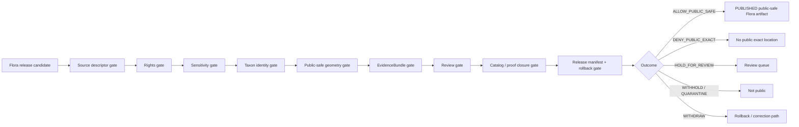

<!-- [KFM_META_BLOCK_V2]
doc_id: kfm://doc/NEEDS-VERIFICATION-ADR-flora-sensitive-location-policy
title: ADR: Flora Sensitive Location Policy
type: standard
version: v1
status: draft
owners: OWNER_TBD_NEEDS_VERIFICATION
created: 2026-05-08
updated: 2026-05-08
policy_label: POLICY_LABEL_TBD_NEEDS_VERIFICATION
related: [./README.md, ./ADR-TEMPLATE.md, ./ADR-0009-sensitive-location-policy.md, ./ADR-flora-schema-home.md, ./ADR-flora-source-roles.md, ./ADR-flora-public-layer-strategy.md, ../domains/flora/ARCHITECTURE.md, ../domains/flora/PUBLICATION_AND_POLICY.md, ../domains/flora/SOURCE_REGISTRY.md, ../domains/flora/DATA_MODEL.md, ../domains/flora/UI_AND_EVIDENCE_DRAWER.md, ../domains/flora/VERIFICATION_BACKLOG.md, ../../policy/bundles/sensitivity/README.md]
tags: [kfm, adr, flora, sensitive-location, rare-plants, geoprivacy, policy, publication, evidence, rollback]
notes: [Replaces a placeholder ADR with source-grounded decision language. doc_id, owners, policy label, enforcement maturity, numeric generalization thresholds, CODEOWNERS, CI gates, and steward roster remain NEEDS VERIFICATION.]
[/KFM_META_BLOCK_V2] -->

# ADR: Flora Sensitive Location Policy

Decision record for how KFM classifies, withholds, generalizes, reviews, releases, corrects, and rolls back Flora location knowledge when exact disclosure is not public-safe.

  
  
  
  
  
  

> [!IMPORTANT]
> This ADR is a **decision record**, not proof that every policy, schema, validator, source registry, workflow, release manifest, or runtime path is already enforced. Implementation enforcement remains `NEEDS VERIFICATION` until verified by current repository files, tests, workflows, receipts, proofs, release artifacts, or runtime evidence.

---

## Quick navigation

| Decision | Policy mechanics | Review and release |
|---|---|---|
| [Decision card](#decision-card) | [Sensitivity classes](#sensitivity-classes) | [Promotion gates](#promotion-gates) |
| [Context](#context) | [Public-safe geometry](#public-safe-geometry) | [Validation plan](#validation-plan) |
| [Scope](#scope) | [Reason and obligation codes](#reason-and-obligation-codes) | [Rollback and correction](#rollback-and-correction) |
| [Evidence basis](#evidence-basis) | [Runtime and UI behavior](#runtime-and-ui-behavior) | [Open verification](#open-verification) |
| [Options considered](#options-considered) | [Implementation impact](#implementation-impact) | [Review checklist](#review-checklist) |

---

## Decision card

| Field | Value |
|---|---|
| ADR ID | `ADR-flora-sensitive-location-policy` |
| Target path | `docs/adr/ADR-flora-sensitive-location-policy.md` |
| Status | `proposed` |
| Decision date | `2026-05-08` |
| Decision confidence | `CONFIRMED doctrine / PROPOSED policy decision / NEEDS VERIFICATION enforcement` |
| Scope | Flora domain governance, publication, public geometry, Evidence Drawer, Focus Mode, releases, rollback |
| Supersedes | Placeholder ADR content at this path |
| Related cross-domain ADR | [`ADR-0009-sensitive-location-policy.md`](./ADR-0009-sensitive-location-policy.md) |
| Related Flora ADRs | [`ADR-flora-schema-home.md`](./ADR-flora-schema-home.md), [`ADR-flora-source-roles.md`](./ADR-flora-source-roles.md), [`ADR-flora-public-layer-strategy.md`](./ADR-flora-public-layer-strategy.md) |
| Default public exact-location outcome | `DENY` for rare, protected, culturally sensitive, controlled-access, embargoed, unresolved, or steward-review-required Flora records |
| Allowed public forms | Withheld geometry, generalized geometry, aggregate-only geometry, delayed release, public-safe narrative, or explicitly reviewed exact geometry when all gates allow |
| Runtime outcomes | `ANSWER`, `ABSTAIN`, `DENY`, `ERROR` |
| Publication outcomes | `ALLOW_PUBLIC_SAFE`, `DENY_PUBLIC_EXACT`, `HOLD_FOR_REVIEW`, `WITHHOLD`, `QUARANTINE`, `WITHDRAW` |
| Rollback target | `ROLLBACK_TARGET_TBD_NEEDS_VERIFICATION` |

### One-sentence decision

KFM must deny public exact Flora locations by default whenever disclosure could expose rare, protected, culturally sensitive, controlled-access, embargoed, unresolved, or steward-review-required plant records; public release is allowed only through governed, evidence-backed, rights-compatible, sensitivity-classified, review-aware, public-safe representations with receipts, release manifests, correction paths, and rollback targets.

### Boundary rule

This ADR does **not** authorize public clients, MapLibre layers, exports, screenshots, graph/search/vector indexes, story nodes, AI context packs, Focus Mode, or Evidence Drawer payloads to read from `RAW`, `WORK`, `QUARANTINE`, restricted exact geometry, unpublished candidates, internal canonical stores, or direct model runtime output.

[Back to top](#top)

---

## Context

The Flora lane handles plant taxa, specimen and occurrence evidence, plant communities, habitat associations, invasive or rare-plant context, range and suitability surfaces, phenology or condition products, and public map/API/UI explanations.

That makes Flora both valuable and sensitive. A map-first system can accidentally make exactness feel like quality, but in biodiversity work exactness can be harmful. A precise point, small polygon, collection record, accession link, tile at high zoom, repeated observation pattern, source identifier, temporal clue, or map screenshot can reveal a protected plant location even when the payload does not explicitly say “latitude” and “longitude.”

KFM doctrine requires evidence-first publication, cite-or-abstain behavior, fail-closed policy defaults, auditable receipts, and rollback. Flora therefore needs a lane-specific decision that applies the cross-domain sensitive-location policy to rare plants, sensitive plant occurrences, institutional specimen records, steward-reviewed records, controlled-access records, and public-safe derived surfaces.

### Why this decision exists now

The Flora domain documents already point to this ADR as the place that settles exact-vs-public-safe geometry treatment. The existing file at this path was a placeholder. Leaving it unresolved creates avoidable drift across source descriptors, redaction receipts, public layers, Evidence Drawer payloads, Focus Mode answers, promotion gates, and review workflows.

[Back to top](#top)

---

## Scope

### This ADR governs

| Surface | Governed behavior |
|---|---|
| Flora source descriptors | Sensitivity posture, rights posture, source role, verification status, publication eligibility, and authority boundary must be visible before source activation. |
| Flora observations and specimens | Exact geometry may exist only in governed internal lifecycle states when authorized; public surfaces receive exact geometry only when every gate allows. |
| Rare, protected, and culturally sensitive plants | Public exact disclosure is denied by default and requires explicit rights, policy allowance, and steward/reviewer approval to override. |
| Derived Flora products | Range maps, suitability surfaces, generalized occurrence layers, and phenology/condition products must be labeled as derived and must not become observation truth. |
| Public map layers and exports | Public payloads must use public-safe geometry, field allowlists, release manifests, and no-leak validation. |
| Evidence Drawer | Must explain whether geometry is exact, generalized, withheld, aggregate-only, embargoed, or review-held without leaking restricted detail. |
| Focus Mode / governed AI | May summarize released public-safe evidence; must deny exact restricted location requests and abstain when evidence is insufficient. |
| Promotion and release | Requires rights, sensitivity, review, evidence closure, catalog closure, redaction receipts where applicable, release manifests, correction path, and rollback target. |

### This ADR does not govern

| Excluded item | Correct home |
|---|---|
| Machine-checkable schema definitions | `schemas/` or accepted schema home after `ADR-flora-schema-home.md` |
| Semantic contract prose | `contracts/` or accepted contract home |
| Executable policy rules | `policy/` or accepted policy bundle home |
| Real sensitive coordinates | Governed restricted data stores, not docs |
| Credentials, private access tokens, signed URLs, salts | Secret/runtime configuration, never public docs |
| Source-by-source legal interpretations | Source registry, rights profiles, review records, or steward/legal review |
| UI-only filtering as policy | Not sufficient; UI reflects policy but does not define it |
| Emergency, legal, or title advice | Official authorities or reviewed domain runbooks |
| Private chain-of-thought or direct model prompts | Governed AI envelopes, receipts, and public-safe summaries only |

[Back to top](#top)

---

## Evidence basis

| Evidence item | What it supports | Truth label |
|---|---|---|
| Existing `docs/adr/ADR-flora-sensitive-location-policy.md` placeholder | A decision placeholder exists at the target path and must be replaced before enforcement is claimed. | `CONFIRMED repo evidence` |
| `docs/adr/README.md` and `docs/adr/ADR-TEMPLATE.md` | ADRs must carry evidence basis, truth labels, validation, rollback, and supersession without implying implementation proof. | `CONFIRMED repo evidence` |
| `docs/adr/ADR-0009-sensitive-location-policy.md` | Cross-domain sensitive-location default-deny posture, release-support requirements, finite outcomes, transform receipts, validation gates, and rollback handling. | `CONFIRMED repo evidence / cross-domain policy doctrine` |
| `docs/domains/flora/ARCHITECTURE.md` | Flora object boundaries, lifecycle invariants, source-role discipline, fail-closed sensitivity defaults, redaction receipt need, and AI/renderer boundary. | `CONFIRMED repo evidence / Flora doctrine` |
| `docs/domains/flora/PUBLICATION_AND_POLICY.md` | Flora publication regime: source-role publication matrix, rights discipline, sensitivity classes, public-safe geometry rules, promotion gate, finite outcomes, receipts, proofs, and rollback. | `CONFIRMED repo evidence / Flora policy doctrine` |
| `docs/domains/flora/SOURCE_REGISTRY.md` | Source descriptor requirements, source-role vocabulary, rights/sensitivity coupling, publication eligibility, and candidate source verification ladder. | `CONFIRMED repo evidence / Flora source doctrine` |
| Attached Flora architecture blueprint | The ADR family and proposed homes for Flora docs, source registries, sensitivity policies, redaction receipts, validators, policies, fixtures, release manifests, and rollback artifacts. | `CONFIRMED supplied doctrine / PROPOSED implementation` |
| Directory Rules | This ADR belongs under `docs/adr/`; executable policy, schemas, tests, data lifecycle stores, receipts, proofs, and releases belong under their responsibility roots. | `CONFIRMED supplied directory doctrine` |
| Current local workspace scan | The local workspace was not a mounted KFM Git checkout; repository behavior must be verified through GitHub connector evidence or a future checkout. | `CONFIRMED current-session boundary` |

### Evidence limits

This ADR does not claim that the following are already enforced: source descriptors, sensitivity registries, redaction receipts, executable Rego bundles, schema fixtures, policy tests, promotion workflows, release manifests, signed proofs, runtime negative-path behavior, MapLibre no-leak checks, or Focus Mode denials. Those remain `NEEDS VERIFICATION`.

[Back to top](#top)

---

## Options considered

| Option | Description | Benefits | Risks / costs | Outcome |
|---|---|---|---|---|
| **A. Default-deny exact sensitive Flora locations; publish only governed public-safe forms** | Exact locations are internal/restricted by default for sensitive records; public release requires evidence, rights, sensitivity, review, transform receipts, release manifest, and rollback target. | Preserves KFM doctrine, protects rare plants and steward trust, supports public maps without leaking precision, gives reviewers clear gates. | Requires registries, validators, receipts, and review discipline before release. | **Accepted** |
| **B. Publish exact coordinates when upstream data is already public** | If a source exposes coordinates, KFM repeats them unless source terms prohibit it. | Simple, visually useful, less implementation work. | Public exposure elsewhere does not settle KFM rights, source role, sensitivity, or stewardship obligations; creates harmful precision and rollback risk. | Rejected |
| **C. Rely on UI hiding/filtering only** | Keep exact data in payloads and hide with MapLibre filters, style rules, or UI state. | Fast and convenient for front-end work. | Payloads, exports, screenshots, browser dev tools, search, and AI contexts can still leak; renderer becomes policy authority. | Rejected |
| **D. Use one numeric mask radius for all sensitive Flora** | All sensitive records are generalized by one global radius or grid. | Easy to test and document. | Plant sensitivity varies by taxon, source, context, rights, season, record density, and steward requirements; one radius can be unsafe or unnecessarily destructive. | Deferred; thresholds require steward-backed registry |
| **E. Deny all Flora occurrence publication** | Publish no occurrence-derived Flora locations at all. | Maximum safety. | Blocks legitimate public-safe county, watershed, grid, range, model, and narrative products. | Rejected |

[Back to top](#top)

---

## Decision

### Accepted operating rule

Flora location-bearing records must be assigned one public-release posture before any public or semi-public exposure:

1. `public_exact_allowed`
2. `public_generalized`
3. `aggregate_only`
4. `restricted_precise`
5. `embargoed`
6. `steward_review_required`
7. `controlled_access`
8. `quarantine`

Any record with unknown rights, unknown sensitivity, unknown source role, unresolved evidence, missing review, missing transform receipt, unresolved taxonomy where accepted identity is required, or missing rollback target is **not publishable**.

### Accepted public-release rule

Public release may proceed only when the requested outward surface is compatible with all of the following:

- source descriptor and `source_role`;
- rights profile and attribution obligations;
- sensitivity classification;
- public-safe geometry rule;
- `EvidenceRef -> EvidenceBundle` closure;
- required steward/domain review;
- redaction/generalization receipt when exact geometry is transformed or withheld;
- catalog/proof/release closure;
- correction and rollback path.

### Accepted deny rule

Public exact geometry is denied when a Flora record is rare, protected, culturally sensitive, controlled-access, embargoed, steward-review-required, unresolved, rights-unknown, source-role-unknown, or otherwise classified as unsafe for exact disclosure.

### Accepted threshold rule

This ADR does **not** hard-code final numeric distance thresholds. Public-safe thresholds must live in a reviewed sensitivity policy registry or executable policy bundle and must be validated with fixtures. Until that registry is accepted, release candidates use the stricter of:

- withholding exact geometry;
- county, watershed, ecoregion, or approved grid generalization;
- aggregate-only release above documented thresholds;
- delayed release/embargo;
- public-safe narrative with no reconstructable detail.

> [!CAUTION]
> A generalized point is not automatically safe. Validators must check indirect disclosure through attributes, source IDs, timestamps, high zoom levels, repeated releases, screenshots, export fields, search indexes, graph projections, vector indexes, and AI context packs.

[Back to top](#top)

---

## Sensitivity classes

| Class | Meaning | Public geometry posture | Minimum release support |
|---|---|---|---|
| `public_exact_allowed` | Non-sensitive; source terms and policy allow exact public geometry. | Exact may publish. | EvidenceBundle, source role, rights profile, uncertainty, release manifest. |
| `public_generalized` | Exact public geometry is not allowed, but generalized geometry can be public-safe. | Generalized only. | Redaction/generalization receipt, policy decision, review if required. |
| `aggregate_only` | Individual records or small groups are unsafe; only grouped products may publish. | Aggregate geometry only. | Aggregation rule, threshold test, no small-count leak, release manifest. |
| `restricted_precise` | Exact record is protected by taxon, source, steward, institution, or policy. | No public exact geometry. | Restricted internal handling; public-safe derivative only if approved. |
| `embargoed` | Release delayed by source terms, steward rule, monitoring context, or time window. | Withheld or delayed; public narrative only if safe. | Embargo rule, release-time check, rollback target. |
| `steward_review_required` | A qualified steward/domain reviewer must approve release posture. | Hold until review. | ReviewRecord matching the target release scope. |
| `controlled_access` | Source or record is access-controlled and may not be redistributed publicly. | Public deny unless explicit authorization exists. | Source terms, steward/legal approval, access-role controls. |
| `quarantine` | Rights, sensitivity, source role, taxonomy, geometry, evidence, or policy is unresolved. | Not public. | Resolution before any release. |

[Back to top](#top)

---

## Public-safe geometry

### Allowed public-safe forms

| Form | Use when | Required evidence |
|---|---|---|
| Withheld geometry | Any outward geometry would disclose too much. | Withholding reason, EvidenceBundle, policy decision. |
| County / watershed / ecoregion / approved-grid support | Coarser location is useful and safe. | Generalization receipt, policy version, public precision class. |
| Aggregate-only layer | Record-level release is unsafe but summary counts or density classes pass thresholds. | Aggregation receipt, threshold validation, no small-count leak. |
| Delayed release | Time-based risk can be reduced after embargo. | Embargo rule, release-time check, review state. |
| Public-safe narrative | Place context is useful but geometry is unsafe. | EvidenceBundle and a no-reconstruction text review. |
| Exact public geometry | Only for non-sensitive records with rights, review, evidence, and release support. | Full release support and no sensitivity blockers. |

### Redaction and generalization receipts

Every geoprivacy transform must emit or reference a receipt with at least:

| Receipt field | Purpose |
|---|---|
| `receipt_id` | Stable identity of the transform record. |
| `subject_ref` | Occurrence, specimen, batch, layer, or artifact being transformed. |
| `input_ref` / `input_digest` | Restricted input reference or digest; do not expose restricted coordinates publicly. |
| `output_ref` / `output_digest` | Public-safe output reference or digest. |
| `transform_class` | `withhold`, `generalize`, `aggregate`, `embargo`, `precision_bucket`, `narrative_only`, or accepted equivalent. |
| `transform_parameters_ref` | Safe reference to parameters; no public secret salts or restricted detail. |
| `reason_codes` | Why the transform happened. |
| `obligation_codes` | What must remain true for the release. |
| `policy_version` | Replayable policy basis. |
| `review_ref` | Required when steward/domain review applies. |
| `release_scope_ref` | Candidate release or release manifest supported. |
| `actor_or_run_ref` | Human actor or automated run receipt. |
| `rollback_ref` | Withdrawal or supersession path. |

> [!WARNING]
> Silent stripping is not a valid geoprivacy transform. If a coordinate, access path, source ID, or field is removed for safety, the transform must be recorded and reviewable.

[Back to top](#top)

---

## Reason and obligation codes

The final canonical registry path is `NEEDS VERIFICATION`. The following starter codes are accepted by this ADR as the minimum design vocabulary for policy fixtures and validators.

### Reason codes

| Code | Meaning |
|---|---|
| `rights.unknown` | Rights or redistribution posture is unresolved. |
| `rights.controlled_access` | Source terms or access conditions block public release. |
| `sensitivity.exact_location` | Requested output would expose unsafe precision. |
| `sensitivity.rare_protected_flora` | Rare, protected, or policy-sensitive Flora is involved. |
| `sensitivity.culturally_sensitive_flora` | Cultural, community, or steward-sensitive plant knowledge may be exposed. |
| `sensitivity.reverse_engineering_risk` | Public artifact can reconstruct restricted detail. |
| `sensitivity.small_count` | Aggregate is too small or unique for safe release. |
| `taxonomy.accepted_identity_required` | Accepted taxon identity is unresolved where required. |
| `source_role.unknown` | Source authority boundary is missing. |
| `source_role.mismatch` | Source role does not support requested claim. |
| `evidence.bundle_missing` | EvidenceRef cannot resolve to EvidenceBundle. |
| `review.steward_missing` | Required steward review is missing. |
| `redaction.receipt_missing` | Public-safe transform lacks receipt. |
| `release.rollback_missing` | Release has no rollback target. |
| `payload.internal_ref` | Public payload references internal or restricted material. |
| `payload.geometry_not_public_safe` | Public geometry is too precise or not validated. |
| `runtime.ai_exact_location_request` | Focus Mode or AI request asks for restricted exact detail. |

### Obligation codes

| Code | Required action |
|---|---|
| `obligation.withhold_geometry` | Do not expose geometry. |
| `obligation.generalize_geometry` | Replace exact geometry with approved public-safe support. |
| `obligation.aggregate_only` | Publish only grouped/thresholded output. |
| `obligation.apply_embargo` | Delay public release until embargo passes. |
| `obligation.require_steward_review` | Obtain matching review before release. |
| `obligation.attach_redaction_receipt` | Include transform receipt. |
| `obligation.attach_evidence_bundle` | Resolve and cite EvidenceBundle. |
| `obligation.attach_release_manifest` | Tie output to a governed release. |
| `obligation.attach_rollback_target` | Identify withdrawal/supersession path. |
| `obligation.show_public_safe_badge` | UI must visibly communicate generalized/withheld/restricted state. |

[Back to top](#top)

---

## Promotion gates

| Gate | Must prove | Failure outcome |
|---|---|---|
| Source descriptor | Source role, authority boundary, source ID, verification status, and publication cap exist. | `DENY` or `QUARANTINE` |
| Rights | License, terms, attribution, derivative posture, and redistribution posture are known. | `DENY` |
| Sensitivity | Record, source, dataset, and layer sensitivity are classified. | `DENY` |
| Taxon identity | Accepted identity exists where claim requires it; ambiguity is labeled. | `ABSTAIN`, `DENY`, or `QUARANTINE` |
| Public-safe geometry | Public payload contains no restricted exact geometry or reconstruction proxy. | `DENY_PUBLIC_EXACT` |
| EvidenceBundle | Every consequential claim resolves to released/supportable evidence. | `ABSTAIN` or `DENY` |
| Review | Required steward/domain review exists and scope matches release. | `HOLD_FOR_REVIEW` |
| Catalog / proof closure | STAC/DCAT/PROV, receipts, proofs, and runtime refs close where applicable. | `DENY` |
| Release + rollback | Release manifest lists artifacts, digests, policy decisions, correction path, and rollback target. | `DENY` |

[Back to top](#top)

---

## Runtime and UI behavior

### Runtime envelope behavior

| Request | Required outcome |
|---|---|
| “Where exactly is this rare/protected plant?” | `DENY` |
| “Give coordinates, access route, parcel, source record URL, or collection point for a restricted Flora record.” | `DENY` |
| “Why is this record generalized or withheld?” | `ANSWER` if public-safe explanation can cite policy/evidence without leaking detail. |
| “Show county-level public-safe Flora context.” | `ANSWER` if EvidenceBundle and policy support the requested precision. |
| “Is there evidence for this plant in this region?” | `ANSWER` or `ABSTAIN` depending on support and public-safe precision. |
| “Infer exact coordinates from this generalized map.” | `DENY` |
| Missing evidence, rights, source role, or sensitivity | `ABSTAIN` or `DENY` according to requested action. |
| Malformed request, schema error, policy engine failure | `ERROR` with safe fallback; no fluent guess. |

### Evidence Drawer behavior

The Evidence Drawer must show:

- public release posture;
- source role and rights posture;
- evidence support and EvidenceBundle reference;
- geometry precision class;
- whether geometry was exact, generalized, withheld, aggregate-only, or embargoed;
- redaction/generalization receipt reference where applicable;
- review state and reviewer scope where required;
- correction and rollback state.

The Evidence Drawer must not show:

- restricted exact coordinates;
- internal source IDs that reconstruct location;
- hidden geometry, centroids, bbox corners, route vertices, or high-precision tile references;
- unpublished candidate references;
- raw/work/quarantine links;
- direct model context.

### MapLibre and public layer behavior

MapLibre is downstream of trust. Style expressions, layer visibility, and front-end filters are not policy. A public Flora layer must already be public-safe before the renderer receives it.

Required UI state labels:

| Label | Meaning |
|---|---|
| `exact_public` | Exact geometry is allowed for this public record. |
| `generalized` | Geometry is public-safe generalized support. |
| `aggregate_only` | Only thresholded/grouped data is shown. |
| `withheld` | Geometry intentionally withheld. |
| `embargoed` | Public detail delayed by policy. |
| `review_required` | Release held for steward/domain review. |
| `restricted` | Exact details are restricted and not public. |
| `not_resolved` | Evidence or policy support is insufficient. |

[Back to top](#top)

---

## Implementation impact

> [!NOTE]
> Paths below are responsibility-root aligned. They are not all claimed as implemented by this ADR.

| Responsibility root | Candidate path | Status | Purpose |
|---|---|---:|---|
| ADR governance | `docs/adr/ADR-flora-sensitive-location-policy.md` | `CONFIRMED target` | This decision record. |
| ADR index | `docs/adr/README.md` | `NEEDS VERIFICATION update` | Add or update Flora ADR entry and status. |
| Flora policy doc | `docs/domains/flora/PUBLICATION_AND_POLICY.md` | `CONFIRMED related doc` | Human publication and sensitivity policy companion. |
| Flora source guide | `docs/domains/flora/SOURCE_REGISTRY.md` | `CONFIRMED related doc` | Source role, rights, sensitivity, and descriptor rules. |
| Flora data model | `docs/domains/flora/DATA_MODEL.md` | `CONFIRMED related doc` | Sensitivity classes and public-safe geometry object boundaries. |
| Policy bundle | `policy/flora/sensitivity.rego` | `PROPOSED / NEEDS VERIFICATION` | Executable Flora sensitivity decision logic. |
| Policy bundle | `policy/flora/rights.rego` | `PROPOSED / NEEDS VERIFICATION` | Rights and publication eligibility logic. |
| Policy bundle | `policy/flora/promotion.rego` | `PROPOSED / NEEDS VERIFICATION` | Promotion allow/deny/hold logic. |
| Registry | `data/registry/flora/sensitivity_policies.yaml` | `PROPOSED / NEEDS VERIFICATION` | Canonical thresholds, classes, reason codes, and obligations. |
| Registry | `data/registry/flora/rights_profiles.yaml` | `PROPOSED / NEEDS VERIFICATION` | Reusable rights and derivative-publication profiles. |
| Registry | `data/registry/flora/layer_registry.yaml` | `PROPOSED / NEEDS VERIFICATION` | Public layer eligibility and geometry precision. |
| Schema | `schemas/contracts/v1/domains/flora/flora_redaction_receipt.schema.json` | `PROPOSED / ADR-dependent` | Machine shape for geoprivacy receipts. |
| Schema | `schemas/contracts/v1/domains/flora/flora_decision_envelope.schema.json` | `PROPOSED / ADR-dependent` | Machine shape for finite outcomes if no shared envelope is reused. |
| Fixtures | `tests/fixtures/flora/policy/` | `PROPOSED / NEEDS VERIFICATION` | Allow/deny/abstain/error examples. |
| Validators | `tools/validators/flora/` | `PROPOSED / NEEDS VERIFICATION` | No-leak, receipt, layer, API, and catalog checks. |
| Receipts | `data/receipts/flora/` | `PROPOSED / NEEDS VERIFICATION` | Redaction/generalization and run receipts. |
| Proof/release | `data/proofs/flora/`, `data/published/flora/manifests/`, `release/` | `PROPOSED / NEEDS VERIFICATION` | Release-grade evidence, manifests, rollback targets. |

[Back to top](#top)

---

## Validation plan

### Required positive tests

| Test | Expected result |
|---|---|
| Non-sensitive Flora record with known rights and resolved EvidenceBundle requests exact public geometry. | `ALLOW_PUBLIC_SAFE` / runtime `ANSWER`. |
| Rare/protected record requests county-level generalized public context with receipt and review. | `ALLOW_PUBLIC_SAFE` / runtime `ANSWER`. |
| Controlled-access specimen metadata requests public-safe non-location summary with attribution. | `ANSWER` if source terms allow summary; otherwise `ABSTAIN` or `DENY`. |
| Derived range map is requested as range context, not occurrence proof. | `ANSWER` with `derived_model` label and model/evidence lineage. |
| Public layer payload contains only allowlisted fields and public-safe geometry. | Validator passes. |

### Required negative tests

| Test | Expected result |
|---|---|
| Rare/protected Flora exact point in public layer. | `DENY_PUBLIC_EXACT`. |
| `restricted_precise` record in Focus Mode exact-coordinate request. | `DENY`. |
| Unknown rights with publication requested. | `DENY` / `QUARANTINE`. |
| Unknown sensitivity with publication requested. | `DENY` / `QUARANTINE`. |
| Generalized geometry without redaction/generalization receipt. | `DENY`. |
| Public API payload references `RAW`, `WORK`, `QUARANTINE`, or restricted exact store. | `DENY`. |
| Derived model presented as observed occurrence. | `DENY` with `source_role.mismatch` or equivalent. |
| Evidence Drawer payload carries hidden exact coordinate field or source ID that reconstructs location. | `DENY`. |
| High-zoom tile, bbox, centroid, or screenshot leaks restricted detail. | `DENY`. |
| Missing rollback target on publish candidate. | `DENY`. |
| Unresolved EvidenceRef for a consequential claim. | `ABSTAIN` or `DENY`. |

### Review evidence needed to move from `proposed` to `accepted`

| Current gap | Evidence needed |
|---|---|
| Numeric thresholds | Steward-reviewed `sensitivity_policies.yaml` or equivalent registry with fixtures. |
| Policy enforcement | Executable policy bundle and tests. |
| Schema enforcement | Valid/invalid fixtures and schema validation reports. |
| Public-layer safety | Layer registry, field allowlist, tile/export no-leak tests. |
| Focus Mode denial | Runtime envelope fixtures showing `ANSWER`, `ABSTAIN`, `DENY`, `ERROR`. |
| Rollback readiness | Rollback card or release manifest fixture with withdrawal/correction path. |
| Ownership | Flora steward/reviewer assignment and CODEOWNERS or equivalent review path. |

[Back to top](#top)

---

## Rollback and correction

### Rollback rule

If a public Flora artifact leaks or may leak sensitive location detail, KFM must withdraw or supersede the public artifact without deleting evidence history. The release manifest, proof bundle, redaction receipt, policy decision, correction notice, and rollback card must remain auditable.

### Rollback triggers

| Trigger | Required action |
|---|---|
| Exact sensitive location appears in public API, map layer, export, screenshot, search, graph, vector index, story, or Focus response. | Withdraw public artifact, disable release alias, issue correction notice, preserve evidence, open incident review. |
| Redaction/generalization receipt missing or invalid. | Block or withdraw release; rebuild public-safe derivative with receipt. |
| Source rights change or are discovered incompatible. | Withdraw or reclassify affected outputs; update rights profile and release manifests. |
| Steward review is missing or scope-mismatched. | Hold or withdraw release; route to review. |
| Public-safe threshold found unsafe. | Supersede registry/policy; rebuild derivatives; record correction. |
| EvidenceBundle cannot resolve after publication. | Mark release stale or withdraw; rebuild evidence closure. |
| Policy engine or validator bug allowed release. | Deny-all fallback for affected path; rerun negative fixtures; issue correction. |

### Supersession rule

This ADR may be superseded only by a successor ADR that includes:

- current repo evidence;
- accepted steward/reviewer input;
- updated sensitivity thresholds or classes;
- migration plan for existing releases;
- fixture and validator changes;
- correction/rollback impact;
- updates to Flora policy docs, source registry, layer registry, and ADR index.

[Back to top](#top)

---

## Consequences

### Positive consequences

- Makes rare/protected/culturally sensitive Flora exact-location handling explicit.
- Keeps cross-domain sensitive-location policy and Flora-specific policy aligned.
- Prevents renderer, UI, story, search, graph, vector, and AI surfaces from becoming accidental leak paths.
- Preserves public usefulness through generalized, aggregate, delayed, and narrative outputs.
- Creates a reviewable path from source descriptor to EvidenceBundle, policy decision, release manifest, correction, and rollback.
- Gives future policy and validator authors a concrete negative-test catalog.

### Tradeoffs

| Tradeoff | Mitigation |
|---|---|
| Public maps may be less precise than internal evidence. | Explain public-safe geometry state in UI and Evidence Drawer. |
| Steward review and receipts slow release. | Treat review and receipts as release requirements, not optional polish. |
| Generalization thresholds are not final in this ADR. | Keep numeric thresholds in a reviewed registry and validate with fixtures. |
| More policy and fixture work is required before enforcement can be claimed. | Add small P0 tests before live source activation. |
| Some sources may remain controlled-only or quarantine. | Preserve internal evidence and publish public-safe summaries where possible. |

[Back to top](#top)

---

## Open verification

| Item | Status | Why it matters |
|---|---:|---|
| Flora steward and reviewer roster | `NEEDS VERIFICATION` | Required for review-held and sensitive releases. |
| ADR status transition from `proposed` to `accepted` | `NEEDS VERIFICATION` | This file is not governing until reviewed. |
| Policy label for this ADR | `NEEDS VERIFICATION` | Do not infer classification from public path alone. |
| Numeric generalization thresholds | `NEEDS VERIFICATION` | Needed before exact public-safe classes can be enforced. |
| Canonical sensitivity registry path | `NEEDS VERIFICATION` | `data/registry/flora/sensitivity_policies.yaml` is proposed until verified. |
| Schema home | `NEEDS VERIFICATION` | Depends on `ADR-flora-schema-home.md`. |
| Executable policy bundle | `UNKNOWN` | Enforcement cannot be claimed without policy code and tests. |
| Validator commands and CI workflow | `UNKNOWN` | Merge/promotion gates must be proven from repo evidence. |
| Release manifest and rollback card fixtures | `UNKNOWN` | Required before public release. |
| MapLibre public layer field allowlists | `NEEDS VERIFICATION` | Prevents payload and tile leakage. |
| Evidence Drawer no-leak fixtures | `NEEDS VERIFICATION` | Drawer can leak hidden fields if not tested. |
| Focus Mode denial fixtures | `NEEDS VERIFICATION` | AI must deny exact sensitive location requests. |
| Source-specific terms for KDWP, KANU/KSC, GBIF, iDigBio, iNaturalist, USFWS, NatureServe, USDA PLANTS, ITIS/WFO/POWO | `NEEDS VERIFICATION` | Source roles and rights govern what can publish. |
| ADR index entry | `NEEDS VERIFICATION` | `docs/adr/README.md` should list this ADR after review. |

[Back to top](#top)

---

## Review checklist

Pre-merge checklist

- [ ] Meta block values are reviewed; placeholders remain only where evidence is unavailable.
- [ ] ADR status is intentionally `proposed`.
- [ ] `docs/adr/README.md` is updated or a follow-up task is opened.
- [ ] Related Flora docs still link correctly from `docs/adr/`.
- [ ] This ADR does not claim policy, schema, validator, CI, release, or runtime enforcement without evidence.
- [ ] Cross-domain sensitive-location policy alignment is preserved.
- [ ] Source role, rights, sensitivity, evidence, review, release, correction, and rollback gates are all represented.
- [ ] Public exact sensitive Flora locations default to `DENY`.
- [ ] Public-safe generalized/aggregate/withheld forms require receipts and release support.
- [ ] Negative tests include exact rare/protected Flora leakage, unknown rights, missing sensitivity, missing receipt, internal refs, and Focus Mode exact-location requests.
- [ ] AI/Focus behavior remains evidence-subordinate and finite-outcome.
- [ ] MapLibre/style/UI behavior is downstream of governed release, not policy authority.
- [ ] No raw, work, quarantine, restricted exact, unpublished candidate, or direct model runtime path is exposed.
- [ ] Rollback triggers and correction behavior are visible.
- [ ] Remaining threshold/steward/schema/CI/source-rights gaps are marked `NEEDS VERIFICATION`.

[Back to top](#top)

---

## Related documents

- [`./README.md`](./README.md) — ADR index and review discipline.
- [`./ADR-TEMPLATE.md`](./ADR-TEMPLATE.md) — ADR authoring and validation structure.
- [`./ADR-0009-sensitive-location-policy.md`](./ADR-0009-sensitive-location-policy.md) — cross-domain sensitive-location policy.
- [`./ADR-flora-schema-home.md`](./ADR-flora-schema-home.md) — Flora schema-home decision.
- [`./ADR-flora-source-roles.md`](./ADR-flora-source-roles.md) — Flora source-role decision.
- [`./ADR-flora-public-layer-strategy.md`](./ADR-flora-public-layer-strategy.md) — Flora public layer strategy.
- [`../domains/flora/ARCHITECTURE.md`](../domains/flora/ARCHITECTURE.md) — Flora architecture.
- [`../domains/flora/PUBLICATION_AND_POLICY.md`](../domains/flora/PUBLICATION_AND_POLICY.md) — Flora publication and policy.
- [`../domains/flora/SOURCE_REGISTRY.md`](../domains/flora/SOURCE_REGISTRY.md) — Flora source registry guide.
- [`../domains/flora/DATA_MODEL.md`](../domains/flora/DATA_MODEL.md) — Flora object families and lifecycle fields.
- [`../domains/flora/UI_AND_EVIDENCE_DRAWER.md`](../domains/flora/UI_AND_EVIDENCE_DRAWER.md) — Flora UI trust payloads.
- [`../domains/flora/VERIFICATION_BACKLOG.md`](../domains/flora/VERIFICATION_BACKLOG.md) — Flora verification backlog.
