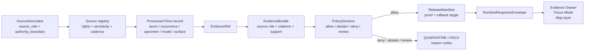

<!-- [KFM_META_BLOCK_V2]
doc_id: kfm://doc/NEEDS-VERIFICATION-ADR-flora-source-roles
title: ADR: Flora Source Roles and Authority Boundaries
type: standard
version: v1
status: draft
owners: OWNER_TBD_NEEDS_VERIFICATION
created: 2026-05-08
updated: 2026-05-08
policy_label: NEEDS_VERIFICATION_public-doc-no-sensitive-source-data
related: [./README.md, ./ADR-0001-schema-home.md, ../domains/flora/README.md, ../domains/flora/SOURCE_REGISTRY.md, ../domains/flora/DATA_MODEL.md, ../domains/flora/PUBLICATION_AND_POLICY.md, ../domains/flora/CURRENT_STATE.md, ../../contracts/source/kansas_flora/README.md, ../../policy/crosswalk/source-role-to-claim-policy.md]
tags: [kfm, adr, flora, source-role, source-authority, evidence, policy, publication, geoprivacy]
notes: [Replaces the placeholder ADR for flora source roles with reviewable decision language. Target path is confirmed through repository connector evidence, but local checkout, owners, CODEOWNERS, CI enforcement, runtime propagation, and release evidence remain NEEDS VERIFICATION. This ADR governs role vocabulary and authority boundaries only; schema home, sensitive-location thresholds, source activation, and public-layer strategy remain separate decisions.]
[/KFM_META_BLOCK_V2] -->

# ADR: Flora Source Roles and Authority Boundaries

Decision record for locking the Flora lane’s source-role vocabulary, authority boundaries, claim limits, fail-closed behavior, and validation burden.

  
  
  
  
  
  

  <a href="#adr-header">Header</a> ·
  <a href="#decision-summary">Decision</a> ·
  <a href="#context-and-problem">Context</a> ·
  <a href="#evidence-basis">Evidence</a> ·
  <a href="#source-role-vocabulary">Roles</a> ·
  <a href="#claim-admissibility">Claims</a> ·
  <a href="#impact-map">Impact</a> ·
  <a href="#validation-plan">Validation</a> ·
  <a href="#rollback-and-supersession">Rollback</a> ·
  <a href="#open-verification">Open verification</a>

> [!IMPORTANT]
> This ADR is **not implementation proof**. It replaces a placeholder decision record with a proposed Flora source-role decision. Enforcement remains `NEEDS VERIFICATION` until registry records, schemas, policy gates, fixtures, validators, workflow runs, runtime envelopes, Evidence Drawer payloads, and release objects are inspected in the active repository.

---

## ADR header

| Field | Value |
|---|---|
| ADR ID | `ADR-flora-source-roles` |
| Title | Flora Source Roles and Authority Boundaries |
| Status | `proposed` |
| Decision date | `2026-05-08` |
| Owners | `OWNER_TBD_NEEDS_VERIFICATION` |
| Reviewers | `REVIEWER_TBD_NEEDS_VERIFICATION` |
| Policy label | `NEEDS_VERIFICATION_public-doc-no-sensitive-source-data` |
| Scope | Flora domain governance; source authority; source descriptors; policy/publication gates |
| Target path | `docs/adr/ADR-flora-source-roles.md` |
| Supersedes | Placeholder content in this file |
| Superseded by | `none` |
| Related ADRs | [`ADR-0001-schema-home.md`](./ADR-0001-schema-home.md); `ADR-flora-sensitive-location-policy.md` `NEEDS VERIFICATION`; `ADR-flora-public-layer-strategy.md` `NEEDS VERIFICATION` |
| Decision confidence | `PROPOSED` decision; adjacent Flora documentation is `CONFIRMED` by repository connector evidence; runtime enforcement is `UNKNOWN` |
| Rollback target | Prior placeholder file content plus a successor ADR or revert PR if this decision is not accepted |

[Back to top](#top)

---

## Decision summary

This ADR proposes that the Flora lane use a fixed source-role vocabulary for all source descriptors, processed records, EvidenceBundles, API envelopes, Evidence Drawer payloads, Focus Mode context, layer descriptors, policy decisions, and release candidates.

### Proposed decision

The Flora lane recognizes exactly these source roles unless a successor ADR extends or replaces the vocabulary:

1. `official`
2. `institutional`
3. `steward_reviewed`
4. `corroborative`
5. `community_observation`
6. `controlled_access`
7. `derived_model`
8. `generalized_public_surface`

Each admitted Flora `SourceDescriptor` must declare **one primary `source_role`** and an explicit `authority_boundary`. When one provider exposes materially different surfaces — for example, a public checklist, a controlled steward-review dataset, and a derived model product — KFM should model them as separate descriptor records or separately reviewable descriptor versions rather than flattening them into one vague source.

### One-line operating rule

> A source role says what a Flora source is allowed to support; it does not make the source true, public, precise, current, legal, or release-approved by itself.

### One-line boundary rule

> If source role, authority boundary, rights, sensitivity, evidence closure, review state, or release state is unknown, KFM must `ABSTAIN`, `DENY`, or hold the material in `QUARANTINE` rather than publishing or answering with false confidence.

[Back to top](#top)

---

## Context and problem

The existing ADR file was a backlog placeholder. Meanwhile, the Flora domain documentation, source registry guide, source contracts, data model, and publication policy already depend on a stable source-role vocabulary.

Without this decision, source role can drift into “source vibes”:

- an aggregator can be treated as a legal authority;
- a model can be rendered as an observation;
- a community record can be shown as steward-reviewed;
- a controlled-access dataset can leak through public map or Focus payloads;
- a generalized public layer can be mistaken for internal precise evidence;
- a public checklist can be used as exact occurrence support.

KFM’s public unit of value is the **inspectable claim**, not the map layer, tile, source name, AI answer, or schema file alone. A Flora claim must preserve source role, evidence, spatial support, temporal support, policy posture, review state, release state, and correction lineage.

[Back to top](#top)

---

## Evidence basis

| Evidence item | Status | What it supports | Limit |
|---|---:|---|---|
| Existing `docs/adr/ADR-flora-source-roles.md` | `CONFIRMED` | Target path exists and currently contains only placeholder ADR language. | Does not settle the decision. |
| `docs/adr/README.md` | `CONFIRMED` | ADRs are the human-facing decision ledger for KFM decisions affecting source authority, evidence flow, schemas, policies, release, rollback, UI, and AI. | Does not prove this ADR is accepted. |
| `docs/adr/ADR-TEMPLATE.md` | `CONFIRMED` | ADRs should preserve evidence, impact, validation, rollback, and supersession rather than implying implementation. | Template does not enforce behavior. |
| `docs/domains/flora/SOURCE_REGISTRY.md` | `CONFIRMED` | Defines the eight Flora source roles, required descriptor fields, verification ladder, sensitivity/rights coupling, and role-collapse failure modes. | Registry YAML implementation and CI enforcement remain `NEEDS VERIFICATION`. |
| `docs/domains/flora/ARCHITECTURE.md` | `CONFIRMED` | States Flora claims must reconstruct through source descriptors, EvidenceRefs, EvidenceBundles, policy, review, catalog, and correction lineage. | Implementation depth remains `UNKNOWN`. |
| `docs/domains/flora/DATA_MODEL.md` | `CONFIRMED` | Separates observed, specimen, community, modeled, generalized, and governance object families; repeats source-role discipline. | Schema-home placement remains unresolved. |
| `docs/domains/flora/PUBLICATION_AND_POLICY.md` | `CONFIRMED` | Establishes source-role publication matrix, rights discipline, sensitivity/geoprivacy rules, finite outcomes, receipts/proofs, and pre-publish checklist. | Policy-as-code enforcement remains `NEEDS VERIFICATION`. |
| `contracts/source/kansas_flora/README.md` | `CONFIRMED` | Source contracts define admission posture and state source role as a required descriptor field. | It is semantic contract guidance, not proof of source activation. |
| `contracts/source/kansas_flora/usda_plants.md` | `CONFIRMED` | Shows an applied source-boundary pattern: USDA PLANTS may support PLANTS-specific taxon/distribution context but not exact occurrence, legal status, image rights, or rare-location release. | Source endpoint/cadence/activation remain `NEEDS VERIFICATION`. |
| `policy/crosswalk/source-role-to-claim-policy.md` | `CONFIRMED` | Cross-domain policy framing treats source role as an admissibility constraint and routes claims through finite outcomes. | Cross-domain normalized roles do not replace Flora’s domain vocabulary. |
| `docs/domains/flora/CURRENT_STATE.md` | `CONFIRMED` | Current-state ledger confirms Flora docs/source-contract/schema/policy/tool surfaces are visible, while tests, workflows, runtime/API/UI integration, and public release remain `UNKNOWN`. | Does not prove passing CI or public publication. |
| `docs/adr/ADR-0001-schema-home.md` | `CONFIRMED` | Schema-home ADR is still `proposed`; `contracts/` means, `schemas/contracts/v1/` validates shape, `policy/` decides admissibility. | This ADR does not settle schema-home authority. |

[Back to top](#top)

---

## Requirements and invariants

| KFM invariant | Flora source-role consequence |
|---|---|
| `RAW -> WORK / QUARANTINE -> PROCESSED -> CATALOG / TRIPLET -> PUBLISHED` | Source role must be declared before a source is admitted and must survive lifecycle transitions. |
| Public clients use governed interfaces | Public UI, Focus Mode, map popups, exports, and APIs must not infer source authority from raw source paths or tile attributes. |
| `EvidenceRef` resolves to `EvidenceBundle` | A role-bearing claim still needs resolved evidence before it can answer or publish. |
| Promotion is a governed state transition | A source descriptor or successful ingest is not publication. |
| Policy fail-closed defaults | Unknown role, unknown rights, unknown sensitivity, and role/claim mismatch block public use. |
| Derived surfaces stay derived | `derived_model` and `generalized_public_surface` must not become observation truth. |
| Sensitive detail defaults to denial | Rare/protected/culturally sensitive Flora locations require explicit policy, review, transform receipt, and release state before public exposure. |
| AI is interpretive only | Focus Mode may summarize only released, policy-safe evidence with source role visible. |

[Back to top](#top)

---

## Source-role vocabulary

| Source role | Authority boundary | May support | Must not support | Publication default |
|---|---|---|---|---|
| `official` | Government, agency, or legally responsible source within its declared jurisdiction or data product boundary. | Official status, regulatory context, agency-stated distribution, official source-stated facts. | Exact occurrence unless the source directly provides occurrence evidence; claims outside its authority; automatic rare-location release. | Publish only after rights, sensitivity, review, evidence, catalog, and release gates pass. |
| `institutional` | Museum, herbarium, university, research institute, or agency-managed collection. | Specimen, collection, accession, herbarium, research dataset, and institution-stated facts. | Legal status unless the institution is also the legal authority; unrestricted exact geometry by default. | Public-safe metadata first; exact geometry depends on rights, geoprivacy, sensitivity, and review. |
| `steward_reviewed` | Curated by a qualified Flora steward, heritage program, domain reviewer, or authorized review process. | Review decisions, steward-reviewed corrections, controlled internal use, release approval inputs. | Automatic public exact-location release; replacing source evidence. | Public only with explicit release decision and matching review scope. |
| `corroborative` | Support source that can strengthen, compare, or contextualize evidence but is not controlling authority. | Corroboration, context, alternate name/use clues, presence support with limitations. | Overriding official, institutional, or steward-reviewed evidence; legal/status certainty. | Usually aggregate, generalize, or cite as supporting context. |
| `community_observation` | Public or contributor-submitted observation source with review, quality, and license labels. | Contributor-reported observation when quality, license, sensitivity, and review state are visible. | False precision, legal status, official presence, unrestricted sensitive records. | Publish only when license and sensitivity allow; otherwise hold, generalize, or abstain. |
| `controlled_access` | Source governed by restricted terms, steward permission, embargo, license, access control, or controlled data-sharing rules. | Internal review, restricted workflows, controlled evidence, steward-authorized decisions. | Public exact publication or public Focus/context disclosure unless authorization is explicit. | Public exact use is `DENY` by default. |
| `derived_model` | Model, interpolation, index, suitability surface, range estimate, remote-sensing product, classification, or generalized analytical output. | Modeled or derived analysis, context, suitability, range, index, condition, or trend with method and uncertainty. | Observation truth, legal status, confirmed occurrence, or source-native fact. | Publish only with method/model card, uncertainty, lineage, and evidence limitations. |
| `generalized_public_surface` | Public-safe derivative created from internal or higher-precision evidence through redaction, generalization, aggregation, or withholding. | Public map layer, public-safe summary, story/export layer, tile surface, generalized occurrence support. | Reconstructing protected exact records; replacing the internal evidence or transform receipt. | Publishable only when transform lineage, rights, sensitivity, review, release, and rollback pass. |

> [!WARNING]
> **Role collapse is a quarantine condition.** A `community_observation` presented as `official`, a `derived_model` presented as observed truth, or a `controlled_access` source exposed as public exact geometry should fail closed with visible reason codes.

[Back to top](#top)

---

## Role propagation flow

[Back to top](#top)

---

## Role assignment rules

1. **Exactly one primary role per descriptor.** A single descriptor may not hide materially different authority boundaries behind one label.
2. **Split mixed provider surfaces.** If one organization provides both public checklist data and controlled review records, model them as separate descriptors or separately versioned records.
3. **Authority boundary is required.** Every descriptor must state what the source can support and what it cannot support.
4. **Role travels outward.** Source role must appear or resolve through processed records, EvidenceBundles, policy inputs, API envelopes, Evidence Drawer payloads, Focus Mode context, and layer descriptors.
5. **Role is not enough.** Role does not override rights, sensitivity, review, release, freshness, temporal support, spatial support, or evidence closure.
6. **Unknown role blocks use.** Missing, unknown, free-text, or unmapped roles block source activation for public candidates.
7. **Role changes are versioned.** Changing a descriptor’s role is a governance change and requires review, migration notes, and affected-artifact assessment.
8. **New roles require a successor decision.** Do not add a role inline in `sources.yaml`, a source contract, policy file, or runtime branch without updating this ADR or a successor ADR.

[Back to top](#top)

---

## Claim admissibility

| Claim attempted | Source roles that may support it | Roles that are insufficient by themselves | Default negative outcome |
|---|---|---|---|
| Official or regulatory Flora status | `official`, sometimes `steward_reviewed` when the review scope explicitly covers status | `corroborative`, `community_observation`, `derived_model`, `generalized_public_surface` | `ABSTAIN` or `DENY` depending on public consequence |
| Specimen or collection fact | `institutional`, `steward_reviewed` when review covers the specimen | `official` unless it is the collection authority; `derived_model` | `ABSTAIN` |
| Contributor-reported observation | `community_observation` with quality/license/review fields | `derived_model`, `generalized_public_surface` | `ABSTAIN` until quality, rights, and sensitivity are resolved |
| Internal controlled evidence | `controlled_access`, `steward_reviewed` | Any public-facing role by itself | `DENY` for public exact exposure |
| Modeled suitability, range, index, or trend | `derived_model` | `official` or `institutional` unless the product itself is modeled and declared | `ABSTAIN` if method/version/support missing |
| Public-safe generalized Flora layer | `generalized_public_surface` backed by transform receipt and release manifest | Raw `occurrence`, `controlled_access`, `derived_model` without redaction/release closure | `DENY` |
| Exact sensitive rare-plant location | Only with explicit rights, policy allowance, steward review, purpose, audience, and release state | All roles by default | `DENY` |
| Focus Mode answer | Any role may participate only through released, policy-safe EvidenceBundles | Any unresolved or unpublished source context | `ABSTAIN`, `DENY`, or `ERROR` |

### Safe outward wording

| Evidence posture | Prefer wording like | Avoid wording like |
|---|---|---|
| `official` source row | “The source states…” or “The agency-designated record indicates…” | “This field observation proves…” |
| `institutional` specimen | “The institutional record documents…” | “KFM confirms current population…” |
| `community_observation` | “A contributor-reported observation records…” | “This is verified official presence…” |
| `derived_model` | “The model estimates…” | “This occurred here…” |
| `generalized_public_surface` | “The public-safe layer generalizes reviewed evidence…” | “These are the exact locations…” |
| `controlled_access` | “Restricted evidence exists for internal review…” where disclosure is allowed | Any public exact detail |

[Back to top](#top)

---

## Options considered

| Option | Description | Decision | Reason |
|---|---|---:|---|
| Fixed Flora vocabulary with one primary role per descriptor | Adopt the eight roles in this ADR, require authority boundary, and route all role changes through review. | **Selected** | Matches current Flora docs and gives policy/tests a stable target. |
| Free-text roles | Let each source contract name its own role. | Rejected | Creates untestable source vibes and policy drift. |
| Provider-name trust | Treat provider identity as authority. | Rejected | One provider can expose public, controlled, official, institutional, and derived surfaces. |
| Cross-domain normalized roles only | Use only the generic crosswalk roles such as `statutory_administrative` and `modeled_assimilated_derived`. | Deferred | Useful for policy mapping, but Flora docs already carry domain-specific vocabulary that should remain visible. |
| One descriptor with multiple roles | Permit several roles in one descriptor. | Rejected for default case | Hides different rights, sensitivity, public eligibility, and claim boundaries. Split descriptors instead. |

[Back to top](#top)

---

## Impact map

| Area | Expected update | Status |
|---|---|---:|
| `docs/adr/ADR-flora-source-roles.md` | Replace placeholder with this ADR. | `PROPOSED` |
| `docs/domains/flora/SOURCE_REGISTRY.md` | Link this ADR as the vocabulary authority and keep role definitions synchronized. | `NEEDS VERIFICATION` after commit |
| `docs/domains/flora/DATA_MODEL.md` | Keep source-role propagation and object-family separation aligned with this ADR. | `NEEDS VERIFICATION` |
| `docs/domains/flora/PUBLICATION_AND_POLICY.md` | Align source-role publication matrix, reason codes, and pre-publish checklist. | `NEEDS VERIFICATION` |
| `contracts/source/kansas_flora/` | Ensure source contracts assign one primary role and state unsupported claims. | `NEEDS VERIFICATION` |
| `data/registry/flora/source_roles.yaml` | Machine-readable vocabulary and definitions. | `PROPOSED / NEEDS VERIFICATION` |
| `data/registry/flora/sources.yaml` | Every source descriptor declares exactly one role and an authority boundary. | `PROPOSED / NEEDS VERIFICATION` |
| `schemas/` | SourceDescriptor schema should require role and authority-boundary fields in the accepted schema home. | `NEEDS VERIFICATION` |
| `policy/flora/` | Policy gates deny or abstain on missing role, unknown role, role/claim mismatch, controlled public exact exposure, and model-as-observation. | `NEEDS VERIFICATION` |
| `tests/fixtures/flora/` | Add valid role fixtures and invalid role-collapse fixtures. | `UNKNOWN` |
| `apps/` / runtime API | Runtime envelopes surface role and role limits. | `UNKNOWN` |
| UI / Evidence Drawer / Focus Mode | Drawer and Focus payloads expose role, claim type, limits, policy state, and negative outcomes. | `UNKNOWN` |
| Release/proof artifacts | Release manifests and proof packs preserve source-role evidence. | `UNKNOWN` |

[Back to top](#top)

---

## Validation plan

Before this ADR can be marked `accepted`, reviewers should expect evidence for the checks below.

| Check | Expected evidence | Status |
|---|---|---:|
| Role registry exists | `data/registry/flora/source_roles.yaml` or accepted equivalent validates against a schema. | `NEEDS VERIFICATION` |
| Source descriptors require source role | SourceDescriptor schema or profile requires `source_role` and `authority_boundary`. | `NEEDS VERIFICATION` |
| One-primary-role behavior is enforced | Invalid fixture with multiple primary roles fails or is explicitly split. | `NEEDS VERIFICATION` |
| Unknown role fails closed | Invalid fixture with `source_role: trusted` or missing role returns deny/hold behavior. | `NEEDS VERIFICATION` |
| Role-collapse tests exist | Fixtures cover `community_observation` as `official`, `derived_model` as observed occurrence, and `controlled_access` as public exact. | `NEEDS VERIFICATION` |
| Rights and sensitivity are coupled | Unknown rights or sensitive exact public geometry blocks publication even when role is otherwise strong. | `NEEDS VERIFICATION` |
| Evidence closure includes role | EvidenceBundle or equivalent support object carries role or resolves to it. | `NEEDS VERIFICATION` |
| API and UI payloads expose role | RuntimeResponseEnvelope, Evidence Drawer, Focus Mode, and LayerManifest fixtures show role, limits, and reason codes. | `UNKNOWN` |
| Policy emits stable reason codes | Deny/abstain outputs include machine-readable reason codes suitable for UI and audit. | `NEEDS VERIFICATION` |
| CI or review gate runs checks | Workflow run, local validator output, or review receipt proves enforcement. | `UNKNOWN` |

### Required negative fixtures

At minimum, add or verify fixtures for:

- `missing_source_role`
- `unknown_source_role`
- `missing_authority_boundary`
- `community_observation_claims_official_status`
- `derived_model_claims_observed_occurrence`
- `controlled_access_public_exact_geometry`
- `official_source_claims_outside_authority_boundary`
- `generalized_public_surface_missing_redaction_receipt`
- `source_role_changed_without_descriptor_version`

[Back to top](#top)

---

## Rollback and supersession

If this ADR is rejected or superseded:

1. Preserve this file as lineage; do not delete decision history.
2. Add a successor ADR that explains the replacement vocabulary or role-assignment model.
3. Update the Flora source registry guide, source contracts, data model, publication policy, and current-state ledger.
4. Revert or migrate `source_roles.yaml`, `sources.yaml`, schema constraints, policy rules, fixtures, validators, runtime payloads, and layer descriptors affected by the change.
5. Preserve receipts, proofs, release manifests, correction notices, and rollback cards for any artifacts already emitted under this role vocabulary.
6. For public artifacts affected by role reassignment, issue a correction or withdrawal notice rather than silently rewriting published state.

> [!CAUTION]
> Role changes can change claim meaning. Treat them as governance migrations, not clerical edits.

[Back to top](#top)

---

## Consequences

### Positive consequences

- Keeps Flora source authority visible and testable.
- Prevents provider reputation from silently substituting for claim support.
- Gives policy, Evidence Drawer, Focus Mode, and release review stable role labels.
- Makes role/claim mismatches auditable with reason codes.
- Supports public-safe derivatives without weakening internal evidence protection.
- Creates a clear path for controlled-access and steward-reviewed material.

### Tradeoffs

| Tradeoff | Mitigation |
|---|---|
| Some providers need multiple descriptors. | Split by authority boundary, access posture, rights, sensitivity, and claim class. |
| Role vocabulary must be maintained. | Require successor ADRs and registry/schema/policy/fixture updates for new roles. |
| More negative fixtures are required. | Treat negative fixtures as part of the trust spine, not optional QA. |
| Source activation becomes slower. | No-network fixtures and explicit verification ladders keep activation reviewable and reversible. |

[Back to top](#top)

---

## Open verification

| Item | Status | Why it matters |
|---|---:|---|
| Owner / CODEOWNERS for this ADR | `NEEDS VERIFICATION` | Acceptance requires accountable review. |
| Final policy label | `NEEDS VERIFICATION` | This ADR is public-safe, but label must match repo governance. |
| `data/registry/flora/source_roles.yaml` existence and shape | `NEEDS VERIFICATION` | This is the expected machine vocabulary home. |
| `data/registry/flora/sources.yaml` existence and descriptor status | `NEEDS VERIFICATION` | Needed to enforce one primary role per source. |
| Schema-home decision for source descriptors | `NEEDS VERIFICATION` | `ADR-0001-schema-home.md` remains proposed. |
| Flora policy-as-code enforcement | `UNKNOWN` | Rego/policy files may exist without CI or runtime enforcement. |
| Flora tests and fixtures | `UNKNOWN` | Current evidence does not prove role fixtures exist or pass. |
| Runtime propagation | `UNKNOWN` | API, Evidence Drawer, Focus Mode, and layer payloads must be inspected. |
| Public release artifacts | `UNKNOWN` | No release manifest/proof pack/public artifact is confirmed here. |
| Source-specific rights/current endpoint checks | `NEEDS VERIFICATION` | Live source activation must re-check current terms, access paths, licenses, and cadence. |
| Domain-local ADR placement | `CONFLICTED / NEEDS VERIFICATION` | Some Flora docs reference domain-local ADR paths while this repo target lives under `docs/adr/`. Do not create parallel ADR homes without a migration note. |

[Back to top](#top)

---

## Review checklist

Pre-acceptance checklist

- [ ] ADR owner and reviewers are verified.
- [ ] Policy label is verified.
- [ ] Role vocabulary is represented in the machine registry or accepted equivalent.
- [ ] SourceDescriptor schema/profile requires `source_role` and `authority_boundary`.
- [ ] Every admitted Flora source descriptor declares one primary role.
- [ ] Mixed provider surfaces are split or explicitly versioned.
- [ ] Invalid role and role-collapse fixtures fail.
- [ ] Rights and sensitivity policy can override otherwise strong source roles.
- [ ] `derived_model` cannot support observed occurrence claims without explicit observed evidence.
- [ ] `community_observation` cannot support official/legal status claims by itself.
- [ ] `controlled_access` cannot publish exact public geometry without explicit authorization and release.
- [ ] `generalized_public_surface` requires transform/redaction/generalization lineage.
- [ ] EvidenceBundle or equivalent runtime support preserves source role.
- [ ] Evidence Drawer and Focus Mode fixtures expose source role, limits, and negative outcomes.
- [ ] Release candidate checks preserve role, policy, review, proof, correction, and rollback references.
- [ ] This ADR is linked from the Flora source registry guide and ADR index.
- [ ] Any successor or conflicting ADR path is documented rather than silently duplicated.

[Back to top](#top)
