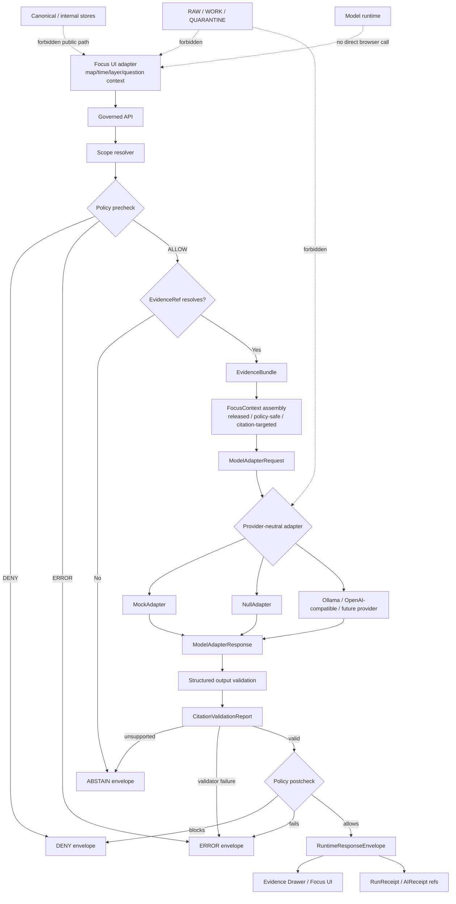

<!-- [KFM_META_BLOCK_V2]
doc_id: kfm://doc/NEEDS-VERIFICATION-ADR-focus-mode-adapter-boundary
title: ADR: Focus Mode Adapter Boundary
type: standard
version: v1
status: draft
owners: OWNER_TBD_NEEDS_VERIFICATION
created: 2026-05-08
updated: 2026-05-08
policy_label: NEEDS_VERIFICATION
related: [./README.md, ./ADR-TEMPLATE.md, ./ADR-ai-provider-adapter.md, ./ADR-0207-governed-ai-runtime-envelope.md, ./ADR-evidence-drawer-contract.md, ./ADR-ai-no-chain-of-thought-storage.md, ../architecture/governed-ai/README.md, ../architecture/map-shell.md, ../domains/ecology/FOCUS_MODE.md, ../../contracts/runtime/README.md, ../../policy/crosswalk/runtime-outcome-map.md]
tags: [kfm, adr, focus-mode, governed-ai, adapter-boundary, runtime-envelope, evidencebundle, evidence-drawer, model-adapter, citation-validation]
notes: [Replaces placeholder text at docs/adr/ADR-focus-mode-adapter-boundary.md. Target path was verified through the accessible GitHub repository. Owners, policy label, CODEOWNERS routing, global Focus Mode contract, adapter implementation, route wiring, schema-home enforcement, CI runs, receipt emission, and production runtime behavior remain NEEDS VERIFICATION.]
[/KFM_META_BLOCK_V2] -->

<a id="top"></a>

# ADR: Focus Mode Adapter Boundary

Decision record for keeping Focus Mode inside the governed API trust membrane and separating UI orchestration, evidence resolution, model adapters, citation validation, runtime envelopes, and receipts.

<p align="center">
  
  
  
  
  
  
</p>

<p align="center">
  <a href="#decision-summary">Decision</a> ·
  <a href="#context">Context</a> ·
  <a href="#evidence-basis">Evidence</a> ·
  <a href="#requirements-and-constraints">Constraints</a> ·
  <a href="#boundary-decision">Boundary</a> ·
  <a href="#runtime-flow">Flow</a> ·
  <a href="#contract-surface">Contracts</a> ·
  <a href="#validation-plan">Validation</a> ·
  <a href="#rollback-and-supersession">Rollback</a> ·
  <a href="#open-verification">Open verification</a>
</p>

> [!IMPORTANT]
> **ADR status:** `proposed`  
> **Document status:** `draft`  
> **Target path:** `docs/adr/ADR-focus-mode-adapter-boundary.md`  
> **Core rule:** Focus Mode may help users synthesize and navigate evidence, but every consequential Focus answer must cross the governed API, resolve admissible evidence, preserve policy state, validate citations, emit a finite runtime outcome, and remain paired with Evidence Drawer support.

> [!CAUTION]
> This ADR records an architecture decision and review burden. It does **not** prove that Focus Mode routes, model adapters, schemas, validators, receipts, CI gates, deployments, or production runtime behavior are complete.

---

## ADR header

| Field | Value |
|---|---|
| ADR ID | `ADR-focus-mode-adapter-boundary` |
| Target path | `docs/adr/ADR-focus-mode-adapter-boundary.md` |
| Status | `proposed` |
| Decision date | `2026-05-08` |
| Owners | `OWNER_TBD_NEEDS_VERIFICATION` |
| Policy label | `NEEDS_VERIFICATION` |
| Scope | Governed AI / Focus Mode / runtime adapter boundary |
| Supersedes | Placeholder content previously at this path |
| Superseded by | None |
| Related ADRs | [`ADR-ai-provider-adapter.md`](./ADR-ai-provider-adapter.md), [`ADR-0207-governed-ai-runtime-envelope.md`](./ADR-0207-governed-ai-runtime-envelope.md), [`ADR-evidence-drawer-contract.md`](./ADR-evidence-drawer-contract.md), [`ADR-ai-no-chain-of-thought-storage.md`](./ADR-ai-no-chain-of-thought-storage.md) |
| Related architecture | [`../architecture/governed-ai/README.md`](../architecture/governed-ai/README.md), [`../architecture/map-shell.md`](../architecture/map-shell.md) |
| Related runtime contract lane | [`../../contracts/runtime/README.md`](../../contracts/runtime/README.md) |
| Related policy crosswalk | [`../../policy/crosswalk/runtime-outcome-map.md`](../../policy/crosswalk/runtime-outcome-map.md) |
| Decision confidence | `CONFIRMED doctrine / PROPOSED boundary / NEEDS VERIFICATION enforcement` |
| Rollback target | Prior placeholder ADR content, plus any follow-up contract, schema, route, validator, fixture, or UI changes created under this decision |

[Back to top](#top)

---

## Decision summary

KFM will treat **Focus Mode** as an evidence-bounded runtime surface inside the governed API trust membrane, not as a detached chatbot, browser-side model client, or direct model-provider interface.

The Focus Mode adapter boundary is the seam between a user’s map/time/evidence question and KFM’s governed runtime path:

```text
Focus UI request
-> governed API
-> scope resolution
-> policy precheck
-> EvidenceRef -> EvidenceBundle resolution
-> bounded Focus context assembly
-> provider-neutral model adapter, if allowed
-> structured output validation
-> citation validation
-> policy postcheck
-> RuntimeResponseEnvelope
-> Evidence Drawer / Focus UI / review / export surfaces
-> RunReceipt / AIReceipt refs
```

### One-line decision rule

> Focus Mode may return `ANSWER` only from released or review-authorized evidence that passes policy and citation validation; otherwise it must return `ABSTAIN`, `DENY`, or `ERROR`.

### One-line boundary rule

> The Focus Mode UI may collect scoped user intent and render governed outcomes, but it must not decide truth, call model providers directly, read lifecycle internals, invent citations, publish claims, or persist private chain-of-thought.

### What this ADR settles

| Decision area | Determination |
|---|---|
| Browser boundary | The browser sends scoped Focus requests to the governed API; it does not call model runtimes or canonical stores directly. |
| Adapter boundary | Model providers are reached only through provider-neutral adapter contracts behind evidence and policy gates. |
| Evidence order | Evidence resolution precedes model mediation for consequential answers. |
| Output shape | Focus emits or consumes a finite `RuntimeResponseEnvelope`, not raw model text. |
| Negative outcomes | `ABSTAIN`, `DENY`, and `ERROR` are first-class Focus outcomes. |
| Evidence Drawer relation | `ANSWER` must be inspectable through Evidence Drawer support or equivalent evidence payload. |
| Receipts | AI and runtime participation should be audit-linked through process-memory receipts when material. |
| Chain-of-thought | Private chain-of-thought is not stored as a KFM truth, evidence, proof, receipt, release, or UI object. |

[Back to top](#top)

---

## Context

The previous file at this path was a backlog placeholder. It correctly identified the unresolved decision area — **focus mode adapter boundary** — but did not define the boundary, evidence basis, contract shape, validation burden, policy posture, or rollback path.

KFM now has enough adjacent doctrine and repository evidence to replace the placeholder with a decision-quality ADR while keeping enforcement explicitly `NEEDS VERIFICATION`.

### Why this matters

Focus Mode is where KFM is most likely to look conversational, fluent, and deceptively complete. That makes its boundary especially important.

Without this ADR, KFM risks:

| Risk | Failure mode |
|---|---|
| Detached chatbot drift | Focus becomes a free-form AI pane separated from map, time, evidence, release, and correction context. |
| Browser bypass | Public clients call local or hosted model runtimes directly. |
| Evidence bypass | Focus answers from derived layers, vector stores, summaries, map features, or raw candidate data instead of EvidenceBundles. |
| Citation laundering | Model-generated citations are treated as proof without resolver-backed validation. |
| Policy bypass | Sensitive, rights-unclear, unreleased, stale, or steward-only context reaches a public answer path. |
| Negative-state erasure | Missing evidence, denial, and runtime failure are smoothed into plausible prose. |
| Receipt gaps | AI participation cannot be audited, corrected, or rolled back. |
| Chain-of-thought leakage | Private reasoning traces are preserved as if they were evidence or provenance. |

### Design pressure

Focus Mode must be useful enough to guide users through KFM’s map-first system, but strict enough that no generated answer outranks evidence, policy, review, release, correction, or rollback state.

[Back to top](#top)

---

## Evidence basis

| Evidence item | Status | What it supports | Limit |
|---|---:|---|---|
| Existing `docs/adr/ADR-focus-mode-adapter-boundary.md` | `CONFIRMED repo evidence` | Target path exists and previously held a placeholder ADR for this decision. | Placeholder did not settle the decision. |
| [`docs/adr/README.md`](./README.md) | `CONFIRMED repo evidence` | ADRs are the human-facing decision ledger and are not implementation proof. | Does not prove this ADR is accepted or enforced. |
| [`docs/adr/ADR-TEMPLATE.md`](./ADR-TEMPLATE.md) | `CONFIRMED repo evidence` | ADRs should expose evidence, scope, policy impact, validation, rollback, and supersession. | Template does not decide this boundary. |
| [`ADR-ai-provider-adapter.md`](./ADR-ai-provider-adapter.md) | `CONFIRMED repo evidence / PROPOSED implementation` | Provider-neutral adapters sit inside the governed API after evidence and policy gates. | Does not prove adapter code or route wiring. |
| [`ADR-0207-governed-ai-runtime-envelope.md`](./ADR-0207-governed-ai-runtime-envelope.md) | `CONFIRMED repo evidence / PROPOSED implementation` | AI-assisted runtime surfaces use finite outcomes: `ANSWER`, `ABSTAIN`, `DENY`, `ERROR`. | Does not prove full schema enforcement or runtime tests. |
| [`ADR-evidence-drawer-contract.md`](./ADR-evidence-drawer-contract.md) | `CONFIRMED repo evidence / PROPOSED implementation` | Evidence Drawer is a trust object paired with Focus and other consequential surfaces. | Global drawer schema and enforcement remain unverified. |
| [`ADR-ai-no-chain-of-thought-storage.md`](./ADR-ai-no-chain-of-thought-storage.md) | `CONFIRMED repo evidence / PROPOSED implementation` | KFM stores audit-safe refs, hashes, decisions, validation results, and receipts — not private chain-of-thought. | Runtime persistence controls remain unverified. |
| [`../architecture/governed-ai/README.md`](../architecture/governed-ai/README.md) | `CONFIRMED repo evidence / draft architecture` | Governed AI covers Focus Mode, adapters, citation validation, finite envelopes, receipts, and no-direct-model-client posture. | Runtime behavior and production readiness remain unverified. |
| [`../architecture/map-shell.md`](../architecture/map-shell.md) | `CONFIRMED repo evidence / partial implementation signals` | Map shell is a trust-visible operating field; repo docs report ecology Focus/Drawer slice signals. | Full cross-domain shell maturity remains `NEEDS VERIFICATION`. |
| [`../domains/ecology/FOCUS_MODE.md`](../domains/ecology/FOCUS_MODE.md) | `CONFIRMED repo evidence / domain profile` | Ecology Focus Mode must answer from released evidence and finite runtime outcomes. | Domain-specific; not a global Focus contract. |
| [`../../contracts/runtime/README.md`](../../contracts/runtime/README.md) | `CONFIRMED repo evidence / draft contract lane` | Runtime contracts cover envelopes, receipts, model-adapter boundaries, citation reports, Focus request/response, and negative states. | Companion schemas and emitted receipts remain unverified. |
| [`../../policy/crosswalk/runtime-outcome-map.md`](../../policy/crosswalk/runtime-outcome-map.md) | `CONFIRMED repo evidence / draft policy crosswalk` | Runtime outcome semantics are finite, evidence-bounded, policy-aware, and fail-closed. | Executable policy enforcement remains unverified. |
| KFM governed AI / Ollama corpus | `CONFIRMED doctrine / PROPOSED realization` | Model runtime belongs behind governed API, after scope/policy/evidence resolution and before citation validation and runtime envelope emission. | Attached reports do not prove current implementation. |
| KFM Directory Rules | `CONFIRMED doctrine` | ADR belongs under `docs/adr/`; contracts, schemas, policy, tests, fixtures, apps, data, and release remain separate responsibility roots. | Does not prove current active branch state. |

> [!NOTE]
> Current repository evidence is stronger than prior planning PDFs for implementation shape. KFM doctrine remains stronger than generic AI or RAG patterns for trust law. Where implementation maturity is not directly verified, this ADR uses `PROPOSED`, `UNKNOWN`, or `NEEDS VERIFICATION`.

[Back to top](#top)

---

## Requirements and constraints

### KFM invariants checked

| Invariant | Focus Mode boundary requirement | Status |
|---|---|---:|
| `RAW -> WORK / QUARANTINE -> PROCESSED -> CATALOG / TRIPLET -> PUBLISHED` | Focus answers use released or explicitly review-authorized evidence scope; normal public Focus paths do not read lifecycle internals. | `CONFIRMED doctrine / PROPOSED enforcement` |
| Public clients use governed interfaces | Browser Focus UI calls governed API, not model providers, canonical stores, vector stores, or raw lifecycle paths. | `CONFIRMED doctrine / PROPOSED enforcement` |
| `EvidenceRef -> EvidenceBundle` before consequential claims | `ANSWER` requires resolved support or Focus returns `ABSTAIN`, `DENY`, or `ERROR`. | `CONFIRMED doctrine / PROPOSED enforcement` |
| Promotion is a governed state transition | Focus output cannot promote, publish, approve release, or mutate source authority. | `CONFIRMED doctrine` |
| AI is interpretive | Focus can summarize, compare, explain uncertainty, and route users back to evidence; it cannot decide truth. | `CONFIRMED doctrine` |
| Derived surfaces stay derived | Map features, tiles, graph projections, vector indexes, search, summaries, and model text are not proof. | `CONFIRMED doctrine` |
| Policy-aware defaults fail closed | Unknown rights, restricted sensitivity, stale support, review holds, and missing source authority produce negative states. | `CONFIRMED doctrine / PROPOSED enforcement` |
| Receipts, proofs, releases, corrections, and rollback remain separate | `AIReceipt` and `RunReceipt` are process memory, not EvidenceBundle, proof, or release approval. | `CONFIRMED doctrine / PROPOSED enforcement` |
| Chain-of-thought is not stored as truth | Focus stores audit-safe refs/hashes/decisions/validation/receipts, not private reasoning traces. | `CONFIRMED adjacent ADR / PROPOSED enforcement` |

### Non-goals

This ADR does **not** decide:

- final provider selection;
- final route names;
- final package or module path for adapter implementation;
- final schema-home resolution;
- production deployment topology;
- UI copy for every Focus outcome;
- model profile allow-list;
- source-specific rights and sensitivity rules;
- acceptance of the ecology Focus slice as the global Focus contract;
- publication approval for any Focus-generated text.

[Back to top](#top)

---

## Boundary decision

### Chosen boundary

KFM will split Focus Mode into three governed layers:

| Layer | Role | Authority |
|---|---|---|
| Focus UI adapter | Converts map/time/layer/feature/user intent into a bounded request and renders finite outcomes. | No truth authority; no model access; no canonical/internal access. |
| Focus runtime orchestrator | Runs scope resolution, policy precheck, EvidenceBundle resolution, context assembly, adapter invocation, validation, citation validation, policy postcheck, and runtime envelope assembly. | Governed API authority for runtime answerability. |
| Provider-neutral model adapter | Produces bounded candidate synthesis from policy-safe evidence context when allowed. | No public authority; output is intermediate until validated. |

### Boundary diagram



### Operating rules

| Rule | Required behavior |
|---|---|
| Request boundary | Focus UI sends bounded intent and context; it does not assemble truth. |
| Evidence boundary | Focus `ANSWER` depends on resolved EvidenceBundle support. |
| Policy boundary | Policy runs before and after model mediation. |
| Adapter boundary | Provider adapter output is candidate synthesis, not public answer. |
| Citation boundary | Citations validate against resolved evidence before `ANSWER`. |
| Runtime boundary | Focus returns a `RuntimeResponseEnvelope` or aligned finite response. |
| Drawer boundary | Every `ANSWER` must be inspectable through Evidence Drawer support or equivalent evidence payload. |
| Receipt boundary | Runtime and AI participation are audit-linked when material. |
| Chain-of-thought boundary | Focus stores no private chain-of-thought as KFM truth, evidence, proof, receipt, release, or UI content. |

[Back to top](#top)

---

## Accepted inputs and exclusions

### Accepted Focus inputs

| Input | Accepted when | Notes |
|---|---|---|
| `query_text` | Required for natural-language Focus questions. | Must be scoped before answerability is determined. |
| `surface` | Required. | Examples: `focus`, `map`, `drawer`, `review`, `export`, `story`, `diagnostic`. |
| `map_context` | Optional and bounded. | Viewport, selected feature candidate, active time, layer refs, and release refs are context, not proof. |
| `claim_refs` | Optional. | Must resolve to released or review-authorized claims before `ANSWER`. |
| `evidence_refs` | Optional. | Must resolve to EvidenceBundle or trigger negative outcome. |
| `release_refs` | Optional. | Used to bind answer to public-safe release scope. |
| `actor_role` / `audience` | Required where access matters. | Drives policy precheck and postcheck. |
| `output_profile` | Optional. | May constrain answer length, citation style, or exportability, not truth requirements. |

### Exclusions

Focus Mode must not consume or emit:

- direct RAW, WORK, or QUARANTINE data;
- unpublished candidate claims on normal public paths;
- canonical/internal store excerpts from the browser;
- direct source API calls from UI code;
- direct model-provider calls from UI code;
- raw model output as a public answer;
- model-selected citations as citation truth;
- vector, search, graph, tile, popup, or summary outputs as proof;
- private chain-of-thought, model scratchpads, or hidden reasoning traces;
- policy-denied details disguised as helpful context;
- unreviewed publication or promotion decisions.

[Back to top](#top)

---

## Contract surface

> [!WARNING]
> Contract and schema file names below are `PROPOSED` unless already listed as confirmed adjacent docs. Add or move files only after the active repo convention and schema-home ADR are verified.

### Contract families

| Contract family | Runtime role | Status |
|---|---|---:|
| `FocusModeRequest` | Bounded request from UI/API surface into Focus runtime. | `PROPOSED / referenced by runtime contract lane` |
| `FocusModeResponse` | Focus-specific wrapper, if kept separate; should align to `RuntimeResponseEnvelope`. | `PROPOSED` |
| `RuntimeResponseEnvelope` | Stable outward finite outcome object. | `CONFIRMED adjacent ADR / NEEDS VERIFICATION full enforcement` |
| `FocusContextEnvelope` | Bounded, policy-safe evidence context passed to adapter layer. | `PROPOSED` |
| `ModelAdapterRequest` | Provider-neutral model request after evidence and policy gates. | `CONFIRMED adjacent ADR / PROPOSED implementation` |
| `ModelAdapterResponse` | Provider-neutral model output before validation and postcheck. | `CONFIRMED adjacent ADR / PROPOSED implementation` |
| `CitationValidationReport` | Records support checks and unsupported claims. | `PROPOSED / required for ANSWER` |
| `PolicyDecision` / `DecisionEnvelope` | Records allow, deny, abstain, error, reason codes, and obligations. | `CONFIRMED doctrine / home NEEDS VERIFICATION` |
| `EvidenceDrawerPayload` | User-visible evidence, source, policy, review, release, correction, and limitation support. | `CONFIRMED adjacent ADR / PROPOSED global contract` |
| `AIReceipt` / `RunReceipt` | Audit-safe process memory for runtime/model participation. | `CONFIRMED doctrine / PROPOSED enforcement` |

### Minimum Focus request field families

| Field family | Purpose |
|---|---|
| `request_id` | Joins Focus request to runtime envelope, receipt, policy decision, and validation reports. |
| `surface` | Distinguishes Focus, Drawer assistance, review, export, story, or diagnostic behavior. |
| `actor_context` | Role/audience/access profile for policy precheck. |
| `query_text` | User question or task. |
| `scope` | Spatial, temporal, layer, claim, release, source, or domain bounds. |
| `context_refs` | Feature refs, layer refs, claim refs, evidence refs, release refs. |
| `output_profile` | Structured output shape and presentation constraints. |
| `citation_requirements` | Required citation behavior and allowed citation targets. |
| `policy_obligations` | Display, denial, redaction, generalization, no-export, stale, or review obligations already known. |

### Minimum Focus response requirements

| Outcome | Required response behavior |
|---|---|
| `ANSWER` | Contains bounded answer content, EvidenceBundle refs, citation state, policy state, release/review/freshness/correction state, limitations, and receipt/audit refs where material. |
| `ABSTAIN` | Contains safe reason codes for missing, stale, conflicting, unresolved, unsupported, or overbroad evidence. No answer text that asserts the unsupported claim. |
| `DENY` | Contains safe policy reason codes and obligations. Does not leak protected detail. |
| `ERROR` | Contains safe error class and audit ref where available. Does not substitute fluent fallback text. |

[Back to top](#top)

---

## Options considered

| Option | Description | Benefit | Risk | Outcome |
|---|---|---|---|---|
| Browser-to-model Focus adapter | Browser sends Focus question directly to local or hosted model runtime. | Fast demo path. | Breaks governed API, policy, citation, audit, and source boundaries. | Rejected |
| Provider-specific Focus route | Focus route is shaped around one provider API. | Reduces initial adapter work. | Leaks provider payloads into KFM public contract. | Rejected |
| Evidence-only Focus with no model adapter | Focus only shows Evidence Drawer summaries and never calls a model. | Strong safety posture. | Underserves bounded synthesis needs; does not settle adapter boundary. | Rejected as global rule; allowed as `NullAdapter` path |
| Ecology Focus profile becomes global boundary | Treat current ecology Focus contract as the global contract. | Uses concrete domain signal. | Domain-specific fields may become accidental cross-domain authority. | Deferred |
| Governed Focus runtime boundary | UI sends scoped request to governed API; API resolves evidence, gates policy, calls provider-neutral adapter only when allowed, validates citations, emits finite envelope. | Preserves KFM trust law while allowing bounded synthesis. | Requires more contracts, fixtures, validators, and tests before live providers. | Selected |

[Back to top](#top)

---

## Implementation impact

### Confirmed and proposed surfaces

| Surface | Path or family | Status | Required next proof |
|---|---|---:|---|
| Target ADR | `docs/adr/ADR-focus-mode-adapter-boundary.md` | `CONFIRMED path` | Replace placeholder with this ADR. |
| ADR index | `docs/adr/README.md` | `CONFIRMED adjacent doc` | Add or update inventory entry after commit. |
| Provider adapter ADR | `docs/adr/ADR-ai-provider-adapter.md` | `CONFIRMED adjacent ADR` | Keep adapter law aligned with Focus boundary. |
| Runtime envelope ADR | `docs/adr/ADR-0207-governed-ai-runtime-envelope.md` | `CONFIRMED adjacent ADR` | Ensure Focus response uses finite outcome grammar. |
| Evidence Drawer ADR | `docs/adr/ADR-evidence-drawer-contract.md` | `CONFIRMED adjacent ADR` | Pair Focus `ANSWER` with drawer-safe evidence support. |
| No chain-of-thought ADR | `docs/adr/ADR-ai-no-chain-of-thought-storage.md` | `CONFIRMED adjacent ADR` | Ensure Focus persistence follows no-CoT rule. |
| Governed AI architecture | `docs/architecture/governed-ai/README.md` | `CONFIRMED adjacent doc` | Link this ADR after review. |
| Runtime contract lane | `contracts/runtime/README.md` | `CONFIRMED adjacent doc` | Add or verify Focus request/response and adapter-boundary contract files. |
| Runtime outcome map | `policy/crosswalk/runtime-outcome-map.md` | `CONFIRMED adjacent doc` | Align Focus reason/obligation codes. |
| Ecology Focus profile | `docs/domains/ecology/FOCUS_MODE.md` | `CONFIRMED domain doc` | Treat as domain profile and proof-slice input, not global authority. |

### Proposed companion files

| Proposed path | Role | Status |
|---|---|---:|
| `contracts/runtime/focus_mode_adapter_boundary.md` | Human-readable Focus adapter boundary contract. | `PROPOSED` |
| `contracts/runtime/focus_query_request.md` | Semantic request contract. | `PROPOSED / referenced by runtime contract lane` |
| `contracts/runtime/focus_query_response.md` | Semantic response contract aligned to runtime envelope. | `PROPOSED / referenced by runtime contract lane` |
| `schemas/contracts/v1/runtime/focus_query_request.schema.json` | Machine-checkable request shape after schema-home review. | `PROPOSED / NEEDS VERIFICATION` |
| `schemas/contracts/v1/runtime/focus_query_response.schema.json` | Machine-checkable response shape after schema-home review. | `PROPOSED / NEEDS VERIFICATION` |
| `fixtures/runtime/focus/` or repo-native equivalent | Valid and invalid Focus fixtures. | `PROPOSED / NEEDS VERIFICATION` |
| `tests/runtime/test_focus_mode_adapter_boundary.py` or repo-native equivalent | Boundary and negative-path tests. | `PROPOSED / NEEDS VERIFICATION` |
| `tools/ci/no_direct_model_client_check.py` or existing equivalent | Static guard against browser/provider bypass. | `PROPOSED / NEEDS VERIFICATION` |
| `tools/ci/no_focus_raw_work_quarantine_context_check.py` or existing equivalent | Static guard against lifecycle bypass. | `PROPOSED / NEEDS VERIFICATION` |

> [!IMPORTANT]
> Do not create a new root-level `focus/`, `ai/`, `adapters/`, `model/`, or `chat/` directory for this decision. Use the verified responsibility roots and existing ADRs. If the active repo proves different conventions, update the relevant ADR instead of creating parallel authority.

[Back to top](#top)

---

## Validation plan

### Required checks before acceptance

| Check | Expected result | Status |
|---|---|---:|
| ADR index update | `docs/adr/README.md` lists this ADR and its status. | `PROPOSED` |
| Focus request schema | Valid bounded requests pass; unscoped or lifecycle-internal requests fail. | `PROPOSED` |
| Focus response schema | `ANSWER`, `ABSTAIN`, `DENY`, and `ERROR` fixtures pass; unknown outcomes fail. | `PROPOSED` |
| Evidence closure | `ANSWER` cannot be emitted without EvidenceBundle refs. | `PROPOSED` |
| Citation closure | Unsupported model claims produce `ABSTAIN` or `ERROR`, not `ANSWER`. | `PROPOSED` |
| Policy precheck | Sensitive, rights-unclear, role-denied, embargoed, unreleased, or exact-location requests are blocked before adapter call. | `PROPOSED` |
| Policy postcheck | Model output that introduces restricted or unsupported content is blocked. | `PROPOSED` |
| No direct model client | Browser/UI code cannot call Ollama, OpenAI-compatible, or future provider APIs directly. | `PROPOSED / NEEDS VERIFICATION` |
| No lifecycle bypass | Focus UI/runtime adapter cannot use RAW, WORK, QUARANTINE, unpublished candidates, or restricted canonical internals on public path. | `PROPOSED / NEEDS VERIFICATION` |
| Mock/Null first | `MockAdapter` and `NullAdapter` prove deterministic positive and negative paths before live providers. | `PROPOSED` |
| Receipt linkage | AI/material Focus participation records audit-safe `RunReceipt` / `AIReceipt` refs. | `PROPOSED / NEEDS VERIFICATION` |
| Evidence Drawer parity | Focus `ANSWER` can open or cite drawer-safe evidence support. | `PROPOSED` |
| No chain-of-thought persistence | Runtime outputs, receipts, logs, UI payloads, and review traces do not preserve private reasoning. | `PROPOSED / NEEDS VERIFICATION` |

### Negative-path fixture matrix

| Fixture | Expected outcome |
|---|---|
| `focus.no_released_evidence.json` | `ABSTAIN` |
| `focus.unresolved_evidence_ref.json` | `ABSTAIN` or `ERROR` by resolver classification |
| `focus.unpublished_candidate_context.json` | `DENY` |
| `focus.sensitive_exact_location.json` | `DENY` |
| `focus.rights_unclear.json` | `DENY` or review hold |
| `focus.citation_invalid.json` | `ABSTAIN` |
| `focus.policy_engine_unavailable.json` | `ERROR` |
| `focus.model_unavailable.json` | `ERROR` or `ABSTAIN` if no-model path is explicitly supported |
| `focus.browser_direct_model_call.invalid` | CI/static-check failure |
| `focus.raw_work_quarantine_ref.invalid.json` | validation failure or `DENY` |
| `focus.chain_of_thought_persistence.invalid.json` | validation failure |
| `focus.answer.valid.json` | `ANSWER` with evidence refs, citations, policy state, release state, and receipt/audit refs |

### Illustrative commands

Run only after verifying active repo tooling and paths.

```bash
# Confirm repository context.
git status --short
git branch --show-current || true
git rev-parse --show-toplevel || true

# Inventory Focus / adapter / runtime surfaces.
find docs/adr docs/architecture contracts schemas policy fixtures tests tools apps packages data release \
  -maxdepth 5 -type f 2>/dev/null \
  | grep -Ei 'focus|adapter|runtime|evidence|citation|receipt|outcome|drawer' \
  | sort

# Validate Focus fixtures once schemas and validator paths are confirmed.
python tools/validators/schema_validate.py \
  --schema schemas/contracts/v1/runtime/focus_query_response.schema.json \
  --fixtures fixtures/runtime/focus/

# Prove runtime outcomes and negative paths.
python -m pytest -q tests/runtime/test_focus_mode_adapter_boundary.py

# Prove browser cannot call model providers directly.
python tools/ci/no_direct_model_client_check.py --root .

# Prove public Focus paths do not ingest internal lifecycle zones.
python tools/ci/no_focus_raw_work_quarantine_context_check.py --root .
```

> [!WARNING]
> Do not cite these commands as passing unless they have actually run on the target branch and their output is preserved in review evidence.

[Back to top](#top)

---

## Policy, rights, and sensitivity

| Question | Determination | Status |
|---|---|---:|
| Does this decision affect public release eligibility? | Yes. Focus output must not outrun release, review, source authority, rights, or sensitivity state. | `PROPOSED` |
| Can Focus answer from unknown-rights evidence? | No. Unknown rights must block, abstain, or hold for review. | `CONFIRMED doctrine / PROPOSED enforcement` |
| Can Focus expose exact sensitive location? | No on normal public paths unless a reviewed policy explicitly allows it. | `CONFIRMED doctrine / PROPOSED enforcement` |
| Can Focus summarize steward-only material? | Only in role-authorized workflows with policy and audit support; never as ordinary public output. | `PROPOSED / NEEDS VERIFICATION` |
| Can Focus use vector search or semantic ranking? | Only as rebuildable retrieval acceleration over allowed release scope, not as truth. | `CONFIRMED doctrine` |
| Can Focus store raw prompts or outputs? | Only if retention, rights, sensitivity, and policy rules allow; prefer refs, hashes, structured envelopes, and receipts. | `NEEDS VERIFICATION` |
| Can Focus store private chain-of-thought? | No. Store audit-safe actions, refs, hashes, validation results, policy decisions, and receipts instead. | `CONFIRMED adjacent ADR / PROPOSED enforcement` |

[Back to top](#top)

---

## Consequences

### Positive consequences

- Keeps Focus Mode inside KFM’s trust membrane.
- Preserves provider neutrality and avoids vendor-shaped public contracts.
- Makes `ABSTAIN`, `DENY`, and `ERROR` visible Focus outcomes.
- Ties Focus `ANSWER` to EvidenceBundle, citation validation, policy state, release state, and Evidence Drawer support.
- Allows `MockAdapter` and `NullAdapter` to prove behavior before live providers.
- Provides a review path for live model adapters without weakening public-client boundaries.
- Protects receipts and audit traces from becoming confused with proof or truth.
- Reduces risk of chain-of-thought, sensitive context, or raw lifecycle data leaking into public UI.

### Tradeoffs and mitigations

| Tradeoff / risk | Mitigation | Residual status |
|---|---|---:|
| More contracts before a polished demo | Start with Mock/Null adapters and no-network fixtures. | `ACCEPTED TRADEOFF` |
| More negative states in UI | Treat negative states as trust-visible product behavior. | `PROPOSED` |
| Slower provider integration | Defer live providers until contract, citation, policy, and receipt gates are proven. | `ACCEPTED TRADEOFF` |
| Schema-home ambiguity | Follow `ADR-0001-schema-home.md` or successor before adding schemas. | `NEEDS VERIFICATION` |
| Ecology slice may drift from global contract | Preserve it as domain profile and proof-slice evidence; map fields explicitly. | `PROPOSED` |
| Debugging without chain-of-thought is harder | Store action traces, refs, hashes, validation reports, policy decisions, and receipts. | `PROPOSED` |

[Back to top](#top)

---

## Rollback and supersession

### Rollback plan

If a Focus implementation violates this ADR:

1. Disable the affected Focus route, component, provider profile, or feature flag.
2. Route the surface through `NullAdapter` or a safe finite negative state.
3. Preserve safe audit references, request IDs, validation failures, policy decisions, and receipt refs.
4. Quarantine any emitted public or semi-public output that may be unsupported, sensitive, or policy-invalid.
5. Add a negative fixture reproducing the failure.
6. Re-run evidence, citation, policy, no-direct-model-client, no-lifecycle-bypass, and no-chain-of-thought checks.
7. Issue a `CorrectionNotice` or withdrawal if public output was affected.
8. Keep this ADR as lineage; do not delete the decision history.

### Rollback triggers

| Trigger | Required action |
|---|---|
| Browser calls a model provider directly | Disable path; add static check; route through governed API only. |
| Focus reads RAW, WORK, QUARANTINE, unpublished candidate, or canonical/internal material on public path | Disable path; add lifecycle-bypass test; repair context assembly. |
| Focus emits unsupported `ANSWER` | Downgrade to `ABSTAIN`, add citation-negative fixture, repair validator. |
| Policy precheck or postcheck is missing | Disable model mediation until gates are proven. |
| Sensitive or rights-blocked content appears | Withdraw payload, issue correction/redaction path, add regression fixture. |
| Runtime hides `ABSTAIN`, `DENY`, or `ERROR` | Repair UI/envelope mapping; add finite-outcome tests. |
| Focus stores private chain-of-thought | Quarantine artifacts, redact/delete per policy, add no-CoT fixture. |
| Provider-specific payload becomes public contract | Rewrap behind KFM-native contracts or disable provider. |

### Supersession rule

A successor ADR may supersede this one only if it preserves or explicitly revises:

- governed API mediation;
- evidence-before-model order;
- finite runtime outcome grammar;
- policy precheck and postcheck;
- citation validation before `ANSWER`;
- no direct browser/model-provider traffic;
- no normal public access to RAW, WORK, QUARANTINE, unpublished candidates, or canonical internals;
- Evidence Drawer support for consequential answers;
- receipt/audit linkage without chain-of-thought storage;
- rollback and correction path for unsafe Focus output.

[Back to top](#top)

---

## Open verification

| Item | Status | How to close |
|---|---:|---|
| Owners / CODEOWNERS | `NEEDS VERIFICATION` | Confirm owner routing for governed AI, Focus, runtime contracts, policy, and UI surfaces. |
| Policy label | `NEEDS VERIFICATION` | Confirm public/restricted classification through policy registry or maintainer decision. |
| ADR index entry | `NEEDS VERIFICATION` | Add or verify this ADR in `docs/adr/README.md`. |
| Schema-home enforcement | `NEEDS VERIFICATION` | Confirm accepted schema home before adding machine schemas. |
| Global Focus request/response contracts | `PROPOSED` | Add or verify semantic contracts under `contracts/runtime/` or accepted home. |
| Global Focus schemas | `PROPOSED` | Add or verify machine schemas under accepted schema home. |
| Focus route wiring | `UNKNOWN` | Inspect app/API route registration and runtime handlers directly. |
| Focus UI parity | `UNKNOWN` | Verify UI renders all finite outcomes accessibly and does not hide negative states. |
| Citation validator | `UNKNOWN` | Inspect validator implementation, fixtures, and CI output. |
| Policy pre/post enforcement | `UNKNOWN` | Inspect policy bundle, tests, and runtime integration. |
| Adapter implementation | `UNKNOWN` | Verify `MockAdapter`, `NullAdapter`, and any live provider adapters. |
| Receipt emission | `UNKNOWN` | Inspect `AIReceipt` / `RunReceipt` emission and storage. |
| No-direct-model-client check | `NEEDS VERIFICATION` | Add or verify static/runtime test for browser/provider bypass. |
| No lifecycle-bypass check | `NEEDS VERIFICATION` | Add or verify test blocking Focus access to RAW, WORK, QUARANTINE, unpublished, or canonical/internal stores. |
| Production runtime behavior | `UNKNOWN` | Verify through route tests, logs, dashboards, emitted receipts, release artifacts, and deployment evidence. |

[Back to top](#top)

---

## Review checklist

<details>
<summary>Pre-merge checklist</summary>

- [ ] Meta block placeholders are deliberate and reviewable.
- [ ] ADR index is updated or follow-up is recorded.
- [ ] Related ADRs remain linked.
- [ ] Decision state and implementation state are not conflated.
- [ ] Focus UI does not call model providers directly.
- [ ] Focus UI does not read lifecycle internals or canonical/internal stores.
- [ ] Focus `ANSWER` requires resolved EvidenceBundle support.
- [ ] Citation validation is required before `ANSWER`.
- [ ] Policy precheck and postcheck are required.
- [ ] `ABSTAIN`, `DENY`, and `ERROR` are first-class outcomes.
- [ ] Evidence Drawer pairing is defined for consequential answers.
- [ ] AI receipts and runtime receipts are process memory, not proof of truth.
- [ ] Private chain-of-thought storage is forbidden.
- [ ] Proposed schemas, validators, fixtures, and tests are marked `PROPOSED` or `NEEDS VERIFICATION`.
- [ ] Rollback triggers and actions are concrete.
- [ ] No root-level or parallel authority home is introduced.

</details>

[Back to top](#top)
