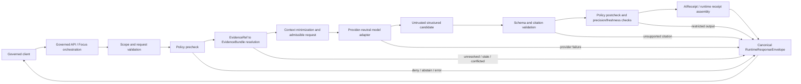

<!-- [KFM_META_BLOCK_V2]
doc_id: kfm://doc/adr-candidate/focus-model-adapter-boundary
title: "ADR Candidate — Focus Mode–Model Adapter Boundary"
type: adr-candidate
version: v0.1
status: proposed
effective_decision_status: not-assigned
owners:
  - "OWNER_TBD — architecture decision owner"
  - "OWNER_TBD — Focus Mode and governed-AI orchestration steward"
  - "OWNER_TBD — Governed API and runtime adapter steward"
  - "OWNER_TBD — evidence, policy, citation, security, contracts, schemas, validation, correction, and release stewards"
owner_status: "The canonical ADR index classifies this path as an unassigned slug-only scaffold. CODEOWNERS routing, accepted stewardship, independent review, decision assignment, implementation approval, provider admission, and release authority remain unverified."
reviewers_required:
  - "Architecture steward"
  - "Focus Mode and governed-AI orchestration steward"
  - "Governed API steward"
  - "Runtime and model-adapter steward"
  - "Evidence and citation steward"
  - "Policy, sensitivity, security, and privacy reviewers"
  - "Contracts, schemas, validation, and CI stewards"
  - "Explorer Web, correction, rollback, release, and docs stewards"
created: 2026-05-20
updated: 2026-08-14
policy_label: public
owning_root: docs/
responsibility: "Record the proposed authority boundary between caller-facing Focus Mode orchestration, provider-neutral model adapters, candidate model output, and the final governed runtime envelope without granting model, provider, route, evidence, policy, receipt, release, deployment, or publication authority."
truth_posture: cite-or-abstain
current_path: docs/adr/ADR-focus-model-adapter-boundary.md
supersedes: []
superseded_by: []
evidence_commit: 9d924c665073263f2cbf376d2bf29e7b9f252b06
target_prior_blob: f70bb4f8f0f790590c5382c96b03a5d2ec8abe45
adr_index_blob: 938c5894c36b99e14810918e2c550ab0e92d53b1
directory_rules_blob: fd49a0b83e55cef52c1124281f093e263526898d
related:
  - docs/adr/README.md
  - docs/adr/INDEX.md
  - docs/adr/ADR-0008-ollama-subordinate-to-governed-api.md
  - docs/adr/ADR-0019-ai-adapter-contract-and-finite-envelopes.md
  - docs/adr/ADR-0020-abstain-is-a-first-class-decision.md
  - docs/adr/ADR-0025-public-client-never-reads-canonical-internal-stores.md
  - docs/adr/ADR-0027-county-focus-mode-control-plane.md
  - "docs/adr/ADR-0028 — State-scale Focus Mode scope.md"
  - docs/adr/ADR-0029-adopt-directory-governance-standard-v2.md
  - docs/doctrine/directory-rules.md
  - docs/architecture/governed-ai/ADAPTER_CONTRACT.md
  - docs/architecture/governed-ai/FOCUS_FLOW.md
  - docs/architecture/governed-ai/MOCK_FIRST.md
  - docs/domains/fauna/API_CONTRACTS.md
  - contracts/ai/focus_mode_request/README.md
  - contracts/ai/focus_mode_response/README.md
  - contracts/ui/focus_request.md
  - contracts/runtime/runtime_response_envelope.md
  - contracts/runtime/ai_receipt.md
  - schemas/contracts/v1/focus/focus_request.schema.json
  - schemas/contracts/v1/focus/focus_response.schema.json
  - schemas/contracts/v1/focus/runtime_response_envelope.schema.json
  - schemas/contracts/v1/runtime/runtime_response_envelope.schema.json
  - policy/focus/README.md
  - runtime/model_adapters/AdapterContract.md
  - runtime/model_adapters/MockAdapter.py
  - runtime/model_adapters/OllamaAdapter.py
  - apps/governed-api/src/governed_api/routes/README.md
  - apps/explorer-web/src/features/focus_panel/resolver.ts
  - apps/workers/src/ai_focus_worker/main.py
  - .github/workflows/focus-mock-test.yml
tags: [kfm, adr-candidate, focus-mode, governed-ai, model-adapter, anticorruption-boundary, admissible-context, candidate-output, finite-envelope, cite-or-abstain, no-direct-model-client]
notes:
  - "First substantive same-path replacement of the scaffold created from the domain Markdown inventory."
  - "This candidate remains not-assigned and does not reserve an ADR number, change docs/adr/INDEX.md, accept a decision, or supersede ADR-0019."
  - "Index compatibility classification remains PROPOSED scaffold; substantive content does not assign a number."
  - "The proposed decision narrows the Focus-specific seam: caller requests and final RuntimeResponseEnvelope objects belong to governed orchestration; adapters receive only admissible internal context and return untrusted candidates."
  - "Current MockAdapter.py is a deterministic complete-envelope selector for tests, not evidence that the proposed production adapter seam exists."
[/KFM_META_BLOCK_V2] -->

# ADR Candidate — Focus Mode–Model Adapter Boundary

> **Proposed decision.** Focus Mode orchestration—not a model adapter—owns the governed transaction. Caller-facing Focus requests terminate at the Governed API. After scope validation, evidence resolution, policy precheck, context minimization, and release checks, orchestration may invoke a provider-neutral adapter with an internal admissible request. The adapter returns an untrusted structured candidate. Citation validation, policy postcheck, precision and freshness checks, receipt assembly, finite-outcome selection, and final `RuntimeResponseEnvelope` construction remain outside the adapter.

> [!IMPORTANT]
> **This file is an unassigned candidate, not an accepted ADR.** The canonical ADR index classifies this exact path as a slug-only scaffold with decision status `not-assigned`. This rewrite supplies reviewable decision content but does not reserve a number, accept the boundary, change the index, admit a model, activate a route, or authorize release.

> [!CAUTION]
> **A nearby numbered proposal already covers much of this territory.** [`ADR-0019`](./ADR-0019-ai-adapter-contract-and-finite-envelopes.md) proposes the repository-wide provider-neutral adapter and finite-envelope rule. Before this candidate receives a number, reviewers must either fold its Focus-specific seam into ADR-0019 or prove a non-overlapping decision scope and record the relationship explicitly.

> [!WARNING]
> **Current mock behavior is not the target production contract.** `runtime/model_adapters/MockAdapter.py` selects deep-copied, prevalidated complete envelopes for deterministic tests. That is useful proof infrastructure, but it does not establish that a production adapter may own final policy, citation, evidence, receipt, or public-envelope decisions.

**Quick navigation:** [Status](#status) · [Evidence](#evidence-boundary) · [Context](#context) · [Repository evidence](#current-repository-evidence) · [Decision](#proposed-decision) · [Adapter contract](#adapter-contract) · [Flow](#governed-flow) · [Ownership](#responsibility-and-authority-split) · [Maturity](#current-maturity) · [Conflicts](#conflict-and-hold-register) · [Convergence](#implementation-and-convergence-plan) · [Acceptance](#validation-and-acceptance-gates) · [Consequences](#consequences) · [Alternatives](#alternatives-considered) · [Risks](#risk-and-open-question-ledger) · [Authority](#authority-and-publication-boundary) · [Rollback](#rollback-correction-and-supersession) · [References](#references) · [No-loss ledger](#appendix-a--no-loss-reconciliation-ledger)

---

## Status

| Field | Current value |
|---|---|
| **Candidate identity** | Unassigned slug-only ADR candidate; no repository-wide number reserved |
| **Tracked path** | `docs/adr/ADR-focus-model-adapter-boundary.md` |
| **Source metadata** | `proposed` |
| **Effective decision status** | `not-assigned` |
| **Record edition** | `v0.1` — first substantive replacement of the 2026-05-20 scaffold |
| **Decision class** | Focus orchestration ownership, provider-neutral adapter input/output boundary, candidate-versus-envelope separation, public-client isolation, receipt ownership, and reversible runtime admission |
| **Governing placement authority** | Accepted ADR-0029 and the adopted Directory Rules v2 bytes |
| **Primary overlapping proposal** | ADR-0019 — AI Adapter Contract and Finite Envelopes (`proposed`) |
| **Related runtime proposal** | ADR-0008 — Ollama and Local AI Runtimes Are Subordinate to the Governed API (`proposed`) |
| **Current implementation posture** | Partial client and mock proof surfaces; no verified end-to-end governed Focus/model transaction |
| **Implementation effect of this revision** | Documentation only |
| **Release or publication effect** | None |
| **Supersedes / superseded by** | None / none |

### Assignment, acceptance, implementation, provider admission, and release are separate

1. **Number assignment** would give this candidate a collision-free ADR ID and synchronize the canonical index.
2. **ADR acceptance** would approve the responsibility split and vocabulary.
3. **Implementation graduation** would prove the contracts, schemas, policy, orchestration, adapter, citations, receipts, client behavior, correction, and rollback.
4. **Provider admission** would authorize one exact provider/model/profile for named capabilities, data classes, network posture, and limits.
5. **Governed release** would authorize one exact public or semi-public Focus operation.

No transition implies the next. A green mock test, valid envelope, provider response, pull request, merge, deployment, or local daemon is not evidence of acceptance or publication.

[Back to top](#top)

---

## Evidence boundary

This candidate is grounded in repository bytes inspected at `main@9d924c665073263f2cbf376d2bf29e7b9f252b06`. The prior target blob is `f70bb4f8f0f790590c5382c96b03a5d2ec8abe45`.

### Truth labels

| Label | Meaning here |
|---|---|
| **CONFIRMED** | Verified from the pinned repository bytes, canonical ADR inventory, accepted placement authority, or inspected workflow/code artifact |
| **PROPOSED** | The decision, object name, contract shape, implementation, migration, provider profile, or release posture is not accepted and proven |
| **UNKNOWN** | Available evidence does not support a stronger statement |
| **NEEDS VERIFICATION** | A concrete repository, test, runtime, policy, source, review, provider, or release check remains |
| **CONFLICTED** | Multiple current documents or shapes describe incompatible ownership or vocabulary |
| **HOLD** | Deliberate fail-closed state pending authority, evidence, policy, validation, review, or release closure |

### Inspected

- the target scaffold, its creation history, the ADR operating contract, and canonical index;
- accepted Directory Rules placement authority;
- ADR-0008, ADR-0019, ADR-0027, and ADR-0028;
- the governed-AI Adapter Contract and Focus Flow;
- runtime adapter files, MockAdapter implementation, Focus request/response semantic documents, Focus schemas, Focus policy scaffolds, Governed API route inventory, Explorer Focus resolver, Focus worker placeholder, and Focus mock workflow;
- the Fauna API contract that originally caused the scaffold to be created.

### Not exercised

No model daemon, provider endpoint, credential, live evidence resolver, policy evaluator, citation validator, AIReceipt writer, Focus API route, worker process, public client session, source activation, production deployment, correction workflow, rollback drill, release environment, or publication path was exercised.

A repository file proves that bytes exist at a revision. It does not by itself prove semantic authority, runtime enforcement, source rights, evidence closure, policy approval, operational isolation, release, deployment, or publication.

[Back to top](#top)

---

## Context

KFM currently uses several names for four different objects that must not collapse:

1. a **caller-facing Focus request** created by Explorer Web or another governed client;
2. an **internal admissible adapter request** assembled after evidence and policy gates;
3. an **untrusted adapter candidate** returned by a mock or provider;
4. the **final governed runtime envelope** returned to a client.

The original scaffold did not decide where those boundaries lie. Current documents also disagree in emphasis:

- `runtime/model_adapters/AdapterContract.md` summarizes the seam as `FocusRequest in -> DecisionEnvelope out`;
- the governed-AI Adapter Contract instead places evidence resolution and policy before the adapter, sends an `AdmissibleAdapterRequest`, receives an `AdapterRawResponse`, then performs citation validation and policy postcheck before final envelope assembly;
- the current MockAdapter selects already-complete synthetic envelopes rather than generating an intermediate candidate;
- Focus request and response schemas remain permissive scaffolds;
- Focus policy files are fail-closed or comment-only scaffolds;
- no Governed API Focus/model route is present.

Without a precise decision, a future implementation could accidentally grant the adapter authority to decide evidence sufficiency, policy, citations, final outcomes, receipts, or public response shape. This candidate makes the seam explicit while preserving ADR-0019's broader provider-neutral rule.

### Decision scope

This candidate governs only the **Focus-specific application-to-adapter seam**:

- what orchestration must complete before an adapter call;
- what information an adapter may receive;
- what an adapter may return;
- who decides the public finite outcome and assembles the final envelope;
- how mock proof infrastructure may differ from the target production port without becoming authority.

It does not choose a provider, accept ADR-0019, define final field-level schemas, select an execution host, activate Focus Mode, or authorize a public response.

[Back to top](#top)

---

## Current repository evidence

| Surface | CONFIRMED state at the evidence checkpoint | Safe conclusion |
|---|---|---|
| ADR inventory | This path is an unassigned slug-only scaffold; ADR-0019 and ADR-0008 are numbered but remain proposed | No current record has accepted this Focus-specific seam |
| Directory Rules | ADR-0029 separately accepted the exact Directory Rules v2 bytes | `docs/adr/` is the correct human decision lane; placement does not accept the decision |
| Governed-AI Adapter Contract | Describes `AdmissibleAdapterRequest -> AdapterRawResponse` inside precheck/postcheck orchestration | Strong design evidence for a narrow adapter, not implementation proof |
| Focus Flow | Defines scope -> policy precheck -> EvidenceBundle resolution -> adapter -> citation validation -> policy postcheck -> envelope | Orchestration owns the full governed transaction in current architecture prose |
| Runtime adapter note | Says `FocusRequest in -> DecisionEnvelope out` and labels itself non-canonical | Current shorthand is too broad to act as semantic authority |
| MockAdapter | Deterministic no-I/O selector for prevalidated complete four-outcome envelopes | Bounded proof harness only; no semantic request interpretation or provider behavior |
| OllamaAdapter | One-line placeholder | No provider adapter implementation |
| Focus request/response contracts | Substantive draft semantic READMEs, but their path authority remains unresolved | Useful requirements; not accepted canonical object-family authority |
| Focus request/response schemas | Empty permissive objects with `additionalProperties: true` | No machine-enforced internal adapter seam |
| Focus runtime-envelope alias | `$ref` compatibility alias to the canonical runtime envelope schema | Focus must not create a second final-envelope shape |
| Focus policy | Generated/default-deny or comment-only scaffolds | No verified precheck/postcheck decision engine |
| Governed API routes | Route directory contains bootstrap, layers, evidence, and registry surfaces; no Focus/model route | No end-to-end governed model path |
| Explorer Focus resolver | Executable client code accepts an injected governed resolver, rejects out-of-scope evidence, and performs no model/store access | Client-side trust boundary is materially represented, but it is not provider orchestration |
| Focus worker | Entrypoint is a greenfield placeholder | No worker-owned orchestration |
| Focus mock workflow | Static readiness plus finite-envelope/selector proof; mock Focus remains explicit HOLD | CI proves bounded artifacts, not an operational Focus answer path |

### Current maturity summary

**CONFIRMED:** KFM has substantive finite-envelope, mock-selector, client-projection, and documentation surfaces.

**PROPOSED:** The end-to-end Focus orchestration and narrowed adapter port.

**UNKNOWN:** Which deployable process should own orchestration, which internal contract names will be canonical, and whether any uninspected consumer expects adapters to return complete envelopes.

**HOLD:** Provider-backed Focus `ANSWER` behavior, direct model streaming, runtime receipt emission, and public release.

[Back to top](#top)

---

## Proposed decision

### 1. Focus requests terminate at governed orchestration

A caller-facing `FocusRequest` or `FocusModeRequest` is accepted only by a governed API or an equivalent reviewed orchestration boundary. It is not passed directly to a provider adapter.

Before invocation, orchestration must:

- authenticate and authorize the caller where applicable;
- validate request shape, scope, map/time context, and bounded intent;
- resolve every consequential `EvidenceRef` to admissible `EvidenceBundle` support;
- evaluate policy, rights, sensitivity, review, release, and audience context;
- minimize and generalize context to the least information needed;
- bind deterministic request, context, policy, and evidence identities;
- select an admitted adapter capability profile and enforce resource limits.

A failed prerequisite terminates as `ABSTAIN`, `DENY`, or `ERROR` without invoking a provider when the failure already determines the safe outcome.

### 2. The adapter receives an internal admissible request

The adapter input is an internal object, not the public Focus request. The current illustrative name `AdmissibleAdapterRequest` may be retained or replaced during contract review.

The input may contain:

- a deterministic request and context identity;
- bounded task/instruction data;
- policy-cleared evidence fragments or projections;
- citation anchors the adapter may reference;
- explicit capabilities, tools, token/time limits, locale, and output schema;
- obligations such as redaction, generalization, attribution, or precision caps;
- non-secret correlation data needed to assemble a receipt.

The input must not contain:

- unresolved evidence references presented as facts;
- RAW, WORK, QUARANTINE, unpublished candidate, or canonical-store handles;
- provider credentials, secrets, private configuration, or private chain-of-thought;
- restricted geometry or attributes beyond the approved precision;
- authority to write evidence, policy, review, lifecycle, release, correction, or rollback state;
- authority to call undeclared tools, sources, providers, or networks.

### 3. The adapter returns an untrusted structured candidate

The adapter output is an intermediate candidate, not a public `DecisionEnvelope` or `RuntimeResponseEnvelope`. The current illustrative name `AdapterRawResponse` may be retained or replaced with a less ambiguous candidate name.

It may contain:

- a bounded candidate answer or structured abstention/error signal;
- claim-to-citation-anchor assertions;
- model/provider/profile metadata;
- tool-call results only when independently governed and explicitly allowed;
- bounded diagnostics suitable for orchestration and receipt assembly.

It must not:

- declare evidence admissible or resolved;
- issue the final policy decision;
- authorize `ANSWER` or final `DENY`;
- validate its own citations;
- emit the public response envelope as authority;
- persist an AIReceipt, RunReceipt, proof, catalog, release, correction, or rollback object directly;
- stream raw provider tokens to a public or semi-public client;
- expose provider-private reasoning, hidden prompts, secrets, or restricted data.

Provider refusal, truncation, timeout, or safety filtering is adapter telemetry. Governed orchestration maps it to the appropriate finite outcome and reason code.

### 4. Orchestration owns final outcome and envelope assembly

After an adapter returns, orchestration must:

1. validate the candidate structure and declared limits;
2. validate every consequential citation against resolved evidence;
3. apply policy postcheck, sensitivity transforms, and output obligations;
4. verify precision, freshness, temporal scope, correction, and release state where material;
5. choose exactly one public outcome: `ANSWER`, `ABSTAIN`, `DENY`, or `ERROR`;
6. assemble the canonical `RuntimeResponseEnvelope`;
7. emit or persist the required AI/runtime receipt through the owning accountability path;
8. return only the governed envelope or a released projection to the client.

The adapter may suggest an internal signal; it cannot make the final public decision.

### 5. Clients consume governed envelopes only

Explorer Web, review tools, exports, and other clients:

- call only governed interfaces;
- never call Ollama or another provider directly;
- never accept provider-native payloads or raw token streams;
- never infer evidence or policy state from generated prose;
- render all four finite outcomes accessibly;
- keep Evidence Drawer and correction/release context linked to any `ANSWER`.

### 6. Mock proof remains test-only unless converged deliberately

The current complete-envelope MockAdapter may remain as bounded test infrastructure while this candidate is proposed, provided it stays explicitly labeled as a selector of prevalidated synthetic fixtures.

Before a mock implementation is used as the production adapter port, it must either:

- return the same intermediate candidate shape required of provider adapters; or
- sit behind an explicit compatibility harness proving that the complete envelope was assembled and validated outside the adapter.

A test convenience cannot silently define the production authority boundary.

### 7. Relationship to other ADRs

- **ADR-0019** owns the broader provider-neutral adapter and finite-envelope proposal. This candidate narrows the Focus-specific application seam and must not create competing authority.
- **ADR-0008** owns the proposal that Ollama/local runtimes remain subordinate to the Governed API.
- **ADR-0027 and ADR-0028** govern Focus composition/control-plane scope, not provider-adapter authority.
- **ADR-0020 and ADR-0025** support first-class abstention and the prohibition on public reads from canonical/internal stores.
- **ADR-0029** supplies accepted placement authority only.

Before assignment, reviewers must choose **fold** or **standalone** disposition:

| Disposition | Requirement |
|---|---|
| **Fold into ADR-0019** | Add the Focus-specific seam and no-loss history to ADR-0019, then retire this scaffold through reviewed index cleanup or a compatibility pointer |
| **Assign standalone ADR** | Prove a distinct decision scope, allocate a collision-free number, adopt the template, update the index, and link ADR-0019 without duplicate authority |

[Back to top](#top)

---

## Adapter contract

The following is a **PROPOSED semantic minimum**, not a field-level schema.

### Input boundary

| Concern | Required rule |
|---|---|
| Identity | Deterministic request/context identity suitable for replay and receipt correlation |
| Evidence | Only resolved, policy-cleared, bounded evidence projections and citation anchors |
| Scope | Explicit domain, geography, time, layer, feature, and transform bounds as applicable |
| Policy | Obligations and allowed capabilities, not authority for the adapter to reinterpret policy |
| Tools | Closed allowlist with per-tool limits; no ambient network or source access |
| Limits | Token, time, output-size, citation-density, precision, and retry caps |
| Privacy | No secrets, unrestricted PII, protected coordinates, or private chain-of-thought |
| Mutability | Read-only input; no direct lifecycle or release write capability |

### Candidate-output boundary

| Concern | Required rule |
|---|---|
| Outcome signal | Internal `answer`, `abstain`, or `error` signal; provider refusal remains telemetry |
| Candidate text | Bounded, structured, and non-authoritative |
| Citations | Structured claim-to-anchor assertions for independent validation |
| Metadata | Provider, model/profile, parameters, resource use, and bounded diagnostics |
| Sensitive content | Must honor obligations, but postcheck remains mandatory |
| Authority | No final policy, evidence, citation, release, or publication decision |
| Persistence | No direct receipt/proof/release writes; orchestration owns accountable emission |

### Final-envelope boundary

Only governed orchestration may produce the outward finite envelope. The Focus compatibility alias must continue to reference the canonical runtime schema rather than define a parallel shape.

[Back to top](#top)

---

## Governed flow

Every terminal path is finite and receipted as required. No edge from the client reaches the adapter directly, and no edge from the adapter reaches the public response directly.

[Back to top](#top)

---

## Responsibility and authority split

| Responsibility | Owning surface | Must not be delegated to |
|---|---|---|
| Human architectural decision | `docs/adr/` | Runtime notes, provider code, schema, workflow, or model prose |
| Focus request semantics | Accepted contract family after path convergence | Browser implementation or provider payload |
| Internal adapter request/candidate semantics | Accepted contract family selected by review | Runtime note alone |
| Machine-checkable shape | `schemas/` canonical contract-schema lane | Markdown or provider SDK types alone |
| Evidence resolution | Governed evidence service/object family | Model adapter |
| Policy precheck/postcheck | `policy/` plus governed evaluator | Model adapter or client |
| Provider translation | Runtime model-adapter implementation | Public browser |
| Citation validation | Governed citation validator | Provider self-report |
| Final finite envelope | Governed orchestration using canonical runtime schema | Provider/model adapter |
| AI/runtime receipt emission | Owning receipt/accountability path | Provider response itself |
| Public UI projection | Explorer Web through governed resolver | Direct provider client |
| Release, correction, withdrawal, rollback | `release/` and owning accountability families | Model adapter, workflow, or documentation |

Directory Rules basis: this candidate remains in `docs/adr/` because it records a human architectural decision. It creates no new root and no parallel semantic, schema, policy, source, receipt, proof, release, or data home.

[Back to top](#top)

---

## Current maturity

| Capability | Current status | Graduation blocker |
|---|---|---|
| Client isolation | **PARTIAL / CONFIRMED** | Explorer resolver is bounded, but no verified server Focus route exists |
| Finite outward envelope | **BOUNDED PROOF / CONFIRMED** | Full orchestration and consumer integration are absent |
| Mock adapter | **BOUNDED SELECTOR / CONFIRMED** | Returns complete fixture envelopes rather than target intermediate candidates |
| Provider adapter | **ABSENT** | OllamaAdapter is a placeholder; no provider admitted |
| Internal adapter contract | **CONFLICTED / PROPOSED** | Runtime shorthand and architecture candidate model differ |
| Focus request/response schemas | **SCAFFOLD** | Empty permissive shapes and no closed internal seam |
| Focus policy | **SCAFFOLD / FAIL-CLOSED** | No verified precheck/postcheck decision logic |
| Evidence and citation composition | **UNKNOWN end to end** | No exercised Focus resolver/citation service |
| AIReceipt runtime emission | **UNKNOWN / absent in inspected route** | Validator existence does not prove emission or persistence |
| Focus worker | **PLACEHOLDER** | No orchestration code |
| Governed API route | **ABSENT in inspected route inventory** | No request-to-envelope composition |
| Provider streaming | **HOLD** | Raw stream would bypass candidate validation and postcheck |
| Public Focus `ANSWER` release | **NONE** | Evidence, policy, citations, receipt, correction, rollback, and release closure are missing |

[Back to top](#top)

---

## Conflict and HOLD register

| ID | Conflict or gap | Current posture | Required resolution |
|---|---|---|---|
| `FMA-01` | ADR-0019 already proposes the broader adapter/envelope boundary | **CONFLICTED authority risk** | Decide fold versus standalone before number assignment |
| `FMA-02` | Runtime note says `FocusRequest -> DecisionEnvelope`; architecture says admissible request -> candidate -> validation -> envelope | **CONFLICTED vocabulary/ownership** | Select one semantic contract and preserve compatibility explicitly |
| `FMA-03` | MockAdapter returns complete envelopes | **BOUNDED exception** | Keep test-only or add compatibility harness/candidate-producing mock |
| `FMA-04` | Focus request/response schemas are empty permissive scaffolds | **HOLD** | Close schemas, negative fixtures, validators, and compatibility |
| `FMA-05` | Focus policy modules do not implement reviewed precheck/postcheck rules | **HOLD** | Define finite decisions, reason codes, obligations, and tests |
| `FMA-06` | No Focus/model route or worker orchestration is implemented | **HOLD** | Choose owner and implement dependency-closed no-network slice |
| `FMA-07` | AIReceipt validator exists, but Focus runtime emission is unproved | **HOLD** | Emit, validate, retain, resolve, and correct receipts through owning path |
| `FMA-08` | Provider/tool/streaming admission is unresolved | **HOLD** | Capability manifest, network policy, supply-chain review, limits, kill switch |
| `FMA-09` | Multiple Focus semantic contract homes exist | **CONFLICTED placement** | Resolve through accepted authority or migration note; do not create another home |
| `FMA-10` | Final precision/freshness/correction obligations span adjacent contracts | **NEEDS VERIFICATION** | Bind exact profiles before any `ANSWER` graduation |

[Back to top](#top)

---

## Implementation and convergence plan

This document authorizes none of the following work. It records the smallest dependency order if the candidate is later assigned and accepted.

### Phase 0 — resolve decision authority

- Decide whether the Focus seam is folded into ADR-0019 or assigned independently.
- Confirm owners and required reviewers.
- Freeze canonical terminology and the accepted contract/schema homes.
- Record compatibility treatment for current runtime and Focus contract notes.

### Phase 1 — semantic contract and vocabulary

- Define caller request, admissible adapter request, adapter candidate, final envelope, and receipt roles without overlap.
- State which names are canonical and which are aliases.
- Update runtime and architecture notes together so no writable prose surface claims a competing seam.

### Phase 2 — schemas, fixtures, and validators

- Add closed schemas for internal adapter request and candidate shapes in the accepted home.
- Add valid and invalid no-network fixtures.
- Reject unresolved evidence, ambient tool access, restricted precision, unknown capabilities, raw provider payloads, and adapter-produced final envelopes.
- Preserve the canonical runtime-envelope schema and Focus compatibility alias.

### Phase 3 — deterministic mock orchestration

- Build a no-network orchestrator that performs precheck, evidence fixture resolution, mock candidate generation, citation validation, postcheck, receipt assembly, and final-envelope construction.
- Convert or wrap MockAdapter so the production port receives/returns the accepted intermediate shapes.
- Prove all four final outcomes and stable reason codes.

### Phase 4 — accountability and client integration

- Emit and validate AIReceipt/runtime receipt records.
- Integrate the Governed API route and injected Explorer resolver.
- Verify accessible rendering of `ANSWER`, `ABSTAIN`, `DENY`, and `ERROR`.
- Add correction, withdrawal, stale-state, and rollback tests.

### Phase 5 — provider admission

- Admit one exact provider/model/profile through a separate reviewed decision.
- Pin capability, network, tool, context, precision, latency, resource, logging, and kill-switch limits.
- Prove provider output cannot bypass candidate validation, policy postcheck, citations, or receipt assembly.

### Phase 6 — governed release

- Release one bounded Focus operation only after evidence, policy, citation, security, validation, review, correction, rollback, and release gates close.
- Keep raw provider output and internal candidate objects non-public.

[Back to top](#top)

---

## Validation and acceptance gates

### Documentation-change validation

- [ ] The target remains the same tracked path.
- [ ] The candidate remains `not-assigned`; no ADR number or index row changes.
- [ ] Metadata declares `owning_root: docs/` and a bounded responsibility.
- [ ] One H1 and unique explicit anchors are present.
- [ ] Every quick-navigation target resolves.
- [ ] Related repository paths exist at the evidence checkpoint.
- [ ] No statement promotes ADR-0008, ADR-0019, ADR-0027, or ADR-0028 beyond `proposed`.
- [ ] No source, model, provider, route, policy, release, deployment, or publication is activated.

### Future decision-acceptance gates

| Gate | Required evidence |
|---|---|
| `B1 — unique authority` | Fold/standalone disposition, collision-free identity if assigned, synchronized index, no duplicate decision surface |
| `B2 — semantic closure` | One reviewed request/candidate/envelope responsibility model and explicit compatibility aliases |
| `B3 — machine closure` | Closed schemas, positive/negative fixtures, deterministic validators, versioning and migration policy |
| `B4 — trust composition` | Evidence resolution, policy precheck/postcheck, citation validation, precision/freshness/correction checks |
| `B5 — adapter isolation` | No direct client/provider path, no internal-store handles, no ambient network/tools, no direct authoritative writes |
| `B6 — finite outcomes` | Orchestration—not adapter—proves all four outward outcomes and stable safe reason codes |
| `B7 — accountability` | AI/runtime receipt emission, validation, retention, reference resolution, redaction, and correction behavior |
| `B8 — reversibility` | Provider kill switch, mock fallback, ABSTAIN-safe mode, correction propagation, and rollback drill |
| `B9 — release` | Exact operation-specific review, ReleaseManifest/decision, public-safe client proof, monitoring, and rollback target |

### Required negative tests for an implementation slice

- browser/provider direct call is impossible;
- caller-facing Focus request cannot be passed to the adapter unchanged;
- unresolved `EvidenceRef` cannot enter admissible context;
- RAW/WORK/QUARANTINE/canonical handles are rejected;
- unknown tool, provider, model, or capability is rejected;
- adapter candidate cannot be returned directly to a client;
- adapter self-citation cannot satisfy citation validation;
- policy postcheck denial produces final `DENY`;
- unsupported citation produces `ABSTAIN`;
- provider/runtime failure produces `ERROR`;
- unknown final outcome fails closed;
- raw token streaming is not publicly observable;
- adapter cannot write release or lifecycle state;
- receipt failure blocks `ANSWER` where the accepted profile requires a receipt.

[Back to top](#top)

---

## Consequences

### Benefits

- Provider-specific APIs stay behind an anticorruption boundary.
- Evidence, policy, citation, release, and correction authority remain inspectable and testable.
- Mock, local, and hosted adapters can share one narrow port.
- The final public contract remains provider-neutral and stable.
- Provider output can be distrusted, validated, redacted, and rejected before exposure.
- Client code remains free of model credentials, provider SDKs, and internal-store access.
- Kill switches and provider replacement do not require changing the public envelope.
- Tests can prove adapter behavior separately from orchestration and release behavior.

### Costs

- The Governed API or worker must implement explicit orchestration rather than delegate to the adapter.
- Internal request/candidate schemas and compatibility paths add maintenance.
- Citation and policy postchecks add latency and failure states.
- Streaming must be buffered or transformed through a governed validation design.
- Current complete-envelope mock fixtures may need a compatibility layer or redesign.
- Duplicate Focus contract homes require deliberate convergence rather than another convenience path.

### Tradeoff

The design accepts more orchestration code and explicit intermediate objects in exchange for preventing a model/provider from becoming an evidence, policy, citation, or publication authority. For KFM, that is the safer and more reversible boundary.

[Back to top](#top)

---

## Alternatives considered

### A. Pass the full Focus request to the adapter and accept a final envelope

**Rejected as a production boundary.** It collapses caller context, evidence resolution, policy, provider translation, and public outcome assembly. Current mock fixtures may use complete envelopes as test data, but that exception must not define production authority.

### B. Let the provider validate its own citations and policy obligations

**Rejected.** Provider-generated citations and self-reported compliance are candidate data. Independent KFM validators and policy evaluators must decide support and admissibility.

### C. Stream provider tokens directly to Explorer Web

**Rejected.** Public streaming would expose content before schema validation, citation validation, policy postcheck, redaction, receipt closure, and finite-outcome selection.

### D. Let the adapter write AIReceipt and release/lifecycle objects directly

**Rejected.** The adapter may supply metadata, but accountable record emission belongs to governed orchestration and the owning object-family paths.

### E. Put provider logic in Explorer Web

**Rejected.** It would expose credentials and collapse the Governed API trust membrane.

### F. Fold this candidate entirely into ADR-0019

**Viable and preferred unless independent scope is proven.** The candidate should remain unassigned until review confirms that a separate Focus-specific decision improves clarity without creating parallel authority.

[Back to top](#top)

---

## Risk and open-question ledger

| ID | Question or risk | Status | Closure evidence |
|---|---|---|---|
| `FMA-Q01` | Should this candidate be folded into ADR-0019 or assigned independently? | **NEEDS VERIFICATION** | Architecture review and canonical index plan |
| `FMA-Q02` | What are the canonical names for caller request, admissible request, adapter candidate, and final envelope? | **NEEDS VERIFICATION** | Accepted contracts and compatibility map |
| `FMA-Q03` | Which contract family owns the internal adapter seam without creating another parallel home? | **HOLD** | Directory Rules decision and migration note |
| `FMA-Q04` | Does Governed API or a worker own orchestration, retries, and receipt emission? | **UNKNOWN** | Runtime topology, threat model, tests, and operations review |
| `FMA-Q05` | May an adapter invoke tools or retrieval, and how are capabilities admitted? | **HOLD** | Closed capability manifest, source/tool policy, no-ambient-access tests |
| `FMA-Q06` | How can streaming preserve schema, citation, postcheck, redaction, and finite outcome integrity? | **HOLD** | Buffered or staged streaming design with negative tests |
| `FMA-Q07` | Which AIReceipt fields and retention rules are required for Focus? | **NEEDS VERIFICATION** | Contract/schema/policy alignment and runtime proof |
| `FMA-Q08` | How are provider refusals mapped to `ABSTAIN`, `DENY`, or `ERROR` without granting provider policy authority? | **NEEDS VERIFICATION** | Reason-code contract and deterministic tests |
| `FMA-Q09` | Which precision, freshness, temporal, and correction profiles gate `ANSWER`? | **NEEDS VERIFICATION** | Accepted cross-contract profile |
| `FMA-Q10` | Are current Focus request/response schema paths canonical, compatibility, or migration candidates? | **CONFLICTED** | Schema-home and contract-home review |
| `FMA-Q11` | Does any uninspected consumer require complete envelopes directly from MockAdapter? | **UNKNOWN** | Repository-wide import/use inventory |
| `FMA-Q12` | What provider/model/profile is first eligible for admission? | **HOLD** | Separate provider decision, security review, and bounded proof |
| `FMA-Q13` | How are candidate and receipt data redacted from telemetry? | **NEEDS VERIFICATION** | Telemetry policy, tests, and runtime logs |
| `FMA-Q14` | What is the safe fallback when policy, evidence, citation, or receipt services fail? | **PROPOSED** | Fail closed to `ABSTAIN`, `DENY`, or `ERROR`; prove by fault injection |

[Back to top](#top)

---

## Authority and publication boundary

This candidate does **not**:

- assign or accept an ADR;
- change ADR-0019, ADR-0008, ADR-0027, ADR-0028, or the canonical index;
- create canonical contract or schema authority;
- implement a Focus route, worker, model adapter, policy evaluator, citation validator, or receipt writer;
- activate Ollama or another provider;
- authorize network access, tools, credentials, model downloads, or source retrieval;
- grant access to RAW, WORK, QUARANTINE, canonical, restricted, or unpublished state;
- approve a public `ANSWER`;
- release, deploy, publish, notify, promote, or change repository settings.

A model candidate, schema pass, policy-shaped file, receipt, workflow, pull request, merge, deployment, or local model response is not KFM publication. Public use requires operation-specific evidence, policy, review, release, correction, and rollback closure.

[Back to top](#top)

---

## Rollback, correction, and supersession

### Documentation rollback

Close the feature branch or revert the documentation commit. The prior scaffold blob is `f70bb4f8f0f790590c5382c96b03a5d2ec8abe45`. No runtime, source, model, data, release, or published state changes.

### Future implementation rollback

An accepted implementation must support:

1. disabling the provider capability without changing the public envelope;
2. switching to deterministic mock/ABSTAIN-safe mode;
3. cancelling in-flight provider calls and denying new calls;
4. preserving and redacting receipts needed for audit;
5. invalidating cached answer projections;
6. issuing correction or withdrawal state for affected responses;
7. restoring the prior adapter/orchestrator version;
8. proving that clients continue to receive finite safe outcomes.

### Supersession

If the decision is folded into ADR-0019, preserve this scaffold's creation history and source lineage in ADR-0019 or a reviewed compatibility pointer before removing it from the scaffold inventory. If assigned independently, record reciprocal relationships without claiming supersession unless a later accepted decision truly replaces one.

[Back to top](#top)

---

## References

### Governing and adjacent ADRs

- [ADR operating contract](./README.md)
- [Canonical ADR index](./INDEX.md)
- [ADR-0008 — Ollama subordinate to Governed API](./ADR-0008-ollama-subordinate-to-governed-api.md)
- [ADR-0019 — AI Adapter Contract and Finite Envelopes](./ADR-0019-ai-adapter-contract-and-finite-envelopes.md)
- [ADR-0020 — Abstain Is a First-Class Decision](./ADR-0020-abstain-is-a-first-class-decision.md)
- [ADR-0025 — Public Client Never Reads Canonical or Internal Stores](./ADR-0025-public-client-never-reads-canonical-internal-stores.md)
- [ADR-0027 — County Focus Mode Control Plane](./ADR-0027-county-focus-mode-control-plane.md)
- [ADR-0028 — State-scale Focus Mode scope](<./ADR-0028 — State-scale Focus Mode scope.md>)
- [ADR-0029 — Adopt Directory Governance Standard v2](./ADR-0029-adopt-directory-governance-standard-v2.md)
- [Directory Rules](../doctrine/directory-rules.md)

### Focus and governed-AI architecture

- [Governed-AI Adapter Contract](../architecture/governed-ai/ADAPTER_CONTRACT.md)
- [Focus Flow](../architecture/governed-ai/FOCUS_FLOW.md)
- [Mock-first posture](../architecture/governed-ai/MOCK_FIRST.md)
- [Original Fauna source document](../domains/fauna/API_CONTRACTS.md)

### Current implementation and contract evidence

- `runtime/model_adapters/AdapterContract.md`
- `runtime/model_adapters/MockAdapter.py`
- `runtime/model_adapters/OllamaAdapter.py`
- `contracts/ai/focus_mode_request/README.md`
- `contracts/ai/focus_mode_response/README.md`
- `contracts/ui/focus_request.md`
- `contracts/runtime/runtime_response_envelope.md`
- `contracts/runtime/ai_receipt.md`
- `schemas/contracts/v1/focus/`
- `schemas/contracts/v1/runtime/runtime_response_envelope.schema.json`
- `policy/focus/`
- `apps/governed-api/src/governed_api/routes/`
- `apps/explorer-web/src/features/focus_panel/resolver.ts`
- `apps/workers/src/ai_focus_worker/main.py`
- `.github/workflows/focus-mock-test.yml`

[Back to top](#top)

---

## Appendix A — No-loss reconciliation ledger

| Prior scaffold element | Treatment in this candidate |
|---|---|
| H1 naming the Focus/model adapter boundary | Preserved and clarified as an unassigned ADR candidate |
| `PROPOSED scaffold` status | Preserved as `proposed` / `not-assigned`; no number or acceptance inferred |
| Source `docs/domains/fauna/API_CONTRACTS.md` | Preserved in metadata and references as the original inventory source |
| Instruction to fill authoritative content, owners, validation, and cross-links | Replaced with repository-grounded status, owner placeholders, evidence boundary, decision, validation gates, and references |
| Reminder that schemas, policy, fixtures, and release decisions belong in separate roots | Preserved and expanded through the responsibility matrix and accepted Directory Rules |
| Warning not to treat the scaffold as canonical truth | Preserved through explicit candidate, authority, implementation, and publication boundaries |

The original source remains visible in Git history. This same-path update does not create a sibling authority document or erase the scaffold's lineage.

[Back to top](#top)
