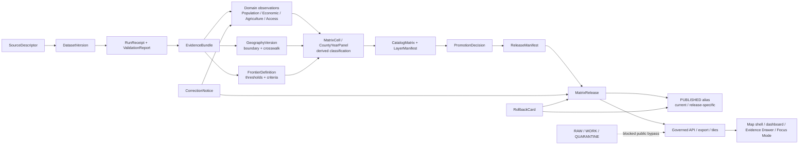
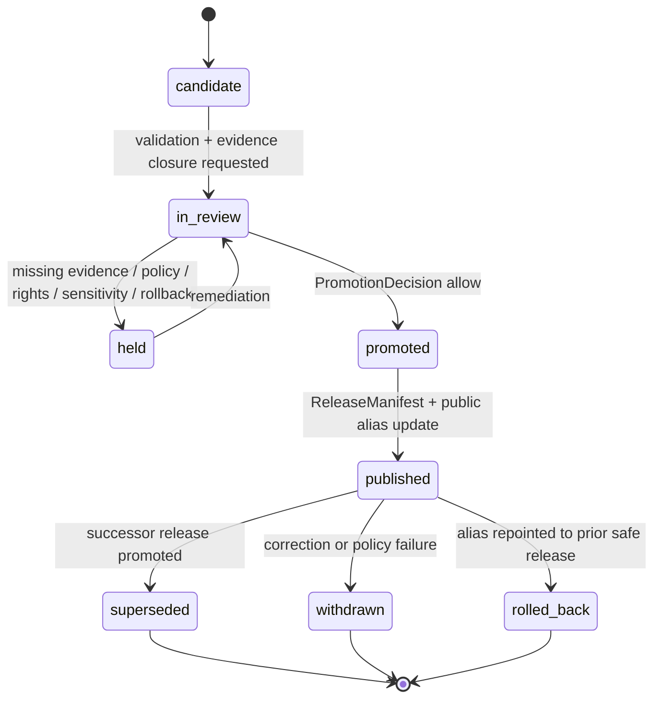

<!-- [KFM_META_BLOCK_V2]
doc_id: kfm://doc/NEEDS-VERIFICATION-ADR-frontier-bitemporal-release-model
title: ADR: Frontier Bitemporal Release Model
type: standard
version: v1
status: draft
owners: OWNER_TBD_NEEDS_VERIFICATION
created: 2026-05-08
updated: 2026-05-08
policy_label: NEEDS_VERIFICATION
related: [../../README.md, ./README.md, ./ADR-0001-schema-home.md, ./ADR-0002-responsibility-root-monorepo.md, ../architecture/contract-schema-policy-split.md, NEEDS_VERIFICATION:KFM_Implementation_Reference, NEEDS_VERIFICATION:KFM_Encyclopedia, NEEDS_VERIFICATION:Pipeline_Living_Implementation_Manual_v0.3]
tags: [kfm, adr, frontier, bitemporal, release, matrix, evidence, rollback]
notes: [Replaces a placeholder ADR at docs/adr/ADR-frontier-bitemporal-release-model.md. Owners, policy label, complete repo tree, schema consumers, release artifacts, workflow enforcement, and test results remain NEEDS VERIFICATION.]
[/KFM_META_BLOCK_V2] -->

<a id="top"></a>
<a id="adr-frontier-bitemporal-release-model"></a>

# ADR: Frontier Bitemporal Release Model

Record frontier-domain observations and matrix releases with explicit world-time and KFM-record-time semantics so corrections, rollbacks, and “as-of” public claims remain inspectable.

<p align="center">
  
  
  
  
  
  
</p>

<p align="center">
  <a href="#decision-summary">Decision</a> ·
  <a href="#evidence-boundary">Evidence</a> ·
  <a href="#problem">Problem</a> ·
  <a href="#temporal-vocabulary">Time model</a> ·
  <a href="#chosen-model">Chosen model</a> ·
  <a href="#release-state-model">Release state</a> ·
  <a href="#query-semantics">Query semantics</a> ·
  <a href="#impact-map">Impact</a> ·
  <a href="#validation-plan">Validation</a> ·
  <a href="#rollback-and-supersession">Rollback</a> ·
  <a href="#open-verification-backlog">Open verification</a>
</p>

> [!IMPORTANT]
> **Decision status:** `PROPOSED`.
>
> This ADR settles the proposed architecture for frontier bitemporal release semantics. It does **not** claim that schemas, validators, release manifests, workflows, APIs, dashboards, published artifacts, or runtime behavior already enforce the model.

> [!NOTE]
> The target file currently exists as an ADR placeholder. This revision replaces placeholder language with decision-ready ADR content, while leaving implementation enforcement as `NEEDS VERIFICATION`.

---

## Decision summary

| Field | Determination |
|---|---|
| ADR | `docs/adr/ADR-frontier-bitemporal-release-model.md` |
| Status | `proposed` |
| Owning root | `docs/` |
| Owning subdirectory | `docs/adr/` |
| Decision area | Frontier-domain temporal modeling and release governance |
| Primary domain | Frontier demography, economy, settlement, land, and time matrix |
| Core decision | Model frontier observations and matrix releases with a bitemporal pair: `valid_time` and `record_time`, plus separate source, retrieval, release, correction, and supersession timestamps. |
| Release rule | A `MatrixRelease` is an immutable governed release object backed by `ReleaseManifest`, `PromotionDecision`, evidence closure, policy checks, correction path, and rollback target. |
| Public query rule | Public-facing frontier answers must declare either an exact `release_id`, a current public release alias, or explicit `as_of_valid_time` and `as_of_record_time` semantics. |
| Derived-output rule | County-year panels, frontier classifications, PMTiles, GeoParquet, dashboards, graph projections, summaries, and AI answers are derived carriers, not canonical truth. |
| Default failure behavior | Missing evidence, ambiguous temporal scope, source-role conflict, unknown rights, or missing release/correction/rollback linkage returns `ABSTAIN`, `DENY`, `ERROR`, or a review hold rather than a fluent or latest-only answer. |
| Implementation maturity | `NEEDS VERIFICATION` |

### One-line decision rule

> Frontier releases are versioned, evidence-bound, and bitemporal: KFM must preserve both **when a claim applies in the world** and **when KFM knew, accepted, corrected, or released that claim**.

### One-line boundary rule

> This ADR must not allow a latest-only frontier matrix, map layer, graph projection, export, or AI response to bypass governed evidence, policy, review, release, correction, or rollback state.

[Back to top](#top)

---

## Repo fit

`docs/adr/` is the right home for this file because the document records a governance-significant architecture decision. It is human-facing architecture control-plane material, not a schema, source registry, validator, policy rule, release artifact, or runtime implementation.

| Relationship | Path | Status | Role |
|---|---|---:|---|
| This ADR | `docs/adr/ADR-frontier-bitemporal-release-model.md` | `CONFIRMED path / revised content PROPOSED` | Decision record for frontier bitemporal release semantics. |
| ADR index | [`./README.md`](./README.md) | `CONFIRMED path / coverage NEEDS VERIFICATION` | ADR navigation, review discipline, status labels, rollback, and supersession expectations. |
| Schema-home ADR | [`./ADR-0001-schema-home.md`](./ADR-0001-schema-home.md) | `CONFIRMED path / decision still PROPOSED` | Governs the proposed machine-schema home. This ADR must not duplicate schema authority. |
| Responsibility-root ADR | [`./ADR-0002-responsibility-root-monorepo.md`](./ADR-0002-responsibility-root-monorepo.md) | `CONFIRMED path / ADR decision accepted` | Governs why frontier domain work must not become a root-level folder. |
| Contract/schema/policy split | [`../architecture/contract-schema-policy-split.md`](../architecture/contract-schema-policy-split.md) | `CONFIRMED path / enforcement NEEDS VERIFICATION` | Explains the split: contracts define meaning, schemas validate shape, policy decides admissibility. |
| Root README | [`../../README.md`](../../README.md) | `CONFIRMED path / authority draft` | States KFM identity, lifecycle, public-client boundary, and inspectable-claim posture. |

### Directory Rules basis

This ADR stays under `docs/adr/` because ADRs are human-facing decision records. Frontier-domain implementation work should appear under responsibility roots such as `docs/domains/`, `contracts/domains/`, `schemas/contracts/v1/domains/`, `policy/domains/`, `tests/domains/`, `fixtures/domains/`, `data/*/<domain>/`, and `release/`, not as a new root-level `frontier/` folder.

[Back to top](#top)

---

## Context and problem

KFM’s frontier matrix is not a flat spreadsheet. The domain needs to support historically scoped observations, changing geography, multiple definitions of “frontier,” source vintages, public release versions, corrections, and rollback.

A latest-only model cannot answer basic trust questions:

| User or reviewer question | Latest-only answer risk |
|---|---|
| “What did the 1870 frontier classification show in the May release?” | It may silently show a corrected June result. |
| “Which county boundary version was used?” | It may hide geography-version changes. |
| “Was this population observation corrected after publication?” | It may overwrite the old value and lose correction lineage. |
| “What did KFM know before a source update?” | It cannot reconstruct KFM’s prior knowledge state. |
| “Why did a map layer change?” | It may expose the changed layer without release/correction context. |
| “Can we roll back a bad release?” | It cannot safely repoint aliases if prior release state was overwritten. |

KFM doctrine requires evidence-first, map-first, time-aware, governed publication. For the frontier lane, “time-aware” must mean more than a `year` column. It must preserve the difference between historical validity, source vintage, KFM recording, public release, correction, and rollback.

[Back to top](#top)

---

## Evidence boundary

This ADR is grounded in current accessible repository evidence and supplied KFM corpus evidence. It remains bounded because a local mounted repository tree, branch protections, workflow runs, emitted release artifacts, runtime logs, dashboards, and tests were not available in this session.

| Evidence item | Status | Supports | Does not prove |
|---|---:|---|---|
| `docs/adr/ADR-frontier-bitemporal-release-model.md` | `CONFIRMED path` | Existing file is a placeholder for this decision area. | That implementation exists. |
| `docs/adr/README.md` | `CONFIRMED path` | ADRs are KFM’s human-facing decision ledger; ADRs must separate decision and enforcement state. | Complete ADR inventory or branch enforcement. |
| `docs/adr/ADR-TEMPLATE.md` | `CONFIRMED path` | ADRs should include evidence, impact, validation, rollback, supersession, and narrow truth labels. | That this ADR is accepted. |
| `docs/adr/ADR-0001-schema-home.md` | `CONFIRMED path / proposed decision` | Proposed schema-home model: `schemas/contracts/v1/` for machine-checkable schemas, `contracts/` for semantic meaning, `policy/` for admissibility. | Final accepted schema-home enforcement. |
| `docs/adr/ADR-0002-responsibility-root-monorepo.md` | `CONFIRMED path / accepted decision` | Root folders are responsibility boundaries; domain names should not become root folders. | Complete root hygiene enforcement. |
| `docs/architecture/contract-schema-policy-split.md` | `CONFIRMED path` | Architecture split: contracts mean, schemas shape, policy decides. | Workflow/test enforcement. |
| `README.md` | `CONFIRMED path / draft authority` | KFM identity, inspectable claim posture, lifecycle law, public-client boundary, and finite governed-AI outcomes. | Full repo implementation maturity. |
| KFM Encyclopedia frontier domain section | `CONFIRMED corpus / PROPOSED implementation` | Frontier matrix owns county-year panels, geography versions, frontier definitions, observation families, crosswalks, uncertainty classes, and bitemporal releases. | Repo implementation of these objects. |
| KFM Implementation Reference | `LINEAGE / NEEDS VERIFICATION` | Frontier lane should become a governed spatiotemporal evidence graph with bitemporal observations and releases. | Current branch implementation without reinspection. |
| Pipeline Living Implementation Manual v0.3 | `CONFIRMED doctrine / PROPOSED implementation` | Lifecycle law, shared object families, release manifests, promotion decisions, correction and rollback objects. | Live release system behavior. |
| Temporal database reference | `BACKGROUND REFERENCE` | Valid time, transaction time, and bitemporal table concepts. | KFM database engine, schema, or SQL dialect choice. |

### Evidence rule applied here

- `CONFIRMED` describes surfaced repository files, supplied KFM doctrine, or current-session inspection.
- `PROPOSED` describes the architecture this ADR recommends.
- `NEEDS VERIFICATION` describes a concrete follow-up check.
- `UNKNOWN` describes unverified repo, runtime, release, workflow, or platform state.
- Repetition across reports is lineage and pressure, not implementation proof.

[Back to top](#top)

---

## Requirements and constraints

### KFM invariants checked

| Invariant | ADR effect | Status |
|---|---|---:|
| `RAW -> WORK / QUARANTINE -> PROCESSED -> CATALOG / TRIPLET -> PUBLISHED` | Frontier observations and releases must pass through lifecycle gates before public use. | `CONFIRMED doctrine / PROPOSED implementation` |
| Public clients use governed interfaces and released artifacts | Frontier APIs, maps, dashboards, exports, and Focus Mode must consume released envelopes or released artifacts. | `CONFIRMED doctrine / PROPOSED implementation` |
| `EvidenceRef -> EvidenceBundle` before consequential claims | Every public frontier classification must resolve to evidence or abstain. | `CONFIRMED doctrine / PROPOSED implementation` |
| Promotion is a governed state transition | `MatrixRelease` requires `PromotionDecision`, `ReleaseManifest`, review, correction path, and rollback target. | `CONFIRMED doctrine / PROPOSED implementation` |
| AI is interpretive only | Focus Mode may explain released evidence, not invent frontier classifications. | `CONFIRMED doctrine / PROPOSED implementation` |
| Derived products stay derived | County-year panels, tiles, graph projections, reports, and dashboards remain rebuildable carriers. | `CONFIRMED doctrine / PROPOSED implementation` |
| Corrections are first-class | Corrections create new records, manifests, and notices; they do not silently overwrite prior releases. | `CONFIRMED doctrine / PROPOSED implementation` |
| Rollback is auditable | Current public aliases may repoint, but prior release records remain queryable and retained as lineage. | `PROPOSED` |
| Rights, source roles, and sensitivity fail closed | Unknown source rights, unclear historical-person data, restricted land/person records, or sensitive geometry block public release. | `PROPOSED / NEEDS VERIFICATION` |

### Non-goals

This ADR does **not** decide:

- the database engine or SQL dialect;
- final field names for every schema;
- exact API route names;
- which source families are activated first;
- source-rights approval for Census, GNIS, NASS, land office, gazetteer, archive, road, rail, or economic sources;
- branch protections, workflow enforcement, or production deployment;
- UI component paths;
- whether every historical domain object is public-safe;
- a root-level `frontier/` directory.

[Back to top](#top)

---

## Temporal vocabulary

The chosen model separates the bitemporal pair from other necessary governance timestamps.

| Term | Meaning | Example | Rule |
|---|---|---|---|
| `valid_time` | When the claim applies in the historical or geographic world. | A county population observation for census year `1870`; a boundary version effective from `1867-03-01` to `1873-03-04`. | Required for observations, geography versions, matrix cells, and definition applicability. Preserve source granularity. |
| `record_time` | When KFM recorded, accepted, or superseded that version in its governed store. This is the transaction-time axis. | KFM accepted a corrected 1870 observation on `2026-05-08T14:21:00Z`. | Required for bitemporal reconstruction. Do not overwrite older record-time intervals. |
| `source_time` | When the source says the fact was observed, published, revised, or effective. | Census publication date, archive accession date, source revision timestamp. | Store separately from KFM `record_time`. |
| `retrieved_at` | When KFM fetched or ingested source material. | Source fetch timestamp. | Required for receipts and freshness. |
| `release_time` | When KFM promoted or published a release. | Matrix release promotion timestamp. | Store on release objects; do not confuse with `valid_time`. |
| `correction_time` | When KFM records a correction, withdrawal, supersession, or rollback. | Correction notice effective timestamp. | Required when public claims changed or were withdrawn. |
| `superseded_at` / `withdrawn_at` | When a release or record stopped being current for a release alias or public view. | A bad release is withdrawn after review. | Preserve prior state; do not delete historical release records. |

### Core bitemporal pair

The core bitemporal pair is:

```text
(valid_time, record_time)
```

Everything else is governance context. `source_time`, `retrieved_at`, `release_time`, `correction_time`, and `superseded_at` are not substitutes for the bitemporal pair.

### Interval convention

Use closed-open intervals where a period is known:

```text
[start, end)
```

Use explicit granularity where the source gives only a year, decade, census enumeration period, map edition, or archival date range.

> [!WARNING]
> Do not invent day-level precision when a source only supports year-level or edition-level granularity. False precision is a release defect.

[Back to top](#top)

---

## Options considered

| Option | Description | Benefits | Risks | Outcome |
|---|---|---|---|---|
| Latest-only matrix | Store only the current value for each county-year or matrix cell. | Simple and small. | Destroys correction history, release reconstruction, rollback, and as-of review. | Rejected |
| Valid-time only | Store historical applicability but not KFM record history. | Supports historical charts. | Cannot answer what KFM knew, released, corrected, or rolled back at a later time. | Rejected |
| Transaction-time only | Store KFM record history but not historical validity. | Supports audit trail. | Cannot model historical world applicability, county-year panels, boundary versions, or frontier thresholds properly. | Rejected |
| Release-only snapshots | Store each public release as a snapshot with hashes. | Easier rollback than latest-only. | Does not preserve observation-level correction logic unless paired with temporal observation records. | Deferred as insufficient alone |
| Full event-sourcing for all objects immediately | Every frontier object is modeled as immutable events from day one. | Strong auditability. | Too much implementation burden before thin slice; may overbuild before source/model proof. | Deferred |
| Bitemporal observation model plus immutable release envelopes | Store bitemporal observations and derived matrix cells; publish immutable `MatrixRelease` objects with manifests, decisions, correction, and rollback. | Preserves as-of queries, evidence closure, release audit, rollback, and derived-product discipline. | Requires stricter schemas, validators, query semantics, and review burden. | Chosen |

[Back to top](#top)

---

## Chosen model

KFM should model the frontier lane in three layers.

### Layer 1 — Evidence and source layer

This layer stores source identity, retrieval, receipts, source roles, rights, sensitivity posture, and evidence closure.

Core object families:

- `SourceDescriptor`
- `DatasetVersion`
- `RunReceipt`
- `ValidationReport`
- `EvidenceRef`
- `EvidenceBundle`
- `PolicyDecision`

### Layer 2 — Bitemporal domain layer

This layer stores canonical frontier-domain observations and geographic versions with explicit `valid_time` and `record_time`.

Core object families:

- `FrontierDefinition`
- `GeographyVersion`
- `PopulationObservation`
- `EconomicObservation`
- `AgricultureObservation`
- `AccessObservation`
- `SettlementStatus`
- `LandOfficeRecord`
- `PublicLandRecord`
- `AdminBoundaryChange`
- `Crosswalk`
- `UncertaintyClass`

### Layer 3 — Derived matrix and release layer

This layer stores derived county-year panels, matrix cells, frontier classifications, and released artifacts.

Core object families:

- `CountyYearPanel`
- `MatrixCell`
- `FrontierThresholdModel`
- `MatrixRelease`
- `LayerManifest`
- `CatalogMatrix`
- `ReleaseManifest`
- `PromotionDecision`
- `CorrectionNotice`
- `RollbackCard`

### Operating diagram



[Back to top](#top)

---

## Proposed object rules

### FrontierDefinition

A `FrontierDefinition` defines how a frontier classification is computed.

| Requirement | Rule |
|---|---|
| Temporal scope | Must carry `valid_time` for the definition’s intended applicability and `record_time` for KFM acceptance/supersession. |
| Evidence | Must resolve to evidence or remain `PROPOSED` / `ABSTAIN` for public consequence. |
| Thresholds | Must be explicit: population density, settlement status, access, land-office criteria, rail/road proximity, market access, or other criteria. |
| Versioning | Breaking changes create a new definition version, not an overwrite. |
| Release behavior | A release must state which `FrontierDefinition` version it used. |

### GeographyVersion

A `GeographyVersion` represents a spatial boundary or geography crosswalk version.

| Requirement | Rule |
|---|---|
| Temporal scope | Must carry `valid_time` for boundary applicability and `record_time` for KFM acceptance. |
| Geometry hash | Must carry a geometry/content hash where practical. |
| Crosswalks | Must link to `Crosswalk` objects when panel cells bridge changed geography. |
| Public use | Public layers must identify geography version or abstain from exact claims. |

### Observation objects

Observation families include `PopulationObservation`, `EconomicObservation`, `AgricultureObservation`, `AccessObservation`, `SettlementStatus`, and related frontier-domain facts.

| Requirement | Rule |
|---|---|
| Historical applicability | Required `valid_time`. |
| KFM acceptance | Required `record_time`. |
| Source context | Required `source_descriptor_ref`, `dataset_version_ref`, `retrieved_at`, and `evidence_refs` where claim-bearing. |
| Geography context | Required `geography_version_ref` or `crosswalk_ref` where spatially scoped. |
| Uncertainty | Required uncertainty class where source granularity, suppression, boundary change, or interpolation affects interpretation. |
| Corrections | Correction creates a new record-time version and a `CorrectionNotice`; do not overwrite prior values. |

### MatrixCell / CountyYearPanel

A matrix cell is derived from observations, geography versions, frontier definitions, and thresholds.

| Requirement | Rule |
|---|---|
| Truth role | Derived analytical output, not canonical source truth. |
| Inputs | Must list input observation refs, definition refs, geography refs, and build spec hash. |
| Temporal scope | Must carry `valid_time` for the period represented and `record_time` for KFM derivation acceptance. |
| Evidence | Must resolve through input evidence or abstain from public claim. |
| Rebuild | Must be reproducible from recorded inputs and `spec_hash`. |

### MatrixRelease

A `MatrixRelease` publishes a specific frontier matrix build.

| Requirement | Rule |
|---|---|
| Immutability | Release contents are immutable after promotion. Corrections create new releases or withdrawal records. |
| Manifest | Must link to `ReleaseManifest`. |
| Decision | Must link to `PromotionDecision`. |
| Catalog | Must link to `CatalogMatrix` / catalog closure. |
| Rollback | Must link to `RollbackCard` or rollback target. |
| Scope | Must state valid-time range, record-time cutoff, geography versions, definition versions, artifact hashes, release time, and public access class. |

[Back to top](#top)

---

## Illustrative temporal shape

> [!CAUTION]
> This is illustrative schema prose, not a machine schema. Final JSON Schemas belong in the accepted schema home after ADR and repo verification.

```yaml
temporal_support:
  valid_time:
    start: "1870-01-01"
    end: "1871-01-01"
    granularity: "year"
    source_expression: "1870 census year"
    calendar: "proleptic_gregorian"
  record_time:
    start: "2026-05-08T14:21:00Z"
    end: null
    granularity: "instant"
    recorded_by: "kfm-ingest-or-review-process"
  source_time:
    observed_or_published_at: "SOURCE_TIME_TBD_NEEDS_VERIFICATION"
    granularity: "NEEDS_VERIFICATION"
  retrieved_at: "2026-05-08T14:05:00Z"
  release_time:
    published_at: null
    release_id: null
  correction:
    correction_notice_ref: null
    supersedes_ref: null
    superseded_by_ref: null
```

### Temporal quality rule

Every temporal field should preserve:

- granularity;
- source expression;
- timezone if applicable;
- calendar if relevant;
- whether the value was source-provided, inferred, normalized, or assigned by KFM;
- evidence reference for any consequential temporal interpretation.

[Back to top](#top)

---

## Release state model

Frontier matrix releases are governed state transitions. The release state should be explicit.



| State | Meaning | Public behavior |
|---|---|---|
| `candidate` | Built or proposed but not reviewed. | Not public. |
| `in_review` | Evidence, policy, catalog, release, and rollback are being checked. | Not public unless explicitly steward-scoped. |
| `held` | One or more gates failed or remain unresolved. | Not public; reviewer reason required. |
| `promoted` | Promotion decision allows release. | Not public until release materialization and alias policy pass. |
| `published` | Release is public-safe and current or addressable. | Public clients may use governed release paths. |
| `superseded` | Newer release replaced it. | Historical release remains queryable unless policy blocks. |
| `withdrawn` | Release was unsafe, erroneous, rights-blocked, or policy-blocked. | Public alias removed; correction visible. |
| `rolled_back` | Current alias points to a prior safe release. | Public clients see safe alias and correction note. |

### Release alias rule

Public aliases such as `current` must point to a `MatrixRelease` and `ReleaseManifest`, not to mutable files or internal stores.

Rollback changes the alias pointer and emits rollback/correction evidence. It does not rewrite the withdrawn release.

[Back to top](#top)

---

## Query semantics

KFM should not answer frontier questions from an implicit “latest” state unless the interface clearly declares what latest means.

### Required query axes

| Query axis | Meaning |
|---|---|
| `valid_time` or `valid_year` | Historical period requested. |
| `record_time` / `as_of_record_time` | KFM knowledge state requested. |
| `release_id` | Exact release requested. |
| `release_alias` | Named alias such as `current`, `last-reviewed`, or a steward-scoped alias. |
| `geography_version_ref` | Geography version requested or implied by release. |
| `frontier_definition_ref` | Classification definition requested or implied by release. |
| `evidence_scope` | Public, steward, review, or restricted evidence context. |

### Default public query rule

Default public queries should resolve to:

```text
release_alias = current
evidence_scope = public
```

The response must still expose:

- release ID;
- release time;
- valid-time scope;
- record-time cutoff;
- geography version;
- frontier definition version;
- evidence refs;
- policy label;
- correction/supersession state.

### Illustrative API query pattern

> [!NOTE]
> Route names are illustrative only. Do not treat this as implemented API.

```http
GET /frontier/matrix?valid_year=1870&release_alias=current
```

A governed response should include a finite outcome and release context.

```json
{
  "outcome": "ANSWER",
  "release_id": "matrix_release:frontier:NEEDS_VERIFICATION",
  "valid_time": {
    "start": "1870-01-01",
    "end": "1871-01-01",
    "granularity": "year"
  },
  "record_time_cutoff": "2026-05-08T00:00:00Z",
  "frontier_definition_ref": "frontier_definition:NEEDS_VERIFICATION",
  "geography_version_ref": "geography_version:NEEDS_VERIFICATION",
  "evidence_refs": ["evidence_ref:NEEDS_VERIFICATION"],
  "policy_label": "public",
  "correction_state": "current",
  "rollback_ref": "rollback_card:NEEDS_VERIFICATION"
}
```

### Negative query behavior

| Condition | Required outcome |
|---|---|
| Missing `valid_time` where the claim depends on historical period | `ABSTAIN` or require user to choose a scope. |
| Missing `record_time` and no release alias | Use public `current` only if alias is released and safe; otherwise `ABSTAIN`. |
| Conflicting source observations with no reviewed uncertainty class | `ABSTAIN` or return ambiguity with evidence state. |
| Requested source evidence is restricted | `DENY` with policy reason. |
| Release lacks rollback target | Block promotion or return `ERROR` for release defect. |
| User asks for unpublished candidate matrix | `DENY` on public path; steward path requires review authorization. |
| Temporal precision is unsupported | Return generalized/granularity-aware answer or `ABSTAIN`. |

[Back to top](#top)

---

## Policy, rights, and sensitivity

Frontier data may look less sensitive than living-person, DNA, rare-species, or archaeology data, but it can still involve land records, private-property histories, culturally sensitive settlement narratives, tribal or Indigenous mobility context, archival restrictions, suppressed economic statistics, or rights-bound source materials.

| Risk class | Default handling |
|---|---|
| Unclear source rights or redistribution terms | Hold, quarantine, or deny public release. |
| Living-person or DNA-adjacent material | Out of scope for public frontier release unless governed by the People / DNA lane and explicit policy. |
| Land ownership or title-like claims | Treat as evidence-bound assertions, not legal title truth. |
| Culturally sensitive settlement or route context | Generalize, restrict, steward-review, or abstain. |
| Suppressed or small-count economic data | Preserve suppression and uncertainty; do not back-calculate hidden values. |
| Boundary crosswalk uncertainty | Expose uncertainty class; do not overstate precision. |
| Historical source conflict | Preserve ambiguity and source role; do not flatten to one “truth” without review. |
| Derived AI narrative | Require EvidenceBundle resolution and citation validation; otherwise `ABSTAIN`. |

[Back to top](#top)

---

## Impact map

### Proposed companion files

All paths below are `PROPOSED` unless already verified in the repository. If the active checkout uses different conventions, adapt the path through the accepted responsibility-root and schema-home ADRs rather than creating duplicate authority.

| Path | Status | Purpose | Truth role | Update trigger |
|---|---:|---|---|---|
| `docs/adr/ADR-frontier-bitemporal-release-model.md` | `CONFIRMED path / revised content PROPOSED` | Decision record for this model. | Human-facing ADR. | Temporal/release decision changes. |
| `docs/domains/frontier-matrix/README.md` | `PROPOSED` | Domain landing page for frontier matrix scope, inputs, exclusions, and release burden. | Human-facing domain control plane. | Domain lane activation or scope change. |
| `docs/domains/frontier-matrix/ARCHITECTURE.md` | `PROPOSED` | Detailed frontier data model and lifecycle architecture. | Human-facing architecture. | Schema/model/release changes. |
| `contracts/domains/frontier-matrix/README.md` | `PROPOSED` | Semantic meaning for frontier objects and temporal fields. | Semantic contract. | Object meaning changes. |
| `schemas/contracts/v1/domains/frontier-matrix/*.schema.json` | `PROPOSED / depends on ADR-0001 acceptance` | Machine-checkable frontier object schemas. | Machine validation. | Field, enum, version, or compatibility changes. |
| `policy/domains/frontier-matrix/*.rego` | `PROPOSED` | Rights, sensitivity, temporal, release, and public-path policy. | Admissibility. | Policy/release behavior changes. |
| `tests/domains/frontier-matrix/` | `PROPOSED` | Domain tests for temporal semantics, release, rollback, and negative paths. | Verification. | Schema/policy/validator changes. |
| `fixtures/domains/frontier-matrix/valid/` | `PROPOSED` | Valid object and release examples. | Test fixture. | New schema/object release behavior. |
| `fixtures/domains/frontier-matrix/invalid/` | `PROPOSED` | Fail-closed examples: missing record time, invalid release, ambiguous evidence. | Negative fixture. | New failure mode or policy rule. |
| `data/registry/frontier-matrix/sources.yaml` | `PROPOSED` | Source descriptor registry for frontier source families. | Source governance. | Source onboarding/change/deactivation. |
| `data/registry/frontier-matrix/datasets.yaml` | `PROPOSED` | Dataset and dataset-version register. | Source/data governance. | Dataset activation/version changes. |
| `data/registry/frontier-matrix/layers.yaml` | `PROPOSED` | Public-safe layer and matrix release registry. | Delivery governance. | Layer/release changes. |
| `data/{raw,work,quarantine,processed}/frontier-matrix/` | `PROPOSED` | Lifecycle homes for source capture and transformation. | Lifecycle data. | Source ingestion. |
| `data/catalog/{stac,dcat,prov}/frontier-matrix/` | `PROPOSED` | Catalog closure for released or candidate artifacts. | Catalog/provenance. | Release candidate generation. |
| `data/receipts/frontier-matrix/` | `PROPOSED` | Run, transform, validation, and AI receipts. | Process memory. | Pipeline/runtime actions. |
| `data/proofs/frontier-matrix/` | `PROPOSED` | EvidenceBundles and proof packs. | Release support. | Promotion/release proof. |
| `data/published/frontier-matrix/` | `PROPOSED` | Released public-safe artifacts only. | Published derivatives. | Release promotion. |
| `release/frontier-matrix/` | `PROPOSED` | Release manifests, promotion decisions, rollback cards. | Release governance. | Promotion, supersession, rollback. |

### Documentation updates required

| Document | Required update |
|---|---|
| `docs/adr/README.md` | Add or update this ADR entry and status. |
| `docs/domains/README.md` | Add frontier-matrix domain only if the docs domain index exists and is active. |
| `contracts/README.md` | Link to frontier semantic contracts if created. |
| `schemas/README.md` | Link to frontier machine schemas after schema-home acceptance. |
| `policy/README.md` | Link to frontier policy rules after policy files land. |
| `release/README.md` | Link to frontier release-manifest behavior if release root convention supports it. |
| `data/README.md` and `data/registry/README.md` | Link lifecycle and registry rules if those docs are active. |

[Back to top](#top)

---

## Validation plan

This ADR cannot be accepted as enforced until the repository proves the model through schemas, fixtures, validators, policy tests, release dry-runs, and rollback drills.

### Required checks

| Check | Expected result | Status |
|---|---|---:|
| ADR inventory check | This ADR appears in `docs/adr/README.md` with correct status and links. | `NEEDS VERIFICATION` |
| Schema-home check | Frontier schemas live under the accepted machine-schema home. | `NEEDS VERIFICATION` |
| Temporal field schema check | `valid_time` and `record_time` are present where required. | `NEEDS VERIFICATION` |
| Temporal granularity check | Year-level sources do not become false day-level precision. | `NEEDS VERIFICATION` |
| Bitemporal uniqueness check | Multiple versions can coexist across record time without overwrites. | `NEEDS VERIFICATION` |
| Evidence closure check | Public matrix cells resolve to `EvidenceBundle` or abstain. | `NEEDS VERIFICATION` |
| Release manifest check | Every `MatrixRelease` has manifest, promotion decision, catalog closure, correction path, and rollback target. | `NEEDS VERIFICATION` |
| Negative-path policy check | Missing rights, sensitivity, source role, evidence, or release state fails closed. | `NEEDS VERIFICATION` |
| Rollback drill | Public alias can repoint to a prior release without deleting the withdrawn release. | `NEEDS VERIFICATION` |
| Documentation sync | ADR, domain docs, contracts, schemas, policy, data, and release docs agree. | `NEEDS VERIFICATION` |

### Illustrative validation commands

> [!CAUTION]
> These commands are illustrative until repository-native tools, package manager, test runner, and paths are verified.

```bash
# Confirm repository context.
git status --short
git branch --show-current || true
git rev-parse --show-toplevel || true

# Inspect relevant docs.
find docs/adr docs/domains docs/architecture -maxdepth 3 -type f 2>/dev/null | sort

# Inspect frontier-related surfaces if present.
find contracts schemas policy tests fixtures data release -maxdepth 5 -type f 2>/dev/null \
  | grep -Ei 'frontier|matrix|bitemporal|release|temporal' || true

# Run repo-native schema / fixture / policy checks after paths are verified.
python scripts/validate_schemas.py
python tools/validate_fixture_schema_mapping.py
pytest tests/domains/frontier-matrix tests/adr
```

### Negative fixtures required

| Invalid case | Expected outcome |
|---|---|
| Observation missing `valid_time` | Schema or validator failure. |
| Observation missing `record_time` | Schema or validator failure. |
| Matrix cell missing input observation refs | Validation failure. |
| Matrix cell source evidence cannot resolve | `ABSTAIN` or blocked release. |
| Release missing rollback target | Promotion blocked. |
| Release manifest points to RAW / WORK / QUARANTINE | `DENY` / validation failure. |
| Year-level source normalized to exact day with no source support | Temporal precision failure. |
| Public query requests restricted evidence | `DENY` with policy reason. |
| Source conflict without uncertainty class | `ABSTAIN` or review hold. |
| Rollback deletes prior release record | Rollback validation failure. |

[Back to top](#top)

---

## Acceptance criteria

Move this ADR from `proposed` to `accepted` only when maintainers can verify:

- [ ] Owners and reviewers are assigned.
- [ ] Policy label is confirmed.
- [ ] This ADR is indexed in `docs/adr/README.md`.
- [ ] Adjacent ADR links and supersession status are current.
- [ ] Frontier domain folder naming is verified or accepted.
- [ ] Schema-home authority is accepted or explicitly handled.
- [ ] Frontier object contracts exist or are intentionally scheduled.
- [ ] Frontier machine schemas exist with valid and invalid fixtures.
- [ ] `valid_time` and `record_time` are required where this ADR says they are required.
- [ ] `release_time`, `correction_time`, `superseded_at`, and `withdrawn_at` are modeled separately from `valid_time` and `record_time`.
- [ ] `MatrixRelease` cannot promote without `ReleaseManifest`, `PromotionDecision`, catalog closure, correction path, and rollback target.
- [ ] Public aliases point to release objects, not mutable files.
- [ ] Rollback can repoint aliases without overwriting withdrawn releases.
- [ ] Public API/UI/AI surfaces expose release ID, valid-time scope, record-time cutoff, evidence refs, policy label, and correction state.
- [ ] Negative-path tests prove missing evidence, temporal ambiguity, source conflict, and policy blocks fail closed.
- [ ] Release/correction/rollback behavior is documented in a domain runbook or release doc.
- [ ] Workflow/test output or equivalent validation evidence is captured.

[Back to top](#top)

---

## Consequences

### Positive consequences

- KFM can reconstruct what a frontier map, panel, or release showed at a prior release state.
- Corrections and source updates become visible rather than silent overwrites.
- County boundary changes and crosswalks become explicit parts of the matrix.
- Public users can see release ID, valid-time scope, record-time cutoff, evidence support, and correction state.
- Stewards can roll back unsafe releases without destroying release history.
- AI and dashboards remain evidence-bounded and release-aware.
- Derived artifacts can be regenerated from recorded inputs and `spec_hash`.

### Costs and tradeoffs

| Cost | Mitigation |
|---|---|
| More fields and validators are required. | Introduce a thin-slice schema wave first. |
| Queries become more explicit. | Provide default public `current` alias while still exposing release context. |
| Contributors must understand temporal axes. | Add examples, fixtures, and glossary to domain docs. |
| Rollback logic is more formal. | Require `RollbackCard` and alias-pointer tests. |
| Some sources have weak temporal precision. | Preserve granularity and source expression; abstain on false precision. |
| Release manifests become mandatory. | Treat missing manifests as release defects, not optional docs. |

[Back to top](#top)

---

## Rollback and supersession

### Rollback plan

If this model is implemented incorrectly:

1. Freeze public frontier release aliases.
2. Preserve the bad `MatrixRelease`, `ReleaseManifest`, `PromotionDecision`, receipts, and proofs as lineage.
3. Emit or update `CorrectionNotice`.
4. Repoint public alias to the last safe `MatrixRelease`.
5. Mark affected release `withdrawn` or `rolled_back`.
6. Preserve all record-time history.
7. Re-run release and negative-path validators.
8. Update Evidence Drawer, dashboard, API, and Focus Mode surfaces to show correction state.
9. Update this ADR or create a successor ADR if the model itself changes.

### Supersession rule

A successor ADR is required if the project changes:

- the core bitemporal pair;
- interval convention;
- release alias behavior;
- release-state model;
- required temporal fields;
- correction or rollback semantics;
- canonical schema or contract homes for frontier temporal objects;
- public query semantics that affect evidence or release interpretation.

Do not delete this ADR when superseded. Preserve it as historical decision lineage.

[Back to top](#top)

---

## Open verification backlog

| Item | Status | Why it matters |
|---|---:|---|
| Owners / CODEOWNERS | `NEEDS VERIFICATION` | ADR acceptance requires accountable review. |
| Policy label | `NEEDS VERIFICATION` | Public vs restricted classification must be explicit. |
| Complete repo tree | `NEEDS VERIFICATION` | A recursive checkout inventory was not available in this drafting session. |
| Existing frontier-domain files | `UNKNOWN` | Search surfaced the ADR placeholder and README references, but no full implementation inventory was completed. |
| Final frontier domain path | `NEEDS VERIFICATION` | `frontier-matrix` is a proposed stable domain slug, not confirmed convention. |
| Schema-home acceptance | `NEEDS VERIFICATION` | ADR-0001 remains proposed in fetched content. |
| Release-object schemas | `UNKNOWN` | `ReleaseManifest`, `PromotionDecision`, `CorrectionNotice`, and `RollbackCard` implementation status must be verified. |
| Source registries | `UNKNOWN` | Frontier source families require explicit source descriptors and rights review. |
| Source rights | `NEEDS VERIFICATION` | Census, GNIS, NASS, archival, land office, road/rail, and economic source terms must be reviewed before public release. |
| Workflow enforcement | `UNKNOWN` | Workflow files, required checks, and branch protections were not proven. |
| Tests and fixtures | `UNKNOWN` | No frontier bitemporal fixture suite was verified. |
| Runtime/API routes | `UNKNOWN` | Route names and response DTOs are not claimed. |
| UI / Evidence Drawer / Focus Mode | `UNKNOWN` | Trust-surface behavior is proposed, not verified. |
| Emitted release artifacts | `UNKNOWN` | No `MatrixRelease`, `ReleaseManifest`, proof pack, or rollback card was inspected. |
| Database/storage engine | `UNKNOWN` | This ADR deliberately avoids choosing Postgres, SQL, graph, or file-only storage. |

[Back to top](#top)

---

## Review checklist

<details>
<summary><strong>Pre-merge checklist</strong></summary>

- [ ] KFM Meta Block V2 is present and synchronized with the H1 title.
- [ ] ADR status is visible and not confused with implementation enforcement.
- [ ] Evidence boundary separates repo evidence, corpus doctrine, lineage, and proposals.
- [ ] Directory Rules are respected; no root-level frontier folder is proposed.
- [ ] ADR-0001 schema-home dependency is acknowledged.
- [ ] ADR-0002 responsibility-root dependency is acknowledged.
- [ ] Bitemporal pair is explicit: `valid_time` + `record_time`.
- [ ] Release governance timestamps are separate from the bitemporal pair.
- [ ] `MatrixRelease` is immutable after promotion.
- [ ] Public alias behavior is described.
- [ ] Corrections and rollbacks preserve lineage.
- [ ] Derived products are identified as derived.
- [ ] Public API/UI/AI surfaces remain behind governed release and evidence closure.
- [ ] Negative-path behavior is specified.
- [ ] Proposed companion paths are truth-labeled.
- [ ] Validation plan includes tests for missing evidence, temporal ambiguity, release defects, and rollback defects.
- [ ] Open verification items are explicit.
- [ ] ADR index update is listed as required follow-up.

</details>

[Back to top](#top)

---

## Appendix A — Example “as-of” reading guide

<details>
<summary><strong>How to read common frontier questions</strong></summary>

| User question | Required interpretation |
|---|---|
| “Show the 1870 frontier counties.” | Use `valid_year=1870` and current public release alias unless another release is specified. |
| “What did the May release say?” | Use exact `release_id` or release timestamp; do not show a later correction as if it existed in May. |
| “What changed after the correction?” | Compare releases and record-time versions; include `CorrectionNotice`. |
| “Was this county frontier under definition A?” | Use specified `FrontierDefinition` version, geography version, and valid-time scope. |
| “Why did the answer change?” | Compare evidence refs, source versions, record-time versions, release manifests, and correction notices. |
| “Can I export the old version?” | Permit only if release and policy allow; include supersession/correction state. |

</details>

## Appendix B — Minimal temporal glossary

<details>
<summary><strong>Temporal terms</strong></summary>

| Term | Short definition |
|---|---|
| `valid_time` | World time: when the claim applies. |
| `record_time` | KFM transaction time: when KFM recorded or accepted the claim version. |
| `source_time` | Source-declared observation, publication, revision, or effective time. |
| `retrieved_at` | KFM source fetch time. |
| `release_time` | KFM release or promotion time. |
| `correction_time` | KFM correction, withdrawal, or rollback time. |
| `record_time_cutoff` | The KFM knowledge-state boundary used in a release or query. |
| `release_alias` | A named pointer, such as `current`, to a governed release. |
| `release_id` | Exact immutable release identity. |
| `superseded_at` | Time when a record or release stopped being current. |
| `withdrawn_at` | Time when a release was removed from public eligibility. |

</details>

## Appendix C — Minimal healthy frontier release

<details>
<summary><strong>Definition of a minimally reviewable MatrixRelease</strong></summary>

A minimally reviewable `MatrixRelease` has:

- release ID;
- release alias status;
- release time;
- valid-time scope;
- record-time cutoff;
- frontier definition version;
- geography version set;
- dataset version set;
- source descriptor refs;
- evidence refs;
- catalog matrix refs;
- release manifest ref;
- promotion decision ref;
- policy decision refs;
- artifact hashes;
- correction state;
- rollback target;
- public-safe access class;
- steward/reviewer record or review placeholder;
- negative-path validation record.

A release missing any of these should remain `candidate`, `held`, `ABSTAIN`, `DENY`, or `ERROR` depending on the defect.

</details>

[Back to top](#top)
