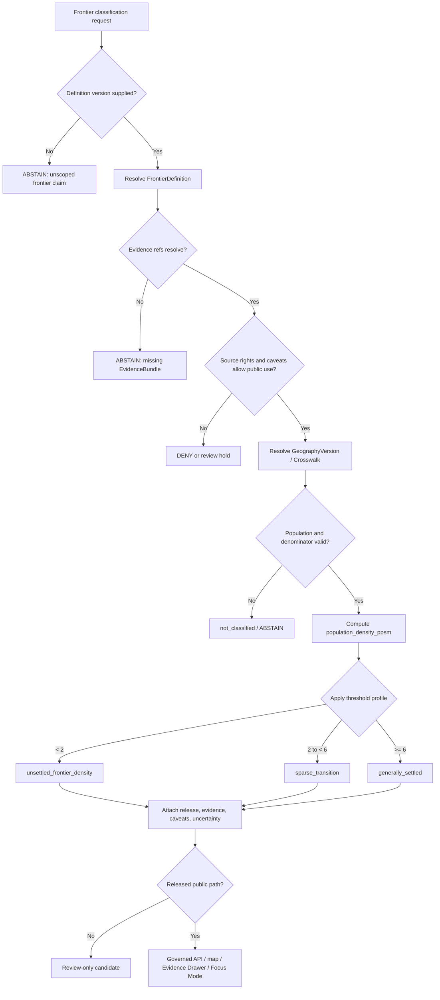

<!-- [KFM_META_BLOCK_V2]
doc_id: kfm://doc/NEEDS-VERIFICATION-ADR-frontier-definition-and-thresholds
title: ADR: Frontier Definition and Thresholds
type: standard
version: v1
status: draft
owners: OWNER_TBD_NEEDS_VERIFICATION
created: 2026-05-08
updated: 2026-05-08
policy_label: NEEDS_VERIFICATION
related: [../../README.md, ./README.md, ./ADR-TEMPLATE.md, ./ADR-frontier-panel-observation-model.md, ./ADR-frontier-bitemporal-release-model.md, ./ADR-0001-schema-home.md, ./ADR-0002-responsibility-root-monorepo.md, ../architecture/contract-schema-policy-split.md, NEEDS_VERIFICATION:US_Census_Frontier_Line_Source]
tags: [kfm, adr, frontier, thresholds, demography, population-density, evidence, governance, rollback]
notes: [Replaces placeholder ADR content for docs/adr/ADR-frontier-definition-and-thresholds.md. Decision is PROPOSED. Owners, policy label, source descriptors, schemas, validators, release artifacts, workflow enforcement, and test results remain NEEDS VERIFICATION.]
[/KFM_META_BLOCK_V2] -->

<a id="top"></a>
<a id="adr-frontier-definition-and-thresholds"></a>

# ADR: Frontier Definition and Thresholds

Define “frontier” as a versioned, evidence-bound classification model — not as a global boolean, map style, or unscoped historical label.

<p align="center">
  
  
  
  
  
  
</p>

<p align="center">
  <a href="#decision-summary">Decision</a> ·
  <a href="#evidence-boundary">Evidence</a> ·
  <a href="#repo-fit">Repo fit</a> ·
  <a href="#definition-rule">Definition rule</a> ·
  <a href="#default-threshold-model">Thresholds</a> ·
  <a href="#classification-flow">Flow</a> ·
  <a href="#implementation-impact">Impact</a> ·
  <a href="#validation-plan">Validation</a> ·
  <a href="#rollback-and-supersession">Rollback</a> ·
  <a href="#open-verification-backlog">Open verification</a>
</p>

> [!IMPORTANT]
> **Decision status:** `PROPOSED`.
>
> This ADR defines the proposed KFM rule for frontier classification and threshold ownership. It does **not** claim that schemas, validators, policies, release manifests, public APIs, dashboards, map layers, or Focus Mode responses already enforce the rule.

> [!NOTE]
> The previous file was a placeholder. This revision turns it into decision-ready ADR content while keeping implementation maturity visibly bounded.

---

## Decision summary

| Field | Determination |
|---|---|
| ADR | `docs/adr/ADR-frontier-definition-and-thresholds.md` |
| Status | `proposed` |
| Owning root | `docs/` |
| Owning subdirectory | `docs/adr/` |
| Decision area | Frontier-domain definition, threshold model, classification semantics, and public wording |
| Primary domain | Frontier demography, economy, settlement, land, geography, and time matrix |
| Core decision | KFM must classify frontier status through a versioned `FrontierDefinition` object that declares thresholds, units, measurement scope, source basis, geography version, valid time, record time, evidence support, uncertainty, review state, release state, and rollback path. |
| Default reference model | Use a **Census-density reference model** as the initial historical benchmark: `< 2 persons/sq mi` as `unsettled_frontier_density`, `2 to < 6 persons/sq mi` as `sparse_transition`, and `>= 6 persons/sq mi` as `generally_settled`. |
| Boundary rule | A public claim must never say simply “this county was frontier” unless it names the `FrontierDefinition` version, threshold profile, geography version, valid time, release context, and evidence support. |
| Default failure behavior | Missing definition, ambiguous threshold, unsupported geography denominator, unresolved evidence, unknown rights, source-universe caveat, or missing release linkage returns `ABSTAIN`, `DENY`, `ERROR`, or review hold rather than a fluent classification. |
| Implementation maturity | `NEEDS VERIFICATION` |

### One-line decision rule

> “Frontier” in KFM is a **definition-versioned classification** computed from declared thresholds and admissible evidence, not a timeless label.

### One-line public-surface rule

> Public UI, API, map, export, dashboard, story, and Focus Mode outputs must display or link the frontier definition used, including threshold profile, source caveats, and release state.

[Back to top](#top)

---

## Repo fit

`docs/adr/` is the correct home for this file because the decision affects source interpretation, domain modeling, schema design, release semantics, public wording, and rollback. It is human-facing architecture governance, not a machine schema, policy rule, data registry, release artifact, or runtime route.

| Relationship | Path | Status | Role |
|---|---|---:|---|
| This ADR | `docs/adr/ADR-frontier-definition-and-thresholds.md` | `CONFIRMED path / revised content PROPOSED` | Decision record for frontier definition and threshold ownership. |
| ADR index | [`./README.md`](./README.md) | `CONFIRMED path / coverage NEEDS VERIFICATION` | ADR navigation, review discipline, status labels, rollback, and supersession expectations. |
| ADR template | [`./ADR-TEMPLATE.md`](./ADR-TEMPLATE.md) | `CONFIRMED path` | Local ADR structure: evidence, impact, validation, rollback, and supersession. |
| Frontier panel ADR | [`./ADR-frontier-panel-observation-model.md`](./ADR-frontier-panel-observation-model.md) | `CONFIRMED placeholder path` | Companion decision for observation families used by frontier panels. |
| Frontier bitemporal ADR | [`./ADR-frontier-bitemporal-release-model.md`](./ADR-frontier-bitemporal-release-model.md) | `CONFIRMED path / proposed content` | Companion decision for valid-time, record-time, release, correction, and rollback semantics. |
| Schema-home ADR | [`./ADR-0001-schema-home.md`](./ADR-0001-schema-home.md) | `CONFIRMED path / proposed decision` | Governs proposed machine-schema home for any future `FrontierDefinition` schema. |
| Contract/schema/policy split | [`../architecture/contract-schema-policy-split.md`](../architecture/contract-schema-policy-split.md) | `CONFIRMED path / enforcement NEEDS VERIFICATION` | Explains: contracts define meaning, schemas validate shape, policy decides admissibility. |
| Root README | [`../../README.md`](../../README.md) | `CONFIRMED path / draft authority` | States KFM identity, lifecycle, public-client boundary, and inspectable-claim posture. |

### Directory Rules basis

This ADR stays under `docs/adr/` because ADRs are human-facing decision records. Frontier-domain implementation work should appear under responsibility roots such as:

```text
docs/domains/<domain>/
contracts/domains/<domain>/
schemas/contracts/v1/domains/<domain>/
policy/domains/<domain>/
tests/domains/<domain>/
fixtures/domains/<domain>/
data/{raw,work,quarantine,processed,catalog,triplets,published}/<domain>/
release/
```

It must **not** create a new root-level `frontier/` folder unless a future ADR explicitly justifies that exception.

[Back to top](#top)

---

## Context and problem

KFM needs a frontier matrix that can support county-year panels, population observations, geography versions, economic observations, settlement evidence, access observations, land-office context, crosswalks, uncertainty classes, releases, corrections, and rollback.

A loose “frontier” label is too ambiguous for that job.

| Ambiguous claim | Trust problem |
|---|---|
| “County X was frontier in 1870.” | Does this mean population density, settlement continuity, rail access, land-office status, market access, military/Indigenous boundary, or another definition? |
| “The frontier moved west.” | Which source universe, geography version, and threshold model produced the line? |
| “The 1890 frontier closed.” | Is this a Census density statement, a historical interpretation, or a KFM classification? |
| “This panel uses the frontier threshold.” | Which threshold? `< 2`, `< 6`, a composite definition, or a later domain-specific definition? |
| “This current map layer is correct.” | Correct as of which `valid_time`, `record_time`, `release_id`, geography version, and correction state? |

KFM’s doctrine requires an inspectable claim. Therefore a frontier classification must carry its definition, source basis, threshold profile, evidence support, temporal scope, policy posture, review state, release state, correction path, and rollback target.

[Back to top](#top)

---

## Evidence boundary

This ADR is grounded in accessible repository evidence, supplied KFM doctrine, and official Census source anchors for the historical density benchmark. It remains bounded because local mounted repository files, branch protections, workflow run logs, released frontier artifacts, source descriptors, validators, and runtime behavior were not available in the local workspace for this session.

| Evidence item | Status | Supports | Does not prove |
|---|---:|---|---|
| `docs/adr/ADR-frontier-definition-and-thresholds.md` | `CONFIRMED path` | Existing file is a placeholder for this decision area. | That implementation exists. |
| `docs/adr/README.md` | `CONFIRMED path` | ADRs are the human-facing decision ledger; enforcement still requires repository evidence. | Complete ADR inventory or branch enforcement. |
| `docs/adr/ADR-TEMPLATE.md` | `CONFIRMED path` | ADRs should include evidence, impact, validation, rollback, supersession, and narrow truth labels. | That this ADR is accepted. |
| `docs/adr/ADR-frontier-panel-observation-model.md` | `CONFIRMED placeholder path` | Frontier panel observation model is an acknowledged decision gap. | Implemented panel schemas or tests. |
| `docs/adr/ADR-frontier-bitemporal-release-model.md` | `CONFIRMED path / proposed content` | Frontier releases should preserve valid time, record time, release state, correction state, and rollback. | Live release enforcement. |
| `docs/adr/ADR-0001-schema-home.md` | `CONFIRMED path / proposed decision` | Proposed schema-home split: `schemas/contracts/v1/` for machine schemas, `contracts/` for meaning, `policy/` for admissibility. | Final accepted schema-home enforcement. |
| `docs/architecture/contract-schema-policy-split.md` | `CONFIRMED path` | Contracts mean, schemas shape, policy decides. | Workflow/test enforcement. |
| `README.md` | `CONFIRMED path / draft authority` | KFM identity, inspectable claim posture, lifecycle law, public-client boundary, finite governed-AI outcomes. | Full repo implementation maturity. |
| Directory Rules | `CONFIRMED supplied doctrine` | Root folders are responsibility boundaries; domain work belongs under responsibility roots. | Current branch conformance without inventory. |
| U.S. Census Bureau frontier-line material | `CONFIRMED external source anchor` | Historical Census benchmark for frontier/unsettled territory and density bands. | That KFM has ingested, licensed, or validated Census source descriptors. |
| KFM Implementation Reference | `LINEAGE / NEEDS VERIFICATION` | Frontier lane should use `FrontierDefinition`, geography versions, observation families, and bitemporal releases. | Current branch implementation without reinspection. |

### Evidence rule applied here

- `CONFIRMED` describes surfaced repository files, supplied doctrine, official source facts, or current-session inspection.
- `PROPOSED` describes the architecture this ADR recommends.
- `NEEDS VERIFICATION` describes a concrete follow-up check.
- `UNKNOWN` describes unverified repo, runtime, release, workflow, or platform state.
- Repetition across reports is lineage and pressure, not implementation proof.

[Back to top](#top)

---

## Requirements and constraints

### KFM invariants checked

| Invariant | ADR effect | Status |
|---|---|---:|
| `RAW -> WORK / QUARANTINE -> PROCESSED -> CATALOG / TRIPLET -> PUBLISHED` | Frontier definitions, threshold configs, observations, panel cells, and releases must pass lifecycle gates before public use. | `CONFIRMED doctrine / PROPOSED implementation` |
| Public clients use governed interfaces and released artifacts | Public frontier map/API/dashboard/Focus Mode surfaces must consume released envelopes or released artifacts. | `CONFIRMED doctrine / PROPOSED implementation` |
| `EvidenceRef -> EvidenceBundle` before consequential claims | Every public frontier classification must resolve to evidence or abstain. | `CONFIRMED doctrine / PROPOSED implementation` |
| Promotion is a governed state transition | Threshold changes and matrix releases require validation, review, release manifest, correction path, and rollback target. | `CONFIRMED doctrine / PROPOSED implementation` |
| AI is interpretive only | Focus Mode may explain a released classification; it may not invent a definition or threshold. | `CONFIRMED doctrine / PROPOSED implementation` |
| Derived products stay derived | County-year panels, PMTiles, GeoParquet, graph projections, summaries, reports, and dashboards remain rebuildable carriers. | `CONFIRMED doctrine / PROPOSED implementation` |
| Corrections are first-class | Definition and threshold corrections create new versions or notices; they do not silently rewrite prior releases. | `CONFIRMED doctrine / PROPOSED implementation` |
| Rights, source roles, and sensitivity fail closed | Unknown source rights, culturally sensitive context, restricted land/person records, or source-universe caveats block unqualified public claims. | `PROPOSED / NEEDS VERIFICATION` |

### Non-goals

This ADR does **not** decide:

- the full frontier panel observation model;
- the full bitemporal release model;
- the final database engine, ORM, route names, or UI components;
- the final JSON Schema field names;
- source activation for Census, historical atlases, land-office records, county histories, rail sources, agricultural sources, or economic sources;
- source-rights review for any external dataset;
- a root-level `frontier/` folder;
- publication of any frontier layer or dataset.

[Back to top](#top)

---

## Definition rule

KFM must treat `FrontierDefinition` as the required definition object for frontier classification.

A `FrontierDefinition` is the evidence-bound, versioned statement of:

1. **what kind of frontier is being classified;**
2. **which thresholds are used;**
3. **which geography version and denominator are used;**
4. **which source universe and exclusions apply;**
5. **which valid-time period the definition applies to;**
6. **when KFM recorded, reviewed, released, corrected, or superseded it;**
7. **how uncertainty, source conflict, and public wording are handled.**

### Required conceptual fields

> [!CAUTION]
> This is conceptual ADR content, not a machine schema. Final schemas belong in the accepted schema home after repo verification.

| Field family | Required meaning |
|---|---|
| `definition_id` | Stable identifier for the definition version. |
| `definition_version` | Version string or monotonic revision marker. |
| `definition_kind` | Example: `census_density_reference`, `settlement_continuity`, `market_access`, `composite_frontier`. |
| `threshold_profile` | Explicit threshold values, units, comparison operators, and boundary behavior. |
| `measurement_scope` | Population universe, denominator, geography version, area basis, aggregation method, and time granularity. |
| `source_lens` | Whose definition or perspective is being operationalized. |
| `source_universe_caveats` | Source exclusions, missing populations, suppression, coverage gaps, and known limitations. |
| `valid_time` | Historical period where the definition is intended to apply. |
| `record_time` | When KFM recorded, accepted, corrected, or superseded the definition. |
| `evidence_refs` | Evidence supporting the definition and thresholds. |
| `policy` | Public label, sensitivity posture, rights posture, and release obligations. |
| `review` | Domain, policy, source, or steward review state. |
| `release` | Release manifest or release candidate linkage where used publicly. |
| `rollback` | Rollback target or supersession path. |

### Definition kinds

| Definition kind | Status | Use |
|---|---:|---|
| `census_density_reference` | `PROPOSED default first model` | Historical population-density benchmark anchored to Census frontier-line conventions. |
| `settlement_continuity` | `PROPOSED / NEEDS VERIFICATION` | Classification based on contiguous settlement, town/city presence, or settlement discontinuity. |
| `market_access` | `PROPOSED / NEEDS VERIFICATION` | Classification based on access to rail, road, river, depot, market center, or land office. |
| `land_administration_frontier` | `PROPOSED / NEEDS VERIFICATION` | Classification based on land-office, county organization, public-land, or administrative transition evidence. |
| `composite_frontier` | `PROPOSED / high review burden` | Multi-factor classification combining density, access, settlement, economy, land administration, and uncertainty. |

> [!IMPORTANT]
> A source-specific or historian-specific definition must be labeled as a source lens. KFM should preserve the fact that historical “frontier” definitions can encode particular administrative, settler-colonial, census, or analytical perspectives.

[Back to top](#top)

---

## Default threshold model

The first KFM frontier threshold model should be the **Census-density reference model** because it is historically legible, source-anchored, and simple enough to test before composite definitions are introduced.

### `census_density_reference_v1`

| Band | Rule | KFM label | Public wording |
|---|---:|---|---|
| Density-unsettled / frontier-density candidate | `population_density_ppsm < 2` | `unsettled_frontier_density` | “Census-density frontier / unsettled-density band under this definition.” |
| Sparse transition | `2 <= population_density_ppsm < 6` | `sparse_transition` | “Sparse settlement transition band under this definition.” |
| Generally settled | `population_density_ppsm >= 6` | `generally_settled` | “Generally settled density band under this definition.” |
| Not classified | missing, unsupported, rights-blocked, or unresolved evidence | `not_classified` | “Not classified; evidence, denominator, rights, geography, or release context is insufficient.” |

### Boundary conditions

| Case | Result |
|---|---|
| Exactly `2.0` persons/sq mi | `sparse_transition` |
| Exactly `6.0` persons/sq mi | `generally_settled` |
| Missing population | `not_classified` |
| Missing area denominator | `not_classified` |
| Ambiguous land-area vs total-area denominator | `ABSTAIN` until declared |
| Crosswalked geography with unreviewed uncertainty | `not_classified` or review hold |
| Source caveat affects interpretation | Classification may proceed only if caveat is visible and policy allows |
| Restricted or rights-unclear source | `DENY` or release hold for public path |

### Measurement rules

| Measurement element | Rule |
|---|---|
| Population numerator | Must declare source, enumeration universe, and exclusions. |
| Area denominator | Must declare land area or source-defined area denominator; do not mix silently. |
| Unit | Persons per square mile, unless a definition version explicitly declares a different unit. |
| Geography | Must name `GeographyVersion` or `Crosswalk` support. |
| Time | Must name valid year or valid interval and source granularity. |
| Evidence | Must resolve to `EvidenceBundle` before public claim. |
| Threshold owner | Must be `OWNER_TBD_NEEDS_VERIFICATION` until a maintainer/steward role is confirmed. |
| Threshold change | Must create a new `FrontierDefinition` version and update `spec_hash`, tests, release notes, and rollback target. |

### Source-universe caveat

When the Census-density reference model uses historical Census material, KFM must preserve source-universe caveats such as historical exclusions, including the Census note that pre-1900 frontier-line data did not include “Indians not taxed.”

KFM must not convert that source universe into an unqualified claim about all people, all settlement, Indigenous presence, land occupation, or cultural geography.

[Back to top](#top)

---

## Composite definitions

Composite frontier definitions may be useful later, but they carry a higher review burden.

A composite definition must declare:

- component metrics;
- source roles;
- threshold values;
- weights or Boolean logic;
- uncertainty rules;
- missing-data behavior;
- geography and denominator rules;
- review owner;
- evidence closure;
- public wording;
- release and rollback behavior.

### Composite definition example

```yaml
# Illustrative only. Not a machine schema.
definition_id: frontier_definition:composite:v1
definition_kind: composite_frontier
status: PROPOSED
valid_time:
  start: "1860-01-01"
  end: "1891-01-01"
threshold_profile:
  operator: weighted_score
  components:
    - metric: population_density_ppsm
      rule: "< 2"
      weight: 0.50
    - metric: rail_or_market_access_distance
      rule: "> threshold_declared_elsewhere"
      weight: 0.20
    - metric: county_organization_status
      rule: "unorganized_or_recently_organized"
      weight: 0.15
    - metric: agricultural_settlement_indicator
      rule: "below declared threshold"
      weight: 0.15
missing_data_behavior: ABSTAIN_UNLESS_REVIEWED
evidence_refs:
  - evidence_ref:NEEDS_VERIFICATION
review:
  required: true
  owner: OWNER_TBD_NEEDS_VERIFICATION
```

> [!WARNING]
> Do not publish composite frontier classifications until the component sources, thresholds, weights, uncertainty classes, and public wording pass domain and policy review.

[Back to top](#top)

---

## Classification flow



[Back to top](#top)

---

## Query and display semantics

### Required public context

A public frontier response must include, or link to, these fields:

| Field | Why it matters |
|---|---|
| `frontier_definition_ref` | Prevents unscoped “frontier” claims. |
| `threshold_profile_ref` | Shows which thresholds were applied. |
| `valid_time` | Shows the historical period. |
| `record_time` or release cutoff | Shows what KFM knew at the time of release. |
| `geography_version_ref` | Shows which boundary or crosswalk was used. |
| `population_density_ppsm` | Shows the computed density when density-based. |
| `classification_label` | Shows the resulting band. |
| `source_universe_caveats` | Shows exclusions, suppressed data, or source limits. |
| `uncertainty_class` | Shows boundary, crosswalk, source, or metric uncertainty. |
| `evidence_refs` | Allows Evidence Drawer resolution. |
| `policy_label` | Shows public/restricted status. |
| `release_id` | Shows release context. |
| `correction_state` | Shows whether the claim is current, corrected, superseded, or withdrawn. |

### Unscoped claim behavior

| User asks | Required behavior |
|---|---|
| “Was Kansas frontier in 1870?” | Ask for or infer a released definition only if the UI clearly declares it; otherwise `ABSTAIN`. |
| “Show the frontier line.” | Require definition version, valid time, geography version, and release. |
| “Why did this county change classification?” | Show threshold, source, geography, observation, release, and correction differences. |
| “Use the frontier definition.” | `ABSTAIN`: definition is ambiguous. |
| “Use Census-density reference v1.” | Proceed if evidence, geography, rights, release, and policy gates pass. |

### Public wording rule

Use definition-scoped wording:

```text
Census-density reference v1 classified this county-year as sparse_transition.
```

Avoid unqualified wording:

```text
This county was the frontier.
```

[Back to top](#top)

---

## Implementation impact

All paths below are `PROPOSED` unless already confirmed by repository evidence. If the active checkout uses different conventions, adapt through the accepted responsibility-root and schema-home ADRs rather than creating duplicate authority.

| Path | Status | Purpose |
|---|---:|---|
| `docs/adr/ADR-frontier-definition-and-thresholds.md` | `CONFIRMED path / revised content PROPOSED` | This decision record. |
| `docs/domains/frontier-matrix/README.md` | `PROPOSED` | Domain landing page for scope, inputs, exclusions, and release burden. |
| `docs/domains/frontier-matrix/ARCHITECTURE.md` | `PROPOSED` | Frontier matrix architecture and object relationships. |
| `contracts/domains/frontier-matrix/frontier-definition.md` | `PROPOSED` | Semantic contract for `FrontierDefinition`. |
| `schemas/contracts/v1/domains/frontier-matrix/frontier_definition.schema.json` | `PROPOSED / depends on schema-home acceptance` | Machine-checkable schema for definition object. |
| `schemas/contracts/v1/domains/frontier-matrix/frontier_classification.schema.json` | `PROPOSED / depends on schema-home acceptance` | Machine-checkable schema for classification result. |
| `policy/domains/frontier-matrix/frontier_definition.rego` | `PROPOSED` | Policy rules for missing definitions, unknown source caveats, public wording, and release eligibility. |
| `fixtures/domains/frontier-matrix/valid/census_density_reference_v1.json` | `PROPOSED` | Valid threshold fixture. |
| `fixtures/domains/frontier-matrix/invalid/unscoped_frontier_claim.json` | `PROPOSED` | Negative fixture for missing definition. |
| `fixtures/domains/frontier-matrix/invalid/ambiguous_denominator.json` | `PROPOSED` | Negative fixture for area denominator ambiguity. |
| `tests/domains/frontier-matrix/test_frontier_thresholds.py` | `PROPOSED` | Boundary tests for `< 2`, `2 to < 6`, and `>= 6`. |
| `tests/domains/frontier-matrix/test_frontier_policy.py` | `PROPOSED` | Policy negative-path tests for unscoped, rights-unclear, and caveat-hidden claims. |
| `data/registry/frontier-matrix/sources.yaml` | `PROPOSED / NEEDS VERIFICATION` | Candidate source descriptor registry if the active repo accepts this home. |
| `release/frontier-matrix/` | `PROPOSED / NEEDS VERIFICATION` | Release manifests, promotion decisions, rollback cards when this lane publishes. |

### Related docs to update if this ADR lands

| Surface | Required update |
|---|---|
| `docs/adr/README.md` | Add or update inventory entry for this ADR. |
| `docs/adr/ADR-frontier-panel-observation-model.md` | Link this ADR as the threshold/definition decision. |
| `docs/adr/ADR-frontier-bitemporal-release-model.md` | Link this ADR as definition input for release semantics. |
| `README.md` | Mention only if root domain matrix summary is updated. |
| `docs/domains/README.md` | Add frontier matrix lane only after domain landing page exists. |
| `contracts/README.md` and `schemas/README.md` | Update only if machine/semantic object homes are added. |
| `policy/README.md` | Update if frontier policy rules are added. |
| `tests/README.md` or fixture docs | Update if frontier fixtures/tests are added. |

[Back to top](#top)

---

## Validation plan

No validation was run as part of this Markdown revision. The plan below defines what must pass before this ADR can move toward acceptance or enforcement.

### Required checks

| Check | Expected result | Status |
|---|---|---:|
| ADR inventory | `docs/adr/README.md` includes this ADR and links companions. | `NEEDS VERIFICATION` |
| Schema-home check | Any future `FrontierDefinition` schema uses accepted schema home. | `NEEDS VERIFICATION` |
| Threshold boundary tests | `< 2`, exactly `2`, just below `6`, exactly `6`, and missing density all produce expected results. | `PROPOSED` |
| Denominator test | Missing or ambiguous area denominator blocks classification. | `PROPOSED` |
| Evidence closure test | Classification cannot publish without `EvidenceBundle` support. | `PROPOSED` |
| Source-universe caveat test | Census-derived classifications expose source caveats. | `PROPOSED` |
| Public wording test | Public output cannot use unqualified “frontier” wording. | `PROPOSED` |
| Policy negative-path test | Unknown rights, restricted source, or hidden caveat causes `DENY`, `ABSTAIN`, or review hold. | `PROPOSED` |
| Release linkage test | Published classification includes release ID, definition ref, geography version, and rollback target. | `PROPOSED` |
| Spec-hash test | Threshold changes create a new `spec_hash` and definition version. | `PROPOSED` |
| Bitemporal companion test | Classification links to valid-time and record-time semantics. | `PROPOSED` |

### Boundary fixtures

| Fixture | Expected outcome |
|---|---|
| `population_density_ppsm = 1.999` | `unsettled_frontier_density` |
| `population_density_ppsm = 2.000` | `sparse_transition` |
| `population_density_ppsm = 5.999` | `sparse_transition` |
| `population_density_ppsm = 6.000` | `generally_settled` |
| `population_density_ppsm = null` | `not_classified` or `ABSTAIN` |
| missing `frontier_definition_ref` | `ABSTAIN` |
| missing `geography_version_ref` | `ABSTAIN` |
| missing denominator | `ABSTAIN` |
| source caveat hidden | validation failure |
| threshold profile changed without version bump | validation failure |
| public release without rollback target | promotion failure |

### Illustrative test sketch

```python
# Illustrative only. Final test code must follow repo-native conventions.

def classify_density(density: float | None) -> str:
    if density is None:
        return "not_classified"
    if density < 2:
        return "unsettled_frontier_density"
    if density < 6:
        return "sparse_transition"
    return "generally_settled"


def test_census_density_reference_v1_boundaries():
    assert classify_density(1.999) == "unsettled_frontier_density"
    assert classify_density(2.000) == "sparse_transition"
    assert classify_density(5.999) == "sparse_transition"
    assert classify_density(6.000) == "generally_settled"
    assert classify_density(None) == "not_classified"
```

> [!CAUTION]
> This sketch is not implementation proof. It exists to make the required boundary behavior reviewable.

[Back to top](#top)

---

## Policy, rights, and sensitivity

Frontier-domain material may involve public historical statistics, but it can also intersect with culturally sensitive histories, Indigenous presence, land ownership, land title misunderstandings, private-property narratives, suppressed small counts, archival restrictions, and source-universe exclusions.

| Risk | Default handling |
|---|---|
| Census source universe excludes groups or uses historical administrative categories | Expose caveat; do not universalize the claim. |
| Indigenous presence or cultural geography is flattened by density bands | Add source-lens caveat; require review for interpretive language. |
| Land ownership or public-land records are treated as title truth | Deny title-like claim unless land lane evidence and review support it. |
| Sparse population is used as “empty land” language | Reject wording; use source-scoped density language. |
| Suppressed or missing economic/agricultural values | Preserve suppression; do not infer hidden values. |
| Boundary crosswalk uncertainty affects density | Expose uncertainty or abstain. |
| Unknown source rights | Hold, quarantine, or deny public release. |
| AI-generated explanation expands beyond evidence | `ABSTAIN` or citation validation failure. |

### Public wording constraints

Allowed wording:

```text
Under Census-density reference v1, this county-year falls in the sparse_transition band.
```

Blocked wording:

```text
This land was empty.
This county was objectively frontier.
The frontier ended here.
```

[Back to top](#top)

---

## Rollback and supersession

### Rollback plan

If this ADR is wrong or harmful:

1. Preserve this ADR as lineage.
2. Mark it `superseded`, `withdrawn`, or `deprecated`.
3. Create a successor ADR with a corrected definition model.
4. Retire affected `FrontierDefinition` versions rather than deleting them.
5. Recompute or withdraw affected matrix releases.
6. Emit correction notices for public outputs that changed meaning.
7. Repoint public aliases only through release/rollback procedure.
8. Preserve old threshold versions for as-of release reconstruction.
9. Update ADR index, domain docs, contracts, schemas, policy, tests, fixtures, release manifests, and rollback cards.

### Rollback triggers

| Trigger | Required action |
|---|---|
| Official source interpretation is wrong | Review hold; successor ADR or corrected source note. |
| Threshold bands are too broad or misleading | New `FrontierDefinition` version; update tests and public wording. |
| Definition is used without source caveats | Withdraw or correct public release. |
| Public output uses unscoped “frontier” claim | Block release or issue correction. |
| Denominator is discovered inconsistent | Recompute affected panel; mark prior release superseded or withdrawn. |
| Unknown rights or sensitivity appears | Deny public path; quarantine or restrict affected outputs. |
| Composite definition produces misleading result | Retire composite definition and fall back to density reference or abstain. |

### Supersession rule

A future ADR may supersede this one only if it preserves:

- explicit definition versioning;
- threshold ownership and boundary rules;
- source-universe caveat display;
- evidence closure;
- public wording constraints;
- release/correction/rollback linkage;
- negative-path validation.

[Back to top](#top)

---

## Consequences

### Positive consequences

- Prevents unscoped frontier claims from entering public surfaces.
- Makes threshold changes reviewable, testable, and reversible.
- Keeps Census-density reference behavior simple enough for a first proof slice.
- Allows later composite definitions without silently rewriting the baseline.
- Preserves source-lens caveats instead of flattening historical meaning.
- Connects frontier classification to bitemporal release governance.

### Tradeoffs and risks

| Risk | Mitigation | Residual status |
|---|---|---:|
| Density-only threshold oversimplifies frontier history. | Label it as `census_density_reference`, not universal truth. | `Known tradeoff` |
| Composite definitions may become politically or analytically contested. | Require source roles, weights, review, uncertainty, and release notes. | `NEEDS VERIFICATION` |
| Threshold bands may be mistaken for moral or cultural claims. | Public wording constraints and source-lens caveats. | `Needs UI/API enforcement` |
| Source caveats may be omitted in derived layers. | Require caveat fixture and Evidence Drawer payload validation. | `PROPOSED` |
| Geography changes can alter density. | Require `GeographyVersion` and crosswalk uncertainty. | `PROPOSED` |
| Repo paths may differ from proposed homes. | Use Directory Rules and accepted ADRs before creating files. | `NEEDS VERIFICATION` |

[Back to top](#top)

---

## Open verification backlog

| Item | Status | Why it matters |
|---|---:|---|
| ADR owner | `NEEDS VERIFICATION` | Threshold ownership must be accountable before acceptance. |
| Policy label | `NEEDS VERIFICATION` | Public/restricted status should not be inferred from path. |
| ADR index update | `NEEDS VERIFICATION` | This ADR should be discoverable from `docs/adr/README.md`. |
| Source descriptor for Census frontier reference | `NEEDS VERIFICATION` | External source facts must become KFM-governed source descriptors before enforcement. |
| Frontier domain landing page | `PROPOSED` | Domain scope, accepted inputs, and exclusions need a repo-native home. |
| `FrontierDefinition` semantic contract | `PROPOSED` | Needed before schema and policy can be stable. |
| `FrontierDefinition` schema | `PROPOSED / depends on schema-home ADR` | Needed for machine validation. |
| Threshold fixtures | `PROPOSED` | Boundary behavior must be testable. |
| Public wording validator | `PROPOSED` | UI/API outputs must avoid unscoped claims. |
| Release linkage | `UNKNOWN` | Matrix releases and rollback cards were not inspected as emitted artifacts. |
| Workflow enforcement | `UNKNOWN` | No test or workflow run was inspected for this ADR. |
| Branch protection | `UNKNOWN` | Cannot claim merge-blocking enforcement. |
| Composite definition policy | `NEEDS VERIFICATION` | Composite definitions need separate review burden. |
| Source-universe caveat display | `NEEDS VERIFICATION` | Census caveats must be visible in public outputs if used. |

[Back to top](#top)

---

## Review checklist

<details>
<summary>Pre-merge checklist</summary>

- [ ] Meta block values are replaced or deliberately marked `NEEDS VERIFICATION`.
- [ ] ADR title, meta block title, filename, and ADR index entry are synchronized.
- [ ] Truth labels are narrow and evidence-bound.
- [ ] This ADR is added to `docs/adr/README.md`.
- [ ] Companion ADRs are linked: frontier panel observation model and frontier bitemporal release model.
- [ ] Directory Rules are respected; no root-level domain folder is created.
- [ ] `FrontierDefinition` is treated as semantic object meaning before machine schema work.
- [ ] No schema, policy, source registry, or release home is duplicated.
- [ ] Census-density threshold bands are labeled as a source-scoped reference model, not universal truth.
- [ ] `< 2`, `2 to < 6`, and `>= 6` boundary behavior is explicit.
- [ ] Source-universe caveats are listed and not hidden.
- [ ] Public wording avoids unscoped “frontier” claims.
- [ ] Negative-path behavior is specified for missing definition, evidence, denominator, geography, release, rights, and rollback.
- [ ] Validation plan includes boundary fixtures and policy fixtures.
- [ ] Rollback and supersession path is reviewable.
- [ ] Implementation claims remain `NEEDS VERIFICATION` until schemas, validators, tests, workflows, releases, and runtime behavior are inspected.

</details>

[Back to top](#top)

---

## References

External source anchors used for the proposed Census-density reference model:

- [U.S. Census Bureau — Following the Frontier Line, 1790 to 1890][census-frontier-line]
- [U.S. Census Bureau — Frontier Line accessibility data][census-frontier-accessibility]
- [U.S. Census Bureau — Statistical Atlases][census-statistical-atlases]
- [U.S. Census Bureau — History and the Census: 1890 Census Fire][census-1890-fire]

[census-frontier-line]: https://www.census.gov/library/visualizations/2012/comm/frontier-line_001.html
[census-frontier-accessibility]: https://www.census.gov/dataviz/visualizations/001/508.php
[census-statistical-atlases]: https://www.census.gov/about/history/historical-censuses-and-surveys/census-programs-surveys/geography/statistical-atlases.html
[census-1890-fire]: https://www.census.gov/about/history/stories/monthly/2021/january-2021.html
