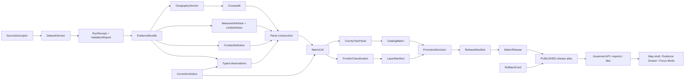
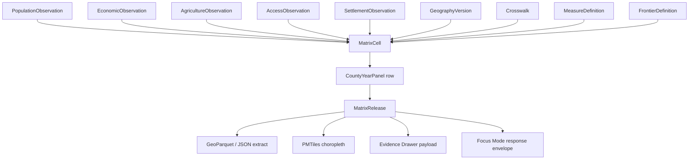

<!-- [KFM_META_BLOCK_V2]
doc_id: kfm://doc/NEEDS-VERIFICATION-ADR-frontier-panel-observation-model
title: ADR: Frontier Panel Observation Model
type: standard
version: v1
status: draft
owners: OWNER_TBD_NEEDS_VERIFICATION
created: 2026-05-08
updated: 2026-05-08
policy_label: NEEDS_VERIFICATION
related: [../../README.md, ./README.md, ./ADR-0001-schema-home.md, ./ADR-0002-responsibility-root-monorepo.md, ./ADR-frontier-bitemporal-release-model.md, ../architecture/contract-schema-policy-split.md, NEEDS_VERIFICATION:KFM_Implementation_Reference, NEEDS_VERIFICATION:KFM_Encyclopedia]
tags: [kfm, adr, frontier, observation-model, county-year-panel, evidence, temporal, governance]
notes: [Replaces placeholder ADR language for docs/adr/ADR-frontier-panel-observation-model.md. Owners, policy label, source rights, complete schema consumers, validator coverage, workflow enforcement, release artifacts, and runtime behavior remain NEEDS VERIFICATION.]
[/KFM_META_BLOCK_V2] -->

<a id="top"></a>
<a id="adr-frontier-panel-observation-model"></a>

# ADR: Frontier Panel Observation Model

Define the source-bound observation model behind the Kansas Frontier Matrix frontier county-year panel so matrix cells remain inspectable, reproducible, policy-aware, and correctable.

<p align="center">
  
  
  
  
  
  
</p>

<p align="center">
  <a href="#decision-summary">Decision</a> ·
  <a href="#repo-fit">Repo fit</a> ·
  <a href="#evidence-boundary">Evidence</a> ·
  <a href="#problem">Problem</a> ·
  <a href="#chosen-model">Chosen model</a> ·
  <a href="#object-rules">Object rules</a> ·
  <a href="#validation-plan">Validation</a> ·
  <a href="#impact-map">Impact</a> ·
  <a href="#rollback-and-supersession">Rollback</a> ·
  <a href="#open-verification-backlog">Open verification</a>
</p>

> [!IMPORTANT]
> **Decision status:** `PROPOSED`.
>
> This ADR settles the proposed architecture for the **frontier panel observation model**. It does **not** claim that schemas, validators, workflows, source registries, matrix releases, APIs, UI components, or runtime behavior already enforce the model.

> [!NOTE]
> The target file previously existed as a placeholder ADR. This revision turns that placeholder into decision-ready content while keeping implementation enforcement `NEEDS VERIFICATION`.

---

## Decision summary

| Field | Determination |
|---|---|
| ADR | `docs/adr/ADR-frontier-panel-observation-model.md` |
| Status | `proposed` |
| Owning root | `docs/` |
| Owning subdirectory | `docs/adr/` |
| Decision area | Frontier-domain observation modeling and county-year panel construction |
| Primary domain | Frontier demography, economy, settlement, land, access, and time matrix |
| Core decision | Model source-backed measures as typed, evidence-bound observations. Treat county-year panel rows and frontier classifications as derived analytical products, not source truth. |
| Panel grain | County-year is the first public-safe analytical grain unless a future ADR and evidence package support a finer grain. |
| Required context | Every claim-bearing observation must carry measure identity, source role, geography version, temporal support, unit/denominator semantics, provenance, evidence refs, policy posture, and uncertainty support. |
| Derived-output rule | `CountyYearPanel`, `MatrixCell`, `frontier_member`, `frontier_score`, PMTiles, GeoParquet, dashboards, graph projections, summaries, and AI answers are downstream carriers. They do not replace source observations or EvidenceBundles. |
| Default failure behavior | Missing evidence, source-role conflict, unknown rights, ambiguous geography, invalid temporal support, unit mismatch, unsupported interpolation, or missing release linkage returns `ABSTAIN`, `DENY`, `ERROR`, quarantine, or review hold rather than a polished answer. |
| Implementation maturity | `NEEDS VERIFICATION` |

### One-line decision rule

> A frontier panel cell is a derived, evidence-resolved view over typed observations, geography versions, and frontier definitions — never a standalone spreadsheet fact.

### One-line boundary rule

> This ADR must not allow a county-year matrix, frontier score, map layer, graph projection, export, or AI answer to bypass source identity, evidence closure, policy, review, release, correction, or rollback state.

[Back to top](#top)

---

## Repo fit

`docs/adr/` is the correct home because this file records a governance-significant architecture decision. It is not a schema, source registry, validator, policy rule, data artifact, release manifest, or runtime implementation.

| Relationship | Path | Status | Role |
|---|---|---:|---|
| This ADR | `docs/adr/ADR-frontier-panel-observation-model.md` | `CONFIRMED path / revised content PROPOSED` | Decision record for frontier observation modeling. |
| ADR index | [`./README.md`](./README.md) | `CONFIRMED path / coverage NEEDS VERIFICATION` | ADR navigation, review discipline, evidence labels, rollback, and supersession expectations. |
| ADR template | [`./ADR-TEMPLATE.md`](./ADR-TEMPLATE.md) | `CONFIRMED path` | Local ADR style and review checklist. |
| Schema-home ADR | [`./ADR-0001-schema-home.md`](./ADR-0001-schema-home.md) | `CONFIRMED path / decision still PROPOSED` | Proposed split: machine schemas under `schemas/contracts/v1/`, semantic meaning under `contracts/`, admissibility under `policy/`. |
| Responsibility-root ADR | [`./ADR-0002-responsibility-root-monorepo.md`](./ADR-0002-responsibility-root-monorepo.md) | `CONFIRMED path / ADR decision accepted` | Governs why frontier work belongs under responsibility roots, not a root-level `frontier/` folder. |
| Frontier bitemporal ADR | [`./ADR-frontier-bitemporal-release-model.md`](./ADR-frontier-bitemporal-release-model.md) | `CONFIRMED path / sibling decision PROPOSED` | Companion decision for valid-time, record-time, release, correction, and rollback semantics. |
| Contract/schema/policy split | [`../architecture/contract-schema-policy-split.md`](../architecture/contract-schema-policy-split.md) | `CONFIRMED path / enforcement NEEDS VERIFICATION` | Explains contract meaning, schema shape, and policy admissibility split. |
| Root README | [`../../README.md`](../../README.md) | `CONFIRMED path / authority draft` | States KFM identity, inspectable-claim posture, lifecycle law, public-client boundary, and finite governed-AI outcomes. |

### Directory Rules basis

This ADR stays under `docs/adr/` because ADRs are human-facing architecture decisions. Frontier-domain implementation should land under responsibility roots such as:

| Concern | Proposed responsibility-root home |
|---|---|
| Human-facing domain docs | `docs/domains/frontier-matrix/` |
| Semantic contracts | `contracts/domains/frontier-matrix/` |
| Machine schemas | `schemas/contracts/v1/domains/frontier-matrix/` after schema-home acceptance |
| Policy | `policy/domains/frontier-matrix/` |
| Tests | `tests/domains/frontier-matrix/` |
| Fixtures | `fixtures/domains/frontier-matrix/` |
| Lifecycle data | `data/{raw,work,quarantine,processed,catalog,triplets,receipts,proofs,published}/frontier-matrix/` |
| Release artifacts | `release/` or repo-verified release subpaths |

> [!CAUTION]
> Do not create a root-level `frontier/`, `frontier-panel/`, `demography/`, or `matrix/` folder unless a future ADR explicitly grants a root exception.

[Back to top](#top)

---

## Evidence boundary

This ADR is grounded in accessible repository evidence and supplied KFM corpus evidence. It remains bounded because local mounted repo access, current workflow run output, branch protections, emitted release artifacts, runtime logs, dashboards, and test results were not available in this session.

| Evidence item | Status | Supports | Does not prove |
|---|---:|---|---|
| `docs/adr/ADR-frontier-panel-observation-model.md` | `CONFIRMED path` | Existing file is a placeholder for this decision area. | That any implementation exists. |
| `docs/adr/README.md` | `CONFIRMED path` | ADRs are a human-facing decision ledger and should distinguish decisions from enforcement. | Complete ADR inventory or enforcement maturity. |
| `docs/adr/ADR-TEMPLATE.md` | `CONFIRMED path` | ADRs should include evidence, impact, validation, rollback, supersession, and narrow truth labels. | That this ADR is accepted. |
| `docs/adr/ADR-0001-schema-home.md` | `CONFIRMED path / proposed decision` | Proposed machine-schema home and contract/schema/policy split. | Final schema-home enforcement. |
| `docs/adr/ADR-0002-responsibility-root-monorepo.md` | `CONFIRMED path / accepted decision` | Domain work belongs under responsibility roots, not root-level domain folders. | Complete root hygiene enforcement. |
| `docs/adr/ADR-frontier-bitemporal-release-model.md` | `CONFIRMED path / proposed decision` | Companion release/time model for frontier matrix releases. | Observation schemas or panel builders. |
| `docs/architecture/contract-schema-policy-split.md` | `CONFIRMED path` | Contracts mean, schemas shape, policy decides. | Workflow or runtime enforcement. |
| `README.md` | `CONFIRMED path / draft authority` | KFM identity, inspectable claim, lifecycle law, public-client boundary, finite governed-AI outcomes. | Full implementation maturity. |
| KFM Implementation Reference | `LINEAGE / NEEDS VERIFICATION` | Recommends a versioned Kansas county frontier panel backed by explicit `FrontierDefinition`, `GeographyVersion`, `PopulationObservation`, `EconomicObservation`, `AgricultureObservation`, and `AccessObservation` objects. | Current branch implementation without reinspection. |
| KFM Encyclopedia frontier domain section | `CONFIRMED corpus / PROPOSED implementation` | Names frontier demography thin-slice expectations, risks, validation burden, and EvidenceBundle-backed matrix inspector. | Repo implementation. |
| Observation-lane corpus patterns | `CONFIRMED corpus / PROPOSED implementation` | Reinforces observation/model/regulation/aggregation separation, deterministic identity, fail-closed rights, provenance, validation, and public-safe exposure. | Exact frontier schema field names. |

### Evidence rule applied here

- `CONFIRMED` means directly surfaced from repository connector evidence, supplied KFM doctrine, or current workspace inspection.
- `PROPOSED` means recommended architecture not yet proven as current implementation.
- `NEEDS VERIFICATION` means a concrete check can retire uncertainty.
- `UNKNOWN` means the evidence is not available in this session.
- `LINEAGE` means prior material informs continuity without proving current behavior.

[Back to top](#top)

---

## Problem

The first public-safe frontier product is expected to be a county-year panel. A county-year table is useful, but it is dangerous if it becomes the model.

A flat matrix row can hide too much:

| Hidden concern | Why it matters |
|---|---|
| Source role | Census count, agricultural statistic, rail access proxy, land-office assertion, and derived remoteness score are not the same kind of evidence. |
| Geography version | County boundaries and source geographies change over time. |
| Temporal scope | Observation year, source vintage, KFM record time, and release time are different. |
| Measure semantics | Extensive counts, intensive ratios, densities, indexes, and flags require different aggregation and crosswalk rules. |
| Frontier definition | A low-density definition and a remoteness/access definition may classify the same county differently. |
| Uncertainty | Measurement, boundary, georeference, interpolation, evidence completeness, and rights uncertainty should not collapse into one decorative score. |
| Evidence closure | A matrix cell must resolve to the observations and EvidenceBundles that support it. |
| Release accountability | Public outputs need release manifests, correction notices, and rollback cards. |

KFM needs an observation model that makes the panel reproducible without letting the panel become canonical truth.

[Back to top](#top)

---

## Requirements and constraints

### KFM invariants checked

| Invariant | ADR effect | Status |
|---|---|---:|
| `RAW -> WORK / QUARANTINE -> PROCESSED -> CATALOG / TRIPLET -> PUBLISHED` | Frontier observations and derived panel cells must pass lifecycle gates before public release. | `CONFIRMED doctrine / PROPOSED implementation` |
| Public clients use governed interfaces and released artifacts | Matrix APIs, map layers, exports, dashboards, and Focus Mode consume released envelopes or released artifacts. | `CONFIRMED doctrine / PROPOSED implementation` |
| `EvidenceRef -> EvidenceBundle` before consequential claims | Every public `frontier_member`, `frontier_score`, and displayed measure must resolve to evidence or abstain. | `CONFIRMED doctrine / PROPOSED implementation` |
| Promotion is a governed state transition | A frontier panel release requires validation, policy, review, catalog/proof closure, correction path, and rollback target. | `CONFIRMED doctrine / PROPOSED implementation` |
| AI is interpretive only | Focus Mode may explain released observations and panel cells; it cannot invent classifications or fill evidence gaps. | `CONFIRMED doctrine / PROPOSED implementation` |
| Derived products stay derived | Panels, tiles, dashboards, graph projections, summaries, and AI answers remain rebuildable carriers. | `CONFIRMED doctrine / PROPOSED implementation` |
| Deterministic identity where practical | Observations, definitions, geography versions, crosswalks, panel cells, and releases should have stable IDs and content/spec hashes. | `PROPOSED` |
| Rights and sensitivity fail closed | Unknown rights, restricted redistribution, sensitive geometry, suppressed statistics, or land/person-related risks block public release. | `PROPOSED / NEEDS VERIFICATION` |
| Rollback and correction are planned before publication | Public panel releases require `ReleaseManifest`, `CorrectionNotice`, and `RollbackCard` linkage. | `PROPOSED` |

### Non-goals

This ADR does **not** decide:

- final JSON Schema field names;
- database engine or storage layout;
- API route names;
- UI component names;
- source activation list;
- external source rights;
- exact Make targets;
- whether county, tract, township, parcel, or household grain will ever be supported beyond county-year;
- production release status;
- branch protections or CI enforcement.

[Back to top](#top)

---

## Options considered

| Option | Description | Benefits | Risks | Outcome |
|---|---|---|---|---|
| Flat county-year spreadsheet | Store every panel value directly in one table. | Easy to read and export. | Hides source roles, evidence, temporal scope, geography versions, uncertainty, and release lineage. | Rejected |
| One generic `Observation` table only | Store all measures in a single generic observation object. | Flexible and compact. | Can become too abstract; weak measure-specific validation; harder unit and denominator checks. | Rejected as insufficient alone |
| Domain-specific observation families only | Separate `PopulationObservation`, `EconomicObservation`, `AgricultureObservation`, `AccessObservation`, etc. | Clear validation and source-role semantics. | Can duplicate shared fields and make cross-domain panel construction harder. | Partially accepted |
| Definition-first panel | Store `FrontierDefinition` outputs first, then attach evidence afterward. | Useful for display. | Backfills evidence around a decision; risks making the classification sovereign. | Rejected |
| Observation families plus derived panel cells | Store typed observations and derive panel cells from observations, geography versions, crosswalks, and frontier definitions. | Preserves evidence, source roles, reproducibility, validation, uncertainty, and release accountability. | Requires stricter contracts, schema discipline, validators, and review. | Chosen |

[Back to top](#top)

---

## Chosen model

KFM should model the frontier panel in four layers.

### Layer 1 — Source and evidence layer

This layer preserves source identity, rights, source role, retrieval, receipts, validation, and evidence closure.

Core object families:

- `SourceDescriptor`
- `DatasetVersion`
- `RunReceipt`
- `ValidationReport`
- `EvidenceRef`
- `EvidenceBundle`
- `PolicyDecision`

### Layer 2 — Geography, measure, and definition layer

This layer defines the stable context required before observations can be interpreted.

Core object families:

- `GeographyVersion`
- `Crosswalk`
- `MeasureDefinition`
- `UnitDefinition`
- `FrontierDefinition`
- `UncertaintyClass`

### Layer 3 — Typed observation layer

This layer stores source-backed observations with shared required support and type-specific validation.

Core observation families:

- `PopulationObservation`
- `EconomicObservation`
- `AgricultureObservation`
- `AccessObservation`
- `SettlementObservation`
- `ServiceObservation`
- `LandContextObservation`

### Layer 4 — Derived panel and release layer

This layer stores derived analytical cells, classifications, and release artifacts.

Core derived families:

- `CountyYearPanel`
- `MatrixCell`
- `FrontierThresholdModel`
- `FrontierClassification`
- `CatalogMatrix`
- `LayerManifest`
- `MatrixRelease`
- `ReleaseManifest`
- `PromotionDecision`
- `CorrectionNotice`
- `RollbackCard`

### Operating diagram



[Back to top](#top)

---

## Object rules

### Shared observation contract

Every claim-bearing frontier observation should carry these fields or equivalent schema-backed support.

| Field family | Required meaning |
|---|---|
| Identity | Stable `observation_id`, `object_type`, `schema_version`, and deterministic `spec_hash` or content hash where practical. |
| Measure | `measure_id`, `measure_name`, measure family, value type, unit, denominator semantics, aggregation behavior, and whether the measure is extensive, intensive, index, flag, text, or assertion. |
| Value | Source value, normalized value, unit conversion trace, suppression flag, missingness reason, and quality state. |
| Geography | `geography_version_ref`, native geography ID, source geography label, geometry support or crosswalk ref where applicable. |
| Time | `valid_time`, source time or publication time, `retrieved_at`, KFM `record_time`, and date precision/granularity. |
| Source | `source_descriptor_ref`, `dataset_version_ref`, source record ID, source role, citation requirement, and rights posture. |
| Evidence | One or more `evidence_refs`; public claims must resolve to EvidenceBundles. |
| Policy | Rights, sensitivity, release eligibility, access class, and policy decision refs. |
| Uncertainty | Measurement, boundary, georeference, interpolation, evidence completeness, and rights/release uncertainty. |
| Validation | Validation state, validator version, failure reasons, and review state. |
| Correction | Supersedes/superseded-by refs, correction notice refs, withdrawal refs, and rollback linkage when public output was affected. |

### Measure semantics

`MeasureDefinition` should declare how a measure behaves before it is used in a panel.

| Measure behavior | Examples | Panel rule |
|---|---|---|
| Extensive count | population count, farms, improved acres | May be area-weighted only when geography crosswalk policy allows it. |
| Intensive ratio | density, percent improved, rate | Do not area-weight directly; recompute from numerator/denominator when possible. |
| Index / score | access score, service sparsity, remoteness | Must declare formula, inputs, scale, normalization, and definition version. |
| Boolean / flag | frontier membership, railroad present | Must declare whether source-observed or derived. |
| Categorical status | settlement type, land-office status | Must declare vocabulary, source role, and review burden. |
| Assertion / narrative | archival claim, local-history note | Must preserve text source and evidence context; avoid numeric coercion. |

> [!IMPORTANT]
> `frontier_member` is a **derived classification** unless a source itself publishes a frontier designation. KFM-derived membership must always point to a `FrontierDefinition`, input observations, and release context.

### Observation family rules

| Family | Typical measures | Special validation |
|---|---|---|
| `PopulationObservation` | resident population, density inputs, household count | Census/source vintage, geography version, suppression/missingness, denominator handling. |
| `EconomicObservation` | establishments, employment, assessed valuation, market indicators | Source role, aggregation grain, suppression, category vocabulary, rights. |
| `AgricultureObservation` | farms, acreage, improved acres, crop/livestock measures | Extensive/intensive distinction, NASS/statistical source role, county/year support. |
| `AccessObservation` | rail/road proximity, market/service access, remoteness | Network vintage, method, distance/time units, model-vs-observation label. |
| `SettlementObservation` | townsite status, place existence, incorporation/annexation status | Place identity, legal/admin context, temporal precision, source conflicts. |
| `ServiceObservation` | school/post office/courthouse/service availability | Facility source role, open/close intervals, service-area uncertainty. |
| `LandContextObservation` | land district, public land office, ownership assertion context | Must not become title truth; rights and sensitivity review required. |

### Geography and crosswalk rules

| Rule | Required behavior |
|---|---|
| Geography is versioned | Observations attach to `GeographyVersion`, not a naked county name. |
| Native IDs are preserved | Keep GEOID, county code, source geography ID, or archive label as source identity, not just display name. |
| Boundary vintage is explicit | Historical and modern county boundaries must not be silently mixed. |
| Crosswalk method is recorded | Exact key join, authoritative crosswalk, area-weighted, dasymetric, constrained, or steward-approved special method. |
| Weights are validated | Extensive-measure weights should sum to approximately `1.0` per source geography unless an exception is documented. |
| Intensive measures are denominator-aware | Recompute rates and densities from components when possible; do not raw-weight ratios. |
| Sensitive or incommensurate measures fail closed | No interpolation without steward approval and evidence. |

### FrontierDefinition rules

A `FrontierDefinition` must describe the classification logic instead of hiding it inside a panel builder.

| Requirement | Rule |
|---|---|
| Definition ID | Stable ID, version, label, and description. |
| Criteria | Explicit thresholds and variables. |
| Scope | Valid time, geography scope, and applicability notes. |
| Inputs | Required measure definitions and observation families. |
| Formula | Deterministic calculation or review rule. |
| Evidence | Evidence refs for why the definition is admitted. |
| Policy | Public-use posture, caveats, and display obligations. |
| Change behavior | Breaking logic changes create a new version. |

### MatrixCell rules

A `MatrixCell` is derived from observations, definitions, and geography context.

| Requirement | Rule |
|---|---|
| Identity | Stable `matrix_cell_id` from definition, geography version, panel year, measure, build spec, and source set where practical. |
| Inputs | Must list observation refs, geography refs, crosswalk refs, and definition refs. |
| Calculation | Must record formula, transform, normalization, or aggregation method. |
| Evidence | Must resolve from cell to input EvidenceBundles. |
| Uncertainty | Must carry cell-level uncertainty dimensions and a display summary if used. |
| Release | Must appear in public output only through a governed `MatrixRelease`. |
| Correction | Input correction requires affected-cell detection and release/correction review. |

[Back to top](#top)

---

## Illustrative schema shape

> [!CAUTION]
> This is illustrative schema prose, not a machine schema. Final JSON Schemas belong in the ADR-accepted schema home and must ship with valid and invalid fixtures.

```yaml
object_type: population_observation
schema_version: v1
observation_id: kfm://frontier/observation/population/NEEDS-VERIFICATION
spec_hash: sha256:NEEDS_VERIFICATION

measure:
  measure_id: resident_population
  measure_family: population
  value_type: integer
  unit: persons
  behavior: extensive_count
  denominator_ref: null

value:
  source_value: 12345
  normalized_value: 12345
  missingness: observed
  suppression: none
  quality_state: needs_verification

geography:
  geography_version_ref: kfm://geography-version/ks-county-1900/20001
  source_geography_id: "20001"
  source_geography_label: "Allen County, Kansas"
  crosswalk_ref: null

temporal_support:
  valid_time:
    start: "1900-01-01"
    end: "1901-01-01"
    granularity: year
    source_expression: "1900 census year"
  source_time:
    published_at: SOURCE_TIME_TBD_NEEDS_VERIFICATION
    granularity: NEEDS_VERIFICATION
  retrieved_at: "2026-05-08T00:00:00Z"
  record_time:
    start: "2026-05-08T00:00:00Z"
    end: null

source:
  source_descriptor_ref: kfm://source/NEEDS-VERIFICATION
  dataset_version_ref: kfm://dataset-version/NEEDS-VERIFICATION
  source_record_id: SOURCE_RECORD_ID_TBD
  source_role: official_statistical_observation

evidence:
  evidence_refs:
    - kfm://evidence-ref/NEEDS-VERIFICATION
  evidence_bundle_refs:
    - kfm://evidence-bundle/NEEDS-VERIFICATION

policy:
  rights_status: NEEDS_VERIFICATION
  access_class: review_only
  policy_decision_ref: kfm://policy-decision/NEEDS-VERIFICATION

uncertainty:
  measurement_uncertainty: NEEDS_VERIFICATION
  boundary_uncertainty: NEEDS_VERIFICATION
  georeference_uncertainty: NEEDS_VERIFICATION
  interpolation_uncertainty: not_interpolated
  evidence_completeness: NEEDS_VERIFICATION
  rights_or_release_uncertainty: NEEDS_VERIFICATION

validation:
  state: needs_verification
  validator_ref: kfm://validator/NEEDS-VERIFICATION
  reasons: []
```

[Back to top](#top)

---

## Panel construction semantics

A county-year panel row should be built from typed observations and explicit definitions.



### Derived display shape

A public-safe county-year row may expose compact fields, but those fields remain derived.

| Field | Role | Required support |
|---|---|---|
| `definition_id` | Frontier definition used | `FrontierDefinition` |
| `geography_version_id` | County/boundary vintage | `GeographyVersion` |
| `year` | Valid-time display shortcut | Temporal support |
| `county_geoid` | Display/join convenience | Geography version |
| `frontier_member` | Derived classification | Definition + inputs + evidence |
| `population` | Displayed measure | `PopulationObservation` |
| `density` | Derived or source-measured density | Measure definition + denominator handling |
| `farms` | Displayed measure | `AgricultureObservation` |
| `improved_acres` | Displayed measure | `AgricultureObservation` |
| `access_score` | Derived score | Access model + inputs |
| `uncertainty_score` | Display summary | Underlying uncertainty dimensions |
| `evidence_bundle_ref` | Inspection link | Resolvable EvidenceBundle |

### Formula rule

A formula such as the following is allowed only as a versioned `FrontierDefinition` or `FrontierThresholdModel`.

```text
frontier_score =
  w1 * normalized_population_density_inverse
+ w2 * normalized_access_remoteness
+ w3 * normalized_service_sparsity
+ w4 * normalized_agricultural_dependence
+ w5 * policy_or_definition_membership_flag
```

The formula must not become universal KFM law. Different frontier definitions may use different thresholds, weights, source roles, and display obligations.

[Back to top](#top)

---

## Policy, rights, and sensitivity

Frontier panel data may involve historical public records, official statistics, maps, transportation data, settlement evidence, land context, and archival materials. Public risk is lower than archaeology, DNA, rare species, or exact critical infrastructure, but it is not zero.

| Risk class | Default handling |
|---|---|
| Unknown source rights or redistribution | `QUARANTINE` or `DENY` public release until source terms are recorded. |
| Suppressed or small-count economic data | Preserve suppression; do not back-calculate hidden values. |
| Land ownership or title-like context | Treat as evidence-bound assertion, not title truth. |
| Living-person or DNA-adjacent material | Out of scope for public frontier panel unless governed by a separate sensitive lane. |
| Culturally sensitive settlement, route, or Indigenous context | Generalize, restrict, steward-review, or abstain. |
| Historical map/atlas item-level rights | Require item-level rights review before publication. |
| Boundary or georeference uncertainty | Display uncertainty and scale; do not imply false precision. |
| Conflicting sources | Preserve source roles and uncertainty; do not flatten disagreement silently. |
| Derived AI narrative | Require EvidenceBundle resolution and citation validation. Otherwise `ABSTAIN`. |

[Back to top](#top)

---

## Validation plan

### Required validators

| Validator | Required behavior | Status |
|---|---|---:|
| Observation schema validator | Validates typed observation shape and shared fields. | `PROPOSED` |
| Measure registry validator | Confirms measure IDs, units, behavior class, denominator rules, and allowed aggregation. | `PROPOSED` |
| Geography version validator | Confirms geography refs, vintage, CRS, geometry validity, and source/native IDs. | `PROPOSED` |
| Crosswalk validator | Confirms method, weights, source/target geography refs, and allowed measure behavior. | `PROPOSED` |
| Temporal validator | Confirms valid-time, record-time, source-time, retrieval-time, and release-time separation. | `PROPOSED` |
| Evidence closure validator | Confirms public matrix cells resolve to EvidenceBundles. | `PROPOSED` |
| Rights/sensitivity validator | Fails closed for unknown rights, restricted redistribution, missing citation, or sensitive exposure. | `PROPOSED` |
| Panel builder validator | Confirms panel rows derive from approved observations, definitions, geography versions, and build spec. | `PROPOSED` |
| Release validator | Confirms `ReleaseManifest`, `PromotionDecision`, `CorrectionNotice`, and `RollbackCard` linkage. | `PROPOSED` |
| Public payload allowlist validator | Confirms API, tile, export, and drawer payloads exclude internal-only fields. | `PROPOSED` |

### Negative-path behavior

| Failure condition | Expected outcome |
|---|---|
| Missing `source_descriptor_ref` | Quarantine observation; block panel cell promotion. |
| Unknown source rights | Quarantine or deny public release. |
| Missing `evidence_refs` for public cell | `ABSTAIN` or block release. |
| Unresolved `geography_version_ref` | Block panel construction. |
| Intensive measure area-weighted directly | Validation failure unless denominator-aware method is documented. |
| Crosswalk weights do not close for extensive measures | Validation failure or review hold. |
| `frontier_member` appears without `FrontierDefinition` | Validation failure. |
| Public payload includes internal exact geometry or raw source path | `DENY` / release block. |
| Temporal precision is invented beyond source support | Review hold or validation failure. |
| Correction affects published cells without release/correction review | Block publication until correction lineage is emitted. |

### Fixture requirements

Every new observation family should ship with:

- one valid fixture;
- one missing-source invalid fixture;
- one missing-evidence invalid fixture;
- one unknown-rights fixture that fails closed;
- one geography-version mismatch fixture;
- one temporal precision fixture;
- one crosswalk or aggregation fixture where relevant;
- one public-payload fixture that proves internal fields are excluded.

[Back to top](#top)

---

## Impact map

### Proposed companion files

All paths below are `PROPOSED` unless already verified in the repository. Adapt through active ADRs and current repo conventions before implementation.

| Path | Status | Purpose |
|---|---:|---|
| `docs/adr/ADR-frontier-panel-observation-model.md` | `CONFIRMED path / revised content PROPOSED` | This decision record. |
| `docs/domains/frontier-matrix/README.md` | `PROPOSED` | Domain landing page with scope, inputs, exclusions, and release burden. |
| `docs/domains/frontier-matrix/ARCHITECTURE.md` | `PROPOSED` | Detailed model and lifecycle architecture. |
| `contracts/domains/frontier-matrix/README.md` | `PROPOSED` | Semantic meaning for frontier objects. |
| `schemas/contracts/v1/domains/frontier-matrix/*.schema.json` | `PROPOSED / depends on ADR-0001 acceptance` | Machine schemas for observation and panel objects. |
| `policy/domains/frontier-matrix/*.rego` | `PROPOSED` | Rights, sensitivity, measure, crosswalk, and release policy. |
| `fixtures/domains/frontier-matrix/` | `PROPOSED` | Valid and invalid observation/panel fixtures. |
| `tests/domains/frontier-matrix/` | `PROPOSED` | Schema, policy, crosswalk, temporal, and evidence tests. |
| `data/registry/frontier-matrix/sources.*` | `PROPOSED` | Frontier source descriptors and activation states. |
| `data/registry/frontier-matrix/measures.*` | `PROPOSED` | Measure definitions, units, and behavior classes. |
| `release/` frontier subpaths | `PROPOSED / needs repo convention` | Release manifests, promotion decisions, and rollback cards. |

### Trust-surface impact

| Surface | Effect | Required check |
|---|---|---|
| Governed API | Must expose panel cells with release, evidence, policy, and uncertainty context. | API contract and public-field allowlist tests. |
| MapLibre shell | Choropleth features must link to release and EvidenceBundle payloads. | Layer manifest and drawer payload tests. |
| Evidence Drawer | Must show source roles, observations, geography version, definition, uncertainty, and release state. | Evidence closure fixtures. |
| Focus Mode / governed AI | May explain released panel cells; must abstain when evidence or policy support is missing. | Runtime envelope tests for `ANSWER`, `ABSTAIN`, `DENY`, `ERROR`. |
| Catalog/search/graph projections | May index derived outputs but must not replace source observations. | Catalog/projection tests and derivative labeling. |
| Exports | GeoParquet/JSON extracts must carry release metadata, schema version, and evidence refs. | Release manifest and checksum closure. |

[Back to top](#top)

---

## Implementation order

A safe first implementation sequence is:

1. Inventory existing frontier-related docs, schemas, policies, tests, and data paths.
2. Confirm schema-home and responsibility-root ADR status.
3. Create a small `MeasureDefinition` and observation-family contract draft.
4. Add no-network fixtures for one synthetic county-year population observation, agriculture observation, access observation, geography version, and frontier definition.
5. Add validators for schema, source refs, units, temporal support, geography version, and evidence closure.
6. Build one derived `MatrixCell` fixture and one `CountyYearPanel` fixture.
7. Add negative fixtures for missing evidence, unknown rights, direct intensive area-weighting, and missing `FrontierDefinition`.
8. Run release dry-run with a synthetic `ReleaseManifest` and `RollbackCard`.
9. Wire an Evidence Drawer fixture for one panel cell.
10. Only then consider live source activation.

> [!TIP]
> Keep the first slice boring: one county-year fixture, one definition, a few typed observations, and strict negative-path tests.

[Back to top](#top)

---

## Rollback and supersession

### Rollback plan

If this model is implemented incorrectly:

1. Preserve this ADR as lineage.
2. Disable affected source descriptors or panel release aliases.
3. Quarantine derived panel artifacts that cannot prove evidence closure.
4. Preserve prior observations and release records rather than deleting them.
5. Emit or update `CorrectionNotice` and `RollbackCard` for any public-facing release.
6. Repoint public aliases to the last safe release where applicable.
7. Re-run schema, evidence, policy, crosswalk, and release validators.
8. Open a successor ADR if the object model changes materially.

### Rollback triggers

| Trigger | Required action |
|---|---|
| Panel cells cannot resolve EvidenceBundles | Withdraw or block release; return `ABSTAIN`. |
| Source rights become unclear | Restrict, quarantine, or withdraw affected cells/artifacts. |
| Crosswalk method is invalid | Rebuild affected cells; block release until validation passes. |
| Frontier definition changes unexpectedly | Treat as new definition version; rebuild and re-release. |
| Public payload exposes internal-only data | Deny path, patch payload, emit correction if public. |
| Observation correction affects published classification | Emit correction notice and release successor or rollback. |
| Schema-home or object-family authority changes | Create successor ADR or migration note before moving files. |

### Supersession rule

This ADR may be superseded by a later ADR if:

- active repository evidence proves a different model is already canonical;
- a finer-grain model is accepted with source rights, sensitivity, and validation support;
- a shared observation contract supersedes domain-specific observation families;
- release or bitemporal semantics change through an accepted companion ADR.

Supersession must preserve the old ADR, update ADR index links, update companion docs, and include migration/rollback guidance.

[Back to top](#top)

---

## Consequences

### Positive consequences

- County-year panel rows remain inspectable.
- Source observations stay separate from derived classifications.
- Frontier definitions can evolve without silently rewriting history.
- Geography changes become explicit and testable.
- Crosswalk and interpolation methods become reviewable.
- Uncertainty is visible before a summary score is displayed.
- Public API, map, export, and Focus Mode surfaces can cite or abstain consistently.
- Corrections and rollback can target affected observations, cells, and releases.

### Costs and tradeoffs

| Cost | Mitigation |
|---|---|
| More objects than a flat spreadsheet. | Start with a tiny no-network fixture slice. |
| More validation burden. | Use shared validators and typed fixtures. |
| More UI explanation required. | Evidence Drawer should summarize observation families, definition, geography version, and uncertainty. |
| More schema coordination. | Follow ADR-0001 and avoid parallel schema homes. |
| More release complexity. | Pair panel releases with `ReleaseManifest`, `PromotionDecision`, and `RollbackCard`. |

[Back to top](#top)

---

## Open verification backlog

| Item | Status | Why it matters |
|---|---:|---|
| Owners and reviewers | `NEEDS VERIFICATION` | ADR acceptance needs accountable review. |
| Policy label | `NEEDS VERIFICATION` | Public/restricted status must be deliberate. |
| Existing frontier-domain files | `NEEDS VERIFICATION` | Search found the ADR placeholders, but implementation files need inventory. |
| Source registry for frontier inputs | `UNKNOWN` | Source activation cannot proceed without rights, roles, and cadence. |
| Measure registry | `PROPOSED / NEEDS VERIFICATION` | Measures need unit and behavior semantics before panel construction. |
| Schema-home enforcement | `NEEDS VERIFICATION` | ADR-0001 remains proposed; machine schema placement must be accepted before schema work. |
| Observation schemas | `UNKNOWN` | No frontier observation schema enforcement verified in this session. |
| Crosswalk implementation | `UNKNOWN` | Geography changes are central to historical panels. |
| Unit and denominator validators | `UNKNOWN` | Required to avoid invalid density/rate handling. |
| Evidence closure validator | `UNKNOWN` | Public cells must resolve to EvidenceBundles. |
| Policy tests | `UNKNOWN` | Rights, sensitivity, suppression, and public-field allowlist behavior need tests. |
| Release artifacts | `UNKNOWN` | No frontier release manifest or rollback card was verified. |
| API route names | `UNKNOWN` | Route names in examples are illustrative only. |
| UI / Evidence Drawer payloads | `UNKNOWN` | No frontier-specific UI payload implementation verified. |
| Workflow enforcement | `UNKNOWN` | Workflow files or branch protections were not verified as enforcing this ADR. |

[Back to top](#top)

---

## Review checklist

<details>
<summary>Pre-merge checklist</summary>

- [ ] Meta block values are replaced or deliberately marked `NEEDS VERIFICATION`.
- [ ] ADR title, filename, meta block title, and ADR index entry are synchronized.
- [ ] Decision state and implementation state remain separate.
- [ ] Evidence basis separates repository evidence, doctrine, corpus lineage, and proposals.
- [ ] No route, schema, validator, workflow, release, dashboard, or runtime behavior is claimed without evidence.
- [ ] Observation/model/regulation/aggregation separation is preserved.
- [ ] County-year panel rows are clearly derived, not canonical source truth.
- [ ] `FrontierDefinition`, `GeographyVersion`, `MeasureDefinition`, typed observations, `MatrixCell`, and `MatrixRelease` roles are distinct.
- [ ] Measure behavior handles extensive counts, intensive ratios, indexes, flags, and assertions differently.
- [ ] Geography version and crosswalk rules are visible.
- [ ] Temporal support does not invent false precision.
- [ ] Evidence closure is required for public panel cells.
- [ ] Rights, sensitivity, suppression, and public-field allowlist behavior fail closed.
- [ ] Validation plan includes negative paths.
- [ ] Rollback and supersession are reviewable.
- [ ] Companion files are marked `PROPOSED` unless directly verified.
- [ ] No root-level frontier domain folder is introduced.

</details>

[Back to top](#top)

---

## Appendix A — Label quick reference

| Label | Use |
|---|---|
| `CONFIRMED` | Verified from current repository evidence, current command output, supplied docs, tests, logs, workflows, schemas, manifests, dashboards, generated artifacts, or direct source content. |
| `PROPOSED` | Recommended design, path, implementation direction, contract, schema, policy, or process not verified as present behavior. |
| `UNKNOWN` | Not verified strongly enough to state as fact. |
| `NEEDS VERIFICATION` | A concrete check can retire the uncertainty. |
| `CONFLICTED` | Evidence layers, terms, paths, authorities, or source families materially disagree. |
| `LINEAGE` | Historically important prior material that explains current work but is not current implementation proof. |
| `DENY` | Output, publication, source activation, release, or access path should not proceed under current evidence/policy conditions. |
| `ABSTAIN` | A claim cannot be answered or published because support is insufficient. |
| `ERROR` | A process failed due to tool, input, environment, validation, or execution failure. |

## Appendix B — Minimal object decision table

| Object | Canonical role | Not this |
|---|---|---|
| `SourceDescriptor` | Source identity, role, rights, cadence, caveats. | Observation, panel cell, release. |
| `GeographyVersion` | Versioned spatial unit or boundary. | Frontier classification. |
| `Crosswalk` | Governed mapping between geography versions. | Source observation. |
| `MeasureDefinition` | Meaning, unit, behavior, aggregation semantics. | Value instance. |
| `FrontierDefinition` | Versioned classification logic. | Source observation. |
| `PopulationObservation` and peers | Source-backed measure instances. | Derived matrix cells. |
| `MatrixCell` | Derived cell over observations, definition, geography, and build spec. | Canonical source truth. |
| `CountyYearPanel` | Analytical collection of derived cells. | Sovereign truth store. |
| `MatrixRelease` | Governed release of panel outputs. | Mutable file move. |
| `EvidenceBundle` | Inspectable support surface. | Generated explanation. |

[Back to top](#top)
