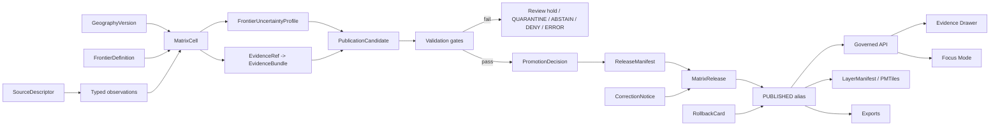

<!-- [KFM_META_BLOCK_V2]
doc_id: kfm://doc/NEEDS-VERIFICATION-ADR-frontier-publication-and-uncertainty
title: ADR: Frontier Publication and Uncertainty
type: standard
version: v1
status: draft
owners: OWNER_TBD_NEEDS_VERIFICATION
created: 2026-05-08
updated: 2026-05-08
policy_label: NEEDS_VERIFICATION
related: [../../README.md, ./README.md, ./ADR-TEMPLATE.md, ./ADR-frontier-panel-observation-model.md, ./ADR-frontier-bitemporal-release-model.md, ./ADR-0001-schema-home.md, ./ADR-0002-responsibility-root-monorepo.md, ../architecture/contract-schema-policy-split.md, NEEDS_VERIFICATION:KFM_Implementation_Reference, NEEDS_VERIFICATION:KFM_Encyclopedia]
tags: [kfm, adr, frontier, publication, uncertainty, evidence, release, rollback]
notes: [Replaces placeholder ADR language for docs/adr/ADR-frontier-publication-and-uncertainty.md. Owners, policy label, source-rights review, validator coverage, workflow enforcement, release artifacts, runtime behavior, and public UI display implementation remain NEEDS VERIFICATION.]
[/KFM_META_BLOCK_V2] -->

<a id="top"></a>
<a id="adr-frontier-publication-and-uncertainty"></a>

# ADR: Frontier Publication and Uncertainty

Define when frontier matrix outputs may be published and how uncertainty must remain visible, inspectable, correctable, and reversible.

<p align="center">
  
  
  
  
  
  
</p>

<p align="center">
  <a href="#decision-summary">Decision</a> ·
  <a href="#repo-fit">Repo fit</a> ·
  <a href="#evidence-boundary">Evidence</a> ·
  <a href="#problem">Problem</a> ·
  <a href="#publication-rule">Publication</a> ·
  <a href="#uncertainty-model">Uncertainty</a> ·
  <a href="#public-surface-rules">Public surfaces</a> ·
  <a href="#validation-plan">Validation</a> ·
  <a href="#impact-map">Impact</a> ·
  <a href="#rollback-and-supersession">Rollback</a> ·
  <a href="#open-verification-backlog">Open verification</a>
</p>

> [!IMPORTANT]
> **Decision status:** `PROPOSED`.
>
> This ADR replaces a placeholder decision record. It defines the proposed publication and uncertainty rules for frontier matrix outputs. It does **not** claim that schemas, validators, workflows, APIs, map layers, release manifests, dashboards, or Focus Mode responses already enforce those rules.

> [!NOTE]
> This ADR is a companion to [`ADR-frontier-panel-observation-model.md`](./ADR-frontier-panel-observation-model.md) and [`ADR-frontier-bitemporal-release-model.md`](./ADR-frontier-bitemporal-release-model.md). Those ADRs define the observation model and release-time semantics. This ADR defines the publication gate and uncertainty display burden.

---

## Decision summary

| Field | Determination |
|---|---|
| ADR | `docs/adr/ADR-frontier-publication-and-uncertainty.md` |
| Status | `proposed` |
| Owning root | `docs/` |
| Owning subdirectory | `docs/adr/` |
| Decision area | Frontier-domain publication eligibility, uncertainty representation, public display obligations, and release safety |
| Primary domain | Frontier demography, economy, settlement, land, access, geography, and time matrix |
| Core decision | Frontier matrix outputs may be published only as release-scoped, evidence-resolved, uncertainty-bearing artifacts. A public frontier claim must expose its definition version, geography version, evidence support, uncertainty profile, policy posture, correction state, and rollback linkage. |
| Publication rule | A `MatrixRelease`, `MatrixCell`, `FrontierClassification`, map layer, export, dashboard value, or Focus Mode answer must not be public unless evidence, rights, sensitivity, uncertainty, review, release, correction, and rollback gates pass. |
| Uncertainty rule | Uncertainty is multi-axis. A single confidence score may be displayed only as a summary over explicit uncertainty dimensions. It must not replace the underlying uncertainty profile. |
| Default failure behavior | Missing evidence, unknown rights, unresolved source conflict, unsupported crosswalk, hidden interpolation, ambiguous time, missing release context, or absent rollback target returns `ABSTAIN`, `DENY`, `ERROR`, quarantine, or review hold rather than a polished public answer. |
| Implementation maturity | `NEEDS VERIFICATION` |

### One-line decision rule

> A frontier output is publishable only when its evidence, definition, geography, time, uncertainty, policy, release, correction, and rollback context are all inspectable.

### One-line boundary rule

> This ADR must not allow a map color, matrix cell, frontier score, dashboard value, export, graph projection, story node, or AI answer to hide uncertainty or bypass governed publication.

[Back to top](#top)

---

## Repo fit

`docs/adr/` is the right home because this file records an architecture-significant governance decision. It is not a schema, policy rule, source registry, validator, release artifact, or runtime implementation.

| Relationship | Path | Status | Role |
|---|---|---:|---|
| This ADR | `docs/adr/ADR-frontier-publication-and-uncertainty.md` | `CONFIRMED path / revised content PROPOSED` | Decision record for frontier publication and uncertainty governance. |
| ADR index | [`./README.md`](./README.md) | `CONFIRMED path / coverage NEEDS VERIFICATION` | ADR navigation, review discipline, evidence labels, rollback, and supersession expectations. |
| ADR template | [`./ADR-TEMPLATE.md`](./ADR-TEMPLATE.md) | `CONFIRMED path` | Local ADR structure and review checklist. |
| Frontier observation ADR | [`./ADR-frontier-panel-observation-model.md`](./ADR-frontier-panel-observation-model.md) | `CONFIRMED path / sibling decision PROPOSED` | Defines typed observations and derived panel-cell semantics. |
| Frontier bitemporal ADR | [`./ADR-frontier-bitemporal-release-model.md`](./ADR-frontier-bitemporal-release-model.md) | `CONFIRMED path / sibling decision PROPOSED` | Defines valid-time, record-time, release, correction, and rollback semantics. |
| Schema-home ADR | [`./ADR-0001-schema-home.md`](./ADR-0001-schema-home.md) | `CONFIRMED path / decision still PROPOSED` | Proposed machine-schema home and split between schemas, contracts, and policy. |
| Responsibility-root ADR | [`./ADR-0002-responsibility-root-monorepo.md`](./ADR-0002-responsibility-root-monorepo.md) | `CONFIRMED path / ADR decision accepted` | Governs root-level responsibility boundaries and rejects domain-root sprawl. |
| Contract/schema/policy split | [`../architecture/contract-schema-policy-split.md`](../architecture/contract-schema-policy-split.md) | `CONFIRMED path / enforcement NEEDS VERIFICATION` | Explains that contracts mean, schemas shape, and policy decides. |
| Root README | [`../../README.md`](../../README.md) | `CONFIRMED path / authority draft` | States KFM identity, inspectable-claim posture, lifecycle law, public-client boundary, and finite governed-AI outcomes. |

### Directory Rules basis

This ADR belongs under `docs/adr/` because ADRs are human-facing decision records. Frontier publication implementation should land under responsibility roots, not under a new root-level `frontier/`, `publication/`, `uncertainty/`, or `matrix/` folder.

| Concern | Proposed responsibility-root home |
|---|---|
| Human-facing frontier docs | `docs/domains/frontier-matrix/` |
| Semantic contracts | `contracts/domains/frontier-matrix/` |
| Machine schemas | `schemas/contracts/v1/domains/frontier-matrix/` after schema-home acceptance |
| Policy | `policy/domains/frontier-matrix/` |
| Tests | `tests/domains/frontier-matrix/` |
| Fixtures | `fixtures/domains/frontier-matrix/` |
| Lifecycle data | `data/{raw,work,quarantine,processed,catalog,triplets,receipts,proofs,published}/frontier-matrix/` |
| Release artifacts | `release/` or repo-verified release subpaths |
| Runtime/API/UI implementation | Repo-verified `apps/` or `packages/` homes |

> [!CAUTION]
> Do not create a new root-level frontier publication or uncertainty folder. Domain content belongs under the relevant responsibility root.

[Back to top](#top)

---

## Evidence boundary

This ADR is grounded in accessible repository evidence and supplied KFM doctrine. It remains bounded because local mounted repo access, current workflow output, branch protections, emitted releases, dashboards, runtime logs, and test results were not available in this session.

| Evidence item | Status | Supports | Does not prove |
|---|---:|---|---|
| `docs/adr/ADR-frontier-publication-and-uncertainty.md` | `CONFIRMED path` | Existing file is a placeholder for this decision area. | Any publication, schema, validator, workflow, release, or runtime enforcement. |
| `docs/adr/README.md` | `CONFIRMED path` | ADRs are a human-facing decision ledger and should distinguish decisions from enforcement. | Complete ADR inventory or enforcement maturity. |
| `docs/adr/ADR-TEMPLATE.md` | `CONFIRMED path` | ADRs should include evidence, impact, validation, rollback, supersession, and narrow truth labels. | That this ADR is accepted. |
| `docs/adr/ADR-frontier-panel-observation-model.md` | `CONFIRMED path / proposed sibling decision` | Frontier panel cells are derived from typed observations, geography versions, definitions, evidence, policy, and uncertainty support. | Final machine schemas or panel builder implementation. |
| `docs/adr/ADR-frontier-bitemporal-release-model.md` | `CONFIRMED path / proposed sibling decision` | Frontier releases need valid-time, record-time, release, correction, and rollback semantics. | Live release implementation. |
| `docs/adr/ADR-0001-schema-home.md` | `CONFIRMED path / proposed decision` | Proposed split: machine schemas under `schemas/contracts/v1/`, semantic contracts under `contracts/`, admissibility under `policy/`. | Final accepted schema-home enforcement. |
| `docs/adr/ADR-0002-responsibility-root-monorepo.md` | `CONFIRMED path / accepted decision` | Domain work belongs under responsibility roots, not root-level domain folders. | Complete root hygiene enforcement. |
| `docs/architecture/contract-schema-policy-split.md` | `CONFIRMED path` | Architecture split: contracts mean, schemas shape, policy decides. | Workflow/test/runtime enforcement. |
| `README.md` | `CONFIRMED path / draft authority` | KFM identity, inspectable claim, lifecycle law, public-client boundary, finite governed-AI outcomes. | Full implementation maturity. |
| KFM Implementation Reference | `LINEAGE / NEEDS VERIFICATION` | Recommends a governed frontier county-year panel backed by explicit frontier definitions, geography versions, observations, uncertainty, release manifests, and rollback. | Current branch implementation without direct reinspection. |
| KFM Encyclopedia frontier-domain material | `CONFIRMED corpus / PROPOSED implementation` | Names frontier matrix capability families and risk posture. | Active repo implementation. |

### Evidence rule applied here

- `CONFIRMED` means directly surfaced from repository connector evidence, supplied KFM doctrine, or current workspace inspection.
- `PROPOSED` means recommended architecture not yet proven as current implementation.
- `NEEDS VERIFICATION` means a concrete check can retire uncertainty.
- `UNKNOWN` means relevant implementation evidence was unavailable.
- `LINEAGE` means prior material informs continuity without proving current behavior.

[Back to top](#top)

---

## Problem

The frontier matrix will likely be one of KFM’s most legible public products: a county-year panel, map layer, classification, dashboard, story node, export, and AI-explainable historical geography surface.

That visibility creates risk. A frontier output can look crisp while hiding weak support.

| Hidden concern | Publication risk |
|---|---|
| Definition drift | “Frontier” may mean population density, access/remoteness, settlement status, land-office context, infrastructure access, or a combined threshold model. |
| Geography changes | County boundaries and source geographies may differ by year and source vintage. |
| Temporal ambiguity | Source year, historical valid time, record time, release time, and correction time are distinct. |
| Source conflicts | Census, land, economic, transportation, gazetteer, archive, and derived sources may disagree or support different claim types. |
| Suppression / missingness | Public tables may hide suppressed, missing, imputed, or non-comparable measures. |
| Crosswalk uncertainty | Boundary crosswalks, area weighting, and derived rates can introduce false precision. |
| Rights / sensitivity | Historical material may still have redistribution, cultural, land, living-person, or steward-review constraints. |
| Display flattening | A map color or score can imply certainty even when the cell is estimated, inferred, contested, corrected, or restricted. |
| AI smoothing | A generated explanation can hide missing evidence unless finite outcomes and citation validation are enforced. |

KFM needs a publication rule that treats uncertainty as a first-class trust object, not as optional prose.

[Back to top](#top)

---

## Requirements and constraints

### KFM invariants checked

| Invariant | ADR effect | Status |
|---|---|---:|
| `RAW -> WORK / QUARANTINE -> PROCESSED -> CATALOG / TRIPLET -> PUBLISHED` | Frontier publication must pass through lifecycle gates before public use. | `CONFIRMED doctrine / PROPOSED implementation` |
| Public clients use governed interfaces and released artifacts | Matrix APIs, maps, dashboards, exports, and Focus Mode consume release-scoped envelopes or released artifacts. | `CONFIRMED doctrine / PROPOSED implementation` |
| `EvidenceRef -> EvidenceBundle` before consequential claims | Public frontier classifications and displayed measures must resolve to evidence or abstain. | `CONFIRMED doctrine / PROPOSED implementation` |
| Promotion is a governed state transition | Public release requires validation, policy, review, release manifest, correction path, and rollback target. | `CONFIRMED doctrine / PROPOSED implementation` |
| AI is interpretive only | Focus Mode may explain released evidence; it cannot invent confidence, smooth uncertainty, or decide publication. | `CONFIRMED doctrine / PROPOSED implementation` |
| Derived products stay derived | Panels, tiles, dashboards, graph projections, exports, stories, summaries, and AI answers remain rebuildable carriers. | `CONFIRMED doctrine / PROPOSED implementation` |
| Rights and sensitivity fail closed | Unknown rights, restricted redistribution, sensitive cultural context, suppressed statistics, land/person risks, or unclear source terms block public release. | `PROPOSED / NEEDS VERIFICATION` |
| Corrections are first-class | Public correction or withdrawal creates correction state, not silent overwrites. | `PROPOSED` |
| Rollback is planned before publication | Public release requires rollback target or explicit review hold. | `PROPOSED` |

### Non-goals

This ADR does **not** decide:

- final JSON Schema field names;
- database engine or storage layout;
- exact API route names;
- UI component names;
- source activation list;
- source rights for any specific Census, land, archive, rail, road, gazetteer, or economic source;
- branch protection or CI enforcement;
- a production release status;
- a root-level frontier directory.

[Back to top](#top)

---

## Options considered

| Option | Description | Benefits | Risks | Outcome |
|---|---|---|---|---|
| Publish a clean frontier score only | Expose one score or membership flag per county-year. | Simple for maps and dashboards. | Hides definitions, input support, crosswalks, uncertainty, and correction state. | Rejected |
| Publish data with prose caveats | Attach a short caveat paragraph to panel docs. | Better than no caveat. | Caveats do not travel through API, tiles, Evidence Drawer, exports, or AI responses reliably. | Rejected |
| Publish uncertainty as one confidence number | Store and display `confidence = 0..1`. | Compact and chart-friendly. | Collapses very different uncertainty causes into one number and can imply false precision. | Rejected as primary model |
| Publish only direct observations | Refuse all derived estimates, crosswalks, and frontier classifications. | Strong evidence posture. | Prevents the matrix from doing useful historical synthesis and spatial comparison. | Rejected as too narrow |
| Release-scoped publication with multi-axis uncertainty | Publish only after evidence, policy, release, correction, and rollback gates pass; expose uncertainty dimensions on every claim-bearing output. | Preserves inspectability, public usefulness, and fail-closed behavior. | Requires schemas, validators, display rules, and review burden. | Chosen |

[Back to top](#top)

---

## Publication rule

A frontier output is publishable only when it is release-scoped and uncertainty-bearing.

### Publication gates

| Gate | Required proof before public release | Failure outcome |
|---|---|---|
| A — Scope and definition | `FrontierDefinition` version, geography scope, valid-time scope, and intended audience are explicit. | Review hold or `ABSTAIN`. |
| B — Source and rights | `SourceDescriptor`, source role, rights, citation, restrictions, and dataset version are recorded. | `QUARANTINE` or `DENY` public release. |
| C — Observation and geography support | Typed observations, `GeographyVersion`, crosswalks, and measure definitions are valid and linked. | Block panel cell promotion. |
| D — Uncertainty profile | Multi-axis uncertainty profile exists for every public claim-bearing cell or classification. | `ABSTAIN` or hold release. |
| E — Evidence closure | Public output resolves from claim to `EvidenceRef` to `EvidenceBundle`. | `ABSTAIN` or block release. |
| F — Policy and review | Policy, sensitivity, source-role, review, and public payload checks pass. | `DENY`, review hold, redaction, or generalization. |
| G — Release and rollback | `PromotionDecision`, `ReleaseManifest`, correction path, supersession state, and rollback target are linked. | `ERROR` or hold release. |
| H — Public payload | API, tile, export, dashboard, Evidence Drawer, and Focus Mode payloads expose required context and exclude internal-only fields. | Block public surface or return finite negative outcome. |

### Publishable object rule

| Object or surface | Publishable only when |
|---|---|
| `MatrixCell` | Input observations, geography version, frontier definition, evidence closure, uncertainty profile, and release context are all valid. |
| `FrontierClassification` | Classification formula or threshold model is versioned and evidence-backed; derived status is visible. |
| `CountyYearPanel` | Every public cell meets cell-level requirements or carries explicit non-answer / suppression state. |
| `MatrixRelease` | Release manifest, promotion decision, policy decision, catalog/proof closure, correction path, and rollback target exist. |
| Map layer / PMTiles / style | Layer manifest links to release and exposes uncertainty display rules. |
| Dashboard metric | Metric links to release ID, valid-time scope, geography version, definition version, and uncertainty profile. |
| Export | Export carries release metadata, evidence refs, uncertainty profiles, rights labels, correction state, and deprecation/supersession state. |
| Evidence Drawer | Drawer can resolve the public claim to evidence, policy, uncertainty, release, and correction context. |
| Focus Mode answer | Runtime envelope returns `ANSWER`, `ABSTAIN`, `DENY`, or `ERROR` with citations and release context. |

### Non-publishable by default

Do not publish:

- candidate panel builds;
- raw or work-stage observations;
- internal canonical records;
- cells with unresolved evidence;
- cells with unknown rights;
- unsupported estimates;
- hidden interpolation;
- geography crosswalks without method and validation;
- binary frontier membership without definition version;
- AI-generated explanations without citation validation;
- layers or exports without release manifest and rollback target.

[Back to top](#top)

---

## Uncertainty model

Uncertainty must be represented as a structured profile. A single score may be derived for display, but the dimensions remain inspectable.

### Proposed object family

`FrontierUncertaintyProfile` should describe uncertainty for a `MatrixCell`, `FrontierClassification`, observation, release, or public payload.

| Dimension | Purpose | Examples |
|---|---|---|
| `evidence_support` | Strength and directness of source support. | `direct_source`, `compiled_from_sources`, `derived_from_model`, `narrative_assertion`, `missing_support` |
| `source_conflict` | Whether sources agree, differ, or remain unresolved. | `none`, `minor_difference`, `material_conflict`, `unresolved_conflict` |
| `spatial_support` | Geography and geometry certainty. | `native_geography`, `authoritative_crosswalk`, `area_weighted`, `generalized`, `boundary_uncertain` |
| `temporal_support` | Precision and reliability of time scope. | `exact_year`, `source_period`, `map_edition`, `inferred_range`, `stale_source` |
| `measure_support` | Value, unit, denominator, and aggregation confidence. | `observed`, `unit_converted`, `estimated`, `imputed`, `suppressed`, `denominator_limited` |
| `definition_support` | Fit between data and frontier definition. | `definition_directly_supported`, `definition_applied`, `threshold_sensitive`, `definition_under_review` |
| `rights_and_policy` | Public-use and access certainty. | `public_clear`, `citation_required`, `restricted`, `rights_unknown`, `redacted` |
| `review_state` | Human or policy review posture. | `not_reviewed`, `machine_validated`, `domain_reviewed`, `policy_reviewed`, `release_approved` |
| `correction_state` | Whether a claim has been corrected, superseded, withdrawn, or rollback-affected. | `current`, `correction_pending`, `superseded`, `withdrawn`, `rolled_back` |

### Display labels

Public surfaces may use compact labels, but labels must map back to dimensions.

| Display label | Meaning | Public behavior |
|---|---|---|
| `supported` | Evidence, policy, and release context are strong enough for the claim as displayed. | May display with evidence links. |
| `estimated` | Value is derived or modeled from approved inputs. | Display method and uncertainty profile. |
| `inferred` | Claim is supported indirectly or from lower-granularity evidence. | Display caveat; avoid false precision. |
| `contested` | Material source conflict remains visible. | Do not flatten to one answer; expose conflict. |
| `incomplete` | Evidence is insufficient for the requested claim. | `ABSTAIN` or display non-answer state. |
| `suppressed` | Source suppression, small-count rule, or policy rule blocks value display. | Do not back-calculate hidden values. |
| `restricted` | Rights, sensitivity, steward, or access rule blocks public exposure. | `DENY`, redact, generalize, or staged access. |
| `corrected` | Claim changed after release. | Show correction notice and release context. |
| `withdrawn` | Release or claim is no longer public-valid. | Hide value from current public alias; preserve lineage. |

> [!IMPORTANT]
> Do not publish a frontier score, color ramp, or binary membership flag without a way to inspect the uncertainty profile behind it.

### Illustrative profile shape

> [!CAUTION]
> This is illustrative schema prose, not a machine schema. Final schemas belong in the accepted schema home and must ship with fixtures and validators.

```yaml
object_type: frontier_uncertainty_profile
schema_version: v1
uncertainty_profile_id: kfm://frontier/uncertainty/NEEDS-VERIFICATION
applies_to:
  object_type: matrix_cell
  object_ref: kfm://frontier/matrix-cell/NEEDS-VERIFICATION

summary:
  display_label: estimated
  summary_score: null
  summary_note: "Estimated from released observations and an approved geography crosswalk."

dimensions:
  evidence_support:
    state: compiled_from_sources
    evidence_refs:
      - kfm://evidence-ref/NEEDS-VERIFICATION
  source_conflict:
    state: none
    notes: []
  spatial_support:
    state: authoritative_crosswalk
    geography_version_ref: kfm://geography-version/NEEDS-VERIFICATION
    crosswalk_ref: kfm://crosswalk/NEEDS-VERIFICATION
  temporal_support:
    state: exact_year
    valid_time:
      start: "1870-01-01"
      end: "1871-01-01"
      granularity: year
  measure_support:
    state: estimated
    method_ref: kfm://method/NEEDS-VERIFICATION
  definition_support:
    state: definition_applied
    frontier_definition_ref: kfm://frontier-definition/NEEDS-VERIFICATION
  rights_and_policy:
    state: public_clear
    policy_decision_ref: kfm://policy-decision/NEEDS-VERIFICATION
  review_state:
    state: machine_validated
    review_record_ref: REVIEW_RECORD_TBD_NEEDS_VERIFICATION
  correction_state:
    state: current
    correction_notice_ref: null

public_display:
  may_show_value: true
  must_show_label: true
  must_show_evidence_link: true
  must_show_release_id: true
  must_show_caveat: true
```

[Back to top](#top)

---

## Public surface rules

### Matrix and API

A public matrix API response must include or link to:

- `release_id`;
- `release_time`;
- `valid_time` scope;
- `record_time` cutoff or release cutoff;
- `frontier_definition_ref`;
- `geography_version_ref`;
- `evidence_refs`;
- `uncertainty_profile_ref` or embedded public profile;
- `policy_label`;
- `correction_state`;
- `rollback_ref`.

Illustrative response envelope:

```json
{
  "outcome": "ANSWER",
  "release_id": "matrix_release:frontier:NEEDS_VERIFICATION",
  "frontier_definition_ref": "frontier_definition:NEEDS_VERIFICATION",
  "geography_version_ref": "geography_version:NEEDS_VERIFICATION",
  "valid_time": {
    "start": "1870-01-01",
    "end": "1871-01-01",
    "granularity": "year"
  },
  "record_time_cutoff": "2026-05-08T00:00:00Z",
  "value": {
    "frontier_member": true,
    "frontier_score": 0.74,
    "display_label": "estimated"
  },
  "evidence_refs": ["evidence_ref:NEEDS_VERIFICATION"],
  "uncertainty_profile_ref": "frontier_uncertainty_profile:NEEDS_VERIFICATION",
  "policy_label": "public",
  "correction_state": "current",
  "rollback_ref": "rollback_card:NEEDS_VERIFICATION"
}
```

### Map layer

A map layer must not imply certainty solely through color.

| Requirement | Rule |
|---|---|
| Color | Choropleth or categorical styling may show classification, but uncertainty state must be available in popup, legend, or layer metadata. |
| Legend | Legend must distinguish at least supported, estimated/inferred, contested, suppressed/restricted, and no-answer states when present. |
| Popup | Popup must show release ID, definition version, valid-time scope, uncertainty label, evidence link, and correction state. |
| Scale | Generalized or uncertain geography must avoid false precision in labels and zoom behavior. |
| Tiles | PMTiles or other tile artifacts are derivatives. They must point back to `LayerManifest` and release metadata. |

### Evidence Drawer

The Evidence Drawer must show:

- what claim is being displayed;
- source role and citation;
- EvidenceBundle link;
- frontier definition version;
- geography version and crosswalk method;
- valid time and record/release time;
- uncertainty profile dimensions;
- policy and review state;
- correction and rollback state.

### Focus Mode / governed AI

Focus Mode may summarize the release, evidence, and uncertainty. It must not invent support.

| Condition | Required outcome |
|---|---|
| Evidence resolves and citation validation passes | `ANSWER` with release and uncertainty context. |
| Evidence is missing, conflict is unresolved, or uncertainty blocks claim | `ABSTAIN` with reason. |
| Rights, sensitivity, or access policy blocks exposure | `DENY` with policy reason. |
| Runtime, resolver, schema, or release context fails | `ERROR` with safe diagnostic envelope. |

### Export and story nodes

Exports and story nodes must carry enough release and uncertainty metadata to remain inspectable outside the map UI.

| Artifact | Required publication metadata |
|---|---|
| CSV / JSON / GeoParquet export | Release ID, definition version, geography version, evidence refs, uncertainty profile refs, policy labels, correction state. |
| Story node | Claim text, EvidenceBundle refs, uncertainty label, release ID, correction state, publication date, rollback target. |
| Dashboard tile | Metric definition, source support, uncertainty profile, release context, stale/correction indicator. |

[Back to top](#top)

---

## Publication flow



### Publication state model

| State | Meaning | Public behavior |
|---|---|---|
| `candidate` | Built or proposed but not reviewed. | Not public. |
| `in_review` | Validation, evidence, uncertainty, policy, and release checks are underway. | Not public unless steward-scoped. |
| `held` | One or more gates failed or remain unresolved. | Not public; reason required. |
| `release_candidate` | Gates pass enough for final release review. | Not current public alias yet. |
| `published` | Release is public-safe and addressable. | Public clients may use governed release paths. |
| `superseded` | Replaced by a later release. | Historical release remains inspectable unless policy blocks. |
| `withdrawn` | Release is unsafe, erroneous, rights-blocked, or policy-blocked. | Remove from current public alias; show correction/withdrawal. |
| `rolled_back` | Current public alias points to a prior safe release. | Public clients use safe alias and correction context. |

[Back to top](#top)

---

## Policy, rights, and sensitivity

Frontier outputs may be lower-risk than archaeology, rare species, living-person data, DNA, or exact critical infrastructure, but they are not automatically public-safe.

| Risk class | Default handling |
|---|---|
| Unknown source rights or redistribution terms | `QUARANTINE`, `DENY`, or review hold until source terms are recorded. |
| Suppressed or small-count economic/statistical data | Preserve suppression; do not back-calculate hidden values. |
| Land ownership or title-like context | Treat as evidence-bound assertion, not legal title truth. |
| Living-person or DNA-adjacent material | Out of scope for public frontier releases unless governed by a separate sensitive lane. |
| Culturally sensitive settlement, route, or Indigenous context | Generalize, restrict, steward-review, or abstain. |
| Historical map, atlas, or archive item rights | Require item-level rights review before publication. |
| Boundary or georeference uncertainty | Display uncertainty and avoid false precision. |
| Conflicting sources | Preserve conflict and source role; do not flatten disagreement silently. |
| Derived AI narrative | Require EvidenceBundle resolution and citation validation. Otherwise `ABSTAIN`. |

> [!WARNING]
> Unknown rights or sensitivity is not a caveat. It is a release blocker until resolved, restricted, redacted, generalized, or denied.

[Back to top](#top)

---

## Impact map

### Proposed companion files

All paths below are `PROPOSED` unless already verified in the repository. Adapt to accepted repository conventions before implementation.

| Path | Status | Purpose | Update trigger |
|---|---:|---|---|
| `docs/adr/ADR-frontier-publication-and-uncertainty.md` | `CONFIRMED path / revised content PROPOSED` | This decision record. | Publication, uncertainty, or public-surface rules change. |
| `docs/domains/frontier-matrix/README.md` | `PROPOSED` | Domain landing page with scope, accepted inputs, exclusions, and release burden. | Frontier lane activation or scope change. |
| `docs/domains/frontier-matrix/PUBLICATION.md` | `PROPOSED` | Human-facing publication rules and review burden. | Publication gate changes. |
| `docs/domains/frontier-matrix/UNCERTAINTY.md` | `PROPOSED` | Frontier uncertainty vocabulary and display rules. | Uncertainty dimension or label changes. |
| `contracts/domains/frontier-matrix/uncertainty.md` | `PROPOSED` | Semantic contract for uncertainty profiles. | Meaning changes. |
| `schemas/contracts/v1/domains/frontier-matrix/frontier_uncertainty_profile.schema.json` | `PROPOSED / depends on ADR-0001 acceptance` | Machine shape for uncertainty profiles. | Field, enum, or compatibility changes. |
| `schemas/contracts/v1/domains/frontier-matrix/matrix_publication_candidate.schema.json` | `PROPOSED / depends on ADR-0001 acceptance` | Machine shape for candidate publication checks. | Publication gate changes. |
| `policy/domains/frontier-matrix/publication.rego` | `PROPOSED` | Allow/deny/hold rules for publication. | Policy behavior changes. |
| `policy/domains/frontier-matrix/uncertainty.rego` | `PROPOSED` | Fail-closed uncertainty display and release rules. | Uncertainty policy changes. |
| `tests/domains/frontier-matrix/test_publication_gate.*` | `PROPOSED` | Tests for publication gates and negative paths. | Gate changes. |
| `fixtures/domains/frontier-matrix/publication/` | `PROPOSED` | Valid/invalid publication candidate fixtures. | Schema/policy/test changes. |
| `fixtures/domains/frontier-matrix/uncertainty/` | `PROPOSED` | Uncertainty profile fixtures. | Label or dimension changes. |
| `tools/validators/frontier/validate_publication_candidate.*` | `PROPOSED` | Deterministic validator for publication readiness. | Validator implementation. |
| `release/candidates/frontier-matrix/` | `PROPOSED / path NEEDS VERIFICATION` | Candidate release staging if repo release convention accepts it. | Release workflow implementation. |
| `data/published/frontier-matrix/` | `PROPOSED / path NEEDS VERIFICATION` | Released public-safe frontier matrix artifacts. | Public release implementation. |

### Trust-surface impact

| Surface | Required behavior | Status |
|---|---|---:|
| Governed API | Include release and uncertainty context in public frontier responses. | `PROPOSED` |
| MapLibre shell | Display uncertainty label and release context in legend/popup/layer metadata. | `PROPOSED` |
| Evidence Drawer | Resolve claim to evidence, policy, uncertainty, review, release, correction, and rollback. | `PROPOSED` |
| Focus Mode | Return finite outcome and cite release/evidence context. | `PROPOSED` |
| Exports | Carry release and uncertainty metadata with values. | `PROPOSED` |
| Story nodes | Include claim, evidence, uncertainty, release, correction, and rollback context. | `PROPOSED` |
| Catalog/search/graph projections | Index uncertainty and release state without becoming canonical truth. | `PROPOSED` |

[Back to top](#top)

---

## Validation plan

### Required checks

| Check | Expected result | Status |
|---|---|---:|
| Publication candidate schema validation | Candidate release object has required definition, geography, evidence, uncertainty, policy, release, correction, and rollback fields. | `PROPOSED` |
| Uncertainty profile schema validation | Profile dimensions and display labels are valid and public-safe. | `PROPOSED` |
| Evidence closure validation | Every public claim-bearing cell resolves to EvidenceBundle. | `PROPOSED` |
| Source-rights validation | Unknown, restricted, or incompatible source rights block public release. | `PROPOSED` |
| Geography/crosswalk validation | Crosswalk methods and geography versions are declared and compatible with measure behavior. | `PROPOSED` |
| Temporal validation | Valid time, record time, release time, and correction time are not collapsed. | `PROPOSED` |
| Policy validation | Rights, sensitivity, source role, uncertainty label, review state, and access class pass or fail closed. | `PROPOSED` |
| Release closure validation | Release manifest, promotion decision, catalog/proof closure, correction path, and rollback target exist. | `PROPOSED` |
| Public payload validation | API, tile, export, dashboard, drawer, and Focus payloads include required public context and exclude internal fields. | `PROPOSED` |
| Negative-path tests | Missing evidence, unknown rights, hidden interpolation, missing rollback, and restricted data fail closed. | `PROPOSED` |

### Negative-path behavior

| Failure condition | Expected outcome |
|---|---|
| Missing `EvidenceBundle` for a public cell | `ABSTAIN` or block release. |
| Unknown source rights | `DENY`, `QUARANTINE`, or review hold. |
| Missing uncertainty profile | Block publication. |
| Single confidence score with no dimensions | Block publication or require profile expansion. |
| Hidden geography crosswalk or unsupported interpolation | Block cell promotion. |
| Contradictory sources without conflict label | `ABSTAIN`, contested display, or review hold. |
| Suppressed statistic exposed | `DENY` or corrected release. |
| Release lacks rollback target | `ERROR` or hold release. |
| Public map layer lacks release ID | Block public layer. |
| Focus Mode cannot validate citations | `ABSTAIN` or `ERROR`, not a fluent answer. |

### Illustrative validation command set

> [!NOTE]
> Command names are illustrative. Use repository-native commands after active checkout verification.

```bash
# Confirm repository context.
git status --short
git branch --show-current || true
git rev-parse --show-toplevel || true

# Candidate checks once validators exist.
python tools/validators/frontier/validate_publication_candidate.py \
  fixtures/domains/frontier-matrix/publication/valid/*.json

python tools/validators/frontier/validate_publication_candidate.py \
  fixtures/domains/frontier-matrix/publication/invalid/*.json

python tools/validators/frontier/validate_uncertainty_profile.py \
  fixtures/domains/frontier-matrix/uncertainty/*.json
```

[Back to top](#top)

---

## Rollback and supersession

A publication rollback must preserve release history. It must not delete or rewrite the bad release to make the repository look clean.

### Rollback rules

1. Preserve the original `MatrixRelease`.
2. Mark affected claims or release state as `withdrawn`, `superseded`, or `rolled_back`.
3. Emit or update `CorrectionNotice`.
4. Repoint public alias only through governed release or rollback procedure.
5. Preserve `RollbackCard`.
6. Re-run public payload checks.
7. Update Evidence Drawer, map layer metadata, exports, story nodes, catalog/search projections, and Focus Mode behavior.
8. Keep uncertainty/correction state visible to public users where appropriate.
9. Do not silently remove contested or corrected history.

### Rollback triggers

| Trigger | Required action |
|---|---|
| Evidence closure failure after publication | Withdraw or supersede release; emit correction; repoint alias if needed. |
| Rights or sensitivity change | Restrict, redact, withdraw, or generalize; update public payloads. |
| Incorrect uncertainty label | Correct profile and release; notify downstream surfaces. |
| Source conflict discovered | Mark contested, review, or abstain; do not retain unsupported certainty. |
| Geography version or crosswalk defect | Rebuild affected cells; supersede release. |
| Suppressed value exposed | Withdraw public artifact; issue correction; rotate affected exports/layers. |
| AI answer published unsupported claim | Disable or correct runtime answer path; update AI receipt and evidence validation. |
| Rollback target missing | Block release until target exists. |

### Supersession rule

This ADR may be superseded only by a later ADR that:

- names the successor publication and uncertainty model;
- preserves lineage to this ADR;
- updates sibling frontier ADRs;
- updates schema, policy, validator, fixture, and UI/export expectations;
- includes migration and rollback notes;
- does not weaken cite-or-abstain, fail-closed, public-client, or correction discipline without explicit tradeoff.

[Back to top](#top)

---

## Consequences

### Positive consequences

- Public frontier products stay inspectable instead of merely polished.
- Uncertainty travels with the cell, layer, export, dashboard, story, and AI answer.
- Source conflicts and suppressed values remain visible instead of being smoothed away.
- Release/correction/rollback state becomes part of the public trust surface.
- Map and matrix displays can remain useful without pretending every classification is equally certain.
- The frontier lane aligns with KFM’s cite-or-abstain posture and governed publication law.

### Costs and tradeoffs

| Cost | Mitigation |
|---|---|
| More fields are required before release. | Keep first slice small: one definition, one geography version, a few synthetic fixtures, and one release candidate. |
| UI and export payloads become more complex. | Use compact display labels backed by inspectable profiles. |
| Some cells may abstain or show incomplete/contested states. | Treat non-answer states as trust-preserving outputs, not failures to hide. |
| Validators must understand uncertainty and release state. | Start with deterministic fixture tests before live source activation. |
| Public maps may look less clean. | Make uncertainty visible through legend, popup, and drawer rather than overloading the map color. |

[Back to top](#top)

---

## Open verification backlog

| Item | Status | Why it matters |
|---|---:|---|
| Owners / CODEOWNERS | `NEEDS VERIFICATION` | Publication and uncertainty rules require accountable review. |
| Policy label | `NEEDS VERIFICATION` | Public/restricted status must be deliberate. |
| Full source-rights review | `NEEDS VERIFICATION` | Frontier source families may have different terms, restrictions, and citation burdens. |
| Frontier source registry | `NEEDS VERIFICATION` | `SourceDescriptor` coverage is required before publication. |
| `FrontierUncertaintyProfile` schema | `PROPOSED` | Required for machine-checkable uncertainty. |
| `MatrixPublicationCandidate` schema | `PROPOSED` | Required for release gate validation. |
| Valid/invalid uncertainty fixtures | `PROPOSED` | Required to prove display and fail-closed behavior. |
| Publication gate validator | `PROPOSED` | Required before enforcement claims. |
| Policy-as-code coverage | `PROPOSED / NEEDS VERIFICATION` | Needed for rights, sensitivity, suppression, and public payload rules. |
| Sibling ADR alignment | `NEEDS VERIFICATION` | This ADR must stay aligned with observation and bitemporal release ADRs. |
| Workflow enforcement | `UNKNOWN` | Cannot claim CI enforcement without run evidence and branch protection. |
| Public API implementation | `UNKNOWN` | Route names, DTOs, and runtime envelopes were not verified. |
| Map layer implementation | `UNKNOWN` | Legend, popup, layer metadata, and uncertainty styling need implementation evidence. |
| Evidence Drawer implementation | `UNKNOWN` | Drawer payload must surface uncertainty and release context. |
| Focus Mode implementation | `UNKNOWN` | Citation validation and finite outcomes need runtime proof. |
| Release artifacts | `UNKNOWN` | `MatrixRelease`, `ReleaseManifest`, `PromotionDecision`, correction, and rollback records need emitted proof. |
| Export metadata | `PROPOSED` | CSV/JSON/GeoParquet exports must carry release and uncertainty context. |
| Public legend vocabulary | `PROPOSED` | Labels need design review and fixture coverage. |

[Back to top](#top)

---

## Review checklist

<details>
<summary>Pre-merge checklist</summary>

- [ ] Meta block values are reviewed and unresolved values remain visibly marked.
- [ ] ADR title, meta block title, filename, and ADR index entry are synchronized.
- [ ] Decision state remains separate from enforcement state.
- [ ] Sibling frontier ADRs are linked and not contradicted.
- [ ] Publication gates are represented in schemas, policy, fixtures, or explicit follow-up tasks.
- [ ] Uncertainty model is represented as dimensions, not only a single score.
- [ ] Public display labels map back to inspectable uncertainty profiles.
- [ ] Evidence closure is required for public claim-bearing cells.
- [ ] Rights, sensitivity, source-role, suppression, and review gates fail closed.
- [ ] Release manifest, promotion decision, correction path, and rollback target are required before publication.
- [ ] Public API, map layer, Evidence Drawer, Focus Mode, export, dashboard, and story surfaces are addressed.
- [ ] Negative-path behavior is explicit.
- [ ] No root-level domain folder is introduced.
- [ ] No schema, policy, source registry, release, proof, or receipt authority is duplicated inside this ADR.
- [ ] Open verification backlog remains visible.
- [ ] Rollback and supersession path preserves lineage.

</details>

[Back to top](#top)

---

## Appendix A — Minimal public frontier answer bar

A public frontier answer is acceptable only when a maintainer can inspect:

1. Which `FrontierDefinition` was used.
2. Which `GeographyVersion` was used.
3. Which observations supported the value.
4. Which EvidenceBundle supports the claim.
5. Which uncertainty profile applies.
6. Which source rights and policy decisions govern exposure.
7. Which release ID and release time exposed it.
8. Which correction or rollback path applies.
9. Which public payload displayed it.
10. Which negative outcome would occur if support were missing.

## Appendix B — Label quick reference

| Label | Use in this ADR |
|---|---|
| `CONFIRMED` | Verified from current repository connector evidence, supplied KFM doctrine, current workspace inspection, or directly inspected source content. |
| `PROPOSED` | Architecture, schema, policy, validator, path, object, fixture, or UI/runtime behavior recommended but not proven as implemented. |
| `NEEDS VERIFICATION` | Checkable item that must be confirmed before enforcement or publication claims. |
| `UNKNOWN` | Not verified strongly enough in this session. |
| `LINEAGE` | Prior corpus material that preserves continuity without proving current behavior. |
| `ABSTAIN` | KFM cannot answer or publish because evidence support is insufficient. |
| `DENY` | KFM must not expose the requested material due to policy, rights, sensitivity, or access limits. |
| `ERROR` | A tool, resolver, validator, schema, release, or runtime failure occurred. |

[Back to top](#top)
