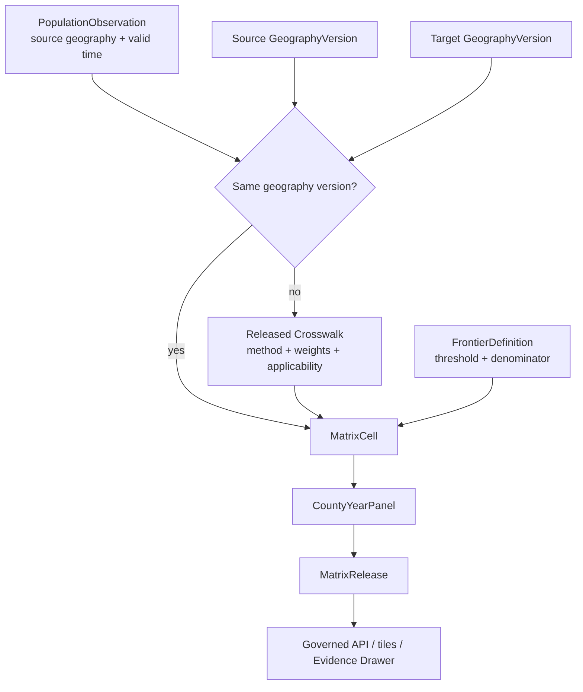

<!-- [KFM_META_BLOCK_V2]
doc_id: kfm://doc/NEEDS-VERIFICATION-ADR-geography-version-and-crosswalk-authority
title: ADR: Geography Version and Crosswalk Authority
type: standard
version: v1
status: draft
owners: OWNER_TBD_NEEDS_VERIFICATION
created: 2026-05-08
updated: 2026-05-08
policy_label: NEEDS_VERIFICATION
related: [../../README.md, ./README.md, ./ADR-TEMPLATE.md, ./ADR-0001-schema-home.md, ./ADR-0002-responsibility-root-monorepo.md, ./ADR-frontier-panel-observation-model.md, ./ADR-frontier-definition-and-thresholds.md, ./ADR-frontier-bitemporal-release-model.md, ../architecture/contract-schema-policy-split.md, NEEDS_VERIFICATION:KFM_Implementation_Reference, NEEDS_VERIFICATION:KFM_Encyclopedia]
tags: [kfm, adr, geography-version, crosswalk, spatial-foundation, frontier-matrix, evidence, temporal, governance, rollback]
notes: [Replaces placeholder ADR language for docs/adr/ADR-geography-version-and-crosswalk-authority.md. Decision is PROPOSED. Owners, policy label, exact schema homes, source registries, validators, workflow enforcement, release artifacts, and runtime behavior remain NEEDS VERIFICATION.]
[/KFM_META_BLOCK_V2] -->

<a id="top"></a>
<a id="adr-geography-version-and-crosswalk-authority"></a>

# ADR: Geography Version and Crosswalk Authority

Define how KFM governs geography versions and crosswalks so spatial joins, historical panels, map layers, and public claims do not silently drift across boundary vintages, source roles, or interpolation assumptions.

<p align="center">
  
  
  
  
  
  
</p>

<p align="center">
  <a href="#decision-summary">Decision</a> ·
  <a href="#repo-fit">Repo fit</a> ·
  <a href="#evidence-boundary">Evidence</a> ·
  <a href="#problem">Problem</a> ·
  <a href="#chosen-model">Chosen model</a> ·
  <a href="#authority-ladder">Authority ladder</a> ·
  <a href="#crosswalk-methods">Crosswalk methods</a> ·
  <a href="#query-semantics">Queries</a> ·
  <a href="#validation-plan">Validation</a> ·
  <a href="#rollback-and-supersession">Rollback</a> ·
  <a href="#open-verification-backlog">Open verification</a>
</p>

> [!IMPORTANT]
> **Decision status:** `PROPOSED`.
>
> This ADR defines the proposed authority model for **geography versions** and **geospatial crosswalks**. It does **not** claim that schemas, validators, registries, policies, release manifests, APIs, map layers, or CI workflows already enforce the model.

> [!NOTE]
> This ADR concerns **geographic / spatial crosswalks**: bridges between boundary vintages, administrative units, source geographies, hydrographic units, county-year panels, and related spatial frames. It is not the same as a documentation or Drive-to-repo crosswalk.

---

## Decision summary

| Field | Determination |
|---|---|
| ADR | `docs/adr/ADR-geography-version-and-crosswalk-authority.md` |
| Status | `proposed` |
| Owning root | `docs/` |
| Owning subdirectory | `docs/adr/` |
| Decision area | Cross-domain spatial foundation, geography identity, geography versioning, crosswalk authority, spatial alignment, and public claim support |
| Core decision | KFM must treat `GeographyVersion` and `Crosswalk` as governed, versioned, evidence-bearing object families. Public or analytical claims must not join on naked names, current-only geometries, or unregistered interpolation assumptions. |
| Boundary rule | Source-native geography is preserved as source evidence; KFM analysis uses explicit `GeographyVersion`; movement between geographies uses explicit `Crosswalk`; rendered layers and tiles remain derived carriers. |
| Crosswalk rule | A crosswalk is authoritative only for its declared source geography version, target geography version, method, measure applicability, temporal support, evidence, policy posture, review state, release state, and rollback target. |
| Default failure behavior | Missing geography version, ambiguous boundary vintage, invalid geometry, unknown CRS, unresolved crosswalk, inapplicable measure method, unknown rights, hidden source caveat, or missing release linkage returns `ABSTAIN`, `DENY`, `ERROR`, `QUARANTINE`, or review hold instead of a polished answer. |
| Implementation maturity | `NEEDS VERIFICATION` |

### One-line decision rule

> KFM joins claims to place through explicit `GeographyVersion` and `Crosswalk` objects, not through display names, current geometry, map styling, or implicit analyst assumptions.

### One-line public-surface rule

> Any public map, API response, export, dashboard, story node, or Focus Mode answer that depends on spatial alignment must expose or link the geography version and crosswalk support used.

[Back to top](#top)

---

## Repo fit

`docs/adr/` is the correct home for this file because the decision affects source interpretation, spatial identity, domain modeling, schemas, validation, policy, public UI behavior, release semantics, corrections, and rollback. It is human-facing architecture governance, not a machine schema, source registry, policy rule, release artifact, or runtime route.

| Relationship | Path | Status | Role |
|---|---|---:|---|
| This ADR | `docs/adr/ADR-geography-version-and-crosswalk-authority.md` | `CONFIRMED path / revised content PROPOSED` | Decision record for geography version and crosswalk authority. |
| ADR index | [`./README.md`](./README.md) | `CONFIRMED path / coverage NEEDS VERIFICATION` | ADR navigation, review discipline, status labels, rollback, and supersession expectations. |
| ADR template | [`./ADR-TEMPLATE.md`](./ADR-TEMPLATE.md) | `CONFIRMED path` | Local ADR structure: evidence, impact, validation, rollback, and supersession. |
| Schema-home ADR | [`./ADR-0001-schema-home.md`](./ADR-0001-schema-home.md) | `CONFIRMED path / proposed decision` | Proposed split: machine schemas under `schemas/contracts/v1/`, semantic meaning under `contracts/`, admissibility under `policy/`. |
| Responsibility-root ADR | [`./ADR-0002-responsibility-root-monorepo.md`](./ADR-0002-responsibility-root-monorepo.md) | `CONFIRMED path / accepted decision` | Governs why spatial foundation work belongs under responsibility roots, not a new root-level geography folder. |
| Frontier panel ADR | [`./ADR-frontier-panel-observation-model.md`](./ADR-frontier-panel-observation-model.md) | `CONFIRMED path / proposed decision` | Companion decision that requires panel cells to depend on typed observations, geography versions, crosswalks, and EvidenceBundles. |
| Frontier definition ADR | [`./ADR-frontier-definition-and-thresholds.md`](./ADR-frontier-definition-and-thresholds.md) | `CONFIRMED path / proposed decision` | Companion decision for threshold definitions that depend on geography denominators and boundary vintages. |
| Frontier bitemporal ADR | [`./ADR-frontier-bitemporal-release-model.md`](./ADR-frontier-bitemporal-release-model.md) | `CONFIRMED path / proposed decision` | Companion decision for valid time, record time, release, correction, and rollback semantics. |
| Contract/schema/policy split | [`../architecture/contract-schema-policy-split.md`](../architecture/contract-schema-policy-split.md) | `CONFIRMED path / enforcement NEEDS VERIFICATION` | Explains: contracts define meaning, schemas validate shape, policy decides admissibility. |
| Root README | [`../../README.md`](../../README.md) | `CONFIRMED path / draft authority` | States KFM identity, lifecycle law, public-client boundary, inspectable-claim posture, and finite governed-AI outcomes. |

### Directory Rules basis

This ADR stays under `docs/adr/` because ADRs are human-facing decision records. Implementation work should land under responsibility roots, not a root-level `geography/`, `crosswalks/`, `frontier/`, or `spatial/` folder unless a future ADR grants an exception.

| Concern | Proposed responsibility-root home | Status |
|---|---|---:|
| Spatial foundation docs | `docs/domains/spatial-foundation/` or repo-verified equivalent | `PROPOSED / NEEDS VERIFICATION` |
| Semantic contracts | `contracts/spatial/` or `contracts/domains/spatial-foundation/` | `PROPOSED / NEEDS VERIFICATION` |
| Machine schemas | `schemas/contracts/v1/common/` or `schemas/contracts/v1/domains/spatial-foundation/` | `PROPOSED / depends on schema-home acceptance` |
| Policy rules | `policy/common/`, `policy/spatial/`, or `policy/domains/spatial-foundation/` | `PROPOSED / NEEDS VERIFICATION` |
| Tests | `tests/common/`, `tests/spatial/`, or `tests/domains/spatial-foundation/` | `PROPOSED / NEEDS VERIFICATION` |
| Fixtures | `fixtures/common/`, `fixtures/spatial/`, or `fixtures/domains/spatial-foundation/` | `PROPOSED / NEEDS VERIFICATION` |
| Source/geography registries | `data/registry/geography/`, `data/registry/crosswalks/`, or control-plane registry equivalents | `PROPOSED / NEEDS VERIFICATION` |
| Receipts and proofs | `data/receipts/`, `data/proofs/`, and `release/` after repo convention verification | `PROPOSED / NEEDS VERIFICATION` |
| Published derivatives | `data/published/`, release aliases, governed tile services, or repo-verified publication homes | `PROPOSED / NEEDS VERIFICATION` |

> [!CAUTION]
> Do not create a parallel schema, contract, policy, source registry, proof, release, or publication home for geography work. If current repo conventions differ from the proposed homes above, update this ADR or create a successor before implementation.

[Back to top](#top)

---

## Evidence boundary

This ADR is grounded in accessible repository evidence, the supplied KFM corpus, and current workspace inspection. It remains bounded because a mounted local repository tree, current workflow run output, branch protections, emitted release artifacts, runtime logs, dashboards, and tests were not available in this workspace.

| Evidence item | Status | Supports | Does not prove |
|---|---:|---|---|
| `docs/adr/ADR-geography-version-and-crosswalk-authority.md` | `CONFIRMED path` | Existing file is a placeholder for this decision area. | That any implementation exists. |
| `docs/adr/README.md` | `CONFIRMED path` | ADRs are the human-facing decision ledger and should distinguish decision state from enforcement state. | Complete ADR inventory or enforcement maturity. |
| `docs/adr/ADR-TEMPLATE.md` | `CONFIRMED path` | ADRs should include evidence, impact, validation, rollback, supersession, and narrow truth labels. | That this ADR is accepted. |
| `docs/adr/ADR-0001-schema-home.md` | `CONFIRMED path / proposed decision` | Proposed split: `schemas/contracts/v1/` validates machine shape, `contracts/` defines meaning, `policy/` decides admissibility. | Final accepted schema-home enforcement. |
| `docs/architecture/contract-schema-policy-split.md` | `CONFIRMED path` | Architecture split: contracts mean, schemas shape, policy decides. | Workflow/test/runtime enforcement. |
| `README.md` | `CONFIRMED path / draft authority` | KFM identity, inspectable-claim posture, lifecycle law, public-client boundary, and finite governed-AI outcomes. | Full repo implementation maturity. |
| KFM Implementation Reference | `LINEAGE / NEEDS VERIFICATION` | Recommends stable geography/version tables, reproducible spatial joins, explicit crosswalks, and aligning historical measures against `GeographyVersion`. | Current branch implementation without reinspection. |
| KFM Encyclopedia frontier domain section | `CONFIRMED corpus / PROPOSED implementation` | Frontier matrix owns county-year panels, geography versions, crosswalks, uncertainty classes, observation families, and bitemporal releases. | Repo implementation of those objects. |
| Directory Rules | `CONFIRMED supplied doctrine` | Root folders are responsibility boundaries; domain work belongs under responsibility roots. | Current branch conformance without inventory. |
| Components pass lineage | `LINEAGE / PROPOSED implementation` | Treats crosswalks as first-class governed datasets with receipts, proof packs, diff reports, join decision rules, and ambiguity handling. | Exact current crosswalk schema or CI status. |

### Evidence rule applied here

- `CONFIRMED` describes surfaced repository files, supplied doctrine, current-session inspection, or directly accessible source content.
- `PROPOSED` describes the architecture this ADR recommends.
- `NEEDS VERIFICATION` describes a concrete check that can retire uncertainty.
- `UNKNOWN` describes unverified repo, runtime, release, workflow, or platform state.
- `LINEAGE` preserves prior planning material without upgrading it into current implementation proof.

[Back to top](#top)

---

## Problem

KFM is map-first and time-aware. That makes geography identity a trust object, not a background detail.

A county name, HUC label, tract identifier, parcel ID, historical map polygon, TIGER feature, GNIS place, NHD COMID, NHDPlus HR Permanent Identifier, road segment, or land-office district can all refer to spatial objects — but they do not carry the same source role, valid time, geometry vintage, CRS, boundary authority, public-release posture, or crosswalk method.

Without a governed geography-version and crosswalk authority, KFM can silently create false claims.

| Hidden issue | Failure mode |
|---|---|
| Display-name joins | `Allen County` or `Kansas River` can become a weak join key instead of a source-native identifier. |
| Current-only geometry | A historical measure may be joined to a modern boundary and displayed as if the geography never changed. |
| Undefined area denominator | Density, rate, acreage, and square-mile calculations can use inconsistent land/total/source-defined area. |
| Crosswalk method drift | An analyst may switch from exact join to area-weighting without review or release evidence. |
| Extensive vs intensive confusion | Counts may be weighted while ratios or densities are wrongly weighted directly. |
| Source role collapse | Census/TIGER, GNIS, state/local GIS, historical maps, hydrography, and derived model surfaces may be treated as interchangeable. |
| False precision | Crosswalked or generalized geometry may be displayed as exact. |
| Rights and sensitivity gaps | Historical maps, cultural geographies, infrastructure, archaeology, rare species, or land/person surfaces may be exposed without the right release posture. |
| Release opacity | Users cannot reconstruct which geography vintage or crosswalk supported a public claim. |
| Rollback fragility | A bad crosswalk cannot be safely withdrawn if releases only contain derived panel cells or tiles. |

KFM needs an explicit authority model that answers: **which geography version is being used, why it is allowed, how it was linked to the source observation, what uncertainty was introduced, and which release made it public.**

[Back to top](#top)

---

## Requirements and constraints

### KFM invariants checked

| Invariant | ADR effect | Status |
|---|---|---:|
| `RAW -> WORK / QUARANTINE -> PROCESSED -> CATALOG / TRIPLET -> PUBLISHED` | Geography versions and crosswalks must pass lifecycle gates before public use. | `CONFIRMED doctrine / PROPOSED implementation` |
| Public clients use governed interfaces and released artifacts | Public map/API/export/dashboard/Focus Mode surfaces must consume released geography/crosswalk envelopes or released artifacts. | `CONFIRMED doctrine / PROPOSED implementation` |
| `EvidenceRef -> EvidenceBundle` before consequential claims | Public spatial alignment claims must resolve to evidence or abstain. | `CONFIRMED doctrine / PROPOSED implementation` |
| Promotion is a governed state transition | Geography and crosswalk releases require validation, review, release manifest, correction path, and rollback target. | `CONFIRMED doctrine / PROPOSED implementation` |
| AI is interpretive only | Focus Mode may explain released geography/crosswalk support; it cannot invent crosswalks or fill geography gaps. | `CONFIRMED doctrine / PROPOSED implementation` |
| Derived products stay derived | Tiles, dashboards, county-year panels, graph projections, summaries, and AI answers remain rebuildable carriers. | `CONFIRMED doctrine / PROPOSED implementation` |
| Deterministic identity where practical | Geography versions and crosswalks should carry stable IDs, content hashes, geometry hashes, and build spec hashes. | `PROPOSED` |
| Rights, source roles, sensitivity, and uncertainty fail closed | Unknown rights, source role, geometry uncertainty, crosswalk method, or public exposure blocks release. | `PROPOSED / NEEDS VERIFICATION` |
| Corrections and rollback are first-class | Bad geography versions or crosswalks require correction notices, affected-release detection, and rollback cards. | `PROPOSED` |

### Non-goals

This ADR does **not** decide:

- final JSON Schema field names;
- final database engine, spatial SQL dialect, ORM, API route names, or UI component names;
- final registry file paths;
- source activation for Census/TIGER, GNIS, WBD, NHDPlus HR, NHGIS, state/local GIS, historical maps, parcels, roads, or rail;
- source-rights approval for any external geography source;
- whether every crosswalk method is allowed for every domain;
- production publication of any geography layer, crosswalk, frontier matrix, or derived tile set;
- branch protections, workflow enforcement, dashboard existence, or runtime maturity.

[Back to top](#top)

---

## Chosen model

KFM should govern geography in four layers.

### Layer 1 — Source-native geography

Preserve the source’s own spatial identity and source role.

Examples:

- Census/TIGER GEOID or historical source geography ID;
- GNIS feature ID;
- WBD HUC;
- NHDPlus HR Permanent Identifier;
- NHDPlusV2 COMID as legacy source identity where applicable;
- county atlas / historical map sheet feature identity;
- parcel, road, rail, settlement, district, or administrative identifier from its source system.

**Rule:** source-native geography is evidence from the source. It is not automatically KFM’s analysis geography.

### Layer 2 — `GeographyVersion`

A `GeographyVersion` is KFM’s governed, versioned representation of a spatial frame.

It records:

- identity;
- geography family;
- source and dataset version;
- valid time / source time / retrieval time / record time / release time;
- CRS and vertical datum where relevant;
- geometry hash and content hash where practical;
- topology and geometry validation state;
- source role and authority;
- rights and sensitivity posture;
- evidence refs;
- review state;
- release state;
- correction and rollback linkage.

**Rule:** analytical claims attach to a `GeographyVersion`, not to a naked name or current geometry.

### Layer 3 — `Crosswalk`

A `Crosswalk` is a governed bridge between one geography version and another.

It records:

- source geography version;
- target geography version;
- method;
- relation type;
- weight, fraction, rank, or confidence where relevant;
- measure applicability;
- temporal applicability;
- evidence refs;
- uncertainty;
- validation state;
- policy posture;
- release state;
- correction and rollback linkage.

**Rule:** crosswalks are first-class governed datasets, not hidden join code.

### Layer 4 — Derived carriers

Derived carriers include:

- county-year panels;
- matrix cells;
- MapLibre layers;
- PMTiles;
- GeoParquet exports;
- STAC/DCAT/PROV catalog records;
- graph/triplet projections;
- dashboard rows;
- story nodes;
- Focus Mode responses.

**Rule:** derived carriers expose or link their geography and crosswalk support. They do not become geography authority.

### Operating diagram

```mermaid
flowchart LR
  SRC[Source-native geography<br/>GEOID / GNIS / HUC / Permanent ID / COMID / archive feature] --> SD[SourceDescriptor]
  SD --> DV[DatasetVersion]
  DV --> GV[GeographyVersion<br/>geometry + CRS + valid/source/retrieval/record/release time]
  GV --> VG[ValidationReport<br/>geometry / CRS / topology / hash]
  VG --> EB[EvidenceBundle]

  GV --> CW[Crosswalk<br/>source version -> target version<br/>method + weights + applicability]
  CW --> CV[Crosswalk validation<br/>referential / weight / method / evidence / policy]
  CV --> EB

  EB --> REL[ReleaseManifest + PromotionDecision]
  REL --> PUB[PUBLISHED geography or crosswalk release]

  PUB --> OBS[Observation families<br/>population / economic / agriculture / access / hydrology / habitat]
  OBS --> DER[Derived carriers<br/>panels / tiles / exports / graph / dashboard]
  DER --> API[Governed API]
  API --> UI[Map shell / Evidence Drawer / Focus Mode]

  RAW[RAW / WORK / QUARANTINE] -. public bypass denied .-> API
  AI[AI suggestions] -. candidate only .-> CW
```



[Back to top](#top)

---

## Authority ladder

Use this ladder when deciding which spatial identity, geometry, or crosswalk can support a claim.

| Rank | Authority surface | Use | Must not do |
|---:|---|---|---|
| 1 | Source-native identifiers and source records | Preserve what the source actually says. | Pretend the source’s geography is universal KFM geography. |
| 2 | Released `SourceDescriptor` and `DatasetVersion` | Establish source role, rights, cadence, sensitivity, and retrieval context. | Replace geometry validation or evidence closure. |
| 3 | Validated `GeographyVersion` | Provide KFM analysis-ready spatial frame with vintage, CRS, hash, and evidence. | Hide source-native identity or boundary vintage. |
| 4 | Released `Crosswalk` | Bridge source and target geographies under declared method and applicability. | Act as a universal join table for all measures or time periods. |
| 5 | Derived analytical products | Panels, layers, tiles, exports, graph projections, and dashboards. | Become canonical geography truth. |
| 6 | AI-generated or analyst-suggested geography/crosswalk candidates | Draft suggestions for steward review. | Publish, classify, or join claims without validation and release. |
| 7 | Display names and aliases | Human navigation and labels. | Serve as join keys or source authority. |

### Identity rules

| Rule | Required behavior |
|---|---|
| Preserve native IDs | Store source-native IDs separately from KFM IDs. |
| Use stable KFM IDs | Use deterministic or stable IDs where practical for `GeographyVersion` and `Crosswalk`. |
| Keep aliases separate | Names, spellings, and labels belong in alias tables or display fields, not join keys. |
| Record geometry hashes | Use geometry/content hashes where practical to detect silent geometry changes. |
| Record CRS | CRS and transformation metadata are required for geometry-bearing versions. |
| Preserve temporal scope | Geometry vintage and source vintage are not optional for consequential claims. |
| Preserve evidence | `EvidenceRef` must resolve to `EvidenceBundle` before public use. |
| Preserve release state | Public use requires release linkage and rollback target. |

[Back to top](#top)

---

## GeographyVersion contract

> [!CAUTION]
> This is conceptual ADR content, not a machine schema. Final schemas belong in the accepted schema home after repo verification.

Every claim-bearing or join-bearing `GeographyVersion` should carry these fields or equivalent schema-backed support.

| Field family | Required meaning |
|---|---|
| Identity | `geography_version_id`, source-native IDs, geography family, version label, aliases, and stable hash where practical. |
| Source | `source_descriptor_ref`, `dataset_version_ref`, source feature ID, source role, citation requirements, and rights posture. |
| Geometry | geometry type, CRS/SRID, vertical datum where relevant, geometry hash, extent, feature count, topology state, simplification/generalization state. |
| Time | `valid_time`, `source_time`, `retrieved_at`, KFM `record_time`, `release_time`, temporal granularity, and source expression. |
| Evidence | `evidence_refs`, `evidence_bundle_refs`, supporting receipts, validation reports, and catalog refs. |
| Policy | rights, sensitivity, access class, release eligibility, exact-location posture, and policy decision refs. |
| Review | domain/steward/reviewer state, review notes, and approval or hold reasons. |
| Correction | supersedes/superseded-by refs, correction notice refs, withdrawal refs, and rollback linkage. |
| Public display | safe label, source badge, uncertainty badge, stale/corrected state, and public geometry class. |

### Geography families

| Family | Examples | Special rule |
|---|---|---|
| Administrative | county, township, municipality, census tract, state boundary | Requires boundary vintage and source authority. |
| Statistical | Census/TIGER units, survey geographies, reporting areas | Requires source universe and suppression/margin caveats where applicable. |
| Hydrologic | HUC, reach, catchment, waterbody, gage drainage area | Requires source role and hydrographic ID vocabulary. |
| Place/gazetteer | GNIS place, settlement, townsite, depot, mission, fort | Names are aliases unless source identity is explicit. |
| Network | road segment, rail segment, route corridor, crossing | Geometry, status, operator, and event time are separate. |
| Parcel/land | parcel version, land district, public land record geography | Must not become title truth without separate evidence and policy. |
| Cultural/sensitive | archaeological, tribal/steward, rare species, protected site geography | Default restrict, generalize, or deny exact public exposure. |
| Derived analysis | modeled area, generalized output, dasymetric zone, crosswalk target | Must expose method and uncertainty; never source-native truth. |

[Back to top](#top)

---

## Crosswalk contract

A `Crosswalk` is a governed dataset or record family that bridges one `GeographyVersion` to another.

### Required conceptual fields

| Field family | Required meaning |
|---|---|
| Identity | `crosswalk_id`, version, relation family, method, `spec_hash`, and content hash where practical. |
| Source geography | `source_geography_version_id`, source feature ID, source geometry hash or source row hash. |
| Target geography | `target_geography_version_id`, target feature ID, target geometry hash or target row hash. |
| Method | exact key join, authoritative crosswalk, boundary lineage, area-weighted, dasymetric, constrained, steward-reviewed, or no-crosswalk. |
| Relationship | exact, contains, contained_by, split, merge, many_to_many, nearest, overlap, inherited, candidate, no_match. |
| Weight | share, area fraction, population fraction, confidence, rank, or null when method does not use weights. |
| Measure applicability | extensive counts, intensive rates, categorical statuses, legal/regulatory assertions, geometry display, sensitive/restricted, or method-specific allowlist. |
| Temporal support | valid interval for source and target versions, crosswalk build time, source time, retrieval time, record time, and release time. |
| Evidence | evidence refs, source descriptors, dataset versions, run receipt, validation report, and catalog refs. |
| Uncertainty | boundary, georeference, interpolation, method, evidence completeness, and rights/release uncertainty. |
| Policy | rights, sensitivity, access class, public display class, and policy decision refs. |
| Review | steward/domain review state, exception notes, and reviewer. |
| Correction | affected observations/releases, correction notice, rollback card, successor crosswalk. |

### Crosswalk authority rule

> A crosswalk may support a claim only when the claim’s measure type, source role, valid time, geography versions, rights posture, and public exposure are allowed by the crosswalk’s declared method and release state.

[Back to top](#top)

---

## Crosswalk methods

KFM should use the least interpretive method that satisfies the claim. More interpretive methods carry higher validation and review burden.

| Rank | Method | Use when | Public posture |
|---:|---|---|---|
| 1 | `same_geography_version` | Source and target already use the same released geography version. | Allowed if evidence/policy/release gates pass. |
| 2 | `exact_key_join` | Stable source and target identifiers are equivalent under the same source/version. | Allowed with identifier validation. |
| 3 | `authoritative_source_crosswalk` | A trusted source publishes a crosswalk for the stated versions and method. | Allowed with source descriptor, rights, and version proof. |
| 4 | `boundary_lineage` | Boundary change lineage supports split/merge/inheritance. | Allowed after lineage and temporal validation. |
| 5 | `area_weighted_overlap` | Geometry changes and the measure is extensive or otherwise approved. | Allowed only with weight checks, residual checks, and caveats. |
| 6 | `dasymetric_or_constrained` | Ancillary data materially improves allocation and is evidence-backed. | Steward/domain review required. |
| 7 | `nearest_or_network_based` | Relation is proximity/access, not identity. | Must not be described as a boundary crosswalk. |
| 8 | `manual_steward_exception` | A steward approves a case-specific bridge. | Requires review record and explicit caveat. |
| 9 | `candidate_ai_or_analyst_suggestion` | Drafting or triage only. | Not public; cannot support release. |
| 10 | `no_crosswalk` | Method is unsupported, sensitive, rights-blocked, or semantically invalid. | `ABSTAIN`, `DENY`, or review hold. |

### Measure applicability

| Measure type | Allowed behavior | Blocked behavior |
|---|---|---|
| Extensive counts | May use exact join, authoritative crosswalk, boundary lineage, or reviewed area-weighting. | Do not use unreviewed dasymetric/model allocation. |
| Area and acreage | May be recalculated from target geography when source and CRS support it. | Do not mix land area, water area, total area, or source-defined area silently. |
| Densities and rates | Recompute from numerator and denominator when possible. | Do not directly area-weight density/rate values as if they were counts. |
| Percentages | Recompute from numerator/denominator or keep source geography. | Do not interpolate without denominator semantics. |
| Indexes and scores | Use only if formula and inputs declare crosswalk behavior. | Do not crosswalk opaque scores by geometry alone. |
| Categorical status | Use exact, authoritative, or steward-reviewed relationships only. | Do not area-weight legal, regulatory, cultural, title, or status assertions. |
| Legal/title-like assertions | Preserve source geography and evidence; crosswalk only with legal/domain review. | Do not imply title boundary proof from parcel or assessor geometry. |
| Sensitive locations | Generalize, restrict, delay, or deny public release. | Do not expose exact geometry through crosswalk artifacts. |
| Historical narrative assertions | Preserve source text and geography; use reviewed spatial interpretation. | Do not coerce narrative evidence into false exact polygons. |

[Back to top](#top)

---

## Query semantics

### Required query context

Any analytical or public query that depends on geography alignment should declare or inherit these axes from a released artifact.

| Axis | Meaning |
|---|---|
| `source_geography_version_id` | The geography in which the source observation was expressed. |
| `target_geography_version_id` | The geography in which KFM is reporting or analyzing the claim. |
| `crosswalk_id` | The governed bridge used when versions differ. |
| `crosswalk_method` | The method used and its assumptions. |
| `measure_id` | The measure whose crosswalk applicability is being evaluated. |
| `measure_behavior` | Extensive, intensive, categorical, legal/status, index, narrative, or geometry-only. |
| `valid_time` | When the claim applies in the world. |
| `record_time` | What KFM knew or accepted at a point in time. |
| `release_id` or `release_alias` | Which public or steward-visible release is being queried. |
| `evidence_scope` | Public, review, steward, or restricted support context. |
| `policy_scope` | Access role, sensitivity, rights posture, and release posture. |

### Default public query rule

Default public queries should resolve to:

```text
release_alias = current
evidence_scope = public
```

The response must still expose:

- release ID;
- geography version refs;
- crosswalk ref if used;
- method and applicability;
- valid-time scope;
- record-time cutoff or release cutoff;
- source and dataset refs;
- evidence refs;
- policy label;
- uncertainty class;
- correction and rollback state.

### Illustrative API query pattern

> [!NOTE]
> Route names are illustrative only. Do not treat this as implemented API.

```http
GET /geography/crosswalks/resolve?source=county-1870&target=county-2020&measure=resident_population&release_alias=current
```

A governed response should include finite outcome and support context.

```json
{
  "outcome": "ANSWER",
  "source_geography_version_ref": "kfm://geography-version/NEEDS-VERIFICATION/source",
  "target_geography_version_ref": "kfm://geography-version/NEEDS-VERIFICATION/target",
  "crosswalk_ref": "kfm://crosswalk/NEEDS-VERIFICATION",
  "crosswalk_method": "area_weighted_overlap",
  "measure_id": "resident_population",
  "measure_behavior": "extensive_count",
  "valid_time": {
    "start": "1870-01-01",
    "end": "1871-01-01",
    "granularity": "year"
  },
  "record_time_cutoff": "2026-05-08T00:00:00Z",
  "evidence_refs": ["kfm://evidence-ref/NEEDS-VERIFICATION"],
  "policy_label": "public",
  "uncertainty": {
    "boundary_uncertainty": "NEEDS_VERIFICATION",
    "interpolation_uncertainty": "area_weighted_review_required"
  },
  "release_id": "kfm://release/NEEDS-VERIFICATION",
  "correction_state": "current",
  "rollback_ref": "kfm://rollback-card/NEEDS-VERIFICATION"
}
```

### Negative query behavior

| Condition | Required outcome |
|---|---|
| Missing source geography version | `ABSTAIN` or `ERROR` depending on caller and context. |
| Missing target geography version | `ABSTAIN` or require caller to choose a released target. |
| Versions differ and no released crosswalk exists | `ABSTAIN`. |
| Crosswalk method not allowed for measure behavior | `DENY` or `ABSTAIN`. |
| Weights fail validation | `QUARANTINE`, `ERROR`, or release hold. |
| Rights or sensitivity unknown | `DENY` on public path; review hold internally. |
| Source/time/geography vintage conflict | `ABSTAIN` until reconciled or reviewed. |
| User asks for unpublished crosswalk | `DENY` on public path. |
| AI suggests a bridge without evidence | Candidate only; no public output. |
| Release lacks rollback target | Promotion failure or `ERROR` for release defect. |

[Back to top](#top)

---

## Frontier matrix application

The frontier matrix is the clearest first consumer for this ADR.

A county-year frontier panel must not treat “county” as a timeless unit. It should require:

- a `GeographyVersion` for the county boundary or reporting unit;
- a `PopulationObservation` or other observation bound to its source geography;
- a `FrontierDefinition` with denominator and threshold rules;
- a `Crosswalk` if the observation geography and reporting geography differ;
- evidence closure and source-role support;
- uncertainty propagation;
- release, correction, and rollback linkage.

### Frontier panel flow



### Frontier-specific guardrails

| Guardrail | Rule |
|---|---|
| Historical boundary support | A county-year cell must declare boundary vintage or abstain from exact spatial claims. |
| Density denominator | Population density must declare area denominator and geography version. |
| Threshold definition | `frontier_member` must point to a `FrontierDefinition`, not a bare Boolean. |
| Crosswalk support | Boundary changes require released crosswalks, not ad hoc panel joins. |
| Uncertainty display | Crosswalk and boundary uncertainty must be exposed in the matrix inspector. |
| Release support | Public panel rows must resolve to a release with rollback target. |

[Back to top](#top)

---

## Implementation impact

All paths below are `PROPOSED` unless already confirmed by repository evidence. If the active checkout uses different conventions, adapt through accepted ADRs instead of creating duplicate authority.

| Path | Status | Purpose |
|---|---:|---|
| `docs/adr/ADR-geography-version-and-crosswalk-authority.md` | `CONFIRMED path / revised content PROPOSED` | This decision record. |
| `docs/domains/spatial-foundation/README.md` | `PROPOSED` | Spatial foundation landing page for scope, inputs, exclusions, and authority model. |
| `docs/domains/spatial-foundation/ARCHITECTURE.md` | `PROPOSED` | Geography-version and crosswalk architecture detail. |
| `contracts/spatial/geography-version.md` | `PROPOSED / NEEDS VERIFICATION` | Semantic contract for `GeographyVersion`. |
| `contracts/spatial/crosswalk.md` | `PROPOSED / NEEDS VERIFICATION` | Semantic contract for `Crosswalk`. |
| `schemas/contracts/v1/common/geography_version.schema.json` | `PROPOSED / depends on schema-home acceptance` | Machine-checkable schema for geography versions. |
| `schemas/contracts/v1/common/crosswalk.schema.json` | `PROPOSED / depends on schema-home acceptance` | Machine-checkable schema for crosswalks. |
| `policy/common/geography_version.rego` | `PROPOSED / NEEDS VERIFICATION` | Policy rules for geography release eligibility and public exposure. |
| `policy/common/crosswalk.rego` | `PROPOSED / NEEDS VERIFICATION` | Policy rules for method applicability, rights, sensitivity, and public crosswalk use. |
| `fixtures/common/geography/valid/geography_version_min.json` | `PROPOSED` | Minimal valid geography version fixture. |
| `fixtures/common/geography/valid/crosswalk_area_weighted_extensive.json` | `PROPOSED` | Valid crosswalk fixture for extensive count. |
| `fixtures/common/geography/invalid/name_join_only.json` | `PROPOSED` | Negative fixture for display-name join. |
| `fixtures/common/geography/invalid/weight_sum_failure.json` | `PROPOSED` | Negative fixture for invalid weights. |
| `fixtures/common/geography/invalid/rate_area_weighted_directly.json` | `PROPOSED` | Negative fixture for intensive measure misuse. |
| `tests/common/test_geography_version.py` | `PROPOSED` | Geometry, CRS, temporal, hash, and evidence validation. |
| `tests/common/test_crosswalk_authority.py` | `PROPOSED` | Referential, method, weight, applicability, and failure-path tests. |
| `data/registry/geography/README.md` | `PROPOSED / NEEDS VERIFICATION` | Registry guide for geography sources and versions. |
| `data/registry/crosswalks/README.md` | `PROPOSED / NEEDS VERIFICATION` | Registry guide for crosswalks, methods, status, and retirement. |
| `release/geography/` or repo-verified release lane | `PROPOSED / NEEDS VERIFICATION` | Release manifests, promotion decisions, correction notices, and rollback cards when geography/crosswalk artifacts publish. |

### Related docs to update if this ADR lands

| Surface | Required update |
|---|---|
| `docs/adr/README.md` | Add or update inventory entry for this ADR. |
| `docs/adr/ADR-frontier-panel-observation-model.md` | Link this ADR as geography/crosswalk authority for panel construction. |
| `docs/adr/ADR-frontier-definition-and-thresholds.md` | Link this ADR for denominator and geography vintage support. |
| `docs/adr/ADR-frontier-bitemporal-release-model.md` | Link this ADR for geography/crosswalk release semantics. |
| `docs/architecture/contract-schema-policy-split.md` | Update only if geography/crosswalk object homes materially change the split. |
| `contracts/README.md` and `schemas/README.md` | Update only when semantic contracts or machine schemas are added. |
| `policy/README.md` | Update if geography/crosswalk policy rules are added. |
| `tests/README.md` or fixture docs | Update if geography/crosswalk fixtures or tests are added. |
| `docs/domains/README.md` | Add spatial foundation lane only after its landing page exists or is verified. |

[Back to top](#top)

---

## Validation plan

No validation was run as part of this Markdown revision. The plan below defines what must pass before this ADR can move toward acceptance or enforcement.

### Required checks

| Check | Expected result | Status |
|---|---|---:|
| ADR inventory | `docs/adr/README.md` includes this ADR and companion ADR links. | `NEEDS VERIFICATION` |
| Schema-home check | Any future `GeographyVersion` and `Crosswalk` schemas use accepted schema home. | `NEEDS VERIFICATION` |
| Geography version schema test | Required identity, source, geometry, CRS, time, evidence, policy, and release fields validate. | `PROPOSED` |
| Geometry validity test | Invalid, empty, CRS-missing, or hash-mismatched geometry fails. | `PROPOSED` |
| Temporal test | Source time, valid time, record time, retrieval time, and release time remain distinct. | `PROPOSED` |
| Referential crosswalk test | Every crosswalk row references existing source and target geography versions. | `PROPOSED` |
| Weight test | Weighted rows sum correctly per source feature and method tolerance. | `PROPOSED` |
| Measure applicability test | Area-weighted direct allocation fails for densities, rates, legal/status assertions, and sensitive measures unless explicitly approved. | `PROPOSED` |
| Evidence closure test | Public geography/crosswalk use cannot publish without `EvidenceBundle` support. | `PROPOSED` |
| Rights/sensitivity test | Unknown rights or restricted exact geography returns `DENY` or review hold. | `PROPOSED` |
| Public payload test | API/map/export payloads include geography version and crosswalk refs when alignment matters. | `PROPOSED` |
| Release linkage test | Public geography/crosswalk artifacts include release ID and rollback target. | `PROPOSED` |
| Correction propagation test | Corrected crosswalk detects affected observations, panel cells, tiles, and releases. | `PROPOSED` |

### Negative fixtures

| Fixture | Expected outcome |
|---|---|
| `name_join_only.json` | Fail: display name cannot be join authority. |
| `missing_source_geography_version.json` | Fail or `ABSTAIN`. |
| `missing_target_geography_version.json` | Fail or `ABSTAIN`. |
| `missing_crs.json` | Fail geometry validation. |
| `geometry_hash_mismatch.json` | Fail integrity validation. |
| `weight_sum_failure.json` | Fail crosswalk validation. |
| `rate_area_weighted_directly.json` | Fail measure applicability validation. |
| `category_interpolated_without_review.json` | Fail policy/review validation. |
| `restricted_exact_geometry_public.json` | `DENY` public exposure. |
| `ai_suggested_crosswalk_published.json` | Fail: candidate cannot publish. |
| `release_without_rollback_target.json` | Promotion failure. |

### Illustrative test sketch

```python
# Illustrative only. Final test code must follow repo-native conventions.

EXTENSIVE = {"count", "area", "acreage"}
INTENSIVE = {"density", "rate", "percentage"}
STATUS = {"legal_status", "categorical_status", "title_like_assertion"}

def method_allowed(method: str, measure_behavior: str, steward_approved: bool = False) -> bool:
    if method in {"same_geography_version", "exact_key_join", "authoritative_source_crosswalk"}:
        return True

    if method == "area_weighted_overlap":
        return measure_behavior in EXTENSIVE

    if method == "dasymetric_or_constrained":
        return steward_approved and measure_behavior in EXTENSIVE

    if method == "manual_steward_exception":
        return steward_approved

    return False

def test_area_weighted_overlap_is_not_allowed_for_density():
    assert method_allowed("area_weighted_overlap", "density") is False

def test_exact_key_join_allowed_for_status_when_source_versions_match():
    assert method_allowed("exact_key_join", "legal_status") is True
```

> [!CAUTION]
> This sketch is not implementation proof. It exists to make the required boundary behavior reviewable.

[Back to top](#top)

---

## Policy, rights, and sensitivity

Geography and crosswalks can expose location, land, infrastructure, ecological, cultural, archaeological, or living-person risk. KFM should fail closed when public exposure is unclear.

| Risk | Default handling |
|---|---|
| Unknown source rights or redistribution terms | `QUARANTINE`, release hold, or `DENY` public use. |
| Exact sensitive locations | Generalize, restrict, redact, embargo, or deny public release. |
| Archaeology or cultural geography | Steward review required; exact public geometry denied by default. |
| Rare species or protected habitat | Public exact geometry denied unless a reviewed safe derivative exists. |
| Critical infrastructure | Restrict or generalize where exposure risk matters. |
| Land ownership / title-like claims | Treat geometry as evidence-bound assertion context, not title truth. |
| Living-person or DNA-adjacent geography | Out of public scope unless governed by separate sensitive-lane policy. |
| Historical map rights uncertainty | Block public redistribution until item-level rights are recorded. |
| False precision | Display uncertainty, scale, and method; abstain on over-precise claims. |
| AI-generated geography suggestions | Candidate only; never public without review and release. |

### Public display requirements

Public surfaces should show or link:

- geography version;
- source and dataset;
- boundary vintage;
- crosswalk method;
- measure applicability;
- uncertainty summary;
- release state;
- correction state;
- source caveats;
- policy label.

[Back to top](#top)

---

## Rollback and supersession

### Rollback plan

If a geography version or crosswalk is wrong, unsafe, rights-blocked, or superseded:

1. Preserve the original object, receipt, validation report, and release record as lineage.
2. Mark the object or release `withdrawn`, `superseded`, or `held`.
3. Emit or update `CorrectionNotice`.
4. Identify affected observations, matrix cells, panel rows, tiles, exports, graph edges, catalog records, EvidenceBundle payloads, and Focus Mode answers.
5. Rebuild affected derivatives from validated inputs.
6. Repoint public release aliases only after a reviewed safe replacement or prior safe release is identified.
7. Emit or update `RollbackCard`.
8. Update ADRs, registers, release notes, and domain docs.
9. Do not delete decision history or prior release records to simplify the tree.

### Rollback triggers

| Trigger | Required action |
|---|---|
| Geometry hash mismatch | Hold or withdraw affected geography version and downstream releases. |
| CRS or transformation error | Rebuild derived geometry and crosswalks; publish correction if public artifacts changed. |
| Invalid crosswalk weights | Quarantine crosswalk; block or withdraw affected releases. |
| Method not applicable to measure | Correct panel/build spec; emit affected-cell report. |
| Rights or sensitivity changes | Deny or restrict public access; preserve correction/release evidence. |
| Source boundary update | Create new `GeographyVersion`; do not silently overwrite prior version. |
| Source crosswalk update | Create new `Crosswalk` version; affected release review required. |
| False precision discovered | Generalize display, update uncertainty, or withdraw exact public layer. |
| AI/analyst candidate published accidentally | Withdraw public artifact and investigate trust-membrane failure. |
| Public-client bypass discovered | Disable path, issue correction, and require security/policy review. |

### Supersession rule

This ADR may be superseded by a later accepted ADR that:

- verifies current repo conventions;
- defines exact schema, contract, policy, registry, release, and test homes;
- includes migration/alias behavior;
- validates negative fixtures;
- updates related ADRs and registers;
- preserves compatibility and rollback history.

> [!WARNING]
> Rollback must protect KFM’s audit trail. A clean-looking tree that hides prior geography or crosswalk authority is not an acceptable rollback.

[Back to top](#top)

---

## Consequences

### Positive consequences

| Consequence | Why it matters |
|---|---|
| Geography becomes inspectable | Users can see which boundary vintage and source role supported a claim. |
| Crosswalks become governed | Spatial alignment is validated, reviewed, releasable, correctable, and reversible. |
| Historical panels are safer | County-year and frontier matrix cells stop hiding boundary and denominator assumptions. |
| Derived layers stay honest | Tiles and dashboards carry support links instead of becoming quiet truth. |
| Uncertainty becomes visible | Boundary, georeference, interpolation, and rights uncertainty can be displayed or used to abstain. |
| Rollback becomes possible | Bad geography/crosswalk releases can be identified, withdrawn, and replaced. |

### Costs and tradeoffs

| Cost | Mitigation |
|---|---|
| More object families and validators | Start with a small fixture-first slice before broad domain adoption. |
| More verbose public payloads | Use compact refs and Evidence Drawer details while keeping trust state visible. |
| Slower release of crosswalked outputs | This is intentional: crosswalks can materially change public claims. |
| Need for domain/steward review | Use review queues only for high-risk or method-complex crosswalks. |
| Possible path ambiguity | Keep paths `PROPOSED` until schema-home and repo conventions are verified. |
| More correction propagation work | Affected-release reports are cheaper than silently wrong maps. |

[Back to top](#top)

---

## Options considered

| Option | Description | Benefits | Risks | Outcome |
|---|---|---|---|---|
| Join by name / label | Use display names such as county or place names as primary join keys. | Simple. | High false-match risk; hides source identity and vintage. | Rejected |
| Use current geography for all analysis | Normalize all observations to modern geometry silently. | Convenient for maps. | Historical false precision; impossible as-of review. | Rejected |
| Store geometry but not version it | Keep source geometry without explicit `GeographyVersion`. | Better than name joins. | Still hides source, time, CRS, release, correction, and rollback. | Rejected |
| Treat crosswalks as pipeline code only | Keep methods inside scripts or notebooks. | Quick for analysts. | No governance, evidence, review, release, or rollback surface. | Rejected |
| One global crosswalk table | Store source/target IDs and weights in one table. | Easy to query. | Hides method, measure applicability, temporal scope, rights, uncertainty, and release. | Rejected as insufficient alone |
| Governed `GeographyVersion` plus governed `Crosswalk` | Version spatial frames and bridge them with explicit method, applicability, evidence, policy, review, release, and rollback. | Preserves KFM trust spine and supports historical/domain analytics. | Requires contracts, schemas, registries, validators, and review. | Chosen |
| Full spatial event-sourcing immediately | Model every boundary and crosswalk as immutable events from day one. | Strong auditability. | Too much burden before proof slice. | Deferred |

[Back to top](#top)

---

## Open verification backlog

| Item | Status | Why it matters |
|---|---:|---|
| Owners | `NEEDS VERIFICATION` | Review routing and acceptance require accountable maintainers. |
| Policy label | `NEEDS VERIFICATION` | Public/restricted classification must match repo policy. |
| Exact schema home | `NEEDS VERIFICATION` | `ADR-0001` is proposed; final homes must follow accepted repo convention. |
| Exact contract home | `NEEDS VERIFICATION` | `contracts/spatial/` vs `contracts/domains/spatial-foundation/` must be verified before file creation. |
| Exact policy home | `NEEDS VERIFICATION` | Geography/crosswalk policy should not create a parallel policy authority. |
| Exact registry home | `NEEDS VERIFICATION` | `data/registry/geography/` and `data/registry/crosswalks/` are proposed until repo evidence confirms. |
| Existing geography schemas | `UNKNOWN` | Search surfaced ADRs, not existing machine schemas for `GeographyVersion` or `Crosswalk`. |
| Existing validators | `UNKNOWN` | Validator names and commands must be inspected in a real checkout. |
| Workflow enforcement | `UNKNOWN` | Workflow file presence, passing runs, branch protection, and required checks are separate evidence. |
| Source-rights posture | `NEEDS VERIFICATION` | Census/TIGER, GNIS, WBD, NHDPlus, historical maps, state/local GIS, and archive sources each need source descriptors. |
| CRS/transformation standards | `NEEDS VERIFICATION` | Final CRS and transformation rules should be in spatial foundation docs and validators. |
| Public UI payload shape | `UNKNOWN` | Map shell, Evidence Drawer, and Focus Mode payloads require implementation evidence. |
| Release artifacts | `UNKNOWN` | Release manifests, rollback cards, correction notices, and proof packs require emitted artifact evidence. |
| Sensitive geometry policy | `NEEDS VERIFICATION` | Cross-domain sensitivity rules must align with archaeology, fauna/flora, infrastructure, people/land, and other high-risk lanes. |

[Back to top](#top)

---

## Review checklist

<details>
<summary><strong>Pre-merge checklist</strong></summary>

- [ ] KFM Meta Block V2 values are replaced or deliberately marked `NEEDS VERIFICATION`.
- [ ] ADR title, meta block title, file name, and ADR index entry are synchronized.
- [ ] Decision status remains `proposed` until acceptance evidence exists.
- [ ] Evidence basis separates repo evidence, supplied doctrine, lineage, proposals, and unknowns.
- [ ] No implementation claim exceeds direct evidence.
- [ ] Directory Rules basis is preserved.
- [ ] No root-level domain or geography folder is introduced by this decision.
- [ ] `GeographyVersion` and `Crosswalk` are treated as governed object families, not hidden join logic.
- [ ] Public-client bypass of RAW, WORK, QUARANTINE, unpublished candidates, internal stores, or direct model outputs remains denied.
- [ ] `EvidenceRef -> EvidenceBundle` closure is required for consequential public claims.
- [ ] Source-native identity, geography version, crosswalk, and derived carrier roles remain separate.
- [ ] Measure applicability rules distinguish extensive, intensive, categorical, legal/status, sensitive, and narrative measures.
- [ ] Validation plan includes negative-path behavior.
- [ ] Rights, sensitivity, cultural, archaeological, rare-species, infrastructure, land/person, and exact-location risks fail closed.
- [ ] Release, correction, and rollback effects are visible.
- [ ] Related ADRs and docs are listed for follow-up updates.
- [ ] Stable anchors were preserved where practical.
- [ ] This ADR does not create parallel schema, contract, policy, source, proof, release, or publication authority.

</details>

[Back to top](#top)

---

## Appendix A — Minimal quality bar

A geography or crosswalk object is not ready for public use until a reviewer can answer:

1. What source geography did the observation come from?
2. What KFM geography version is used for analysis or display?
3. Did a crosswalk bridge source and target geography?
4. Which method was used?
5. Is the method allowed for the measure behavior?
6. What evidence supports the source, geometry, and crosswalk?
7. What rights and sensitivity rules apply?
8. What temporal scope applies?
9. What uncertainty was introduced?
10. Which release made it public?
11. How can it be corrected or rolled back?

## Appendix B — Label quick reference

| Label | Use |
|---|---|
| `CONFIRMED` | Verified from direct project documents, repo connector evidence, command output, tests, logs, workflows, schemas, manifests, dashboards, generated artifacts, or direct source content. |
| `INFERRED` | Conservative synthesis strongly implied by available evidence, but not direct proof. |
| `PROPOSED` | Design recommendation, path, implementation direction, contract, schema, policy, or process not verified as present behavior. |
| `UNKNOWN` | Not verified strongly enough to state as fact. |
| `NEEDS VERIFICATION` | A concrete check can retire the uncertainty. |
| `CONFLICTED` | Evidence layers, terms, paths, authorities, or source families materially disagree. |
| `LINEAGE` | Historically important prior material that explains current work but is not current implementation proof. |
| `SUPERSEDED` | Earlier material replaced by newer doctrine, repo evidence, or a later ADR. |
| `DENY` | Output, publication, source activation, release, or access path should not proceed under current policy/evidence conditions. |
| `ABSTAIN` | A claim cannot be answered or published because support is insufficient. |
| `ERROR` | A process failed due to tool, input, environment, validation, or execution failure. |

## Appendix C — Placeholder standard

Use searchable placeholders that explain what is missing.

Preferred forms:

- `OWNER_TBD_NEEDS_VERIFICATION`
- `REVIEWER_TBD_NEEDS_VERIFICATION`
- `PATH_TBD_AFTER_REPO_INSPECTION`
- `DATE_TBD_FROM_GIT_OR_DOC_REGISTRY`
- `POLICY_LABEL_TBD_NEEDS_VERIFICATION`
- `ROLLBACK_TARGET_TBD`
- `SOURCE_ID_TBD`
- `kfm://doc/NEEDS-VERIFICATION`
- `NEEDS VERIFICATION: <specific check required>`
- `UNKNOWN: <evidence missing>`
- `CONFLICTED: <source/path/term conflict>`

Avoid vague placeholders such as `TBD` without a reason.

[Back to top](#top)
