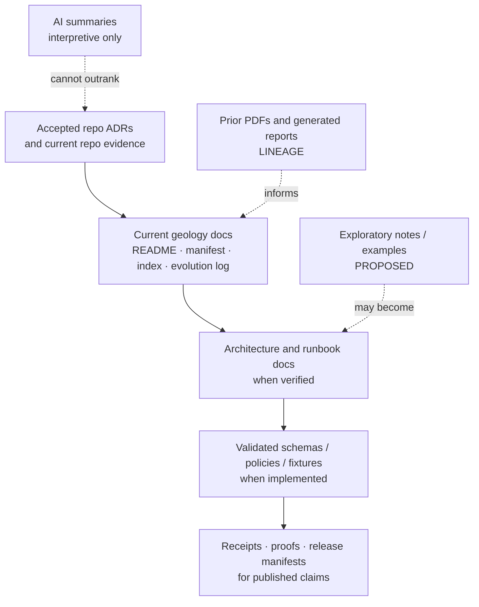
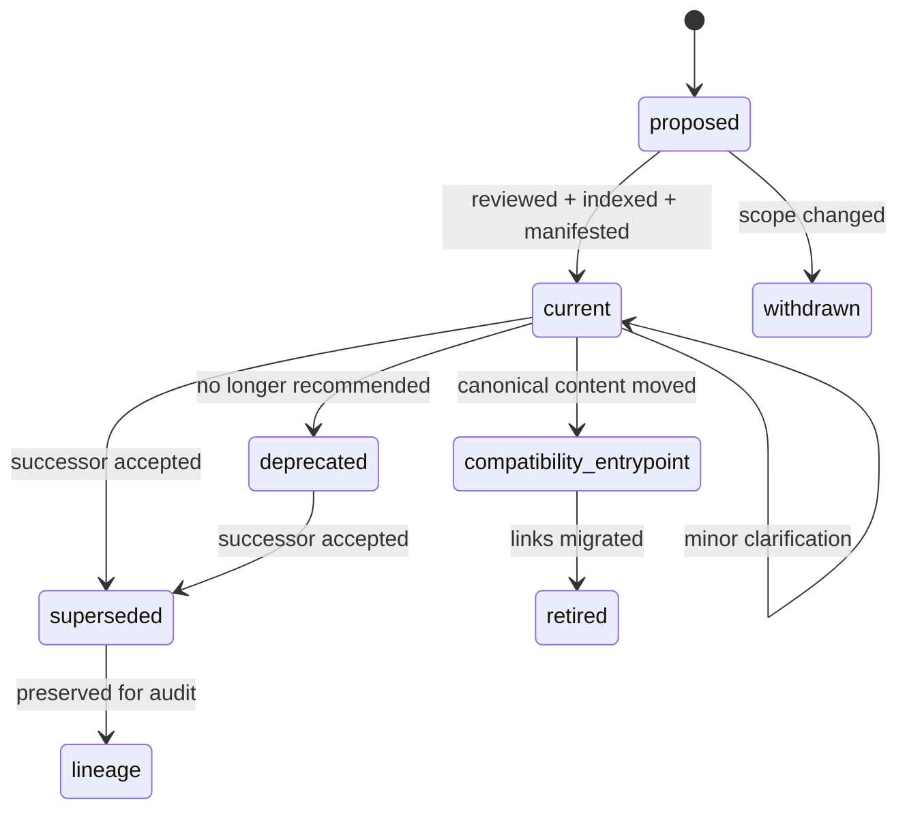

<!-- [KFM_META_BLOCK_V2]
doc_id: kfm://doc/NEEDS-VERIFICATION-ADR-geology-doc-lineage-and-supersession
title: ADR: Geology Documentation Lineage and Supersession
type: standard
version: v1
status: draft
owners: OWNER_TBD_NEEDS_VERIFICATION
created: DATE_TBD_FROM_GIT_OR_DOC_REGISTRY
updated: 2026-05-08
policy_label: NEEDS-VERIFICATION
related: [./README.md, ./ADR-geology-schema-home.md, ./ADR-geology-source-role-model.md, ./ADR-geology-public-safe-geometry.md, ../domains/geology/README.md, ../domains/geology/registers/DOMAIN_INDEX.md, ../domains/geology/registers/FILE_MANIFEST.md, ../domains/geology/tracking/EVOLUTION_LOG.md, ../registers/DRIFT_REGISTER.md]
tags: [kfm, adr, geology, documentation, lineage, supersession, governance]
notes: [Substantive replacement for backlog placeholder. ADR decision remains proposed until owners, doc registry, link checks, manifest/evolution tests, and related geology doc paths are verified in the active checkout.]
[/KFM_META_BLOCK_V2] -->

<a id="top"></a>

# ADR: Geology Documentation Lineage and Supersession

Decision record for how the KFM Geology & Natural Resources documentation set preserves lineage, handles compatibility entrypoints, and supersedes older documents without hiding authority changes.

<p align="center">
  
  
  
  
  
  
</p>

<p align="center">
  <a href="#decision-summary">Decision</a> ·
  <a href="#evidence-boundary">Evidence</a> ·
  <a href="#lineage-model">Lineage model</a> ·
  <a href="#supersession-rules">Supersession</a> ·
  <a href="#validation-plan">Validation</a> ·
  <a href="#rollback-and-correction">Rollback</a> ·
  <a href="#open-verification">Open verification</a>
</p>

> [!IMPORTANT]
> **ADR status:** `proposed`.
>
> **Decision confidence:** `PROPOSED / NEEDS VERIFICATION`.
>
> This ADR records the intended documentation lineage and supersession rules for the Geology & Natural Resources lane. It does **not** claim that all related docs, tests, link checks, manifest validators, owners, or CI gates are already enforced.

---

## ADR header

| Field | Value |
|---|---|
| ADR ID | `ADR-geology-doc-lineage-and-supersession` |
| File | `docs/adr/ADR-geology-doc-lineage-and-supersession.md` |
| Status | `proposed` |
| Decision date | `2026-05-08` |
| Authors / owners | `OWNER_TBD_NEEDS_VERIFICATION` |
| Reviewers | `REVIEWER_TBD_NEEDS_VERIFICATION` |
| Policy label | `NEEDS-VERIFICATION` |
| Scope | `domain documentation / ADR governance / lineage / supersession` |
| Primary domain | Geology & Natural Resources |
| Related ADRs | [`ADR-geology-schema-home.md`](./ADR-geology-schema-home.md), [`ADR-geology-source-role-model.md`](./ADR-geology-source-role-model.md), [`ADR-geology-public-safe-geometry.md`](./ADR-geology-public-safe-geometry.md), [`ADR-0001-schema-home.md`](./ADR-0001-schema-home.md), [`ADR-0002-responsibility-root-monorepo.md`](./ADR-0002-responsibility-root-monorepo.md) |
| Related domain docs | [`../domains/geology/README.md`](../domains/geology/README.md), [`../domains/geology/registers/DOMAIN_INDEX.md`](../domains/geology/registers/DOMAIN_INDEX.md), [`../domains/geology/registers/FILE_MANIFEST.md`](../domains/geology/registers/FILE_MANIFEST.md), [`../domains/geology/tracking/EVOLUTION_LOG.md`](../domains/geology/tracking/EVOLUTION_LOG.md) |
| Supersedes | Backlog placeholder text previously stored in this file |
| Superseded by | `none` |
| Rollback target | Prior placeholder content plus Git history / PR review state |

---

## Decision summary

**Proposed decision:** Geology documentation will be governed as a living, lineage-preserving document set. Current repo documents, accepted ADRs, manifests, indexes, and evolution logs outrank prior PDF-only plans for implementation state. Prior PDFs and planning reports remain valuable `LINEAGE`, but they do not become current repo proof by repetition.

The minimum geology documentation control plane is:

| Control surface | Path | Role |
|---|---|---|
| Domain landing page | `docs/domains/geology/README.md` | Scope, accepted inputs, exclusions, lifecycle, semantic boundaries, public-safe posture. |
| Navigation index | `docs/domains/geology/registers/DOMAIN_INDEX.md` | Maps the lane documentation set and points contributors to the right surface. |
| File manifest | `docs/domains/geology/registers/FILE_MANIFEST.md` | Declares the intended documentation inventory and ownership role for each lane doc. |
| Evolution log | `docs/domains/geology/tracking/EVOLUTION_LOG.md` | Records material changes to documentation behavior, governance posture, or review burden. |
| Decision records | `docs/adr/ADR-geology-*.md` | Preserve decisions, rejected options, validation burden, rollback, and supersession. |

**Operating rule:** Material geology documentation changes must update the relevant manifest, index, evolution log, and related ADR links, or explicitly record why no update was required.

**Boundary rule:** A planning PDF, generated report, map layer, source registry draft, schema index, AI answer, or README paragraph must not silently override an accepted ADR, current repo evidence, policy gate, release manifest, proof object, or rollback record.

<p align="right"><a href="#top">Back to top ↑</a></p>

---

## Context and problem

The existing target file was a placeholder that named the decision area but did not yet settle documentation lineage, compatibility entrypoints, or supersession behavior. The Geology & Natural Resources lane now has enough repo-visible documentation shape to replace that placeholder with a real decision proposal.

KFM geology documentation has two pressures that must be handled together:

1. **Continuity pressure.** Prior geology architecture materials contain useful file-family, validation, rollback, source-role, and public-safe geometry guidance. That material should not be discarded.
2. **Authority pressure.** Prior materials are not current implementation proof. Current repo files, accepted ADRs, validated manifests, and release/proof evidence must remain stronger than older plans.

This ADR exists to prevent three failure modes:

| Failure mode | What goes wrong | Guardrail |
|---|---|---|
| Planning reports become accidental canon | A PDF-only plan is cited as if its paths, tests, policies, or workflows already exist. | Mark prior plans as `LINEAGE` unless repo evidence verifies them. |
| Doc moves break trust links | A README, manifest, or index moves without a compatibility entrypoint or evolution note. | Require manifest/index/evolution updates and old-path stub when needed. |
| Supersession deletes history | A newer doc overwrites an older decision without preserving why it changed. | Preserve successor links, rollback target, and change reason. |

> [!NOTE]
> KFM documentation is part of the working system. For geology, the docs do not merely describe the lane; they also prevent domain truth, policy posture, source authority, public-safe geometry, and release state from drifting apart.

<p align="right"><a href="#top">Back to top ↑</a></p>

---

## Evidence boundary

| Evidence item | Status | Supports | Does not prove |
|---|---:|---|---|
| `docs/adr/ADR-geology-doc-lineage-and-supersession.md` placeholder | `CONFIRMED repo file` | The decision area already exists in `docs/adr/`. | The decision was settled or enforced. |
| `docs/adr/README.md` | `CONFIRMED repo file` | ADRs are the human-facing decision ledger and must distinguish decision state from enforcement state. | Complete ADR coverage or CI enforcement. |
| `docs/adr/ADR-TEMPLATE.md` | `CONFIRMED repo file` | ADRs should expose evidence, truth labels, validation, rollback, and supersession. | That this ADR is accepted. |
| `docs/adr/ADR-0002-responsibility-root-monorepo.md` | `CONFIRMED repo file / accepted decision` | Root folders are responsibility boundaries; domain work belongs under responsibility roots. | Every subpath convention or root hygiene check is enforced. |
| `docs/adr/ADR-0001-schema-home.md` | `CONFIRMED repo file / proposed decision` | Schema-home ambiguity remains visible and should not be normalized silently. | Accepted schema-home enforcement. |
| `docs/domains/geology/README.md` | `CONFIRMED repo file` | Geology domain scope, exclusions, lifecycle, semantic boundaries, and proposed related docs are documented. | All linked geology docs, validators, policies, or tests are complete. |
| `docs/domains/geology/registers/DOMAIN_INDEX.md` | `CONFIRMED repo file` | The lane has a documentation navigation index and maintenance notes. | Complete documentation coverage. |
| `docs/domains/geology/registers/FILE_MANIFEST.md` | `CONFIRMED repo file` | The lane has a documentation inventory and manifest maintenance rules. | Automated manifest validation. |
| `docs/domains/geology/tracking/EVOLUTION_LOG.md` | `CONFIRMED repo file` | The lane tracks material documentation changes. | Append-only enforcement or review-owner coverage. |
| Prior KFM geology architecture report | `LINEAGE / PROPOSED plan` | This ADR was identified as the geology doc-lineage decision record; manifest/evolution tests were proposed as validation. | Current repo implementation, working tests, or accepted owners. |
| Directory Rules and KFM build doctrine | `CONFIRMED doctrine` | Docs are a human control plane; domains belong under responsibility roots, not top-level topic roots. | Current branch enforcement. |

### Truth labels used here

| Label | Meaning in this ADR |
|---|---|
| `CONFIRMED` | Verified from accessible repo evidence, supplied doctrine, or directly inspected project documents. |
| `PROPOSED` | Recommended rule or process not yet proven as accepted or enforced. |
| `LINEAGE` | Prior planning material that preserves continuity but is not current implementation proof. |
| `NEEDS VERIFICATION` | A concrete repo, owner, link, validator, or CI check must still be performed. |
| `UNKNOWN` | Not verified strongly enough in this session. |
| `SUPERSEDED` | Replaced by a newer decision or current repo evidence, while preserved for audit. |

<p align="right"><a href="#top">Back to top ↑</a></p>

---

## Requirements and constraints

### KFM invariants checked

| Invariant | Documentation rule | Status |
|---|---|---:|
| `RAW -> WORK / QUARANTINE -> PROCESSED -> CATALOG / TRIPLET -> PUBLISHED` | Geology docs must not imply a public-release state unless release/proof evidence exists. | `CONFIRMED doctrine / enforcement NEEDS VERIFICATION` |
| Public clients use governed interfaces | README, layer, UI, and Focus docs must not document direct public access to raw/canonical/internal stores. | `CONFIRMED doctrine` |
| `EvidenceRef -> EvidenceBundle` | Consequential geology claims in docs, examples, popups, or Focus examples must preserve evidence lookup rules. | `PROPOSED doc rule` |
| Promotion is a governed state transition | Documentation must keep validation, policy, proof, release, correction, and rollback distinct. | `CONFIRMED doctrine` |
| Derived surfaces stay derived | Maps, tiles, screenshots, diagrams, summaries, and indexes must not be described as sovereign truth. | `CONFIRMED doctrine` |
| Sensitive / exact public exposure fails closed | Exact borehole, private well, sample, resource, infrastructure, or sensitive location examples must be generalized, redacted, synthetic, or denied unless policy allows. | `PROPOSED doc rule` |
| Corrections and supersession are auditable | Old docs and old paths should preserve successor links or compatibility notes when material meaning changes. | `PROPOSED decision` |

### Non-goals

This ADR does **not** decide:

- the canonical geology schema home;
- the geology source-role enum;
- public-safe geometry policy details;
- live KGS/KDHE/KCC/USGS source activation;
- API route names, UI component names, package manager, CI workflow success, or runtime behavior;
- whether all proposed geology architecture/runbook docs already exist;
- source rights, licensing, update cadence, or steward approval.

Those belong in related ADRs, source descriptors, schema/policy decisions, runbooks, or verification records.

<p align="right"><a href="#top">Back to top ↑</a></p>

---

## Lineage model

Geology documentation should be read through a narrow authority ladder.



### Documentation states

| State | Meaning | Allowed behavior |
|---|---|---|
| `current` | Maintained, linked, and intended to govern its stated scope. | May be linked from index and used in review. |
| `compatibility-entrypoint` | A short stub that points to the canonical file. | May preserve old links; must not diverge. |
| `lineage` | Historical or planning material that informs continuity. | May be cited as background; cannot prove current repo behavior. |
| `proposed` | Draft content or planned file not yet accepted or verified. | May guide implementation; must retain truth labels. |
| `superseded` | Replaced by a newer file, ADR, or stronger evidence. | Must link successor and preserve reason. |
| `deprecated` | Historical and not recommended for new work. | Must warn contributors and identify replacement if any. |
| `withdrawn` | Removed from active consideration before becoming governing. | Preserve rationale if it affected review. |

### Authority ladder inside the geology lane

| Rank | Source class | Example | Use |
|---:|---|---|---|
| 1 | Current repo evidence | Current files, tests, manifests, workflows, schemas, policies, release/proof artifacts | Proves current state when directly inspected. |
| 2 | Accepted ADRs | `ADR-0002`, future accepted geology ADRs | Governs decisions within scope. |
| 3 | Current geology docs | `README.md`, `DOMAIN_INDEX.md`, `FILE_MANIFEST.md`, `EVOLUTION_LOG.md` | Guides contributors and review. |
| 4 | Verified architecture/runbook docs | `docs/architecture/geology/**`, `docs/runbooks/geology/**` when present and linked | Describes implementation and operations. |
| 5 | Prior KFM reports / PDFs | Geology architecture PDF-only report | Lineage and design pressure. |
| 6 | Illustrative examples and AI-generated text | Example snippets, generated summaries | Never root truth; must be labeled and validated before reuse. |

<p align="right"><a href="#top">Back to top ↑</a></p>

---

## Decision

### Chosen option

Adopt a **manifest-led, evolution-log-backed, ADR-superseded documentation model** for the Geology & Natural Resources lane.

### Operating rules

1. `docs/domains/geology/README.md` is the domain landing page.
2. `docs/domains/geology/registers/DOMAIN_INDEX.md` is the documentation navigation index.
3. `docs/domains/geology/registers/FILE_MANIFEST.md` is the documentation inventory and role map.
4. `docs/domains/geology/tracking/EVOLUTION_LOG.md` records material documentation changes.
5. Geology ADRs record governance-significant decisions and supersede older ADRs only through visible successor links.
6. Compatibility entrypoints may exist, but they must point to canonical content and must not evolve independently.
7. Prior PDF-only plans are retained as `LINEAGE`; they may seed a decision but cannot prove current implementation.
8. A doc path move, doc-role change, or authority change requires manifest/index/evolution-log updates.
9. Sensitive exact-location examples must be synthetic, generalized, redacted, or withheld unless policy allows.
10. Documentation changes that alter public exposure, release posture, source authority, schema authority, policy posture, or EvidenceBundle behavior require an ADR update or successor ADR.

### Boundary rule

> Geology docs may explain evidence flow, but they must not publish unsupported geology claims, certify source rights, expose restricted geometry, or imply runtime enforcement without direct evidence.

### Accepted compatibility pattern

A compatibility entrypoint is allowed when it is intentionally short and points to canonical content.

```markdown
# Domain Index

This file exists as a compatibility entrypoint. Canonical content lives at [`registers/DOMAIN_INDEX.md`](registers/DOMAIN_INDEX.md).
```

That pattern is acceptable only if the compatibility file does not accumulate independent decision content.

<p align="right"><a href="#top">Back to top ↑</a></p>

---

## Supersession rules

### Edit in place vs supersede

| Change type | Edit in place? | Supersession required? | Required record |
|---|---:|---:|---|
| Typo, punctuation, formatting | Yes | No | None unless meaning changes. |
| Link repair with same target meaning | Yes | No | Optional evolution note if many links changed. |
| Clarification that preserves decision | Yes | Usually no | Evolution note if reviewer behavior changes. |
| New section that changes review burden | Yes | Sometimes | Update manifest/index and evolution log. |
| Doc move or path re-home | No, not alone | Usually yes or compatibility entrypoint | Manifest, index, old-path stub, evolution log. |
| Authority change | No | Yes | ADR update or successor ADR. |
| Schema, policy, source-role, release, or public exposure change | No | Yes | Related ADR + validation plan. |
| Prior report replaced by repo doc | No | Yes if cited as authority | Mark prior report `LINEAGE` or `SUPERSEDED`. |
| Sensitive/public-safety correction | No | Yes | Correction note, rollback path, policy review. |

### Supersession record minimum

Every material supersession should record:

| Field | Required value |
|---|---|
| Superseded file or decision | Path, ADR ID, or source ID. |
| Successor | New path, ADR, register, release, or proof artifact. |
| Reason | What changed and why. |
| Evidence | Repo file, PR, test, validator, review, or release artifact. |
| Public exposure impact | `none`, `possible`, `confirmed`, or `NEEDS VERIFICATION`. |
| Rollback target | Prior file/path/release/manifest or Git revision. |
| Update targets | Manifest, domain index, evolution log, backlinks, ADR index, affected docs. |

### Documentation state transitions



<p align="right"><a href="#top">Back to top ↑</a></p>

---

## Impact map

### Documentation impact

| Area | Required update | Status |
|---|---|---:|
| `docs/adr/ADR-geology-doc-lineage-and-supersession.md` | Replace placeholder with substantive proposed ADR. | `THIS FILE` |
| `docs/adr/README.md` | Add or update entry for this ADR if index is active. | `NEEDS VERIFICATION` |
| `docs/domains/geology/README.md` | Keep related-links and doc-control references synchronized. | `NEEDS VERIFICATION` |
| `docs/domains/geology/registers/DOMAIN_INDEX.md` | Include this ADR if local index tracks ADRs or decision docs. | `PROPOSED` |
| `docs/domains/geology/registers/FILE_MANIFEST.md` | Include new or revised geology doc-control files if introduced. | `PROPOSED` |
| `docs/domains/geology/tracking/EVOLUTION_LOG.md` | Record this placeholder replacement as a material doc-control change. | `PROPOSED` |
| `docs/architecture/geology/**` | Add supersession notes only after files are verified. | `NEEDS VERIFICATION` |
| `docs/runbooks/geology/**` | Add operational doc-control steps only after files are verified. | `NEEDS VERIFICATION` |
| `docs/registers/DRIFT_REGISTER.md` | Record unresolved slug/path/doc-control conflicts if applicable. | `NEEDS VERIFICATION` |

### Trust-surface impact

| Surface | Effect | Guardrail |
|---|---|---|
| Domain docs | Must distinguish `current`, `proposed`, `lineage`, and `superseded`. | Manifest and evolution log. |
| ADRs | Must preserve decisions and successor links. | ADR index and review checklist. |
| Source docs | Must not activate or certify live sources by prose alone. | SourceDescriptor and source review. |
| Layer docs | Must not imply public release without release manifest/proof support. | Layer descriptor and release state. |
| Evidence Drawer / Focus Mode docs | Must not describe unsupported answers as authoritative. | EvidenceBundle resolution and finite outcomes. |
| Public examples | Must avoid exact restricted/sensitive geometry unless allowed. | Public-safe geometry ADR and redaction policy. |

<p align="right"><a href="#top">Back to top ↑</a></p>

---

## Validation plan

This ADR is acceptable only when the documentation control plane can be checked without relying on memory.

### Required checks

| Check | Expected result | Status |
|---|---|---:|
| ADR metadata check | Meta block, H1, ADR header, and filename agree. | `PROPOSED` |
| ADR index check | `docs/adr/README.md` lists this ADR with status and related decisions. | `NEEDS VERIFICATION` |
| Geology manifest check | `FILE_MANIFEST.md` reflects current geology documentation files or records exclusions. | `NEEDS VERIFICATION` |
| Domain index check | `DOMAIN_INDEX.md` points to canonical docs and compatibility entrypoints. | `NEEDS VERIFICATION` |
| Evolution log check | `EVOLUTION_LOG.md` records material documentation changes. | `NEEDS VERIFICATION` |
| Link check | Relative links in this ADR and geology docs resolve in the active checkout. | `NEEDS VERIFICATION` |
| Compatibility-entrypoint check | Stub files point to canonical content and contain no independent authority. | `NEEDS VERIFICATION` |
| Lineage labeling check | Prior PDFs and generated reports are marked `LINEAGE` or `PROPOSED` when cited. | `PROPOSED` |
| Sensitive-example check | Public docs do not include exact restricted geology/resource/borehole/sample locations without policy allowance. | `NEEDS VERIFICATION` |
| Rollback check | Old path, old ADR, or prior file state can be recovered from Git or successor links. | `NEEDS VERIFICATION` |

### Illustrative validation commands

These commands are illustrative until repo-native tooling is verified.

```bash
# Confirm repository context.
git rev-parse --show-toplevel
git status --short
git branch --show-current

# Confirm this ADR and related geology docs exist.
test -f docs/adr/ADR-geology-doc-lineage-and-supersession.md
test -f docs/domains/geology/README.md
test -f docs/domains/geology/registers/DOMAIN_INDEX.md
test -f docs/domains/geology/registers/FILE_MANIFEST.md
test -f docs/domains/geology/tracking/EVOLUTION_LOG.md

# Find geology documentation links and likely stale paths.
grep -RInE 'docs/domains/geology|ADR-geology|DOMAIN_INDEX|FILE_MANIFEST|EVOLUTION_LOG|LINEAGE|SUPERSEDED' \
  docs/adr docs/domains/geology docs/architecture docs/runbooks 2>/dev/null || true

# Check whether compatibility entrypoints are short stubs rather than divergent authority.
find docs/domains/geology -maxdepth 1 -type f -name '*.md' -print -exec wc -l {} \;
```

### Negative-path expectations

| Failure condition | Expected outcome |
|---|---|
| A material geology doc exists but is missing from `FILE_MANIFEST.md`. | Review blocks until manifest is updated or exclusion is documented. |
| A canonical doc moves without a compatibility entrypoint or successor note. | Review blocks; old links must be preserved or consciously retired. |
| A prior PDF is cited as current implementation proof. | Review blocks; citation must be relabeled `LINEAGE` or backed by repo evidence. |
| A public doc includes exact sensitive geology/resource geometry without policy allowance. | Publication denied or doc held for redaction/generalization review. |
| An ADR is marked accepted without validation/owner evidence. | ADR status remains `proposed` or `review`; enforcement remains `NEEDS VERIFICATION`. |

<p align="right"><a href="#top">Back to top ↑</a></p>

---

## Rollback and correction

### Rollback rule

Documentation rollback must restore safety and preserve history. Do not delete decision lineage just to make the tree look clean.

### Rollback triggers

| Trigger | Required action |
|---|---|
| Broken link graph after doc move | Restore compatibility entrypoint or revert move; update manifest/index. |
| Incorrect authority claim | Correct wording; add evolution-log note if reviewer behavior changed. |
| Prior lineage treated as implementation proof | Relabel as `LINEAGE`; add evidence requirement. |
| Sensitive public exposure in docs | Remove or generalize content; open policy/sensitivity review; record correction. |
| ADR accepted prematurely | Revert status to `proposed` or `review`; list missing validation evidence. |
| Manifest/index divergence | Update both surfaces or revert the doc change. |

### Correction note minimum

A documentation correction that affects contributor behavior, public exposure, release posture, or governance should record:

```yaml
correction_note:
  affected_path: "docs/..."
  issue: "NEEDS VERIFICATION"
  correction_type: "link_repair | authority_correction | sensitivity_redaction | supersession_note | rollback"
  prior_state: "Git revision, PR, or file path"
  successor_state: "New path, ADR, or corrected text"
  public_exposure_impact: "none | possible | confirmed | NEEDS VERIFICATION"
  reviewed_by: "REVIEWER_TBD_NEEDS_VERIFICATION"
  follow_up:
    - "Update FILE_MANIFEST.md"
    - "Update DOMAIN_INDEX.md"
    - "Update EVOLUTION_LOG.md"
```

<p align="right"><a href="#top">Back to top ↑</a></p>

---

## Consequences

### Positive consequences

- Preserves useful geology planning lineage without turning it into accidental repo truth.
- Makes document moves and authority changes reviewable.
- Keeps manifest, navigation, and change history close to the geology domain.
- Prevents compatibility entrypoints from becoming silent parallel docs.
- Supports later validators for manifest/index/evolution consistency.
- Protects KFM’s release and correction posture by keeping docs, decisions, and implementation evidence separate.

### Tradeoffs and risks

| Risk | Mitigation | Residual status |
|---|---|---:|
| More documentation surfaces must be updated per change. | Use manifest/index/evolution rules and keep stubs short. | `ACCEPTED TRADEOFF` |
| Contributors may confuse compatibility entrypoints with canonical docs. | Stub must explicitly identify canonical target. | `NEEDS VERIFICATION` |
| Prior PDFs may still be persuasive enough to overclaim. | Require `LINEAGE` label unless repo evidence verifies claim. | `ACTIVE RISK` |
| Manifest/evolution tests may not yet exist. | Keep ADR status `proposed` and list checks in validation plan. | `NEEDS VERIFICATION` |
| Sensitive examples can leak exact locations. | Use synthetic/generalized examples and policy review. | `HIGH-BURDEN REVIEW` |

<p align="right"><a href="#top">Back to top ↑</a></p>

---

## Open verification

| Item | Status | Why it matters | Closure artifact |
|---|---:|---|---|
| ADR owner / documentation steward | `NEEDS VERIFICATION` | Supersession decisions need accountable review. | CODEOWNERS, governance register, or PR approval. |
| Doc ID and created date | `NEEDS VERIFICATION` | Meta block must not fabricate registry identity. | Document registry or Git history. |
| Policy label | `NEEDS VERIFICATION` | Geology docs may touch sensitive public-release posture. | Policy/steward review. |
| ADR index entry | `NEEDS VERIFICATION` | Contributors need to find this decision. | Updated `docs/adr/README.md`. |
| Manifest/index/evolution validation | `NEEDS VERIFICATION` | This ADR’s proposed validation must become executable or reviewable. | Validator output or checklist. |
| Full geology doc inventory | `NEEDS VERIFICATION` | Current manifest must reflect real active checkout. | Updated manifest and link report. |
| Compatibility entrypoint inventory | `NEEDS VERIFICATION` | Stubs should not diverge from canonical docs. | Compatibility-entrypoint check. |
| Architecture/runbook path status | `NEEDS VERIFICATION` | Prior plans proposed architecture/runbook docs; current presence and role must be verified. | Repo file inventory and manifest update. |
| Related geology ADR statuses | `NEEDS VERIFICATION` | Schema, source-role, and public-safe geometry decisions may affect this doc lineage rule. | ADR review notes and successor links. |
| Sensitive example scan | `NEEDS VERIFICATION` | Public docs must not expose restricted exact geology/resource locations. | Redaction/public-safe review. |

<p align="right"><a href="#top">Back to top ↑</a></p>

---

## Review checklist

<details>
<summary>Pre-merge checklist</summary>

- [ ] Meta block title, H1, ADR header, and filename are synchronized.
- [ ] `owners`, `doc_id`, `created`, and `policy_label` are either verified or explicitly marked `NEEDS VERIFICATION`.
- [ ] ADR status remains `proposed` until validation and owner review are proven.
- [ ] `docs/adr/README.md` is updated or a follow-up item is recorded.
- [ ] `docs/domains/geology/registers/FILE_MANIFEST.md` is updated or a follow-up item is recorded.
- [ ] `docs/domains/geology/registers/DOMAIN_INDEX.md` is updated or a follow-up item is recorded.
- [ ] `docs/domains/geology/tracking/EVOLUTION_LOG.md` is updated for this material placeholder replacement.
- [ ] Compatibility entrypoints are short and point to canonical content.
- [ ] Prior PDFs and generated reports are labeled `LINEAGE` when cited.
- [ ] No current implementation, test, workflow, route, source, or runtime claim is made without repo evidence.
- [ ] Sensitive exact-location examples are absent, synthetic, generalized, or policy-reviewed.
- [ ] Rollback and supersession behavior is visible.
- [ ] Related ADRs are linked and not silently overridden.
- [ ] Relative links have been checked in the active checkout.

</details>

---

## Appendix A — Quick contributor rule

When updating geology docs, ask:

1. Does this change alter scope, authority, review burden, source role, public exposure, or release behavior?
2. Does the change need an ADR update or successor ADR?
3. Does `FILE_MANIFEST.md` still match the doc set?
4. Does `DOMAIN_INDEX.md` still point to the right canonical docs?
5. Does `EVOLUTION_LOG.md` need a material-change entry?
6. Are old paths preserved through compatibility stubs or supersession notes?
7. Is every implementation claim backed by repo evidence rather than planning lineage?
8. Is sensitive exact-location material withheld, generalized, or policy-reviewed?

If the answer is uncertain, mark the item `NEEDS VERIFICATION` and block public-facing release claims until the uncertainty is closed.
