<!-- [KFM_META_BLOCK_V2]
doc_id: kfm://doc/NEEDS-VERIFICATION-ADR-geology-schema-home
title: ADR-geology-schema-home: Geology Machine Schema Home
type: standard
version: v1-draft
status: draft
owners: OWNER_TBD_NEEDS_VERIFICATION
created: NEEDS-VERIFICATION
updated: 2026-05-08
policy_label: NEEDS_VERIFICATION
related: [./README.md, ./ADR-0001-schema-home.md, ../domains/geology/README.md, ../../schemas/README.md, ../../schemas/contracts/v1/README.md, ../../contracts/README.md, ../../policy/README.md]
tags: [kfm, adr, geology, natural-resources, schema-home, evidence, governance, public-safe-geometry]
notes: [This file revises an existing placeholder ADR. doc_id, created date, owners, CODEOWNERS routing, policy_label, CI enforcement, complete schema inventory, and final acceptance state remain NEEDS VERIFICATION. This ADR is proposed until ADR-0001 schema-home acceptance, geology schema inventory, validator behavior, fixture coverage, and review evidence are confirmed.]
[/KFM_META_BLOCK_V2] -->

<a id="top"></a>

# ADR-geology-schema-home: Geology Machine Schema Home

Proposed decision record for where KFM geology and non-biological natural-resource machine schemas should live, how they relate to semantic contracts, and how to prevent geology source-role, map-scale, resource, borehole, public-safe geometry, evidence, validation, and release drift.

<p align="center">
  
  
  
  
  
  
</p>

<p align="center">
  <a href="#adr-header">Header</a> ·
  <a href="#decision-summary">Decision</a> ·
  <a href="#context">Context</a> ·
  <a href="#evidence-basis">Evidence</a> ·
  <a href="#path-decision">Path decision</a> ·
  <a href="#validation-plan">Validation</a> ·
  <a href="#rollback-and-supersession">Rollback</a> ·
  <a href="#open-verification">Open verification</a>
</p>

> [!IMPORTANT]
> **Decision status:** `PROPOSED`.
>
> This ADR must not be marked `accepted` until the active checkout confirms repo-wide schema-home alignment, owner/reviewer routing, existing geology schema inventory, compatibility or alias requirements, validator behavior, fixture coverage, and CI or validation evidence.

> [!NOTE]
> This ADR narrows the repo-wide schema-home proposal in [`ADR-0001-schema-home.md`](./ADR-0001-schema-home.md) for the geology and natural-resources lane. It does not replace the repo-wide ADR, and it does not activate live geology sources.

---

## ADR header

| Field | Value |
|---|---|
| ADR ID | `ADR-geology-schema-home` |
| Title | Geology Machine Schema Home |
| Status | `proposed` |
| Decision date | `2026-05-08` |
| Owners | `OWNER_TBD_NEEDS_VERIFICATION` |
| Reviewers | `geology-domain-stewards`, `schema-stewards`, `policy-stewards`, `release-stewards` — all `NEEDS VERIFICATION` |
| Scope | Geology and non-biological natural-resource domain machine schemas, semantic contracts, source registry references, fixtures, validators, public-safe geometry rules, and release gates |
| Affected paths | `docs/adr/ADR-geology-schema-home.md`, `docs/domains/geology/`, `schemas/contracts/v1/domains/geology/`, `contracts/domains/geology/`, `data/registry/geology/`, geology policy home, geology fixtures, geology validators |
| Related ADRs | [`ADR-0001-schema-home.md`](./ADR-0001-schema-home.md) |
| Supersedes | Existing placeholder content in this file |
| Superseded by | `none` |
| Decision confidence | `PROPOSED` |
| Enforcement maturity | `NEEDS VERIFICATION` |
| Rollback target | Restore placeholder ADR body or supersede with a narrower geology schema-home ADR after repo inventory |

[Back to top](#top)

---

## Decision summary

**PROPOSED:** Geology domain-specific machine schemas should live under:

```text
schemas/contracts/v1/domains/geology/
```

Shared trust-object schemas remain in their shared schema families under `schemas/contracts/v1/`, such as `source/`, `evidence/`, `policy/`, `release/`, `runtime/`, `correction/`, and `data/`.

Semantic geology contract prose, if needed, should live under:

```text
contracts/domains/geology/
```

Geology source descriptors and source-admission registries should remain under the accepted source-registry responsibility root, with `data/registry/geology/` as the current proposed domain registry lane until the active checkout proves a different convention.

This ADR must not create a second schema authority in:

```text
contracts/geology/
schemas/contracts/v1/geology/
geology/
```

### One-line decision rule

> Use `schemas/contracts/v1/domains/geology/` for geology machine schemas; use `contracts/` for semantic contract meaning; use `policy/` for admissibility decisions; use fixtures and validators to prove the split.

### One-line safety rule

> If source role, rights, map scale, resource classification, geometry precision, EvidenceBundle resolution, review state, release state, or rollback support is unclear, geology publication and public exact geometry fail closed.

[Back to top](#top)

---

## Context

The current target file existed as a placeholder ADR that said it would settle “geology schema home.” This revision replaces that placeholder with an evidence-bounded proposed decision.

KFM already has a repo-wide schema-home ADR that proposes `schemas/contracts/v1/` as the canonical home for machine-checkable contract schemas while keeping `contracts/` as the semantic contract surface and `policy/` as the admissibility decision surface. That repo-wide decision is still draft/proposed and requires acceptance evidence before enforcement can be claimed.

The geology domain README already exists and treats geology as a governed lane for Kansas-centered geology and non-biological natural-resource evidence. It also keeps multiple placement questions open, including the geology schema home and the geology lane slug. This ADR resolves only the schema-home question for geology-specific machine schemas. It does not settle every geology path, source registry, policy runner, API route, UI component, or live connector.

### Why this is architecture-significant

Geology schemas are not harmless file-shape records. They can affect:

- geologic-unit identity and map-unit interpretation;
- map scale and source-publication support;
- bedrock, surficial, stratigraphic, lithologic, structural, and geomorphic claims;
- borehole, core, sample, well-log, and measured-section exposure;
- geophysical and geochemical observation interpretation;
- mineral occurrence, resource estimate, extraction, production, regulatory, and reclamation distinction;
- public-safe layer profiles and generalized geometry;
- Evidence Drawer payloads and Focus Mode answers;
- release manifests, proof packs, redaction receipts, correction notices, and rollback cards.

A weak schema-home decision can create the following failures:

| Failure mode | Why it matters |
|---|---|
| Parallel schema homes | Validators, fixtures, release manifests, and runtime consumers can enforce different shapes. |
| Semantic contract drift | Human-readable geology meaning can diverge from machine validation. |
| Map-scale drift | Public layers can imply false precision or unsupported boundary confidence. |
| Source-role collapse | Official geologic maps, borehole logs, production records, permits, and modeled surfaces can be treated as interchangeable. |
| Resource overclaiming | A mineral occurrence, modeled potential surface, production record, or permit can be overstated as a reserve or resource estimate. |
| Public location leakage | Borehole, sample, private well, resource, or sensitive extraction geometry can reach public surfaces without policy review. |
| Release ambiguity | Proof packs and release manifests cannot state which schema family governed a published geology artifact. |
| Rollback ambiguity | Reverting a faulty geology release becomes harder if schema IDs, source roles, and layer contracts drift. |

[Back to top](#top)

---

## Evidence basis

This ADR separates repository evidence, attached KFM doctrine, geology lineage material, and proposed implementation.

| Evidence item | Status | What it supports | Limit |
|---|---:|---|---|
| `docs/adr/ADR-geology-schema-home.md` | `CONFIRMED` | Target ADR file exists and currently carries placeholder decision coverage. | Placeholder does not settle schema home. |
| [`./README.md`](./README.md) | `CONFIRMED` | ADR directory is the human-facing decision ledger and distinguishes decision state from enforcement state. | Does not prove all ADRs are accepted or enforced. |
| [`./ADR-0001-schema-home.md`](./ADR-0001-schema-home.md) | `CONFIRMED / PROPOSED` | Repo-wide proposed split: `schemas/contracts/v1/` for machine shape, `contracts/` for semantic meaning, `policy/` for admissibility. | Still draft/proposed; enforcement requires verification. |
| [`../domains/geology/README.md`](../domains/geology/README.md) | `CONFIRMED` | Geology lane exists as a domain README and records open schema-home, source, public-safe geometry, and runtime trust questions. | Does not prove machine schemas, validators, or release objects exist. |
| [`../../schemas/README.md`](../../schemas/README.md) | `CONFIRMED` | `schemas/` is an active schema parent lane and names unresolved schema-home authority. | Does not prove geology domain schemas exist. |
| [`../../contracts/README.md`](../../contracts/README.md) | `CONFIRMED` | `contracts/` owns object meaning, field intent, and compatibility expectations. | Does not make `contracts/` the machine schema home. |
| [`../../policy/README.md`](../../policy/README.md) | `CONFIRMED` | Policy decides rights, sensitivity, review, release, correction, runtime, and deny-by-default behavior. | Does not define schema shape. |
| Geology architecture lineage | `LINEAGE / PROPOSED` | Prior geology plan proposed docs, registries, contracts, schemas, validators, policies, fixtures, release objects, and a first offline fixture slice. | Prior plan had no mounted repo proof and must not be treated as current implementation. |
| Directory discipline | `CONFIRMED doctrine` | Domain names belong under responsibility roots rather than becoming new repo-root folders. | Does not prove all proposed subpaths exist today. |

### Evidence boundary

A local mounted checkout was not available during this authoring pass. Current repository evidence was inspected through accessible GitHub connector results. Active branch state, CODEOWNERS routing, workflow execution, full schema inventory, live source rights, policy runner behavior, emitted receipts/proofs, runtime/API consumers, and UI implementation remain `NEEDS VERIFICATION`.

[Back to top](#top)

---

## Requirements and constraints

### KFM invariants checked

| Invariant | ADR effect | Status |
|---|---|---:|
| `RAW -> WORK/QUARANTINE -> PROCESSED -> CATALOG/TRIPLET -> PUBLISHED` | Keeps schemas separate from lifecycle data, registries, receipts, proofs, and publication artifacts. | `PRESERVED` |
| Public clients use governed interfaces | Schema placement must support governed API, Evidence Drawer, MapLibre, and Focus payload validation without direct access to RAW/WORK/QUARANTINE. | `PRESERVED` |
| EvidenceRef resolves to EvidenceBundle | Geology schema families must require resolvable evidence for consequential claims. | `PROPOSED` |
| Promotion is a governed state transition | Release schema use must tie to release manifests, policy decisions, proof closure, and rollback targets. | `PROPOSED` |
| AI is interpretive | Focus Mode schemas and payloads must support finite outcomes without making AI output evidence. | `PRESERVED` |
| Derived layers stay derived | Public map tiles, modeled resource potential, generalized geology layers, and search/graph projections must not become canonical truth. | `PRESERVED` |
| Sensitivity and rights fail closed | Unknown rights, source role, map scale, borehole exposure, resource sensitivity, or exact geometry must block public promotion. | `PRESERVED` |
| Receipts, proofs, release, correction, and rollback stay separate | Schema definitions do not store emitted trust objects. | `PRESERVED` |

### Non-goals

This ADR does not decide:

- complete geology schema field lists;
- final schema `$id` naming;
- fixture-home authority across the whole repository;
- policy-as-code syntax or runner;
- API route names;
- UI component paths;
- live KGS, KDHE, KCC, USGS, borehole, resource, or map-service source activation;
- source-rights approval;
- exact public geometry rules for boreholes, samples, private wells, or resource-sensitive sites;
- resource classification schemes;
- graph/triplestore path;
- release readiness.

[Back to top](#top)

---

## Path decision

### Selected path

Use this canonical geology domain machine-schema home after acceptance:

```text
schemas/contracts/v1/domains/geology/
```

### Companion homes

| Concern | Home | Status | Rule |
|---|---|---:|---|
| Geology domain docs | `docs/domains/geology/` | `CONFIRMED README / more files NEEDS VERIFICATION` | Human-facing control plane only. |
| Geology machine schemas | `schemas/contracts/v1/domains/geology/` | `PROPOSED canonical` | Machine-checkable domain shape. |
| Short legacy/proposed schema path | `schemas/contracts/v1/geology/` | `DEPRECATED or ALIAS ONLY if needed` | Do not use as a second authority. |
| Shared trust-object schemas | `schemas/contracts/v1/<shared-family>/` | `CONFIRMED parent signal / NEEDS VERIFICATION for enforcement` | Do not duplicate shared trust objects under geology. |
| Geology semantic contracts | `contracts/domains/geology/` | `PROPOSED companion if needed` | Explain object meaning and compatibility, not machine shape. |
| Source registry | `data/registry/geology/` or accepted source-registry home | `PROPOSED / NEEDS VERIFICATION` | Source roles, rights, authority scope, cadence, sensitivity, and connector blockers. |
| Policy rules | `policy/geology/`, `policy/domains/geology/`, or accepted policy-domain home | `PROPOSED / NEEDS VERIFICATION` | Deny, hold, abstain, restrict, generalize, embargo, allow, or require review. |
| Validators | `tools/validators/geology/` or repo-native validator home | `PROPOSED / NEEDS VERIFICATION` | Fail-closed schema/source/public-safety/evidence/release checks. |
| Fixtures | `tests/fixtures/geology/`, `fixtures/domains/geology/`, or accepted fixture home | `PROPOSED / NEEDS VERIFICATION` | Positive and negative proof cases. |
| Receipts | `data/receipts/geology/` | `PROPOSED / NEEDS VERIFICATION` | Run, validation, redaction, rollback memory. |
| Proofs | `data/proofs/geology/` | `PROPOSED / NEEDS VERIFICATION` | EvidenceBundle, proof pack, release support. |
| Published artifacts | `data/published/geology/` | `PROPOSED / NEEDS VERIFICATION` | Public-safe materializations only. |

### Why `domains/geology/`

KFM directory discipline treats domain names as subpaths under responsibility roots. Geology is a domain lane, not a repo-wide responsibility root. The schema root owns machine shape; the `domains/geology/` subpath preserves that responsibility-root pattern while preventing domain material from becoming root-level buckets.

```mermaid
flowchart LR
  ADR[docs/adr/ADR-geology-schema-home.md<br/>decision record] --> Schemas[schemas/contracts/v1/domains/geology/<br/>machine schemas]
  ADR --> Contracts[contracts/domains/geology/<br/>semantic companion]
  ADR --> Registry[data/registry/geology/<br/>source roles + rights + sensitivity]
  Schemas --> Fixtures[fixtures / tests<br/>valid + invalid examples]
  Registry --> Policy[policy geology home<br/>deny / hold / abstain / allow]
  Fixtures --> Validators[tools/validators/geology/<br/>fail-closed reports]
  Validators --> Release[release + data/proofs + data/receipts<br/>proof, review, rollback]
  Release --> API[governed API]
  API --> UI[MapLibre · Evidence Drawer · Focus Mode]

  Contracts -. meaning, not shape .-> Schemas
  Schemas -. shape, not permission .-> Policy
  UI -. no RAW / WORK / QUARANTINE .-> Registry
```



[Back to top](#top)

---

## Candidate schema families

The exact schema filenames and `$id` values remain `PROPOSED` until a schema PR lands. This table records the expected object-family boundary, not final file content.

| Object family | Candidate schema home | Role |
|---|---|---|
| `geologic_unit` | `schemas/contracts/v1/domains/geology/geologic_unit.schema.json` | Unit identity, name, rank, source publication, unit symbol, geologic age, lithology, and status. |
| `geology_boundary_version` | `schemas/contracts/v1/domains/geology/geology_boundary_version.schema.json` | Map-unit boundary version, source scale, interpreted geometry role, validity, and release linkage. |
| `stratigraphic_unit` | `schemas/contracts/v1/domains/geology/stratigraphic_unit.schema.json` | Stratigraphic naming, correlation basis, rank, age interval, source support, and uncertainty. |
| `lithology_profile` | `schemas/contracts/v1/domains/geology/lithology_profile.schema.json` | Lithology classification, material descriptions, confidence, and observation/interpretation basis. |
| `geologic_structure` | `schemas/contracts/v1/domains/geology/geologic_structure.schema.json` | Faults, folds, contacts, fracture zones, and structural interpretation with certainty and source role. |
| `geomorphology_feature` | `schemas/contracts/v1/domains/geology/geomorphology_feature.schema.json` | Geology-bearing landforms with observed or interpreted support. |
| `borehole_reference` | `schemas/contracts/v1/domains/geology/borehole_reference.schema.json` | Boreholes, wells, cores, logs, measured sections, and public/internal geometry class. |
| `geoscience_observation` | `schemas/contracts/v1/domains/geology/geoscience_observation.schema.json` | Geochemistry, geophysics, sample, measurement, method, detection limit, and uncertainty support. |
| `mineral_occurrence` | `schemas/contracts/v1/domains/geology/mineral_occurrence.schema.json` | Occurrence evidence without overstating deposit, reserve, extraction, or economic classification. |
| `resource_estimate` | `schemas/contracts/v1/domains/geology/resource_estimate.schema.json` | Resource/reserve estimate with classification scheme, date, method, confidence, and source support. |
| `extraction_site_context` | `schemas/contracts/v1/domains/geology/extraction_site_context.schema.json` | Extraction/production/reclamation context without making administrative records physical geology truth. |
| `geology_public_layer_profile` | `schemas/contracts/v1/domains/geology/geology_public_layer_profile.schema.json` | Public layer field allowlist, geometry role, evidence lookup, caveats, and Evidence Drawer expectations. |
| `geology_relation_edge` | `schemas/contracts/v1/domains/geology/geology_relation_edge.schema.json` | Relation edges to hydrology, soils, hazards, infrastructure, ownership, archaeology, or resources without absorbing their truth. |

### Shared schema references

Do not duplicate these shared object families under `domains/geology/` unless a successor ADR requires a domain overlay:

| Shared object | Preferred shared family |
|---|---|
| `SourceDescriptor` | `schemas/contracts/v1/source/` |
| `EvidenceBundle` | `schemas/contracts/v1/evidence/` |
| `DecisionEnvelope` | `schemas/contracts/v1/policy/` or accepted decision-envelope home |
| `ReleaseManifest` | `schemas/contracts/v1/release/` |
| `RuntimeResponseEnvelope` | `schemas/contracts/v1/runtime/` |
| `CorrectionNotice` | `schemas/contracts/v1/correction/` |
| `DatasetVersion` | `schemas/contracts/v1/data/` |
| `RedactionReceipt` / transform receipt | Prefer shared receipt or proof family if present; use a geology overlay only with explicit justification. |

[Back to top](#top)

---

## Options considered

| Option | Description | Benefits | Risks | Outcome |
|---|---|---|---|---|
| `schemas/contracts/v1/domains/geology/` | Domain subpath under versioned machine-contract schema home. | Aligns with responsibility-root discipline and repo-wide schema ADR direction; groups domain schema families consistently. | Requires updating geology README wording that currently references a shorter proposed path. Acceptance depends on ADR-0001 and validators. | **Selected / PROPOSED** |
| `schemas/contracts/v1/geology/` | Domain path directly under `v1`. | Shorter path; appears in geology-domain planning language. | Can diverge from other domain-lane ADRs and from responsibility-root domain grouping. | Rejected unless successor ADR proves repo convention prefers it. |
| `contracts/geology/` as machine-schema home | Put geology machine schemas beside semantic contract docs. | Familiar to older scaffold language. | Collapses semantic contract meaning and machine validation authority; conflicts with the proposed repo-wide split. | Rejected for machine schemas. |
| Dual homes with copies | Keep both `contracts/geology/` and `schemas/contracts/v1/...`. | May seem compatible short-term. | Creates parallel authority, validator drift, fixture ambiguity, and release uncertainty. | Rejected. |
| Defer decision and keep placeholder | Leave geology schema home unsettled. | Avoids immediate migration work. | Allows drift to continue across docs, registries, validators, fixtures, and public-safety gates. | Rejected. |

[Back to top](#top)

---

## Normative rules after acceptance

When this ADR is accepted, these rules should govern geology schema work.

1. **Machine schemas:** geology domain-specific machine schemas live under `schemas/contracts/v1/domains/geology/`.
2. **Semantic contracts:** geology semantic contract prose may live under `contracts/domains/geology/`; it must not duplicate machine schema authority.
3. **No parallel homes:** do not create `contracts/geology/*.schema.json` or `schemas/contracts/v1/geology/*.schema.json` as a second authority.
4. **Explicit aliases only:** any existing or legacy geology schema path must be represented by an explicit alias or migration map with tests and retirement plan.
5. **Shared schemas stay shared:** `SourceDescriptor`, `EvidenceBundle`, `DecisionEnvelope`, `ReleaseManifest`, `RuntimeResponseEnvelope`, and `CorrectionNotice` remain shared unless a domain overlay is justified.
6. **Fixture-first validation:** no live source connector depends on a new schema until synthetic valid and invalid fixtures pass.
7. **Public-safety negative tests:** exact public borehole/sample geometry, unknown rights, unknown source role, missing map scale, unsupported reserve/resource claims, missing EvidenceBundle, and missing rollback target must fail closed.
8. **Release traceability:** release candidates must identify schema family, schema version, validation report, policy decision, proof support, and rollback target.
9. **Docs sync:** geology domain docs, schema indexes, registry docs, schema README, contract README, validation docs, and ADR index must stay synchronized.
10. **Acceptance requires evidence:** this ADR becomes governing only when active repo evidence shows the selected path, validators, fixtures, and owner review.

[Back to top](#top)

---

## Impact map

| Area | Required update | Status |
|---|---|---:|
| `docs/adr/README.md` | Add or update entry for `ADR-geology-schema-home.md`; mark status accurately. | `PROPOSED` |
| `docs/domains/geology/README.md` | Replace open `schemas/contracts/v1/geology/` language with this ADR’s selected path or explicit dependency. | `PROPOSED` |
| `docs/domains/geology/SCHEMA_INDEX.md` | Add schema family map, shared-schema references, fixture map, and alias notes if the file exists or is created. | `PROPOSED / NEEDS VERIFICATION` |
| `docs/domains/geology/SOURCE_INDEX.md` | Align source-role vocabulary with schema families and source registry. | `PROPOSED / NEEDS VERIFICATION` |
| `docs/domains/geology/DATASET_OR_LAYER_INDEX.md` | Ensure public layers cite schema family, release state, geometry role, and EvidenceBundle lookup. | `PROPOSED / NEEDS VERIFICATION` |
| `data/registry/geology/` | Add or update source, dataset, layer, sensitivity, and verification registry docs when the directory is created or verified. | `PROPOSED / NEEDS VERIFICATION` |
| `schemas/README.md` | Confirm domain-lane pattern and update if domain schema tree is added. | `PROPOSED` |
| `schemas/contracts/v1/README.md` | Add domain schema subpath index if present. | `PROPOSED / NEEDS VERIFICATION` |
| `contracts/README.md` | Confirm semantic-contract companion behavior and no machine-schema duplication. | `PROPOSED` |
| `policy/README.md` | Confirm policy consumes schema-valid geology objects but does not define schema shape. | `PROPOSED` |
| Geology policy home | Add public-safety, source-role, map-scale, resource-classification, and release/rollback policy tests. | `PROPOSED / NEEDS VERIFICATION` |
| Geology validators | Add schema-home, source-role, map-scale, public geometry, resource estimate, evidence closure, and release validators. | `PROPOSED / NEEDS VERIFICATION` |
| Geology fixtures | Add valid and invalid fixtures for map units, boreholes, mineral occurrences, resource estimates, layer profiles, and relation edges. | `PROPOSED / NEEDS VERIFICATION` |

[Back to top](#top)

---

## Validation plan

### Repository inventory checks

Run these from the repository root before accepting this ADR or landing geology schemas.

```bash
git status --short
git branch --show-current
git rev-parse --show-toplevel

find docs/adr docs/domains/geology schemas/contracts/v1 contracts data/registry policy tests fixtures tools \
  -maxdepth 5 -type f 2>/dev/null | sort | sed -n '1,320p'
```

### Schema-home checks

```bash
# Expected after implementation.
test -d schemas/contracts/v1/domains/geology

# Reject unapproved parallel authority unless an alias/migration file explains it.
find contracts/geology schemas/contracts/v1/geology -type f 2>/dev/null | sort
```

### Negative-path fixtures

| Fixture | Expected outcome | Why |
|---|---|---|
| `schema_parallel_authority.json` | `DENY` or schema-home validation failure | Prevents dual schema homes. |
| `unknown_source_role_geology_map.json` | `QUARANTINE` / `HOLD` | Source role is mandatory. |
| `map_unit_without_scale_or_publication.json` | `DENY` / `ABSTAIN` | Geologic map claims need scale and source support. |
| `production_record_as_reserve.json` | `DENY` | Production or administrative records are not reserve/resource estimates. |
| `modeled_potential_as_occurrence.json` | `ABSTAIN` / `DENY` | Modeled potential is not occurrence proof. |
| `resource_estimate_missing_classification.json` | `DENY` | Resource estimates need classification scheme, date, method, and confidence. |
| `restricted_precise_borehole_public_geometry.json` | `DENY` | Sensitive or private exact public geometry fails closed. |
| `redaction_without_receipt.json` | `DENY` | Public-safe transforms need receipts. |
| `missing_evidence_bundle.json` | `ABSTAIN` / `DENY` | Public claims require resolved evidence. |
| `release_without_rollback_target.json` | `DENY` / `ERROR` | Publication must be reversible. |
| `focus_answer_without_citation.json` | `ABSTAIN` / `DENY` | AI/Focus output is interpretive and evidence-subordinate. |

### Acceptance criteria

This ADR can move to `accepted` only when:

- [ ] ADR-0001 is accepted, or this ADR lands in the same reviewed change that resolves the repo-wide schema-home decision.
- [ ] Active checkout confirms whether any legacy geology schema files already exist under `contracts/geology/`, `schemas/contracts/v1/geology/`, or `schemas/contracts/v1/domains/geology/`.
- [ ] Existing legacy geology schema paths, if any, are migrated, aliased, retired, or quarantined with validation evidence.
- [ ] `schemas/contracts/v1/domains/geology/` exists or the implementation PR creates it.
- [ ] A local README or schema index explains the geology schema family.
- [ ] No unapproved parallel schema home remains.
- [ ] Valid and invalid geology fixtures exist for core public-safety paths.
- [ ] Validators can fail closed on schema placement, unknown source role, unknown rights, missing map scale, unsupported reserve/resource claims, sensitive exact public geometry, and missing EvidenceBundle.
- [ ] Geology docs and geology registry docs link to the selected schema path.
- [ ] CODEOWNERS, owner registry, or PR review confirms steward coverage.
- [ ] Validation output or CI evidence is attached to the accepting PR.
- [ ] Rollback and supersession behavior is documented.

[Back to top](#top)

---

## Rollback and supersession

### Rollback plan

If this decision causes breakage or conflicts with stronger repo evidence:

1. Preserve this ADR as lineage.
2. Mark the ADR `superseded`, `withdrawn`, or `deprecated`.
3. Create a successor ADR explaining the replacement home.
4. Add an old-to-new path map for any created geology schema files.
5. Preserve or retire aliases explicitly.
6. Re-run schema-placement, fixture, source-role, map-scale, public-safety, evidence-closure, and release dry-run validators.
7. Update geology docs, registry docs, schema docs, contract docs, policy docs, ADR index, and migration notes together.
8. Keep release history, receipts, proof packs, correction notices, and rollback cards intact.

### Rollback triggers

| Trigger | Required response |
|---|---|
| Active repo proves a different accepted domain schema convention | Supersede this ADR or add a migration note. |
| Validators or fixtures rely on `schemas/contracts/v1/geology/` | Add explicit alias/migration or update validators. |
| Runtime/API consumers use a legacy path | Add compatibility bridge and retirement target. |
| Public release already references a legacy schema `$id` | Preserve release lineage; do not silently rewrite history. |
| Domain docs and registry links diverge | Block acceptance until links and text are reconciled. |

### Supersession rule

A successor ADR must state:

- replacement schema home;
- migration map;
- alias behavior;
- validation impact;
- affected docs and registries;
- public release impact;
- rollback target;
- reason this ADR was insufficient.

[Back to top](#top)

---

## Consequences

### Positive consequences

- Geology schema placement aligns with KFM responsibility-root discipline.
- Machine validation and semantic contract meaning remain separate.
- Map-scale, source-role, public geometry, borehole, resource, and release-gate schemas can grow without becoming ad hoc roots.
- Validators can detect unapproved schema-home drift.
- Release manifests can cite one schema path family.
- Legacy or alternate paths can be handled explicitly through migration and aliases.

### Tradeoffs

| Tradeoff | Mitigation |
|---|---|
| Path is longer than `schemas/contracts/v1/geology/`. | The `domains/` segment keeps domain schema families grouped and consistent with responsibility-root discipline. |
| Existing docs mention `schemas/contracts/v1/geology/`. | Update docs or create an explicit alias note in migration. |
| Acceptance depends on ADR-0001 and validator evidence. | Keep this ADR `proposed` until enforcement evidence exists. |
| Future domain lanes must follow a similar pattern. | This reduces future domain drift and makes shared validators easier to reason about. |
| Source registry and policy homes are not fully settled here. | Keep this ADR narrow; use separate ADRs or README updates for registry, fixture, and policy-home decisions. |

[Back to top](#top)

---

## Open verification

| Item | Status | Verification path |
|---|---:|---|
| `doc_id` registration | `NEEDS VERIFICATION` | Add document registry ID. |
| Owners | `NEEDS VERIFICATION` | Confirm CODEOWNERS, geology steward, schema steward, policy steward, and release steward. |
| Policy label | `NEEDS VERIFICATION` | Confirm whether this ADR is public or restricted. |
| ADR-0001 acceptance | `NEEDS VERIFICATION` | Confirm status and acceptance evidence. |
| Existing geology schema files | `NEEDS VERIFICATION` | Inventory `contracts/geology`, `schemas/contracts/v1/geology`, and `schemas/contracts/v1/domains/geology`. |
| Geology registry path | `NEEDS VERIFICATION` | Confirm whether `data/registry/geology/` exists or should be created. |
| Validator entrypoint | `NEEDS VERIFICATION` | Confirm repo-native schema and geology validators. |
| Fixture home | `NEEDS VERIFICATION` | Confirm valid/invalid fixture convention. |
| CI enforcement | `UNKNOWN` | Inspect workflow run evidence and branch protections. |
| Runtime/API consumers | `UNKNOWN` | Inspect governed API route tree and DTO/schema references. |
| UI consumers | `UNKNOWN` | Inspect MapLibre layer registry, Evidence Drawer payloads, and Focus Mode contracts. |
| Live source connector constraints | `NEEDS VERIFICATION` | Confirm source terms, source descriptors, steward roles, and public-safe geometry rules before activation. |
| Resource classification schemes | `NEEDS VERIFICATION` | Decide accepted classification schemes before resource/reserve claims can be released. |
| Exact borehole/sample/public geometry policy | `NEEDS VERIFICATION` | Add public-safe geometry ADR, redaction fixtures, and steward review evidence. |

[Back to top](#top)

---

## Review checklist

<details>
<summary>Pre-acceptance checklist</summary>

- [ ] This ADR remains `proposed` until acceptance evidence exists.
- [ ] ADR-0001 schema-home status is checked.
- [ ] No root-level domain directory is introduced.
- [ ] No unapproved machine schemas are added under `contracts/geology/`.
- [ ] No unapproved machine schemas are added under `schemas/contracts/v1/geology/`.
- [ ] `schemas/contracts/v1/domains/geology/` is created or referenced only as proposed until implementation lands.
- [ ] Geology docs and registry docs are updated together.
- [ ] Shared trust-object schemas are referenced instead of duplicated.
- [ ] Valid/invalid fixtures prove core public-safety paths.
- [ ] Unknown source role, unknown rights, missing map scale, unsupported reserve/resource claims, exact sensitive geometry, missing evidence, and missing rollback fail closed.
- [ ] Rollback and supersession path is visible.
- [ ] Remaining unknowns are not upgraded through tone.

</details>

[Back to top](#top)
