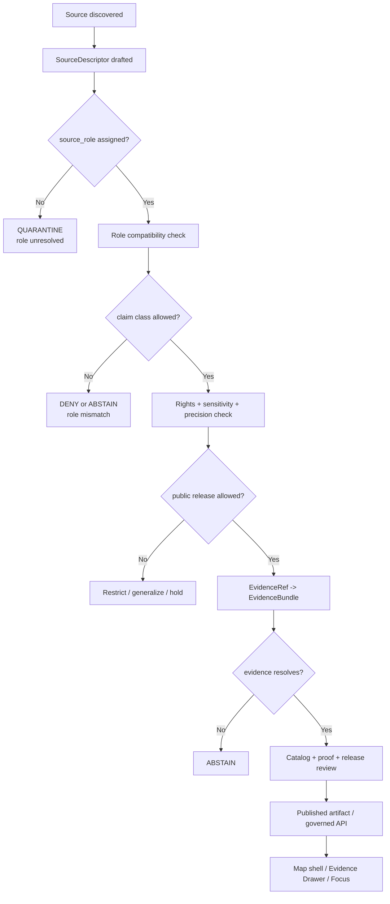

<!-- [KFM_META_BLOCK_V2]
doc_id: kfm://doc/NEEDS-VERIFICATION-ADR-GEOLOGY-SOURCE-ROLE-MODEL
title: ADR: Geology Source Role Model
type: standard
version: v1
status: draft
owners: @bartytime4life
created: 2026-05-08
updated: 2026-05-08
policy_label: NEEDS_VERIFICATION
related: [./README.md, ./ADR-0001-schema-home.md, ../domains/geology/README.md, ../domains/geology/registers/SOURCE_INDEX.md, ../domains/geology/registers/SCHEMA_INDEX.md, ../domains/geology/architecture/CROSS_LANE_RELATIONS.md, ../domains/geology/tracking/OPEN_QUESTIONS.md, ../domains/geology/tracking/VERIFICATION_BACKLOG.md, ../../policy/crosswalk/domain-lane-policy-map.md]
tags: [kfm, adr, geology, natural-resources, source-role, evidence, governance, policy, publication]
notes: [Replaces the placeholder ADR body with a source-role decision draft. Owner is grounded in current CODEOWNERS coverage for docs and docs/adr; doc_id, policy_label, created-date provenance, acceptance state, workflow enforcement, source descriptor implementation, policy tests, and validator coverage remain NEEDS VERIFICATION. This ADR records a proposed decision and must not be treated as proof that source descriptors, schemas, policy rules, validators, tests, release gates, or public layers are enforced.]
[/KFM_META_BLOCK_V2] -->

<a id="top"></a>

# ADR: Geology Source Role Model

Proposed decision for how KFM geology and non-biological natural-resource sources may support claims, layers, Evidence Drawer payloads, Focus answers, and release decisions.

<p align="center">
  
  
  
  
  
</p>

<p align="center">
  <a href="#decision-summary">Decision</a> ·
  <a href="#evidence-boundary">Evidence</a> ·
  <a href="#problem">Problem</a> ·
  <a href="#source-role-model">Source roles</a> ·
  <a href="#claim-support-rules">Claim support</a> ·
  <a href="#validation-plan">Validation</a> ·
  <a href="#rollback-and-supersession">Rollback</a> ·
  <a href="#review-checklist">Checklist</a>
</p>

> [!IMPORTANT]
> **Status:** `proposed`.
>
> This ADR can guide review, fixtures, source descriptors, and policy drafting. It does **not** activate live geology sources, publish public layers, prove runtime enforcement, or make source-role policy accepted until implementation evidence is attached.

---

## ADR header

| Field | Value |
|---|---|
| ADR ID | `ADR-geology-source-role-model` |
| Target path | `docs/adr/ADR-geology-source-role-model.md` |
| Status | `proposed` |
| Decision date | `2026-05-08` |
| Owners | `@bartytime4life` |
| Scope | Domain architecture / source authority / publication governance |
| Decision confidence | `PROPOSED` |
| Supersedes | Placeholder body at this path |
| Superseded by | None |
| Related ADRs | [`ADR-0001-schema-home.md`](./ADR-0001-schema-home.md) |
| Related domain docs | [`../domains/geology/README.md`](../domains/geology/README.md), [`../domains/geology/registers/SOURCE_INDEX.md`](../domains/geology/registers/SOURCE_INDEX.md) |
| Rollback target | Prior placeholder body plus successor ADR if this model is replaced |

---

## Decision summary

KFM should require an explicit `source_role` for every geology and non-biological natural-resource source before that source can support a claim, public layer, Evidence Drawer payload, Focus answer, catalog record, graph relation, or release decision.

A source role states three things:

1. **What the source can support.**
2. **What the source cannot support by itself.**
3. **What policy default applies before publication.**

The decision is intentionally fail-closed. If a claim asks a source to support something outside its role, KFM must return one of the bounded negative states: `ABSTAIN`, `DENY`, `ERROR`, or `QUARANTINE`, depending on whether the problem is missing evidence, blocked policy, malformed input, or unresolved source admission.

### One-line rule

> A geology source may support only the claim classes allowed by its declared `source_role`; role mismatch blocks promotion or outward assertion until reviewed evidence upgrades the support.

### One-line boundary

> Public-safe layers, modeled surfaces, regulatory records, production records, and AI summaries must never become physical geology truth by presentation alone.

[Back to top](#top)

---

## Evidence boundary

| Evidence item | What it supports | Truth label |
|---|---|---:|
| Current `docs/adr/ADR-geology-source-role-model.md` | The file exists as a placeholder ADR and needs substantive decision language. | `CONFIRMED` |
| [`docs/adr/README.md`](./README.md) | ADRs are the decision ledger; enforcement still requires validators, fixtures, workflows, receipts, proofs, release artifacts, or implementation evidence. | `CONFIRMED` |
| ADR template | ADRs must separate decision state from implementation proof and include evidence, impact, validation, rollback, and supersession. | `CONFIRMED` |
| [`ADR-0001-schema-home.md`](./ADR-0001-schema-home.md) | Machine schemas are proposed under `schemas/contracts/v1/`; `contracts/` remains semantic and `policy/` remains admissibility logic. | `CONFIRMED draft / PROPOSED decision` |
| [`../domains/geology/README.md`](../domains/geology/README.md) | Geology documentation already separates source roles, semantic boundaries, public-safe geometry, Evidence Drawer, and Focus behavior. | `CONFIRMED` |
| [`../domains/geology/registers/SOURCE_INDEX.md`](../domains/geology/registers/SOURCE_INDEX.md) | The domain source index already maps source families to typical roles and unsupported claim classes. | `CONFIRMED` |
| Local mounted-repo probe during drafting | No mounted local KFM checkout was available; GitHub connector evidence was used for current repo files. | `CONFIRMED local limit` |
| Geology architecture corpus | Prior geology planning defines source-role separation, anti-collapse rules, public-safe geometry, release/proof separation, and fixture-first implementation. | `LINEAGE / PROPOSED` |

> [!CAUTION]
> Repetition in prior PDFs is not implementation proof. This ADR becomes enforceable only when repo-native source descriptors, schemas, policy rules, validators, fixtures, and workflow or command evidence are attached.

[Back to top](#top)

---

## Problem

Geology and natural-resource evidence crosses several kinds of source authority:

- geologic maps and publications;
- borehole, well, log, core, and measured-section records;
- geophysical and geochemical observations;
- derived interpretations and modeled potential surfaces;
- regulatory, lease, permit, operator, and production records;
- legacy mineral occurrence records;
- public-safe generalized display layers.

These sources are useful, but they are not interchangeable.

Without a source-role model, KFM risks turning presentation into authority:

| Drift risk | Failure mode |
|---|---|
| Modeled potential becomes “known deposit” | A suitability or potential surface is read as occurrence, reserve, or extraction truth. |
| Permit or lease becomes physical geology | Administrative records are misused as evidence of a deposit or geologic unit. |
| Production record becomes reserve estimate | Reported production context is treated as economic reserve truth. |
| Public-safe geometry becomes canonical geometry | Generalized or redacted display output overwrites source evidence. |
| Borehole or sample location leaks exact geometry | Public users receive coordinates that should be restricted or generalized. |
| Legacy occurrence record becomes current authority | Historical or legacy records are used without caveat, review, or source update. |
| AI summary outruns evidence | Focus Mode answers from fluent synthesis instead of resolved EvidenceBundle support. |

This ADR prevents those collapses by making source-role compatibility a required gate before promotion and outward claims.

[Back to top](#top)

---

## Source-role model

### Required role vocabulary

The following vocabulary is the proposed minimum for geology and non-biological natural-resource sources.

| Source role | Can support | Cannot support by itself | Default policy posture |
|---|---|---|---|
| `authoritative_interpreted` | Source-scale geologic map units, interpreted boundaries, lithologic context, publication-backed state/county geology. | Exact field measurement truth for every feature; current extraction status; reserve claims. | Public after scale/date/caveat/release review. |
| `observed_measurement` | Field, lab, geophysical, geochemical, or sample observations with method, units, detection limit, uncertainty, and source time. | Region-wide interpretation without additional interpreted support. | Review required; exact locations may be restricted. |
| `borehole_reference` | Borehole, well, core, log, interval, measured-section, or subsurface reference linkage. | Public exact coordinates unless policy explicitly allows; regional unit truth without interpretation. | Restricted or generalized by default. |
| `subsurface_reference` | Wireline logs, well tops, stratigraphic picks, cores, sections, and subsurface support objects. | Confirmed surface geology or public exact subsurface geometry without review. | Restricted / review-before-public by default. |
| `derived_interpreted` | Correlations, interpreted tops, normalized source extracts, cross-sections, or reviewed derived features. | Original observation truth unless linked back to supporting evidence. | Public only with lineage and review state. |
| `derived_modeled` | Resource potential, susceptibility, interpolation, prediction, generalized public surfaces, or model outputs. | Known occurrence, deposit, reserve, extraction, or field observation truth. | Public only as modeled/derived context; role label visible. |
| `official_regulatory_administrative` | Permit, lease, operator, compliance, program, administrative status, or reporting context. | Physical geologic occurrence, deposit, reserve, unit, or mineral-resource truth. | Relation edge only unless geology evidence also supports claim. |
| `production_reference` | Production-by-lease, field, county, operator, or reporting-summary context with caveats. | Resource reserve, deposit existence, or geologic unit truth. | Public summaries after caveat and source review. |
| `legacy_corroborative_external` | Historical context, corroboration, comparison, and record-discovery clues. | Current authoritative state without steward/source review. | Contextual only until upgraded by review. |
| `public_safe_derived` | Published generalized/redacted display features, tiles, layer summaries, and drawer-ready public artifacts. | Canonical source evidence, exact internal geometry, or proof of the original claim by itself. | Must carry transform receipt, release id, and evidence lookup. |

### Role status

Each source role assignment must carry a role status:

| Role status | Meaning |
|---|---|
| `draft` | Captured but not ready for source activation. |
| `reviewed` | Steward or maintainer review completed for the source descriptor. |
| `active` | Eligible for controlled use under policy and validation gates. |
| `restricted` | Usable only in restricted/steward contexts. |
| `deprecated` | Historical role assignment retained but no longer preferred. |
| `blocked` | Must not support claims or releases until corrected. |
| `superseded` | Replaced by a newer role assignment with lineage preserved. |

[Back to top](#top)

---

## Claim-support rules

### Claim classes

KFM geology claims should be classified before validation.

| Claim class | Examples |
|---|---|
| `geologic_unit_boundary` | Bedrock or surficial unit boundary, contact, map unit polygon. |
| `lithology_age_correlation` | Unit description, lithologic membership, geologic age, correlation. |
| `structure_feature` | Fault, fold, fracture, lineament, structural trace. |
| `observed_measurement_claim` | Sample chemistry, geophysical reading, measured section, field observation. |
| `subsurface_reference_claim` | Borehole, well log, core, well top, section interval. |
| `mineral_occurrence_claim` | Recorded mineral occurrence or deposit-related observation. |
| `resource_estimate_or_reserve_claim` | Resource/reserve estimate, quantity, grade, economic classification. |
| `extraction_or_production_context` | Lease/field production, operator, extraction site, production record. |
| `administrative_status_claim` | Permit, lease, compliance, regulation, program status. |
| `modeled_potential_claim` | Potential, susceptibility, predicted occurrence, interpolation, suitability. |
| `public_display_claim` | Public-safe layer feature, generalized tile, map popup, story node, export feature. |

### Compatibility matrix

| Source role | Allowed primary claim classes | Must fail closed on |
|---|---|---|
| `authoritative_interpreted` | `geologic_unit_boundary`, `lithology_age_correlation`, selected `structure_feature` | `observed_measurement_claim`, `resource_estimate_or_reserve_claim`, `extraction_or_production_context` |
| `observed_measurement` | `observed_measurement_claim`, evidence support for selected interpretations | Region-wide interpretation without additional source support |
| `borehole_reference` | `subsurface_reference_claim`, linked support for stratigraphy or lithology | Public exact geometry without policy allow; reserve/resource claims |
| `subsurface_reference` | `subsurface_reference_claim`, derived stratigraphic support | Surface geology truth without interpretation; public exact geometry without review |
| `derived_interpreted` | `lithology_age_correlation`, reviewed cross-section/correlation claims | Original observation truth without source linkage |
| `derived_modeled` | `modeled_potential_claim`, contextual risk/susceptibility/potential surfaces | `mineral_occurrence_claim`, `resource_estimate_or_reserve_claim`, extraction truth |
| `official_regulatory_administrative` | `administrative_status_claim`, relation edges to extraction or source records | Physical geology, deposit, reserve, or occurrence truth |
| `production_reference` | `extraction_or_production_context` | Reserve/resource truth, geologic unit truth, occurrence discovery proof |
| `legacy_corroborative_external` | Corroboration and historical context | Current authoritative state, current reserve/resource truth |
| `public_safe_derived` | `public_display_claim` backed by release and evidence lookup | Canonical evidence, exact internal geometry, source-of-record claims |

### Negative outcomes

| Condition | Required KFM outcome |
|---|---|
| Claim support is missing or unresolved | `ABSTAIN` |
| Source role is forbidden for the requested claim class | `DENY` or blocked promotion |
| Source descriptor is malformed | `ERROR` |
| Rights, sensitivity, or public geometry state is unknown | `QUARANTINE` before processing; `DENY` before publication |
| Public layer lacks `EvidenceRef` or transform receipt | `DENY` |
| Focus answer cannot resolve EvidenceBundle support | `ABSTAIN` |
| Role assignment conflicts with successor source review | `DENY` until corrected or superseded |

[Back to top](#top)

---

## Required SourceDescriptor fields

This ADR expects each geology source descriptor to include at least these fields. The final schema home remains governed by the schema-home ADR and repo-native schema convention.

| Field | Purpose |
|---|---|
| `source_id` | Stable identifier for the source family or source instance. |
| `publisher` | Organization responsible for the source. |
| `source_family` | Source family such as geologic map, borehole record, regulatory record, model surface, production record. |
| `source_role` | One of the source roles defined in this ADR or a reviewed successor. |
| `source_role_status` | Draft/reviewed/active/restricted/deprecated/blocked/superseded. |
| `claim_support_classes` | Claim classes the role can support. |
| `forbidden_claim_classes` | Claim classes the role must not support by itself. |
| `geographic_scope` | Spatial scope of the source. |
| `temporal_scope` | Source time, observed time, publication time, or valid interval as applicable. |
| `source_scale_or_resolution` | Map scale, pixel resolution, sampling precision, or record precision. |
| `spatial_precision_class` | Exact, approximate, interpreted, generalized, redacted, or display-only. |
| `geometry_role` | Source geometry, interpreted geometry, exact internal geometry, generalized public geometry, or display geometry. |
| `rights_license_use_constraints` | Rights, license, source terms, redistribution, attribution, or `NEEDS_VERIFICATION`. |
| `sensitivity_defaults` | Default public/restricted posture and reason. |
| `review_state` | Draft, reviewed, release-approved, on-hold, denied, correction-requested, etc. |
| `verification_status` | Unverified, verified, stale, conflicted, superseded. |
| `evidence_requirements` | What support is required before claim or release. |
| `public_release_default` | Allowed, restricted, generalized-only, denied, or on-hold. |
| `caveats` | Required source caveats, limits, disclaimers, and scale constraints. |

### Illustrative descriptor fragment

This is an illustrative example only. It does not activate a source.

```yaml
# ILLUSTRATIVE — final home and schema remain NEEDS VERIFICATION.
source_id: kgs_surficial_geology_ks
publisher: Kansas Geological Survey
source_family: state_geologic_map
source_role: authoritative_interpreted
source_role_status: draft
claim_support_classes:
  - geologic_unit_boundary
  - lithology_age_correlation
forbidden_claim_classes:
  - observed_measurement_claim
  - resource_estimate_or_reserve_claim
  - extraction_or_production_context
geographic_scope: Kansas
temporal_scope: NEEDS_VERIFICATION
source_scale_or_resolution: NEEDS_VERIFICATION
spatial_precision_class: interpreted
geometry_role: canonical_interpreted_boundary
rights_license_use_constraints: NEEDS_VERIFICATION
sensitivity_defaults:
  public_release_default: generalized_or_source_scale
  exact_internal_allowed: true
review_state: draft
verification_status: unverified
evidence_requirements:
  - source_descriptor_review
  - rights_review
  - source_scale_caveat
  - EvidenceBundle_resolution_before_public_claim
caveats:
  - "Do not use map-scale interpreted boundaries as exact field-observation truth."
```

[Back to top](#top)

---

## Operating flow



[Back to top](#top)

---

## Options considered

| Option | Outcome | Reason |
|---|---|---|
| Keep the placeholder ADR and defer role modeling. | Rejected | The geology lane already has enough source-role pressure that placeholder-only coverage invites drift. |
| Treat all official sources as equally authoritative. | Rejected | Regulatory, production, interpreted, measured, modeled, and legacy sources support different claims. |
| Let each source descriptor define custom roles freely. | Rejected | Local vocabulary drift would weaken validators, policy tests, and Evidence Drawer explanations. |
| Adopt the proposed minimum role vocabulary and allow reviewed extensions. | Selected | Gives KFM a small governed model while preserving room for source-specific precision. |
| Make public layers the claim-support source. | Rejected | Public layers are downstream derivatives and must point back to release and evidence. |
| Let Focus infer role meaning from text. | Rejected | AI is interpretive; source-role compatibility must be checked before generated language. |

[Back to top](#top)

---

## Impact map

| Area | Required update after acceptance | Status |
|---|---|---:|
| `docs/adr/README.md` | Add or update this ADR’s inventory entry and status. | `NEEDS VERIFICATION` |
| [`../domains/geology/registers/SOURCE_INDEX.md`](../domains/geology/registers/SOURCE_INDEX.md) | Align source family map with the accepted role vocabulary. | `CONFIRMED path / update proposed` |
| [`../domains/geology/registers/SCHEMA_INDEX.md`](../domains/geology/registers/SCHEMA_INDEX.md) | Map source-role fields to the accepted machine schema home. | `NEEDS VERIFICATION` |
| `data/registry/geology/sources.yaml` | Store source descriptors and role assignments. | `PROPOSED / path not confirmed here` |
| `schemas/contracts/v1/domains/geology/` or repo-verified equivalent | Add source descriptor or geology source-role schema fields. | `PROPOSED / schema-home governed by ADR-0001` |
| `policy/domains/geology/` or repo-verified equivalent | Add deny rules for role/claim mismatches. | `PROPOSED` |
| `tests/domains/geology/` or repo-verified equivalent | Add valid/invalid role compatibility fixtures. | `PROPOSED` |
| `tools/validators/geology/` or repo-verified equivalent | Add source-role compatibility validator. | `PROPOSED` |
| `release/` / `data/proofs/` / `data/receipts/` | Record role checks in receipts/proofs when release-significant. | `PROPOSED / NEEDS VERIFICATION` |
| Map shell / Evidence Drawer / Focus surfaces | Display role, caveat, review, release, and negative-state information. | `PROPOSED` |

[Back to top](#top)

---

## Validation plan

This ADR is ready for acceptance only when the following checks are implemented or explicitly waived by a successor ADR.

| Check | Minimum proof | Expected result |
|---|---|---|
| Role enum validation | Valid/invalid source descriptor fixtures. | Unknown role fails. |
| Claim compatibility validation | Fixtures for each source role and forbidden claim class. | Forbidden claim support fails closed. |
| Regulatory mismatch test | `official_regulatory_administrative` used for physical geology claim. | `DENY` or blocked promotion. |
| Modeled-potential mismatch test | `derived_modeled` used for known deposit or reserve claim. | `DENY` or `ABSTAIN`. |
| Production/reserve mismatch test | `production_reference` used as reserve proof. | `DENY`. |
| Public geometry test | `borehole_reference` or `subsurface_reference` with public exact geometry and no policy allow. | `DENY`. |
| Public-safe derivative test | `public_safe_derived` with missing transform receipt or release id. | `DENY`. |
| Evidence closure test | Claim has role support but no resolvable EvidenceBundle. | `ABSTAIN`. |
| Focus Mode test | Focus answer asks for unsupported claim. | Bounded `ABSTAIN` or `DENY`, not fluent invention. |
| ADR/doc sync test | ADR index, source index, schema index, and verification backlog agree. | No stale placeholder remains. |

### Suggested negative fixtures

| Fixture | Purpose |
|---|---|
| `invalid_regulatory_record_as_deposit_truth` | Prevent permit/lease/operator records from proving deposits. |
| `invalid_model_surface_as_known_occurrence` | Prevent modeled potential from becoming occurrence truth. |
| `invalid_public_exact_borehole_geometry` | Prevent exact public release without policy allow. |
| `invalid_production_as_reserve_estimate` | Prevent production records from proving reserves/resources. |
| `invalid_legacy_source_as_current_authority` | Prevent legacy records from becoming current authority without review. |
| `invalid_public_layer_without_evidence_lookup` | Prevent display artifacts from standing alone as evidence. |

[Back to top](#top)

---

## Rollback and supersession

### Rollback plan

If this source-role model proves wrong or incomplete:

1. Keep this ADR as lineage.
2. Create a successor ADR with the revised role vocabulary.
3. Mark the old roles as `deprecated`, `blocked`, or `superseded` in source descriptors.
4. Preserve alias records from old roles to successor roles where safe.
5. Re-run source-role compatibility fixtures and policy tests.
6. Block promotion of releases that depend on superseded roles until migration review completes.
7. Issue correction notices for any public claims affected by invalid role support.
8. Keep receipts, proofs, release manifests, correction notices, and rollback references queryable.

### Supersession trigger examples

| Trigger | Required action |
|---|---|
| A source family needs a new role not covered here. | Add reviewed role extension or successor ADR. |
| A source role supports a claim class too broadly. | Narrow role and re-run negative fixtures. |
| A public artifact used a role incorrectly. | Withdraw or correct release; preserve audit trail. |
| Schema home changes. | Update schema references under the successor schema-home ADR. |
| Policy engine path changes. | Update impact map and policy fixture links. |

> [!WARNING]
> Do not “fix” the model by silently rewriting old role records. Source-role history is part of provenance.

[Back to top](#top)

---

## Consequences

### Positive consequences

- Geology source authority becomes inspectable before publication.
- Evidence Drawer and Focus Mode can explain why a source supports or does not support a claim.
- Public-safe layers remain downstream of released evidence.
- Regulatory, production, modeled, interpreted, observed, and legacy sources stay semantically distinct.
- Negative outcomes become testable instead of buried in prose.
- Future geology source onboarding gains a reusable decision standard.

### Costs and tradeoffs

| Cost | Mitigation |
|---|---|
| Source descriptors become heavier. | Keep required fields explicit and validate them with fixtures. |
| Some claims will initially abstain or deny. | This is preferred to false precision or unsupported authority. |
| Existing source index wording may need revision. | Update source index and tracking docs in the same PR. |
| Machine schema and policy paths remain unresolved until verified. | Keep implementation paths `PROPOSED` and tie acceptance to ADR-0001 and repo inspection. |
| Role vocabulary may need extensions. | Allow reviewed extensions through source index updates or successor ADR. |

[Back to top](#top)

---

## Open verification backlog

| Question | Why it matters | Closure artifact |
|---|---|---|
| Which geology source descriptor schema currently exists, if any? | Determines where `source_role` fields are enforced. | Schema inventory and schema index update. |
| Is `schemas/contracts/v1/domains/geology/` or another path the accepted geology schema home? | Prevents duplicate schema authority. | Accepted schema-home ADR or domain schema-home note. |
| Does `data/registry/geology/sources.yaml` exist in the active branch? | Determines whether this ADR can update a live source registry. | Repository inventory and registry update. |
| Which KGS/KDHE/KCC/USGS source families are active or proposed? | Determines exact role assignments and rights review. | Verified source descriptors and source index entries. |
| Which public-safe geometry policy applies to boreholes, logs, samples, and resource locations? | Prevents exact-location leakage. | Public-safe geometry ADR, fixtures, and policy tests. |
| Which validators or workflows enforce source-role compatibility? | Required before acceptance/enforcement claims. | Validator output, workflow run, or manual validation report. |
| Should `production_reference` and `public_safe_derived` be first-class roles or role modifiers? | Affects schema and policy design. | Source-role schema review. |
| How should role changes propagate to existing releases? | Protects correction and rollback lineage. | Migration and rollback plan. |

[Back to top](#top)

---

## Review checklist

<details>
<summary>Pre-merge checklist</summary>

- [ ] ADR status remains `proposed` unless acceptance evidence is attached.
- [ ] ADR index is updated.
- [ ] Geology source index is updated or explicitly left unchanged with rationale.
- [ ] Machine schema impact is mapped to the accepted schema home.
- [ ] SourceDescriptor fields include `source_role`, `claim_support_classes`, and `forbidden_claim_classes`.
- [ ] Valid and invalid fixtures cover role/claim compatibility.
- [ ] Policy tests cover deny/abstain/error behavior.
- [ ] Public-safe geometry handling is tested or blocked.
- [ ] Evidence Drawer payloads can display source role, caveats, review state, and release support.
- [ ] Focus Mode cannot answer unsupported geology/resource claims.
- [ ] Release path preserves receipts, proofs, source-role validation, correction, and rollback references.
- [ ] Open verification items are tracked in geology verification backlog.
- [ ] No live connector or public layer is activated by this ADR alone.
- [ ] No claim is made that CI, branch protection, runtime enforcement, or promotion gates are active unless direct evidence is attached.

</details>

[Back to top](#top)

---

## Appendix A — Role quick reference

| Role | Short meaning |
|---|---|
| `authoritative_interpreted` | Reviewed map/publication interpretation at stated scale/date. |
| `observed_measurement` | Method-bounded observation or measurement. |
| `borehole_reference` | Borehole/well/core/section reference object. |
| `subsurface_reference` | Logs, tops, sections, picks, and subsurface interpretation support. |
| `derived_interpreted` | Reviewed derived interpretation. |
| `derived_modeled` | Model, interpolation, potential, suitability, susceptibility. |
| `official_regulatory_administrative` | Permit, lease, compliance, program, operator, administrative context. |
| `production_reference` | Production record or production summary context. |
| `legacy_corroborative_external` | Historical or legacy corroboration. |
| `public_safe_derived` | Released generalized/redacted display derivative. |

## Appendix B — Acceptance state

This ADR is not accepted until the evidence below exists:

- active branch inventory;
- owner/reviewer confirmation;
- source descriptor schema or documented schema home;
- source-role fixtures;
- source-role validator or policy gate;
- negative-path tests;
- public-safe geometry test where relevant;
- EvidenceBundle closure test;
- release/promotion dry-run or documented manual review;
- rollback/supersession plan linked from the ADR index.

Until then, this ADR is a proposed decision draft, not an enforcement claim.
