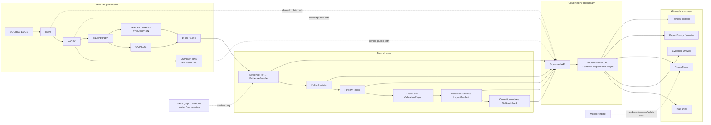

<!-- [KFM_META_BLOCK_V2]
doc_id: kfm://doc/NEEDS-VERIFICATION-adr-governed-api-boundary
title: ADR: Governed API Boundary
type: standard
version: v1
status: draft
owners: OWNER_TBD_NEEDS_VERIFICATION
created: 2026-05-08
updated: 2026-05-08
policy_label: NEEDS_VERIFICATION
related: [./README.md, ./ADR-TEMPLATE.md, ./ADR-0202-governed-api-path-canonicalization.md, ./ADR-0207-governed-ai-runtime-envelope.md, ./ADR-ai-provider-adapter.md, ../architecture/governed-api.md, ../doctrine/trust-membrane.md, ../doctrine/lifecycle-law.md, ../../contracts/api/README.md, ../../apps/governed_api/README.md, ../../apps/api/server.py, ../../apps/web/src/api/governedClient.js, ../../tools/ci/check_governed_api_path_policy.py, ../../tests/ci/test_check_governed_api_path_policy.py]
tags: [kfm, adr, governed-api, trust-membrane, evidencebundle, runtime-envelope, api-boundary, public-client-boundary, policy, rollback]
notes: [Revises the existing placeholder ADR at docs/adr/ADR-governed-api-boundary.md. Created date follows the existing ADR decision date and still needs Git/document-registry verification. Owners, stable doc_id, policy label, CODEOWNERS routing, active runtime home, route alignment, mapped canonical governed_api files, CI run state, schema enforcement, deployment posture, and production maturity remain NEEDS VERIFICATION.]
[/KFM_META_BLOCK_V2] -->

<a id="top"></a>

# ADR: Governed API Boundary

Decision record for the KFM trust membrane separating public and steward-facing clients from internal lifecycle stores, direct model runtimes, and unpublished state.

<p align="center">
  
  
  
  
  
  
</p>

> [!IMPORTANT]
> **ADR status:** `proposed`  
> **Document status:** `draft`  
> **Target path:** `docs/adr/ADR-governed-api-boundary.md`  
> **Owning root:** `docs/` — human-facing architecture and governance control plane.  
> **Decision confidence:** `CONFIRMED` doctrine and selected repo file evidence; `PROPOSED` boundary decision; `NEEDS VERIFICATION` for enforcement, route alignment, schema coverage, CI, deployment, and runtime maturity.  
> **Core rule:** public, map, Evidence Drawer, Focus Mode, review, export, story, and diagnostic clients cross KFM through governed interfaces and finite response envelopes only.

## Quick navigation

| Decision | Boundary details | Review |
|---|---|---|
| [Decision summary](#decision-summary) | [Allowed crossings](#allowed-crossings) | [Validation plan](#validation-plan) |
| [ADR record](#adr-record) | [Denied crossings](#denied-crossings) | [Definition of done](#definition-of-done) |
| [Context](#context) | [Contract and route surface](#contract-and-route-surface) | [Rollback and supersession](#rollback-and-supersession) |
| [Problem](#problem) | [Path reconciliation](#path-reconciliation) | [Open verification](#open-verification) |
| [Decision](#decision) | [Runtime outcomes](#runtime-outcomes) | [Review checklist](#review-checklist) |
| [Options considered](#options-considered) | [Focus Mode and AI boundary](#focus-mode-and-ai-boundary) | [Appendix](#appendix) |

---

## Decision summary

**PROPOSED:** KFM will treat the governed API boundary as the only normal crossing from public or semi-public clients into outward-facing KFM truth surfaces.

The governed API boundary must resolve or deny access based on lifecycle state, evidence support, source role, rights, sensitivity, policy, review, release, freshness, correction, and rollback context before emitting a public or steward-facing response.

The boundary emits finite governed outcomes:

```text
ANSWER | ABSTAIN | DENY | ERROR
```

It must never allow public or ordinary UI clients to bypass the trust membrane by directly reading `RAW`, `WORK`, `QUARANTINE`, unpublished candidate material, canonical/internal stores, source-system side effects, graph/vector/search projections as truth, local filesystem paths, secrets, or model/provider runtimes.

### One-line operating rule

> If the governed API cannot support a safe crossing, KFM returns `ABSTAIN`, `DENY`, `ERROR`, hold, quarantine, restriction, generalization, withdrawal, or review-needed state instead of publishing plausible output.

### One-line boundary rule

> A response may carry a consequential public or semi-public claim only when it is downstream of `EvidenceRef -> EvidenceBundle`, policy, review, release, correction, and rollback state appropriate to the claim.

[Back to top](#top)

---

## ADR record

| Field | Value |
|---|---|
| ADR ID | `ADR-governed-api-boundary` |
| Title | `ADR: Governed API Boundary` |
| Status | `proposed` |
| Document status | `draft` |
| Decision date | `2026-05-08` |
| Owners | `OWNER_TBD_NEEDS_VERIFICATION` |
| Policy label | `NEEDS_VERIFICATION` |
| Scope | architecture / governance / runtime boundary / public-client trust membrane |
| Target path | `docs/adr/ADR-governed-api-boundary.md` |
| Supersedes | none; replaces placeholder body in the same target file |
| Superseded by | none |
| Related path ADR | [`ADR-0202-governed-api-path-canonicalization.md`](./ADR-0202-governed-api-path-canonicalization.md) |
| Related runtime ADR | [`ADR-0207-governed-ai-runtime-envelope.md`](./ADR-0207-governed-ai-runtime-envelope.md) |
| Related AI adapter ADR | [`ADR-ai-provider-adapter.md`](./ADR-ai-provider-adapter.md) |
| Primary architecture doc | [`../architecture/governed-api.md`](../architecture/governed-api.md) |
| Related doctrine | [`../doctrine/trust-membrane.md`](../doctrine/trust-membrane.md), [`../doctrine/lifecycle-law.md`](../doctrine/lifecycle-law.md) |
| Contract lane | [`../../contracts/api/README.md`](../../contracts/api/README.md) |
| Runtime evidence snapshot | [`../../apps/api/server.py`](../../apps/api/server.py), [`../../apps/governed_api/README.md`](../../apps/governed_api/README.md), [`../../apps/web/src/api/governedClient.js`](../../apps/web/src/api/governedClient.js) |
| Validation evidence snapshot | [`../../tools/ci/check_governed_api_path_policy.py`](../../tools/ci/check_governed_api_path_policy.py), [`../../tests/ci/test_check_governed_api_path_policy.py`](../../tests/ci/test_check_governed_api_path_policy.py) |
| Decision confidence | `CONFIRMED doctrine / PROPOSED decision / NEEDS VERIFICATION enforcement` |
| Rollback target | prior placeholder ADR body plus this ADR’s supersession path; runtime rollback target remains `ROLLBACK_TARGET_TBD` |

> [!NOTE]
> An ADR can be proposed or accepted while enforcement remains unproven. Keep **decision state**, **implementation state**, **validation state**, **CI state**, **runtime state**, and **release state** separate.

[Back to top](#top)

---

## Context

KFM is a governed, evidence-first, map-first, time-aware spatial knowledge and publication system. Its public unit of value is the inspectable claim, not the tile, graph edge, AI answer, map popup, exported report, or dashboard value.

KFM’s lifecycle law is:

```text
SOURCE EDGE -> RAW -> WORK / QUARANTINE -> PROCESSED -> CATALOG / TRIPLET -> PUBLISHED
```

Public and ordinary UI surfaces sit outside the internal lifecycle. They consume governed outputs only.

The governed API is the runtime-facing trust membrane for:

- public and steward API calls;
- MapLibre map shell interactions;
- Evidence Drawer payloads;
- Focus Mode and governed AI responses;
- review-console actions;
- exports, stories, reports, dossiers, and dashboards;
- released layer manifests, catalog records, and publication artifacts;
- safe diagnostics and health checks.

### Current evidence snapshot

| Evidence | Status | What it supports | What it does not prove |
|---|---:|---|---|
| Existing `docs/adr/ADR-governed-api-boundary.md` | `CONFIRMED` | Target ADR exists but is a thin placeholder. | Full decision quality, enforcement, route inventory, or validation coverage. |
| `docs/adr/README.md` and `ADR-TEMPLATE.md` | `CONFIRMED` | ADRs are decision records with evidence, review, validation, rollback, and supersession obligations. | This ADR’s acceptance or implementation. |
| `docs/architecture/governed-api.md` | `CONFIRMED` | Governed API architecture already frames the API as a trust membrane with finite outcomes and evidence/policy/release obligations. | Production runtime maturity or full route alignment. |
| `ADR-0202-governed-api-path-canonicalization.md` | `CONFIRMED decision / NEEDS VERIFICATION enforcement` | `apps/governed_api/...` is the accepted canonical implementation home; `apps/governed-api/...` is legacy shim-only. | Relationship between `apps/api/...` and the canonical home. |
| `contracts/api/README.md` | `CONFIRMED` | API contracts document meaning, finite outcomes, Focus Mode, Evidence Drawer, and contract/schema/policy separation. | That every described contract has executable schema and tests. |
| `apps/api/server.py` | `CONFIRMED file evidence` | Visible FastAPI-style ecology public-safe dry-run API file with evidence, promotion, rights, sensitivity, policy, redaction, and safe error handling. | Deployment, active runtime registration, all-domain coverage, and production maturity. |
| `apps/web/src/api/governedClient.js` | `CONFIRMED file evidence` | Web client calls layer manifest, Evidence Drawer, and Focus-shaped API methods. | Alignment with server routes and runtime availability. |
| `apps/governed_api/README.md` | `CONFIRMED` | Underscore package currently functions as a compatibility/canonicalization boundary and identifies unresolved `apps/api` relationship. | Completed canonical migration. |
| Path-policy checker and tests | `CONFIRMED files / NEEDS VERIFICATION run state` | Checker and synthetic tests exist for canonical/legacy governed API path policy. | That checks pass on the active branch or are merge-blocking in CI. |

[Back to top](#top)

---

## Problem

KFM needs one clear governed API boundary decision because current evidence shows both doctrinal clarity and implementation/path drift.

The risk is not cosmetic. If public clients, map surfaces, Focus Mode, Evidence Drawer, review tools, exports, or diagnostics can reach multiple differently governed runtime paths, KFM can accidentally create:

- duplicate or divergent API implementations;
- route contracts that do not match client calls;
- public responses without evidence closure;
- uncited generated answers;
- policy or sensitivity bypasses;
- legacy compatibility files that become implementation-bearing;
- graph/vector/tile/search projections treated as proof;
- direct public model-runtime access;
- public leakage of internal lifecycle stores;
- release outputs without correction or rollback lineage.

This ADR records the boundary rule so later route, DTO, schema, policy, fixture, validator, UI, and AI changes have a single trust standard to preserve.

[Back to top](#top)

---

## Decision

### Chosen boundary

KFM will treat the governed API as a **trust boundary**, not as a generic backend.

All normal public and semi-public clients must cross the boundary through governed response contracts that make evidence, policy, release, review, correction, and rollback state visible or safely unavailable.

### Required boundary responsibilities

The governed API boundary must:

1. accept bounded request context;
2. resolve scope before answering;
3. enforce lifecycle-state rules;
4. resolve `EvidenceRef -> EvidenceBundle` before consequential `ANSWER` responses;
5. check source role, rights, sensitivity, access role, freshness, and release state;
6. enforce policy prechecks before retrieval or model mediation where relevant;
7. enforce policy postchecks before outward response;
8. return finite outcomes: `ANSWER`, `ABSTAIN`, `DENY`, `ERROR`;
9. avoid leaking internal paths, secrets, raw source payloads, exact sensitive geometry, or restricted material;
10. preserve audit-safe references to receipts, validation reports, review records, release manifests, correction notices, and rollback targets where material;
11. keep derived surfaces derived;
12. preserve route/client/schema/fixture/test alignment before stronger maturity claims are made.

### Required boundary prohibitions

The governed API boundary must not:

- expose `RAW`, `WORK`, or `QUARANTINE` payloads on normal public paths;
- expose unpublished candidate data as public truth;
- expose canonical/internal stores directly to normal public clients;
- let a browser or public client call model providers directly;
- let AI-generated language replace evidence, review, policy, or release state;
- use vector search, graph edges, map tiles, PMTiles, dashboards, summaries, or cached descriptors as sovereign truth;
- treat source-system availability as source authority or publication permission;
- silently overwrite correction history;
- publish an artifact that lacks correction and rollback support.

[Back to top](#top)

---

## Options considered

| Option | Description | Benefits | Risks | Outcome |
|---|---|---|---|---|
| A. Governed API as trust membrane | One evidence-resolving, policy-checking, release-aware API boundary for public/semi-public clients. | Preserves KFM lifecycle, cite-or-abstain posture, and inspectable claims. | Requires route, schema, fixture, policy, and CI discipline. | **Selected / PROPOSED** |
| B. Treat API as generic backend | Routes return data based on implementation convenience. | Faster early demos. | Weakens evidence, policy, release, and rollback visibility. | Rejected |
| C. Allow public UI to read released and internal artifacts directly | UI assembles trust state client-side. | Simpler for some map interactions. | Creates raw/canonical/model bypass risk and inconsistent policy enforcement. | Rejected |
| D. Let Focus Mode or AI adapter be its own public boundary | Model-mediated surface answers directly. | Fast AI product surface. | Violates AI-as-interpretive rule and citation validation. | Rejected |
| E. Immediately declare `apps/api/...` or `apps/governed_api/...` fully canonical | Pick one implementation path now. | Reduces ambiguity. | Current evidence shows unresolved relationship; premature claim would overstate repo maturity. | Deferred / NEEDS VERIFICATION |

[Back to top](#top)

---

## Boundary law

### KFM invariants checked

| Invariant | Boundary implication | Status |
|---|---|---:|
| `RAW -> WORK / QUARANTINE -> PROCESSED -> CATALOG / TRIPLET -> PUBLISHED` | API outputs must be downstream of published or explicitly review-authorized lifecycle state. | `CONFIRMED doctrine / PROPOSED enforcement` |
| Public clients use governed interfaces | API is the normal crossing for map, Focus, drawer, review, export, and diagnostic surfaces. | `CONFIRMED doctrine / PROPOSED enforcement` |
| `EvidenceRef -> EvidenceBundle` | Consequential `ANSWER` responses require resolved support. | `CONFIRMED doctrine / PROPOSED enforcement` |
| Promotion is a governed state transition | API route success, tile render, or model output cannot equal publication. | `CONFIRMED doctrine` |
| AI is interpretive | Focus and AI surfaces remain inside governed API mediation and finite envelopes. | `CONFIRMED doctrine / PROPOSED enforcement` |
| Derived products stay derived | Tiles, graphs, vector stores, search, dashboards, exports, scenes, and summaries are carriers. | `CONFIRMED doctrine` |
| Rights and sensitivity fail closed | Unknown or blocked rights/sensitivity prevent outward exposure. | `CONFIRMED doctrine / PROPOSED enforcement` |
| Receipts, proofs, releases, reviews, corrections, rollback remain separate | API may cite or reference these objects; it must not collapse them into one response field or treat receipts as proof. | `CONFIRMED doctrine / PROPOSED enforcement` |

[Back to top](#top)

---

## Allowed crossings

| Crossing | Allowed when | Expected response shape |
|---|---|---|
| Health / status | Does not leak secrets, internal paths, restricted records, model handles, or lifecycle internals. | Safe status envelope or minimal status object. |
| Layer manifest | Layer is released or explicitly public-safe and carries evidence/release/correction context. | `LayerManifest` or compatible governed payload. |
| Evidence Drawer payload | Requested claim or feature resolves to public-safe or role-authorized evidence. | Evidence support, source roles, policy, release, review, freshness, correction state. |
| Focus Mode question | Question scope is bounded, evidence is released or review-authorized, citations validate, and policy allows response. | `RuntimeResponseEnvelope`. |
| Review action | Actor is authenticated, authorized, auditable, and action has rollback/correction path. | Review decision envelope or review receipt reference. |
| Export / story / dossier | Output inherits release, evidence, policy, correction, and rollback state. | Released export manifest or governed response envelope. |
| Catalog / discovery | Metadata is public-safe and does not imply publication beyond release state. | Catalog response with source/release caveats. |
| Domain read surface | Domain payload is released or public-safe and policy-approved for requested actor/surface. | Domain response wrapped or linkable to governed evidence state. |

[Back to top](#top)

---

## Denied crossings

| Denied crossing | Required outcome |
|---|---|
| Public route reads `data/raw`, `data/work`, or `data/quarantine`. | `DENY` / block route / fail CI check. |
| Public route exposes unpublished candidate material as truth. | `DENY` or `ABSTAIN`. |
| Browser calls Ollama, OpenAI-compatible provider, model runtime, vector store, graph store, or canonical internal service directly. | `DENY` and security review. |
| Map popup treats tile properties as proof. | `ABSTAIN` until evidence resolves through governed API. |
| Focus Mode answers without citation validation. | `ABSTAIN` or `ERROR`. |
| Unknown rights or sensitivity are treated as public-safe. | `DENY`, quarantine, restrict, or review hold. |
| Source-role mismatch supports a consequential claim. | `ABSTAIN` or `DENY`. |
| Public error response exposes filesystem path, internal artifact root, secret, or restricted object ID. | `ERROR` with safe diagnostic category only. |
| Legacy hyphenated app path contains primary implementation logic. | `ERROR` / CI failure / rollback to shim-only. |
| Published artifact lacks correction or rollback target. | Block release or return `ERROR` for release readiness. |

[Back to top](#top)

---

## Contract and route surface

The governed API boundary is shared by contracts, schemas, policy, fixtures, validators, route code, UI clients, receipts, proofs, release objects, and docs.

| Surface | Boundary role | Current treatment |
|---|---|---|
| `contracts/api/` | Human-readable API semantics: finite outcomes, request/response meaning, Evidence Drawer, Focus Mode. | Confirmed companion lane; executable coverage needs verification. |
| `schemas/contracts/v1/` or accepted schema home | Machine-checkable shape for envelopes, requests, responses, evidence, policy, release, and runtime objects. | Schema-home authority remains verification-sensitive. |
| `policy/` | Rights, sensitivity, access, source-role, release, and runtime admissibility decisions. | Policy enforcement maturity needs verification. |
| `fixtures/` / `tests/fixtures/` | Valid and invalid examples for contracts, schemas, policy, and negative states. | Fixture coverage needs verification. |
| `tools/validators/` / `tools/ci/` | Executable checks for boundary, path policy, schema, evidence, citation, release, and no-bypass rules. | Some checker/test files exist; active run state needs verification. |
| `apps/api/` | Current visible API implementation evidence. | Confirmed files; authority relationship to canonical path needs reconciliation. |
| `apps/governed_api/` | ADR-0202 canonical governed API implementation home; currently visible as compatibility/import boundary. | Confirmed directory README; deeper canonical migration needs verification. |
| `apps/governed-api/` | Legacy shim-only compatibility path. | Must remain shim-only if retained. |
| `apps/web/` | Client consumer of governed API calls. | Confirmed client wrapper; route alignment needs verification. |
| `data/receipts/`, `data/proofs/`, `release/` | Process memory, proof support, release/correction/rollback context. | API may reference; must not collapse into API prose. |

[Back to top](#top)

---

## Path reconciliation

### Current path decision

ADR-0202 controls the underscore-versus-hyphen governed API question:

| Path | Decision posture |
|---|---|
| `apps/governed_api/...` | Canonical governed API implementation home under ADR-0202. |
| `apps/governed-api/...` | Legacy compatibility path only; shim-only if retained. |
| `apps/api/...` | Confirmed current visible API implementation surface; relationship to canonical governed API home remains `NEEDS VERIFICATION`. |

### Current route drift to resolve

| Finding | Status | Required resolution |
|---|---:|---|
| `apps/api/server.py` documents `GET /api/layers/manifest`. | `CONFIRMED file evidence` | Keep or adapt contract/client routes to match. |
| `apps/web/src/api/governedClient.js` calls `/api/ecology/layer-manifest` through base URL `/api`. | `CONFIRMED file evidence` | Align route name or add compatibility route with tests. |
| `apps/api/server.py` documents `GET /api/ecology/evidence/{bundle_id}`. | `CONFIRMED file evidence` | Decide whether client identifier is `claimId`, `bundle_id`, or claim-to-bundle resolver. |
| `apps/web/src/api/governedClient.js` sends `getEvidenceDrawerPayload(claimId)` to `/api/ecology/evidence/{claimId}`. | `CONFIRMED file evidence` | Rename semantics or implement resolver intentionally. |
| Web client posts Focus requests to `/api/ecology/focus`. | `CONFIRMED client evidence` | Add governed Focus route or mark method experimental until implemented. |
| Current visible run hint uses `apps.governed_api.server:app`. | `CONFIRMED file evidence` | Verify import path and active runtime entrypoint. |
| Checker-referenced canonical ecology files under `apps/governed_api/ecology/` are not fully verified in this ADR. | `NEEDS VERIFICATION` | Run path checker locally and inspect canonical/legacy file presence. |

> [!WARNING]
> Do not smooth over `apps/api`, `apps/governed_api`, and `apps/governed-api` as the same thing. The path distinction is part of the trust boundary until a migration ADR or amendment closes it.

[Back to top](#top)

---

## Runtime outcomes

| Outcome | Meaning | Boundary behavior |
|---|---|---|
| `ANSWER` | Evidence resolves, policy allows, release/review state is sufficient, and citations/support validate. | Return bounded payload plus trust references appropriate to the surface. |
| `ABSTAIN` | KFM cannot support a safe answer for the requested scope. | Return no unsupported claim; expose safe reason codes and missing-support hints where allowed. |
| `DENY` | Policy, rights, sensitivity, actor role, release state, or public-safety rule blocks the response. | Return no restricted content; expose only policy-safe denial context. |
| `ERROR` | Resolver, schema, validator, policy, adapter, artifact, release, or runtime failure prevents reliable handling. | Fail closed; do not substitute plausible prose, tile properties, model text, or raw data. |

### Illustrative envelope

> [!NOTE]
> This example is architecture guidance, not a confirmed schema. Machine shape belongs in the accepted schema home.

```json
{
  "schema_version": "v1",
  "object_type": "RuntimeResponseEnvelope",
  "outcome": "ABSTAIN",
  "reason_code": "EVIDENCE_BUNDLE_NOT_RESOLVED",
  "surface": "focus_mode",
  "scope": {
    "spatial_scope": "NEEDS_VERIFICATION",
    "temporal_scope": "NEEDS_VERIFICATION",
    "release_scope": "NEEDS_VERIFICATION"
  },
  "evidence_refs": [],
  "evidence_bundle_refs": [],
  "policy_decision_ref": null,
  "release_ref": null,
  "review_state": "unknown",
  "correction_state": "unknown",
  "rollback_ref": null,
  "audit_ref": "kfm://audit/NEEDS_VERIFICATION",
  "limitations": [
    "The requested claim cannot cross the governed API boundary without resolved evidence."
  ]
}
```

[Back to top](#top)

---

## Focus Mode and AI boundary

Focus Mode and governed AI must remain inside the governed API boundary.

A safe flow is:

```text
user question / map scope
-> governed API
-> scope resolver
-> policy precheck
-> released or review-authorized evidence retrieval
-> EvidenceRef -> EvidenceBundle resolution
-> bounded context assembly
-> provider-neutral adapter, if allowed
-> structured output validation
-> citation validation
-> policy postcheck
-> RuntimeResponseEnvelope
-> Evidence Drawer / Focus UI
-> RunReceipt / AIReceipt refs
```

### AI boundary rules

- Provider choice is internal.
- `MockAdapter` and `NullAdapter` should precede live provider integration.
- Browser and public clients must not call model providers directly.
- Adapter input must exclude `RAW`, `WORK`, `QUARANTINE`, unpublished candidates, restricted canonical stores, secrets, and unclear-rights evidence.
- Generated language is never proof.
- Citation validation must pass before `ANSWER`.
- Missing evidence produces `ABSTAIN`.
- Policy blocks produce `DENY`.
- Adapter, schema, policy, citation, or runtime failures produce `ERROR`.
- Receipts record audit-safe metadata, not private chain-of-thought.

[Back to top](#top)

---

## Diagram



[Back to top](#top)

---

## Impact map

| Area | Required update or review | Status |
|---|---|---:|
| `docs/adr/README.md` | Add or confirm this ADR in the ADR index if the index is authoritative. | `NEEDS VERIFICATION` |
| `docs/architecture/governed-api.md` | Cross-link this ADR as the boundary decision; keep route drift visible until resolved. | `PROPOSED` |
| `docs/doctrine/trust-membrane.md` | Ensure vocabulary matches: trust membrane, finite outcomes, denied crossings. | `PROPOSED` |
| `docs/doctrine/lifecycle-law.md` | Ensure lifecycle-state references and publication-as-transition language stay aligned. | `PROPOSED` |
| `contracts/api/README.md` | Cross-link route-family and envelope contracts. | `PROPOSED` |
| `schemas/contracts/v1/` | Add or reconcile runtime/API envelope schemas only through accepted schema-home rules. | `NEEDS VERIFICATION` |
| `policy/` | Ensure rights, sensitivity, access, release, source-role, stale-state, and no-bypass policy gates exist. | `NEEDS VERIFICATION` |
| `apps/api/` | Verify active route inventory, path migration posture, and route/client alignment. | `NEEDS VERIFICATION` |
| `apps/governed_api/` | Verify whether the directory remains compatibility-only or becomes implementation-bearing. | `NEEDS VERIFICATION` |
| `apps/governed-api/` | Keep legacy files shim-only if retained. | `NEEDS VERIFICATION` |
| `apps/web/` | Align client API paths with server routes and negative-state handling. | `NEEDS VERIFICATION` |
| `tests/` / `fixtures/` | Add route-alignment, finite-outcome, no-raw-store, no-direct-model, and negative-state tests. | `PROPOSED` |
| `tools/ci/` | Run and harden path-policy checks; add route/client/schema alignment checks if absent. | `PROPOSED` |
| `data/receipts/`, `data/proofs/`, `release/` | Ensure API responses can reference release/proof/receipt/correction/rollback state without storing them as API prose. | `NEEDS VERIFICATION` |

[Back to top](#top)

---

## Validation plan

> [!WARNING]
> Commands below are review aids. Do not claim they passed unless they are run on the active checkout and the result is recorded.

### Required gates

| Gate | What it proves | Minimum evidence |
|---|---|---|
| Path policy | Canonical governed API path and legacy shim rule are preserved. | Checker output and regression tests. |
| Route alignment | Server routes, web client calls, contracts, fixtures, and docs agree. | Route inventory plus client tests or integration tests. |
| Evidence closure | Consequential `ANSWER` responses resolve `EvidenceRef -> EvidenceBundle`. | Valid/invalid fixtures and resolver tests. |
| Negative outcomes | `ABSTAIN`, `DENY`, and `ERROR` are first-class and user-visible. | Fixture and UI/API tests. |
| No internal-stage public path | Public/API/UI surfaces cannot reach `RAW`, `WORK`, `QUARANTINE`, or unpublished candidates directly. | Static check and runtime test. |
| No direct model client | Browser/public clients cannot call model providers or local runtime endpoints directly. | Static check and runtime/egress review. |
| Policy fail-closed | Unknown rights, blocked sensitivity, source-role mismatch, and unreleased state deny exposure. | Policy tests and invalid fixtures. |
| Release/correction/rollback | Published responses or artifacts can reference release, correction, and rollback state. | Release fixture/proof-pack tests. |
| Safe diagnostics | Error and health responses do not leak secrets, filesystem paths, or restricted object internals. | Negative tests and response snapshots. |
| CI wiring | Boundary checks run in repo-native CI before stronger enforcement claims. | Workflow file and run evidence. |

### Candidate local checks

```bash
git status --short
git branch --show-current || true

python3 tools/ci/check_governed_api_path_policy.py --root .
python3 -m pytest -q tests/ci/test_check_governed_api_path_policy.py

grep -RInE 'data/raw|data/work|data/quarantine|RAW|WORK|QUARANTINE|localhost:11434|OLLAMA_HOST|/api/generate|/api/chat' \
  apps packages tools tests docs 2>/dev/null || true

grep -RInE 'layer-manifest|layers/manifest|ecology/focus|EvidenceBundle|RuntimeResponseEnvelope|DecisionEnvelope' \
  apps contracts schemas fixtures tests docs 2>/dev/null | head -160
```

### Route-alignment checks to add

| Check | Expected result |
|---|---|
| Web `getLayerManifest()` path matches server route or compatibility alias. | Pass. |
| Web `getEvidenceDrawerPayload()` identifier semantics match server resolver. | Pass. |
| Web `getFocusOutcome()` has a governed server route or method is disabled/experimental. | Pass or explicit `ABSTAIN`/`DENY`/`ERROR` fixture. |
| API error envelopes omit filesystem paths and restricted details. | Pass. |
| Public route cannot return exact sensitive geometry when EvidenceBundle does not explicitly allow it. | Pass. |
| Missing EvidenceBundle returns `ABSTAIN`, `DENY`, or `ERROR`, not placeholder answer text. | Pass. |

[Back to top](#top)

---

## Definition of done

This ADR can move from `proposed` toward `accepted` only when:

- [ ] Owner and policy label are verified.
- [ ] ADR index lists this decision.
- [ ] `docs/architecture/governed-api.md` links this ADR.
- [ ] `apps/api/...`, `apps/governed_api/...`, and `apps/governed-api/...` roles are reconciled or explicitly migration-scoped.
- [ ] Path-policy checker passes on the active branch.
- [ ] CI wiring for path policy is verified or the enforcement gap is listed.
- [ ] Server route inventory is documented.
- [ ] Web client paths align with server routes or compatibility routes.
- [ ] Focus Mode route status is resolved.
- [ ] `EvidenceRef -> EvidenceBundle` resolver behavior is tested for positive and negative cases.
- [ ] `ANSWER`, `ABSTAIN`, `DENY`, and `ERROR` fixtures exist for at least one route family.
- [ ] No public route reads `RAW`, `WORK`, `QUARANTINE`, unpublished candidates, internal canonical stores, or direct model/provider runtimes.
- [ ] Policy gates fail closed for unknown rights, restricted sensitivity, source-role mismatch, and unreleased state.
- [ ] Release, correction, and rollback references are represented for public or semi-public outputs.
- [ ] Docs, contracts, schemas, policy, fixtures, validators, tests, and runbooks are updated or explicitly listed as follow-up.
- [ ] Runtime/deployment behavior is not claimed until directly verified.

[Back to top](#top)

---

## Rollback and supersession

### Rollback plan

If this ADR causes confusion or conflicts with stronger active-repo evidence:

1. Preserve this ADR as lineage.
2. Mark it `superseded` or `withdrawn`.
3. Link the successor ADR or stronger implementation evidence.
4. Restore the prior placeholder body only if maintainers decide to defer the boundary decision entirely.
5. Keep any implementation rollback separate from ADR rollback.
6. Re-run path-policy and route-alignment checks after any runtime change.
7. Record any public-surface impact in correction, release, or rollback records when material.

### Runtime rollback triggers

| Trigger | Required action |
|---|---|
| Public route exposes internal lifecycle material | Disable route or block deployment; add negative fixture; review policy and route code. |
| Legacy shim becomes implementation-bearing | Revert to shim-only; run path-policy checker; update ADR-0202 notes if needed. |
| Browser or public client calls model provider directly | Remove call path; add static check; route through governed API and adapter contract. |
| Focus Mode emits unsupported answer | Disable `ANSWER`; return `ABSTAIN` until citation validation and EvidenceBundle closure pass. |
| Route/client mismatch breaks Evidence Drawer or layer manifest | Add compatibility route or update client; add route-alignment test. |
| Missing release/correction/rollback state in public output | Block publication; repair release manifest and correction/rollback references. |

### Supersession rule

A successor ADR may supersede this file when it provides stronger repo-backed evidence for:

- active governed API runtime home;
- route family inventory;
- canonical OpenAPI/schema locations;
- CI-enforced boundary checks;
- completed `apps/api` to `apps/governed_api` migration;
- production deployment posture;
- release/proof/receipt emission;
- Focus Mode adapter and citation-validation enforcement.

[Back to top](#top)

---

## Consequences

### Positive consequences

- The public-client trust boundary becomes reviewable.
- Route and path drift is named instead of hidden.
- `apps/api`, `apps/governed_api`, and `apps/governed-api` are not silently collapsed.
- Evidence Drawer and Focus Mode remain downstream of governed evidence.
- AI/provider work stays subordinate to evidence, policy, and citation validation.
- Negative outcomes are promoted to product requirements, not incidental failures.
- Rollback and correction remain part of release thinking.

### Tradeoffs and risks

| Risk | Mitigation | Residual status |
|---|---|---:|
| This ADR adds review burden before “simple” API changes. | Keep boundary checks small, deterministic, and fixture-backed. | `ACCEPTED TRADEOFF` |
| `apps/api` and `apps/governed_api` reconciliation may require migration work. | Track as explicit verification item and do not overclaim maturity. | `NEEDS VERIFICATION` |
| Route-alignment work may block UI demos. | Add compatibility routes or disable experimental client calls until tested. | `PROPOSED` |
| Schema-home drift can multiply envelope definitions. | Use schema-home ADR before creating new machine schema authority. | `NEEDS VERIFICATION` |
| Policy checks can feel restrictive. | Fail closed where rights, sensitivity, source role, or release state is unclear. | `CONFIRMED doctrine` |
| Receipts can be mistaken for proof. | Keep receipts, proof packs, release manifests, reviews, corrections, and rollback records distinct. | `CONFIRMED doctrine / PROPOSED enforcement` |

[Back to top](#top)

---

## Open verification

| Item | Status | Verification path |
|---|---:|---|
| Owner / CODEOWNERS routing | `NEEDS VERIFICATION` | Inspect CODEOWNERS or governance register. |
| Stable `doc_id` | `NEEDS VERIFICATION` | Assign from document registry or accepted metadata process. |
| Policy label | `NEEDS VERIFICATION` | Confirm document classification. |
| Created date | `NEEDS VERIFICATION` | Confirm from Git history or document registry; current value follows existing ADR decision date. |
| Whether this ADR should be accepted now | `NEEDS VERIFICATION` | Maintainer review. |
| `apps/api/...` relationship to `apps/governed_api/...` | `NEEDS VERIFICATION` | Inspect imports, run commands, route registration, package config, tests, and ADR migration notes. |
| Checker-referenced canonical ecology files | `NEEDS VERIFICATION` | Run checker and inspect `apps/governed_api/ecology/...` files on active branch. |
| Path-policy checker pass state | `NEEDS VERIFICATION` | Run `python3 tools/ci/check_governed_api_path_policy.py --root .`. |
| CI workflow enforcement | `NEEDS VERIFICATION` | Inspect workflows and latest runs. |
| Full server route inventory | `NEEDS VERIFICATION` | Inspect route source, generated OpenAPI if available, and route tests. |
| Layer-manifest route alignment | `NEEDS VERIFICATION` | Align `apps/api/server.py`, `apps/web/src/api/governedClient.js`, contracts, fixtures, and tests. |
| Evidence Drawer identifier semantics | `NEEDS VERIFICATION` | Decide `claimId` vs `bundle_id` vs resolver endpoint. |
| Focus Mode route | `NEEDS VERIFICATION` | Implement governed route or disable/mark client method experimental. |
| Runtime envelope schema authority | `NEEDS VERIFICATION` | Resolve shared/runtime schema placement before adding more envelope schemas. |
| Policy gate enforcement | `UNKNOWN` | Inspect policy files, policy tests, validators, runtime integration, and CI results. |
| EvidenceBundle resolver enforcement | `UNKNOWN` | Inspect resolver contracts, code, fixtures, and tests. |
| Release/proof/receipt emission | `UNKNOWN` | Inspect generated artifacts, release manifests, receipts, proofs, and workflow logs. |
| Public route no-bypass enforcement | `UNKNOWN` | Add/verify static and runtime tests. |
| Direct model-client denial | `UNKNOWN` | Inspect web/app imports, provider config, egress posture, and tests. |
| Deployment posture | `UNKNOWN` | Inspect deployment manifests, reverse proxy, CORS, auth, logs, secrets, and branch protections. |

[Back to top](#top)

---

## Review checklist

<details>
<summary>Pre-merge checklist</summary>

- [ ] KFM Meta Block V2 values are replaced or deliberately marked `NEEDS VERIFICATION`.
- [ ] ADR status is correct.
- [ ] Related ADRs, doctrine docs, architecture docs, contract docs, app docs, and validation files are linked.
- [ ] This ADR does not claim runtime behavior beyond inspected evidence.
- [ ] `apps/api`, `apps/governed_api`, and `apps/governed-api` roles are clearly distinguished.
- [ ] Public-client boundary rules are explicit.
- [ ] `RAW`, `WORK`, `QUARANTINE`, unpublished candidates, canonical stores, source side effects, and direct model runtimes are denied for normal public paths.
- [ ] Evidence closure is required before consequential `ANSWER`.
- [ ] `ANSWER`, `ABSTAIN`, `DENY`, and `ERROR` remain finite outcomes.
- [ ] Focus Mode and AI provider behavior stay inside governed API mediation.
- [ ] Route/client drift is named and tracked.
- [ ] Validation plan includes negative-path behavior.
- [ ] Rollback and supersession are documented.
- [ ] Policy, rights, sensitivity, source-role, review, release, correction, and rollback impacts are considered.
- [ ] No new schema, policy, contract, source, release, or proof authority is created by implication.
- [ ] Open verification items are actionable.

</details>

[Back to top](#top)

---

## Appendix

<details>
<summary><strong>Appendix A — Minimal reason-code families</strong></summary>

| Family | Example reason codes |
|---|---|
| Evidence | `evidence_bundle_not_resolved`, `missing_evidence_ref`, `source_role_insufficient` |
| Policy | `policy_denied`, `unknown_rights`, `restricted_sensitivity`, `access_role_denied` |
| Lifecycle | `raw_access_denied`, `work_access_denied`, `quarantine_access_denied`, `unreleased_candidate` |
| Release | `missing_release_manifest`, `withdrawn_release`, `superseded_release`, `rollback_target_missing` |
| Citation | `citation_validation_failed`, `unsupported_model_claim`, `unresolved_citation_target` |
| Route | `route_not_implemented`, `route_contract_mismatch`, `identifier_semantics_unresolved` |
| Runtime | `adapter_unavailable`, `malformed_response`, `schema_validation_failed`, `safe_error_envelope` |
| Security | `direct_model_client_denied`, `internal_path_redacted`, `secret_reference_denied` |

</details>

<details>
<summary><strong>Appendix B — Change note template for API-boundary PRs</strong></summary>

```markdown
## Governed API boundary impact

- Route family affected:
- Client surface affected:
- Lifecycle state touched:
- Public exposure possible: yes/no
- EvidenceRef/EvidenceBundle impact:
- Source-role impact:
- Rights/sensitivity impact:
- Policy gate affected:
- Review/release impact:
- Correction/rollback impact:
- Direct-model-client risk:
- RAW/WORK/QUARANTINE bypass risk:
- Route/client/schema/fixture/test alignment:
- Validation commands run:
- UNKNOWN / NEEDS VERIFICATION:
- Rollback plan:
```

</details>

[Back to top](#top)
