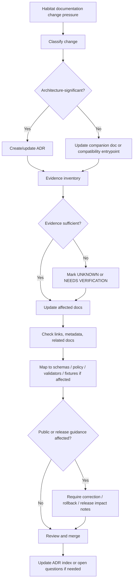

<!-- [KFM_META_BLOCK_V2]
doc_id: kfm://doc/NEEDS-VERIFICATION-ADR-HABITAT-DOCUMENT-EVOLUTION-MODEL
title: ADR: Habitat Document Evolution Model
type: standard
version: v1
status: draft
owners: OWNER_TBD_NEEDS_VERIFICATION
created: DATE_TBD_FROM_GIT_OR_DOC_REGISTRY
updated: 2026-05-08
policy_label: POLICY_LABEL_TBD_NEEDS_VERIFICATION
related: [./README.md, ./ADR-TEMPLATE.md, ./ADR-0001-schema-home.md, ./ADR-0002-responsibility-root-monorepo.md, ./ADR-habitat-schema-home.md, ./ADR-habitat-expansion-boundaries.md, ./ADR-habitat-fauna-publication-boundary.md, ../domains/habitat/README.md, ../domains/habitat/architecture/ARCHITECTURE.md, ../domains/habitat/governance/SOURCE_REGISTRY.md, ../domains/habitat/governance/VALIDATION_AND_POLICY.md, ../domains/habitat/operations/PROMOTION_AND_ROLLBACK.md, ../domains/habitat/operations/OPEN_QUESTIONS.md, ../../pipelines/habitat_layer_build/config/README.md, ../../tools/validators/ecology/validate_habitat_surfaces.py, ../../tools/validators/ecology/validate_habitat_assignments.py]
tags: [kfm, adr, habitat, documentation-control, evidence, lifecycle, governance, rollback]
notes: [Replaces a placeholder ADR with a reviewable decision record. doc_id, owners, created date, policy label, CODEOWNERS, branch enforcement, and complete Habitat document inventory remain NEEDS VERIFICATION.]
[/KFM_META_BLOCK_V2] -->

<a id="top"></a>

# ADR: Habitat Document Evolution Model

Decision model for evolving Habitat lane documentation without turning drafts, compatibility entrypoints, or generated guidance into implementation proof.

<p align="center">
  
  
  
  
  
  
</p>

<p align="center">
  <a href="#decision-summary">Decision</a> ·
  <a href="#context">Context</a> ·
  <a href="#evidence-basis">Evidence</a> ·
  <a href="#document-evolution-model">Model</a> ·
  <a href="#impact-map">Impact</a> ·
  <a href="#validation-plan">Validation</a> ·
  <a href="#rollback-and-supersession">Rollback</a> ·
  <a href="#open-verification">Open verification</a>
</p>

> [!IMPORTANT]
> **ADR decision status:** `proposed`.
>
> This ADR governs how Habitat documentation changes are admitted, promoted, corrected, superseded, and rolled back. It does **not** prove that Habitat schemas, policies, validators, workflows, release manifests, runtime routes, UI components, or public artifacts are already complete or enforced.

---

## Decision summary

| Field | Determination |
|---|---|
| ADR | `docs/adr/ADR-habitat-document-evolution-model.md` |
| Decision status | `proposed` |
| Document status | `draft` |
| Decision scope | Habitat lane documentation control and evolution |
| Owning root | `docs/` |
| Directory Rules basis | ADRs and domain documentation belong under `docs/`; Habitat does not become a root-level folder. |
| Core rule | Habitat documentation evolves as a governed control-plane surface with explicit status, source-role awareness, companion-link sync, validation burden, rollback path, and successor lineage. |
| Protected invariant | `RAW -> WORK / QUARANTINE -> PROCESSED -> CATALOG / TRIPLET -> PUBLISHED` |
| Public-surface rule | Habitat docs may describe public surfaces, but only released/governed payloads may feed MapLibre, Evidence Drawer, Focus Mode, exports, or public APIs. |
| Enforcement maturity | `NEEDS VERIFICATION` until active-checkout owners, link checks, metadata checks, validators, and workflow evidence are confirmed. |

### Proposed decision

KFM should adopt a **Habitat document evolution model** with three lanes:

1. **Compatibility entrypoints** preserve stable links and redirect readers to canonical companion docs.
2. **Canonical companion docs** define the Habitat lane’s durable human-facing control surfaces: architecture, source registry, validation/policy, API/UI expectations, promotion/rollback, and open verification.
3. **Decision and change records** keep material documentation changes reviewable, reversible, and tied to ADRs, source evidence, validation targets, and rollback behavior.

### One-line operating rule

> Habitat documentation may guide implementation, but it must never substitute for machine schemas, executable policy, validators, fixtures, receipts, proofs, release manifests, or runtime evidence.

### One-line boundary rule

> A Habitat doc change must not create a public path, source authority, schema authority, policy authority, release authority, or evidence claim by prose alone.

[Back to top](#top)

---

## Context

The existing ADR file was a placeholder whose stated purpose was to settle the “habitat document evolution model.” The surrounding repository now contains a richer Habitat documentation set, including:

- a Habitat domain README;
- compatibility entrypoints for older root-level Habitat docs;
- canonical companion docs under Habitat subdirectories;
- open verification questions for owners, schema home, source descriptors, validator toolchain, API/UI paths, and rollback/correction conventions;
- fixture-backed habitat pipeline files and simple ecology validators.

That is enough to replace the placeholder with a real decision model, but not enough to claim full enforcement.

### Why this is architecture-significant

Habitat docs are not neutral prose. They influence source admission, sensitive-location posture, modeled-vs-regulatory boundaries, UI evidence expectations, publication readiness, and rollback behavior.

Without an evolution model, Habitat documentation can drift in several ways:

| Drift mode | Failure |
|---|---|
| Compatibility entrypoints become stale | Readers follow old paths and miss canonical companion docs. |
| Draft docs imply enforcement | Maintainers mistake guidance for validated runtime behavior. |
| Source-role language drifts | Regulatory, modeled, occurrence, and context sources are used interchangeably. |
| Public-surface docs outrun policy | Map/UI/AI descriptions imply exposure before proof and release gates exist. |
| Metadata placeholders linger | Owners, policy labels, doc IDs, and related links stay unresolved while docs appear complete. |
| Corrections overwrite history | Habitat docs change without successor notes, rollback path, or review trail. |

[Back to top](#top)

---

## Evidence basis

| Evidence item | Source / path | What it supports | Truth label |
|---|---|---|---|
| Placeholder ADR | `docs/adr/ADR-habitat-document-evolution-model.md` | This target ADR exists and currently needs substantive decision language. | `CONFIRMED` |
| ADR directory index | `docs/adr/README.md` | ADRs are human-facing decision records and must distinguish decision status from implementation enforcement. | `CONFIRMED` |
| ADR template | `docs/adr/ADR-TEMPLATE.md` | KFM ADRs should include evidence, scope, policy impact, validation, rollback, and supersession. | `CONFIRMED` |
| Responsibility-root ADR | `docs/adr/ADR-0002-responsibility-root-monorepo.md` | KFM uses responsibility roots; root folders are authority boundaries, not topic buckets. | `CONFIRMED` |
| Schema-home ADR | `docs/adr/ADR-0001-schema-home.md` | Schema-home authority remains proposed; `contracts/`, `schemas/`, and `policy/` have distinct roles. | `CONFIRMED` doc / `PROPOSED` decision |
| Habitat README | `docs/domains/habitat/README.md` | Habitat docs define lane scope, source-role expectations, companion docs, and no-public-raw boundary. | `CONFIRMED` |
| Habitat architecture | `docs/domains/habitat/architecture/ARCHITECTURE.md` | Habitat owns habitat-support context, not fauna/flora truth, and public surfaces read released artifacts only. | `CONFIRMED` |
| Habitat source registry guide | `docs/domains/habitat/governance/SOURCE_REGISTRY.md` | Source descriptors define admissibility, rights, sensitivity, source role, cadence, and activation posture. | `CONFIRMED` |
| Habitat validation and policy | `docs/domains/habitat/governance/VALIDATION_AND_POLICY.md` | Habitat validation is fail-closed; missing rights, unresolved sensitivity, role misuse, and incomplete catalog closure block promotion. | `CONFIRMED` |
| Habitat API/UI surfaces | `docs/domains/habitat/architecture/API_AND_UI_SURFACES.md` | Public Habitat endpoints should use governed `DecisionEnvelope` responses and UI surfaces should render governed API payloads only. | `CONFIRMED` |
| Habitat promotion and rollback | `docs/domains/habitat/operations/PROMOTION_AND_ROLLBACK.md` | Promotion requires valid descriptors, validation/policy gates, catalog closure, EvidenceBundle and ReleaseManifest references, review, correction, and rollback. | `CONFIRMED` |
| Habitat open questions | `docs/domains/habitat/operations/OPEN_QUESTIONS.md` | Owners, schema home, active descriptors, API/UI paths, validator toolchain, and rollback/correction standardization remain unresolved. | `CONFIRMED` |
| Habitat pipeline fixture | `pipelines/habitat_layer_build/fixtures/good/habitat_layer_candidate.valid.json` | A small fixture-backed habitat layer candidate exists with layer/source role, support resolution, CRS, and temporal scope. | `CONFIRMED` |
| Habitat invalid fixture | `pipelines/habitat_layer_build/fixtures/bad/missing_support_resolution.invalid.json` | Negative fixture pressure exists for missing support resolution. | `CONFIRMED` |
| Ecology validators | `tools/validators/ecology/validate_habitat_surfaces.py`, `tools/validators/ecology/validate_habitat_assignments.py` | Validator stubs check required habitat surface and assignment refs in ecology bundles. | `CONFIRMED` |
| Directory Rules doctrine | `Directory Rules.pdf` | Domain files belong under responsibility roots, not as root-level domain folders. | `CONFIRMED doctrine` |
| KFM lifecycle doctrine | `docs/doctrine/lifecycle-law.md` and supplied KFM doctrine | Public-facing claims must remain downstream of lifecycle, evidence, policy, review, release, correction, and rollback. | `CONFIRMED doctrine` |

### Evidence limits

- This ADR was prepared from repository connector evidence and local workspace inspection. The KFM repository was **not** mounted as a local checkout in `/mnt/data`.
- GitHub connector evidence confirms the target file and adjacent repo files, but branch protections, workflow execution status, CODEOWNERS routing, runtime behavior, release artifacts, dashboards, and deployed public behavior remain `NEEDS VERIFICATION`.
- Placeholder dates, owners, doc IDs, and policy labels must be verified against the active checkout, git history, document registry, or governance register before this ADR is accepted.

[Back to top](#top)

---

## Requirements and constraints

### KFM invariants checked

| Invariant | Decision effect | Status |
|---|---|---|
| `RAW -> WORK / QUARANTINE -> PROCESSED -> CATALOG / TRIPLET -> PUBLISHED` | Habitat docs must preserve this lifecycle and avoid implying direct public access to internal states. | `CONFIRMED doctrine` |
| Public clients use governed interfaces and released artifacts | Habitat API/UI docs may describe public surfaces only as downstream of governed envelopes and release state. | `CONFIRMED doctrine / NEEDS VERIFICATION enforcement` |
| `EvidenceRef` resolves to `EvidenceBundle` before consequential claims | Habitat docs must preserve EvidenceBundle-backed map/runtime explanations. | `CONFIRMED doctrine / PROPOSED enforcement` |
| Source role is preserved | Habitat docs must distinguish regulatory critical habitat, modeled habitat, occurrence signals, and landscape context. | `CONFIRMED repo docs` |
| Rights and sensitivity fail closed | Habitat docs must not weaken unknown-rights or sensitive-location gates. | `CONFIRMED repo docs` |
| Promotion is a governed state transition | Documentation changes must not describe publication as a file move, tile upload, or UI toggle. | `CONFIRMED doctrine` |
| Corrections and rollback remain visible | Material Habitat doc changes need rollback/supersession notes when they affect public-facing guidance. | `CONFIRMED doctrine / PROPOSED doc model` |
| Derived surfaces remain derived | Maps, tiles, summaries, assignments, joins, and modeled surfaces must remain downstream carriers, not root truth. | `CONFIRMED doctrine` |
| AI is interpretive | Focus Mode may summarize released evidence only; docs must preserve `ANSWER / ABSTAIN / DENY / ERROR` outcomes. | `CONFIRMED repo docs` |

### Non-goals

This ADR does **not** decide:

- the canonical Habitat schema home;
- exact machine schema field names;
- policy engine syntax;
- source activation for live Habitat connectors;
- final API route names;
- MapLibre component names;
- release artifact storage details;
- whether every existing Habitat doc is already complete, linked, owned, validated, or published.

Those remain governed by related ADRs, Habitat companion docs, registries, validators, tests, and future implementation evidence.

[Back to top](#top)

---

## Options considered

| Option | Description | Benefits | Risks / costs | Outcome |
|---|---|---|---|---|
| A. Leave placeholder ADR | Keep existing stub until implementation catches up. | Minimal edit. | Hides decision pressure; lets Habitat docs drift without a review model. | Rejected |
| B. Collapse all Habitat docs into one README | Make the README the only Habitat control surface. | Easier navigation. | Creates a large, brittle doc; weakens compatibility entrypoints and role-specific companion docs. | Rejected |
| C. Treat each Habitat doc as independent | Let each companion doc evolve on its own. | Local freedom. | Increases link drift, metadata drift, source-role drift, and inconsistent public-surface guidance. | Rejected |
| D. Adopt a governed document evolution model | Preserve compatibility entrypoints, canonical companion docs, ADR-backed material changes, and validation/rollback burden. | Aligns with KFM governance and current repo shape. | Requires disciplined sync and review. | Accepted as proposed decision |
| E. Create a new root-level `habitat_docs/` home | Centralize Habitat docs outside `docs/domains/habitat/`. | Superficially tidy. | Violates responsibility-root discipline and creates topic-root sprawl. | Rejected |

[Back to top](#top)

---

## Decision

### Chosen option

Adopt **Option D: governed document evolution model**.

Habitat documentation changes should move through explicit status, evidence, validation, review, and rollback steps. Compatibility entrypoints are retained as link-preserving surfaces, but durable content should live in canonical companion docs under the existing `docs/domains/habitat/` structure or related verified responsibility roots.

### Rationale

This model fits the current repository evidence:

- `docs/domains/habitat/README.md` is already a README-like domain landing page with companion-doc navigation.
- Several top-level Habitat docs are compatibility entrypoints pointing to canonical subdirectory content.
- Habitat companion docs already separate architecture, source registry, validation/policy, API/UI, promotion/rollback, and open questions.
- The ADR directory is the repository’s decision ledger.
- Directory rules favor responsibility roots and domain-under-root placement.
- The Habitat lane has enough source-role and public-safety risk that documentation drift can create real governance problems.

### Operating rule

> Material Habitat documentation changes must update the affected companion doc, preserve compatibility links, state evidence and uncertainty, and list validation or follow-up work before the change is treated as governing.

### Boundary rule

> Habitat documentation must not create or imply machine authority for schemas, source descriptors, policy, validators, release decisions, EvidenceBundles, runtime envelopes, or public routes unless those artifacts are separately verified.

[Back to top](#top)

---

## Document evolution model

### Document lanes

| Lane | Examples | Purpose | Change rule |
|---|---|---|---|
| Compatibility entrypoint | `docs/domains/habitat/ARCHITECTURE.md`, `SOURCE_REGISTRY.md`, `VALIDATION_AND_POLICY.md`, `PROMOTION_AND_ROLLBACK.md` | Preserve stable older links and point to canonical subdirectory docs. | Keep short, accurate, and link-valid. Do not add competing content. |
| Canonical companion doc | `architecture/ARCHITECTURE.md`, `governance/SOURCE_REGISTRY.md`, `governance/VALIDATION_AND_POLICY.md`, `architecture/API_AND_UI_SURFACES.md`, `operations/PROMOTION_AND_ROLLBACK.md`, `operations/OPEN_QUESTIONS.md` | Maintain durable human-facing Habitat lane guidance. | Update with evidence, status, affected links, validation, and rollback notes. |
| ADR | `docs/adr/ADR-habitat-*.md` | Record architecture-significant decisions. | Use ADR template discipline: decision, evidence, impact, validation, rollback, open verification. |
| Registry / machine surface | `data/registry/`, `schemas/`, `policy/`, `tools/validators/`, `tests/`, `release/` | Executable or emitted governance surfaces. | Do not edit through prose-only docs; update in owning responsibility root. |
| Pipeline fixture / dry-run surface | `pipelines/habitat_layer_build/...` | Fixture-backed proof and candidate generation. | Keep no-network unless source activation is approved; document validation expectations. |

### Status model

| Status | Meaning for Habitat docs | Minimum requirement |
|---|---|---|
| `draft` | Content is useful but not governing. | Evidence basis and TODOs visible. |
| `review` | Content is ready for steward or maintainer review. | Owners, related links, scope, and open verification named. |
| `published` | Content is accepted as public/stable documentation. | Owners, policy label, links, related artifacts, validation expectations, and rollback path verified. |
| `superseded` | Content remains for lineage but no longer governs. | Successor link and compatibility note. |
| `deprecated` | Content should not be extended without a successor. | Replacement or migration path visible. |
| `withdrawn` | Content was removed from governing use before acceptance. | Withdrawal reason and retained history. |

### Change classes

| Change class | Examples | ADR needed? | Required handling |
|---|---|---:|---|
| Typo / formatting | punctuation, spelling, heading clarity | Usually no | Update in place. |
| Link repair | relative link fix, compatibility entrypoint update | Usually no | Confirm target exists or mark `NEEDS VERIFICATION`. |
| Metadata repair | owners, created date, policy label, related links | Sometimes | Use exact verified values or placeholders. |
| Source-role wording | regulatory vs modeled vs occurrence source meaning | Often yes | Update source registry guide and affected policy/validation docs. |
| Public-surface wording | API, MapLibre, Evidence Drawer, Focus Mode behavior | Often yes | Keep governed API, finite outcomes, evidence closure, and policy checks explicit. |
| Schema/policy/validator guidance | schema home, deny rules, fixture expectations | Yes when authority changes | Coordinate ADR, schema, policy, fixtures, validators, and docs. |
| Release/promotion guidance | ReleaseManifest, EvidenceBundle, rollback, correction | Yes when behavior changes | Update promotion/rollback doc and related release/proof docs. |
| Compatibility path migration | moving canonical content or retiring entrypoints | Yes if link or authority changes | Preserve entrypoint or successor link until migration is verified. |

[Back to top](#top)

---

## Evolution flow



[Back to top](#top)

---

## Impact map

### Documentation impact

| Path | Impact | Status |
|---|---|---|
| `docs/adr/ADR-habitat-document-evolution-model.md` | Replaces placeholder with substantive ADR. | `PROPOSED` |
| `docs/adr/README.md` | Should list this ADR and status after merge. | `NEEDS VERIFICATION` |
| `docs/domains/habitat/README.md` | Should link this ADR if it governs companion-doc evolution. | `PROPOSED` |
| `docs/domains/habitat/architecture/ARCHITECTURE.md` | Should remain canonical Habitat architecture guidance. | `CONFIRMED path` |
| `docs/domains/habitat/governance/SOURCE_REGISTRY.md` | Source-role and source-admission text must stay synced with this ADR. | `CONFIRMED path` |
| `docs/domains/habitat/governance/VALIDATION_AND_POLICY.md` | Fail-closed validation/policy expectations must stay synced. | `CONFIRMED path` |
| `docs/domains/habitat/architecture/API_AND_UI_SURFACES.md` | Public-surface and finite-outcome guidance must stay synced. | `CONFIRMED path` |
| `docs/domains/habitat/operations/PROMOTION_AND_ROLLBACK.md` | Promotion, correction, and rollback text must stay synced. | `CONFIRMED path` |
| `docs/domains/habitat/operations/OPEN_QUESTIONS.md` | Open verification items should track unresolved ownership, schema, validator, API/UI, and rollback questions. | `CONFIRMED path` |

### Contract, schema, policy, validator, fixture impact

| Area | Decision effect | Status |
|---|---|---|
| `contracts/` | This ADR does not change semantic contract home. | `NO CHANGE / NEEDS VERIFICATION` |
| `schemas/` | This ADR does not decide Habitat schema home; defer to `ADR-habitat-schema-home.md` and `ADR-0001`. | `NO CHANGE / CONFLICTED ELSEWHERE` |
| `policy/` | This ADR preserves fail-closed policy language but does not create executable policy. | `NO CHANGE / NEEDS VERIFICATION` |
| `tools/validators/ecology/` | Existing validators are evidence of simple habitat-reference checks, not full documentation enforcement. | `CONFIRMED limited implementation` |
| `pipelines/habitat_layer_build/` | Existing fixtures and build script support fixture-backed Habitat layer candidate work. | `CONFIRMED limited implementation` |
| `.github/workflows/` | No workflow enforcement claimed by this ADR. | `UNKNOWN / NEEDS VERIFICATION` |

### Lifecycle impact

| Lifecycle stage | Documentation evolution effect |
|---|---|
| `RAW` | Docs must not imply raw source material is public or release-ready. |
| `WORK / QUARANTINE` | Drafts and unresolved documentation claims should stay visibly draft, quarantined, or `NEEDS VERIFICATION`. |
| `PROCESSED` | Validated candidate guidance may be documented, but must not be treated as publication. |
| `CATALOG / TRIPLET` | Catalog and graph references must remain evidence-backed derivatives. |
| `PUBLISHED` | Public documentation status requires verified owners, policy label, links, and release/public-surface alignment. |

[Back to top](#top)

---

## Policy, rights, and sensitivity

Habitat documentation can affect sensitive ecological information. Any documentation change that alters public exposure, sensitive-location handling, source-role meaning, or rights posture must fail closed until review.

| Question | Answer | Status |
|---|---|---|
| Does this ADR change public release eligibility? | No direct change; it defines documentation review rules for release-related guidance. | `PROPOSED` |
| Does this ADR affect exact location exposure? | Indirectly. Habitat docs must preserve sensitive-location deny/generalize/abstain posture. | `CONFIRMED doctrine` |
| Does this ADR affect source rights or redistribution? | Indirectly. It requires docs to avoid treating source availability as publication permission. | `CONFIRMED doctrine` |
| Does this ADR change API/UI behavior? | No direct runtime change. It preserves governed API and UI documentation expectations. | `NO DIRECT CHANGE` |
| Does this ADR change AI behavior? | No direct runtime change. It preserves Focus Mode as evidence-subordinate. | `NO DIRECT CHANGE` |
| Does this ADR require steward review? | Yes before acceptance. Habitat owner, documentation owner, and policy/sensitivity owner remain unverified. | `NEEDS VERIFICATION` |

> [!WARNING]
> If a Habitat doc change weakens source-role boundaries, public-sensitive-location controls, source rights language, or release prerequisites, the change must stay `draft` or `review` until policy and domain review close the gap.

[Back to top](#top)

---

## Validation plan

### Required checks before this ADR is accepted

| Check | Suggested command / evidence | Expected result | Status |
|---|---|---|---|
| Target file present | `test -f docs/adr/ADR-habitat-document-evolution-model.md` | File exists on active branch. | `NEEDS VERIFICATION IN CHECKOUT` |
| ADR index sync | inspect `docs/adr/README.md` | This ADR listed with correct status. | `NEEDS VERIFICATION` |
| Habitat companion docs present | `find docs/domains/habitat -maxdepth 3 -type f | sort` | Compatibility entrypoints and canonical companion docs are present or gaps are recorded. | `NEEDS VERIFICATION` |
| Compatibility entrypoints link-valid | markdown link check or manual path check | Entrypoints point to canonical subdirectory docs. | `NEEDS VERIFICATION` |
| Metadata block check | repo-native docs validator | No fabricated doc IDs, owners, created dates, or policy labels. | `NEEDS VERIFICATION` |
| Source-role consistency | compare README, architecture, source registry, validation/policy, API/UI docs | Regulatory, modeled, occurrence, and context source roles remain distinct. | `NEEDS VERIFICATION` |
| Public-surface consistency | compare API/UI and promotion docs | MapLibre, Evidence Drawer, Focus Mode, and public APIs consume governed released payloads only. | `NEEDS VERIFICATION` |
| Fixture evidence | inspect `pipelines/habitat_layer_build/fixtures` | Good and bad fixtures remain aligned with documentation claims. | `NEEDS VERIFICATION` |
| Validator evidence | run or inspect ecology/habitat validators | Validation behavior matches described minimum scope. | `NEEDS VERIFICATION` |
| Rollback/supersession check | inspect promotion/rollback doc and ADR links | Material doc changes have successor or rollback notes. | `NEEDS VERIFICATION` |

### Illustrative repo-native check sequence

```bash
# Run from repository root after checking out the target branch.
git status --short
git branch --show-current

# Inspect ADR and Habitat document surfaces.
test -f docs/adr/ADR-habitat-document-evolution-model.md
find docs/domains/habitat -maxdepth 3 -type f | sort

# Confirm compatibility entrypoints remain short and point to canonical docs.
sed -n '1,80p' docs/domains/habitat/ARCHITECTURE.md
sed -n '1,80p' docs/domains/habitat/SOURCE_REGISTRY.md
sed -n '1,80p' docs/domains/habitat/VALIDATION_AND_POLICY.md
sed -n '1,80p' docs/domains/habitat/PROMOTION_AND_ROLLBACK.md

# Inspect fixture-backed Habitat pipeline examples.
find pipelines/habitat_layer_build -maxdepth 4 -type f | sort

# Run Habitat/ecology validators if repo-native dependencies are available.
python tools/validators/ecology/validate_habitat_surfaces.py <bundle.json> --json
python tools/validators/ecology/validate_habitat_assignments.py <bundle.json> --json
```

> [!NOTE]
> Commands are validation targets, not proof that the active branch currently passes. Capture actual command output in the PR, validation report, or review note before moving this ADR to `accepted`.

### Negative-path expectations

| Failure condition | Expected outcome |
|---|---|
| Habitat doc creates a new canonical schema home by prose | Block or require schema-home ADR update. |
| Compatibility entrypoint accumulates competing content | Move content to canonical companion doc and preserve entrypoint. |
| Source-role wording lets modeled habitat answer regulatory critical-habitat questions | Reject change or require policy/source-role review. |
| Public UI docs imply raw/work/quarantine access | Reject change. |
| Sensitive exact occurrence publication is described without policy review | Reject change or mark `DENY` / `NEEDS VERIFICATION`. |
| Owners/policy labels/doc IDs are guessed | Replace with explicit placeholders. |
| Material doc change lacks rollback/supersession handling | Keep `draft` or block merge. |

[Back to top](#top)

---

## Rollback and supersession

### Rollback plan

If this ADR causes confusion or conflicts with stronger repository evidence:

1. Preserve this ADR as lineage.
2. Mark it `superseded`, `withdrawn`, or `deprecated`.
3. Create or link the successor ADR.
4. Update `docs/adr/README.md`.
5. Update Habitat README and companion docs that reference this ADR.
6. Restore prior compatibility entrypoint behavior if links were broken.
7. Record any public-facing correction if this ADR caused misleading Habitat release or UI guidance.

### Rollback triggers

| Trigger | Required action |
|---|---|
| Active checkout proves different Habitat doc structure | Revise ADR with current repo evidence or supersede. |
| Schema-home ADR settles paths that conflict with this ADR language | Update related references and keep this ADR focused on document evolution. |
| Habitat companion docs are reorganized | Preserve compatibility entrypoints and successor links. |
| Policy/sensitivity review rejects any public-surface language | Correct affected docs and record review result. |
| CI/doc validator blocks metadata or link structure | Fix metadata/links or mark affected values `NEEDS VERIFICATION`. |
| A release or public UI surface relied on draft Habitat docs | Record correction and route public behavior back through release/proof evidence. |

### Supersession rule

A successor ADR must explain:

- what changed in Habitat documentation authority;
- which files are compatibility entrypoints vs canonical companion docs;
- which docs were migrated or retired;
- which public/release/policy claims were affected;
- how old links remain usable or intentionally deprecated;
- how rollback and correction lineage remains inspectable.

[Back to top](#top)

---

## Consequences

### Positive consequences

- Replaces a placeholder ADR with decision-ready guidance.
- Keeps Habitat documentation aligned with KFM lifecycle law and responsibility-root directory discipline.
- Preserves compatibility entrypoints without letting them become competing canonical docs.
- Makes Habitat documentation changes reviewable, reversible, and evidence-bounded.
- Prevents source-role drift across regulatory, modeled, occurrence, and context source families.
- Keeps MapLibre, Evidence Drawer, Focus Mode, and public API guidance downstream of governed evidence and release state.
- Makes unresolved owners, policy labels, schema homes, validators, and route paths visible rather than hidden.

### Tradeoffs and risks

| Risk | Mitigation | Residual status |
|---|---|---|
| More review overhead for Habitat docs | Apply ADR review only to material governance changes, not typos. | `ACCEPTED TRADEOFF` |
| Companion docs may still drift | Require link sync and open-question tracking. | `NEEDS VERIFICATION` |
| Placeholder metadata remains unresolved | Keep searchable placeholders and track in open verification. | `NEEDS VERIFICATION` |
| Existing validators are narrower than docs imply | Mark validator implementation scope as limited. | `CONFIRMED limited / NEEDS VERIFICATION full gate` |
| Schema-home conflict remains | Defer to `ADR-habitat-schema-home.md` and `ADR-0001`. | `CONFLICTED ELSEWHERE` |
| API/UI route names remain unknown | Use generic governed-surface language until routes are verified. | `UNKNOWN` |

[Back to top](#top)

---

## Open verification

| Item | Status | Why it matters |
|---|---:|---|
| Habitat owners / CODEOWNERS | `NEEDS VERIFICATION` | Acceptance needs accountable Habitat, docs, policy, and release review. |
| Created date | `NEEDS VERIFICATION` | Existing placeholder has decision date, but created date should be verified from git or doc registry. |
| Policy label | `NEEDS VERIFICATION` | Public/restricted classification must be deliberate. |
| ADR index update | `NEEDS VERIFICATION` | This ADR should appear in `docs/adr/README.md` after merge. |
| Habitat README cross-link | `NEEDS VERIFICATION` | Domain landing page should reference the decision if it governs doc evolution. |
| Complete Habitat doc inventory | `NEEDS VERIFICATION` | Connector search found key docs, but active checkout inventory should confirm all files. |
| Schema-home decision | `CONFLICTED / NEEDS VERIFICATION` | Habitat docs still mention unresolved `contracts/` vs `schemas/` authority. |
| Validator toolchain | `NEEDS VERIFICATION` | Existing validators are narrow; full doc-evolution checks are not proven. |
| CI/workflow enforcement | `UNKNOWN` | Workflow presence or success was not proven by this ADR. |
| API/UI canonical paths | `NEEDS VERIFICATION` | Habitat docs correctly avoid fixed route/component claims where repo evidence is incomplete. |
| Release/proof artifact conventions | `NEEDS VERIFICATION` | Promotion/rollback guidance needs alignment with actual emitted artifact families. |
| Link validity | `NEEDS VERIFICATION` | Relative links should be checked from the active branch before acceptance. |

[Back to top](#top)

---

## Review checklist

<details>
<summary>Pre-merge checklist</summary>

- [ ] ADR meta block uses verified values or explicit reviewable placeholders.
- [ ] ADR status remains `proposed` until owners, links, validation, and enforcement evidence are confirmed.
- [ ] `docs/adr/README.md` is updated or a follow-up item records why it was deferred.
- [ ] Habitat README links this ADR or open verification records why not.
- [ ] Compatibility entrypoints still point to canonical companion docs.
- [ ] Companion docs do not conflict on source-role, public-surface, validation, policy, promotion, or rollback language.
- [ ] Source-role wording preserves regulatory, modeled, occurrence, context, and derived artifact boundaries.
- [ ] Public UI/API/Focus language remains governed, evidence-backed, finite-outcome, and release-aware.
- [ ] No raw/work/quarantine or internal canonical-store public access is implied.
- [ ] No machine schema, policy, validator, source descriptor, release manifest, EvidenceBundle, or route is claimed as complete without evidence.
- [ ] Open verification items are visible and actionable.
- [ ] Rollback/supersession behavior is documented.
- [ ] No root-level Habitat folder or parallel authority home is introduced.
- [ ] Documentation changes include validation targets or explicitly mark validation `NEEDS VERIFICATION`.

</details>

[Back to top](#top)

---

## Appendix A — Habitat documentation quality bar

A Habitat documentation change is review-ready when a maintainer can answer:

1. Which Habitat doc lane is affected: compatibility entrypoint, canonical companion doc, ADR, registry/machine surface, or fixture/pipeline surface?
2. Does the change alter source-role meaning?
3. Does the change affect rights, sensitivity, geoprivacy, public release, or exact-location exposure?
4. Does the change imply schema, policy, validator, route, UI, release, or proof behavior?
5. What evidence supports the claim?
6. What remains `UNKNOWN` or `NEEDS VERIFICATION`?
7. What adjacent docs or registers need sync?
8. How can the change be validated?
9. How can the change be rolled back or superseded?
10. Does the change preserve KFM lifecycle law and the trust membrane?

## Appendix B — Label quick reference

| Label | Use |
|---|---|
| `CONFIRMED` | Verified from current repo connector evidence, current workspace command output, supplied project docs, tests, schemas, manifests, fixtures, or directly inspected implementation files. |
| `INFERRED` | Conservative synthesis strongly implied by evidence but not direct proof. |
| `PROPOSED` | Design, decision, path, implementation direction, validation plan, or process not yet proven as active behavior. |
| `UNKNOWN` | Not verified strongly enough to state as fact. |
| `NEEDS VERIFICATION` | A concrete check can retire the uncertainty. |
| `CONFLICTED` | Paths, authority, source roles, schema homes, or docs disagree or remain unresolved. |
| `LINEAGE` | Historically useful prior material that informs continuity but does not prove current implementation. |
| `SUPERSEDED` | Replaced by stronger repo evidence or a successor ADR. |
| `DENY` | Access, publication, release, or answer should not proceed under current evidence/policy conditions. |
| `ABSTAIN` | Evidence is insufficient for the requested claim. |
| `ERROR` | Tooling, schema, resolver, runtime, release, or integrity failure. |
