<!-- [KFM_META_BLOCK_V2]
doc_id: kfm://doc/adr-habitat-fauna-thin-slice
title: Habitat × Fauna Thin-Slice Proof Boundary
type: adr
version: v1.1
status: draft
effective_decision_status: proposed
adr_id: unassigned
owners:
  - "NEEDS VERIFICATION — architecture decision owner"
  - "NEEDS VERIFICATION — Habitat domain steward"
  - "NEEDS VERIFICATION — Fauna domain steward"
  - "NEEDS VERIFICATION — cross-domain seam steward"
  - "NEEDS VERIFICATION — evidence, policy, sensitivity, validation, release, correction, rollback, and docs stewards"
owner_status: "CODEOWNERS provides one repository review route, but no accepted Habitat/Fauna/cross-domain stewardship assignment, independent sensitivity approver, or release authority was verified for this decision"
reviewers_required:
  - Architecture steward
  - Docs steward
  - Habitat domain steward
  - Fauna domain steward
  - Cross-domain seam steward
  - Evidence steward
  - Policy and sensitivity steward
  - Validation and CI steward
  - Governed API and Explorer consumer steward
  - Release, correction, and rollback steward
created: "NEEDS VERIFICATION — scaffold predates v1.0"
updated: 2026-08-14
policy_label: public
truth_posture: cite-or-abstain
responsibility_root: docs/
owning_root: docs/
responsibility: "Record the proposed ownership-preserving, fixture-first Habitat × Fauna proof boundary and its current repository maturity without assigning an ADR number, accepting the decision, implementing the seam, or authorizing release."
current_path: docs/adr/ADR-habitat-fauna-thin-slice.md
supersedes: []
superseded_by: null
classification: "PROPOSED scaffold; slug-only unassigned ADR record"
evidence_snapshot:
  repository: bartytime4life/Kansas-Frontier-Matrix
  base_ref: main
  base_commit: 9d924c665073263f2cbf376d2bf29e7b9f252b06
  target_prior_blob: 1ec31498ca870bedf161692df90522db27fa782f
  adr_index_blob: 938c5894c36b99e14810918e2c550ab0e92d53b1
  accepted_directory_adr_blob: a4de0d7a96b78da59cfc499d1025e1508afd8dd9
  directory_rules_blob: fd49a0b83e55cef52c1124281f093e263526898d
  cross_domain_seam_register_blob: dc87ea9c2ab11cc10e51cf4e8284c030e7c9ab29
  fauna_occurrence_contract_blob: f38ae38055d03149471a97b63d38a7b8f7cfbd35
  fauna_occurrence_schema_blob: 55bfdf896627443281e41ef2761024bddedc7828
  fauna_occurrence_validator_blob: fd54968e4e013284d8c633ea6782252a0a4ec90c
  fauna_occurrence_tests_blob: 785868d14423530cab7180d4e54f98fad5eb5e73
  fauna_sensitive_fixture_blob: 3509e130a32f39a56d04aa0ff4f5a71ec7b3ab92
  fauna_public_safe_validator_blob: fe96d8c4cc78f44679ddf617b2b1251fe621928c
  fauna_smoke_tests_blob: 8154761e55c01db9133f125f7cf268c2fbb8589e
  fauna_workflow_blob: 0edc73a77ee0ddb3193db2c0386ed6ac685b139a
  fauna_evidence_drawer_component_blob: ce7594231ed59857ef9b3e37d7a0a9d1286866b4
  fauna_evidence_drawer_schema_blob: 0c6d70d796572034d47dc763e02e000c615d4484
  fauna_evidence_drawer_tests_blob: b396a4e8dab493a56b5d05499ff80d0d5616b3b3
  habitat_materiality_contract_blob: c7ad48b435d8cc7fcdcf2910fb675e9c9778e7e7
  habitat_smoke_placeholder_blob: cb47841f9da427fc1fdfa62f00bd0a0843c410a3
  habitat_workflow_blob: 59771c027f688d7028a46c4635c0ec710b34e3ab
  dedicated_cross_domain_test_placeholder_blob: d267e4fefa1c08d408ece2c15580696f20ade0c4
  thin_slice_fixture_readme_blob: c3e46354c0dca886ab4989baf3fc49fd5a3a7297
  join_schema_blob: 5db6f1b09b2ebafbeb788ab177a8a77b8a31ba6b
  relation_guardrail_blob: 0a93e1529b936e0cdcedc56579422a4dbadd1b02
  pair_policy_readme_blob: ba1cebac0844eb46dd851ab72e7d281300c4ae67
  cross_domain_test_readme_blob: 657a8188c92ad4b06e61e851540cc621abab3ea0
  proof_pipeline_readme_blob: b9432391968c7f06947489ebc5113a52ef6d6855
  release_candidate_readme_blob: d5c3990bfdf8563721724d1e885022f28ba3f1df
  exact_main_domain_habitat_run: 31828082799
  exact_main_domain_fauna_run: 31828082805
  latest_dedicated_occurrence_run: 31808444125
inspection_boundary: >
  Current-session reads of main, the canonical ADR index, accepted ADR-0029,
  adopted Directory Rules bytes, cross-domain seam registry, current Habitat and
  Fauna contracts/schemas/validators/tests/workflows, the Habitat × Fauna
  schema/policy/test/proof/candidate scaffolds, and hosted workflow records.
  No real Habitat × Fauna relation instance, restricted payload, source activation,
  policy evaluation, geoprivacy transform, EvidenceBundle resolution, proof
  execution, candidate dossier, PromotionDecision, ReleaseManifest, governed API
  response, map render, deployment, release, or publication was exercised.
related:
  - docs/adr/README.md
  - docs/adr/INDEX.md
  - docs/adr/ADR-template.md
  - docs/adr/ADR-0029-adopt-directory-governance-standard-v2.md
  - docs/doctrine/directory-rules.md
  - control_plane/cross_domain_seam_register.yaml
  - docs/domains/habitat/ARCHITECTURE.md
  - docs/domains/fauna/ARCHITECTURE.md
  - contracts/domains/habitat/land_cover/materiality_profile.md
  - contracts/domains/fauna/occurrence_evidence.md
  - schemas/contracts/v1/domains/fauna/occurrence_evidence.schema.json
  - schemas/contracts/v1/joins/habitat-fauna-join.schema.json
  - schemas/contracts/v1/relations/habitat_fauna/README.md
  - policy/joins/habitat-fauna/README.md
  - fixtures/domains/fauna/valid/sensitive_withheld_occurrence.json
  - fixtures/domains/habitat/habitat_fauna_thin_slice/README.md
  - tests/domains/fauna/test_fauna_smoke.py
  - tests/domains/fauna/test_occurrence_evidence.py
  - tests/domains/habitat/test_habitat_fauna_thin_slice.py
  - tests/cross_domain/fauna_habitat/README.md
  - tools/validators/domains/fauna/validate_public_safe_fixture.py
  - tools/validators/domains/fauna/occurrence/validate_occurrence_evidence.py
  - pipelines/proofs/habitat_fauna_thin_slice/README.md
  - release/candidates/habitat/habitat_fauna_thin_slice/README.md
  - apps/explorer-web/src/features/domains/fauna/EvidenceDrawer.tsx
  - schemas/contracts/v1/domains/fauna/evidence_drawer_payload.schema.json
  - .github/workflows/domain-habitat.yml
  - .github/workflows/domain-fauna.yml
tags: [kfm, adr, habitat, fauna, thin-slice, cross-domain, proof, evidence-bundle, geoprivacy, public-safe, release-gated, rollback]
notes:
  - "Same-path v1.1 modernization of an existing unassigned PROPOSED scaffold."
  - "This revision preserves source status draft and effective status proposed; it does not assign an ADR number, modify the ADR index, accept the decision, or use its own text as implementation authority."
  - "Fauna and Habitat now each have bounded executable fixture-first work, but the Habitat × Fauna seam itself remains unimplemented and held."
  - "Hydrology may remain the proposed repository-wide first proof-bearing lane; this record governs only the first bounded Habitat × Fauna cross-domain proof within the ecology lanes."
  - "No standard, contract, schema, policy, fixture, validator, workflow, receipt, data, release, runtime, API, UI, source, or publication behavior changes in this documentation-only revision."
[/KFM_META_BLOCK_V2] -->

<a id="top"></a>

# ADR — Habitat × Fauna Thin-Slice Proof Boundary

> **Proposed decision.** KFM should treat the Habitat × Fauna thin slice as a deterministic, fixture-first, no-network, cross-domain proof harness. It may demonstrate that a public-safe Fauna reference can be related to Habitat context while preserving domain ownership, source roles, evidence support, finite policy outcomes, sensitivity controls, correction, and rollback. A passing proof is not Habitat truth, Fauna truth, an `EvidenceBundle`, release approval, or publication authority.

[](#status)
[](#adr-identity-and-index-boundary)
[](#current-enforcement-maturity)
[](#current-repository-evidence)
[](#sensitivity-geoprivacy-and-public-safe-projection)
[](#authority-and-publication-boundary)

> [!IMPORTANT]
> **This remains an unassigned `PROPOSED scaffold`.** The canonical ADR index inventories this slug-only path separately from the numbered ADR sequence. This same-path revision does not assign an ID, reserve a number, change status, modify `docs/adr/INDEX.md`, or establish acceptance.

> [!CAUTION]
> **The domain substrates have advanced, but the cross-domain proof has not.** Fauna now has executable synthetic public-safe fixture checks, a closed `OccurrenceEvidence` draft profile, and a shared Evidence Drawer projection. Habitat now has an executable inactive land-cover materiality profile. The dedicated Habitat × Fauna test is still a one-line placeholder; the joint fixture lane has no verified payload inventory; the join schema remains permissive; the neutral relation lane is README-only; the pair policy is evaluator-unbound; and the proof and candidate lanes remain documentary holds.

> [!WARNING]
> **Cross-domain composition must not collapse authority.** Habitat context cannot establish a Fauna occurrence. Fauna evidence cannot become a Habitat object. A relation, fixture, test, receipt, proof, map layer, graph edge, model output, or generated explanation cannot replace either domain's evidence or authorize public exposure.

**Quick navigation:** [Status](#status) · [Evidence](#evidence-boundary) · [Context](#context) · [Decision](#proposed-decision) · [Ownership](#domain-ownership-and-relation-boundary) · [Maturity ladder](#evidence-maturity-ladder) · [Flow](#thin-slice-proof-flow) · [Sensitivity](#sensitivity-geoprivacy-and-public-safe-projection) · [Placement](#placement-and-authority-boundaries) · [Current evidence](#current-repository-evidence) · [Maturity](#current-enforcement-maturity) · [Convergence](#implementation-and-convergence-plan) · [Acceptance](#acceptance-gates) · [Validation](#validation-matrix) · [Consequences](#consequences) · [Alternatives](#alternatives-considered) · [Risks](#risk-and-open-question-ledger) · [Migration](#migration-and-compatibility) · [Rollback](#rollback-and-supersession) · [References](#references) · [History](#revision-history) · [No-loss ledger](#appendix-a--no-loss-modernization-ledger)

---

<a id="status"></a>

## Status

| Field | Current value |
|---|---|
| **ADR identity** | Unassigned slug-only scaffold; no permanent `ADR-NNNN` claimed |
| **Tracked path** | `docs/adr/ADR-habitat-fauna-thin-slice.md` |
| **Source metadata** | `draft` |
| **Effective decision status** | `proposed` |
| **Decision class** | Cross-domain proof-orchestration, ownership, evidence, sensitivity, public-client, correction, and release boundary |
| **Primary responsibility root** | `docs/` — human architecture decision record |
| **Directory Rules authority** | Accepted ADR-0029 adopts the exact v2 bytes at `docs/doctrine/directory-rules.md` |
| **Directory Rules outcome for this revision** | `PLACE` by same-path responsibility; no move, split, alias, or new authority home |
| **Affected responsibility roots if later implemented** | `control_plane/`, `contracts/`, `schemas/`, `policy/`, `fixtures/`, `tests/`, `tools/`, `pipelines/`, `data/registry/`, `data/receipts/`, `data/proofs/`, `release/`, and governed public clients |
| **Current implementation effect** | Documentation only |
| **Current cross-domain maturity** | `L1 / PARTIAL`: independent domain fixture profiles exist; the neutral seam does not |
| **Release/publication effect** | None |
| **Migration required now** | No file move; future relation/schema/test/fixture convergence may require a separately reviewed migration |
| **Rollback required** | Yes—documentation rollback now; implementation and release rollback before later graduation |
| **Supersedes / superseded by** | None / none |

<a id="adr-identity-and-index-boundary"></a>

### ADR identity and index boundary

The canonical ADR index records:

- 34 numbered records;
- ADR-0029 as the only accepted numbered record;
- 33 other numbered records as effectively proposed; and
- this file as one of 12 unassigned scaffolds with decision status `not-assigned`.

The ADR operating contract requires a permanent record to use a unique `ADR-NNNN` identity with filename, H1, source status, effective status, and canonical index in agreement.

This revision intentionally preserves the current path and classification because the authorized scope is one existing file. Therefore:

- this record **MUST remain `draft` / effectively `proposed`**;
- it **MUST NOT be treated as accepted or numbered**;
- it **MUST NOT reserve or fabricate the next ADR number**;
- a later numbering change **MUST** recheck current main, the numbered sequence, open pull requests, and active branches, then update this record and `docs/adr/INDEX.md` together;
- ADR-index validation **MUST** pass before a numbered record can merge;
- numbering or acceptance **MUST NOT** be interpreted as implementation, proof closure, release, deployment, or publication.

---

<a id="evidence-boundary"></a>

## Evidence boundary

### CONFIRMED at `main@9d924c665073263f2cbf376d2bf29e7b9f252b06`

#### Governance and placement

- `docs/adr/INDEX.md` inventories this path as an unassigned slug-only scaffold.
- ADR-0029 is accepted and adopts the exact Directory Rules v2 bytes at `docs/doctrine/directory-rules.md`.
- Directory Rules place this human decision record under `docs/adr/` and require one authority owner per artifact, neutral cross-domain scope after the responsibility root is fixed, no parallel authority, and finite `PLACE` / `SPLIT` / `MIGRATE` / `MIRROR` / `HOLD` / `DENY` placement outcomes.
- `control_plane/cross_domain_seam_register.yaml` is a proposed, partial, non-authorizing projection for five high-risk seams. Habitat × Fauna is not among those five entries, and the register retains `ADR_S_14_PENDING`, `CITE_ONLY`, most-restrictive sensitivity/policy, and no mutation or publication authority.

#### Fauna substrate

- `OccurrenceEvidence` now has a draft semantic contract, a closed Draft 2020-12 schema, deterministic identity, a fixture-first no-network validator, synthetic valid/invalid fixtures, and focused tests.
- The occurrence profile is explicitly pre-sensitivity-split and cannot admit a source, resolve an `EvidenceBundle`, approve policy/review, produce `OccurrencePublic`, release data, or publish an occurrence.
- The bounded Fauna public-safe fixture profile accepts only synthetic, fixture-only candidates that are explicitly ineligible for promotion or publication.
- The accepted fixture inventory contains a non-sensitive case and a coordinate-free sensitive-withheld case. The sensitive fixture requires a transform reference, explicit withholding caveat, and withheld geoprivacy state, while stating that the reference is not a real `RedactionReceipt`.
- `tests/domains/fauna/test_fauna_smoke.py` blocks network access, exercises two valid and five invalid fixture files, checks exact fail-closed findings, and rejects precision hints, encoded location clues, unresolved governance, and missing transform disclosure.
- The exact-main `domain-fauna` run `31828082805` completed successfully. Its workflow still holds proof production and release dry run and explicitly denies that a green result establishes Fauna truth, rights, policy, geoprivacy review, evidence closure, release, or safe public use.
- The last inspected dedicated `fauna-occurrence-evidence` main run `31808444125` completed successfully at `main@6eab7cd37861d25cb007b7777f024a4b68d6e9d1`. Current bytes were re-read, but an exact-current-main replay of that dedicated workflow was not observed in this session.
- The Fauna Evidence Drawer component delegates to the shared renderer, the domain schema is a field-free projection to the shared closed schema, and focused tests preserve the finite `ANSWER` / `ABSTAIN` / `DENY` / `ERROR` envelope. This is UI-schema convergence, not a Habitat × Fauna join or release path.

#### Habitat substrate

- Habitat now has an executable, fixture-first, no-network land-cover materiality profile that maps synthetic county comparisons to `NON_EVENT`, `PROMOTION_CANDIDATE`, or `HOLD`.
- That profile remains `PROPOSED_INACTIVE`; it does not assert live land-cover truth, species presence, source admission, policy approval, promotion, release, or publication.
- The exact-main `domain-habitat` run `31828082799` completed successfully. The workflow explicitly keeps Habitat proof production and release dry run on `WORKFLOW_HOLD`.
- `tests/domains/habitat/test_habitat_smoke.py` is still a generic placeholder; the substantive Habitat land-cover materiality tests live in their focused validator lane.

#### Habitat × Fauna seam

- `tests/domains/habitat/test_habitat_fauna_thin_slice.py` remains a one-line `PROPOSED` placeholder with no test function or class.
- `fixtures/domains/habitat/habitat_fauna_thin_slice/README.md` defines fixture intent but reports no verified payload inventory and no tests or validators run.
- `schemas/contracts/v1/joins/habitat-fauna-join.schema.json` remains a permissive proposed scaffold with empty `properties`, `additionalProperties: true`, and no contract reference.
- `schemas/contracts/v1/relations/habitat_fauna/README.md` remains a README-only placement guardrail. It prohibits a new canonical relation schema until the join/relation conflict, paired contract, fixtures, validators, policy, and review are resolved.
- `policy/joins/habitat-fauna/README.md` provides a detailed proposed pair-admissibility boundary, but it is evaluator-unbound, records `ADR-S-14` as open, and states that the current `PolicyDecision` family does not accept a `joins` or `habitat-fauna` policy family.
- `tests/cross_domain/fauna_habitat/README.md` defines the expected test and geoprivacy proof lane, but it remains README-only and placement-conflicted; no dedicated cross-domain CI caller is established by that document.
- `pipelines/proofs/habitat_fauna_thin_slice/README.md` defines proof-orchestration boundaries but no accepted executable producer, command, emitted proof inventory, or exact proof result.
- `release/candidates/habitat/habitat_fauna_thin_slice/README.md` reports `NO_ACTIVE_CANDIDATE`; no child dossier, `EvidenceBundle`, `PromotionDecision`, `ReleaseManifest`, or public Habitat × Fauna artifact is established.

### PROPOSED by this ADR

- The ownership-preserving proof boundary between Habitat-owned context, Fauna-owned evidence, and a neutral relation.
- The evidence-maturity ladder and graduation rules below.
- The minimum deterministic fixture packet, finite outcomes, sensitivity behavior, proof outputs, and release blockers.
- A staged convergence path across seam registration, relation contract/schema authority, pair policy composition, fixtures, validators, tests, receipts, proofs, candidate review, correction, rollback, and governed consumers.
- Retention of a neutral proof-orchestration responsibility under `pipelines/` if an accepted path decision confirms the existing lane.

### UNKNOWN

- Whether real Habitat × Fauna relation records exist under different names, external systems, restricted systems, databases, or unindexed generated outputs.
- Whether any live source descriptor has accepted rights, citation, sensitivity, temporal, precision, redistribution, and public-use posture for a cross-domain pilot.
- Whether an executable relation evaluator, pair policy bundle, geoprivacy transformer, proof runner, or consumer exists outside the inspected surfaces.
- Which people or teams hold qualified Habitat, Fauna, sensitivity, evidence, cross-domain, and release authority.
- Whether a current public or internal service consumes an equivalent relation under another object family.
- Whether a live join can avoid inferential disclosure for all relevant geometries, scales, exports, and downstream carriers.

### NEEDS VERIFICATION before acceptance

- Permanent ADR number and synchronized index update.
- Named accountable owners and reviewers.
- Whether Habitat × Fauna must be added to the cross-domain seam register and which status/relation class it should carry.
- Canonical relation semantics and machine-schema family, including disposition of both `joins/` and `relations/`.
- Canonical fixture and test placement for neutral cross-domain work.
- Accepted pair-policy composition and compatibility with the current `PolicyDecision` family.
- Deterministic identity, reason-code, temporal, evidence, sensitivity, correction, and rollback obligations.
- Executable positive and negative fixtures, validators, tests, proof runner, and exact-head CI.
- `EvidenceRef` to `EvidenceBundle` resolution, policy evaluation, transform receipts, proof/receipt separation, candidate dry run, correction, withdrawal, rollback, and cache invalidation.
- Governed API, MapLibre, Evidence Drawer, search, export, graph, and AI consumer behavior.

### Out of scope

This ADR does not:

- make Habitat × Fauna the repository-wide first proof-bearing lane or supersede the proposed hydrology-first decision;
- establish a live source connector, occurrence record, habitat model, regulatory critical-habitat determination, conservation status, management instruction, emergency decision, or public advisory;
- redefine the existing Fauna `OccurrenceEvidence` or Habitat land-cover materiality profiles;
- define the final JSON Schema, Rego policy, executable proof runner, fixture payload set, API route, UI component, or tile format;
- resolve the repository-wide schema-home rule;
- silently select between `joins/` and `relations/`, or accept `policy/joins/` as executable authority;
- activate a source, ingest data, approve evidence, run a real geoprivacy transform, approve a candidate, create a release, or publish an artifact;
- accept itself, assign itself a permanent number, change the ADR index, merge, deploy, release, or publish anything.

---

<a id="context"></a>

## Context

KFM needs proof-bearing slices that demonstrate governance behavior with small, reviewable inputs before broad source activation or public feature expansion. Habitat × Fauna is valuable because it crosses a boundary where semantic and sensitivity mistakes are easy to make:

- Habitat owns habitat patches, land-cover and ecological-system context, suitability, corridors, restoration context, stewardship context, model receipts, and uncertainty.
- Fauna owns taxon identity, occurrence evidence, range evidence, conservation status, animal-event observations, sensitive sites, and Fauna-specific geoprivacy.
- A neutral relation may state that a Fauna reference was evaluated against Habitat context, but it must not transfer ownership or inflate either input into a stronger claim.
- The produced relation or derivative can be more sensitive than either input considered alone.

The repository is no longer uniformly placeholder-level. It now has useful independent-domain substrates:

- Fauna can validate synthetic public-safe fixture hygiene and a closed source-bound occurrence-evidence profile.
- Habitat can validate one inactive synthetic land-cover materiality profile.
- Fauna can project to the shared closed Evidence Drawer payload without creating a parallel UI authority.

Those advances reduce some future implementation risk, but they do not create the seam. The missing object is still the governed cross-domain relation plus its composed evidence, policy, sensitivity, proof, correction, and release behavior.

Without an explicit decision, unsafe shortcuts remain plausible:

```text
Habitat patch -> species presence
Fauna occurrence -> Habitat canonical object
suitability model -> observed occurrence
public Habitat geometry + restricted Fauna evidence -> public join
domain fixture pass -> cross-domain proof
proof pass -> release approval
fixture transform reference -> real RedactionReceipt
relation schema validation -> evidence closure
map layer -> publication authority
AI summary -> cited claim
```

The safe next step is not to claim the proof works. It is to preserve the finite decision boundary, identify the current substrate, and define the exact evidence required to graduate the seam.

### Decision drivers

1. Preserve Habitat and Fauna bounded contexts and ubiquitous language.
2. Build on, but never overstate, current domain-local fixture evidence.
3. Prove cite-or-abstain across a neutral cross-domain relation.
4. Exercise public-safe sensitivity behavior without using real restricted occurrence data.
5. Keep tests, receipts, proofs, evidence, policy, review, release, correction, and rollback distinct.
6. Prevent green readiness workflows from being mistaken for executed cross-domain proof.
7. Keep public clients behind governed APIs and released artifacts.
8. Make inferential disclosure, stale state, correction, withdrawal, and rollback part of the proof design.
9. Prefer a small, deterministic, reversible fixture slice before live connectors or broad UI work.
10. Prevent additional competing relation, fixture, test, policy, or proof homes while placement remains unresolved.

---

<a id="proposed-decision"></a>

## Proposed decision

If later numbered, reviewed, and accepted, KFM should adopt the following Habitat × Fauna thin-slice rules.

### 1. The slice is a proof harness, not a domain or product

The thin slice exists to demonstrate a bounded cross-domain flow. It is not:

- a new ecology domain;
- a new source authority;
- a new evidence or policy authority;
- a new public product family;
- a shortcut from an independent domain validator to a cross-domain claim; or
- a substitute for release governance.

The proof **MUST** be deterministic, fixture-first, no-network by default, and runnable without live credentials or source downloads.

### 2. Independent-domain evidence is input substrate, not seam proof

A future proof may consume explicitly versioned, fixture-scoped outputs from the current Fauna and Habitat profiles, but it **MUST NOT** infer that:

- a Fauna validator pass proves Habitat relation semantics;
- a Habitat materiality assessment proves Fauna presence;
- a shared Evidence Drawer projection proves relation evidence or public safety; or
- two individually valid objects form an admissible public join.

Every cross-domain assertion requires separate relation, evidence, policy, sensitivity, and release evaluation.

### 3. The minimum positive scenario is intentionally narrow

The first positive packet **MUST** contain, at minimum:

1. one synthetic public-safe Fauna input derived from an accepted fixture profile or a future accepted `OccurrencePublic` fixture;
2. one synthetic Habitat patch or context input from an accepted fixture profile;
3. one neutral relation record that references, rather than copies, the two domain-owned objects;
4. explicit source-role and knowledge-character declarations for both endpoints and the relation;
5. one resolved toy `EvidenceBundle`, or a deterministic resolver stub that returns a bounded fixture-only bundle;
6. one composed finite policy result for the requested operation and audience;
7. one expected public-safe projection or finite `ANSWER` envelope;
8. one validation/proof receipt packet separate from evidence and release objects; and
9. one correction and rollback readiness record or deterministic release blocker.

### 4. Negative, ambiguous, and stale paths are first-class

The fixture set **MUST** include cases that produce validation failure, `ABSTAIN`, `DENY`, `HOLD`, `ERROR`, or `SOURCE_STALE` as appropriate.

At minimum:

- Habitat context asserted as Fauna occurrence must fail or abstain.
- Modeled suitability presented as observation must fail.
- Missing endpoint evidence or relation evidence must abstain or hold.
- A coordinate-free sensitive-withheld Fauna fixture without required transform disclosure must fail closed.
- A join whose public Habitat geometry permits inferential reconstruction of protected Fauna context must deny or require stronger transformation.
- A public consumer reference to RAW, WORK, QUARANTINE, restricted, or unreleased state must deny.
- A proof pass with no candidate/release/correction/rollback closure must remain blocked.

### 5. Proof success has a bounded meaning

A passing proof means only that the scoped implementation behaved as expected against the admitted fixture packet and pinned profile versions.

It does **not** mean:

- live Habitat or Fauna sources are admitted;
- the relation is factually true outside the fixtures;
- an `EvidenceBundle` is closed for live data;
- policy, rights, geoprivacy, or human review is complete for a real source;
- a candidate is approved;
- a layer, API response, export, graph, search result, or AI answer is released or public-safe;
- Habitat or Fauna implementation is complete; or
- the seam may publish.

### 6. Publication remains a separate governed transition

The proof harness may emit test results, validation reports, receipts, scoped proof summaries, and release blockers to their accepted homes.

It **MUST NOT**:

- write directly to `data/published/`;
- create a `PUBLISHED` lifecycle state;
- approve a `PromotionDecision` or `ReleaseManifest`;
- activate a public route;
- lower sensitivity or precision;
- treat a generated receipt as proof of truth; or
- make the same process both generator and final approver for policy-significant release.

Any later release requires separate evidence, policy, qualified review where material, promotion, correction, withdrawal, rollback, and cache-invalidation closure.

### 7. Held readiness remains visible

A workflow may be green because a hold is correctly enforced. Graduation **MUST** replace a hold only when the new executable command, fixtures, contracts, schemas, policy bindings, receipts, proof outputs, and negative tests are reviewed together.

A green hold **MUST NOT** be relabeled as a passing proof.

---

<a id="domain-ownership-and-relation-boundary"></a>

## Domain ownership and relation boundary

| Surface | Owns | Must not own or imply |
|---|---|---|
| **Habitat lane** | Habitat patch/class, land-cover/ecological-system context, suitability/corridor/restoration context, model receipts, uncertainty | Taxon identity, occurrence truth, conservation status, sensitive Fauna location, regulatory authority |
| **Fauna lane** | Taxon, occurrence/range evidence, animal-event observations, status, sensitive-site context, Fauna geoprivacy | Habitat patch truth, habitat-model authority, restoration approval, release state |
| **Neutral relation record** | Stable endpoint references, relation type, method, spatial/temporal scope, evidence refs, policy/review/release refs, transform lineage | Copies of canonical Habitat/Fauna fields, stronger truth than inputs, source authority, evidence authority, policy authority, release authority |
| **Pair-policy composition** | Operation/audience admissibility and enforceable obligations for the produced relation | Ecological truth, geoprivacy parameters, schema meaning, proof, release |
| **Proof harness** | Deterministic orchestration and checks | Domain processing ownership, source fetching, schema authority, policy approval, evidence storage, catalog truth, release decisions, public serving |
| **Public-safe projection** | Released derivative fields explicitly allowed by policy and manifest | Exact restricted geometry, hidden source attributes, canonical internal records, unreleased model/candidate state |
| **Evidence Drawer projection** | Shared finite UI payload after governed resolution | Relation truth, evidence creation, source access, public release authority |

### Required anti-collapse invariants

- The relation **MUST reference**, not duplicate, domain-owned objects.
- Habitat context **MUST NOT** be interpreted as evidence that a Fauna taxon is present.
- A Fauna occurrence **MUST NOT** be rewritten as a Habitat observation.
- Modeled suitability **MUST remain labeled as modeled** and must not become observed occurrence or regulatory critical habitat.
- The most restrictive applicable rights, sensitivity, review, and release posture **MUST win** for a cross-domain derivative.
- A cross-domain product **MUST** be evaluated for join-induced and derivation-induced sensitivity.
- Graph/triplet projections **MUST remain derivative** and resolve to the same evidence and policy packet as other carriers.
- A generated explanation **MUST** use a finite response envelope and citation validation; otherwise it must abstain or deny.
- A domain-local fixture profile **MUST NOT** be represented as the neutral relation profile.
- A fixture transform reference **MUST NOT** be represented as an issued `RedactionReceipt`.

---

<a id="evidence-maturity-ladder"></a>

## Evidence maturity ladder

| Level | Required evidence | Authority effect |
|---|---|---|
| `L0 — DOCUMENTED BOUNDARY` | ADR/scaffold, domain doctrine, placement guardrails, explicit non-effects | None |
| `L1 — DOMAIN SUBSTRATES` | Independent Habitat and Fauna contracts/schemas/fixtures/validators/tests with no-network finite outcomes | Proves only each declared domain profile |
| `L2 — NEUTRAL SEAM PROFILE` | Accepted relation semantics and closed shape, seam registration, pair policy input/output contract, deterministic cross-domain fixtures and validators | Proves relation-profile conformance only |
| `L3 — COMPOSED PROOF` | Evidence resolution, policy composition, sensitive-withheld and inferential-disclosure paths, proof runner, receipts, exact-head CI | Proves bounded fixture behavior only |
| `L4 — CANDIDATE AND RECOVERY DRY RUN` | Candidate dossier, release blockers, correction/withdrawal/rollback/cache drill, governed consumer checks | Readiness evidence; no publication |
| `L5 — GOVERNED LIVE PILOT / RELEASE` | Admitted sources, rights/sensitivity/review closure, release manifest, rollback target, observed public behavior | Separately governed release only |

**Current maturity: `L1 / PARTIAL`.**

- Fauna has substantive `L1` evidence in more than one profile.
- Habitat has one substantive inactive `L1` land-cover materiality profile.
- The Habitat × Fauna seam remains at `L0` because `L2` relation, policy, fixture, validator, test, and registration evidence is absent or unresolved.
- No evidence in this review supports `L3`, `L4`, or `L5`.

---

<a id="thin-slice-proof-flow"></a>

## Thin-slice proof flow

```mermaid
flowchart LR
    HF["Synthetic Habitat fixture<br/>domain-owned profile"] --> V["Endpoint schema + semantic validation"]
    FF["Synthetic Fauna fixture<br/>domain-owned profile"] --> V
    V --> J["Neutral Habitat × Fauna relation"]
    J --> E["Endpoint + relation EvidenceRef resolution"]
    E --> P["Composed policy + sensitivity decision"]
    P -->|ANSWER / allowed fixture| D["Public-safe derivative candidate"]
    P -->|ABSTAIN / DENY / HOLD / ERROR| N["Finite non-answer + reason codes"]
    D --> Q["Cross-domain validators + proof runner"]
    N --> Q
    Q --> R["Receipts + scoped proof output"]
    R --> G["Candidate blockers / recovery dry run"]
    G -. separate reviewed transition .-> X["PromotionDecision + ReleaseManifest + published carrier"]
    G -. correction / rollback drill .-> B["CorrectionNotice + WithdrawalNotice + RollbackCard"]
```



### Required stage distinctions

```text
domain fixture input
  != RAW source capture
domain-profile pass
  != cross-domain relation pass
relation-schema pass
  != ecological truth
validation report
  != EvidenceBundle
fixture transform reference
  != RedactionReceipt
proof receipt
  != proof of live truth
proof pass
  != PromotionDecision
candidate dossier
  != ReleaseManifest
released carrier
  != canonical evidence
```

### Minimum proof outputs

| Output | Responsibility home | Required boundary |
|---|---|---|
| Cross-domain test result | Accepted neutral lane under `tests/` / CI artifact | Enforceability evidence only |
| Run/transform/validation receipt | Accepted `data/receipts/` family | Process memory, not truth |
| Proof summary or proof object | Accepted `data/proofs/` family | Scoped proof, not release approval |
| Endpoint and relation evidence support | Accepted `EvidenceRef` / `EvidenceBundle` homes | Root support for claims |
| Policy result | Accepted policy-evaluation output / decision record | Admissibility and obligations |
| Candidate dossier | `release/candidates/` | Review packet, not release |
| Promotion/release record | `release/` | Separate governed transition |
| Public carrier | `data/published/` or governed serving surface | Released derivative only |

---

<a id="sensitivity-geoprivacy-and-public-safe-projection"></a>

## Sensitivity, geoprivacy, and public-safe projection

Cross-domain joins can expose protected Fauna information even when the Fauna record itself is not displayed. A Habitat patch, corridor, stewardship zone, model cell, tile, search result, or small polygon can make a restricted occurrence inferable by intersection.

Therefore:

- synthetic cross-domain fixtures **MUST NOT** contain real restricted coordinates, rare-species records, nests, dens, roosts, hibernacula, spawning or aggregation sites, credentials, private source exports, or steward-only identifiers;
- exact or high-risk Fauna geometry **MUST remain in its owning restricted lifecycle and access boundary**;
- source geoprivacy and KFM public precision **MUST remain separate**;
- sensitivity transforms **MUST occur before rendering, public API delivery, search indexing, export, graph projection, or AI retrieval**, not through client-only hiding or styling;
- a public-safe derivative **MUST** carry transform method/version, source refs, input/output support description, reason codes, reviewer requirement, receipt reference, and correction lineage where applicable;
- missing rights, sensitivity, review, transform, evidence, or release state **MUST** produce `DENY`, `HOLD`, or `ABSTAIN`, never permissive fallback;
- the produced relation and every downstream carrier **MUST** be evaluated for inferential disclosure;
- exports, screenshots, popups, Evidence Drawer payloads, Focus Mode answers, search results, and graph views **MUST** obey the same public-safe decision as the map layer;
- exact thresholds, radii, grid sizes, masking parameters, and reconstruction limits **MUST NOT** be exposed in this public ADR;
- a synthetic fixture reference to a transform receipt **MUST** remain explicitly fixture-only until a governed receipt contract and producer exist.

A public-safe projection is a derivative. It never replaces the exact steward record, source record, `OccurrenceEvidence`, or canonical Habitat object.

---

<a id="placement-and-authority-boundaries"></a>

## Placement and authority boundaries

Accepted ADR-0029 adopts Directory Rules v2. The rules place artifacts by one responsibility owner, then add domain or seam scope. This ADR remains under `docs/adr/` because its primary responsibility is a human architecture decision record.

| Responsibility | Existing or proposed home | Current decision posture |
|---|---|---|
| Architecture decision | `docs/adr/ADR-habitat-fauna-thin-slice.md` | `PLACE`; this file remains proposed and unassigned |
| Cross-domain seam projection | `control_plane/cross_domain_seam_register.yaml` | Habitat × Fauna entry absent; addition requires a reviewed register change |
| Habitat doctrine/meaning | `docs/domains/habitat/`, `contracts/domains/habitat/` | Habitat-owned |
| Fauna doctrine/meaning | `docs/domains/fauna/`, `contracts/domains/fauna/` | Fauna-owned |
| Neutral relation semantics | One accepted contract family under `contracts/` | Unresolved |
| Neutral relation machine shape | One accepted family under `schemas/contracts/v1/` | `joins/` versus `relations/` unresolved |
| Pair admissibility | Accepted composition under `policy/` | Documentation exists; evaluator and PolicyDecision compatibility unresolved |
| Cross-domain fixtures | One accepted neutral fixture lane | Current Habitat-nested lane is documentary and placement-sensitive |
| Cross-domain enforceability | One accepted neutral lane under `tests/` | Current neutral README is placement-conflicted; Habitat test is placeholder |
| Reusable validators | `tools/validators/` | Pair and geoprivacy lanes are documentary until executable files are verified |
| Proof orchestration | Accepted implementation lane under `pipelines/` | Existing README documents intent; producer absent |
| Source identity and rights | `data/registry/sources/habitat/` and `data/registry/sources/fauna/` | Domain-owned source admission |
| Receipts | Accepted `data/receipts/` families | Process memory only |
| Proof objects | Accepted `data/proofs/` families | Proof only; not release |
| Candidate review | `release/candidates/` | Existing lane has no active candidate |
| Promotion, correction, rollback | `release/` | Separate reviewed state transitions |
| Published derivatives | `data/published/` and governed delivery | None for this seam |

### Relation-schema convergence hold

The repository currently exposes both:

- `schemas/contracts/v1/joins/habitat-fauna-join.schema.json`, a permissive scaffold; and
- `schemas/contracts/v1/relations/habitat_fauna/README.md`, a README-only guardrail.

This ADR **does not declare either current surface canonical**.

Before executable seam implementation:

1. one semantic relation contract and one machine-schema family **MUST** be selected through accepted authority;
2. the non-selected surface **MUST** be migrated, retained as a declared one-way compatibility projection, or retired with references repaired;
3. schema `$id`, contract refs, fixtures, validators, registries, generated artifacts, and consumers **MUST** converge in one reviewed packet;
4. no new duplicate relation schema **MUST** be added while the conflict is unresolved.

### Pair-policy composition hold

The detailed pair-policy README is useful design evidence, but:

- its parent/path authority is still proposed;
- its evaluator is unbound;
- `ADR-S-14` remains open;
- the inspected `PolicyDecision` family does not accept `joins` or `habitat-fauna` as policy-family values; and
- no runtime composer or decision receipt was established.

Before implementation, KFM must decide whether the pair result is:

- a new accepted policy family;
- a composition of existing sensitivity/access/render policy decisions;
- a profile under one existing family; or
- another explicitly governed form.

This ADR does not make that choice by prose alone.

### Test and fixture placement hold

Current surfaces overlap:

- Habitat-nested fixture and test lanes;
- a neutral `tests/cross_domain/fauna_habitat/` README lane; and
- proof-orchestration documentation under `pipelines/proofs/`.

Directory Rules require the responsibility owner first and cross-domain scope second. A later implementation packet must select one neutral fixture/test authority without recreating deleted or parallel trees and must document any temporary compatibility path.

### Control-plane seam registration hold

The current seam register is partial and excludes Habitat × Fauna. If this decision is accepted, a separate reviewed change should determine:

- seam ID and participant order;
- relation class;
- ownership allocations;
- prohibited inferences;
- evidence and source-role rules;
- sensitivity/policy/release defaults;
- public-join posture; and
- canonical contract reference.

Registering the seam remains navigational/review authority only; it cannot authorize a join or publication.

---

<a id="authority-and-publication-boundary"></a>

## Authority and publication boundary

This ADR can record a proposed architecture direction. It cannot:

- accept or number itself;
- amend the canonical ADR index by implication;
- use its own draft as authority for dependent schema, policy, fixture, test, or release changes;
- implement the proof;
- decide source rights or sensitivity for real records;
- create or resolve an `EvidenceBundle`;
- issue a real `RedactionReceipt`;
- approve a `PolicyDecision`;
- approve or sign a candidate;
- create a `PromotionDecision` or `ReleaseManifest`;
- authorize public API, map, graph, search, export, or AI exposure;
- substitute CODEOWNERS routing or a green workflow for qualified domain, sensitivity, evidence, or release review.

Publication remains downstream of:

```text
RAW -> WORK / QUARANTINE -> PROCESSED -> CATALOG / TRIPLET -> PUBLISHED
```

Promotion is a governed state transition, not a file move, fixture pass, workflow pass, test count, proof receipt, branch merge, map render, or generated summary.

### Non-effects of v1.1

This v1.1 revision changes only this Markdown file. It does not modify:

- the ADR index or any ADR status;
- Directory Rules or its machine projections;
- Habitat or Fauna contracts/schemas;
- pair relation or policy surfaces;
- fixtures, validators, tests, workflows, receipts, proofs, source registries, or data;
- candidate, release, correction, withdrawal, or rollback records;
- API, MapLibre, Evidence Drawer, graph, search, export, or AI behavior;
- repository settings, rulesets, approvals, deployment, release, or publication.

---

<a id="current-repository-evidence"></a>

## Current repository evidence

| Surface | Current verified state | Safe conclusion |
|---|---|---|
| ADR inventory | This path is a slug-only unassigned scaffold; ADR-0029 is the only accepted numbered ADR | Decision remains proposed |
| Directory authority | ADR-0029 accepts v2 at `docs/doctrine/directory-rules.md` | Same-path docs update is placement-consistent |
| Cross-domain seam register | Five initial seams, partial coverage, `ADR_S_14_PENDING`, no Habitat × Fauna entry | Seam registration and authority remain open |
| Fauna `OccurrenceEvidence` | Closed draft schema, deterministic no-network validator and tests, source-role/rights/sensitivity checks | Strong domain substrate; no public/relation/release authority |
| Fauna synthetic public-safe fixture profile | Two valid plus five invalid fixtures, coordinate-free sensitive-withheld case, exact findings, network denial | Fixture hygiene proven within its narrow profile |
| Fauna workflow | Exact-main run `31828082805` succeeded; proof and release jobs remain holds | Green domain validation, no cross-domain proof or release |
| Dedicated Fauna occurrence workflow | Last inspected main run `31808444125` succeeded at `6eab7cd…`; current files re-read | Prior hosted proof for current file family; exact-current-head replay not observed |
| Fauna Evidence Drawer projection | Domain component delegates to shared renderer; schema projects to shared closed finite payload | UI compatibility only |
| Habitat land-cover materiality | Executable inactive fixture profile with deterministic outcomes | Habitat domain substrate only |
| Habitat workflow | Exact-main run `31828082799` succeeded; proof and release jobs remain holds | One domain profile runs; Habitat proof/release still held |
| Habitat generic smoke test | One placeholder test | Not proof of Habitat maturity |
| Dedicated Habitat × Fauna test | One-line proposed placeholder | No executable seam test |
| Joint fixture lane | README only; no payload inventory verified | No relation fixture packet |
| Join schema | Empty properties, arbitrary additional fields, no paired contract | Not usable as safety/interoperability proof |
| Relation lane | README-only guardrail | Canonical relation family unresolved |
| Pair-policy lane | Detailed design, evaluator-unbound, PolicyDecision incompatibility recorded | No executable pair policy |
| Neutral cross-domain test lane | README-only and placement-conflicted | No established test runner or dedicated CI |
| Proof orchestration lane | Detailed README, no accepted producer/command/output | Proof remains held |
| Candidate lane | `NO_ACTIVE_CANDIDATE` | No release candidate |
| Public release | No Habitat × Fauna `EvidenceBundle`, promotion, manifest, or public carrier verified | Publication absent |

> [!IMPORTANT]
> **The safe present-tense conclusion is partial domain substrate plus a documentary seam hold.** The repository proves bounded independent-domain behavior. It does not prove that the Habitat × Fauna relation executes, composes policy/evidence, survives sensitivity review, produces proof, creates a candidate, or reaches public delivery.

---

<a id="current-enforcement-maturity"></a>

## Current enforcement maturity

| Capability | Current status | Graduation evidence required |
|---|---|---|
| ADR decision | Draft, proposed, unassigned | Numbered/indexed record plus explicit human acceptance |
| Seam registration | Habitat × Fauna absent from partial register | Reviewed seam entry with no authority inflation |
| Habitat endpoint substrate | One inactive land-cover materiality profile | Accepted endpoint/profile for the chosen fixture scenario |
| Fauna endpoint substrate | OccurrenceEvidence and synthetic public-safe fixture profiles exist | Accepted public/restricted conversion posture for the chosen fixture |
| Neutral relation semantics | Unresolved | Paired semantic contract and ownership rules |
| Relation machine shape | Permissive/README-only competing surfaces | Closed required fields, schema tests, registry entry, migration disposition |
| Pair policy | Detailed README only | Accepted composition, finite outputs, reason codes, obligations, executable tests |
| Synthetic cross-domain fixtures | README-only; no payload inventory | Versioned positive/invalid/denied/abstained/stale/ambiguous fixtures |
| Executable cross-domain tests | Dedicated module is placeholder | Deterministic test functions and negative-path coverage |
| Proof runner | README-only contract | Accepted command, pinned inputs, no-network execution, receipts |
| Evidence resolver | Not established for this seam | Deterministic endpoint and relation evidence resolution |
| Geoprivacy/inferential disclosure | Not demonstrated | Produced-output validator, transform receipt, denied fixtures |
| CI | Domain workflows green; seam jobs remain holds/absent | Dedicated exact-head cross-domain checks preserving finite outcomes |
| Candidate dossier | None established | Immutable candidate identity and complete review packet |
| Release/correction/rollback | None established | Promotion decision, manifest, correction, withdrawal, rollback, cache drill |
| Public API/map/search/graph/AI | No seam consumer established | Governed-interface integration and trust-membrane tests |

---

<a id="implementation-and-convergence-plan"></a>

## Implementation and convergence plan

Acceptance of this ADR would authorize direction only. It would not skip the stages below.

### Stage 0 — Decision identity and authority

- assign a unique ADR number and update `docs/adr/INDEX.md` in the same reviewed change;
- confirm owners and required reviewers;
- preserve current status until explicit acceptance;
- decide whether `ADR-S-14` is this record, a successor, or a separate pair-policy decision;
- do not use the proposed record to authorize dependent implementation in the same unaccepted authority batch.

### Stage 1 — Seam registration and placement convergence

- decide whether Habitat × Fauna belongs in `control_plane/cross_domain_seam_register.yaml`;
- define the seam's ownership allocations and prohibited inferences;
- select one neutral relation contract/schema family;
- resolve `joins/` versus `relations/`;
- select one neutral fixture lane and one neutral test lane;
- decide pair-policy composition and `PolicyDecision` compatibility;
- record temporary compatibility and migration behavior for existing Habitat-nested lanes.

### Stage 2 — Neutral relation semantics and machine shape

Define one relation contract/profile that requires, where material:

- deterministic relation ID and `spec_hash`;
- Habitat endpoint ref/version and Fauna endpoint ref/version;
- relation type, direction, method, and knowledge character;
- source role and source descriptor refs for each endpoint;
- endpoint and relation `EvidenceRef` arrays;
- spatial and temporal support;
- rights, sensitivity, geoprivacy, and produced-output risk;
- model/observation/regulatory/aggregate/candidate distinctions;
- policy result/obligation refs;
- transform lineage;
- review and release state;
- correction, withdrawal, supersession, and rollback refs.

It must reject copied domain-owned truth unless the contract explicitly defines a released public projection.

### Stage 3 — Synthetic cross-domain fixture packet

Create compact fixtures for:

- valid public-safe relation;
- missing Habitat owner/ref;
- missing Fauna owner/ref;
- missing source role or version;
- missing endpoint or relation evidence;
- modeled suitability presented as occurrence;
- restricted/sensitive Fauna input without transform;
- sensitive-withheld fixture missing transform disclosure;
- public geometry that permits inferential disclosure;
- stale source/evidence;
- conflicting endpoint time scopes;
- public client attempting to use internal lifecycle refs;
- proof pass misused as release approval;
- missing correction, withdrawal, or rollback posture;
- invalid identity, duplicate relation, and unsupported policy composition.

### Stage 4 — Validators and executable tests

- implement closed schema validation;
- implement semantic, domain-boundary, source-role, temporal, identity, and canonicalization checks;
- implement endpoint/relation evidence checks;
- implement pair-policy composition and finite reason codes;
- implement produced-output geoprivacy and inferential-disclosure checks;
- implement trust-membrane and release-blocker checks;
- add executable tests under the accepted neutral lane;
- keep default tests no-network and deterministic;
- require positive and fail-closed paths;
- ensure workflow summaries distinguish `HOLD`, `ABSTAIN`, `DENY`, `ERROR`, and `PASS`.

### Stage 5 — Proof runner and receipts

- implement a neutral proof orchestrator under the accepted pipeline path;
- pin fixture IDs, contract/schema/profile/policy/tool versions, and input hashes;
- emit run, transform, validation, and proof records to accepted homes;
- verify that receipts, proof objects, `EvidenceBundle`s, policy decisions, and release decisions remain distinct;
- produce a machine-readable scoped proof result and human review summary;
- make proof output non-publishing and no-write outside its permitted receipt/proof lanes.

### Stage 6 — Evidence, policy, and public-safe projection

- resolve toy endpoint and relation `EvidenceRef`s deterministically;
- exercise finite policy outcomes and obligations;
- demonstrate one public-safe derivative and at least one denied sensitive variant;
- test inferential disclosure across Habitat geometry and downstream carriers;
- project to the shared Evidence Drawer envelope only after evidence/policy resolution;
- require identical admissibility for API, map, search, export, graph, screenshot, and AI carriers.

### Stage 7 — Candidate dry run, correction, and rollback

- create a synthetic candidate dossier only after prior stages pass;
- run release-readiness checks without publishing;
- prove correction, withdrawal, supersession, rollback, and cache/index/tile invalidation;
- keep independent review separate from authorship where sensitivity or materiality warrants it;
- confirm that rollback cannot restore exact sensitive geometry to a public carrier.

### Stage 8 — Optional live-source pilot

A live pilot is a later decision. It requires verified source descriptors, rights, terms, cadence, sensitivity, precision, attribution, rate limits, steward contacts, source-version pinning, public-safe transformation, incident response, correction, and rollback.

Failure at any gate returns quarantine, hold, denial, abstention, or error. It does not fall back to permissive publication.

### Documentation obligations

When behavior changes, update the accepted ADR or successor, ADR index if status/identity changes, seam register, contracts, schemas, policy, fixtures, validators, tests, workflows, source docs, proof/candidate/release docs, public-consumer docs, and generated receipts that are directly affected.

---

<a id="acceptance-gates"></a>

## Acceptance gates

This ADR should not transition to `accepted` until reviewers agree on the decision boundary and the repository can state a credible, non-duplicative implementation path. Runtime graduation remains separate.

| Gate | Acceptance requirement | Current status |
|---|---|---|
| **A — Identity** | Permanent ADR number, matching H1/filename/index, no collision | OPEN |
| **B — Ownership** | Habitat, Fauna, neutral relation, pair policy, proof, evidence, consumer, and release responsibilities agreed | PROPOSED |
| **C — Seam and placement** | Seam registration disposition plus one contract/schema/fixture/test/policy/proof authority path per responsibility | OPEN / CONFLICTED |
| **D — Relation contract** | Neutral semantics, closed machine shape, identity, time, evidence, sensitivity, correction obligations agreed | OPEN |
| **E — Fixture contract** | Positive and fail-closed scenarios agreed without real sensitive data | PROPOSED |
| **F — Sensitivity and policy** | Join-induced risk, inferential disclosure, transform, reviewer, finite outcome, and obligation rules agreed | PROPOSED |
| **G — Evidence/proof separation** | Endpoint/relation evidence, receipts, proofs, candidates, and release records remain distinct | PROPOSED |
| **H — Trust membrane** | Governed API, renderer, Evidence Drawer, export, graph, search, and AI boundaries agreed | PROPOSED |
| **I — Recovery** | Stale state, correction, withdrawal, supersession, rollback, and cache invalidation obligations agreed | PROPOSED |
| **J — Review** | Required qualified human reviewers explicitly approve the decision | OPEN |

### Runtime definition of done after acceptance

- [ ] Accepted seam entry or documented decision not to register one.
- [ ] One accepted relation contract and one closed schema family exist.
- [ ] Non-selected `joins/` / `relations/` surfaces have an explicit migration/compatibility disposition.
- [ ] Accepted neutral fixture and test lanes exist without parallel authority.
- [ ] Valid, invalid, denied, abstained, held, stale, and ambiguous fixtures exist.
- [ ] Executable no-network tests collect and pass.
- [ ] Sensitive-withheld and inferential-disclosure variants demonstrably fail closed when support is missing.
- [ ] Public-safe projection carries transform and evidence lineage.
- [ ] Proof runner emits deterministic receipts and scoped proof output.
- [ ] `EvidenceRef` resolves to a bounded `EvidenceBundle` or returns a finite non-answer.
- [ ] Pair-policy outcomes, reason codes, and obligations are machine-tested.
- [ ] Proof success cannot create release state.
- [ ] Candidate dry run produces blockers or a complete review packet without publishing.
- [ ] Correction, withdrawal, rollback, and cache/index/tile invalidation are exercised.
- [ ] Governed API, MapLibre, Evidence Drawer, search, export, graph, and AI tests consume only allowed released or fixture-scoped surfaces.
- [ ] Hosted exact-head checks and human review are recorded separately from publication authority.

---

<a id="validation-matrix"></a>

## Validation matrix

| Scenario | Expected result | Required assertion |
|---|---|---|
| Public-safe Fauna ref related to Habitat context with resolved toy endpoint/relation evidence | `ANSWER` / allowed fixture result | Ownership and source roles preserved |
| Habitat context used to assert Fauna presence | Validation failure or `ABSTAIN` | Habitat is context, not occurrence authority |
| Fauna occurrence copied into a Habitat canonical object | Validation failure | Domain ownership not transferred |
| Suitability model treated as observed occurrence or regulatory critical habitat | Validation failure / `DENY` | Knowledge character remains visible |
| Missing endpoint or relation `EvidenceRef` | `ABSTAIN` / `HOLD` | Cite-or-abstain enforced |
| Sensitive-withheld fixture lacks transform ref/caveat/geoprivacy state | Validation failure / `DENY` | Fixture disclosure obligations enforced |
| Sensitive Fauna input has no accepted transform/review | `DENY` / `HOLD` | Fail closed |
| Public Habitat geometry enables inference of protected Fauna context | `DENY` or stronger transform obligation | Produced output evaluated spatially |
| Endpoint time scopes conflict or evidence is stale | `SOURCE_STALE`, `ABSTAIN`, or `HOLD` | Temporal support visible |
| Relation silently upgrades candidate/model/aggregate to observed | Validation failure | Source role and knowledge character preserved |
| Pair policy is missing, incompatible, or unresolved | `HOLD` / `ERROR` | No permissive fallback |
| Public client points to RAW, WORK, QUARANTINE, restricted, or unreleased ref | Validation failure / `DENY` | Trust membrane enforced |
| Domain fixture passes but no relation profile exists | `HOLD` | Domain substrate is not seam proof |
| Proof receipt supplied as `EvidenceBundle` | Validation failure | Proof/evidence separation enforced |
| Fixture transform ref supplied as real `RedactionReceipt` | Validation failure | Fixture/process authority not inflated |
| Test/proof passes but release objects are missing | Release blocker | Proof pass is not promotion |
| Correction, withdrawal, or rollback target absent | Release blocker | Reversibility required |
| Evidence Drawer payload resolves before evidence/policy result | `ABSTAIN`, `DENY`, or validation failure | UI remains downstream of trust |
| AI summary lacks citation validation | `ABSTAIN` / validation failure | Generated language subordinate to evidence |
| Rollback would restore exact sensitive geometry to public cache | `DENY` / rollback failure | Recovery remains public-safe |

---

<a id="consequences"></a>

## Consequences

### Positive

- Creates a clear cross-domain proof boundary without inventing a new ecology authority root.
- Preserves Habitat and Fauna bounded contexts and makes relation neutrality testable.
- Recognizes useful current domain-substrate work without claiming cross-domain maturity.
- Converts documentation-heavy readiness into a staged path toward executable proof.
- Makes sensitive-withheld and inferential-disclosure failures first-class fixtures.
- Prevents receipts, proofs, schemas, candidates, UI payloads, map layers, and AI answers from collapsing into truth or release authority.
- Provides a reusable pattern for other high-risk cross-domain seams.
- Keeps live-source activation and public release outside the first implementation increment.

### Costs and tradeoffs

- Requires coordination across multiple stewards and responsibility roots.
- Requires a decision on seam registration, relation schema family, test/fixture placement, and pair-policy composition before code.
- Expands the test burden beyond a simple spatial join.
- May delay a visible map feature while evidence, sensitivity, correction, and rollback controls are built.
- Requires realistic synthetic failures without introducing real protected data.
- Preserves explicit workflow holds until a genuinely accepted implementation exists.
- May require migration of current Habitat-nested or parallel scaffold paths.

### Neutral constraints

- Hydrology can remain the proposed repository-wide first proof-bearing lane.
- Existing Fauna and Habitat domain profiles remain independently useful within their declared bounds.
- Existing Habitat/Fauna documentation remains lineage and guidance unless paired with current executable evidence.
- Existing fixture and release-candidate paths may remain during convergence, but placement alone grants no authority.

---

<a id="alternatives-considered"></a>

## Alternatives considered

### Alternative A — Implement a broad live Habitat/Fauna integration first

**Rejected for this decision.** Live source rights, sensitivity, cadence, schema, policy, and public-safe transformation are not sufficiently established. A broad rollout would multiply uncertainty before the trust path is proven.

### Alternative B — Treat independent domain validators as the cross-domain proof

**Rejected.** Endpoint conformance does not establish relation meaning, evidence support, pair policy, join-induced sensitivity, or release readiness.

### Alternative C — Put the proof entirely under Habitat

**Rejected.** Habitat does not own Fauna occurrence or taxon truth. A Habitat-owned cross-domain proof could imply authority transfer and obscure neutral review.

### Alternative D — Put the proof entirely under Fauna

**Rejected.** Fauna does not own Habitat patch, suitability, corridor, or restoration context. The same ownership collapse would occur in the other direction.

### Alternative E — Treat the join schema as the complete decision

**Rejected.** Machine shape cannot decide domain meaning, evidence sufficiency, sensitivity, policy, review, release, correction, or rollback. The current schema is also field-incomplete and permissive.

### Alternative F — Treat the detailed pair-policy README as active policy

**Rejected.** The evaluator, policy-family compatibility, accepted decision, fixtures, and runtime composition are not established.

### Alternative G — Use map rendering or Evidence Drawer convergence as the proof

**Rejected.** A renderer or shared payload projection proves only UI behavior. It does not prove relation truth, evidence closure, geoprivacy, source roles, release state, or correction/rollback readiness.

### Alternative H — Consider green readiness holds as successful execution

**Rejected.** The workflows explicitly retain proof and release holds. A green hold is accurate readiness evidence, not an executed cross-domain proof.

### Alternative I — Create a third relation schema to avoid choosing `joins/` or `relations/`

**Rejected.** That would deepen parallel authority and make validation, migration, correction, and rollback ambiguous.

### Alternative J — Defer all ADR work until code exists

**Rejected.** Competing relation/schema/test/fixture/policy surfaces already exist. A bounded decision is needed to prevent further authority drift before implementation.

---

<a id="risk-and-open-question-ledger"></a>

## Risk and open-question ledger

| Risk or question | Status | Required follow-up |
|---|---|---|
| Permanent ADR number and ownership are unassigned | NEEDS VERIFICATION | Number/index/review change |
| Relationship to `ADR-S-14` is unresolved | CONFLICTED | Decide same decision, successor, or separate pair-policy ADR |
| Habitat × Fauna absent from partial seam register | NEEDS VERIFICATION | Register disposition after decision review |
| `joins/` versus `relations/` schema family conflict | CONFLICTED | Select one authority and migrate/profile the other |
| Pair-policy path and `PolicyDecision` compatibility unresolved | CONFLICTED | Accepted composition and schema strategy |
| Current fixture lane is nested under Habitat despite cross-domain scope | NEEDS VERIFICATION | Confirm compatibility or migrate without a parallel home |
| Current Habitat-owned test placeholder overlaps neutral test README | CONFLICTED | Choose one executable authority and retire/redirect the other |
| Current release review lane is nested under Habitat | NEEDS VERIFICATION | Confirm candidate ownership and external Fauna references |
| No cross-domain fixture payload inventory | CONFIRMED gap | Create deterministic synthetic packet |
| No executable dedicated seam test | CONFIRMED gap | Implement tests and wire accepted command |
| No accepted proof producer | CONFIRMED hold | Implement runner only after contract/fixture/policy closure |
| Pair policy and geoprivacy behavior not demonstrated | NEEDS VERIFICATION | Executable rules, transforms, reason codes, negative tests |
| Inferential disclosure through Habitat geometry | OPEN risk | Produced-output spatial validator and review obligation |
| Live source rights/cadence/precision unknown | UNKNOWN | SourceDescriptor and rights review before live pilot |
| Domain profiles may evolve independently and break the relation adapter | OPEN risk | Version pins, compatibility matrix, replay tests |
| EvidenceBundle, receipt, proof, and release identities may drift | OPEN risk | Deterministic identity and cross-object validators |
| Generated UI/AI language may overstate relation meaning | OPEN risk | Finite envelopes, citation validation, negative tests |
| Workflow graduation could erase explicit hold semantics | OPEN risk | Deliberate workflow replacement and regression tests |
| Public caches/search indexes/tiles could retain withdrawn derivatives | OPEN risk | Cache and derivative invalidation drill |
| Qualified independent sensitivity/release reviewer unavailable | UNKNOWN | Steward assignment and review route |
| Restricted thresholds could leak through tests or docs | OPEN risk | Private policy fixtures and public reason-code hygiene |

---

<a id="migration-and-compatibility"></a>

## Migration and compatibility

This documentation-only revision preserves the existing path and inbound links.

Future implementation should use the smallest reversible convergence:

1. **Inventory** all Habitat × Fauna contracts, schemas, policies, fixtures, tests, validators, proof code, receipts, proofs, candidate lanes, register entries, and consumers.
2. **Select** one canonical neutral relation contract/schema family through accepted authority.
3. **Select** one neutral fixture lane and one neutral executable test lane.
4. **Decide** whether pair policy is a new family, a profile, or a composition of existing decisions.
5. **Classify** every non-selected surface as compatibility, migration source, redirect, or retirement candidate.
6. **Migrate** references with history-preserving moves or adapters; do not duplicate authoritative schemas or tests.
7. **Preserve** stable object IDs and emit migration/transform receipts where records change shape.
8. **Update** docs, registers, schema refs, fixtures, validators, CI, candidate templates, and consumers in the same bounded migration packet.
9. **Retain** old paths only when a verified consumer requires compatibility and declare the one-way source plus exit criteria.
10. **Verify** that no public client, graph, search, export, map, or AI surface reads a deprecated or internal path as authority.

A relation-schema or test-path migration is not a data release. Any record migration must stay within the governed lifecycle and retain correction and rollback lineage.

---

<a id="rollback-and-supersession"></a>

## Rollback and supersession

### Documentation rollback

Revert the v1.1 commit or restore prior blob `1ec31498ca870bedf161692df90522db27fa782f`.

That rollback restores v1.0. It would remove the current evidence reconciliation, maturity ladder, substrate/seam distinction, exact-main workflow evidence, accepted Directory Rules basis, seam-register gap, pair-policy compatibility gap, and revised convergence plan. It would not alter any implementation or public state.

### Implementation rollback

A future implementation **MUST** define rollback before graduation:

- disable or remove the proof runner without deleting receipts;
- restore prior schema/contract/profile versions and compatibility adapters;
- quarantine invalid outputs;
- revoke or withdraw candidate dossiers and public derivatives;
- invalidate caches, tiles, search indexes, graph projections, exports, and generated summaries;
- preserve correction, withdrawal, supersession, and rollback records;
- ensure rollback never restores exact sensitive geometry to public surfaces;
- retain enough versioned fixture and tool evidence to replay the failure.

### Supersession

If this decision is accepted and later materially changed, create a successor ADR. Do not rewrite accepted history. Mark this record `superseded`, add a forward link, and require the successor to link back.

If this scaffold is numbered, update the filename, H1, metadata, and canonical index together. Preserve redirects or migration notes only where repository evidence requires them.

---

<a id="references"></a>

## References

### ADR and placement authority

- [`README.md`](README.md) — ADR operating contract.
- [`INDEX.md`](INDEX.md) — canonical numbered and scaffold inventory.
- [`ADR-template.md`](ADR-template.md) — authoring template.
- [`ADR-0029`](ADR-0029-adopt-directory-governance-standard-v2.md) — accepted adoption of Directory Rules v2.
- [Directory Rules](../doctrine/directory-rules.md) — responsibility-root placement and lifecycle boundaries.
- [Cross-domain seam register](../../control_plane/cross_domain_seam_register.yaml) — partial, non-authorizing context-map projection.

### Current Habitat and Fauna substrate

- [Habitat land-cover materiality profile](../../contracts/domains/habitat/land_cover/materiality_profile.md).
- [Fauna OccurrenceEvidence contract](../../contracts/domains/fauna/occurrence_evidence.md).
- [Fauna OccurrenceEvidence schema](../../schemas/contracts/v1/domains/fauna/occurrence_evidence.schema.json).
- [Fauna OccurrenceEvidence validator](../../tools/validators/domains/fauna/occurrence/validate_occurrence_evidence.py).
- [Fauna OccurrenceEvidence tests](../../tests/domains/fauna/test_occurrence_evidence.py).
- [Sensitive-withheld Fauna fixture](../../fixtures/domains/fauna/valid/sensitive_withheld_occurrence.json).
- [Fauna public-safe fixture validator](../../tools/validators/domains/fauna/validate_public_safe_fixture.py).
- [Fauna fixture smoke tests](../../tests/domains/fauna/test_fauna_smoke.py).
- [Fauna Evidence Drawer component](../../apps/explorer-web/src/features/domains/fauna/EvidenceDrawer.tsx).
- [Fauna Evidence Drawer schema projection](../../schemas/contracts/v1/domains/fauna/evidence_drawer_payload.schema.json).
- [Fauna Evidence Drawer convergence tests](../../tests/validators/domains/fauna/test_evidence_drawer_convergence.py).
- [Habitat workflow](../../.github/workflows/domain-habitat.yml).
- [Fauna workflow](../../.github/workflows/domain-fauna.yml).

### Cross-domain seam evidence

- [Habitat/Fauna join schema scaffold](../../schemas/contracts/v1/joins/habitat-fauna-join.schema.json).
- [Habitat/Fauna relation-schema guardrail](../../schemas/contracts/v1/relations/habitat_fauna/README.md).
- [Habitat–Fauna pair-policy boundary](../../policy/joins/habitat-fauna/README.md).
- [Habitat × Fauna fixture README](../../fixtures/domains/habitat/habitat_fauna_thin_slice/README.md).
- [Dedicated thin-slice test placeholder](../../tests/domains/habitat/test_habitat_fauna_thin_slice.py).
- [Neutral cross-domain test README](../../tests/cross_domain/fauna_habitat/README.md).
- [Habitat × Fauna proof-pipeline README](../../pipelines/proofs/habitat_fauna_thin_slice/README.md).
- [Habitat × Fauna release-candidate review lane](../../release/candidates/habitat/habitat_fauna_thin_slice/README.md).

---

<a id="revision-history"></a>

## Revision history

| Date | Version | Change | Decision effect |
|---|---|---|---|
| NEEDS VERIFICATION | Scaffold | Created from a planned-path inventory with generic responsibility-root guidance | None; unassigned proposed scaffold |
| 2026-07-24 | v1.0 | Replaced scaffold with a repository-grounded proposed decision, ownership rules, proof flow, sensitivity posture, convergence stages, acceptance gates, validation matrix, migration, and rollback | Documentation only; remained unassigned and proposed |
| 2026-08-14 | v1.1 | Reconciled against current main: adopted Directory Rules authority, canonical scaffold inventory, partial seam register, substantive Fauna occurrence/public-safe/Evidence Drawer profiles, substantive inactive Habitat materiality profile, exact-main domain workflow success-with-holds, unchanged placeholder join/relation/test/proof/candidate seam, pair-policy compatibility gap, L0–L5 maturity ladder, revised convergence/acceptance/validation/risk/rollback guidance, and a no-loss ledger | Documentation only; source status `draft`, effective status `proposed`, unassigned identity, and no publication effect preserved |

---

<a id="appendix-a--no-loss-modernization-ledger"></a>

## Appendix A — No-loss modernization ledger

| v1.0 material | v1.1 treatment |
|---|---|
| Exact path, document identity, unassigned ADR identity, source status, and effective status | **Preserved.** |
| Proposed deterministic fixture-first, no-network proof boundary | **Preserved and sharpened.** |
| Hydrology-first non-supersession note | **Preserved.** |
| Habitat/Fauna ownership split | **Preserved and expanded with current domain profiles.** |
| Neutral relation anti-collapse rules | **Preserved.** |
| Minimum positive fixture packet | **Preserved and updated to consume versioned domain substrates without treating them as seam proof.** |
| Negative `ABSTAIN` / `DENY` / `HOLD` / `ERROR` / stale paths | **Preserved and expanded.** |
| Proof success is not evidence/release/publication | **Preserved.** |
| Sensitivity, geoprivacy, inferential-disclosure posture | **Preserved and expanded with the current coordinate-free sensitive-withheld fixture boundary.** |
| Relation `joins/` versus `relations/` conflict | **Preserved.** |
| Fixture/test placement uncertainty | **Preserved and made explicit under accepted Directory Rules.** |
| Current repository evidence table | **Refreshed:** independent domain substrates are now substantive, while the seam remains held. |
| Implementation stages | **Preserved and expanded with seam registration, pair-policy composition, Evidence Drawer downstream use, and migration closure.** |
| Acceptance gates and runtime definition of done | **Preserved and expanded.** |
| Validation matrix | **Preserved and expanded with domain-substrate misuse, transform-reference inflation, pair-policy failure, and rollback safety.** |
| Consequences and alternatives | **Preserved and updated.** |
| Risk ledger | **Preserved and updated with seam-register, ADR-S-14, PolicyDecision, workflow-graduation, and reviewer-capacity risks.** |
| Migration, correction, rollback, and supersession | **Preserved and updated to exact v1.0 rollback blob.** |
| Standard/contract/schema/policy/fixture/test/workflow/data/release/runtime/public effect | **Unchanged: none.** |

---

<sub>**Decision:** proposed · **ADR ID:** unassigned · **Classification:** PROPOSED scaffold · **Path:** `docs/adr/ADR-habitat-fauna-thin-slice.md` · **Evidence snapshot:** `main@9d924c665073263f2cbf376d2bf29e7b9f252b06` · **Current maturity:** `L1 / PARTIAL` domain substrates, seam `HOLD` · **Publication effect:** none · [Back to top](#top)</sub>
