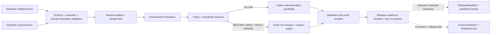

<!-- [KFM_META_BLOCK_V2]
doc_id: kfm://doc/adr-habitat-fauna-thin-slice
title: Habitat × Fauna Thin-Slice Proof Boundary
type: adr
version: v1.0
status: draft
effective_decision_status: proposed
adr_id: unassigned
owners:
  - "NEEDS VERIFICATION — architecture decision owner"
  - "NEEDS VERIFICATION — Habitat domain steward"
  - "NEEDS VERIFICATION — Fauna domain steward"
  - "NEEDS VERIFICATION — evidence, policy, sensitivity, validation, release, correction, rollback, and docs stewards"
reviewers_required:
  - Architecture steward
  - Docs steward
  - Habitat domain steward
  - Fauna domain steward
  - Evidence steward
  - Policy and sensitivity steward
  - Validation steward
  - Release, correction, and rollback steward
created: "NEEDS VERIFICATION — scaffold predates this revision"
updated: 2026-07-24
policy_label: public
truth_posture: cite-or-abstain
responsibility_root: docs/
current_path: docs/adr/ADR-habitat-fauna-thin-slice.md
supersedes: []
superseded_by: null
evidence_snapshot:
  repository: bartytime4life/Kansas-Frontier-Matrix
  base_ref: main
  base_commit: 8df9bd2b723c0d4cf88a32d357ea8c70895f1177
  target_prior_blob: 72d979b91aedfea61793c18668e3b69d8d76c1e2
  adr_readme_blob: f1b5d34a53b6c717832d587de54989ce8192bcaa
  directory_rules_blob: 2affb080e6f0043867c64c7f06c1ca52030fbd55
  habitat_architecture_blob: 82263ea8f5862401e5aef57ec43f49711d12c998
  proof_pipeline_readme_blob: b9432391968c7f06947489ebc5113a52ef6d6855
  dedicated_test_module_blob: d267e4fefa1c08d408ece2c15580696f20ade0c4
  thin_slice_test_readme_blob: 24a30cfe75a8987deb2e239742d069ea18909122
  fixture_readme_blob: c3e46354c0dca886ab4989baf3fc49fd5a3a7297
  join_schema_blob: 5db6f1b09b2ebafbeb788ab177a8a77b8a31ba6b
  relation_guardrail_blob: 0a93e1529b936e0cdcedc56579422a4dbadd1b02
  habitat_workflow_blob: 14b2d933d44f61c2b8294affb5667811e4e133cf
  release_candidate_readme_blob: d5c3990bfdf8563721724d1e885022f28ba3f1df
inspection_boundary: >
  Current-session GitHub reads of the target scaffold, ADR operating contract and index,
  Directory Rules, Habitat architecture, Habitat × Fauna proof-pipeline documentation,
  dedicated test placeholder and test-lane documentation, fixture-lane documentation,
  join-schema scaffold, relation-schema guardrail, Habitat readiness workflow, and
  cross-domain release-candidate review lane. No executable thin-slice test, fixture payload,
  accepted relation contract or schema, live source activation, policy evaluation,
  geoprivacy transform, emitted EvidenceBundle, proof receipt, candidate dossier,
  PromotionDecision, ReleaseManifest, governed API response, map render, deployment,
  release, or publication was exercised.
related:
  - docs/adr/README.md
  - docs/adr/INDEX.md
  - docs/adr/ADR-template.md
  - docs/doctrine/directory-rules.md
  - docs/domains/habitat/ARCHITECTURE.md
  - docs/domains/fauna/ARCHITECTURE.md
  - pipelines/proofs/habitat_fauna_thin_slice/README.md
  - fixtures/domains/habitat/habitat_fauna_thin_slice/README.md
  - tests/domains/habitat/test_habitat_fauna_thin_slice.py
  - tests/domains/habitat/thin-slice.habitat-fauna.test/README.md
  - schemas/contracts/v1/joins/habitat-fauna-join.schema.json
  - schemas/contracts/v1/relations/habitat_fauna/README.md
  - policy/domains/habitat/
  - policy/domains/fauna/
  - data/proofs/habitat/
  - data/receipts/pipeline/
  - release/candidates/habitat/habitat_fauna_thin_slice/README.md
  - .github/workflows/domain-habitat.yml
tags: [kfm, adr, habitat, fauna, thin-slice, cross-domain, proof, evidence-bundle, geoprivacy, public-safe, release-gated, rollback]
notes:
  - "Same-path modernization of an existing unassigned PROPOSED scaffold."
  - "This revision does not assign an ADR number, update the ADR index, accept the decision, implement the proof harness, activate sources, or publish data."
  - "The decision is subordinate to KFM lifecycle, evidence, policy, source-role, public-client, release, correction, and rollback invariants."
  - "Hydrology may remain the proposed repository-wide first proof-bearing lane; this record governs the first bounded Habitat × Fauna cross-domain proof within the ecology lanes."
[/KFM_META_BLOCK_V2] -->

<a id="top"></a>

# ADR — Habitat × Fauna Thin-Slice Proof Boundary

> **Proposed decision.** KFM will treat the Habitat × Fauna thin slice as a deterministic, fixture-first, no-network, cross-domain proof harness. It may demonstrate that a public-safe Fauna reference can be related to Habitat context while preserving domain ownership, source roles, evidence support, policy outcomes, sensitivity controls, correction, and rollback. A passing proof is not Habitat truth, Fauna truth, an `EvidenceBundle`, release approval, or publication authority.

[](#status)
[](#adr-identity-and-index-boundary)
[](#current-repository-evidence)
[](#current-enforcement-maturity)
[](#current-enforcement-maturity)
[](#authority-and-publication-boundary)

> [!IMPORTANT]
> **This is an unassigned, proposed ADR.** The tracked slug-only path is inventoried as a scaffold, not a numbered decision. This same-path, one-file modernization does not claim a permanent ADR ID or modify `docs/adr/INDEX.md`. Acceptance requires a separately scoped numbering/index change and explicit review evidence.

> [!CAUTION]
> **The thin slice is not implemented.** The dedicated Python test is a one-line placeholder, the fixture lane reports no verified payload inventory, the existing join schema has no declared properties and permits arbitrary fields, the relation lane is README-only, and the Habitat workflow intentionally emits validation, proof, and release-dry-run holds.

> [!WARNING]
> **Cross-domain composition must not collapse authority.** Habitat context cannot establish a Fauna occurrence. Fauna evidence cannot become a Habitat object. A relation, fixture, proof receipt, map layer, graph edge, model output, or generated explanation cannot replace either domain's evidence or authorize public exposure.

**Quick navigation:** [Status](#status) · [Evidence](#evidence-boundary) · [Context](#context) · [Decision](#proposed-decision) · [Ownership](#domain-ownership-and-relation-boundary) · [Flow](#thin-slice-proof-flow) · [Sensitivity](#sensitivity-geoprivacy-and-public-safe-projection) · [Placement](#placement-and-authority-boundaries) · [Current evidence](#current-repository-evidence) · [Maturity](#current-enforcement-maturity) · [Convergence](#implementation-and-convergence-plan) · [Acceptance](#acceptance-gates) · [Validation](#validation-matrix) · [Consequences](#consequences) · [Alternatives](#alternatives-considered) · [Risks](#risk-and-open-question-ledger) · [Migration](#migration-and-compatibility) · [Rollback](#rollback-and-supersession) · [References](#references) · [History](#revision-history)

---

<a id="status"></a>

## Status

| Field | Current value |
|---|---|
| **ADR identity** | Unassigned slug-only scaffold; no permanent `ADR-NNNN` claimed |
| **Tracked path** | `docs/adr/ADR-habitat-fauna-thin-slice.md` |
| **Source metadata** | `draft` |
| **Effective decision status** | `proposed` |
| **Decision class** | Cross-domain proof-orchestration, ownership, evidence, sensitivity, and release boundary |
| **Primary responsibility root** | `docs/` — human architecture decision record |
| **Directory Rules trigger** | Local cross-component architecture decision; no canonical root, schema-home, lifecycle-phase, or parallel authority change is accepted here |
| **Affected responsibility roots** | `docs/`, `pipelines/`, `contracts/`, `schemas/`, `policy/`, `fixtures/`, `tests/`, `data/registry/`, `data/receipts/`, `data/proofs/`, `release/`, and governed public clients |
| **Current implementation effect** | Documentation only |
| **Release/publication effect** | None |
| **Migration required now** | No file move; future relation-schema convergence may require a separately reviewed migration |
| **Rollback required** | Yes—documentation rollback now; implementation and release rollback before later adoption |
| **Supersedes / superseded by** | None / none |

<a id="adr-identity-and-index-boundary"></a>

### ADR identity and index boundary

The ADR operating contract requires permanent decisions to use `ADR-NNNN-kebab-case-slug.md`, with filename, H1, status, and canonical index in agreement. It inventories slug-only records separately as unassigned scaffolds.

This revision intentionally preserves the current path because the authorized scope is one existing file. Therefore:

- this record **MUST remain `proposed`**;
- it **MUST NOT be treated as accepted or numbered**;
- it **MUST NOT reserve or fabricate the next ADR number**;
- a later numbering change **MUST** inspect the current index, open pull requests, and active branches, then update this file and `docs/adr/INDEX.md` together;
- ADR-index validation **MUST** pass before a numbered record can merge;
- numbering or acceptance alone **MUST NOT** be interpreted as implementation, proof closure, release, or publication.

---

<a id="evidence-boundary"></a>

## Evidence boundary

### CONFIRMED in the inspected repository snapshot

- The prior target was a 17-line `PROPOSED` scaffold.
- Habitat architecture identifies a fixture-first Habitat × Fauna assignment as the first bounded proof for the Habitat lane and requires a sensitive variant to fail closed.
- `pipelines/proofs/habitat_fauna_thin_slice/README.md` defines a cross-domain proof-harness boundary and explicitly states that it is not an executable producer, `EvidenceBundle` store, release decision, or publication path.
- `tests/domains/habitat/test_habitat_fauna_thin_slice.py` contains only a one-line proposed placeholder and no executable test.
- The dedicated test-lane README defines deterministic no-network expectations but does not prove executable modules, CI coverage, or passing results.
- The fixture-lane README reports no verified payload files and states that tests and validators were not run.
- `schemas/contracts/v1/joins/habitat-fauna-join.schema.json` is a permissive proposed scaffold with empty `properties`, `additionalProperties: true`, and no paired contract reference.
- `schemas/contracts/v1/relations/habitat_fauna/README.md` is a relation-placement guardrail; no relation schema files were established directly under that lane.
- `.github/workflows/domain-habitat.yml` is a read-only maturity workflow that intentionally emits `WORKFLOW_HOLD` for validation, proof production, and release dry run until accepted implementations exist.
- The release-candidate review lane reports no child candidate dossier, emitted proof inventory, accepted relation schema, `EvidenceBundle`, `PromotionDecision`, `ReleaseManifest`, or public Habitat × Fauna artifact.

### PROPOSED by this ADR

- The normative scope and anti-collapse rules for the Habitat × Fauna proof.
- The ownership-preserving relation boundary between Habitat-owned context and Fauna-owned evidence.
- The minimum deterministic fixture packet, finite outcomes, sensitivity behavior, proof outputs, and release blockers.
- A staged convergence plan across contracts, schemas, fixtures, tests, policy, receipts, proofs, release review, correction, rollback, and public-client checks.
- Retention of `pipelines/proofs/habitat_fauna_thin_slice/` as the proposed neutral orchestration lane if this decision is later accepted.

### UNKNOWN

- Whether any real Habitat × Fauna relation records exist in lifecycle stores under a different name or restricted system.
- Whether any current source descriptor has accepted rights, citation, sensitivity, temporal, precision, and redistribution posture for live cross-domain use.
- Whether an executable proof runner, fixture payload, validator, policy rule, or test exists outside the inspected and indexed surfaces.
- Whether any governed API, Evidence Drawer, MapLibre layer, Focus Mode response, export, or release manifest currently consumes Habitat × Fauna output.
- Whether any human steward or reviewer has accepted this decision.

### NEEDS VERIFICATION before acceptance

- Assign a permanent ADR number and update the canonical index in the same reviewed change.
- Confirm accountable owners and required reviewers through repository governance evidence.
- Resolve the canonical neutral relation contract/schema lane without maintaining both `joins/` and `relations/` as competing authorities.
- Define field-level schemas, semantic contracts, reason codes, identity grammar, and temporal obligations.
- Add synthetic, deterministic, no-network fixtures for positive, denied, abstained, held, stale, ambiguous, and invalid paths.
- Implement executable validators and tests, then wire CI without converting a green hold into a false proof claim.
- Verify source descriptors, rights, sensitivity, geoprivacy, review, and public-safe transform rules for every source family used by a later live slice.
- Demonstrate `EvidenceRef` to `EvidenceBundle` resolution, proof/receipt separation, release blockers, correction, withdrawal, and rollback.
- Verify public API, MapLibre, Evidence Drawer, export, graph, and AI consumers through governed interfaces only.

### Out of scope

This ADR does not:

- make Habitat × Fauna the repository-wide first proof-bearing lane or supersede the proposed hydrology-first decision;
- establish a live source connector, occurrence record, habitat model, regulatory critical-habitat determination, conservation status, management instruction, or emergency decision;
- define the final JSON Schema, Rego policy, executable proof runner, fixture payload set, API route, UI component, or tile format;
- resolve the repo-wide schema-home rule or silently choose between the existing `joins/` and `relations/` relation families;
- activate a source, ingest data, approve evidence, run a geoprivacy transform, approve a candidate, create a release, or publish an artifact;
- accept itself, assign itself a permanent number, update the ADR index, merge, deploy, release, or publish anything.

---

<a id="context"></a>

## Context

KFM needs proof-bearing slices that demonstrate governance behavior with small, reviewable inputs before broad source activation or public feature expansion. Habitat × Fauna is valuable because it forces the system to cross a domain boundary where semantic and sensitivity mistakes are easy to make:

- Habitat owns patches, land-cover context, ecological systems, suitability surfaces, corridors, restoration context, stewardship context, model receipts, and uncertainty.
- Fauna owns taxon identity, occurrence evidence, range evidence, conservation status, animal-event observations, sensitive sites, and fauna-specific geoprivacy posture.
- A public view may need to say that a Fauna reference was related to Habitat context, but that relation must not transfer ownership or inflate either input into a stronger claim.

Without an explicit decision, several unsafe shortcuts become plausible:

```text
Habitat patch -> species presence
Fauna occurrence -> Habitat canonical object
suitability model -> observed occurrence
proof pass -> release approval
fixture result -> live-data truth
relation schema validation -> evidence closure
redaction flag -> public-safe geometry
map layer -> publication authority
AI summary -> cited claim
```

The current repository has extensive documentation surfaces but intentionally holds execution. That makes the next safe step a decision that defines the proof boundary and graduation conditions—not a claim that the proof already works.

### Decision drivers

1. Preserve Habitat and Fauna bounded contexts and ubiquitous language.
2. Prove cite-or-abstain across a cross-domain relation.
3. Exercise public-safe sensitivity behavior without using real restricted occurrence data.
4. Keep tests, receipts, proofs, evidence, release decisions, and public artifacts distinct.
5. Prevent green readiness workflows from being mistaken for executed proof.
6. Keep public clients behind governed APIs and released artifacts.
7. Make correction, withdrawal, and rollback part of the proof design.
8. Prefer a small, deterministic, reversible fixture slice before live connectors or broad UI work.

---

<a id="proposed-decision"></a>

## Proposed decision

If later accepted, KFM will adopt the following rules for the Habitat × Fauna thin slice.

### 1. The slice is a proof harness, not a domain or product

The thin slice exists to demonstrate a bounded cross-domain flow. It is not a new ecology domain, source authority, evidence authority, release authority, or public product family.

The proof **MUST** be deterministic, fixture-first, no-network by default, and runnable without live credentials or source downloads.

### 2. The minimum positive scenario is intentionally narrow

The first positive fixture packet **MUST** contain, at minimum:

1. one synthetic public-safe Fauna reference with stable identity, source role, temporal scope, and toy `EvidenceRef`;
2. one synthetic Habitat patch or context reference with stable identity, source role, temporal scope, and toy `EvidenceRef`;
3. one neutral relation/assignment record that links references without copying domain-owned truth;
4. one resolved toy `EvidenceBundle` or deterministic resolver stub with explicit limitations;
5. one `PolicyDecision` or policy stub that returns a finite allowed outcome for the public-safe case;
6. one expected public-safe projection or finite `ANSWER` envelope;
7. one proof/validation receipt packet that remains separate from evidence and release objects;
8. one correction and rollback readiness record or deterministic expected blocker.

### 3. Negative and ambiguous paths are first-class

The fixture set **MUST** include cases that produce validation failure, `ABSTAIN`, `DENY`, `HOLD`, `ERROR`, or `SOURCE_STALE` as appropriate. At least one synthetic sensitive-occurrence variant **MUST fail closed** when a required transform, review, or policy decision is missing.

### 4. Proof success has a bounded meaning

A passing proof means only that the scoped implementation behaved as expected against the admitted fixtures. It does **not** mean:

- live Habitat or Fauna sources are admitted;
- the relation is factually true outside the fixtures;
- an `EvidenceBundle` is closed for live data;
- policy, rights, geoprivacy, or review is complete for a real source;
- a candidate is approved;
- a layer, API response, export, graph, or AI answer is released or public-safe;
- Habitat or Fauna implementation is complete.

### 5. Publication remains a separate governed transition

The proof harness may emit validation results, receipts, proof summaries, and release blockers to their accepted homes. It **MUST NOT** write directly to `data/published/`, create a `PUBLISHED` state, approve a `ReleaseManifest`, or make a public route available.

Any later release requires separate evidence, policy, independent review where material, promotion, correction, withdrawal, rollback, and cache-invalidation closure.

---

<a id="domain-ownership-and-relation-boundary"></a>

## Domain ownership and relation boundary

| Surface | Owns | Must not own or imply |
|---|---|---|
| **Habitat lane** | Habitat patch/class, land-cover/ecological-system context, suitability/corridor/restoration context, model receipts, uncertainty | Taxon identity, occurrence truth, conservation status, sensitive Fauna location, regulatory authority |
| **Fauna lane** | Taxon, occurrence/range evidence, animal-event observations, status, sensitive-site context, Fauna geoprivacy | Habitat patch truth, habitat-model authority, restoration approval, release state |
| **Neutral relation record** | Stable references, relation type, method, spatial/temporal scope, evidence refs, policy/review/release references, transform lineage | Copies of canonical Habitat/Fauna fields, stronger truth than inputs, source authority, evidence authority, policy authority, release authority |
| **Proof harness** | Deterministic orchestration and checks | Domain processing ownership, source fetching, schema authority, policy decisions, evidence storage, catalog truth, release decisions, public serving |
| **Public-safe projection** | Released derivative fields explicitly allowed by policy and manifest | Exact restricted geometry, hidden source attributes, canonical internal records, unreleased model or candidate state |

### Required anti-collapse invariants

- The relation **MUST reference**, not duplicate, domain-owned objects.
- Habitat context **MUST NOT** be interpreted as evidence that a Fauna taxon is present.
- A Fauna occurrence **MUST NOT** be rewritten as a Habitat observation.
- Modeled suitability **MUST remain labeled as modeled** and must not become observed occurrence or regulatory critical habitat.
- The most restrictive applicable rights, sensitivity, review, and release posture **MUST win** for a cross-domain derivative.
- Graph/triplet projections **MUST remain derivative** and resolve to the same evidence and policy packet as other public carriers.
- A generated explanation **MUST** use a finite response envelope and citation validation; otherwise it must abstain or deny.

---

<a id="thin-slice-proof-flow"></a>

## Thin-slice proof flow



### Required stage distinctions

```text
fixture input
  != RAW source capture
validation report
  != EvidenceBundle
proof receipt
  != proof of live truth
proof pass
  != PromotionDecision
candidate dossier
  != ReleaseManifest
released carrier
  != canonical evidence
```

### Minimum proof outputs

| Output | Responsibility home | Required boundary |
|---|---|---|
| Test result | `tests/` runner output / CI artifact | Enforceability evidence only |
| Run/transform receipt | Accepted `data/receipts/` family | Process memory, not truth |
| Proof summary or proof object | Accepted `data/proofs/` family | Scoped proof, not release approval |
| Evidence support | Accepted `EvidenceRef` / `EvidenceBundle` homes | Root support for claims |
| Policy decision | `policy/` evaluation output / accepted decision record | Admissibility and obligations |
| Candidate dossier | `release/candidates/` | Review packet, not a release |
| Promotion/release record | `release/` | Separate governed transition |
| Public carrier | `data/published/` or governed serving surface | Released derivative only |

---

<a id="sensitivity-geoprivacy-and-public-safe-projection"></a>

## Sensitivity, geoprivacy, and public-safe projection

Cross-domain joins can expose sensitive Fauna information even when the Fauna record itself is not displayed. A Habitat patch, corridor, stewardship zone, model cell, or small polygon can make a restricted occurrence inferable by intersection.

Therefore:

- synthetic fixtures **MUST NOT** contain real restricted coordinates, rare-species records, nest/den/roost/hibernacula/spawning locations, credentials, private source exports, or steward-only attributes;
- exact or high-risk Fauna geometry **MUST remain in its owning restricted lifecycle and access boundary**;
- sensitivity transforms **MUST occur before rendering or public API delivery**, not through client-only hiding or styling;
- a public-safe derivative **MUST** carry transform method/version, source refs, input/output precision or generalization description, reason codes, reviewer requirement, receipt reference, and correction lineage where applicable;
- missing rights, sensitivity, review, transform, evidence, or release state **MUST** produce `DENY`, `HOLD`, or `ABSTAIN`, never permissive fallback;
- the public representation **MUST be evaluated for inferential disclosure**, including whether Habitat geometry narrows a sensitive Fauna location;
- exports, screenshots, popups, query results, Focus Mode answers, and graph views **MUST** obey the same public-safe decision as the map layer.

A public-safe projection is a derivative. It never replaces the exact steward record, source record, or canonical domain object.

---

<a id="placement-and-authority-boundaries"></a>

## Placement and authority boundaries

Directory Rules assign paths by responsibility, not topic. This ADR records architecture rationale under `docs/adr/`; it does not absorb the implementation or artifact families it governs.

| Responsibility | Proposed or existing home | This ADR's rule |
|---|---|---|
| Architecture decision | `docs/adr/ADR-habitat-fauna-thin-slice.md` | This file; proposed and unassigned |
| Habitat doctrine | `docs/domains/habitat/` | Owns Habitat semantics and boundaries |
| Fauna doctrine | `docs/domains/fauna/` | Owns Fauna semantics and boundaries |
| Cross-domain proof orchestration | `pipelines/proofs/habitat_fauna_thin_slice/` | Proposed neutral implementation lane if accepted |
| Domain processing | `pipelines/domains/habitat/` and `pipelines/domains/fauna/` | Must remain separately owned |
| Semantic contracts | `contracts/` in accepted domain/relation families | Meaning only; no machine shape |
| Machine schemas | `schemas/contracts/v1/` in one accepted relation family | Exact `joins/` versus `relations/` path remains unresolved; no parallel authority |
| Synthetic fixtures | Existing admitted fixture lanes | Current Habitat child lane may remain during convergence; placement does not transfer authority |
| Enforceability proof | `tests/` | Deterministic no-network tests |
| Policy and geoprivacy | `policy/` | Allow/deny/restrict/abstain and obligations |
| Source identity and rights | `data/registry/sources/habitat/` and `data/registry/sources/fauna/` or accepted registry homes | Domain-owned source descriptors |
| Receipts | Accepted `data/receipts/` family | Process memory only |
| Proof objects | Accepted `data/proofs/` family | Proof only; not release decision |
| Candidate review | `release/candidates/` | Dossiers and blockers only |
| Promotion, correction, rollback | `release/` | Separate reviewed state transitions |
| Published derivatives | `data/published/` and governed delivery | Released carriers only |

### Relation-schema convergence hold

The repository currently exposes both:

- `schemas/contracts/v1/joins/habitat-fauna-join.schema.json`, a permissive scaffold; and
- `schemas/contracts/v1/relations/habitat_fauna/README.md`, a README-only guardrail.

This ADR **does not declare both canonical**. Before executable implementation:

1. one semantic relation contract and one machine-schema family **MUST** be selected through accepted authority;
2. the losing or legacy surface **MUST** be migrated, profiled as compatibility, or explicitly retired;
3. inbound links, fixtures, validators, registry entries, and generated artifacts **MUST** be updated together;
4. no new duplicate schema should be added while the conflict is unresolved.

---

<a id="authority-and-publication-boundary"></a>

## Authority and publication boundary

This ADR can define a proposed architectural rule. It cannot:

- accept itself;
- implement the proof;
- decide source rights or sensitivity for real records;
- create an `EvidenceBundle`;
- approve a `PolicyDecision`;
- approve or sign a candidate;
- create a `PromotionDecision` or `ReleaseManifest`;
- authorize public API, map, graph, export, or AI exposure;
- substitute GitHub review routing for domain, sensitivity, evidence, or release review.

Publication remains downstream of the full lifecycle:

```text
RAW -> WORK / QUARANTINE -> PROCESSED -> CATALOG / TRIPLET -> PUBLISHED
```

Promotion is a governed state transition, not a file move, fixture pass, workflow pass, proof receipt, branch merge, or map render.

---

<a id="current-repository-evidence"></a>

## Current repository evidence

| Surface | Confirmed repository state | Meaning |
|---|---|---|
| Target ADR | 17-line proposed scaffold before this revision | No prior authoritative decision text |
| Habitat architecture | Defines the bounded DOM-HF proof and fail-closed sensitive variant | Doctrine/proposal, not execution proof |
| Proof orchestration lane | Detailed README; explicitly no accepted producer | Boundary documented; implementation held |
| Dedicated Python test | One-line proposed placeholder | No executable thin-slice test |
| Test-lane README | Deterministic no-network test contract | Suggested tests only; no pass rate |
| Fixture lane | README present; no payload inventory verified | Fixture design documented; inputs absent/unverified |
| Join schema | Empty properties, arbitrary additional properties, no contract link | Not sufficient for safety or interoperability |
| Relation schema lane | README-only guardrail; no direct relation schema established | Canonical relation family unresolved |
| Habitat workflow | Read-only readiness checks with explicit holds | Green hold is not proof, evidence, or release |
| Release-candidate lane | Review-lane README; no child candidate dossier established | No active candidate or release |
| Proof/evidence/release artifacts | No accepted thin-slice inventory established | Maturity remains unverified |
| Human acceptance | No `ReviewRecord` or accepted ADR status established | Decision remains proposed |

> [!IMPORTANT]
> **The safe present-tense conclusion is documentation readiness with explicit holds.** The repository does not currently prove that the Habitat × Fauna thin slice executes, produces evidence or proof receipts, passes sensitivity review, creates a candidate, or reaches public delivery.

---

<a id="current-enforcement-maturity"></a>

## Current enforcement maturity

| Capability | Current status | Graduation evidence required |
|---|---|---|
| ADR decision | Proposed, unassigned | Numbered/indexed record plus explicit review |
| Neutral relation semantics | Unresolved | Paired semantic contract and accepted ownership rules |
| Relation machine shape | Permissive/README-only competing surfaces | Required fields, closed semantics, registry entry, schema tests, migration disposition |
| Synthetic fixtures | README-only; no payload inventory verified | Versioned valid/invalid/denied/abstained/stale fixtures |
| Executable tests | Dedicated module is placeholder | Deterministic test functions and negative-path coverage |
| Proof runner | README-only contract | Accepted command, pinned inputs, no-network execution, receipts |
| Evidence resolver | Not established for this slice | Deterministic `EvidenceRef` resolution and citation checks |
| Policy/geoprivacy | Not established for this slice | Executable rules, reason codes, obligations, transforms, negative fixtures |
| CI | Explicit readiness holds | Accepted commands with preserved hold/fail semantics and workflow evidence |
| Candidate dossier | None established | Immutable candidate identity and complete review packet |
| Release/correction/rollback | None established | Promotion decision, manifest, correction, withdrawal, rollback, cache invalidation |
| Public API/map/AI | Not established | Governed-interface integration and trust-membrane tests |

---

<a id="implementation-and-convergence-plan"></a>

## Implementation and convergence plan

Acceptance of this ADR would authorize the direction, not skip the stages below.

### Stage 0 — Decision identity and authority

- assign a unique ADR number and update `docs/adr/INDEX.md` in the same reviewed change;
- confirm owners and required reviewers;
- record any schema-family conflict in the drift register if not already tracked;
- preserve the target as `proposed` until explicit review accepts it.

### Stage 1 — Relation semantics and machine shape

- define one neutral Habitat × Fauna relation contract;
- choose one canonical schema family and resolve `joins/` versus `relations/` without parallel authority;
- require stable relation ID, Habitat ref, Fauna ref, relation type, method, source/evidence refs, spatial scope, temporal scope, model/observation character, rights/sensitivity, review state, policy ref, transform lineage, release state, correction lineage, and spec hash where material;
- reject copied domain-owned canonical fields unless explicitly defined as a public projection.

### Stage 2 — Synthetic fixture packet

Create compact, reviewable fixture pairs for:

- valid public-safe relation;
- missing Habitat owner/ref;
- missing Fauna owner/ref;
- missing source role;
- missing or unresolved evidence;
- modeled suitability presented as occurrence;
- restricted/sensitive Fauna input without transform;
- over-precise or inferentially revealing public geometry;
- stale source/evidence;
- public client attempting to use internal lifecycle refs;
- proof pass misused as release approval;
- missing correction, withdrawal, or rollback posture.

### Stage 3 — Validators and executable tests

- implement schema, semantic, domain-boundary, source-role, evidence, temporal, sensitivity, trust-membrane, and release-blocker checks;
- add executable tests under the accepted test lane;
- keep the default suite no-network and deterministic;
- require positive and negative paths; a missing gate fails closed;
- ensure the workflow distinguishes `HOLD` from `PASS` and never promotes readiness by implication.

### Stage 4 — Proof runner and receipts

- implement the neutral proof orchestrator under the accepted pipeline path;
- pin fixture IDs, schema/contract versions, policy versions, tool versions, and input hashes;
- emit run/transform/validation/proof records to accepted homes;
- verify that receipts and proof objects remain distinct from evidence and release decisions;
- produce a machine-readable proof summary and human review summary.

### Stage 5 — Evidence, policy, and public-safe projection

- resolve toy `EvidenceRef` objects deterministically;
- exercise finite policy outcomes and reason codes;
- demonstrate a public-safe derivative and a denied sensitive variant;
- test inferential disclosure across Habitat geometry;
- require the same decision for API, map, export, graph, and AI carriers.

### Stage 6 — Candidate dry run, correction, and rollback

- create a synthetic candidate dossier only after prior stages pass;
- run release-readiness checks without publishing;
- prove correction, withdrawal, supersession, rollback, and cache invalidation paths;
- keep independent review separate from authorship when sensitivity or materiality warrants it.

### Stage 7 — Optional live-source pilot

A live pilot is a later decision. It requires verified source descriptors, rights, terms, cadence, sensitivity, precision, attribution, rate limits, steward contacts, source-version pinning, and public-safe transformation. Failure at any gate returns quarantine, hold, denial, or abstention.

---

<a id="acceptance-gates"></a>

## Acceptance gates

This ADR should not transition to `accepted` until the decision review confirms the direction and the repository can state a credible implementation path. Runtime graduation remains separate.

| Gate | Acceptance requirement | Current status |
|---|---|---|
| **A — Identity** | Permanent ADR number, matching H1/filename/index, no collision | OPEN |
| **B — Ownership** | Habitat, Fauna, neutral relation, proof, evidence, policy, and release responsibilities agreed | PROPOSED |
| **C — Schema convergence** | One canonical relation contract/schema family; no `joins/`/`relations/` parallel authority | OPEN / CONFLICTED |
| **D — Fixture contract** | Required positive and fail-closed scenarios agreed | PROPOSED |
| **E — Sensitivity posture** | Geoprivacy, inferential disclosure, public-safe transform, and reviewer rules agreed | PROPOSED |
| **F — Evidence/proof separation** | `EvidenceBundle`, receipts, proofs, candidates, and release objects remain distinct | PROPOSED |
| **G — Trust membrane** | Public-client and AI boundaries agreed; no internal-store access | PROPOSED |
| **H — Correction/rollback** | Correction, withdrawal, rollback, stale-state, and cache-invalidation obligations agreed | PROPOSED |
| **I — Review** | Required human reviewers explicitly approve the decision | OPEN |

### Runtime definition of done after acceptance

- [ ] Accepted relation contract and schema exist in one canonical family.
- [ ] Valid, invalid, denied, abstained, held, stale, and ambiguous fixtures exist.
- [ ] Executable no-network tests collect and pass.
- [ ] Sensitive variant demonstrably fails closed.
- [ ] Public-safe projection carries transform and evidence lineage.
- [ ] Proof runner emits deterministic receipts and scoped proof output.
- [ ] `EvidenceRef` resolves to a bounded `EvidenceBundle` or returns a finite non-answer.
- [ ] Policy outcomes and reason codes are machine-tested.
- [ ] Proof success cannot create release state.
- [ ] Candidate dry run produces blockers or a complete review packet without publishing.
- [ ] Correction, withdrawal, rollback, and cache invalidation are exercised.
- [ ] Governed API, MapLibre, Evidence Drawer, export, graph, and AI tests consume only allowed released or fixture-scoped surfaces.

---

<a id="validation-matrix"></a>

## Validation matrix

| Scenario | Expected result | Required assertion |
|---|---|---|
| Public-safe Fauna ref related to Habitat patch with resolved toy evidence | `ANSWER` / allowed fixture result | Ownership and source roles preserved |
| Habitat context used to assert Fauna presence | Validation failure or `ABSTAIN` | Habitat is context, not occurrence authority |
| Fauna occurrence copied into a Habitat canonical object | Validation failure | Domain ownership not transferred |
| Suitability model treated as observed occurrence or critical habitat | Validation failure / `DENY` | Knowledge character remains visible |
| Missing `EvidenceRef` or unresolved bundle | `ABSTAIN` / `HOLD` | Cite-or-abstain enforced |
| Sensitive Fauna input with no transform/review | `DENY` / `HOLD` | Fail closed |
| Public geometry enables inferential disclosure | `DENY` or stronger generalization obligation | Public-safe projection evaluated spatially |
| Public client points to RAW, WORK, QUARANTINE, or restricted ref | Validation failure / `DENY` | Trust membrane enforced |
| Source/evidence is stale beyond accepted policy | `SOURCE_STALE`, `ABSTAIN`, or `HOLD` | Temporal support visible |
| Proof receipt is supplied as `EvidenceBundle` | Validation failure | Proof/evidence separation enforced |
| Test/proof passes but release objects are missing | Release blocker | Proof pass is not promotion |
| Correction or rollback target is absent | Release blocker | Reversibility required |
| AI summary lacks citation validation | `ABSTAIN` / validation failure | Generated language subordinate to evidence |

---

<a id="consequences"></a>

## Consequences

### Positive

- Creates a clear cross-domain proof boundary without inventing a new ecology authority root.
- Preserves Habitat and Fauna bounded contexts and makes relation neutrality testable.
- Converts documentation-heavy readiness into a staged path toward executable proof.
- Makes sensitive and inferential disclosure failures first-class fixtures.
- Prevents receipts, proofs, schemas, candidates, map layers, and AI answers from collapsing into truth or release authority.
- Provides a reusable pattern for other cross-domain proof slices.
- Keeps live-source activation and public release outside the first implementation increment.

### Costs and tradeoffs

- Requires coordination across multiple stewards and responsibility roots.
- Adds deliberate schema/relation convergence work before implementation.
- Expands the test burden beyond a simple spatial join.
- May delay a visible map feature while evidence, sensitivity, correction, and rollback controls are built.
- Requires synthetic fixtures that model failure realistically without introducing real sensitive data.
- Preserves workflow holds until a genuinely accepted implementation exists.

### Neutral constraints

- Hydrology can remain the proposed repository-wide first proof-bearing lane.
- Existing Habitat/Fauna documentation remains lineage and guidance, not implementation proof.
- Existing fixture and release-candidate paths may remain during convergence, but placement alone grants no authority.

---

<a id="alternatives-considered"></a>

## Alternatives considered

### Alternative A — Implement a broad live Habitat/Fauna integration first

**Rejected for this decision.** Live source rights, sensitivity, cadence, schema, policy, and public-safe transformation are not sufficiently established. A broad rollout would multiply uncertainty before the trust path is proven.

### Alternative B — Put the proof entirely under Habitat

**Rejected.** Habitat does not own Fauna occurrence or taxon truth. A Habitat-owned proof implementation could imply authority transfer and obscure cross-domain review.

### Alternative C — Put the proof entirely under Fauna

**Rejected.** Fauna does not own Habitat patch, suitability, corridor, or restoration context. The same ownership collapse would occur in the other direction.

### Alternative D — Treat the join schema as the complete decision

**Rejected.** Machine shape cannot decide domain meaning, evidence sufficiency, sensitivity, policy, review, release, correction, or rollback. The current schema is also field-incomplete and permissive.

### Alternative E — Use map rendering as the proof

**Rejected.** A visible layer proves only that a renderer displayed a carrier. It does not prove evidence closure, geoprivacy, source roles, release state, or correction/rollback readiness.

### Alternative F — Consider green readiness holds as successful execution

**Rejected.** The workflow explicitly states that validation, proof, and release commands are not established. A green hold is accurate readiness evidence, not an executed thin-slice proof.

### Alternative G — Defer all ADR work until code exists

**Rejected.** The repository already contains competing relation/schema surfaces and multiple planned consumers. A bounded decision is needed to prevent further authority drift before code lands.

---

<a id="risk-and-open-question-ledger"></a>

## Risk and open-question ledger

| Risk or question | Status | Required follow-up |
|---|---|---|
| Permanent ADR number and ownership are unassigned | NEEDS VERIFICATION | Number/index/review PR |
| `joins/` versus `relations/` schema family conflict | CONFLICTED | Select one authority and migrate/profile the other |
| Existing fixture lane is nested under Habitat despite cross-domain scope | NEEDS VERIFICATION | Confirm compatibility or migration without creating a parallel fixture home |
| Current release review lane is nested under Habitat | NEEDS VERIFICATION | Confirm that only Habitat-owned derivative candidates live there and Fauna ownership remains external |
| No fixture payload inventory | CONFIRMED gap | Create deterministic synthetic packet |
| No executable dedicated test | CONFIRMED gap | Implement tests and wire accepted command |
| No accepted proof producer | CONFIRMED hold | Implement runner only after contracts and fixtures |
| Policy and geoprivacy behavior not demonstrated | NEEDS VERIFICATION | Executable rules, transforms, reason codes, tests |
| Inferential disclosure through Habitat geometry | OPEN risk | Add spatial disclosure validator and review obligation |
| Live source rights/cadence/precision unknown | UNKNOWN | SourceDescriptor and rights review before live pilot |
| EvidenceBundle, receipt, proof, and release identities may drift | OPEN risk | Adopt deterministic identity and cross-object validators |
| Generated UI/AI language may overstate relation meaning | OPEN risk | Finite envelopes, citation validation, negative tests |
| Workflow graduation could erase explicit hold semantics | OPEN risk | Require deliberate workflow replacement and regression tests |
| Public caches could retain withdrawn derivatives | OPEN risk | Cache invalidation and rollback drill |

---

<a id="migration-and-compatibility"></a>

## Migration and compatibility

This documentation-only revision preserves the existing path and inbound links.

Future implementation should use the smallest reversible convergence:

1. **Inventory** all Habitat × Fauna contracts, schemas, fixtures, tests, proof code, receipts, proofs, candidate lanes, and consumers.
2. **Select** one canonical relation contract/schema family through accepted authority.
3. **Classify** the non-selected relation surface as compatibility, migration source, or retirement candidate.
4. **Migrate** references with history-preserving moves or adapters; do not duplicate authoritative schemas.
5. **Preserve** stable object IDs and emit migration/transform receipts where records change shape.
6. **Update** docs, indexes, fixtures, validators, CI, candidate templates, and consumers in the same bounded migration packet.
7. **Retain** old paths only when compatibility is necessary and clearly declared.
8. **Verify** that no public client, graph, export, or AI surface reads the deprecated path as authority.

A relation-schema migration is not a data release. Any existing record migration must stay within the governed lifecycle and retain correction/rollback lineage.

---

<a id="rollback-and-supersession"></a>

## Rollback and supersession

### Documentation rollback

This revision can be rolled back by restoring blob `72d979b91aedfea61793c18668e3b69d8d76c1e2`. Rollback would restore the prior scaffold but would also remove the explicit ownership, sensitivity, proof, acceptance, and convergence guidance added here.

### Implementation rollback

A future implementation **MUST** define rollback before graduation:

- disable or remove the proof runner without deleting receipts;
- restore prior schema/contract versions and compatibility adapters;
- quarantine invalid outputs;
- withdraw candidate dossiers and public derivatives;
- invalidate caches, tiles, indexes, and generated summaries;
- preserve `CorrectionNotice`, withdrawal, and rollback records;
- ensure rollback never restores exact sensitive geometry to public surfaces.

### Supersession

If this decision is accepted and later materially changed, create a successor ADR. Do not rewrite accepted history. Mark this record `superseded`, add a forward link, and require the successor to link back.

---

<a id="references"></a>

## References

### ADR and doctrine

- [`README.md`](README.md) — ADR operating contract.
- [`INDEX.md`](INDEX.md) — canonical ADR inventory.
- [`ADR-template.md`](ADR-template.md) — authoring template.
- [Directory Rules](../doctrine/directory-rules.md) — responsibility-root placement and lifecycle boundaries.

### Domain and proof guidance

- [Habitat architecture](../domains/habitat/ARCHITECTURE.md).
- [Fauna architecture](../domains/fauna/ARCHITECTURE.md).
- [Habitat × Fauna proof-pipeline README](../../pipelines/proofs/habitat_fauna_thin_slice/README.md).
- [Habitat × Fauna fixture README](../../fixtures/domains/habitat/habitat_fauna_thin_slice/README.md).
- [Dedicated thin-slice test placeholder](../../tests/domains/habitat/test_habitat_fauna_thin_slice.py).
- [Thin-slice test-lane README](../../tests/domains/habitat/thin-slice.habitat-fauna.test/README.md).

### Schema, workflow, and release evidence

- [Habitat/Fauna join schema scaffold](../../schemas/contracts/v1/joins/habitat-fauna-join.schema.json).
- [Habitat/Fauna relation-schema guardrail](../../schemas/contracts/v1/relations/habitat_fauna/README.md).
- [Habitat readiness workflow](../../.github/workflows/domain-habitat.yml).
- [Habitat × Fauna release-candidate review lane](../../release/candidates/habitat/habitat_fauna_thin_slice/README.md).

---

<a id="revision-history"></a>

## Revision history

| Date | Version | Change | Decision effect |
|---|---|---|---|
| NEEDS VERIFICATION | Scaffold | Created from a planned-path inventory with generic responsibility-root guidance | None; unassigned proposed scaffold |
| 2026-07-24 | v1.0 | Replaced scaffold with repository-grounded proposed decision, current maturity boundary, ownership rules, proof flow, sensitivity posture, convergence stages, acceptance gates, validation matrix, migration, and rollback | Documentation only; remains unassigned and proposed |

---

<sub>**Decision:** proposed · **ADR ID:** unassigned · **Path:** `docs/adr/ADR-habitat-fauna-thin-slice.md` · **Evidence snapshot:** `main@8df9bd2b723c0d4cf88a32d357ea8c70895f1177` · **Publication effect:** none · [Back to top](#top)</sub>
