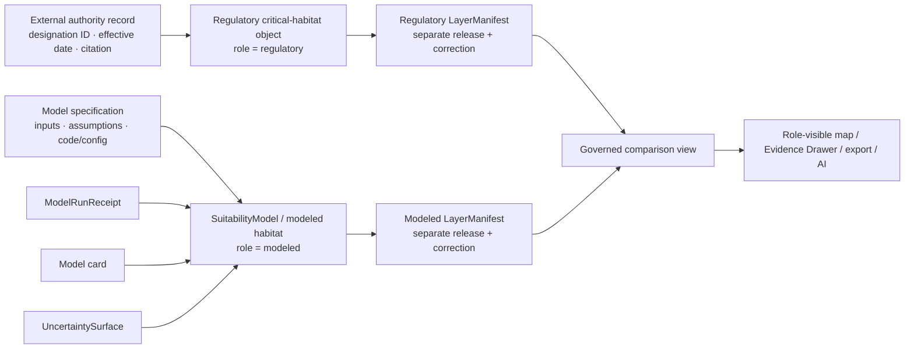

<!-- [KFM_META_BLOCK_V2]
doc_id: kfm://doc/adr-habitat-modeled-vs-critical
title: Habitat Modeled Habitat vs Regulatory Critical Habitat
type: adr
version: v1.0
status: draft
effective_decision_status: proposed
adr_id: unassigned
owners:
  - "NEEDS VERIFICATION — architecture decision owner"
  - "NEEDS VERIFICATION — Habitat domain steward"
  - "NEEDS VERIFICATION — source governance steward"
  - "NEEDS VERIFICATION — model, policy, evidence, release, validation, and docs stewards"
reviewers_required:
  - Architecture steward
  - Docs steward
  - Habitat domain steward
  - Source governance steward
  - Model and uncertainty steward
  - Policy and sensitivity steward
  - Evidence steward
  - Release, correction, and rollback steward
  - Validation steward
created: "NEEDS VERIFICATION — scaffold predates this revision"
updated: 2026-07-24
policy_label: public
truth_posture: cite-or-abstain
responsibility_root: docs/
current_path: docs/adr/ADR-habitat-modeled-vs-critical.md
supersedes: []
superseded_by: null
evidence_snapshot:
  repository: bartytime4life/Kansas-Frontier-Matrix
  base_ref: main
  base_commit: 8df9bd2b723c0d4cf88a32d357ea8c70895f1177
  target_prior_blob: 5c58c35572ec2e058bd63c17513905cb28d2515c
  adr_readme_blob: f1b5d34a53b6c717832d587de54989ce8192bcaa
  adr_index_blob: cf08fae322ac53426f7394d97897fdb942253049
  directory_rules_blob: 2affb080e6f0043867c64c7f06c1ca52030fbd55
  habitat_architecture_blob: 82263ea8f5862401e5aef57ec43f49711d12c998
  habitat_model_vs_observation_blob: 5e4bd431b97608a90df0b93a66b8d978c04e674b
  habitat_source_roles_adr_blob: ed836f8440051eb7bdca675e4cb4eca1e645171e
  suitability_model_contract_blob: 837ddaa382b9e066c68acb5d4d7ecdb2dced99b5
  suitability_model_schema_blob: eae24fe7004261827aca2ba9adda47a4ff615a69
  critical_habitat_policy_blob: d8ed9680e0c47146aa11995cb499b3cea8e49f90
  model_card_policy_blob: 1843b09a5c3a144e647e1496b9056102600b5462
  source_role_policy_blob: b91935af6b998d497c6048525ee18ab6047e5a0e
  critical_habitat_validator_blob: 868b21ff84cff7bb6205ae88f9f448598007ce70
  suitability_model_tests_readme_blob: 202b67b9cc701e7ed7cefaff3c191a4634361228
inspection_boundary: >
  Current-session GitHub reads of the target scaffold, ADR operating rules and index,
  Directory Rules, Habitat architecture, Habitat model-vs-observation doctrine, the adjacent
  Habitat source-role ADR, SuitabilityModel semantic contract and schema, Habitat source-role
  and model/critical-habitat policy scaffolds, critical-habitat validator placeholder, and
  SuitabilityModel test-lane documentation. No admitted regulatory SourceDescriptor, model run,
  model card, uncertainty artifact, executable policy decision, validator execution, fixture
  payload, EvidenceBundle, LayerManifest, ReleaseManifest, correction, rollback, governed API
  response, map render, deployment, or production publication was exercised.
related:
  - docs/adr/README.md
  - docs/adr/INDEX.md
  - docs/adr/ADR-template.md
  - docs/adr/ADR-habitat-source-roles.md
  - docs/doctrine/directory-rules.md
  - docs/domains/habitat/ARCHITECTURE.md
  - docs/domains/habitat/MODEL_VS_OBSERVATION.md
  - docs/domains/habitat/sublanes/suitability.md
  - contracts/domains/habitat/SuitabilityModel.md
  - contracts/domains/habitat/suitability_model.md
  - schemas/contracts/v1/domains/habitat/suitability_model.schema.json
  - policy/domains/habitat/critical_habitat_vs_modeled.rego
  - policy/domains/habitat/model_card_required.rego
  - policy/domains/habitat/source_role.rego
  - policy/sensitivity/habitat/
  - tests/domains/habitat/test_suitability_model/README.md
  - tools/validators/domains/habitat/validate_critical_habitat_source_role.py
  - data/registry/sources/habitat/
  - release/manifests/habitat/
tags: [kfm, adr, habitat, modeled-habitat, critical-habitat, source-role, regulatory, suitability-model, model-card, uncertainty, evidence, policy, release, rollback]
notes:
  - "Same-path modernization of an existing unassigned PROPOSED scaffold."
  - "This revision does not assign an ADR number, update the ADR index, accept the decision, implement policy, or publish data."
  - "Assigning a permanent ADR number requires a separately scoped update to docs/adr/INDEX.md and validator closure."
  - "The source metadata remains draft and the effective decision status remains proposed."
[/KFM_META_BLOCK_V2] -->

<a id="top"></a>

# ADR — Habitat Modeled Habitat vs Regulatory Critical Habitat

> **Proposed decision.** KFM will represent modeled habitat products and regulatory critical-habitat designations as separate, role-explicit, independently versioned objects and release surfaces. A `SuitabilityModel`, habitat-quality model, corridor model, or other modeled product must never be relabeled, merged, rendered, summarized, or inferred as regulatory critical habitat. Critical habitat is recorded only as a designation issued by a verified competent authority, with its authority record, designation scope, effective time, citation, and release posture preserved.

[](#status)
[](#adr-identity-and-index-boundary)
[](#proposed-decision)
[](#current-repository-evidence)
[](#current-repository-evidence)
[](#authority-and-publication-boundary)

> [!IMPORTANT]
> **This is an unassigned, proposed ADR.** The file is tracked by the canonical ADR index as a slug-only scaffold, not as a numbered decision. This one-file modernization preserves the current path and does not assign an `ADR-NNNN`, update the index, or accept the decision.

> [!CAUTION]
> **Repository enforcement is not established.** The paired suitability-model schema accepts arbitrary objects, the model/critical-habitat and model-card policies contain only default-deny scaffolds, the source-role validator is a placeholder, and the test-lane README does not prove executable tests or passing CI.

> [!WARNING]
> **Overlap does not create authority.** A modeled suitability surface may spatially overlap a regulatory critical-habitat designation. That overlap does not convert the model into a designation, validate the model, prove species presence, expand the designation, or authorize management, access, release, or enforcement.

**Quick navigation:** [Status](#status) · [Evidence boundary](#evidence-boundary) · [Context](#context) · [Decision](#proposed-decision) · [Classification rule](#classification-and-identity-rule) · [Decision matrix](#proposed-decision-matrix) · [Authority boundaries](#placement-and-authority-boundaries) · [Evidence packets](#required-evidence-packets) · [Public surfaces](#public-surface-obligations) · [Current evidence](#current-repository-evidence) · [Maturity](#current-enforcement-maturity) · [Convergence](#implementation-and-convergence-plan) · [Acceptance](#acceptance-gates) · [Consequences](#consequences) · [Alternatives](#alternatives-considered) · [Risks](#risk-and-open-question-ledger) · [Migration](#migration-and-compatibility) · [Rollback](#rollback-and-supersession) · [References](#references) · [History](#revision-history)

---

<a id="status"></a>

## Status

| Field | Current value |
|---|---|
| **ADR identity** | Unassigned slug-only scaffold; no permanent `ADR-NNNN` claimed |
| **Tracked path** | `docs/adr/ADR-habitat-modeled-vs-critical.md` |
| **Source metadata** | `draft` |
| **Effective decision status** | `proposed` |
| **Decision class** | Habitat source-role, model-governance, regulatory-authority, public-presentation, and release boundary |
| **Primary responsibility root** | `docs/` — human architecture decision record |
| **Directory Rules trigger** | `n/a — non-structural cross-surface decision`; no root, schema home, lifecycle phase, or parallel authority is changed |
| **Affected authority roots** | `contracts/`, `schemas/`, `policy/`, `tests/`, `fixtures/`, `tools/`, `data/registry/`, `data/`, `release/`, and governed public clients |
| **Current implementation effect** | Documentation only |
| **Release/publication effect** | None |
| **Migration required now** | No file move; future schema, contract-alias, policy, fixture, or data migration may be required |
| **Rollback required** | Yes—documentation rollback now; implementation and release rollback before later adoption |
| **Supersedes / superseded by** | None / none |

<a id="adr-identity-and-index-boundary"></a>

### ADR identity and index boundary

The ADR operating contract requires permanent records to use `ADR-NNNN-kebab-case-slug.md`, with filename, H1, metadata, and canonical index in agreement. The canonical index separately inventories slug-only scaffolds as `not-assigned`.

This revision therefore:

- **MUST remain `proposed`;**
- **MUST NOT be treated as accepted or numbered;**
- **MUST NOT fabricate a permanent ID or numbered index row;**
- **MUST retain the exact phrase `PROPOSED scaffold` while it remains unassigned**, because the current ADR validator uses that compatibility marker to recognize slug-only scaffolds;
- **MUST require a later, separately scoped numbering/index change** before becoming a permanent numbered ADR;
- **MUST pass ADR-index validation** after any later filename, H1, metadata, or index transition.

---

<a id="evidence-boundary"></a>

## Evidence boundary

### CONFIRMED in this repository snapshot

- The prior target was an 18-line `PROPOSED scaffold`.
- Habitat architecture distinguishes modeled habitat from regulatory critical habitat and says Habitat does not own critical-habitat authority.
- Habitat architecture defines `SuitabilityModel` as modeled, requires visible uncertainty/model support, and says modeled habitat must not be rendered as critical habitat.
- `MODEL_VS_OBSERVATION.md` defines observed, modeled, and regulatory roles; calls source-role collapse a publication-class defect; and requires separate layers, manifests, badges, and evidence burdens.
- The adjacent Habitat source-role ADR assigns critical-habitat designations the `regulatory` role and suitability surfaces the `modeled` role, while keeping concrete source assignments proposed until admitted descriptors are verified.
- `contracts/domains/habitat/SuitabilityModel.md` defines a suitability model as modeled Habitat—not observed land cover, occurrence truth, regulatory critical habitat, HabitatPatch truth, release authority, or a public layer by itself.
- The snake-case suitability-model schema exists but has no declared properties or required fields and permits additional properties.
- `critical_habitat_vs_modeled.rego`, `model_card_required.rego`, and `source_role.rego` are default-deny scaffolds only.
- `validate_critical_habitat_source_role.py` is a placeholder.
- The SuitabilityModel test-lane README defines the intended invariant and negative paths but does not prove executable tests, fixtures, CI coverage, or pass rates.

### PROPOSED by this ADR

- The normative anti-collapse decision and classification rule below.
- Separate object identities, source roles, evidence packets, manifests, release records, UI layers, exports, and correction/rollback paths.
- Model-card, run-receipt, uncertainty, authority-reference, citation, temporal, and display obligations.
- Finite outcomes and a staged convergence plan across contracts, schemas, policies, fixtures, validators, tests, registries, release objects, and public clients.

### UNKNOWN

- Whether admitted, reviewed `SourceDescriptor` records exist for any critical-habitat designation service or modeled Habitat product.
- Whether real critical-habitat designations, suitability models, model cards, run receipts, uncertainty surfaces, or public artifacts exist in KFM lifecycle stores.
- Whether object-specific fixtures or executable negative-path tests exist outside the inspected README surfaces.
- Whether current public API, MapLibre, Evidence Drawer, export, search, story, dashboard, or AI surfaces expose either product class.
- Whether any human reviewer has accepted this decision.

### NEEDS VERIFICATION before acceptance

- Assign a permanent ADR number and update the canonical index in the same reviewed change.
- Confirm accountable owners and required reviewers from repository governance evidence.
- Verify the accepted source-role vocabulary and any compatibility aliases (`model` versus `modeled`, `authority` versus `regulatory`).
- Verify admitted source descriptors for each regulatory designation and model product.
- Resolve the duplicate `SuitabilityModel.md` / `suitability_model.md` semantic-contract alias without creating parallel authority.
- Define field-level suitability-model and regulatory-designation schemas.
- Implement finite policy outcomes, reason codes, obligations, and fail-closed errors.
- Implement a real source-role validator and deterministic no-network fixtures/tests.
- Verify separate layer manifests, evidence-drawer payloads, exports, AI behavior, correction, withdrawal, rollback, stale-state, and cache invalidation.

### Out of scope

This ADR does not:

- decide whether a geographic area biologically supports a species;
- establish or interpret the legal substance of any critical-habitat designation;
- create a new regulatory designation or modify an external designation;
- validate a model for any scientific, legal, operational, restoration, access, funding, or management use;
- define the final JSON Schema, Rego implementation, model-card schema, or source-descriptor field set;
- activate a source, run a model, ingest data, approve a layer, deploy, release, or publish;
- resolve the repository-wide schema-home question;
- accept itself, number itself, or update the ADR index.

---

<a id="context"></a>

## Context

Habitat products can occupy the same map area while making fundamentally different claims:

- A **modeled product** says that a model, under stated inputs and assumptions, estimates or scores suitability.
- A **regulatory critical-habitat designation** says that a competent authority designated a defined area through a named legal or administrative act.
- An **observation** says that a source observed or inventoried a condition at a specified time and classification basis.

A map can make these distinctions disappear. Similar polygons, colors, legends, labels, or search results can make a modeled suitability surface appear legally authoritative. Conversely, a regulatory designation can be misread as proof of present species occurrence, ecological condition, model performance, public access, management instruction, or land ownership.

This is a source-role collapse defect. It changes the meaning and authority of the claim, not merely its presentation.

### Decision drivers

1. **Authority must be attributable.** Regulatory status requires a competent authority and a specific designation record.
2. **Models must remain models.** Model identity, assumptions, inputs, intended use, validation, uncertainty, and failure modes remain visible.
3. **Objects cannot gain authority by overlap.** Spatial coincidence, crosswalks, or composite views do not transfer role or legal force.
4. **Public presentation must preserve meaning.** Layer names, legends, popups, exports, stories, search results, and AI summaries must carry the source role.
5. **Evidence burdens differ.** A modeled product needs model/run/uncertainty support; a regulatory designation needs authority/designation/citation support.
6. **Temporal meanings differ.** Model run time and valid scope are distinct from designation effective, amendment, withdrawal, and supersession times.
7. **Release must remain reversible.** Each product class needs independent correction, withdrawal, supersession, rollback, and cache invalidation.

---

<a id="proposed-decision"></a>

## Proposed decision

> **Decision:** KFM will maintain modeled Habitat products and regulatory critical-habitat designations as separate object families or role-explicit product classes, with independent identities, source descriptors, evidence support, manifests, release records, public layers, labels, correction lineage, and rollback targets. No transformation, overlap analysis, aggregation, map composition, export, or generated explanation may upgrade a modeled product to regulatory status or present a regulatory designation as observed ecological or occurrence truth.

### Normative rules

1. **Product-level role.** Every admitted or derived Habitat product **MUST carry one explicit primary source/product role** under the accepted vocabulary. Provider identity or topic is insufficient.
2. **Modeled output.** A suitability, habitat-quality, connectivity, corridor, probability-like, score, or model-derived surface **MUST remain `modeled`** through normalization, cataloging, release, API, map, export, and AI presentation.
3. **Regulatory designation.** A critical-habitat object **MUST be `regulatory`** and **MUST identify** the issuing authority, designation identifier, legal/administrative instrument or source record, effective date, amendments, citation, and authority limits.
4. **Separate identities.** Modeled and regulatory products **MUST have separate stable IDs, versions, digests, source descriptors, EvidenceRefs/EvidenceBundles, manifests, releases, corrections, and rollback targets**.
5. **No role promotion.** A model **MUST NOT become regulatory** because it was reviewed, validated, published, cited by an agency, overlaps a designation, or is used in planning.
6. **No factual inflation.** A critical-habitat designation **MUST NOT be presented as proof of current occurrence, abundance, occupancy, habitat condition, model suitability, land ownership, public access, or management instruction**.
7. **Model support.** A public modeled product **MUST carry** a model card, model/run identity, input/source support, validation or fitness summary, known limitations, failure modes, spatial/temporal scope, and uncertainty support appropriate to significance.
8. **Regulatory support.** A public regulatory product **MUST carry** the verified authority record, exact designation/product identity, source/version snapshot, effective/supersession state, citation, and any release/sensitivity obligations.
9. **Separate delivery surfaces.** Modeled and regulatory products **MUST use separate layer or artifact manifests and visible role labels**. A composite comparison may reference both, but it **MUST NOT flatten them into one authority claim**.
10. **Uncertainty cannot be erased.** A modeled surface **MUST NOT be published without required uncertainty or fitness caveats** merely to simplify the map or report.
11. **Fail closed.** Missing or conflicting role, authority, model card, run receipt, uncertainty, evidence, rights, sensitivity, review, release, correction, or rollback state **MUST NOT fall back to public allow**.
12. **AI is subordinate.** Generated language **MAY explain** the difference using released evidence; it **MUST NOT assign or infer regulatory status** and must `ABSTAIN`, `DENY`, or `ERROR` where required support is missing.
13. **Watchers do not promote.** Source or model watchers **MAY emit candidates and receipts**; they **MUST NOT change product role, approve a designation, promote lifecycle state, or publish.**
14. **Corrections remain class-specific.** A correction to a model does not alter a regulatory designation, and a designation amendment does not silently revise the model. Cross-impact must be explicit and reviewable.

<a id="classification-and-identity-rule"></a>

### Classification and identity rule



The comparison view is a downstream carrier. It may show intersection, distance, agreement, or divergence, but it does not merge identities or transfer authority.

### Identity composition

A stable identity **SHOULD** include enough material to prevent silent role collision:

| Product class | Identity inputs |
|---|---|
| Modeled | source/product family, `modeled` role, model ID/version, target concept, spatial/temporal scope, input/config digest, run/output digest |
| Regulatory | source/product family, `regulatory` role, issuing authority, designation/product ID, effective/version state, spatial scope, source snapshot digest |
| Comparison/overlay | references to both released product IDs and versions, comparison method, time alignment, output digest; never a replacement identity |

---

<a id="proposed-decision-matrix"></a>

## Proposed decision matrix

Policy contracts may use surface-specific enums, but outward behavior must remain finite and fail closed.

| Condition | Policy disposition | Public/runtime disposition | Required obligations |
|---|---|---|---|
| Modeled product labeled or queried as critical habitat | `DENY` | `DENY` or `ABSTAIN` | Record `source_role_collapse`; preserve modeled label; do not publish misleading surface |
| Critical-habitat designation presented as observation or occurrence truth | `DENY` or `ABSTAIN` | `ABSTAIN` or `DENY` | Explain designation boundary; cite authority record; do not infer biological fact |
| Modeled product lacks model card, run receipt, uncertainty, or intended-use limits | `DENY` promotion or hold | `ABSTAIN` | Keep candidate out of public release; create verification/remediation task |
| Regulatory product lacks verified authority/designation identity or effective state | `DENY` promotion or quarantine | `ABSTAIN` or `DENY` | Resolve authority record; preserve source snapshot and reason |
| Valid released modeled product | `ALLOW` for named modeled release | `ANSWER` with modeled label | Return model/version, uncertainty, evidence, time, release, correction state |
| Valid released regulatory designation | `ALLOW` for named regulatory release | `ANSWER` with regulatory label | Return authority, designation ID, effective state, citation, release/correction state |
| Comparison of valid modeled and regulatory products | `ALLOW` as derived comparison only | `ANSWER` with both roles | Preserve both IDs/versions; state method; prohibit authority transfer |
| Requested inference asks whether overlap proves presence, access, ownership, legality, approval, or management direction | `ABSTAIN` or `DENY` | `ABSTAIN` or `DENY` | Explain unsupported inference and direct to appropriate authority when available |
| Supporting source/model/designation is stale, withdrawn, amended, corrected, or superseded | `RESTRICT`, `ABSTAIN`, or `DENY` | Stale/corrected `ANSWER` only if contract permits; otherwise `ABSTAIN` | Display state; link successor/correction; invalidate affected carriers |
| Policy engine, evidence resolver, model-card verifier, authority resolver, or release resolver fails | `ERROR`; deny exposure | `ERROR` | Fail closed; preserve diagnostic receipt without inventing status |

---

<a id="placement-and-authority-boundaries"></a>

## Placement and authority boundaries

This ADR records the decision. It does not absorb the artifacts that enact it.

| Responsibility | Owning surface | Boundary |
|---|---|---|
| Decision rationale | `docs/adr/ADR-habitat-modeled-vs-critical.md` | Proposed human decision record |
| Habitat doctrine | `docs/domains/habitat/` | Explains domain vocabulary, role separation, model support, sensitivity, and public posture |
| Model meaning | `contracts/domains/habitat/SuitabilityModel.md` or reviewed successor | Defines modeled product semantics; alias conflict must be resolved |
| Regulatory-designation meaning | Verified semantic contract under `contracts/` | Defines designation representation, not the external legal rule |
| Machine shape | `schemas/contracts/v1/...` under the reviewed Habitat schema lane | Field validation only; no policy, scientific, or regulatory authority |
| Role/admissibility policy | `policy/domains/habitat/` | Collapse denial, model-card requirement, authority-reference and release obligations |
| Sensitivity/geoprivacy | `policy/sensitivity/habitat/` and applicable cross-domain policies | Most-restrictive precision and exposure controls |
| Source identity | `data/registry/sources/habitat/` | Product-level role, rights, cadence, citation, authority/model identity |
| Model process memory | `data/receipts/` | Model/run/transform receipts; receipts are not proof or release |
| Evidence/proof support | EvidenceBundle/catalog/proof surfaces | Supports claims; does not create regulatory status |
| Enforceability | `tests/`, `fixtures/`, `tools/validators/` | Positive, negative, boundary, and regression checks |
| Release/correction/rollback | `release/` | Promotion, manifests, public scope, correction, withdrawal, rollback |
| Public delivery | Governed APIs, released artifacts, MapLibre, Evidence Drawer, exports, AI | Downstream carriers only |

### Parallel-authority prohibition

This ADR **MUST NOT** be used to create competing model, designation, schema, policy, source registry, proof, receipt, manifest, or release homes. Existing duplicate aliases or paths must be classified and migrated through the governed drift/ADR route.

---

<a id="required-evidence-packets"></a>

## Required evidence packets

### Modeled habitat packet

| Object or evidence | Minimum purpose |
|---|---|
| `SourceDescriptor` | Product-level modeled role, provider/product identity, rights, cadence, citation, allowed use |
| `SuitabilityModel` or modeled-product record | Stable model/product identity, version, target concept, intended use, spatial/temporal scope |
| Model card | Inputs, assumptions, intended/non-intended use, validation, fitness, limits, failure modes |
| `ModelRunReceipt` | Code/config/input/output digests, parameters, environment, run time |
| `UncertaintySurface` or approved uncertainty summary | Confidence, support, coverage, limitations; co-release obligation |
| `EvidenceRef` / `EvidenceBundle` | Resolvable support for public claims |
| Validation and policy decisions | Shape, semantic, source-role, uncertainty, sensitivity, rights, release framing |
| `LayerManifest` / public artifact manifest | Modeled badge, artifact digest, scope, zoom/scale limits, evidence/release refs |
| `ReleaseManifest` / promotion decision | Approved public scope, prior release, correction and rollback |
| Correction / rollback objects | Model or data correction, supersession, artifact withdrawal and restoration |

### Regulatory critical-habitat packet

| Object or evidence | Minimum purpose |
|---|---|
| `SourceDescriptor` | Product-level regulatory role, issuing authority, rights, cadence, citation |
| Authority/designation record | Competent authority, designation or product ID, instrument/source locator |
| Effective-state record | Effective date, amendment, withdrawal, replacement, supersession, retrieval/release time |
| Geometry/source snapshot | Exact source version or resolvable reference and digest |
| `EvidenceRef` / `EvidenceBundle` | Support that the designation exists in the stated scope and time |
| Validation and policy decisions | Authority-reference, source-role, rights, sensitivity, geometry, temporal and release checks |
| `LayerManifest` / public artifact manifest | Regulatory badge, citation, designation identity, release/correction state |
| `ReleaseManifest` / promotion decision | Public scope, artifact set, prior release, correction and rollback |
| Correction / rollback objects | Amendment, withdrawal, supersession, stale state, cache/tile/search invalidation |

### Comparison packet

A comparison or overlap product must reference both released packets. It must record the comparison method, temporal alignment, spatial operation, input versions, output digest, and limitations. It must never substitute for either source product.

---

<a id="public-surface-obligations"></a>

## Public-surface obligations

| Surface | Modeled product obligation | Regulatory product obligation | Anti-collapse rule |
|---|---|---|---|
| Map layer | Visible `modeled` label; uncertainty/fitness cue | Visible `regulatory` label; authority/designation citation | Separate layers/manifests; no ambiguous “critical habitat model” label |
| Legend | Model/version and meaning | Authority/designation identity and effective state | Role shown in text, not color alone |
| Popup / Evidence Drawer | Intended use, inputs, model card, run, uncertainty, evidence, release | Authority, designation ID, effective/amendment state, citation, evidence, release | Both roles remain distinct in composite view |
| Search | Search result identifies product role before selection | Same | Ranking or shared geometry must not hide role |
| Export | Role, IDs, versions, evidence, release, correction state retained | Same | CSV/GeoJSON/print exports do not drop role metadata |
| Story / report | “Modeled suitability” language and limitations | “Regulatory designation” language and authority | Narrative cannot transfer authority |
| AI / Focus Mode | Explain model as modeled; cite released support; abstain without model packet | Explain designation as designation; cite authority; abstain on unsupported biological/legal inference | Generated text cannot promote role |
| API | Finite outcome envelope with role and release state | Same | Public clients do not infer role from endpoint or table name |

### Naming guardrails

Prohibited or review-blocking labels include:

- “critical habitat model” when the product is only modeled suitability;
- “official critical habitat” without a verified authority/designation reference;
- “observed critical habitat” when the source is a designation;
- “species present” based only on a designation or suitability model;
- “protected,” “open,” “closed,” “approved,” or “required” when the underlying authority is absent.

---

<a id="authority-and-publication-boundary"></a>

## Authority and publication boundary

This Markdown file does not implement the decision or make either product public.

The following are not acceptance, scientific proof, regulatory authority, release approval, or KFM publication:

- this ADR, a commit, pull request, merge, badge, or green docs workflow;
- the existence of a contract, JSON Schema, Rego file, validator, fixture, or test;
- a model run, score, raster, classification, model card, or uncertainty surface;
- a designation-shaped polygon without verified authority/designation evidence;
- an overlap result, map style, popup, screenshot, report, dashboard, graph edge, export, or AI answer.

Public exposure requires the governed source, evidence, policy, review, release, correction, and rollback chain appropriate to each class.

---

<a id="current-repository-evidence"></a>

## Current repository evidence

| Surface | CONFIRMED state at the evidence snapshot | What it proves | What it does not prove |
|---|---|---|---|
| Target ADR | 18-line `PROPOSED scaffold` | Planned path/topic existed and is indexed as unassigned | Decision, accepted status, enforcement |
| Habitat architecture | Separates modeled Habitat and external critical-habitat authority | Domain vocabulary and intended boundary | Executable controls or accepted decision |
| Model-vs-observation doctrine | Defines role classification, model-card burden, separate UI layers, and collapse denial | Detailed design intent | Current implementation or passing tests |
| Habitat source-role ADR | Separates modeled and regulatory products; remains proposed | Adjacent decision alignment | Accepted source descriptors or policy execution |
| SuitabilityModel contract | Substantive modeled-not-regulatory semantics | Object meaning and target obligations | Stable alias, schema enforcement, release |
| Suitability-model schema | Empty properties, no required fields, `additionalProperties: true` | Scaffold exists | Meaningful machine validation |
| `critical_habitat_vs_modeled.rego` | `default allow := false` scaffold | Default-deny baseline | Conditions, reasons, obligations, runtime |
| `model_card_required.rego` | `default allow := false` scaffold | Default-deny baseline | Model-card verification |
| `source_role.rego` | `default allow := false` scaffold | Default-deny baseline | Role assignment or preservation |
| Critical-habitat validator | Docstring-only placeholder | Planned validator path | Executable validation |
| SuitabilityModel tests README | Defines invariant, expected failures, suggested modules, and checklist | Intended test contract | Executable tests, fixtures, CI pass |

---

<a id="current-enforcement-maturity"></a>

## Current enforcement maturity

| Control | Current maturity | Required next evidence |
|---|---|---|
| ADR identity | Unassigned scaffold | Permanent number, filename/H1/index agreement, validator pass |
| Source-role vocabulary | Proposed across docs/ADR | Reviewed contract/enums and compatibility mapping |
| SuitabilityModel contract | Draft, substantive; alias conflicted | Reviewed canonical contract path/version and migration |
| SuitabilityModel schema | Permissive scaffold | Required fields, enums, conditionals, refs, fixtures, registry entry |
| Regulatory-designation schema/contract | NEEDS VERIFICATION | Separate role-explicit contract and schema |
| Collapse policy | Default-deny scaffold | Finite decision, reason codes, obligations, tests, OPA execution |
| Model-card policy | Default-deny scaffold | Model-card schema, verifier, publication-blocking fields |
| Source-role validator | Placeholder | Executable validator with model/regulatory negative paths |
| Fixtures | Object-specific inventory not verified | Modeled, regulatory, overlap, stale, corrected, missing-support cases |
| Tests | README lane confirmed | Executable no-network tests and observed results |
| Source admission | Unknown | Reviewed SourceDescriptors for each product/version |
| Model/run/uncertainty | Unknown | Model cards, receipts, uncertainty and validation artifacts |
| Evidence and release | Unknown | EvidenceBundles, manifests, promotion, correction, rollback |
| API/UI/AI | Unknown | Governed integration tests with distinct roles and negative states |

> [!IMPORTANT]
> Until these controls close, the safe operational interpretation is: **the distinction is documented, but no modeled-habitat or regulatory critical-habitat release is proven by this ADR.**

---

<a id="implementation-and-convergence-plan"></a>

## Implementation and convergence plan

Each step is PROPOSED and should be delivered as a small, reversible change.

1. **Assign ADR identity.** Check the live index, open PRs, and branches; claim a unique ID; update filename, H1, metadata, and index together; run ADR validation.
2. **Confirm decision owners and vocabulary.** Resolve accountable reviewers and the accepted role enum/aliases.
3. **Resolve contract alias drift.** Select or migrate the canonical `SuitabilityModel` contract path without creating dual authority.
4. **Harden model schema.** Require model identity/version, modeled role, intended use, sources, spatial/temporal scope, model-card link, run receipt, uncertainty, evidence, validation, policy, review, release, correction, and rollback refs.
5. **Define regulatory designation contract/schema.** Require authority, designation/product ID, instrument/source locator, effective/amendment/supersession state, geometry/source snapshot, citation, evidence, release, correction, and rollback refs.
6. **Implement policy.** Add finite decisions, `source_role_collapse` reason codes, model-card obligations, authority-reference requirements, stale/correction behavior, and fail-closed errors.
7. **Implement validator.** Replace the placeholder with deterministic role and companion checks.
8. **Add fixtures.** Include valid modeled, valid regulatory, overlap comparison, model-as-critical, designation-as-observation, missing model card, missing authority, stale, amended, corrected, withdrawn, and resolver-error cases.
9. **Add executable tests.** Prove schema/contract/policy parity, separate identities/manifests, public labels, exports, AI abstention, correction, and rollback.
10. **Verify source descriptors.** Review each product/version’s role, rights, citation, cadence, authority/model support, precision, sensitivity, and allowed use.
11. **Implement separate public artifacts.** Build and attest modeled and regulatory artifacts independently; comparison products reference both.
12. **Integrate governed clients.** Prove API, MapLibre, Evidence Drawer, search, export, stories, and AI preserve roles and finite negative states.
13. **Close release operations.** Demonstrate independent release, correction, withdrawal, supersession, rollback, and cache/search/tile invalidation.
14. **Observe CI.** Treat green checks as bounded evidence only, not ADR acceptance or publication authority.

### Smallest proof slice

```text
synthetic SuitabilityModel fixture
  + model card
  + ModelRunReceipt
  + UncertaintySurface
  + EvidenceBundle
  -> released modeled-layer fixture

synthetic regulatory designation fixture
  + authority/designation record
  + effective-state record
  + EvidenceBundle
  -> released regulatory-layer fixture

both fixtures
  -> governed comparison view
  -> model-as-critical request DENY
  -> designation-as-occurrence request ABSTAIN
  -> independent correction + rollback fixtures
```

No live source, real designation geometry, or production model output is required for the first proof.

---

<a id="acceptance-gates"></a>

## Acceptance gates

This ADR must remain `proposed` until all required gates have reviewable evidence.

- [ ] Permanent ADR identity is assigned without collision; filename, H1, metadata, and index agree.
- [ ] Architecture, Habitat, source-governance, model/uncertainty, policy/sensitivity, evidence, release/correction/rollback, validation, and docs reviewers are verified.
- [ ] Accepted role vocabulary and aliases are documented and tested.
- [ ] Canonical SuitabilityModel contract path is resolved without parallel authority.
- [ ] Modeled and regulatory product contracts/schemas require distinct identities and support.
- [ ] Collapse policy returns finite decisions, reason codes, obligations, and fail-closed errors.
- [ ] Model-card policy identifies publication-blocking fields.
- [ ] Executable source-role validator exists and is wired to bounded CI.
- [ ] Valid and negative fixtures cover role, evidence, authority, model card, uncertainty, time, correction, withdrawal, and resolver errors.
- [ ] Model and regulatory products use separate manifests, releases, corrections, and rollback targets.
- [ ] Comparison artifacts preserve both input identities/roles and do not transfer authority.
- [ ] Map, legend, popup, Evidence Drawer, search, exports, reports, and AI preserve visible roles.
- [ ] Model-as-critical and designation-as-observation/occurrence negative paths fail as intended.
- [ ] Public clients consume released governed surfaces only.
- [ ] Explicit human review accepts or rejects the decision; workflow success alone does not transition status.

---

<a id="consequences"></a>

## Consequences

### Positive

- Prevents models from acquiring unsupported legal or regulatory authority.
- Prevents regulatory designations from being misrepresented as biological observations or model validation.
- Makes model assumptions, uncertainty, authority records, time, evidence, and release state inspectable.
- Supports side-by-side comparison without semantic collapse.
- Gives contracts, schemas, policies, validators, fixtures, releases, maps, exports, and AI one consistent boundary.
- Makes corrections and rollback class-specific and auditable.

### Negative

- Requires separate identities, manifests, artifacts, releases, and public layers for products that may share geometry.
- Increases source onboarding, modeling, evidence, review, and release burden.
- Requires model cards, run receipts, uncertainty support, authority records, and effective-state tracking.
- May require migration of ambiguous existing labels, exports, stories, or contracts.
- Creates more visible `ABSTAIN`, `DENY`, and stale/corrected states.

### Accepted tradeoffs

- **More objects for less authority confusion.** Separate products are preferable to a convenient but misleading merged layer.
- **More caveats for honest interpretation.** Uncertainty and authority limits are essential content, not optional UI clutter.
- **More non-answers for stronger trust.** KFM should abstain rather than infer regulatory, biological, access, ownership, approval, or management meaning.
- **Fixture-first proof over live-source speed.** Deterministic anti-collapse evidence comes before broad source activation.

---

<a id="alternatives-considered"></a>

## Alternatives considered

### Alternative A — One “habitat importance” layer

**Summary:** Combine modeled suitability, critical-habitat designations, land cover, and stewardship context into one normalized score or polygon layer.

**Rejected because:** It destroys source roles and transfers authority between incompatible claims. A user could not reconstruct whether a feature is modeled, observed, regulatory, administrative, or derivative.

### Alternative B — One layer with a role attribute

**Summary:** Store modeled and regulatory features in one dataset and rely on a `role` field, filters, and legend styling.

**Rejected because:** A shared layer, default filter, export, query, or styling error can silently collapse roles. Separate identities and manifests create stronger review and rollback boundaries. A derived comparison layer remains allowed only when it references both governed inputs.

### Alternative C — Treat agency-produced models as regulatory

**Summary:** Promote a model to regulatory status when it is published or used by an agency.

**Rejected because:** Provider identity and use do not substitute for a specific designation or legal/administrative instrument. A provider can publish both models and designations.

### Alternative D — Treat critical habitat as biological occurrence truth

**Summary:** Use the designation geometry as evidence that the species currently occurs or that habitat condition is suitable throughout the area.

**Rejected because:** The designation records a regulatory act, not current occurrence, occupancy, abundance, condition, model performance, or access status.

### Alternative E — Keep the scaffold and rely on domain prose

**Summary:** Leave role separation in architecture and model-vs-observation docs without a focused decision record.

**Rejected because:** The distinction affects source admission, contracts, schemas, policy, validators, tests, manifests, public layers, exports, AI, correction, and rollback. A dedicated proposed ADR makes the cross-surface decision reviewable.

---

<a id="risk-and-open-question-ledger"></a>

## Risk and open-question ledger

| Risk or question | Current status | Required resolution |
|---|---|---|
| Permanent ADR number and index row | NEEDS VERIFICATION | Separate numbering/index PR with collision check |
| Accountable owners and reviewers | NEEDS VERIFICATION | Governance assignments and explicit review |
| Accepted source-role enum (`model` vs `modeled`; `authority` vs `regulatory`) | CONFLICTED / NEEDS VERIFICATION | Contract/ADR vocabulary lock and compatibility mapping |
| SuitabilityModel contract alias | CONFLICTED | Migration or compatibility decision for PascalCase/lower-case files |
| Regulatory designation object family/schema | NEEDS VERIFICATION | Contract/schema/source-descriptor design |
| Model-card publication-blocking fields | NEEDS VERIFICATION | Reviewed model-card contract/schema and policy |
| Which sources qualify as critical-habitat authority | NEEDS VERIFICATION | Product-level SourceDescriptors and authority references |
| Legal/administrative interpretation | Outside KFM authority | Record designation and cite authority; do not interpret beyond evidence |
| Spatial overlap semantics | PROPOSED comparison only | Method contract and tests; no role transfer |
| Time alignment between model and designation | NEEDS VERIFICATION | Bitemporal comparison rules and stale-state policy |
| Existing ambiguous layer names/exports/stories | UNKNOWN | Repository/runtime inventory and migration plan |
| Public cache/search/tile withdrawal | UNKNOWN | Release rollback and invalidation runbook/tests |
| Sensitive occurrence inference from modeled or designation geometry | PROPOSED deny/restrict | Cross-domain sensitivity and geoprivacy tests |

---

<a id="migration-and-compatibility"></a>

## Migration and compatibility

This documentation update changes no machine contract. Future adoption may be breaking because the current schema is permissive and existing labels or records may not preserve role.

Before activating enforcement:

1. inventory modeled, critical-habitat, suitability, regulatory, observed, and ambiguous Habitat records and carriers;
2. inventory the `SuitabilityModel.md` / `suitability_model.md` alias and inbound references;
3. classify each record/carrier as valid modeled, valid regulatory, valid comparison, migratable, quarantined, withdrawn, or unresolvable;
4. do not infer missing source role, authority, model card, uncertainty, evidence, time, review, or release state;
5. create separate stable identities and release lineages where one legacy object mixes roles;
6. version contracts/schemas when required fields or semantics change;
7. emit migration/normalization receipts and preserve old-to-new lineage;
8. quarantine records that cannot be classified without guesswork;
9. test old consumers, exports, tiles, search indexes, stories, and AI prompts for role loss;
10. provide correction/withdrawal notices for already exposed misleading carriers;
11. preserve rollback targets for both model and regulatory releases.

No compatibility mirror may become a second contract, schema, source, policy, proof, receipt, manifest, or release authority.

---

<a id="validation"></a>

## Validation expectations

For this Markdown revision:

- one H1;
- valid KFM Meta Block YAML;
- balanced fenced code blocks;
- supported GitHub alert syntax;
- meaningful badge alt text and destinations;
- internal anchors resolve;
- repository-relative links point only to verified or explicitly verification-bounded surfaces;
- exact `PROPOSED scaffold` marker remains for ADR-index compatibility;
- no claim that documentation acceptance implements policy, validates science, grants regulatory authority, or publishes data;
- exactly one changed path.

For later implementation:

```bash
python tools/validators/validate_adr_index.py
python -m pytest tests/validators/test_validate_adr_index.py -q --strict-config --strict-markers
pytest tests/domains/habitat/test_suitability_model
```

The first two commands are repository-documented ADR inventory checks. The SuitabilityModel command remains **NEEDS VERIFICATION** until executable modules and the accepted test runner are confirmed. Each passing check proves only its bounded assertion.

---

<a id="rollback-and-supersession"></a>

## Rollback and supersession

### Documentation rollback before acceptance

- Close the unmerged pull request or revert the implementation commit.
- Preserve the target as an unassigned proposed scaffold unless a reviewed cleanup explicitly numbers, rejects, supersedes, or retires it.
- Do not rewrite shared history.

### Implementation rollback after adoption

Any implementation must define rollback for:

- source-role vocabulary and compatibility aliases;
- SuitabilityModel contract/schema version and data migration;
- regulatory-designation contract/schema version;
- model-card and policy bundle versions;
- validator and test expectations;
- source activation;
- modeled and regulatory artifact manifests;
- comparison artifact and UI labels;
- API, export, search, story, dashboard, and AI behavior;
- correction, withdrawal, supersession, and cache/tile/search invalidation;
- restoration of prior modeled and regulatory releases independently.

Rollback does not erase correction history. A later accepted successor must retain this ADR and link supersession in both directions.

---

<a id="references"></a>

## References

### Governing repository evidence

- [`docs/adr/README.md`](./README.md) — ADR identity, lifecycle, inventory, validation, and review contract.
- [`docs/adr/INDEX.md`](./INDEX.md) — canonical inventory classifying this file as an unassigned slug-only scaffold.
- [`docs/doctrine/directory-rules.md`](../doctrine/directory-rules.md) — responsibility-root, no-parallel-authority, lifecycle, migration, and rollback discipline.
- [`docs/adr/ADR-habitat-source-roles.md`](./ADR-habitat-source-roles.md) — adjacent proposed product-level source-role decision.
- [`docs/domains/habitat/ARCHITECTURE.md`](../domains/habitat/ARCHITECTURE.md) — Habitat ownership, non-ownership, object families, model/regulatory distinction, sensitivity, and release posture.
- [`docs/domains/habitat/MODEL_VS_OBSERVATION.md`](../domains/habitat/MODEL_VS_OBSERVATION.md) — source-role anti-collapse, model-card burden, and separate public-surface rules.
- [`contracts/domains/habitat/SuitabilityModel.md`](../../contracts/domains/habitat/SuitabilityModel.md) — substantive modeled-not-regulatory semantic contract.
- [`contracts/domains/habitat/suitability_model.md`](../../contracts/domains/habitat/suitability_model.md) — lower-case alias/scaffold requiring disposition.
- [`schemas/contracts/v1/domains/habitat/suitability_model.schema.json`](../../schemas/contracts/v1/domains/habitat/suitability_model.schema.json) — current permissive machine-shape scaffold.
- [`policy/domains/habitat/critical_habitat_vs_modeled.rego`](../../policy/domains/habitat/critical_habitat_vs_modeled.rego) — current default-deny anti-collapse scaffold.
- [`policy/domains/habitat/model_card_required.rego`](../../policy/domains/habitat/model_card_required.rego) — current default-deny model-card scaffold.
- [`policy/domains/habitat/source_role.rego`](../../policy/domains/habitat/source_role.rego) — current default-deny source-role scaffold.
- [`tools/validators/domains/habitat/validate_critical_habitat_source_role.py`](../../tools/validators/domains/habitat/validate_critical_habitat_source_role.py) — current placeholder validator.
- [`tests/domains/habitat/test_suitability_model/README.md`](../../tests/domains/habitat/test_suitability_model/README.md) — SuitabilityModel test invariant, finite outcomes, and current verification limits.

### Responsibility surfaces requiring later verification

- `policy/sensitivity/habitat/`
- `fixtures/domains/habitat/suitability_model/`
- accepted contract/schema for regulatory critical-habitat designation objects
- `data/registry/sources/habitat/`
- `data/receipts/`
- `data/proofs/`
- `release/manifests/habitat/`
- governed API, MapLibre, Evidence Drawer, search, export, story, dashboard, and AI integrations

---

<a id="revision-history"></a>

## Revision history

| Date | Version | Change | Decision effect |
|---|---|---|---|
| Before 2026-07-24 | Scaffold | 18-line placeholder referencing Habitat architecture | None; unassigned proposed scaffold |
| 2026-07-24 | v1.0 | Same-path repository-grounded replacement with anti-collapse decision, role/identity rules, evidence packets, public obligations, convergence, acceptance, migration, and rollback | None; remains unassigned and proposed |

---

## Final operating rule

**Modeled habitat predicts or scores under assumptions; critical habitat records a regulatory designation. KFM may compare them, but it must never collapse them.** When role, authority, model support, uncertainty, evidence, time, review, release, correction, or rollback is incomplete, KFM holds, quarantines, abstains, denies, or errors—it does not infer authority.

<p align="right"><a href="#top">Back to top</a></p>
