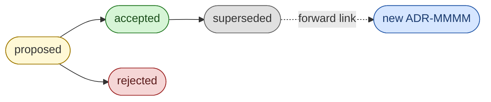

<!-- [KFM_META_BLOCK_V2]
doc_id: kfm://doc/adr-template
title: ADR Template — Architecture Decision Record
type: standard
version: v1
status: draft
owners: ["Docs steward", "Architecture steward"]
created: 2026-05-09
updated: 2026-05-09
policy_label: public
related:
  - "docs/doctrine/directory-rules.md"
  - "docs/adr/README.md"
tags: [adr, template, kfm, governance, documentation]
notes:
  - "Template doc; copy to ADR-NNNN-kebab-case-slug.md and fill in."
  - "Owners and related links are PROPOSED until verified against the mounted repo."
[/KFM_META_BLOCK_V2] -->

# ADR Template — Architecture Decision Record

> Copy this file to `docs/adr/ADR-NNNN-<kebab-case-slug>.md`, fill it in, and open a PR. ADRs are the audit trail of architectural reasoning in Kansas Frontier Matrix — they are versioned and never deleted.

[](#)
[](#)
[](#)
[](#)
[](#)
<!-- Badge targets are placeholders — NEEDS VERIFICATION against the repo's badge convention. -->

| Field | Value |
|---|---|
| **Document type** | Standard (template) |
| **Owners** | Docs steward · Architecture steward *(PROPOSED until verified)* |
| **Canonical ADR home** | `docs/adr/` |
| **Schema-home convention** | `schemas/contracts/v1/...` per ADR-0001 *(if accepted)* |
| **Authority** | CONFIRMED — template format derived from `docs/doctrine/directory-rules.md` §2.4 |

**Quick jumps:** [When to write one](#2-when-you-need-an-adr) · [Lifecycle](#3-status-lifecycle) · [Naming](#4-naming-and-numbering) · [How to use](#5-how-to-use-this-template) · [The template](#6-the-template) · [Field reference](#7-field-reference) · [Pre-merge checklist](#8-pre-merge-checklist) · [References](#9-related-docs--references)

---

## 1. Purpose

An **Architecture Decision Record (ADR)** captures **one** consequential architectural decision: the **context** that forced it, the **choice** that was made, the **consequences** that follow, and the **alternatives** that were rejected. ADRs are the institutional memory that prevents settled choices from being silently re-litigated.

This template is the **canonical scaffold** every new ADR copies from. It encodes:

- The **field set** required by Directory Rules §2.4: `id`, `title`, `status`, `date`, `context`, `decision`, `consequences`, `alternatives`.
- The **status vocabulary** used across the repo: `proposed | accepted | superseded | rejected`.
- The **never-delete discipline**: superseded ADRs **MUST** be retained with a forward link to the replacing ADR.
- The **meta block** convention so that ADRs are queryable from `related[]` references in README meta blocks and from doc-graph tooling.

> [!NOTE]
> ADRs **explain a decision**. They do not, by themselves, **enact** the change. Schemas, contracts, policy, fixtures, tests, and registries enact. ADRs are referenced by the things that enact.

[Back to top](#adr-template--architecture-decision-record)

---

## 2. When You Need an ADR

A new ADR is **required** before any change in the categories below. Sources: `docs/doctrine/directory-rules.md` §2.4 and §14.2.

| Trigger | Example | Required because |
|---|---|---|
| Add, remove, or rename a **canonical root** | Renaming `policy/` → `policies/` | §2.4(1) |
| Promote a **compatibility root** to canonical, or deprecate a canonical root | Retiring `artifacts/` | §2.4(2) |
| Change the **schema-home rule** | `schemas/` vs `contracts/` authority | §2.4(3) |
| Split or merge a **lifecycle phase** | Splitting `data/processed/` | §2.4(4) |
| Create a **parallel home** for schemas, contracts, policy, sources, registries, releases, proofs, or receipts | Adding a second `release/` | §2.4(5) |
| **Bend an invariant** from §3 of Directory Rules | Allowing a public route to bypass the trust membrane | §2.4(6) |
| **Object-identity rename** (a rename that changes what an object *means*) | `Source` → `SourceDescriptor` with semantic delta | §14.3 |
| **Structural moves**: schema-home migration, root change, lifecycle split | Migration manifest required | §14.2 |

ADRs are **also strongly recommended** when a choice (a) affects more than one component, or (b) is non-obvious from the code alone. Smaller routine changes (typos, dead-link fixes, lane-internal moves) do **not** need an ADR — those follow the routine PR path in Directory Rules §14.1.

> [!IMPORTANT]
> If a change qualifies under §2.4 and lands without an ADR, it is a **drift event**. Open an entry in `docs/registers/DRIFT_REGISTER.md` and propose a retroactive ADR. The corpus directs **retroactive ADR-authoring** for major past decisions.

[Back to top](#adr-template--architecture-decision-record)

---

## 3. Status Lifecycle

ADRs move through a small, finite set of statuses. **CONFIRMED** vocabulary per Directory Rules §2.4: `proposed | accepted | superseded | rejected`.



**Rules.**

- **`proposed`** — drafted; not yet binding. Reviewers may comment, request changes, or reject.
- **`accepted`** — merged with `accepted` status; the decision is now in force. The decision is referenced from the artifacts it governs (schemas, registries, READMEs via `related[]`).
- **`superseded`** — replaced by a later ADR. The file is **kept**; `superseded_by` links to the replacement ADR; the replacement's `supersedes` lists this ADR.
- **`rejected`** — proposed and not adopted. The file is **kept** as a record of the path not taken.

> [!CAUTION]
> **Never delete an ADR.** A stale ADR (status `accepted` but actually superseded by undocumented changes) is worse than a missing one. If reality has drifted from the ADR, write a new ADR that supersedes it and update both files. The corpus is explicit on this point.

> [!NOTE]
> Some prior corpus passages reference a `deprecated` status (J.4.1). The canonical doctrine in `directory-rules.md` §2.4 uses `superseded` instead. Treat `deprecated` as an alias of `superseded` and prefer `superseded` in new ADRs. — *PROPOSED CORRECTION; NEEDS VERIFICATION against any accepted ADR that pins the vocabulary.*

[Back to top](#adr-template--architecture-decision-record)

---

## 4. Naming and Numbering

| Aspect | Rule |
|---|---|
| **Filename** | `ADR-NNNN-<kebab-case-slug>.md` (zero-padded 4-digit number; lower-kebab slug). |
| **Directory** | `docs/adr/` (canonical, per Directory Rules §5). |
| **ID format** | `ADR-NNNN` in the visible header table; `kfm://adr/ADR-NNNN` in the meta block `doc_id`. |
| **Numbering** | Monotonic, repo-wide. The next number = 1 + the highest existing number under `docs/adr/`. |
| **Slugs** | Short, action-oriented, decision-flavored. Examples: `spec-normalization-v1`, `finite-decision-outcomes`, `release-manifest-envelope`. |
| **Domain ADRs** | A domain-scoped ADR **MAY** be filed as `ADR-NNNN-<domain>-<slug>.md` (e.g., `ADR-0014-hydrology-schema-home.md`) to keep it grep-able by domain. The numeric prefix is still monotonic across the repo. |
| **Title (H1)** | `# ADR-NNNN: <Concise decision title>` — match the slug semantically; do not duplicate the ID elsewhere in the title. |

> [!TIP]
> When proposing an ADR, claim the next number in the PR body and include the filename. Reviewers check that no concurrent PR has claimed the same number; collisions are resolved by re-numbering the later PR before merge.

[Back to top](#adr-template--architecture-decision-record)

---

## 5. How to Use This Template

1. **Copy** this file to `docs/adr/ADR-NNNN-<kebab-case-slug>.md`. Pick the next number.
2. **Update** the meta block: `doc_id`, `title`, `owners`, `created`, `updated`, `tags`, `related`, `supersedes` (if any).
3. **Replace** every placeholder. Remove `<!-- author guidance -->` HTML comments before requesting review.
4. **Set status** to `proposed`.
5. **Fill the eight required sections**: Context, Decision, Consequences, Alternatives Considered, Evidence and References, Migration Plan, Rollback Plan, Open Questions. For non-§2.4 changes, Migration Plan and Rollback Plan **MAY** be `Not applicable.`
6. **Cross-link** the ADR from any README, register, or doc whose `related[]` array should include it.
7. **Open a PR.** Cite the relevant Directory Rules section and any superseded ADRs in the PR body.
8. **On merge**, update status to `accepted` (or `rejected`) in the same or follow-up PR.
9. **If superseded later**, do **not** delete this ADR. Set status to `superseded`, fill `superseded_by`, and ensure the replacing ADR's `supersedes` includes this ID.

[Back to top](#adr-template--architecture-decision-record)

---

## 6. The Template

> Copy everything inside the fenced block below into your new file. Edit placeholders and remove guidance comments before publishing.

```markdown
<!-- [KFM_META_BLOCK_V2]
doc_id: kfm://adr/ADR-NNNN
title: <Concise, action-oriented decision title>
type: adr
version: v1
status: proposed
owners: ["<decider or team>"]
created: YYYY-MM-DD
updated: YYYY-MM-DD
policy_label: public
related:
  - "docs/doctrine/directory-rules.md"
  - "<other governing or affected docs>"
tags: [adr, kfm, "<domain or topic tags>"]
supersedes: []          # ADR ids this decision replaces, if any
superseded_by: []       # filled in only when this ADR is later superseded
notes: []
[/KFM_META_BLOCK_V2] -->

# ADR-NNNN: <Title>

<!-- One-paragraph TL;DR. The reader should know the decision after this paragraph. -->

| Field | Value |
|---|---|
| **ID** | ADR-NNNN |
| **Status** | proposed |
| **Date** | YYYY-MM-DD |
| **Deciders** | <names or roles> |
| **Consulted** | <names, teams, or stewards> |
| **Informed** | <downstream owners notified> |
| **Supersedes** | — *(or `ADR-MMMM`)* |
| **Superseded by** | — |
| **Directory Rules trigger** | §2.4(?) — *(cite the subsection or `n/a` if non-§2.4)* |

---

## 1. Context

<!--
The problem and the forces. State what is happening that requires a decision now.
Reference repo evidence (paths, schemas, fixtures, tests, registers, prior ADRs)
where possible. Avoid generic best-practice prose; write what is specifically true
of KFM.
-->

### 1.1 Decision drivers (forces)

- **<Force / constraint / quality requirement 1>** — <one-line rationale>
- **<Force / constraint / quality requirement 2>** — <one-line rationale>
- **<Force / constraint / quality requirement 3>** — <one-line rationale>

### 1.2 Out of scope

- <What this ADR explicitly does **not** decide>

---

## 2. Decision

<!--
State the decision in plain, declarative language. Use RFC 2119 keywords (MUST,
SHOULD, MAY) where conformance language is appropriate. The decision should be
specific enough that a reviewer 12 months from now can tell whether the repo
conforms to it.
-->

> **Decision:** <The chosen option, in one or two sentences.>

### 2.1 Specifics

- <Concrete sub-rule, schema choice, parameter, threshold, or path>
- <Concrete sub-rule, schema choice, parameter, threshold, or path>

### 2.2 Conformance language

- **MUST** — <non-negotiable element>
- **SHOULD** — <strong default; deviation requires justification>
- **MAY** — <permitted variation>

---

## 3. Consequences

### 3.1 Positive

- <Benefit, capability unlocked, or risk reduced>

### 3.2 Negative

- <Cost, complexity introduced, or capability foreclosed>

### 3.3 Accepted tradeoffs

- <Tradeoff knowingly accepted; explain why it is acceptable here>

### 3.4 Affected surfaces

| Surface | File / path | Impact |
|---|---|---|
| Schemas | `schemas/contracts/v1/<...>` | <created · updated · superseded> |
| Contracts | `contracts/<...>` | <…> |
| Policy | `policy/<...>` | <…> |
| Tests / fixtures | `tests/<...>` · `fixtures/<...>` | <…> |
| Registers | `data/registry/<...>` · `control_plane/<...>` | <…> |
| Docs | `docs/<...>` (READMEs, runbooks, doctrine) | <…> |
| Apps / runtime | `apps/<...>` · `runtime/<...>` | <…> |

---

## 4. Alternatives Considered

### 4.1 <Alternative A — name>

- **Summary:** <one or two sentences>
- **Why rejected:** <one or two sentences>

### 4.2 <Alternative B — name>

- **Summary:** <…>
- **Why rejected:** <…>

### 4.3 Status quo (do nothing)

- **Why rejected:** <what breaks or stays broken if no decision is made>

---

## 5. Evidence and References

<!--
Link the repo evidence that grounds the decision. Prefer relative repo paths and
permalinks at specific commits when pinning matters. If evidence is absent or
unverified, label it PROPOSED or NEEDS VERIFICATION.
-->

- Doctrine: `docs/doctrine/directory-rules.md` §<sec>
- Prior ADRs: `docs/adr/ADR-MMMM-<slug>.md`
- Schemas: `schemas/contracts/v1/<...>`
- Tests / fixtures: `tests/<...>` · `fixtures/<...>`
- Registers: `data/registry/<...>` · `control_plane/<...>`
- External standards: <RFC, spec, or normative reference, with version pin>

---

## 6. Migration Plan

<!--
Required for §2.4 structural changes (root changes, schema-home migration,
lifecycle phase splits, parallel-home creation, invariant bends). For other
ADRs, write: "Not applicable — non-structural decision."
-->

- **Old → new mapping:** see `migrations/<schema|data>/<adr-NNNN>/manifest.yaml`
- **Mirror window:** <duration; mark mirrors `mirror` per Directory Rules §8>
- **Deprecation entry:** `control_plane/deprecation_register.yaml` with sunset date <YYYY-MM-DD>
- **References to update:** code, docs, schemas, fixtures, tests, workflows
- **Validators to run:** <list>
- **Drift register check:** confirm no new entries opened post-migration

---

## 7. Rollback Plan

<!--
Required for §2.4 structural changes. For other ADRs, "Not applicable."
A rollback plan must be runnable, not aspirational.
-->

- **Trigger conditions:** <what observable failure mode reverts this decision>
- **Rollback steps:**
  1. <Concrete step>
  2. <Concrete step>
- **Compatibility:** <whether old fixtures/consumers still work; for how long>
- **Dry-run rollback card:** `release/rollback_cards/ADR-NNNN-dry-run.md` *(if applicable)*
- **Verification:** <tests / validators / smoke checks that confirm rollback success>

---

## 8. Open Questions

- <Question that this ADR does not yet resolve>
- <Question deferred to a follow-up ADR or to a register entry>

---

## 9. Change History

| Date | Status | Change | PR |
|---|---|---|---|
| YYYY-MM-DD | proposed | Initial draft | #<num> |
| YYYY-MM-DD | accepted | Merged after review | #<num> |
| YYYY-MM-DD | superseded | Replaced by ADR-MMMM | #<num> |
```

[Back to top](#adr-template--architecture-decision-record)

---

## 7. Field Reference

<details>
<summary><strong>Meta block fields</strong></summary>

| Field | Required | Notes |
|---|---|---|
| `doc_id` | yes | `kfm://adr/ADR-NNNN`. Stable join key for doc-graph tooling. |
| `title` | yes | Match the H1; concise, action-oriented. |
| `type` | yes | `adr` for ADRs. |
| `version` | yes | Document version, not the decision version. Increment on substantive edits. |
| `status` | yes | `proposed` · `accepted` · `superseded` · `rejected`. |
| `owners` | yes | Decider names or steward team. |
| `created` / `updated` | yes | ISO `YYYY-MM-DD`. |
| `policy_label` | yes | Usually `public` for ADRs. Use `restricted` only with explicit cause. |
| `related` | recommended | Affected READMEs, schemas, doctrine docs, prior ADRs. |
| `tags` | recommended | Always include `adr` and `kfm`; add domain/topic tags. |
| `supersedes` | conditional | Array of ADR ids this replaces. Empty if none. |
| `superseded_by` | conditional | Filled when this ADR is later replaced. |
| `notes` | optional | Short notes for reviewers; do not duplicate body content. |

</details>

<details>
<summary><strong>Body sections</strong></summary>

| Section | Required | Purpose |
|---|---|---|
| **TL;DR paragraph** | yes | One paragraph; the decision is clear after this paragraph alone. |
| **Header table** | yes | ID, status, date, deciders, supersedes/superseded-by, Directory Rules trigger. |
| **1. Context** | yes | The problem and forces. Reference repo evidence. |
| **1.1 Decision drivers** | yes | Bulleted forces / quality requirements. |
| **1.2 Out of scope** | recommended | Prevents scope creep in review. |
| **2. Decision** | yes | The chosen option, with RFC 2119 conformance language where appropriate. |
| **3. Consequences** | yes | Positive, negative, accepted tradeoffs, affected surfaces. |
| **4. Alternatives Considered** | yes | At least one alternative + the status quo. |
| **5. Evidence and References** | yes | Repo paths, prior ADRs, external standards. |
| **6. Migration Plan** | conditional | Required for §2.4 structural changes; otherwise `Not applicable.` |
| **7. Rollback Plan** | conditional | Required for §2.4 structural changes; otherwise `Not applicable.` |
| **8. Open Questions** | recommended | Honest deferrals; do not pretend a question is closed. |
| **9. Change History** | yes | Append-only; never delete rows. |

</details>

[Back to top](#adr-template--architecture-decision-record)

---

## 8. Pre-Merge Checklist

Apply conditionally — do not fabricate to satisfy a box.

- [ ] **Filename** matches `ADR-NNNN-<kebab-case-slug>.md`; number is unique and monotonic.
- [ ] **Meta block** is present, parseable, and has `type: adr`, `status: proposed`, valid `doc_id`.
- [ ] **Header table** lists the Directory Rules §2.4 trigger (or explicit `n/a`).
- [ ] **Decision** is unambiguous and uses RFC 2119 keywords where conformance is implied.
- [ ] **Alternatives** section contains at least one alternative **plus** the status-quo case.
- [ ] **Consequences** section names affected surfaces with concrete repo paths.
- [ ] **Evidence** section cites real paths, schemas, fixtures, tests, or external standards — not generic best practice.
- [ ] **Migration Plan** and **Rollback Plan** are filled in if §2.4(1)–(6) or §14.2 applies.
- [ ] **Cross-references** added to README `related[]` arrays for affected lanes.
- [ ] **Supersession links** are bidirectional: `supersedes` ↔ `superseded_by`, both meta blocks updated.
- [ ] **Status** set to `accepted` (or `rejected`) in the same merge or an immediate follow-up.
- [ ] **No deletions** of prior ADR files; superseded ADRs remain on disk.
- [ ] **PR body** cites the Directory Rules section that justifies the decision.

[Back to top](#adr-template--architecture-decision-record)

---

## 9. Related Docs & References

- `docs/doctrine/directory-rules.md` — §2.4 (changes that require an ADR), §14.2 (structural-move discipline), §17 (document change discipline).
- `docs/adr/README.md` — ADR index and process overview *(PROPOSED until verified in repo).*
- `docs/registers/DRIFT_REGISTER.md` — where to log conflicts between doctrine and the mounted repo *(PROPOSED).*
- `docs/registers/VERIFICATION_BACKLOG.md` — where to log open verification items *(PROPOSED).*
- `control_plane/deprecation_register.yaml` — sunset entries for migrations driven by ADRs *(PROPOSED).*
- `migrations/data/` · `migrations/schema/` — migration manifests pinned by structural ADRs.

**Starter ADR set referenced by the corpus** (illustrative; numbering follows monotonic order at the time the ADR is filed):

| ADR | Decision |
|---|---|
| ADR-0001 | Spec normalization, hash, and ID derivation v1 (RFC 8785 / JCS canonicalization, SHA-256 / BLAKE3, T1–T8 round-trip determinism). |
| ADR-0002 | Finite decision outcomes (`ANSWER` · `ABSTAIN` · `DENY` · `ERROR`). |
| ADR-0003 | Watcher non-publisher invariant. |
| ADR-0004 | KFM STAC profile v1. |
| ADR-0005 | ReleaseManifest as the publication envelope. |
| ADR-0006 | Crypto stack pin (BLAKE3 + BAO + DSSE + cosign + Rekor). |

> [!NOTE]
> The starter set above is described in the corpus as the recommended initial sequence. Whether each one has been filed yet is **NEEDS VERIFICATION** against the mounted repo; treat the numbers as illustrative ordering rather than as proof that those ADRs exist.

[Back to top](#adr-template--architecture-decision-record)

---

## 10. Open Questions / NEEDS VERIFICATION

These items are explicitly **not resolved** by this template and should be tracked in `docs/registers/VERIFICATION_BACKLOG.md`:

- **NEEDS VERIFICATION:** Whether `docs/adr/` exists in the current mounted repo and what ADRs it already contains. Until verified, the canonical home and starter ADR set are PROPOSED.
- **NEEDS VERIFICATION:** Whether a documentation linter / parser (`tools/docs/parse_meta_block.py` or equivalent) is wired in CI to validate ADR meta blocks. The corpus describes such a parser; its repo presence is unverified.
- **NEEDS VERIFICATION:** Whether the `KFM_META_BLOCK_V2` schema is published at `schemas/docs/meta_block.v2.schema.json`. Path is PROPOSED in the corpus.
- **OPEN:** Whether ADR enforcement is **advisory** (PR reviewer discretion) or **hard** (CI denies §2.4 PRs without an ADR). The corpus directs *"advisory initially, hard later."* Pin the cutover date in a follow-up ADR.
- **OPEN:** Whether the `deprecated` status from earlier doctrine passes is fully retired in favor of `superseded`. This template treats `superseded` as canonical; an accepted ADR can pin the vocabulary.
- **OPEN:** Whether ADRs **MUST** be referenced by the README `related[]` of every affected lane, or only by lane READMEs the ADR materially changes.

[Back to top](#adr-template--architecture-decision-record)
