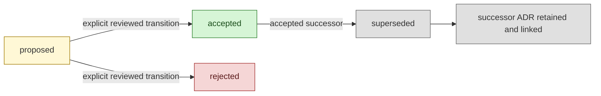

<!-- [KFM_META_BLOCK_V2]
doc_id: kfm://doc/adr-template
title: ADR Template — Architecture Decision Record
type: standard; authoring-template; support-document
version: v2.0
status: draft; repository-grounded; no-decision-authority
owners:
  - Architecture steward
  - Docs steward
created: 2026-05-09
updated: 2026-08-14
policy_label: public
truth_posture: cite-or-abstain
responsibility_root: docs/
owning_root: docs/
current_path: docs/adr/ADR-template.md
responsibility: Provide the repository's canonical human authoring scaffold for numbered ADR proposals while preserving decision-status, evidence, placement, migration, validation, correction, and rollback boundaries.
canonical_for: ADR authoring structure and reviewer checklist
decision_authority: none
evidence_snapshot:
  repository: bartytime4life/Kansas-Frontier-Matrix
  base_ref: main
  base_commit: 9d924c665073263f2cbf376d2bf29e7b9f252b06
  target_prior_blob: 33c9b45b44851b8c9ce50e7388ce6d26cea63f87
  directory_rules_blob: fd49a0b83e55cef52c1124281f093e263526898d
  directory_rules_adoption_adr_blob: a4de0d7a96b78da59cfc499d1025e1508afd8dd9
  adr_readme_blob: 793015c38f4066c2c23753d4e3dd26bcc890279d
  adr_index_blob: 938c5894c36b99e14810918e2c550ab0e92d53b1
  adr_validator_blob: 7c0d82e0a97e6f76690705e5a91509ad874347e2
  adr_validator_tests_blob: 730f9f87ea4b7d62705529f1f3d52626c53d517c
  adr_issue_template_blob: 8fc79fe67bfb84fa9feb287670478a5a374fb068
  docs_control_plane_workflow_blob: ed0d3b50a12931b67cad005cd99433924c829fa3
  codeowners_blob: dd2a84aa514d8ecd9208bc347f90f9a2ed37dd61
related:
  - docs/adr/README.md
  - docs/adr/INDEX.md
  - docs/doctrine/directory-rules.md
  - docs/adr/ADR-0029-adopt-directory-governance-standard-v2.md
  - docs/registers/ADR_INDEX.md
  - docs/registers/DRIFT_REGISTER.md
  - docs/registers/VERIFICATION_BACKLOG.md
  - .github/ISSUE_TEMPLATE/adr.md
  - .github/CODEOWNERS
  - tools/validators/validate_adr_index.py
  - tests/validators/test_validate_adr_index.py
  - .github/workflows/docs-control-plane.yml
tags: [kfm, adr, template, governance, decisions, evidence, migration, rollback, documentation]
notes:
  - "v2.0 replaces the pre-adoption v1.1 template with a repository-grounded scaffold aligned to accepted ADR-0029, Directory Rules v2, the canonical ADR index, the ADR validator, and the current issue-intake template."
  - "This support document does not allocate an ADR number, accept a decision, amend Directory Rules, authorize dependent implementation, release, deploy, or publish."
  - "The preserved H1 and numbered outer sections retain the existing template's stable navigation anchors."
[/KFM_META_BLOCK_V2] -->

<a id="top"></a>

# ADR Template — Architecture Decision Record

> **One-line purpose.** Use this support document to author one evidence-grounded, reviewable KFM architecture decision without confusing a proposal, merged Markdown file, passing check, or index row with accepted authority or implemented behavior.

[](#1-purpose)
[](#1-purpose)
[](./ADR-0029-adopt-directory-governance-standard-v2.md)
[](./INDEX.md)
[](#1-purpose)

> [!IMPORTANT]
> **This file is a template, not a decision.** [`INDEX.md`](./INDEX.md) classifies `ADR-template.md` as a support document with no decision authority. Copying it, filing an issue, opening or merging a pull request, or passing the ADR validator does not accept an ADR, authorize dependent implementation, change release state, or publish anything.

> [!CAUTION]
> **Directory Rules v2 carry an embedded pre-adoption label because ADR-0029 adopted exact bytes.** The accepted authority is the combination of [`ADR-0029`](./ADR-0029-adopt-directory-governance-standard-v2.md) and the pinned bytes at [`docs/doctrine/directory-rules.md`](../doctrine/directory-rules.md). Do not treat the embedded `PROPOSED_FOR_ADOPTION` string as evidence that ADR-0029 is unaccepted, and do not silently edit the adopted bytes through an ADR proposal.

> [!NOTE]
> **Current repository snapshot.** At the evidence checkpoint, the canonical index contains 34 numbered records: ADR-0029 is accepted and the other 33 are effectively proposed. It also lists 12 unassigned scaffolds. Those counts are snapshot evidence, not constants to copy into a new ADR.

**Quick jumps:** [Purpose](#1-purpose) · [When to write one](#2-when-you-need-an-adr) · [Lifecycle](#3-status-lifecycle) · [Naming](#4-naming-and-numbering) · [How to use](#5-how-to-use-this-template) · [The template](#6-the-template) · [Field reference](#7-field-reference) · [Pre-merge checklist](#8-pre-merge-checklist) · [References](#9-related-docs--references) · [Open questions](#10-open-questions--needs-verification)

---

## 1. Purpose

An Architecture Decision Record preserves **one consequential decision**: the current problem, admissible evidence, governing authority, selected option, rejected alternatives, consequences, implementation order, acceptance evidence, migration and compatibility effects, and correction or rollback path.

This file is the repository's confirmed authoring scaffold because:

- [`docs/adr/README.md`](./README.md) directs new numbered records to copy this template;
- [`docs/adr/INDEX.md`](./INDEX.md) lists it as the ADR authoring template;
- [`tools/validators/validate_adr_index.py`](../../tools/validators/validate_adr_index.py) enforces numbered-record and index coherence; and
- [`.github/ISSUE_TEMPLATE/adr.md`](../../.github/ISSUE_TEMPLATE/adr.md) routes proposals toward this repository record.

The template itself has **no decision authority**. It must not become a second index, a substitute for an accepted ADR, or a generic place to encode contract, schema, policy, source, receipt, proof, release, or runtime authority.

### 1.1 What an ADR records

A complete ADR should let a later reviewer answer:

1. What exactly was decided, and what stayed unchanged?
2. Which repository evidence and governing authority supported the decision?
3. What truth, decision, implementation, delivery, and release states existed at the checkpoint?
4. Which responsibility owner and repository surfaces are affected?
5. What alternatives were considered?
6. What must happen before acceptance and before dependent implementation?
7. How are compatibility, migration, correction, supersession, and rollback handled?
8. What evidence would show that the decision was implemented correctly—or should be reversed?

### 1.2 What an ADR does not do

An ADR does not, by itself:

- establish that the described architecture exists;
- make a schema, contract, policy, source, registry, receipt, proof, manifest, or release object authoritative;
- grant source rights, sensitivity clearance, public-safe status, review, release, deployment, or publication;
- authorize implementation that depends on an unaccepted decision;
- replace current repository evidence with design prose;
- turn CODEOWNERS routing into stewardship assignment or proof of review; or
- turn a passing validator into acceptance.

> [!IMPORTANT]
> **Use state words precisely.** `proposed | accepted | superseded | rejected` are ADR lifecycle states. `CONFIRMED | PROPOSED | UNKNOWN | NEEDS VERIFICATION` are truth labels. Implementation maturity, pull-request state, lifecycle stage, and release state are separate axes.

[Back to top](#top)

---

## 2. When You Need an ADR

Use the current adopted Directory Rules and accepted, unsuperseded ADRs—not the obsolete v1 section references in the prior template—to classify the decision.

### 2.1 ADR-required changes

An accepted ADR is required before implementation that:

| Decision class | Current Directory Rules basis | Example |
|---|---|---|
| Adds a canonical, conditional, or compatibility root | §2.2–§2.3; §6.2–§6.3 | Introduce a new repository-wide authority root |
| Renames, merges, splits, retires, promotes, or reclassifies a root | §2.3; §6.3; §17–§18 | Retire a compatibility root or promote one to canonical |
| Changes lifecycle, evidence, release, or public-boundary authority | §2.3; §11; §18 | Split a lifecycle phase or move release decisions into a data lane |
| Changes an object family's authority owner | §2.3; `DIR-SIGNATURE-001`–`004` | Move semantic meaning from `contracts/` into schemas or code |
| Creates or preserves parallel writable authority | `DIR-AUTH-002`; §5; §17 | Maintain two independently editable schema or policy homes |
| Bends a KFM trust, evidence, sensitivity, correction, or rollback invariant | §1–§3; §14; §18 | Permit a public client to read an internal canonical store |
| Makes a semantic identity or compatibility change that cannot be treated as a local naming refinement | §13; `DIR-MIGRATE-002` | Rename an object family while changing its meaning or stable identity |
| Changes the adopted Directory Rules or another accepted architecture decision | §2.2–§2.3; §21 | Amend placement doctrine or supersede an accepted ADR |

### 2.2 ADR-recommended changes

An ADR is strongly recommended when the choice:

- affects several responsibility roots or bounded contexts;
- is non-obvious from code, contract, schema, or policy alone;
- changes a public or governed interface;
- changes deterministic identity, canonicalization, hashing, replay, or correction lineage;
- changes AI/runtime/provider boundaries or finite response semantics;
- changes source role, evidence authority, sensitivity, sovereignty, or geoprivacy posture;
- introduces a long-lived compatibility profile; or
- is likely to be re-litigated without durable rationale.

### 2.3 Changes that normally use another route

Do not create an ADR merely for:

- typo, link, formatting, or metadata repair with no changed meaning;
- a local refactor that preserves architecture and compatibility;
- a runbook or operational procedure that implements an accepted decision;
- a release, correction, withdrawal, or rollback instance;
- a field-level schema change that does not change architecture or object meaning;
- an issue, investigation, decision memo, or source-intake record that has not reached a decision proposal; or
- implementation of an already accepted decision when the implementation does not introduce a new architecture choice.

> [!NOTE]
> When classification remains unresolved, record the evidence and return `HOLD`; do not create a persuasive ADR merely to make an uncertain change appear governed.

[Back to top](#top)

---

## 3. Status Lifecycle

### 3.1 Source status and effective status

The canonical index records two related values:

| Axis | Values | Meaning |
|---|---|---|
| Source metadata | `proposed`, `draft`, legacy `PROPOSED`, `accepted`, `superseded`, `rejected` | What the ADR file itself declares |
| Effective decision status | `proposed`, `accepted`, `superseded`, `rejected` | Conservative normalized status used by the canonical index |

Current validation normalizes `draft` and legacy `PROPOSED` to effective `proposed`. New ADRs should use `status: proposed` directly.


```mermaid
flowchart LR
    P["proposed"] -->|explicit reviewed transition| A["accepted"]
    P -->|explicit reviewed transition| R["rejected"]
    A -->|accepted successor| S["superseded"]
    S --> N["successor ADR retained and linked"]

    classDef proposed fill:#fff8d6,stroke:#a07900,color:#333
    classDef accepted fill:#d6f5d6,stroke:#2a7d2a,color:#1a4d1a
    classDef rejected fill:#f5d6d6,stroke:#a02a2a,color:#5a1a1a
    classDef superseded fill:#e0e0e0,stroke:#666,color:#333
    class P proposed
    class A accepted
    class R rejected
    class S,N superseded
```

### 3.2 Transition rules

- **`proposed`** — under consideration and not binding. A merged proposed ADR remains proposed.
- **`accepted`** — explicitly reviewed and in force for the decision's stated scope. The ADR source and canonical index must transition together with acceptance evidence.
- **`rejected`** — considered but not adopted. Retain the record and synchronized index status.
- **`superseded`** — replaced by one accepted successor. Retain the predecessor and record reciprocal forward/back links.

> [!IMPORTANT]
> **Merge is not acceptance.** A commit proves that bytes exist. A pull request merge does not automatically prove decision quorum, independent review, implementation, policy approval, release, or publication.

### 3.3 State separation

Every substantive ADR should distinguish:

| State family | Examples | Must not be inferred from |
|---|---|---|
| ADR lifecycle | proposed, accepted, superseded, rejected | File presence or merge alone |
| Truth posture | CONFIRMED, PROPOSED, UNKNOWN, NEEDS VERIFICATION | Confidence or plausibility |
| Implementation maturity | absent, scaffold, partial, implemented, verified | ADR acceptance alone |
| Delivery state | branch, draft PR, ready PR, merged | Technical correctness or governance acceptance |
| KFM lifecycle/release | RAW, WORK, QUARANTINE, PROCESSED, CATALOG/TRIPLETS, PUBLISHED | Repository path, badge, or GitHub release |
| Runtime/policy outcome | ANSWER, ABSTAIN, DENY, ERROR, HOLD where applicable | Generated prose or UI styling |

### 3.4 Accepted history is append-only

Do not delete accepted, rejected, or superseded ADRs. Materially changing an accepted decision requires a successor ADR or an explicitly reviewed correction that does not change the decision's meaning. Preserve prior evidence, supersession, correction, and rollback lineage.

[Back to top](#top)

---

## 4. Naming and Numbering

| Aspect | Current rule |
|---|---|
| Numbered filename | `ADR-NNNN-kebab-case-slug.md` |
| Numbered H1 | Must contain the same `ADR-NNNN` as the filename |
| Numeric scope | Four-digit, repository-wide, permanent identifier |
| New source status | `proposed` |
| Canonical inventory | [`docs/adr/INDEX.md`](./INDEX.md) |
| Placeholder filenames | `ADR-NNNN-*` and `ADR-XXXX-*`; unassigned and not number reservations |
| Slug-only scaffolds | Unassigned until a reviewed assignment change gives them a unique numeric ID |
| Legacy filenames | Preserve exact tracked paths until inbound links and migration are reviewed |

### 4.1 Number assignment

Before claiming a number:

1. fetch current `main` and record its exact SHA;
2. inspect [`INDEX.md`](./INDEX.md) for the highest assigned ID and gaps;
3. inspect open ADR pull requests and active ADR branches;
4. inspect recent merges that may not yet be reflected in search indexing;
5. choose one collision-free ID;
6. create the numbered ADR and update the index in the same change; and
7. rerun the collision and index-coherence checks immediately before delivery.

Do not infer that the next number is stable from this template's snapshot counts.

### 4.2 Assigning an existing scaffold

Assignment is not a cosmetic rename. Preserve useful source lineage and:

- choose a unique numeric ID;
- rename the file through a reviewed migration when needed;
- align filename, `adr_id`, `doc_id`, H1, source status, and index row;
- repair inbound links;
- preserve the prior path through a migration note or redirect only when verified consumers require it;
- update the canonical index's scaffold and numbered tables together; and
- keep the decision `proposed` unless a separate reviewed acceptance transition is part of the change.

### 4.3 Title and slug guidance

Use a title that states a decision rather than a topic:

- Prefer: `Keep GeoParquet 1.1 as the default and gate 2.0 evaluation`
- Prefer: `Public clients never read canonical or internal stores`
- Avoid: `GeoParquet`
- Avoid: `API notes`

[Back to top](#top)

---

## 5. How to Use This Template

### 5.1 Preflight

1. Pin the repository baseline and target prior blob.
2. Read [`README.md`](./README.md), [`INDEX.md`](./INDEX.md), accepted related ADRs, and adopted Directory Rules.
3. Check open pull requests, active branches, recent merges, and target history for overlap.
4. Decide whether the work is a new numbered ADR, an unassigned candidate, a correction, or a successor to an accepted ADR.
5. Freeze authority inputs before editing. Do not edit an authority document and use the unaccepted edit to authorize dependent implementation in the same authority batch (`DIR-AUTH-004`).
6. Identify the one decision, one primary authority owner, direct dependency closure, acceptance evidence, and rollback boundary.
7. Classify every proposed or affected path with the Directory Rules responsibility signature and one finite placement outcome: `PLACE`, `SPLIT`, `MIGRATE`, `MIRROR`, `HOLD`, or `DENY`.

### 5.2 Authoring

1. Copy the fenced template in §6.
2. Replace every placeholder; remove authoring comments before requesting acceptance.
3. Keep `status: proposed` for a new decision.
4. Use truth labels per material claim.
5. Separate doctrine, current repository evidence, desired design, implementation maturity, and unresolved checks.
6. State one directive. Split decisions that need independent adoption, implementation, review, or rollback.
7. Record genuine alternatives, including the status quo.
8. Identify affected contracts, schemas, policy, fixtures, tests, validators, sources, registries, data, release objects, docs, apps, packages, pipelines, workflows, generated outputs, and migrations.
9. Order decision and implementation work. Dependent implementation begins only after the decision is effective and its base is repinned.
10. Define validation, acceptance, correction, supersession, and rollback.

### 5.3 Delivery and review

For a new numbered ADR or status transition:

- update [`INDEX.md`](./INDEX.md) in the same change;
- update reciprocal supersession links;
- request the reviewers required by the affected roots and decision;
- run the ADR validator and focused tests;
- report hosted checks as `PASS`, `FAIL`, `PENDING`, `NOT RUN`, `N/A`, or `UNKNOWN`;
- keep a draft pull request draft unless the user explicitly requests ready-for-review and the required conditions are met; and
- do not merge, release, deploy, promote, publish, or change repository settings as an implied part of authoring.

### 5.4 Post-acceptance

After acceptance, implementation work should:

- repin current `main`;
- cite the accepted ADR and exact scope;
- add or update the implementing contracts, schemas, policy, fixtures, tests, validators, migrations, docs, and release/correction support;
- preserve compatibility and rollback;
- verify behavior from current code/tests/artifacts rather than the ADR prose; and
- update the ADR only through append-only implementation evidence that does not rewrite the accepted choice.

[Back to top](#top)

---

## 6. The Template

> Copy the complete fenced block below into a new numbered ADR. Keep sections that are not applicable and write `Not applicable — <reason>` rather than silently deleting a trust-bearing question.

````markdown
<!-- [KFM_META_BLOCK_V2]
doc_id: kfm://adr/ADR-NNNN
adr_id: ADR-NNNN
title: "ADR-NNNN — <concise decision title>"
type: adr
version: v1.0
status: proposed
owners:
  - "NEEDS VERIFICATION — decision owner"
owner_status: "CODEOWNERS routing is not stewardship assignment, review evidence, decision quorum, or acceptance authority"
reviewers_required:
  - Architecture steward
  - Docs steward
  - "<affected responsibility-root or domain owner>"
created: YYYY-MM-DD
updated: YYYY-MM-DD
policy_label: public
truth_posture: cite-or-abstain
responsibility_root: docs/
current_path: docs/adr/ADR-NNNN-<kebab-case-slug>.md
supersedes: []
superseded_by: null
evidence_snapshot:
  repository: bartytime4life/Kansas-Frontier-Matrix
  base_ref: main
  base_commit: <40-character commit SHA>
  target_prior_blob: null
  adr_index_blob: <blob SHA>
  directory_rules_blob: <blob SHA>
  relevant_contract_blob: null
  relevant_schema_blob: null
  relevant_policy_blob: null
  relevant_validator_blob: null
  relevant_fixture_or_test_blob: null
related:
  - docs/adr/README.md
  - docs/adr/INDEX.md
  - docs/doctrine/directory-rules.md
  - "<accepted related ADR, doctrine, contract, schema, policy, validator, migration, or runbook>"
tags: [kfm, adr, "<topic-or-domain>"]
notes:
  - "This record begins proposed; file presence, a commit, a pull request, a merge, or an index row does not accept it."
  - "This record authorizes no dependent implementation, release, deployment, promotion, publication, source activation, or repository-settings change before the applicable reviewed transition."
[/KFM_META_BLOCK_V2] -->

<a id="top"></a>

# ADR-NNNN — <Concise decision title>

> **Proposed decision.** KFM will <one directive stated in plain language>.

> [!IMPORTANT]
> **This ADR is proposed.** It is not binding until the source record and canonical index carry a synchronized, reviewed acceptance transition. Dependent implementation must not treat this proposal as already-adopted authority.

> [!NOTE]
> **Non-effects.** This record does not by itself <list the most important implementation, policy, release, deployment, publication, or source-activation non-effects>.

**Quick navigation:** [Status](#1-status-and-authority) · [Evidence](#2-evidence-boundary) · [Context](#3-context) · [Decision](#4-decision) · [Consequences](#5-consequences-and-risks) · [Alternatives](#6-alternatives-considered) · [Implementation](#7-implementation-migration-and-compatibility) · [Validation](#8-validation-and-acceptance) · [Rollback](#9-rollback-correction-and-supersession) · [Sensitivity](#10-security-rights-sensitivity-and-sovereignty) · [Open work](#11-open-questions-and-verification-backlog) · [References](#12-evidence-and-references) · [History](#13-change-history)

---

## 1. Status and authority

| Field | Current value |
|---|---|
| **ADR ID** | `ADR-NNNN` — unique in [`INDEX.md`](./INDEX.md) |
| **Tracked path** | `docs/adr/ADR-NNNN-<kebab-case-slug>.md` |
| **Source metadata** | `proposed` |
| **Effective decision status** | `proposed` — not binding |
| **Decision class** | `<authority-changing | structural | behavioral | additive>` |
| **Decision scope** | `<one bounded decision>` |
| **Primary authority owner** | `<one responsibility owner>` |
| **Required reviewers** | `<roles; distinguish roles from verified GitHub identities>` |
| **Governing authority** | `<accepted ADRs and adopted doctrine that currently apply>` |
| **Implementation maturity** | `<absent | scaffold | partial | implemented | verified | UNKNOWN>` |
| **Delivery state** | `<draft record | draft PR | ready PR | merged proposal | other>` |
| **Publication effect** | None unless a separate governed release decision says otherwise |
| **Supersedes** | — / `ADR-MMMM` |
| **Superseded by** | — |
| **Rollback target for this document** | `<prior blob or not applicable for new file>` |

### 1.1 State separation

| Axis | Current state | Evidence |
|---|---|---|
| ADR lifecycle | `proposed` | Source metadata plus canonical index |
| Truth posture | `CONFIRMED / PROPOSED / UNKNOWN / NEEDS VERIFICATION` per claim | Evidence table below |
| Implementation maturity | `<state>` | Code/config/schema/test/runtime evidence |
| KFM lifecycle/release | `<not applicable or current state>` | Release/lifecycle evidence |
| Hosted validation | `PENDING / PASS / FAIL / NOT RUN / UNKNOWN` | Exact head/run evidence |

### 1.2 Scope

**In scope**

- <decision boundary>

**Out of scope / explicitly unchanged**

- <non-goal>
- <authority or behavior not changed>

[Back to top](#top)

---

## 2. Evidence boundary

Pin every material current-state claim to repository or authoritative evidence.

| Evidence surface | Truth label | Current observation | What it proves—and does not prove |
|---|---|---|---|
| `docs/adr/INDEX.md` | `CONFIRMED` | <identity/status observation> | <bounded implication> |
| Accepted ADR or doctrine | `CONFIRMED` | <authority observation> | <scope limit> |
| Current implementation | `CONFIRMED / UNKNOWN` | <code/config/schema/policy observation> | <scope limit> |
| Fixtures/tests/validators | `CONFIRMED / NEEDS VERIFICATION` | <observed coverage> | <scope limit> |
| Workflow/run/runtime evidence | `CONFIRMED / UNKNOWN` | <run evidence or absence> | <scope limit> |
| External primary source | `CONFIRMED / NEEDS VERIFICATION` | <versioned fact> | <currentness/jurisdiction limit> |

### 2.1 Truth labels used

- **CONFIRMED** — verified from the pinned evidence above.
- **PROPOSED** — the decision or desired target state.
- **UNKNOWN** — evidence is insufficient for a stronger claim.
- **NEEDS VERIFICATION** — a concrete check remains.
- **CONFLICTED** — current admissible sources or writable homes disagree.
- **HOLD** — implementation or acceptance must stop until named evidence or authority closes.

[Back to top](#top)

---

## 3. Context

<State the KFM-specific problem, current behavior, forcing function, and harm of leaving the decision unresolved. Separate current repository fact from desired architecture.>

### 3.1 Decision drivers

- **<driver>** — <why it matters>
- **<driver>** — <why it matters>
- **<driver>** — <why it matters>

### 3.2 Current conflict or gap

| Surface | Current state | Conflict or gap |
|---|---|---|
| <path/object/behavior> | <state> | <gap> |

### 3.3 Non-goals

- <what this ADR does not decide>

[Back to top](#top)

---

## 4. Decision

> **Decision:** KFM will <single directive>.

### 4.1 Normative rules

1. **MUST** — <non-negotiable requirement>
2. **MUST NOT** — <prohibited behavior>
3. **SHOULD** — <strong default and permitted exception rule>
4. **MAY** — <bounded variation>

### 4.2 Responsibility and placement

Use the Directory Rules responsibility signature for every new, moved, renamed, split, mirrored, or authority-bearing path.

| Axis | Decision |
|---|---|
| `artifact_kind` | `<human document | machine register | semantic contract | schema | policy | executable | data instance | release decision | test | fixture | config | migration | example | generated output>` |
| `authority_owner` | `<exactly one responsibility owner>` |
| `lifecycle_stage` | `<n/a | pre-RAW | RAW | WORK | QUARANTINE | PROCESSED | CATALOG | TRIPLETS | PUBLISHED | receipt | proof | registry>` |
| `execution_role` | `<none | deployable | reusable library | connector | pipeline | spec | tool | script | runtime adapter | infrastructure>` |
| `scope_kind` / `scope_id` | `<global/domain/source/geography/seam/object family>` |
| `exposure` | `<public | semi-public | internal | steward-only | restricted>` |
| `mutability` / `retention` | `<immutable/append-only/versioned/generated/ephemeral>` / `<durable/release-bound/audit-bound/cacheable/disposable>` |
| Candidate path | `<path>` |
| Governing rule IDs / accepted ADRs | `<references>` |
| Placement outcome | `PLACE / SPLIT / MIGRATE / MIRROR / HOLD / DENY` |
| Parallel-authority posture | `<none or explicit migration/compatibility handling>` |

Repeat the table per affected path when one row would hide different ownership.

### 4.3 Authority and public-boundary rules

- Public clients <governed interface rule>.
- Evidence-dependent claims <EvidenceRef/EvidenceBundle rule>.
- Policy, rights, sensitivity, review, and release <decision rule>.
- Derived maps, tiles, graphs, indexes, summaries, scenes, and generated language <non-authority rule>.

### 4.4 Non-effects

This decision does not:

- <non-effect>;
- <non-effect>; or
- <non-effect>.

[Back to top](#top)

---

## 5. Consequences and risks

### 5.1 Positive consequences

- <benefit>

### 5.2 Negative consequences and costs

- <cost>

### 5.3 Accepted tradeoffs

- <tradeoff and why it is accepted>

### 5.4 Affected surfaces

| Responsibility surface | Current path(s) | Required change | Authority / compatibility note |
|---|---|---|---|
| ADR source and index | `docs/adr/...` | <change> | Decision record only |
| Contracts | `contracts/...` | <change or not affected> | Semantic meaning |
| Schemas | `schemas/contracts/v1/...` | <change or not affected> | Machine shape |
| Policy | `policy/...` | <change or not affected> | Admissibility |
| Fixtures/tests/validators | `fixtures/...`, `tests/...`, `tools/validators/...` | <change or not affected> | Enforceability |
| Source/registry/evidence | `data/registry/...`, `data/proofs/...` | <change or not affected> | Source/evidence authority |
| Lifecycle data | `data/<phase>/...` | <change or not affected> | State transition |
| Release/correction/rollback | `release/...`, `data/receipts/...` | <change or not affected> | Governed transition |
| Apps/packages/runtime | `apps/...`, `packages/...`, `runtime/...` | <change or not affected> | Implementation |
| Pipelines/workflows/config | `pipelines/...`, `.github/workflows/...`, `configs/...` | <change or not affected> | Operation |
| Docs/runbooks/migrations | `docs/...`, `migrations/...` | <change or not affected> | Explanation and transition |

### 5.5 Risk ledger

| Risk | Likelihood / impact | Mitigation | Residual risk / owner |
|---|---|---|---|
| <risk> | <rating> | <control> | <remaining risk> |

[Back to top](#top)

---

## 6. Alternatives considered

### 6.1 Selected option — <name>

- **Summary:** <option>
- **Why selected:** <evidence-grounded reason>

### 6.2 Alternative A — <name>

- **Summary:** <option>
- **Why rejected:** <reason>

### 6.3 Alternative B — <name>

- **Summary:** <option>
- **Why rejected:** <reason>

### 6.4 Status quo

- **Summary:** Leave the current state unchanged.
- **Why rejected or retained:** <reason>

[Back to top](#top)

---

## 7. Implementation, migration, and compatibility

> [!IMPORTANT]
> **Decision and dependent implementation are separate transitions.** When implementation requires this ADR's acceptance, accept the decision first, repin the implementation base, and then implement. Do not use this proposed file to authorize its own dependent changes.

### 7.1 Ordered change sequence

| Order | Change | Dependency | Review boundary | Reversible? |
|---:|---|---|---|---:|
| 1 | Record the proposed ADR and synchronized index row | Current authority | Decision review | yes |
| 2 | Transition the ADR and index after explicit review | Acceptance evidence | Status review | yes |
| 3 | Implement contracts/schemas/policy/code/tests/migration | Accepted ADR and repinned base | Implementation review | <yes/no> |
| 4 | Release or publish, if applicable | Validation, policy, review, release, correction, rollback | Release review | <yes/no> |

### 7.2 Migration and compatibility plan

- **Old → new mapping:** <mapping or not applicable>
- **Migration manifest/note:** `<path or not applicable>`
- **Producer cutover:** <single-write plan>
- **Consumer migration:** <dual-read/single-write or other bounded plan>
- **Mirror/alias class:** `<legacy | mirror | external_export | transitional | deprecated | none>`
- **Compatibility window and exit criteria:** <date/condition>
- **Identity preservation or versioning:** <rule>
- **Backfill or transform:** <plan>
- **Generated-output regeneration:** <plan>
- **Reference/link repair:** <plan>
- **Correction of released references:** <plan>
- **Destructive cleanup:** last step only, after zero-writer/zero-consumer proof

### 7.3 Direct dependency closure

| Artifact | Why directly required | Planned path | Validation |
|---|---|---|---|
| <artifact> | <reason> | <path> | <check> |

### 7.4 Deferred work

- <optional or independently reviewable follow-up>

[Back to top](#top)

---

## 8. Validation and acceptance

A passing check proves only its declared scope. It does not accept this ADR or prove implementation, policy, release, deployment, or publication.

### 8.1 Checks performed for this proposal

| Check / command / inspection | Scope | State | Exact evidence |
|---|---|---|---|
| `python tools/validators/validate_adr_index.py` | ADR inventory coherence | `PASS / FAIL / NOT RUN / UNKNOWN` | <run or limitation> |
| `python -m pytest tests/validators/test_validate_adr_index.py -q --strict-config --strict-markers` | ADR validator failure paths | `PASS / FAIL / NOT RUN / UNKNOWN` | <run or limitation> |
| <changed-area check> | <scope> | <state> | <evidence> |
| Hosted checks | Exact pull-request head | `PENDING / PASS / FAIL / UNKNOWN` | <run IDs> |

### 8.2 Acceptance criteria

| Criterion | Required evidence | Current state | Owner/reviewer |
|---|---|---|---|
| Decision is singular and unambiguous | Reviewed directive and scope | <state> | <role> |
| Current facts are pinned and truth-labeled | Evidence snapshot | <state> | <role> |
| Governing authority is sufficient | Accepted ADR/doctrine references | <state> | <role> |
| Placement and ownership are deterministic | Responsibility signatures and finite outcomes | <state> | <role> |
| Alternatives and consequences are complete | Reviewed sections | <state> | <role> |
| Migration and rollback are executable where applicable | Manifest/fixtures/drill plan | <state> | <role> |
| Security, rights, sensitivity, and sovereignty are addressed | Qualified review or explicit N/A | <state> | <role> |
| Required reviewers acted | Review evidence | <state> | <role> |
| ADR source and canonical index agree | Validator pass | <state> | <role> |
| Dependent implementation remains correctly ordered | Separate or explicitly sequenced changes | <state> | <role> |

### 8.3 Current enforcement maturity

| Capability | Current state | Acceptance blocker? |
|---|---|---:|
| Contract/schema/policy support | <state> | <yes/no> |
| Fixtures and negative tests | <state> | <yes/no> |
| Validator/CI coverage | <state> | <yes/no> |
| Producer/consumer migration | <state> | <yes/no> |
| Runtime/API/UI behavior | <state> | <yes/no> |
| Release/correction/rollback proof | <state> | <yes/no> |

### 8.4 Post-acceptance verification

- <implementation or runtime evidence to collect>
- <drift and rollback drill>
- <documentation and register updates>

[Back to top](#top)

---

## 9. Rollback, correction, and supersession

### 9.1 Documentation rollback

- **Prior blob / commit:** <target>
- **Revert procedure:** <procedure>
- **Validation after revert:** <checks>

### 9.2 Implementation rollback or forward fix

- **Trigger conditions:** <observable failures>
- **Rollback steps:** <steps>
- **Forward-fix requirement if rollback is unsafe:** <plan>
- **Compatibility after rollback:** <rule>
- **Data/release correction:** <CorrectionNotice, withdrawal, manifest, alias, cache, graph, index, or generated-output action>
- **Rollback must not recreate two writable authorities.**

### 9.3 Supersession

- **Supersedes:** <none or IDs>
- **Superseded by:** <none until successor accepted>
- **Reciprocal index/source links:** <plan>
- **Drift-register update:** <required or not applicable>

Accepted, rejected, and superseded records remain in the repository.

[Back to top](#top)

---

## 10. Security, rights, sensitivity, and sovereignty

| Concern | Applies? | Required control or reviewer | Evidence |
|---|---:|---|---|
| Security-sensitive behavior or vulnerability detail | <yes/no> | <private route / security reviewer> | <evidence> |
| Rights, license, source terms, or redistribution | <yes/no> | <rights review> | <evidence> |
| Archaeology, cultural, Indigenous, burial, or sacred context | <yes/no> | <qualified stewardship review> | <evidence> |
| Rare species, rare plants, habitat, or geoprivacy | <yes/no> | <generalization / domain review> | <evidence> |
| Critical infrastructure or emergency operations | <yes/no> | <restricted handling> | <evidence> |
| Living-person, genealogy, consent, DNA, or genomic data | <yes/no> | <privacy/consent review> | <evidence> |
| Private land or exact harmful location | <yes/no> | <redaction/generalization/access control> | <evidence> |

Unknown or unresolved high-risk handling returns `HOLD` or `DENY`; it is not solved by a disclaimer.

[Back to top](#top)

---

## 11. Open questions and verification backlog

| Item | Status | Why unresolved | Owner / next evidence | Blocks |
|---|---|---|---|---|
| <question> | `UNKNOWN / NEEDS VERIFICATION / CONFLICTED` | <reason> | <next check> | <acceptance/implementation/release> |

Do not hide unresolved acceptance blockers in prose. Link a durable register or issue when follow-up outlives this review.

[Back to top](#top)

---

## 12. Evidence and references

### 12.1 Repository evidence ledger

| Evidence | Immutable identity | Claim supported | Limit |
|---|---|---|---|
| `docs/adr/INDEX.md` | <commit/blob> | <claim> | <limit> |
| <path> | <commit/blob/run> | <claim> | <limit> |

### 12.2 Governing decisions and doctrine

- [`ADR-0029`](./ADR-0029-adopt-directory-governance-standard-v2.md) or current accepted successor
- [`docs/doctrine/directory-rules.md`](../doctrine/directory-rules.md)
- <accepted related ADRs>

### 12.3 External primary sources

- <issuer, title, version/date, stable locator, access date, and scope>
- <rights/currentness limitations>

### 12.4 Source lineage

- <attached planning or domain source used as proposal lineage; label it as such>

[Back to top](#top)

---

## 13. Change history

| Date | Record status | Change | Evidence / PR |
|---|---|---|---|
| YYYY-MM-DD | proposed | Initial repository record | <PR> |
| YYYY-MM-DD | accepted / rejected | Explicit reviewed transition | <PR/review evidence> |
| YYYY-MM-DD | superseded | Replaced by accepted successor | <ADR/PR> |
````

[Back to top](#top)

---

## 7. Field Reference

### 7.1 Template support-document metadata

The outer meta block describes this support document. It does not become part of copied ADRs.

| Field | Purpose |
|---|---|
| `responsibility_root` / `owning_root` | Confirms the support document remains in the human `docs/` authority root |
| `canonical_for` | Limits canonicality to authoring structure, not decisions |
| `decision_authority` | Must remain `none` |
| `evidence_snapshot` | Pins the repository surfaces used to modernize this template |

### 7.2 Numbered ADR meta block

| Field | Required | Guidance |
|---|---:|---|
| `doc_id` | yes | Stable document identity, normally `kfm://adr/ADR-NNNN` |
| `adr_id` | recommended | Must match filename and H1 |
| `title` | yes | Include the ADR ID and directive title |
| `type` | yes | `adr` |
| `version` | yes | Version of the record text, not implementation or schema version |
| `status` | yes | New ADRs use `proposed`; transitions synchronize with the index |
| `owners` | yes | Verified owner or truth-labeled placeholder while proposed |
| `owner_status` | recommended | Distinguishes CODEOWNERS routing from stewardship and acceptance |
| `reviewers_required` | recommended | Roles required by affected authority/sensitivity surfaces |
| `created` / `updated` | yes | ISO date |
| `policy_label` | yes | Usually `public`; use another value only with evidence |
| `truth_posture` | recommended | `cite-or-abstain` |
| `responsibility_root` | recommended | `docs/` for the ADR record |
| `current_path` | recommended | Exact tracked path |
| `supersedes` | conditional | Zero or more predecessor ADR IDs |
| `superseded_by` | conditional | `null` until one accepted successor exists |
| `evidence_snapshot` | strongly recommended | Repository ref/commit and load-bearing blobs, runs, or artifacts |
| `related` | recommended | Governing and affected repository surfaces |
| `tags` | recommended | `kfm`, `adr`, and bounded topic/domain tags |
| `notes` | optional | Short edition/non-effect notes; do not duplicate the body |

### 7.3 Body sections

| Section | Required | Purpose |
|---|---:|---|
| Proposed decision callout | yes | States one directive before details |
| Status and authority | yes | Separates lifecycle, truth, implementation, delivery, and release |
| Evidence boundary | yes | Pins current facts and limits |
| Context | yes | KFM-specific problem and drivers |
| Decision | yes | Normative rule and placement/authority effects |
| Consequences and risks | yes | Benefits, costs, affected surfaces, residual risk |
| Alternatives | yes | Genuine options including status quo |
| Implementation/migration/compatibility | conditional but usually retained | Orders decision and dependent work; records path/identity transition |
| Validation and acceptance | yes | Checks, evidence, reviewers, blockers |
| Rollback/correction/supersession | yes | Preserves reversibility and history |
| Security/rights/sensitivity | yes; explicit N/A allowed | Prevents silent high-risk gaps |
| Open questions | recommended | Makes residue and blockers visible |
| Evidence and references | yes | Source ledger and immutable locators |
| Change history | yes | Append-only record history |

### 7.4 Finite placement outcomes

| Outcome | Use |
|---|---|
| `PLACE` | One path satisfies all hard rules |
| `SPLIT` | One proposed artifact contains multiple authority owners |
| `MIGRATE` | Existing artifact has a known target but lives elsewhere |
| `MIRROR` | Verified consumer requires one-way generated compatibility |
| `HOLD` | Evidence, authority, identity, or sensitivity is unresolved |
| `DENY` | Proposed placement violates an invariant or creates unsafe parallel authority |

[Back to top](#top)

---

## 8. Pre-Merge Checklist

Apply only what is relevant, but never delete a question merely to avoid answering it.

### 8.1 Identity and inventory

- [ ] Current `main` SHA and target prior blob are pinned.
- [ ] Filename, `adr_id`, `doc_id`, H1, and index ID agree.
- [ ] Number is unique after checking index, open PRs, active branches, and recent merges.
- [ ] New numbered ADR or status transition updates `INDEX.md` in the same change.
- [ ] An assigned scaffold is removed from the scaffold table and added to the numbered table without losing lineage.
- [ ] Source metadata and effective status are not conflated.
- [ ] Supersession relationships are reciprocal and point to accepted records where required.

### 8.2 Decision and authority

- [ ] The ADR contains one directive and bounded scope.
- [ ] Accepted authority inputs were frozen before editing.
- [ ] A proposed authority change is not used to authorize dependent implementation in the same authority batch.
- [ ] Decision owner, required reviewers, and any stewardship gaps are truth-labeled.
- [ ] CODEOWNERS is treated as routing only.
- [ ] Current repository facts are separated from proposals and source lineage.
- [ ] Decision, implementation, delivery, runtime/policy, and release states remain separate.

### 8.3 Directory and dependency closure

- [ ] Every affected path has one authority owner and a responsibility signature.
- [ ] Every path has a finite `PLACE | SPLIT | MIGRATE | MIRROR | HOLD | DENY` result.
- [ ] No new root or parallel authority is introduced without accepted authority.
- [ ] Domains, sources, geography/focus scope, and cross-domain seams remain segments under responsibility roots.
- [ ] Contracts, schemas, policy, fixtures/tests, data instances, receipts/proofs, release decisions, and generated outputs remain distinct.
- [ ] Direct dependencies required to record or implement the decision are identified.
- [ ] Optional cleanup is excluded or tracked as follow-up.

### 8.4 Evidence, consequences, and risk

- [ ] Load-bearing claims cite pinned repository evidence or authoritative primary sources.
- [ ] Docs/implementation conflicts are disclosed.
- [ ] Alternatives include the status quo.
- [ ] Positive, negative, and accepted tradeoffs are explicit.
- [ ] Affected surfaces and object families are named.
- [ ] Security, rights, sensitivity, sovereignty, and harmful precision are reviewed or explicitly not applicable.
- [ ] Unknown high-risk conditions fail closed.

### 8.5 Migration, acceptance, and rollback

- [ ] Decision and dependent implementation order are explicit.
- [ ] Migration manifest/note is present where path, identity, lifecycle, or authority changes.
- [ ] Compatibility is bounded, single-write, and has exit criteria.
- [ ] Destructive cleanup is last and requires zero-writer/zero-consumer proof.
- [ ] Acceptance criteria identify exact evidence and reviewers.
- [ ] Checks are reported as `PASS`, `FAIL`, `PENDING`, `NOT RUN`, `N/A`, or `UNKNOWN`.
- [ ] Documentation rollback target is exact.
- [ ] Implementation rollback or forward-fix plan is runnable.
- [ ] Rollback cannot recreate two writable authorities.
- [ ] Correction, withdrawal, cache/index/graph invalidation, and released references are addressed where applicable.

### 8.6 Repository-native validation

Run from repository root:

```bash
python tools/validators/validate_adr_index.py
python -m pytest tests/validators/test_validate_adr_index.py -q --strict-config --strict-markers
```

Then run applicable documentation metadata, link, graph, stale-scan, changed-area, topology, contract/schema, policy, fixture, validator, migration, and exact-head checks. A green ADR-index lane proves only the bounded inventory rules implemented by that validator.

[Back to top](#top)

---

## 9. Related Docs & References

| Surface | Current role | Authority limit |
|---|---|---|
| [`README.md`](./README.md) | ADR operating contract | Does not accept a decision |
| [`INDEX.md`](./INDEX.md) | Canonical human ADR inventory and status crosswalk | Cannot promote a source record |
| [`../registers/ADR_INDEX.md`](../registers/ADR_INDEX.md) | Cross-register pointer | Must not duplicate numbered rows |
| [`ADR-0029`](./ADR-0029-adopt-directory-governance-standard-v2.md) | Accepted adoption of exact Directory Rules v2 bytes | Scope-limited; not authority for unrelated decisions |
| [`../doctrine/directory-rules.md`](../doctrine/directory-rules.md) | Adopted placement law through ADR-0029 | Does not decide whether an object or feature should exist |
| [ADR issue template](../../.github/ISSUE_TEMPLATE/adr.md) | Proposal intake and routing | Issue state does not accept an ADR |
| [`validate_adr_index.py`](../../tools/validators/validate_adr_index.py) | Numbered/scaffold/index/supersession coherence | Does not validate architectural merit or implementation |
| [ADR validator tests](../../tests/validators/test_validate_adr_index.py) | Negative-path proof for validator behavior | Test pass does not accept a decision |
| [`docs-control-plane.yml`](../../.github/workflows/docs-control-plane.yml) | Hosted read-only ADR/control-plane checks | Workflow result is not policy, release, or publication authority |
| [`CODEOWNERS`](../../.github/CODEOWNERS) | Review request routing to verified GitHub identity | Not stewardship, quorum, review record, or approval proof |
| [`DRIFT_REGISTER.md`](../registers/DRIFT_REGISTER.md) | Human drift queue | Drift entry does not amend authority |
| [`VERIFICATION_BACKLOG.md`](../registers/VERIFICATION_BACKLOG.md) | Human open-verification queue | Backlog entry does not close evidence |

> [!NOTE]
> The prior template's illustrative “starter ADR set” was removed because the repository now has a canonical, concrete ADR inventory. Use [`INDEX.md`](./INDEX.md), never a copied list in this support document.

[Back to top](#top)

---

## 10. Open Questions / NEEDS VERIFICATION

The template intentionally does not settle these repository-governance questions:

- **NEEDS VERIFICATION:** Whether required-check configuration or branch rules make `docs-control-plane` mandatory for all ADR changes. Workflow presence and a green run do not establish ruleset coupling.
- **NEEDS VERIFICATION:** Whether a dedicated schema governs every ADR meta-block field beyond the status parsing and cross-file coherence implemented by the current validator.
- **NEEDS VERIFICATION:** Which verified stewards and independent reviewers will replace the current single-account CODEOWNERS bootstrap route.
- **NEEDS VERIFICATION:** Whether all 12 currently indexed unassigned scaffolds should be assigned, consolidated, retained as candidates, or retired through reviewed cleanup.
- **NEEDS VERIFICATION:** Whether the two legacy numbered filenames containing spaces/em dashes should migrate; any change requires inbound-link and history evidence.
- **OPEN:** Whether a future validator should require `adr_id`, `current_path`, `evidence_snapshot`, acceptance evidence, or required-review fields in every numbered ADR.
- **OPEN:** Whether implementation-evidence appendices for accepted ADRs should use a common machine-readable receipt or remain record-specific.

These questions do not block use of the template for proposed ADRs. They block stronger claims about enforced governance maturity where applicable.

[Back to top](#top)
