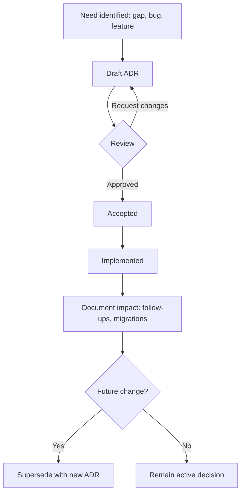

<!-- [KFM_META_BLOCK_V2]
doc_id: kfm://doc/01f467d3-34fd-43d5-a4d6-bdd6be6528d9
title: ADR Index
type: standard
version: v1
status: draft
owners: KFM Maintainers
created: 2026-03-01
updated: 2026-03-01
policy_label: public
related:
  - docs/adr/
tags:
  - kfm
  - adr
  - governance
notes:
  - Canonical index + workflow for Architecture Decision Records.
[/KFM_META_BLOCK_V2] -->

# ADR Index
**Purpose:** A governed, repo-native index of **Architecture Decision Records (ADRs)** for Kansas Frontier Matrix (KFM).


---

## Quick navigation
- [Why ADRs](#why-adrs)
- [When an ADR is required](#when-an-adr-is-required)
- [ADR lifecycle](#adr-lifecycle)
- [ADR registry](#adr-registry)
- [Directory contract](#directory-contract)
- [ADR template](#adr-template)
- [Index maintenance](#index-maintenance)

---

## Why ADRs
ADRs are the **change log of “why”**:
- What we decided
- Why we decided it
- What we didn’t choose (alternatives)
- What it costs us (consequences)
- How we unwind it (rollback plan)

In KFM, ADRs are part of the **trust membrane**: they make changes to invariants auditable and reviewable.

> **Rule of thumb:** If a change could affect *policy enforcement, provenance, identity/versioning, or the truth path*, it deserves an ADR.

---

## When an ADR is required
Create (or update) an ADR when a PR changes any of these **core invariants**:

### Always require an ADR
- **Policy / governance**: labels, obligations, redaction, export rules
- **Identity & versioning**: deterministic IDs, spec hashing, dataset_version_id semantics
- **Catalogs & provenance**: DCAT/STAC/PROV shapes, run receipts, evidence resolution rules
- **Trust membrane boundary**: any way a client could bypass governed APIs to hit storage/indexes directly
- **Promotion contract gates**: what blocks/permits movement RAW → WORK → PROCESSED → CATALOG → PUBLISHED

### Usually require an ADR
- Storage/index selection (e.g., PostGIS vs. other projections)
- Search/tiling/index rebuild strategy
- API contract changes that are not purely additive (breaking, deprecations, auth model changes)
- “Default” choices that could become hidden policy (e.g., “we’ll just store it forever”)

> **PR hygiene:** If a PR touches a core invariant, the PR description should link the ADR in this directory.

---

## ADR lifecycle



**Status values (recommended):**
- `draft` → `review` → `accepted`
- `rejected` (never implemented)
- `superseded` (point to the ADR that replaced it)
- `deprecated` (kept for history; decision no longer applies)

---

## ADR registry

> Keep this table **sorted by ADR number** (ascending), and ensure each ADR filename matches the “ID” column.

| ADR ID | Title | Status | Date | Owners | Links |
|---|---|---:|---:|---|---|
| ADR-0000 | ADR process + indexing baseline | draft | 2026-03-01 | KFM Maintainers | *(this file)* |
| ADR-0001 | *(TBD)* | draft | YYYY-MM-DD | *(TBD)* | ./ADR-0001-<slug>.md |
| ADR-0002 | *(TBD)* | draft | YYYY-MM-DD | *(TBD)* | ./ADR-0002-<slug>.md |

### Suggested tagging (optional, but useful)
Add one or more tags to each ADR (in its MetaBlock notes/tags):
- `policy`, `identity`, `catalog`, `api`, `ui`, `infra`, `storage`, `index`, `security`, `privacy`, `governance`

---

## Directory contract

### Where this fits in the repo
This directory is the **system decision ledger**: it sits alongside other docs and is referenced from PRs that change invariants.

### Expected contents
```
docs/adr/
  INDEX.md                         # This index + process
  ADR-0001-<short-slug>.md          # Individual ADRs
  ADR-0002-<short-slug>.md
  assets/                           # (optional) small diagrams/images used by ADRs
```

### Acceptable inputs
- Markdown ADRs (`.md`) using **KFM MetaBlock v2** (see template below)
- Mermaid diagrams (preferred) or small images in `assets/`
- Short supporting artifacts *directly required* to understand the decision (e.g., API diffs, schema fragments)

### Exclusions
- Secrets, credentials, tokens
- Sensitive coordinates or vulnerable site details (use redacted/coarse descriptions)
- Large binaries, data dumps, or generated artifacts (those belong in governed data zones, not ADR docs)
- “Decision by implication” (i.e., implementing a change without recording the decision)

---

## ADR template

<details>
<summary><strong>Click to expand: ADR markdown template</strong></summary>

```md
<!-- [KFM_META_BLOCK_V2]
doc_id: kfm://doc/<uuid>
title: ADR-XXXX — <Decision title>
type: adr
version: v1
status: draft|review|accepted|rejected|superseded|deprecated
owners: <team or names>
created: YYYY-MM-DD
updated: YYYY-MM-DD
policy_label: public|restricted|...
related:
  - <issue/pr link or kfm:// ids if you use them>
tags:
  - kfm
  - adr
  - <topic tags...>
notes:
  - Scope: <one line>
  - Decision driver: <one line>
[/KFM_META_BLOCK_V2] -->

# ADR-XXXX — <Decision title>

## Context
- What problem are we solving?
- What constraints or invariants apply?
- What is the current state (and why is it insufficient)?

## Decision
State the decision in one sentence.

## Rationale
Why this decision?

## Alternatives considered
- Alternative A — why not?
- Alternative B — why not?

## Consequences
### Positive
- …

### Negative / tradeoffs
- …

## Rollback plan
- How do we undo this safely?
- What would trigger a rollback?
- What data migrations / contract reversions are required?

## Implementation notes
- Expected code locations / contracts touched (avoid hardcoding paths if unstable)
- Compatibility notes, migrations, and test requirements

## References
- Link any relevant specs, policies, contracts, or evidence
```

</details>

---

## Index maintenance

### Minimum “Definition of Done” for this index
- [ ] Every ADR in `docs/adr/` is present in the table above
- [ ] Every ADR has a stable `doc_id` (MetaBlock v2) and a meaningful status
- [ ] Superseded ADRs link to the successor ADR
- [ ] PRs that change core invariants link the ADR in the PR description

### Suggested automation (optional)
If you later add a script, it can:
- list `docs/adr/ADR-*.md`
- parse the MetaBlock for title/status/date
- regenerate the registry table
- fail CI if index is out of sync

---

<a id="top"></a>
**Back to top:** [ADR Index](#adr-index)
